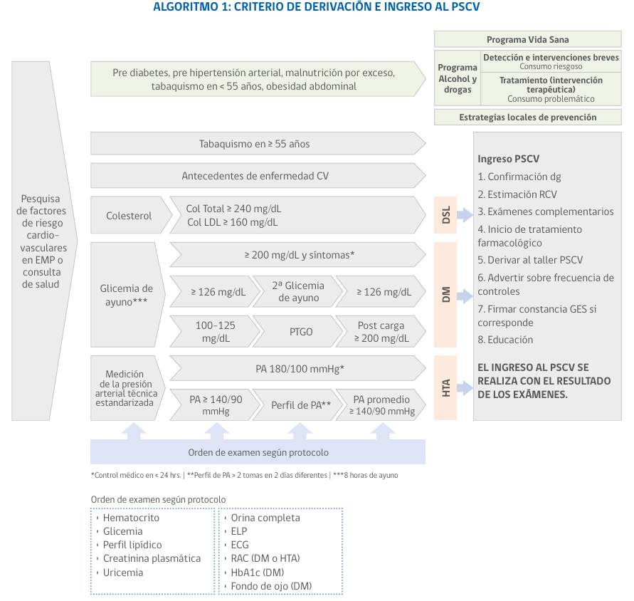
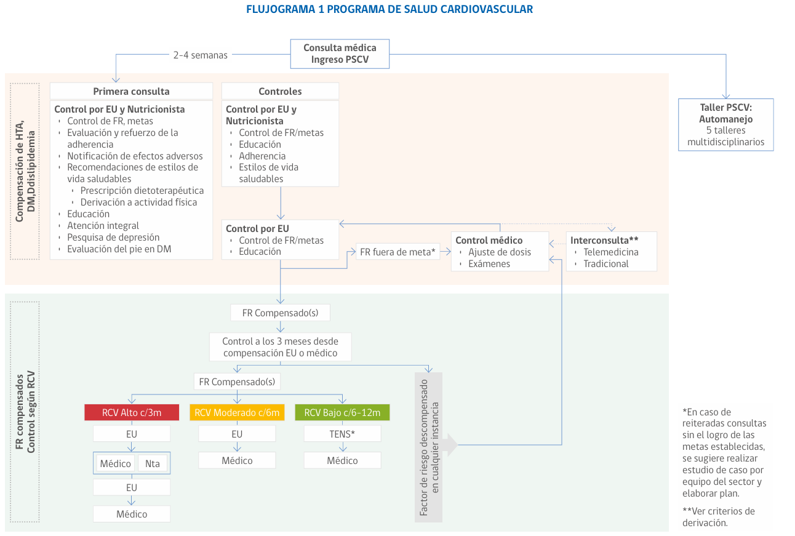
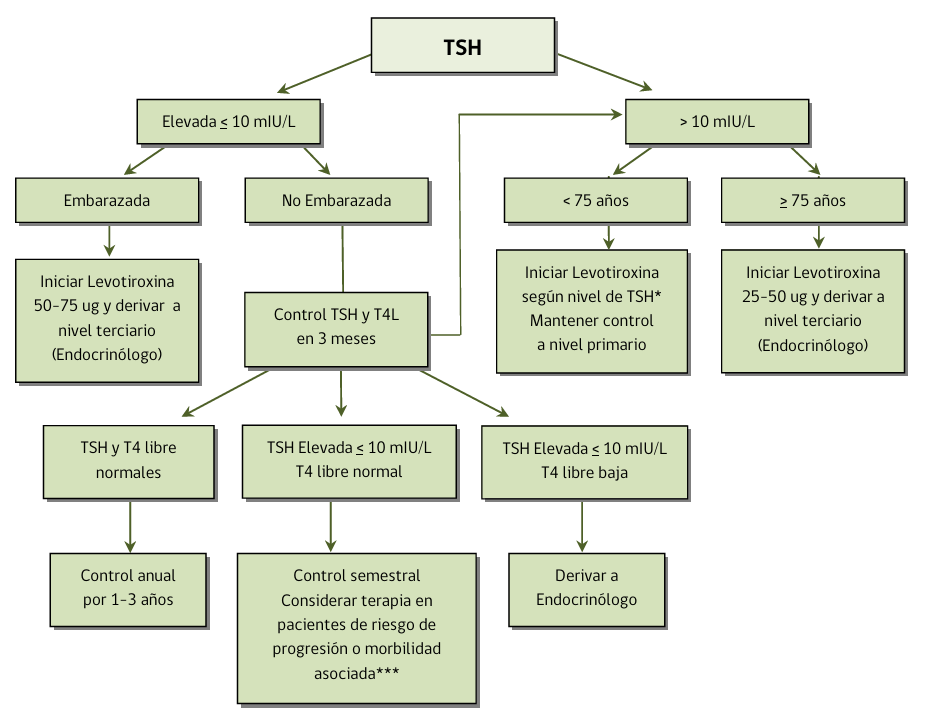

# Programa de salud cardiovascular

## Flujograma ingreso

Síndrome metabólico definido por la presencia de ≥3 criterios: 
- CC ≥90 cm en hombres y ≥80 cm en mujeres, 
- PA ≥130/85mmHg o en tratamiento con antihipertensivos, 
- TG ≥150mg/dL o en tratamiento con hipolipemiantes, 
- HDL< 50mg/dL en mujeres o <40mg/dL en hombres, 
- glicemia de ayuna ≥100mg/dL o en tratamiento

Exámenes al ingreso de PSCV: 
1. Hematocrito
2. Glicemia
3. Perfil lipídico
4. Creatinina plasmática
5. Uricemia
6. Electrolitos plasmáticos
7. Orina completa
8. Electrocardiograma
9. Razón albuminuria creatinuria RAC (en DM e HTA)
10. HbA1c (en DM)
11. Fondo de ojo (DM confirmada)

Todo paciente que ingrese al PSCV debe disponer de los siguientes documentos:
- Formulario de ingreso al programa con todos sus datos y exámenes.
- Exámenes originales de ingreso y perfil de PA, si corresponde.
- Formulario de constancia de información al paciente GES, si corresponde.
- Exámenes complementarios de EMPA/EMPAM, si corresponde

## Flujograma seguimiento

## Diabetes

Metas HbA1c:

# Nefrología

Derivación de pacientes con enfermedad renal crónica (ERC) en atención primaria:
- Si ERC 3a: derivación a med interna
- Si ERC 3b o más: derivación a nefrología

Tabla 3. Criterios de derivación urgente al nefrólogo o al servicio de urgencia

| **Derivación urgente: control por nefrología en ≤ 2 semanas** | **Derivación inmediata al Servicio de Urgencia** |
|---------------------------------------------------------------|---------------------------------------------------|
| Declinación acelerada de la función renal (Enfermedad Renal Rápidamente Progresiva) definida como caída de la VFG de más de un 50% en un plazo de semanas hasta 3 meses asociado o no a: | En caso de VFG < 15 mL/min/1,73 m² asociado a uno o más de los siguientes: |
| - Síndrome nefrótico                                           | - Signos de pre-edema o edema pulmonar            |
| - Síndrome nefrítico                                           | - Potasio mayor o igual a 6,0 mEq/L              |
| - Hipertensión arterial de reciente inicio o empeoramiento de ésta | - Nitrógeno ureico > 100 mg/dL                   |
|                                                               | - Acidosis metabólica grave con volumen extracelular (VEC) expandido |
| Se sugiere control con nefrólogo en plazo ≤ 2 semanas. En el intertanto, controles 3 veces a la semana en atención primaria: | - Natremia menor a 120 mEq/L con VEC expandido   |
| - Buscar signos de edema pulmonar, alteración de conciencia o de uremia (*). |                                                   |
| - Medir presión arterial, creatinina plasmática, electrolitos plasmáticos, bicarbonato venoso y orina completa. |                                                   |

\* **Síndrome urémico**: baja de peso, náuseas, vómitos, palidez, dolor abdominal, sangrado de mucosa, alteración de conciencia.

# Hipotiroidismo

    <table>
    <caption>Control TSH a las 6- 8 semanas para ajustar dosis y lograr 3 mIU/L </caption>
    <tr>
        <th>Valor TSH</th>
        <th>Dosis levotiroxina</th>
    </tr>
    <tr>
        <td>4.5 - 10</td>
        <td>25-50 mcg</td>
    </tr>
    <tr>
        <td>10-20</td>
        <td>50-100 mcg</td>
    </tr>
    <tr>
        <td> > 20 </td>
        <td>1-1.6 mcg/kg</td>
    </tr>
    </table>
    <table>
       <tr>
          <th>Derivación a endocrino</th>
       </tr>
       <tr>
          <td>Adulto > 75 años</td>
       </tr>
       <tr>
          <td>Embarazo (con o sin tratamiento previo)</td>
       </tr>
       <tr>
          <td>Cardiopatía coronaria</td>
       </tr>
         <tr>
             <td>Antecedentes cáncer tiroideo</td>
        </tr>
        <tr>
            <td>Sospecha hipotiroidismo secundario</td>
        </tr>
        <tr>
            <td>Insuficiencia cardíaca</td>
        </tr>
        <tr>
            <td>Sospecha clínica o de laboratorio de hipotiroidismo severo</td>
        </tr>
        <tr>
            <td>Mantención TSH elevada pese a terapia adecuada, en 2 controles</td>
        </tr>
        <tr>
            <td>Bocio persistente</td>
        </tr>
        <tr>
            <td>Nódulo palpable</td>
        </tr>
        <tr>
            <td>Uso de amiodarona o litio</td>
        </tr>
    </table>
    <table>
       <tr>
          <th>Pacientes en riesgo de progresión o morbilidad asociada: </th>
       </tr>
       <tr>
          <td>Anticuerpos Anti TPO (+)</td>
       </tr>
         <tr>
             <td>Bocio</td>
        </tr>
        <tr>
            <td>Mujer con deseo embarazo</td>
        </tr>
        <tr>
            <td>Infertilidad</td>
        </tr>
        <tr>
            <td>Depresión</td>
        </tr>
        <tr>
            <td>LDL elevado</td>
        </tr>
        <tr>
            <td>Trastornos cognitivos no demenciantes</td>
        </tr>
    </table>

