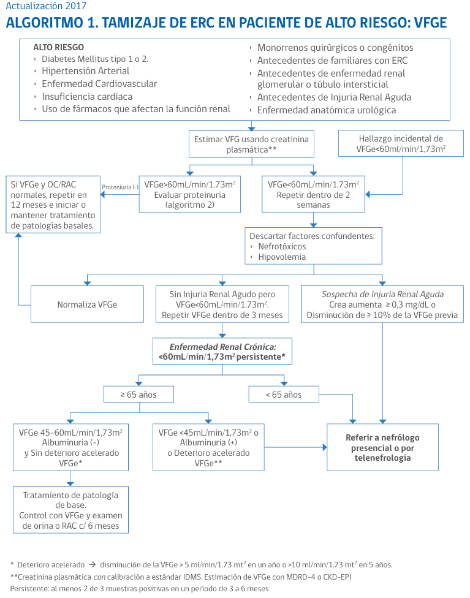
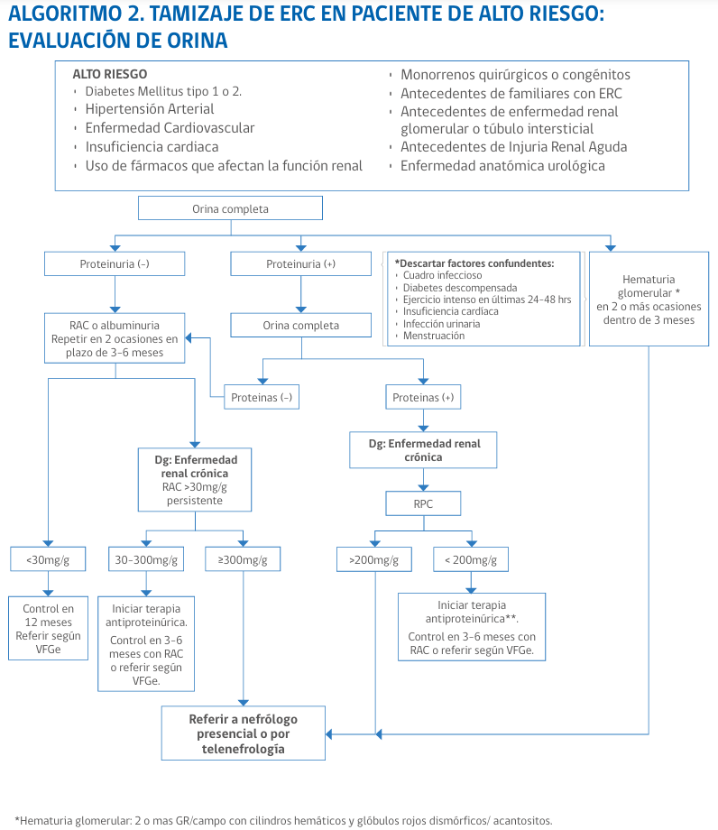

# Nefrología

# Tabla 3. Criterios de derivación urgente al nefrólogo o al servicio de urgencia

| **Derivación urgente: control por nefrología en ≤ 2 semanas** | **Derivación inmediata al Servicio de Urgencia** |
|---------------------------------------------------------------|---------------------------------------------------|
| Declinación acelerada de la función renal (Enfermedad Renal Rápidamente Progresiva) definida como caída de la VFG de más de un 50% en un plazo de semanas hasta 3 meses asociado o no a: | En caso de VFG < 15 mL/min/1,73 m² asociado a uno o más de los siguientes: |
| - Síndrome nefrótico                                           | - Signos de pre-edema o edema pulmonar            |
| - Síndrome nefrítico                                           | - Potasio mayor o igual a 6,0 mEq/L              |
| - Hipertensión arterial de reciente inicio o empeoramiento de ésta | - Nitrógeno ureico > 100 mg/dL                   |
|                                                               | - Acidosis metabólica grave con volumen extracelular (VEC) expandido |
| Se sugiere control con nefrólogo en plazo ≤ 2 semanas. En el intertanto, controles 3 veces a la semana en atención primaria: | - Natremia menor a 120 mEq/L con VEC expandido   |
| - Buscar signos de edema pulmonar, alteración de conciencia o de uremia (*). |                                                   |
| - Medir presión arterial, creatinina plasmática, electrolitos plasmáticos, bicarbonato venoso y orina completa. |                                                   |

\* **Síndrome urémico**: baja de peso, náuseas, vómitos, palidez, dolor abdominal, sangrado de mucosa, alteración de conciencia.
