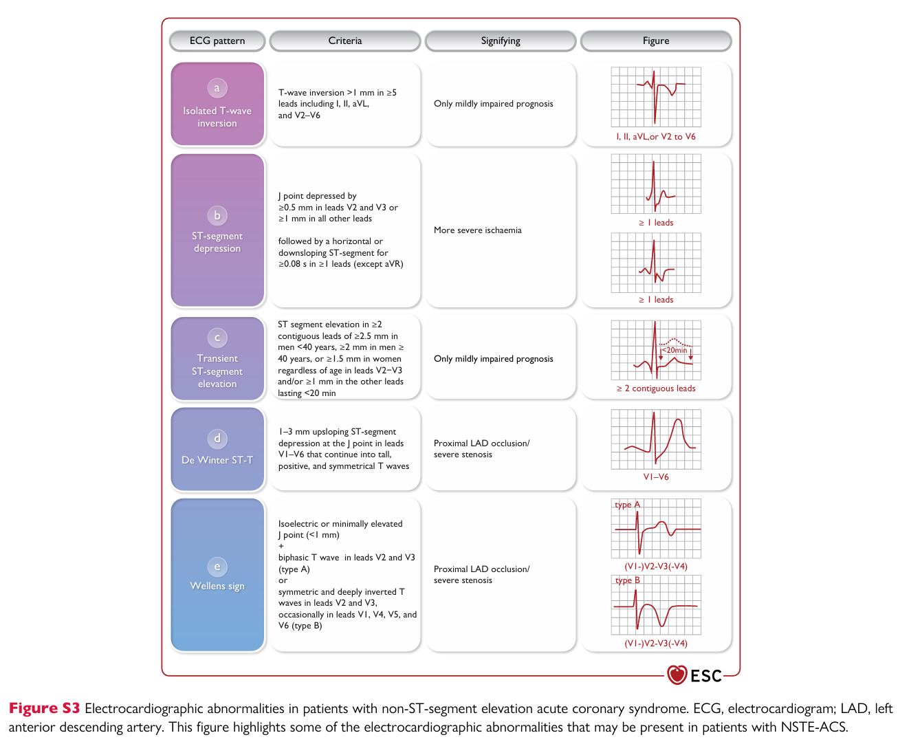
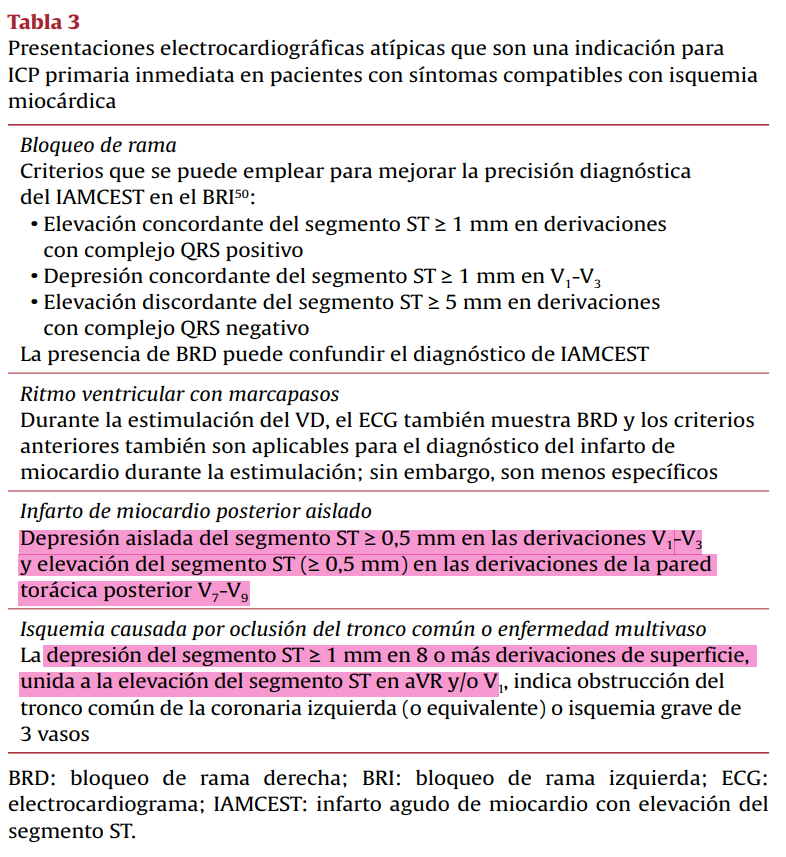
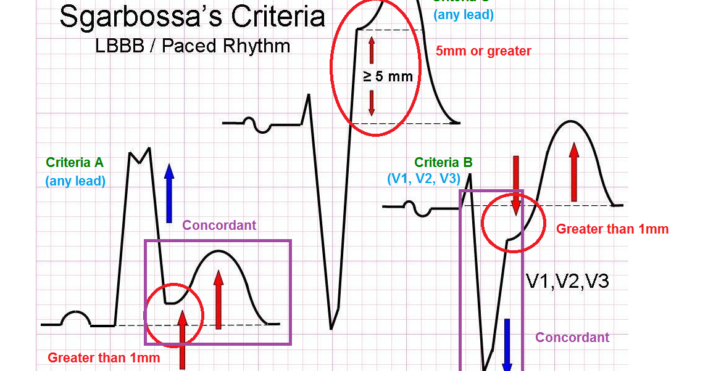
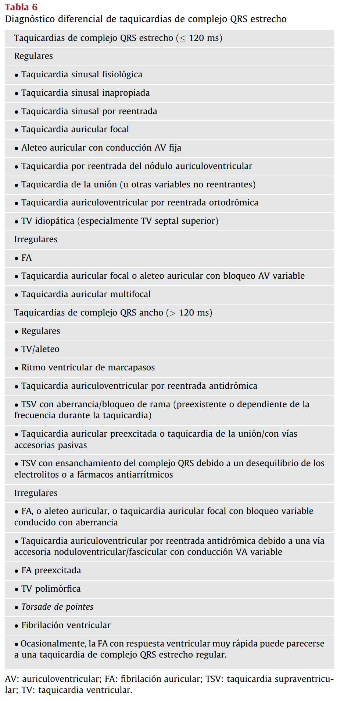
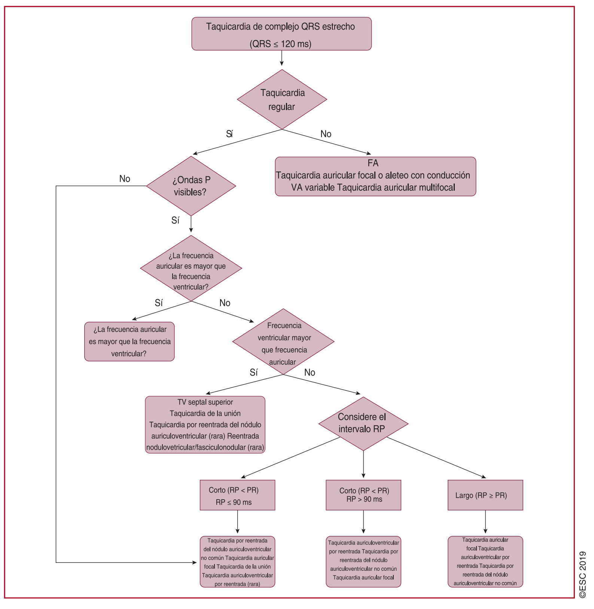
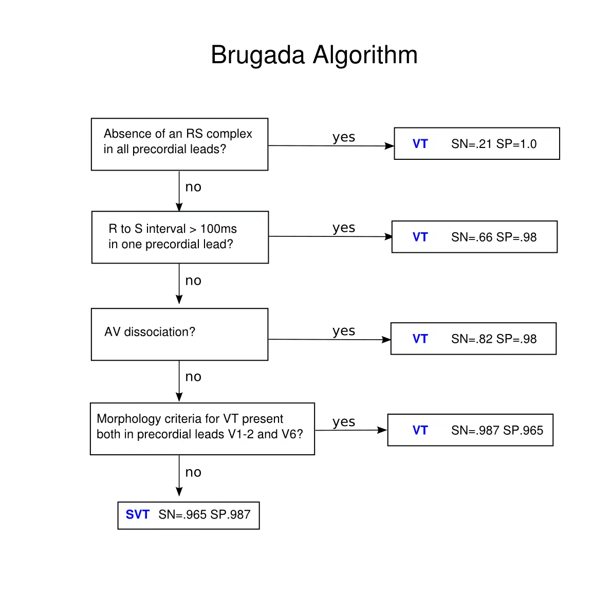

# Criterios más importantes ECG

## Valores normales ECG:

| Parámetro | Valor |           | Nº cuadros grandes | FC |
|-----------|-------| -         |:------------------:|:--:|
| FC        | 60-100 lpm |      | 1   | 300 |
| P        | < 0.12 s y < 0.25 mV| | 2   | 150 |
| PR        | 120-200 ms |      | 3   | 100 |
| QRS       | < 120 ms |        | 4   | 75 |
| QT        | < 440 ms |        | 5   | 60 |
| QTc       | < 460 ms |        | 6   | 50 |

Cálculo de QTc: 

$ QTc = \frac{QT [ms]}{\sqrt{RR [s]}} $

**importante unidad QT en ms y RR en segundos**

Cálculo FC:

$$ FC = \frac{60}{RR [s]} $$

$$ FC = \frac{300 (=1')}{nº cuadros\ grandes\ (CG)\ entre\ RR} $$

$$ FC = \frac{300 (=1')}{nº CG + 0.2*C_{pequeños}} $$
- Si ritmo irregular, contar en 6 segundos (30 cuadros grandes) y multiplicar por 10. 

## SCA
Supradesnivel ST: >1mm en cualquier derivada, salvo V2 y V3
Infradesnivel ST: > 0.5mm en cualquier derivada, salvo V2 y V3 (donde es >1mm)

Tabla valoración supradesnivel en V2 y V3:
| Hombre < 40 años | Hombre > 40 años | Mujer |
|------------------|------------------|-------|
| >2.5mm           | >2mm             | >1.5mm|

Inversión onda T: 
-  inversión de la onda **T > 1 mm** en 2 derivaciones contiguas con onda R prominente o cociente **R/S > 1**

Criterios de Barcelona para diagnóstico de infarto agudo de miocardio (IAM) en pacientes con BCRI:
- concordancia de polaridad QRS con desnivel ST en V1-V3

### Paredes del corazón

Ojito: dominancia 

### Alteraciones en ECG en SCA 

Cuando pedir otras derivadas.
- infradesnivel ST en V1-V3 (sospecha de **infarto posterior**): derivadas posteriores (V7-V9). 
   - SDST en V7 a V9 debe ser >= a 0.5 mm -> reperfusión urgente
- supra ST en **pared inferior** (II, III, aVF): derivadas derechas (V3R-V6R)
   - ojo infarto VD con hipotensión arterial e ingurgitación yugulares

BCRI no es criterio de SCA. En BCRI suele haber un supradesnivel ST en V1-V3. Para valorar si es IAM, revisar criterios de Sgarbossa. Si aparece BCRI posterior a reperfusión. Según código de IAM minsal, BCRI nuevo puede considerarse IAM CEST

Ojito: con reperfusión efectiva se puede dar un trazado con BCRI (ritmo idioventricular acelerado???) 

Enfermedad multivaso

- infradesnivel ST > 1mm en >= 8 (o 6) derivadas
- supradesnivel ST en aVR o V1

Síndrome de Wellens  (sugiere estenosis severa de ADA):
- T negativa y simétrica en V1,V2,V3,V4,V5 y/o V6 
- T bifásica en V2 y V3

### Infarto previo

## Dx Taquicardias según duración QRS y regularidad del ritmo

### Pasos para evaluar una TC QRS angosto 
1) Regularidad
2) Ondas P presentes y morfología:
   - normales: taquicardia sinusal
   - Similar a ritmo sinusal: sinusal, atrial, reentrada sinoatrial, foco ectópico cercano a nodo sinusal 
   - Ondas P anormales no retrogradas: taquicardia atrial (a veces AVRT)
   - P retrograda (+ en aVR, - en II, III, aVF): AVNRT, AVRT, taquicardia de la unión
3) Intervalo RP: 
   - **corto (<70-90 ms)** -> AVNRT, 
   - largo -> P retrograda AVNRT o AVRT *atípica*, P anormal taquicardia **atrial**

4) otros:  
   - Alternancia eléctrica: retrada auriculo ventricular, si no (todos misma altura) reentrada AVNRT
5) Respuesta a adenosina
   - Si se para definitivamente: AVNRT, AVRT ortodrómica, reentrada nodo sinusal
   - disminuye FC, luego vuelve a aumentar: sinusal, atrial, de la unión
   - Persiste: flutter, micro reentrada, taquicardia ventricular, auricular focal

## Taquicardia ventricular vs taquicardia supraventricular con conducción aberrante

https://litfl.com/vt-versus-svt-ecg-library/

| Criterio | TV | SV con conducción aberrante |
|----------|----|-----------------------------|
| Morfología QRS | Complejo ancho | Complejo estrecho |
| Eje QRS | Desviación izquierda o derecha | Normal |
| Ritmo | Regular | Regular |
| FC | 100-250 lpm | 150-250 lpm |
| Ondas P | No visibles | Visibles |

Criterios de Brugada y Vereckei para diferenciar taquicardia ventricular de taquicardia supraventricular con conducción aberrante:

|  |  |
|-----------------------------------|------------------------------------|

## Criterios de hipertrofia ventricular izquierda (HVI)

Índice de Sokolow-Lyon: S en [V1] + R en [V5 o V6] > 35 mm

|Criterio | Cálculo | Valor |
|---------|---------|-------|
|Sokolow-Lyon | S en [V1] + R en [V5 o V6] | > 35 mm |
|Lewis | S en [V1] + R en [V6] | > 25 mm |
|Cornell | S en [V3] + R en [aVL] | > 28 mm (mujer) o > 20 mm (hombre) |

-------------
Una cosita linda: 

