# CIRUGÍA GENERAL:
## Realiza Asepsia y antisepsia 
## Reconoce conceptos generales de manejo de drenajes y curación de heridas
## Estudio de Abdomen agudo 
## Reconoce manejo post operatorio de Hernias de la pared abdominal y Eventraciones.
## Reconoce manejo de obstrucción Intestinal de intestino delgado y grueso
## Reconoce complicaciones postoperatorias frecuentes

# CIRUGÍA DIGESTIVA
## Diagnóstico y generalidades del manejo Perforación Esofágica - Mediastinitis
## Maneja generalidades en patología de esófago - estómago - duodeno.
## Diagnóstico, estudio y generalidades del manejo de cáncer del Esófago y gástrico. Cáncer de Vesícula y Vías Biliares Cáncer de Páncreas; tumores periampulares y tumores hepáticos. 
## Diagnóstico y manejo general de Acalasia
## Diagnóstico y manejo de Síndrome de Reflujo Gastroesofágico 
## Patológico y Hernia hiatal
## Diagnóstico y manejo Ulcera Péptica Gástrica y Duodenal. 
## Diagnóstico y manejo general de Tumores Gástricos Benignos. 
## Diagnóstico, manejo completo de Hemorragia Digestiva Alta y baja; Colelitiasis, Colecistitis Aguda y Crónica; Coledocolitiasis; Ictericia Obstructiva; Colangitis; Pancreatitis aguda y sus complicaciones.

### Colelitiasis

Factores de riesgo: 
5F
- **fair**: more prevalent in the Caucasian population 1
- **fat**: BMI >30 kg/m2 and hyperlipidemia 3,4
- **female**
- **fertile**: one or more children
- **forty**: age ≥40 years
    - cholelithiasis can occur in young patients with a positive family history; in such cases, the '**familial**' factor can substitute for the 'forty' factor 2

## Diagnóstico y manejo inicial de Quistes y Abscesos Hepáticos e Hidatidosis Hepática;
## Diagnóstico y manejo general de Fístulas del Intestino Delgado. 
## Manejo completo de Ileostomías y Colostomías Megacolon 
## Diagnóstico y manejo completo de enfermedad Diverticular y sus complicaciones 
## Manejo quirúrgico de Enfermedades inflamatorias: Colitis Ulcerosa, Crohn. 
## Diagnóstico y manejo Pólipos y cáncer de Colon recto y Ano.
## Diagnóstico y manejo inicial Prolapso Rectal 
## Diagnóstico y manejo lesiones ActínicasAnorectales. 
## Diagnóstico y manejo completo de Patología ano-rectal Benigna: Hemorroides, Fisura anal, Abscesos anorectales, Fístulas, Venéreas. 
## Diagnóstico y manejo de Enfermedad pilonidal
## Diagnóstico y manejo de Urgencias Ano-Recto-Colónicas. 
## Manejo quirúrgico de Obesidad Mórbida 

# CIRUGIA DE TORAX: 
## Evaluación pre y postoperatoria 
## Diagnóstico y manejo inicial Síndrome de ocupación pleural 
## Empiema pleural Hidatidosis pulmonar 
## Tumor pulmonar y nódulo solitario 
## Manejo de hemoptisis masiva 
## Indicaciones y manejo de traqueostomía
## Hernias diafragmáticas traumáticas y congénitas 
## Patología del mediastino. 
## Cáncer pulmonar 
## Mesotelioma

# VASCULAR PERIFÉRICO: 
## Insuficiencia Arterial Aguda: Embolia, Trombosis 

6 P:
- Pain (lo más precoz)
- Pulseless
- Pale
- Poiquilotermia: La extremidad afectada suele estar fría. La obstrucción causa una importante alteración de la termorregulación local, llevando a que la extremidad adopte la temperatura ambiente a la que está expuesta
- Parestesia (primero hiperestesia del primer espacio metatarsiano)
- Parálisis: tardío. 1° se afecta compartimento anterior (dorsiflexión hallux).

Clasificación Rutherford para Isquemia agua EEII

| Grado | Interpretación | Pérdida Sensorial | Debilidad Muscular | Doppler arterial | Doppler venoso |
|-------|----------------|-------------------|--------------------|------------------|----------------|
| I | Viable | Ninguna | Ninguna | Audible | Audible |
| IIa | Amenaza marginal | Mínima | Ninguna | Inaudible | Audible |
| IIb | Amenaza inmediata | Sobrepasa los pies, asociado con dolor de reposo | Leve a moderada | Inaudible | Audible |
| III | Irreversible | Profunda anestesia | Profunda, parálisis | Inaudible | Inaudible |

Grado IIb tiene alteración motora!!! Se debe revascularizar en plazo de horas.

Estudio a solicitar:
1. Angio TC (mayor utilidad en suprapoplíteo)
2. Eco Doppler
3. (Angiografía)
4. Ecocardio TT y/o TE (si sospecha embolia)

Manejo inicial:

1. **Analgesia** y estabilización:
    - Posición de fowler, **fluidos** (y monitorización función renal, HE) y búsqueda Rabdomiolisis 
2. **Anticoagulación** con HNF (porque puede requerir cx):
    - HNF 80 UI/kg EV en bolo, luego 18 UI/kg/h

Cmplx post-reperfusión:
- Rabdomiolisis: elevación CK, mioglobinuria, AKI, HiperK, Hiperfosfemia, hipercalcemia.
- Sd reperfusión: aumento permeabilidad prots en capilares, aumento presión intersticial --> síndrome compartimental. Mayoría pacientes need fasciotomía 
- Cardiovasculares: IAM, Arritmias, etc.

## Insuficiencia Arterial Crónica: Oclusión aorto-iliaca, Oclusión femoro-poplítea, patología carotídea

Interpretación Indice tobillo brazo:
| valor | interpretación |
|-------|----------------|
| >1.4 | calcificación |
| 0.9 - 1.4 |  normal |
| 0.71-0.9 | disminución de flujo leve|
| 0.41-0.7 | disminución de flujo moderada |
| 0-0.4 | disminución de flujo severa |

Lectura EVNI:
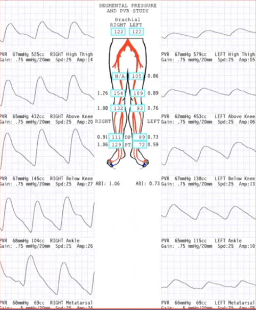

1. Comprar presiones braquiales (si diferencia mayor a 10 mmHg, sospechar patología "central")
2. Presiones segmentarias (sistólica): 
    - Diferencia entre miembros al mismo nivel: >30 mmHg
    - Disminución > 20 mmHg de proximal a distal
3. índice segmentario-braquial:
    - disminución de proximal a distal >0.15
4. Índice tobillo brazo: 
    - normal: [0.9, 1.4[
    - si >= 1.4, ojo calcificación DM y ERC, evaluar índice dedo-brazo: 
        - < 0.7 es anormal
> nota: presión >30 mmHg en dedo pie es necesaria para curación. DM puede necesitar más de 45-50 mmHg
5. PVR (Pulse Volume Recording): No se afecta por calcificación
    - normal: 1-1.2
    - si < 0.5, ojo isquemia crítica

Clasificación Rutherford para EAO:

| Grado | Clínica | Tratamiento |
|-------|---------|-------------|
| 0 | Asintomático | Control FR |
| 1 | Claudicación leve | Control FR |
| 2 | Claudicación moderada | Control FR |
| 3 | Claudicación severa| Control FR |
| 4 | Dolor en reposo | Isquemia crítica  derivar|
| 5 | Pérdida menor de tejido | Isquemia crítica  derivar|
| 6 | Pérdida mayor de tejido | Isquemia crítica  derivar|

Si Isquemia crítica, ITB <0.4 o claudicación que impide realización de actividades diarias, derivar a cirugía vascular.

Escenarios EAO:
1. Paciente discretamente discapacitado por claudicación intermitente: tratamiento **médico** de las comorbilidades, cesación del hábito tabáquico, rehabilitación de la marcha y uso de cilostazol logran aumento en la distancia de libre de claudicación.
2. Paciente severamente limitado por claudicación, con extremidad no amenazada en su vitalidad: **intensificar el manejo conservador**. Solo el 5% de los claudicadores pasan a isquemia crítica. Es necesario ponderar con el paciente los beneficios de la revascularización quirúrgica en comparación a los riesgos en morbimortalidad inherentes a estos procedimientos.
3. Paciente con isquemia critica: está indicada la revascularización quirúrgica lo antes posible. Son pacientes con dolor de reposo, necrosis parcial o avanzada, o con ulceras isquémicas, capaces de tolerar procedimientos quirúrgicos y con posibilidad de rehabilitación. 
4. Paciente con isquemia critica con baja probabilidad de recuperación y/o gangrena  de la extremidad con o sin infección asociada: salvo excepciones, la elección es la amputación. En general, son pacientes con estado de salud deteriorado, con mala tolerancia a procedimientos quirúrgicos, con lesiones extensas, anticipando mal resultado a la revascularización

Qué hacer en APS:

Hábitos de vida:
1. Ejercicio físico 30-45 minutos, 3-4 veces por semana, durante 3 meses.
2. Tabaquismo Cese del hábito

Comorbilidades:

3. Dislipidemia: Uso de estatinas Colesterol LDL < 70mg/dL
4. Hipertensión Arterial: Uso de antihipertensivos orales; idealmente IECA o ARAII. Mantener cifras menores a 140/90 mmHg (130/80 mmHg si paciente es diabético o padece otra condición de riesgo). 
5. Diabetes Mellitus Control metabólico según esquemas.

Fcos:

6. Antiagreción plaquetaria: Uso de aspirina (clopidogrel mejores resultados).
7. Cilostazol 100mg dos veces al día (más para terciara porque se puede retirar eventualmente luego de rehabilitación)

### Manejo Isquemia crítica EEII

DERIVAR!!!

Manejo inicial:

Dolor de reposo:
1. Higiene diaria agua y jabón, correcto secado (sobre todo entre dedos). Humectación piel con vaselina. 
2. Prevenir nuevas lesiones:  no recortar callos ni limar la piel, vigilar que calcetines y calzado no tengan imperfecciones. 
3. Dolor: Paracetamol + opiáceos.

Lesión:
1. Necrosis seca sin rotura del borde que limita con el tejido vivo: iguales a los cuidados descritos, además se debe pintar con povidona yodada la lesión y dejar secar, de esta forma no se humedece ni se infecta, mantener cubierta la lesión para evitar contaminación.
2. Necrosis seca con área húmeda en el borde con el tejido vital: no se debe mojar, curaciones con suero fisiológico para mantener la herida limpia, no debridar tejido porque no cicatrizaría y aumentaría de tamaño. Antibióticos de amplio espectro si hay signos de infección, mantener herida cubierta. 
3. Gangrena húmeda o absceso: requerirá de cirugía para aseo, para evitar progresión de la infección, antibióticos y curaciones. 

## Pie Diabético. 

Fisiopato: Neuropatía + Isquemia + Infección.

### Clínica

Neuropatía (en orden de compromiso):
- **autonómica** (shunts microcirculación + pérdida reflejo nociceptivo): alteración piel y fanereos 
- **sensitiva**: úlceras indoloras
- **motora**: atrofia musculatura intrínseca --> pie en garra con prominencia cabeza metatarsianos

Isquemia: 
- ateroesclerosis (predominio **tibial** e infragenicular, conservación en pies)
 
 (**amputación** antes de revascularización: 
        - Pacientes ancianos (relativo), **postrados**, con flexión rígida de la extremidad y que no tengan expectativa de rehabilitación.
        - Pacientes con cáncer con **corta expectativa** de vida.
        - Pacientes con **lesiones necróticas extensas** del pie.
 )

Infección:
- úlcera es puerta de entrada, isquemia retarda cicatrización e hiperglicemia disminuye respuesta inmune

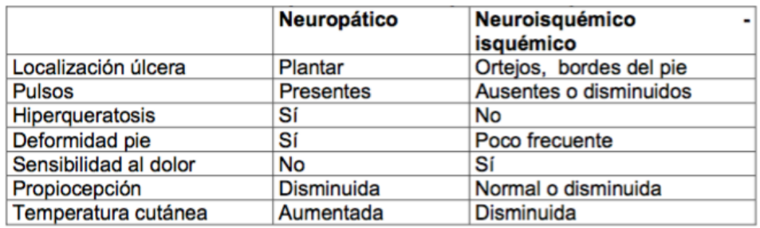

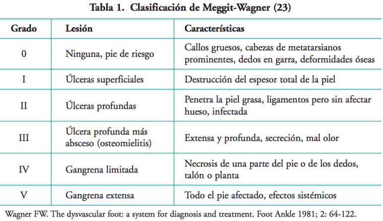
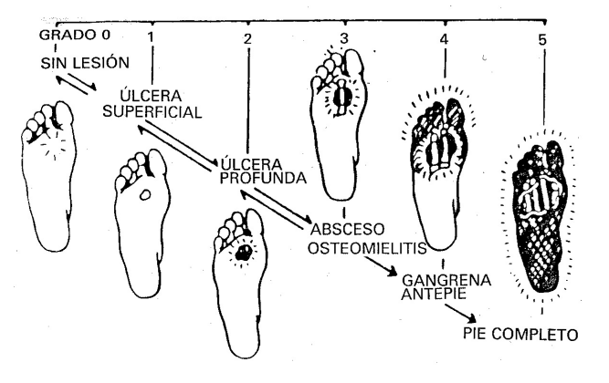

Clasificación infección:
- extremidad sin riesgo: hasta tendones, escasos signos de infección sistémica. Por Staphylococcus, puede tener gram (-)
- extremidad con riesgo: profudas, tendones, hueso o articulaciones, en las cuales se asocia necrosis. Sg sistémicos infección. Estáfilos, E. coli, proteus. Anaerobios asociados a inf más severas

### Estudio
Estudio:
- **Rx** pie: si sospecha infección, buscar gas, cuerpos extraños, compromiso óseo o líquido articular.
- Cintigrama oseo: en infecciones precoces puede dar falsos (-), baja especificidad
- **(angio)TAC** y (angio)RMN: para evaluar extensión de infección y compromiso óseo, no muy disponibles
- **EVNI**: 
    1. Medición presiones segmentarias
    2. Curva doppler: grado de pérdida de elasticidad arterial, su amplitud y resistencia
    3. Registro de volumen de pulso: refleja volumen de sangre
    4. Fotopletismografía: refleja volumen de GR 
- Eco Doppler (Duplex): anatomía y morfología de las curvas. Especialmente útil en estudio pre reconstrucción arterial y seguimiento post ésta.
- Angiografía: planificar revascularización.

### Tratamiento
- Prevención: control FR, podoterapia, educación, tto fisioterapéutico (Plantillas, zapatos especiales, yeso no removible, ortesis, etc)
- ATB: empírico, luego ajustar. Considerar S. aureus y Streptococcus sp
    - inf leves (10 a 14 días): **Cefalosporinas de 1ra generación, Clindamicina, Amoxicilina/Ac clavulánico**, Ampicilina/Sulbactam. Ciprofloxacino, levofloxacino, moxifloxacino.
    - inf con amenaza amputación (14 a 21 días o más): **Cefalosporina 3ra generación + metronidazol o Clindamicina**, quinolona + Clindamicina, Ampicilina/Sulbactam, Piperacilina/Tazobactam, Quinolonas + Metronidazol. Considerar Vancomicina en IAAS o cultivo (+) para SAMR.

- Siempre drenajes colecciones/abscesos y descartar compromiso óseo
- Curaciones avanzadas

Si signos infección sistémica o compromiso profundo:
- hospitalizar, ATB, establecer estado vascular para definir tto 
    - buena perfusión: Aseo qx (drenaje, debridamiento, amputación)
    - deficiente perfusión: Si need desfocar que sea conservador, estudio vascular (EVNI/angiografía), reconstrucción arterial (bypass, angioplastía,...) 

Complementarias: 
- F crecimiento
- Oxígeno hiperbárico

Prevención secundaria: realizar plantilla o zapato según new biomecánica (fisiatra?)

## Aneurismas de aorta, femoral y poplíteo

## Fístulas arteriovenosas

## Insuficiencia Venosa Crónica, Varices. 

### Síndrome Post Flebítico. 

Def: formación de varices secundaria a TVP previa

### complicaciones varices

#### Varicorragia
Corresponde a la hemorragia localizada en una várice. Su tratamiento consiste en la compresión localizada y elevación de la extremidad hasta el cede del sangrado. 
 
#### Úlcera varicosa
El pilar del tratamiento, además de las curaciones seriadas, corresponde al uso de soporte de alta compresión (40 mmHg). 
 
#### Eczema cutáneo
Se maneja con lubricación e higiene cutáneo.

#### Varicoflebitis
También denominada **trombosis venosa superficial**. Su diagnóstico clínico debe ser confirmado con ecodoppler venoso de EE.II. para descartar una trombosis venosa profunda y evaluar la extensión del trombo, dado que si es 

- \> 5 cm, requiere de anticoagulación completa por 4 a 6 semanas mientras que si es 
- < 5 cm, requiere solo manejo sn

## Trombosis venosa profunda y Tromboflebitis (TVS)

### TVP
Score de Wells para TVP
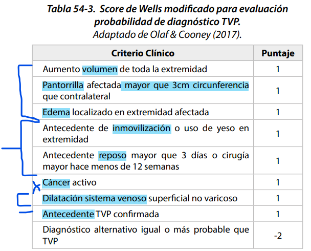

0-1: Riesgo bajo de tvp

2 o más: alto riesgo de tvp

Score de Wells para TEP
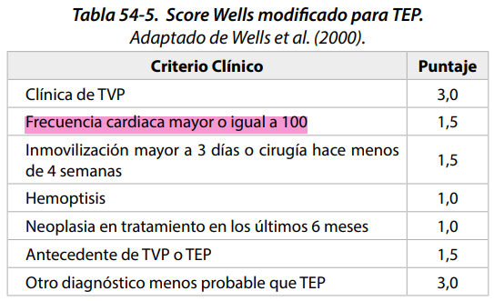

0-4: poco probable

5 o más: TEP probable

Sg y Sn de TEP (lo más frecuente disnea y taquicardia)

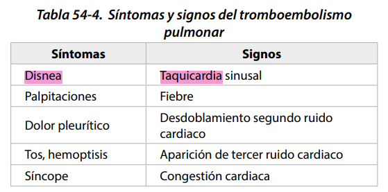

FR comunes para ambas:

Los FR alteran la triada de Virchow: **estasia sanguínea, lesión endotelial y hipercoagulabilidad.**

| Modificables  | No modificables |
|---------------|-----------------|
| Neoplasia maligna | Edad |
| Cirugía | Sexo |
| Trauma | Antecedente de ETV |
| Embarazo | Grupo Sanguíneo |
| Uso de ACO y TRH | Trombofilia hereditaria |
| Obesidad | Otras enfermedades crónicas y/o congénitas. |
| Insuficiencia Cardiaca, EPOC | | 
| Factores de riesgo cardiovascular | |
| Fármacos | |

| triada de Virchow | Modificables | No modificables |
|------------------|--------------|-----------------|
| hipercoagulabilidad | Neoplasia maligna, Uso de ACO, TRH y otros fcos, Obesidad, Insuficiencia Cardiaca, EPOC, Factores de riesgo cardiovascular| Trombofilia hereditaria, Otras enfermedades crónicas y/o congénitas. |
| lesión endotelial | Cirugía, Trauma, Embarazo | Edad, Sexo |
| estasis sanguínea | Cirugía, Trauma, poca movilidad | ¿antecedente de ETV? |

Criterios diagnósticos de TVP en eco: 
- ecogenicidad intraluminal venosa, 
- aumento del diámetro venoso
- **pérdida de la compresibilidad venosa**, 
- ausencia de flujo espontáneo, 
- ausencia de aumentación del flujo venoso a la compresión distal.
### TVS

Asociaciones con otras patologías:
- Ca páncreas: un cuadro recurrente en diferentes sitios, conocido como **tromboflebitis migratoria**, representa un fenómeno paraneoplásico que particularmente se asocia al cáncer de páncreas. 
- Ca mama: la TVS en la mama, conocida como Enfermedad de Mondor, está asociada al cáncer de mama

Conducta: solicitar eco para explorar TVS y TVP.

Hallazgos ecográficos TVS:
- Trombo afecta a las venas perforantes
- TVS a menos de 3 cm de la unión safeno-femoral
- Trombo mayor a 5 cm

Manejo:
- < 5 cm AINES o analgesia VO repetir eco en 7 a 10 días
- \> 5 cm: Anticoagulación "profiláctica?"  y derivar

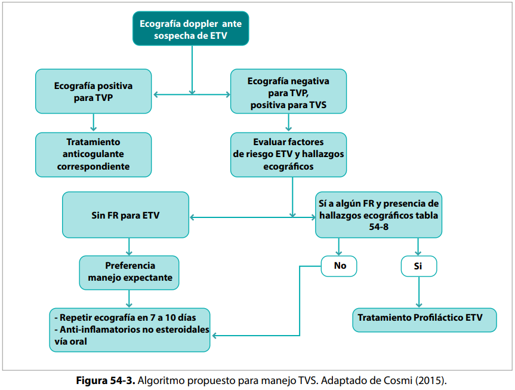

Tto anticoagulante vs tromboprofilaxis

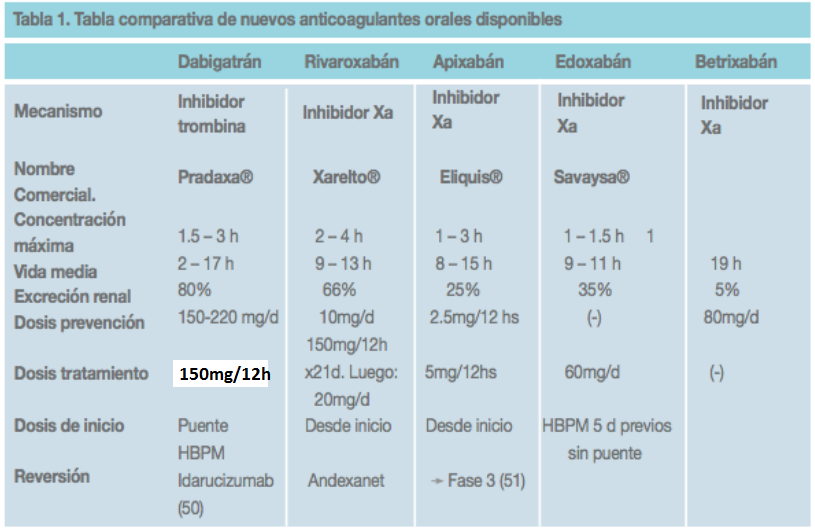

Esquema ajuste warfarina

<table cellspacing="0"><tbody> <tr> <td class="subtitle1">Day</td> <td class="subtitle1">INR</td> <td class="subtitle1">Warfarin dose (mg)</td>
 </tr> 
<tr class="divider_bottom centered"> <td>1</td>
 <td>&nbsp;</td>
 <td>5</td>
 </tr> 
<tr class="divider_bottom centered"> <td>2</td>
 <td>&nbsp;</td>
 <td>5</td>
 </tr> 
<tr class="centered"> <td class="divider_bottom" rowspan="4">3</td>
 <td>&lt;1.5</td>
 <td>10</td>
 </tr> 
<tr class="centered"> <td>1.5-1.9</td>
 <td>5</td>
 </tr> 
<tr class="centered"> <td>2-3</td>
 <td>2.5</td>
 </tr> 
<tr class="divider_bottom centered"> <td>&gt;3</td>
 <td>0</td>
 </tr> 
<tr class="centered"> <td class="divider_bottom" rowspan="4">4</td>
 <td>&lt;1.5</td>
 <td>10</td>
 </tr> 
<tr class="centered"> <td>1.5-1.9</td>
 <td>7.5</td>
 </tr> 
<tr class="centered"> <td>2-3</td>
 <td>5</td>
 </tr> 
<tr class="divider_bottom centered"> <td>&gt;3</td>
 <td>0</td>
 </tr> 
<tr class="centered"> <td class="divider_bottom" rowspan="3">5</td>
 <td>&lt;2</td>
 <td>10</td>
 </tr> 
<tr class="centered"> <td>2-3</td>
 <td>5</td>
 </tr> 
<tr class="divider_bottom centered"> <td>&gt;3</td>
 <td>0</td>
 </tr> 
<tr class="centered"> <td rowspan="4">6</td>
 <td>&lt;1.5</td>
 <td>12.5</td>
 </tr> 
<tr class="centered"> <td>1.5-1.9</td>
 <td>10</td>
 </tr> 
<tr class="centered"> <td>2-3</td>
 <td>7.5</td>
 </tr> 
<tr class="centered"> <td>&gt;3</td>
 <td>0</td>
 </tr> </tbody></table>

## Úlceras de extremidades inferiores (venosas, varicosas, etc.)

## Enfermedad Tromboembólica

## Isquemia mesentérica aguda 

## Enfermedad renovascular

## Insuficiencia cerebro vascular

# PATOLOGÍA MAMARIA 
Estudio, diagnóstico y manejo del paciente con patología mamaria.
Tumores benignos y malignos
Patología inflamatoria infecciosa y no infecciosa mamaria.

# CIRUGÍA PLÁSTICA Y REPARADORA 

## Quemaduras y Secuelas 

### Diagnóstico
#### extensión de las quemaduras
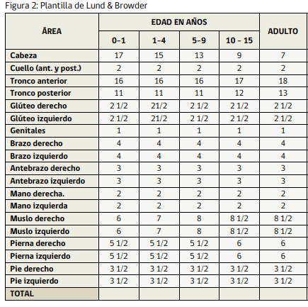

#### profundidad de las quemaduras

Benaim
| tipo | descripción | histología  | tratamiento |
|------|-------------|-------------|-------------|
| A | Flictenas; color rojo; turgor normal.Apariencia de quemadura de sol.Dolor intenso. | epidermis |  Debería curar espontáneamente en 7 días sin secuelas. |
| AB-A | Color rosado, homogénea; llene capilar normal; dolor; humedad; **folículos pilosos intactos**| epidermis y dermis superficial | Debería epidermizar espontáneamente en 15 días con secuelas estéticas. Si se complica puede profundizarse. | 
| AB-B | Color moteado o blanco, **retraso o ausencia de llene capilar**; **folículos pilosos no intactos** | Epidermis y dermis papilar y reticular sin  afectar fanéreos  profundos| habitualmente termina en injerto con secuelas estética y/o funcional. Puede requerir escarectomía tangencial. |
| B | Sin flictenas; color blanco grisáceo; sin turgor; Dermis seca , blanca o carbonizada, piel arrugada, insensibilidadDolor ausente.| Epidermis, dermis e hipodermis (tejido  celular subcutáneo),  pudiendo llegar  inclusive hasta el  plano óse| Requiere escarectomía precoz, e injerto o colgajos. |

#### localización de las quemaduras

Zonas especiales (por estética o funcionalidad): 
- cara
- cuello
- manos y pies
- pliegues articulares (axila, codo, zona inguinal, hueco poplíteo)
- genitales y periné
- mamas
- axila

#### gravedad de las quemaduras

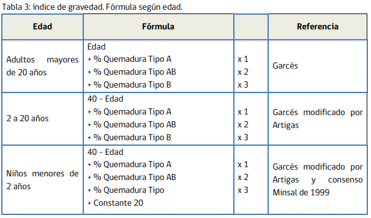

| puntaje | gravedad | pronóstico |
|---------|----------|------------|
| 21-40 | leve | sin riesgo vital. |
| 41-70 | moderado | sin riesgo vital, salvo complicaciones |
| 71-100 | grave | probabilidad de muerte inferior a sobrevida. Mortalidad menor 30%. |
| 101-150 | crítico | mortalidad de 30 a 50%. |
| \>150 | sobrevida excepcional | mortalidad mayor al 50%. |

Sí o sí categoría grave:
- Edad mayor a 65 años y 10% o más de quemadura AB o B.
- Quemadura de alta tensión.
- Quemadura respiratoria.
- Politraumatismo.
- Quemados con patologías graves asociadas.
- Quemaduras profundas complejas de cabeza, manos, pies o región perineal.

#### El agente causal, mecanismo y tiempo de acción 
es diferente quemarse con líquido caliente que con fuego; mientras el agua caliente puede alcanzar los 100°C, la llama puede superar los 400°Cl. Por esta razón, la escaldadura produce predominantemente lesiones de espesor parcial y el fuego causa lesiones de espesor total. La electricidad de alto voltaje es grave independiente de su extensió

Tb siempre considerar para evaluación:
- edad y sexo del paciente
- Peso y estado nutricional del paciente
- Las comorbilidades del paciente
- El estado de conciencia del paciente
- El escenario en que ocurre la quemadura
- Las lesiones concomitantes
- El tiempo de evolución de la quemadura

### Tratamiento
Manejo prehospitalario: aplicar el protocolo ABC para el manejo inicial de pacientes gran quemados, considerando las capacidades técnicas del personal de salud e infraestructura local.

**Rescate del lugar** según tipo de quemadura:

Quemadura por llama
- La prioridad debe ser extinguir la llama, aplicando mantas o abrigos o utilizando agua o espuma antiincendios
- Retirar las ropas quemadas. Si la ropa está adherida a la piel, no debe tirarla, sino que recortarla. Cubrir a la víctima con paños limpios o mantas (no necesariamente estériles).
- Retirar anillos, pulseras y adornos metálicos para evitar el efecto de torniquete que produce el edema.
- No enfriar con agua (el agua fría sólo se debe aplicar en quemaduras de poca extensión, si se aplica en superficies mayores al 10% se corre el riesgo de hipotermia)

Quemaduras químicas
- Desnudar al paciente. Eliminar todas las ropas que contengan el químico.
- Irrigar copiosamente con agua. Si el químico es en polvo, se debe cepillar y luego lavar con agua.
- No utilizar sustancias neutralizantes.
- Las lesiones en los ojos requieren irrigación permanente.
- Todo el equipo de rescate y atención del paciente con quemadura química debe seguir estrictamente el protocolo de medidas de protección universal.

Quemaduras eléctricas
- Desconectar la corriente eléctrica.
- Retirar al paciente de la red.
- Utilizar siempre materiales no conductores.
- En quemadura por electricidad de alto voltaje con caída de altura, movilizar al paciente considerando los riesgos de lesión de columna

**Manejo inicial**
A: ojo injuria inhalatoria

B: si injuria inhalatoria o intox por CO, dar O2 100%

C: tb evaluar si hay quemaduras circunferenciales por riesgo de síndrome compartimental

D: Glasgow a todos, si alterado, descartar hipoxia (CO) o hipovolemia

E: evaluarlo completo. **Envolver las lesiones** en sábanas o gasas limpias (no necesariamente estériles). No aplicar antimicrobianos tópicos, cremas ni geles. **Abrigar** al paciente mediante mantas de traslado o sábanas para minimizar la pérdida de calor y controlar la temperatura ambiental, de manera de evitar la hipotermia. La cabecera debe estar **elevada a 30º** para limitar la formación de edema facial. **Elevar extremidades** quemadas por encima del tórax

F: fluidos
- \> 15% SCT requieren reanimación con fluidos (<10% no requieren)
- iniciar antes de las 2 horas
- Adultos: iniciar a 500 ml/h  hasta que llegue a centro de mayor complejidad
- Niños: 20 ml/kg en primeras 8 horas. diuresis debe mantenerse en torno a 0,5 ml/kg/hora en niños mayores de 2 años y 1 ml/kg/hora en niños menores de 2 años, ajustando según balance hídrico

### Ingreso a UPC y manejo hospitalario
- Índice Gravedad mayor a 70 o quemaduras AB o B mayor a 20% de la superficie corporal (SC).
- Edad mayor de 65 años con 10% o más de quemadura AB o B.
- Sospecha de injuria inhalatoria.
- Quemaduras por electricidad de alta tensión. 
- Quemaduras de cara, manos, pies, genitales, perineo y articulaciones mayores.
- Quemaduras químicas.
- Politraumatismo o traumatismo encéfalo-craneano.
- Falla en la reanimación
- Inestabilidad hemodinámica y/o respiratoria.
- Patologías graves asociadas (por ejemplo, insuficiencia renal, patologías cardíacas y respiratorias, deficiencias inmunológicas, diabetes)

monitorizar periódicamente el volumen de orina para mantener diuresis. La diuresis debe mantenerse 
- \> 2 años --> en torno a 0,5 ml/kg/hora 
- < 2 años --> 1 ml/kg/hora en niños ajustando según balance hídrico. 
- En adultos, el volumen de orina debe ser en torno a 0,5 ml/kg/hora. 

Fórmula de Parkland (14): Total del volumen a pasar en primeras 24 horas desde el momento del accidente: 3-4ml* kg* % superficie corporal quemada, ajustando según balance hídrico y monitoreo hemodinámico.

Para pacientes pediátricos: Fórmula de Parkland + Fórmula de Holliday 

En pacientes gran quemados, no se recomienda el uso profiláctico de antibióticos tópicos o sistémicos. Recomendación A

## Conceptos generales sobre Injertos y Colgajos 

Indicaciones de injertos antes de colgajos:
- 

Prendimiento de un injerto:

1. Imbibición plasmática:
    - Normalmente dura entre 24 y 48 horas.
    - Se forma una capa de fibrina entre el injerto y la zona receptora que mantiene la adherencia.
    - El injerto absorbe nutrientes y O2 que difunden desde el lecho dador.
2. Inosculación:
    - Los capilares de la zona dadora y receptora se alinean: kissing capillaries.
3. Revascularización: Existen 3 teorías que tratan de explicar este fenómeno:
    - Anastomosis entre vasos del injerto pre-existentes y los vasos del lecho dador.
    - Nuevos vasos desde la zona dadora invaden el injerto.
    - Combinación de vasos nuevos y viejos
Entre todo, toma aprox 5 días, por lo que tiene que quedar inmovilizado y sin tensión por ese tiempo (curación cerrada de injerto)

Causas de falla de injerto:
-  Locales: hematoma (1º causa), infección (2º causa), seroma (3º causa), mala inmovilización, exceso de presión sobre el injerto, injerto traumatizado, ZR isquémica o sucia.
- Generales: anemia, desnutrición, enfermedades del mesénquima, diabetes, isquemia crónica.

## Lesiones por presión 
## Cicatrización normal y patológica

# CIRUGÍA CABEZA Y CUELLO
Estudio, diagnóstico y manejo del paciente:
## Masa cervical
## Patología benigna y maligna del Tiroides. 
## Tumores y Enfermedades inflamatorias de Glándulas Salivales 
## Generalidades del Cáncer de cabeza y cuello 
## Procesos infecciosos de cabeza y cuello 
## Tumores malignos de la piel (Melanoma y no Melanoma) 
## Tumores benignos de partes blandas 
## Tumores malignos de partes blandas

# ANESTESIOLOGÍA: 
Anatomía, Fisiología y Farmacología aplicadas a la anestesia. 
Evaluación preoperatoria. 
Manejo de vía aérea y accesos venosos periféricos. 
Descripción de procedimiento de Anestesia local. Intoxicación por anestésicos locales 
Manejo de soporte vital básico y avanzado. 
Monitorización anestésica 
Indicaciones, contraindicaciones y complicaciones de anestesia regional y general. 
Manejo del dolor