# Patologías Quirúrgicas GES

| Patología | Población | Sospecha Para activación | Tiempos |
|-----------|-----------|--------------------------|--------|
| Gran Quemado | Todo paciente con quemaduras >20% SCQ |  |  |
| Colecistectomía preventiva del cancer de vesícula en personas de 35 a 49 años | Todo paciente con colelitiasis |  |  |
| Cáncer de mama | Todo paciente con sospecha de cáncer de mama |  |  |
| Cáncer gástrico | |  |  |
| Cáncer colorrectal en personas de 15 años y más | Todo paciente con sospecha de cáncer colorrectal |  |  |
| Cáncer de pulmón en personas de 15 años y más | Todo paciente con sospecha de cáncer de pulmón |  |  |
| Cáncer de tiroides en personas de 15 años y más | Todo paciente con sospecha de cáncer de tiroides |  |  |
| Tratamiento de erradicación del H. Pylori | Todo paciente con infección por H. Pylori |  |  |

## Gran Quemado
Tratamiento
- 72 horas desde confirmación diagnóstica (ingreso establecimiento de salud con capacidad resolutiva)
- Estabilización en persona mayor a 15 años: 8 horas desde confirmación diagnóstica

Seguimiento
- Primer control dentro de 15 días desde confirmación diagnóstica
- Rehabilitación
    - hospitalizado 48 horas desde indicación médica
    - Primera atención ambulatoria 15 días desde el alta hospitalaria
    - Ayuda técnica 30 días desde indicación médica

## Colecistectomía preventiva del cancer de vesícula en personas de 35 a 49 años
Diagnóstico:
- 30 días desde la sospecha diagnóstica
- Tratamiento 90 días desde la confirmación diagnóstica

## Cancer gástrico

Sospecha 

Plazos diagnósticos:
- evaluación especialista 30 días después de sospecha
- confirmación diagnóstica 30 días desde solicitud especialista

Plazos terapéuticos:
- cirugía 30 días desde confirmación diagnóstica
- radio y quimioterapia 30 días desde la indicación médica

<ol style="list-style-type: lower-roman;">
<li>Tumor maligno del cardias</li>
<li>Tumor maligno de orificio del cardias</li>
<li>Tumor maligno de la unión cardioesofágica</li>
<li>Tumor maligno de la unión gastroesofágica</li>
<li>Tumor maligno del fundus gástrico</li>
<li>Tumor maligno del cuerpo del estómago</li>
<li>Tumor maligno del antro pilórico</li>
<li>Tumor maligno del antro gástrico</li>
<li>Tumor maligno del píloro</li>
<li>Tumor maligno del conducto pilórico</li>
<li>Tumor maligno del prepíloro</li>
<li>Tumor maligno de la curvatura menor del estómago, sin otra especificación</li>
<li>Tumor maligno de la curvatura mayor del estómago, sin otra especificación</li>
<li>Carcinoma in situ del estómago</li>
</ol>

## Cáncer colorrectal en personas de 15 años y más

Diagnóstico:
- Diagnóstico 45 días desde sospecha diagnóstica
- Etapificación 45 días desde la confirmación diagnóstica

Tratamiento:
- Primario y adyuvante 30 días desde indicación médica
- Reconstrucción de transito intestinal o cierre colostomía 90 días desde indicación quirúrgica

Seguimiento
- Primer control, 90 días desde indicación médica

## Cancer tiroides

Diagnóstico:
- etapificación 45 días desde confirmación diagnóstica
- etapificación de cancer anaplásico 7 días desde confirmación diagnóstica

Tratamiento:
- Quirurgico según etapificación
    - Cáncer diferenciado de alto riesgo y medular de tiroides 90 días desde la indicación médica
    - Cáncer diferenciado de tiroides de riesgo intermedio 6 meses desde indicación médica
    - Cáncer difeenciado de tiroides de bajo grado 9 meses 
    - Cáncer anaplásico 7 días desde la indicación médica. 

- Reestadificación 4 meses desde la cirugía
- Tratamiento sistémico 60 días desde la indicación médica
- complementario 90 días desde indicación médica

Seguimiento
- Primer control 90 días desde indicación médica
- Rehabilitación 30 días desde indicación médica

Urgencias de colon: pag pag 343 libro puc

# CIRUGÍA GENERAL:
## Realiza Asepsia y antisepsia 
## Reconoce conceptos generales de manejo de drenajes y curación de heridas
## Estudio de Abdomen agudo 
## Reconoce manejo post operatorio de Hernias de la pared abdominal y Eventraciones.
## Reconoce manejo de obstrucción Intestinal de intestino delgado y grueso
## Reconoce complicaciones postoperatorias frecuentes

# CIRUGÍA DIGESTIVA
## Diagnóstico y generalidades del manejo Perforación Esofágica - Mediastinitis
## Maneja generalidades en patología de esófago - estómago - duodeno.
## Diagnóstico, estudio y generalidades del manejo de cáncer del Esófago y gástrico. Cáncer de Vesícula y Vías Biliares Cáncer de Páncreas; tumores periampulares y tumores hepáticos. 
## Diagnóstico y manejo general de Acalasia
## Diagnóstico y manejo de Síndrome de Reflujo Gastroesofágico 
## Patológico y Hernia hiatal
## Diagnóstico y manejo Ulcera Péptica Gástrica y Duodenal. 
## Diagnóstico y manejo general de Tumores Gástricos Benignos. 
## Diagnóstico, manejo completo de Hemorragia Digestiva Alta y baja; 

## Colelitiasis, Colecistitis Aguda y Crónica; Coledocolitiasis; Ictericia Obstructiva; Colangitis; Pancreatitis aguda y sus complicaciones.

### Colelitiasis

Factores de riesgo: 
5F
- **fair**: more prevalent in the Caucasian population 1
- **fat**: BMI >30 kg/m2 and hyperlipidemia 3,4
- **female**
- **fertile**: one or more children
- **forty**: age ≥40 years
    - cholelithiasis can occur in young patients with a positive family history; in such cases, the '**familial**' factor can substitute for the 'forty' factor 2

###  Pancreatitis aguda

Causas más frecuentes:
- Litiasis y barro biliar
- alcohol
- hipertrigliceridemia >1000
- Post-ERCP
- Lesión conducto biliar

Por grupo de causas:
- **Obstructivas**: Litiasis biliar, Tumores pancreáticos, divertículos duodenales, ascariasis biliar, hidatidosis hepática, anomalías anatómicas del páncreas, lesiones periampulares
- **Metabólicas**: Hipertrigliceridemia, Hiperparatiroidismo, Hipercalcemia
- **Tóxicas**: Alcohol (se cree que puede aumentar liberación de enzimas pancreáticas), Fármacos
- **Infecto**: Viruses (Mumps, coxsackievirus, hepatitis B, cytomegalovirus, varicella-zoster, herpes simplex, human immunodeficiency virus (HIV)), Bacteria (Mycoplasma, Legionella, Leptospira, Salmonella), Fungi (Aspergillus), Parasites (Toxoplasma, Cryptosporidium, Ascaris)
- **Idiopáticas** 

> En casos severos, pancreatitis necrohemorrágica: 
> - Sg Cullen: equímosis periumbilical
> - Sg Grey Turner: equímosis flancos

Diagnóstico con 2 de 3:
- Clínica Dolor compatible con pancreatitis
- Laboratorio Enzimas sobre 3 x VN
- Imagen que oriente a etiología (Eco con litiasis) o complicaciones

> Notas:
> - Lipasa más específica y sensible que amilasa
> - Amilasa peak más tardío que la lipasa, entre 6-12 h del inicio del cuadro y al tener una vida media de 10 horas sus niveles plasmáticos se normalizan a los 3-5 días luego de resuelto el cuadro 

Lab a solicitar en urgencias:
1. Hemograma: hemoconcentración, leucocitosis
2. F. Renal
3. Gases (sobre todo si disfunción respi)
4. ELP
5. Perfil hepático (ojo alteración en caso de etiología biliar)
6. PCR mg/dL. Si >150, mal pronóstico
7. Estudio etiología "no biliar":
    - Perfil lipídico
    - Calcemia

Estudio imagen:
- Eco abdominal
- TC abdomen: rendimiento mejora a partir de las 48-72 horas de iniciado el cuadro. Permite realizar diagnóstico, establecer gravedad y reconocer complicaciones locales

Complicaciones locales según consenso de Atlanta:
1. Pancreatitis edematosa intersticial.
2. Pancreatitis necrotizante.
3. Colección peripancreática aguda.
4. Pseudoquiste pancreático.
5. Colección necrótica aguda.
6. Colección necrótica amurallada

Evaluación disfunción orgánica: con marshall y SIRS

Evaluación de severidad: según consenso de Atlanta, si falla organica según marshall persiste más de 48 horas --> pancreatitis severa

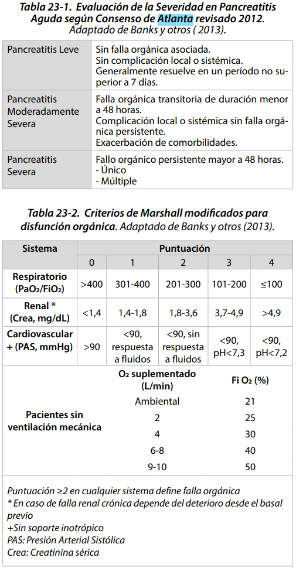

Score de gravedad por TC: Pts Balthazar + Pts por grado de necrosis. 

Criterios de Balthazar:
- A: Páncreas normal : 0
- B: Aumento de tamaño o difuso: 1
- C: Inflamación peripancreática: 2
- D: 1 colección intra o extrapancreática: 3
- E: 2 o más colecciones y/o gas retroperitoneal: 4

Score por necrosis
- 0%: 0
- <30%: 2
- 30-50%:4
- \>50%: 6

Un total de >=5  asociado a estadía hospitalaria prolongada y aumento de la morbimortalidad 15 veces en comparación a los con score < 5

#### Manejo inicial

1. ¿UPC?

Existen scores: APACHE II, Ranson, BISAP, etc. Tb evaluar:

- Pancreatitis Severa por criterios de Atlanta
- FC > 120 lpm (pese a reposición de fluidos y manejo analgésico óptimo).
- FR > 30 ventilaciones por minuto.
- PAS < 80 mmHg. o PAM < 60 mmHg.
- PaO2 < 50 mmHg o PaFiO2 < 300.
- pH <7,1 o >7,7
- Alteraciones hidroelectrolíticas severas. 
    - K < 2 o K >6,5 mg/dl.
- Hiperglicemia > 700 mg/dl
- Oligoanuria o Anuria
- Compromiso de conciencia
- SIRS >48 horas
- Comorbilidad pulmonar o cardíaca severa / Obesidad severa

2. Fluidos (hipovolemia por tercer espacio, disminución ingesta y aumento pérdidas)
    - Severamente depletados: cristaloides, en dosis de 20-30 ml/kg en los primeros 30-45 min, continuando luego con una infusión de 3 ml/kg/hora en las primeras 8-12 horas. 
    - Otros: debería ser suficiente BIC 5-10 ml/kg/h (250-500 ml/hora por las primeras 24 horas).

Pasadas las primeras 6 horas, la reposición debe ser guiada por metas:
    - No invasivas: Frecuencia cardiaca menor a 120 lpm, PAM entre 65-85 mmHg, débito urinario 0,5-1 cc/kg/hora.
    - Invasivas: Distintos indicadores de variación de volumen sistólico (ej.: delta P/P), variación de volumen intratorácico, entre otras.
    - Bioquímicas: Nitrógeno ureico (variación más que valor absoluto) , Hematocrito 35-44%. 

3. Nutrición:
    - Si no hay contraindicaciones, se debe iniciar nutrición enteral temprana, en las primeras 24-48 horas.
        - Pueden ser fórmulas poliméricas hiperprotéicas baja en grasas. 
    - Si no es posible, se debe iniciar nutrición parenteral.

4. Analgesia
- Opioides de elección: Fentanilo 20-50 mcg cada 10 a 20 minutos.
- AINES y PCT si buena función renal

5. Antibióticos
Si se ha logrado establecer la infección de la necrosis por medio de **cultivos (Punción** bajo TC de la necrosis pancreática, por ejemplo), o si existen pruebas indirectas, como la aparición en la TC de **burbujas en la necrosis pancreática**, **hemocultivos positivos** para bacterias Gram negativas o existencia de un **deterioro clínico** no explicado por otra causa.

- extremadamente graves, está indicado el uso de un antibiótico con perfil de acción pancreático óptimo cómo es el Imipenem
- Estable, otros que llegan a t. Pancreático: criprofloxacino, cefalosporinas tercera +- metronidazol

6. Manejo complicaciones Locales
- Colección peripancreática (APFC; acute peripancreatic fluid collection): Es una colección de líquido peripancreático no relacionado a necrosis. Se aplica solamente a las áreas de líquido peripancreático vistas durante las primeras 4 semanas, en la fase temprana de la enfermedad. En el TAC se puede ver que no tiene paredes definidas, es homogénea y esta confinada por los planos fasciales normales retroperitoneales, pueden ser múltiples. Por lo general se resuelven en forma espontánea o pueden evolucionar a un pseudoquiste pancreático.
- Pseudoquiste pancreático corresponde a una colección pancreática encapsulada por paredes inflamatorias o fibrosas bien definidas, usualmente fuera del páncreas, sin necrosis. Producido por fístula desde la glándula pancreática como desde la disrupción del conducto pancreático. Usualmente se demora 4 semanas en formarse y es rico en enzimas pancreáticas. **Si es asintomático no se debe intervenir**.
    - La historia natural muestra un descenso del tamaño o resolución espontánea con tratamiento conservador en un elevado porcentaje. Si es <4 cms es buen predictor de resolución espontánea.
    - La intervención quirúrgica está indicado en pseudoquiste **sintomático, infectado** (sepsis,presencia de burbujas de gas) o **crecimiento seriado en TAC**. Se debe drenar junto con toma de cultivo y gram. Habitualmente existe bacterias anaerobias entéricas. Drenaje: Percutáneo, endoscópico, laparoscópico, abierto, creación de cistogastrostomía endoscópica o quirúrgica.
- Colección necrótica: Corresponde a colecciones que contiene cantidades variables de líquido y necrosis en parénquima pancreático y/o tejido peripancreático que ocurre habitualmente en la pancreatitis aguda moderadamente grave y grave.
- Walled-off necrosis pancreática (necrosis encapsulada o amurallada): Es el resultado de la organización de colecciones peripancreáticas (APFC) (estas no están asociadas a la necrosis) o de colecciones necróticas pancreáticas, formando una pared de tejido de granulación o fibrótico sin epitelio, habitualmente ocurre después de las 4 semanas. Cualquier colección que ocupe o reemplace el parénquima pancreático se cataloga como necrosis amurallada. En caso de confirmarse infección a través de infección, se debe intervenir, ojalá esperando 3 o 4 semanas hasta que se demarque el tejido pancreático viable y la necrosis peripancreática. Se puede realizar drenaje endoscópico o retroperitoneal, como cirugía abierta o laparoscópica.

7. Manejo etiología

Si etiología biliar: colecistectimía (idealmente temprana) + colangografía intraoperatoria + ERCP

ERCP (COLANGIOPANCREATOGRAFÍA RETRÓGRADA ENDOSCÓPICA)
Ssi pancreatitis aguda biliar asociada a:
- una colangitis aguda
- coledocolitiasis retenida

La colecistectomía en pancreatitis aguda grave se debe diferir hasta resolución del cuadro clínico. Para ese entonces parece razonable esperar 3 semanas

## Diagnóstico y manejo inicial de Quistes y Abscesos Hepáticos e Hidatidosis Hepática;
## Diagnóstico y manejo general de Fístulas del Intestino Delgado. 
## Manejo completo de Ileostomías y Colostomías Megacolon 
## Diagnóstico y manejo completo de enfermedad Diverticular y sus complicaciones 
## Manejo quirúrgico de Enfermedades inflamatorias: Colitis Ulcerosa, Crohn. 
## Diagnóstico y manejo Pólipos y cáncer de Colon recto y Ano.
## Diagnóstico y manejo inicial Prolapso Rectal 
## Diagnóstico y manejo lesiones ActínicasAnorectales. 
## Diagnóstico y manejo completo de Patología ano-rectal Benigna: Hemorroides, Fisura anal, Abscesos anorectales, Fístulas, Venéreas. 
## Diagnóstico y manejo de Enfermedad pilonidal
## Diagnóstico y manejo de Urgencias Ano-Recto-Colónicas. 
## Manejo quirúrgico de Obesidad Mórbida 

# CIRUGIA DE TORAX: 
## Evaluación pre y postoperatoria 
## Diagnóstico y manejo inicial Síndrome de ocupación pleural 
## Empiema pleural Hidatidosis pulmonar 
## Tumor pulmonar y nódulo solitario 
## Manejo de hemoptisis masiva 
## Indicaciones y manejo de traqueostomía
## Hernias diafragmáticas traumáticas y congénitas 
## Patología del mediastino. 
## Cáncer pulmonar 
## Mesotelioma

# VASCULAR PERIFÉRICO: 
## Insuficiencia Arterial Aguda: Embolia, Trombosis 

6 P:
- Pain (lo más precoz)
- Pulseless
- Pale
- Poiquilotermia: La extremidad afectada suele estar fría. La obstrucción causa una importante alteración de la termorregulación local, llevando a que la extremidad adopte la temperatura ambiente a la que está expuesta
- Parestesia (primero hiperestesia del primer espacio metatarsiano)
- Parálisis: tardío. 1° se afecta compartimento anterior (dorsiflexión hallux).

Clasificación Rutherford para Isquemia agua EEII

| Grado | Interpretación | Pérdida Sensorial | Debilidad Muscular | Doppler arterial | Doppler venoso |
|-------|----------------|-------------------|--------------------|------------------|----------------|
| I | Viable | Ninguna | Ninguna | Audible | Audible |
| IIa | Amenaza marginal | Mínima | Ninguna | Inaudible | Audible |
| IIb | Amenaza inmediata | Sobrepasa los pies, asociado con dolor de reposo | Leve a moderada | Inaudible | Audible |
| III | Irreversible | Profunda anestesia | Profunda, parálisis | Inaudible | Inaudible |

Grado IIb tiene alteración motora!!! Se debe revascularizar en plazo de horas.

Estudio a solicitar:
1. Angio TC (mayor utilidad en suprapoplíteo)
2. Eco Doppler
3. (Angiografía)
4. Ecocardio TT y/o TE (si sospecha embolia)

Manejo inicial:

1. **Analgesia** y estabilización:
    - Posición de fowler, **fluidos** (y monitorización función renal, HE) y búsqueda Rabdomiolisis 
2. **Anticoagulación** con HNF (porque puede requerir cx):
    - HNF 80 UI/kg EV en bolo, luego 18 UI/kg/h

Cmplx post-reperfusión:
- Rabdomiolisis: elevación CK, mioglobinuria, AKI, HiperK, Hiperfosfemia, hipercalcemia.
- Sd reperfusión: aumento permeabilidad prots en capilares, aumento presión intersticial --> síndrome compartimental. Mayoría pacientes need fasciotomía 
- Cardiovasculares: IAM, Arritmias, etc.

## Insuficiencia Arterial Crónica: Oclusión aorto-iliaca, Oclusión femoro-poplítea, patología carotídea

Interpretación Indice tobillo brazo:
| valor | interpretación |
|-------|----------------|
| >1.4 | calcificación |
| 0.9 - 1.4 |  normal |
| 0.71-0.9 | disminución de flujo leve|
| 0.41-0.7 | disminución de flujo moderada |
| 0-0.4 | disminución de flujo severa |

Lectura EVNI:

1. Comprar presiones braquiales (si diferencia mayor a 10 mmHg, sospechar patología "central")
2. Presiones segmentarias (sistólica): 
    - Diferencia entre miembros al mismo nivel: >20 mmHg
    - Disminución > 30 mmHg de proximal a distal
3. índice segmentario-braquial:
    - disminución de proximal a distal >0.15
4. Índice tobillo brazo: 
    - normal: [0.9, 1.4[
    - si >= 1.4, ojo calcificación DM y ERC, evaluar índice dedo-brazo: 
        - < 0.7 es anormal
> nota: presión >30 mmHg en dedo pie es necesaria para curación. DM puede necesitar más de 45-50 mmHg
5. PVR (Pulse Volume Recording): No se afecta por calcificación
    - normal: 1-1.2
    - si < 0.5, ojo isquemia crítica

Clasificación Rutherford para EAO:

| Grado | Clínica | Tratamiento |
|-------|---------|-------------|
| 0 | Asintomático | Control FR |
| 1 | Claudicación leve | Control FR |
| 2 | Claudicación moderada | Control FR |
| 3 | Claudicación severa| Control FR |
| 4 | Dolor en reposo | Isquemia crítica  derivar|
| 5 | Pérdida menor de tejido | Isquemia crítica  derivar|
| 6 | Pérdida mayor de tejido | Isquemia crítica  derivar|

Si Isquemia crítica, ITB <0.4 o claudicación que impide realización de actividades diarias, derivar a cirugía vascular.

Escenarios EAO:
1. Paciente discretamente discapacitado por claudicación intermitente: tratamiento **médico** de las comorbilidades, cesación del hábito tabáquico, rehabilitación de la marcha y uso de cilostazol logran aumento en la distancia de libre de claudicación.
2. Paciente severamente limitado por claudicación, con extremidad no amenazada en su vitalidad: **intensificar el manejo conservador**. Solo el 5% de los claudicadores pasan a isquemia crítica. Es necesario ponderar con el paciente los beneficios de la revascularización quirúrgica en comparación a los riesgos en morbimortalidad inherentes a estos procedimientos.
3. Paciente con isquemia critica: está indicada la revascularización quirúrgica lo antes posible. Son pacientes con dolor de reposo, necrosis parcial o avanzada, o con ulceras isquémicas, capaces de tolerar procedimientos quirúrgicos y con posibilidad de rehabilitación. 
4. Paciente con isquemia critica con baja probabilidad de recuperación y/o gangrena  de la extremidad con o sin infección asociada: salvo excepciones, la elección es la amputación. En general, son pacientes con estado de salud deteriorado, con mala tolerancia a procedimientos quirúrgicos, con lesiones extensas, anticipando mal resultado a la revascularización

Qué hacer en APS:

Hábitos de vida:
1. Ejercicio físico 30-45 minutos, 3-4 veces por semana, durante 3 meses.
2. Tabaquismo Cese del hábito

Comorbilidades:

3. Dislipidemia: Uso de estatinas Colesterol LDL < 70mg/dL
4. Hipertensión Arterial: Uso de antihipertensivos orales; idealmente IECA o ARAII. Mantener cifras menores a 140/90 mmHg (130/80 mmHg si paciente es diabético o padece otra condición de riesgo). 
5. Diabetes Mellitus Control metabólico según esquemas.

Fcos:

6. Antiagreción plaquetaria: Uso de aspirina (clopidogrel mejores resultados).
7. Cilostazol 100mg dos veces al día (más para terciara porque se puede retirar eventualmente luego de rehabilitación)

### Manejo Isquemia crítica EEII

DERIVAR!!!

Manejo inicial:

Dolor de reposo:
1. Higiene diaria agua y jabón, correcto secado (sobre todo entre dedos). Humectación piel con vaselina. 
2. Prevenir nuevas lesiones:  no recortar callos ni limar la piel, vigilar que calcetines y calzado no tengan imperfecciones. 
3. Dolor: Paracetamol + opiáceos.

Lesión:
1. Necrosis seca sin rotura del borde que limita con el tejido vivo: iguales a los cuidados descritos, además se debe pintar con povidona yodada la lesión y dejar secar, de esta forma no se humedece ni se infecta, mantener cubierta la lesión para evitar contaminación.
2. Necrosis seca con área húmeda en el borde con el tejido vital: no se debe mojar, curaciones con suero fisiológico para mantener la herida limpia, no debridar tejido porque no cicatrizaría y aumentaría de tamaño. Antibióticos de amplio espectro si hay signos de infección, mantener herida cubierta. 
3. Gangrena húmeda o absceso: requerirá de cirugía para aseo, para evitar progresión de la infección, antibióticos y curaciones. 

## Pie Diabético. 

Fisiopato: Neuropatía + Isquemia + Infección.

### Clínica

Neuropatía (en orden de compromiso):
- **autonómica** (shunts microcirculación + pérdida reflejo nociceptivo): alteración piel y fanereos 
- **sensitiva**: úlceras indoloras
- **motora**: atrofia musculatura intrínseca --> pie en garra con prominencia cabeza metatarsianos

Isquemia: 
- ateroesclerosis (predominio **tibial** e infragenicular, conservación en pies)
 
 (**amputación** antes de revascularización: 
        - Pacientes ancianos (relativo), **postrados**, con flexión rígida de la extremidad y que no tengan expectativa de rehabilitación.
        - Pacientes con cáncer con **corta expectativa** de vida.
        - Pacientes con **lesiones necróticas extensas** del pie.
 )

Infección:
- úlcera es puerta de entrada, isquemia retarda cicatrización e hiperglicemia disminuye respuesta inmune

Clasificación infección:
- extremidad sin riesgo: hasta tendones, escasos signos de infección sistémica. Por Staphylococcus, puede tener gram (-)
- extremidad con riesgo: profudas, tendones, hueso o articulaciones, en las cuales se asocia necrosis. Sg sistémicos infección. Estáfilos, E. coli, proteus. Anaerobios asociados a inf más severas

### Estudio
Estudio:
- **Rx** pie: si sospecha infección, buscar gas, cuerpos extraños, compromiso óseo o líquido articular.
- Cintigrama oseo: en infecciones precoces puede dar falsos (-), baja especificidad
- **(angio)TAC** y (angio)RMN: para evaluar extensión de infección y compromiso óseo, no muy disponibles
- **EVNI**: 
    1. Medición presiones segmentarias
    2. Curva doppler: grado de pérdida de elasticidad arterial, su amplitud y resistencia
    3. Registro de volumen de pulso: refleja volumen de sangre
    4. Fotopletismografía: refleja volumen de GR 
- Eco Doppler (Duplex): anatomía y morfología de las curvas. Especialmente útil en estudio pre reconstrucción arterial y seguimiento post ésta.
- Angiografía: planificar revascularización.

### Tratamiento
- Prevención: control FR, podoterapia, educación, tto fisioterapéutico (Plantillas, zapatos especiales, yeso no removible, ortesis, etc)
- ATB: empírico, luego ajustar. Considerar S. aureus y Streptococcus sp
    - inf leves (10 a 14 días): **Cefalosporinas de 1ra generación, Clindamicina, Amoxicilina/Ac clavulánico**, Ampicilina/Sulbactam. Ciprofloxacino, levofloxacino, moxifloxacino.
    - inf con amenaza amputación (14 a 21 días o más): **Cefalosporina 3ra generación + metronidazol o Clindamicina**, quinolona + Clindamicina, Ampicilina/Sulbactam, Piperacilina/Tazobactam, Quinolonas + Metronidazol. Considerar Vancomicina en IAAS o cultivo (+) para SAMR.

- Siempre drenajes colecciones/abscesos y descartar compromiso óseo
- Curaciones avanzadas

Si signos infección sistémica o compromiso profundo:
- hospitalizar, ATB, establecer estado vascular para definir tto 
    - buena perfusión: Aseo qx (drenaje, debridamiento, amputación)
    - deficiente perfusión: Si need desfocar que sea conservador, estudio vascular (EVNI/angiografía), reconstrucción arterial (bypass, angioplastía,...) 

Complementarias: 
- F crecimiento
- Oxígeno hiperbárico

Prevención secundaria: realizar plantilla o zapato según new biomecánica (fisiatra?)

## Aneurismas de aorta, femoral y poplíteo

## Fístulas arteriovenosas

## Insuficiencia Venosa Crónica, Varices. 

### Síndrome Post Flebítico. 

Def: formación de varices secundaria a TVP previa

### complicaciones varices

#### Varicorragia
Corresponde a la hemorragia localizada en una várice. Su tratamiento consiste en la compresión localizada y elevación de la extremidad hasta el cede del sangrado. 
 
#### Úlcera varicosa
El pilar del tratamiento, además de las curaciones seriadas, corresponde al uso de soporte de alta compresión (40 mmHg). 
 
#### Eczema cutáneo
Se maneja con lubricación e higiene cutáneo.

#### Varicoflebitis
También denominada **trombosis venosa superficial**. Su diagnóstico clínico debe ser confirmado con ecodoppler venoso de EE.II. para descartar una trombosis venosa profunda y evaluar la extensión del trombo, dado que si es 

- \> 5 cm, requiere de anticoagulación completa por 4 a 6 semanas mientras que si es 
- < 5 cm, requiere solo manejo sn

## Trombosis venosa profunda y Tromboflebitis (TVS)

### TVP
Score de Wells para TVP

0-1: Riesgo bajo de tvp

2 o más: alto riesgo de tvp

Score de Wells para TEP

0-4: poco probable

5 o más: TEP probable

Sg y Sn de TEP (lo más frecuente disnea y taquicardia)

FR comunes para ambas:

Los FR alteran la triada de Virchow: **estasia sanguínea, lesión endotelial y hipercoagulabilidad.**

| Modificables  | No modificables |
|---------------|-----------------|
| Neoplasia maligna | Edad |
| Cirugía | Sexo |
| Trauma | Antecedente de ETV |
| Embarazo | Grupo Sanguíneo |
| Uso de ACO y TRH | Trombofilia hereditaria |
| Obesidad | Otras enfermedades crónicas y/o congénitas. |
| Insuficiencia Cardiaca, EPOC | | 
| Factores de riesgo cardiovascular | |
| Fármacos | |

| triada de Virchow | Modificables | No modificables |
|------------------|--------------|-----------------|
| hipercoagulabilidad | Neoplasia maligna, Uso de ACO, TRH y otros fcos, Obesidad, Insuficiencia Cardiaca, EPOC, Factores de riesgo cardiovascular| Trombofilia hereditaria, Otras enfermedades crónicas y/o congénitas. |
| lesión endotelial | Cirugía, Trauma, Embarazo | Edad, Sexo |
| estasis sanguínea | Cirugía, Trauma, poca movilidad | ¿antecedente de ETV? |

Criterios diagnósticos de TVP en eco: 
- ecogenicidad intraluminal venosa, 
- aumento del diámetro venoso
- **pérdida de la compresibilidad venosa**, 
- ausencia de flujo espontáneo, 
- ausencia de aumentación del flujo venoso a la compresión distal.
### TVS

Asociaciones con otras patologías:
- Ca páncreas: un cuadro recurrente en diferentes sitios, conocido como **tromboflebitis migratoria**, representa un fenómeno paraneoplásico que particularmente se asocia al cáncer de páncreas. 
- Ca mama: la TVS en la mama, conocida como Enfermedad de Mondor, está asociada al cáncer de mama

Conducta: solicitar eco para explorar TVS y TVP.

Hallazgos ecográficos TVS:
- Trombo afecta a las venas perforantes
- TVS a menos de 3 cm de la unión safeno-femoral
- Trombo mayor a 5 cm

Manejo:
- < 5 cm AINES o analgesia VO repetir eco en 7 a 10 días
- \> 5 cm: Anticoagulación "profiláctica?"  y derivar

Tto anticoagulante vs tromboprofilaxis

Esquema ajuste warfarina

<table cellspacing="0"><tbody> <tr> <td class="subtitle1">Day</td> <td class="subtitle1">INR</td> <td class="subtitle1">Warfarin dose (mg)</td>
 </tr> 
<tr class="divider_bottom centered"> <td>1</td>
 <td>&nbsp;</td>
 <td>5</td>
 </tr> 
<tr class="divider_bottom centered"> <td>2</td>
 <td>&nbsp;</td>
 <td>5</td>
 </tr> 
<tr class="centered"> <td class="divider_bottom" rowspan="4">3</td>
 <td>&lt;1.5</td>
 <td>10</td>
 </tr> 
<tr class="centered"> <td>1.5-1.9</td>
 <td>5</td>
 </tr> 
<tr class="centered"> <td>2-3</td>
 <td>2.5</td>
 </tr> 
<tr class="divider_bottom centered"> <td>&gt;3</td>
 <td>0</td>
 </tr> 
<tr class="centered"> <td class="divider_bottom" rowspan="4">4</td>
 <td>&lt;1.5</td>
 <td>10</td>
 </tr> 
<tr class="centered"> <td>1.5-1.9</td>
 <td>7.5</td>
 </tr> 
<tr class="centered"> <td>2-3</td>
 <td>5</td>
 </tr> 
<tr class="divider_bottom centered"> <td>&gt;3</td>
 <td>0</td>
 </tr> 
<tr class="centered"> <td class="divider_bottom" rowspan="3">5</td>
 <td>&lt;2</td>
 <td>10</td>
 </tr> 
<tr class="centered"> <td>2-3</td>
 <td>5</td>
 </tr> 
<tr class="divider_bottom centered"> <td>&gt;3</td>
 <td>0</td>
 </tr> 
<tr class="centered"> <td rowspan="4">6</td>
 <td>&lt;1.5</td>
 <td>12.5</td>
 </tr> 
<tr class="centered"> <td>1.5-1.9</td>
 <td>10</td>
 </tr> 
<tr class="centered"> <td>2-3</td>
 <td>7.5</td>
 </tr> 
<tr class="centered"> <td>&gt;3</td>
 <td>0</td>
 </tr> </tbody></table>

## Úlceras de extremidades inferiores (venosas, varicosas, etc.)

## Enfermedad Tromboembólica

## Isquemia mesentérica aguda 

## Enfermedad renovascular

## Insuficiencia cerebro vascular

# PATOLOGÍA MAMARIA 
Estudio, diagnóstico y manejo del paciente con patología mamaria.
Tumores benignos y malignos
Patología inflamatoria infecciosa y no infecciosa mamaria.

# CIRUGÍA PLÁSTICA Y REPARADORA 

## Quemaduras y Secuelas 

### Diagnóstico
#### extensión de las quemaduras

#### profundidad de las quemaduras

Benaim
| tipo | descripción | histología  | tratamiento |
|------|-------------|-------------|-------------|
| A | Flictenas; color rojo; turgor normal.Apariencia de quemadura de sol.Dolor intenso. | epidermis |  Debería curar espontáneamente en 7 días sin secuelas. |
| AB-A | Color rosado, homogénea; llene capilar normal; dolor; humedad; **folículos pilosos intactos**| epidermis y dermis superficial | Debería epidermizar espontáneamente en 15 días con secuelas estéticas. Si se complica puede profundizarse. | 
| AB-B | Color moteado o blanco, **retraso o ausencia de llene capilar**; **folículos pilosos no intactos** | Epidermis y dermis papilar y reticular sin  afectar fanéreos  profundos| habitualmente termina en injerto con secuelas estética y/o funcional. Puede requerir escarectomía tangencial. |
| B | Sin flictenas; color blanco grisáceo; sin turgor; Dermis seca , blanca o carbonizada, piel arrugada, insensibilidadDolor ausente.| Epidermis, dermis e hipodermis (tejido  celular subcutáneo),  pudiendo llegar  inclusive hasta el  plano óse| Requiere escarectomía precoz, e injerto o colgajos. |

#### localización de las quemaduras

Zonas especiales (por estética o funcionalidad): 
- cara
- cuello
- manos y pies
- pliegues articulares (axila, codo, zona inguinal, hueco poplíteo)
- genitales y periné
- mamas
- axila

#### gravedad de las quemaduras

| puntaje | gravedad | pronóstico |
|---------|----------|------------|
| 21-40 | leve | sin riesgo vital. |
| 41-70 | moderado | sin riesgo vital, salvo complicaciones |
| 71-100 | grave | probabilidad de muerte inferior a sobrevida. Mortalidad menor 30%. |
| 101-150 | crítico | mortalidad de 30 a 50%. |
| \>150 | sobrevida excepcional | mortalidad mayor al 50%. |

Sí o sí categoría grave:
- Edad mayor a 65 años y 10% o más de quemadura AB o B.
- Quemadura de alta tensión.
- Quemadura respiratoria.
- Politraumatismo.
- Quemados con patologías graves asociadas.
- Quemaduras profundas complejas de cabeza, manos, pies o región perineal.

#### El agente causal, mecanismo y tiempo de acción 
es diferente quemarse con líquido caliente que con fuego; mientras el agua caliente puede alcanzar los 100°C, la llama puede superar los 400°Cl. Por esta razón, la escaldadura produce predominantemente lesiones de espesor parcial y el fuego causa lesiones de espesor total. La electricidad de alto voltaje es grave independiente de su extensió

Tb siempre considerar para evaluación:
- edad y sexo del paciente
- Peso y estado nutricional del paciente
- Las comorbilidades del paciente
- El estado de conciencia del paciente
- El escenario en que ocurre la quemadura
- Las lesiones concomitantes
- El tiempo de evolución de la quemadura

### Tratamiento
Manejo prehospitalario: aplicar el protocolo ABC para el manejo inicial de pacientes gran quemados, considerando las capacidades técnicas del personal de salud e infraestructura local.

**Rescate del lugar** según tipo de quemadura:

Quemadura por llama
- La prioridad debe ser extinguir la llama, aplicando mantas o abrigos o utilizando agua o espuma antiincendios
- Retirar las ropas quemadas. Si la ropa está adherida a la piel, no debe tirarla, sino que recortarla. Cubrir a la víctima con paños limpios o mantas (no necesariamente estériles).
- Retirar anillos, pulseras y adornos metálicos para evitar el efecto de torniquete que produce el edema.
- No enfriar con agua (el agua fría sólo se debe aplicar en quemaduras de poca extensión, si se aplica en superficies mayores al 10% se corre el riesgo de hipotermia)

Quemaduras químicas
- Desnudar al paciente. Eliminar todas las ropas que contengan el químico.
- Irrigar copiosamente con agua. Si el químico es en polvo, se debe cepillar y luego lavar con agua.
- No utilizar sustancias neutralizantes.
- Las lesiones en los ojos requieren irrigación permanente.
- Todo el equipo de rescate y atención del paciente con quemadura química debe seguir estrictamente el protocolo de medidas de protección universal.

Quemaduras eléctricas
- Desconectar la corriente eléctrica.
- Retirar al paciente de la red.
- Utilizar siempre materiales no conductores.
- En quemadura por electricidad de alto voltaje con caída de altura, movilizar al paciente considerando los riesgos de lesión de columna

**Manejo inicial**
A: ojo injuria inhalatoria

B: si injuria inhalatoria o intox por CO, dar O2 100%

C: tb evaluar si hay quemaduras circunferenciales por riesgo de síndrome compartimental

D: Glasgow a todos, si alterado, descartar hipoxia (CO) o hipovolemia

E: evaluarlo completo. **Envolver las lesiones** en sábanas o gasas limpias (no necesariamente estériles). No aplicar antimicrobianos tópicos, cremas ni geles. **Abrigar** al paciente mediante mantas de traslado o sábanas para minimizar la pérdida de calor y controlar la temperatura ambiental, de manera de evitar la hipotermia. La cabecera debe estar **elevada a 30º** para limitar la formación de edema facial. **Elevar extremidades** quemadas por encima del tórax

F: fluidos
- \> 15% SCT requieren reanimación con fluidos (<10% no requieren)
- iniciar antes de las 2 horas
- Adultos: iniciar a 500 ml/h  hasta que llegue a centro de mayor complejidad
- Niños: 20 ml/kg en primeras 8 horas. diuresis debe mantenerse en torno a 0,5 ml/kg/hora en niños mayores de 2 años y 1 ml/kg/hora en niños menores de 2 años, ajustando según balance hídrico

### Ingreso a UPC y manejo hospitalario
- Índice Gravedad mayor a 70 o quemaduras AB o B mayor a 20% de la superficie corporal (SC).
- Edad mayor de 65 años con 10% o más de quemadura AB o B.
- Sospecha de injuria inhalatoria.
- Quemaduras por electricidad de alta tensión. 
- Quemaduras de cara, manos, pies, genitales, perineo y articulaciones mayores.
- Quemaduras químicas.
- Politraumatismo o traumatismo encéfalo-craneano.
- Falla en la reanimación
- Inestabilidad hemodinámica y/o respiratoria.
- Patologías graves asociadas (por ejemplo, insuficiencia renal, patologías cardíacas y respiratorias, deficiencias inmunológicas, diabetes)

monitorizar periódicamente el volumen de orina para mantener diuresis. La diuresis debe mantenerse 
- \> 2 años --> en torno a 0,5 ml/kg/hora 
- < 2 años --> 1 ml/kg/hora en niños ajustando según balance hídrico. 
- En adultos, el volumen de orina debe ser en torno a 0,5 ml/kg/hora. 

Fórmula de Parkland (14): Total del volumen a pasar en primeras 24 horas desde el momento del accidente: 3-4ml* kg* % superficie corporal quemada, ajustando según balance hídrico y monitoreo hemodinámico.

Para pacientes pediátricos: Fórmula de Parkland + Fórmula de Holliday 

En pacientes gran quemados, no se recomienda el uso profiláctico de antibióticos tópicos o sistémicos. Recomendación A

## Conceptos generales sobre Injertos y Colgajos 

Indicaciones de injertos antes de colgajos:
- 

Prendimiento de un injerto:

1. Imbibición plasmática:
    - Normalmente dura entre 24 y 48 horas.
    - Se forma una capa de fibrina entre el injerto y la zona receptora que mantiene la adherencia.
    - El injerto absorbe nutrientes y O2 que difunden desde el lecho dador.
2. Inosculación:
    - Los capilares de la zona dadora y receptora se alinean: kissing capillaries.
3. Revascularización: Existen 3 teorías que tratan de explicar este fenómeno:
    - Anastomosis entre vasos del injerto pre-existentes y los vasos del lecho dador.
    - Nuevos vasos desde la zona dadora invaden el injerto.
    - Combinación de vasos nuevos y viejos
Entre todo, toma aprox 5 días, por lo que tiene que quedar inmovilizado y sin tensión por ese tiempo (curación cerrada de injerto)

Causas de falla de injerto:
-  Locales: hematoma (1º causa), infección (2º causa), seroma (3º causa), mala inmovilización, exceso de presión sobre el injerto, injerto traumatizado, ZR isquémica o sucia.
- Generales: anemia, desnutrición, enfermedades del mesénquima, diabetes, isquemia crónica.

## Lesiones por presión 
## Cicatrización normal y patológica

# CIRUGÍA CABEZA Y CUELLO
Estudio, diagnóstico y manejo del paciente:
## Masa cervical
## Patología benigna y maligna del Tiroides. 
## Tumores y Enfermedades inflamatorias de Glándulas Salivales 
## Generalidades del Cáncer de cabeza y cuello 
## Procesos infecciosos de cabeza y cuello 
## Tumores malignos de la piel (Melanoma y no Melanoma) 
## Tumores benignos de partes blandas 
## Tumores malignos de partes blandas

# ANESTESIOLOGÍA: 
Anatomía, Fisiología y Farmacología aplicadas a la anestesia. 

Evaluación preoperatoria. 

## Manejo de vía aérea y accesos venosos periféricos. 

7 P de SRI

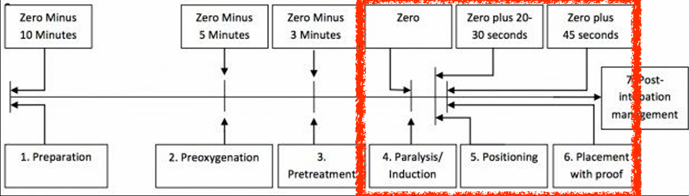

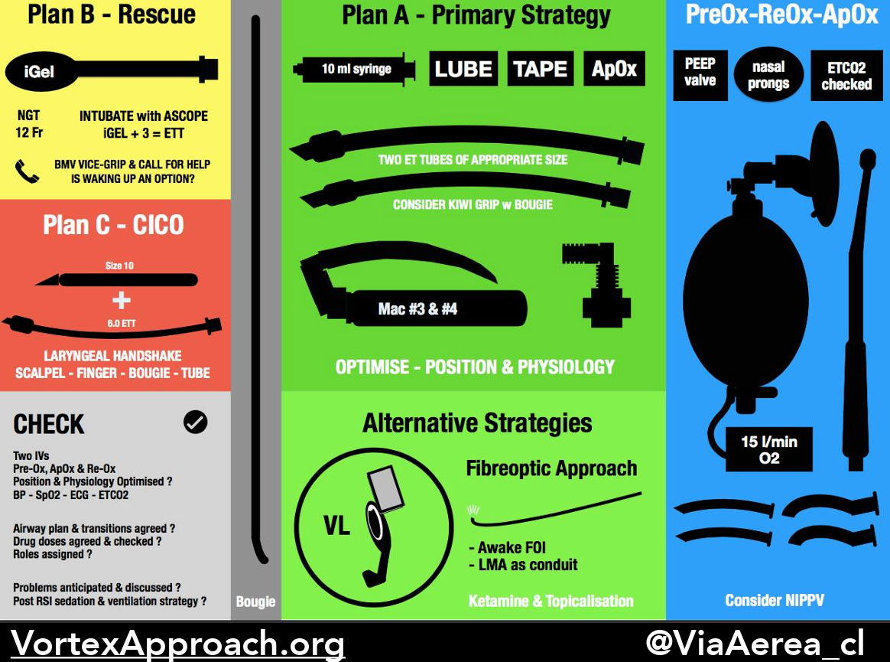

Vía aerea anatómicamente difícil:
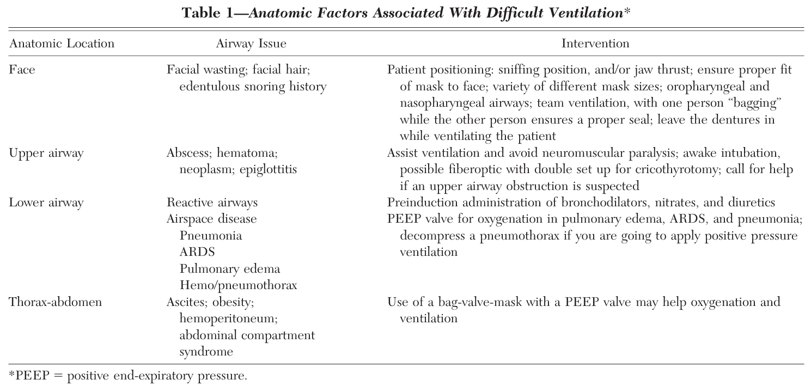

### pretratamiento
Vía aerea fisiológicamente difícil:
- Hipoxemia
- hipotensión
- acidosis
- falla ventrículo derecho

En esos casos: DVA, volúmen, aporte O2 precoz, optimizar condiciones que llevaron al paciente a acidosis extrema

Fcos:
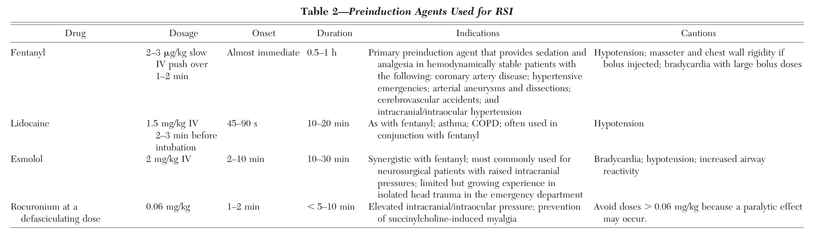

### Parálisis e Inducción
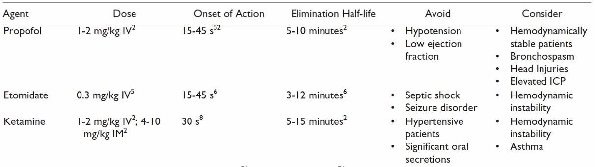
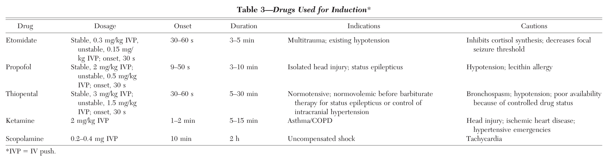

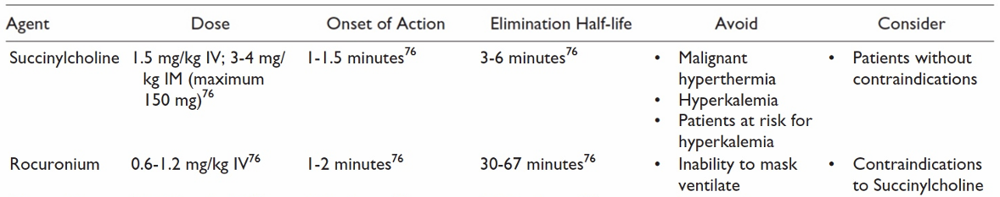
succi y rocu en realidad a dosis de 1 y 1.2 mg/kg respectivamente actúan a los 45 seg

Contraindicaciones succi
 Contraindications: personal or family history of malignant hyperthermia; likely difficult intubation or mask ventilation; known uncontrollable hyperkalemia; myopathy; chronic neuropathy/stroke; denervation illness or injury after 3 d; crush injury after 3 d; sepsis after >7 d; severe burns after 24 h

## Descripción de procedimiento de Anestesia local. Intoxicación por anestésicos locales 

existen amidas y esteres. Para diferenciar, amidas tienen 2 i, esteres 1 i en su nombre

ej: amidas: lidocaína, bupivacaína. Esters: procaína, benzocaína

Anestésicos locales, orden de bloqueo de fibras:
1. dolor y sensación térmica
2. tacto y propiocepción
3. función motora

Propiedades de los anestésicos locales:

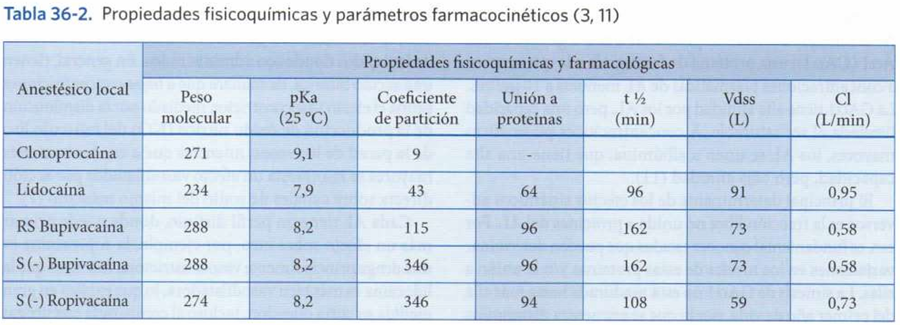

Latencia depende de liposolubilidad, pKa y temperatura 

A mayor pKa, mayor cantidad de AL en forma ionizada, por lo que tarda más en atravesar membrana celular.

ej: 
- pKa lidocaína 7.9 < pKa bupivacaína 8.1, por lo que lidocaína tiene menor latencia
- coadministrar con bicarbonato aumenta pH y aumenta fracción no ionizada, disminuyendo latencia
- coadministrar con epinefrina disminuye absorción y aumenta duración, pero como es ácida, disminuye pH y aumenta fracción ionizada, aumentando latencia

A menor temperatura (ej hipotermia), pKa aumenta, por lo que aumenta latencia, queda más droga disponible para ejercer toxicidad. 

Toxicidad se asocia a unión a proteínas. Mientras menos unión a prot, más libre en plasma, más disponible para efecto tóxico. Se unen 1° a glicoproteína Aa1 (proteína de fase aguda), luego a albúmina (menor afinidad). Estados de hipoalbuminemia (IRC, cirrosis, desnutrición) aumentan riesgo toxicidad. Estados inflamatorios (infección, trauma, cirugía, estado inflam crónico) aumentan glicoproteína Aa1, disminuyendo toxicidad.

Datos de metabolismo para toxicidad:
- Ésteres: metabolismo por pseudocolinesterasa, enzima no presente en LCR
- Amidas son más estables, se pueden acumular con mayor facilidad
- procaína y benzocaína: producen ácido paraaminobenzoico, que es super inmunogénico
- prilocaína y benzocaína: pueden producir metahemoglobinemia

Tipos de fibras nerviosas
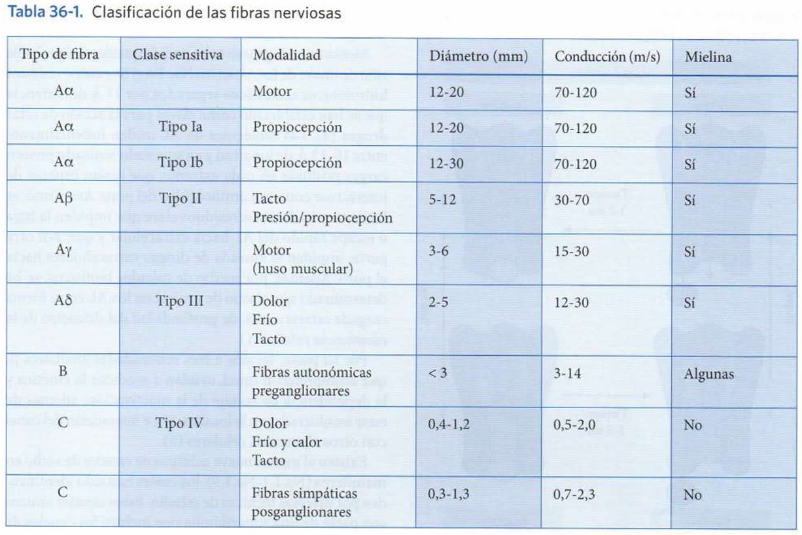

datos en embarazo
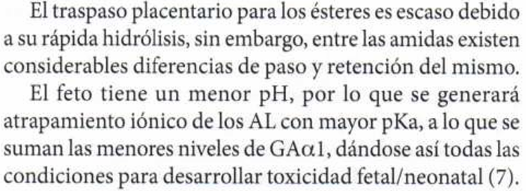

Toxicidad sistémica lidocaína
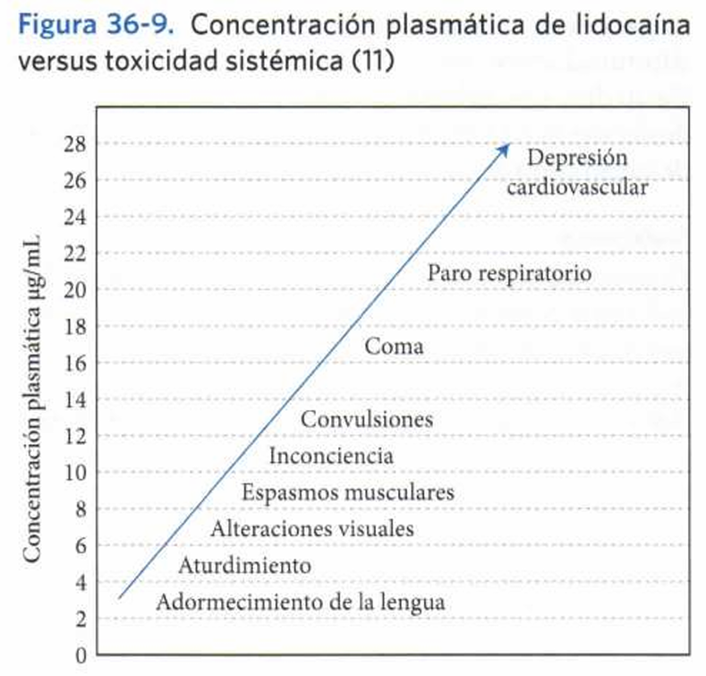

Toxicidad en SNC
1. fase excitatoria: parestesias periorales, tinnitus, confusión, convulsiones
2. fase de depresión goblal: pérdida de conciencia -> coma -> depresión respiratoria

Cardiotoxicidad.
1. fase inicial (coincide con fase excitatoria SNC): hipertensión y taquicardia
2. fase depresión miocárdica: caída GC e hipotensión
3. fase de colapso: vasoplejía, colapso cardiovascular, bradicardia, alteraciones de la conducción, taquiarritmias

Toxicidad SNC precede a cardiotoxicidad, salvo bupivacaína.

En bupivacaína en cuanto a cardio toxicidad, además de lo anterior, tiene efecto inotrópico negativo y altera la conducción
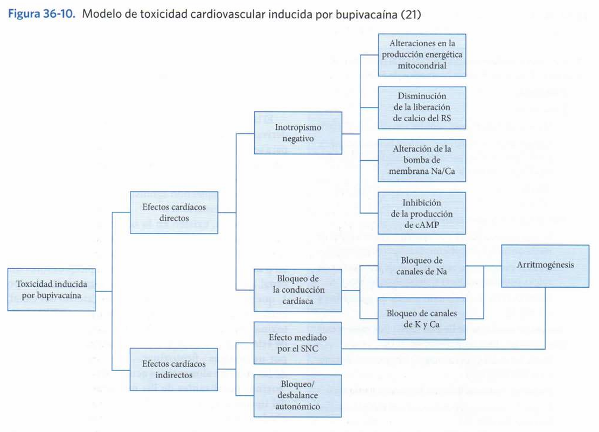

Pacientes con mayor riesgo de toxicidad:
- edades extremas
- patologías cardíacas (ICC y alteraciones conducción)
- alteración de la función hepática y renal
- embarazadas

ojo: lipidrescue.org 

Recomendaciones tratamiento intoxicación sistémica por anestésicos locales que implica PCR

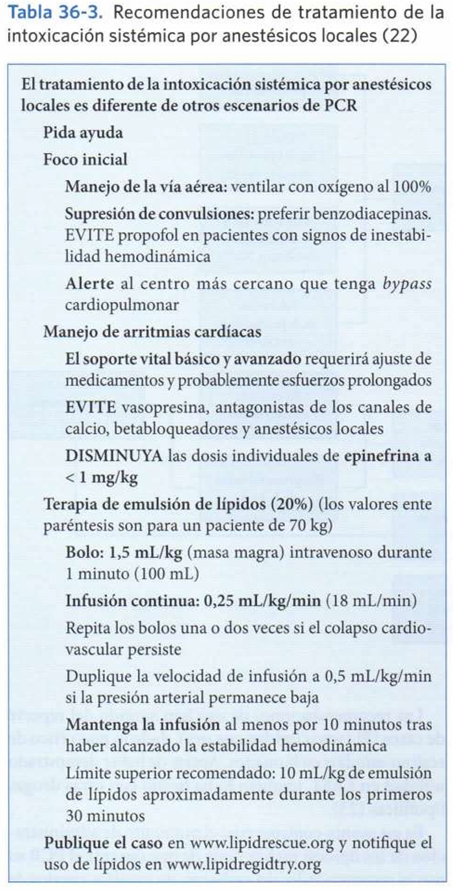

## Manejo de soporte vital básico y avanzado. 
## Monitorización anestésica 
## Indicaciones, contraindicaciones y complicaciones de anestesia regional y general. 
## Manejo del dolor