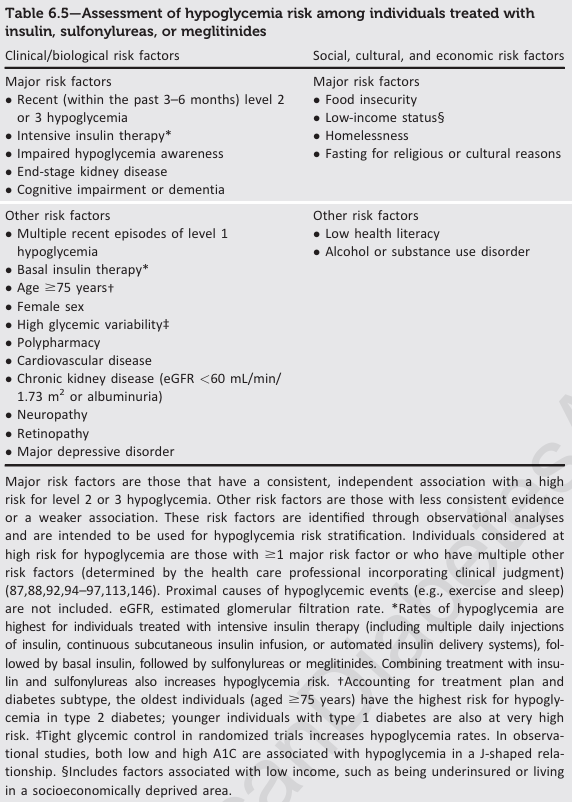

# Cardiología
## Emergencias hipertensivas

## Insuficiencia cardíaca

[diagnóstico IC FEp](https://watermark.silverchair.com/eurheartj_40_40_3297.pdf?token=AQECAHi208BE49Ooan9kkhW_Ercy7Dm3ZL_9Cf3qfKAc485ysgAAAt8wggLbBgkqhkiG9w0BBwagggLMMIICyAIBADCCAsEGCSqGSIb3DQEHATAeBglghkgBZQMEAS4wEQQMXzL2Z-LI4xwE61X3AgEQgIICkioZWPCBa0Slu2-xjwqE-7CY7IDTrxn8V2mwaXRq157imkH1ZkJ8dK4BMfye8O0PcCLPRMJVka9pxzS_qXCWPIXLhrd_xD-lcaxc4uhnf0zdiFES_cjI3kchJaBw3UN0r3SJEkJ9w_I79WUukFk3Tfu75ldqdogKtKE8xEpSqc1nf2F6DqzqQ3Pi0WQKLAl8b3llvfx8oeDUlXuk1eZ2tYmNvsJ0MjRvfkpAEhlr0AzBlP6MaanUY8pkn84LSilprn-akinE8XtwK5u60W3ETZtF8f6yuiJZABkJsq_-Zv3kK8pEQIFBK5JYgQrKhkvukArJ78lHRTf1mJ93i-8CnRmvmcNDYGhQWpifx-3SB63csGP5wxieijmr5IP_1PwpZvCBesNGp2gAswdx2EYDqSaF2C0MMj_iIh4_geOLBTxWS1Jhq7Teg24jfTjthl7cHEnRz6UyVKAI82dGurMNuSHpWZAspvP5X24E3qxQu-yO8WVqKUeyNYj2JN8D_unZwGoUc9qvFN92jHmHNh3S5fN0_9gZArQ3b76OoPu3pSIgbLx-FumJIBg1Rak41NssuK6_QNQhGdiIb_kqA78gT3EFToLdwg3-mRVQ8244HziDmRmBBAy5tZeM8mldud8xc7zdv6Oyhk-ALr7FG6ID75dXo2HAOOqKqmTgQw0GJMQrR06pftvdsAHK9L85rCJFqlWpAZWAuK3kbVnILaOdKzb2LYowcRgGl6InuK6-l2P5-zk5IpOyzHdF53UTOR9l0GdKAuKjnytFIDNd-6VY0fYwcZZHpphK3YlEXo22uhxj1tMiEJawsRhRsNg1O5w1mXAgSGtDAN2y63MbIjeEIbXViZH0nnnbHn8020KqQ80uovk)

## Selección y planificación revascularización en SCA

| muy alto riesgo | alto riesgo | riesgo bajo |
|---|:---:|:---:| 
| invasiva inmediata (1-2h) | invasiva precoz (24h) | invasiva selectiva| |
| 1) **Inestabilidad** HDN | 1) diagnóstico confirmado **IAMSEST** |
| 2) **Shock** cardiogénico | 2) **Cambios dinámicos** contiguos o presumiblemente nuevos en el ECG | |
| 3) **ICA** relacionada claramente con el SCASEST | 3) RCP por **PCR** sin elevación de ST o shock cardiogénico |
| 4) **Arritmias** potencialmente mortales | 4) **GRACE** > 140 |
| 5) Complicaiones **mecánicas** de IAM | |
| 6) (**sospecha enf multivaso**) Depresión ST > 1mm en 6  derivaciones y elevación en aVR o V1 |
| 7) **Dolor torácico **recurrente o refractario a tto médico | |

## Síndromes coronarios crónicos
1) pacientes con sospecha de EC y síntomas de **angina «estable» o disnea**;
2) pacientes con un **nuevo episodio de IC** o disfunción del VI y sospecha de EC;
3) pacientes asintomáticos y sintomáticos con síntomas estables **menos de 1 año** después de sufrir un **SCA** o pacientes revascularizados recientemente;
4) pacientes asintomáticos o sintomáticos tras **más de 1 año** desde el diagnóstico inicial o la revascularización; 
5) pacientes con angina y sospecha de **enfermedad vasoepástica o microvascular**, y
6) sujetos asintomáticos en los que se detecta **EC en el cribado**

Clasificación angina

## Selección de prueba diagnóstica para px con "1)"
Probabilidad pretest

| |   |
|:---:|:---:|

# Nefrología
## ácido-base

## Alteraciones electrolíticas

### Hiperkalemia

Medidas para ingresar K a células
- Insulina (puede administrarse sola solo si la glucemia es >250 mg/dl)

| insulina | glucosa bolo | glucosa infusión | monitoreo |
|---|---|---|---|
| bolo 10 U iv | 25 g Gluc iv  (50ml glucosa 50%) | luego infusión glucosa 10% a 50-75 ml/h | cada 5 a 6 horas |
| infusión 10 U/h iv  | en 500 ml glucosa 10% (50 g glucosa) en 60 minutos | | cada 5 a 6 horas |
| 4-8 U insulina iv | 20-40 ml glucosa 40% (8g-16g) | |  |

(1 U de insulina por cada 5 g de glucosa).

Eso debería bajar 0.5 a 1.2 mEq/L. Recordar que la insulina dura 4 a 6 horas.

- B2 agonistas

Salbutamol

| dosis | vía | tiempo |
|---|---|---|
| 10-20 mg en 4 ml| NBZ | en 10 minutos|
| 0.5 mg | iv en 100 ml G 5% | en 15 minutos |

inicio acción 6 a 8 minutos, dura hasta 2 h

- "Bicarbonato": En caso de acidosis, administrar además 50 ml de NaHCO3 al 8,4% (la mitad de 1/6 M)

Eliminar K del organismo
- Diuréticos de asa y tiacidas
Furosemida: 
  - si función renal buena: 40 mg c/12h (bolos o infusión). Si está eu/hipovolémico, dar sol salina para repletar o mantener volemia.
  - si función renal mala: salina + bicarbonato isotónico + furo ajustada

- Intercambiadores de cationes gastrointestinales:
  - Patiromer 8.4 g VO repetido diariamente según necesidad
  - Ciclosilicato de Zirconio y sodio 10 g VO c/8h 

- Diálisis
La hemodiálisis puede eliminar de 25 a 50 mEq de K por hora, con variabilidad basada en el K sérico inicial.

## Glomerulopatías
### Síndrome nefrótico

# Infectología
## Espectro antibiótico

- ceftriaxona: gram positivos, gram negativos, anaerobios
- pip-tazo: **Pseudomonas** + lo que cubre ceftriaxona (gram positivos, gram negativos, anaerobios)
- imipenem: **Klebsiela** + lo que cubre pip-tazo
- meropenem y ertapenem, **NO** cubren **Pseudomonas**, suceptibles a resistencia por porinas

## Tuberculosis

Fuente: [norma técnica minsal 2022](https://diprece.minsal.cl/wp-content/uploads/2022/07/2022.06.30_NORMA-TECNICA-TUBERCULOSIS-v4.pdf)

### Definiciones y clasificaciones
- Caso confirmado: muestra biológica positiva para Complejo M. tuberculosis, ya sea por baciloscopía, cultivo o pruebas de biología molecular
- Caso Nuevo (CN): Nunca tratado por tuberculosis.

- Caso Previamente Tratado (PT): Ha recibido tratamiento antituberculoso antes.
	- Recaída: Nuevo episodio después de curado (CC) o tratamiento terminado (TT).
	- Fracaso de Tratamiento: Último tratamiento fracasó (cultivo positivo).
	- Pérdida de Seguimiento: Declarado perdido en el último ciclo de tratamiento.
### Prevención
- Contraindicaciones BCG: 
	- Recién Nacido de menos de 2.000 gramos.  
	- Recién Nacidos de madre VIH (+), según indicación médica. 
	- Niños con enfermedades cutáneas extensas sobreinfectadas o que comprometan el área de vacunación.
	- Hijo de madre con TB pulmonar activa (hasta completar estudio o quimioprofilaxis).
	- Enfermedades y tratamientos de la embarazada o el recién nacido que determinen inmunosupresión del recién nacido
- Quimioprofilaxis primaria:
	- Los recién nacidos de madre con tuberculosis pulmonar con bacteriología positiva periparto, sin evidencia clínica ni radiológica de enfermedad tuberculosa. Una vez completada la quimioprofilaxis indicada en un recién nacido, éste deberá recibir la vacuna BCG.
	- Los contactos intradomiciliarios y extradomiciliarios menores de 5 años de casos índices de tuberculosis pulmonar con bacteriología positiva. 

### Tuberculosis latente
- Infección Tuberculosa Latente (ITL): Estado de respuesta inmune persistente a antígenos de M. tuberculosis sin síntomas clínicos de enfermedad activa. Prueba cutánea de tuberculina (**PPD**) o un ensayo de liberación de interferón gamma (**IGRA**). PPD es reactivo cuando la induración es de 10 mm o más. En el caso de pacientes con VIH y otros pacientes inmunodeprimidos un PPD de 5mm o más 
- Los PPD reactivos o los IGRAs positivos no deben repetirse, pues el resultado persistirá en el tiempo aún habiendo realizado tratamiento de la ITL. Su repetición mal indicada puede llevar a tratamientos innecesarios. El tamaño de la reacción de PPD más allá de los 10 mm no se relaciona con diagnóstico de enfermedad. Estos test no permiten diferenciar la infección de la enfermedad tuberculosa.
**Sujetos de Tratamiento de la ITL:**

1. **Contactos intradomiciliarios** de casos confirmados de tuberculosis pulmonar o laríngea por bacteriología, sin evidencia clínica o radiológica de tuberculosis activa y con ITL.
2. **Contactos extradomiciliarios menores de 15 años** de casos confirmados de tuberculosis pulmonar o laríngea por bacteriología, sin evidencia clínica o radiológica de tuberculosis activa y con ITL.
3. **Contactos extradomiciliarios** de casos confirmados de tuberculosis pulmonar o laríngea por bacteriología, que trabajen expuestos a sílice, sin tuberculosis activa y con ITL.
4. **Personas con VIH** con ITL, después de descartar tuberculosis activa.
5. **Personas privadas de libertad** con ITL al ingresar a una unidad penal, después de descartar tuberculosis activa, según el Manual de Procedimientos del Programa de Tuberculosis para Poblaciones Privadas de Libertad en Gendarmería de Chile.
6. **Personas inmunosuprimidas** por enfermedad o tratamiento, con ITL, después de descartar tuberculosis activa.
7. **Pacientes con silicosis** sin evidencia de tuberculosis activa y con ITL.
8. **Grupos especiales** con evidencia de infección reciente (viraje tuberculínico o conversión de IGRA en los últimos 2 años).

Con el objetivo de prevenir la neuropatía periférica por isoniacida, se debe administrar piridoxina (vitamina B6) por vía oral a todos los pacientes en tratamiento de la ITL que presenten alguna de las siguientes condiciones: 
- Embarazo, puerperio y lactancia: madres y lactantes alimentados con leche materna exclusiva.
- Coinfección VIH.
- Diabetes.
- Dietas carenciales o desnutrición.
- Enfermedad renal crónica. 

### Diagnóstico de Tuberculosis

| **Grupos Vulnerables a la Tuberculosis**                 | **Grupos Vulnerables a la Tuberculosis**                              |
|----------------------------------------------------------|----------------------------------------------------------------------|
| - Adultos mayores                                        | - Personas con dependencia al alcohol o drogas                       |
| - Personas provenientes de países de alta incidencia     | - Personas en situación de calle                                     |
| - Contactos de casos de tuberculosis                     | - Personas privadas de libertad                                      |
| - Pacientes con VIH                                      | - Pueblos indígenas                                                  |
| - Personas con diabetes mellitus                         | - Trabajadores expuestos a sílice o con silicosis                    |
| - Personal de salud                                      | - Pacientes con otras inmunosupresiones                              |
| - Poblaciones cerradas (hospederías, hogares de personas mayores, establecimientos psiquiátricos) | - Grupos con marginalidad socioeconómica |
| - Territorios con alta incidencia de tuberculosis (tasas de incidencia sobre 50 por 100.000 habitantes) |                               |

**Caso Presuntivo TB**: PCRTos >= 15 días y 1 o más de:
- Pertenencia a uno de los grupos vulnerables para tuberculosis.
- Fiebre.
- Baja de peso.
- Sudoración nocturna. 
- Hemoptisis

Si PCR (-) en CPT + persistencia síntomas, solicitar PCR + cultivo 

**Sospecha Clínica de Tuberculosis Pulmonar (PCR):**
- Presencia de síntomas de tuberculosis en pacientes con menos días de tos, con tos seca o sin tos (fiebre, baja de peso, sudoración nocturna, dificultad respiratoria)
- Radiografía de tórax alterada con imágenes sospechosas de tuberculosis
- Cuadros respiratorios agudos graves
- Neumonías que no responden a antimicrobianos habituales

PCR + cultivo:
- contactos.
- muestras extrapulmonares.
- menores de 15 años.
- personas con VIH.

Sospecha micobacteria no tuberculosa: cultivo. TB extrapulmonar resorte de especialista, tomar muestras y **PCR + cultivo**.

Tiempos máximos de entrega de resultados:
- Prueba molecular: Máximo 48 horas hábiles.
- Baciloscopía: Máximo 48 horas hábiles.
- Cultivo líquido: Máximo 45 días.

Control de tratamiento con baciloscoía + cultivo mensual

En tratamiento por tuberculosis renal tendrán solo un control bacteriológico al cuarto mes para evaluación del tratamiento, con un cultivo líquido de una muestra de orina. En tuberculosis extrapulmonar de otros sitios no se realiza control bacteriológico.

**Investigación de Contactos de Tuberculosis:**

- **Contactos de 5 y más años:**
  - Radiografía de tórax
  - Muestra de esputo (si tiene tos con expectoración de cualquier duración)
  - Prueba diagnóstica para ITL (PPD o IGRA)

- **Contactos menores de 5 años:**
  - Radiografía de tórax
  - Evaluación con referente pediátrico del Servicio de Salud

### Seguimiento
- baciloscopía y cultivo líquido mensualmente, contando a partir de la fecha de inicio de tratamiento, y al término del tratamiento para documentar la curación del paciente. Las pruebas diagnósticas de biología molecular no deben ser utilizadas para control de tratamiento.
- A todo cultivo positivo desde el tercer mes de control de tratamiento en adelante se le realizará Estudio de Susceptibilidad a rifampicina e isoniacida en el LRN. 
- cultivo positivo al tercer mes son sospechosos de fracaso de tratamiento, pero no debe suspenderse ni cambiarse el tratamiento hasta obtener los resultados del nuevo estudio de susceptibilidad. También constituyen sospecha de fracaso de tratamiento los pacientes que presentan baciloscopía positiva del cuarto mes de tratamiento en adelante. En esta última situación, adicional al cultivo de la muestra, se recomienda hacer una prueba de diagnóstico molecular para evaluar si se mantiene la susceptibilidad inicial a rifampicina

Constituyen fracasos del tratamiento las siguientes situaciones: 
- Pacientes que presentan cultivo positivo al término del tratamiento.
- Pacientes que tienen cultivo positivo desde el cuarto mes de tratamiento en adelante. 

# Broncopulmonar
## Asma

### Control asma

Evaluar síntomas y riesgo de exacerbación 

### Derivación a especialista

Difficulty confirming the diagnosis of asthma 
- Patient has symptoms of chronic infection, or features suggesting a cardiac or other non-pulmonary cause (Box 1-3, p.27) (immediate referral recommended).
- Diagnosis is unclear, even after a trial of therapy with ICS or systemic corticosteroids.
- Patient has features of both asthma and COPD, and there is doubt about priorities for treatment.

Suspected occupational asthma 
- Refer for confirmatory testing and identification of sensitizing or irritant agent, and specific advice about eliminating exposure and pharmacological treatment. See specific guidelines62 for details.
 
Persistent or severely uncontrolled asthma or frequent exacerbations 
- Symptoms remain uncontrolled, or patient has ongoing exacerbations or low lung function despite correct inhaler technique and good adherence with Step 4 treatment (medium-dose ICS-LABA, Box 4-6, p.77). Before referral, depending on the clinical context, identify and treat modifiable risk factors (Box 2-2, p.37; Box 3-5, p.55) and comorbidities (Section 6, p.117).
- Patient frequently uses asthma-related health care, e.g., multiple ED visits or urgent primary care visits.
- For more information, see Section 8 (p.139) on difficult-to-treat and severe asthma, including a decision tree

Any risk factors for asthma-related death (see Box 9-1, p.160) 
- Near-fatal asthma attack (ICU admission, or mechanical ventilation for asthma) at any time in the past
- Suspected or confirmed anaphylaxis or food allergy in a patient with asthma

Evidence of, or risk of, significant treatment side-effects 
- Significant side-effects from treatment
- Need for long-term oral corticosteroid use
- Frequent courses of oral corticosteroids (e.g., two or more courses a year)

Symptoms suggesting complications or sub-types of asthma 
- e.g., aspirin-exacerbated respiratory disease (p.128); allergic bronchopulmonary aspergillosis (ABPA) (p.129)Additional reasons for referral in children 6–11 years 
- Doubts about diagnosis of asthma e.g., respiratory symptoms are not responding well to treatment in a child who was born prematurely
- Symptoms or exacerbations that remain uncontrolled despite medium-dose ICS (Box 4-2B, p.71) with correct inhaler technique and good adherence
- Suspected side-effects of treatment (e.g., growth delay)
- Concerns about the child’s welfare or well-being

### Inhaladores

| Age | Inhalers: mcg/inhalation metered dose [delivered dose] and maximum in any day | Dosing frequency by age group and treatment step |
|---|---|---|
| 6-11 years | Budesonide-formoterol 100/6 DPI [80/4.5] (maximum total 8 inhalations in any day) | Step 1-2 AIR-only: no evidence to date Step 3 MART: 1 inhalation once daily plus 1 as needed Step 4 MART: 1 inhalation twice daily, plus 1 as needed Step 5 MART: not recommended |
| 12-17 years | Budesonide-formoterol 200/6 [160/4.5] mcg DPI or PMDI (maximum total 12 inhalations in any day) | Step 1-2 (AIR-only): 1 inhalation as needed Step 3 MART: 1 inhalation twice (or once) daily plus 1 as needed Step 4 MART: 2 inhalations twice daily plus 1 as needed Step 5 MART: 2 inhalations twice daily plus 1 as needed |
| ≥18 years | Budesonide-formoterol 200/6 [160/4.5] or BDP-formoterol 100/6 mcg, PMDI or DPI (maximum total 12 inhalations in any day†) | Step 1-2 (AIR-only): 1 inhalation as needed† Step 3 MART: 1 inhalation twice (or once) daily plus 1 as needed Step 4 MART: 2 inhalations twice daily plus 1 as needed Step 5 MART: 2 inhalations twice daily plus 1 as needed |

| Inhalado corticosteroide (solo o en combinación con LABA) | Dosis diaria total de ICS (mcg) |
|---|---|
| Adultos y adolescentes (12 años y mayores) |  |
| Beclometasona dipropionato (pMDI, partícula estándar, HFA) | 200-500, >500-1000, >1000 |
| Beclometasona dipropionate (DPI o PMDI, extrafina partícula, HFA) | 100-200, >200-400, >400 |
| Budesonida (DPI o PMDI, partícula estándar, HFA) | 200-400, >400-800, >800 |
| Ciclesonida (PMDI, partícula extrafina, HFA) | 80-160, >160-320, >320 |
| Fluticasona furoato (DPI) | 100, 200 |
| Fluticasona propionato (DPI) | 100-250, >250-500, >500 |
| Fluticasona propionato (PMDI, partícula estándar, HFA) | 100-250, >250-500, >500 |
| Mometasona furoato (DPI) | Depende del dispositivo DPI - ver información del producto |
| Mometasona furoato (PMDI, partícula estándar, HFA) | 200-400, >400 |
| Niños 6-11 años - ver notas arriba (para niños de 5 años y menores, ver Box 11-3, p.191) |  |
| Beclometasona dipropionato (PMDI, partícula estándar, HFA) | 100-200, >200-400, >400 |
| Beclometasona dipropionato (PMDI, partícula extrafina, HFA) | 50-100, >100-200, >200 |
| Budesonida (DPI o PMDI, partícula estándar, HFA) | 100-200, >200-400, >400 |
| Budesonida (nebúlos) | 250-500, >500-1000, >1000 |
| Ciclesonida (PMDI, partícula extrafina*, HFA) | 80, >80-160, >160 |
| Fluticasona furoato (DPI) | 50, n.a. |
| Fluticasona propionato (DPI) | 50-100, >100-200, >200 |
| Fluticasona propionato (PMDI, partícula estándar, HFA) | 50-100, >100-200, >200 |
| Mometasona furoato (PMDI, partícula estándar, HFA) | 100, 200 |

General principles of stepping down asthma treatment 

- Consider stepping down when asthma symptoms have been well controlled and lung function has been stable for at least 3 months (Evidence D). If the patient has risk factors for exacerbations (Box 2-2, p.37), for example a history of exacerbations in the past year,421 or persistent airflow limitation, step down only with close supervision.
- Choose an appropriate time (no respiratory infection, patient not travelling, not pregnant).
- Approach each step as a therapeutic trial: engage the patient in the process, document their asthma status (symptom control, lung function and risk factors, Box 2-2, p.37), provide clear instructions, provide a written asthma action plan (Box 9-2, p.162) and ensure the patient has sufficient medication to resume their previous dose if necessary, monitor symptoms and/or PEF, and schedule a follow-up visit (Evidence D).
- Stepping down ICS doses by 25–50% at 3-month intervals is feasible and safe for most patients (Evidence A)

### Exacerbaciones o empeoramiento

Ajuste si empeoramiento de síntomas

The recommended dose of prednisolone for adults is 1 mg/kg/day or equivalent up to a maximum of 50 mg/day, and 1–2 mg/kg/day for children 6–11 years

### Dosis corticoides
Ejemplo presentación y dosis media: budesonida-formoterol 200/6 mcg 2 puff inhalada 2 veces al día

## Insuficiencia respiratoria aguda

## IRA baja

## IRA alta

# Geriatría

# Inmunología

# Endocrinología

## Diabetes

Dosis insulina basal al hospitalizar: 
- 70% del esquema previo
- si se necesita ayuno, 50% del esquema previo

### pacientes hospitalizados
- Metas menos estrictas de glucemia
- Lantus no siempre dura 24 horas. Pero preferir en hospitalizados

- GAA <100 mg/dl disminuir 20% de la dosis de insulina
- GAA 100-150 mg/dl disminuir 10% de la dosis de insulina
- GAA 140-180 mg/dl no cambiar la dosis de insulina
- GAA 200-250 mg/dl aumentar 10% de la dosis de insulina

- ERC implica riesgo de hipoglicemia aumentado

insulinoterapia en terapia esteroidal:
- más hiperglicemia posprandia y vespertina
- si glicemia >200 corregir con insulina rapida posprandial

dm1 en hospitalizado:
- disminuir basal un 70% y llamar al diabetologo

esquema de insulina en hospitalizados
- 0.1-0.2 U/kg/dia
- 0.2-0.4 U/kg/dia en pacientes con resistencia a la insulina
- 0.5-1 U/kg/dia en pacientes con cetoacidosis diabetica

esquemas bolos preprandiales

diferencia entre bolo y correccional:
- bolo: insulina para cubrir la comida, según la cantidad de HC
- correccional: insulina para corregir la hiperglicemia >140 mg/dl
En hospital: usar correccional

No usar doble dosis de lantus nunca. Si se requiriera usar analogos de segunda generación.

Lantus siempre usar en noche.
Lantus tiene acción al siguiente día y se puede retirar rápido.
La mas segura es la Toujeo.

insulinoterapia en hospitalizados
- esquema basal-bolo: 0.5-1 U/kg/dia dar en 3 dosis
- esquema basal-bolo-correccional: 0.5-1 U/kg/dia dar en 4 dosis.
    - bolos de corrección: 1 U por cada 50 mg/dl sobre 150 mg/dl
    - **bolos preprandiales: 1 U por cada 10-15 g de HC**

### Tamizaje y diagnóstico DM

Para diagnóstico de pre-diabetes o diabetes se necesitan 2 pruebas alteradas en caso de utilizar GA, PTGO o HbA1c. 

Examen diagnóstico de elección en DM, desde 2024 ADA sugiere HbA1c como primera instancia. Se ve alterada principalmente en afecciones de GR; puede ser más costosa que PTGO

PTGO: Mejor sensibilidad y especificidad, pero puede alterarse si no se siguen protocolos de estandarización

### Prevención y Prediabetes

Idealmente dirigido por un programa

1. Reducción de 7-10% del peso corporal
2. Nutri: dieta mediterránea, DASH, baja en grasas. Seguimiento por nutrición. NO dejar de recomendar endulzantes
3. Cese de tabaquismo, Vaping y Marihuana
4. <b>Metformina</b> en población seleccionada:
	- 25-59 años
	- IMC >= 35 kg/m2
	- GAA cercana a 125 mg/dL
	- HbA1c cercana 6.5% (ej: >=6.0%)
	- Diabetes pregestacional previa
5. Ejercicio: 150 min de actividad moderada a intensa por semana (max 75 min de entrenamiento de fuerza). Dividirlos en varias sesiones.
	- Ojo en insulinorequirientes por riesgo hipoG
	- Ojo complicaciones en retinopatía (FR hemorragia vitrea) y neuropatía (FR lesiones, arritmias fatales, isquemia silente)
	- Mantener higiene del sueño

### Control

Con HbA1c mínimo 2 veces al año, cada 3 meses si no está en rango.

Objetivos de glicemias:
- G preprandial: 80-130 mg/dL
- postprandial: <180 mg/dL
- <b>HbA1c</b>: <7%
- *tecnología en diabetes*

Evaluación de riesgo de hipoglicemia para modificar meta HbA1c:

### Tto fcológico

## Tiroides

### Hipotiroidismo

Algoritmo minsal Guía GES 2013

Grupos tamizaje hipotiroidismo:

- Antecedentes de cirugía tiroidea, terapia con radioyodo o radioterapia cervical.
- Disfunción tiroidea previa conocida.
- Presencia de anticuerpos antitiroideos.
- Hipercolesterolemia.
- IMC > 30.
- Infertilidad.
- Embarazadas.
- Hallazgo de bocio al examen físico.
- Uso crónico de amiodarona o litio.
- < de 65 años con Depresión confirmada.
- ≥ de 65 años con sospecha de depresión o trastornos cognitivos.
- Síndrome de Down.
- Síndrome de Turner.
- Antecedente personal de otras enfermedades autoinmunes:
  - Diabetes Mellitus 1.
  - Sindrome Sjögren.
  - Esclerosis sistémica progresiva.
  - Artritis reumatoide.
  - Enfermedad de Addison.
  - Enfermedad celíaca.
  - Vitiligo.

#### En mujeres

Explicación de amenorrea y androgenización:
- Disminución de SHBG: Menor transporte de hormonas sexuales.
- Disminución de aromatasa: Menor conversión de andrógenos en estrógenos.
- Aumento de TRH: Incremento de prolactina, que reduce la pulsatilidad de GnRH y disminuye la producción de LH y FSH.

## Suprarrenal

### Eje hipotálamo-hipófisis-suprarrenal

### Síntesis hormonas esteroidales

### Glucocorticoides

**Regulación del metabolismo intermediario**: El cortisol constituye una importante hormona contrarregulatoria de la insulina, fundamental en la respuesta de mantención de la glicemia en ayuno prolongado. El cortisol activa la gluconeogénesis hepática a nivel enzimático, y activa los procesos catabólicos que aportan sustratos gluconeogénicos, como la lipólisis, que aporta glicerol, y la proteólisis muscular y tisular, que aporta con aminoácidos gluconeogénicos. El aumento de los ácidos grasos libres también favorece la gluconeogénesis mediante la activación de la piruvato carboxilasa, que induce la síntesis de oxaloacetato. El efecto del cortisol en músculo y tejido adiposo induce insulinorresistencia de esos tejidos, favoreciendo la utilización de glucosa por otros tejidos. La única respuesta anabólica del cortisol es la síntesis de glicógeno.

**Efectos inmunológicos**:   
  - Efecto antiinflamatorio: (-) síntesis de prostaglandinas, (-) respuesta vascular. 
  - (-) maduración de linfocitos, eosinófilos, basófilos.
  - (-) quimiotaxis, (-) salida de células inflamatorias del torrente sanguíneo. 
  - (-) proliferación y activación de los linfocitos T. - Aumenta salida de neutrófilos de MO. 

**Efectos hemodinámicos**: Regulación del tono vascular: Efecto sensibilizante a catecolaminas y 
angiotensina II.  
**Efectos en el metabolismo del calcio:** (-) Actividad osteoblástica en hueso. Efecto hipocalcémico por *antagonismo con el calcitriol*: (-) absorción de calcio, (+) calciuria por ↓ de la reabsorción tubular renal de calcio. 
**Efectos gástricos**: Aumenta secreción ácida. Disminuye barrera mucosa gástrica. 
**Efectos en el SNC**: ↑ excitabilidad neuronal. Induce apoptosis de neuronas en el hipocampo. 
**Efectos endocrinos**: (-) secreción de gonadotrofinas (FSH, LH), TSH, GH y prolactina 

Síntesis de cortisol a partir de cortisona en tejidos extraadrenales, como hígado, tejido graso, cerebro y músculo, proceso catalizado por la enzima 11β- hidroxiesteroide deshidrogenasa de tipo 1 (11β-HSD1). En Cortesa suprarenal está la 11β-HSD2 que convierte el cortisol en cortisona

Hormonas tiroídeas pueden inhibir la actividad de la 11β-HSD1, induciendo que en la tirotoxicosis exista desacoplamiento del shunt y favoreciendo la degradación del cortisol. 

La producción extraadrenal de cortisol por acción de la 11β-HSD1 puede estar aumentada en casos de obesidad y consumo crónico de alcohol, induciendo un aumento de los niveles de cortisol plasmático, condición denominada pseudocushing. 

### Mineralocorticoides

### Insuficiencia suprarrenal

- Primary adrenal insufficiency: Pigments the skin. 
- Secondary adrenal insufficiency Spares the skin. 
- Tertiary adrenal insufficiency is due to Treatment (cortisol).

# Otros

<table class="table table-bordered table-striped">
	<thead>
		<tr>
			<td class="td11"><strong>Name</strong></td>
			<td class="td11"><strong>Duration of action</strong></td>
			<td class="td11"><strong>Major trade name</strong></td>
			<td class="td11"><strong>CAS No</strong></td>
		</tr>
	</thead>
	<tbody>
		<tr>
			<td colspan="4" nowrap="nowrap">
			
<strong>Sedative/hypnotics</strong>

			</td>
		</tr>
		<tr>
			<td width="187" valign="bottom" nowrap="nowrap">Brotizolam</td>
			<td width="193" valign="bottom" nowrap="nowrap">Short</td>
			<td width="180" valign="bottom" nowrap="nowrap">Lendormin</td>
			<td width="115" valign="bottom" nowrap="nowrap">57801-81-7</td>
		</tr>
		<tr>
			<td width="187" valign="bottom" nowrap="nowrap">Estazolam</td>
			<td width="193" valign="bottom" nowrap="nowrap">Intermediate</td>
			<td width="180" valign="bottom" nowrap="nowrap">Pro-Som</td>
			<td width="115" valign="bottom" nowrap="nowrap">29975-16-4</td>
		</tr>
		<tr>
			<td width="187" valign="bottom" nowrap="nowrap">Flunitrazepam</td>
			<td width="193" valign="bottom" nowrap="nowrap">Short/Intermediate</td>
			<td width="180" valign="bottom" nowrap="nowrap">Rohypnol</td>
			<td width="115" valign="bottom" nowrap="nowrap">1622-62-4</td>
		</tr>
		<tr>
			<td width="187" valign="bottom" nowrap="nowrap">Flurazepam</td>
			<td width="193" valign="bottom" nowrap="nowrap">Long</td>
			<td width="180" valign="bottom" nowrap="nowrap">Dalmane</td>
			<td width="115" valign="bottom" nowrap="nowrap">17617-23-1</td>
		</tr>
		<tr>
			<td width="187" valign="bottom" nowrap="nowrap">Haloxazolam</td>
			<td width="193" valign="bottom" nowrap="nowrap">Long</td>
			<td width="180" valign="bottom" nowrap="nowrap">Somelin</td>
			<td width="115" valign="bottom" nowrap="nowrap">59128-97-1</td>
		</tr>
		<tr>
			<td width="187" valign="bottom" nowrap="nowrap">Loprazolam</td>
			<td width="193" valign="bottom" nowrap="nowrap">Intermediate</td>
			<td width="180" valign="bottom" nowrap="nowrap">Dormonoct</td>
			<td width="115" valign="bottom" nowrap="nowrap">61197-73-7</td>
		</tr>
		<tr>
			<td width="187" valign="bottom" nowrap="nowrap">Lormetazepam</td>
			<td width="193" valign="bottom" nowrap="nowrap">Short</td>
			<td width="180" valign="bottom" nowrap="nowrap">Noctamid</td>
			<td width="115" valign="bottom" nowrap="nowrap">848-75-9</td>
		</tr>
		<tr>
			<td width="187" valign="bottom" nowrap="nowrap">Midazolam</td>
			<td width="193" valign="bottom" nowrap="nowrap">Short</td>
			<td width="180" valign="bottom" nowrap="nowrap">Versed</td>
			<td width="115" valign="bottom" nowrap="nowrap">59467-70-8</td>
		</tr>
		<tr>
			<td width="187" valign="bottom" nowrap="nowrap">Nimetazepam</td>
			<td width="193" valign="bottom" nowrap="nowrap">Long</td>
			<td width="180" valign="bottom" nowrap="nowrap">Erinin</td>
			<td width="115" valign="bottom" nowrap="nowrap">2011-67-8</td>
		</tr>
		<tr>
			<td width="187" valign="bottom" nowrap="nowrap">Nitrazepam</td>
			<td width="193" valign="bottom" nowrap="nowrap">Intermediate</td>
			<td width="180" valign="bottom" nowrap="nowrap">Mogadon</td>
			<td width="115" valign="bottom" nowrap="nowrap">146-22-5</td>
		</tr>
		<tr>
			<td width="187" valign="bottom" nowrap="nowrap">Temazepam</td>
			<td width="193" valign="bottom" nowrap="nowrap">Short</td>
			<td width="180" valign="bottom" nowrap="nowrap">Normison</td>
			<td width="115" valign="bottom" nowrap="nowrap">846-50-4</td>
		</tr>
		<tr>
			<td width="187" valign="bottom" nowrap="nowrap">Triazolam</td>
			<td width="193" valign="bottom" nowrap="nowrap">Short</td>
			<td width="180" valign="bottom" nowrap="nowrap">Halcion</td>
			<td width="115" valign="bottom" nowrap="nowrap">28911-01-5</td>
		</tr>
		<tr>
			<td colspan="4" valign="bottom" nowrap="nowrap">
			
<strong>Anxiolytics</strong>

			</td>
		</tr>
		<tr>
			<td width="187" valign="bottom" nowrap="nowrap">Alprazolam</td>
			<td width="193" valign="bottom" nowrap="nowrap">Short</td>
			<td width="180" valign="bottom" nowrap="nowrap">Xanax</td>
			<td width="115" valign="bottom" nowrap="nowrap">20981-97-7</td>
		</tr>
		<tr>
			<td width="187" valign="bottom" nowrap="nowrap">Bromazepam</td>
			<td width="193" valign="bottom" nowrap="nowrap">Long</td>
			<td width="180" valign="bottom" nowrap="nowrap">Lexotan</td>
			<td width="115" valign="bottom" nowrap="nowrap">1812-30-2</td>
		</tr>
		<tr>
			<td width="187" valign="bottom" nowrap="nowrap">Camazepam</td>
			<td width="193" valign="bottom" nowrap="nowrap">&nbsp;</td>
			<td width="180" valign="bottom" nowrap="nowrap">Albego</td>
			<td width="115" valign="bottom" nowrap="nowrap">36104-80-2</td>
		</tr>
		<tr>
			<td width="187" valign="bottom" nowrap="nowrap">Chlordiazepoxide</td>
			<td width="193" valign="bottom" nowrap="nowrap">Long</td>
			<td width="180" valign="bottom" nowrap="nowrap">Librium</td>
			<td width="115" valign="bottom" nowrap="nowrap">438-41-5</td>
		</tr>
		<tr>
			<td width="187" valign="bottom" nowrap="nowrap">Clobazam</td>
			<td width="193" valign="bottom" nowrap="nowrap">Long</td>
			<td width="180" valign="bottom" nowrap="nowrap">Frisium</td>
			<td width="115" valign="bottom" nowrap="nowrap">22316-47-8</td>
		</tr>
		<tr>
			<td width="187" valign="bottom" nowrap="nowrap">Clonazepam</td>
			<td width="193" valign="bottom" nowrap="nowrap">Intermediate</td>
			<td width="180" valign="bottom" nowrap="nowrap">Rivotril</td>
			<td width="115" valign="bottom" nowrap="nowrap">1622-61-3</td>
		</tr>
		<tr>
			<td width="187" valign="bottom" nowrap="nowrap">Clorazepate</td>
			<td width="193" valign="bottom" nowrap="nowrap">Long</td>
			<td width="180" valign="bottom" nowrap="nowrap">Tranxene</td>
			<td width="115" valign="bottom" nowrap="nowrap">57109-90-7</td>
		</tr>
		<tr>
			<td width="187" valign="bottom" nowrap="nowrap">Clotiazepam</td>
			<td width="193" valign="bottom" nowrap="nowrap">Short</td>
			<td width="180" valign="bottom" nowrap="nowrap">Trecalmo</td>
			<td width="115" valign="bottom" nowrap="nowrap">33671-46-7</td>
		</tr>
		<tr>
			<td width="187" valign="bottom" nowrap="nowrap">Cloxazolam</td>
			<td width="193" valign="bottom" nowrap="nowrap">Long</td>
			<td width="180" valign="bottom" nowrap="nowrap">Sepazon</td>
			<td width="115" valign="bottom" nowrap="nowrap">24166-13-0</td>
		</tr>
		<tr>
			<td width="187" valign="bottom" nowrap="nowrap">Delorazepam</td>
			<td width="193" valign="bottom" nowrap="nowrap">Long</td>
			<td width="180" valign="bottom" nowrap="nowrap">En</td>
			<td width="115" valign="bottom" nowrap="nowrap">2894-67-9</td>
		</tr>
		<tr>
			<td width="187" valign="bottom" nowrap="nowrap">Diazepam</td>
			<td width="193" valign="bottom" nowrap="nowrap">Long</td>
			<td width="180" valign="bottom" nowrap="nowrap">Valium</td>
			<td width="115" valign="bottom" nowrap="nowrap">439-14-5</td>
		</tr>
		<tr>
			<td width="187" valign="bottom" nowrap="nowrap">Ethyl hoflazepate</td>
			<td width="193" valign="bottom" nowrap="nowrap">Long</td>
			<td width="180" valign="bottom" nowrap="nowrap">Meilax</td>
			<td width="115" valign="bottom" nowrap="nowrap">29177-84-2</td>
		</tr>
		<tr>
			<td width="187" valign="bottom" nowrap="nowrap">Fludiazepam</td>
			<td width="193" valign="bottom" nowrap="nowrap">Short</td>
			<td width="180" valign="bottom" nowrap="nowrap">Erispan</td>
			<td width="115" valign="bottom" nowrap="nowrap">3900-31-00</td>
		</tr>
		<tr>
			<td width="187" valign="bottom" nowrap="nowrap">Halazepam</td>
			<td width="193" valign="bottom" nowrap="nowrap">Long</td>
			<td width="180" valign="bottom" nowrap="nowrap">Pacinone</td>
			<td width="115" valign="bottom" nowrap="nowrap">23092-17-3</td>
		</tr>
		<tr>
			<td width="187" valign="bottom" nowrap="nowrap">Ketazolam</td>
			<td width="193" valign="bottom" nowrap="nowrap">Long</td>
			<td width="180" valign="bottom" nowrap="nowrap">Anseren</td>
			<td width="115" valign="bottom" nowrap="nowrap">27223-49-1</td>
		</tr>
		<tr>
			<td width="187" valign="bottom" nowrap="nowrap">Lorazepam</td>
			<td width="193" valign="bottom" nowrap="nowrap">Short/Intermediate</td>
			<td width="180" valign="bottom" nowrap="nowrap">Ativan</td>
			<td width="115" valign="bottom" nowrap="nowrap">846-49-1</td>
		</tr>
		<tr>
			<td width="187" valign="bottom" nowrap="nowrap">Medazepam</td>
			<td width="193" valign="bottom" nowrap="nowrap">Long</td>
			<td width="180" valign="bottom" nowrap="nowrap">Nobrium</td>
			<td width="115" valign="bottom" nowrap="nowrap">2898-12-6</td>
		</tr>
		<tr>
			<td width="187" valign="bottom" nowrap="nowrap">Nordazepam</td>
			<td width="193" valign="bottom" nowrap="nowrap">Long</td>
			<td width="180" valign="bottom" nowrap="nowrap">Stilny</td>
			<td width="115" valign="bottom" nowrap="nowrap">1088-11-5</td>
		</tr>
		<tr>
			<td width="187" valign="bottom" nowrap="nowrap">Oxazepam</td>
			<td width="193" valign="bottom" nowrap="nowrap">Short</td>
			<td width="180" valign="bottom" nowrap="nowrap">Serax</td>
			<td width="115" valign="bottom" nowrap="nowrap">604-75-1</td>
		</tr>
		<tr>
			<td width="187" valign="bottom" nowrap="nowrap">Oxazolam</td>
			<td width="193" valign="bottom" nowrap="nowrap">Long</td>
			<td width="180" valign="bottom" nowrap="nowrap">Tranquit</td>
			<td width="115" valign="bottom" nowrap="nowrap">27167-30-2</td>
		</tr>
		<tr>
			<td width="187" valign="bottom" nowrap="nowrap">Pinazepam</td>
			<td width="193" valign="bottom" nowrap="nowrap">Long</td>
			<td width="180" valign="bottom" nowrap="nowrap">Domar</td>
			<td width="115" valign="bottom" nowrap="nowrap">52463-83-9</td>
		</tr>
		<tr>
			<td width="187" valign="bottom" nowrap="nowrap">Prazepam</td>
			<td width="193" valign="bottom" nowrap="nowrap">Long</td>
			<td width="180" valign="bottom" nowrap="nowrap">Centrax</td>
			<td width="115" valign="bottom" nowrap="nowrap">2955-38-6</td>
		</tr>
		<tr>
			<td width="187" valign="bottom" nowrap="nowrap">Tetrazepam</td>
			<td width="193" valign="bottom" nowrap="nowrap">Short</td>
			<td width="180" valign="bottom" nowrap="nowrap">Clinoxan</td>
			<td width="115" valign="bottom" nowrap="nowrap">10379-14-3</td>
		</tr>
	</tbody>
</table>
