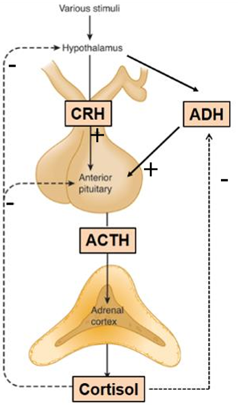
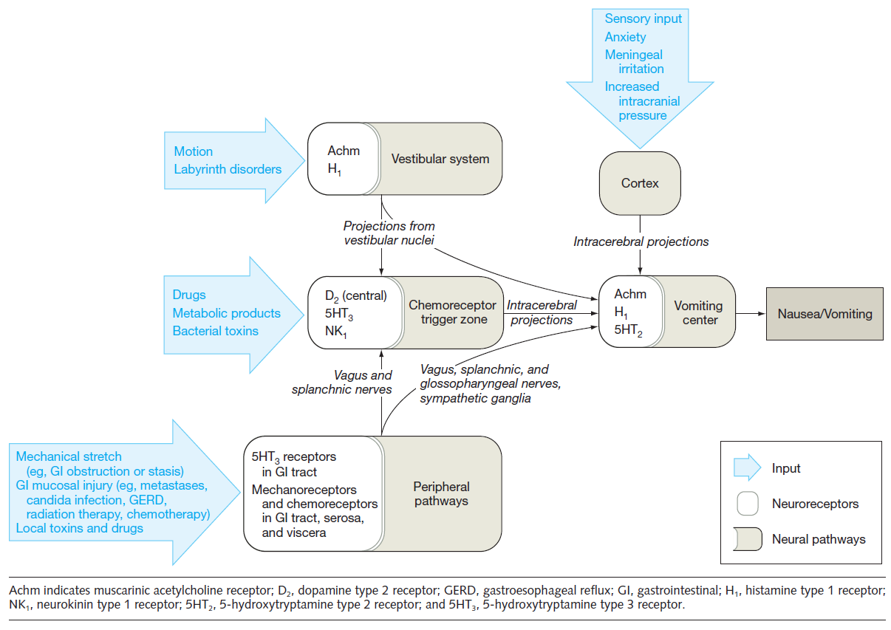

# Cardiología
## Emergencias hipertensivas

## Insuficiencia cardíaca

[diagnóstico IC FEp](https://watermark.silverchair.com/eurheartj_40_40_3297.pdf?token=AQECAHi208BE49Ooan9kkhW_Ercy7Dm3ZL_9Cf3qfKAc485ysgAAAt8wggLbBgkqhkiG9w0BBwagggLMMIICyAIBADCCAsEGCSqGSIb3DQEHATAeBglghkgBZQMEAS4wEQQMXzL2Z-LI4xwE61X3AgEQgIICkioZWPCBa0Slu2-xjwqE-7CY7IDTrxn8V2mwaXRq157imkH1ZkJ8dK4BMfye8O0PcCLPRMJVka9pxzS_qXCWPIXLhrd_xD-lcaxc4uhnf0zdiFES_cjI3kchJaBw3UN0r3SJEkJ9w_I79WUukFk3Tfu75ldqdogKtKE8xEpSqc1nf2F6DqzqQ3Pi0WQKLAl8b3llvfx8oeDUlXuk1eZ2tYmNvsJ0MjRvfkpAEhlr0AzBlP6MaanUY8pkn84LSilprn-akinE8XtwK5u60W3ETZtF8f6yuiJZABkJsq_-Zv3kK8pEQIFBK5JYgQrKhkvukArJ78lHRTf1mJ93i-8CnRmvmcNDYGhQWpifx-3SB63csGP5wxieijmr5IP_1PwpZvCBesNGp2gAswdx2EYDqSaF2C0MMj_iIh4_geOLBTxWS1Jhq7Teg24jfTjthl7cHEnRz6UyVKAI82dGurMNuSHpWZAspvP5X24E3qxQu-yO8WVqKUeyNYj2JN8D_unZwGoUc9qvFN92jHmHNh3S5fN0_9gZArQ3b76OoPu3pSIgbLx-FumJIBg1Rak41NssuK6_QNQhGdiIb_kqA78gT3EFToLdwg3-mRVQ8244HziDmRmBBAy5tZeM8mldud8xc7zdv6Oyhk-ALr7FG6ID75dXo2HAOOqKqmTgQw0GJMQrR06pftvdsAHK9L85rCJFqlWpAZWAuK3kbVnILaOdKzb2LYowcRgGl6InuK6-l2P5-zk5IpOyzHdF53UTOR9l0GdKAuKjnytFIDNd-6VY0fYwcZZHpphK3YlEXo22uhxj1tMiEJawsRhRsNg1O5w1mXAgSGtDAN2y63MbIjeEIbXViZH0nnnbHn8020KqQ80uovk)

## Selección y planificación revascularización en SCA

| muy alto riesgo | alto riesgo | riesgo bajo |
|---|:---:|:---:| 
| invasiva inmediata (1-2h) | invasiva precoz (24h) | invasiva selectiva| |
| 1) **Inestabilidad** HDN | 1) diagnóstico confirmado **IAMSEST** |
| 2) **Shock** cardiogénico | 2) **Cambios dinámicos** contiguos o presumiblemente nuevos en el ECG | |
| 3) **ICA** relacionada claramente con el SCASEST | 3) RCP por **PCR** sin elevación de ST o shock cardiogénico |
| 4) **Arritmias** potencialmente mortales | 4) **GRACE** > 140 |
| 5) Complicaiones **mecánicas** de IAM | |
| 6) (**sospecha enf multivaso**) Depresión ST > 1mm en 6  derivaciones y elevación en aVR o V1 |
| 7) **Dolor torácico **recurrente o refractario a tto médico | |

## Síndromes coronarios crónicos
1) pacientes con sospecha de EC y síntomas de **angina «estable» o disnea**;
2) pacientes con un **nuevo episodio de IC** o disfunción del VI y sospecha de EC;
3) pacientes asintomáticos y sintomáticos con síntomas estables **menos de 1 año** después de sufrir un **SCA** o pacientes revascularizados recientemente;
4) pacientes asintomáticos o sintomáticos tras **más de 1 año** desde el diagnóstico inicial o la revascularización; 
5) pacientes con angina y sospecha de **enfermedad vasoepástica o microvascular**, y
6) sujetos asintomáticos en los que se detecta **EC en el cribado**

Clasificación angina

## Selección de prueba diagnóstica para px con "1)"
Probabilidad pretest

| |   |
|:---:|:---:|

# Nefrología
## ácido-base

| trastorno primario | formula para compensasión | 
|---|---|
| acidosis metabólica | pCO2 final = 1.5 x [HCO3] + 8 ± 2  (fórmula de Winter, sumarle la mitad + 8)|
| alcalosis metabólica | pCO2 final = [0.7 x (HCO3 - 24) + 40 ± 2 (ΔPCO2 =  **ΔHCO3 x 0.7**) |
| acidosis respiratoria | <li> aguda: ΔHCO3 = 1 mEq/L x ΔPCO2/10 <li> crónica: ΔHCO3 = 3-4 mEq/L x ΔPCO2/10 |
| alcalosis respiratoria (es **más fácil bajar el bicarb** que subirlo) | <li> aguda: ΔHCO3 = 2 mEq/L x ΔPCO2/10 <li> crónica: ΔHCO3 = 5 mEq/L x ΔPCO2/10 |

## Alteraciones electrolíticas

### Hiperkalemia

Medidas para ingresar K a células
- Insulina (puede administrarse sola solo si la glucemia es >250 mg/dl)

| insulina | glucosa bolo | glucosa infusión | monitoreo |
|---|---|---|---|
| bolo 10 U iv | 25 g Gluc iv  (50ml glucosa 50%) | luego infusión glucosa 10% a 50-75 ml/h | cada 5 a 6 horas |
| infusión 10 U/h iv  | en 500 ml glucosa 10% (50 g glucosa) en 60 minutos | | cada 5 a 6 horas |
| 4-8 U insulina iv | 20-40 ml glucosa 40% (8g-16g) | |  |

(1 U de insulina por cada 5 g de glucosa).

Eso debería bajar 0.5 a 1.2 mEq/L. Recordar que la insulina dura 4 a 6 horas.

- B2 agonistas

Salbutamol

| dosis | vía | tiempo |
|---|---|---|
| 10-20 mg en 4 ml| NBZ | en 10 minutos|
| 0.5 mg | iv en 100 ml G 5% | en 15 minutos |

inicio acción 6 a 8 minutos, dura hasta 2 h

- "Bicarbonato": En caso de acidosis, administrar además 50 ml de NaHCO3 al 8,4% (la mitad de 1/6 M)

Eliminar K del organismo
- Diuréticos de asa y tiacidas
Furosemida: 
  - si función renal buena: 40 mg c/12h (bolos o infusión). Si está eu/hipovolémico, dar sol salina para repletar o mantener volemia.
  - si función renal mala: salina + bicarbonato isotónico + furo ajustada

- Intercambiadores de cationes gastrointestinales:
  - Patiromer 8.4 g VO repetido diariamente según necesidad
  - Ciclosilicato de Zirconio y sodio 10 g VO c/8h 

- Diálisis
La hemodiálisis puede eliminar de 25 a 50 mEq de K por hora, con variabilidad basada en el K sérico inicial.

## Vista general causas hematuria
<table>
<thead>
<tr>
<th colspan="4" scope="row">Common causes of hematuria in adults</th> </tr>
<tr>
<th scope="row">Condition</th> <th>Characteristic clinical features</th> <th>Diagnostic findings</th> <th class="additional">Management</th> </tr>
</thead>
<tbody>
<tr>
<th scope="row">Glomerulonephritis</th> <td> <ul>
<li>Edema</li> <li>Hypertension</li> </ul>
</td> <td> <ul>
<li>UA: nephritic sediment
</li> <li>Blood: ↑ Creatinine, ↓ GFR, ↑ BUN </li> <li>
Biopsy confirms the diagnosis.</li> </ul>
</td> <td class="additional"> <ul>
<li>Management is determined by underlying etiology.</li> <li>See “Management of nephritic syndrome.”</li> </ul>
</td> </tr>
<tr>
<th scope="row"> Nephrolithiasis [14]
</th> <td> <ul>
<li>
Dysuria, ↑ frequency, ↑ urgency </li> <li>Inability to sit still</li> <li>Severe unilateral and colicky flank pain [15]
</li> <li>CVA tenderness</li> <li>
Nausea, vomiting, and reduced bowel sounds</li> </ul>
</td> <td> <ul>
<li>CT abdomen and pelvis without contrast  [16] <ul>
<li>Calculi ≥ 1 mm
</li> <li>Location and density of calculi</li> <li>
Hydronephrosis and/or hydroureter
</li> <li>
Perinephric fat stranding</li> </ul>
</li> <li>See “Diagnostics for nephrolithiasis.”</li> </ul>
</td> <td class="additional"> <ul>
<li>
Pain management, e.g., ketorolac DOSAGE  [17]
</li> <li>Hydration</li> <li>
Medical expulsive therapy, e.g., tamsulosin (off-label) DOSAGE  [18]
</li> <li>See “Treatment of nephrolithiasis.”</li> </ul>
</td> </tr>
<tr>
<th scope="row">Urinary tract infection</th> <td> <ul>
<li>
Dysuria, ↑ frequency, ↑ urgency </li> <li>Suprapubic tenderness</li> <li>♀ &gt; ♂</li> </ul>
</td> <td> <ul>
<li>UA [19] <ul>
<li>
Pyuria, leukocyte esterase, urine nitrites</li> <li>
≥ 5 WBCs per HPF or ≥ 8–10 WBCs per mm3 </li> <li>Bacteriuria</li> </ul>
</li> <li>
Complicated pyelonephritis: CT abdomen/pelvis with and without contrast  [20] <ul>
<li>Renal parenchyma: normal (early) or hypodense
</li> <li>Infected parenchyma: wedge-shaped areas of streaky contrast enhancement
</li> </ul>
</li> <li>See “Diagnostics for UTI.”</li> </ul>
</td> <td class="additional"> <ul>
<li>Antibiotic treatment of uncomplicated lower UTIs</li> <li>Antibiotic treatment of complicated lower UTIs</li> <li>Increased fluid intake</li> </ul>
</td> </tr>
<tr>
<th scope="row"> Urethritis [21]
</th> <td> <ul>
<li>Initial hematuria</li> <li>Dysuria</li> <li>Burning or itching of the external urethral meatus
</li> <li>Urethral discharge</li> <li>Risk factors for STIs</li> </ul>
</td> <td> <ul>
<li>Urethral smear (preferred): ≥ 2 WBCs per oil immersion field</li> <li>
First-catch urine: positive leukocyte esterase or ≥ 10 WBCs per HPF
</li> <li>
Gram stain: gram-negative intracellular diplococci
</li> <li>
NAAT of first-catch urine for gonorrhea and chlamydia
</li> <li>See “Diagnostics for urethritis.”</li> </ul>
</td> <td class="additional"> <ul>
<li>
Antibiotics, e.g., ceftriaxone, doxycycline
</li> <li>Treatment of sexual partners</li> <li>See “Treatment of urethritis.”</li> </ul>
</td> </tr>
<tr>
<th scope="row"> Prostatitis [22][23]
</th> <td> <ul>
<li>
Dysuria, ↑ frequency, ↑ urgency </li> <li>
Fever, chills</li> <li>Perineal pain
</li> <li>Low back pain</li> <li>
Pain with defecation</li> <li>Clinical diagnosis</li> </ul>
</td> <td> <ul>
<li>
DRE: tender, boggy prostate
</li> <li>UA: ↑ WBCs
</li> <li>
Urine culture: bacteria, most commonly E. coli [24]
</li> </ul>
</td> <td class="additional"> <ul>
<li>
Empiric antibiotics for prostatitis, e.g., ciprofloxacin
</li> <li>
Pain management, e.g., NSAIDs
</li> <li>
Alpha-blockers for lower urinary tract symptoms
</li> </ul>
</td> </tr>
<tr>
<th scope="row"> Urinary tract cancer [10][11]
</th> <td> <ul>
<li>Painless</li> <li>Irritation when voiding</li> <li>
♂ &gt; ♀ [25]
</li> <li>Peak incidence: 60–70 years [26][27]
</li> <li>See “Clinical features of urinary tract cancer.”</li> </ul>
</td> <td> <ul>
<li>
CT urography (initial)  [10][28] <ul>
<li>Filling defects</li> <li>Hydronephrosis</li> <li>Mural thickening</li> <li>Evidence of disease spread (e.g., lymphadenopathy)</li> <li>Mass or masses</li> </ul>
</li> <li>
Cystoscopy or ureteroscopy for direct visualization</li> </ul>
</td> <td class="additional"> <ul>
<li>Surgical resection</li> <li>
Neoadjuvant chemotherapy and/or radiation therapy
</li> <li> See also: <ul>
<li>“Treatment of bladder cancer”</li> <li>“Treatment of carcinoma of the renal pelvis and ureters”</li> <li>“Treatment of urethral carcinoma”</li> </ul>
</li> </ul>
</td> </tr>
<tr>
<th scope="row">Renal cell carcinoma</th> <td> <ul>
<li>Painless or flank pain
</li> <li>Palpable renal mass</li> <li>Weight loss, fever, night sweats</li> <li>
♂ &gt; ♀ [29]
</li> <li>Peak incidence: 55–74 years of age [29]
</li> </ul>
</td> <td> <ul>
<li>CT, MRI, or ultrasound abdomen with IV contrast  [30][31] <ul>
<li>
≥ 1 heterogeneous lesions with thickened irregular walls, calcification, and variable enhancement [32]
</li> <li>Distorted renal outline</li> </ul>
</li> <li>See “Diagnostics for renal cell carcinoma.”</li> </ul>
</td> <td class="additional"> <ul>
<li>Partial or radical nephrectomy for local or locoregional disease</li> <li>
Targeted therapy and immunotherapy for metastatic disease</li> <li>See “Treatment of renal cell carcinoma.”</li> </ul>
</td> </tr>
<tr>
<th scope="row">Prostate cancer</th> <td> <ul>
<li>Painless; bone pain in advanced stages</li> <li>Lower urinary tract symptoms</li> <li>
&gt; 50 years of age</li> </ul>
</td> <td> <ul>
<li>
↑ PSA [33]
</li> <li>
DRE: Hard nontender nodules
</li> <li>
mpMRI [34]
</li> <li>Prostate biopsy</li> <li>See “Diagnostic approach to suspected prostate cancer.”</li> </ul>
</td> <td class="additional"> <ul>
<li>Based on cancer stage, presence of high-risk features, patient factors [35][36]
</li> <li>
Active surveillance for low-risk cancer</li> <li>
Androgen deprivation therapy, prostatectomy, and/or radiotherapy as indicated</li> <li>See “Management of prostate cancer.”</li> </ul>
</td> </tr>
<tr>
<th scope="row">Urinary tract obstruction</th> <td> <ul>
<li>Flank pain
</li> <li>Urinary retention</li> <li>Frequent infections</li> <li>More common in older adults with prostate hypertrophy
</li> </ul>
</td> <td> <ul>
<li>
↑ Postvoid residual: lower UTO
</li> <li>Renal and urinary tract ultrasound  <ul>
<li>Hydronephrosis</li> <li>Hydroureter</li> <li>Perinephric fluid</li> </ul>
</li> </ul>
</td> <td class="additional"> <ul>
<li> Relief of obstruction, e.g.: <ul>
<li>
Lower UTO: Foley catheter
</li> <li>Upper UTO: ureteral stent (first line) or percutaneous nephrostomy (second line)</li> </ul>
</li> <li>See “Treatment of urinary tract obstruction.”</li> </ul>
</td> </tr>
<tr>
<th scope="row">Polycystic kidney disease</th> <td> <ul>
<li>Hypertension</li> <li>Flank or abdominal pain
</li> <li>Palpable kidneys
</li> <li>Often hereditary</li> <li>Age of onset &gt; 30 years
</li> </ul>
</td> <td> <ul>
<li>
Ultrasound  <ul>
<li>Enlarged kidneys with multiple cysts bilaterally</li> <li>Hepatic, pancreatic, and/or splenic cysts</li> </ul>
</li> <li>
Genetic testing: PKD1 or PKD2 gene
</li> </ul>
</td> <td class="additional"> <ul>
<li>
Hypertension management with ACE inhibitors or ARBs
</li> <li>Avoidance of nephrotoxic substances
</li> <li>Renal replacement therapy</li> <li>
Renal transplantation in ESRD
</li>  </ul>
</td> </tr>
<tr>
<th scope="row">Renal papillary necrosis</th> <td> <ul>
<li>Colicky flank pain
</li> <li>Passing of tissue fragments</li> <li>History of, e.g., sickle cell disease, acute pyelonephritis, urinary tract obstruction
</li> </ul>
</td> <td> <ul>
<li>
↑ BUN, ↑ creatinine
</li> <li>
CT urography [37] <ul>
<li>Small, contrast-enhancing papillary cavities abutting the calices</li> <li>Filling defects in the renal pelvis due to irregular papillae
</li> </ul>
</li> </ul>
</td> <td class="additional"> <ul>
<li>
IV fluid therapy to maintain high urine output</li> <li>Treatment of the underlying cause</li> </ul>
</td> </tr>
</tbody>
</table>

## Glomerulopatías

Terminología:
- Primaria: una enfermedad renal que afecta específicamente a los glomérulos (por ejemplo, glomerulonefritis por cambios mínimos)
- Secundaria: una enfermedad que afecta a los glomérulos en el contexto de una enfermedad sistémica (por ejemplo, nefritis lúpica en el LES) o una enfermedad que afecta a otro órgano (por ejemplo, nefropatía diabética)
- Difusa: > 50% de los glomérulos afectados (por ejemplo, glomerulonefritis proliferativa difusa)
- Focal :< 50% de los glomérulos afectados (por ejemplo, glomeruloesclerosis segmentaria focal)
- Global: todo el glomérulo está afectado
- Segmentaria: sólo está afectada una parte del glomérulo
- Proliferativa: aumento del número de células en el glomérulo
- Membranosa: engrosamiento de la membrana basal glomerular (por ejemplo, nefropatía membranosa)
- Esclerosante: cicatrización del glomérulo
- Necrotizante: muerte celular dentro del glomérulo
- Crescéntica: acumulación de células como macrófagos, fibroblastos y células epiteliales en el espacio de Bowman

### Síndrome nefrótico

Mecanismo: alteración permeabilidad glomerular (alt podocitaria, barrera de filtración glomerular)
- por disminución VAE --> activación SRAA --> retención Na y H2O (aumento de edema)
- Hipoalbuminemia --> 
	- déficit hepático para síntesis proteínas --> menor producción de prot antitrombóticas --> estado protrombótico 
	- Disminución de inmunoglobulinas --> inmunodeficiencia

Definición: 
- Proteinuria > 3.5 g/día (o equivalente en IPC)
- Hipoalbuminemia < 3.0 g/dL
- Edema
- hiperlipidemia (hipercolesterolemia LDL e hipertrigliceridemia)
- Lipiduria: cilindros grasos, cuerpos ovales grasos, cruces de malta, grasa libre

Enf cambios mínimos = Nefrosis lipídea 

#### Vista general
<table>
<thead>
<tr>
<th colspan="5" scope="row"> Differential diagnoses of nephrotic syndrome
</th> </tr>
<tr>
<th scope="row">Disease</th> <th scope="col">Epidemiology</th> <th scope="col"> 
Associations
 </th> <th scope="col">Findings</th> <th scope="col"> 
Treatment
 </th> </tr>
</thead>
<tbody>
<tr>
<th scope="row"> 
Minimal change disease (lipoid nephrosis)
 </th> <td> <ul>
<li>Most common cause of nephrotic syndrome in children</li> </ul>
</td> <td> <ul>
<li>Often idiopathic</li> <li>
Secondary causes (rare) <ul>
<li>Immune stimulus (e.g., infection, immunization)</li> <li>Tumors (e.g., Hodgkin lymphoma)</li> <li>Certain drugs (e.g., NSAIDs)</li> </ul>
</li> </ul>
</td> <td> <ul>
<li>
LM: no changes (possibly fat bodies in some proximal tubular cells) 
</li> <li>IM: negative</li> <li>
EM: effacement of podocyte foot processes 
</li> <li>
Selective glomerular proteinuria [7]
</li> </ul>
</td> <td> <ul>
<li>Responds well to prednisone</li> <li>Good prognosis</li> </ul>
</td> </tr>
<tr>

<th scope="row">Focal segmental glomerulosclerosis</th> <td> <ul>
<li>Most common cause of nephrotic syndrome in adults, especially in African American  and Hispanic populations</li> </ul>
</td> <td> <ul>
<li>Can be idiopathic</li> <li>Heroin use</li> <li>HIV infection </li> <li>Sickle cell disease</li> <li>Massive obesity</li> <li>Interferon treatment</li> <li>
Congenital malformations (e.g., Charcot-Marie-Tooth syndrome) [8][9]
</li> <li>NPHS1 and NHPS2 mutations</li> </ul>
</td> <td> <ul>
<li>
LM: segmental sclerosis and hyalinosis 
</li> <li>
IM <ul>
<li>Most commonly negative</li> <li>
Possibly IgM, C1, and C3 deposits inside the sclerotic regions</li> </ul>
</li> <li>
EM: effacement of podocyte foot processes (similar to minimal change disease) 
</li> </ul>
</td> <td> <ul>
<li>Prednisone (often shows poor response)</li> <li>
If necessary, PLUS other immunosuppressants (e.g., cyclosporine, tacrolimus)</li> <li>RAAS inhibitors</li> <li>Usually leads to ESRD if left untreated</li> </ul>
</td> </tr>

<tr>
<th scope="row">Membranous nephropathy</th> <td> <ul>
<li>Most common cause of nephrotic syndrome in adults of European, Middle Eastern, or North African descent</li> </ul>
</td> <td> <ul>
<li>Primary: anti-PLA2R antibodies</li> <li>
Secondary:  <ul>
<li>Infections (HBV, HCV, malaria, syphilis)</li> <li>
Autoimmune diseases (e.g., SLE)
</li> <li>
Tumors (e.g., lung cancer, prostate cancer)
</li> <li>
Medications (e.g., NSAIDs, penicillamine, gold) [10]
</li> </ul>
</li> </ul>
</td> <td> <ul>
<li>
LM <ul>
<li>
Diffuse thickened glomerular capillary loops and basement membrane  
</li> <li>
Granular subepithelial deposits   of IgG and C3 (dense deposits) → spike and dome appearance   </li> </ul>
</li> </ul>
</td> <td> <ul>
<li>RAAS inhibitors</li> <li>Prednisone (often shows poor response)</li> <li>PLUS other immunosuppressants (e.g., cyclophosphamide) in severe disease</li> <li>Usually leads to ESRD if left untreated</li> </ul>
</td> </tr>

<tr>
<th scope="row">Diabetic nephropathy</th> <td> <ul>
<li>Leading cause of ESRD in high-income countries</li> </ul>
</td> <td> <ul>
<li>Usually additional signs of other organ system complications (e.g., retinopathy, neuropathy)</li> </ul>
</td> <td> <ul>
<li>
LM <ul>
<li>
Thickening of the glomerular basement membrane (increased permeability) </li> <li>
Eosinophilic nodular glomerulosclerosis (Kimmelstiel-Wilson nodules) 
</li> </ul>
</li> <li>
EM <ul>
<li>Thickening of the glomerular basement membrane</li> <li>Mesangial matrix expansion</li> <li>Segmental effacement of podocyte foot processes</li> </ul>
</li> </ul>
</td> <td> <ul>
<li>Stringent glycemic control</li> <li>RAAS inhibitors</li> </ul>
</td> </tr>
<tr>
<th scope="row">Amyloid nephropathy</th> <td> <ul>
<li>More commonly seen in elderly patients [11]
</li> </ul>
</td> <td> <ul>
<li>The kidney is the most commonly affected organ in systemic amyloidosis.</li> <li>Other organs might be involved simultaneously (e.g., the heart).</li> <li>Multiple myeloma(AL amyloidosis)</li> <li>Chronic inflammatory disease, e.g., tuberculosis, rheumatoid arthritis (AA amyloidosis)</li> </ul>
Ojo: equimosis periorbitaria, lengua macroglosia, hepatomegalia, neuropatía periférica, cardiomiopatía restrictiva
</td> <td> <ul>
<li>
LM <ul>
<li>Mesangial proliferation</li> <li>Subendothelial and/or subepithelial immune complex deposition</li> <li>Thickening of the capillary walls (appear as wire loops)  </li> <li>
Congo red stain: amyloid deposition in the mesangium showing apple-green birefringence under polarized light 
</li> <li>Nodular glomerulosclerosis</li> </ul>
</li> <li>
IM: positive for AA protein (AA amyloidosis), positive for kappa and lambda light chains (AL amyloidosis) </li> <li>EM: amyloid fibrils</li> </ul>
</td> <td> <ul>
<li>Melphalan, corticosteroids</li> <li>
Treatment of underlying disease (e.g., bone marrow transplantation may be used for multiple myeloma)</li> </ul>
</td> </tr>
<tr>
<th scope="row">Membranoproliferative glomerulonephritis</th> <td colspan="4" rowspan="1"> <ul>
<li>
Usually manifests with nephritic sediment, which can indicate: <ul>
<li>Nephritic-nephrotic syndrome: if there is concomitant nephrotic-range proteinuria (&gt; 3.5 g/24 hours)</li> <li>Pure nephritic syndrome: if there is no proteinuria or proteinuria is below nephrotic range (&lt; 3.5 g/24 hours)</li> </ul>
</li> <li>See “Nephritic syndrome.”</li> </ul>
</td> </tr>
<tr>
<th colspan="5" scope="row">LM = light microscopy, IM = immunofluorescent microscopy, EM = electron microscopy
</th> </tr>
</tbody>
</table>

#### Tratamiento general

- Edema: 
	- Diuréticos asa +- tiazidas, iSRAA. Diuréticos endosis elevadas (Los diuréticos más comunes están muy ligados a las proteínas y actúan sobre la membrana tubular renal luminal. Entre los mecanismos de resistencia a los diuréticos en el síndrome nefrótico se incluyen la escasa biodisponibilidad oral por edema intestinal, el elevado volumen de distribución en la hipoalbuminemia (que conduce a una disminución de la administración del fármaco a los riñones), la unión del fármaco en la luz tubular por proteínas filtradas, la retención compensatoria de sodio y otros mecanismos adaptativos)
		- Furosemida 40 mg 2 veces al día
		- 2a línea, agregar tiazidas
		- Considerar alúmina adyuvante EV 0.5 g/kg 1 vez 30-60 minutos antes dediurético de asa
	- restricción Na
	- Restricción de líquidos < 1.5 L/día
- Proteinuria: principal objetivo del tto por implicancia en resto de manifestaciones
	- Terapia antiproteinúrica: iSRAA. Evitar en AKI, hiperK, instalación abrupta de nefrótico
	- Evitar dieta alta en proteínas pero mantener ingesta adecuada (0.8-1 g/kg/día)
- Dislipidemia:
	- Estatinas (atorvastatina 10-20 mg/día). Indicaciones similares a paciente con alto RCV
- Hipercoagulabilidad: Profilaxis o tto antitrombótico
	- Considerar caso a caso con HNF, HBPM, TACO. Poca evidencia en DOAC. Hasta albúmina > 3g/dL
		- Albúmina < 2-2.5 g/dL
		- Nefropatía membranosa primaria
		- Coexistencia de otros FR para trombosis (inmovilización, antecedente de trombosis, IMC >35 kg/m2, ICC NYHA III-IV, etc)
		- Evaluar HAS-BLED >=3
		- Tto antitrombótico si trombosis arterial, venosa o TEP.
- Riesgo infecto
	- Screening de infecciones latentes (TB, VHB, VHC, VIH, sifilis, strongiloidiasis, otros según FR)
	- Prevención:
		- Vacuna antineumocócica, influenza
		- Considerar IgIV si infecciones bacterianas repetidas e IgG < 600 mg/dL
		- Considerar profilaxis PCP con TMP-SMX en pacientes con corticoides altas dosis u otras terapias inmunosupresoras

### Síndrome urinario

Inventado por un profe para hacer referencia a:
- proteinuria y/o hematuria glomerular
- Puede acompañarse de:
	- HTA
	- Edema
	- Deterioro de función renal

Nefropatía por IgA (enf de Berger) suele presentarse así. Defecto en galactosidación de IgA1, se acumula en mesangio, se expande la matriz y proliferan las c mesangiales

Complemento Normal

Caso típico:
- Hombre joven 
- cuadro infeccioso mucoso (respiratorio o gastrointestinal) que inicio hace pocos días y se presenta con hematuria macroscópica reccurrente
- Hematuria microscópica persistente, se va agregando proteinuria e HTA
- 30-50% IgA elevada en plasma

Forma sistémica --> vasculitis  Henoch-Schönlein. Asociación con enf hepáticas y autoinmunes (celiaca, hepatitis autoinmune, DM1)

Tto: Controversial
- Antiproteinúricos (iECA, ARAII)
- Algún rol la inmunosupresión en ciertos casos
- Control PA
- iSGLT-2 (mejoran feedback tubuloglomerular)

### Síndrome nefrítico 

Alteración capilar glomerular

- Hematuria
- HTA (por activación endotelial)
- Edema
- Proteinuria no nefrótica
- Puede haber deterioro función renal

Clasif según con o sin hipocomplementemia

Con hipocomplementemia:
- Glomerulonefritis postestreptocócica
- Glomerulonefritis post-infecciosa
- Glomerulonefritis lúpica
- Glomerulopatía C3
- Crioglobulinemia
- Enfermedad renal ateroembólica

<table>
<thead>
<tr>
<th colspan="5" scope="row"> Overview of immune complex-mediated glomerulonephritis [1][4]
</th> </tr>
<tr>
<th colspan="2" rowspan="1" scope="row"></th> <th scope="col">Poststreptococcal glomerulonephritis</th> <th scope="col"> IgA nephropathy (Berger disease) </th> <th scope="col">Lupus nephritis</th> </tr>
</thead>
<tbody>
<tr>
<th colspan="2" rowspan="1" scope="row">Epidemiology</th> <td> <ul>
<li>
Usually affects children 3–12 years of age and individuals &gt; 60 years of age [14][15]
</li> </ul>
</td> <td> <ul>
<li>Most common type of primary glomerulonephritis worldwide</li> <li>
♂ &gt; ♀ [16]
</li> <li>Peak incidence: 2nd to 3rd decade of life [17]
</li> </ul>
</td> <td> <ul>
<li>Common: found in up to 50% of individuals with SLE at presentation [18]
</li> </ul>
</td> </tr>
<tr>
<th colspan="2" scope="row">Pathophysiology</th> <td> <ul>
<li>Type III hypersensitivity reaction</li> <li>
weeks after group A beta-hemolytic streptococcal infections <ul>
<li>Pharyngitis and/or tonsillitis (most common): 1–3 weeks after infection</li> <li>Skin infections: 1–6 weeks after infection</li> </ul>
</li> </ul>
</td> <td> <ul>
<li>Type III hypersensitivity reaction</li> <li>
IgA antibodies form immune complexes that deposit in the renal mesangium. [19]
</li> <li>Mesangial cell and complement system activation</li> </ul>
</td> <td> <ul>
<li>Connective tissue disease</li> </ul>
</td> </tr>
<tr>
<th colspan="2" rowspan="1" scope="row">Distinguishing features</th> <td> <ul>
<li>Periorbital and peripheral edema</li> <li> Hypertension </li> <li> Tea- or cola-colored urine </li> <li>Usually self-limiting in children</li> <li>May lead to rapidly progressive glomerulonephritis (RPGN), which can cause renal insufficiency  in adults</li> </ul>
</td> <td> <ul>
<li>
 Asymptomatic microhematuria with intermittent gross hematuria during or directly after one or more of the following:  <ul>
<li>Upper respiratory tract infections</li> <li>Gastrointestinal infections </li> <li>Strenuous exercise</li> </ul>
</li> <li>
20–40% progress to ESRD within 20 years. [20]
</li> </ul>
</td> <td> <ul>
<li>Pleuritis</li> <li>Malar rash</li> <li>Joint pain</li> <li>Anemia</li> </ul>
</td> </tr>
<tr>
<th colspan="2" rowspan="1" scope="row">Laboratory studies</th> <td> <ul>
<li>Positive antistreptococcal antibodies (ASO, ADB)</li> <li>
 ↓ Serum C3 complement levels  (due to consumption) </li> </ul>
</td> <td> <ul>
<li>↑ Serum IgA</li> <li> Normal C3 complement levels </li> </ul>
</td> <td> <ul>
<li>Positive anti-dsDNA antibodies</li> <li>↓ Serum C3 complement  levels</li> </ul>
</td> </tr>
<tr>
<th colspan="1" rowspan="3" scope="row">Renal biopsy</th> <th scope="row">LM</th> <td colspan="3" rowspan="1"> <ul>
<li>
Glomeruli appear enlarged and hypercellular.  
</li> </ul>
</td> </tr>
<tr>
<th scope="row">IM</th> <td colspan="3"> <ul>
<li>
Granular subepithelial immune complex deposits (IgG, IgM, C3) along the GBM and the mesangium  
</li> <li>So-called “lumpy bumpy” or “starry sky” appearance</li> <li>
Diffuse proliferative glomerulonephritis (most common with SLE); see “Classification of lupus nephritis.”  </li> </ul>
</td> </tr>
<tr>
<th scope="row">EM</th> <td colspan="3" rowspan="1"> <ul>
<li>PSGN shows dome-shaped, subepithelial immune complex deposits (humps)</li> </ul>
</td> </tr>
<tr>
<th colspan="2" rowspan="1" scope="row">Management</th> <td colspan="3" rowspan="1"> <ul>
<li>Glucocorticoids ± immunosuppressive therapy</li> <li>PSGN: antibiotic therapy</li> </ul>
</td> </tr>
<tr>
<th colspan="5" scope="row">LM = light microscopy, IM = immunofluorescent microscopy, EM = electron microscopy
</th> </tr>
</tbody>
</table>

<table>
<thead>
<tr>
<th colspan="3" scope="row"> Overview of anti-GBM disease [1][4]
</th> </tr>
<tr>
<th colspan="2" rowspan="1" scope="row"></th> <th scope="col">Anti-GBM disease (Goodpasture disease)</th> </tr>
</thead>
<tbody>
<tr>
<th colspan="2" rowspan="1" scope="row">Epidemiology</th> <td> <ul>
<li>Two peaks of occurrence [12] <ul>
<li>
20–30 years (♂ &gt; ♀) </li> <li>
60–70 years (♀ &gt; ♂)
</li> </ul>
</li> </ul>
</td> </tr>
<tr>
<th colspan="2" scope="row">Pathophysiology</th> <td> <ul>
<li>
Type II hypersensitivity reaction: autoantibodies against collagen type IV in the renal and pulmonary capillary basement membranes 
</li> </ul>
</td> </tr>
<tr>
<th colspan="2" rowspan="1" scope="row">Distinguishing features</th> <td> <ul>
<li>Pulmonary infiltrates on chest x-ray</li> <li>
Pulmonary hemorrhage and hemoptysis 
</li> <li>Cough</li> <li>Dyspnea</li> <li>Usually manifests as RPGN</li> </ul>
</td> </tr>
<tr>
<th colspan="2" rowspan="1" scope="row">Laboratory studies</th> <td> <ul>
<li>
Anti-GBM antibodies against type IV collagen 
</li> <li>Hemosiderin-filled macrophages in sputum</li> <li>Iron deficiency anemia</li> </ul>
</td> </tr>
<tr>
<th colspan="1" rowspan="2" scope="row">Renal biopsy</th> <th scope="row">IM</th> <td> <ul>
<li>Linear deposition of immunoglobulin (IgG) along the glomerular and alveolar basement membranes</li> <li>
Proliferative glomerulonephritis (early) [13]
</li> <li>
Necrosis and crescentic glomerulonephritis (late) [13]
</li> </ul>
</td> </tr>
<tr>
<th scope="row">EM</th> <td> <ul>
<li>Breaks in the GBM</li> <li>No electron-dense deposits</li> <li>Necrosis</li> </ul>
</td> </tr>
<tr>
<th colspan="2" rowspan="1" scope="row">Management</th> <td> <ul>
<li>High-dose glucocorticoids ± cyclophosphamide</li> <li>Plasmapheresis</li> </ul>
</td> </tr>
<tr>
<th colspan="3" rowspan="1" scope="row">IM = immunofluorescent microscopy, EM = electron microscopy
</th> </tr>
</tbody>
</table>

<table>
<thead>
<tr>
<th colspan="5" scope="row"> Overview of ANCA-associated glomerulonephritis (pauci-immune glomerulonephritis) [1][4][10]
</th> </tr>
<tr>
<th colspan="2" rowspan="1" scope="row"></th> <th scope="col">Granulomatosis with polyangiitis</th> <th scope="col">Eosinophilic granulomatosis with polyangiitis (Churg-Strauss syndrome)</th> <th scope="col">Microscopic polyangiitis</th> </tr>
</thead>
<tbody>
<tr>
<th colspan="2" rowspan="1" scope="row">Epidemiology</th> <td> <ul>
<li>♂ &gt; ♀</li> <li>Most frequent: 40–60 years of age [21]
</li> </ul>
</td> <td> <ul>
<li>Least common type of small vessel vasculitis
</li> <li>Peak incidence: 38–54 years of age [22]
</li> </ul>
</td> <td> <ul>
<li>♂ &gt; ♀</li> <li>Peak incidence: 50–60 years of age [23]
</li> </ul>
</td> </tr>
<tr>
<th colspan="2" scope="row">Pathophysiology</th> <td colspan="2" rowspan="1"> <ul>
<li>Granulomatous vasculitis</li> </ul>
</td> <td> <ul>
<li>Necrotizing vasculitis (no granulomas)</li> </ul>
</td> </tr>
<tr>
<th colspan="2" rowspan="1" scope="row">Distinguishing features</th> <td> <ul>
<li>
Nasopharyngeal, e.g.: <ul>
<li>Chronic sinusitis</li> <li>Nasal ulcers</li> <li>Perforation of the nasal septum</li> </ul>
</li> <li>Pulmonary: e.g., nodules, cavitating lung lesions, hemoptysis
</li> </ul>
</td> <td> <ul>
<li>Asthma</li> <li>Allergic rhinitis</li> <li>Peripheral neuropathy</li> </ul>
</td> <td> <ul>
<li>
Respiratory symptoms <ul>
<li>Dyspnea</li> <li>Cough</li> <li>Hemoptysis</li> </ul>
</li> </ul>
</td> </tr>
<tr>
<th colspan="2" rowspan="1" scope="row">Laboratory findings</th> <td> <ul>
<li>c-ANCA/PR3-ANCA</li> </ul>
</td> <td> <ul>
<li>p-ANCA/MPO-ANCA</li> <li>Peripheral eosinophilia</li> </ul>
</td> <td> <ul>
<li>p-ANCA/MPO-ANCA</li> </ul>
</td> </tr>
<tr>
<th colspan="1" rowspan="2" scope="row">Biopsy findings</th> <th scope="row">IM</th> <td colspan="3" rowspan="1"> <ul>
<li>Few immunologic findings (i.e., pauci-immune glomerulonephritis)</li> <li>
GPA and EGPA: segmental necrotizing glomerulonephritis </li> <li>
MPA: focal segmental glomerulonephritis [24]
</li> </ul>
</td> </tr>
<tr>
<th scope="row">EM</th> <td colspan="3"> <ul>
<li>Usually no electron-dense deposits</li> </ul>
</td> </tr>
<tr>
<th colspan="2" rowspan="1" scope="row">Management</th> <td colspan="3" rowspan="1"> <ul>
<li>Glucocorticoids and ± immunosuppressive agents (e.g., rituximab, cyclophosphamide)</li> </ul>
</td> </tr>
<tr>
<th colspan="5" scope="row">LM = light microscopy, IM = immunofluorescent microscopy, EM = electron microscopy
</th> </tr>
</tbody>
</table>

### Datos 

- Proteinuria: > 150 mg/día, o IPC > 0.15 
- Albuminuria (-) con proteinuria + o mucho mayor, sospechar para-proteína (GMSR o MM)
- Proteinuria funcional: < 1 g/día, en estados hiperdinámicos, Ejercicio intenso, embarazo, fiebre, ICC hipervolémica, estados de deshidratación, etc
- Sedimento de orina:
	- Hematuria glomerular: dismorfia, acantocitos, cilindros hemáticos
	- G. Bláncos: en glomerulopatías inflamatorias, o con compromiso intesticial
	- Lipiduria: cuerpos ovales grasos, cilindros grasos, cruces de malta, grasa libre

## AKI

<table class="api table-wrapper-wide" data-table="L3RkJTNFJTIwJTNDL3RyJTNFJTBBJTNDL3Rib2R5JTNFJTBBJTNDL3RhYmxlJTNF59913">
<thead>
<tr>
<th colspan="4" scope="row">Determination of the likely mechanism of acute kidney injury</th> </tr>
<tr>
<th scope="row"></th> <th scope="col">Prerenal</th> <th scope="col">Intrinsic</th> <th scope="col">Postrenal</th> </tr>
</thead>
<tbody>
<tr>
<th scope="row">BUN:creatinine ratio</th> <td> <ul>
<li>&gt; 20:1</li> </ul>
</td> <td> <ul>
<li>&lt; 15:1</li> </ul>
</td> <td colspan="1" rowspan="4"> <ul>
<li>Varies</li> </ul>
</td> </tr>
<tr>
<th scope="row"> 
FENa
 </th> <td> <ul>
<li>&lt; 1%</li> </ul>
</td> <td> <ul>
<li>&gt; 2–3%</li> </ul>
</td> </tr>
<tr>
<th scope="row">
FEUrea
</th> <td> <ul>
<li>&lt; 35%</li> </ul>
</td> <td> <ul>
<li>&gt; 50%</li> </ul>
</td> </tr>
<tr>
<th scope="row">Urine sodium concentration</th> <td> <ul>
<li>&lt; 20 mEq/L</li> </ul>
</td> <td> <ul>
<li>&gt; 40 mEq/L</li> </ul>
</td> </tr>
<tr>
<th scope="row">
Urine osmolality
</th> <td> <ul>
<li>&gt; 500 mOsm/kg</li> </ul>
</td> <td> <ul>
<li>&lt; 350 mOsm/kg</li> </ul>
</td> <td colspan="1"> <ul>
<li>&lt; 350 mOsm/kg</li> </ul>
</td> </tr>
<tr>
<th scope="row">
Urine sediment
</th> <td> <ul>
<li>
Hyaline casts

</li> </ul>
</td> <td> <ul>
<li>
Renal tubular epithelial cells or granular, muddy brown, or pigmented casts (e.g., due to ATN) <span class="api extraExplanation" data-type="bonus" data-content="PHNwYW4gY2xhc3M9ImFwaSIgZGF0YS10eXBlPSJpbWFnZSIgZGF0YS1zb3VyY2U9Imh0dHBzOi8vbWVkaWEtdXMubWJzY2YuY29tL21lZGlhL3RodW1icy9iaWdfNWZmYzNmYmQ0Y2UzNS5qcGciIGRhdGEtZ2FsbGVyeS1pZD0iMzcwU2xoIiBkYXRhLWltYWdlLWluZGV4PSI0IiBkYXRhLWltYWdlLWlkPSJnN2JGT0UiIGRhdGEtdGl0bGU9IlZYSnBibVVnWTJGemRITWdhVzRnWVdOMWRHVWdkSFZpZFd4aGNpQnVaV055YjNOcGN3PT0iIGRhdGEtZGVzY3JpcHRpb249IlBIQStVR2h2ZEc5dGFXTnliMmR5WVhCb0lHOW1JSFZ5YVc1bElITmxaR2x0Wlc1MElDaG9hV2RvSUcxaFoyNXBabWxqWVhScGIyNHBQQzl3UGdvOGNENVNaVzVoYkNCMGRXSjFiR0Z5SUdWd2FYUm9aV3hwWVd3Z1kyVnNiQ0JqWVhOMGN5QW9ZU2tnWVc1a0lHMTFaR1I1SUdKeWIzZHVJR05oYzNSeklDaGlLU0IzWlhKbElHbGtaVzUwYVdacFpXUWdhVzRnZEdocGN5QjFjbWx1WlNCellXMXdiR1V1UEM5d1BnbzhjRDVDYjNSb0lHWnBibVJwYm1keklHbHVaR2xqWVhSbElHUmhiV0ZuWlNCdlppQjBhR1VnYTJsa2JtVjVjeXdnYkdsclpXeDVJR1IxWlNCMGJ5QmhZM1YwWlNCMGRXSjFiR0Z5SUc1bFkzSnZjMmx6TGp3dmNEND0iIGRhdGEtY29weXJpZ2h0PSJVMjkxY21ObE9pRGlnSnc4WVNCMFlYSm5aWFE5SWw5aWJHRnVheUlnY21Wc1BTSnViMjl3Wlc1bGNpQnViM0psWm1WeWNtVnlJaUJvY21WbVBTSm9kSFJ3Y3pvdkwycHBiblJsYm5OcGRtVmpZWEpsTG1KcGIyMWxaR05sYm5SeVlXd3VZMjl0TDJGeWRHbGpiR1Z6THpFd0xqRXhPRFl2Y3pRd05UWXdMVEF4Tnkwd01qVXhMWGtpUGxCeVlXTjBhV05oYkNCaGNIQnliMkZqYUNCMGJ5QmtaWFJsWTNScGIyNGdZVzVrSUcxaGJtRm5aVzFsYm5RZ2IyWWdZV04xZEdVZ2EybGtibVY1SUdsdWFuVnllU0JwYmlCamNtbDBhV05oYkd4NUlHbHNiQ0J3WVhScFpXNTBQQzloUHVLQW5TQmllU0JXWVdocFpDQk5iMmh6Wlc1cGJpd2dQR0VnZEdGeVoyVjBQU0pmWW14aGJtc2lJSEpsYkQwaWJtOXZjR1Z1WlhJZ2JtOXlaV1psY25KbGNpSWdhSEpsWmowaWFIUjBjSE02THk5cWFXNTBaVzV6YVhabFkyRnlaUzVpYVc5dFpXUmpaVzUwY21Gc0xtTnZiUzloY25ScFkyeGxjeTh4TUM0eE1UZzJMM00wTURVMk1DMHdNVGN0TURJMU1TMTVJajVLYjNWeWJtRnNJRzltSUVsdWRHVnVjMmwyWlNCRFlYSmxQQzloUGl3Z2JHbGpaVzV6WldRZ2RXNWtaWElnUEdFZ2RHRnlaMlYwUFNKZllteGhibXNpSUhKbGJEMGlibTl2Y0dWdVpYSWdibTl5WldabGNuSmxjaUlnYUhKbFpqMGlhSFIwY0RvdkwyTnlaV0YwYVhabFkyOXRiVzl1Y3k1dmNtY3ZiR2xqWlc1elpYTXZZbmt2TkM0d0x5SStRME1nUWxrZ05DNHdQQzloUGk0Z1RXOWthV1pwWTJGMGFXOXVjem9nYVcxaFoyVWdZM0p2Y0hCbFpDND0iPjxpbWcgc3JjPSJkYXRhOmltYWdlL2pwZWc7YmFzZTY0LC85ai80QUFRU2taSlJnQUJBUUVBU0FCSUFBRC8yd0JEQUFVREJBUUVBd1VFQkFRRkJRVUdCd3dJQndjSEJ3OExDd2tNRVE4U0VoRVBFUkVURmh3WEV4UWFGUkVSR0NFWUdoMGRIeDhmRXhjaUpDSWVKQndlSHg3LzJ3QkRBUVVGQlFjR0J3NElDQTRlRkJFVUhoNGVIaDRlSGg0ZUhoNGVIaDRlSGg0ZUhoNGVIaDRlSGg0ZUhoNGVIaDRlSGg0ZUhoNGVIaDRlSGg0ZUhoNGVIaDcvd0FBUkNBQlVBRlFEQVNJQUFoRUJBeEVCLzhRQUhBQUFBUVFEQVFBQUFBQUFBQUFBQUFBQUFBSURCQVVCQmdjSS84UUFOQkFBQWdFREF3SUVCUU1DQndFQUFBQUFBUUlEQUFRUkJSSWhNVUVHRXlKaEJ4UlJjWUV5a2JFamNoVVdKRUppa3NHaC84UUFHd0VBQWdNQkFRRUFBQUFBQUFBQUFBQUFBUVFDQXdVR0FBZi94QUFnRVFBQ0FnRUVBd0VBQUFBQUFBQUFBQUFBQVFJUkF3UVNJVEVUTWtFaS85b0FEQU1CQUFJUkF4RUFQd0R2M21TSjBua2JJNXk1cFFsbDVBbGt3My9NMGpjRjJ1WTVNTnlyQmVHSHNhYlc2dFJuK3NnSVBLazhpcm5SRWNsdUhqMHFWNUpaR2toWUV4aVFydVg2Zm4rYVBDdHhhd3lUNmxLMXpjUVRsbWplVEo4aEIrcFg5d2Ntb3VySkROcDdoTmo1STNENmlyZTZzejhwRkpwN0tHRWZscENDUW1DT1d3TzlWVUIwa1VOeW56V3B3SkZjNm04TnRjbTZsZUs1MlJ3SExGVzdGdHdiTzA1QjIxZWVFTGhybGZFTjRrMXcwRGlKWW1sM0FrRGNOMkQwSjl2YXRmc3JaN1g1eEpHM2k0alNKRmw5U2hnMmMvOEFtSzJLRzM4endwcjBZLzAwcndpSXlKemprZ1kvZXZPdGpKcWt5UkU4bmxnR1Z6NzdqU1BObExFK1kvOEEyTk1hTEJQQnBVRVU3RnBVUUt4SnpuSGVwU2hUbmlsRjBNaTFta0NmclluKzQxRW52aEF1NmFka1RjTWxtSUFwNDhESUhOYzYrTjdSZjVZaVNkcDlyWFNIRVRsV2Jyd01mYXFOUmw4Y0xSTEhCeWtrVE5XK0oyajZkZlBhM0V0d3pyL3VWOEFqMm9yeS9yVUYydDZZN3U3bUVxS0FWWTUyamtnWi9ORlpTMXVSL1IveFFQWG9FaSt1VzRkbVY0NVhXMnRnYzRPUWg1T005eU9NanRpbHd2ZFMzWWt1TlB0N3dCY1RMT3FySkZrZEVVZnF3ZUNTYzQ2VVd0cEk3STg3d1F1Nm9pN1lNN2NGZ3VRT2NFZHM0QjVwQmFhVjdpVkxpUko0Vlh5aXFpVCtvQ1dJNTlJd01qMjRycVRGTU5wZW4zRnFzVUZsZGFaZDdjeHlOdU1iS081eis5UlUvd0FhMDhpMXVBcFYxM3hGVzlMZ0hzYW15SFVMZFlVVVg5M0pjbU9HRW01WGdFbk84RGpnalBBSEJxVFBiM2M4VDNYbHJFRkpCVkR1RVlIWmoyWTlmelJWTUYxMlFuTnpkcEdKWXhHeU1HQjVBelY5NGF0OW1uNnl4azNtUUlTb1BBT1RVU1JJNXRQamtEZXJnWnEyMEYyT2tYNFpZd0k0MFVGVndTQVR5ZmVoTlZGc0VIY2tNb1FZOXFuOFVqSkdlL05WMnAzNWpqU09BYnlYOVRMMUZTTGU1QVFLemRpV0pwSGNuME9mU1VTQU9PYTBINDJhTGQ2bDRSK1kwNTVrdkxPZExpTHloa2tqSXhqdnhWdHIzakRTTkoxTzBzSnJndmNYYjdVU1AxWlA0NlZldzdicTNLdUNBd0lJSjZIOFV0bVNuRm9uQnVNazBlUmRRMDZhNHZacExxN0x6QnlITEVBNXozSGFpdXg2dnBmaE95dnBJTHkzZEpnY2tSb0NPcDZrODVvcm4vSE5HaXBSZnc2SGNmSzdZTFZJMkxCaGN4d3JibU4xQ2hpcEpIcUNFOU81R2FSWVdTcjh4cFVWdE1wREpjVHJoL0xhTjEzRmR6ZDl3T2Zhbzg4Y1Z1bDFmQzB1WmJkWjlxbUtZb3hRQXN4Qkp6Z2JzL1R0VXZVb2JhMzA2YnprZWRKSjBtdG81MkRzeGRkcWphRHc1TEhqNlYyNk1FWXRRQzl5MXR0c3JtUzVFQjh0OExHZHdHK0p5RHd3R1AzcWJieUtkWHZFbkVzc1Rvd1Y0MjJ4TWluYVN4SEc3SXBsck8zczdPVFRMUzZhUzVCV1VDYjFMQWR2SzR5TXFNRVk3NXBiTWlXcndLd1ZicUpUTEJGYk5EaEFRUFNEeDdudjFveFFIendQV3liSTJTS1paWXQyVTI4Z2UyYXRMSjNpOFBhdzZFaDFqUWpBejNOVjZTUmdMR3FoRGpBVWRLdE5MRzNSZFY3SGFuODBjbm93UVhLS2ZUN1pKck5aOXBqZGlkMjRkZWFzbzQ0VnlnL1VvSFB2VU5ydERMOHVnTHNoQUlWZXZYbXBjSmFTRkhaUUdPYzU3Vm5LSEEyMlVNbWk2Ylp0cUVsb3NVTnhMSUpwWFpBU01qSEZhemI2enIrajZybWJaZVdCVUJwdk5VQk8rUisxYlo0cm1GanBWMWZHME54SEZBVExEQ1BYSmpwaXVZWHRrbDNvRGVhU2tld3pHRVpabzNia0RqNzlLenRWUFkrQnpEQzQyYm5xY0MzVjBibTNnRjNIS29jU2RjNTVvcW0wWHhHTkYwMkxUR0ViaUZRRjN5QUVESEF3YUtvYWcrYkxLa2JyS3RsTGJBd0xIZHcyTWthUnFWZjlXMEtWbHdPUmc1SkhIU2tLOXJMZlhNcmdXc2tjNUtpTW5qWU5xTXg3K3dIT0NQcFZrVnVWa005cGVTMmNwNUtxMlVPUGI3Y1VyNW5XOWpGZmxMb0FnaUxaakI5alhVN1dZaVpYeHdSeGFjMFVsdjVSWUxOZ0taY3lFZEdYT0JrZGdldFBETXVqMmpYa3Mxck5kU0RkR0NKRHNUb09PRnllY2RxZHQ3c3JMTE5EWVh6M2pEYWkzWVhaRm4zSFVVcUtGMFl5VFMrYk9SZ25HQU0vU2pGTUZrczJwVzBkOGdzdktnZGhUMm1ONW1oYXF4eU1vbzZjOVRWWS9uTEtjU01OM1VaNjFjYVZ4cE9wWTZDTlA1TkRLdnd6Mk4wK1Nxc1lyaTNzb2tuZno1RkpETU9NODhWSmdqMnFmVVNEMHoycktOdVhCQS9IU25CblBha1VOcHA4amM4U1N3eVJ1Z2RXWGF5bm9SWEtOYzFNZUc5WW4wbGpESEc3bVMzZGhnRnZvVFhYTWVrNFBQYkgxclVmaUg0YTBmWHRMbUY5RDZrSHBkT0czZHVmdlNHdHgzRzBNWWNsY0hITmZodnJuVVd1WXJLMHVSS29jdXBEY250bWlvdHg0ZnNkT2Y1ZTQxRnJLWEc1b2l4Ym5KNUdPeHhSV0EyN05GZEhwSmM1TERjb1A2UVRrWSt0Q08wYmg0KzFLMmVnTUR3T0tTdlU4NEdLK2dVY3laSkxNV0pQUE5ZeDM0RkczK2FHQjU1d2ZyUlFVaEpZa0FBY2lyVFI4SFM5Ui9zVCtUVlpna0hQYi83VmxwUjI2VHFSeDBSZjVOUXkrakpSN1JEeGhpYzgwYmppdWE2SDhSOVFIakMvMGZXZEVtT250NHBuMEt4MU9Fb0lsa0VhdkhHNloza24xWmNER1NveFhTK0dHUm1zK3FHSXAvRENnbGV1MDlRZmVvTjFiU1MyYlFPZk5mQjlSSEo2OXFuZ2JWSUJOSVlncDZpZXRSY1ZKVVRWcDJjMHZyTHdyRGN0SGVlWUxnQUI4d00zUDNvcm9OMUZkdE14aGYwZTZnLytVVWk5Rkd4cFptU1ZKSnhuZ25GR0FGSDNvb3JvekpYUmdBYlNmdlNJQ2ZKVWxpU2V1ZnZSUlhqeGs5VHlldFdPbStyU2RTR1NQU25JKzlGRlY1ZlZoajdJMCt4K0h2aEtEeEVmRkNhWTUxUTNiM3BkcnFWby9tWFVxWnZLTGJOKzNnTnR5QWVLMlpSUlJTVEdvbVZIV2t2aE51QURuNi9haWlnaVRGTDA0NCsxRkZGUkpuLy8yUT09IiB0aXRsZT0iVXJpbmUgY2FzdHMgaW4gYWN1dGUgdHVidWxhciBuZWNyb3NpcyIgZGF0YS1tZWRpdW0tc2l6ZS11cmw9Imh0dHBzOi8vbWVkaWEtdXMubWJzY2YuY29tL21lZGlhL3RodW1icy9tZWRpdW1fNWZmYzNmYmQ0Y2UzNS5qcGciPjwvc3Bhbj4K" id="E36e8d981f9652aee98117239dfac82b2">

</li> <li>
RBC casts
(e.g., due to glomerulonephritis)  <span class="api extraExplanation" data-type="bonus" data-content="PHNwYW4gY2xhc3M9ImFwaSIgZGF0YS10eXBlPSJpbWFnZSIgZGF0YS1zb3VyY2U9Imh0dHBzOi8vbWVkaWEtdXMubWJzY2YuY29tL21lZGlhL3RodW1icy9iaWdfNjMyYjJkMjIyODc0YTIuMTk4OTIxNjYuanBnIiBkYXRhLWdhbGxlcnktaWQ9IjM3MFNsaCIgZGF0YS1pbWFnZS1pbmRleD0iNSIgZGF0YS1pbWFnZS1pZD0idzVhaG1PIiBkYXRhLW92ZXJsYXk9Imh0dHBzOi8vbWVkaWEtdXMubWJzY2YuY29tL21lZGlhL292ZXJsYXlzLzU5MTFkZGQ4NzZmZjEuc3ZnIiBkYXRhLXRpdGxlPSJVbVZrSUdKc2IyOWtJR05sYkd3Z0tGSkNReWtnWTJGemRITWdhVzRnZFhKcGJtVWdjMlZrYVcxbGJuUT0iIGRhdGEtZGVzY3JpcHRpb249IlBIQStVR2h2ZEc5dGFXTnliMmR5WVhCb0lHOW1JSFZ5YVc1bElITmxaR2x0Wlc1MElDaHdhR0Z6WlMxamIyNTBjbUZ6ZENCdGFXTnliM05qYjNCNUtUd3ZjRDRLUEhBK1FTQjBkV0oxYkdGeUlHTmhjM1FnS0dKc2RXVWdiM1psY214aGVTa2dhWE1nZG1semFXSnNaU0JwYmlCMGFHVWdZMlZ1ZEdWeUlHOW1JSFJvWlNCcGJXRm5aUzRnVkdobElHTmhjM1FnYVhNZ1kyOXRjRzl6WldRZ2IyWWdiblZ0WlhKdmRYTWdVa0pEY3l3Z2FXUmxiblJwWm1saFlteGxJR0o1SUhSb1pXbHlJR05vWVhKaFkzUmxjbWx6ZEdsaklHSnBZMjl1ZG1WNElITm9ZWEJsSUNobGVHRnRjR3hsY3lCdmRYUnNhVzVsWkNCcGJpQjVaV3hzYjNjcExDQnBiaUJoSUcxaGRISnBlQ0J2WmlCbWFXSnlhVzRnWVc1a0lIQnNZWE50WVNCd2NtOTBaV2x1Y3k0Z1UyVjJaWEpoYkNCbGNHbDBhR1ZzYVdGc0lHTmxiR3h6SUhOMWNuSnZkVzVrYVc1bklIUm9aU0JTUWtNZ1kyRnpkQ0JoY21VZ1lXeHpieUIyYVhOcFlteGxMand2Y0Q0S1BIQStVa0pESUdOaGMzUnpJR2x1SUhWeWFXNWhjbmtnYzJWa2FXMWxiblFnWVhKbElIUjVjR2xqWVd4c2VTQnpaV1Z1SUdsdUlHZHNiMjFsY25Wc2IyNWxjR2h5YVhScGN5NDhMM0ErIiBkYXRhLWF1dGhvcj0iVEdGaWIzSWdSSEl1SUZkcGMzQnNhVzVuYUc5bVpnPT0iIGRhdGEtY29weXJpZ2h0PSJUM1Z5SUdkeVpXRjBJSFJvWVc1cmN5QjBieUJFY2k0Z1YybHpjR3hwYm1kb2IyWm1JQ2hFY2k0Z1YybHpjR3hwYm1kb2IyWm1KM01nYkdGaWIzSmhkRzl5ZVNrZ1ptOXlJR3RwYm1Sc2VTQndjbTkyYVdScGJtY2dkR2hwY3lCcGJXRm5aUzQ9Ij48aW1nIHNyYz0iZGF0YTppbWFnZS9qcGVnO2Jhc2U2NCwvOWovNEFBUVNrWkpSZ0FCQVFBQUFRQUJBQUQvNGd4WVNVTkRYMUJTVDBaSlRFVUFBUUVBQUF4SVRHbHVid0lRQUFCdGJuUnlVa2RDSUZoWldpQUh6Z0FDQUFrQUJnQXhBQUJoWTNOd1RWTkdWQUFBQUFCSlJVTWdjMUpIUWdBQUFBQUFBQUFBQUFBQUFBQUE5dFlBQVFBQUFBRFRMVWhRSUNBQUFBQUFBQUFBQUFBQUFBQUFBQUFBQUFBQUFBQUFBQUFBQUFBQUFBQUFBQUFBQUFBQUFBQUFBQUFBQUFBQUFCRmpjSEowQUFBQlVBQUFBRE5rWlhOakFBQUJoQUFBQUd4M2RIQjBBQUFCOEFBQUFCUmlhM0IwQUFBQ0JBQUFBQlJ5V0ZsYUFBQUNHQUFBQUJSbldGbGFBQUFDTEFBQUFCUmlXRmxhQUFBQ1FBQUFBQlJrYlc1a0FBQUNWQUFBQUhCa2JXUmtBQUFDeEFBQUFJaDJkV1ZrQUFBRFRBQUFBSVoyYVdWM0FBQUQxQUFBQUNSc2RXMXBBQUFEK0FBQUFCUnRaV0Z6QUFBRURBQUFBQ1IwWldOb0FBQUVNQUFBQUF4eVZGSkRBQUFFUEFBQUNBeG5WRkpEQUFBRVBBQUFDQXhpVkZKREFBQUVQQUFBQ0F4MFpYaDBBQUFBQUVOdmNIbHlhV2RvZENBb1l5a2dNVGs1T0NCSVpYZHNaWFIwTFZCaFkydGhjbVFnUTI5dGNHRnVlUUFBWkdWell3QUFBQUFBQUFBU2MxSkhRaUJKUlVNMk1UazJOaTB5TGpFQUFBQUFBQUFBQUFBQUFCSnpVa2RDSUVsRlF6WXhPVFkyTFRJdU1RQUFBQUFBQUFBQUFBQUFBQUFBQUFBQUFBQUFBQUFBQUFBQUFBQUFBQUFBQUFBQUFBQUFBQUFBQUFBQUFBQUFBQUFBV0ZsYUlBQUFBQUFBQVBOUkFBRUFBQUFCRnN4WVdWb2dBQUFBQUFBQUFBQUFBQUFBQUFBQUFGaFpXaUFBQUFBQUFBQnZvZ0FBT1BVQUFBT1FXRmxhSUFBQUFBQUFBR0taQUFDM2hRQUFHTnBZV1ZvZ0FBQUFBQUFBSktBQUFBK0VBQUMyejJSbGMyTUFBQUFBQUFBQUZrbEZReUJvZEhSd09pOHZkM2QzTG1sbFl5NWphQUFBQUFBQUFBQUFBQUFBRmtsRlF5Qm9kSFJ3T2k4dmQzZDNMbWxsWXk1amFBQUFBQUFBQUFBQUFBQUFBQUFBQUFBQUFBQUFBQUFBQUFBQUFBQUFBQUFBQUFBQUFBQUFBQUFBQUFBQUFBQmtaWE5qQUFBQUFBQUFBQzVKUlVNZ05qRTVOall0TWk0eElFUmxabUYxYkhRZ1VrZENJR052Ykc5MWNpQnpjR0ZqWlNBdElITlNSMElBQUFBQUFBQUFBQUFBQUM1SlJVTWdOakU1TmpZdE1pNHhJRVJsWm1GMWJIUWdVa2RDSUdOdmJHOTFjaUJ6Y0dGalpTQXRJSE5TUjBJQUFBQUFBQUFBQUFBQUFBQUFBQUFBQUFBQUFBQUFaR1Z6WXdBQUFBQUFBQUFzVW1WbVpYSmxibU5sSUZacFpYZHBibWNnUTI5dVpHbDBhVzl1SUdsdUlFbEZRell4T1RZMkxUSXVNUUFBQUFBQUFBQUFBQUFBTEZKbFptVnlaVzVqWlNCV2FXVjNhVzVuSUVOdmJtUnBkR2x2YmlCcGJpQkpSVU0yTVRrMk5pMHlMakVBQUFBQUFBQUFBQUFBQUFBQUFBQUFBQUFBQUFBQUFBQUFBSFpwWlhjQUFBQUFBQk9rL2dBVVh5NEFFTThVQUFQdHpBQUVFd3NBQTF5ZUFBQUFBVmhaV2lBQUFBQUFBRXdKVmdCUUFBQUFWeC9uYldWaGN3QUFBQUFBQUFBQkFBQUFBQUFBQUFBQUFBQUFBQUFBQUFBQUFvOEFBQUFDYzJsbklBQUFBQUJEVWxRZ1kzVnlkZ0FBQUFBQUFBUUFBQUFBQlFBS0FBOEFGQUFaQUI0QUl3QW9BQzBBTWdBM0FEc0FRQUJGQUVvQVR3QlVBRmtBWGdCakFHZ0FiUUJ5QUhjQWZBQ0JBSVlBaXdDUUFKVUFtZ0NmQUtRQXFRQ3VBTElBdHdDOEFNRUF4Z0RMQU5BQTFRRGJBT0FBNVFEckFQQUE5Z0Q3QVFFQkJ3RU5BUk1CR1FFZkFTVUJLd0V5QVRnQlBnRkZBVXdCVWdGWkFXQUJad0Z1QVhVQmZBR0RBWXNCa2dHYUFhRUJxUUd4QWJrQndRSEpBZEVCMlFIaEFla0I4Z0g2QWdNQ0RBSVVBaDBDSmdJdkFqZ0NRUUpMQWxRQ1hRSm5BbkVDZWdLRUFvNENtQUtpQXF3Q3RnTEJBc3NDMVFMZ0F1c0M5UU1BQXdzREZnTWhBeTBET0FOREEwOERXZ05tQTNJRGZnT0tBNVlEb2dPdUE3b0R4d1BUQStBRDdBUDVCQVlFRXdRZ0JDMEVPd1JJQkZVRVl3UnhCSDRFakFTYUJLZ0V0Z1RFQk5NRTRRVHdCUDRGRFFVY0JTc0ZPZ1ZKQlZnRlp3VjNCWVlGbGdXbUJiVUZ4UVhWQmVVRjlnWUdCaFlHSndZM0JrZ0dXUVpxQm5zR2pBYWRCcThHd0FiUkJ1TUc5UWNIQnhrSEt3YzlCMDhIWVFkMEI0WUhtUWVzQjc4SDBnZmxCL2dJQ3dnZkNESUlSZ2hhQ0c0SWdnaVdDS29JdmdqU0NPY0krd2tRQ1NVSk9nbFBDV1FKZVFtUENhUUp1Z25QQ2VVSit3b1JDaWNLUFFwVUNtb0tnUXFZQ3E0S3hRcmNDdk1MQ3dzaUN6a0xVUXRwQzRBTG1BdXdDOGdMNFF2NURCSU1LZ3hEREZ3TWRReU9ES2NNd0F6WkRQTU5EUTBtRFVBTldnMTBEWTROcVEzRERkNE4rQTRURGk0T1NRNWtEbjhPbXc2MkR0SU83ZzhKRHlVUFFROWVEM29QbGcrekQ4OFA3QkFKRUNZUVF4QmhFSDRRbXhDNUVOY1E5UkVURVRFUlR4RnRFWXdScWhISkVlZ1NCeEltRWtVU1pCS0VFcU1Td3hMakV3TVRJeE5ERTJNVGd4T2tFOFVUNVJRR0ZDY1VTUlJxRklzVXJSVE9GUEFWRWhVMEZWWVZlQldiRmIwVjRCWURGaVlXU1Jac0ZvOFdzaGJXRnZvWEhSZEJGMlVYaVJldUY5SVg5eGdiR0VBWVpSaUtHSzhZMVJqNkdTQVpSUmxyR1pFWnR4bmRHZ1FhS2hwUkduY2FuaHJGR3V3YkZCczdHMk1iaWh1eUc5b2NBaHdxSEZJY2V4eWpITXdjOVIwZUhVY2RjQjJaSGNNZDdCNFdIa0FlYWg2VUhyNGU2UjhUSHo0ZmFSK1VINzhmNmlBVklFRWdiQ0NZSU1RZzhDRWNJVWdoZFNHaEljNGgreUluSWxVaWdpS3ZJdDBqQ2lNNEkyWWpsQ1BDSS9Ba0h5Uk5KSHdrcXlUYUpRa2xPQ1ZvSlpjbHh5WDNKaWNtVnlhSEpyY202Q2NZSjBrbmVpZXJKOXdvRFNnL0tIRW9vaWpVS1FZcE9DbHJLWjBwMENvQ0tqVXFhQ3FiS3M4ckFpczJLMmtyblN2UkxBVXNPU3h1TEtJczF5ME1MVUV0ZGkyckxlRXVGaTVNTG9JdXR5N3VMeVF2V2krUkw4Y3YvakExTUd3d3BERGJNUkl4U2pHQ01ib3g4aklxTW1NeW16TFVNdzB6UmpOL003Z3o4VFFyTkdVMG5qVFlOUk0xVFRXSE5jSTEvVFkzTm5JMnJqYnBOeVEzWURlY045YzRGRGhRT0l3NHlEa0ZPVUk1ZnptOE9mazZOanAwT3JJNjd6c3RPMnM3cWp2b1BDYzhaVHlrUE9NOUlqMWhQYUU5NEQ0Z1BtQStvRDdnUHlFL1lUK2lQK0pBSTBCa1FLWkE1MEVwUVdwQnJFSHVRakJDY2tLMVF2ZERPa045UThCRUEwUkhSSXBFemtVU1JWVkZta1hlUmlKR1owYXJSdkJITlVkN1I4QklCVWhMU0pGSTEwa2RTV05KcVVud1NqZEtmVXJFU3d4TFUwdWFTK0pNS2t4eVRMcE5BazFLVFpOTjNFNGxUbTVPdDA4QVQwbFBrMC9kVUNkUWNWQzdVUVpSVUZHYlVlWlNNVko4VXNkVEUxTmZVNnBUOWxSQ1ZJOVUyMVVvVlhWVndsWVBWbHhXcVZiM1YwUlhrbGZnV0M5WWZWakxXUnBaYVZtNFdnZGFWbHFtV3ZWYlJWdVZXK1ZjTlZ5R1hOWmRKMTE0WGNsZUdsNXNYcjFmRDE5aFg3TmdCV0JYWUtwZy9HRlBZYUpoOVdKSllweGk4R05EWTVkajYyUkFaSlJrNldVOVpaSmw1Mlk5WnBKbTZHYzlaNU5uNldnL2FKWm83R2xEYVpwcDhXcElhcDlxOTJ0UGE2ZHIvMnhYYks5dENHMWdiYmx1RW01cmJzUnZIbTk0YjlGd0szQ0djT0J4T25HVmNmQnlTM0ttY3dGelhYTzRkQlIwY0hUTWRTaDFoWFhoZGo1Mm0zYjRkMVozczNnUmVHNTR6SGtxZVlsNTUzcEdlcVY3Qkh0amU4SjhJWHlCZk9GOVFYMmhmZ0YrWW43Q2Z5Ti9oSC9sZ0VlQXFJRUtnV3VCellJd2dwS0M5SU5YZzdxRUhZU0FoT09GUjRXcmhnNkdjb2JYaHp1SG40Z0VpR21Jem9remlabUovb3BraXNxTE1JdVdpL3lNWTR6S2pUR05tSTMvam1hT3pvODJqNTZRQnBCdWtOYVJQNUdva2hHU2VwTGprMDJUdHBRZ2xJcVU5SlZmbGNtV05KYWZsd3FYZFpmZ21FeVl1SmtrbVpDWi9KcG9tdFdiUXB1dm5CeWNpWnozbldTZDBwNUFucTZmSForTG4vcWdhYURZb1VlaHRxSW1vcGFqQnFOMm8rYWtWcVRIcFRpbHFhWWFwb3VtL2FkdXArQ29VcWpFcVRlcHFhb2NxbytyQXF0MXErbXNYS3pRclVTdHVLNHRycUd2RnErTHNBQ3dkYkRxc1dDeDFySkxzc0t6T0xPdXRDVzBuTFVUdFlxMkFiWjV0dkMzYUxmZ3VGbTQwYmxLdWNLNk83cTF1eTY3cDd3aHZKdTlGYjJQdmdxK2hMNy92M3EvOWNCd3dPekJaOEhqd2wvQzI4Tll3OVRFVWNUT3hVdkZ5TVpHeHNQSFFjZS95RDNJdk1rNnlibktPTXEzeXpiTHRzdzF6TFhOTmMyMXpqYk90czgzejdqUU9kQzYwVHpSdnRJLzBzSFRSTlBHMUVuVXk5Vk8xZEhXVmRiWTExelg0TmhrMk9qWmJObngybmJhKzl1QTNBWGNpdDBRM1piZUhONmkzeW5mcitBMjRMM2hST0hNNGxQaTIrTmo0K3ZrYytUODVZVG1EZWFXNXgvbnFlZ3k2THpwUnVuUTZsdnE1ZXR3Ni92c2h1MFI3Wnp1S082MDcwRHZ6UEJZOE9YeGN2SC84b3p6R2ZPbjlEVDB3dlZROWQ3MmJmYjc5NHI0R2ZpbytUajV4L3BYK3VmN2Qvd0gvSmo5S2YyNi9rdiszUDl0Ly8vLzJ3QkRBQVVEQkFRRUF3VUVCQVFGQlFVR0J3d0lCd2NIQnc4TEN3a01FUThTRWhFUEVSRVRGaHdYRXhRYUZSRVJHQ0VZR2gwZEh4OGZFeGNpSkNJZUpCd2VIeDcvMndCREFRVUZCUWNHQnc0SUNBNGVGQkVVSGg0ZUhoNGVIaDRlSGg0ZUhoNGVIaDRlSGg0ZUhoNGVIaDRlSGg0ZUhoNGVIaDRlSGg0ZUhoNGVIaDRlSGg0ZUhoNy93QUFSQ0FCVUFGUURBU0lBQWhFQkF4RUIvOFFBR3dBQUFnTUJBUUVBQUFBQUFBQUFBQUFBQUFVREJBWUhBUUwveEFBNUVBQUNBUUlGQWdNSEFnVUNCd0FBQUFBQkFnTUVFUUFGRWlFeEUwRUdVV0VVSWlNeWNZR1JvYkVWRmtKU3dkSHdCek0wWW5LaTB2L0VBQmtCQUFNQkFRRUFBQUFBQUFBQUFBQUFBQUVDQXdBRUJmL0VBQ1lSQUFJQ0FRUUNBZ0VGQUFBQUFBQUFBQUFCQWhFREVpRXhRU0pSQkRMd00zR0JvZUgvMmdBTUF3RUFBaEVERVFBL0FNcTlETzFaSkpQQVlaQ0w2Ry9hMzA0eDVCVHh5T3pUS1lVUlJxVUhXeEo0QUE3K21PdlUvaGFncktha2luZGFOREt6TkpKR1dMWDlCYytnL2JHVThZNVBRVWxHRFIxQU1iMVJBWlcrZGVBZk1YOHNjNm5GN0VORFc1a1JSei9HNjlNOEtNQ1ZpVSs4cStyZWZwYTNPUG1wNnFRUTNFU0ZEbzFwN3dRWDUvYzJ3eXBxZUJtVkptNkVqTVVNZ2NoYi93Q0R6YS9jWWJTVWtMVHlRUVZEdFVGMU1ja3FoRlkvMGhod0NlUHZZNG9uUXJpQ1pKbGRFOEVOYkhVTzFVdDBxV08ycjAzM0huaEptTkRMVDVoV3d6UmdMRWRPeUVoZm9NUE1uTWxObHkwRmJHV1JYWkVXZDlMb080Uy8ydHZ4NTRZWitZS2h1dkpEMEZVZStMT1VMaExEY2dFa255eFBXNHlvWnhzeDZ3bUZVU0NZTDc2OVdYdXdhLzdXeEptZEhUMHpTeFF5c3hna0xDZEdOM3VlNC9URXBMMDFFMWRITHBYUzBRUWZLN0FYTzMzQXhKV3hzL3M4U0tRcGdqTEE3RytrYkg2Y1lxTFhaVm1lV2NtV1prNnhYU1pVWFN6RC91N0hEbklxT2pTQXRPcVRCU0F6QWxXMGdmS1BVbmI4NFc5RkhVTXczRndBTVMwdlVweWVteHNSdUR1RGdkQlJjckk0NUtoajdFdE9nK1NOVHNxOCtmcmd4V2VSeXhKWGY2NE1hamIreCsxTlBsWVovaSswejJLUVJ5WERkeXd2MzMvQXhXajFWbVN6clhIcVFQUHBpbHQ3dW9Ba24wdHRoN2xlZDBNOER3NTFUTk9HVlNKVytZRzIxLzdXOVI5OExLNnBocEIwTXVyNUo2V1dvUFZja0tBcXJjQWdBM2EvZjB4Q0xiZE1yV25kY0NhU2crRlR4Vk1peS9DRHNVTnVvVzQrdGhqWDVqVStHNE1wcGxwS1IzcWJqVzd1eDBydVNXL3AvRzRPTS9WdzByenh6MHVoS1pEckFSUzJnOXlMN25mbkRmS01qZk00WlRKVXRJaEtzc2VwYmdIZFdGdHI4aTNuYnNjR1MxZVRZWXZUNGlja0NqbXBhZUs2aG5YM3dHVm1ZN2FkWEI5ZHNRVnNTVlZTSGtKaWhnQmlaV3V4RitMZVoyKzJOaFcrSFlsZ2xyTkFRTXFpV1EyMWdqWTI5YkQ4akRYd0ZsT1ZtbXpDWXd6YVZsRWpQVXNCMW03SGZ2emc1TXloRnlmUnNlUFU2T1d2QTBNVUQ5TDNneGJva2U2aEp2OEFuNjQrU3JNNU1qRWxqYzlpY2EveHU5SlZWNzFOTjBZMEZ3QW5EZVp0OWR0c1pVUVNseWJFM1A4QVVMWWFFdFNzRW8wNkkyNTJHd3hOVHhQS2RNYWwySkNxQjVuSHkwTFJzVmxHbTFyMzljV2N2bmVpcVVsWG5tM2NldUMrQlVodEI0VHpaNDlXcUFlaEJQN1lNWFA1b2pVQmVteHNPMXhneEs4bjRpdW5INy9yL1RIMEV0UlRxcEpZTW8wZ25jSEVzRTRtaFZIZDFrM3VwR3pibmNZa3AzcVpTek14aGlpVXRNNDNGaDZmNll0b3Nja2NmczFQMUJKR3pDV29RZ0d4dHNMZzgrZlBiRmEzSktxNVBNbmVvb2FzMDhiSktya1NhWE81QjdqOXNkVThMK0c2ZEtMMnFTampwNmg0MWRLZDFMRTZ1RHBVV0lJTnhmOEF4akErRnN3aG9jem9oTFNDQ1lTOVpKaEZyUWdkeXJYTnIyM0Y4ZEZ6L3dCcnJLVnprYzRFMVBUbVFDb25EUXFEeFlpd1Vibm5pKytPZjVFM0hqczZjQ1ZOOGw2Zkp2Ym9uZ1RNSVpHUTIvNlZ0TDNGeFp1M1BjZmZFaTVGTUVqZ282eEllbW9mNHNZZVJHSkN1TEMxeHpZamp2aXRrVkptK2FaYTFWbWxhbE5wakVra1VFaENvb0J1ZGhZMzArZHU0d3lwWmNpTkdsVEZVRllwVG9pcTFZa3N2QlZSdnE1M3Y1K21QTnlUeS9XNy9nNmNVazk2YUtkWDRBeTE2TjJxYXNOVk11N0ZsS0x1TmdvdGNFQWowMWQ3WVA1WThNUmlTU255OGlVbzBLSkkxNDBZaTR1ZlBqOGV1SmpuT1NkT21XblNtTUxybzZra3VtUk9tMXZlRys1RzRKeDZQRTJRUjViSlNpcGxhT1JtQ0lVMGsyN2c3N2s4bS80dytyUEpCdUhKemV1OElabFZMUEovRG9YUkF3Y0l2VURhVzNONzhlbU10bUZHNmFaSFpGTGRrdTJrK1FQZkhRcS94UkpCUVYxRFVWM1JCSktvSHU0MWNYSU50K2NZbWVXam5tUVJDcHFsc3pmRElCdmUxdC9YNlk5REM1dGVSeVpkRitJbE9nR3htVWZWU0Rnd3lrcTh1UnJUMGVhUnNRR0FDaDlpUE1FNE1YdCttU3BleTNRMDhNOEtVVk9TWTFrV1NkMFVGNUNEc0FQN2I0dTV4bDhzY3RSSEJDNHBZQ3BabzFOaFliS0NSdmNkc1ZSVjB0TmwxRkJOQkZFSUpTZXVyZkVsSTM3N1d3eHFvYTZzekduclZxR2dvZ3FtTG9TL0JYdVF5OEUrWjhzRGpZRzRsVitpNlZERXlOSWRNSnVEYnY4QVliZy9pMk5wNERyNnVtU3NxUGFKSG5qZElyTWdlTjFic3diMVg3WXlVclNwWHlWZWlNeWE5VVNwSU9tQmYzU284dS8xeDBqd0psZFFhZXRobUREM0lxaTRzQ1hCSzN1ZnFUYkVzelZVeStKUG90NXVZamxNa09XNXRXU1JJTkxyMWlJWTdrKzdjRGZjbmJmYm5HVGx5ZnhITk5HdEkxUEpscVNGbEtTRlJFcEc5MDdIYnY4QW5GN3hGT3VWVWxOUzVibkZHc1lXUjBWM1VYa0pzVzh5VDVrWVhaWlg1dkhUSStaMTZRRm10RVkxRENVbnQ2Zjc1eE9LU3RqemN0VklLM0lxb21Tb2hhU09OVnNJZ3BVRTl0OS85Y1o2OWJHVnBxak1OU1FrdEpUKzhYVHY4M0dOeGxsVG10Wm1LVW90RFVNeEVTdUdFY2dIS045UjUzdGJiR2Q4V0xISFZ4UEhxU1pvVDFkUnVWMzNGKzloaXk1cGtuVWxxUWpyS1dpcEp6VzVnVDdQS1RKRm9CY2xiV09vZWpkL3Zpbkk2ckFzOEt1STVHSkRTR3o2Q2RtdDY4NGFxMGtOT0o0MzBKMFZLZVJ2ZmdFL1g5TUxubUxSZGFaeEkwak13Vm4zRys1L1RGRnVUNExWS0sxR25VdGM5VW5hUFZhNEJGejMydGd4NU43WUgxMCtXdFBISXF1SFlnOGdjYjRNSzVSOWpyRE5xMGp5Z2lMSzBzb2QwRWx4SjBqbzM0RERoZWVmVEV4b2FnSWF2VXNzYk13VjlaSVRiZ0l1eHR3TzI0eEcwdFpSSVpVbWVJMHJqNEo1VmJEbjBKN2NqRTFSUGxsYk5IWFVhVFIxT3E5VlJ4Tm9XVmJia0RnTitodzFzbWwyVXN1YUpLNk1UeG9kaDc1SHlnRzR1Q1A5MngwYksvRXNOTjRibTBzdFRVelRhTlNrRVE4bTlpUmZtNDdZNXRVb3I5VktjeXlSRUZrTWcwbEYvdFk5ejlNZmF3djdERjFhbFlrMWxyUkw3MHB2dllXNHhPY1ZMa3JDVGk5aHJUVFVrVlVnbmxocU9pNElXV21ETXZKdVNmWHRiRWRkbHkxajFCcGM0cG9vWDk1b1pYQ0hWNXF2SDQ4OFU1YUtNUkd4cXpKSGJRNGo0VTlqM0kvYkUwZEpRMDBpdldRNWc1c0NzVEJlVHh1TjdIOU1HdTF5YmZobW84TVJ3WkxKUlIxT2FDcUwxSXEyREV2MHdxbTN2SG01SUhwNjR5dWRaaDE4OGxucUdMdzJZRmVBUWZLMkw4VlJTUFIxUHQ5TDdQVWhCcG5oYjNGVTN2dGU5dlVYOVFNS2t5cWIrTFNVUWxTVmxGbktrRURZRUcvL0FJa0g3NHlWTnRtdTFzV012eTZWYU5hZ08wOUhCL1dzZzFSUmsvS1FmSS9VWXNSNVhFSjQzb1pCUE14MU5ISXdPMnd1TCtsL0xmSHhIU1p2a013ekNQckZUR0dLbENDWXp0eDVZdTViNGl5cVJ4TDdEU001TmliYUdYejR4bmJOVmJHZ3lhYUdXZ1I2a1F3UGRnQXdBMUFHMXhidHRneG1tbm9TU0k2ZU5FWFpSMTc3ZmZmQmhkQ056eUtKMTZxUFV5TXpTUzFBWjduWWtnZHZMSGxLUi9FYXQ5Qy9EdUVGdUxFai9HREJpM1FrdVQycFpwcWlqVnpkV1RjZHZudGpwT1NVRkpGUGxTckFodkU0Tnh1YmFiSC9BTmpnd1lqbTRmN0ZjWWc4Y1ZVc2ZpR3Vwb05NRUlXSkNzWXRxSEc1NS9CeG5GazltcWpCRWtZVUhVQ1Y5NjV2ZmZudGd3WWFIMFFKUHpQc2tlMFVwS3FkWkFJdHhja0g5TVc4amRuOFBTdTFpMUxJME1SdDhxYTdXOWJXR0RCZ3orb0lmcU0zL2l0dlp2OEFoelBWUnFwbWppWFN4RnlMa0EvcGpaZURjc2diS0k2bG5abWxwNmQ5TEloVlBnTGNLQ3V3dnY4QVhCZ3dNWFF2eWZ2RDg2WTY5aGhDcWRNWnVMLzhpUDhBK2NHREJqcE1mLy9aIiB0aXRsZT0iUmVkIGJsb29kIGNlbGwgKFJCQykgY2FzdHMgaW4gdXJpbmUgc2VkaW1lbnQiIGRhdGEtbWVkaXVtLXNpemUtdXJsPSJodHRwczovL21lZGlhLXVzLm1ic2NmLmNvbS9tZWRpYS90aHVtYnMvbWVkaXVtXzYzMmIyZDIyMjg3NGEyLjE5ODkyMTY2LmpwZyI+PC9zcGFuPgo=" id="Ef7e595022c2587ef3c126133b1c524c0">

</li> <li>

Fatty casts
(e.g., due to 
nephrotic syndrome
)   <span class="api extraExplanation" data-type="bonus" data-content="PHNwYW4gY2xhc3M9ImFwaSIgZGF0YS10eXBlPSJpbWFnZSIgZGF0YS1zb3VyY2U9Imh0dHBzOi8vbWVkaWEtdXMubWJzY2YuY29tL21lZGlhL3RodW1icy9iaWdfNjYwMDc2NjgyM2E3MzIuMTAyMTUyMDguanBnIiBkYXRhLWdhbGxlcnktaWQ9IjM3MFNsaCIgZGF0YS1pbWFnZS1pbmRleD0iNiIgZGF0YS1pbWFnZS1pZD0iajRiX1FGIiBkYXRhLW92ZXJsYXk9Imh0dHBzOi8vbWVkaWEtdXMubWJzY2YuY29tL21lZGlhL292ZXJsYXlzLzVmZTlhMmI1ODRmOTEuc3ZnIiBkYXRhLXRpdGxlPSJUV0ZzZEdWelpTQmpjbTl6Y3lCemFXZHUiIGRhdGEtZGVzY3JpcHRpb249IlBIQStVRzlzWVhKcGVtVmtJR3hwWjJoMElHMXBZM0p2WjNKaGNHZ2diMllnYkhsdmRISnZjR2xqSUd4cGNYVnBaQ0JqY25semRHRnNjend2Y0Q0S1BIQStWR2hsYzJVZ1RNNnhJR3hwY1hWcFpDQmpjbmx6ZEdGc2N5Qm9ZWFpsSUdFZ1kyaGhjbUZqZEdWeWFYTjBhV01nVFdGc2RHVnpaU0JqY205emN5QmhjSEJsWVhKaGJtTmxJQ2hsZUdGdGNHeGxjeUJwYm1ScFkyRjBaV1FnWW5rZ1ozSmxaVzRnYjNabGNteGhlVHNnWVdOMGRXRnNJRzFoYkhSbGMyVWdZM0p2YzNNZ2MyaHZkMjRnYVc0Z2RHaGxJR3h2ZDJWeUlHeGxablFnWTI5eWJtVnlLU0IxYm1SbGNpQndiMnhoY21sNlpXUWdiR2xuYUhRdUlFWmhkSFI1SUdOaGMzUnpJR1p5YjIwZ2RYSnBibUZ5ZVNCelpXUnBiV1Z1ZENCb1lYWmxJSFJvWlNCellXMWxJR0Z3Y0dWaGNtRnVZMlVnZFc1a1pYSWdjRzlzWVhKcGVtVmtJR3hwWjJoMExqd3ZjRDQ9IiBkYXRhLWNvcHlyaWdodD0iVTI5MWNtTmxPaURpZ0p3OFlTQjBZWEpuWlhROUlsOWliR0Z1YXlJZ2NtVnNQU0p1YjI5d1pXNWxjaUJ1YjNKbFptVnljbVZ5SWlCb2NtVm1QU0pvZEhSd2N6b3ZMMkZ3WWk1MFlucHRaV1F1WVdNdWFYSXZRWEowYVdOc1pTOWhjR0l0TWpBM05EY2lQa1pwWjNWeVpTQTBJQ2hoS1N3Z2FXNDZJRVJsZG1Wc2IzQnRaVzUwSUdGdVpDQkRhR0Z5WVdOMFpYSnBlbUYwYVc5dUlHOW1JRTVoYm05emRISjFZM1IxY21Wa0lGQm9ZWEp0WVdOdmMyOXRZV3dnVFdWemIzQm9ZWE5sY3pvZ1FXNGdTVzV1YjNaaGRHbDJaU0JFWld4cGRtVnllU0JUZVhOMFpXMGdabTl5SUVKcGIyRmpkR2wyWlNCUVpYQjBhV1JsY3p3dllUN2lnSjBnWW5rZ1RXRnllV0Z0SUZKbGVuWmhibWtzSUVwaGRtRmtJRWhsYzJGeWFTd2dVMlY1WldRZ1NHRmthU0JRWldsbmFHRnRZbUZ5Wkc5MWMzUXNJRTFoY21saElFMWhibU52Ym1rc0lFaGhiV1ZrSUVoaGJXbHphR1ZvYTJGeUxDQThZU0IwWVhKblpYUTlJbDlpYkdGdWF5SWdjbVZzUFNKdWIyOXdaVzVsY2lCdWIzSmxabVZ5Y21WeUlpQm9jbVZtUFNKb2RIUndjem92TDJGd1lpNTBZbnB0WldRdVlXTXVhWEl2UVhKMGFXTnNaUzloY0dJdE1qQTNORGNpUGtGa2RtRnVZMlZrSUZCb1lYSnRZV05sZFhScFkyRnNJRUoxYkd4bGRHbHVQQzloUGl3Z2JHbGpaVzV6WldRZ2RXNWtaWElnUEdFZ2RHRnlaMlYwUFNKZllteGhibXNpSUhKbGJEMGlibTl2Y0dWdVpYSWdibTl5WldabGNuSmxjaUlnYUhKbFpqMGlhSFIwY0RvdkwyTnlaV0YwYVhabFkyOXRiVzl1Y3k1dmNtY3ZiR2xqWlc1elpYTXZZbmt2TkM0d0x5SStRME1nUWxrZ05DNHdQQzloUGk0Z1RXOWthV1pwWTJGMGFXOXVjem9nYVcxaFoyVWdZM0p2Y0hCbFpDNGdWR2hsSUhOMWNIQnNaVzFsYm5SaGNua2dhVzFoWjJVZ2QybDBhQ0J2ZG1WeWJHRjVjeUJ2WmlCeVpXeGxkbUZ1ZENCaGNtVmhjeUIzWVhNZ1lXUmhjSFJsWkNCbWNtOXRJSFJvWlNCcGJXRm5aU0J0Wlc1MGFXOXVaV1FnWVdKdmRtVWdLTUtwSUVGTlFrOVRVeWt1Ij48aW1nIHNyYz0iZGF0YTppbWFnZS9qcGVnO2Jhc2U2NCwvOWovNEFBUVNrWkpSZ0FCQVFFQkxBRXNBQUQvMndCREFBVURCQVFFQXdVRUJBUUZCUVVHQnd3SUJ3Y0hCdzhMQ3drTUVROFNFaEVQRVJFVEZod1hFeFFhRlJFUkdDRVlHaDBkSHg4ZkV4Y2lKQ0llSkJ3ZUh4Ny8yd0JEQVFVRkJRY0dCdzRJQ0E0ZUZCRVVIaDRlSGg0ZUhoNGVIaDRlSGg0ZUhoNGVIaDRlSGg0ZUhoNGVIaDRlSGg0ZUhoNGVIaDRlSGg0ZUhoNGVIaDRlSGg3L3dBQVJDQUJVQUZRREFTSUFBaEVCQXhFQi84UUFIQUFBQVFRREFRQUFBQUFBQUFBQUFBQUFBQU1GQmdjQ0JBZ0IvOFFBTmhBQUFRTURBd0VIQWdVQ0J3RUFBQUFBQVFJREJBQUZFUVlTSVRFSEV5SXlRVkZ4RkdFSUZZR1JvU1JTSXlaQ1luS3h3ZEgveEFBWkFRQUNBd0VBQUFBQUFBQUFBQUFBQUFBQ0F3QUJCQVgveEFBcUVRQUNBUU1EQXdJR0F3QUFBQUFBQUFBQkFnQURFU0VTTVVFRVVmQmhnUk1VSWpLUndRVngwZi9hQUF3REFRQUNFUU1SQUQ4QTVMSGxGS3hvMGlTdGFZN0RyeWtJTGl3MmtxS1VqcW80NkFlOUpER09EbjVxUzZURXEyd0pOOGJZalBveUdBaGJ4Q2dUNHQyd0hLazhZUG9jNE5aM2ZTaEkzbGo3ckdSci91bG9UanpFdGwrTXJZODJ0SzBLNjRVRGtIK0tkdFZXMXFPNko3VStKSVRLVVZsRExTMndrbkpJU0ZBWlNEeGtldkZNcllQZUo1MjVJNXFKVTFycUVqSUFiY1NYQTZoMVBxRXZMUUhibElkN3lRSWlBMnB6SThTaUU0U01qampBKzFQZXI5TzZhaTZQaC9rMGx5VmNsRnhVcDUxdFRXMUl4amcrRUpIaVJuSkpJemdaeFRqMlEybTNYbStKaTNxNHhyTzBZNmdwOTV3aHNnS0JHNVdDQVNrS0hPUWM4MGgybVhTMmx4ZGtpdG9tdWIxbFV4dEdFcmJKNkRieGdCSXdjREFIVG1zRlJtTlJhZWNaeHRiemlPcFkxUEsydHJ2MGN3UHJZU3R4b2IwSmRTQ2tuL2NrOVFSNlYwdCtIMy9PMm56Qmt2d0xvM2J3MDBuVHI4dnV3K1FGS1FVQlFKQUJLMUt3ZHBQVUNxUk9uWjB5enN1UW9LbEljYzJGNGc0VVJ4c3o3ajdlOWVhZHNGNHVONG1NMkZ3c08yMWxhNUVodDd1eTAwT0Zlb1BCNDR6bmluT2FOWldWemIxM3RiMDlZS3JVU3hVUjkvRXVOUHM5b2hnYWJ0ajF0aXdtZTRlWmNiQ01QYjFLWGdBa1l5ZlE0NllxcjZmZFlpYTNkR29kelorbWZZWWJTcHJ4WmJKR1R1Q2lTRkhPU1BjMVlXbHRHYUptNlB1TnlsVGhJWlpBVzdJalNVdHZRMEo0SlV3NkFYRkxQbFNsWFRKeHdNaFNxL0wwRnZkdlVaaHVocVZON1NwR2ZLZm1pdlVZeXJhY2pkeFJYUUcwUmFld1ljaVdkc2R0U3lNYnRvenRIdWNlbE8xeXRsM3NwK2psTXFMYmd5MHJIR1RnNVNmUTlLZE5Bd0xzMUpkK2t0YmtoOThpTzEzZTVTOTU2SkNSNXNuMFB0VnE2bHRGN3U5eEg1a3c1T2xLV3BCY2RRR25FcWJUdVVnTDZMVWtqYmpHQUU0ckxXcUZXR20xb2ROYmdnM2xLc1dXNHlJTHNseFhlb2k0UWxwVHVTTTVQQTlFNHljaWkyMnRxVTJsVFR6Z1dnZU03ZkNranJqSEorYXYvVEhaZzFPdVVscGk1TnV0R0tGbEVOc3lONmdnS1UyclluazVLUVR4Z2dpcFoyWGRtK2swNmNldU4raVBNeTF2T1Iwb2twRFNkdy90SjZrZER3ZVQ5cVg4OTA5RldlczNBSUFIZS84QWtJMEhleXArWnpTOWNMb2p2bVBwMHBZZWFES0ZsSFRIOXVPaFBIUFdpUEhUR2xoSTd0M2MzeXRLaVNUbkJ4bkdEL0dLNnIxaG8vUjB0czNPV1UybEZ0anJNZDk0S1d3SHNxQWI4aVFnWjJrOERPQmoxSnBxeGRubC93QlF3SGxSbVZPeDN5WFV1N2dsTGpnVVFjWUgvd0FwSFQ5WlM2aWthdHJLTi8xNzI0aHYwN0l3UlRjbU5ybXRuOUZDMng5TTNVSmx2UkZtVVRIeUd5dklBQ1ZEQVZ0UG1HZjRwbTBMY0k4RzJ2ZldXTk11TzVMUkprT2xSUnZValBkdDk0T1VEZHljY25HS2RWZG1zdCs0UXZwNUxVb3VNdXZTUTA0TnpEYUNFbmY3SnlmMkJyUWt3SWxrbDNCQWFldTF2dDh4Q0c5cjM5SzZRZkZrQWpjQ2VoL21rTWFBQlJUY244Nzk4ZTBNTFVObVBIYno4eUc2aWZYYzdqS24zS1JLazNPVStYWDVDd1ZFNTZxSnp5ZVBXdmRST01KaFI0N2NweFNrWVVxT3RQa0o5U2VtZlg5YWtVeTVhYnM5cWwyd3dSTHVFbG85NUlVRkR1bHF3ZG9SMEFIVE9UbW81cTFiYTdoMzVhak5xN3BzQmxwdlloUEhzT3ZISis1clJTTFhVV0lIRVc0UTNON3hrYXpnL05GRFI0UHpSWFRYYUp4T2s5TEpoMk81THVRbkpiY1plY2x5MS9WSVQ5UXlWaFBjN0FuS0hEaFhJT1NDRHdCellkaHUxcTFwS2R1c2k1d1k2RXdYSmNscEFNVmNCc3VFcVNWSC9EZEt4Z1pQTzBrMXpOcVhVdHgxUGVaODZVK3RjcVk0VnJiUzJHd3NnZWZhQmdEQUhGWWFWdUNwa2xiVnlsVFhGTGRTaFNnUmpidXhrNVBQeFhQcDlJbFJEOFVrTUJpM2YzNDg3dzJxc3JmUnNUbitwZk9tTGcxY0wrMWNDaUhwcUU0SFJicHlDcUlrQUtBU29iTUZhdVNNZERuSjZWSUwxcks0V2JzNmVkZXVFNjN2T3FjYnMxd2Fsb1dwOWx0V1ZBanFrNUJJS3VWYnVUNlZFZGVXRzF3K3pxMjNTMjNtZmRnbVFtREFoUHM3VkxYdUpVdEtSNVFPU0FjNS9VVlVPb0VyaTZoa1c0eW5uNUxHTnpnYktRWENNa2JmUWpPTVZ6NllTcTVBdXR2MTRMKy9yTlRhZ0EyREoxRjFIcS9XYlM5T1hDNjNhNHRQb0Q2R1RLTzNZQ1NyY2tjWjZueFZmL1o1YTlSYWIwbk10emtVSWhkei9SRndaV3k0VTlObzZwSlB6bkhwWExlaU5RTHRDbHV6WWthNE1vYzNyYlVqWVF0QU8wcVVQRVUrNmVoeGcxZW5adjJyWEc0MzZ6TjZra05LZ0tWdURpcEdPN09EaFNzREJBKzlhdXI2ZHVyQW8wU0x0djVqTVRUZGFQMXZ4R2VUbzkwNmN2R285VmFrajJ1VTYyVXFiNFM4Nk1IZ29SakdmM05jd1hlOFNISklqcWZjN2xrcFNrdEpDTndTZUZIM09QVTExbCtLVFVtbnJ6cHY4bHM3YmI4NzZsTWp2a1lBVWxHUWVuSkJ6eDBCeFhJdDdianRyU2dxS24vOVJ3ZkNCLzZhVC9HNmc3Q29NN0MzWWM3Q1A2a3F5alNmV2JGMXU3VStRMnFRL0lsWVNGTGRjU0VyVTRjQTU2NUFTTUNtZVk5MzhwMTRBaEsxbFFCOUI2VWtLUGV1dXROVTJtRXNUZ3hSbnluNW9vWjhwK2FLY0JLQWtsY2tSTGJabVpEVEMxU1hncEtIVktCQkdlU1BZNDRQelQ1WUxVSlVPTGNyZEpZUzhGS2VMSXo0QU9nVVNNRThFNDloVmNqeWdaNHB5ZzN5NVE3WTdiWTBseHVJK3ZjODJrNDMrbUNldUt5SHBXWlRwYlBtSVFxYVNMakhtWklKZXJwZ3VEVDBOMVNERldvc09GTzRsV01CUlQwQjY0K2ExSU1tVTZyNnA1MXlPODI0a29XQmtLVVZaS2pUUkRrdEpKWHdqdXdYZGkxRXBjWG5nY2MrdjhWbEduN1pJbU90b2M3c2pEUzhsS3V2N1VMb3g0MmtHa0Mwc3R0VVJwRWxibVk1bk1GNXJDd1NOaVRuZ2NZV2VNSHBUT3pxQnFJK2hOd09XRzA5RW5xTVoyRDlhaThtN1BOeUV1SVpTMENOemJRWHZRa2UyRDZmTk50eGtHUklMbTFBL3dDT2NmelNLTkZnMStJNTJCR2tTWlQ5WHFsM0J1UVVvYWpSMERLRUtPVm5uQUp6bnJVTnVrNTY0VG5aYjV5cFovWWUxYTNJR005ZWFPcHh3TSs5YWxwS3JhZ0l2V1NMVEd2UldTMEtRc29XTUtIVVZqVHNXaXVZb3o1VDgwVU0rVThIclJSamFYcGlhZktLT2xBOG9vTlFDVVRDZ1VVVkpVV2lKYlc2RXVGZUR4bE9Eajk2Y0haclRWcVZiKzVDc0FsRzlPZkVUeXY3SGFBUFVjbXRDSklNZDB1QlBqMjRTZU9QMHBKYmlscjNyVXBTdmMwaGtKYk8wWUdzTGllZW1hempMVTI4RnBjS0NNNFVCVWgwanB4Ky92cmRVSFc0VEpBZmZTMlZJYktoNEVuSEEzS3dBVGdVMzZqc2oxazFOTHNjcDVrUFJYdTZkV2hZV2hKSFhCR2NnZTQ5cUJheU01cDN6RCtFVlFQR284bko1KzlIM3FXYXJzRUcyV1dPNUdjRGo2RkpSSldoU1ZJS2xKeUR1QitlQjB4emlvblIwYWdxcGNiUVdYU1lvMTBQelJRMFBDZm1pbmpBaThSTlBUOUtLS0tveUNCclltc29hZENVWnhzU2VmdUtLS1U1T29SOUlEUVpyb0dTQWZXc21nQzRBUmtVVVZiYndCSDdSbXI3L3BDVTlLc1U5VWRTazVVMm9CYlN5TWhKVWcrRlJHY2pJT0R6VEdaRGhsR1dkcW5kL2VIS1JncXpucDB4bjBvb3JROU5kSWEyVE15a2htRXltU25KVDVjY1NoT1RuYWhPMUlKNU9CNlpwR2lpbHA5b2pPVEZHK2grYUtLS01iUWhQLy9aIiB0aXRsZT0iTWFsdGVzZSBjcm9zcyBzaWduIiBkYXRhLW1lZGl1bS1zaXplLXVybD0iaHR0cHM6Ly9tZWRpYS11cy5tYnNjZi5jb20vbWVkaWEvdGh1bWJzL21lZGl1bV82NjAwNzY2ODIzYTczMi4xMDIxNTIwOC5qcGciPjwvc3Bhbj4K" id="E1ee0930c47d81779550bd13be6fba772">

</li> <li>

WBC casts

 (e.g., due to 

allergic interstitial nephritis

) <span class="api extraExplanation" data-type="bonus" data-content="PHNwYW4gY2xhc3M9ImFwaSIgZGF0YS10eXBlPSJpbWFnZSIgZGF0YS1zb3VyY2U9Imh0dHBzOi8vbWVkaWEtdXMubWJzY2YuY29tL21lZGlhL3RodW1icy9iaWdfNjMyYjI1MTIwN2M2ZjguNzU4ODIxNDcuanBnIiBkYXRhLWdhbGxlcnktaWQ9IjM3MFNsaCIgZGF0YS1pbWFnZS1pbmRleD0iNyIgZGF0YS1pbWFnZS1pZD0iQzVhcW1PIiBkYXRhLW92ZXJsYXk9Imh0dHBzOi8vbWVkaWEtdXMubWJzY2YuY29tL21lZGlhL292ZXJsYXlzLzU5MTFjZDUxMDI0NTIuc3ZnIiBkYXRhLXRpdGxlPSJWMmhwZEdVZ1lteHZiMlFnWTJWc2JDQmpZWE4wY3c9PSIgZGF0YS1kZXNjcmlwdGlvbj0iUEhBK1VHaHZkRzl0YVdOeWIyZHlZWEJvSUc5bUlIVnlhVzVsSUhObFpHbHRaVzUwSUNod2FHRnpaUzFqYjI1MGNtRnpkQ0J0YVdOeWIzTmpiM0I1T3lCb2FXZG9JRzFoWjI1cFptbGpZWFJwYjI0cFBDOXdQZ284Y0Q1WGFHbDBaU0JpYkc5dlpDQmpaV3hzSUNoWFFrTXBJR05oYzNSeklDaGliSFZsSUc5MlpYSnNZWGtwSUdOdmJuUmhhVzRnYkdWMWEyOWplWFJsY3lBb1pYaGhiWEJzWlhNZ2IzVjBiR2x1WldRZ2FXNGdlV1ZzYkc5M0tTQjBhR0YwSUdGeVpTQmpiMjF3Y21WemMyVmtJR2x1SUdFZ2JXRjBjbWw0TGlCVGFHRnljQ0J0WVhKbmFXNXpJR0Z5WlNCamFHRnlZV04wWlhKcGMzUnBZeUJ2WmlCWFFrTWdZMkZ6ZEhNc0lHUnBabVpsY21WdWRHbGhkR2x1WnlCMGFHVnRJR1p5YjIwZ2NtRnVaRzl0YkhrZ1lYTnpaVzFpYkdWa0lHeGxkV3R2WTNsMFpTQmpiMjVuYkc5dFpYSmhkR1Z6TGp3dmNEND0iIGRhdGEtYXV0aG9yPSJUR0ZpYjNJZ1JISXVJRmRwYzNCc2FXNW5hRzltWmc9PSIgZGF0YS1jb3B5cmlnaHQ9IlQzVnlJR2R5WldGMElIUm9ZVzVyY3lCMGJ5QkVjaTRnVjJsemNHeHBibWRvYjJabUlDaEVjaTRnVjJsemNHeHBibWRvYjJabUozTWdiR0ZpYjNKaGRHOXllU2tnWm05eUlHdHBibVJzZVNCd2NtOTJhV1JwYm1jZ2RHaHBjeUJwYldGblpTND0iPjxpbWcgc3JjPSJkYXRhOmltYWdlL2pwZWc7YmFzZTY0LC85ai80QUFRU2taSlJnQUJBUUFBQVFBQkFBRC80Z3hZU1VORFgxQlNUMFpKVEVVQUFRRUFBQXhJVEdsdWJ3SVFBQUJ0Ym5SeVVrZENJRmhaV2lBSHpnQUNBQWtBQmdBeEFBQmhZM053VFZOR1ZBQUFBQUJKUlVNZ2MxSkhRZ0FBQUFBQUFBQUFBQUFBQUFBQTl0WUFBUUFBQUFEVExVaFFJQ0FBQUFBQUFBQUFBQUFBQUFBQUFBQUFBQUFBQUFBQUFBQUFBQUFBQUFBQUFBQUFBQUFBQUFBQUFBQUFBQUFBQUJGamNISjBBQUFCVUFBQUFETmtaWE5qQUFBQmhBQUFBR3gzZEhCMEFBQUI4QUFBQUJSaWEzQjBBQUFDQkFBQUFCUnlXRmxhQUFBQ0dBQUFBQlJuV0ZsYUFBQUNMQUFBQUJSaVdGbGFBQUFDUUFBQUFCUmtiVzVrQUFBQ1ZBQUFBSEJrYldSa0FBQUN4QUFBQUloMmRXVmtBQUFEVEFBQUFJWjJhV1YzQUFBRDFBQUFBQ1JzZFcxcEFBQUQrQUFBQUJSdFpXRnpBQUFFREFBQUFDUjBaV05vQUFBRU1BQUFBQXh5VkZKREFBQUVQQUFBQ0F4blZGSkRBQUFFUEFBQUNBeGlWRkpEQUFBRVBBQUFDQXgwWlhoMEFBQUFBRU52Y0hseWFXZG9kQ0FvWXlrZ01UazVPQ0JJWlhkc1pYUjBMVkJoWTJ0aGNtUWdRMjl0Y0dGdWVRQUFaR1Z6WXdBQUFBQUFBQUFTYzFKSFFpQkpSVU0yTVRrMk5pMHlMakVBQUFBQUFBQUFBQUFBQUJKelVrZENJRWxGUXpZeE9UWTJMVEl1TVFBQUFBQUFBQUFBQUFBQUFBQUFBQUFBQUFBQUFBQUFBQUFBQUFBQUFBQUFBQUFBQUFBQUFBQUFBQUFBQUFBQUFBQUFXRmxhSUFBQUFBQUFBUE5SQUFFQUFBQUJGc3hZV1ZvZ0FBQUFBQUFBQUFBQUFBQUFBQUFBQUZoWldpQUFBQUFBQUFCdm9nQUFPUFVBQUFPUVdGbGFJQUFBQUFBQUFHS1pBQUMzaFFBQUdOcFlXVm9nQUFBQUFBQUFKS0FBQUErRUFBQzJ6MlJsYzJNQUFBQUFBQUFBRmtsRlF5Qm9kSFJ3T2k4dmQzZDNMbWxsWXk1amFBQUFBQUFBQUFBQUFBQUFGa2xGUXlCb2RIUndPaTh2ZDNkM0xtbGxZeTVqYUFBQUFBQUFBQUFBQUFBQUFBQUFBQUFBQUFBQUFBQUFBQUFBQUFBQUFBQUFBQUFBQUFBQUFBQUFBQUFBQUFCa1pYTmpBQUFBQUFBQUFDNUpSVU1nTmpFNU5qWXRNaTR4SUVSbFptRjFiSFFnVWtkQ0lHTnZiRzkxY2lCemNHRmpaU0F0SUhOU1IwSUFBQUFBQUFBQUFBQUFBQzVKUlVNZ05qRTVOall0TWk0eElFUmxabUYxYkhRZ1VrZENJR052Ykc5MWNpQnpjR0ZqWlNBdElITlNSMElBQUFBQUFBQUFBQUFBQUFBQUFBQUFBQUFBQUFBQVpHVnpZd0FBQUFBQUFBQXNVbVZtWlhKbGJtTmxJRlpwWlhkcGJtY2dRMjl1WkdsMGFXOXVJR2x1SUVsRlF6WXhPVFkyTFRJdU1RQUFBQUFBQUFBQUFBQUFMRkpsWm1WeVpXNWpaU0JXYVdWM2FXNW5JRU52Ym1ScGRHbHZiaUJwYmlCSlJVTTJNVGsyTmkweUxqRUFBQUFBQUFBQUFBQUFBQUFBQUFBQUFBQUFBQUFBQUFBQUFIWnBaWGNBQUFBQUFCT2svZ0FVWHk0QUVNOFVBQVB0ekFBRUV3c0FBMXllQUFBQUFWaFpXaUFBQUFBQUFFd0pWZ0JRQUFBQVZ4L25iV1ZoY3dBQUFBQUFBQUFCQUFBQUFBQUFBQUFBQUFBQUFBQUFBQUFBQW84QUFBQUNjMmxuSUFBQUFBQkRVbFFnWTNWeWRnQUFBQUFBQUFRQUFBQUFCUUFLQUE4QUZBQVpBQjRBSXdBb0FDMEFNZ0EzQURzQVFBQkZBRW9BVHdCVUFGa0FYZ0JqQUdnQWJRQnlBSGNBZkFDQkFJWUFpd0NRQUpVQW1nQ2ZBS1FBcVFDdUFMSUF0d0M4QU1FQXhnRExBTkFBMVFEYkFPQUE1UURyQVBBQTlnRDdBUUVCQndFTkFSTUJHUUVmQVNVQkt3RXlBVGdCUGdGRkFVd0JVZ0ZaQVdBQlp3RnVBWFVCZkFHREFZc0JrZ0dhQWFFQnFRR3hBYmtCd1FISkFkRUIyUUhoQWVrQjhnSDZBZ01DREFJVUFoMENKZ0l2QWpnQ1FRSkxBbFFDWFFKbkFuRUNlZ0tFQW80Q21BS2lBcXdDdGdMQkFzc0MxUUxnQXVzQzlRTUFBd3NERmdNaEF5MERPQU5EQTA4RFdnTm1BM0lEZmdPS0E1WURvZ091QTdvRHh3UFRBK0FEN0FQNUJBWUVFd1FnQkMwRU93UklCRlVFWXdSeEJINEVqQVNhQktnRXRnVEVCTk1FNFFUd0JQNEZEUVVjQlNzRk9nVkpCVmdGWndWM0JZWUZsZ1dtQmJVRnhRWFZCZVVGOWdZR0JoWUdKd1kzQmtnR1dRWnFCbnNHakFhZEJxOEd3QWJSQnVNRzlRY0hCeGtIS3djOUIwOEhZUWQwQjRZSG1RZXNCNzhIMGdmbEIvZ0lDd2dmQ0RJSVJnaGFDRzRJZ2dpV0NLb0l2Z2pTQ09jSSt3a1FDU1VKT2dsUENXUUplUW1QQ2FRSnVnblBDZVVKK3dvUkNpY0tQUXBVQ21vS2dRcVlDcTRLeFFyY0N2TUxDd3NpQ3prTFVRdHBDNEFMbUF1d0M4Z0w0UXY1REJJTUtneERERndNZFF5T0RLY013QXpaRFBNTkRRMG1EVUFOV2cxMERZNE5xUTNERGQ0TitBNFREaTRPU1E1a0RuOE9tdzYyRHRJTzdnOEpEeVVQUVE5ZUQzb1BsZyt6RDg4UDdCQUpFQ1lRUXhCaEVINFFteEM1RU5jUTlSRVRFVEVSVHhGdEVZd1JxaEhKRWVnU0J4SW1Fa1VTWkJLRUVxTVN3eExqRXdNVEl4TkRFMk1UZ3hPa0U4VVQ1UlFHRkNjVVNSUnFGSXNVclJUT0ZQQVZFaFUwRlZZVmVCV2JGYjBWNEJZREZpWVdTUlpzRm84V3NoYldGdm9YSFJkQkYyVVhpUmV1RjlJWDl4Z2JHRUFZWlJpS0dLOFkxUmo2R1NBWlJSbHJHWkVadHhuZEdnUWFLaHBSR25jYW5ockZHdXdiRkJzN0cyTWJpaHV5RzlvY0Fod3FIRkljZXh5akhNd2M5UjBlSFVjZGNCMlpIY01kN0I0V0hrQWVhaDZVSHI0ZTZSOFRIejRmYVIrVUg3OGY2aUFWSUVFZ2JDQ1lJTVFnOENFY0lVZ2hkU0doSWM0aCt5SW5JbFVpZ2lLdkl0MGpDaU00STJZamxDUENJL0FrSHlSTkpId2txeVRhSlFrbE9DVm9KWmNseHlYM0ppY21WeWFISnJjbTZDY1lKMGtuZWllcko5d29EU2cvS0hFb29palVLUVlwT0NscktaMHAwQ29DS2pVcWFDcWJLczhyQWlzMksya3JuU3ZSTEFVc09TeHVMS0lzMXkwTUxVRXRkaTJyTGVFdUZpNU1Mb0l1dHk3dUx5UXZXaStSTDhjdi9qQTFNR3d3cEREYk1SSXhTakdDTWJveDhqSXFNbU15bXpMVU13MHpSak4vTTdnejhUUXJOR1UwbmpUWU5STTFUVFdITmNJMS9UWTNObkkycmpicE55UTNZRGVjTjljNEZEaFFPSXc0eURrRk9VSTVmem04T2ZrNk5qcDBPckk2N3pzdE8yczdxanZvUENjOFpUeWtQT005SWoxaFBhRTk0RDRnUG1BK29EN2dQeUUvWVQraVArSkFJMEJrUUtaQTUwRXBRV3BCckVIdVFqQkNja0sxUXZkRE9rTjlROEJFQTBSSFJJcEV6a1VTUlZWRm1rWGVSaUpHWjBhclJ2QkhOVWQ3UjhCSUJVaExTSkZJMTBrZFNXTkpxVW53U2pkS2ZVckVTd3hMVTB1YVMrSk1La3h5VExwTkFrMUtUWk5OM0U0bFRtNU90MDhBVDBsUGswL2RVQ2RRY1ZDN1VRWlJVRkdiVWVaU01WSjhVc2RURTFOZlU2cFQ5bFJDVkk5VTIxVW9WWFZWd2xZUFZseFdxVmIzVjBSWGtsZmdXQzlZZlZqTFdScFphVm00V2dkYVZscW1XdlZiUlZ1VlcrVmNOVnlHWE5aZEoxMTRYY2xlR2w1c1hyMWZEMTloWDdOZ0JXQlhZS3BnL0dGUFlhSmg5V0pKWXB4aThHTkRZNWRqNjJSQVpKUms2V1U5WlpKbDUyWTlacEptNkdjOVo1Tm42V2cvYUpabzdHbERhWnBwOFdwSWFwOXE5MnRQYTZkci8yeFhiSzl0Q0cxZ2JibHVFbTVyYnNSdkhtOTRiOUZ3SzNDR2NPQnhPbkdWY2ZCeVMzS21jd0Z6WFhPNGRCUjBjSFRNZFNoMWhYWGhkajUybTNiNGQxWjNzM2dSZUc1NHpIa3FlWWw1NTNwR2VxVjdCSHRqZThKOElYeUJmT0Y5UVgyaGZnRitZbjdDZnlOL2hIL2xnRWVBcUlFS2dXdUJ6WUl3Z3BLQzlJTlhnN3FFSFlTQWhPT0ZSNFdyaGc2R2NvYlhoenVIbjRnRWlHbUl6b2t6aVptSi9vcGtpc3FMTUl1V2kveU1ZNHpLalRHTm1JMy9qbWFPem84Mmo1NlFCcEJ1a05hUlA1R29raEdTZXBMamswMlR0cFFnbElxVTlKVmZsY21XTkphZmx3cVhkWmZnbUV5WXVKa2ttWkNaL0pwb210V2JRcHV2bkJ5Y2laejNuV1NkMHA1QW5xNmZIWitMbi9xZ2FhRFlvVWVodHFJbW9wYWpCcU4ybytha1ZxVEhwVGlscWFZYXBvdW0vYWR1cCtDb1VxakVxVGVwcWFvY3FvK3JBcXQxcSttc1hLelFyVVN0dUs0dHJxR3ZGcStMc0FDd2RiRHFzV0N4MXJKTHNzS3pPTE91dENXMG5MVVR0WXEyQWJaNXR2QzNhTGZndUZtNDBibEt1Y0s2TzdxMXV5NjdwN3dodkp1OUZiMlB2Z3EraEw3L3YzcS85Y0J3d096Qlo4SGp3bC9DMjhOWXc5VEVVY1RPeFV2RnlNWkd4c1BIUWNlL3lEM0l2TWs2eWJuS09NcTN5emJMdHN3MXpMWE5OYzIxempiT3RzODN6N2pRT2RDNjBUelJ2dEkvMHNIVFJOUEcxRW5VeTlWTzFkSFdWZGJZMTF6WDROaGsyT2paYk5ueDJuYmErOXVBM0FYY2l0MFEzWmJlSE42aTN5bmZyK0EyNEwzaFJPSE00bFBpMitOajQrdmtjK1Q4NVlUbURlYVc1eC9ucWVneTZMenBSdW5RNmx2cTVldHc2L3ZzaHUwUjdaenVLTzYwNzBEdnpQQlk4T1h4Y3ZILzhvenpHZk9uOURUMHd2VlE5ZDcyYmZiNzk0cjRHZmlvK1RqNXgvcFgrdWY3ZC93SC9KajlLZjI2L2t2KzNQOXQvLy8vMndCREFBVURCQVFFQXdVRUJBUUZCUVVHQnd3SUJ3Y0hCdzhMQ3drTUVROFNFaEVQRVJFVEZod1hFeFFhRlJFUkdDRVlHaDBkSHg4ZkV4Y2lKQ0llSkJ3ZUh4Ny8yd0JEQVFVRkJRY0dCdzRJQ0E0ZUZCRVVIaDRlSGg0ZUhoNGVIaDRlSGg0ZUhoNGVIaDRlSGg0ZUhoNGVIaDRlSGg0ZUhoNGVIaDRlSGg0ZUhoNGVIaDRlSGg3L3dBQVJDQUJVQUZRREFTSUFBaEVCQXhFQi84UUFHd0FBQVFVQkFRQUFBQUFBQUFBQUFBQUFCUUFEQkFZSEFnSC94QUEyRUFBQ0FRTURBZ1FGQVFjRUF3QUFBQUFCQWdNRUVTRUFCUkl4UVFZVElsRVVNbUZ4Z1pFSEZTTkNVcUhoY3JIQjhFT1MwZi9FQUJrQkFBTUJBUUVBQUFBQUFBQUFBQUFBQUFJREJBQUJCZi9FQUNVUkFBSUNBZ0lDQWdFRkFBQUFBQUFBQUFBQkFoRURJUkl4UVZFaU1uRXpZYUhCOFAvYUFBd0RBUUFDRVFNUkFEOEExTHhMUlYyMmJNa2xRYVY2dFozOHdVaVhTU01MYmtRRFpHR0xsZnlOWnpHdFBEVXNKcWdoR2o1SVVBczZuT0NMWDY5ZXdCMXV0YTg5SkZXMVc3U3lUMDBjUG1VOENzWkdIVDFIdmkxOGF5THhUUlFMVDBGVWFPV2pqbFoxYUtUMHNDTUhpRG14Qk43WEdCYTJwTUdTM1JSbGg1Qkx5bzY1cVVlUlNWSWY1UmRoYXpkQmZwZm9PK2RlYmhKVlN3cE1yRUtvVnVTaHJBWEZnU2VsODIvR3VvNFlnMDlSQ0xRQmNLeUQ1dUl4eEdBRCtiazZaM0dwRTBheHMxbEpDRThiWXRjSGpqNm01eHF0RXI3SE5ubWlxYXRmaVpvNGhDaEFZUmhqWlJjSEgwNm5KSkduSXQzRGJvRUlOU0hIQlY1aHJBcmhlMXM5UDAwUGxpa21tU2lXR0hsNWx6VURwa0RGd1NDdmU0Rit1bjNLMER2SFVSSXJCN0xMeTlMV09UMDY0eGIrMnR4VFozbTRvN25VVjlOU3h4dE1Va1RsL0VJTFlKVUFZRmdPbnY4QWpVL1pZSXFMWktpU2VtSUVUMmNCQXdjTUxLdDJ5TEVIb0IxR2hlNXU3MXhxcG5MeXNTYmNSYTl2b2Jub1AwMTVzKzV4TE1zVlZ3dEliazJKc1NENnJYei9BTVd2bzMxUUY3SjIwVlZNbEFhVWdvN091Zk00c0JaaVVIZTdHMzB3TlNkc20yK1dzcUpLeVNLTjVZYlJQSmNnTUd3QVNNQWdFWkdnYzZVc2xkS1lESUlSY3I2d0M1NVd1U2NBOU9udHFNYTJVQXhMeUtjc2tzUUdLOURiMzYvcnJ2R3dib0sxOUhTMU5iTkpRSUVnNWtMZXB0ZjY1MHRlVXp4dkVIY3lSbHMyVnZ4K3VscmZKZEdwUHliUDRlb0pKTnZPMzFrOGRiU1V3RVVNMGJNbFFMNTRNTFdQWHNkQVBGbE52TzhiNXVNRzl3UlUyMktqVTlETklxaDFlNjJDWEhxVTJOL2NkNzZoUXRzZTlVVkxGUTc1SlJ5N2FwaGlpbmN4aVpyMlp3Ym4xRmo5N2FpZUtLcWJhYUpLUGNhbEo2aGE4UEZHcmNralFtNVc5L3grdXZLeHA4bXZKNlU2cFYwVkhlYVkwa3N1M295MUlVcXFrRUo2cm13WDdmWC9BRHJuYk5sZ1BKS3lxNEw1ZjhCUnhJZk9BZlkzSS92MTE3NGlpYWFwbHJJWlllRTVFakNFK21JbnBiN1c5aWRNYk1KYW1VUlZNL0pYVCtHM0lDemdqdjFEZHJmVVcxZkZ0eDdKV2xZVjJmZXFDZ2lxS1d1aUxSU2hnMGtDcVc3WHNUMnVBYzl0QUpUTzljQlBVU2xZL2tSbkFJVStxMytuSU5ocVZ2dTJyRzVpU29Xb0syVW5GMXRZMlBHOStwOXpqVDhuaGlkdGovZVVWYWx5ck9FdUxpeEF0ZTJTY20zc05FdUtkK3dIYlZlZ2ZQRkZMS1lJWmZNQVFvaEZpeEdBekxhK2I1ejJHb2xWVGt4U1ZNVEFlb0J5R0Z3ZWgrblc1dU5FNzBEYld0UEZBclZMa0RzR1c1STlUOUxXdDdkOU5iaFMrU3NJa1dKRks4R2YrVlN0dzFpTzMvM1RFeGRFV0dDWm9TeVRPdUNDQ296YnNmdVBycm1sa1NLVjQ1Q3pEbFlxRXNNZnlqdUwvUTZja2xnaGdBUjJrNWtpNzNBSUdEYjNIZjMxS05NQk1oTk80NDhWNWRDZnJqNmU5amEyaU9Dak5IS29MU05HVkFXeG1aTVd4Z0QyNzZXazlOUFVrU0lrVnJXOVFZLzdEUzEybjdCdWk4YmxYZUdJNTU5d0cxVkVWUXo4NUZqZThiTUd2MHRkTGszei9qVmZvYWY5Ni9IN3p2TllsTFNvUkpVU2xDU3pscktGVytTYldIMnZydVNCYTZKQlltU1Y3S29zZWJEQlVudmJCL0oxYnZDeG9DKzkrSGFmYVk5eFdob3pMTDVxTTNtVkViOFFEa0FKY215OWNYNzIxNStvZEhvL1piS2lkb28zM0NqRkZ1RFNVTmRHWkk1SlU0RUFFcXlsRG00SUl0bTk4YVpraC9kOUhKUnVndkpNVldjTUxqK242Z1kvN2JXanpiR203UjdkWFZtMVNtckVDRVVFYmlEeVJkdlV0d1RZa2ZLdWJtNU9xK2xCdGRiVmJqUXo3Qlc3VlEwZE9KWkt1V2NzUklDQjVaRmhqT0RnNDFvNU43TktIb3BLRVN4R1ZEWnBEeGxXK0ZrUFVnZlhyK1RycHFpV0dHU2lhWjVPWXNlU2kyUjh2RWpKeU05UmI2NnVteWJMUXZMOFcwb2twbWpjZVFrakNXY1JuMU1nSXp4TnY5UUI2MjFIM1doMmc3TlQ3bHRzc1NWVkc0RXNad3ozUFVyM0lQNmZiVDQ1VS9BaVdOclpXRjJtZmxUU1Fqek9XR2lrRGNTVDJzY0hIc1RwYm5HR3JxY013OHRGREVLYmcvMUFtMW1CUFUvanRvbFZlSUpKS1EwOGRKL0c1OGxaTCtwZ1R5S2kyUmZvZnZvZkhNajA2TzhKamxMZXFKZ1NwUFVuQjZjaGdkZE1TZmtVNjhFU3ZoVnpKSklKUGlVQlptZFFvWE9PK0xESDFzUGZUSHhVODlUSFNpb3NjcVdac0Ftd3YxLzcvc1YzV3NRUW5uNnpJb1VQSXlzU2Y2c1l2ajlCb0pCd1dVU3lLemxtV3dVZ0UyN0E5QWMrM2JSUjZCZllYbXFJcUNlU21rbm9aR0JCNWVWeUdRT2xnYkQ2YVdpRU84N054TFRRelNjamRBS2NlbGV3TnZ5ZnpwYUhrL1FWSXJsRFVUaXM1cXp5QjM1T1FTckl3dlpsdjBZSHVPNXozMXEvaFBmS21vMnVxYXMzV0NtbENubktrSVV5M1VoWkR4OVJZZTV2YXgxbXl4eHpVZmtySEUweWxVVU1XWW14RndHSFEzeWJlK25OditEbzlva0R2TUt0U0N0MjY5ZVZpTVgvQU9BTkl5dzU2S2NjMmk1clFieWR1azJPZzNhQ3YzT2xyeTFUQ2tyTThhU2NRUFV3c2ZWMXQweGZYVytLMVY0ZHFZVzN5bzNGNkNvU0dUekNWajh6QXd4K2NEcGM5L2J0WDZmeFh1WHh5MU5OU1UxRlhTU3h0VlRyR1JMVWhPbklINjJPTFhPckR1MjZiWlJVZE5SVWV5eVZLYnZLOVJNczBqS2tCdU9TSVUvbUpOODNQUWR0TGFsZXdrNDFTSDlrblRjNFlZYVQ0T0dxaXBtRUJrRGVhcU5ZU1d6WUszWW5wYzIwUjNha1dnYWgrTDJhU3FKakN5VjlLL215eFRDNTRjQmNGYlc2blhNVkI0aW90em5sMjJ0MndVa2lDT21wS284bFFjTVhBQjVOY2ttL1czMXRvZyt4N2pYUjhWM2FHa2FTTHpYRVNsV2VKYmNpcWpvTGtrWDY5TkxUZkswOUJiY2Fvem5mNjJQYi9FdFNWcElaRUlhTWhjcWpLMXJadGF3dGEzdjc2QnplWHVXNEpGVG9pczdrb2wrSVZiRWxoYk9QZlAyMWF2RU8xUTdqUVVVZTBSVk1pVmN6OEZxUURJSGpHU0Qwc3d3UmIyUFVaRFVBYWgzS09LV0N6cnlWaTNWZ0FSaFFMOXhiVnNaSnJSTEtEVDJENnZhNDFkQk5BcnZHeHl3K2E5aUxEcFkzdmNhaVNvRFg4cElKV1gveUVFWkZ3QVQ3RUcyVGJCMVlmR3NoRWF6U25qV09saHhVbER3OVBwdml3R01lK2RBb2FrUXlNcGNoWlVHVmZpMkZzZlVlcE9NL2JUWTdRdDZaZGRtcXZEMUp0c1MxVFVhTkp5a1VTS1NlSlkydFk5TWQ4NldobEJUZUhxNmxXYXBTYm1QVGxWSnNQdVJuUzBwd1YrZjRHWCs2S3hWbWVLdmtoaFlZZThoQUhBc1FBYkR0K2M2Vk5TdDVvUGx2SVN3TEt0ckUzNmV3dmI1dXdHckw0cDhOTFJWZ21wSm44dHVKWXpNQ2VoTndSMVBYSDIxQnFhR013OGFUeldZTUEwYlNXNjJBTjdXWEpHUDg2R0U0elNhR3pnNHM5M2NSR2ZrOHc4NUR4TWwrWFBPUWZlM1N3T2UydmRuOFVWVkRHdEFCU3pIek9ZU1ljZ0xIanlVZTlyZjIxQWtkVVI0aWVicWdqVkhhOW41RE5nTGNoMUY3YUh0SFhMTHhtUmlTQVJmMDI5bUJQMkdCcnJoSHBncVQ3UnZHeUNlV052TWVXdnFLbGdaSWFkdUpoaWNBcXd4MzZZdGJHcFZWKzh0bmtnb1lkdXFxbnpSSFRpczVldElqeXdSMDVyZTNMb2JlK3MzMmZkcUtLT2hxdDBnbW5laWhWUE5obEk0b1c5SEt4Qk51bC9iN2FzM2hmeEp0dGQ0M2V2cGFHdGJjdHdpVlJGSk1HaENxQVFFTnZsUEFaSnNNNmxsaWFiWlJDU2RJZytKZGszeWwyN2JoU3REdUwwc2tyeVN3U1dFYXZKNmI5eGdaN1hPcVZ1TU1wcVdaVmppSk53alphTE5pcEp2WTM2ZC9iVzU3eE5IU2JiS0NaZHJxYW1NcXRRWjFkVWtZM0NYeUFMQTI3WDFVTncyMU5pcXFIY3QyaGFxbW1CTWtzY0lGNVV2d2tDZkx5SzRJR0xpK05PeDVLVk1YUEduc3FpZUNkM3JsamxtNUtXWUV1d3Z5UzE3M3Vmb09PZ0ZYc05WRnZNZTFJaDh3bmlvQXliMjdIdm0ydGZwdkVHenliZEpOQk95MmYxUnVCemNuc0xmYlZDOGJSN2pKTW05VTlMVVJ3U3FqTFU1NUM1SXkzc0xrZE9nMXNXV2JrMU5WNkJ5WTRwZkhZTEcwdUZBYUE0dllxVU54Yzl5YzZXbjZPR2hxYVdPU3BTcFNZS0ZjcW1HSTdqNzZXcWt5WGl5UDRsM2VxcW5Ua0k0d3NuRUNNRWRGSjYzdjEwUHFwcElsRVNzU3JPT1FQUStubDA2WHYzNjZXbHBVVWxIUlJOdHNpYktxR0tycUpJMWxrQnVDM2I1ajI2L25Senc5RkZYT1o2aU5USjVrNVVnZklVc0JiLzJPbHBhQ1FVT3dQdTk2Ymc5T3p4RUhrQ3JHNElMTGo4RFZ6L1pjL0R4bHN6S3FENHJ6aTQ0NEhyS0hqN2NnYmtlK2NaMHRMUnZjUVk2a2JRMnkwUzdHMExLOGl3eDgxOHc4anlETVFUZnIxMUZxNG9KSmFXbGtwNDVGYU9KK1QzWmd6RWtrRW5TMHRSUytpZjhBdkE2M3labTJ4c2F6OXFKZ3VhZFRPOFlNSG9JdlRzYmpzRGZXejBWRTlOdDFORXRmV09GUkV2STRZdGpxU1IxMHRMVmE3WDRJWmZydjhmMmRHQ1V5eUw4YlVnSVFvc1Y5Z2ZiNjZXbHBhSWFmLzlrPSIgdGl0bGU9IldoaXRlIGJsb29kIGNlbGwgY2FzdHMiIGRhdGEtbWVkaXVtLXNpemUtdXJsPSJodHRwczovL21lZGlhLXVzLm1ic2NmLmNvbS9tZWRpYS90aHVtYnMvbWVkaXVtXzYzMmIyNTEyMDdjNmY4Ljc1ODgyMTQ3LmpwZyI+PC9zcGFuPgo=" id="Ecf1cf59326f73df8c58650d63ea034f5">
</li> </ul>
</td> <td> <ul>
<li>

Hematuria

 (stones, bladder cancer, clots)</li> <li>Absent (neurogenic bladder)</li> </ul>
</td> </tr>
</tbody>
</table>

### Pre-renal

- Hipovolemia verdadera
- Hipovolemia efectiva
- Vasoconstricción renal:
	- Ej: sd hepatorrenal, sepsis, hipercalcemia, alfa-adrenérgicos
- Alteración de respuestas adaptativas renales:
	- AINEs disminuyen capacidad de dilatación arteriola aferente
	- IECA/ARA II disminuyen capacidad de vasoconstricción arteriola eferente

Si en corrección de causa prerrenal se mantiene oliguria, se puede inicialmente administrar diuréticos de asa para aumentar FENa

Test de stress con Furosemida: 
- Para evaluar respuesta tubular. 
- Si se logra diuresis, aún es prerrenal
- Si no se logra diuresis, es renal (NTA)

## ERC

Dato: Disminución de tamaño demostrada por ecografía renal es bien específica para ERC, pero no va a estar presente en todas las ERC (p ej DM2 porque hay depósito de productos de glicosilación avanzada)

Medidas terapéuticas generales para prevención progresión:
- Disminuir proteinuria: 
	- IECA/ARA II, iSGLT2 (segunda linea, se pueden usar con VFG >20), antagonistas receptor de mineralocorticoides
	- Otros antihipertensivos para lograr meta
- Control glicémico: 
	- HbA1c <7%, individualizar según riesgos
	- iSGLT2 son gucci :)
- Nutrición
	- Restricción protéica (0.8g/kg/día)
	- Más prote vegetal, lacteas, huevo, pescado. Ingerir menos pescado y carnes rojas
	- Normopeso
	- Restricción de sodio. <2 g de Na, <5 g de sal
- Otros
	- tto acidosis metabólica (suplemento con HCO3 < 18 mEq/L)
	- Estatinas independiente de dislipidemia
	- Cese TBQ
	- activ física
	- Evitar nefrotóxicos, suspender o ajustar fcos según VFG
- Tratamiento alteración metabolismo calcio-fósforo (solo si existe).
	- Reponer Vit D si hay déficit
	- Resto esperar a inicio de dialisis

Si ERC avanzada
- Anemia:
	- Eritropoyetina
	- Suplementación Fe, ac fólico y B12 según corresponda
- Acidosis
	- Antes de iniciar dialisis: suplementar HCO3 oral
	- Cuando se dializa, en el líquido de diálisis ya viene bicarbonato
- Alt metab calcio-fósforo
	- Mec: en ERC ↓ excreción de Pi ⇒ hiperfosfatemia ⇒ ↑FGF23 ⇒ ↓1,25(OH)2D ⇒ menor absorción intestinal Ca y P
		- Hipocalcemia ⇒ ↑PTH ⇒ resorción osea ⇒ ↑Pi
			- Hiperparatiroidismo secundario
	- Dialisis no es efectiva en remoción fósforo
	- Tratamiento:
		- Dieta hipofosfémica
		- Quelantes fosforo (carbonato de calcio, acetato de calcio)
		- Inhibir paratiroides: calcimiméticos (cinacalcet), calcitriol

Indicación de diálisis:
- Aparición síntomas uremia que no se pueden controlar
	- Nauseas y vómitos, baja de peso
- Urgente si las siguientes no responden a tto médico
	- Hiperkalemia
	- Acidosis metabólica
	- Anemia
	- Auemnto VEC
	- Congestión pulmonar
	- Malnutrición sin respuesta a tto médico	
	- Encefalopatía
	- Pericarditis
- Trasplante renal puede realizarse con VFG < 30.

# Infectología
## Espectro antibiótico

- ceftriaxona: gram positivos, gram negativos, anaerobios
- pip-tazo: **Pseudomonas** + lo que cubre ceftriaxona (gram positivos, gram negativos, anaerobios)
- imipenem: **Klebsiela** + lo que cubre pip-tazo
- meropenem y ertapenem, **NO** cubren **Pseudomonas**, suceptibles a resistencia por porinas

## Tuberculosis

Fuente: [norma técnica minsal 2022](https://diprece.minsal.cl/wp-content/uploads/2022/07/2022.06.30_NORMA-TECNICA-TUBERCULOSIS-v4.pdf)

### Definiciones y clasificaciones
- Caso confirmado: muestra biológica positiva para Complejo M. tuberculosis, ya sea por baciloscopía, cultivo o pruebas de biología molecular
- Caso Nuevo (CN): Nunca tratado por tuberculosis.

- Caso Previamente Tratado (PT): Ha recibido tratamiento antituberculoso antes.
	- Recaída: Nuevo episodio después de curado (CC) o tratamiento terminado (TT).
	- Fracaso de Tratamiento: Último tratamiento fracasó (cultivo positivo).
	- Pérdida de Seguimiento: Declarado perdido en el último ciclo de tratamiento.
### Prevención
- Contraindicaciones BCG: 
	- Recién Nacido de menos de 2.000 gramos.  
	- Recién Nacidos de madre VIH (+), según indicación médica. 
	- Niños con enfermedades cutáneas extensas sobreinfectadas o que comprometan el área de vacunación.
	- Hijo de madre con TB pulmonar activa (hasta completar estudio o quimioprofilaxis).
	- Enfermedades y tratamientos de la embarazada o el recién nacido que determinen inmunosupresión del recién nacido
- Quimioprofilaxis primaria:
	- Los recién nacidos de madre con tuberculosis pulmonar con bacteriología positiva periparto, sin evidencia clínica ni radiológica de enfermedad tuberculosa. Una vez completada la quimioprofilaxis indicada en un recién nacido, éste deberá recibir la vacuna BCG.
	- Los contactos intradomiciliarios y extradomiciliarios menores de 5 años de casos índices de tuberculosis pulmonar con bacteriología positiva. 

### Tuberculosis latente
- Infección Tuberculosa Latente (ITL): Estado de respuesta inmune persistente a antígenos de M. tuberculosis sin síntomas clínicos de enfermedad activa. Prueba cutánea de tuberculina (**PPD**) o un ensayo de liberación de interferón gamma (**IGRA**). PPD es reactivo cuando la induración es de 10 mm o más. En el caso de pacientes con VIH y otros pacientes inmunodeprimidos un PPD de 5mm o más 
- Los PPD reactivos o los IGRAs positivos no deben repetirse, pues el resultado persistirá en el tiempo aún habiendo realizado tratamiento de la ITL. Su repetición mal indicada puede llevar a tratamientos innecesarios. El tamaño de la reacción de PPD más allá de los 10 mm no se relaciona con diagnóstico de enfermedad. Estos test no permiten diferenciar la infección de la enfermedad tuberculosa.
**Sujetos de Tratamiento de la ITL:**

1. **Contactos intradomiciliarios** de casos confirmados de tuberculosis pulmonar o laríngea por bacteriología, sin evidencia clínica o radiológica de tuberculosis activa y con ITL.
2. **Contactos extradomiciliarios menores de 15 años** de casos confirmados de tuberculosis pulmonar o laríngea por bacteriología, sin evidencia clínica o radiológica de tuberculosis activa y con ITL.
3. **Contactos extradomiciliarios** de casos confirmados de tuberculosis pulmonar o laríngea por bacteriología, que trabajen expuestos a sílice, sin tuberculosis activa y con ITL.
4. **Personas con VIH** con ITL, después de descartar tuberculosis activa.
5. **Personas privadas de libertad** con ITL al ingresar a una unidad penal, después de descartar tuberculosis activa, según el Manual de Procedimientos del Programa de Tuberculosis para Poblaciones Privadas de Libertad en Gendarmería de Chile.
6. **Personas inmunosuprimidas** por enfermedad o tratamiento, con ITL, después de descartar tuberculosis activa.
7. **Pacientes con silicosis** sin evidencia de tuberculosis activa y con ITL.
8. **Grupos especiales** con evidencia de infección reciente (viraje tuberculínico o conversión de IGRA en los últimos 2 años).

Con el objetivo de prevenir la neuropatía periférica por isoniacida, se debe administrar piridoxina (vitamina B6) por vía oral a todos los pacientes en tratamiento de la ITL que presenten alguna de las siguientes condiciones: 
- Embarazo, puerperio y lactancia: madres y lactantes alimentados con leche materna exclusiva.
- Coinfección VIH.
- Diabetes.
- Dietas carenciales o desnutrición.
- Enfermedad renal crónica. 

### Diagnóstico de Tuberculosis

| **Grupos Vulnerables a la Tuberculosis**                 | **Grupos Vulnerables a la Tuberculosis**                              |
|----------------------------------------------------------|----------------------------------------------------------------------|
| - Adultos mayores                                        | - Personas con dependencia al alcohol o drogas                       |
| - Personas provenientes de países de alta incidencia     | - Personas en situación de calle                                     |
| - Contactos de casos de tuberculosis                     | - Personas privadas de libertad                                      |
| - Pacientes con VIH                                      | - Pueblos indígenas                                                  |
| - Personas con diabetes mellitus                         | - Trabajadores expuestos a sílice o con silicosis                    |
| - Personal de salud                                      | - Pacientes con otras inmunosupresiones                              |
| - Poblaciones cerradas (hospederías, hogares de personas mayores, establecimientos psiquiátricos) | - Grupos con marginalidad socioeconómica |
| - Territorios con alta incidencia de tuberculosis (tasas de incidencia sobre 50 por 100.000 habitantes) |                               |

**Caso Presuntivo TB**: PCRTos >= 15 días y 1 o más de:
- Pertenencia a uno de los grupos vulnerables para tuberculosis.
- Fiebre.
- Baja de peso.
- Sudoración nocturna. 
- Hemoptisis

Si PCR (-) en CPT + persistencia síntomas, solicitar PCR + cultivo 

**Sospecha Clínica de Tuberculosis Pulmonar (PCR):**
- Presencia de síntomas de tuberculosis en pacientes con menos días de tos, con tos seca o sin tos (fiebre, baja de peso, sudoración nocturna, dificultad respiratoria)
- Radiografía de tórax alterada con imágenes sospechosas de tuberculosis
- Cuadros respiratorios agudos graves
- Neumonías que no responden a antimicrobianos habituales

PCR + cultivo:
- contactos.
- muestras extrapulmonares.
- menores de 15 años.
- personas con VIH.

Sospecha micobacteria no tuberculosa: cultivo. TB extrapulmonar resorte de especialista, tomar muestras y **PCR + cultivo**.

Tiempos máximos de entrega de resultados:
- Prueba molecular: Máximo 48 horas hábiles.
- Baciloscopía: Máximo 48 horas hábiles.
- Cultivo líquido: Máximo 45 días.

Control de tratamiento con baciloscoía + cultivo mensual

En tratamiento por tuberculosis renal tendrán solo un control bacteriológico al cuarto mes para evaluación del tratamiento, con un cultivo líquido de una muestra de orina. En tuberculosis extrapulmonar de otros sitios no se realiza control bacteriológico.

**Investigación de Contactos de Tuberculosis:**

- **Contactos de 5 y más años:**
  - Radiografía de tórax
  - Muestra de esputo (si tiene tos con expectoración de cualquier duración)
  - Prueba diagnóstica para ITL (PPD o IGRA)

- **Contactos menores de 5 años:**
  - Radiografía de tórax
  - Evaluación con referente pediátrico del Servicio de Salud

### Seguimiento
- baciloscopía y cultivo líquido mensualmente, contando a partir de la fecha de inicio de tratamiento, y al término del tratamiento para documentar la curación del paciente. Las pruebas diagnósticas de biología molecular no deben ser utilizadas para control de tratamiento.
- A todo cultivo positivo desde el tercer mes de control de tratamiento en adelante se le realizará Estudio de Susceptibilidad a rifampicina e isoniacida en el LRN. 
- cultivo positivo al tercer mes son sospechosos de fracaso de tratamiento, pero no debe suspenderse ni cambiarse el tratamiento hasta obtener los resultados del nuevo estudio de susceptibilidad. También constituyen sospecha de fracaso de tratamiento los pacientes que presentan baciloscopía positiva del cuarto mes de tratamiento en adelante. En esta última situación, adicional al cultivo de la muestra, se recomienda hacer una prueba de diagnóstico molecular para evaluar si se mantiene la susceptibilidad inicial a rifampicina

Constituyen fracasos del tratamiento las siguientes situaciones: 
- Pacientes que presentan cultivo positivo al término del tratamiento.
- Pacientes que tienen cultivo positivo desde el cuarto mes de tratamiento en adelante. 

# Broncopulmonar
## Asma

### Control asma

Evaluar síntomas y riesgo de exacerbación 

### Derivación a especialista

Difficulty confirming the diagnosis of asthma 
- Patient has symptoms of chronic infection, or features suggesting a cardiac or other non-pulmonary cause (Box 1-3, p.27) (immediate referral recommended).
- Diagnosis is unclear, even after a trial of therapy with ICS or systemic corticosteroids.
- Patient has features of both asthma and COPD, and there is doubt about priorities for treatment.

Suspected occupational asthma 
- Refer for confirmatory testing and identification of sensitizing or irritant agent, and specific advice about eliminating exposure and pharmacological treatment. See specific guidelines62 for details.
 
Persistent or severely uncontrolled asthma or frequent exacerbations 
- Symptoms remain uncontrolled, or patient has ongoing exacerbations or low lung function despite correct inhaler technique and good adherence with Step 4 treatment (medium-dose ICS-LABA, Box 4-6, p.77). Before referral, depending on the clinical context, identify and treat modifiable risk factors (Box 2-2, p.37; Box 3-5, p.55) and comorbidities (Section 6, p.117).
- Patient frequently uses asthma-related health care, e.g., multiple ED visits or urgent primary care visits.
- For more information, see Section 8 (p.139) on difficult-to-treat and severe asthma, including a decision tree

Any risk factors for asthma-related death (see Box 9-1, p.160) 
- Near-fatal asthma attack (ICU admission, or mechanical ventilation for asthma) at any time in the past
- Suspected or confirmed anaphylaxis or food allergy in a patient with asthma

Evidence of, or risk of, significant treatment side-effects 
- Significant side-effects from treatment
- Need for long-term oral corticosteroid use
- Frequent courses of oral corticosteroids (e.g., two or more courses a year)

Symptoms suggesting complications or sub-types of asthma 
- e.g., aspirin-exacerbated respiratory disease (p.128); allergic bronchopulmonary aspergillosis (ABPA) (p.129)Additional reasons for referral in children 6–11 years 
- Doubts about diagnosis of asthma e.g., respiratory symptoms are not responding well to treatment in a child who was born prematurely
- Symptoms or exacerbations that remain uncontrolled despite medium-dose ICS (Box 4-2B, p.71) with correct inhaler technique and good adherence
- Suspected side-effects of treatment (e.g., growth delay)
- Concerns about the child’s welfare or well-being

### Inhaladores

| Age | Inhalers: mcg/inhalation metered dose [delivered dose] and maximum in any day | Dosing frequency by age group and treatment step |
|---|---|---|
| 6-11 years | Budesonide-formoterol 100/6 DPI [80/4.5] (maximum total 8 inhalations in any day) | Step 1-2 AIR-only: no evidence to date Step 3 MART: 1 inhalation once daily plus 1 as needed Step 4 MART: 1 inhalation twice daily, plus 1 as needed Step 5 MART: not recommended |
| 12-17 years | Budesonide-formoterol 200/6 [160/4.5] mcg DPI or PMDI (maximum total 12 inhalations in any day) | Step 1-2 (AIR-only): 1 inhalation as needed Step 3 MART: 1 inhalation twice (or once) daily plus 1 as needed Step 4 MART: 2 inhalations twice daily plus 1 as needed Step 5 MART: 2 inhalations twice daily plus 1 as needed |
| ≥18 years | Budesonide-formoterol 200/6 [160/4.5] or BDP-formoterol 100/6 mcg, PMDI or DPI (maximum total 12 inhalations in any day†) | Step 1-2 (AIR-only): 1 inhalation as needed† Step 3 MART: 1 inhalation twice (or once) daily plus 1 as needed Step 4 MART: 2 inhalations twice daily plus 1 as needed Step 5 MART: 2 inhalations twice daily plus 1 as needed |

| Inhalado corticosteroide (solo o en combinación con LABA) | Dosis diaria total de ICS (mcg) |
|---|---|
| Adultos y adolescentes (12 años y mayores) |  |
| Beclometasona dipropionato (pMDI, partícula estándar, HFA) | 200-500, >500-1000, >1000 |
| Beclometasona dipropionate (DPI o PMDI, extrafina partícula, HFA) | 100-200, >200-400, >400 |
| Budesonida (DPI o PMDI, partícula estándar, HFA) | 200-400, >400-800, >800 |
| Ciclesonida (PMDI, partícula extrafina, HFA) | 80-160, >160-320, >320 |
| Fluticasona furoato (DPI) | 100, 200 |
| Fluticasona propionato (DPI) | 100-250, >250-500, >500 |
| Fluticasona propionato (PMDI, partícula estándar, HFA) | 100-250, >250-500, >500 |
| Mometasona furoato (DPI) | Depende del dispositivo DPI - ver información del producto |
| Mometasona furoato (PMDI, partícula estándar, HFA) | 200-400, >400 |
| Niños 6-11 años - ver notas arriba (para niños de 5 años y menores, ver Box 11-3, p.191) |  |
| Beclometasona dipropionato (PMDI, partícula estándar, HFA) | 100-200, >200-400, >400 |
| Beclometasona dipropionato (PMDI, partícula extrafina, HFA) | 50-100, >100-200, >200 |
| Budesonida (DPI o PMDI, partícula estándar, HFA) | 100-200, >200-400, >400 |
| Budesonida (nebúlos) | 250-500, >500-1000, >1000 |
| Ciclesonida (PMDI, partícula extrafina*, HFA) | 80, >80-160, >160 |
| Fluticasona furoato (DPI) | 50, n.a. |
| Fluticasona propionato (DPI) | 50-100, >100-200, >200 |
| Fluticasona propionato (PMDI, partícula estándar, HFA) | 50-100, >100-200, >200 |
| Mometasona furoato (PMDI, partícula estándar, HFA) | 100, 200 |

General principles of stepping down asthma treatment 

- Consider stepping down when asthma symptoms have been well controlled and lung function has been stable for at least 3 months (Evidence D). If the patient has risk factors for exacerbations (Box 2-2, p.37), for example a history of exacerbations in the past year,421 or persistent airflow limitation, step down only with close supervision.
- Choose an appropriate time (no respiratory infection, patient not travelling, not pregnant).
- Approach each step as a therapeutic trial: engage the patient in the process, document their asthma status (symptom control, lung function and risk factors, Box 2-2, p.37), provide clear instructions, provide a written asthma action plan (Box 9-2, p.162) and ensure the patient has sufficient medication to resume their previous dose if necessary, monitor symptoms and/or PEF, and schedule a follow-up visit (Evidence D).
- Stepping down ICS doses by 25–50% at 3-month intervals is feasible and safe for most patients (Evidence A)

### Exacerbaciones o empeoramiento

Ajuste si empeoramiento de síntomas

The recommended dose of prednisolone for adults is 1 mg/kg/day or equivalent up to a maximum of 50 mg/day, and 1–2 mg/kg/day for children 6–11 years

### Dosis corticoides
Ejemplo presentación y dosis media: budesonida-formoterol 200/6 mcg 2 puff inhalada 2 veces al día

## Insuficiencia respiratoria aguda

# Hemato
## Anemias
Cinetica de hierro valores:

| Parámetro | Valor | utilidad diagnóstica y compartimento evaluado |
|---|---|---|
| Hierro sérico | 50-160 mcg/dL | indicador de Fe disponible para transporte |
| TIBC | 250-400 mcg/dL | indicador indirecto del nivel de transferrina |
| Sat de transferrina | 20-55% | indicador indirecto de Fe transportado y nivel de transferrina |
| Ferritina sérica | 40-400 ng/mL | indicador de Fe almacenado |

TIBC: se satura plasma con Fe, se deja precipitar Fe, luego se mide Fe no precipitado. Por eso forma indirecta de medir transferrina. Es medida de la capacidad de la transferrina para unirse al Fe (que depende de la cantidad de transferrina).

Sat de transferrina: Fe sérico/TIBC. Indica la cantidad de Fe que se transporta en la transferrina.

### Anemia ferropénica vs anemia de enfermedad crónica

- Fe sérico baja en ambas, pero enf crónica por aumento de la utilización. En ferropénica puede disminuir la ferremia aún más
- TIBC (o transferrina) aumenta en anemia ferropénica (para transportar lo poco de Fe que hay) y disminuye en enf crónica (se está utilizando, no se necesita transportar el Fe).
- Por lo tanto Sat de transferrina (Fe/TIBC) disminuye en ferropénica y aumenta en enf crónica
- Ferritina elevada en enf crónica (almacén de Fe lleno) y disminuida en ferropénica (almacén de Fe vacío).

Derivar anemia ferropénica para Fe IV ssi:
- causa malabsortiva (no se puede por vía oral)
- no responde a Fe oral

### Anemia megaloblástica

Sd anémico +
- Icetiricia (con hiperbilirrubinemia indirecta y LDH alta), son muy grandes y pueden reventar
- Compromiso neuro es más frecuente en deficit de B12
- Frotis: hipersegmentación de PMN y anillos de cabot

Buscar causa del déficit

### Síndrome mielodisplásico

<ul>
	<li>Insuficiencia medular, anemia (macrocítica lo más frecuente
	<li>Astenia, anorexia (1/3 pacientes)
	<li>infrecuente visceromegalias (dx con sd mieloproliferativos)
</ul>

Sospechar tb si anemia clásica no responde a tratamiento

## Alteraciones de la hemostasia

Primaria:
	<ul>
		<li> Sangrados superficiales (Sangrado mucoso, gingivorragia, epistaxis) 
		<li> Sd purpúrico
		<li> Menos frecuentes hematomas
	</ul>
 
Secundaria:
	<ul>
		<li> Sangrados profundos (hematomas, hemartrosis)
		<li> Sangrados en diferido respecto a la noxa
	</ul>

EvW sospechar en clínica alteración hemostasia primaria, con plaquetas normales en función y número. Puede haber prolongación leve de TTPK

### Púrpura trombocitopénico inmune

- Siempre estudiar causas secundarias:
	- VIH
	- v hepatitis
	- Autoinmune (ANA, ENA, complemento)
- si >60 pensar en mielodisplasia
- Hemograma: trombocitopenia aislada, pueden haber macroplaquetas
- tto: corticoides prednisona 1 mg/kg o dexamentasona IV
	- Requiere especialidad 
	- Iniciar tto corticoidal si plaquetas <30.000
- Si hemorragia activa grave: inmunoglobulina IV
- Transfusión de plaquetas si <10.000 y alto riesgo sangrado
- Si recurre post retiro GC, pensar en otros ttos

### Microangiopatías trombóticas

Ojo, sospecha en contexto de disociación de clínica alteración hemostasia con número de plaquetas (no tan bajas)

	<ul>
		<li> Trombocitopenia
		<li> Anemia hemolítica microangiopática: macrocítica regenerativa, elevación LDH con hiperbili indirecta, coombs directo (-), esquistocitos
	</ul>

Diferencias según causa

	<ul>
		<li> Púrpura trombocitopénico trombótico: puede haber fiebre, compromiso neurológico, AKI. Plasmaféresis
		<li> SHU: más en ped, diarrea disentérica, AKI . Puede haber antecedente de uso ATB. Soporte
		<li> CID: prolongación tiempos de coagulación y consumo de fibrinógeno. Soporte y tratamiento de causa
	</ul>

## Trombofilias

Sospecha:
- Evento trombótico recuerrente
- Trombosis en sitio atípico
- Si los factores pesquizados no explican que haya tenido trombosis
- Hereditarias o adquiridas

Posibles causas:
- Paciente mayor: paraneo
- Trombosis arterial: SAF, hiperhomocisteinemia, déficit AT III, mieloproliferativos crónicos.

## Neoplasias hematológicas

Agudo < 4 semanas

Mutaciones en neoplasias hematológicas puede implicar:
1. ventaja proliferativa con maduració normal: aumento células maduras, recordar que plaquetas, eritrocitos y leucocitos vienen de c madre mieloide
	- Policitemia vera
	- Trombocitosis esencial
	- Leucemia mieloide crónica
1. Ventaja proliferativa y maduración anormal (stop madurativo): acumulacion blastos en MO --> citopenias + sd tumoral, podría
	- Leucemia aguda
1. maduración anormal , con grado variable de ventaja proliferativa:
	- Displasia --> aborto intramedular --> síndrome mielodisplásico --> puede ser FR para desarrollar leucemia

	Ante sospecha de leucemia aguda, buscar:
		<li> Sd lisis tumoral
		<li> Coagulopatía
		<li> Si fiebre, pensar en neutropenia febril, solicitar cultivos

Médico general podría aportar con manejo inicial en caso que corresponda:
- soporte transfusional
- Hemocultivos (en caso sospecha neutropenia febril)
- ATB (en caso sospecha neutropenia febril)

### Leucemia promielocítica:
- coagulopatía (por liberación de gránulos de los promielocitos, que consumen factores de coagulación, fibrinolisis). Aumento de Dímero D, disminución de fibrinógeno, prolongación de TTPK. 
- Trombosis y sangrados

- Sospecha de leucemia aguda
- Sd hemorragíparo desproporcionado a trombocitopenia
	- Suele presentarse con CID
- Hemograma con bastones de Auer

Tratamiento específico: ATRA (ácido transretinóico)

## Neoplasias mieloproliferativas crónicas

- LEucemia mieloide crónica: mutación gen BCR-ABL, t(9;22), cromosoma philadelphia corresponden a 95% de las LMC. Resto por JAK2, CALR o PDGFR (t)
	- Clínica incidental, síntomas inespecíficos, dol abdominal por esplenomegalia. No Sd por otras citopenias
	- Hemograma: leucocitosis variable, formas intermedias presentes (+/-), eosinofilia y basofilia, nunca hiato leucémico. 
	- Derivación no urgente
- Policitemia vera
- Mielofibrosis primaria: aborto intramedular precoz --> mediadores intramedulares --> fibroblastos y fibrosis medular --> eritropoyesis extramedular 
	- Sd anémico, hepatoesplenomegalia, citopenias, fibrosis medular
	- Hemograma anemia con reacción leucoeritroblática (eritroblastos y desviación izquierda, puede LDH aumentada, traduce ocupación medular). Dacriocitos
	- Mieloptisis tb reacción leucoeritroblástica, pero usualmente antecedentes de neo primario que produzca la infiltración
- Trombocitemia esencial
- Leucemia eosinofílica crónica

Mielodisplasia vs mielofibrosis: recordar que mielofibrosis implica fibrosis medular por aborto intramedular. Mielofibrosis tendrá hematopoyesis extramedular --> hepatoesplenomegalia marcada (incluso sd hipertensión portal)

- Mild to moderate bone marrow fibrosis is common with Myelodysplastic syndrome (MDS), and a small percentage of patients display marked fibrosis that is similar to that in patients with primary myelofibrosis (PMF). Both conditions are associated with pancytopenia, but fibrotic MDS can be distinguished from PMF by the presence of **significant dysplasia, diagnostic chromosomal abnormalities, lack of splenomegaly, and absence of mutations that are characteristic for PMF and other myeloproliferative neoplasms**. Mutations of JAK2, CALR, or MPL are present in >90 percent of patients with PMF, whereas only JAK2 mutations are found in MDS, and these are seen in only 5 percent of cases.
-  patients with PMF suffer from marked splenomegaly, extramedullary hematopoiesis, and severe constitutional symptoms.

## Linfomas

- Hodgkin: Masas menos numerosas, ordenados, más en cervical, más síntomas B, más síndrome de vena cava superior

Leucemia linfática crónica: linfoma (tipo específico de linfoma de hodgkin) + linfocitocis absoluta
- Puede asociarse a Anemia hemolítica autoinmune o trombocitopenia inmune (por linfocitos B)

# Geriatría

# Inmunología

# Endocrinología

## Diabetes

### Vista general tipos DM

<table class="MsoNormalTable" border="0" cellspacing="0" cellpadding="0" width="1199" style="width:899.0pt;border-collapse:collapse;mso-yfti-tbllook:1184;
 mso-padding-alt:0cm 3.5pt 0cm 3.5pt">
 <tbody><tr style="mso-yfti-irow:0;mso-yfti-firstrow:yes;height:22.5pt">
  <td width="118" rowspan="2" valign="top" style="width:88.5pt;border:solid windowtext 1.0pt;
  mso-border-alt:solid windowtext .5pt;background:#54723e;padding:0cm 3.5pt 0cm 3.5pt;
  height:22.5pt">
  
&nbsp;<o:p></o:p>

  </td>
  <td width="246" rowspan="2" valign="top" style="width:184.2pt;border:solid windowtext 1.0pt;
  border-left:none;mso-border-top-alt:solid windowtext .5pt;mso-border-bottom-alt:
  solid windowtext .5pt;mso-border-right-alt:solid windowtext .5pt;background:
  #535b6a;padding:0cm 3.5pt 0cm 3.5pt;height:22.5pt">
  
DM1<o:p></o:p>

  </td>
  <td width="139" rowspan="2" valign="top" style="width:104.2pt;border:solid windowtext 1.0pt;
  border-left:none;mso-border-top-alt:solid windowtext .5pt;mso-border-bottom-alt:
  solid windowtext .5pt;mso-border-right-alt:solid windowtext .5pt;background:
  #535b6a;padding:0cm 3.5pt 0cm 3.5pt;height:22.5pt">
  
LADA <o:p></o:p>

  
(Latent Autoinmune Diabetes
  of Adults)<o:p></o:p>

  </td>
  <td width="263" rowspan="2" valign="top" style="width:196.95pt;border:solid windowtext 1.0pt;
  border-left:none;mso-border-top-alt:solid windowtext .5pt;mso-border-bottom-alt:
  solid windowtext .5pt;mso-border-right-alt:solid windowtext .5pt;background:
  #535b6a;padding:0cm 3.5pt 0cm 3.5pt;height:22.5pt">
  
DM2<o:p></o:p>

  </td>
  <td width="207" rowspan="2" valign="top" style="width:155.35pt;border:solid windowtext 1.0pt;
  border-left:none;mso-border-top-alt:solid windowtext .5pt;mso-border-bottom-alt:
  solid windowtext .5pt;mso-border-right-alt:solid windowtext .5pt;background:
  #535b6a;padding:0cm 3.5pt 0cm 3.5pt;height:22.5pt">
  
Con
  tendencia a cetosis <o:p></o:p>

  
(ketosis prone diabetes)<o:p></o:p>

  </td>
  <td width="226" colspan="4" valign="top" style="width:169.8pt;border:solid windowtext 1.0pt;
  border-left:none;mso-border-top-alt:solid windowtext .5pt;mso-border-bottom-alt:
  solid windowtext .5pt;mso-border-right-alt:solid windowtext .5pt;background:
  #535b6a;padding:0cm 3.5pt 0cm 3.5pt;height:22.5pt">
  
MODY
  (maturity onset dibetes of the young)<o:p></o:p>

  </td>
 </tr>
 <tr style="mso-yfti-irow:1;height:22.5pt">
  <td width="112" valign="top" style="width:83.75pt;border-top:none;border-left:
  none;border-bottom:solid windowtext 1.0pt;border-right:solid windowtext 1.0pt;
  mso-border-top-alt:solid windowtext .5pt;mso-border-top-alt:solid windowtext .5pt;
  mso-border-bottom-alt:solid windowtext .5pt;mso-border-right-alt:solid windowtext .5pt;
  background:#535b6a;padding:0cm 3.5pt 0cm 3.5pt;height:22.5pt">
  
Glucoquinasa (GK) MODY 2<o:p></o:p>

  </td>
  <td width="115" colspan="3" valign="top" style="width:86.05pt;border:solid windowtext 1.0pt;
  border-left:none;mso-border-top-alt:solid windowtext .5pt;mso-border-bottom-alt:
  solid windowtext .5pt;mso-border-right-alt:solid windowtext .5pt;background:
  #535b6a;padding:0cm 3.5pt 0cm 3.5pt;height:22.5pt">
  
Por factores de transcripción (FT)<o:p></o:p>

  </td>
 </tr>
 <tr style="mso-yfti-irow:2;height:178.85pt">
  <td width="118" valign="top" style="width:88.5pt;border:solid windowtext 1.0pt;
  border-top:none;mso-border-left-alt:solid windowtext .5pt;mso-border-bottom-alt:
  solid windowtext .5pt;mso-border-right-alt:solid windowtext .5pt;background:
  #54723e;padding:0cm 3.5pt 0cm 3.5pt;height:178.85pt">
  
Etiopatogenia<o:p></o:p>

  </td>
  <td width="246" valign="top" style="width:184.2pt;border-top:none;border-left:
  none;border-bottom:solid windowtext 1.0pt;border-right:solid windowtext 1.0pt;
  mso-border-bottom-alt:solid windowtext .5pt;mso-border-right-alt:solid windowtext .5pt;
  padding:0cm 3.5pt 0cm 3.5pt;height:178.85pt">
  
Autoinmune (la mayoría, 70-90%) o idiopática 
  Gatillada por factores ambientales en individuos con predisposición genética<o:p></o:p>

  </td>
  <td width="139" valign="top" style="width:104.2pt;border-top:none;border-left:
  none;border-bottom:solid windowtext 1.0pt;border-right:solid windowtext 1.0pt;
  mso-border-bottom-alt:solid windowtext .5pt;mso-border-right-alt:solid windowtext .5pt;
  padding:0cm 3.5pt 0cm 3.5pt;height:178.85pt">
  
como DM1
  pero lentamente progresiva 
  No son insulinorresistentes<o:p></o:p>

  
<o:p>&nbsp;</o:p>

  
autoinmune<o:p></o:p>

  </td>
  <td width="263" valign="top" style="width:196.95pt;border-top:none;border-left:
  none;border-bottom:solid windowtext 1.0pt;border-right:solid windowtext 1.0pt;
  mso-border-bottom-alt:solid windowtext .5pt;mso-border-right-alt:solid windowtext .5pt;
  padding:0cm 3.5pt 0cm 3.5pt;height:178.85pt">
  
1° Insulino resistencia (por aumento AGL, citoquinas, adipoquinas inflamatorias, disfunc.
  mitocondr) 
  2° disfunción célula β (glucotoxicidad, formación amiloide
  y estrés oxidativo) 
  (3° intolerancia
  a glucosa, GAA)<o:p></o:p>

  
*lo
  anterior es lo más imp, que lleva al resto<o:p></o:p>

  
<o:p>&nbsp;</o:p>

  
Además: deficiencia incretinas
  intestinales, hiperglucagonemia, aumento reabsor. gluc. a nivel renal 
  Nota: Glucotoxicidad se asocia a disfunción cβ; lipotoxicidad
  se asocia a resistencia a la insulina.<o:p></o:p>

  </td>
  <td width="207" valign="top" style="width:155.35pt;border-top:none;border-left:
  none;border-bottom:solid windowtext 1.0pt;border-right:solid windowtext 1.0pt;
  mso-border-bottom-alt:solid windowtext .5pt;mso-border-right-alt:solid windowtext .5pt;
  padding:0cm 3.5pt 0cm 3.5pt;height:178.85pt">
  
Desconocida. Sin embargo
  es similar a DM2. Se ha descrito:  
   
  Disminución secreción insulina variable por destrucción no
  autoinmune de células β.  
   
  Se ha denominado DM intermedia, 1.5, o "flatbluch
  diabetes"<o:p></o:p>

  </td>
  <td width="226" colspan="4" valign="top" style="width:169.8pt;border-top:none;
  border-left:none;border-bottom:solid windowtext 1.0pt;border-right:solid windowtext 1.0pt;
  mso-border-bottom-alt:solid windowtext .5pt;mso-border-right-alt:solid windowtext .5pt;
  padding:0cm 3.5pt 0cm 3.5pt;height:178.85pt">
  
Mutación monogénica en genes que regulan
  función célula β, u otros procesos del
  metabolismo (GKà en hígado y células β)<o:p></o:p>

  </td>
 </tr>
 <tr style="mso-yfti-irow:3;height:56.0pt">
  <td width="118" valign="top" style="width:88.5pt;border:solid windowtext 1.0pt;
  border-top:none;mso-border-left-alt:solid windowtext .5pt;mso-border-bottom-alt:
  solid windowtext .5pt;mso-border-right-alt:solid windowtext .5pt;background:
  #54723e;padding:0cm 3.5pt 0cm 3.5pt;height:56.0pt">
  
Factores predisponentes<o:p></o:p>

  </td>
  <td width="246" valign="top" style="width:184.2pt;border-top:none;border-left:
  none;border-bottom:solid windowtext 1.0pt;border-right:solid windowtext 1.0pt;
  mso-border-bottom-alt:solid windowtext .5pt;mso-border-right-alt:solid windowtext .5pt;
  padding:0cm 3.5pt 0cm 3.5pt;height:56.0pt">
  
Genética (HLA). Antecedentes
  familiares de enfs autoinmunes.<o:p></o:p>

  </td>
  <td width="139" valign="top" style="width:104.2pt;border-top:none;border-left:
  none;border-bottom:solid windowtext 1.0pt;border-right:solid windowtext 1.0pt;
  mso-border-bottom-alt:solid windowtext .5pt;mso-border-right-alt:solid windowtext .5pt;
  padding:0cm 3.5pt 0cm 3.5pt;height:56.0pt">
  
Predisposición genética HLA, pero
  menos marcada que DM1<o:p></o:p>

  </td>
  <td width="263" valign="top" style="width:196.95pt;border-top:none;border-left:
  none;border-bottom:solid windowtext 1.0pt;border-right:solid windowtext 1.0pt;
  mso-border-bottom-alt:solid windowtext .5pt;mso-border-right-alt:solid windowtext .5pt;
  padding:0cm 3.5pt 0cm 3.5pt;height:56.0pt">
  
Genética, sedentarismo, obesidad visceral, sd de ovarios poliquísticos<o:p></o:p>

  
Poligénica. No relacionado con HLA.<o:p></o:p>

  
Antec
  fam DM2<o:p></o:p>

  </td>
  <td width="207" valign="top" style="width:155.35pt;border-top:none;border-left:
  none;border-bottom:solid windowtext 1.0pt;border-right:solid windowtext 1.0pt;
  mso-border-bottom-alt:solid windowtext .5pt;mso-border-right-alt:solid windowtext .5pt;
  padding:0cm 3.5pt 0cm 3.5pt;height:56.0pt">
  
Similar a DM2

  
Inicialmente descrita en
  afroamericanos.  
  Más frecuente en hombres (3:1) 
  Antecedentes fam de DM2<o:p></o:p>

  
No relacionado con HLA.<o:p></o:p>

  </td>
  <td width="226" colspan="4" valign="top" style="width:169.8pt;border-top:none;
  border-left:none;border-bottom:solid windowtext 1.0pt;border-right:solid windowtext 1.0pt;
  mso-border-bottom-alt:solid windowtext .5pt;mso-border-right-alt:solid windowtext .5pt;
  padding:0cm 3.5pt 0cm 3.5pt;height:56.0pt">
  
Genética (autosómica dominante con
  penetrancia incompleta).<o:p></o:p>

  </td>
 </tr>
 <tr style="mso-yfti-irow:4;height:105.0pt">
  <td width="118" valign="top" style="width:88.5pt;border:solid windowtext 1.0pt;
  border-top:none;mso-border-left-alt:solid windowtext .5pt;mso-border-bottom-alt:
  solid windowtext .5pt;mso-border-right-alt:solid windowtext .5pt;background:
  #54723e;padding:0cm 3.5pt 0cm 3.5pt;height:105.0pt">
  
Marcadores<o:p></o:p>

  
 
  (glicemia y Hb1Ac para todas)<o:p></o:p>

  </td>
  <td width="246" valign="top" style="width:184.2pt;border-top:none;border-left:
  none;border-bottom:solid windowtext 1.0pt;border-right:solid windowtext 1.0pt;
  mso-border-bottom-alt:solid windowtext .5pt;mso-border-right-alt:solid windowtext .5pt;
  padding:0cm 3.5pt 0cm 3.5pt;height:105.0pt">
  
Una vez instaurada: autoanticuerpos
  que dan indicios de destrucción de células β: 
  antislotes pancreáticos (ICA), antidecarboxilasa
  del ácido glutámico (anti-GAD65), antiinsulina (IAA), antitirosina
  fosfatasa (frecuente en niñxs IA-2 e IA-2B), antitransportador de Zinc (ZnT8)<o:p></o:p>

  </td>
  <td width="139" valign="top" style="width:104.2pt;border-top:none;border-left:
  none;border-bottom:solid windowtext 1.0pt;border-right:solid windowtext 1.0pt;
  mso-border-bottom-alt:solid windowtext .5pt;mso-border-right-alt:solid windowtext .5pt;
  padding:0cm 3.5pt 0cm 3.5pt;height:105.0pt">
  
Autoanticuerpos positivos para DM1 autoinmune [por
  lo general uno solo: antiGAD 65]<o:p></o:p>

  </td>
  <td width="263" valign="top" style="width:196.95pt;border-top:none;border-left:
  none;border-bottom:solid windowtext 1.0pt;border-right:solid windowtext 1.0pt;
  mso-border-bottom-alt:solid windowtext .5pt;mso-border-right-alt:solid windowtext .5pt;
  padding:0cm 3.5pt 0cm 3.5pt;height:105.0pt">
  
&nbsp;Sin Ac<o:p></o:p>

  </td>
  <td width="207" valign="top" style="width:155.35pt;border-top:none;border-left:
  none;border-bottom:solid windowtext 1.0pt;border-right:solid windowtext 1.0pt;
  mso-border-bottom-alt:solid windowtext .5pt;mso-border-right-alt:solid windowtext .5pt;
  padding:0cm 3.5pt 0cm 3.5pt;height:105.0pt">
  
Carecen de marcadores autoinmunes y de asociación genética con HLA de
  DM1<o:p></o:p>

  </td>
  <td width="226" nowrap="" colspan="4" valign="top" style="width:169.8pt;border-top:
  none;border-left:none;border-bottom:solid windowtext 1.0pt;border-right:solid windowtext 1.0pt;
  mso-border-bottom-alt:solid windowtext .5pt;mso-border-right-alt:solid windowtext .5pt;
  padding:0cm 3.5pt 0cm 3.5pt;height:105.0pt">
  
&nbsp;Mutación en genes específicos<o:p></o:p>

  </td>
 </tr>
 <tr style="mso-yfti-irow:5;height:29.7pt">
  <td width="118" rowspan="2" valign="top" style="width:88.5pt;border:solid windowtext 1.0pt;
  border-top:none;mso-border-left-alt:solid windowtext .5pt;mso-border-bottom-alt:
  solid windowtext .5pt;mso-border-right-alt:solid windowtext .5pt;background:
  #54723e;padding:0cm 3.5pt 0cm 3.5pt;height:29.7pt">
  
Edad de diagnóstico más frecuente<o:p></o:p>

  </td>
  <td width="246" rowspan="2" valign="top" style="width:184.2pt;border-top:none;
  border-left:none;border-bottom:solid windowtext 1.0pt;border-right:solid windowtext 1.0pt;
  mso-border-bottom-alt:solid windowtext .5pt;mso-border-right-alt:solid windowtext .5pt;
  padding:0cm 3.5pt 0cm 3.5pt;height:29.7pt">
  
Niñez y adolescencia (&lt; 20 años)<o:p></o:p>

  </td>
  <td width="139" rowspan="2" valign="top" style="width:104.2pt;border-top:none;
  border-left:none;border-bottom:solid windowtext 1.0pt;border-right:solid windowtext 1.0pt;
  mso-border-bottom-alt:solid windowtext .5pt;mso-border-right-alt:solid windowtext .5pt;
  padding:0cm 3.5pt 0cm 3.5pt;height:29.7pt">
  
&gt;35 años, aunque puede aparecer antes<o:p></o:p>

  </td>
  <td width="263" rowspan="2" valign="top" style="width:196.95pt;border-top:none;
  border-left:none;border-bottom:solid windowtext 1.0pt;border-right:solid windowtext 1.0pt;
  mso-border-bottom-alt:solid windowtext .5pt;mso-border-right-alt:solid windowtext .5pt;
  padding:0cm 3.5pt 0cm 3.5pt;height:29.7pt">
  
&gt; [30 a 40] años<o:p></o:p>

  </td>
  <td width="207" rowspan="2" valign="top" style="width:155.35pt;border-top:none;
  border-left:none;border-bottom:solid windowtext 1.0pt;border-right:solid windowtext 1.0pt;
  mso-border-bottom-alt:solid windowtext .5pt;mso-border-right-alt:solid windowtext .5pt;
  padding:0cm 3.5pt 0cm 3.5pt;height:29.7pt">
  
Principalmente adultos jóvenes 
  33-53 años <o:p></o:p>

  </td>
  <td width="226" colspan="4" valign="top" style="width:169.8pt;border-top:none;
  border-left:none;border-bottom:solid windowtext 1.0pt;border-right:solid windowtext 1.0pt;
  mso-border-bottom-alt:solid windowtext .5pt;mso-border-right-alt:solid windowtext .5pt;
  padding:0cm 3.5pt 0cm 3.5pt;height:29.7pt">
  
&lt;25 años 
  <!--[if !supportLineBreakNewLine]--> 
  <!--[endif]-->

  </td>
 </tr>
 <tr style="mso-yfti-irow:6;height:32.7pt">
  <td width="114" colspan="2" valign="top" style="width:85.65pt;border-top:none;
  border-left:none;border-bottom:solid windowtext 1.0pt;border-right:solid windowtext 1.0pt;
  mso-border-bottom-alt:solid windowtext .5pt;mso-border-right-alt:solid windowtext .5pt;
  padding:0cm 3.5pt 0cm 3.5pt;height:32.7pt">
  
desde nacimiento<b><o:p></o:p></b>

  </td>
  <td width="112" colspan="2" valign="top" style="width:84.15pt;border-top:none;
  border-left:none;border-bottom:solid windowtext 1.0pt;border-right:solid windowtext 1.0pt;
  mso-border-bottom-alt:solid windowtext .5pt;mso-border-right-alt:solid windowtext .5pt;
  padding:0cm 3.5pt 0cm 3.5pt;height:32.7pt">
  
adolescencia o juventud<o:p></o:p>

  </td>
 </tr>
 <tr style="mso-yfti-irow:7;height:50.55pt">
  <td width="118" valign="top" style="width:88.5pt;border:solid windowtext 1.0pt;
  border-top:none;mso-border-left-alt:solid windowtext .5pt;mso-border-bottom-alt:
  solid windowtext .5pt;mso-border-right-alt:solid windowtext .5pt;background:
  #54723e;padding:0cm 3.5pt 0cm 3.5pt;height:50.55pt">
  
Porcentaje de casos de diabetes<o:p></o:p>

  </td>
  <td width="246" valign="top" style="width:184.2pt;border-top:none;border-left:
  none;border-bottom:solid windowtext 1.0pt;border-right:solid windowtext 1.0pt;
  mso-border-bottom-alt:solid windowtext .5pt;mso-border-right-alt:solid windowtext .5pt;
  padding:0cm 3.5pt 0cm 3.5pt;height:50.55pt">
  
5 a 10%<o:p></o:p>

  
Forma
  más frecuente en niños
  (esta cambiando)<o:p></o:p>

  </td>
  <td width="139" valign="top" style="width:104.2pt;border-top:none;border-left:
  none;border-bottom:solid windowtext 1.0pt;border-right:solid windowtext 1.0pt;
  mso-border-bottom-alt:solid windowtext .5pt;mso-border-right-alt:solid windowtext .5pt;
  padding:0cm 3.5pt 0cm 3.5pt;height:50.55pt">
  
&nbsp;<i>*10% de los diabéticos tipo 2 tenían Ac (estudio
  UKPDS)<o:p></o:p></i>

  </td>
  <td width="263" valign="top" style="width:196.95pt;border-top:none;border-left:
  none;border-bottom:solid windowtext 1.0pt;border-right:solid windowtext 1.0pt;
  mso-border-bottom-alt:solid windowtext .5pt;mso-border-right-alt:solid windowtext .5pt;
  padding:0cm 3.5pt 0cm 3.5pt;height:50.55pt">
  
90 a 95%

  </td>
  <td width="207" valign="top" style="width:155.35pt;border-top:none;border-left:
  none;border-bottom:solid windowtext 1.0pt;border-right:solid windowtext 1.0pt;
  mso-border-bottom-alt:solid windowtext .5pt;mso-border-right-alt:solid windowtext .5pt;
  padding:0cm 3.5pt 0cm 3.5pt;height:50.55pt">
  
&nbsp;<o:p></o:p>

  </td>
  <td width="226" colspan="4" valign="top" style="width:169.8pt;border-top:none;
  border-left:none;border-bottom:solid windowtext 1.0pt;border-right:solid windowtext 1.0pt;
  mso-border-bottom-alt:solid windowtext .5pt;mso-border-right-alt:solid windowtext .5pt;
  padding:0cm 3.5pt 0cm 3.5pt;height:50.55pt">
  
Dato: &gt;80% MODY son clasificados
  como DM1 o 2 por error<o:p></o:p>

  </td>
 </tr>
 <tr style="mso-yfti-irow:8;height:56.85pt">
  <td width="118" rowspan="2" valign="top" style="width:88.5pt;border:solid windowtext 1.0pt;
  border-top:none;mso-border-left-alt:solid windowtext .5pt;mso-border-bottom-alt:
  solid windowtext .5pt;mso-border-right-alt:solid windowtext .5pt;background:
  #54723e;padding:0cm 3.5pt 0cm 3.5pt;height:56.85pt">
  
Cuadro clínico / Diagnóstico<o:p></o:p>

  </td>
  <td width="246" rowspan="2" valign="top" style="width:184.2pt;border-top:none;
  border-left:none;border-bottom:solid windowtext 1.0pt;border-right:solid windowtext 1.0pt;
  mso-border-bottom-alt:solid windowtext .5pt;mso-border-right-alt:solid windowtext .5pt;
  padding:0cm 3.5pt 0cm 3.5pt;height:56.85pt">
  
Puede presentarse con poliuria,
  polifagia, polidipsia (3P), baja de peso. <o:p></o:p>

  
<o:p>&nbsp;</o:p>

  
Si debuta con CAD (1/3): anorexia, dolor abdominal,
  vómitos<o:p></o:p>

  
<o:p>&nbsp;</o:p>

  
<b>Normopeso</b><b>
  (en general), sin signos de insulinorresistencia.</b><b><o:p></o:p></b>

  </td>
  <td width="139" rowspan="2" valign="top" style="width:104.2pt;border-top:none;
  border-left:none;border-bottom:solid windowtext 1.0pt;border-right:solid windowtext 1.0pt;
  mso-border-bottom-alt:solid windowtext .5pt;mso-border-right-alt:solid windowtext .5pt;
  padding:0cm 3.5pt 0cm 3.5pt;height:56.85pt">
  
Inicialmente simula DM2 en no obeso,
  sin historial familiar de diabetes.<o:p></o:p>

  
<o:p>&nbsp;</o:p>

  
<b>Normopeso</b><b>
  (en general), sin signos de insulinorresistencia.</b><o:p></o:p>

  </td>
  <td width="263" rowspan="2" valign="top" style="width:196.95pt;border-top:none;
  border-left:none;border-bottom:solid windowtext 1.0pt;border-right:solid windowtext 1.0pt;
  mso-border-bottom-alt:solid windowtext .5pt;mso-border-right-alt:solid windowtext .5pt;
  padding:0cm 3.5pt 0cm 3.5pt;height:56.85pt">
  
Diagnóstico tardío. Poco sintomática, 50 a 70% es dg por exámenes de lab solicitados por otra causa 
  <o:p></o:p>

  
<o:p>&nbsp;</o:p>

  
Síntomas grals. Astenia, adinamia, mialgia, calambres. 
  <o:p></o:p>

  
<o:p>&nbsp;</o:p>

  
Puede presentar las 3P (poliuria, polifagia, polidipsia 
  ) <o:p></o:p>

  
<o:p>&nbsp;</o:p>

  
Signos de RI: Acantosis Nigricans,
  signos de hiperandrogenismo 
  , ¿acrocordones? (si tb)<o:p></o:p>

  </td>
  <td width="207" rowspan="2" valign="top" style="width:155.35pt;border-top:none;
  border-left:none;border-bottom:solid windowtext 1.0pt;border-right:solid windowtext 1.0pt;
  mso-border-bottom-alt:solid windowtext .5pt;mso-border-right-alt:solid windowtext .5pt;
  padding:0cm 3.5pt 0cm 3.5pt;height:56.85pt">
  
Debutan como DM1 
  &nbsp;<o:p></o:p>

  
à Rápida y severa hiperglicemia y
  cetosis (CAD) sin factor desencadenante. 3P<o:p></o:p>

  
<o:p>&nbsp;</o:p>

   
  
  
Evolucionan como DM2 
  <o:p></o:p>

  
<o:p>&nbsp;</o:p>

  
Insulinopenia variable

  </td>
  <td width="226" colspan="4" valign="top" style="width:169.8pt;border-top:none;
  border-left:none;border-bottom:solid windowtext 1.0pt;border-right:solid windowtext 1.0pt;
  mso-border-bottom-alt:solid windowtext .5pt;mso-border-right-alt:solid windowtext .5pt;
  padding:0cm 3.5pt 0cm 3.5pt;height:56.85pt">
  
Estado nutricional normal, sin signos de RI. <o:p></o:p>

  
Historia familiar de DM en tres generaciones<o:p></o:p>

  
<o:p>&nbsp;</o:p>

  </td>
 </tr>
 <tr style="mso-yfti-irow:9;height:59.95pt">
  <td width="115" colspan="3" valign="top" style="width:86.05pt;border-top:none;
  border-left:none;border-bottom:solid windowtext 1.0pt;border-right:solid windowtext 1.0pt;
  mso-border-bottom-alt:solid windowtext .5pt;mso-border-right-alt:solid windowtext .5pt;
  padding:0cm 3.5pt 0cm 3.5pt;height:59.95pt">
  
Hiperglicemia en ayunas (GAA) desde nacimiento<o:p></o:p>

  </td>
  <td width="112" valign="top" style="width:83.75pt;border-top:none;border-left:
  none;border-bottom:solid windowtext 1.0pt;border-right:solid windowtext 1.0pt;
  mso-border-bottom-alt:solid windowtext .5pt;mso-border-right-alt:solid windowtext .5pt;
  padding:0cm 3.5pt 0cm 3.5pt;height:59.95pt">
  
<o:p>&nbsp;</o:p>

  </td>
 </tr>
 <tr style="mso-yfti-irow:10;height:60.0pt">
  <td width="118" valign="top" style="width:88.5pt;border:solid windowtext 1.0pt;
  border-top:none;mso-border-left-alt:solid windowtext .5pt;mso-border-bottom-alt:
  solid windowtext .5pt;mso-border-right-alt:solid windowtext .5pt;background:
  #54723e;padding:0cm 3.5pt 0cm 3.5pt;height:60.0pt">
  
Evolución<o:p></o:p>

  </td>
  <td width="246" valign="top" style="width:184.2pt;border-top:none;border-left:
  none;border-bottom:solid windowtext 1.0pt;border-right:solid windowtext 1.0pt;
  mso-border-bottom-alt:solid windowtext .5pt;mso-border-right-alt:solid windowtext .5pt;
  padding:0cm 3.5pt 0cm 3.5pt;height:60.0pt">
  
1° Inicio agudo 
  2° Periodo de remisión con bajo requerimiento de insulina (luna de miel),  
  3° Intensificación gradual<o:p></o:p>

  
<b>I</b><b>nsulinodependientes</b><b><o:p></o:p></b>

  </td>
  <td width="139" valign="top" style="width:104.2pt;border-top:none;border-left:
  none;border-bottom:solid windowtext 1.0pt;border-right:solid windowtext 1.0pt;
  mso-border-bottom-alt:solid windowtext .5pt;mso-border-right-alt:solid windowtext .5pt;
  padding:0cm 3.5pt 0cm 3.5pt;height:60.0pt">
  
“como
  DM1 lentamente progresiva”<o:p></o:p>

  
<o:p>&nbsp;</o:p>

  
Se
  vuelven insulinorrequirientes al poco tiempo del dg
  (meses o años)<o:p></o:p>

  </td>
  <td width="263" valign="top" style="width:196.95pt;border-top:none;border-left:
  none;border-bottom:solid windowtext 1.0pt;border-right:solid windowtext 1.0pt;
  mso-border-bottom-alt:solid windowtext .5pt;mso-border-right-alt:solid windowtext .5pt;
  padding:0cm 3.5pt 0cm 3.5pt;height:60.0pt">
  
Larvada. Ver complicaciones crónicas.<o:p></o:p>

  </td>
  <td width="207" valign="top" style="width:155.35pt;border-top:none;border-left:
  none;border-bottom:solid windowtext 1.0pt;border-right:solid windowtext 1.0pt;
  mso-border-bottom-alt:solid windowtext .5pt;mso-border-right-alt:solid windowtext .5pt;
  padding:0cm 3.5pt 0cm 3.5pt;height:60.0pt">
  
1° CAD,  
  2° Se comportan como DM2, pero con tendencia a descompensación con CAD<o:p></o:p>

  </td>
  <td width="115" colspan="3" valign="top" style="width:86.05pt;border-top:none;
  border-left:none;border-bottom:solid windowtext 1.0pt;border-right:solid windowtext 1.0pt;
  mso-border-bottom-alt:solid windowtext .5pt;mso-border-right-alt:solid windowtext .5pt;
  padding:0cm 3.5pt 0cm 3.5pt;height:60.0pt">
  
NO es
  progresiva<o:p></o:p>

  </td>
  <td width="112" valign="top" style="width:83.75pt;border-top:none;border-left:
  none;border-bottom:solid windowtext 1.0pt;border-right:solid windowtext 1.0pt;
  mso-border-bottom-alt:solid windowtext .5pt;mso-border-right-alt:solid windowtext .5pt;
  padding:0cm 3.5pt 0cm 3.5pt;height:60.0pt">
  
Progresiva<o:p></o:p>

  </td>
 </tr>
 <tr style="mso-yfti-irow:11;height:135.0pt">
  <td width="118" valign="top" style="width:88.5pt;border:solid windowtext 1.0pt;
  border-top:none;mso-border-left-alt:solid windowtext .5pt;mso-border-bottom-alt:
  solid windowtext .5pt;mso-border-right-alt:solid windowtext .5pt;background:
  #54723e;padding:0cm 3.5pt 0cm 3.5pt;height:135.0pt">
  
Otras patologías asociadas<o:p></o:p>

  </td>
  <td width="246" valign="top" style="width:184.2pt;border-top:none;border-left:
  none;border-bottom:solid windowtext 1.0pt;border-right:solid windowtext 1.0pt;
  mso-border-bottom-alt:solid windowtext .5pt;mso-border-right-alt:solid windowtext .5pt;
  padding:0cm 3.5pt 0cm 3.5pt;height:135.0pt">
  
Otros trastornos autoinmunitarios: <o:p></o:p>

  
<o:p>&nbsp;</o:p>

  
++ Tiroiditis de Hashimoto y
  enfermedad celíaca 
  <!--[if !supportLineBreakNewLine]--> 
  <!--[endif]--><o:p></o:p>

  
+ enfermedad de Graves, enfermedad de
  Addison, vitiligo, hepatitis autoinmune, miastenia gravis, anemia perniciosa<o:p></o:p>

  </td>
  <td width="139" valign="top" style="width:104.2pt;border-top:none;border-left:
  none;border-bottom:solid windowtext 1.0pt;border-right:solid windowtext 1.0pt;
  mso-border-bottom-alt:solid windowtext .5pt;mso-border-right-alt:solid windowtext .5pt;
  padding:0cm 3.5pt 0cm 3.5pt;height:135.0pt">
  
Otras patologías autoinmunes<o:p></o:p>

  </td>
  <td width="263" valign="top" style="width:196.95pt;border-top:none;border-left:
  none;border-bottom:solid windowtext 1.0pt;border-right:solid windowtext 1.0pt;
  mso-border-bottom-alt:solid windowtext .5pt;mso-border-right-alt:solid windowtext .5pt;
  padding:0cm 3.5pt 0cm 3.5pt;height:135.0pt">
  
Sd metabólico: 
  Obesidad central + 2 de los siguientes (presentes o en tto): 
  hiperTGC &gt; 150  
  HDL &lt; 50 en m y 40 en h  
  HTA (&gt;130/85) 
  GAA &gt; 100 o DM2. 
   
  Infecciones
  urogenitales (tener en consideración para sospechar)<o:p></o:p>

  </td>
  <td width="207" valign="top" style="width:155.35pt;border-top:none;border-left:
  none;border-bottom:solid windowtext 1.0pt;border-right:solid windowtext 1.0pt;
  mso-border-bottom-alt:solid windowtext .5pt;mso-border-right-alt:solid windowtext .5pt;
  padding:0cm 3.5pt 0cm 3.5pt;height:135.0pt">
  
&nbsp;Similar a DM2<o:p></o:p>

  </td>
  <td width="226" nowrap="" colspan="4" valign="top" style="width:169.8pt;border-top:
  none;border-left:none;border-bottom:solid windowtext 1.0pt;border-right:solid windowtext 1.0pt;
  mso-border-bottom-alt:solid windowtext .5pt;mso-border-right-alt:solid windowtext .5pt;
  padding:0cm 3.5pt 0cm 3.5pt;height:135.0pt">
  
&nbsp;<o:p></o:p>

  </td>
 </tr>
 <tr style="mso-yfti-irow:12;height:120.0pt">
  <td width="118" valign="top" style="width:88.5pt;border:solid windowtext 1.0pt;
  border-top:none;mso-border-left-alt:solid windowtext .5pt;mso-border-bottom-alt:
  solid windowtext .5pt;mso-border-right-alt:solid windowtext .5pt;background:
  #54723e;padding:0cm 3.5pt 0cm 3.5pt;height:120.0pt">
  
Complicaciones<o:p></o:p>

  </td>
  <td width="246" valign="top" style="width:184.2pt;border-top:none;border-left:
  none;border-bottom:solid windowtext 1.0pt;border-right:solid windowtext 1.0pt;
  mso-border-bottom-alt:solid windowtext .5pt;mso-border-right-alt:solid windowtext .5pt;
  padding:0cm 3.5pt 0cm 3.5pt;height:120.0pt">
  
cetoacidosis diabética (1/3 debuta con CAD)<o:p></o:p>

  
Complicaciones crónicas<o:p></o:p>

  </td>
  <td width="139" valign="top" style="width:104.2pt;border-top:none;border-left:
  none;border-bottom:solid windowtext 1.0pt;border-right:solid windowtext 1.0pt;
  mso-border-left-alt:solid windowtext .5pt;mso-border-left-alt:solid windowtext .5pt;
  mso-border-bottom-alt:solid windowtext .5pt;mso-border-right-alt:solid windowtext .5pt;
  padding:0cm 3.5pt 0cm 3.5pt;height:120.0pt">
  
Complicaciones agudas y crónicas DM<o:p></o:p>

  </td>
  <td width="263" valign="top" style="width:196.95pt;border-top:none;border-left:
  none;border-bottom:solid windowtext 1.0pt;border-right:solid windowtext 1.0pt;
  mso-border-bottom-alt:solid windowtext .5pt;mso-border-right-alt:solid windowtext .5pt;
  padding:0cm 3.5pt 0cm 3.5pt;height:120.0pt">
  
Poco frecuente CAD. Asociada a estrés por otros
  procesos patológicos. <o:p></o:p>

  
<o:p>&nbsp;</o:p>

  
SHH 
   
  Por diagnóstico tardío, buscar signos de complicaciones: 
  -macroangiopatía (ojo: 1ª causa de mortalidad à cardiopatía coronaria)<o:p></o:p>

  
-microangiopatía [neuropatía, nefropatía/ERC,
  retinopatía] <o:p></o:p>

  </td>
  <td width="207" valign="top" style="width:155.35pt;border-top:none;border-left:
  none;border-bottom:solid windowtext 1.0pt;border-right:solid windowtext 1.0pt;
  mso-border-bottom-alt:solid windowtext .5pt;mso-border-right-alt:solid windowtext .5pt;
  padding:0cm 3.5pt 0cm 3.5pt;height:120.0pt">
  
Tendencia a CAD. Probablemente por disfunción
  transitoria de cβ debido a glucotoxicidad (hiperglicemia crónica).
  Tendencia única a desensibilización de célula β a la glucosa. <o:p></o:p>

  </td>
  <td width="115" colspan="3" valign="top" style="width:86.05pt;border-top:none;
  border-left:none;border-bottom:solid windowtext 1.0pt;border-right:solid windowtext 1.0pt;
  mso-border-bottom-alt:solid windowtext .5pt;mso-border-right-alt:solid windowtext .5pt;
  padding:0cm 3.5pt 0cm 3.5pt;height:120.0pt">
  
NO se asocia a complicaciones crónicas 
   
  <!--[if !supportLineBreakNewLine]--> 
  <!--[endif]--><o:p></o:p>

  </td>
  <td width="112" valign="top" style="width:83.75pt;border-top:none;border-left:
  none;border-bottom:solid windowtext 1.0pt;border-right:solid windowtext 1.0pt;
  mso-border-bottom-alt:solid windowtext .5pt;mso-border-right-alt:solid windowtext .5pt;
  padding:0cm 3.5pt 0cm 3.5pt;height:120.0pt">
  
se asocia a complicaciones micro y macrovasculares<o:p></o:p>

  </td>
 </tr>
 <tr style="mso-yfti-irow:13;mso-yfti-lastrow:yes;height:249.45pt">
  <td width="118" valign="top" style="width:88.5pt;border:solid windowtext 1.0pt;
  border-top:none;mso-border-top-alt:solid windowtext .5pt;mso-border-alt:solid windowtext .5pt;
  background:#54723e;padding:0cm 3.5pt 0cm 3.5pt;height:249.45pt">
  
Tratamiento<o:p></o:p>

  
<o:p>&nbsp;</o:p>

  
(tratamiento no farmacológico
  transversal a todas)<o:p></o:p>

  </td>
  <td width="246" valign="top" style="width:184.2pt;border-top:none;border-left:
  none;border-bottom:solid windowtext 1.0pt;border-right:solid windowtext 1.0pt;
  mso-border-top-alt:solid windowtext .5pt;mso-border-top-alt:solid windowtext .5pt;
  mso-border-bottom-alt:solid windowtext .5pt;mso-border-right-alt:solid windowtext .5pt;
  padding:0cm 3.5pt 0cm 3.5pt;height:249.45pt">
  
Insulina…<o:p></o:p>

  
<o:p>&nbsp;</o:p>

  
Tener cuidado con hipoglicemia.<o:p></o:p>

  </td>
  <td width="139" valign="top" style="width:104.2pt;border-top:none;border-left:
  none;border-bottom:solid windowtext 1.0pt;border-right:solid windowtext 1.0pt;
  mso-border-top-alt:solid windowtext .5pt;mso-border-left-alt:solid windowtext .5pt;
  mso-border-alt:solid windowtext .5pt;padding:0cm 3.5pt 0cm 3.5pt;height:249.45pt">
  
Inicio: dieta, ejercicio,
  drogas antidiabéticas orales (no se ha demostrado
  beneficio mayor con alguna clase en específico). 
  <!--[if !supportLineBreakNewLine]--> 
  <!--[endif]--><o:p></o:p>

  
Requiere insulina tiempo después
  de dg. cuando se pierde el control
  metabólico
  insulina.<o:p></o:p>

  </td>
  <td width="263" valign="top" style="width:196.95pt;border-top:none;border-left:
  none;border-bottom:solid windowtext 1.0pt;border-right:solid windowtext 1.0pt;
  mso-border-top-alt:solid windowtext .5pt;mso-border-top-alt:solid windowtext .5pt;
  mso-border-bottom-alt:solid windowtext .5pt;mso-border-right-alt:solid windowtext .5pt;
  padding:0cm 3.5pt 0cm 3.5pt;height:249.45pt">
  
METFORMINA. Se puede combinar con otros
  hipoglicemiantes orales/inyectables.<o:p></o:p>

  
<o:p>&nbsp;</o:p>

  
En
  caso de ERC, hepatopatía, insuficiencia cardíaca, sustituir metformina por
  otro o insulina. &nbsp;<o:p></o:p>

  
<o:p>&nbsp;</o:p>

  
Cuando la insuficiencia de células β es mayor à Insulina.<o:p></o:p>

  </td>
  <td width="207" valign="top" style="width:155.35pt;border-top:none;border-left:
  none;border-bottom:solid windowtext 1.0pt;border-right:solid windowtext 1.0pt;
  mso-border-top-alt:solid windowtext .5pt;mso-border-top-alt:solid windowtext .5pt;
  mso-border-bottom-alt:solid windowtext .5pt;mso-border-right-alt:solid windowtext .5pt;
  padding:0cm 3.5pt 0cm 3.5pt;height:249.45pt">
  
CAD se revierte con normalización
  glicemia. 
   
  &nbsp;<o:p></o:p>

  
<o:p>&nbsp;</o:p>

  
Después de CAD (¿¿1 a 150 semanas??)
  no requieren insulina. <o:p></o:p>

  
<o:p>&nbsp;</o:p>

   
   
  
  
Control con hipoglicemiantes orales. 
   
  <o:p></o:p>

  
<o:p>&nbsp;</o:p>

  
Requerimientos de insulina
  fluctuantes. <o:p></o:p>

  </td>
  <td width="114" colspan="2" valign="top" style="width:85.65pt;border-top:none;
  border-left:none;border-bottom:solid windowtext 1.0pt;border-right:solid windowtext 1.0pt;
  mso-border-top-alt:solid windowtext .5pt;mso-border-top-alt:solid windowtext .5pt;
  mso-border-bottom-alt:solid windowtext .5pt;mso-border-right-alt:solid windowtext .5pt;
  padding:0cm 3.5pt 0cm 3.5pt;height:249.45pt">
  
no requiere tratamiento 
   
  &nbsp;<o:p></o:p>

  </td>
  <td width="112" colspan="2" valign="top" style="width:84.15pt;border-top:none;
  border-left:none;border-bottom:solid windowtext 1.0pt;border-right:solid windowtext 1.0pt;
  mso-border-top-alt:solid windowtext .5pt;mso-border-top-alt:solid windowtext .5pt;
  mso-border-bottom-alt:solid windowtext .5pt;mso-border-right-alt:solid windowtext .5pt;
  padding:0cm 3.5pt 0cm 3.5pt;height:249.45pt">
  
requiere tratamientos más complejos en su evolución. <o:p></o:p>

  
<o:p>&nbsp;</o:p>

  
1° Inicialmente con dieta. <o:p></o:p>

  
<o:p>&nbsp;</o:p>

  
2° Fármacos: Sulfonilureas, titulando dosis (tendencia a
  hipoglicemias); glinidas.
  <o:p></o:p>

  
<o:p>&nbsp;</o:p>

  
3° En etapas avanzadas insulinoterapia.<o:p></o:p>

  </td>
 </tr>
 <!--[if !supportMisalignedColumns]-->
 <tr height="0">
  <td width="118" style="border:none"></td>
  <td width="246" style="border:none"></td>
  <td width="139" style="border:none"></td>
  <td width="263" style="border:none"></td>
  <td width="207" style="border:none"></td>
  <td width="112" style="border:none"></td>
  <td width="3" style="border:none"></td>
  <td width="1" style="border:none"></td>
  <td width="112" style="border:none"></td>
 </tr>
 <!--[endif]-->
</tbody></table>

<o:p>&nbsp;</o:p>

### pacientes hospitalizados
Dosis insulina basal al hospitalizar: 
- 70% del esquema previo
- si se necesita ayuno, 50% del esquema previo
- Metas menos estrictas de glucemia
- Lantus no siempre dura 24 horas. Pero preferir en hospitalizados

- GAA <100 mg/dl disminuir 20% de la dosis de insulina
- GAA 100-150 mg/dl disminuir 10% de la dosis de insulina
- GAA 140-180 mg/dl no cambiar la dosis de insulina
- GAA 200-250 mg/dl aumentar 10% de la dosis de insulina

- ERC implica riesgo de hipoglicemia aumentado

insulinoterapia en terapia esteroidal:
- más hiperglicemia posprandia y vespertina
- si glicemia >200 corregir con insulina rapida posprandial

dm1 en hospitalizado:
- disminuir basal un 70% y llamar al diabetologo

esquema de insulina en hospitalizados
- 0.1-0.2 U/kg/dia
- 0.2-0.4 U/kg/dia en pacientes con resistencia a la insulina
- 0.5-1 U/kg/dia en pacientes con cetoacidosis diabetica

esquemas bolos preprandiales

diferencia entre bolo y correccional:
- bolo: insulina para cubrir la comida, según la cantidad de HC
- correccional: insulina para corregir la hiperglicemia >140 mg/dl
En hospital: usar correccional

No usar doble dosis de lantus nunca. Si se requiriera usar analogos de segunda generación.

Lantus siempre usar en noche.
Lantus tiene acción al siguiente día y se puede retirar rápido.
La mas segura es la Toujeo.

insulinoterapia en hospitalizados
- esquema basal-bolo: 0.5-1 U/kg/dia dar en 3 dosis
- esquema basal-bolo-correccional: 0.5-1 U/kg/dia dar en 4 dosis.
    - bolos de corrección: 1 U por cada 50 mg/dl sobre 150 mg/dl
    - **bolos preprandiales: 1 U por cada 10-15 g de HC**

### Tamizaje y diagnóstico DM

Para diagnóstico de pre-diabetes o diabetes se necesitan 2 pruebas alteradas en caso de utilizar GA, PTGO o HbA1c. 

Examen diagnóstico de elección en DM, desde 2024 ADA sugiere HbA1c como primera instancia. Se ve alterada principalmente en afecciones de GR; puede ser más costosa que PTGO

PTGO: Mejor sensibilidad y especificidad, pero puede alterarse si no se siguen protocolos de estandarización

### Prevención y Prediabetes

Idealmente dirigido por un programa

1. Reducción de 7-10% del peso corporal
2. Nutri: dieta mediterránea, DASH, baja en grasas. Seguimiento por nutrición. NO dejar de recomendar endulzantes
3. Cese de tabaquismo, Vaping y Marihuana
4. <b>Metformina</b> en población seleccionada:
	- 25-59 años
	- IMC >= 35 kg/m2
	- GAA cercana a 125 mg/dL
	- HbA1c cercana 6.5% (ej: >=6.0%)
	- Diabetes pregestacional previa
5. Ejercicio: 150 min de actividad moderada a intensa por semana (max 75 min de entrenamiento de fuerza). Dividirlos en varias sesiones.
	- Ojo en insulinorequirientes por riesgo hipoG
	- Ojo complicaciones en retinopatía (FR hemorragia vitrea) y neuropatía (FR lesiones, arritmias fatales, isquemia silente)
	- Mantener higiene del sueño

### Control

Con HbA1c mínimo 2 veces al año, cada 3 meses si no está en rango.

Objetivos de glicemias:
- G preprandial: 80-130 mg/dL
- postprandial: <180 mg/dL
- <b>HbA1c</b>: <7%
- *tecnología en diabetes*

Evaluación de riesgo de hipoglicemia para modificar meta HbA1c:

### Tto fcológico

## Tiroides

### Hipotiroidismo

Algoritmo minsal Guía GES 2013

Grupos tamizaje hipotiroidismo:

- Antecedentes de cirugía tiroidea, terapia con radioyodo o radioterapia cervical.
- Disfunción tiroidea previa conocida.
- Presencia de anticuerpos antitiroideos.
- Hipercolesterolemia.
- IMC > 30.
- Infertilidad.
- Embarazadas.
- Hallazgo de bocio al examen físico.
- Uso crónico de amiodarona o litio.
- < de 65 años con Depresión confirmada.
- ≥ de 65 años con sospecha de depresión o trastornos cognitivos.
- Síndrome de Down.
- Síndrome de Turner.
- Antecedente personal de otras enfermedades autoinmunes:
  - Diabetes Mellitus 1.
  - Sindrome Sjögren.
  - Esclerosis sistémica progresiva.
  - Artritis reumatoide.
  - Enfermedad de Addison.
  - Enfermedad celíaca.
  - Vitiligo.

#### En mujeres

Explicación de amenorrea y androgenización:
- Disminución de SHBG: Menor transporte de hormonas sexuales.
- Disminución de aromatasa: Menor conversión de andrógenos en estrógenos.
- Aumento de TRH: Incremento de prolactina, que reduce la pulsatilidad de GnRH y disminuye la producción de LH y FSH.

## Suprarrenal

### Eje hipotálamo-hipófisis-suprarrenal

### Síntesis hormonas esteroidales

### Glucocorticoides

**Regulación del metabolismo intermediario**: El cortisol constituye una importante hormona contrarregulatoria de la insulina, fundamental en la respuesta de mantención de la glicemia en ayuno prolongado. El cortisol activa la gluconeogénesis hepática a nivel enzimático, y activa los procesos catabólicos que aportan sustratos gluconeogénicos, como la lipólisis, que aporta glicerol, y la proteólisis muscular y tisular, que aporta con aminoácidos gluconeogénicos. El aumento de los ácidos grasos libres también favorece la gluconeogénesis mediante la activación de la piruvato carboxilasa, que induce la síntesis de oxaloacetato. El efecto del cortisol en músculo y tejido adiposo induce insulinorresistencia de esos tejidos, favoreciendo la utilización de glucosa por otros tejidos. La única respuesta anabólica del cortisol es la síntesis de glicógeno.

**Efectos inmunológicos**:   
  - Efecto antiinflamatorio: (-) síntesis de prostaglandinas, (-) respuesta vascular. 
  - (-) maduración de linfocitos, eosinófilos, basófilos.
  - (-) quimiotaxis, (-) salida de células inflamatorias del torrente sanguíneo. 
  - (-) proliferación y activación de los linfocitos T. - Aumenta salida de neutrófilos de MO. 

**Efectos hemodinámicos**: Regulación del tono vascular: Efecto sensibilizante a catecolaminas y 
angiotensina II.  
**Efectos en el metabolismo del calcio:** (-) Actividad osteoblástica en hueso. Efecto hipocalcémico por *antagonismo con el calcitriol*: (-) absorción de calcio, (+) calciuria por ↓ de la reabsorción tubular renal de calcio. 
**Efectos gástricos**: Aumenta secreción ácida. Disminuye barrera mucosa gástrica. 
**Efectos en el SNC**: ↑ excitabilidad neuronal. Induce apoptosis de neuronas en el hipocampo. 
**Efectos endocrinos**: (-) secreción de gonadotrofinas (FSH, LH), TSH, GH y prolactina 

Síntesis de cortisol a partir de cortisona en tejidos extraadrenales, como hígado, tejido graso, cerebro y músculo, proceso catalizado por la enzima 11β- hidroxiesteroide deshidrogenasa de tipo 1 (11β-HSD1). En Cortesa suprarenal está la 11β-HSD2 que convierte el cortisol en cortisona

Hormonas tiroídeas pueden inhibir la actividad de la 11β-HSD1, induciendo que en la tirotoxicosis exista desacoplamiento del shunt y favoreciendo la degradación del cortisol. 

La producción extraadrenal de cortisol por acción de la 11β-HSD1 puede estar aumentada en casos de obesidad y consumo crónico de alcohol, induciendo un aumento de los niveles de cortisol plasmático, condición denominada pseudocushing. 

### Mineralocorticoides

### Insuficiencia suprarrenal

- Primary adrenal insufficiency: Pigments the skin. 
- Secondary adrenal insufficiency Spares the skin. 
- Tertiary adrenal insufficiency is due to Treatment (cortisol).

# Reumatología

## Vasculitis diagnóstico diferencial

<table class=MsoTableGrid border=1 cellspacing=0 cellpadding=0 width=766
 style='width:574.35pt;margin-left:14.2pt;border-collapse:collapse;border:none;
 mso-border-alt:solid windowtext .5pt;mso-yfti-tbllook:1184;mso-padding-alt:
 0cm 5.4pt 0cm 5.4pt'>
 <tr style='mso-yfti-irow:0;mso-yfti-firstrow:yes'>
  <td width=132 valign=top style='width:99.2pt;border:solid windowtext 1.0pt;
  mso-border-alt:solid windowtext .5pt;background:#535b6a;padding:0cm 5.4pt 0cm 5.4pt'>
  
Vasculitis de vasos
  grandes

  </td>
  <td width=321 valign=top style='width:241.0pt;border:solid windowtext 1.0pt;
  border-left:none;mso-border-left-alt:solid windowtext .5pt;mso-border-alt:
  solid windowtext .5pt;background:#FFB9B9;mso-background-themecolor:accent1;
  mso-background-themetint:102;padding:0cm 5.4pt 0cm 5.4pt'>
  
Arteritis de células
  gigantes (ACG) (arteritis de la temporal)

  </td>
  <td width=312 valign=top style='width:234.15pt;border:solid windowtext 1.0pt;
  border-left:none;mso-border-left-alt:solid windowtext .5pt;mso-border-alt:
  solid windowtext .5pt;background:#FFB9B9;mso-background-themecolor:accent1;
  mso-background-themetint:102;padding:0cm 5.4pt 0cm 5.4pt'>
  
Arteritis de Takayasu

  </td>
 </tr>
 <tr style='mso-yfti-irow:1'>
  <td width=132 valign=top style='width:99.2pt;border:solid windowtext 1.0pt;
  border-top:none;mso-border-top-alt:solid windowtext .5pt;mso-border-alt:solid windowtext .5pt;
  background:#FFDCDC;mso-background-themecolor:accent1;mso-background-themetint:
  51;padding:0cm 5.4pt 0cm 5.4pt'>
  
Etiopatogenia 

  </td>
  <td width=321 valign=top style='width:241.0pt;border-top:none;border-left:
  none;border-bottom:solid windowtext 1.0pt;border-right:solid windowtext 1.0pt;
  mso-border-top-alt:solid windowtext .5pt;mso-border-left-alt:solid windowtext .5pt;
  mso-border-alt:solid windowtext .5pt;padding:0cm 5.4pt 0cm 5.4pt'>
  
Afecta grandes vasos (ramas aorta), frecuentemente la arteria
  temporal (AT). Tb puede afectar MMII

  </td>
  <td width=312 valign=top style='width:234.15pt;border-top:none;border-left:
  none;border-bottom:solid windowtext 1.0pt;border-right:solid windowtext 1.0pt;
  mso-border-top-alt:solid windowtext .5pt;mso-border-left-alt:solid windowtext .5pt;
  mso-border-alt:solid windowtext .5pt;padding:0cm 5.4pt 0cm 5.4pt'>
  
Puede afectar arco aórtico y sus ramas. Tb:

  
<![if !supportLists]>·&nbsp;&nbsp;&nbsp;&nbsp;&nbsp;&nbsp;&nbsp;
  <![endif]>Aorta torácica y abdominal

  
<![if !supportLists]>·&nbsp;&nbsp;&nbsp;&nbsp;&nbsp;&nbsp;&nbsp;
  <![endif]>Arterias renales

  
<![if !supportLists]>·&nbsp;&nbsp;&nbsp;&nbsp;&nbsp;&nbsp;&nbsp;
  <![endif]>Arteria pulmonar

  </td>
 </tr>
 <tr style='mso-yfti-irow:2'>
  <td width=132 valign=top style='width:99.2pt;border:solid windowtext 1.0pt;
  border-top:none;mso-border-top-alt:solid windowtext .5pt;mso-border-alt:solid windowtext .5pt;
  background:#FFDCDC;mso-background-themecolor:accent1;mso-background-themetint:
  51;padding:0cm 5.4pt 0cm 5.4pt'>
  
Mayor incidencia en

  </td>
  <td width=321 valign=top style='width:241.0pt;border-top:none;border-left:
  none;border-bottom:solid windowtext 1.0pt;border-right:solid windowtext 1.0pt;
  mso-border-top-alt:solid windowtext .5pt;mso-border-left-alt:solid windowtext .5pt;
  mso-border-alt:solid windowtext .5pt;padding:0cm 5.4pt 0cm 5.4pt'>
  
Mayores de 50 años

  
Mujeres (2:1)

  
Población blanca

  </td>
  <td width=312 valign=top style='width:234.15pt;border-top:none;border-left:
  none;border-bottom:solid windowtext 1.0pt;border-right:solid windowtext 1.0pt;
  mso-border-top-alt:solid windowtext .5pt;mso-border-left-alt:solid windowtext .5pt;
  mso-border-alt:solid windowtext .5pt;padding:0cm 5.4pt 0cm 5.4pt'>
  
Adulto joven

  
Mujeres (9:1)

  
Raza oriental

  </td>
 </tr>
 <tr style='mso-yfti-irow:3'>
  <td width=132 valign=top style='width:99.2pt;border:solid windowtext 1.0pt;
  border-top:none;mso-border-top-alt:solid windowtext .5pt;mso-border-alt:solid windowtext .5pt;
  background:#FFDCDC;mso-background-themecolor:accent1;mso-background-themetint:
  51;padding:0cm 5.4pt 0cm 5.4pt'>
  
Manifestaciones
  clínicas

  </td>
  <td width=321 valign=top style='width:241.0pt;border-top:none;border-left:
  none;border-bottom:solid windowtext 1.0pt;border-right:solid windowtext 1.0pt;
  mso-border-top-alt:solid windowtext .5pt;mso-border-left-alt:solid windowtext .5pt;
  mso-border-alt:solid windowtext .5pt;padding:0cm 5.4pt 0cm 5.4pt'>
  
CEG marcado

  
Fiebre de
  grado variable

  
Cefalea
  (temporal, frontal, occipital, generalizada)

  
Sensibilidad de cuero cabelludo 

  
<o:p>&nbsp;</o:p>

  
Claudicación mandibular (2/3 pacientes). Parestesias lengua,
  pérdida gusto, y dolor.

  
<o:p>&nbsp;</o:p>

  
Oftálmicas: desde visión borrosa y disminución agudeza visual,
  hasta a amaurosis fugaz 

  
<o:p>&nbsp;</o:p>

  
Arterias temporales engrosadas, con nódulos y sensibles

  
Áreas de necrosis o infarto en cuero cabelludo

  </td>
  <td width=312 valign=top style='width:234.15pt;border-top:none;border-left:
  none;border-bottom:solid windowtext 1.0pt;border-right:solid windowtext 1.0pt;
  mso-border-top-alt:solid windowtext .5pt;mso-border-left-alt:solid windowtext .5pt;
  mso-border-alt:solid windowtext .5pt;padding:0cm 5.4pt 0cm 5.4pt'>
  
CEG, fiebre, artralgias, mialgias

  
<o:p>&nbsp;</o:p>

  
<o:p>&nbsp;</o:p>

  
Según vaso
  afectado: 

  
<![if !supportLists]>·&nbsp;&nbsp;&nbsp;&nbsp;&nbsp;&nbsp;&nbsp;
  <![endif]>Claudicación MMSS,
  reducción/ausencia pulsos

  
<![if !supportLists]>·&nbsp;&nbsp;&nbsp;&nbsp;&nbsp;&nbsp;&nbsp;
  <![endif]>Mareos, síncopes,
  alteraciones visuales. 

  
<![if !supportLists]>·&nbsp;&nbsp;&nbsp;&nbsp;&nbsp;&nbsp;&nbsp;
  <![endif]>Estenosis a. Renales: IC, HTA de difícil manejo

  
<o:p>&nbsp;</o:p>

  </td>
 </tr>
 <tr style='mso-yfti-irow:4'>
  <td width=132 valign=top style='width:99.2pt;border:solid windowtext 1.0pt;
  border-top:none;mso-border-top-alt:solid windowtext .5pt;mso-border-alt:solid windowtext .5pt;
  background:#FFDCDC;mso-background-themecolor:accent1;mso-background-themetint:
  51;padding:0cm 5.4pt 0cm 5.4pt'>
  
Lab

  </td>
  <td width=321 valign=top style='width:241.0pt;border-top:none;border-left:
  none;border-bottom:solid windowtext 1.0pt;border-right:solid windowtext 1.0pt;
  mso-border-top-alt:solid windowtext .5pt;mso-border-left-alt:solid windowtext .5pt;
  mso-border-alt:solid windowtext .5pt;padding:0cm 5.4pt 0cm 5.4pt'>
  
VHS y PCR elevadas en 90% pctes. 

  </td>
  <td width=312 valign=top style='width:234.15pt;border-top:none;border-left:
  none;border-bottom:solid windowtext 1.0pt;border-right:solid windowtext 1.0pt;
  mso-border-top-alt:solid windowtext .5pt;mso-border-left-alt:solid windowtext .5pt;
  mso-border-alt:solid windowtext .5pt;padding:0cm 5.4pt 0cm 5.4pt'>
  
VHS y PCR elevadas

  
Rx con mediastino ensanchado (arco Ao)

  
Angiografía: lumen arterial “arrosariado” o irregular

  </td>
 </tr>
 <tr style='mso-yfti-irow:5'>
  <td width=132 valign=top style='width:99.2pt;border:solid windowtext 1.0pt;
  border-top:none;mso-border-top-alt:solid windowtext .5pt;mso-border-alt:solid windowtext .5pt;
  background:#FFDCDC;mso-background-themecolor:accent1;mso-background-themetint:
  51;padding:0cm 5.4pt 0cm 5.4pt'>
  
Patologías asociadas 

  </td>
  <td width=321 valign=top style='width:241.0pt;border-top:none;border-left:
  none;border-bottom:solid windowtext 1.0pt;border-right:solid windowtext 1.0pt;
  mso-border-top-alt:solid windowtext .5pt;mso-border-left-alt:solid windowtext .5pt;
  mso-border-alt:solid windowtext .5pt;padding:0cm 5.4pt 0cm 5.4pt'>
  
Polimialgia reumática (PMR). 50% pctes
  tienen síntomas compatibles con esto. Puede estar aislada o acompañando a la
  ACG.

  
<o:p>&nbsp;</o:p>

  
àDolor en cinturas pélvica (ej: pararse) y escapular (ej:
  levantar brazos). Dolor simétrico, bilateral y
  frecuentemente asociado a rigidez posterior a
  reposo. Ex neuro normal.

  </td>
  <td width=312 valign=top style='width:234.15pt;border-top:none;border-left:
  none;border-bottom:solid windowtext 1.0pt;border-right:solid windowtext 1.0pt;
  mso-border-top-alt:solid windowtext .5pt;mso-border-left-alt:solid windowtext .5pt;
  mso-border-alt:solid windowtext .5pt;padding:0cm 5.4pt 0cm 5.4pt'>
  
<o:p>&nbsp;</o:p>

  </td>
 </tr>
 <tr style='mso-yfti-irow:6'>
  <td width=132 valign=top style='width:99.2pt;border:solid windowtext 1.0pt;
  border-top:none;mso-border-top-alt:solid windowtext .5pt;mso-border-alt:solid windowtext .5pt;
  background:#FFDCDC;mso-background-themecolor:accent1;mso-background-themetint:
  51;padding:0cm 5.4pt 0cm 5.4pt'>
  
Histopatología

  </td>
  <td width=321 valign=top style='width:241.0pt;border-top:none;border-left:
  none;border-bottom:solid windowtext 1.0pt;border-right:solid windowtext 1.0pt;
  mso-border-top-alt:solid windowtext .5pt;mso-border-left-alt:solid windowtext .5pt;
  mso-border-alt:solid windowtext .5pt;padding:0cm 5.4pt 0cm 5.4pt'>
  
En AT, infiltrado inflamatorio granulomatoso que compromete las 3
  capas de arterias grandes y medianas. Puede ser focal à se requieren varios cortes 

  </td>
  <td width=312 valign=top style='width:234.15pt;border-top:none;border-left:
  none;border-bottom:solid windowtext 1.0pt;border-right:solid windowtext 1.0pt;
  mso-border-top-alt:solid windowtext .5pt;mso-border-left-alt:solid windowtext .5pt;
  mso-border-alt:solid windowtext .5pt;padding:0cm 5.4pt 0cm 5.4pt'>
  
No se suele realizar biopsia.

  
Panarteritis con c gigantes multinucleadas. 

  
Si grave à focos de fibrosis y aneurismas

  </td>
 </tr>
 <tr style='mso-yfti-irow:7;mso-yfti-lastrow:yes'>
  <td width=132 valign=top style='width:99.2pt;border:solid windowtext 1.0pt;
  border-top:none;mso-border-top-alt:solid windowtext .5pt;mso-border-alt:solid windowtext .5pt;
  background:#FFDCDC;mso-background-themecolor:accent1;mso-background-themetint:
  51;padding:0cm 5.4pt 0cm 5.4pt'>
  
Tratamiento (Tto)

  </td>
  <td width=321 valign=top style='width:241.0pt;border-top:none;border-left:
  none;border-bottom:solid windowtext 1.0pt;border-right:solid windowtext 1.0pt;
  mso-border-top-alt:solid windowtext .5pt;mso-border-left-alt:solid windowtext .5pt;
  mso-border-alt:solid windowtext .5pt;padding:0cm 5.4pt 0cm 5.4pt'>
  
Dosis altas de corticoides (1mg/kg/día
  de prednisona), con posterior disminución gradual según respuesta clínica.
  Habitualmente por 12 a 18 meses. En caso de PMR, menores dosis de corticoides
  :)

  
<o:p>&nbsp;</o:p>

  
Tto de mantención: corticoides
  dosis bajas, otros inmunosupresores, aspirina
  (para prevención eventos CV). 

  </td>
  <td width=312 valign=top style='width:234.15pt;border-top:none;border-left:
  none;border-bottom:solid windowtext 1.0pt;border-right:solid windowtext 1.0pt;
  mso-border-top-alt:solid windowtext .5pt;mso-border-left-alt:solid windowtext .5pt;
  mso-border-alt:solid windowtext .5pt;padding:0cm 5.4pt 0cm 5.4pt'>
  
Si precoz à corticoides (1mg/kg/día de
  prednisona)

  
Etapas tardías: podría ser necesaria cirugía

  </td>
 </tr>
</table>

<o:p>&nbsp;</o:p>

 

<table class=MsoNormalTable border=1 cellspacing=0 cellpadding=0 width=948
 style='width:711.05pt;border-collapse:collapse;border:none;mso-border-alt:
 solid windowtext .5pt;mso-yfti-tbllook:1184;mso-padding-alt:0cm 5.4pt 0cm 5.4pt;
 mso-border-insideh:.5pt solid windowtext;mso-border-insidev:.5pt solid windowtext'>
 <tr style='mso-yfti-irow:0;mso-yfti-firstrow:yes'>
  <td width=123 valign=top style='width:92.05pt;border:solid windowtext 1.0pt;
  mso-border-alt:solid windowtext .5pt;background:#535b6a;padding:0cm 5.4pt 0cm 5.4pt'>
  
Vasculitis de vasos pequeños
  asociadas a ANCA

  </td>
  <td width=246 valign=top style='width:184.4pt;border:solid windowtext 1.0pt;
  border-left:none;mso-border-left-alt:solid windowtext .5pt;mso-border-alt:
  solid windowtext .5pt;background:#FFB9B9;mso-background-themecolor:accent1;
  mso-background-themetint:102;padding:0cm 5.4pt 0cm 5.4pt'>
  
Poliangeítis microscópica (PAM)

  </td>
  <td width=326 valign=top style='width:244.55pt;border:solid windowtext 1.0pt;
  border-left:none;mso-border-left-alt:solid windowtext .5pt;mso-border-alt:
  solid windowtext .5pt;background:#FFB9B9;mso-background-themecolor:accent1;
  mso-background-themetint:102;padding:0cm 5.4pt 0cm 5.4pt'>
  
Granulomatosis con poliangeítis (GPA) (Wegener)

  </td>
  <td width=253 valign=top style='width:190.05pt;border:solid windowtext 1.0pt;
  border-left:none;mso-border-left-alt:solid windowtext .5pt;mso-border-alt:
  solid windowtext .5pt;background:#FFB9B9;mso-background-themecolor:accent1;
  mso-background-themetint:102;padding:0cm 5.4pt 0cm 5.4pt'>
  
Eosinofilia y granulomatosis con poliangeítis
  (EGPA) (ChurgStrauss)

  </td>
 </tr>
 <tr style='mso-yfti-irow:1'>
  <td width=123 valign=top style='width:92.05pt;border:solid windowtext 1.0pt;
  border-top:none;mso-border-top-alt:solid windowtext .5pt;mso-border-alt:solid windowtext .5pt;
  background:#FFDCDC;mso-background-themecolor:accent1;mso-background-themetint:
  51;padding:0cm 5.4pt 0cm 5.4pt'>
  
Mayor incidencia en

  </td>
  <td width=246 valign=top style='width:184.4pt;border-top:none;border-left:
  none;border-bottom:solid windowtext 1.0pt;border-right:solid windowtext 1.0pt;
  mso-border-top-alt:solid windowtext .5pt;mso-border-left-alt:solid windowtext .5pt;
  mso-border-alt:solid windowtext .5pt;padding:0cm 5.4pt 0cm 5.4pt'>
  
1:1 (H:M)

  
<o:p>&nbsp;</o:p>

  </td>
  <td width=326 valign=top style='width:244.55pt;border-top:none;border-left:
  none;border-bottom:solid windowtext 1.0pt;border-right:solid windowtext 1.0pt;
  mso-border-top-alt:solid windowtext .5pt;mso-border-left-alt:solid windowtext .5pt;
  mso-border-alt:solid windowtext .5pt;padding:0cm 5.4pt 0cm 5.4pt'>
  
1:1 (H:M)

  
40-55 años inicio promedio

  </td>
  <td width=253 valign=top style='width:190.05pt;border-top:none;border-left:
  none;border-bottom:solid windowtext 1.0pt;border-right:solid windowtext 1.0pt;
  mso-border-top-alt:solid windowtext .5pt;mso-border-left-alt:solid windowtext .5pt;
  mso-border-alt:solid windowtext .5pt;padding:0cm 5.4pt 0cm 5.4pt'>
  
3:1 (M:H)

  </td>
 </tr>
 <tr style='mso-yfti-irow:2'>
  <td width=123 valign=top style='width:92.05pt;border:solid windowtext 1.0pt;
  border-top:none;mso-border-top-alt:solid windowtext .5pt;mso-border-alt:solid windowtext .5pt;
  background:#FFDCDC;mso-background-themecolor:accent1;mso-background-themetint:
  51;padding:0cm 5.4pt 0cm 5.4pt'>
  
Manifestaciones
  clínicas

  </td>
  <td width=246 valign=top style='width:184.4pt;border-top:none;border-left:
  none;border-bottom:solid windowtext 1.0pt;border-right:solid windowtext 1.0pt;
  mso-border-top-alt:solid windowtext .5pt;mso-border-left-alt:solid windowtext .5pt;
  mso-border-alt:solid windowtext .5pt;padding:0cm 5.4pt 0cm 5.4pt'>
  
CEG, fiebre

  
<o:p>&nbsp;</o:p>

  
Artralgias

  
<o:p>&nbsp;</o:p>

  
Renal: glomerulonefritis (90% pctes.) à puede determinar Insuf. Renal<o:p></o:p>

  
<o:p>&nbsp;</o:p>

  
Pulmonar: Hemorragia alveolar

  
<o:p>&nbsp;</o:p>

  
Cutáneo:
  púrpura, petequias, necrosis distal, úlceras

  
 
  Causa más frecuente del Sd Riñón-Pulmón

  
<o:p>&nbsp;</o:p>

  
Dx con PGA: en
  PAM no hay

  
<![if !supportLists]>·&nbsp;&nbsp;&nbsp;&nbsp;&nbsp;&nbsp;&nbsp;
  <![endif]>Nódulos ¿cutáneos?

  
<![if !supportLists]>·&nbsp;&nbsp;&nbsp;&nbsp;&nbsp;&nbsp;&nbsp;
  <![endif]>Compromiso vía aérea superior

  </td>
  <td width=326 valign=top style='width:244.55pt;border-top:none;border-left:
  none;border-bottom:solid windowtext 1.0pt;border-right:solid windowtext 1.0pt;
  mso-border-top-alt:solid windowtext .5pt;mso-border-left-alt:solid windowtext .5pt;
  mso-border-alt:solid windowtext .5pt;padding:0cm 5.4pt 0cm 5.4pt'>
  
Puede comprometer cualquier órgano. 

  
<o:p>&nbsp;</o:p>

  
Frecuentes…

  
CEG 

  
Vía aérea superior (VAS):

  
<![if !supportLists]>·&nbsp;&nbsp;&nbsp;&nbsp;&nbsp;&nbsp;&nbsp;
  <![endif]>Rinosinusitits crónica 

  
<![if !supportLists]>·&nbsp;&nbsp;&nbsp;&nbsp;&nbsp;&nbsp;&nbsp;
  <![endif]>Epistaxis 

  
<![if !supportLists]>·&nbsp;&nbsp;&nbsp;&nbsp;&nbsp;&nbsp;&nbsp;
  <![endif]>Úlceras mucosas

  
<![if !supportLists]>·&nbsp;&nbsp;&nbsp;&nbsp;&nbsp;&nbsp;&nbsp;
  <![endif]>Perforación septo nasal

  
<![if !supportLists]>·&nbsp;&nbsp;&nbsp;&nbsp;&nbsp;&nbsp;&nbsp;
  <![endif]>Nariz en silla de montar 

  
<![if !supportLists]>·&nbsp;&nbsp;&nbsp;&nbsp;&nbsp;&nbsp;&nbsp;
  <![endif]>Otitis media

  
<![if !supportLists]>·&nbsp;&nbsp;&nbsp;&nbsp;&nbsp;&nbsp;&nbsp;
  <![endif]>Estridor por estenosis
  subglótica

  
Pulmonar:

  
<![if !supportLists]>·&nbsp;&nbsp;&nbsp;&nbsp;&nbsp;&nbsp;&nbsp;
  <![endif]>Nódulos

  
<![if !supportLists]>·&nbsp;&nbsp;&nbsp;&nbsp;&nbsp;&nbsp;&nbsp;
  <![endif]>¿Infiltrados?

  
<![if !supportLists]>·&nbsp;&nbsp;&nbsp;&nbsp;&nbsp;&nbsp;&nbsp;
  <![endif]>Hemorragia alveolar

  
Renal:

  
<![if !supportLists]>·&nbsp;&nbsp;&nbsp;&nbsp;&nbsp;&nbsp;&nbsp;
  <![endif]>Sd nefrítico

  
<![if !supportLists]>·&nbsp;&nbsp;&nbsp;&nbsp;&nbsp;&nbsp;&nbsp;
  <![endif]>Insuficiencia
  renal grado variable

  
<o:p>&nbsp;</o:p>

  
Menos frecuentes (NOC)…

  
<![if !supportLists]>·&nbsp;&nbsp;&nbsp;&nbsp;&nbsp;&nbsp;&nbsp;
  <![endif]>Neuro: mononeuritis múltiple

  
<![if !supportLists]>·&nbsp;&nbsp;&nbsp;&nbsp;&nbsp;&nbsp;&nbsp;
  <![endif]>Ocular: proptosis, diplopía, alteraciones de la mirada conjugada y
  pérdida visual

  
<![if !supportLists]>·&nbsp;&nbsp;&nbsp;&nbsp;&nbsp;&nbsp;&nbsp;
  <![endif]>Cutáneo: nódulos subcutáneos, púrpura palpable, úlceras, vesículas,
  pápulas)

  </td>
  <td width=253 valign=top style='width:190.05pt;border-top:none;border-left:
  none;border-bottom:solid windowtext 1.0pt;border-right:solid windowtext 1.0pt;
  mso-border-top-alt:solid windowtext .5pt;mso-border-left-alt:solid windowtext .5pt;
  mso-border-alt:solid windowtext .5pt;padding:0cm 5.4pt 0cm 5.4pt'>
  
3 fases consecutivas

  
<o:p>&nbsp;</o:p>

  
Etapa inicial o pródromos (puede &#916;t &gt; 30
  años): 

  
<![if !supportLists]>·&nbsp;&nbsp;&nbsp;&nbsp;&nbsp;&nbsp;&nbsp;
  <![endif]>Rinitis alérgica

  
<![if !supportLists]>·&nbsp;&nbsp;&nbsp;&nbsp;&nbsp;&nbsp;&nbsp;
  <![endif]>Poliposis nasal

  
<![if !supportLists]>·&nbsp;&nbsp;&nbsp;&nbsp;&nbsp;&nbsp;&nbsp;
  <![endif]>Asma (más tarde): asma de
  inicio tardío o asma refractaria a tto habitual

  
<o:p>&nbsp;</o:p>

  
Segunda Fase: Eosinofilia periférica e
  infiltración Eos en tejidos

  
<![if !supportLists]>·&nbsp;&nbsp;&nbsp;&nbsp;&nbsp;&nbsp;&nbsp;
  <![endif]>­Sd
  Löffler

  
<![if !supportLists]>·&nbsp;&nbsp;&nbsp;&nbsp;&nbsp;&nbsp;&nbsp;
  <![endif]>neumonías eosinofílicas

  
<![if !supportLists]>·&nbsp;&nbsp;&nbsp;&nbsp;&nbsp;&nbsp;&nbsp;
  <![endif]>gastroenteritis eosinofílica

  
<o:p>&nbsp;</o:p>

  
Tercera fase: Vasculitis sistémica con
  compromiso: 

  
<![if !supportLists]>·&nbsp;&nbsp;&nbsp;&nbsp;&nbsp;&nbsp;&nbsp;
  <![endif]>cutáneo (púrpura p, nódulos subcutáneos, <i>lívedo</i><i>
  reticularis</i>)

  
<![if !supportLists]>·&nbsp;&nbsp;&nbsp;&nbsp;&nbsp;&nbsp;&nbsp;
  <![endif]>neuro (mononeuritis múltiple)

  
<![if !supportLists]>·&nbsp;&nbsp;&nbsp;&nbsp;&nbsp;&nbsp;&nbsp;
  <![endif]>cardíaco (IC, derrame pericárdico)

  </td>
 </tr>
 <tr style='mso-yfti-irow:3'>
  <td width=123 valign=top style='width:92.05pt;border:solid windowtext 1.0pt;
  border-top:none;mso-border-top-alt:solid windowtext .5pt;mso-border-alt:solid windowtext .5pt;
  background:#FFDCDC;mso-background-themecolor:accent1;mso-background-themetint:
  51;padding:0cm 5.4pt 0cm 5.4pt'>
  
Lab

  </td>
  <td width=246 valign=top style='width:184.4pt;border-top:none;border-left:
  none;border-bottom:solid windowtext 1.0pt;border-right:solid windowtext 1.0pt;
  mso-border-top-alt:solid windowtext .5pt;mso-border-left-alt:solid windowtext .5pt;
  mso-border-alt:solid windowtext .5pt;padding:0cm 5.4pt 0cm 5.4pt'>
  
Marcadores inflamación

  
ANCAp, MPO (+) con
  ELISA

  </td>
  <td width=326 valign=top style='width:244.55pt;border-top:none;border-left:
  none;border-bottom:solid windowtext 1.0pt;border-right:solid windowtext 1.0pt;
  mso-border-top-alt:solid windowtext .5pt;mso-border-left-alt:solid windowtext .5pt;
  mso-border-alt:solid windowtext .5pt;padding:0cm 5.4pt 0cm 5.4pt'>
  
Marcadores inflamación: VHS, PCR, Trombocitosis

  
(95%)à ANCAc, PR3 (+) con ELISA 

  </td>
  <td width=253 valign=top style='width:190.05pt;border-top:none;border-left:
  none;border-bottom:solid windowtext 1.0pt;border-right:solid windowtext 1.0pt;
  mso-border-top-alt:solid windowtext .5pt;mso-border-left-alt:solid windowtext .5pt;
  mso-border-alt:solid windowtext .5pt;padding:0cm 5.4pt 0cm 5.4pt'>
  
Marcadores inflam. Importante
  eosinofilia

  
Rx tórax:
  nódulos, infitrados, derrame pleural 

  
2/3 pctes con ANCAp
  y MPO (+). Me parece que Erlij dijo que tb podían tener ANCAc.

  </td>
 </tr>
 <tr style='mso-yfti-irow:4'>
  <td width=123 valign=top style='width:92.05pt;border:solid windowtext 1.0pt;
  border-top:none;mso-border-top-alt:solid windowtext .5pt;mso-border-alt:solid windowtext .5pt;
  background:#FFDCDC;mso-background-themecolor:accent1;mso-background-themetint:
  51;padding:0cm 5.4pt 0cm 5.4pt'>
  
Histopatología

  </td>
  <td width=246 valign=top style='width:184.4pt;border-top:none;border-left:
  none;border-bottom:solid windowtext 1.0pt;border-right:solid windowtext 1.0pt;
  mso-border-top-alt:solid windowtext .5pt;mso-border-left-alt:solid windowtext .5pt;
  mso-border-alt:solid windowtext .5pt;padding:0cm 5.4pt 0cm 5.4pt'>
  
Vasculitis necrotizante SIN formación de granulomas

  </td>
  <td width=326 valign=top style='width:244.55pt;border-top:none;border-left:
  none;border-bottom:solid windowtext 1.0pt;border-right:solid windowtext 1.0pt;
  mso-border-top-alt:solid windowtext .5pt;mso-border-left-alt:solid windowtext .5pt;
  mso-border-alt:solid windowtext .5pt;padding:0cm 5.4pt 0cm 5.4pt'>
  
Vasculitis necrotizante con formación de granulomas

  </td>
  <td width=253 valign=top style='width:190.05pt;border-top:none;border-left:
  none;border-bottom:solid windowtext 1.0pt;border-right:solid windowtext 1.0pt;
  mso-border-top-alt:solid windowtext .5pt;mso-border-left-alt:solid windowtext .5pt;
  mso-border-alt:solid windowtext .5pt;padding:0cm 5.4pt 0cm 5.4pt'>
  
Granulomas necrotizantes extravasculares, con infiltración de
  eosinófilos

  </td>
 </tr>
 <tr style='mso-yfti-irow:5;mso-yfti-lastrow:yes'>
  <td width=123 valign=top style='width:92.05pt;border:solid windowtext 1.0pt;
  border-top:none;mso-border-top-alt:solid windowtext .5pt;mso-border-alt:solid windowtext .5pt;
  background:#FFDCDC;mso-background-themecolor:accent1;mso-background-themetint:
  51;padding:0cm 5.4pt 0cm 5.4pt'>
  
Tratamiento (Tto)

  </td>
  <td width=825 colspan=3 valign=top style='width:619.0pt;border-top:none;
  border-left:none;border-bottom:solid windowtext 1.0pt;border-right:solid windowtext 1.0pt;
  mso-border-top-alt:solid windowtext .5pt;mso-border-left-alt:solid windowtext .5pt;
  mso-border-alt:solid windowtext .5pt;padding:0cm 5.4pt 0cm 5.4pt'>
  
Se clasifica según: Gravedad, inducción-mantenimiento y
  seguimiento regular.

  
Para enfermedad generalizada: 

  
<![if !supportLists]>·&nbsp;&nbsp;&nbsp;&nbsp;&nbsp;&nbsp;&nbsp;
  <![endif]>Corticoides en dosis altas (prednisona 1 mg Kg-1 día-1
  o pulsos metilprednisolona) + Ciclofosfamida oral
  o ev.

  
<![if !supportLists]>·&nbsp;&nbsp;&nbsp;&nbsp;&nbsp;&nbsp;&nbsp;
  <![endif]>Refractarios: Rituximab<o:p></o:p>

  
Si
  compromiso renal severo o rápidamente progresivo,
  o bien, hemorragia pulmonar:

  
<![if !supportLists]>·&nbsp;&nbsp;&nbsp;&nbsp;&nbsp;&nbsp;&nbsp;
  <![endif]>Plasmaféresis se ha visto que ayuda :)

  
GPA
  con compromiso VAS localizado: metotrexato
  semanal + corticoides en dosis menores

  
EGPA
  por lo general buena resp a corticoides

  </td>
 </tr>
</table>

<o:p>&nbsp;</o:p>

 

<o:p>&nbsp;</o:p>

<table class=MsoNormalTable border=1 cellspacing=0 cellpadding=0 width=964
 style='width:723.0pt;border-collapse:collapse;border:none;mso-border-alt:solid windowtext .5pt;
 mso-yfti-tbllook:1184;mso-padding-alt:0cm 5.4pt 0cm 5.4pt;mso-border-insideh:
 .5pt solid windowtext;mso-border-insidev:.5pt solid windowtext'>
 <tr style='mso-yfti-irow:0;mso-yfti-firstrow:yes'>
  <td width=115 valign=top style='width:86.35pt;border:solid windowtext 1.0pt;
  mso-border-alt:solid windowtext .5pt;background:#535b6a;padding:0cm 5.4pt 0cm 5.4pt'>
  
Vasculitis de vasos pequeños
  “no ANCA”

  </td>
  <td width=291 valign=top style='width:218.45pt;border:solid windowtext 1.0pt;
  border-left:none;mso-border-left-alt:solid windowtext .5pt;mso-border-alt:
  solid windowtext .5pt;background:#FFB9B9;mso-background-themecolor:accent1;
  mso-background-themetint:102;padding:0cm 5.4pt 0cm 5.4pt'>
  
Vasculitis Crioglobulinémica (VC)

  </td>
  <td width=265 valign=top style='width:7.0cm;border:solid windowtext 1.0pt;
  border-left:none;mso-border-left-alt:solid windowtext .5pt;mso-border-alt:
  solid windowtext .5pt;background:#FFB9B9;mso-background-themecolor:accent1;
  mso-background-themetint:102;padding:0cm 5.4pt 0cm 5.4pt'>
  
Vasculitis por IgA
  (púrpura Henoch-Schonlein)

  </td>
  <td width=293 valign=top style='width:219.75pt;border:solid windowtext 1.0pt;
  border-left:none;mso-border-left-alt:solid windowtext .5pt;mso-border-alt:
  solid windowtext .5pt;background:#FFB9B9;mso-background-themecolor:accent1;
  mso-background-themetint:102;padding:0cm 5.4pt 0cm 5.4pt'>
  
Vasculitis leucocitoclástica

  
(limitada a piel)

  </td>
 </tr>
 <tr style='mso-yfti-irow:1'>
  <td width=115 valign=top style='width:86.35pt;border:solid windowtext 1.0pt;
  border-top:none;mso-border-top-alt:solid windowtext .5pt;mso-border-alt:solid windowtext .5pt;
  background:#FFDCDC;mso-background-themecolor:accent1;mso-background-themetint:
  51;padding:0cm 5.4pt 0cm 5.4pt'>
  
Etiopatogenia 

  </td>
  <td width=291 valign=top style='width:218.45pt;border-top:none;border-left:
  none;border-bottom:solid windowtext 1.0pt;border-right:solid windowtext 1.0pt;
  mso-border-top-alt:solid windowtext .5pt;mso-border-left-alt:solid windowtext .5pt;
  mso-border-alt:solid windowtext .5pt;padding:0cm 5.4pt 0cm 5.4pt'>
  
Crioglobulinas: cmplx inmunes de IgG
  (como antígeno) + IgM (mono o policlonal) con
  actividad de FR como anticuerpo. Precipitan en frío.

  
Crioglobulinas se depositan en paredes de vasos =&gt; inflamación 

  
<o:p>&nbsp;</o:p>

  </td>
  <td width=265 valign=top style='width:7.0cm;border-top:none;border-left:none;
  border-bottom:solid windowtext 1.0pt;border-right:solid windowtext 1.0pt;
  mso-border-top-alt:solid windowtext .5pt;mso-border-left-alt:solid windowtext .5pt;
  mso-border-alt:solid windowtext .5pt;padding:0cm 5.4pt 0cm 5.4pt'>
  
<o:p>&nbsp;</o:p>

  </td>
  <td width=293 valign=top style='width:219.75pt;border-top:none;border-left:
  none;border-bottom:solid windowtext 1.0pt;border-right:solid windowtext 1.0pt;
  mso-border-top-alt:solid windowtext .5pt;mso-border-left-alt:solid windowtext .5pt;
  mso-border-alt:solid windowtext .5pt;padding:0cm 5.4pt 0cm 5.4pt'>
  
<o:p>&nbsp;</o:p>

  </td>
 </tr>
 <tr style='mso-yfti-irow:2'>
  <td width=115 valign=top style='width:86.35pt;border:solid windowtext 1.0pt;
  border-top:none;mso-border-top-alt:solid windowtext .5pt;mso-border-alt:solid windowtext .5pt;
  background:#FFDCDC;mso-background-themecolor:accent1;mso-background-themetint:
  51;padding:0cm 5.4pt 0cm 5.4pt'>
  
Mayor incidencia en

  </td>
  <td width=291 valign=top style='width:218.45pt;border-top:none;border-left:
  none;border-bottom:solid windowtext 1.0pt;border-right:solid windowtext 1.0pt;
  mso-border-top-alt:solid windowtext .5pt;mso-border-left-alt:solid windowtext .5pt;
  mso-border-alt:solid windowtext .5pt;padding:0cm 5.4pt 0cm 5.4pt'>
  
<o:p>&nbsp;</o:p>

  </td>
  <td width=265 valign=top style='width:7.0cm;border-top:none;border-left:none;
  border-bottom:solid windowtext 1.0pt;border-right:solid windowtext 1.0pt;
  mso-border-top-alt:solid windowtext .5pt;mso-border-left-alt:solid windowtext .5pt;
  mso-border-alt:solid windowtext .5pt;padding:0cm 5.4pt 0cm 5.4pt'>
  
Vasculitis más frecuente en NIÑOS

  </td>
  <td width=293 valign=top style='width:219.75pt;border-top:none;border-left:
  none;border-bottom:solid windowtext 1.0pt;border-right:solid windowtext 1.0pt;
  mso-border-top-alt:solid windowtext .5pt;mso-border-left-alt:solid windowtext .5pt;
  mso-border-alt:solid windowtext .5pt;padding:0cm 5.4pt 0cm 5.4pt'>
  
Niños y adultos por igual 

  </td>
 </tr>
 <tr style='mso-yfti-irow:3'>
  <td width=115 valign=top style='width:86.35pt;border:solid windowtext 1.0pt;
  border-top:none;mso-border-top-alt:solid windowtext .5pt;mso-border-alt:solid windowtext .5pt;
  background:#FFDCDC;mso-background-themecolor:accent1;mso-background-themetint:
  51;padding:0cm 5.4pt 0cm 5.4pt'>
  
Manifestaciones
  clínicas

  </td>
  <td width=291 valign=top style='width:218.45pt;border-top:none;border-left:
  none;border-bottom:solid windowtext 1.0pt;border-right:solid windowtext 1.0pt;
  mso-border-top-alt:solid windowtext .5pt;mso-border-left-alt:solid windowtext .5pt;
  mso-border-alt:solid windowtext .5pt;padding:0cm 5.4pt 0cm 5.4pt'>
  
Artralgias, mialgias, fatiga y púrpura

  
Compromisos por sistema

  
<![if !supportLists]>·&nbsp;&nbsp;&nbsp;&nbsp;&nbsp;&nbsp;&nbsp;
  <![endif]>renal en 70%: glomerulonefritis membrano-proliferativa

  
<![if !supportLists]>·&nbsp;&nbsp;&nbsp;&nbsp;&nbsp;&nbsp;&nbsp;
  <![endif]>hepático en 60%. Ojo existe harta asociación entre crioglobulinemia y VHC
  (¿90%?)

  
<![if !supportLists]>·&nbsp;&nbsp;&nbsp;&nbsp;&nbsp;&nbsp;&nbsp;
  <![endif]>¿Neuro?

  </td>
  <td width=265 valign=top style='width:7.0cm;border-top:none;border-left:none;
  border-bottom:solid windowtext 1.0pt;border-right:solid windowtext 1.0pt;
  mso-border-top-alt:solid windowtext .5pt;mso-border-left-alt:solid windowtext .5pt;
  mso-border-alt:solid windowtext .5pt;padding:0cm 5.4pt 0cm 5.4pt'>
  
Habitualmente autolimitada. Infección respiratoria previa en 50%
  de los niños.

  
En adultos à más crónica.

  
<o:p>&nbsp;</o:p>

  
Triada clásica: 

  
<![if !supportLists]>·&nbsp;&nbsp;&nbsp;&nbsp;&nbsp;&nbsp;&nbsp;
  <![endif]>Púrpura palpable, en glúteos y EEII

  
<![if !supportLists]>·&nbsp;&nbsp;&nbsp;&nbsp;&nbsp;&nbsp;&nbsp;
  <![endif]>Dol abdom tipo cólico

  
<![if !supportLists]>·&nbsp;&nbsp;&nbsp;&nbsp;&nbsp;&nbsp;&nbsp;
  <![endif]>Artritis no erosiva

  
Por sistemas:

  
<![if !supportLists]>·&nbsp;&nbsp;&nbsp;&nbsp;&nbsp;&nbsp;&nbsp;
  <![endif]>GI: Nauseas,
  vómitos hemorragia digestiva

  
<![if !supportLists]>·&nbsp;&nbsp;&nbsp;&nbsp;&nbsp;&nbsp;&nbsp;
  <![endif]>Renal: Glomerulonefritis
  (10-50%). &#8593;edadà&#8593;Riesgo.

  
<![if !supportLists]>·&nbsp;&nbsp;&nbsp;&nbsp;&nbsp;&nbsp;&nbsp;
  <![endif]> 

  </td>
  <td width=293 valign=top style='width:219.75pt;border-top:none;border-left:
  none;border-bottom:solid windowtext 1.0pt;border-right:solid windowtext 1.0pt;
  mso-border-top-alt:solid windowtext .5pt;mso-border-left-alt:solid windowtext .5pt;
  mso-border-alt:solid windowtext .5pt;padding:0cm 5.4pt 0cm 5.4pt'>
  
Vasculitis de vaso pequeño limitada a la piel.

  
<o:p>&nbsp;</o:p>

  
Púrpura palpable (lo más frec)

  
<o:p>&nbsp;</o:p>

  
Desde lesiones tipo urticaria hasta necrosis de extensas

  
zonas de la piel

  
<o:p>&nbsp;</o:p>

  
Artralgias, mialgias

  </td>
 </tr>
 <tr style='mso-yfti-irow:4'>
  <td width=115 valign=top style='width:86.35pt;border:solid windowtext 1.0pt;
  border-top:none;mso-border-top-alt:solid windowtext .5pt;mso-border-alt:solid windowtext .5pt;
  background:#FFDCDC;mso-background-themecolor:accent1;mso-background-themetint:
  51;padding:0cm 5.4pt 0cm 5.4pt'>
  
Lab

  </td>
  <td width=291 valign=top style='width:218.45pt;border-top:none;border-left:
  none;border-bottom:solid windowtext 1.0pt;border-right:solid windowtext 1.0pt;
  mso-border-top-alt:solid windowtext .5pt;mso-border-left-alt:solid windowtext .5pt;
  mso-border-alt:solid windowtext .5pt;padding:0cm 5.4pt 0cm 5.4pt'>
  
<![if !supportLists]>·&nbsp;&nbsp;&nbsp;&nbsp;&nbsp;&nbsp;&nbsp;
  <![endif]>Crioglobulinas

  
<![if !supportLists]>·&nbsp;&nbsp;&nbsp;&nbsp;&nbsp;&nbsp;&nbsp;
  <![endif]>FR

  
<![if !supportLists]>·&nbsp;&nbsp;&nbsp;&nbsp;&nbsp;&nbsp;&nbsp;
  <![endif]>marcadores de VHC

  
<![if !supportLists]>·&nbsp;&nbsp;&nbsp;&nbsp;&nbsp;&nbsp;&nbsp;
  <![endif]>hipocomplementemia (C4 ppal%) 

  </td>
  <td width=265 valign=top style='width:7.0cm;border-top:none;border-left:none;
  border-bottom:solid windowtext 1.0pt;border-right:solid windowtext 1.0pt;
  mso-border-top-alt:solid windowtext .5pt;mso-border-left-alt:solid windowtext .5pt;
  mso-border-alt:solid windowtext .5pt;padding:0cm 5.4pt 0cm 5.4pt'>
  
Reactantes de fase aguda

  
Creatinina

  
Hematuria con GR dismórficos.

  
Si sangr digest
  à endoscopia: Duodenitis erosiva. Menos frec
  erosiones

  
gástricas, colónicas o rectales.

  </td>
  <td width=293 valign=top style='width:219.75pt;border-top:none;border-left:
  none;border-bottom:solid windowtext 1.0pt;border-right:solid windowtext 1.0pt;
  mso-border-top-alt:solid windowtext .5pt;mso-border-left-alt:solid windowtext .5pt;
  mso-border-alt:solid windowtext .5pt;padding:0cm 5.4pt 0cm 5.4pt'>
  
<o:p>&nbsp;</o:p>

  </td>
 </tr>
 <tr style='mso-yfti-irow:5'>
  <td width=115 valign=top style='width:86.35pt;border:solid windowtext 1.0pt;
  border-top:none;mso-border-top-alt:solid windowtext .5pt;mso-border-alt:solid windowtext .5pt;
  background:#FFDCDC;mso-background-themecolor:accent1;mso-background-themetint:
  51;padding:0cm 5.4pt 0cm 5.4pt'>
  
Asociada a

  </td>
  <td width=291 valign=top style='width:218.45pt;border-top:none;border-left:
  none;border-bottom:solid windowtext 1.0pt;border-right:solid windowtext 1.0pt;
  mso-border-top-alt:solid windowtext .5pt;mso-border-left-alt:solid windowtext .5pt;
  mso-border-alt:solid windowtext .5pt;padding:0cm 5.4pt 0cm 5.4pt'>
  
VHC, ¿&#947;-patía monoclonal, enf del t. conectivo?

  </td>
  <td width=265 valign=top style='width:7.0cm;border-top:none;border-left:none;
  border-bottom:solid windowtext 1.0pt;border-right:solid windowtext 1.0pt;
  mso-border-top-alt:solid windowtext .5pt;mso-border-left-alt:solid windowtext .5pt;
  mso-border-alt:solid windowtext .5pt;padding:0cm 5.4pt 0cm 5.4pt'>
  
<o:p>&nbsp;</o:p>

  </td>
  <td width=293 valign=top style='width:219.75pt;border-top:none;border-left:
  none;border-bottom:solid windowtext 1.0pt;border-right:solid windowtext 1.0pt;
  mso-border-top-alt:solid windowtext .5pt;mso-border-left-alt:solid windowtext .5pt;
  mso-border-alt:solid windowtext .5pt;padding:0cm 5.4pt 0cm 5.4pt'>
  
Inf sistémicas

  
Paraproteinemias

  
<o:p>&nbsp;</o:p>

  
Fcos: 

  
<![if !supportLists]>·&nbsp;&nbsp;&nbsp;&nbsp;&nbsp;&nbsp;&nbsp;
  <![endif]>penicilinas

  
<![if !supportLists]>·&nbsp;&nbsp;&nbsp;&nbsp;&nbsp;&nbsp;&nbsp;
  <![endif]>sulfonamidas (ojo: sulfas)

  
<![if !supportLists]>·&nbsp;&nbsp;&nbsp;&nbsp;&nbsp;&nbsp;&nbsp;
  <![endif]>tiazidas

  
<![if !supportLists]>·&nbsp;&nbsp;&nbsp;&nbsp;&nbsp;&nbsp;&nbsp;
  <![endif]>alopurinol

  
<![if !supportLists]>·&nbsp;&nbsp;&nbsp;&nbsp;&nbsp;&nbsp;&nbsp;
  <![endif]>quinolonas

  
<![if !supportLists]>·&nbsp;&nbsp;&nbsp;&nbsp;&nbsp;&nbsp;&nbsp;
  <![endif]>propiltiouracilo

  
<![if !supportLists]>·&nbsp;&nbsp;&nbsp;&nbsp;&nbsp;&nbsp;&nbsp;
  <![endif]>etc.

  </td>
 </tr>
 <tr style='mso-yfti-irow:6'>
  <td width=115 valign=top style='width:86.35pt;border:solid windowtext 1.0pt;
  border-top:none;mso-border-top-alt:solid windowtext .5pt;mso-border-alt:solid windowtext .5pt;
  background:#FFDCDC;mso-background-themecolor:accent1;mso-background-themetint:
  51;padding:0cm 5.4pt 0cm 5.4pt'>
  
Histopatología

  </td>
  <td width=291 valign=top style='width:218.45pt;border-top:none;border-left:
  none;border-bottom:solid windowtext 1.0pt;border-right:solid windowtext 1.0pt;
  mso-border-top-alt:solid windowtext .5pt;mso-border-left-alt:solid windowtext .5pt;
  mso-border-alt:solid windowtext .5pt;padding:0cm 5.4pt 0cm 5.4pt'>
  
<o:p>&nbsp;</o:p>

  </td>
  <td width=265 valign=top style='width:7.0cm;border-top:none;border-left:none;
  border-bottom:solid windowtext 1.0pt;border-right:solid windowtext 1.0pt;
  mso-border-top-alt:solid windowtext .5pt;mso-border-left-alt:solid windowtext .5pt;
  mso-border-alt:solid windowtext .5pt;padding:0cm 5.4pt 0cm 5.4pt'>
  
Vasculitis de vaso pequeño

  
leucocitoclástica con depósito de

  
IgA en las paredes de los vasos y riñón por

  
inmunofluorescencia.

  </td>
  <td width=293 valign=top style='width:219.75pt;border-top:none;border-left:
  none;border-bottom:solid windowtext 1.0pt;border-right:solid windowtext 1.0pt;
  mso-border-top-alt:solid windowtext .5pt;mso-border-left-alt:solid windowtext .5pt;
  mso-border-alt:solid windowtext .5pt;padding:0cm 5.4pt 0cm 5.4pt'>
  
Necrosis

  
fibrinoide de las paredes de los vasos. Infiltración PMN.

  
Algunos PMN destruidosà detritus
  nucleares en los tejidos,

  
fenómeno llamado leucocitoclasia.

  </td>
 </tr>
 <tr style='mso-yfti-irow:7;mso-yfti-lastrow:yes'>
  <td width=115 valign=top style='width:86.35pt;border:solid windowtext 1.0pt;
  border-top:none;mso-border-top-alt:solid windowtext .5pt;mso-border-alt:solid windowtext .5pt;
  background:#FFDCDC;mso-background-themecolor:accent1;mso-background-themetint:
  51;padding:0cm 5.4pt 0cm 5.4pt'>
  
Tratamiento (Tto)

  </td>
  <td width=291 valign=top style='width:218.45pt;border-top:none;border-left:
  none;border-bottom:solid windowtext 1.0pt;border-right:solid windowtext 1.0pt;
  mso-border-top-alt:solid windowtext .5pt;mso-border-left-alt:solid windowtext .5pt;
  mso-border-alt:solid windowtext .5pt;padding:0cm 5.4pt 0cm 5.4pt'>
  
Tto Sn à AINEs

  
Artralgias y púrpura puede needà corticoides dosis bajas (prednisona
  0.1 a 0.2 mg Kg-1 día-1<o:p></o:p>

  
Si renal, neuropat o vasculitis sistemà 

  
<![if !supportLists]>·&nbsp;&nbsp;&nbsp;&nbsp;&nbsp;&nbsp;&nbsp;
  <![endif]>corticoides dosis altas 

  
<![if !supportLists]>·&nbsp;&nbsp;&nbsp;&nbsp;&nbsp;&nbsp;&nbsp;
  <![endif]>plasmaféresis 

  
<![if !supportLists]>·&nbsp;&nbsp;&nbsp;&nbsp;&nbsp;&nbsp;&nbsp;
  <![endif]>ciclofosfamida

  
Si VHC confirmadoà antivirales :)

  </td>
  <td width=265 valign=top style='width:7.0cm;border-top:none;border-left:none;
  border-bottom:solid windowtext 1.0pt;border-right:solid windowtext 1.0pt;
  mso-border-top-alt:solid windowtext .5pt;mso-border-left-alt:solid windowtext .5pt;
  mso-border-alt:solid windowtext .5pt;padding:0cm 5.4pt 0cm 5.4pt'>
  
Niños: puede bastar analgésicos-antiinflamatorios para artralgia. 

  
<o:p>&nbsp;</o:p>

  
Si persistencia Sn o compr renal: 

  
<![if !supportLists]>·&nbsp;&nbsp;&nbsp;&nbsp;&nbsp;&nbsp;&nbsp;
  <![endif]>corticoides 

  
<![if !supportLists]>·&nbsp;&nbsp;&nbsp;&nbsp;&nbsp;&nbsp;&nbsp;
  <![endif]>citotóxicos (eventualmente)

  </td>
  <td width=293 valign=top style='width:219.75pt;border-top:none;border-left:
  none;border-bottom:solid windowtext 1.0pt;border-right:solid windowtext 1.0pt;
  mso-border-top-alt:solid windowtext .5pt;mso-border-left-alt:solid windowtext .5pt;
  mso-border-alt:solid windowtext .5pt;padding:0cm 5.4pt 0cm 5.4pt'>
  
40% se encuentra agente etiológico (v. “asociada a”)

  
Suele ser cuadro autolimitado. 

  
Analgésicos o antiinflam para mialgias o
  artralgias

  
Reposo, corticoides tópicos. 

  
Corticoides orales si: compromiso cutáneo extenso o persistencia sn.
  (prednisona 0.5 mg Kg-1 día-1­)

  </td>
 </tr>
</table>

 

<table class=MsoNormalTable border=1 cellspacing=0 cellpadding=0 width=699
 style='width:524.55pt;border-collapse:collapse;border:none;mso-border-alt:
 solid windowtext .5pt;mso-yfti-tbllook:1184;mso-padding-alt:0cm 5.4pt 0cm 5.4pt;
 mso-border-insideh:.5pt solid windowtext;mso-border-insidev:.5pt solid windowtext'>
 <tr style='mso-yfti-irow:0;mso-yfti-firstrow:yes'>
  <td width=115 valign=top style='width:86.35pt;border:solid windowtext 1.0pt;
  mso-border-alt:solid windowtext .5pt;background:#535b6a;padding:0cm 5.4pt 0cm 5.4pt'>
  
Vasculitis de vasos medianos
  

  </td>
  <td width=291 valign=top style='width:218.45pt;border:solid windowtext 1.0pt;
  border-left:none;mso-border-left-alt:solid windowtext .5pt;mso-border-alt:
  solid windowtext .5pt;background:#FFB9B9;mso-background-themecolor:accent1;
  mso-background-themetint:102;padding:0cm 5.4pt 0cm 5.4pt'>
  
Poliarteritis nodosa

  </td>
  <td width=293 valign=top style='width:219.75pt;border:solid windowtext 1.0pt;
  border-left:none;mso-border-left-alt:solid windowtext .5pt;mso-border-alt:
  solid windowtext .5pt;background:#FFB9B9;mso-background-themecolor:accent1;
  mso-background-themetint:102;padding:0cm 5.4pt 0cm 5.4pt'>
  
Enfermedad de
  Kawasaki

  </td>
 </tr>
 <tr style='mso-yfti-irow:1'>
  <td width=115 valign=top style='width:86.35pt;border:solid windowtext 1.0pt;
  border-top:none;mso-border-top-alt:solid windowtext .5pt;mso-border-alt:solid windowtext .5pt;
  background:#FFDCDC;mso-background-themecolor:accent1;mso-background-themetint:
  51;padding:0cm 5.4pt 0cm 5.4pt'>
  
Etiopatogenia 

  </td>
  <td width=291 valign=top style='width:218.45pt;border-top:none;border-left:
  none;border-bottom:solid windowtext 1.0pt;border-right:solid windowtext 1.0pt;
  mso-border-top-alt:solid windowtext .5pt;mso-border-left-alt:solid windowtext .5pt;
  mso-border-alt:solid windowtext .5pt;padding:0cm 5.4pt 0cm 5.4pt'>
  
<o:p>&nbsp;</o:p>

  </td>
  <td width=293 valign=top style='width:219.75pt;border-top:none;border-left:
  none;border-bottom:solid windowtext 1.0pt;border-right:solid windowtext 1.0pt;
  mso-border-top-alt:solid windowtext .5pt;mso-border-left-alt:solid windowtext .5pt;
  mso-border-alt:solid windowtext .5pt;padding:0cm 5.4pt 0cm 5.4pt'>
  
Afecta de preferencia a las a. coronarias

  </td>
 </tr>
 <tr style='mso-yfti-irow:2'>
  <td width=115 valign=top style='width:86.35pt;border:solid windowtext 1.0pt;
  border-top:none;mso-border-top-alt:solid windowtext .5pt;mso-border-alt:solid windowtext .5pt;
  background:#FFDCDC;mso-background-themecolor:accent1;mso-background-themetint:
  51;padding:0cm 5.4pt 0cm 5.4pt'>
  
Mayor incidencia en

  </td>
  <td width=291 valign=top style='width:218.45pt;border-top:none;border-left:
  none;border-bottom:solid windowtext 1.0pt;border-right:solid windowtext 1.0pt;
  mso-border-top-alt:solid windowtext .5pt;mso-border-left-alt:solid windowtext .5pt;
  mso-border-alt:solid windowtext .5pt;padding:0cm 5.4pt 0cm 5.4pt'>
  
Poco frecuente, con igual distribución en hombres y mujeres y de cualquier
  raza

  
Cualquier edad, con promedio de inicio a los 50 años

  </td>
  <td width=293 valign=top style='width:219.75pt;border-top:none;border-left:
  none;border-bottom:solid windowtext 1.0pt;border-right:solid windowtext 1.0pt;
  mso-border-top-alt:solid windowtext .5pt;mso-border-left-alt:solid windowtext .5pt;
  mso-border-alt:solid windowtext .5pt;padding:0cm 5.4pt 0cm 5.4pt'>
  
Niños &lt; 2 años

  
3:2 (M:H)

  
<o:p>&nbsp;</o:p>

  </td>
 </tr>
 <tr style='mso-yfti-irow:3'>
  <td width=115 valign=top style='width:86.35pt;border:solid windowtext 1.0pt;
  border-top:none;mso-border-top-alt:solid windowtext .5pt;mso-border-alt:solid windowtext .5pt;
  background:#FFDCDC;mso-background-themecolor:accent1;mso-background-themetint:
  51;padding:0cm 5.4pt 0cm 5.4pt'>
  
Manifestaciones
  clínicas

  </td>
  <td width=291 valign=top style='width:218.45pt;border-top:none;border-left:
  none;border-bottom:solid windowtext 1.0pt;border-right:solid windowtext 1.0pt;
  mso-border-top-alt:solid windowtext .5pt;mso-border-left-alt:solid windowtext .5pt;
  mso-border-alt:solid windowtext .5pt;padding:0cm 5.4pt 0cm 5.4pt'>
  
<![if !supportLists]>·&nbsp;&nbsp;&nbsp;&nbsp;&nbsp; <![endif]>CEG, artralgias 

  
<![if !supportLists]>·&nbsp;&nbsp;&nbsp;&nbsp;&nbsp; <![endif]>Lesiones cutáneas: Púrpura, infartos,
  úlcera, <i>lívedo</i><i> reticularis</i>
  y cambios isquémicos en dedos, manos y pies

  
<![if !supportLists]>·&nbsp;&nbsp;&nbsp;&nbsp;&nbsp; <![endif]>Neuropatía
  sensitiva y/o motora de predominio en EEII. Puede ser manifestación inicial

  
<![if !supportLists]>·&nbsp;&nbsp;&nbsp;&nbsp;&nbsp; <![endif]>Renal: por
  compromiso renovascular. Sin elementos
  inflamación glomerular en sedim urinario

  
<![if !supportLists]>o&nbsp;&nbsp;
  <![endif]>HTA

  
<![if !supportLists]>o&nbsp;&nbsp;
  <![endif]>Insuf Renal

  
<![if !supportLists]>·&nbsp;&nbsp;&nbsp;&nbsp;&nbsp; <![endif]>Digestivo: Dol abdom, &#916; Pruebas
  hepáticas, hemorrag digest,
  diarrea

  
<![if !supportLists]>·&nbsp;&nbsp;&nbsp;&nbsp;&nbsp; <![endif]>Testicular: dolor u orquitis

  
<![if !supportLists]>·&nbsp;&nbsp;&nbsp;&nbsp;&nbsp; <![endif]>Corazón: cardiomegalia (20%), IC. No afecta v. pulmonares 

  
<![if !supportLists]>·&nbsp;&nbsp;&nbsp;&nbsp;&nbsp; <![endif]> 

  </td>
  <td width=293 valign=top style='width:219.75pt;border-top:none;border-left:
  none;border-bottom:solid windowtext 1.0pt;border-right:solid windowtext 1.0pt;
  mso-border-top-alt:solid windowtext .5pt;mso-border-left-alt:solid windowtext .5pt;
  mso-border-alt:solid windowtext .5pt;padding:0cm 5.4pt 0cm 5.4pt'>
  
Fiebre (&gt;5
  días duración)

  
Conjuntivitis
  bulbar, no supurativa, bilateral

  
<o:p>&nbsp;</o:p>

  
Cardiaco:
  pericarditis, miocarditis, disf valv
  e IC

  
<o:p>&nbsp;</o:p>

  
Exantema
  cutáneo polimorfo

  
&#916;Palmas de las manos y planta de los pies:
  eritema y edema indurado 

  
<o:p>&nbsp;</o:p>

  
&#916; mucosa oral: <o:p></o:p>

  
<![if !supportLists]>·&nbsp;&nbsp;&nbsp;&nbsp;&nbsp;&nbsp;&nbsp;
  <![endif]>Labios:
  secos, rojos y fisurados. <o:p></o:p>

  
<![if !supportLists]>·&nbsp;&nbsp;&nbsp;&nbsp;&nbsp;&nbsp;&nbsp;
  <![endif]>“Lengua
  frambuesa”. <o:p></o:p>

  
Eritema orofaríngeo<o:p></o:p>

  
Adenopatías cervicales no supurativas, &gt;1.5 cm de diámetro<o:p></o:p>

  
<o:p>&nbsp;</o:p>

  
Post día 10:

  
<![if !supportLists]>·&nbsp;&nbsp;&nbsp;&nbsp;&nbsp;&nbsp;&nbsp;
  <![endif]>Descamación punta de los dedos

  
<![if !supportLists]>·&nbsp;&nbsp;&nbsp;&nbsp;&nbsp;&nbsp;&nbsp;
  <![endif]>Artralgias, artritis

  
<![if !supportLists]>·&nbsp;&nbsp;&nbsp;&nbsp;&nbsp;&nbsp;&nbsp;
  <![endif]>Disuria

  
Neuro:
  irritabilidad, convulsiones y meningítis aséptica.

  
<o:p>&nbsp;</o:p>

  
GI: 

  
<![if !supportLists]>·&nbsp;&nbsp;&nbsp;&nbsp;&nbsp;&nbsp;&nbsp;
  <![endif]>Dol Abdom, vómitos, diarrea. 

  
<![if !supportLists]>·&nbsp;&nbsp;&nbsp;&nbsp;&nbsp;&nbsp;&nbsp;
  <![endif]>Ictericia secundaria a <i>hidrops</i> vesicular

  
<![if !supportLists]>·&nbsp;&nbsp;&nbsp;&nbsp;&nbsp;&nbsp;&nbsp;
  <![endif]>Íleo paralítico y &#916;pruebas hepáticas

  
<o:p>&nbsp;</o:p>

  </td>
 </tr>
 <tr style='mso-yfti-irow:4'>
  <td width=115 valign=top style='width:86.35pt;border:solid windowtext 1.0pt;
  border-top:none;mso-border-top-alt:solid windowtext .5pt;mso-border-alt:solid windowtext .5pt;
  background:#FFDCDC;mso-background-themecolor:accent1;mso-background-themetint:
  51;padding:0cm 5.4pt 0cm 5.4pt'>
  
Lab

  </td>
  <td width=291 valign=top style='width:218.45pt;border-top:none;border-left:
  none;border-bottom:solid windowtext 1.0pt;border-right:solid windowtext 1.0pt;
  mso-border-top-alt:solid windowtext .5pt;mso-border-left-alt:solid windowtext .5pt;
  mso-border-alt:solid windowtext .5pt;padding:0cm 5.4pt 0cm 5.4pt'>
  
Marcadores inflamación (VHS, PCR, anemia
  normo-normo, trombocitosis)

  
50% con VHB  

  
Puede haber crioglobulinemia

  
Angiografía apaña para confirmar dg: compromiso de arterias de mediano
  tamaño, alternando sitios de estenosis con
  dilataciones aneurismáticas y trombosis.

  </td>
  <td width=293 valign=top style='width:219.75pt;border-top:none;border-left:
  none;border-bottom:solid windowtext 1.0pt;border-right:solid windowtext 1.0pt;
  mso-border-top-alt:solid windowtext .5pt;mso-border-left-alt:solid windowtext .5pt;
  mso-border-alt:solid windowtext .5pt;padding:0cm 5.4pt 0cm 5.4pt'>
  
Marcadores inflamación (VHS, PCR, anemia
  normo-normo, trombocitosis)

  
<o:p>&nbsp;</o:p>

  
ECG con PR y QT prolongado. &#916;segmento ST y arritmias.

  
<o:p>&nbsp;</o:p>

  
Rx Tx:
  cardiomegalia (por la miocarditis o pericarditis).<o:p></o:p>

  
<o:p>&nbsp;</o:p>

  
Ecocardio: a. coronarias à dilatación o aneurismas. <o:p></o:p>

  
Coronariografía para pctes
  con angina o IAM<o:p></o:p>

  </td>
 </tr>
 <tr style='mso-yfti-irow:5'>
  <td width=115 valign=top style='width:86.35pt;border:solid windowtext 1.0pt;
  border-top:none;mso-border-top-alt:solid windowtext .5pt;mso-border-alt:solid windowtext .5pt;
  background:#FFDCDC;mso-background-themecolor:accent1;mso-background-themetint:
  51;padding:0cm 5.4pt 0cm 5.4pt'>
  
Asociada a

  </td>
  <td width=291 valign=top style='width:218.45pt;border-top:none;border-left:
  none;border-bottom:solid windowtext 1.0pt;border-right:solid windowtext 1.0pt;
  mso-border-top-alt:solid windowtext .5pt;mso-border-left-alt:solid windowtext .5pt;
  mso-border-alt:solid windowtext .5pt;padding:0cm 5.4pt 0cm 5.4pt'>
  
VHB

  </td>
  <td width=293 valign=top style='width:219.75pt;border-top:none;border-left:
  none;border-bottom:solid windowtext 1.0pt;border-right:solid windowtext 1.0pt;
  mso-border-top-alt:solid windowtext .5pt;mso-border-left-alt:solid windowtext .5pt;
  mso-border-alt:solid windowtext .5pt;padding:0cm 5.4pt 0cm 5.4pt'>
  
<o:p>&nbsp;</o:p>

  </td>
 </tr>
 <tr style='mso-yfti-irow:6'>
  <td width=115 valign=top style='width:86.35pt;border:solid windowtext 1.0pt;
  border-top:none;mso-border-top-alt:solid windowtext .5pt;mso-border-alt:solid windowtext .5pt;
  background:#FFDCDC;mso-background-themecolor:accent1;mso-background-themetint:
  51;padding:0cm 5.4pt 0cm 5.4pt'>
  
Histopatología

  </td>
  <td width=291 valign=top style='width:218.45pt;border-top:none;border-left:
  none;border-bottom:solid windowtext 1.0pt;border-right:solid windowtext 1.0pt;
  mso-border-top-alt:solid windowtext .5pt;mso-border-left-alt:solid windowtext .5pt;
  mso-border-alt:solid windowtext .5pt;padding:0cm 5.4pt 0cm 5.4pt'>
  
Etapas agudas: edema de la íntima y necrosis

  
fibrinoide de las arterias musculares con infiltrado de PMN y
  ocasionalmente eos y polvo nuclear. 

  
<o:p>&nbsp;</o:p>

  
Etapa crónica: hay infiltrado mononuclear,

  
engrosamiento de la íntima por fibrosis,

  
destrucción de la lámina elástica, cicatrices

  
fibrosis de la túnica media, estrechamiento del lumen, trombosis y
  disección.

  </td>
  <td width=293 valign=top style='width:219.75pt;border-top:none;border-left:
  none;border-bottom:solid windowtext 1.0pt;border-right:solid windowtext 1.0pt;
  mso-border-top-alt:solid windowtext .5pt;mso-border-left-alt:solid windowtext .5pt;
  mso-border-alt:solid windowtext .5pt;padding:0cm 5.4pt 0cm 5.4pt'>
  
Etapa inicial: edema e infiltración de leucocitos y linfocitos.

  
<o:p>&nbsp;</o:p>

  
Posteriormente: hay necrosis fibrinoide de

  
arterias de mediano tamaño. Aneurismas con

  
trombosis en vasos coronarios.

  </td>
 </tr>
 <tr style='mso-yfti-irow:7;mso-yfti-lastrow:yes'>
  <td width=115 valign=top style='width:86.35pt;border:solid windowtext 1.0pt;
  border-top:none;mso-border-top-alt:solid windowtext .5pt;mso-border-alt:solid windowtext .5pt;
  background:#FFDCDC;mso-background-themecolor:accent1;mso-background-themetint:
  51;padding:0cm 5.4pt 0cm 5.4pt'>
  
Tratamiento (Tto)

  </td>
  <td width=291 valign=top style='width:218.45pt;border-top:none;border-left:
  none;border-bottom:solid windowtext 1.0pt;border-right:solid windowtext 1.0pt;
  mso-border-top-alt:solid windowtext .5pt;mso-border-left-alt:solid windowtext .5pt;
  mso-border-alt:solid windowtext .5pt;padding:0cm 5.4pt 0cm 5.4pt'>
  
Si VHB: IFN-&#945;

  
Corticoides (predisona 1
  mg Kg-1 día-1), asociado a citotox
  orales o ev (ciclofosfamida)<o:p></o:p>

  </td>
  <td width=293 valign=top style='width:219.75pt;border-top:none;border-left:
  none;border-bottom:solid windowtext 1.0pt;border-right:solid windowtext 1.0pt;
  mso-border-top-alt:solid windowtext .5pt;mso-border-left-alt:solid windowtext .5pt;
  mso-border-alt:solid windowtext .5pt;padding:0cm 5.4pt 0cm 5.4pt'>
  
&#947;-globulina ev en forma precoz à &#8595;frec deliats o aneurismas coronarios<o:p></o:p>

  
Puede agregarse AAS (3 a 5 mg Kg-1 día-1)
  como antiagregante plaq<o:p></o:p>

  </td>
 </tr>
</table>

<o:p>&nbsp;</o:p>

# Cuidados Paliativos

## Signos de muerte inminente

| Iniciales (>= 7 días antes del fallecimiento ) | Tardíos (<= 3 días antes del fallecimiento) |
|---|---|
| ↓ funcionalidad 				| Respiración ruidosa  |
| ↓ conciencia 					| Respiración mandibular  |
| ↓ capacidad de tomar líquidos | Respiración de Cheyne-Stokes  |
| 								| Períodos de apnea  |
| 								| Cianosis periférica  |
| 								| Oliguria < 100 ml/12h  |
| 								| Pérdida de pulso de arteria radial |

Otros desde 6-5 días, pero sobre todo en los últimos 2 días previo a fallecimiento:
- Hiperextensión de cuello (por hipotonía)
- Caída del pliegue nasolabial
- ↓ respuesta a estímulo visual
- ↓ respuesta a estímulo auditivo
- incapacidad de cerrar los ojos
- Ruidos vocales guturales
- Pupilas no reactivas

| Physical signs                                  | Missing data, n (%)    | Sensitivity (95% CI)   | Specificity (95% CI)   | Negative LR (95% CI)   | Positive LR (95% CI)   |
|-------------------------------------------------|------------------------|------------------------|------------------------|------------------------|------------------------|
| PPS ≤20%			  | 120 (2.1)              | 64 (63.4–64.7)         | 81.3 (80.9–81.7)       | 0.44 (0.43–0.45)       | 3.5 (3.4–3.6)          |
| RASS –2 or lower                                | 90 (1.6)               | 50.5 (49.9–51.1)       | 89.3 (88.9–89.7)       | 0.6 (0.5–0.6)          | 4.9 (4.7–5)            |
| Dysphagia of liquids                            | 652 (11.7)             | 40.9 (40.3–41.7)       | 78.8 (78.3–79.2)       | 0.75 (0.74–0.76)       | 1.9 (1.9–2)            |
| Urine output over last 12 hours <100 mL         | 3262 (58)              | 24.2 (23.2–25.1)       | 98.2 (98.0–98.5)      | 0.77 (0.76–0.78)       | 15.2 (13.4–17.1)       |
| Death rattle                                    | 101 (1.8)              | 22.4 (21.8–22.9)       | 97.1 (96.9–97.3)      | 0.8 (0.79–0.81)        | 9 (8.1–9.8)            |
| Apnea periods                                   | 85 (1.5)               | 17.6 (17.1–18)         | 95.3 (95.1–95.6)      | 0.86 (0.86–0.87)       | 4.5 (3.7–5.2)          |
| Respiration with mandibular movement            | 86 (1.5)               | 22 (21.5–22.4)         | 97.5 (97.3–97.6)      | 0.8 (0.8–0.81)         | 10 (9.1–10.9)   |
| Peripheral cyanosis                             | 90 (1.6)               | 26.7 (26.1–27.2)       | 94.9 (94.7–95.2)      | 0.77 (0.77–0.78)       | 5.7 (5.4–6.1)          |
| Cheyne-Stokes breathing                         | 83 (1.5)               | 14.1 (13.6–14.5)       | 98.5 (98.4–98.7)      | 0.9 (0.9–0.9)          | 12.4 (10.8–13.9)       |
| Pulselessness of radial artery | 94 (1.7)               | 11.3 (10.9–11.8)       | 99.3 (99.2–99.5) | 0.89 (0.89–0.9)    | 15.6 (13.7–17.4)       |
| Decreased response to verbal stimuli            |                        | 30 (29.4–30.5)         | 96.0 (95.8–96.3)      | 0.73 (0.72–0.74)       | 8.3 (7.7–9)            |
| Decreased response to visual stimuli            |                        | 31.9 (31.4–32.4)       | 94.9 (94.6–95.1)      | 0.72 (0.71–0.72)       | 6.7 (6.3–7.1)          |
| Non-reactive pupils   |                        | 15.3 (14.9–15.7)       | 99.0 (98.8–99.1)      | 0.86 (0.85–0.86)       | 16.7 (14.9–18.6)       |
| Drooping of nasolabial fold                     |                        | 33.7 (33.2–34.3)       | 95.5 (95.3–95.8)      | 0.69 (0.69–0.7)        | 8.3 (7.7–8.9)          |
| Hyperextension of neck                          |                        | 21.2 (20.6–21.7)       | 96.7 (95.6–96.9)      | 0.82 (0.81–0.82)       | 7.3 (6.7–8)            |

PPS (palative performance scale) evalúa:
- Ambulación
- Autocuidado
- Consumo de alimentos
- Estado de conciencia

## Disnea

Evaluación disnea en pacientes que no pueden comunicar: se pueden utilizar escalas, p ej RDOS
- This tool is to be used for assessing the intensity and distress of patients unable to report dyspnea during monitoring for Palliative Sedation Therapy

  <table>
    <thead>
      <tr>   

        <th>Variable</th>
        <th>0 Points</th>
        <th>1 Point</th>
        <th>2 Points</th>
        <th>Sub-Total</th>
      </tr>
    </thead>
    <tbody>
      <tr>
        <td>Heart rate per min (beats/min = bpm)</td>
        <td>less than 90 bpm</td>
        <td>90 - 109 bpm</td>
        <td>greater than or equal to 110 bpm</td>
        <td></td>
      </tr>
      <tr>
        <td>Respiratory rate per minute (auscultated) (breaths/min)</td>
        <td>less than 19 breaths</td>
        <td>19 - 30 breaths</td>
        <td>greater than 30 breaths</td>
        <td></td>
      </tr>
      <tr>
        <td>Restlessness: non-purposeful movements</td>
        <td>No</td>
        <td>Yes - Occasional, slight movements</td>
        <td>Yes - Frequent movements</td>
        <td></td>
      </tr>
      <tr>
        <td>Paradoxical breathing pattern: abdomen moves in on inspiration</td>
        <td>No</td>
        <td></td>
        <td>Yes</td>
        <td></td>
      </tr>
      <tr>
        <td>Accessory muscle use: rise in clavicle during inspiration</td>
        <td>No</td>
        <td>Yes - Slight rise</td>
        <td>Yes - Pronounced rise</td>
        <td></td>
      </tr>
      <tr>
        <td>Grunting at end-expiration: guttural sounds</td>
        <td>No</td>
        <td></td>
        <td>Yes</td>
        <td></td>
      </tr>
      <tr>
        <td>Nasal flaring: involuntary movement of nares</td>
        <td>No</td>
        <td></td>
        <td>Yes</td>
        <td></td>
      </tr>
      <tr>
        <td>Look of fear:
          <li>Eyes wide open</li>
          <li>Facial muscles tense</li>
          <li>Brow furrowed</li>
          <li>Mouth open</li>
          <li>Teeth together</li>
        </td>
        <td>No</td>
        <td></td>
        <td>Yes</td>
        <td></td>
      </tr>
    </tbody>
  </table>

- An RDOS score of less than 3 indicates respiratory comfort;
- An RDOS score greater than or equal to 3 signifies respiratory distress and need for palliation
- Higher RDOS scores signify a worsening condition

Opioides para disnea: iniciar con mitad de dosis de OP para dolor.
- p ej: 2-3 mg c/4h morfina oral con rescates de 1 mg (12-18 MME) , o 1 mg c/4h morfina SC/EV

## Dolor

### Opioides

- Morphine miligram equivalents (MME) o morphine equivalent daily dose (MEDD) es en relación a dosis de morfina oral diaria total. 
- Biodisponibilidad oral de morfina es aprox 1/3, dosis ev son aprox 1/3 de las orales.
- Una dosis habitual para analgesia en dolor crónico oncológio **moderado-severo** de persona naïve a opioides es: 
 inicio 30-60 MME (equivalente a 5-10 mg de morfina oral cada 4 horas). 
- Rescates = MME × 10% (5-15%). Usar opioide acción rápida, no de liberación prolongada (morfina, fentanilo u oxicodona)
- Titulación al alza: (MEE + rescates) × 1.3 (↑20-30%). Si se utilizan 3-4 dosis de rescate. Previa certeza de que es dolor basal que no está siendo controlado. Puede ser que solo requiera rescates, en caso que dolor irruptivo se deba a otra causa (ejemplo, dolor por movilización)
- Si VFG < 30 ml/min/1.73 m2, preferir metadona o fentanilo
- Rotación: reducir 25-50%  de MME. Por tolerancia cruzada parcial.

### Dosis y presentaciones comunes de opioides

Los que están más disponibles en Chile son: Morfina, Codeína, Fentanilo (ev y parche) Buprenorfina, Tramadol, Tapentadol, Metadona.

<table>
  <thead>
    <tr>
      <th>Fármaco</th>
      <th>Presentaciones</th>
      <th>Dosis inicial en dolor crónico</th>
      <th>Dosis en dolor agudo</th>
      <th>Duración analgesia</th>
      <th>Otros comentarios</th>
    </tr>
  </thead>
  <tbody>
    <tr>
      <td rowspan="2">Morfina</td>
      <td>
          Oral:
          <li>Jarabes 20 mg/ml. Rev equivalencia gotas Ej: oramorph 1ml = 16 gotas</li>
          <li>Comprimidos 30 y 60 mg liberación prolongada (M-Elson) </li>
      </td>
      <td>
        Inicio 30-60 MME:
          5-10 mg cada 4 horas, rescates 3mg-6mg
          equivalente a 4-8 gotas c/4h oramorph con 2 gotas de rescate
      </td>
      <td>
      </td>
      <td rowspan="2">
        4-6h
      </td>
      <td>
        <li>Agonista μ y leve κ
        <li>Metabolito morfina-6-glucurónido es activo
        <li>Metabolito morfina-3-glucurónido es dañino, responsable de toxicidad en insuficiencia renal
        <li>Evitar en insuficiencia renal
        <li>Titulación puede realizarse en forma diaria aumentando 33 a 50%
        <li>En adulto mayor se puede reducir a c/6h
          
        <b>Dosis adultos</b>: 10mg (rango 5 a 20mg) cada 4 hrs IM o SCI, o 2.5 15mg cada 4 hrs IV.Después de la dosis de carga (15mg o más) administrar una Infusión continua de 0.8 a 80mg (hasta 150mg) por hora.  
        <b>Dosis niños</b>: 0.1 a 0.2mg/kg/dosis cada 4 hrs IM o SC, o 0.05 a 0.1mg/kg/dosis cada 4 hrs IV. No más de 15mg en una sola dosis. 0.2 Infusión continua: 0.01 a 0.15mg/kg/hora.
      </td>
    </tr>
    <tr>
      <td>EV/SC ampollas 10mg/1ml y 20 mg/1ml. Diluciones:   
        <li>Bolo: 2.5mg a 15mg diluido en 5ml o 10ml.
        <li>Infusión intermitente: 100mg por 100ml. (1mg por 1ml). Rango 0.1 a 1mg por 1ml.
        <li>Infusión continua: 100mg en 50ml. (2mg por 1ml). Rango 1 a 80mg por 1ml.
      </td>
      <td>
      30-60 MME = 12-18 mg EV/día -> 2-3 mg c/4h   
      </td>
      <td>
        <li>2-10 mg EV/SC/IM c/4h si es necesario
        <li>IAM: 5-10 mg EV/SC/IM
      </td>
    </tr>
    <tr>
      <td rowspan="2">Fentanilo</td>
      <td>
        Ev: ampollas 0.5 mg/10ml y 0.1 mg/2ml  
        Infusión intermitente: Diluir la dosis en 100‐500 ml de SG5%.Infusión continua: Diluir la dosis en 50‐1000 ml de SF o SG5%.
      </td>
      <td>
        <li>240/480 mcg/24h
        <li>Rescates de 10% hasta cada 1h. Titular según necesidad
      </td>
      <td>
        <li> Inicial 25-100 mcg, luego 25 a 50 mcg SOS hasta cada 1h
        <li> En adulto mayor reducir a 12.5 a 25 mcg SOS
        <li> Sedoanalgesia: ISR 1-3ug/kg en bolo -> Mantención 0,3-3.6 mg/kg en bolo EV
      </td>
      <td>
        Vida media corta (analgesia puede durar 1-1.5h), pero es muy lipofílico y puede acumularse 
      </td>
    <tr>
      <td>
        Parche: 25 mcg/h (Duragesic)
      </td>
      <td>
        <li>1 parche 25 mcg/h
      </td>
      <td>
      </td>
    </tr>
  <tbody>
</table>

Notas:
- Parche de fentanilo (Durogesic). NO se puede fraccionar. Dura 3 días.
- Parche de buprenorfina. Si bien formalmente no se deberían fraccionar (por falta de estudios), en terminos de estructura farmacológica se podrían fraccionar.  En Chile hay dos, transtec (35, 52.5, 70 mcg/h, duran como 3 días) y norspan (5, 10 mcg/h dura como 7 días).

<table>
  <thead>
    <tr>
      <th>Opioid</th>
      <th>Conversion factor*</th>
    </tr>
  </thead>
  <tbody>
    <tr>
      <td>Codeine</td>
      <td>0.15</td>
    </tr>
    <tr>
      <td>Fentanyl transdermal (in mcg/hr)</td>
      <td>2.4</td>
    </tr>
    <tr>
      <td>Hydrocodone</td>
      <td>1.0</td>
    </tr>
    <tr>
      <td>Hydromorphone</td>
      <td>5.0</td>
    </tr>
    <tr>
      <td>Methadone</td>
      <td>
        <table>
          <tr>
            <td> < 60 ΜΜΕ</td>
            <td>
              4.7
            </td>
          </tr>
          <tr>
            <td>60-199 ΜΜΕ</td>
            <td>
              10
            </td>
          </tr>
          <tr>
            <td>>= 200 ΜΜΕ</td>
            <td>
              20
            </td>
          </tr>
        </table>
      </td>
    </tr>
    <tr>
      <td>Morphine</td>
      <td>1.0</td>
    </tr>
    <tr>
      <td>Oxycodone</td>
      <td>1.5</td>
    </tr>
    <tr>
      <td>Oxymorphone</td>
      <td>3.0</td>
    </tr>
    <tr>
      <td>Tapentadol†</td>
      <td>0.4</td>
    </tr>
    <tr>
      <td>Tramadol§</td>
      <td>0.2</td>
    </tr>
    <tr>
      <td>Buprenorphine</td>
      <td>12.6</td>
    </tr>
  </tbody>
</table>

<table>
  <tr>
    <td colspan="2">Dosis equianalgésicas</td>
  </tr>
  <tr>
    <th>Opioide</th>
    <th>Dosis</th>
  </tr>
  <tr>
    <td>Morfina VO</td>
    <td>60 mg</td>
  </tr>
  <tr>
    <td>Morfina EV/SC</td>
    <td>20 mg</td>
  </tr>
  <tr>
    <td>Parche Fentanilo (Durogesic)</td>
    <td>1 parche 25 mcg/h</td>
  </tr>
  <tr>
    <td>Parche Buprenorfina (Transtec)</td>
    <td>1 parche 35 mcg/h</td>
  </tr>
  <tr>
    <td>Oxicodona VO</td>
    <td>40 mg</td>
  </tr>
  <tr>
    <td>Tapentadol VO</td>
    <td>150 mg</td>
  </tr>
  <tr>
    <td>Tramadol VO</td>
    <td>300 mg</td>
  </tr>
  <tr>
    <td>Codeína VO</td>
    <td>400 mg</td>
  </tr>
</table>

<table>
    <thead>
        <tr>
            <th>MME</th>
            <th>Fentanilo mcg/h</th>
        </tr>
    </thead>
    <tbody>
        <tr>
            <td>30</td>
            <td>12</td>
        </tr>
        <tr>
            <td>60 (45-89)</td>
            <td>25</td>
        </tr>
        <tr>
            <td>90</td>
            <td>37</td>
        </tr>
        <tr>
            <td>120 (90-149)</td>
            <td>50</td>
        </tr>
        <tr>
            <td>150</td>
            <td>62</td>
        </tr>
        <tr>
            <td>180 (150-209)</td>
            <td>75</td>
        </tr>
        <tr>
            <td>240 (210-269)</td>
            <td>100</td>
        </tr>
    </tbody>
</table>

<table>
  <thead>
    <tr>
      <th>MME</th>
      <th>Buprenorfina mcg/h</th>
    </tr>
  </thead>
  <tbody>
    <tr>
      <td>9-14</td>
      <td>5</td>
    </tr>
    <tr>
      <td>18-28</td>
      <td>10</td>
    </tr>
    <tr>
      <td>63-97 </td>
      <td>35    </td>
    </tr>
    <tr>
      <td>95-145</td>
      <td>52.5</td>
    </tr>
    <tr>
      <td>126-193</td>
      <td>70</td>
    </tr>
  </tbody>
</table>

	Leyenda de tabla factores de conversión

[fuente](https://www.cdc.gov/mmwr/volumes/71/rr/rr7103a1.htm#print)

Sources: Adapted from Von Korff M, Saunders K, Ray GT, et al. Clin J Pain 2008;24:521–7 and Nielsen S, Degenhardt L, Hoban B, Gisev N. Pharmacoepidemiol Drug Saf 2016;25:733–7.
Abbreviations: mcg/hr = microgram per hour; mg = milligram; MME = morphine milligram equivalent.

\* Multiply the dose for each opioid by the conversion factor to determine the dose in MMEs. For example, tablets containing hydrocodone 5 mg and acetaminophen 325 mg taken four times a day would contain a total of 20 mg of hydrocodone daily, equivalent to 20 MME daily; extended-release tablets containing oxycodone 10 mg and taken twice a day would contain a total of 20 mg of oxycodone daily, equivalent to 30 MME daily. 

The following cautions should be noted: 
1. All doses are in mg/day except for fentanyl, which is mcg/hr. 
2. Equianalgesic dose conversions are only estimates and cannot account for individual variability in genetics and pharmacokinetics. 
3. Do not use the calculated dose in MMEs to determine the doses to use when converting one opioid to another; when converting opioids, the new opioid is typically dosed at a substantially lower dose than the calculated MME dose to avoid overdose because of incomplete cross-tolerance and individual variability in opioid pharmacokinetics. 
4. Use particular caution with methadone dose conversions because methadone has a long and variable half-life, and peak respiratory depressant effect occurs later and lasts longer than peak analgesic effect. 
5. Use particular caution with transdermal fentanyl because it is dosed in mcg/hr instead of mg/day, and its absorption is affected by heat and other factors. 
6. Buprenorphine products approved for the treatment of pain are not included in the table because of their partial µ-receptor agonist activity and resultant ceiling effects compared with full µ-receptor agonists. 
7. These conversion factors should not be applied to dosage decisions related to the management of opioid use disorder.

† Tapentadol is a µ-receptor agonist and norepinephrine reuptake inhibitor. MMEs are based on degree of µ-receptor agonist activity; however, it is unknown whether tapentadol is associated with overdose in the same dose-dependent manner as observed with medications that are solely µ-receptor agonists.

§ Tramadol is a µ-receptor agonist and norepinephrine and serotonin reuptake inhibitor. MMEs are based on degree of µ-receptor agonist activity; however, it is unknown whether tramadol is associated with overdose in the same dosedependent manner as observed with medications that are solely µ-receptor agonists.

### Rotación de opioides

Fundamento: tolerancia cruzada parcial entre opioides, lo que permite rotar entre ellos para mejorar la eficacia y reducir efectos adversos (beneficio en >2/3 de pacientes)

Útil en:
- Efectos adversos no tolerables con dosis altas de opioides
- Analgesia insatisfactoria con dosis altas de opioides
- Cambio de condición clínica que impida uso de algún opioide (pérdida de vía oral, prolongación QT, falla renal)
- Disponibilidad de fármaco

Paso 1: Selección y Cálculo de la Dosis Inicial

1. **Selección del nuevo fármaco:** Basado en experiencia previa, disponibilidad, costo y otros factores, se selecciona un nuevo fármaco opioide.
2. **Cálculo de la dosis equianalgésica:** Utilizando la tabla de dosis equianalgésicas, se calcula la dosis equivalente del nuevo fármaco.
3. **Ventana de reducción automática de la dosis:**
   * **Opioides distintos a metadona o fentanilo:** Se aplica una reducción automática de la dosis calculada entre un 25% y 50%.
   * **Metadona:** La reducción automática es de entre 75% y 90%, rara vez se inicia una dosis superior a 40 mg/día.
   * **Fentanilo transdérmico:** No se aplica reducción automática, se utiliza la dosis equianalgésica indicada en el prospecto.
4. **Selección de la dosis dentro de la ventana de reducción:**
   * **Dosis más cercana al límite inferior (25%):** Si la tabla de dosis equianalgésicas es menos aplicable al paciente o régimen, o si se cambia a una vía de administración diferente con el mismo fármaco.
   * **Dosis más cercana al límite superior (50%):** Si el paciente recibe una dosis alta del opioide actual, no es caucásico, o es anciano o frágil.

Paso 2: Ajuste de la Dosis Inicial

1. **Ajuste de la dosis calculada:** Basado en la severidad del dolor y otras características médicas o psicosociales, se puede aumentar o disminuir la dosis calculada entre un 15% y 30% para optimizar la eficacia y minimizar efectos adversos.
2. **Evaluación de la respuesta y titulación:** Se evalúa la respuesta del paciente y se ajusta la dosis del nuevo régimen opioide para optimizar los resultados.
3. **Dosis suplementarias:** Si se necesitan dosis adicionales, se calculan como un 5% a 15% de la dosis diaria total y se administran a intervalos apropiados (excepto fentanilo transmucoso, que siempre se inicia en una dosis baja).

**Nota:** Este es un resumen general de los pasos. Siempre se recomienda consultar con un profesional de la salud para la administración y ajuste de medicamentos opioides.

### Dosis metadona

Puntos clave para la conversión de morfina oral a metadona:

- **Dosis diarias de morfina oral inferiores a 60 mg o equivalentes:** Consultar las pautas de dosificación para pacientes sin uso previ con opioides.
- **Dosis diarias de morfina oral entre 60 y 199 mg en pacientes menores de 65 años:** Relación de conversión 10:1 (10 mg de morfina oral equivalen a 1 mg de metadona oral).
- **Dosis diarias de morfina oral iguales o superiores a 200 mg o pacientes mayores de 65 años:** Relación de conversión 20:1 (20 mg de morfina oral equivalen a 1 mg de metadona oral).

### OP en dolor oncológico 

Recomendaciones de [ASCO Guideline para opioides para dolor oncológico](https://doi.org/10.1200/JCO.22.02198)

Punteo de datos interesantes de la guía:
- Al descontinuar tto con opioides, para prevenir síntomas de abstinencia, velocidad de disminución depende de tiempo de uso de opioides: patients on higher doses of opioids for longer periods, dose reduction must be conducted slowly (5%-20% per month) to avoid abstinence syndrome while optimizing nonopioid and nonpharmacologic pain interventions.
- tramadol and codeine have limitations in dose titration and drug interactions.
- Methadone has some potential clinical advantages, including potency, efficacy in neuropathic pain, use as a long-acting agent after crushing (for enteral feeding tube delivery), relative safety in those with renal impairment, and very low cost.
	- because of very unique pharmacokinetic and pharmacodynamic properties, it should only be prescribed as a first- or second-line opioid by experienced clinicians
- Opioids should be initiated as immediate release and PRN (as needed) to establish an effective dose, with early assessment and frequent titration
	- The initial opioid dose is dictated by safety considerations rather than pain type or intensity, and it is a dose of approximately 30mg MME (dividido en 6 dosis serían 5mg c/4h)
- No hay evidencia certera para escalar dosis, pero en general aumentos de 25-50% son razonables. Considerar fragilidad, comorbilidades, disfunción orgánica. 
	- En el HCUCH se suele incrementar dosis diaria un 30% del total luego de los requerimientos de rescate. (MME considerando rescates &#xD7; 1.3).

	A simple way to determine the new dose of an opioid administered around the clock is to: 
	<ol>
		<li> add the total daily dose of the regular plus breakthrough opioids 
		<li> and increase this number by 20%-30%. 
		<li> It is also useful to update the dose of the breakthrough opioid to keep each dose at about 10% (5%-20%) of the regular daily opioid dose.
	</ol>

- Luego de ajustar dosis con fcos de liberación inmediata, se puede cambiar a liberación prolongada.
	- Extended-release opioids can be administered by mouth every 12 or 24 hours, or transdermal every 72 hours (fentanyl) or every 7 days (buprenorphine).
- Si insuficiencia renal:
	- Preferir metadona (eliminación fecal)
	- OP principalmente de eliminación renal que igual se podrían usar: fentanilo, oxicodona, hidromorfona. Titular con cuidado y frecuentemente por riesgo de acumulación. Less likely to result in accumulation of active metabolites in renal failure
	- Morfina, meperidine, codeina y tramadol evitarlos a menos que no hayan alternativas. Recordar metabolitos tóxicos. Morphine use may result in the accumulation of neurotoxic metabolites such as morphine-3-glucuronide and normorphine, and opioid-induced neurotoxicity
- the ideal prescription consists of an immediate-release or extendedrelease opioid administered regularly around the clock, plus an immediate-release opioid at a dose of approximately 10% (ranging from 5% to 20%) of MME  to be taken if there are episodes of breakthrough pain.
- Opioid rotation should be offered to patients with pain that is refractory to dose titration of a given opioid, poorly managed side effects, logistical or cost concerns, or trouble with the route of opioid administration or absorption

### Manejo de RAMs

<table>
  <thead>
    <tr>
      <th>Adverse Effect</th>
      <th>Description</th>
      <th>Prevention and Treatment</th>
    </tr>
  </thead>
  <tbody>
    <tr>
      <td>Constipation</td>
      <td>
        <ul>
          <li>Continues throughout the course of opioid therapy</li>
        </ul>
      </td>
      <td>
        <ul>
          <li>Rule out other causes (often multifactorial, including medications)</li>
          <li>Rule out potentially emergent conditions such as bowel obstruction</li>
          <li>Goal: Soft, formed bowel movements every 1-2 days without straining or pain</li>
          <li>Always begin a prophylactic bowel regimen when starting opioid therapy</li>
          <li>Prevention: Senna with or without docusate daily, titrated as needed to meet goal</li>
          <li>
            Treatment: Once constipation occurs, magnesium-based products and laxatives such as bisacodyl. Agents used for prevention and treatment of constipation are over the counter and rarely covered by insurance
          </li>
          <li>
            PAMORAs—peripherally acting mu-opioid receptor antagonists (e.g., methylnaltrexone, naloxegol, and naldemedine)—are effective if primary cause of constipation is an opioid. Access to these agents is frequently limited by insurance denials
          </li>
          <li>
            If patient feels nauseated as a result of constipation, consider suppositories or enemas (contraindicated in thrombocytopenia or neutropenia)
          </li>
        </ul>
      </td>
    </tr>
    <tr>
      <td>Delirium and neurotoxicity</td>
      <td>
        <ul>
          <li>Reported with all opioids</li>
          <li>Can include myoclonus, hyperalgesia, and cognitive effects (e.g., attentional deficits)</li>
          <li>More common in higher opioid dose, prolonged treatment, concomitant psychoactive agents, and in reduced renal function</li>
        </ul>
      </td>
      <td>
        <ul>
          <li>Assess carefully as hypoactive delirium is often missed; hyperactive delirium more readily identified</li>
          <li>Rule out other causes. Assess urinary function given that opioids are primarily eliminated through kidneys (except methadone); accumulation of the opioid or its metabolites can contribute to delirium and neurotoxicity</li>
          <li>Strong suspicion and early intervention when rapid opioid dose escalation occurs</li>
          <li>Eliminate other medications when feasible</li>
          <li>Rotate to another opioid</li>
          <li>Neuroleptics such as haloperidol may be beneficial</li>
          <li>Consider a short course of hydration to assist in clearance of metabolites</li>
        </ul>
      </td>
    </tr>
	    <tr>
      <td>Endocrinopathy</td>
      <td>
        <ul>
          <li>Opioids disrupt hypothalamic-pituitary-gonadal axis</li>
          <li>Erectile dysfunction, reduced libido, infertility, fatigue, depression, hot flushes, lowered bone density, and increased fracture risk</li>
        </ul>
      </td>
      <td>
        <ul>
          <li>Educate patients about role of opioids in endocrinopathy</li>
          <li>Consider other, potentially treatable, causes</li>
          <li>Consider alternate pain therapies if feasible</li>
          <li>Initiate testosterone replacement if benefits outweigh risks</li>
        </ul>
      </td>
    </tr>
    <tr>
      <td>Nausea and vomiting</td>
      <td>
        <ul>
          <li>Seen in as many as 50% when opioids are initiated or when the dose is increased greatly</li>
          <li>Tolerance develops in most cases with reduction in few days</li>
          <li>Can be related to central effects and reduced gastric motility</li>
        </ul>
      </td>
      <td>
        <ul>
          <li>Rule out other causes (constipation, other medications)</li>
          <li>Metoclopramide has both central and peripheral effects and is recommended as first line for the management of chronic nausea, including opioid-related</li>
          <li>For patients reporting previous episodes of nausea during past exposure to opioids, prevention may include pretreatment with metoclopramide or prochlorperazine around the clock for the first few days of opioid therapy, with gradual weaning of the antiemetic</li>
        </ul>
      </td>
    </tr>
    <tr>
      <td>Pruritus</td>
      <td>
        <ul>
          <li>Early response to treatment</li>
          <li>More frequent after neuraxial delivery</li>
          <li>May be more common with opiates (e.g., morphine and codeine) than synthetic agents</li>
        </ul>
      </td>
      <td>
        <ul>
          <li>Rule out other causes (uremia, cholestasis, some malignancies, HIV, and medications)</li>
          <li>Rotate to synthetic opioid (e.g., fentanyl)</li>
          <li>Non-sedating antihistamines before opioid administration if feasible</li>
          <li>Sedating antihistamines such as hydroxyzine or diphenhydramine if no excessive sedation</li>
          <li>5-HT3 receptor antagonists such as ondansetron (although conflicting data)</li>
          <li>Mixed agonist/antagonists such as nalbuphine alone or in combination with existing opioid (caution is advised in patients who are opioid-tolerant as this may reduce analgesic effect or cause abstinence)</li>
          <li>Low-dose naloxone (0.25 µg/kg/h) infusion may be considered</li>
        </ul>
      </td>
    </tr>
	    <tr>
      <td>Sedation and respiratory depression</td>
      <td>
        <ul>
          <li>Some degree of sedation is common during initiation of an opioid or during dose escalation</li>
          <li>Tolerance usually develops after a few days</li>
          <li>Respiratory depression is typically preceded by sedation and is uncommon during chronic opioid administration</li>
        </ul>
      </td>
      <td>
        <ul>
          <li>Rule out other causes (often new medications such as benzodiazepines and gabapentinoids; organ system failure)</li>
          <li>Educate patients regarding expected degree of sedation during early therapy to improve adherence to the opioid treatment plan</li>
          <li>Limit polypharmacy if feasible</li>
          <li>Review potential drug-drug interactions that may be affecting opioid metabolism</li>
          <li>Methylphenidate and other psychostimulants can decrease sedation without affecting analgesia</li>
          <li>New-onset sedation with stable opioid dosing is generally related to the addition of other sedating agents; discontinue these drugs or greatly reduce the dose</li>
          <li>Consider prescribing naloxone to those receiving ≥ 50 morphine milligram equivalents as a rescue resource if there is concern for unintended access of the opioid by children or vulnerable family members (e.g., cognitively impaired persons). Consider naloxone also for patients receiving opioids with benzodiazepines, gabapentinoids, or other sedating agents. Educate patients and caregivers on the use of this antagonist in the case of overdose and respiratory depression, including its relatively short half-life and need for continued therapy and monitoring. Intranasal naloxone and intramuscular naloxone are both currently available in the United States. Ensure that naloxone administration is consistent with patient’s goals of care at the end of life</li>
        </ul>
      </td>
    </tr>
    <tr>
      <td>Urinary retention</td>
      <td>
        <ul>
          <li>More common in early course of treatment</li>
          <li>Occurs in 25% of postoperative patients</li>
          <li>More frequent after neuraxial delivery</li>
          <li>Can be acute or chronic</li>
          <li>Higher prevalence in elderly (because of benign prostatic hyperplasia or polypharmacy)</li>
        </ul>
      </td>
      <td>
        <ul>
          <li>Rule out other causes, especially spinal cord compression</li>
          <li>Review medications and modify regimen if feasible</li>
          <li>Catheterization in acute cases</li>
          <li>Tamsulosin reported to be beneficial in postoperative opioid use</li>
          <li>Rotate to synthetic opioid (e.g., fentanyl)</li>
          <li>Consider methylnaltrexone or low-dose naloxone (0.25 µg/kg/h) infusion</li>
        </ul>
      </td>
    </tr>
  </tbody>
</table>

### Fisiopato y evaluación dolor (clickea aquí para expandir esta sección escondida )

Clasificación clínica de dolor:
- Nociceptivo
  - Somático: oseo, muscular, articular, tejidos blandos. punzante, palpitante u opresivo. Bien localizado.
  - Visceral: órganos internos (cápsulas). Por f mecánicos, isquemia, inflamación. Mal localizado/irradiado/referido, espasmos, cólicos, sordo, compresivo o punzante. S. vegetativos asociados.
- Neuropático: río arriba de nociceptor. adormecimiento, parestesias, urgente, quemadura, electricidad, ramalazo, agujas o
puñaladas. Hiperestesia, alodinia, disestesia.
- Mixto

Clasificación según temporalidad:
<ol>
<li>
Persistente
</li>
<li>
Episódico
  <ul>
    <li> Incidental: Causado por un gatillo. P ej, dolor por procedimientos, movimientos, tos, etc.
    <li> Repentino/irruptivo: Sin gatillante claro, orienta más a neuropático. P ej, neuralgia del trigémino
    <li> Fin de dosis
  </ul>
</li>
</ol>

Evaluación para pacientes con delirium o que no se comunican se pueden usar distintas escalas, por ejemplo, PAINAD

<table>
    <thead>
      <tr>   
        <th>Items*</th>
        <th>0</th>
        <th>1</th>
        <th>2</th>
        <th>Score</th>
      </tr>
    </thead>
    <tbody>
      <tr>
        <td>
        

        
Breathing independent of vocalization

        <ol>
          <li>
              Normal breathing is characterized by effortless, quiet, rhythmic (smooth) respirations.  
          </li>
          <li>
              Occasional labored breathing is characterized by episodic bursts of harsh, difficult or wearing respirations.  
          </li>
          <li>
              Short period of hyperventilation is characterized by intervals of rapid, deep breaths lasting a short period of time.  
          </li>
          <li>
              Noisy labored breathing is characterized by negative sounding respirations on inspiration or expiration. They may be loud, gurgling, or wheezing. They appear strenuous or wearing.  
          </li>
          <li>
              Long period of hyperventilation is characterized by an excessive rate and depth of respirations lasting a considerable time.  
          </li>
          <li>
              Cheyne-Stokes respirations are characterized by rhythmic waxing and waning of breathing from very deep to shallow respirations with periods of apnea (cessation of breathing). 
          </li>
        </ol>        
        

        </td>
        <td>Normal</td>
        <td>Occasional labored breathing. Short period of hyperventilation.</td>
        <td>Noisy labored breathing. Long period of hyperventilation. Cheyne-Stokes respirations.</td>
        <td></td>
      </tr>
      <tr>
        <td>
        

        
Negative Vocalization

            <li>None is characterized by speech or vocalization that has a neutral or pleasant quality.  </li>
            <li>Occasional moan or groan is characterized by mournful or murmuring sounds, wails or laments. Groaning is characterized by louder than usual inarticulate involuntary sounds, often abruptly beginning and ending.  </li>
            <li>Low level speech with a negative or disapproving quality is characterized by muttering, mumbling, whining, grumbling, or swearing in a low volume with a complaining, sarcastic or caustic tone.  </li>
            <li>Repeated troubled calling out is characterized by phrases or words being used over and over in a tone that suggests anxiety, uneasiness, or distress.  </li>
            <li>Loud moaning or groaning is characterized by mournful or murmuring sounds, wails or laments much louder than usual volume. Loud groaning is characterized by louder than usual inarticulate involuntary sounds, often abruptly beginning and ending.  </li>
            <li>Crying is characterized by an utterance of emotion accompanied by tears. There may be sobbing or quiet weeping. </li>
        

        </td>
        <td>None</td>
        <td>Occasional moan or groan. Low-level speech with a negative or disapproving quality.</td>
        <td>Repeatedtroubled calling out. Loud moaning or groaning. Crying.</td>
        <td></td>
      </tr>
      <tr>
        <td>
          

          
Facial expression

          <li> Smiling is characterized by upturned corners of the mouth, brightening of the eyes and a look of pleasure or contentment. Inexpressive refers to a neutral, at ease, relaxed, or blank look.  </li>
          <li> Sad is characterized by an unhappy, lonesome, sorrowful, or dejected look. There may be tears in the eyes.  </li>
          <li> Frightened is characterized by a look of fear, alarm or heightened anxiety. Eyes appear wide open.  </li>
          <li> Frown is characterized by a downward turn of the corners of the mouth. Increased facial wrinkling in the forehead and around the mouth may appear.  </li>
          <li> Facial grimacing is characterized by a distorted, distressed look. The brow is more wrinkled as is the area around the mouth. Eyes may be squeezed shut.  </li>
          

        </td>
        <td>Smiling or inexpressive</td>
        <td>Sad. Frightened. Frown.</td>
        <td>Facial grimacing.</td>
        <td></td>
      </tr>
      <tr>
        <td>
          

          
Body language

            <li> Relaxed is characterized by a calm, restful, mellow appearance. The person seems to be taking it easy.  </li>
            <li> Tense is characterized by a strained, apprehensive or worried appearance. The jaw may be clenched (exclude any contractures).  </li>
            <li> Distressed pacing is characterized by activity that seems unsettled. There may be a fearful, worried, or disturbed element present. The rate may be faster or slower.  </li>
            <li> Fidgeting is characterized by restless movement. Squirming about or wiggling in the chair may occur. The person might be hitching a chair across the room. Repetitive touching, tugging or rubbing body parts can also be observed.  </li>
            <li> Rigid is characterized by stiffening of the body. The arms and/or legs are tight and inflexible. The trunk may appear straight and unyielding (exclude any contractures).  </li>
            <li> Fists clenched is characterized by tightly closed hands. They may be opened and closed repeatedly or held tightly shut.  </li>
            <li> Knees pulled up is characterized by flexing the legs and drawing the knees up toward the chest. An overall troubled appearance (exclude any contractures).  </li>
            <li> Pulling or pushing away is characterized by resistiveness upon approach or to care. The person is trying to escape by yanking or wrenching him or herself free or shoving you away.  </li>
            <li> Striking out is characterized by hitting, kicking, grabbing, punching, biting, or other form of personal assault. </li>
          

        </td>
        <td>Relaxed</td>
        <td>Tense.   
 Distressed pacing. Fidgeting.</td>
        <td>Rigid. Fists clenched. Knees pulled up. Pulling or pushing away. Striking out.</td>
        <td></td>
      </tr>
      <tr>
        <td>
          

          
Consolability

            <li> No need to console is characterized by a sense of well being. The person appears content.  </li>
            <li> Distracted or reassured by voice or touch is characterized by a disruption in the behavior when the person is spoken to or touched. The behavior stops during the period of interaction with no indication that the person is at all distressed.  </li>
            <li> Unable to console, distract or reassure is characterized by the inability to sooth the person or stop a behavior with words or actions. No amount of comforting, verbal or physical, will alleviate the behavior. </li>
          

        </td>
        <td>No need to console</td>
        <td>Distracted or reassured by voice or touch.</td>
        <td>Unable to console, distract or reassure.</td>
        <td></td>
      </tr>   

      <tr>
        <td colspan="4"></td>
        <td>Total*</td>
      </tr>
    </tbody>
  </table>

Behavioural pain scale (BPS), para paciente crítico
- >3 = dolor; 4-5 leve ; ≧ 6 moderado a severo; 12 = dolor máximo

<table>
  <thead>
    <tr>
      <th>Artículo</th>
      <th>Descripción</th>
      <th>Puntajes*</th>
    </tr>
  </thead>
  <tbody>
    <tr>
      <td rowspan="4">Expresión facial</td>
      <td>Relajado</td>
      <td>1</td>
    </tr>
    <tr>
      <td>Parcialmente tenso (p. ej., bajando las cejas)</td>
      <td>2</td>
    </tr>
    <tr>
      <td>Totalmente apretado (p. ej., cierre del párpado)</td>
      <td>3</td>
    </tr>
    <tr>
      <td>Hacer muecas</td>
      <td>4</td>
    </tr>
    <tr>
      <td rowspan="4">Movimientos de las extremidades superiores</td>
      <td>Sin movimiento</td>
      <td>1</td>
    </tr>
    <tr>
      <td>Parcialmente doblado</td>
      <td>2</td>
    </tr>
    <tr>
      <td>Completamente doblado con flexión de los dedos</td>
      <td>3</td>
    </tr>
    <tr>
      <td>Retraído permanentemente</td>
      <td>4</td>
    </tr>
    <tr>
      <td rowspan="4">Cumplimiento de la ventilación mecánica</td>
      <td>Tolerando el movimiento</td>
      <td>1</td>
    </tr>
    <tr>
      <td>Toser pero tolerar la ventilación la mayor parte del tiempo</td>
      <td>2</td>
    </tr>
    <tr>
      <td>Ventilador de lucha</td>
      <td>3</td>
    </tr>
    <tr>
      <td>No se puede controlar la ventilación</td>
      <td>4</td>
    </tr>
  </tbody>
</table>

#### Factores moduladores

- Funcionalidad basal (Karnofsky/ECOG)
- Delirium (MDAS >=7)
- Trastorno de uso de sustancias (OH [ej, CAGE], y OP)
- Compensación química (chemical coping)
- Significado del dolor
- Trastornos Psicológicos (Depresión/ansiedad)
- Calidad de vida

Modulación neurobiológica del dolor:
- Modulation is a third and critically important aspect of the processing of noxious stimuli. This process represents changes that occur in the nervous system in response to noxious stimuli and allows noxious signals received at the dorsal horn of the spinal cord to be selectively inhibited so that the transmission of the signal to higher centers is modified. An endogenous pain modulation system consisting of well-defined intermediate neurons within the superficial layers of the spinal cord and descending neural tracts can inhibit transmission of the pain signal. Endogenous and exogenous opioids can act on the presynaptic terminal of the primary afferent nociceptor via the mu opioid receptor by indirectly blocking voltage gated calcium channels as well as opening potassium channels. The inhibition of calcium entry into the presynaptic terminal as well as the efflux of potassium (hyperpolarization) results in the inhibition of pain neurotransmitter release from the primary afferent fibers, hence analgesia. Opioids have a second site of action at the level of the spinal cord. Opioid receptors on the postsynaptic nerve (the second-order neuron), when activated by an opioid, indirectly open potassium channels resulting in hyperpolarization of the nerve.
- Descending modulatory systems: Activation of the descending system by endorphins occurs through specific receptors called ‘‘opioid receptors.’’ These systems are activated in and around the periaqueductal gray (PAG) region of the midbrain. Such neurons then project to sites in the medullary reticular formation and the locus ceruleus (the major source of seratonin and norepinephrine cells in the brain, respectively) through uncertain circuitry (probably through disinhibition, that is, inhibition of a tonically active inhibitory interneuron). These descending fibers then project to the dorsal horn of the spinal cord along a tract called the dorsolateral funiculus (located in the dorsolateral portion of the spinal cord) to synapse with either the incoming primary afferent neuron, the second-order pain transmission neuron, or interneurons. These descending pain modulatory neurons either (1) release neurotransmitters in the spinal cord, especially serotonin (5HT) and norepinephrine (NE) or (2) activate small opioid-containing interneurons in the spinal dorsal horn to release opioid peptides (again through disinhibition). The released NE and 5HT act to (1) directly inhibit the release of pain transmitters from the incoming nociceptive afferent signal, and (2) to inhibit the second-order pain transmission cell. Activation of the descending pain modulatory system is a good example of why subjects report not feeling pain under conditions of stress, or perhaps other situations, where even though the pain is felt, the degree appears to be greatly modulated

### Datos farmacológicos opioides

#### Resumen receptores opioides:

<table>
    <thead>
        <tr>
            <th>Subtipo de receptor</th>
            <th>Funciones</th>
            <th>Afinidad del péptido opioide endógeno</th>
        </tr>
    </thead>
    <tbody>
        <tr>
            <td>μ (mu)</td>
            <td>Analgesia supraespinal y espinal; sedación; inhibición de la respiración; retraso en el tránsito gastrointestinal; modulación de la liberación de hormonas y neurotransmisores</td>   

            <td>Endorfinas > encefalinas > dinorfinas</td>
        </tr>
        <tr>
            <td>δ (delta)</td>
            <td>Analgesia supraespinal y espinal; modulación de la liberación de hormonas y neurotransmisores</td>
            <td>Encefalinas > endorfinas y dinorfinas</td>
        </tr>
        <tr>
            <td>κ (kappa)</td>
            <td>Analgesia supraespinal y espinal; efectos psicomiméticos; retraso en el tránsito gastrointestinal</td>
            <td>Dinorfinas >> endorfinas y encefalinas</td>
        </tr>
    </tbody>
</table>

Tips de conversión rápida (para estimados gruesos en turnos, no tanto para ambulatorio):
- BIC fentanil en μg/h &#x2248 mg/d morfina ev (ej: 25 μg/h &#x2248 25 mg/d morfina ev = 75 mg/d morfina oral)
- BIC morfina 1 mg/h &#x2248 25 μg/h fentanil
- 60 mg morfina oral &#x2248 BIC fenatnil 25 μg/h
- Dosis EV de Fentanil es equivalente a la transdérmica (BIC de Fentanil 25 ug/h = 1 parche Durogesci 25 ug/h)

#### RAM de opioides

Efectos de OP y grados de Tolerancia

| Alto | Moderado | Mínimo o ninguno |
|---|---|---|
| Analgesia| Bradicardia | Miosis |
| Euforia, disforia |             | Estreñimiento |
| Confusión mental |              | Convulsiones |
| Sedación |       |  |
| Depresión respiratoria |  |  |
| Antidiuresis |  |  |
| Náuseas y vómitos |  |  |
| Supresión de la tos |  |  |

RAM según uso agudo o crónico

| Efectos adversos con uso agudo | Efectos adversos con uso crónico |
|---|---|
| Depresión respiratoria  | Hipogonadismo |
| Náuseas/vómitos         | Inmunosupresión |
| Prurito                 | Aumento de la alimentación |
| Urticaria               | Aumento de la secreción de la hormona del crecimiento |
| Estreñimiento           | Efectos de abstinencia |
| Retención urinaria      | Tolerancia, dependencia |
| Delirio                 | Abuso, adicción |
| Sedación                | Hiperalgesia |
| Mioclono                | Deterioro al conducir |
| Convulsiones            |  |

Otros datos:
- S. Endocrino: estimulan la liberación de ADH, prolactina y somatotropina, pero inhiben la liberación de la hormona luteinizante. Usuarios crónicos pueden tener testosterona baja. Mujeres pueden experimentar dismenorrea o amenorrea
- Prurito: Por liberación de histamina, pero tb por efectos centrales. Producen enrojecimiento y calentamiento de la piel que a veces se acompañan de sudoración, urticaria y picazón.
- Tracto biliar: contraen ms liso biliar y esfinter de Oddi (ojo en dolor de hepatobiliar). Pueden elevar amilasa y lipasa.
- Arquitectura del sueño: Disminuyen etapas 3 y 4 del sueño, lo que puede provocar fatiga y otros trastornos del sueño, como trastornos de la respiración del sueño y apnea central del sueño.
- En lo cardiovascular, pueden producir hipotensión (por vasodilatación arterial y venosa), pero en contextos que se sumen otros factores de riesgo. Meperidina tiene efecto antimuscarínico que puede tener efecto más importante en hemodinamia
- Los analgésicos opioides afectan la circulación cerebral mínimamente, excepto cuando la Pco2 aumenta como consecuencia de la depresión respiratoria. El aumento de Pco2 conduce a una vasodilatación cerebral -> ↓  resistencia vascular cerebral -> ↑ del flujo sanguíneo cerebral -> ↑ presión intracraneal.
- Producen sedación sin amnesia

## Nauseas Vomitos y obstrucción intestinal maligna

### Mecanismos nauseas y vomitos

<table>
  <thead>
    <tr>
      <th>Clinical Scenario</th>
      <th>Mechanism of Nausea and Vomiting</th>
      <th>Typical First-line Antiemetics</th>
    </tr>
  </thead>
  <tbody>
    <tr>
      <td>Opioid-induced nausea and vomiting</td>
      <td>
        <ul>
          <li>Stimulation of CTZ (D2)</li>
          <li>Gastroparesis (D2)</li>
          <li>Constipation (H1, muscarinic acetylcholine receptor)</li>
          <li>Sensitization of labyrinth (H1, muscarinic acetylcholine receptor)</li>
        </ul>
      </td>
      <td>Metoclopramide, haloperidol, and prochlorperazine. Pero no hay mucha evidencia para profilaxis. Puede generar tolerancia a los 5-7 días. Puede intentarse rotación de opioide 
	  </td>
    </tr>
    <tr>
      <td>Chemotherapy-induced nausea and vomiting</td>
      <td>
        <ul>
          <li>5HT3 released in gut, stimulating peripheral pathways</li>
          <li>Stimulation of CTZ (D2, 5HT3, NK1)</li>
          <li>Anxiety</li>
        </ul>
      </td>
      <td>5HT3 antagonists (such as ondansetron), dexamethasone, and aprepitant.   
	  	Hay recomendaciones de esquemas que combinan los 3 según QMT/RDT <wbr> y prevención de nauseas agudas o retardadas</td>
    </tr>
    <tr>
      <td>Malignant bowel obstruction (ver más info abajo)</td>
      <td>
        <ul>
          <li>Stimulation of CTZ (D2)</li>
          <li>Stimulation of peripheral pathways (H1, muscarinic acetylcholine receptor)</li>
        </ul>
      </td>
      <td>
        Metoclopramide (ssi incomplete obstruction), haloperidol, and dexamethasone (also consider octreotide or hyoscyamine, nasogastric tube, venting gastrostomy tube)
		  
		1° De preferencia Octreotide + antiemético (Expertos recomiendan Haloperidol).  
		2° Si es subóptimo, anticholinergic anti-secretory agents (e.g. scopolamine butylbromide, glycopyrronium bromide) and/or corticosteroids is recommended as either an adjunct or as an alternative intervention
	  </td>
    </tr>
    <tr>
      <td>Impaired GI tract motility of advanced cancer</td>
      <td>Gastroparesis (D2)</td>
      <td> 1° Metoclopramide, 2a linea pueden ser antipsicóticos como *haloperidol*, levomepromazine y olanzapine. No hay mucha evidencia. 
	  	Tampoco hay evidencia en combinación de fármacos, se suele recomendar cambiar antes de combinar (a diferencia de la QMT)
	  </td>
    </tr>
    <tr>
      <td>Radiation-associated nausea and vomiting</td>
      <td>Stimulation of peripheral pathways via 5HT3 released from enterochromaffin cells in GI tract</td>
      <td>5HT3 antagonists</td>
    </tr>
    <tr>
      <td>Brain tumor</td>
      <td>Increased ICP or meningeal irritation activate meningeal mechanoreceptors, which stimulate the vomiting center</td>
      <td>Dexamethasone</td>
    </tr>
    <tr>
      <td>Motion-associated nausea and vomiting</td>
      <td>Stimulation via vestibulocochlear nerve (muscarinic acetylcholine receptor, H1)</td>
      <td>Scopolamine, diphenhydramine, and promethazine</td>
    </tr>
  </tbody>
</table>

Abbreviations: CTZ, chemoreceptor trigger zone; D2, dopamine type 2 receptor; GI, gastrointestinal; H1, histamine type 1 receptor; ICP, intracranial pressure; NK1, neurokinin type 1 receptor; 5HT3, 5-hydroxytryptamine type 3 receptor.

1. Zona de gatillo de quimioreceptor: por toxinas en sangre o LCR
2. Corteza: tras recibir input de sentidos, ansiedad, irritación meningea, aumento PIC
3. Vías periféricas: Quimio y mecanoreceptores en tracto GI, serosa, vísceras. Ascienden por Vago, nervios esplácnicos, ganglios simpáticos, y glosofaríngeo
4. Sistema vestibular

Fijarse en receptores, para saber que medicamento usar

#### Guía clínica recomendaciones obstrucción intestinal maligna

https://doi.org/10.1007/s00520-022-06889-8

### Tto farmacologico nauseas y vómitos 

<table>
  <thead>
    <tr>
      <th>Antiemetic</th>
      <th>Trade Name</th>
      <th>Presumed Primary Receptor Site of Action</th>
      <th>Dosage/Route</th>
      <th>Major Adverse Effects</th>
      <th>Cost, $b</th>
    </tr>
  </thead>
  <tbody>
    <tr>
      <td>Metoclopramide</td>
      <td>Reglan</td>
      <td>D2 (primarily in GI tract) or 5HT3 (only at high doses)</td>
      <td>5-20 mg Orally or subcutaneously or IV before every meal and before bed</td>
      <td>Dystonia, akathisia, esophageal spasm, and colic in GI tract obstruction</td>
      <td>1.21 per 10-mg pill</td>
    </tr>
    <tr>
      <td>Haloperidol</td>
      <td>Haldol</td>
      <td>D2 (primarily in CTZ)</td>
      <td>0.5-4 mg Orally or subcutaneously or IV every 6 h</td>
      <td>Dystonia and akathisia</td>
      <td>0.10 per 1-mg pill</td>
    </tr>
    <tr>
      <td>Prochlorperazine</td>
      <td>Compazine</td>
      <td>D2 (primarily in CTZ)</td>
      <td>5-10 mg Orally or IV every 6 h or 25 mg rectally every 6 h</td>
      <td>Dystonia, akathisia, and sedation</td>
      <td>0.43 per 10-mg pill</td>
    </tr>
    <tr>
      <td>Chlorpromazine</td>
      <td>Thorazine</td>
      <td>D2 (primarily in CTZ)</td>
      <td>10-25 mg Orally every 4 h, 25-50 mg IM or IV every 4 h, or 50-100 mg rectally every 6 h</td>
      <td>Dystonia, akathisia, sedation, and postural hypotension</td>
      <td>0.30 per 25-mg pill</td>
    </tr>
    <tr>
      <td>Promethazine</td>
      <td>Phenergan</td>
      <td>H1, muscarinic acetylcholine receptor or D2 (primarily in CTZ)</td>
      <td>12.5-25 mg Orally or IV every 6 h or 25 mg rectally every 6 h</td>
      <td>Dystonia, akathisia, and sedation</td>
      <td>0.39 per 25-mg pill</td>
    </tr>
    <tr>
      <td>Diphenhydramine</td>
      <td>Benadryl</td>
      <td>H1</td>
      <td>25-50 mg Orally or IV or subcutaneously every 6 h</td>
      <td>Sedation, dry mouth, and urinary retention</td>
      <td>0.13 per 25-mg pill</td>
    </tr>
    <tr>
      <td>Scopolamine</td>
      <td>Transderm scop</td>
      <td>Muscarinic acetylcholine receptor</td>
      <td>1.5 mg Transdermal patch every 3 d</td>
      <td>Dry mouth, blurred vision, ileus, urinary retention, and confusion</td>
      <td>7.80 per patch</td>
    </tr>
    <tr>
      <td>Hyoscyamine</td>
      <td>Levsin</td>
      <td>Muscarinic acetylcholine receptor</td>
      <td>
        0.125-0.25 mg Sublingually or orally every 4 h or 0.25-0.5 mg subcutaneously or IV every 4 h
      </td>
      <td>Dry mouth, blurred vision, ileus, urinary retention, and confusion</td>
      <td>0.82 per 0.125-mg tablet</td>
    </tr>
    <tr>
      <td>Ondansetrona</td>
      <td>Zofran</td>
      <td>5HT3</td>
      <td>4-8 mg Orally by pill or dissolvable tablet or IV every 4-8 h</td>
      <td>Headache, fatigue, and constipation</td>
      <td>38.93 per 8-mg tablet</td>
    </tr>
    <tr>
      <td>Mirtazapine</td>
      <td>Remeron</td>
      <td>5HT3</td>
      <td>15-45 mg Orally every night</td>
      <td>Somnolence at low dose, dry mouth, and increased appetite</td>
      <td>3.20 per 15-mg tablet</td>
    </tr>
  </tbody>
</table>
Abbreviations: CTZ, chemoreceptor trigger zone; D2, dopamine type 2 receptor; GI, gastrointestinal; H1, histamine type 1 receptor; IM, intramuscular; IV, intravenous; 5HT3, 5-hydroxytryptamine
type 3 receptor.
aOndansetron is included as an example of 5HT3 antagonists because it was the first agent of this class and adopted in many hospital formularies. Its inclusion is not meant to indicate superiority over other members of the class, such as dolasetron, granisetron, and palonosetron.
bCost per pill was calculated from prices listed on epocrates.com.

No standard regimen exists for sedation of patients with intractable nausea; however, propofol has been proposed as an ideal agent because it blocks 5HT3 receptors, resulting in an antiemetic effect in addition to its sedative effects.

### Orientación diagnóstica

<table>
  <thead>
    <tr>
      <th>Element of History or Physical Examination</th>
      <th>Suggested Etiology of Nausea and Vomiting</th>
    </tr>
  </thead>
  <tbody>
    <tr>
      <td colspan="2" ><b>History</b> Pattern</td>
    </tr>
    <tr>
      <td>Large, infrequent vomitus that relieves nausea</td>
      <td>Complete or partial bowel obstruction</td>
    </tr>
    <tr>
      <td>Small-volume emesis</td>
      <td>Gastric stasis</td>
    </tr>
    <tr>
      <td colspan="2">Associated symptoms</td>
    </tr>
    <tr>
      <td>Vertigo and symptom association with movement</td>
      <td>Vestibular dysfunction</td>
    </tr>
    <tr>
      <td>Morning symptoms with morning headache and neurological symptoms</td>
      <td>Increased intracranial pressure</td>
    </tr>
    <tr>
      <td>Polyuria, polydipsia</td>
      <td>Hyperglycemia or hypercalcemia</td>
    </tr>
    <tr>
      <td>Altered mental status</td>
      <td>Uremia, hyponatremia, or increased intracranial pressure</td>
    </tr>
    <tr>
      <td>Neck stiffness</td>
      <td>Meningeal disease</td>
    </tr>
    <tr>
      <td>Syncopal episodes, early satiety</td>
      <td>Autonomic insufficiency</td>
    </tr>
    <tr>
      <td>Decreased frequency of bowel movements, abdominal fullness, hard stools, straining with defecation</td>
      <td>Constipation</td>
    </tr>
    <tr>
      <td>Obstipation, crampy abdominal pain</td>
      <td>Bowel obstruction</td>
    </tr>
    <tr>
      <td>Bloating, early satiety</td>
      <td>Gastric stasis</td>
    </tr>
    <tr>
      <td>Esophageal burning, sour taste in mouth, worse with lying down</td>
      <td>Gastroesophageal reflux disease</td>
    </tr>
    <tr>
      <td>Right upper-quadrant pain</td>
      <td>Gallbladder or liver disease</td>
    </tr>
    <tr>
      <td>Epigastric pain radiating to back</td>
      <td>Pancreatitis</td>
    </tr>
    <tr>
      <td>Fever, diarrhea</td>
      <td>Gastroenteritis</td>
    </tr>
    <tr>
      <td>Worry, emotional responses</td>
      <td>Anxiety</td>
    </tr>
    <tr>
      <td colspan="2" ><b>Physical examination</b></td>
    </tr>
    <tr>
      <td>Orthostatic blood pressure and pulse changes or absence of heart rate variation with Valsalva maneuver</td>
      <td>Autonomic insufficiency</td>
    </tr>
    <tr>
      <td>Papilledema, neurological signs</td>
      <td>Increased intracranial pressure</td>
    </tr>
    <tr>
      <td>Thrush or herpetic lesions</td>
      <td>Oropharyngeal, esophageal irritation</td>
    </tr>
    <tr>
      <td>Abdominal distention and abnormal bowel sounds</td>
      <td>Bowel obstruction, ileus, or constipation</td>
    </tr>
    <tr>
      <td>Succussion splash</td>
      <td>Gastric outlet obstruction</td>
    </tr>
    <tr>
      <td>Abdominal masses or ascites</td>
      <td>Abdominal malignancy</td>
    </tr>
    <tr>
      <td>Marked splenomegaly</td>
      <td>Direct bowel compression by spleen</td>
    </tr>
    <tr>
      <td>Fecal impaction on rectal examination</td>
      <td>Constipation</td>
    </tr>
  </tbody>
</table>

## Sedación paliativa

Responsabilidades del médico

1. Confirmar que:
   a. el objetivo principal de los cuidados del paciente es el confort
   b. el paciente tiene una enfermedad terminal avanzada
   c. el paciente sufre de síntomas físicos refractarios graves o problemas neuropsiquiátricos o psicosociales
   d. hay una orden para suspender el tratamiento de soporte vital
   e. se ha obtenido el consentimiento informado para la sedación paliativa hasta la inconsciencia

2. Documentar todo lo anterior en el registro médico

3. Informar al equipo clínico del paciente sobre el plan

4. Especificar en las órdenes:
   a. la dosis de carga, si corresponde
   b. la tasa inicial de infusión
   c. la cantidad de medicamento en mg/hora y el intervalo de tiempo para los aumentos de la tasa de infusión
   d. la dosis y el intervalo de tiempo para cualquier dosis en bolo

5. Asegurarse de que la medicación se ajuste de manera óptima mediante la evaluación frecuente del paciente y/o la lectura de la documentación de las enfermeras sobre todos los ajustes de dosis y niveles de confort antes y después de los ajustes de dosis

6. Documentar en el registro médico la eficacia de esta terapia al menos diariamente

Responsabilidades de la enfermería

1. Administrar la medicación como una infusión continua mediante una bomba de infusión que esté claramente etiquetada con el nombre del medicamento.
2. Una vez alcanzado el nivel deseado de sedación, reducir la infusión a la tasa más baja que mantenga el nivel deseado.
3. Si el paciente presenta cualquier signo de dolor u otro malestar, aumentar la tasa de infusión según las órdenes.
4. Una vez encontrada una dosis estable inicial que mantenga el nivel deseado de sedación, documentar la razón (intención) de cualquier ajuste de dosis y el nivel de confort antes y después del ajuste.
5. No reducir la tasa de infusión por baja presión arterial, baja frecuencia respiratoria u otros signos vitales anormales si el paciente muestra algún signo de dolor u otros síntomas angustiantes.
6. Cuando se esté acabando la medicación, solicitar más con suficiente antelación para que no haya interrupción en la infusión.

### Fármacos

| **Midazolam administration** | **Pentobarbital administration** | **Propofol administration** |
|---------------------------------------------------------------|---------------------------------------------------------------|----------------------------------------------------------------|
| <ol><li> Inspect midazolam solution prior to administration. If precipitation is present, do not use</li><li> Loading dose for benzodiazepine-naïve patient: 0.03–0.05 mg/kg slow intravenous push (over 2–5 minutes)</li><li> Loading dose may be repeated every 5 minutes to achieve desired effect</li><li> A physician should give each loading dose and remain at bedside for 10 minutes to observe the effect</li><li> At time of loading dose, start infusion at 0.02–0.1 mg/kg/hour depending on patient’s prior exposure to and tolerance for benzodiazepines. Titrate to desired level of sedation</li><li> Additional bolus doses equal to the hourly infusion dose may be given as often as every 15 minutes. A physician or nurse should remain at the bedside for 10 minutes to observe the effects of each bolus dose</li></ol> | <ol><li> Inspect pentobarbital solution prior to administration. If precipitation is present, do not use</li><li> Loading dose: 2–3 mg/kg slow intravenous push (no faster than 50 mg/minute)</li><li> A physician should give loading dose and remain at bedside for 15 minutes to observe the effect</li><li> At time of loading dose, start infusion at 1–2 mg/kg. Titrate to desired level of sedation</li><li> Because tolerance may develop rapidly, assess the patient’s comfort level frequently and adjust infusion rate as needed</li></ol> | <ol><li> Use strict aseptic technique when administering propofol. Change infusion tubing every 12 hours. Discard vial and any unused drug if not fully infused after 12 hours</li><li> Infuse only through central venous catheter.</li><li> Start infusion at 2.5–5 micrograms/kg/min (for adults approximately 10–20 mg/hour) and titrate to desired level of sedation every 10 minutes by increments of 10–20 mg/hour</li><li> Use bolus doses of 10–20 mg every 10 minutes only for rapid control of extreme symptoms</li><li> During initiation of therapy, a physician should be present and remain at the bedside for 5 minutes to observe the effects. Any initial bolus doses should be given by a physician</li><li> During subsequent dose titration and bolus dosing, a physician or nurse should remain at the bedside for 5 minutes to observe the effects</li><li> The infusion should not be interrupted longer than 60 seconds when changing vials or tubing</li></ol> |

# Otros

<table class="table table-bordered table-striped">
	<thead>
		<tr>
			<td class="td11"><strong>Name</strong></td>
			<td class="td11"><strong>Duration of action</strong></td>
			<td class="td11"><strong>Major trade name</strong></td>
			<td class="td11"><strong>CAS No</strong></td>
		</tr>
	</thead>
	<tbody>
		<tr>
			<td colspan="4" nowrap="nowrap">
			
<strong>Sedative/hypnotics</strong>

			</td>
		</tr>
		<tr>
			<td width="187" valign="bottom" nowrap="nowrap">Brotizolam</td>
			<td width="193" valign="bottom" nowrap="nowrap">Short</td>
			<td width="180" valign="bottom" nowrap="nowrap">Lendormin</td>
			<td width="115" valign="bottom" nowrap="nowrap">57801-81-7</td>
		</tr>
		<tr>
			<td width="187" valign="bottom" nowrap="nowrap">Estazolam</td>
			<td width="193" valign="bottom" nowrap="nowrap">Intermediate</td>
			<td width="180" valign="bottom" nowrap="nowrap">Pro-Som</td>
			<td width="115" valign="bottom" nowrap="nowrap">29975-16-4</td>
		</tr>
		<tr>
			<td width="187" valign="bottom" nowrap="nowrap">Flunitrazepam</td>
			<td width="193" valign="bottom" nowrap="nowrap">Short/Intermediate</td>
			<td width="180" valign="bottom" nowrap="nowrap">Rohypnol</td>
			<td width="115" valign="bottom" nowrap="nowrap">1622-62-4</td>
		</tr>
		<tr>
			<td width="187" valign="bottom" nowrap="nowrap">Flurazepam</td>
			<td width="193" valign="bottom" nowrap="nowrap">Long</td>
			<td width="180" valign="bottom" nowrap="nowrap">Dalmane</td>
			<td width="115" valign="bottom" nowrap="nowrap">17617-23-1</td>
		</tr>
		<tr>
			<td width="187" valign="bottom" nowrap="nowrap">Haloxazolam</td>
			<td width="193" valign="bottom" nowrap="nowrap">Long</td>
			<td width="180" valign="bottom" nowrap="nowrap">Somelin</td>
			<td width="115" valign="bottom" nowrap="nowrap">59128-97-1</td>
		</tr>
		<tr>
			<td width="187" valign="bottom" nowrap="nowrap">Loprazolam</td>
			<td width="193" valign="bottom" nowrap="nowrap">Intermediate</td>
			<td width="180" valign="bottom" nowrap="nowrap">Dormonoct</td>
			<td width="115" valign="bottom" nowrap="nowrap">61197-73-7</td>
		</tr>
		<tr>
			<td width="187" valign="bottom" nowrap="nowrap">Lormetazepam</td>
			<td width="193" valign="bottom" nowrap="nowrap">Short</td>
			<td width="180" valign="bottom" nowrap="nowrap">Noctamid</td>
			<td width="115" valign="bottom" nowrap="nowrap">848-75-9</td>
		</tr>
		<tr>
			<td width="187" valign="bottom" nowrap="nowrap">Midazolam</td>
			<td width="193" valign="bottom" nowrap="nowrap">Short</td>
			<td width="180" valign="bottom" nowrap="nowrap">Versed</td>
			<td width="115" valign="bottom" nowrap="nowrap">59467-70-8</td>
		</tr>
		<tr>
			<td width="187" valign="bottom" nowrap="nowrap">Nimetazepam</td>
			<td width="193" valign="bottom" nowrap="nowrap">Long</td>
			<td width="180" valign="bottom" nowrap="nowrap">Erinin</td>
			<td width="115" valign="bottom" nowrap="nowrap">2011-67-8</td>
		</tr>
		<tr>
			<td width="187" valign="bottom" nowrap="nowrap">Nitrazepam</td>
			<td width="193" valign="bottom" nowrap="nowrap">Intermediate</td>
			<td width="180" valign="bottom" nowrap="nowrap">Mogadon</td>
			<td width="115" valign="bottom" nowrap="nowrap">146-22-5</td>
		</tr>
		<tr>
			<td width="187" valign="bottom" nowrap="nowrap">Temazepam</td>
			<td width="193" valign="bottom" nowrap="nowrap">Short</td>
			<td width="180" valign="bottom" nowrap="nowrap">Normison</td>
			<td width="115" valign="bottom" nowrap="nowrap">846-50-4</td>
		</tr>
		<tr>
			<td width="187" valign="bottom" nowrap="nowrap">Triazolam</td>
			<td width="193" valign="bottom" nowrap="nowrap">Short</td>
			<td width="180" valign="bottom" nowrap="nowrap">Halcion</td>
			<td width="115" valign="bottom" nowrap="nowrap">28911-01-5</td>
		</tr>
		<tr>
			<td colspan="4" valign="bottom" nowrap="nowrap">
			
<strong>Anxiolytics</strong>

			</td>
		</tr>
		<tr>
			<td width="187" valign="bottom" nowrap="nowrap">Alprazolam</td>
			<td width="193" valign="bottom" nowrap="nowrap">Short</td>
			<td width="180" valign="bottom" nowrap="nowrap">Xanax</td>
			<td width="115" valign="bottom" nowrap="nowrap">20981-97-7</td>
		</tr>
		<tr>
			<td width="187" valign="bottom" nowrap="nowrap">Bromazepam</td>
			<td width="193" valign="bottom" nowrap="nowrap">Long</td>
			<td width="180" valign="bottom" nowrap="nowrap">Lexotan</td>
			<td width="115" valign="bottom" nowrap="nowrap">1812-30-2</td>
		</tr>
		<tr>
			<td width="187" valign="bottom" nowrap="nowrap">Camazepam</td>
			<td width="193" valign="bottom" nowrap="nowrap">&nbsp;</td>
			<td width="180" valign="bottom" nowrap="nowrap">Albego</td>
			<td width="115" valign="bottom" nowrap="nowrap">36104-80-2</td>
		</tr>
		<tr>
			<td width="187" valign="bottom" nowrap="nowrap">Chlordiazepoxide</td>
			<td width="193" valign="bottom" nowrap="nowrap">Long</td>
			<td width="180" valign="bottom" nowrap="nowrap">Librium</td>
			<td width="115" valign="bottom" nowrap="nowrap">438-41-5</td>
		</tr>
		<tr>
			<td width="187" valign="bottom" nowrap="nowrap">Clobazam</td>
			<td width="193" valign="bottom" nowrap="nowrap">Long</td>
			<td width="180" valign="bottom" nowrap="nowrap">Frisium</td>
			<td width="115" valign="bottom" nowrap="nowrap">22316-47-8</td>
		</tr>
		<tr>
			<td width="187" valign="bottom" nowrap="nowrap">Clonazepam</td>
			<td width="193" valign="bottom" nowrap="nowrap">Intermediate</td>
			<td width="180" valign="bottom" nowrap="nowrap">Rivotril</td>
			<td width="115" valign="bottom" nowrap="nowrap">1622-61-3</td>
		</tr>
		<tr>
			<td width="187" valign="bottom" nowrap="nowrap">Clorazepate</td>
			<td width="193" valign="bottom" nowrap="nowrap">Long</td>
			<td width="180" valign="bottom" nowrap="nowrap">Tranxene</td>
			<td width="115" valign="bottom" nowrap="nowrap">57109-90-7</td>
		</tr>
		<tr>
			<td width="187" valign="bottom" nowrap="nowrap">Clotiazepam</td>
			<td width="193" valign="bottom" nowrap="nowrap">Short</td>
			<td width="180" valign="bottom" nowrap="nowrap">Trecalmo</td>
			<td width="115" valign="bottom" nowrap="nowrap">33671-46-7</td>
		</tr>
		<tr>
			<td width="187" valign="bottom" nowrap="nowrap">Cloxazolam</td>
			<td width="193" valign="bottom" nowrap="nowrap">Long</td>
			<td width="180" valign="bottom" nowrap="nowrap">Sepazon</td>
			<td width="115" valign="bottom" nowrap="nowrap">24166-13-0</td>
		</tr>
		<tr>
			<td width="187" valign="bottom" nowrap="nowrap">Delorazepam</td>
			<td width="193" valign="bottom" nowrap="nowrap">Long</td>
			<td width="180" valign="bottom" nowrap="nowrap">En</td>
			<td width="115" valign="bottom" nowrap="nowrap">2894-67-9</td>
		</tr>
		<tr>
			<td width="187" valign="bottom" nowrap="nowrap">Diazepam</td>
			<td width="193" valign="bottom" nowrap="nowrap">Long</td>
			<td width="180" valign="bottom" nowrap="nowrap">Valium</td>
			<td width="115" valign="bottom" nowrap="nowrap">439-14-5</td>
		</tr>
		<tr>
			<td width="187" valign="bottom" nowrap="nowrap">Ethyl hoflazepate</td>
			<td width="193" valign="bottom" nowrap="nowrap">Long</td>
			<td width="180" valign="bottom" nowrap="nowrap">Meilax</td>
			<td width="115" valign="bottom" nowrap="nowrap">29177-84-2</td>
		</tr>
		<tr>
			<td width="187" valign="bottom" nowrap="nowrap">Fludiazepam</td>
			<td width="193" valign="bottom" nowrap="nowrap">Short</td>
			<td width="180" valign="bottom" nowrap="nowrap">Erispan</td>
			<td width="115" valign="bottom" nowrap="nowrap">3900-31-00</td>
		</tr>
		<tr>
			<td width="187" valign="bottom" nowrap="nowrap">Halazepam</td>
			<td width="193" valign="bottom" nowrap="nowrap">Long</td>
			<td width="180" valign="bottom" nowrap="nowrap">Pacinone</td>
			<td width="115" valign="bottom" nowrap="nowrap">23092-17-3</td>
		</tr>
		<tr>
			<td width="187" valign="bottom" nowrap="nowrap">Ketazolam</td>
			<td width="193" valign="bottom" nowrap="nowrap">Long</td>
			<td width="180" valign="bottom" nowrap="nowrap">Anseren</td>
			<td width="115" valign="bottom" nowrap="nowrap">27223-49-1</td>
		</tr>
		<tr>
			<td width="187" valign="bottom" nowrap="nowrap">Lorazepam</td>
			<td width="193" valign="bottom" nowrap="nowrap">Short/Intermediate</td>
			<td width="180" valign="bottom" nowrap="nowrap">Ativan</td>
			<td width="115" valign="bottom" nowrap="nowrap">846-49-1</td>
		</tr>
		<tr>
			<td width="187" valign="bottom" nowrap="nowrap">Medazepam</td>
			<td width="193" valign="bottom" nowrap="nowrap">Long</td>
			<td width="180" valign="bottom" nowrap="nowrap">Nobrium</td>
			<td width="115" valign="bottom" nowrap="nowrap">2898-12-6</td>
		</tr>
		<tr>
			<td width="187" valign="bottom" nowrap="nowrap">Nordazepam</td>
			<td width="193" valign="bottom" nowrap="nowrap">Long</td>
			<td width="180" valign="bottom" nowrap="nowrap">Stilny</td>
			<td width="115" valign="bottom" nowrap="nowrap">1088-11-5</td>
		</tr>
		<tr>
			<td width="187" valign="bottom" nowrap="nowrap">Oxazepam</td>
			<td width="193" valign="bottom" nowrap="nowrap">Short</td>
			<td width="180" valign="bottom" nowrap="nowrap">Serax</td>
			<td width="115" valign="bottom" nowrap="nowrap">604-75-1</td>
		</tr>
		<tr>
			<td width="187" valign="bottom" nowrap="nowrap">Oxazolam</td>
			<td width="193" valign="bottom" nowrap="nowrap">Long</td>
			<td width="180" valign="bottom" nowrap="nowrap">Tranquit</td>
			<td width="115" valign="bottom" nowrap="nowrap">27167-30-2</td>
		</tr>
		<tr>
			<td width="187" valign="bottom" nowrap="nowrap">Pinazepam</td>
			<td width="193" valign="bottom" nowrap="nowrap">Long</td>
			<td width="180" valign="bottom" nowrap="nowrap">Domar</td>
			<td width="115" valign="bottom" nowrap="nowrap">52463-83-9</td>
		</tr>
		<tr>
			<td width="187" valign="bottom" nowrap="nowrap">Prazepam</td>
			<td width="193" valign="bottom" nowrap="nowrap">Long</td>
			<td width="180" valign="bottom" nowrap="nowrap">Centrax</td>
			<td width="115" valign="bottom" nowrap="nowrap">2955-38-6</td>
		</tr>
		<tr>
			<td width="187" valign="bottom" nowrap="nowrap">Tetrazepam</td>
			<td width="193" valign="bottom" nowrap="nowrap">Short</td>
			<td width="180" valign="bottom" nowrap="nowrap">Clinoxan</td>
			<td width="115" valign="bottom" nowrap="nowrap">10379-14-3</td>
		</tr>
	</tbody>
</table>

