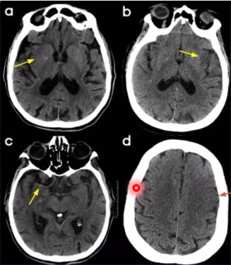

# Examen físico

Estructura:

- Atención
- Lenguaje:
    - espontáneo
    - comprensión, nominación y repetición
- Memoria
    - Remota
    - Corto plazo
- Pares Craneales
    - Reflejo fotomotor
    - Campimetria
    - Movimientos oculares espontáneos
    - Reflejo corneal
    - Motilidad facial
    - Nistagmo espontáneo
    - Velo del paladar (IX y X)
    - XI y XII 
- Motor
    - Minima paresia
    - Marcha
    - Tono
    - Fuerza segmentaria
    - ROT de extremidades y reflejo plantar
    - Reflejos superficiales
- Sensibilidad
    - Sensibilidad somática (tacto-termo-algésica)
    - Sensibilidad propioceptiva y vibratoria
    - Romberg y Romberg sensibilizado
    - Metría EESS y EEII
- Diadococinecia EESS
- Signos meningeos

Tablita resumen pares craneanos:

<table class="api table-wrapper-wide" data-table="ZCUzRSUyMCUzQy90ciUzRSUwQSUzQy90Ym9keSUzRSUwQSUzQy90YWJsZSUzRQ==152617">
<thead>
<tr>
<th colspan="4" scope="row"> Overview of <a data-phrasegroup-id="_UY5fo" class="api tooltip__link link--same-article" data-type="link" data-anker="Z031d1bc15aab8627593fc641c9607f63" data-learningcard-id="o500Og" data-lxid="o500Og" data-section-id="xAXEN00" data-sxid="xAXEN00" data-title="TmV1cm9sb2dpY2FsIGV4YW1pbmF0aW9uIOKGkiBDcmFuaWFsIG5lcnZlIGV4YW1pbmF0aW9u" id="Lc4d22b0020cfa7c4b04e43289e2eb135" data-source="Lc4d22b0020cfa7c4b04e43289e2eb135" href="/us/article/o500Og#IlowMzFkMWJjMTVhYWI4NjI3NTkzZmM2NDFjOTYwN2Y2MyI=">cranial nerve examination</a> [1]</th> </tr>
<tr>
<th colspan="2" rowspan="1" scope="row"><a class="api" data-type="link" data-anker="Zb1add780aa11ae45ecd515d8aada4292" data-learningcard-id="tR0XKf" data-lxid="tR0XKf" data-section-id="lncvt10" data-sxid="lncvt10" data-title="Q3JhbmlhbCBuZXJ2ZSBwYWxzaWVzIOKGkiBDcmFuaWFsIG5lcnZlIHR5cGVzIGFuZCBmdW5jdGlvbnM=" id="L5771dc78cfd1a690277f32d6231f643a" data-source="L5771dc78cfd1a690277f32d6231f643a" href="/us/article/tR0XKf#IlpiMWFkZDc4MGFhMTFhZTQ1ZWNkNTE1ZDhhYWRhNDI5MiI=">Cranial nerve</a></th> <th scope="col">What is examined?</th> <th scope="col">How is the test performed?</th> </tr>
</thead>
<tbody>
<tr>
<th scope="row"> 
<a data-phrasegroup-id="PqaWAl" class="api tooltip__link" data-type="link" data-anker="Zf54141dc1fa8e736b45244428874ce46" data-learningcard-id="tR0XKf" data-lxid="tR0XKf" data-section-id="lncvt10" data-sxid="lncvt10" data-title="Q3JhbmlhbCBuZXJ2ZSBwYWxzaWVzIOKGkiBDcmFuaWFsIG5lcnZlIHR5cGVzIGFuZCBmdW5jdGlvbnM=" id="Leac083654549071a47f2f321ca38481e" data-source="Leac083654549071a47f2f321ca38481e" href="/us/article/tR0XKf#IlpmNTQxNDFkYzFmYThlNzM2YjQ1MjQ0NDI4ODc0Y2U0NiI=">Olfactory nerve</a>
 </th> <th scope="row">I</th> <td> <ul>
<li><a class="api" data-type="link" data-anker="Z2dba122a9414cf55e82a954f97789b83" data-learningcard-id="e60xPS" data-lxid="e60xPS" data-section-id="yCcdue0" data-sxid="yCcdue0" data-title="Tm9zZSBhbmQgc2ludXNlcyDihpIgT2xmYWN0aW9uIChzbWVsbCk=" id="Lb1d79dc747185bd5b13c6f1733c0fe6a" data-source="Lb1d79dc747185bd5b13c6f1733c0fe6a" href="/us/article/e60xPS#IloyZGJhMTIyYTk0MTRjZjU1ZTgyYTk1NGY5Nzc4OWI4MyI=">Olfaction</a></li> </ul>
</td> <td> <ul>
<li>Test the patient's ability to detect and identify an aroma in each nostril. 
 <ul>
<li>Ask the patient to block one nostril with the finger, close the eyes, and sniff repetitively.</li> <li>Place a vial of a nonirritating substance (e.g., vanilla, lemon, coffee, tobacco) and ask to tell you when an odor is detected and to identify it if recognized.</li> </ul>
</li> </ul>
</td> </tr>
<tr>
<th colspan="1" rowspan="5" scope="row"><a data-phrasegroup-id="kqamAl" class="api tooltip__link" data-type="link" data-anker="Z10563771c184f2ce534a98372dc51b89" data-learningcard-id="tR0XKf" data-lxid="tR0XKf" data-section-id="lncvt10" data-sxid="lncvt10" data-title="Q3JhbmlhbCBuZXJ2ZSBwYWxzaWVzIOKGkiBDcmFuaWFsIG5lcnZlIHR5cGVzIGFuZCBmdW5jdGlvbnM=" id="Lfd55627914f78d30cbde0b79cac61890" data-source="Lfd55627914f78d30cbde0b79cac61890" href="/us/article/tR0XKf#IloxMDU2Mzc3MWMxODRmMmNlNTM0YTk4MzcyZGM1MWI4OSI=">Optic nerve</a></th> <th colspan="1" rowspan="5" scope="row">II</th> <td> <ul>
<li><a data-phrasegroup-id="nZ17X20" class="api tooltip__link" data-type="link" data-anker="Z57bf96ee713df082e95a60c7cd8b01cd" data-learningcard-id="aM0QMg" data-lxid="aM0QMg" data-section-id="dG1oyR0" data-sxid="dG1oyR0" data-title="RXhhbWluYXRpb24gb2YgdGhlIGV5ZSDihpIgVmlzdWFsIGFjdWl0eQ==" id="Lc85b815c22d2a401376958f1beab30c3" data-source="Lc85b815c22d2a401376958f1beab30c3" href="/us/article/aM0QMg#Ilo1N2JmOTZlZTcxM2RmMDgyZTk1YTYwYzdjZDhiMDFjZCI=">Visual acuity</a></li> </ul>
</td> <td> <ul>
<li>Ask the patient to read from a <a data-phrasegroup-id="sbXtE9" class="api tooltip__link" data-type="link" data-anker="Zbb1c1c5d43e96aa40eddb26ed7a55b72" data-learningcard-id="aM0QMg" data-lxid="aM0QMg" data-section-id="dG1oyR0" data-sxid="dG1oyR0" data-title="RXhhbWluYXRpb24gb2YgdGhlIGV5ZSDihpIgVmlzdWFsIGFjdWl0eQ==" id="Lc15386144daaa1dea6bef9ffd02a1313" data-source="Lc15386144daaa1dea6bef9ffd02a1313" href="/us/article/aM0QMg#IlpiYjFjMWM1ZDQzZTk2YWE0MGVkZGIyNmVkN2E1NWI3MiI=">Snellen chart</a> using one <a class="api" data-type="link" data-anker="Z59567810bfa0760228f174d87f18477b" data-learningcard-id="cp0aoS" data-lxid="cp0aoS" data-title="RXllIGFuZCBvcmJpdA==" id="L60027521c6c6c3e026e49fc05993b72d" data-source="L60027521c6c6c3e026e49fc05993b72d" href="/us/article/cp0aoS#Ilo1OTU2NzgxMGJmYTA3NjAyMjhmMTc0ZDg3ZjE4NDc3YiI=">eye</a> at a time, and correct for <a data-phrasegroup-id="HtXKU-" class="api tooltip__link" data-type="link" data-anker="Z3a0788fe2054aa90056e4b9d03bdf59a" data-learningcard-id="cp0aoS" data-lxid="cp0aoS" data-section-id="bDcH1e0" data-sxid="bDcH1e0" data-title="RXllIGFuZCBvcmJpdCDihpIgUmVmcmFjdGl2ZSBlcnJvcnM=" id="L8822aed781cd65d56685480b51e838c7" data-source="L8822aed781cd65d56685480b51e838c7" href="/us/article/cp0aoS#IlozYTA3ODhmZTIwNTRhYTkwMDU2ZTRiOWQwM2JkZjU5YSI=">refractive errors</a> with glasses or a pinhole. 
 </li> </ul>
</td> </tr>
<tr>
<td> <ul>
<li>Color <a data-phrasegroup-id="fm1kUh0" class="api tooltip__link" data-type="link" data-anker="Z8473446b734702b73ac2972b7bbf7bf7" data-learningcard-id="cp0aoS" data-lxid="cp0aoS" data-section-id="Dvc1Xe0" data-sxid="Dvc1Xe0" data-title="RXllIGFuZCBvcmJpdCDihpIgRnVuY3Rpb24=" id="La1229ca293fa514ccceb7004da01edde" data-source="La1229ca293fa514ccceb7004da01edde" href="/us/article/cp0aoS#Ilo4NDczNDQ2YjczNDcwMmI3M2FjMjk3MmI3YmJmN2JmNyI=">vision</a> (<a data-phrasegroup-id="HbXKE9" class="api tooltip__link" data-type="link" data-anker="Z68e0d7e4b0896a762baa845a8d0f4fcc" data-learningcard-id="sO0tFT" data-lxid="sO0tFT" data-section-id="R9XlMZ0" data-sxid="R9XlMZ0" data-title="RGlzZWFzZXMgb2YgdGhlIHJldGluYSDihpIgQ29sb3IgcGVyY2VwdGlvbiBkaXNvcmRlcnM=" id="L6b296de28da448a5b9b7774b8bea0b80" data-source="L6b296de28da448a5b9b7774b8bea0b80" href="/us/article/sO0tFT#Ilo2OGUwZDdlNGIwODk2YTc2MmJhYTg0NWE4ZDBmNGZjYyI=">color blindness</a>)</li> </ul>
</td> <td> <ul>
<li>Ask the patient to identify (with both eyes) a number or shape within the <a class="api" data-type="link" data-anker="Zc6ed06afc5c82c863be3139b9e02e68b" data-learningcard-id="aM0QMg" data-lxid="aM0QMg" data-section-id="H_XKp00" data-sxid="H_XKp00" data-title="RXhhbWluYXRpb24gb2YgdGhlIGV5ZSDihpIgSXNoaWhhcmEgdGVzdA==" id="L7bba80c7b2c8abf0d9d700122897fe2c" data-source="L7bba80c7b2c8abf0d9d700122897fe2c" href="/us/article/aM0QMg#IlpjNmVkMDZhZmM1YzgyYzg2M2JlMzEzOWI5ZTAyZTY4YiI=">Ishihara plates</a>, which contain dots of different color and size.</li> </ul>
</td> </tr>
<tr>
<td> <ul>
<li><a data-phrasegroup-id="U8XbN-" class="api tooltip__link" data-type="link" data-anker="Zc981707794a24bd79fce06860fcdc2b3" data-learningcard-id="aM0QMg" data-lxid="aM0QMg" data-section-id="7_X4p00" data-sxid="7_X4p00" data-title="RXhhbWluYXRpb24gb2YgdGhlIGV5ZSDihpIgVmlzdWFsIGZpZWxkIGV4YW1pbmF0aW9u" id="Lb43e93f175645012f133fe713c24de23" data-source="Lb43e93f175645012f133fe713c24de23" href="/us/article/aM0QMg#IlpjOTgxNzA3Nzk0YTI0YmQ3OWZjZTA2ODYwZmNkYzJiMyI=">Visual field</a></li> </ul>
</td> <td> <ul>
<li>
Assess each <a class="api" data-type="link" data-anker="Z59567810bfa0760228f174d87f18477b" data-learningcard-id="cp0aoS" data-lxid="cp0aoS" data-title="RXllIGFuZCBvcmJpdA==" id="L977bbaa36eaf486fe9fb8268f48ebce7" data-source="L977bbaa36eaf486fe9fb8268f48ebce7" href="/us/article/cp0aoS#Ilo1OTU2NzgxMGJmYTA3NjAyMjhmMTc0ZDg3ZjE4NDc3YiI=">eye</a> by confrontation (i.e., by comparing the patient’s <a data-phrasegroup-id="U8XbN-" class="api tooltip__link" data-type="link" data-anker="Zc981707794a24bd79fce06860fcdc2b3" data-learningcard-id="aM0QMg" data-lxid="aM0QMg" data-section-id="7_X4p00" data-sxid="7_X4p00" data-title="RXhhbWluYXRpb24gb2YgdGhlIGV5ZSDihpIgVmlzdWFsIGZpZWxkIGV4YW1pbmF0aW9u" id="L9dfd2dfdf0f601905992fa962cbf0699" data-source="L9dfd2dfdf0f601905992fa962cbf0699" href="/us/article/aM0QMg#IlpjOTgxNzA3Nzk0YTI0YmQ3OWZjZTA2ODYwZmNkYzJiMyI=">visual fields</a> to your own) using a finger or red pin. <ol>
<li value="1">Facing the patient at 0.6–1.0 meters (2–3 feet), place your hands at the periphery of your <a data-phrasegroup-id="U8XbN-" class="api tooltip__link" data-type="link" data-anker="Zc981707794a24bd79fce06860fcdc2b3" data-learningcard-id="aM0QMg" data-lxid="aM0QMg" data-section-id="7_X4p00" data-sxid="7_X4p00" data-title="RXhhbWluYXRpb24gb2YgdGhlIGV5ZSDihpIgVmlzdWFsIGZpZWxkIGV4YW1pbmF0aW9u" id="Lbe3ad02fda6cdc85c7a4648ce71f7c36" data-source="Lbe3ad02fda6cdc85c7a4648ce71f7c36" href="/us/article/aM0QMg#IlpjOTgxNzA3Nzk0YTI0YmQ3OWZjZTA2ODYwZmNkYzJiMyI=">visual fields</a> (the hands should be equidistant between you and the patient) and inform the patient that you are going to move your index fingers.</li> <li value="2">Ask the patient to look directly at the center of your face and to tell you when and which index fingers (left, right, or both) are moving.</li> <li value="3">Test the inferior and the superior quadrants on both sides. The index fingers can be moved both alternatively and simultaneously.</li> </ol>
</li> <li>More accurate testing uses <a data-phrasegroup-id="K-cUyU0" class="api tooltip__link" data-type="link" data-anker="Z24f66a32c29c34b97269cc41a36a350d" data-learningcard-id="aM0QMg" data-lxid="aM0QMg" data-section-id="7_X4p00" data-sxid="7_X4p00" data-title="RXhhbWluYXRpb24gb2YgdGhlIGV5ZSDihpIgVmlzdWFsIGZpZWxkIGV4YW1pbmF0aW9u" id="L5c6a46c2096cde3a664604973716309f" data-source="L5c6a46c2096cde3a664604973716309f" href="/us/article/aM0QMg#IloyNGY2NmEzMmMyOWMzNGI5NzI2OWNjNDFhMzZhMzUwZCI=">perimetry</a>.</li> </ul>
</td> </tr>
<tr>
<td> <ul>
<li>Papilla</li> </ul>
</td> <td> <ul>
<li>
<a data-phrasegroup-id="81WOi40" class="api tooltip__link" data-type="link" data-anker="Ze0b88904707d954c76519584f504f1a9" data-learningcard-id="aM0QMg" data-lxid="aM0QMg" data-section-id="E_X8J00" data-sxid="E_X8J00" data-title="RXhhbWluYXRpb24gb2YgdGhlIGV5ZSDihpIgRnVuZG9zY29waWMgZXhhbQ==" id="L54e91fbc1902e1b39fa6cf8fc5ff15e7" data-source="L54e91fbc1902e1b39fa6cf8fc5ff15e7" href="/us/article/aM0QMg#IlplMGI4ODkwNDcwN2Q5NTRjNzY1MTk1ODRmNTA0ZjFhOSI=">Fundoscopic examination</a>: uses the ophthalmoscope to examine elements of the fundus of the <a class="api" data-type="link" data-anker="Z59567810bfa0760228f174d87f18477b" data-learningcard-id="cp0aoS" data-lxid="cp0aoS" data-title="RXllIGFuZCBvcmJpdA==" id="L1ab0f72ebca52b2ac4e2615dd167fa95" data-source="L1ab0f72ebca52b2ac4e2615dd167fa95" href="/us/article/cp0aoS#Ilo1OTU2NzgxMGJmYTA3NjAyMjhmMTc0ZDg3ZjE4NDc3YiI=">eye</a> <ul>
<li>
<a data-phrasegroup-id="AtXRT-" class="api tooltip__link" data-type="link" data-anker="Z498c3e61a6957c73a1612532e83b1e3a" data-learningcard-id="cp0aoS" data-lxid="cp0aoS" data-section-id="AvcRce0" data-sxid="AvcRce0" data-title="RXllIGFuZCBvcmJpdCDihpIgTGF5ZXJzIG9mIHRoZSBleWU=" id="L3f33d2630e72937949a9aa08f5fb846a" data-source="L3f33d2630e72937949a9aa08f5fb846a" href="/us/article/cp0aoS#Ilo0OThjM2U2MWE2OTU3YzczYTE2MTI1MzJlODNiMWUzYSI=">Optic disc</a> (papilla): examine color 
, size, degree of swelling, and elevation</li> <li>
<a data-phrasegroup-id="zZcrVa0" class="api tooltip__link" data-type="link" data-anker="Zafbc538c70facdb76c5c65393ad05dbb" data-learningcard-id="cp0aoS" data-lxid="cp0aoS" data-section-id="AvcRce0" data-sxid="AvcRce0" data-title="RXllIGFuZCBvcmJpdCDihpIgTGF5ZXJzIG9mIHRoZSBleWU=" id="L882f8160b76e572a7d438dc5e7b48e54" data-source="L882f8160b76e572a7d438dc5e7b48e54" href="/us/article/cp0aoS#IlphZmJjNTM4YzcwZmFjZGI3NmM1YzY1MzkzYWQwNWRiYiI=">Retina</a>: examine color, texture, and retinal vessels (size, presence of hemorrhages or exudates)</li> </ul>
</li> </ul>
</td> </tr>
<tr>
<td colspan="1" rowspan="2"> <ul>
<li>
<a data-phrasegroup-id="lzYvG7" class="api tooltip__link" data-type="link" data-anker="Z404ae0ae4296f4475cf9d11eb43230e4" data-learningcard-id="qO0CtT" data-lxid="qO0CtT" data-section-id="Rvcl-V0" data-sxid="Rvcl-V0" data-title="UGh5c2lvbG9neSBhbmQgYWJub3JtYWxpdGllcyBvZiB0aGUgcHVwaWwg4oaSIFB1cGlsbGFyeSByZXNwb25zZQ==" id="Lb09d2a19b52a4a03fcf8344f663f12d0" data-source="Lb09d2a19b52a4a03fcf8344f663f12d0" href="/us/article/qO0CtT#Ilo0MDRhZTBhZTQyOTZmNDQ3NWNmOWQxMWViNDMyMzBlNCI=">Pupillary light reflex</a>  <span class="api extraExplanation" data-type="bonus" data-content="PHNwYW4gY2xhc3M9ImFwaSIgZGF0YS10eXBlPSJpbWFnZSIgZGF0YS1zb3VyY2U9Imh0dHBzOi8vbWVkaWEtdXMubWJzY2YuY29tL21lZGlhL3RodW1icy9iaWdfNjYxZTk5ZGYwMzQ0YTIuODg5MTY0ODQuanBnIiBkYXRhLWdhbGxlcnktaWQ9InhBWEVOMDAiIGRhdGEtaW1hZ2UtaW5kZXg9IjAiIGRhdGEtaW1hZ2UtaWQ9IlpJWVpZcSIgZGF0YS10aXRsZT0iVUhWd2FXeHNZWEo1SUd4cFoyaDBJSEpsWm14bGVBPT0iIGRhdGEtZGVzY3JpcHRpb249IlBIQStWR2hsSUdGbVptVnlaVzUwSUhCaGRHaDNZWGtnS0dKc2RXVWdkSEpoWTNRcElHbHpJR2x1YVhScFlYUmxaQ0IzYUdWdUlHeHBaMmgwSUdocGRITWdkR2hsSUhKbGRHbHVZVG84WW5JK0NpMGdVbVYwYVc1aGJDQndhRzkwYjNKbFkyVndkRzl5Y3lEaWhwSWdhWEJ6YVd4aGRHVnlZV3dnYjNCMGFXTWdibVZ5ZG1VZzRvYVNJRzUxWTJ4bGFTQnZaaUJpYVd4aGRHVnlZV3dnY0hKbGRHVmpkR0ZzSUdGeVpXRnpJQ2h1WVhOaGJDQm1hV0psY25NZ2IyWWdkR2hsSUc5d2RHbGpJRzVsY25abElHTnliM056SUhSdklIUm9aU0JqYjI1MGNtRnNZWFJsY21Gc0lITnBaR1VnWVhRZ2RHaGxJRzl3ZEdsaklHTm9hV0Z6YldFcFBDOXdQZ284Y0Q1VWFHVWdaV1ptWlhKbGJuUWdjR0YwYUhkaGVTQW9aM0psWlc0Z2RISmhZM1FwSUhSeVlXNXpiV2wwY3lCdVpYVnlZV3dnYVcxd2RXeHpaWE1nZEc4Z2RHaGxJR2x5YVhNZ2MzQm9hVzVqZEdWeUlHMTFjMk5zWlRvOFluSStDaTBnVG5WamJHVnBJRzltSUhCeVpYUmxZM1JoYkNCaGNtVmhJT0tHa2lCaWFXeGhkR1Z5WVd3Z1JXUnBibWRsY2lCWFpYTjBjR2hoYkNCdWRXTnNaV2tnS0hCaGNtRnplVzF3WVhSb1pYUnBZeUJ3Y21WbllXNW5iR2x2Ym1saklHNTFZMnhsZFhNZ2IyWWdkR2hsSUc5amRXeHZiVzkwYjNJZ2JtVnlkbVVwSU9LR2tpQmlhV3hoZEdWeVlXd2diMk4xYkc5dGIzUnZjaUJ1WlhKMlpYTWdLSE41Ym1Gd2MyVWdZWFFnZEdobElHTnBiR2xoY25rZ1oyRnVaMnhwYjI0cElPS0draUJpYVd4aGRHVnlZV3dnYVhKcGN5QnpjR2hwYm1OMFpYSWdiWFZ6WTJ4bElDaGhibVFnWTJsc2FXRnllU0J0ZFhOamJHVXBJT0tHa2lCaWFXeGhkR1Z5WVd3Z2NIVndhV3hzWVhKNUlHTnZibk4wY21samRHbHZiaUFvWVc1a0lHRmpZMjl0YjJSaGRHbHZiaWt1UEM5d1BnbzhjRDVUYUdsdWFXNW5JR0VnYkdsbmFIUWdhVzUwYnlCdmJtVWdaWGxsSUdOaGRYTmxjeUJqYjI1emRISnBZM1JwYjI0Z2IyWWdkR2hsSUdsd2MybHNZWFJsY21Gc0lIQjFjR2xzSUNoa2FYSmxZM1FnY0hWd2FXeHNZWEo1SUhKbFpteGxlQ2tnWVhNZ2QyVnNiQ0JoY3lCMGFHRjBJRzltSUhSb1pTQmpiMjUwY21Gc1lYUmxjbUZzSUhCMWNHbHNJQ2hwYm1ScGNtVmpkQ0J2Y2lCamIyNXpaVzV6ZFdGc0lIQjFjR2xzYkdGeWVTQnlaV1pzWlhncExqd3ZjRDQ9IiBkYXRhLWF1dGhvcj0iUVdadmJuTnZJRUp2Y21kbGN3PT0iIGRhdGEtY29weXJpZ2h0PSJ3cWtnUVUxQ1QxTlQiPjxpbWcgc3JjPSJkYXRhOmltYWdlL2pwZWc7YmFzZTY0LC85ai80QUFRU2taSlJnQUJBUUlBZGdCMkFBRC8yd0JEQUFVREJBUUVBd1VFQkFRRkJRVUdCd3dJQndjSEJ3OExDd2tNRVE4U0VoRVBFUkVURmh3WEV4UWFGUkVSR0NFWUdoMGRIeDhmRXhjaUpDSWVKQndlSHg3LzJ3QkRBUVVGQlFjR0J3NElDQTRlRkJFVUhoNGVIaDRlSGg0ZUhoNGVIaDRlSGg0ZUhoNGVIaDRlSGg0ZUhoNGVIaDRlSGg0ZUhoNGVIaDRlSGg0ZUhoNGVIaDcvd0FBUkNBQlVBRlFEQVNJQUFoRUJBeEVCLzhRQUhBQUJBQU1BQXdFQkFBQUFBQUFBQUFBQUFBTUVCUUVDQmdjSS84UUFPaEFBQWdFREF3TUJCQVlIQ1FBQUFBQUFBUUlEQUFRUkJSSWhNVUZSRXhRaU1tRUdGVUp4a2NFSENDTlNvYkhSTTFWalpJR1NrOUxoLzhRQUZ3RUJBUUVCQUFBQUFBQUFBQUFBQUFBQUFBRUNBLy9FQUNBUkFRRUFBUVFDQXdFQUFBQUFBQUFBQUFBQkVRSVNJVEVEVVJOQllTTC8yZ0FNQXdFQUFoRURFUUEvQVAyWFNsS0JYa3JUNlEzOHY2Vkx2Nk5zSWZZWXROVzRYQ2UvdkxLT3VlblBURmV0cjVoWnpoLzFqYnlFQndVMGNiampnL0FhRDZmU2xLQlNsS0JTbEtCU2xLQ1BFMlBpVFAzR2dFM2RrL0NxTDY1cHEzRDIvck8waUJTNFdKMkM3c0VaSUhjRUdwUnFsbXpPRmVSdGhBWXJDN0RKR2VvRlkyZnE3bGdpZmpESjgrSytmMnVqNnhIK25TNjFuNnZsK3JaTEgwL2FUamJuWW5IWE9jZ2l2Y1BxbG1pTTd0TXFxTWttQ1FBRHo4Tlo5dHIybVR5R2RMNkxZSEtrdGxlMmNjZ2RpS3hxMVh4OVRPVjdidEs0UmxaUXlrTXBHUVIzcm11ekxoczdUdElCN1pyb0JQbmwweDkxUTNtb1dkbzZ4M0Z4SEc3WXdwYkJPVGorZGRyUzl0Ym9zSUo0NUdYNGdyWkk1eCtWWnVuS3k0NFNFVFpQdkpqdHhURTJQaVRwNHFTbFRaK201RUJjWTVkUHdwVXRLbnh6M1YzTTZTRFZ6bjA3KzJYM2pqTnNUa1lHUHRkdWFtdDRyOURKNjEzRklDd0tBUTQyakhJNjg4MWJwWFJsazZyWnRmekpZWFV5TkJKRzVlUDArSDZEQkdlUU01eDV4VmhOSDB0TGczQzJOdjZwR04yd2VNSGpwVTE3YnRNRmVKeEhOR2N4c1JrZk1FZURWYVM4dklVSW10WTFiQk80U1pCeDN4MXJPWk8wVDJNVVZ2Skxid0tFalhCVkY2TG5zQjJxMGVsUlcwUWlRNVl1N25jekh1YWxyU3M2SFRyQzdzZzF4YlJUR2RRMGpPb0xFOVJ6MTQvaFVkNXAxaloyUm50WUlyYVNBYmtlTWJUMTVCUGNIdm56VXNrajJNcGpoVVN4c0M0UW5CVG5vRDRKUEFya3czVjNJdnRTcERicXdiMDFiY1hJUEdUNCtWWnRuU1dyOUtVclNsS1VvTTlyTytMS1Jxc3FxcTR3SWw5NDU2bmorVldiU0dhRU1KYmw1OG5qY29HT1Q0LzAvQ3NpU1g2TlNxOEx6Vy83WnlyS1hZRXN1Y2crRHlhdDJNR2p5dExGYUNKekh0OVFLU2R2SEg4S0RUcWxxc1RPa1VvbFpFaWZNaWhRZDZFRlNEMzc1NDhWekxaMlVhRm1oVEErL21zK2EydFdVdExFZ1VESnlTQVA0MWpYaXpDelRsZXNidEJBSTVHSmVQM1NSem5IUTFZYTVpWEhKSUl6a0RvS3hvbzQ0WmxoaU9EamNxcWNrRG5yOHM5Q2ZOU1hXNVlTWkdDcU9DVUo0Ky94WENlZkhGN1dTWVJHNnVycThCaXRYeVhHZmZVZTZoenhucUNjYzFwKzFYbjkzUDhBOHlWbXh5b2pMREdCSk80REVEZ0JmT2VtQjJ4K2RhVnJQT3o3SDlNOGNIZC81WFR4Mzd2MmJNY3VSYzNoT0RwN0Q1K3N0UXhYMm9OTXlQcE1pcUVKRCtxdUNSbkE4ak9CK05YOHkvdXAvdVA5S3oxbDF2ZXdOcFpsZGhLbjFUbmR6Z0VZNmRLN011eTMxK1ZCT2p6alBiMW8vd0N0S2lFMnZrWk5sWXFlZUJPeDc4YzRIYkZLQ1pOTWRaSkgrc0xzNzIzWUxMZ2ZMcDBxemFXN1FGOTF6Tk51eGpmajNjRHRnQ3FzYWF5QiswdUxFOG40WW1HUjIrMGFsQzZubDkwOW1vejd1SVdQSGcrOEtEcGRTRjVTUHNxY0Q4Nm8zRXJrbUtBcUh5QVdZWjI1UGp2VTNzbXBIazNkcmsvNWR2OEF2V2ZkNkxxaFl5MmQ5YVJ5eVRJOHBlQnlDbzZnZS93YTUrN1d0ZHMwOE85cmJleVhhUVFBZXpGV2M1WTdnM0F4OHh6bm5wampqcFp2Tnkyc2pJTXNvM0FaeG5CejFxZGJTZmR1YVJHYkdQaElBSHlGZHZZM2IrMGt5UDNRdUFhNTdMaXoyc3ZGa1o2UVBhejcwZmVqQTVWdUF1T2VNZHozODQ3VmRqTzlBNmhzSGtIR0tpdmJDNmx2TFY0cGtXQkMzcktRY3NDTWNHdWxwOUh0UHRyZFlJb1dDTDB6TTU3NTgxdVNZL1UwMytyTWNOaTJrYVNQTEFoaHdlT3RTMW1XdWsya2JrK2szUDhBaVA4QTFxbGNhUE03UklMU0o0bzM0MzMwb09CZ2c4RG5uc2UxZEowbDdlZ3BXZkJvOWdrWURRbGozM1NNMzUwcW8wS1VwUU1EeFRBOFVwUU1EeFRBOFVwUU1EeFRBOFVwUU1DbEtVQ2xLVUgvMlE9PSIgdGl0bGU9IlB1cGlsbGFyeSBsaWdodCByZWZsZXgiIGRhdGEtbWVkaXVtLXNpemUtdXJsPSJodHRwczovL21lZGlhLXVzLm1ic2NmLmNvbS9tZWRpYS90aHVtYnMvbWVkaXVtXzY2MWU5OWRmMDM0NGEyLjg4OTE2NDg0LmpwZyI+PC9zcGFuPgo=" id="Eeb6469dacc5b2ac2fe2498bc9be13e01" tabindex="0" aria-expanded="true" aria-controls="DSPopover_878767213633">

</li> </ul>
</td> <td colspan="1" rowspan="2"> <ul>
<li>The examiner shines a light into the patient's <a class="api" data-type="link" data-anker="Z59567810bfa0760228f174d87f18477b" data-learningcard-id="cp0aoS" data-lxid="cp0aoS" data-title="RXllIGFuZCBvcmJpdA==" id="Lb288d5c9aaf2b3ff6f338d81d9840ef7" data-source="Lb288d5c9aaf2b3ff6f338d81d9840ef7" href="/us/article/cp0aoS#Ilo1OTU2NzgxMGJmYTA3NjAyMjhmMTc0ZDg3ZjE4NDc3YiI=">eye</a>.</li> <li>A prompt, consensual (i.e., equally in both eyes) response (i.e., constriction of the pupil) should normally be observable.</li> <li>
Pupillary shape and width: Healthy pupils are isocoric and 2–8 mm in size; <a data-phrasegroup-id="Pf0Wm2" class="api tooltip__link" data-type="link" data-anker="Z77d76b0dcfbe280604c70489c4f064ba" data-learningcard-id="qO0CtT" data-lxid="qO0CtT" data-section-id="3vcS-V0" data-sxid="3vcS-V0" data-title="UGh5c2lvbG9neSBhbmQgYWJub3JtYWxpdGllcyBvZiB0aGUgcHVwaWwg4oaSIEFuaXNvY29yaWE=" id="Lf7c69ec74f9fc7fcbdb4cedab84a56f4" data-source="Lf7c69ec74f9fc7fcbdb4cedab84a56f4" href="/us/article/qO0CtT#Ilo3N2Q3NmIwZGNmYmUyODA2MDRjNzA0ODljNGYwNjRiYSI=">anisocoric</a> and/or narrow/wide pupils suggest a disorder (see “<a class="api" data-type="link" data-anker="Zda149b710ebbc894f5bddec048bdeea1" data-learningcard-id="qO0CtT" data-lxid="qO0CtT" data-title="UGh5c2lvbG9neSBhbmQgYWJub3JtYWxpdGllcyBvZiB0aGUgcHVwaWw=" id="Ldcc247c9f1996ac6c3ae4fa206fdc840" data-source="Ldcc247c9f1996ac6c3ae4fa206fdc840" href="/us/article/qO0CtT#IlpkYTE0OWI3MTBlYmJjODk0ZjViZGRlYzA0OGJkZWVhMSI=">Physiology and abnormalities of the pupil</a>”).</li> </ul>
</td> </tr>
<tr>
<th colspan="1" rowspan="4" scope="row"><a data-phrasegroup-id="lqavAl" class="api tooltip__link" data-type="link" data-anker="Zf93de13b5536af7dcc148ee0b926bc14" data-learningcard-id="tR0XKf" data-lxid="tR0XKf" data-section-id="lncvt10" data-sxid="lncvt10" data-title="Q3JhbmlhbCBuZXJ2ZSBwYWxzaWVzIOKGkiBDcmFuaWFsIG5lcnZlIHR5cGVzIGFuZCBmdW5jdGlvbnM=" id="L1b33f39bbcda06ac99fe8ff1994b72bd" data-source="L1b33f39bbcda06ac99fe8ff1994b72bd" href="/us/article/tR0XKf#IlpmOTNkZTEzYjU1MzZhZjdkY2MxNDhlZTBiOTI2YmMxNCI=">Oculomotor nerve</a>, <a data-phrasegroup-id="mqaV_l" class="api tooltip__link" data-type="link" data-anker="Z100f4b1bb2bc87e0b7d4905edc670e25" data-learningcard-id="tR0XKf" data-lxid="tR0XKf" data-section-id="lncvt10" data-sxid="lncvt10" data-title="Q3JhbmlhbCBuZXJ2ZSBwYWxzaWVzIOKGkiBDcmFuaWFsIG5lcnZlIHR5cGVzIGFuZCBmdW5jdGlvbnM=" id="L1e38e051a8b3c3292bc60362a939774f" data-source="L1e38e051a8b3c3292bc60362a939774f" href="/us/article/tR0XKf#IloxMDBmNGIxYmIyYmM4N2UwYjdkNDkwNWVkYzY3MGUyNSI=">trochlear nerve</a>, <a data-phrasegroup-id="Lqaw_l" class="api tooltip__link" data-type="link" data-anker="Zb3e3079fe708e680e9b15e0844209446" data-learningcard-id="tR0XKf" data-lxid="tR0XKf" data-section-id="lncvt10" data-sxid="lncvt10" data-title="Q3JhbmlhbCBuZXJ2ZSBwYWxzaWVzIOKGkiBDcmFuaWFsIG5lcnZlIHR5cGVzIGFuZCBmdW5jdGlvbnM=" id="L1589593207315d00ab8e0f4c8ab4d07f" data-source="L1589593207315d00ab8e0f4c8ab4d07f" href="/us/article/tR0XKf#IlpiM2UzMDc5ZmU3MDhlNjgwZTliMTVlMDg0NDIwOTQ0NiI=">abducens nerve</a></th> <th colspan="1" rowspan="4" scope="row">III, IV, VI</th> </tr>
<tr>
<td> <ul>
<li><a class="api" data-type="link" data-anker="Z59567810bfa0760228f174d87f18477b" data-learningcard-id="cp0aoS" data-lxid="cp0aoS" data-title="RXllIGFuZCBvcmJpdA==" id="Lf82a6398a869c4b075be60a2e9df673f" data-source="Lf82a6398a869c4b075be60a2e9df673f" href="/us/article/cp0aoS#Ilo1OTU2NzgxMGJmYTA3NjAyMjhmMTc0ZDg3ZjE4NDc3YiI=">Eye</a> movement</li> </ul>
</td> <td> <ul>
<li>Patients are asked to look back and forth between two widely spaced targets (e.g., one finger on the two hands) held by the examiner in front of the patient to evaluate saccades (i.e., the ability to rapidly fixate the eyes from one object to another).</li> <li>Patients are asked to follow a finger moving up, down, laterally, and diagonally with their eyes.  <span class="api extraExplanation" data-type="bonus" data-content="PHNwYW4gY2xhc3M9ImFwaSIgZGF0YS10eXBlPSJpbWFnZSIgZGF0YS1zb3VyY2U9Imh0dHBzOi8vbWVkaWEtdXMubWJzY2YuY29tL21lZGlhL3RodW1icy9iaWdfNjA1Y2FlYWQ2OWQ5OS5qcGciIGRhdGEtZ2FsbGVyeS1pZD0ieEFYRU4wMCIgZGF0YS1pbWFnZS1pbmRleD0iMSIgZGF0YS1pbWFnZS1pZD0idHNZWDlxIiBkYXRhLXRpdGxlPSJRMnhwYm1sallXd2dkR1Z6ZEdsdVp5QnZaaUIwYUdVZ1pYaDBjbUZ2WTNWc1lYSWdiWFZ6WTJ4bGN3PT0iIGRhdGEtZGVzY3JpcHRpb249IlBIQStRU0J4ZFdsamF5QmpiR2x1YVdOaGJDQmxlR0Z0YVc1aGRHbHZiaUJ2WmlCbGVIUnlZVzlqZFd4aGNpQnRkWE5qYkdVZ1puVnVZM1JwYjI0Z1kyRnVJR0psSUhCbGNtWnZjbTFsWkNCaWVTQmhjMnRwYm1jZ2RHaGxJSEJoZEdsbGJuUWdkRzhnWm05c2JHOTNJSFJvWlNCbGVHRnRhVzVsY2lkeklHWnBibWRsY2lCM2FYUm9JSFJvWlNCbGVXVnpJSGRvYVd4bElHdGxaWEJwYm1jZ2RHaGxJR2hsWVdRZ2FXMXRiMkpwYkdVdUlGUnlZV05wYm1jZ2RHaGxJR3hsZEhSbGNpRGlnSnhJNG9DZElHbHVJSFJvWlNCaGFYSWdLR1JoY21zZ1ozSmxlU0JoY25KdmQzTXBJSGRwYkd3Z2NISnZiWEIwSUhSb1pTQndZWFJwWlc1MElIUnZJRzF2ZG1VZ2RHaHliM1ZuYUNCMGFHVWdOaUJqWVhKa2FXNWhiQ0J3YjNOcGRHbHZibk1nYjJZZ1oyRjZaUzRnU1c0Z2RHaGxjMlVnY0c5emFYUnBiMjV6TENCaElITnBibWRzWlNCdGRYTmpiR1VnYVhNZ2RHaGxJSEJ5YVcxaGNua2diVzkyWlhJZ1ptOXlJR1ZoWTJnZ1pYbGxManhpY2o0S1UyOXRaU0JsZUdGdGFXNWxjbk1nWm1sdVpDQnBkQ0JpWlc1bFptbGphV0ZzSUhSdklISmxkSFZ5YmlCMGJ5QjBhR1VnWTJWdWRHVnlJR0psZEhkbFpXNGdaV0ZqYUNCallYSmthVzVoYkNCd2IzTnBkR2x2Yml3Z1pISmhkMmx1WnlCaElITjBZWElnYzJoaGNHVWdLR1JoY21zZ1ozSmxlU0JvYjNKcGVtOXVkR0ZzSUdGeWNtOTNJSEJzZFhNZ2JHbG5hSFFnWjNKbGVTQmhjbkp2ZDNNcExDQjNhR2xzWlNCdmRHaGxjbk1nWTI5dFltbHVaU0IwYUdVZ1kyOXRjR3hsZEdVZzRvQ2NTT0tBblNCaGJtUWdaR2xoWjI5dVlXd2diVzkyWlcxbGJuUnpMand2Y0Q0S1BIQStUbTkwWlNCMGFHRjBJR1p2Y2lCaGJHd2diWFZ6WTJ4bGN5QmxlR05sY0hRZ2RHaGxJR3hoZEdWeVlXd3RJR0Z1WkNCdFpXUnBZV3dnY21WamRHa3NJSFJvWlNCa2FYSmxZM1JwYjI1eklHbHVJSGRvYVdOb0lIUm9aWE5sSUcxMWMyTnNaWE1nWVhKbElIUmxjM1JsWkNCamJHbHVhV05oYkd4NUlDaHphRzkzYmlCb1pYSmxLU0JrYVdabVpYSWdabkp2YlNCMGFHVWdaR2x5WldOMGFXOXVJSFJvWlhrZ2QyOTFiR1FnYlc5MlpTQjBhR1VnWlhsbFltRnNiQ0JwWmlCaFkzUnBibWNnYVc0Z2FYTnZiR0YwYVc5dUxpQlVhR1VnWkdsbVptVnlaVzVqWlNCaGNtbHpaWE1nWW1WallYVnpaU0JsZVdVZ2JXOTJaVzFsYm5SeklHRnlaU0IwYUdVZ2NtVnpkV3gwSUc5bUlHTnZiWEJzWlhnZ2FXNTBaWEpoWTNScGIyNXpJR0psZEhkbFpXNGdjMlYyWlhKaGJDQmxlSFJ5WVc5amRXeGhjaUJ0ZFhOamJHVnpMaUJVYUdWeVpXWnZjbVVzSUhSb1pTQnRiM1psYldWdWRDQjFjMlZrSUhSdklIUmxjM1FnWVNCd1lYSjBhV04xYkdGeUlHMTFjMk5zWlNCamJHbHVhV05oYkd4NUlHbHpJSFJvWlNCdGIzWmxiV1Z1ZENCMGFHRjBJRzF2YzNRZ1pXWm1aV04wYVhabGJIa2daWGhqYkhWa1pYTWdkR2hsSUhCaGNuUnBZMmx3WVhScGIyNGdiMllnYjNSb1pYSWdiWFZ6WTJ4bGN5NGdSbTl5SUdWNFlXMXdiR1VzSUhkb2FXeGxJSFJvWlNCemRYQmxjbWx2Y2lCdllteHBjWFZsSUNoVFR5a2daR1Z3Y21WemMyVnpJR0Z1WkNCaFltUjFZM1J6SUhSb1pTQmxlV1VnZDJobGJpQmhZM1JwYm1jZ2FXNGdhWE52YkdGMGFXOXVMQ0JrWlhCeVpYTnphVzl1SUdseklHRnNjMjhnY0hKdlpIVmpaV1FnWW5rZ2RHaGxJR2x1Wm1WeWFXOXlJSEpsWTNSMWN5QW9TVklwTENCaGJtUWdZV0prZFdOMGFXOXVJR2x6SUdGc2MyOGdjSEp2WkhWalpXUWdZbmtnZEdobElHeGhkR1Z5WVd3Z2NtVmpkSFZ6SUNoTVVpa3VJRWh2ZDJWMlpYSXNJR1IxWlNCMGJ5QjBhR1ZwY2lCa2FXWm1aWEpsYm5RZ2NHOXBiblJ6SUc5bUlHbHVjMlZ5ZEdsdmJpd2dkR2hsSUVsU0lHbHpJSFJvWlNCdGIzSmxJR1ZtWm1samFXVnVkQ0JrWlhCeVpYTnpiM0lnYjJZZ2RHaGxJR1Y1WlNCcGJpQmhZbVIxWTNScGIyNHNJSGRvYVd4bElIUm9aU0JUVHlCcGN5QjBhR1VnYlc5eVpTQmxabVpwWTJsbGJuUWdaR1Z3Y21WemMyOXlJR2x1SUdGa1pIVmpkR2x2Ymk0Z1RHOXZhMmx1WnlCa2IzZHVJR0Z1WkNCcGJuZGhjbVJ6TENCMGFHVnlaV1p2Y21Vc0lHRnNiRzkzY3lCMGFHVWdhWE52YkdGMFpXUWdZMnhwYm1sallXd2daWGhoYldsdVlYUnBiMjRnYjJZZ2RHaGxJRk5QSUNoaGN5QnphRzkzYmlCb1pYSmxLUzRnVTJsdGFXeGhjaUJ3Y21sdVkybHdiR1Z6SUdGd2NHeDVJSFJ2SUhSb1pTQnRiM1psYldWdWRITWdkWE5sWkNCbWIzSWdZMnhwYm1sallXd2dkR1Z6ZEdsdVp5QnZaaUIwYUdVZ1NWSXNJRk5TTENCaGJtUWdTVTh1UEM5d1BnPT0iIGRhdGEtYXV0aG9yPSJRV1p2Ym5OdklFSnZjbWRsY3c9PSIgZGF0YS1jb3B5cmlnaHQ9Indxa2dRVTFDVDFOVCI+PGltZyBzcmM9ImRhdGE6aW1hZ2UvanBlZztiYXNlNjQsLzlqLzRBQVFTa1pKUmdBQkFRRUJMQUVzQUFELzJ3QkRBQVVEQkFRRUF3VUVCQVFGQlFVR0J3d0lCd2NIQnc4TEN3a01FUThTRWhFUEVSRVRGaHdYRXhRYUZSRVJHQ0VZR2gwZEh4OGZFeGNpSkNJZUpCd2VIeDcvMndCREFRVUZCUWNHQnc0SUNBNGVGQkVVSGg0ZUhoNGVIaDRlSGg0ZUhoNGVIaDRlSGg0ZUhoNGVIaDRlSGg0ZUhoNGVIaDRlSGg0ZUhoNGVIaDRlSGg0ZUhoNy93QUFSQ0FCVUFGUURBU0lBQWhFQkF4RUIvOFFBSEFBQUFRVUJBUUVBQUFBQUFBQUFBQUFBQUFNRUJRWUhDQUVDLzhRQVBCQUFBZ0VEQWdNRUJ3WUNDd0FBQUFBQUFRSURBQVFSQlFZU0lURUhFMEZSRkNJak1tRnhnVFIxa2JHendWSnpGVE5DUTJLRGtxR2owZkgveEFBWkFRQURBUUVCQUFBQUFBQUFBQUFBQUFBQUF3UUJCUUwveEFBbEVRQUNBd0FCQXdRQ0F3QUFBQUFBQUFBQUFRSURFUVFTTVZFRkV4UWhRV0ZTZ1pILzJnQU1Bd0VBQWhFREVRQS9BT3k2SzV3M0YybzZucEVpVzZscmk0a0lDS3JuSkpPT2dxNDlqKzg5UjNGcWtrVnpJdUZJREprNUgwTlE4Ym5RNUMyS2FYN0tIeDJrM3ZZMTFXVnNnRUhCd2NIb2E5cXBiYVhVb2JqY2NxVGk1STFobVNJcmpDZDNIbGM1OGlQcVBqVnJoa1NhSlpZMkRLd3lEVnhPZlZGRkZBQlJSVE9TYWVXL1dDREFpakdabitQZ3Y3bWdCMnJLd3lyQWp6QnIycURwVTk3cHZaYWtyM2ZmVHh0TjdVamg1ZDYveHJHYnZ0WjNGWVNXODgvMkNlVXhMTzRJRE56UHE4K2ZTa1hYKzJtMHRIUXBjNDlXNGRTVVZnbHJ2NjluZ1dUMDVWeU9nZWl1ZXZXYWMrNHkvd0FHZkVtVnkzN0lkYkc0NU5XdUxWWnBPTlhqNHNsVktqQTlYNFl6OCtkYWoyZDdXdnRNMXBiNjhpUlpPQUl4Vk9ISXJRYitJWFBjZ1RvaXBKeHNNbkp3RGpvUjQ4L0dsTENKYmUyRUljTmpQUmlmSDRrbXVsR3BMUHM4U3ZiMzY3a1R0TDdYci8zcS93Q2xGVW9vOUZ1U0J5Z21iL1E1L1kvbjg2aTlwZmE5Zis5WC9TaXFhdVRDSVdFN0tFSXdjbW1pQlNpbWx2ZXdBR09TNGpMTC9hejd3OERTaHZiUUFrM0VZQTY4NnpUY1o3ZFN0R2dXTUF5dWVGQWZQelB3RmUyMEt3UWlOU1NjNVpqMVlucVRTRnRQQThwbGFWTzhZWVZjKzZ2bFR6d3JUQ2sydGpKcVBacjZIRU10STB3eC9tdldXYTUyYWJnMVRiNmFSTkRITEFqOGFxOGVRRDBCQnhrSEhLdHMyR1FOclc1SkFISE4xL212VGk5c3pQZmlhTzh0MGlLRlpFS2tzeEtrWkRCaGpxUER3OCtuaVVOZTZPcnQ2Vm1hYzlROW1lNG9Ja2hqZ3dxS0ZIQ3BBd09WRmRMUlBHa2FwM3FIQUE5NmlrZkZnVXJuejhITGQ3dm5jQ2FuSmFSYXJESDNmdmxrNGorZU0xby9ZL3JlbzZqcW1McS9Gd2pjeDZ1S3JGeDJKYWpKcmcxYVNmanVDUmdrWUlJNll4MXEvd0RadnNpNDI5ZjkvSkdpK2JLdUNmblNPUFhhczYrLzU4SHEyY1hGOWljMDNXZEswVnRmdWRWdjdlemlPcXZocFhDNTlsRjA4L3BUWGZPNGRJdXRCeFlhdllTdXhCSERjRE9ENDRCelV0dGlLS2FmY01VMGFTSTJxdUNyS0NEN0tMd05UTnpaV3R4QUlaWVVNWTVBWUhLdWcxcXdnaThlbUE2WmZYd3VuZTR1bEhQMVVTWXNDUGh6UFdwdmMxeTlwSEJENlMwVGxVN3h1OFBVOVQ5UDJyUTlmc05IdEllNlMxVXp1TXFBdnVqUHZHbzIxTmtyazM5b2s4YmRXd01yazh2blVza2xMQyt2WlY2a1ViWitzbVBWRmErdm9JNDBsNGVLUzU1bGY0dVpyVzlOM1B0L1ViNTdDeDFteXVMcENBWWtsQlk4czh2UDZVclo2UnBRVko3ZUJNRWNTa0NuMGR2QkU3eVJReG84aHk3S29CWStaUGpWRUk0UXpscFNHbmx0K3pBU3d2d01yemMvTDJyMWcrcDc1M0JaNmErbzJ1cXUxdkcvQzdtMzRsQnowem5rYTZCMDdUNU5UN1BFczR2ZWQ1aC95dldjWHZaRnFWenBqNmFaRldCamxrSXlPUnlPWHpGSnVnNVNLdU5LTVlQdHY3SzNvKzhkZnY4QVRvcnNYREZaQmxUN3VSOHFLbkxic20zRGFXNlcxck95d3hqQ0FLTUFmQ2l1VEtybmE4elA3Sy9jaDVSdWQ3TGJYRUJTTzlpaWNIS3ZoV0svSUdsZFBlTmJaSVRkcGNTS01NNEFYaVBuZ2RLNUdsM3hjUHFseEMrNHJpMGlnZmhPUXFoMndEZ0UvTVZyWFl2cWN0NXE0RGFsSmRCaGtobURZSDBycXc1SFUwc0lwOFpSVGFmWTB2YVgydlgvQUwxZjlLS3B5VjFqamFSemhSVUh0TDdYci8zcS93Q2xGVXBHZlNyamovdVlqaGY4YmVKK1EvT3FpUWhkd1djbkVMMlhtSk1LeS93ZGNENWZ2VVRiMjRubUVFSkpMbmhWYzh1bjVZcXlibWNpMWppQVByUGsvSWYraW1HMjBKMUVuSjlXTmovdUtrbkZPekRwVTJPTkhWNEp2VDA5R2lTeUxFOTJnQ01lcktPWDQwNjhLU3VvakpIbEc0WkVQRWplUi82b3RwaFBEeGdGV0J3eW5xcEhVVldjMGh0aU1xYlZ0MlpnQnh6Y3ovTmVsOVJpdDdxWnBGdjdkQVkrQWhva2Z6NTVQUHg2VlhvcFdoN00rOFJpcFZwamtkZjYxNndEY1c3RnRwKzUvcFBVRmtmUEIzVFB4Y1hrUmlrVzNkRHpCOVZLbW0yOE9ya3U3SkVDTGNRaFZHQUF3QUZGY3A3ZjNYcXR6cC9ITStvcXl5TW5ycVRrQTR5RGptS0ttK2ZId1VmRFg4alM5VDdKTE5tTFhrc0FhUmZXRWpyZzQ4Y0dyWDJmYklHZ1hmcEtTeHVubW1PZjRWZHI2eHQ3eG9qY0lzZ2lZc0ZaRllISUk1NUI4NlZ0b1JCRjNZWXNNa2pJQXh6NmNnS2JSd3E2RytqU1ozemFhOGxZMjRtcHl6N2loN29Xb2ZXRzRKYzVKajd1UDFnUGlBUHhQbFZwaVJZbzFqUUFLb3dBSytnQU00QUdldEZWaVQ0bGlqbEdIVU5pazRMV0dHVXlScmhpTVV2UldZamVwNWdVMGtnbVMvVzRoSTd0eHd6SjUrVGZUOHFkMFZwaFR0cjJWM3FmWjNEYTNVUG8wN3ZMbE9MT1Bhdmp3cW5YWFplZ2tMM2Q3R0JuQTQ1UXZ4OGZoV3hBQURBR0JUQy8wdU84dWtuZTRsVGdHTzdDb1ZQWG1ReW5uenBOMUVMb3VNaHNMcFFXSXpTUHN1bFdOUmJUaFlzZXJ3c0NEOGFLMWlKQkhHcUwwVUFEbDVVVlBIMHppcFowSTlMa3pSOVVVVVZjSUNpaWlnQW9vb29BS0tLS0FDaWlpZ0Fvb29vQS85az0iIHRpdGxlPSJDbGluaWNhbCB0ZXN0aW5nIG9mIHRoZSBleHRyYW9jdWxhciBtdXNjbGVzIiBkYXRhLW1lZGl1bS1zaXplLXVybD0iaHR0cHM6Ly9tZWRpYS11cy5tYnNjZi5jb20vbWVkaWEvdGh1bWJzL21lZGl1bV82MDVjYWVhZDY5ZDk5LmpwZyI+PC9zcGFuPgo=" id="E9189ef0789ad93a6ff894180f478176e">
 Observe for the following: <ul>
<li>
<a data-phrasegroup-id="4MW3KN0" class="api tooltip__link" data-type="link" data-anker="Zd7f9061edc1020a411ebccbb319b47ec" data-learningcard-id="3u0SI3" data-lxid="3u0SI3" data-section-id="WVdPtK0" data-sxid="WVdPtK0" data-title="V2Vha25lc3MgYW5kIHBhcmFseXNpcyDihpIgRGVmaW5pdGlvbg==" id="Lafdc7d0ecce2bc1e74bb6f64cd572966" data-source="Lafdc7d0ecce2bc1e74bb6f64cd572966" href="/us/article/3u0SI3#IlpkN2Y5MDYxZWRjMTAyMGE0MTFlYmNjYmIzMTliNDdlYyI=">Paresis</a>: absence of movement of one or both eyes</li> <li>
Alterations in smooth pursuit (e.g., <a data-phrasegroup-id="uT1psT0" class="api tooltip__link link--same-article" data-type="link" data-anker="Zc52fb07e0418dd2e86b91262ddc4d5e0" data-learningcard-id="o500Og" data-lxid="o500Og" data-section-id="xAXEN00" data-sxid="xAXEN00" data-title="TmV1cm9sb2dpY2FsIGV4YW1pbmF0aW9uIOKGkiBDcmFuaWFsIG5lcnZlIGV4YW1pbmF0aW9u" id="L29b8cb1b1541dc98420ae45d6fbb1b48" data-source="L29b8cb1b1541dc98420ae45d6fbb1b48" href="/us/article/o500Og#IlpjNTJmYjA3ZTA0MThkZDJlODZiOTEyNjJkZGM0ZDVlMCI=">saccades</a>)</li> <li>
<a data-phrasegroup-id="Mg0MD2" class="api tooltip__link link--same-article" data-type="link" data-anker="Z388411e626342a6deb8900e90f68de39" data-learningcard-id="o500Og" data-lxid="o500Og" data-section-id="q71C5R0" data-sxid="q71C5R0" data-title="TmV1cm9sb2dpY2FsIGV4YW1pbmF0aW9uIOKGkiBOeXN0YWdtdXM=" id="L2facd2f64f8813fa29e094d1ca909b64" data-source="L2facd2f64f8813fa29e094d1ca909b64" href="/us/article/o500Og#IlozODg0MTFlNjI2MzQyYTZkZWI4OTAwZTkwZjY4ZGUzOSI=">Nystagmus</a>: involuntary, repetitive movement of one or both eyes <span class="api extraExplanation" data-type="bonus" data-content="PHNwYW4gY2xhc3M9InN0ZXAtMS1pbXBwYWN0MiB1c21sZS1ncy1pbXBwYWN0MiBzdGVwLTEtY29uZGVuc2VkIj48c3BhbiBjbGFzcz0ic3RlcC0yLWltcHBhY3QyIGltcHBhY3QyIHVzbWxlLWdzLWltcHBhY3QyIHN0ZXAtMi1jb25kZW5zZWQiPjxzcGFuIGNsYXNzPSJhcGkiIGRhdGEtdHlwZT0iaW1hZ2UiIGRhdGEtc291cmNlPSJodHRwczovL21lZGlhLXVzLm1ic2NmLmNvbS9tZWRpYS90aHVtYnMvYmlnXzY1YTgwNGZmODg5NzI4LjYzNzE2NDQxLmpwZyIgZGF0YS1nYWxsZXJ5LWlkPSJ4QVhFTjAwIiBkYXRhLWltYWdlLWluZGV4PSIyIiBkYXRhLWltYWdlLWlkPSItbmJERDgiIGRhdGEtdGl0bGU9IlEyaGhjbUZqZEdWeWFYcGhkR2x2YmlCdlppQnVlWE4wWVdkdGRYTWdZbmtnWkdseVpXTjBhVzl1IiBkYXRhLWRlc2NyaXB0aW9uPSJQSEErU1c0Z2FtVnlheUJ1ZVhOMFlXZHRkWE1zSUhSb1pYSmxJR2x6SUdFZ2MyeHZkeUJrY21sbWRDQndhR0Z6WlNCbWIyeHNiM2RsWkNCaWVTQmhJR1poYzNRZ1kyOXljbVZqZEdsMlpTQndhR0Z6WlM0Z1ZHaGxJRzVoYldVZ2IyWWdkR2hsSUc1NWMzUmhaMjExY3lCcGN5QmtaWFJsY20xcGJtVmtJR0o1SUhSb1pTQmthWEpsWTNScGIyNGdiMllnYlc5MlpXMWxiblFnYVc0Z2RHaGxJR1poYzNRZ2NHaGhjMlVnS0d4bFpuUWdhRzl5YVhwdmJuUmhiQ3dnY21sbmFIUWdhRzl5YVhwdmJuUmhiQ3dnWkc5M2JtSmxZWFFzSUhWd1ltVmhkQ3dnWTJ4dlkydDNhWE5sTENCdmNpQmpiM1Z1ZEdWeVkyeHZZMnQzYVhObEtTNDhMM0ErIiBkYXRhLWF1dGhvcj0iVEdGeWFYTmhJRUoxYkdGMmFXNWgiIGRhdGEtY29weXJpZ2h0PSJ3cWtnUVUxQ1QxTlQiPjxpbWcgc3JjPSJkYXRhOmltYWdlL2pwZWc7YmFzZTY0LC85ai80QUFRU2taSlJnQUJBUUlBZGdCMkFBRC8yd0JEQUFVREJBUUVBd1VFQkFRRkJRVUdCd3dJQndjSEJ3OExDd2tNRVE4U0VoRVBFUkVURmh3WEV4UWFGUkVSR0NFWUdoMGRIeDhmRXhjaUpDSWVKQndlSHg3LzJ3QkRBUVVGQlFjR0J3NElDQTRlRkJFVUhoNGVIaDRlSGg0ZUhoNGVIaDRlSGg0ZUhoNGVIaDRlSGg0ZUhoNGVIaDRlSGg0ZUhoNGVIaDRlSGg0ZUhoNGVIaDcvd0FBUkNBQlVBRlFEQVNJQUFoRUJBeEVCLzhRQUhBQUJBQUlEQVFFQkFBQUFBQUFBQUFBQUFBVUdBZ1FIQVFNSS84UUFNeEFBQWdFREFnUUZBd0lGQlFBQUFBQUFBUUlEQUFRUkJTRUdFakZSRTBGaGNZRWlNcEdoc1FjalFsTFJGQlVrWXNIL3hBQVhBUUVCQVFFQUFBQUFBQUFBQUFBQUFBQUFBUUlELzhRQUdoRUJBUUVBQXdFQUFBQUFBQUFBQUFBQUFBRUNFU0V4TXYvYUFBd0RBUUFDRVFNUkFEOEEvWmRSK3A2TnArb3d2RGN3QmtjNVlEYmZ2Nyt2V3BDbEJTZFAwWGhPRzVuV0JMNXBvVzVHWnJlUWxELzFKVDlSVTNvTnBvbDFiaTZzNHBKVjZjMDZPQ2Zod1AycWJwVWtrWG0xNHFoVkNxQUFCZ0FlVmUwcFZSclgxaFozMFRSWGR0Rk1yRGxJWmVvN1ZWRzBIaENIVnBJbHRycFpvbERHUHdaWGpHK3hHUVFUN0dycFNweEw2c3RuaXU2TFphUGRUU3ZhUGRzOERsVzhTTmt3UjI1bEg2VlB3UXh3cHlSSUZHY25IbWF6cFZRcFNsQXBTbEFwVEk3MXA2bGMzZHVJemEyVFhmTVNHQ3VGNWZ6ODBHNVNveU8rMUk1OFRTV1grWUZYRW9QMGsvY2ZZZFIrOVluVWRSNXNMbzB4d3hEWmxVYllKR08va0tDVnBVVkRxZDdKRWtnMGU1Q3VOc3VvSTN4dUR1UFA4ZTFTdEFwU2xBcFNsQmpJNnh4dEk3QlVVRXNUMEFxRzFHUzV1ckM0dURQSmFXNlJzNnJHZVYyQUdjczNWZllZUGMrVlMxMUNKNEdpWWtCdlAxQnpVUHFrRnhMcE41Wk9qSTgwTElyZ0Vya2piY2RQbWl4ekRYOVh2K2FOZE4wZXplMmQxLzVNdzVwQ2Q4cXhKNkhidlY1NEdsRjdCY3kyVTBsc1ltVlREekZvd2R6OXA4ajNHRFhLOWY0ZjF6VTcySmJXYTl0WVZLaWUyRnE3Z3NwUDFMamJPK04vZXVuZnc1MDdVYkNLK251TEdlSTNESXFJNDVUaGM3blB2K2xjczIyeDAxSkpWeHRManhjcElvam1YN2t6bjVCOHhYM1loVkxNUUFCa2sxRVhHbFhWMU5ITzkwTGQ0emxmQ1VranZ1Y2Z0V3pyT25QcUVjY1l1bWhSU1N5aGNoKzJkL0t1bk5Za25YWklacndsWXBXZ2cvdlQ3NVBZL3dCSTllcDlQUGszRWVyM0t3enBwdW1XOTRkMG11YmpNam9jL2NwSjZkUmsxMWlOTHVGU2trWWxYR09hSTcvZy93Q1RYRU9MT0YrSW1oTnJibTdzZ3Jza2pHMmQ0cDB6NTQ5czFuVnM0WEVsNTVYL0FJR25rdlpCQ3NzbGpkeHdCNVZoZk1aT3d6eUg2U00rbnpWMHNMcVNSM3Q3bFZXZEJuSy9hNi8zTC82UEwxMko1Ny9ER3h1TFM0OFIwdUNsdmJDRG5lSmcwckhHK01kaG41RlgrenRwV3VSY1RMeUJjOGk1M09kc24vRlhGdG5hYmtsNmI5S1VyVEpTbEtDSjRodXByV2ZTbGhtRVludjBpa3lwUE9wUnp5N2RPZy9GU3c2VmhKRkhJVU1pS3hSdVpjam9lbVIrVFdkQXBTbEFxSjR0dXByTFFwYmlDWVF5TEpFQTVVa0FHUlFkaDNCeDgxTFZoTkZITkdZNVVWMUpCd1JrYkhJL1VVR1lwU2xBcFNsQXBTdEs4MUZJWkdoaGllNG1VWlpVSUFRZDJZN0wrL3BRYkYzY3cyc1hpenNVVG1DNTVTY0VuQXpqcDcxOFcxUFQxWXFiMjNCSFhNZ3FJVFZHMUtSclNPNzBOeTIzZytNMHBQN1orQld3TGVDRnhKcUdrV3E0QUhqd3J6cUFPNElCQS9JSGVna0JxVmdXQy82dUhKSlVmV055RGdnZk5QOEFjYkRuWkJlUUZrSlZnSkI5SkFKT2UzUTFoSHBtbWVFZ2pzcmJ3d01vRlFZM09TUjduZXNvdEwwNkkveTdLQlB1SndnR1MzM0U5OCtkQmtkUXNSRzBodkxma1RITTNpREF6MHo3MTVEcU5oTXdXRzl0NUdMY29DeWdrbnQxOUswNyt4MGNEd0gwMks0a2tKWVJKR0NUdVRrK1EzSjNKRlJLM0ZrbDhpUkhoNjF1SXp5cXJTYzdxZlVqRy81b2NMWlNvNFhlb1c0emQyU3lKNXZhdVhJOTBJQi9HYTNyZWFLNGhXYUYxa2pZWkRLZGpRWjBwU2cxdFVtZURUNTVveUE2b1NwSTZHcWZ4dXpXMmwybGxFU3NNMHptWGZlUWdaK28rZVNjbnZTbFozNDFqNlUzaUlpMTRzT2t3b3F3THBjRjRyYjg0a1oyQjM3YkN1c2NPM010M3c5WTNVN2Mwc2x1ak8zYzQ2MHBXYy9WYTE4dmJXVm90VVcwUUFRdkcwbkxqN1NDT25iT2EydFNtZTNzSjUwQUxSeGxnRDB5S1Vyb3dydkYwMHRud25kVFFTTXMweklyeWYxRU1RRHY3YmVubFhOTmF1RHAydjhBRGVsd1J4dGI2cFp6VFQ4NjVJWkRnY3ZZZSthVXJscjEweDQ2andGY1N6OE9Lc3JsL0NsZU5DZHlGR01ENHpVaGEveXRXS3g3TE9yTklQSXN1TU43Nzc5OXFVcnBueU1hOXFVcFNsVmwvOWs9IiB0aXRsZT0iQ2hhcmFjdGVyaXphdGlvbiBvZiBueXN0YWdtdXMgYnkgZGlyZWN0aW9uIiBkYXRhLW1lZGl1bS1zaXplLXVybD0iaHR0cHM6Ly9tZWRpYS11cy5tYnNjZi5jb20vbWVkaWEvdGh1bWJzL21lZGl1bV82NWE4MDRmZjg4OTcyOC42MzcxNjQ0MS5qcGciPjwvc3Bhbj48L3NwYW4+PC9zcGFuPgo=" id="E0371f6b212f86356e12222bb431dcaf4">
 <ul>
<li>Direction: vertical (upbeat or downbeat in vestibular <a data-phrasegroup-id="Mg0MD2" class="api tooltip__link link--same-article" data-type="link" data-anker="Z388411e626342a6deb8900e90f68de39" data-learningcard-id="o500Og" data-lxid="o500Og" data-section-id="q71C5R0" data-sxid="q71C5R0" data-title="TmV1cm9sb2dpY2FsIGV4YW1pbmF0aW9uIOKGkiBOeXN0YWdtdXM=" id="L8ad5fcd325c5ce0744dbdfcc52cad280" data-source="L8ad5fcd325c5ce0744dbdfcc52cad280" href="/us/article/o500Og#IlozODg0MTFlNjI2MzQyYTZkZWI4OTAwZTkwZjY4ZGUzOSI=">nystagmus</a>, depending on whether the fast phase is upwards or downwards, respectively), horizontal, torsional, or any combination of the above</li> <li>Monocular or binocular</li> </ul>
</li> </ul>
</li> </ul>
</td> </tr>
<tr>
<td> <ul>
<li>Visual <a data-phrasegroup-id="CEXqB-" class="api tooltip__link" data-type="link" data-anker="Zb3580413cf3f4be89de63a8959f97143" data-learningcard-id="qO0CtT" data-lxid="qO0CtT" data-section-id="hvcc-V0" data-sxid="hvcc-V0" data-title="UGh5c2lvbG9neSBhbmQgYWJub3JtYWxpdGllcyBvZiB0aGUgcHVwaWwg4oaSIEFjY29tbW9kYXRpb24gYW5kIGNvbnZlcmdlbmNl" id="Le313dfa1eba7defa2f1eb6fa4ed715b1" data-source="Le313dfa1eba7defa2f1eb6fa4ed715b1" href="/us/article/qO0CtT#IlpiMzU4MDQxM2NmM2Y0YmU4OWRlNjNhODk1OWY5NzE0MyI=">accommodation</a></li> </ul>
</td> <td> <ul>
<li>The physician moves a finger towards the patient. A normal response is constriction of the pupil.</li> </ul>
</td> </tr>
<tr>
<td> <ul>
<li>
<a data-phrasegroup-id="uAaplM" class="api tooltip__link" data-type="link" data-anker="Zac7d41bbe736ff1d9898855bfa4b7d1f" data-learningcard-id="lO0vsT" data-lxid="lO0vsT" data-section-id="2wXTRZ0" data-sxid="2wXTRZ0" data-title="QWJub3JtYWxpdGllcyBvZiBleWVsaWQgcG9zaXRpb24g4oaSIFB0b3Npcw==" id="L9532f64d542d372c960b6caf2155d703" data-source="L9532f64d542d372c960b6caf2155d703" href="/us/article/lO0vsT#IlphYzdkNDFiYmU3MzZmZjFkOTg5ODg1NWJmYTRiN2QxZiI=">Eyelid ptosis</a> (<a data-phrasegroup-id="GtXBU-" class="api tooltip__link" data-type="link" data-anker="Z2b01a87b00a3e7feb27a859240020b84" data-learningcard-id="cp0aoS" data-lxid="cp0aoS" data-section-id="XDc91e0" data-sxid="XDc91e0" data-title="RXllIGFuZCBvcmJpdCDihpIgRXllbGlk" id="Lf668d48c5b91428296c8e2d3e450c7bb" data-source="Lf668d48c5b91428296c8e2d3e450c7bb" href="/us/article/cp0aoS#IloyYjAxYTg3YjAwYTNlN2ZlYjI3YTg1OTI0MDAyMGI4NCI=">Levator palpebrae superioris muscle</a> dysfunction)</li> </ul>
</td> <td> <ul>
<li>The patient is asked to open and close their eyes.</li> </ul>
</td> </tr>
<tr>
<th colspan="1" rowspan="2" scope="row"><a data-phrasegroup-id="MqaM_l" class="api tooltip__link" data-type="link" data-anker="Z4369db0d59ac05b34ecb586a742eab31" data-learningcard-id="tR0XKf" data-lxid="tR0XKf" data-section-id="lncvt10" data-sxid="lncvt10" data-title="Q3JhbmlhbCBuZXJ2ZSBwYWxzaWVzIOKGkiBDcmFuaWFsIG5lcnZlIHR5cGVzIGFuZCBmdW5jdGlvbnM=" id="Le84bed89294ead79770cde811adcd1a4" data-source="Le84bed89294ead79770cde811adcd1a4" href="/us/article/tR0XKf#Ilo0MzY5ZGIwZDU5YWMwNWIzNGVjYjU4NmE3NDJlYWIzMSI=">Trigeminal nerve</a></th> <th rowspan="2" scope="row">V</th> <td> <ul>
<li>Facial sensation</li> </ul>
</td> <td> <ul>
<li>The examiner lightly touches three distinct facial areas, typically the forehead, cheek, and <a class="api" data-type="link" data-anker="Zcd68913a944e4c1ef8247cdf61ca0d46" data-learningcard-id="vK0ARS" data-lxid="vK0ARS" data-section-id="OscIEd0" data-sxid="OscIEd0" data-title="U2t1bGwg4oaSIEphdw==" id="Lee64080580c9a8b7a3387e02f367b9f9" data-source="Lee64080580c9a8b7a3387e02f367b9f9" href="/us/article/vK0ARS#IlpjZDY4OTEzYTk0NGU0YzFlZjgyNDdjZGY2MWNhMGQ0NiI=">jaw</a>. <span class="api explanation" data-type="bonus" data-content="UmVzcGVjdGl2ZWx5OiB0aGUgPHNwYW4gZGF0YS1waHJhc2Vncm91cC1pZD0ibXVYVjctIiBjbGFzcz0iYXBpIiBkYXRhLXR5cGU9ImxpbmsiIGRhdGEtYW5rZXI9IloxMmE5YmQ0ODczNTc0NDc4MTM0NjU1MTg3ODA0MGU4ZiIgZGF0YS1sZWFybmluZ2NhcmQtaWQ9InRSMFhLZiIgZGF0YS1seGlkPSJ0UjBYS2YiIGRhdGEtc2VjdGlvbi1pZD0iT25jSXQxMCIgZGF0YS1zeGlkPSJPbmNJdDEwIiBkYXRhLXRpdGxlPSJRM0poYm1saGJDQnVaWEoyWlNCd1lXeHphV1Z6SU9LR2tpQlBjbWxuYVc0Z1lXNWtJSEJoZEdoM1lYbHpJRzltSUhSb1pTQmpjbUZ1YVdGc0lHNWxjblpsY3c9PSIgaWQ9Ikw0YTk4OGY5NWFjMjUwNDc4MzM1ZjZmMDBmNDk0YThhYiIgZGF0YS1zb3VyY2U9Ikw0YTk4OGY5NWFjMjUwNDc4MzM1ZjZmMDBmNDk0YThhYiI+b3BodGhhbG1pYyBuZXJ2ZTwvc3Bhbj4gKDxzcGFuIGNsYXNzPSJub3dyYXAiPjxzcGFuIGRhdGEtcGhyYXNlZ3JvdXAtaWQ9Im11WFY3LSIgY2xhc3M9ImFwaSIgZGF0YS10eXBlPSJsaW5rIiBkYXRhLWFua2VyPSJaMTJhOWJkNDg3MzU3NDQ3ODEzNDY1NTE4NzgwNDBlOGYiIGRhdGEtbGVhcm5pbmdjYXJkLWlkPSJ0UjBYS2YiIGRhdGEtbHhpZD0idFIwWEtmIiBkYXRhLXNlY3Rpb24taWQ9Ik9uY0l0MTAiIGRhdGEtc3hpZD0iT25jSXQxMCIgZGF0YS10aXRsZT0iUTNKaGJtbGhiQ0J1WlhKMlpTQndZV3h6YVdWeklPS0draUJQY21sbmFXNGdZVzVrSUhCaGRHaDNZWGx6SUc5bUlIUm9aU0JqY21GdWFXRnNJRzVsY25abGN3PT0iIGlkPSJMZDEyZDI0YTNhZDI0OTEwNzJlMTkzZDYyODhhM2JmOTEiIGRhdGEtc291cmNlPSJMZDEyZDI0YTNhZDI0OTEwNzJlMTkzZDYyODhhM2JmOTEiPkNOIFYxPC9zcGFuPjwvc3Bhbj4pOiA8c3BhbiBkYXRhLXBocmFzZWdyb3VwLWlkPSJhMGNRZWEwIiBjbGFzcz0iYXBpIiBkYXRhLXR5cGU9ImxpbmsiIGRhdGEtYW5rZXI9IlpmYzBmZGVmN2JlMmE0YThiZDE4ODExMDNkY2Q0MTNlOSIgZGF0YS1sZWFybmluZ2NhcmQtaWQ9ImNwMGFvUyIgZGF0YS1seGlkPSJjcDBhb1MiIGRhdGEtc2VjdGlvbi1pZD0iX3ZjNWNlMCIgZGF0YS1zeGlkPSJfdmM1Y2UwIiBkYXRhLXRpdGxlPSJSWGxsSUdGdVpDQnZjbUpwZENEaWhwSWdUM0ppYVhRPSIgaWQ9Ikw2Mzk0Y2ZjZWUzMTEzOTIzMDBmZmM4OTRiYTFlMjQ0ZCIgZGF0YS1zb3VyY2U9Ikw2Mzk0Y2ZjZWUzMTEzOTIzMDBmZmM4OTRiYTFlMjQ0ZCI+c3VwcmFvcmJpdGFsIGZvcmFtZW48L3NwYW4+OyA8c3BhbiBkYXRhLXBocmFzZWdyb3VwLWlkPSI1dVhpNy0iIGNsYXNzPSJhcGkiIGRhdGEtdHlwZT0ibGluayIgZGF0YS1hbmtlcj0iWjE4OTA4NGYxYmRmZGI5NGRjZjE3ZjRjYWU0OWMyODc2IiBkYXRhLWxlYXJuaW5nY2FyZC1pZD0idFIwWEtmIiBkYXRhLWx4aWQ9InRSMFhLZiIgZGF0YS1zZWN0aW9uLWlkPSJPbmNJdDEwIiBkYXRhLXN4aWQ9Ik9uY0l0MTAiIGRhdGEtdGl0bGU9IlEzSmhibWxoYkNCdVpYSjJaU0J3WVd4emFXVnpJT0tHa2lCUGNtbG5hVzRnWVc1a0lIQmhkR2gzWVhseklHOW1JSFJvWlNCamNtRnVhV0ZzSUc1bGNuWmxjdz09IiBpZD0iTDY5ZGMyMTg5NDc4YzU0Njk3ZWNjYjlkM2UyYzUxYzhiIiBkYXRhLXNvdXJjZT0iTDY5ZGMyMTg5NDc4YzU0Njk3ZWNjYjlkM2UyYzUxYzhiIj5tYXhpbGxhcnkgbmVydmU8L3NwYW4+ICg8c3BhbiBjbGFzcz0ibm93cmFwIj48c3BhbiBkYXRhLXBocmFzZWdyb3VwLWlkPSI1dVhpNy0iIGNsYXNzPSJhcGkiIGRhdGEtdHlwZT0ibGluayIgZGF0YS1hbmtlcj0iWjE4OTA4NGYxYmRmZGI5NGRjZjE3ZjRjYWU0OWMyODc2IiBkYXRhLWxlYXJuaW5nY2FyZC1pZD0idFIwWEtmIiBkYXRhLWx4aWQ9InRSMFhLZiIgZGF0YS1zZWN0aW9uLWlkPSJPbmNJdDEwIiBkYXRhLXN4aWQ9Ik9uY0l0MTAiIGRhdGEtdGl0bGU9IlEzSmhibWxoYkNCdVpYSjJaU0J3WVd4emFXVnpJT0tHa2lCUGNtbG5hVzRnWVc1a0lIQmhkR2gzWVhseklHOW1JSFJvWlNCamNtRnVhV0ZzSUc1bGNuWmxjdz09IiBpZD0iTDk2N2U2NTA4NGJiYzdhZDI5NDU5YjdmNzk4OWNkZDk5IiBkYXRhLXNvdXJjZT0iTDk2N2U2NTA4NGJiYzdhZDI5NDU5YjdmNzk4OWNkZDk5Ij5DTiBWMjwvc3Bhbj48L3NwYW4+KTogPHNwYW4gZGF0YS1waHJhc2Vncm91cC1pZD0iMDBjZWVhMCIgY2xhc3M9ImFwaSIgZGF0YS10eXBlPSJsaW5rIiBkYXRhLWFua2VyPSJaNTllY2FiZjEzNmE1YWNjYWFlMjI0MDFkMWU5YjUzNTkiIGRhdGEtbGVhcm5pbmdjYXJkLWlkPSJjcDBhb1MiIGRhdGEtbHhpZD0iY3AwYW9TIiBkYXRhLXNlY3Rpb24taWQ9Il92YzVjZTAiIGRhdGEtc3hpZD0iX3ZjNWNlMCIgZGF0YS10aXRsZT0iUlhsbElHRnVaQ0J2Y21KcGRDRGlocElnVDNKaWFYUT0iIGlkPSJMY2QwNzJiNmMxNGUzNjFhN2M2YTlkMDAyODE1YmIxZjYiIGRhdGEtc291cmNlPSJMY2QwNzJiNmMxNGUzNjFhN2M2YTlkMDAyODE1YmIxZjYiPmluZnJhb3JiaXRhbCBmb3JhbWVuPC9zcGFuPjsgYW5kIDxzcGFuIGRhdGEtcGhyYXNlZ3JvdXAtaWQ9Imp2WF8tLSIgY2xhc3M9ImFwaSIgZGF0YS10eXBlPSJsaW5rIiBkYXRhLWFua2VyPSJaMDg1NTYwMTA2NGE4YmFmNTA5YzNiODczNjFiZmM0ZWMiIGRhdGEtbGVhcm5pbmdjYXJkLWlkPSJ0UjBYS2YiIGRhdGEtbHhpZD0idFIwWEtmIiBkYXRhLXNlY3Rpb24taWQ9Ik9uY0l0MTAiIGRhdGEtc3hpZD0iT25jSXQxMCIgZGF0YS10aXRsZT0iUTNKaGJtbGhiQ0J1WlhKMlpTQndZV3h6YVdWeklPS0draUJQY21sbmFXNGdZVzVrSUhCaGRHaDNZWGx6SUc5bUlIUm9aU0JqY21GdWFXRnNJRzVsY25abGN3PT0iIGlkPSJMNThjM2ZkMTgxNjIxYzdiMmU4MjFmYTI3ODU4NzEzOGYiIGRhdGEtc291cmNlPSJMNThjM2ZkMTgxNjIxYzdiMmU4MjFmYTI3ODU4NzEzOGYiPm1hbmRpYnVsYXIgbmVydmU8L3NwYW4+ICg8c3BhbiBjbGFzcz0ibm93cmFwIj48c3BhbiBkYXRhLXBocmFzZWdyb3VwLWlkPSJqdlhfLS0iIGNsYXNzPSJhcGkiIGRhdGEtdHlwZT0ibGluayIgZGF0YS1hbmtlcj0iWjA4NTU2MDEwNjRhOGJhZjUwOWMzYjg3MzYxYmZjNGVjIiBkYXRhLWxlYXJuaW5nY2FyZC1pZD0idFIwWEtmIiBkYXRhLWx4aWQ9InRSMFhLZiIgZGF0YS1zZWN0aW9uLWlkPSJPbmNJdDEwIiBkYXRhLXN4aWQ9Ik9uY0l0MTAiIGRhdGEtdGl0bGU9IlEzSmhibWxoYkNCdVpYSjJaU0J3WVd4emFXVnpJT0tHa2lCUGNtbG5hVzRnWVc1a0lIQmhkR2gzWVhseklHOW1JSFJvWlNCamNtRnVhV0ZzSUc1bGNuWmxjdz09IiBpZD0iTDA4ZjI1NjUxMmJkOTQzMTEzODMyZGJkYWMwMmU2ODBmIiBkYXRhLXNvdXJjZT0iTDA4ZjI1NjUxMmJkOTQzMTEzODMyZGJkYWMwMmU2ODBmIj5DTiBWMzwvc3Bhbj48L3NwYW4+KTogPHNwYW4gY2xhc3M9ImFwaSIgZGF0YS10eXBlPSJsaW5rIiBkYXRhLWFua2VyPSJaOTI1ZjZmZjQ2ZTRhNGY1YTJhMzZkMjEzNTE3ZmI4MDAiIGRhdGEtbGVhcm5pbmdjYXJkLWlkPSJ2SzBBUlMiIGRhdGEtbHhpZD0idkswQVJTIiBkYXRhLXNlY3Rpb24taWQ9Ik9zY0lFZDAiIGRhdGEtc3hpZD0iT3NjSUVkMCIgZGF0YS10aXRsZT0iVTJ0MWJHd2c0b2FTSUVwaGR3PT0iIGlkPSJMNTQ2M2ZlYjJmNGVkOTkzNWFlMjRlOTEwNTNkZDNhOTgiIGRhdGEtc291cmNlPSJMNTQ2M2ZlYjJmNGVkOTkzNWFlMjRlOTEwNTNkZDNhOTgiPm1lbnRhbCBmb3JhbWVuPC9zcGFuPgo=" id="E7bac4d550ce95808915a53f3e344edf0">
). <span class="api extraExplanation" data-type="bonus" data-content="PHNwYW4gY2xhc3M9InN0ZXAtMS1pbXBwYWN0MiB1c21sZS1ncy1pbXBwYWN0MiBzdGVwLTEtY29uZGVuc2VkIj48c3BhbiBjbGFzcz0ic3RlcC0yLWltcHBhY3QyIGltcHBhY3QyIHVzbWxlLWdzLWltcHBhY3QyIHN0ZXAtMi1jb25kZW5zZWQiPjxzcGFuIGNsYXNzPSJhcGkiIGRhdGEtdHlwZT0iaW1hZ2UiIGRhdGEtc291cmNlPSJodHRwczovL21lZGlhLXVzLm1ic2NmLmNvbS9tZWRpYS90aHVtYnMvYmlnXzVkMWUxMGIxNWYwZTMuanBnIiBkYXRhLWdhbGxlcnktaWQ9InhBWEVOMDAiIGRhdGEtaW1hZ2UtaW5kZXg9IjMiIGRhdGEtaW1hZ2UtaWQ9IlJrYWxuayIgZGF0YS10aXRsZT0iUTNWMFlXNWxiM1Z6SUdsdWJtVnlkbUYwYVc5dUlHOW1JSFJvWlNCMGNtbG5aVzFwYm1Gc0lHNWxjblpsIiBkYXRhLWRlc2NyaXB0aW9uPSJQSEErUW5KaGJtTm9aWE1nYjJZZ2RHaGxJSFJ5YVdkbGJXbHVZV3dnYm1WeWRtVWdLRU5PSUZZcElHRnVaQ0IwYUdVZ1ptOXlZVzFwYm1FZ2RHaHliM1ZuYUNCM2FHbGphQ0IwYUdWNUlHVjRhWFFnZEdobElITnJkV3hzTGp3dmNEND0iIGRhdGEtYXV0aG9yPSJRbVZ1YW1GdGFXNGdRVzVrY21WaFpTd2dTR0Z1Ym1WeklGTER0bk56YkdWeSIgZGF0YS1jb3B5cmlnaHQ9Indxa2dRVTFDVDFOVCI+PGltZyBzcmM9ImRhdGE6aW1hZ2UvanBlZztiYXNlNjQsLzlqLzRBQVFTa1pKUmdBQkFRQUFBUUFCQUFELzJ3QkRBQVVEQkFRRUF3VUVCQVFGQlFVR0J3d0lCd2NIQnc4TEN3a01FUThTRWhFUEVSRVRGaHdYRXhRYUZSRVJHQ0VZR2gwZEh4OGZFeGNpSkNJZUpCd2VIeDcvMndCREFRVUZCUWNHQnc0SUNBNGVGQkVVSGg0ZUhoNGVIaDRlSGg0ZUhoNGVIaDRlSGg0ZUhoNGVIaDRlSGg0ZUhoNGVIaDRlSGg0ZUhoNGVIaDRlSGg0ZUhoNy93QUFSQ0FCVUFGUURBU0lBQWhFQkF4RUIvOFFBSEFBQkFBSURBUUVCQUFBQUFBQUFBQUFBQUFVSEJBWUlBZ01CLzhRQU5oQUFBUU1EQWdRRUJBUUZCUUFBQUFBQUFRSURFUUFFQlJJaEJoTXhVUlFpUVdFSE1uR0JDQlZTc1JhaHdkSGhJME55a2JML3hBQVpBUUVBQXdFQkFBQUFBQUFBQUFBQUFBQUFBd1FGQVFML3hBQWdFUUFEQUFJQ0FnTUJBQUFBQUFBQUFBQUFBUUlERVNFeEJCSWlNbEVqLzlvQURBTUJBQUlSQXhFQVB3RFY4TXB2Sk9xdmJ3cnViZ0tLdWNIVk9LSTk1SHZYUkh3RmVmUENkeUxkMTVzSnVTQ0N2MWdkSTJybHl5L09zU3RUVnRqWFBNWUxpMGdKUVBXQU52M3JwNzhPYnJybkJWd3E0V2hUbml5RHBCaFBsRzBucWFxelB5MldMV3BMSEdReXJQbVE4SEFJT2x4TWcvY2IxSllqT00zanZobjBHM3VmUkpPeXZvYXdBTis4eis5UnVWWTJLMGJPSTh5RkRxS2xtbWlGbzNpbFJIRDJTZXltTWJlYjBhMCtSeFN1aFVPMVJmRm5FVHVKZXQwSnlXT1lMdXBIK3Uyc3AxZlVUdjdWTnJnOG0xMHF2bU9OTGwzbUJHYndLZ2hlblVXWHdaNlJwamNiamNIcWF5N25pcTVadDdPNkdZd1FidUFwRUxEb0NscEpuUVFKOVU3SHNhNERkcVZwMk40c1VsN201SEpZbDYwV3RiYlpzMjNWS0trZ0VneklrVFcyMnI3VnpiTjNEQ3RiVHFRdENvNmdpUlFIMHBTbEFjeE1NMnkyMDZtRUg2aXJLK0d3Ylp3N3lHbWtwU1hwOG9qZUJWUTJXYnQ3aTRRbE53Z2xSSGw2UlZ0L0R5N1phd2Ircy83cFBYMkZWM2l2RzlVYW1mSkdUQzNQNmJjaFcvbTlKcU55VDRmQ3cyVHl3a2duOVhzUDcxckRIR1ljeWdZZlVybEtYQ2twVEJBK3ZXcCs1ZllmYWFkdFhBV3Bna0Q1ZlhwOXFtckc4WGZabHphdmxFejhQaVVNM2R2MENGZ2dEb09vL3BXek90Tk82ZVkyaGVreU5TUVlQZXRYNEdXTk42NjB5dHdGYVFWSklpWUo5VDEzcVJ5K2F1N0c4dFdHc0xjWFNYcDFxUTgyQzNFUnNUSm5mcDJOZWttbHlIMlMvS2FtZVdpZitJcjk1YmNSeTA5K2xRVnB4QmN2M1JhVmhMbENBc0pLdzgyb0pKSUVHRmJFVEpIWVUvUHI4YVFlSGJ3ck15RXZOUUlJSFVxMzYwQk84dHVaNWFkdmF2UUFBQUFnQ3NERTVKTjdicFU2MTRSOGtnMjdqaUZMRUdOOUpJclBvQlNsS0E0U3lGa2pHc1dGdnpuM3IxdGFsT1A3N2d4Q2QvVGIrZFh0OE5rcXV1QjFGMHhjb2NKSW5lTk8xVlE0MmIvSU1NeUZGU28ySHBWazhKdW5FOFEyaUZFY3AxQ1czUk8wSzIzKzVGVjh6cFpkVitHalhxOEc0NjJlV3JZczVSYmw2U0dpbUFkSmtybjFqMGl0ang5dXZsM2hZVXJrSmJBVXFlaXA2RDM2L1N2ektQcWV6UmFmUWdnTDBKQlFQbG52MW4zcmE3ZndqRnNiSkRUWWhNcGJiR3lwL3JVMVE0MDJaMDBxNk5oNEx0azIzRHpFSjA4eVhJOWowL2xYdko4TjRMSkZzM3VOWmRMVTZEdUNtU0NZSVBxUldWamtxdE1XeW01WDVrb0VqdDJUNzlxdzhybW5yRjIzU25DNUc2UzdPb3NJU29vanVKOWE5SlBXd1k5dHdYd3hiT0pjWXhETGFrR1VrS1ZzZFFWMzdwSDdWNi9nN2hubmM3OG50K1pyQzlXODZoMFBXdkxuRXJxRnVwT0F5NTVZa2FXZ1NydjY3VjluYzY4MnRvSEE1WlNYVUpXQ2xvRXBrZEZDZGlLQSsxdHc5aHJhN04yeFlOdHZsZXNyQlB6ZCt2c0tsS2k4Ym1QRnZMYmV4dDlZaEUrZTVRbEtUQkhRZ252VW9OeElvQlNsS0E1Q3ZjVmZZN25YdUt1ME4zQzA2VWEyOVduZWRxc2I0WTRnWkRIb3Y4b25YZFc3d2lENVRzRHVQclZjWi9LWk8xZERlTnMyTGxUa1F0YTQwZmFybStBdlB1K0ZiaDNLMlRIaWZGUVNqb1JwSGVxT0dhYjVOanlsL0haUHNZMXU5ekxDSDFBTnFCS3R0ekcrbWZUYXNqaGV6dDJzdGMzaXBMVFNTRzUzNnEyajNqYXM3TEthdG1EeTBvdDFMQVRLUU5Ra2IxNjRUUUhGdnVyRWFDQWhINlJ1UCs2dHhDVDVNbHZaTk5OcWNXSG5oQkh5SS9UL0FKcVB5WERXR3lMakx0M2FxVzR6UExVSFZncGt5ZWg3aXBlbFNON1BKckE0QzRYRndMaE5pOGwwQ05RdW5RWTdmTldRZUQ4QVdiUm8yanBUYUpLV3B1WENZSkozT3J6Ym4xbXArbGNCQUhnL0FGaHRrMmpoUTJGQkV2ckpFa2s3a3oxSnFjdDJrTVc3YkRRSVEyZ0lTQ1pnQVFLOTBvQlNsS0E0MXNWODE5S2dxVlRJVWVoL3hWei9BQTRiZVZ3NWRxYTFCNHVFSmcrc2JWUWR1OWQyNkMzeTlrS2xOWDcrSDVsM0w4TDNOMzRseGtJdWkyVUZ2ckNSdURWV01sWktYSFJvNXBVWW10OXN6OEphNUplUUtDMjh0Wm5TRnpzZSsvNzFZbUV4eWNiWjhyVnJjVnU0cnVmN1Y5N0t6WnRVblFKV2ZtV2VwcklxM1Q5cTlqTmxlcTBLVXBYRG9wU2xBS1VwUUNsS1VCeDg4dzJ0alVVaVpxOWZ3N0pDZURia0pFRHhhdjhBeUtVcW5nK3hzZWQ5R1daU2xLdUdPS1VwUUNsS1VBcFNsQUtVcFFILzJRPT0iIHRpdGxlPSJDdXRhbmVvdXMgaW5uZXJ2YXRpb24gb2YgdGhlIHRyaWdlbWluYWwgbmVydmUiIGRhdGEtbWVkaXVtLXNpemUtdXJsPSJodHRwczovL21lZGlhLXVzLm1ic2NmLmNvbS9tZWRpYS90aHVtYnMvbWVkaXVtXzVkMWUxMGIxNWYwZTMuanBnIj48L3NwYW4+PC9zcGFuPjwvc3Bhbj4K" id="E25957ba00059fca239da9a2224ace7cb">
 </li> <li>Normally, <a class="api link--same-article" data-type="link" data-anker="Z7f6708024ef1197ee905691fb886af5a" data-learningcard-id="o500Og" data-lxid="o500Og" data-section-id="FAXgl00" data-sxid="FAXgl00" data-title="TmV1cm9sb2dpY2FsIGV4YW1pbmF0aW9uIOKGkiBTZW5zb3J5IGZ1bmN0aW9u" id="Lb3b0f0933dc8c90b2ef9856b043c4773" data-source="Lb3b0f0933dc8c90b2ef9856b043c4773" href="/us/article/o500Og#Ilo3ZjY3MDgwMjRlZjExOTdlZTkwNTY5MWZiODg2YWY1YSI=">light touch</a> should be felt by the patient in all three areas.</li> <li>If this is not the case, additional tests for abnormalities of other <a class="api" data-type="link" data-anker="Z5f783ba7c861b479a9ae74357d2b5ce6" data-learningcard-id="J60sNS" data-lxid="J60sNS" data-section-id="C8cqKV0" data-sxid="C8cqKV0" data-title="VGhlIHNvbWF0b3NlbnNvcnkgc3lzdGVtIOKGkiBTZW5zb3J5IG1vZGFsaXRpZXM=" id="L738a8f1370214bdf63bc53d3c1659f27" data-source="L738a8f1370214bdf63bc53d3c1659f27" href="/us/article/J60sNS#Ilo1Zjc4M2JhN2M4NjFiNDc5YTlhZTc0MzU3ZDJiNWNlNiI=">sensory modalities</a> (e.g., <a class="api" data-type="link" data-anker="Zd673a3f7ee36023aab5a267899e984cc" data-learningcard-id="xN0EWg" data-lxid="xN0EWg" data-section-id="NBX-a00" data-sxid="NBX-a00" data-title="UHJpbmNpcGxlcyBvZiBwYWluIG1hbmFnZW1lbnQg4oaSIENsYXNzaWZpY2F0aW9uIG9mIHBhaW4=" id="L354215f38ac6119d6558811be339959b" data-source="L354215f38ac6119d6558811be339959b" href="/us/article/xN0EWg#IlpkNjczYTNmN2VlMzYwMjNhYWI1YTI2Nzg5OWU5ODRjYyI=">pain</a>, temperature) should be performed in the same areas.</li> </ul>
</td> </tr>
<tr>
<td> <ul>
<li>
Muscle function (<a data-phrasegroup-id="czXa700" class="api tooltip__link" data-type="link" data-anker="Z71368ddc383ea4b782c37fee03001169" data-learningcard-id="jp0_6S" data-lxid="jp0_6S" data-section-id="69cjoe0" data-sxid="69cjoe0" data-title="T3JhbCBjYXZpdHkg4oaSIE1hc3RpY2F0aW9u" id="Le71f59069ab6cc73f9ee255dcf54c407" data-source="Le71f59069ab6cc73f9ee255dcf54c407" href="/us/article/jp0_6S#Ilo3MTM2OGRkYzM4M2VhNGI3ODJjMzdmZWUwMzAwMTE2OSI=">muscles of mastication</a>)</li> </ul>
</td> <td> <ul>
<li>The patient is asked to open and close their mouth.</li> <li>At the same time, the examiner <ul>
<li>Inspects the <a data-phrasegroup-id="bEXH8-" class="api tooltip__link" data-type="link" data-anker="Zd547e5b8973faeefe39a84c4a2886b25" data-learningcard-id="jp0_6S" data-lxid="jp0_6S" data-section-id="69cjoe0" data-sxid="69cjoe0" data-title="T3JhbCBjYXZpdHkg4oaSIE1hc3RpY2F0aW9u" id="Ld681e4ee2e72dff3594649c0b93ca018" data-source="Ld681e4ee2e72dff3594649c0b93ca018" href="/us/article/jp0_6S#IlpkNTQ3ZTViODk3M2ZhZWVmZTM5YTg0YzRhMjg4NmIyNSI=">masseter muscles</a> for asymmetry</li> <li>Palpates them to investigate if there is <a class="api" data-type="link" data-anker="Zd673a3f7ee36023aab5a267899e984cc" data-learningcard-id="xN0EWg" data-lxid="xN0EWg" data-section-id="NBX-a00" data-sxid="NBX-a00" data-title="UHJpbmNpcGxlcyBvZiBwYWluIG1hbmFnZW1lbnQg4oaSIENsYXNzaWZpY2F0aW9uIG9mIHBhaW4=" id="L865b7f4562bc18a3e1962a0f3ef65377" data-source="L865b7f4562bc18a3e1962a0f3ef65377" href="/us/article/xN0EWg#IlpkNjczYTNmN2VlMzYwMjNhYWI1YTI2Nzg5OWU5ODRjYyI=">pain</a> elicited by palpation</li> </ul>
</li> </ul>
</td> </tr>
<tr>
<th colspan="1" rowspan="2" scope="row"><a data-phrasegroup-id="KqaUzl" class="api tooltip__link" data-type="link" data-anker="Z657a181608b1681ed7c968df03a136a4" data-learningcard-id="tR0XKf" data-lxid="tR0XKf" data-section-id="lncvt10" data-sxid="lncvt10" data-title="Q3JhbmlhbCBuZXJ2ZSBwYWxzaWVzIOKGkiBDcmFuaWFsIG5lcnZlIHR5cGVzIGFuZCBmdW5jdGlvbnM=" id="L614f61101689f52621ba9b84af30a4bd" data-source="L614f61101689f52621ba9b84af30a4bd" href="/us/article/tR0XKf#Ilo2NTdhMTgxNjA4YjE2ODFlZDdjOTY4ZGYwM2ExMzZhNCI=">Facial nerve</a></th> <th rowspan="2" scope="row">VII</th> <td> <ul>
<li>
<a class="api link--same-article" data-type="link" data-anker="Z4db1c5e9cecdfca5c11c7353bf4c3961" data-learningcard-id="o500Og" data-lxid="o500Og" data-section-id="Tnc6s10" data-sxid="Tnc6s10" data-title="TmV1cm9sb2dpY2FsIGV4YW1pbmF0aW9uIOKGkiBNb3RvciBmdW5jdGlvbg==" id="L40bfdbe9c76965c3cc9f6a6e961ecf39" data-source="L40bfdbe9c76965c3cc9f6a6e961ecf39" href="/us/article/o500Og#Ilo0ZGIxYzVlOWNlY2RmY2E1YzExYzczNTNiZjRjMzk2MSI=">Motor function</a> (muscles of expression)</li> </ul>
</td> <td> <ul>
<li>If <a class="api link--same-article" data-type="link" data-anker="Z4db1c5e9cecdfca5c11c7353bf4c3961" data-learningcard-id="o500Og" data-lxid="o500Og" data-section-id="Tnc6s10" data-sxid="Tnc6s10" data-title="TmV1cm9sb2dpY2FsIGV4YW1pbmF0aW9uIOKGkiBNb3RvciBmdW5jdGlvbg==" id="L397d925f9bbbca27ea8ecde85e50a11e" data-source="L397d925f9bbbca27ea8ecde85e50a11e" href="/us/article/o500Og#Ilo0ZGIxYzVlOWNlY2RmY2E1YzExYzczNTNiZjRjMzk2MSI=">motor function</a> is intact, the patient should be able to perform the following: <span class="api extraExplanation" data-type="bonus" data-content="PHNwYW4gY2xhc3M9InN0ZXAtMS1pbXBwYWN0MiB1c21sZS1ncy1pbXBwYWN0MiBzdGVwLTEtY29uZGVuc2VkIj48c3BhbiBjbGFzcz0ic3RlcC0yLWltcHBhY3QyIGltcHBhY3QyIHVzbWxlLWdzLWltcHBhY3QyIHN0ZXAtMi1jb25kZW5zZWQiPjxzcGFuIGNsYXNzPSJhcGkiIGRhdGEtdHlwZT0iaW1hZ2UiIGRhdGEtc291cmNlPSJodHRwczovL21lZGlhLXVzLm1ic2NmLmNvbS9tZWRpYS90aHVtYnMvYmlnXzY2NjMyMzNhOWI4ZmIyLjE3ODMxNjY1LmpwZyIgZGF0YS1nYWxsZXJ5LWlkPSJ4QVhFTjAwIiBkYXRhLWltYWdlLWluZGV4PSI0IiBkYXRhLWltYWdlLWlkPSJ3SmFod2wiIGRhdGEtdGl0bGU9IlJYaGhiV2x1WVhScGIyNGdabWx1WkdsdVozTWdhVzRnWm1GamFXRnNJRzVsY25abElIQmhiSE41IiBkYXRhLWRlc2NyaXB0aW9uPSJQSEErVTNsdGNIUnZiWE1nYVc0Z1kyVnVkSEpoYkNCbVlXTnBZV3dnY0dGc2Mza2dZWEpsSUdOaGRYTmxaQ0JpZVNCaElHTnZiblJ5WVd4aGRHVnlZV3dnZFhCd1pYSWdiVzkwYjNJZ2JtVjFjbTl1SUNoVlRVNHBJR3hsYzJsdmJpNGdRbVZqWVhWelpTQnRkWE5qYkdWeklISmxjM0J2Ym5OcFlteGxJR1p2Y2lCbGVXVnNhV1FnWVc1a0lHWnZjbVZvWldGa0lHMXZkbVZ0Wlc1MGN5QmhjbVVnYVc1dVpYSjJZWFJsWkNCaWVTQjFjSEJsY2lCdGIzUnZjaUJ1WlhWeWIyNGdabWxpWlhKeklHWnliMjBnWW05MGFDQm9aVzFwYzNCb1pYSmxjeXdnZEdobGFYSWdablZ1WTNScGIyNGdhWE1nY0hKbGMyVnlkbVZrSUdsdUlHTmxiblJ5WVd3Z1ptRmphV0ZzSUhCaGJITjVMaUJKYmlCd1pYSnBjR2hsY21Gc0lHWmhZMmxoYkNCd1lXeHplU3dnWkdGdFlXZGxJSFJ2SUd4dmQyVnlJRzF2ZEc5eUlHNWxkWEp2YmlBb1RFMU9LU0JtYVdKbGNuTWdjbVZ6ZFd4MGN5QnBiaUJwY0hOcGJHRjBaWEpoYkNCd1lYSmhiSGx6YVhNZ2IyWWdZV3hzSUdaaFkybGhiQ0J0ZFhOamJHVnpMaUJDWldOaGRYTmxJSE5sYm5OdmNua2dZVzVrSUdGMWRHOXViMjFwWXlCbWFXSmxjbk1nYW05cGJpQjBhR1VnYkc5M1pYSWdiVzkwYjNJZ2JtVjFjbTl1SUdacFltVnljeUJ2WmlCMGFHVWdabUZqYVdGc0lHNWxjblpsSUdsdUlHbDBjeUJ3WlhKcGNHaGxjbUZzSUdOdmRYSnpaU3dnY0dWeWFYQm9aWEpoYkNCbVlXTnBZV3dnY0dGc2MybGxjeUJqWVc0Z1lXeHpieUJ0WVc1cFptVnpkQ0IzYVhSb0lHNXZiaTF0YjNSdmNtbGpJSE41YlhCMGIyMXpMand2Y0Q0PSIgZGF0YS1hdXRob3I9IlRHRnlhWE5oSUVKMWJHRjJhVzVoIiBkYXRhLWNvcHlyaWdodD0id3FrZ1FVMUNUMU5UIj48aW1nIG1pYW1lZC1zbWFydHpvb209IiIgc3JjPSJkYXRhOmltYWdlL2pwZWc7YmFzZTY0LC85ai80QUFRU2taSlJnQUJBUUlBZGdCMkFBRC8yd0JEQUFVREJBUUVBd1VFQkFRRkJRVUdCd3dJQndjSEJ3OExDd2tNRVE4U0VoRVBFUkVURmh3WEV4UWFGUkVSR0NFWUdoMGRIeDhmRXhjaUpDSWVKQndlSHg3LzJ3QkRBUVVGQlFjR0J3NElDQTRlRkJFVUhoNGVIaDRlSGg0ZUhoNGVIaDRlSGg0ZUhoNGVIaDRlSGg0ZUhoNGVIaDRlSGg0ZUhoNGVIaDRlSGg0ZUhoNGVIaDcvd0FBUkNBQlVBRlFEQVNJQUFoRUJBeEVCLzhRQUhBQUFBUVVCQVFFQUFBQUFBQUFBQUFBQUFBTUVCUVlIQWdFSS84UUFPeEFBQVFNQ0F3VUZCUVlGQlFBQUFBQUFBUUlEQkFBUkJSSWhCeE14UVZFR0ltRnhnUlF5VXBIUkZTTlVsTEhCUWtOVmtxRXpjcE9pNGYvRUFCb0JBQUlEQVFFQUFBQUFBQUFBQUFBQUFBRUZBZ01FQUFiL3hBQTBFUUFDQVFJQ0J3VUZDUUFBQUFBQUFBQUFBUUlERVJNaEJBVVNNVUdSNFFaU1laTFJGQlVXVVZNaUl6SXpRbkZ5c2NILzJnQU1Bd0VBQWhFREVRQS9BTmlUaHUwOHFKdDJpS2JtMXNWamFqbGZ4cEdUaE8xc3NFUm5jZVM3cFpUbUl4eWs5ZEFiK1ZhdEV4SmxxTWxURUlOTXF1VXBUb2IrSUE4S1dSakRDWHd4Skc2VXExbEM1VHFiQzU1YTZhMXRqckJ2ZENQSVF6N09RU2Q2OVMzOGw2R0wvWSsyNzhWaVg1NW42MERCOXQzNHJFdnp6UDFyZTZLbjd4bDNJOHVwUjhNMC9yMVBOME1LbFlUdHBPNTNVbkVCWmxJWGFhMTcrdCtmbFNQMlB0dS9GWWwrZVordGIzUlhMV0VsK2lQSUw3TlUyNzQ5VHpkREJQc2ZiZCtLeEw4OHo5YWNRY0syeEpVdjIxZU1PcEk3dTZ4SmhKU2ZXOTYybkVaOGFBMmxjaFJ1bzJTbEl1VmRkUERyVFVZc1NrRXNBWndDanY4QWx4MDA0MUI2enpjZG1QTHFUajJYaXZ0WTlUemRES1ZZWHRUc25LTzBOd2szdmlrZXhOdFBTOWVuQzlxQkdnN1JqWCtxUmpwYlVmT3RaallzdzVLRVYyN2J4TmdPS1NiWEF2MThQQ3BDajdkTHVMbDFEOFB3K3ZQekwwTVFrNFZ0Ykx0NHptT29idHdjeEtPVDh4UlczMFVmZUV1NUhsMUl2czVUYnZqMVBNdlFxVzdXaFN5VklEam5lVjhLVVd0ZjB1YjlUWGFtRlAzU1NRRmp2S0kxc1FiY09CSXY1RHpxVnd4cE11TWw1U1NFWmlvWEF6S1VDYkU4ckRrS1NSUGFodlNVT05udXVEUGxBdHJ3SStYQ2xzSGhyTGllamtuVmxtdHcvd0FLVXN4aTI1Y2xzNVFiV3VMYVU3cnhJQUhkQUFyMnBJNWhSUlJSQVZ2RkVPT3pWU2xGVmtFdHBTRTM3bCtJOGRMNitWTjFxY2JYdTh5RXBiOTRrWENSZlFqd05oWWN1SFExTll0aURVVlJZeUhlS1FWRlZoWURYcnhOY1FJd2tRbVhoWkpRa2JxNHZyd0pWMXYrbFpzRktibkhlWDRyMlZGcklpeEdVOHNKSktRRlhQTTVoWTJ2MTRFK2c0Q3JGQWNXN0dDbkIzd1NEcGE5anhxSHcvRW1veXZaWFd6YlBsTnJIS29rNkRxUDgxUGdBQ3dGaFY2bnR1NVNvYkNzRkZjTGNTZzJONktuWUZ3anRKWVpTMGkrVklzTG01cHZPaDc4cGVhVUVTRy9kVVJjRWZDb2N4K25LcVc3dFJ3M09mWnNIeFY5dmtzTmhJUG9UVDdDdG8yQVRKS0kwZ1NZRHl6WklrTjJCOGlOS3JWU0Rka3ljcU03Wm9zbUhTU3RTbUhVbHQxQnNVRTN5K3ZNZEQrNHA3VWJpV1ZYczB4Z2hSM2lVWmgvRWxSMC93QzJVL1ByVWlnNWtCUTVpOUZaT3hCTys4NGxCMHhuTngvcTVUazF0cnkxcXVZNDQ5RmdOTzRsS2xSMjJwamJ1OVNvS0ZrM09WWkNiSlNiQVhPblVpclBUU1lDN0taWko3bDh5dkhqcC9pdWNibHRLdGg4UFgvZjZJekRJN21LcVRPbFpURVVRNDBrZnpqeENqMFFQNFU4K0oxMEU4TEFXSENvckVjVndUczlCdkllWWhzSXZsUWhJSEUzMFNQRzlVMkZ0T3cxdU1oREdGWW5JVGRYZkRZRis4ZXBvT2FYNG1SalNieWdtMFhmRThQTHl4S2k3dEVwQUlHWWR4MVB3TDhQSGlENmc4NE5OM3lTMDRoeHRhU1VsRG52TnFIRkJQUFFnZzh4clVCaE8wZnMvTmtwaXY4QXRNQjVmdXBrdDVRZkk4S2w4VUtXOFFpVFk2cmg1S2tLeW5SV1ZKY1NmVEtvZVNqVmM3Zm1SQ2swOW1YRWtwSHZqeSt0RkVqVlk4cUswcmNVTXdkaDltUWdyWmVTNEFiRXBWZXhwTjU2RzRzeFhYMlZLT2hiVW9YL0FQRFhFUnRiRGFuNWkybFA5NExjQ0FudVpqbEg5dVcvamUybElOcWpva3JRSkVVUWxOajdvSkErOHptNUo2WmJlTjc4cVFxeVo2TFpsSlpHcTdNVlM1Zlp4bjJ0d0taaHZyR2NrM2NLTkFQSWNUNGlyc3dMTW9CNUpGVTdaTW9LN0dOdHBVVk5lMFBLVTRUN3dLeXI5U1I1Q3JqdlcvakZPS1V0dEorQWtxeDJKTmVKM1RWOXRTbml0c2plSXlyU0R3UEVFR2w5NjM4WXJoYWdWQmJaektTTlFPSkZXcGNDbG56OTIyeEtUSTdiNHUxSWNBRU9SdTIwS0pKVGNadUhrUnJUREJIU1pBYTcyVUpVZGZPLzcwdHRKUXR6YUJqcmlWRmhUa2hGN0FIUkxhVWdpL1VBR28zc3RIM0w0UzRyZU9LYU85VmNrS1Z6dGM4S1JWbmVvLzNQV1VvSmFPbjRFdGlDWWVJTU9RZmFHeTRmY3lxQlVoWTRFZUlyU3RtUm00ajJNaVRaenFGb2p0dXR0WlNTWEhEZEJPbzBBMVNQTStGWjNGanVOcmRTNFd6SFNwQmp0cGJDUWdCUGV2NDVyMnR5NDYxcFd6RDJYRHV4ZUh4cE1vTXRCMTUwS2ZXRWx3bHdxRnZBWCtZRmFkSHU3MDF4RkdsV2pGVGs4a1hjc2doSXpIUUFVVTIrMk1KL3FVVC9BSmsvV2ltcWpKY0JQalUrOHVaOC9ZN0pTekZlQzk4VktSeFMzY1ZCeEZiMVRZYXpPYnhXVUVBWEJPZzBQTzlYSHRCaE02TkVmWmRqcmM3dWhTbjlxWDJZZG5KYnZhaURPa3h5STdEbWZLUnpBTmlmSTJQcFNERGNwS05qMTFHdkduUmxPNXNPRDRaSHdmcyt4aHNZRU5SMmdrRW01SjVrK0pOelVkSmR3dHFVb1BUSEduTXhKRy9XQmU1dnp0ejRWWWlrS1NVa2FIalNlNGE2SCs0MCtqYUtzZVdrM0ozWlVvaWNQS0ZPUzhYUzhqdXBiM1R6allIbU14dVQxcWV3Qk1VTWt3M0Z1TktKT1pUaWw2OERxZVdsUHhIYUhCSitacnBEU0VHNlFiK2RHNUZJeVBiemhiTWVaRHhobHR3dVNFbHAzTGF4S2JGSjE1MkpIamFzNHd5VzB6aVdVcWNVckliaENMMnI2QzJsNFlyRnV4OHVJMmpNOW1RdG8ydVVxQ2hxUFM0OWF4RERjTW1SOFczVDBSWlVFcUFJVGNVbjB1RnF0L21lazFmV1V0RmNYd0p2Q1k2c1FsUm9UYWxnU1hFb0J0WlNRVHFmUVhOYTNKN000WElaaXhGSWNTekVheU5CQzdhWDU5VHBWWTJhWUsrMWl5c1FsdDJDV1Nsc1c5MVJJMTg3WEhyV2cvemovdC9ldHVoUWROT2Ezc1M2d2NhMzNjczBVTjdDY0dhZWNhVWhxNkZFZDdFY3AwUE1GTkZXWitGaVNwTHEwYnNvVXNsTjVTMDZlV1UyOUtLM1k5VDVpejJEUnU0dVE5a3dJc3ErL2FTcjBGS1Jvek1aR1JoQVFQQUNpaXFySzVwMm5hMXhYWDRqUnI4Um9vb2tiaHI4Um8xK0kwVVZ4MXcxNFpqVEplRVFGdjc5VWRPODZnQ2lpZzBudkpSazF1WTdiUWx0T1ZIZEhRQVYxcjhSb29vZ3V3MStJMFVVVndMbi85az0iIHRpdGxlPSJFeGFtaW5hdGlvbiBmaW5kaW5ncyBpbiBmYWNpYWwgbmVydmUgcGFsc3kiIGRhdGEtbWVkaXVtLXNpemUtdXJsPSJodHRwczovL21lZGlhLXVzLm1ic2NmLmNvbS9tZWRpYS90aHVtYnMvbWVkaXVtXzY2NjMyMzNhOWI4ZmIyLjE3ODMxNjY1LmpwZyI+PC9zcGFuPjwvc3Bhbj48L3NwYW4+Cg==" id="E55e20483e718379a79ac10f09298b246">
 <ul>
<li>Forehead wrinkling</li> <li>Closing the eyes tightly</li> <li>Nose wrinkling</li> <li>Inflate the cheeks</li> <li>Smiling (showing <a class="api" data-type="link" data-anker="Zc69fe2afeddb2ae579ee295cfaab71f4" data-learningcard-id="jp0_6S" data-lxid="jp0_6S" data-section-id="Ro1lb30" data-sxid="Ro1lb30" data-title="T3JhbCBjYXZpdHkg4oaSIFRlZXRo" id="La966c88b3631c23711ee317b0881def1" data-source="La966c88b3631c23711ee317b0881def1" href="/us/article/jp0_6S#IlpjNjlmZTJhZmVkZGIyYWU1NzllZTI5NWNmYWFiNzFmNCI=">teeth</a>)</li> </ul>
</li> </ul>
</td> </tr>
<tr>
<td> <ul>
<li>Sense of <a class="api" data-type="link" data-anker="Z1cfc585a665e281efc5b5180869ace26" data-learningcard-id="jp0_6S" data-lxid="jp0_6S" data-section-id="OCcIHe0" data-sxid="OCcIHe0" data-title="T3JhbCBjYXZpdHkg4oaSIFRhc3RlIChndXN0YXRpb24p" id="Ld60de503777d8b706fce636f59864d3d" data-source="Ld60de503777d8b706fce636f59864d3d" href="/us/article/jp0_6S#IloxY2ZjNTg1YTY2NWUyODFlZmM1YjUxODA4NjlhY2UyNiI=">taste</a></li> </ul>
</td> <td> <ul>
<li>If the sense is intact, the patient should be able to <a class="api" data-type="link" data-anker="Z1cfc585a665e281efc5b5180869ace26" data-learningcard-id="jp0_6S" data-lxid="jp0_6S" data-section-id="OCcIHe0" data-sxid="OCcIHe0" data-title="T3JhbCBjYXZpdHkg4oaSIFRhc3RlIChndXN0YXRpb24p" id="L590847e3f3cd1fe1ec79104a005ac171" data-source="L590847e3f3cd1fe1ec79104a005ac171" href="/us/article/jp0_6S#IloxY2ZjNTg1YTY2NWUyODFlZmM1YjUxODA4NjlhY2UyNiI=">taste</a> sweet, salty, and sour food/drinks.</li> </ul>
</td> </tr>
<tr>
<th colspan="1" rowspan="3" scope="row"><a data-phrasegroup-id="pqaLzl" class="api tooltip__link" data-type="link" data-anker="Zcba484207eea13814caf5964d9488afc" data-learningcard-id="tR0XKf" data-lxid="tR0XKf" data-section-id="lncvt10" data-sxid="lncvt10" data-title="Q3JhbmlhbCBuZXJ2ZSBwYWxzaWVzIOKGkiBDcmFuaWFsIG5lcnZlIHR5cGVzIGFuZCBmdW5jdGlvbnM=" id="Lc1ed8d6dafb0384e4940a3e5231ae4c8" data-source="Lc1ed8d6dafb0384e4940a3e5231ae4c8" href="/us/article/tR0XKf#IlpjYmE0ODQyMDdlZWExMzgxNGNhZjU5NjRkOTQ4OGFmYyI=">Vestibulocochlear nerve</a></th> <th colspan="1" rowspan="3" scope="row">VIII</th> <td> <ul>
<li><a class="api" data-type="link" data-anker="Z640ca82c04e5c0e7b54b1fe9025ee8ee" data-learningcard-id="dp0ooS" data-lxid="dp0ooS" data-section-id="HDcKfe0" data-sxid="HDcKfe0" data-title="VGhlIGVhciDihpIgSW5uZXIgZWFy" id="L1b62c417d7b3b8a2d9efdf58ff707af6" data-source="L1b62c417d7b3b8a2d9efdf58ff707af6" href="/us/article/dp0ooS#Ilo2NDBjYTgyYzA0ZTVjMGU3YjU0YjFmZTkwMjVlZThlZSI=">Hearing</a></li> </ul>
</td> <td> <ul>
<li>
Basic <a class="api" data-type="link" data-anker="Z640ca82c04e5c0e7b54b1fe9025ee8ee" data-learningcard-id="dp0ooS" data-lxid="dp0ooS" data-section-id="HDcKfe0" data-sxid="HDcKfe0" data-title="VGhlIGVhciDihpIgSW5uZXIgZWFy" id="L546859efe5a741f8912ded60c46f7a90" data-source="L546859efe5a741f8912ded60c46f7a90" href="/us/article/dp0ooS#Ilo2NDBjYTgyYzA0ZTVjMGU3YjU0YjFmZTkwMjVlZThlZSI=">hearing</a> test: Normally, the patient should be able to hear two fingers rubbing together before the external acoustic meatus (<a class="api" data-type="link" data-anker="Z8dd8e7823b54e8fa23ebef7581c7073d" data-learningcard-id="dp0ooS" data-lxid="dp0ooS" data-title="VGhlIGVhcg==" id="Lbee243f48c8af4ee7d4bf6ba120f3fa8" data-source="Lbee243f48c8af4ee7d4bf6ba120f3fa8" href="/us/article/dp0ooS#Ilo4ZGQ4ZTc4MjNiNTRlOGZhMjNlYmVmNzU4MWM3MDczZCI=">ear</a> canal).</li> <li>The <a data-phrasegroup-id="LcYw1L" class="api tooltip__link" data-type="link" data-anker="Z34439de8206859af69c26cca2f5e1b79" data-learningcard-id="OK0IgS" data-lxid="OK0IgS" data-section-id="IHcY7d0" data-sxid="IHcY7d0" data-title="SGVhZCBhbmQgbmVjayBleGFtaW5hdGlvbiDihpIgRXhhbWluYXRpb24gb2YgdGhlIGVhcnM=" id="L74ae9e864155bc779618379945c2d83f" data-source="L74ae9e864155bc779618379945c2d83f" href="/us/article/OK0IgS#IlozNDQzOWRlODIwNjg1OWFmNjljMjZjY2EyZjVlMWI3OSI=">Weber test</a> and <a data-phrasegroup-id="ncY71L" class="api tooltip__link" data-type="link" data-anker="Z4d85d38c4981f618beb79b291df0b609" data-learningcard-id="OK0IgS" data-lxid="OK0IgS" data-section-id="IHcY7d0" data-sxid="IHcY7d0" data-title="SGVhZCBhbmQgbmVjayBleGFtaW5hdGlvbiDihpIgRXhhbWluYXRpb24gb2YgdGhlIGVhcnM=" id="L2db89626bd0758ae7763bf88e664e717" data-source="L2db89626bd0758ae7763bf88e664e717" href="/us/article/OK0IgS#Ilo0ZDg1ZDM4YzQ5ODFmNjE4YmViNzliMjkxZGYwYjYwOSI=">Rinne test</a> allow <a data-phrasegroup-id="KcYUWL" class="api tooltip__link" data-type="link" data-anker="Zde5974f3c29de46bee3f427d6c273799" data-learningcard-id="6j0jYT" data-lxid="6j0jYT" data-section-id="OLcIB10" data-sxid="OLcIB10" data-title="SGVhcmluZyBsb3NzIOKGkiBPdmVydmlldw==" id="L777d066fe412735556f2fc76b133c684" data-source="L777d066fe412735556f2fc76b133c684" href="/us/article/6j0jYT#IlpkZTU5NzRmM2MyOWRlNDZiZWUzZjQyN2Q2YzI3Mzc5OSI=">sensorineural hearing loss</a> to be differentiated from <a data-phrasegroup-id="pcYLWL" class="api tooltip__link" data-type="link" data-anker="Z3a31356a27e05a05b3786c5f01867713" data-learningcard-id="6j0jYT" data-lxid="6j0jYT" data-section-id="OLcIB10" data-sxid="OLcIB10" data-title="SGVhcmluZyBsb3NzIOKGkiBPdmVydmlldw==" id="L805003832349a674ebdf64fa343814d5" data-source="L805003832349a674ebdf64fa343814d5" href="/us/article/6j0jYT#IlozYTMxMzU2YTI3ZTA1YTA1YjM3ODZjNWYwMTg2NzcxMyI=">conductive hearing loss</a> (see “<a data-phrasegroup-id="5cYi1L" class="api tooltip__link" data-type="link" data-anker="Z09f700cd7fcae2e9f63ea6cdb7aa76b0" data-learningcard-id="OK0IgS" data-lxid="OK0IgS" data-section-id="IHcY7d0" data-sxid="IHcY7d0" data-title="SGVhZCBhbmQgbmVjayBleGFtaW5hdGlvbiDihpIgRXhhbWluYXRpb24gb2YgdGhlIGVhcnM=" id="L8584e25734a610ce75e668da71a5224a" data-source="L8584e25734a610ce75e668da71a5224a" href="/us/article/OK0IgS#IlowOWY3MDBjZDdmY2FlMmU5ZjYzZWE2Y2RiN2FhNzZiMCI=">Tuning fork tests</a>”).</li> </ul>
</td> </tr>
<tr>
<td> <ul>
<li>
Vestibuloocular reflex (VOR): a <a data-phrasegroup-id="NqX-A_" class="api tooltip__link" data-type="link" data-anker="Z147ea0a4bbdff4d78bc40bde59d23bed" data-learningcard-id="b70H4h" data-lxid="b70H4h" data-title="QnJhaW5zdGVt" id="Lec15b8b28602844d2842cea0c5f0491f" data-source="Lec15b8b28602844d2842cea0c5f0491f" href="/us/article/b70H4h#IloxNDdlYTBhNGJiZGZmNGQ3OGJjNDBiZGU1OWQyM2JlZCI=">brainstem</a> reflex elicited by activating the <a data-phrasegroup-id="EYc8Ia0" class="api tooltip__link" data-type="link" data-anker="Z482342953511f319cff0e0316cb715ea" data-learningcard-id="dp0ooS" data-lxid="dp0ooS" data-section-id="HDcKfe0" data-sxid="HDcKfe0" data-title="VGhlIGVhciDihpIgSW5uZXIgZWFy" id="L350ff7ff9b76a0b4f5494f6b8e2e3582" data-source="L350ff7ff9b76a0b4f5494f6b8e2e3582" href="/us/article/dp0ooS#Ilo0ODIzNDI5NTM1MTFmMzE5Y2ZmMGUwMzE2Y2I3MTVlYSI=">vestibular system</a>, e.g., via head movement; can also be activated by caloric stimulation (see “<a data-phrasegroup-id="R01lf20" class="api tooltip__link" data-type="link" data-anker="Z38d7bc1ffea5c18f567db7387026f5fb" data-learningcard-id="fH0kph" data-lxid="fH0kph" data-section-id="taWXmP0" data-sxid="taWXmP0" data-title="VmVydGlnbyDihpIgRGlhZ25vc3RpY3M=" id="Lcdae540531951552559b4c6e4fa3a38f" data-source="Lcdae540531951552559b4c6e4fa3a38f" href="/us/article/fH0kph#IlozOGQ3YmMxZmZlYTVjMThmNTY3ZGI3Mzg3MDI2ZjVmYiI=">Caloric testing</a>” in “<a data-phrasegroup-id="Mg0MD2" class="api tooltip__link link--same-article" data-type="link" data-anker="Z388411e626342a6deb8900e90f68de39" data-learningcard-id="o500Og" data-lxid="o500Og" data-section-id="q71C5R0" data-sxid="q71C5R0" data-title="TmV1cm9sb2dpY2FsIGV4YW1pbmF0aW9uIOKGkiBOeXN0YWdtdXM=" id="Lc23a69c17539a4ff6f62369fc71b8d72" data-source="Lc23a69c17539a4ff6f62369fc71b8d72" href="/us/article/o500Og#IlozODg0MTFlNjI2MzQyYTZkZWI4OTAwZTkwZjY4ZGUzOSI=">Nystagmus</a>” below)  <span class="api extraExplanation" data-type="bonus" data-content="PHNwYW4gY2xhc3M9InN0ZXAtMi1pbXBwYWN0MiBpbXBwYWN0MiB1c21sZS1ncy1pbXBwYWN0MiBzdGVwLTItY29uZGVuc2VkIj48c3BhbiBjbGFzcz0ic3RlcC0xLWltcHBhY3QyIHVzbWxlLWdzLWltcHBhY3QyIHN0ZXAtMS1jb25kZW5zZWQiPjxzcGFuIGNsYXNzPSJhcGkiIGRhdGEtdHlwZT0iaW1hZ2UiIGRhdGEtc291cmNlPSJodHRwczovL21lZGlhLXVzLm1ic2NmLmNvbS9tZWRpYS90aHVtYnMvYmlnXzVlNThlOWZkNzFiYmUuanBnIiBkYXRhLWdhbGxlcnktaWQ9InhBWEVOMDAiIGRhdGEtaW1hZ2UtaW5kZXg9IjUiIGRhdGEtaW1hZ2UtaWQ9IjVsYml4RiIgZGF0YS10aXRsZT0iVm1WemRHbGlkV3hoY2lCd1lYUm9kMkY1Y3lCaGJtUWdjbVZtYkdWNFpYTT0iIGRhdGEtZGVzY3JpcHRpb249IlBIQStTVzF3ZFd4elpYTWdabkp2YlNCMlpYTjBhV0oxYkdGeUlHNWxjblpsSUhONWJtRndjMlVnYVc0Z2RHaGxJRzFsWkhWc2JHRWdiMkpzYjI1bllYUmhJR0psWm05eVpTQmthWE56WlcxcGJtRjBhVzl1SUhSdklIUm9aU0JqYjNKMFpYZ2diM0lnZFhObElIZHBkR2hwYmlCMGFHVWdkbVZ6ZEdsaWIyOWpZM1ZzWVhJc0lIWmxjM1JwWW5Wc2IzTndhVzVoYkN3Z2RtVnpkR2xpZFd4dlkyVnlaV0psYkd4aGNpQnlaV1pzWlhobGN5NDhMM0ErIiBkYXRhLWF1dGhvcj0iUzJGeVpXNGdRMkZ0Y0dKbGJHdz0iIGRhdGEtY29weXJpZ2h0PSJ3cWtnUVUxQ1QxTlQiPjxpbWcgc3JjPSJkYXRhOmltYWdlL2pwZWc7YmFzZTY0LC85ai80QUFRU2taSlJnQUJBUUVCTEFFc0FBRC8yd0JEQUFVREJBUUVBd1VFQkFRRkJRVUdCd3dJQndjSEJ3OExDd2tNRVE4U0VoRVBFUkVURmh3WEV4UWFGUkVSR0NFWUdoMGRIeDhmRXhjaUpDSWVKQndlSHg3LzJ3QkRBUVVGQlFjR0J3NElDQTRlRkJFVUhoNGVIaDRlSGg0ZUhoNGVIaDRlSGg0ZUhoNGVIaDRlSGg0ZUhoNGVIaDRlSGg0ZUhoNGVIaDRlSGg0ZUhoNGVIaDcvd0FBUkNBQlVBRlFEQVNJQUFoRUJBeEVCLzhRQUd3QUFBZ01CQVFFQUFBQUFBQUFBQUFBQUFBUUNBd1VCQmdqL3hBQThFQUFDQVFNREFnTUZCQVVOQUFBQUFBQUJBZ01BQkJFRkVpRXhRUk5SWVJRaU1uR3hCb0dSMFFjalFxSHdGVE0wVWxOaWNuT1NrOExTNGYvRUFCa0JBUUVCQVFFQkFBQUFBQUFBQUFBQUFBQUNBUU1FQmYvRUFDa1JBQUlDQVFFRUN3RUFBQUFBQUFBQUFBQUJBaEVESVRGUmNaRUVCUklUTWtGaHNkSHc4ZUgvMmdBTUF3RUFBaEVERVFBL0FQc2pjYW1Sa0VaeDYxUkZMRkxud3BFZmFTRHRZSEJIQkZXVHUwY1JkWTJrSS9aWHFhQXl2WXRmOE5GR3VRWkF3eE5pRHU5Zmkvak5SdUlOYk04Y0thdkRHem94M0xaQWdFYmZOL1g2K2xPTmZUZzhhWmRrZWhUL0FMVm1hdGMzaWFtc2tNYnlLa01oTWF2aGlmZHdvN2VmVStWQ2xGc2NrczliTG95YXhBdUZ3eSt4NURIam40c2pvZS9mdlQwa2R3MWlZaGNCTGdwanhWajQzZWUwL1NxZERubXVOUFdXZU40cENlWTNPU3ZvVDNwcVlsWVhaUmtnSEE4NlVTOURLZUxXSXJtRlgxU0ZsbGsyaFJaOU1LemRkL1E0cHl4aDFDT1oydTcyS2RDUGRWSU5oQitlNC93YXlMZTkxSzh1YlV6NlhQWkxIUHVKbW1WdHdNYmpqYVR5T01nMXF5MzF4SE04WjB5NmtDbjNYUW9RdzgrU01WdEVxUTlSVmRySzAwQ3lOREpDVG4zSk1iaHo2RTFaV0ZCUlJSUUdmQ3pSeDdvOU9hTm5HNWxVb0RuUGNnNEpyUXFxcmFBS1ZtdG9YdlVab3dTVWJQNHJUVlZOL1M0Lzh0dnF0WXlvN1NjVWFScnRSUW9xUkFJd2VsTFRSWGpTTVlydEkxSTkxV2gzWTQrWTc4MXlDRzlXUUdXOFIxRDV3c08zSzQ2SG5ybm5OYVNTbWlqRXNIdWorYy80dFRGSzNMVEpjUWU0SGpMbmtkUjdwN2QvL0tMWlpKb3k3eVNxZHpEQUl4MU5UZXBmWlZGanl2NHhpalJTUW9aaXpZNmtnZlEwckpKcTRVK0hiMmJuYU1CcFdYbnVPaHFheFl2cEFiaVVaaVhHV0hQTGVsUmt0VWsyZ2FsY3FjcjhNd0djWjlPL3Axckl0dG15U1MwT1JTYXVWL1cydG1yZjNaMkk2ZjRSM3pSVE1FR3lKVU54TktRTWIyYmsvUEZGV2N4V1hWdExpZ0U4bDlFc1pYZnVKL1o4L3dCMVh5YWpaUnhzN1hDQlY2OVRqZ0g2RUg3NnN0cmkzdVZKaGNOamdqR0NQbUt1d0tBclNlSndTcmpBeGs5T3ZTdVNvNWRaSXl1NVFSaHVoQngrVmVkajFTNyswT3FYVmpvOHZzK21Xam1LNnZ3b1pwWk84Y1dlT083blBrQjNHeEJwTnRHbTFudUpQVjUzSit0Y281Tzg4T3pmOEhwbmc3bHBaSFQzYnVQMitBenV1ZjdPSC9XZnlwSzZtMUlTQVFKYi9HQTI1bTRYdmpBNjFmOEF5YmFmMVpmOTUvenJPa3R0TThSaUpZeUMyQWZhbTYrWHhkZVIrTmJVdnY0UmVOZm45TFhudTVYczNXUUlCTTNpRGJuY0FyREE4dk9wYWJQZEcwQm1VUnZ2ZklCeVBqT09jVm4zMmxwSUVXeXVZTGQwZkw3M2FUSThzYnhnOWVmV25WMHVId3lZWW14eVZ4TytNL1BkUktTZC9mWU9VR3FYdHg5ZlVhZG1mRzhLMk9tVkJydHRaV2NuNng3U0JuVWpEZUdNakdjZmhrNDhxVTA2MGtrc2JkNTQyRWpScVhIaXNjSEhQT2FjMFR4enA2bTRUWklTY2pkdTRCSUhQeUZVblpEalNldXd0OWlzOEFlelE0SFFiQjU1K3BORk1VVlJCbWFsSWx2cWxqSUFkMHptSmlCd1JqSXo5OVkzNlN0Y2swelNEYVdqN0xtNVJodnp6R25RdDgrdy9IdFdKZlhPcFR5S0o3cHBtc3JqTVk2SGpIVWpyODZQdEJwbDM5cDdteXZneXF0eTRoTVhEQ0JGSnl4UGM3dW44WThQV0VzaXd0WWxxejZIVmNjVXM2bGxhcGE4ajAvMkV0bzlPK3lXbTJzTnU0UVFLNVlnQUV0N3hKNXoxTk5McjFxWlJHWTVBU3B4aGxPV3huYU1Ia250U05wcStuMlYwc0UxeHRVb0VDNEoyak9Gejl3cmN0N2F5MnJMQkJBQVFDcklnN2RLNmREbXA0VlNwTFRrZWJwTGxMTEtVbnEzZk1nTDA0eTFwZERKVVk4UFBVQS91NzEyTzJ0SjBFcjJVUVpzOFBFTjMzMDFSWHFPQm4zcTZUQ3dTNmd0OG5CQU1PYzg4ZHZPckV2YkdGbzdlUDNOd3lxckVRdlRQWVlGT1VVQXRZVFJ2WVJPQ2NCRnp4MDRGS0pxOWhiSkZGUE1VZVRPMWZEWTU1UGtPdkJwKzBBRnBFQU1EWVBwVWJFQVd5Z0RqSitwcVY1RnZ6NC9Jc2RhMDRBSHhuSVBRckM1NzQ3RDBvclFvcWlEeStyNmRGYWFrSnJjN0dtSDdhNVU0N1o4NlZ2SXJ1MXNKZll5alhMbE1ucGhNbmR0OWNWNjY1aFNlRm8zQXdlaHgwUG5XSmN3TkdSSE12S25LTlhPVVM0eXJZZU5CSmthMmEyZU85Y0taSFlrOERuYUFPcDYvS3ZZZll1U1ZMZVMwbERiVkFrajNFbHRwODg5RDZVdWYxV1FOcFZ1b1A1L2hXdm9OdThjTWs4cUZYbEl3RDFDanAxKytzaERzdlEyVXJScFVVVVYxT1lVbnFsNzdGR2orR0hERWcrK0Z4d2NIbnJ6Z2ZmVGxaT3ZycU8rRnRQdDN1TTVEZ1hJaUMrUjVVNXpRRjJqM3kzVnU0U044UkhhckVxZkVBNDNEYVR3Y1ZiWXlTTEliZG9KZ3E3ajRyQlFwOTdvTUgxckZoR3Y3VHUwK1dNN2M0WFVVSUo4dmc2ZXRkQjE1SklwUnBja3dVNUtTYWl2Qjk0RG9uUGJ2MzlLeWpiWjZTaXFiT1NhUzFqa3VJUEFsWVplUGVHMm55eU90RmFZWFZ4bFZoaGxERHlJb29vQ0NRUW9jckVnUG1GcXlpaWdDaWlpZ0NpaWlnQ2lpaWdDaWlpZ1AvL1oiIHRpdGxlPSJWZXN0aWJ1bGFyIHBhdGh3YXlzIGFuZCByZWZsZXhlcyIgZGF0YS1tZWRpdW0tc2l6ZS11cmw9Imh0dHBzOi8vbWVkaWEtdXMubWJzY2YuY29tL21lZGlhL3RodW1icy9tZWRpdW1fNWU1OGU5ZmQ3MWJiZS5qcGciPjwvc3Bhbj48c3BhbiBjbGFzcz0iYXBpIiBkYXRhLXR5cGU9ImltYWdlIiBkYXRhLXNvdXJjZT0iaHR0cHM6Ly9tZWRpYS11cy5tYnNjZi5jb20vbWVkaWEvdGh1bWJzL2JpZ181ZWZmMzgxYTQ2MTkwLmpwZyIgZGF0YS1nYWxsZXJ5LWlkPSJ4QVhFTjAwIiBkYXRhLWltYWdlLWluZGV4PSI2IiBkYXRhLWltYWdlLWlkPSJ4bmJFdjgiIGRhdGEtdGl0bGU9IlFXWm1aWEpsYm5RZ1lXNWtJR1ZtWm1WeVpXNTBJSFpsYzNScFluVnNZWElnY0dGMGFIZGhlWE09IiBkYXRhLWRlc2NyaXB0aW9uPSJQSEErVkdobElIWmxjM1JwWW5Wc1lYSWdiblZqYkdWcElISmxZMlZwZG1VZ1lXWm1aWEpsYm5SeklHRnVaQ0JwYm5SbFozSmhkR1VnYVc1d2RYUWdabkp2YlNCMGFHVWdkbVZ6ZEdsaWRXeGhjaUJ6ZVhOMFpXMGdiMllnZEdobElHbHVibVZ5SUdWaGNpd2dkR2hsSUhacGMzVmhiQ0JoYm1RZ2MyOXRZWFJwWXlCelpXNXpiM0o1SUhONWMzUmxiWE1zSUdGdVpDQjBhR1VnWTJWeVpXSmxiR3gxYlM0Z1JXWm1aWEpsYm5SeklHWnliMjBnZEdobGMyVWdiblZqYkdWcElHVjRkR1Z1WkNCMGJ5QjBhR1VnZEdoaGJHRnRkWE1zSUdObGNtVmlaV3hzZFcwc0lIWnBjM1ZoYkNCdGIzUnZjaXdnWVc1a0lHUmxjMk5sYm1ScGJtY2diVzkwYjNJZ2MzbHpkR1Z0Y3lCMGJ5Qm1ZV05wYkdsMFlYUmxJR0poYkdGdVkyVWdZVzVrSUhSb1pTQmpiMjl5WkdsdVlYUnBiMjRnYjJZZ2JXOTJaVzFsYm5RdVBDOXdQZz09IiBkYXRhLWF1dGhvcj0iVEdGeWFYTmhJRUoxYkdGMmFXNWgiIGRhdGEtY29weXJpZ2h0PSJ3cWtnUVUxQ1QxTlQiPjxpbWcgc3JjPSJkYXRhOmltYWdlL2pwZWc7YmFzZTY0LC85ai80QUFRU2taSlJnQUJBUUVCTEFFc0FBRC8yd0JEQUFVREJBUUVBd1VFQkFRRkJRVUdCd3dJQndjSEJ3OExDd2tNRVE4U0VoRVBFUkVURmh3WEV4UWFGUkVSR0NFWUdoMGRIeDhmRXhjaUpDSWVKQndlSHg3LzJ3QkRBUVVGQlFjR0J3NElDQTRlRkJFVUhoNGVIaDRlSGg0ZUhoNGVIaDRlSGg0ZUhoNGVIaDRlSGg0ZUhoNGVIaDRlSGg0ZUhoNGVIaDRlSGg0ZUhoNGVIaDcvd0FBUkNBQlVBRlFEQVNJQUFoRUJBeEVCLzhRQUd3QUFBd0VCQVFFQkFBQUFBQUFBQUFBQUFBUUZBd0lCQmdqL3hBQTdFQUFDQVFNREFRWUNCZ2NKQUFBQUFBQUJBZ01BQkJFRkVpRXhFeUpCVVdGeEZESUdjb0dSc2RFVkl6TTBVcUhCRmlSQ1ZaT2lzc0x3LzhRQUZ3RUJBUUVCQUFBQUFBQUFBQUFBQUFBQUFBRUNBLy9FQUI4UkFRRUFBd0VBQWdNQkFBQUFBQUFBQUFBQkFnTVJNUkloVVdIaDhQL2FBQXdEQVFBQ0VRTVJBRDhBL1pkRlJMS2FIOUpkbU5adkpYWmhpM2VNQUxnYzU3b1BQcWF0MEJTbHhkdEUzeXhNTjRVQlhKSTlTTWNmMHB1c3JsRU1FaEtnbmFlY2VsRms2V3RiNTUzd0lnZ0JBTzhsU2VTT01qbnAvTVU5VTdUcDRZN0szUlk1SGRZVTNGSXkyTzZPcDg2N2sxT09QRzYydSs4V0FBaE9TUjZldFp4eWxheTEzSDA5UlMxcmVSM0NrckZjSmdrZnJJV1Q4YXliVW8xWkFMYTdiZXhYSWhQZHdNNVBwNFo4NjB3ZW9wV08raWR3clJ6eDVJQU1rVEtNbm9NbW1xa3N2alZ4dVBvb29vcXNrZG1xZ2Z2Rm9Uamo5VTJNK2Z6VnFpMy9BRzRMeTI1aXp5RmpJWWozelRORlRpY0ZjWEg3Q1Q2cC9DdTY0dVAyRW4xVCtGTDQxajZrNmJhU1N3OXB2alVGWThibzk1eDJhK2ZUN0syYlRKTnpNczBBM0ZTMzkySE9NK1JCOHEyMGI5eVQ2cWY4RnBzeVJna0YxQkhYbnBYUFhoT1N1KzNibDI0cHJhTkF4WjJXQXVjRFBaZjRRNGNEcjRFWnJsOUdEeUs3TmJrakk1dHdlQ1NjWUo5dnVxcUhVNHd3T2VuTmUxMHM3T09FdGw3RVM2MDliU0FYQWEzVlVralp5c0N4NFVPTW5JOE1lZkZVcm03V0pNb3BrNHp3Y0Q3NjUxS1Nic3hiMnhVVHpaVkdib3ZITEh6eDVVdjhLd2didDdnbVlMM21icDdxQjArNnBqaE1mRzg5dHpuMjNTNHUyWGQyRWVEMHc5RktXdDZza0lhRzlzSlU2QjFsNE5GYWMxZW85eHF0d3NyaU5MY29wSXd6TnU0SkhsejBxeFVLNU1TaFVaOWs4VHVjRkdJd1dKSElHS0NsQzErWkIyaTJ1elBlMnMyUVB0RmJYanBIYVRTT3dWVmpabVBrTUdwR25TckpmZk15bHM1SVZnV0o5Y1ZTV3lBbWtrTXNtSEFHTTg4ZWZuVGgydm1kRTExcjIydnJQNGQ0UWxtWFJqa0hoQXA5RDU4Vlh1M3NacmsybDdhUlN4TUUzRnh1NUdDRGozeFVhZjZNMjdmU1Y0NFJFcXZiWmR5b0xnSHU0NmVKQjl1ZWxVZFArajB0cGV6enczTWNXL0dDa0NaT09tZVBDdUd1YkpPWDh1V04yNWZlWHZWaE5Qc2tsV1ZMV0ZaRllzckJSa0U5U1BmSnBtcC93bW9mNXEvK2luNVVqZWFkcVQvTlA4UkpnNGt5RkE4aHQ5T3ZybXU3cXBYVEtOU3N3U01udE1EejRGTmtBakJHUjdWODROTHZoREd2WXEwcWpCa01tZDNyalBGYjJPbjNjYnB2aXl3WUh0RE4wR01IajNHZnRxMnBJcnBhMjBhQkV0NFZVZEFFQUFvcmFpb3JLNlNaN2QxdDVoREtmbGNwdUErenhyQllOUUVpSDQrTW9IeTRNSExMNUFodVBlbktXMU80YTFzWloxQUxLQmpQbVRqK3RKT2pCTGJWT3lDdnFVUmZPU3kyd0huNGJqNlU5R0dDNGR0eDg4VWd2NllJeUdzOEg2MzVWbmR2ck1OdEpLR3NzcU1qaHFreWxiK0Yvd0JZNkN2L0FHbVlpVEMvREtTTWVHNWhqNythMXZJTlNrdWQxcmZ4UVJiY2JIdDk1ejU1M0NrN2FMVlpaMDFBUGFCcElGWGFkM1RPNGVIclhXblQ2emRXaXo1c2h1NXgzcWZPVmJxeWsvcy9aKzFpdTBta2E0dTFtUTQyS0l0dTM3Y25OTTFQeHJIOFZsL3UvS3R0SnVKTG14U1dVS0hKSU8zcDFwTEt6Y2JKMDFSUlJWWkZGRkZCbGVUTEJiU1RNNm9xRGNXSUpBSGp3S2hYK3ZhVmR3UGFQOFgyYjhGMFRHT2MrZWF0YWpISExaU3hTNTJPTnJZWUE0SngxTmZOdjlHckpaQWlhdHQzY3Fya01UNVk1cXdVVTEyQ1dSSWJIOWI4Z081V0JYTFk1QjlBYVludW1taWVKMEFSdURnODQvT3ArbWFHbHBmSlBiWEhicGhOeEpIZ3g2WTk2ZHZpbnhiUnJKRWpuSERTTG5KOU01cUJ5MElqdG9ncmhJVkFRQ1Q1c0FZNjU2OENzSTVMYXd0WXJXQ2RHSllJZ2Q4bjF6N0N1NTQyYTFTRkxaaDNoa0VnZ2NIUGovN05TRXNibWJWNWpJWUZTSlFrQ0k2bC9OeWY0VGtxUFlldFNTUmJiVmlDOTdYVXBMVUJTRTNkNEhQUUlmOEF2V2JzdW0ycVFXNDNnRW5EbkpBcUxxT2dYRjNkSkxKY0MwZ2prZDNmUE9Oa1kvRkR5YWJzNHJINHVLRzN1TGRvc0t5bnQxWnBBZVFldVRtcW5iemk1YXRLMEN0TUZEbm5BOEI0ZnlyU3ZFSklPVks4a2MrUHJYdEFVVVVVSGpLcktWWUFnOVFSV1p0N2NoQVlJaUV4czdnN3VPbVBMb0tLS0R1S09PSmRzYUtpandVWUZZeldWbk5MMnN0ckJKSmtIYzBZSjQ2YzBVVURGY0NHSVRHWVJwMmhHTiswWng3MFVVSFpBSUlJQkI0SU5LUmFacDBNeXpSV0ZySElvQ3E2d3FDQU9nQng2VVVVRGRGRkZBVVVVVUgvMlE9PSIgdGl0bGU9IkFmZmVyZW50IGFuZCBlZmZlcmVudCB2ZXN0aWJ1bGFyIHBhdGh3YXlzIiBkYXRhLW1lZGl1bS1zaXplLXVybD0iaHR0cHM6Ly9tZWRpYS11cy5tYnNjZi5jb20vbWVkaWEvdGh1bWJzL21lZGl1bV81ZWZmMzgxYTQ2MTkwLmpwZyI+PC9zcGFuPjwvc3Bhbj48L3NwYW4+Cg==" id="E4aa7d1dad51145f2106b1541a05e38ba">
 <span class="api explanation" data-type="bonus" data-content="V2hlbiA8c3BhbiBkYXRhLXBocmFzZWdyb3VwLWlkPSJfejA1dmkiIGRhdGEtdHlwZT0iYm9udXMiIGNsYXNzPSJhcGkgZGljdGlvbmFyeSIgZGF0YS1jb250ZW50PSJQR2srUVdKaWNtVjJhV0YwYVc5dU9pQldUMUk4TDJrK1BHSnlQanh3UGtFZ1luSmhhVzV6ZEdWdElISmxabXhsZUNCbGJHbGphWFJsWkNCaWVTQmhZM1JwZG1GMGFXNW5JSFJvWlNCMlpYTjBhV0oxYkdGeUlITjVjM1JsYlNBb1pTNW5MaXdnZG1saElHaGxZV1FnYlc5MlpXMWxiblFnYjNJZ1kyRnNiM0pwWXlCemRHbHRkV3hoZEdsdmJpa3VJRTV2Y20xaGJHeDVMQ0IwYUdVZ1pYbGxjeUJ0YjNabElHbHVJSFJvWlNCdmNIQnZjMmwwWlNCa2FYSmxZM1JwYjI0Z2RHOGdkR2hsSUdobFlXUWdiVzkyWlcxbGJuUXZZMkZzYjNKcFl5QnpkR2x0ZFd4aGRHbHZiaUIzYVhSb0lIZGhjbTBnZDJGMFpYSWdkRzhnYzNSaFltbHNhWHBsSUhSb1pTQnBiV0ZuWlNCcGJpQjBhR1VnWTJWdWRHVnlJRzltSUhSb1pTQjJhWE4xWVd3Z1ptbGxiR1F1SUZSb1pTQnlaV1pzWlhnZ2FYTWdiV1ZrYVdGMFpXUWdZbmtnZEdobElHRm1abVZ5Wlc1MElITmxibk52Y25rZ2NHRjBhSGRoZVNCdlppQkRUaUJXU1VsSklHRnVaQ0IwYUdVZ1pXWm1aWEpsYm5RZ2JXOTBiM0lnY0dGMGFIZGhlU0J2WmlCMGFHVWdZMjl1ZEhKaGJHRjBaWEpoYkNCRFRpQldTU0JoYm1RZ2RHaGxJR2x3YzJsc1lYUmxjbUZzSUVOT0lFbEpTUzQ4TDNBKyIgaWQ9Ikw3MWMzNGZjNjBlYzE4N2I0YWY5NzgyMDQwZWI0NWJkZiIgZGF0YS1zb3VyY2U9Ikw3MWMzNGZjNjBlYzE4N2I0YWY5NzgyMDQwZWI0NWJkZiI+Vk9SPC9zcGFuPiBpcyBmdW5jdGlvbmluZyBub3JtYWxseSwgdGhlIHBhdGllbnQncyBleWVzIHdpbGwgbW92ZSBpbiB0aGUgb3Bwb3NpdGUgZGlyZWN0aW9uIG9mIHRoZSBoZWFkIHRvIHN0YWJpbGl6ZSB0aGUgaW1hZ2UgaW4gdGhlIGNlbnRlciBvZiB0aGUgPHNwYW4gZGF0YS1waHJhc2Vncm91cC1pZD0iVThYYk4tIiBjbGFzcz0iYXBpIiBkYXRhLXR5cGU9ImxpbmsiIGRhdGEtYW5rZXI9IlpjOTgxNzA3Nzk0YTI0YmQ3OWZjZTA2ODYwZmNkYzJiMyIgZGF0YS1sZWFybmluZ2NhcmQtaWQ9ImFNMFFNZyIgZGF0YS1seGlkPSJhTTBRTWciIGRhdGEtc2VjdGlvbi1pZD0iN19YNHAwMCIgZGF0YS1zeGlkPSI3X1g0cDAwIiBkYXRhLXRpdGxlPSJSWGhoYldsdVlYUnBiMjRnYjJZZ2RHaGxJR1Y1WlNEaWhwSWdWbWx6ZFdGc0lHWnBaV3hrSUdWNFlXMXBibUYwYVc5dSIgaWQ9IkxhNGE2NTgwNGUwYzMxZmY1OWNiODllMTM5MTk4MWMxYyIgZGF0YS1zb3VyY2U9IkxhNGE2NTgwNGUwYzMxZmY1OWNiODllMTM5MTk4MWMxYyI+dmlzdWFsIGZpZWxkPC9zcGFuPi4gVGhpcyByZWZsZXggaXMgbWVkaWF0ZWQgYnkgdGhlIGFmZmVyZW50IDxzcGFuIGNsYXNzPSJhcGkiIGRhdGEtdHlwZT0ibGluayIgZGF0YS1hbmtlcj0iWjUxZDM5ZjdmNzYyNDJhZTg0ZjVmYWRmYjMyZGUzNDc2IiBkYXRhLWxlYXJuaW5nY2FyZC1pZD0iRzYwQm1TIiBkYXRhLWx4aWQ9Ikc2MEJtUyIgZGF0YS1zZWN0aW9uLWlkPSJTdWN5cVYwIiBkYXRhLXN4aWQ9IlN1Y3lxVjAiIGRhdGEtdGl0bGU9IlUzQnBibUZzSUdOdmNtUWdkSEpoWTNSeklHRnVaQ0J5Wldac1pYaGxjeURpaHBJZ1UzQnBibUZzSUdOdmNtUWdkSEpoWTNSeiIgaWQ9IkwwMjM5ZGYyZDVmNzY1MGNhN2UzMTM5MmI2NzUwOGYxMiIgZGF0YS1zb3VyY2U9IkwwMjM5ZGYyZDVmNzY1MGNhN2UzMTM5MmI2NzUwOGYxMiI+c2Vuc29yeSBwYXRod2F5PC9zcGFuPiBvZiA8c3BhbiBjbGFzcz0ibm93cmFwIj48c3BhbiBkYXRhLXBocmFzZWdyb3VwLWlkPSJwcWFMemwiIGNsYXNzPSJhcGkiIGRhdGEtdHlwZT0ibGluayIgZGF0YS1hbmtlcj0iWmNiYTQ4NDIwN2VlYTEzODE0Y2FmNTk2NGQ5NDg4YWZjIiBkYXRhLWxlYXJuaW5nY2FyZC1pZD0idFIwWEtmIiBkYXRhLWx4aWQ9InRSMFhLZiIgZGF0YS1zZWN0aW9uLWlkPSJsbmN2dDEwIiBkYXRhLXN4aWQ9ImxuY3Z0MTAiIGRhdGEtdGl0bGU9IlEzSmhibWxoYkNCdVpYSjJaU0J3WVd4emFXVnpJT0tHa2lCRGNtRnVhV0ZzSUc1bGNuWmxJSFI1Y0dWeklHRnVaQ0JtZFc1amRHbHZibk09IiBpZD0iTDE1MDdkNWYzMTBiYjAyMGYzM2MyMzY4MTkzYzBjNmFlIiBkYXRhLXNvdXJjZT0iTDE1MDdkNWYzMTBiYjAyMGYzM2MyMzY4MTkzYzBjNmFlIj5DTiBWSUlJPC9zcGFuPjwvc3Bhbj4gYW5kIHRoZSBlZmZlcmVudCBtb3RvciBwYXRod2F5IG9mIHRoZSA8c3BhbiBkYXRhLXBocmFzZWdyb3VwLWlkPSJxdlhDYVowIiBkYXRhLXR5cGU9ImJvbnVzIiBjbGFzcz0iYXBpIGRpY3Rpb25hcnkiIGRhdGEtY29udGVudD0iUEhBK1FTQmtaWE5qY21sd2RHOXlJR1p2Y2lCd2NtOWpaWE56WlhNZ2IzSWdjM1J5ZFdOMGRYSmxjeUJ2YmlCdmNIQnZjMmwwWlNCemFXUmxjeUJ2WmlCMGFHVWdZbTlrZVM0OEwzQSsiIGlkPSJMYTQzZGFlNWJmYjdjZDY4ZDE4NDExOTU0MTAwNGZiNDciIGRhdGEtc291cmNlPSJMYTQzZGFlNWJmYjdjZDY4ZDE4NDExOTU0MTAwNGZiNDciPmNvbnRyYWxhdGVyYWw8L3NwYW4+IDxzcGFuIGNsYXNzPSJub3dyYXAiPjxzcGFuIGRhdGEtcGhyYXNlZ3JvdXAtaWQ9IkxxYXdfbCIgY2xhc3M9ImFwaSIgZGF0YS10eXBlPSJsaW5rIiBkYXRhLWFua2VyPSJaYjNlMzA3OWZlNzA4ZTY4MGU5YjE1ZTA4NDQyMDk0NDYiIGRhdGEtbGVhcm5pbmdjYXJkLWlkPSJ0UjBYS2YiIGRhdGEtbHhpZD0idFIwWEtmIiBkYXRhLXNlY3Rpb24taWQ9ImxuY3Z0MTAiIGRhdGEtc3hpZD0ibG5jdnQxMCIgZGF0YS10aXRsZT0iUTNKaGJtbGhiQ0J1WlhKMlpTQndZV3h6YVdWeklPS0draUJEY21GdWFXRnNJRzVsY25abElIUjVjR1Z6SUdGdVpDQm1kVzVqZEdsdmJuTT0iIGlkPSJMODBjZTMwODBjYzYxOTA3OTBmMzkxMzcwZDZiMmQwNGEiIGRhdGEtc291cmNlPSJMODBjZTMwODBjYzYxOTA3OTBmMzkxMzcwZDZiMmQwNGEiPkNOIFZJPC9zcGFuPjwvc3Bhbj4gYW5kIHRoZSA8c3BhbiBkYXRhLXBocmFzZWdyb3VwLWlkPSIzSlhTRl8iIGRhdGEtdHlwZT0iYm9udXMiIGNsYXNzPSJhcGkgZGljdGlvbmFyeSIgZGF0YS1jb250ZW50PSJQSEErUVNCa1pYTmpjbWx3ZEc5eUlHWnZjaUJ3Y205alpYTnpaWE1nYjNJZ2MzUnlkV04wZFhKbGN5QnZiaUIwYUdVZ2MyRnRaU0J6YVdSbElHOW1JSFJvWlNCaWIyUjVMand2Y0Q0PSIgaWQ9IkxmZjJjYWRiYjJjMWRiODcyZjRlMjhkODcwNjVmMjY0OSIgZGF0YS1zb3VyY2U9IkxmZjJjYWRiYjJjMWRiODcyZjRlMjhkODcwNjVmMjY0OSI+aXBzaWxhdGVyYWw8L3NwYW4+IDxzcGFuIGNsYXNzPSJub3dyYXAiPjxzcGFuIGRhdGEtcGhyYXNlZ3JvdXAtaWQ9ImxxYXZBbCIgY2xhc3M9ImFwaSIgZGF0YS10eXBlPSJsaW5rIiBkYXRhLWFua2VyPSJaZjkzZGUxM2I1NTM2YWY3ZGNjMTQ4ZWUwYjkyNmJjMTQiIGRhdGEtbGVhcm5pbmdjYXJkLWlkPSJ0UjBYS2YiIGRhdGEtbHhpZD0idFIwWEtmIiBkYXRhLXNlY3Rpb24taWQ9ImxuY3Z0MTAiIGRhdGEtc3hpZD0ibG5jdnQxMCIgZGF0YS10aXRsZT0iUTNKaGJtbGhiQ0J1WlhKMlpTQndZV3h6YVdWeklPS0draUJEY21GdWFXRnNJRzVsY25abElIUjVjR1Z6SUdGdVpDQm1kVzVqZEdsdmJuTT0iIGlkPSJMYWUzOTZmZTExZWRlOTRiZGVjYjkwZjJlMThkMWFlNTEiIGRhdGEtc291cmNlPSJMYWUzOTZmZTExZWRlOTRiZGVjYjkwZjJlMThkMWFlNTEiPkNOIElJSTwvc3Bhbj48L3NwYW4+Lgo=" id="E30d0b639567d745da0658b830c4b1185">
 </li> </ul>
</td> <td> <ul>
<li><a data-phrasegroup-id="ivYJ-I" class="api tooltip__link" data-type="link" data-anker="Zc317e268469c87734cd12c6a2bed964f" data-learningcard-id="fH0kph" data-lxid="fH0kph" data-section-id="KdWUI40" data-sxid="KdWUI40" data-title="VmVydGlnbyDihpIgQXBwcm9hY2g=" id="Ld3a34b870aafae9d9d2c321085c1045a" data-source="Ld3a34b870aafae9d9d2c321085c1045a" href="/us/article/fH0kph#IlpjMzE3ZTI2ODQ2OWM4NzczNGNkMTJjNmEyYmVkOTY0ZiI=">Head impulse test</a></li> </ul>
</td> </tr>
<tr>
<td> <ul>
<li>Sense of balance (ability) <span class="api extraExplanation" data-type="bonus" data-content="PHNwYW4gY2xhc3M9InN0ZXAtMi1pbXBwYWN0MiBpbXBwYWN0MiB1c21sZS1ncy1pbXBwYWN0MiBzdGVwLTItY29uZGVuc2VkIj48c3BhbiBjbGFzcz0ic3RlcC0xLWltcHBhY3QyIHVzbWxlLWdzLWltcHBhY3QyIHN0ZXAtMS1jb25kZW5zZWQiPjxzcGFuIGNsYXNzPSJhcGkiIGRhdGEtdHlwZT0iaW1hZ2UiIGRhdGEtc291cmNlPSJodHRwczovL21lZGlhLXVzLm1ic2NmLmNvbS9tZWRpYS90aHVtYnMvYmlnXzVlNThlOWZkNzFiYmUuanBnIiBkYXRhLWdhbGxlcnktaWQ9InhBWEVOMDAiIGRhdGEtaW1hZ2UtaW5kZXg9IjciIGRhdGEtaW1hZ2UtaWQ9IjVsYml4RiIgZGF0YS10aXRsZT0iVm1WemRHbGlkV3hoY2lCd1lYUm9kMkY1Y3lCaGJtUWdjbVZtYkdWNFpYTT0iIGRhdGEtZGVzY3JpcHRpb249IlBIQStTVzF3ZFd4elpYTWdabkp2YlNCMlpYTjBhV0oxYkdGeUlHNWxjblpsSUhONWJtRndjMlVnYVc0Z2RHaGxJRzFsWkhWc2JHRWdiMkpzYjI1bllYUmhJR0psWm05eVpTQmthWE56WlcxcGJtRjBhVzl1SUhSdklIUm9aU0JqYjNKMFpYZ2diM0lnZFhObElIZHBkR2hwYmlCMGFHVWdkbVZ6ZEdsaWIyOWpZM1ZzWVhJc0lIWmxjM1JwWW5Wc2IzTndhVzVoYkN3Z2RtVnpkR2xpZFd4dlkyVnlaV0psYkd4aGNpQnlaV1pzWlhobGN5NDhMM0ErIiBkYXRhLWF1dGhvcj0iUzJGeVpXNGdRMkZ0Y0dKbGJHdz0iIGRhdGEtY29weXJpZ2h0PSJ3cWtnUVUxQ1QxTlQiPjxpbWcgc3JjPSJkYXRhOmltYWdlL2pwZWc7YmFzZTY0LC85ai80QUFRU2taSlJnQUJBUUVCTEFFc0FBRC8yd0JEQUFVREJBUUVBd1VFQkFRRkJRVUdCd3dJQndjSEJ3OExDd2tNRVE4U0VoRVBFUkVURmh3WEV4UWFGUkVSR0NFWUdoMGRIeDhmRXhjaUpDSWVKQndlSHg3LzJ3QkRBUVVGQlFjR0J3NElDQTRlRkJFVUhoNGVIaDRlSGg0ZUhoNGVIaDRlSGg0ZUhoNGVIaDRlSGg0ZUhoNGVIaDRlSGg0ZUhoNGVIaDRlSGg0ZUhoNGVIaDcvd0FBUkNBQlVBRlFEQVNJQUFoRUJBeEVCLzhRQUd3QUFBZ01CQVFFQUFBQUFBQUFBQUFBQUFBUUNBd1VCQmdqL3hBQThFQUFDQVFNREFnTUZCQVVOQUFBQUFBQUJBZ01BQkJFRkVpRXhRUk5SWVJRaU1uR3hCb0dSMFFjalFxSHdGVE0wVWxOaWNuT1NrOExTNGYvRUFCa0JBUUVCQVFFQkFBQUFBQUFBQUFBQUFBQUNBUU1FQmYvRUFDa1JBQUlDQVFFRUN3RUFBQUFBQUFBQUFBQUJBaEVESVRGUmNaRUVCUklUTWtGaHNkSHc4ZUgvMmdBTUF3RUFBaEVERVFBL0FQc2pjYW1Sa0VaeDYxUkZMRkxud3BFZmFTRHRZSEJIQkZXVHUwY1JkWTJrSS9aWHFhQXl2WXRmOE5GR3VRWkF3eE5pRHU5Zmkvak5SdUlOYk04Y0thdkRHem94M0xaQWdFYmZOL1g2K2xPTmZUZzhhWmRrZWhUL0FMVm1hdGMzaWFtc2tNYnlLa01oTWF2aGlmZHdvN2VmVStWQ2xGc2NrczliTG95YXhBdUZ3eSt4NURIam40c2pvZS9mdlQwa2R3MWlZaGNCTGdwanhWajQzZWUwL1NxZERubXVOUFdXZU40cENlWTNPU3ZvVDNwcVlsWVhaUmtnSEE4NlVTOURLZUxXSXJtRlgxU0ZsbGsyaFJaOU1LemRkL1E0cHl4aDFDT1oydTcyS2RDUGRWSU5oQitlNC93YXlMZTkxSzh1YlV6NlhQWkxIUHVKbW1WdHdNYmpqYVR5T01nMXF5MzF4SE04WjB5NmtDbjNYUW9RdzgrU01WdEVxUTlSVmRySzAwQ3lOREpDVG4zSk1iaHo2RTFaV0ZCUlJSUUdmQ3pSeDdvOU9hTm5HNWxVb0RuUGNnNEpyUXFxcmFBS1ZtdG9YdlVab3dTVWJQNHJUVlZOL1M0Lzh0dnF0WXlvN1NjVWFScnRSUW9xUkFJd2VsTFRSWGpTTVlydEkxSTkxV2gzWTQrWTc4MXlDRzlXUUdXOFIxRDV3c08zSzQ2SG5ybm5OYVNTbWlqRXNIdWorYy80dFRGSzNMVEpjUWU0SGpMbmtkUjdwN2QvL0tMWlpKb3k3eVNxZHpEQUl4MU5UZXBmWlZGanl2NHhpalJTUW9aaXpZNmtnZlEwckpKcTRVK0hiMmJuYU1CcFdYbnVPaHFheFl2cEFiaVVaaVhHV0hQTGVsUmt0VWsyZ2FsY3FjcjhNd0djWjlPL3Axckl0dG15U1MwT1JTYXVWL1cydG1yZjNaMkk2ZjRSM3pSVE1FR3lKVU54TktRTWIyYmsvUEZGV2N4V1hWdExpZ0U4bDlFc1pYZnVKL1o4L3dCMVh5YWpaUnhzN1hDQlY2OVRqZ0g2RUg3NnN0cmkzdVZKaGNOamdqR0NQbUt1d0tBclNlSndTcmpBeGs5T3ZTdVNvNWRaSXl1NVFSaHVoQngrVmVkajFTNyswT3FYVmpvOHZzK21Xam1LNnZ3b1pwWk84Y1dlT083blBrQjNHeEJwTnRHbTFudUpQVjUzSit0Y281Tzg4T3pmOEhwbmc3bHBaSFQzYnVQMitBenV1ZjdPSC9XZnlwSzZtMUlTQVFKYi9HQTI1bTRYdmpBNjFmOEF5YmFmMVpmOTUvenJPa3R0TThSaUpZeUMyQWZhbTYrWHhkZVIrTmJVdnY0UmVOZm45TFhudTVYczNXUUlCTTNpRGJuY0FyREE4dk9wYWJQZEcwQm1VUnZ2ZklCeVBqT09jVm4zMmxwSUVXeXVZTGQwZkw3M2FUSThzYnhnOWVmV25WMHVId3lZWW14eVZ4TytNL1BkUktTZC9mWU9VR3FYdHg5ZlVhZG1mRzhLMk9tVkJydHRaV2NuNng3U0JuVWpEZUdNakdjZmhrNDhxVTA2MGtrc2JkNTQyRWpScVhIaXNjSEhQT2FjMFR4enA2bTRUWklTY2pkdTRCSUhQeUZVblpEalNldXd0OWlzOEFlelE0SFFiQjU1K3BORk1VVlJCbWFsSWx2cWxqSUFkMHptSmlCd1JqSXo5OVkzNlN0Y2swelNEYVdqN0xtNVJodnp6R25RdDgrdy9IdFdKZlhPcFR5S0o3cHBtc3JqTVk2SGpIVWpyODZQdEJwbDM5cDdteXZneXF0eTRoTVhEQ0JGSnl4UGM3dW44WThQV0VzaXd0WWxxejZIVmNjVXM2bGxhcGE4ajAvMkV0bzlPK3lXbTJzTnU0UVFLNVlnQUV0N3hKNXoxTk5McjFxWlJHWTVBU3B4aGxPV3huYU1Ia250U05wcStuMlYwc0UxeHRVb0VDNEoyak9Gejl3cmN0N2F5MnJMQkJBQVFDcklnN2RLNmREbXA0VlNwTFRrZWJwTGxMTEtVbnEzZk1nTDA0eTFwZERKVVk4UFBVQS91NzEyTzJ0SjBFcjJVUVpzOFBFTjMzMDFSWHFPQm4zcTZUQ3dTNmd0OG5CQU1PYzg4ZHZPckV2YkdGbzdlUDNOd3lxckVRdlRQWVlGT1VVQXRZVFJ2WVJPQ2NCRnp4MDRGS0pxOWhiSkZGUE1VZVRPMWZEWTU1UGtPdkJwKzBBRnBFQU1EWVBwVWJFQVd5Z0RqSitwcVY1RnZ6NC9Jc2RhMDRBSHhuSVBRckM1NzQ3RDBvclFvcWlEeStyNmRGYWFrSnJjN0dtSDdhNVU0N1o4NlZ2SXJ1MXNKZll5alhMbE1ucGhNbmR0OWNWNjY1aFNlRm8zQXdlaHgwUG5XSmN3TkdSSE12S25LTlhPVVM0eXJZZU5CSmthMmEyZU85Y0taSFlrOERuYUFPcDYvS3ZZZll1U1ZMZVMwbERiVkFrajNFbHRwODg5RDZVdWYxV1FOcFZ1b1A1L2hXdm9OdThjTWs4cUZYbEl3RDFDanAxKytzaERzdlEyVXJScFVVVVYxT1lVbnFsNzdGR2orR0hERWcrK0Z4d2NIbnJ6Z2ZmVGxaT3ZycU8rRnRQdDN1TTVEZ1hJaUMrUjVVNXpRRjJqM3kzVnU0U044UkhhckVxZkVBNDNEYVR3Y1ZiWXlTTEliZG9KZ3E3ajRyQlFwOTdvTUgxckZoR3Y3VHUwK1dNN2M0WFVVSUo4dmc2ZXRkQjE1SklwUnBja3dVNUtTYWl2Qjk0RG9uUGJ2MzlLeWpiWjZTaXFiT1NhUzFqa3VJUEFsWVplUGVHMm55eU90RmFZWFZ4bFZoaGxERHlJb29vQ0NRUW9jckVnUG1GcXlpaWdDaWlpZ0NpaWlnQ2lpaWdDaWlpZ1AvL1oiIHRpdGxlPSJWZXN0aWJ1bGFyIHBhdGh3YXlzIGFuZCByZWZsZXhlcyIgZGF0YS1tZWRpdW0tc2l6ZS11cmw9Imh0dHBzOi8vbWVkaWEtdXMubWJzY2YuY29tL21lZGlhL3RodW1icy9tZWRpdW1fNWU1OGU5ZmQ3MWJiZS5qcGciPjwvc3Bhbj48c3BhbiBjbGFzcz0iYXBpIiBkYXRhLXR5cGU9ImltYWdlIiBkYXRhLXNvdXJjZT0iaHR0cHM6Ly9tZWRpYS11cy5tYnNjZi5jb20vbWVkaWEvdGh1bWJzL2JpZ181ZWZmMzgxYTQ2MTkwLmpwZyIgZGF0YS1nYWxsZXJ5LWlkPSJ4QVhFTjAwIiBkYXRhLWltYWdlLWluZGV4PSI4IiBkYXRhLWltYWdlLWlkPSJ4bmJFdjgiIGRhdGEtdGl0bGU9IlFXWm1aWEpsYm5RZ1lXNWtJR1ZtWm1WeVpXNTBJSFpsYzNScFluVnNZWElnY0dGMGFIZGhlWE09IiBkYXRhLWRlc2NyaXB0aW9uPSJQSEErVkdobElIWmxjM1JwWW5Wc1lYSWdiblZqYkdWcElISmxZMlZwZG1VZ1lXWm1aWEpsYm5SeklHRnVaQ0JwYm5SbFozSmhkR1VnYVc1d2RYUWdabkp2YlNCMGFHVWdkbVZ6ZEdsaWRXeGhjaUJ6ZVhOMFpXMGdiMllnZEdobElHbHVibVZ5SUdWaGNpd2dkR2hsSUhacGMzVmhiQ0JoYm1RZ2MyOXRZWFJwWXlCelpXNXpiM0o1SUhONWMzUmxiWE1zSUdGdVpDQjBhR1VnWTJWeVpXSmxiR3gxYlM0Z1JXWm1aWEpsYm5SeklHWnliMjBnZEdobGMyVWdiblZqYkdWcElHVjRkR1Z1WkNCMGJ5QjBhR1VnZEdoaGJHRnRkWE1zSUdObGNtVmlaV3hzZFcwc0lIWnBjM1ZoYkNCdGIzUnZjaXdnWVc1a0lHUmxjMk5sYm1ScGJtY2diVzkwYjNJZ2MzbHpkR1Z0Y3lCMGJ5Qm1ZV05wYkdsMFlYUmxJR0poYkdGdVkyVWdZVzVrSUhSb1pTQmpiMjl5WkdsdVlYUnBiMjRnYjJZZ2JXOTJaVzFsYm5RdVBDOXdQZz09IiBkYXRhLWF1dGhvcj0iVEdGeWFYTmhJRUoxYkdGMmFXNWgiIGRhdGEtY29weXJpZ2h0PSJ3cWtnUVUxQ1QxTlQiPjxpbWcgc3JjPSJkYXRhOmltYWdlL2pwZWc7YmFzZTY0LC85ai80QUFRU2taSlJnQUJBUUVCTEFFc0FBRC8yd0JEQUFVREJBUUVBd1VFQkFRRkJRVUdCd3dJQndjSEJ3OExDd2tNRVE4U0VoRVBFUkVURmh3WEV4UWFGUkVSR0NFWUdoMGRIeDhmRXhjaUpDSWVKQndlSHg3LzJ3QkRBUVVGQlFjR0J3NElDQTRlRkJFVUhoNGVIaDRlSGg0ZUhoNGVIaDRlSGg0ZUhoNGVIaDRlSGg0ZUhoNGVIaDRlSGg0ZUhoNGVIaDRlSGg0ZUhoNGVIaDcvd0FBUkNBQlVBRlFEQVNJQUFoRUJBeEVCLzhRQUd3QUFBd0VCQVFFQkFBQUFBQUFBQUFBQUFBUUZBd0lCQmdqL3hBQTdFQUFDQVFNREFRWUNCZ2NKQUFBQUFBQUJBZ01BQkJFRkVpRXhFeUpCVVdGeEZESUdjb0dSc2RFVkl6TTBVcUhCRmlSQ1ZaT2lzc0x3LzhRQUZ3RUJBUUVCQUFBQUFBQUFBQUFBQUFBQUFBRUNBLy9FQUI4UkFRRUFBd0VBQWdNQkFBQUFBQUFBQUFBQkFnTVJNUkloVVdIaDhQL2FBQXdEQVFBQ0VRTVJBRDhBL1pkRlJMS2FIOUpkbU5adkpYWmhpM2VNQUxnYzU3b1BQcWF0MEJTbHhkdEUzeXhNTjRVQlhKSTlTTWNmMHB1c3JsRU1FaEtnbmFlY2VsRms2V3RiNTUzd0lnZ0JBTzhsU2VTT01qbnAvTVU5VTdUcDRZN0szUlk1SGRZVTNGSXkyTzZPcDg2N2sxT09QRzYydSs4V0FBaE9TUjZldFp4eWxheTEzSDA5UlMxcmVSM0NrckZjSmdrZnJJV1Q4YXliVW8xWkFMYTdiZXhYSWhQZHdNNVBwNFo4NjB3ZW9wV08raWR3clJ6eDVJQU1rVEtNbm9NbW1xa3N2alZ4dVBvb29vcXNrZG1xZ2Z2Rm9Uamo5VTJNK2Z6VnFpMy9BRzRMeTI1aXp5RmpJWWozelRORlRpY0ZjWEg3Q1Q2cC9DdTY0dVAyRW4xVCtGTDQxajZrNmJhU1N3OXB2alVGWThibzk1eDJhK2ZUN0syYlRKTnpNczBBM0ZTMzkySE9NK1JCOHEyMGI5eVQ2cWY4RnBzeVJna0YxQkhYbnBYUFhoT1N1KzNibDI0cHJhTkF4WjJXQXVjRFBaZjRRNGNEcjRFWnJsOUdEeUs3TmJrakk1dHdlQ1NjWUo5dnVxcUhVNHd3T2VuTmUxMHM3T09FdGw3RVM2MDliU0FYQWEzVlVralp5c0N4NFVPTW5JOE1lZkZVcm03V0pNb3BrNHp3Y0Q3NjUxS1Nic3hiMnhVVHpaVkdib3ZITEh6eDVVdjhLd2didDdnbVlMM21icDdxQjArNnBqaE1mRzg5dHpuMjNTNHUyWGQyRWVEMHc5RktXdDZza0lhRzlzSlU2QjFsNE5GYWMxZW85eHF0d3NyaU5MY29wSXd6TnU0SkhsejBxeFVLNU1TaFVaOWs4VHVjRkdJd1dKSElHS0NsQzErWkIyaTJ1elBlMnMyUVB0RmJYanBIYVRTT3dWVmpabVBrTUdwR25TckpmZk15bHM1SVZnV0o5Y1ZTV3lBbWtrTXNtSEFHTTg4ZWZuVGgydm1kRTExcjIydnJQNGQ0UWxtWFJqa0hoQXA5RDU4Vlh1M3NacmsybDdhUlN4TUUzRnh1NUdDRGozeFVhZjZNMjdmU1Y0NFJFcXZiWmR5b0xnSHU0NmVKQjl1ZWxVZFArajB0cGV6enczTWNXL0dDa0NaT09tZVBDdUd1YkpPWDh1V04yNWZlWHZWaE5Qc2tsV1ZMV0ZaRllzckJSa0U5U1BmSnBtcC93bW9mNXEvK2luNVVqZWFkcVQvTlA4UkpnNGt5RkE4aHQ5T3ZybXU3cXBYVEtOU3N3U01udE1EejRGTmtBakJHUjdWODROTHZoREd2WXEwcWpCa01tZDNyalBGYjJPbjNjYnB2aXl3WUh0RE4wR01IajNHZnRxMnBJcnBhMjBhQkV0NFZVZEFFQUFvcmFpb3JLNlNaN2QxdDVoREtmbGNwdUErenhyQllOUUVpSDQrTW9IeTRNSExMNUFodVBlbktXMU80YTFzWloxQUxLQmpQbVRqK3RKT2pCTGJWT3lDdnFVUmZPU3kyd0huNGJqNlU5R0dDNGR0eDg4VWd2NllJeUdzOEg2MzVWbmR2ck1OdEpLR3NzcU1qaHFreWxiK0Yvd0JZNkN2L0FHbVlpVEMvREtTTWVHNWhqNythMXZJTlNrdWQxcmZ4UVJiY2JIdDk1ejU1M0NrN2FMVlpaMDFBUGFCcElGWGFkM1RPNGVIclhXblQ2emRXaXo1c2h1NXgzcWZPVmJxeWsvcy9aKzFpdTBta2E0dTFtUTQyS0l0dTM3Y25OTTFQeHJIOFZsL3UvS3R0SnVKTG14U1dVS0hKSU8zcDFwTEt6Y2JKMDFSUlJWWkZGRkZCbGVUTEJiU1RNNm9xRGNXSUpBSGp3S2hYK3ZhVmR3UGFQOFgyYjhGMFRHT2MrZWF0YWpISExaU3hTNTJPTnJZWUE0SngxTmZOdjlHckpaQWlhdHQzY3Fya01UNVk1cXdVVTEyQ1dSSWJIOWI4Z081V0JYTFk1QjlBYVludW1taWVKMEFSdURnODQvT3ArbWFHbHBmSlBiWEhicGhOeEpIZ3g2WTk2ZHZpbnhiUnJKRWpuSERTTG5KOU01cUJ5MElqdG9ncmhJVkFRQ1Q1c0FZNjU2OENzSTVMYXd0WXJXQ2RHSllJZ2Q4bjF6N0N1NTQyYTFTRkxaaDNoa0VnZ2NIUGovN05TRXNibWJWNWpJWUZTSlFrQ0k2bC9OeWY0VGtxUFlldFNTUmJiVmlDOTdYVXBMVUJTRTNkNEhQUUlmOEF2V2JzdW0ycVFXNDNnRW5EbkpBcUxxT2dYRjNkSkxKY0MwZ2prZDNmUE9Oa1kvRkR5YWJzNHJINHVLRzN1TGRvc0t5bnQxWnBBZVFldVRtcW5iemk1YXRLMEN0TUZEbm5BOEI0ZnlyU3ZFSklPVks4a2MrUHJYdEFVVVVVSGpLcktWWUFnOVFSV1p0N2NoQVlJaUV4czdnN3VPbVBMb0tLS0R1S09PSmRzYUtpandVWUZZeldWbk5MMnN0ckJKSmtIYzBZSjQ2YzBVVURGY0NHSVRHWVJwMmhHTiswWng3MFVVSFpBSUlJQkI0SU5LUmFacDBNeXpSV0ZySElvQ3E2d3FDQU9nQng2VVVVRGRGRkZBVVVVVUgvMlE9PSIgdGl0bGU9IkFmZmVyZW50IGFuZCBlZmZlcmVudCB2ZXN0aWJ1bGFyIHBhdGh3YXlzIiBkYXRhLW1lZGl1bS1zaXplLXVybD0iaHR0cHM6Ly9tZWRpYS11cy5tYnNjZi5jb20vbWVkaWEvdGh1bWJzL21lZGl1bV81ZWZmMzgxYTQ2MTkwLmpwZyI+PC9zcGFuPjwvc3Bhbj48L3NwYW4+Cg==" id="E7022c22e52719d8764cd4dd521fc8a68">
 </li> </ul>
</td> <td> <ul>
<li><a data-phrasegroup-id="DUY12o" class="api tooltip__link link--same-article" data-type="link" data-anker="Z136b1034544fdaf8ce9d1c45c14502f1" data-learningcard-id="o500Og" data-lxid="o500Og" data-section-id="CAXqN00" data-sxid="CAXqN00" data-title="TmV1cm9sb2dpY2FsIGV4YW1pbmF0aW9uIOKGkiBHYWl0IGFzc2Vzc21lbnQ=" id="L4ad06e603d8d221a71dc9df03070732a" data-source="L4ad06e603d8d221a71dc9df03070732a" href="/us/article/o500Og#IloxMzZiMTAzNDU0NGZkYWY4Y2U5ZDFjNDVjMTQ1MDJmMSI=">Romberg test</a></li> <li>Heel to toe walking (see “<a data-phrasegroup-id="6XXj_9" class="api tooltip__link link--same-article" data-type="link" data-anker="Z2e4b2849c37781e6c6f92a0b97da9642" data-learningcard-id="o500Og" data-lxid="o500Og" data-section-id="CAXqN00" data-sxid="CAXqN00" data-title="TmV1cm9sb2dpY2FsIGV4YW1pbmF0aW9uIOKGkiBHYWl0IGFzc2Vzc21lbnQ=" id="Lb2e65ca266c5c0d9c32f9e94d2265963" data-source="Lb2e65ca266c5c0d9c32f9e94d2265963" href="/us/article/o500Og#IloyZTRiMjg0OWMzNzc4MWU2YzZmOTJhMGI5N2RhOTY0MiI=">Gait assessment</a>” below)</li> <li>
<a class="api link--same-article" data-type="link" data-anker="Zf430842317855aabe4b21394573733d0" data-learningcard-id="o500Og" data-lxid="o500Og" data-section-id="CAXqN00" data-sxid="CAXqN00" data-title="TmV1cm9sb2dpY2FsIGV4YW1pbmF0aW9uIOKGkiBHYWl0IGFzc2Vzc21lbnQ=" id="L268e6c09ebbfeffa0c3ffb2228ebb44c" data-source="L268e6c09ebbfeffa0c3ffb2228ebb44c" href="/us/article/o500Og#IlpmNDMwODQyMzE3ODU1YWFiZTRiMjEzOTQ1NzM3MzNkMCI=">Unterberger test</a> (see details in “<a data-phrasegroup-id="6XXj_9" class="api tooltip__link link--same-article" data-type="link" data-anker="Z2e4b2849c37781e6c6f92a0b97da9642" data-learningcard-id="o500Og" data-lxid="o500Og" data-section-id="CAXqN00" data-sxid="CAXqN00" data-title="TmV1cm9sb2dpY2FsIGV4YW1pbmF0aW9uIOKGkiBHYWl0IGFzc2Vzc21lbnQ=" id="Lebbc09c67bd24562a24f273a57700b24" data-source="Lebbc09c67bd24562a24f273a57700b24" href="/us/article/o500Og#IloyZTRiMjg0OWMzNzc4MWU2YzZmOTJhMGI5N2RhOTY0MiI=">Gait assessment</a>” below)</li> <li><a data-phrasegroup-id="WYWPLP0" class="api tooltip__link" data-type="link" data-anker="Z2b52e2231f2ced566375e4dacbffd864" data-learningcard-id="On0Itg" data-lxid="On0Itg" data-section-id="jac_4a0" data-sxid="jac_4a0" data-title="SW50cm9kdWN0aW9uIHRvIGdlcmlhdHJpY3Mg4oaSIFNjcmVlbmluZyBmb3IgZ2VyaWF0cmljIHN5bmRyb21lcw==" id="Ld1483c042da9172e65ac668b7d8ec70e" data-source="Ld1483c042da9172e65ac668b7d8ec70e" href="/us/article/On0Itg#IloyYjUyZTIyMzFmMmNlZDU2NjM3NWU0ZGFjYmZmZDg2NCI=">Timed Up and Go test</a></li> <li>
Tinetti-Test <ul>
<li>A test to assess an individual's balance and gait; typically used in older adults</li> <li>The balance test assesses the individual's ability to sit, stand upright, and turn 360°.</li> <li>The gait test assesses the individual's ability to walk at normal speed, turn around, and walk back.</li> </ul>
</li> </ul>
</td> </tr>
<tr>
<th colspan="1" rowspan="3" scope="row"><a data-phrasegroup-id="qqaCzl" class="api tooltip__link" data-type="link" data-anker="Zde3eeca9b0a95fa5dd1f78523e5f9f52" data-learningcard-id="tR0XKf" data-lxid="tR0XKf" data-section-id="lncvt10" data-sxid="lncvt10" data-title="Q3JhbmlhbCBuZXJ2ZSBwYWxzaWVzIOKGkiBDcmFuaWFsIG5lcnZlIHR5cGVzIGFuZCBmdW5jdGlvbnM=" id="L7ec4afb93285cf8ee8947c4be82b4f1f" data-source="L7ec4afb93285cf8ee8947c4be82b4f1f" href="/us/article/tR0XKf#IlpkZTNlZWNhOWIwYTk1ZmE1ZGQxZjc4NTIzZTVmOWY1MiI=">Glossopharyngeal nerve</a> and <a data-phrasegroup-id="rqaf-l" class="api tooltip__link" data-type="link" data-anker="Zb3c852a1700aa69159459049286042ee" data-learningcard-id="tR0XKf" data-lxid="tR0XKf" data-section-id="lncvt10" data-sxid="lncvt10" data-title="Q3JhbmlhbCBuZXJ2ZSBwYWxzaWVzIOKGkiBDcmFuaWFsIG5lcnZlIHR5cGVzIGFuZCBmdW5jdGlvbnM=" id="L5d59b03d965bece85c83b3917247af45" data-source="L5d59b03d965bece85c83b3917247af45" href="/us/article/tR0XKf#IlpiM2M4NTJhMTcwMGFhNjkxNTk0NTkwNDkyODYwNDJlZSI=">vagus nerve</a></th> <th colspan="1" rowspan="3" scope="row">IX, X</th> <td> <ul>
<li>
Palatal movement 

</li> </ul>
</td> <td> <ul>
<li>The physician asks the patient to open the mouth and performs a visual inspection of the uvula and <a data-phrasegroup-id="3tXSW-" class="api tooltip__link" data-type="link" data-anker="Zc6bd20dcaf8801050c5cd6a4ca331376" data-learningcard-id="jp0_6S" data-lxid="jp0_6S" data-section-id="io1Jb30" data-sxid="io1Jb30" data-title="T3JhbCBjYXZpdHkg4oaSIFBhbGF0ZQ==" id="Lb1cd76edcc382d1e4b2f44702a96c606" data-source="Lb1cd76edcc382d1e4b2f44702a96c606" href="/us/article/jp0_6S#IlpjNmJkMjBkY2FmODgwMTA1MGM1Y2Q2YTRjYTMzMTM3NiI=">soft palate</a>: <a data-phrasegroup-id="StXy1-" class="api tooltip__link" data-type="link" data-anker="Z281012acfe74769bb5123dd3d8770405" data-learningcard-id="jp0_6S" data-lxid="jp0_6S" data-section-id="io1Jb30" data-sxid="io1Jb30" data-title="T3JhbCBjYXZpdHkg4oaSIFBhbGF0ZQ==" id="L9e82758f7d35b192b5686287de10c5f7" data-source="L9e82758f7d35b192b5686287de10c5f7" href="/us/article/jp0_6S#IloyODEwMTJhY2ZlNzQ3NjliYjUxMjNkZDNkODc3MDQwNSI=">Palate</a> and uvula should be symmetrical and not deviate. 
 </li> <li>The uvula and throat are better visible when the <a class="api" data-type="link" data-anker="Z2ede91c43f398344fca83c88a7d75d15" data-learningcard-id="jp0_6S" data-lxid="jp0_6S" data-section-id="p9cLoe0" data-sxid="p9cLoe0" data-title="T3JhbCBjYXZpdHkg4oaSIFRvbmd1ZQ==" id="Lf9c293ff2b53f777df779b979a57fc2c" data-source="Lf9c293ff2b53f777df779b979a57fc2c" href="/us/article/jp0_6S#IloyZWRlOTFjNDNmMzk4MzQ0ZmNhODNjODhhN2Q3NWQxNSI=">tongue</a> is pressed down with a stick and the patient says "ah".</li> </ul>
</td> </tr>
<tr>
<td> <ul>
<li>
<a data-phrasegroup-id="qqaCzl" class="api tooltip__link" data-type="link" data-anker="Zde3eeca9b0a95fa5dd1f78523e5f9f52" data-learningcard-id="tR0XKf" data-lxid="tR0XKf" data-section-id="lncvt10" data-sxid="lncvt10" data-title="Q3JhbmlhbCBuZXJ2ZSBwYWxzaWVzIOKGkiBDcmFuaWFsIG5lcnZlIHR5cGVzIGFuZCBmdW5jdGlvbnM=" id="L37d579ca118fa4a337afd7cbdd19c4cc" data-source="L37d579ca118fa4a337afd7cbdd19c4cc" href="/us/article/tR0XKf#IlpkZTNlZWNhOWIwYTk1ZmE1ZGQxZjc4NTIzZTVmOWY1MiI=">CN IX</a> only: sense of <a class="api" data-type="link" data-anker="Z1cfc585a665e281efc5b5180869ace26" data-learningcard-id="jp0_6S" data-lxid="jp0_6S" data-section-id="OCcIHe0" data-sxid="OCcIHe0" data-title="T3JhbCBjYXZpdHkg4oaSIFRhc3RlIChndXN0YXRpb24p" id="L55625445d730c6e47b58558dff746ce7" data-source="L55625445d730c6e47b58558dff746ce7" href="/us/article/jp0_6S#IloxY2ZjNTg1YTY2NWUyODFlZmM1YjUxODA4NjlhY2UyNiI=">taste</a> 

</li> </ul>
</td> <td> <ul>
<li>If the sense is intact, the patient should be able to <a class="api" data-type="link" data-anker="Z1cfc585a665e281efc5b5180869ace26" data-learningcard-id="jp0_6S" data-lxid="jp0_6S" data-section-id="OCcIHe0" data-sxid="OCcIHe0" data-title="T3JhbCBjYXZpdHkg4oaSIFRhc3RlIChndXN0YXRpb24p" id="Ld4e0ae7c4f8ebc1f621509f825e82396" data-source="Ld4e0ae7c4f8ebc1f621509f825e82396" href="/us/article/jp0_6S#IloxY2ZjNTg1YTY2NWUyODFlZmM1YjUxODA4NjlhY2UyNiI=">taste</a> bitter substances.</li> </ul>
</td> </tr>
<tr>
<td> <ul>
<li><a data-phrasegroup-id="rqaf-l" class="api tooltip__link" data-type="link" data-anker="Zb3c852a1700aa69159459049286042ee" data-learningcard-id="tR0XKf" data-lxid="tR0XKf" data-section-id="lncvt10" data-sxid="lncvt10" data-title="Q3JhbmlhbCBuZXJ2ZSBwYWxzaWVzIOKGkiBDcmFuaWFsIG5lcnZlIHR5cGVzIGFuZCBmdW5jdGlvbnM=" id="L6c57ae4e9905e1453362c170a8e7aed8" data-source="L6c57ae4e9905e1453362c170a8e7aed8" href="/us/article/tR0XKf#IlpiM2M4NTJhMTcwMGFhNjkxNTk0NTkwNDkyODYwNDJlZSI=">CN X</a> only (<a data-phrasegroup-id="FgXgCx" class="api tooltip__link" data-type="link" data-anker="Zebd54cbf80398d72905d2b786bd397e6" data-learningcard-id="T6064S" data-lxid="T6064S" data-section-id="Ftcg2V0" data-sxid="Ftcg2V0" data-title="TGFyeW54IOKGkiBHcm9zcyBhbmF0b215" id="L6c619026a983f8e41b598c9805f4ccb4" data-source="L6c619026a983f8e41b598c9805f4ccb4" href="/us/article/T6064S#IlplYmQ1NGNiZjgwMzk4ZDcyOTA1ZDJiNzg2YmQzOTdlNiI=">recurrent laryngeal nerve</a>): vocalization</li> </ul>
</td> <td> <ul>
<li>
If the nerve is intact, the patient would not have hoarseness or a bovine <a class="api" data-type="link" data-anker="Z53178f74af701c6933574f4f111d6391" data-learningcard-id="3L0Sxg" data-lxid="3L0Sxg" data-title="Q291Z2g=" id="La5cdcd4d603fcb847947ddab59985c26" data-source="La5cdcd4d603fcb847947ddab59985c26" href="/us/article/3L0Sxg#Ilo1MzE3OGY3NGFmNzAxYzY5MzM1NzRmNGYxMTFkNjM5MSI=">cough</a>. 

</li> </ul>
</td> </tr>
<tr>
<th colspan="1" scope="row"><a data-phrasegroup-id="HqaK-l" class="api tooltip__link" data-type="link" data-anker="Z6e6ba8f8387793dc7660178e8b68beb8" data-learningcard-id="tR0XKf" data-lxid="tR0XKf" data-section-id="lncvt10" data-sxid="lncvt10" data-title="Q3JhbmlhbCBuZXJ2ZSBwYWxzaWVzIOKGkiBDcmFuaWFsIG5lcnZlIHR5cGVzIGFuZCBmdW5jdGlvbnM=" id="Lfd4877788077d46ddaaf0a5cb6b6bc58" data-source="Lfd4877788077d46ddaaf0a5cb6b6bc58" href="/us/article/tR0XKf#Ilo2ZTZiYThmODM4Nzc5M2RjNzY2MDE3OGU4YjY4YmViOCI=">Accessory nerve</a></th> <th scope="row">XI</th> <td> <ul>
<li><a data-phrasegroup-id="hcXcXC" class="api tooltip__link" data-type="link" data-anker="Z7803b20e24ad3c01b765f982bc81b365" data-learningcard-id="w60hMS" data-lxid="w60hMS" data-section-id="yucdFV0" data-sxid="yucdFV0" data-title="QmFjayBtdXNjbGVzIOKGkiBTdXBlcmZpY2lhbCBiYWNrIG11c2NsZXM=" id="L95b3af229890d257b629bc440492cf97" data-source="L95b3af229890d257b629bc440492cf97" href="/us/article/w60hMS#Ilo3ODAzYjIwZTI0YWQzYzAxYjc2NWY5ODJiYzgxYjM2NSI=">Trapezius muscle</a> and <a data-phrasegroup-id="QDXuVZ0" class="api tooltip__link" data-type="link" data-anker="Zb64e355aa598d629bfd983d19aa30d4c" data-learningcard-id="b60HjS" data-lxid="b60HjS" data-section-id="ECc8Fe0" data-sxid="ECc8Fe0" data-title="SGVhZCBhbmQgbmVjayByZWdpb24g4oaSIE11c2N1bGF0dXJl" id="L98692b39dcbdd7d7f8d7c2710a3d4c08" data-source="L98692b39dcbdd7d7f8d7c2710a3d4c08" href="/us/article/b60HjS#IlpiNjRlMzU1YWE1OThkNjI5YmZkOTgzZDE5YWEzMGQ0YyI=">sternocleidomastoid muscle</a> (<a class="api link--same-article" data-type="link" data-anker="Z4db1c5e9cecdfca5c11c7353bf4c3961" data-learningcard-id="o500Og" data-lxid="o500Og" data-section-id="Tnc6s10" data-sxid="Tnc6s10" data-title="TmV1cm9sb2dpY2FsIGV4YW1pbmF0aW9uIOKGkiBNb3RvciBmdW5jdGlvbg==" id="L8a2fb957116ad44da7babb042d908029" data-source="L8a2fb957116ad44da7babb042d908029" href="/us/article/o500Og#Ilo0ZGIxYzVlOWNlY2RmY2E1YzExYzczNTNiZjRjMzk2MSI=">motor function</a>)</li> </ul>
</td> <td> <ul>
<li><a data-phrasegroup-id="hcXcXC" class="api tooltip__link" data-type="link" data-anker="Z7803b20e24ad3c01b765f982bc81b365" data-learningcard-id="w60hMS" data-lxid="w60hMS" data-section-id="yucdFV0" data-sxid="yucdFV0" data-title="QmFjayBtdXNjbGVzIOKGkiBTdXBlcmZpY2lhbCBiYWNrIG11c2NsZXM=" id="L17a4eb76a3f3bb4652556a922c4985a7" data-source="L17a4eb76a3f3bb4652556a922c4985a7" href="/us/article/w60hMS#Ilo3ODAzYjIwZTI0YWQzYzAxYjc2NWY5ODJiYzgxYjM2NSI=">Trapezius muscle</a>: The patient's shoulder is elevated against resistance.</li> <li><a data-phrasegroup-id="QDXuVZ0" class="api tooltip__link" data-type="link" data-anker="Zb64e355aa598d629bfd983d19aa30d4c" data-learningcard-id="b60HjS" data-lxid="b60HjS" data-section-id="ECc8Fe0" data-sxid="ECc8Fe0" data-title="SGVhZCBhbmQgbmVjayByZWdpb24g4oaSIE11c2N1bGF0dXJl" id="L7fc2722546cb40fce42f1cf30d21375f" data-source="L7fc2722546cb40fce42f1cf30d21375f" href="/us/article/b60HjS#IlpiNjRlMzU1YWE1OThkNjI5YmZkOTgzZDE5YWEzMGQ0YyI=">Sternocleidomastoid muscle</a>: The patient's head is rotated against resistance.</li> </ul>
</td> </tr>
<tr>
<th colspan="1" scope="row"><a data-phrasegroup-id="GqaB-l" class="api tooltip__link" data-type="link" data-anker="Z28579fa063b554ba93bdf1a8ea853881" data-learningcard-id="tR0XKf" data-lxid="tR0XKf" data-section-id="lncvt10" data-sxid="lncvt10" data-title="Q3JhbmlhbCBuZXJ2ZSBwYWxzaWVzIOKGkiBDcmFuaWFsIG5lcnZlIHR5cGVzIGFuZCBmdW5jdGlvbnM=" id="L586dc8607e119fdd67c39475d644e6a8" data-source="L586dc8607e119fdd67c39475d644e6a8" href="/us/article/tR0XKf#IloyODU3OWZhMDYzYjU1NGJhOTNiZGYxYThlYTg1Mzg4MSI=">Hypoglossal nerve</a></th> <th scope="row">XII</th> <td> <ul>
<li><a class="api" data-type="link" data-anker="Z2ede91c43f398344fca83c88a7d75d15" data-learningcard-id="jp0_6S" data-lxid="jp0_6S" data-section-id="p9cLoe0" data-sxid="p9cLoe0" data-title="T3JhbCBjYXZpdHkg4oaSIFRvbmd1ZQ==" id="Ld6627e85e58d98dc21b38ed45018e1e0" data-source="Ld6627e85e58d98dc21b38ed45018e1e0" href="/us/article/jp0_6S#IloyZWRlOTFjNDNmMzk4MzQ0ZmNhODNjODhhN2Q3NWQxNSI=">Tongue</a> muscles (<a class="api link--same-article" data-type="link" data-anker="Z4db1c5e9cecdfca5c11c7353bf4c3961" data-learningcard-id="o500Og" data-lxid="o500Og" data-section-id="Tnc6s10" data-sxid="Tnc6s10" data-title="TmV1cm9sb2dpY2FsIGV4YW1pbmF0aW9uIOKGkiBNb3RvciBmdW5jdGlvbg==" id="L2783e3b5df45220d65b45d62ecc6c98b" data-source="L2783e3b5df45220d65b45d62ecc6c98b" href="/us/article/o500Og#Ilo0ZGIxYzVlOWNlY2RmY2E1YzExYzczNTNiZjRjMzk2MSI=">motor function</a>)</li> </ul>
</td> <td> <ul>
<li>The <a class="api" data-type="link" data-anker="Z2ede91c43f398344fca83c88a7d75d15" data-learningcard-id="jp0_6S" data-lxid="jp0_6S" data-section-id="p9cLoe0" data-sxid="p9cLoe0" data-title="T3JhbCBjYXZpdHkg4oaSIFRvbmd1ZQ==" id="L43005e781bab356ec17efe6b0edfac31" data-source="L43005e781bab356ec17efe6b0edfac31" href="/us/article/jp0_6S#IloyZWRlOTFjNDNmMzk4MzQ0ZmNhODNjODhhN2Q3NWQxNSI=">tongue</a> should be pressed against the cheek from the inside, while the examiner tests the strength by pushing from the outside.</li> <li>
The <a class="api" data-type="link" data-anker="Z2ede91c43f398344fca83c88a7d75d15" data-learningcard-id="jp0_6S" data-lxid="jp0_6S" data-section-id="p9cLoe0" data-sxid="p9cLoe0" data-title="T3JhbCBjYXZpdHkg4oaSIFRvbmd1ZQ==" id="Lb9fe5fab9edc5ae09f7aa23a8d82825a" data-source="Lb9fe5fab9edc5ae09f7aa23a8d82825a" href="/us/article/jp0_6S#IloyZWRlOTFjNDNmMzk4MzQ0ZmNhODNjODhhN2Q3NWQxNSI=">tongue</a> should be symmetrical and not deviate when the patient sticks out the <a class="api" data-type="link" data-anker="Z2ede91c43f398344fca83c88a7d75d15" data-learningcard-id="jp0_6S" data-lxid="jp0_6S" data-section-id="p9cLoe0" data-sxid="p9cLoe0" data-title="T3JhbCBjYXZpdHkg4oaSIFRvbmd1ZQ==" id="L273e50ab495e625f3747f010f5e48cbb" data-source="L273e50ab495e625f3747f010f5e48cbb" href="/us/article/jp0_6S#IloyZWRlOTFjNDNmMzk4MzQ0ZmNhODNjODhhN2Q3NWQxNSI=">tongue</a>. 

</li> </ul>
</td> </tr>
</tbody>
</table>

Tablita resumen reflejos pares craneales

<table class="api table-wrapper-wide" data-table="ZCUzRSUyMCUzQy90ciUzRSUwQSUzQy90Ym9keSUzRSUwQSUzQy90YWJsZSUzRQ==24874">
<thead>
<tr>
<th colspan="5" scope="row">Cranial nerve reflexes</th> </tr>
<tr>
<th scope="row">Reflex</th> <th scope="col">Afferent limb</th> <th scope="col">Efferent limb</th> <th scope="col">Examination technique</th> <th scope="col">Normal response</th> </tr>
</thead>
<tbody>
<tr>
<th scope="row">Pupillary reflex</th> <td> <ul>
<li><a data-phrasegroup-id="kqamAl" class="api tooltip__link" data-type="link" data-anker="Z10563771c184f2ce534a98372dc51b89" data-learningcard-id="tR0XKf" data-lxid="tR0XKf" data-section-id="lncvt10" data-sxid="lncvt10" data-title="Q3JhbmlhbCBuZXJ2ZSBwYWxzaWVzIOKGkiBDcmFuaWFsIG5lcnZlIHR5cGVzIGFuZCBmdW5jdGlvbnM=" id="L23d7c2d233d42e61d1034bf06a8782a9" data-source="L23d7c2d233d42e61d1034bf06a8782a9" href="/us/article/tR0XKf#IloxMDU2Mzc3MWMxODRmMmNlNTM0YTk4MzcyZGM1MWI4OSI=">Optic nerve</a></li> </ul>
</td> <td> <ul>
<li><a data-phrasegroup-id="lqavAl" class="api tooltip__link" data-type="link" data-anker="Zf93de13b5536af7dcc148ee0b926bc14" data-learningcard-id="tR0XKf" data-lxid="tR0XKf" data-section-id="lncvt10" data-sxid="lncvt10" data-title="Q3JhbmlhbCBuZXJ2ZSBwYWxzaWVzIOKGkiBDcmFuaWFsIG5lcnZlIHR5cGVzIGFuZCBmdW5jdGlvbnM=" id="Lf7cc9fdff60c9b4d1591348b1c96d0aa" data-source="Lf7cc9fdff60c9b4d1591348b1c96d0aa" href="/us/article/tR0XKf#IlpmOTNkZTEzYjU1MzZhZjdkY2MxNDhlZTBiOTI2YmMxNCI=">Oculomotor nerve</a></li> </ul>
</td> <td> <ul>
<li>Note the pupil size and shape at rest.</li> <li>Consecutively illuminate the pupils with a flashlight, observing for direct and indirect reaction to light.</li> </ul>
</td> <td> <ul>
<li>
Pupillary constriction</li> </ul>
</td> </tr>
<tr>
<th scope="row">Corneal reflex</th> <td colspan="1" rowspan="3"> <ul>
<li><a data-phrasegroup-id="muXV7-" class="api tooltip__link" data-type="link" data-anker="Z12a9bd48735744781346551878040e8f" data-learningcard-id="tR0XKf" data-lxid="tR0XKf" data-section-id="OncIt10" data-sxid="OncIt10" data-title="Q3JhbmlhbCBuZXJ2ZSBwYWxzaWVzIOKGkiBPcmlnaW4gYW5kIHBhdGh3YXlzIG9mIHRoZSBjcmFuaWFsIG5lcnZlcw==" id="L8c303c5d68a41bf82eaea5d83170bdfa" data-source="L8c303c5d68a41bf82eaea5d83170bdfa" href="/us/article/tR0XKf#IloxMmE5YmQ0ODczNTc0NDc4MTM0NjU1MTg3ODA0MGU4ZiI=">V1 of trigeminal nerve</a></li> </ul>
</td> <td colspan="1" rowspan="3"> <ul>
<li><a data-phrasegroup-id="KqaUzl" class="api tooltip__link" data-type="link" data-anker="Z657a181608b1681ed7c968df03a136a4" data-learningcard-id="tR0XKf" data-lxid="tR0XKf" data-section-id="lncvt10" data-sxid="lncvt10" data-title="Q3JhbmlhbCBuZXJ2ZSBwYWxzaWVzIOKGkiBDcmFuaWFsIG5lcnZlIHR5cGVzIGFuZCBmdW5jdGlvbnM=" id="Ld189e85d68e0ec230ee4d8356743acef" data-source="Ld189e85d68e0ec230ee4d8356743acef" href="/us/article/tR0XKf#Ilo2NTdhMTgxNjA4YjE2ODFlZDdjOTY4ZGYwM2ExMzZhNCI=">Facial nerve</a></li> </ul>
</td> <td> <ul>
<li>Touch the <a data-phrasegroup-id="aFXQg-" class="api tooltip__link" data-type="link" data-anker="Ze8997102e79674a40a7413eea8eb943b" data-learningcard-id="cp0aoS" data-lxid="cp0aoS" data-section-id="AvcRce0" data-sxid="AvcRce0" data-title="RXllIGFuZCBvcmJpdCDihpIgTGF5ZXJzIG9mIHRoZSBleWU=" id="L51ed0f839681c3b6f8662ef18f17eed2" data-source="L51ed0f839681c3b6f8662ef18f17eed2" href="/us/article/cp0aoS#IlplODk5NzEwMmU3OTY3NGE0MGE3NDEzZWVhOGViOTQzYiI=">cornea</a> with a clean soft material (e.g., tissue, cotton ball)</li> </ul>
</td> <td colspan="1" rowspan="2"> <ul>
<li>
<a class="api" data-type="link" data-anker="Z59567810bfa0760228f174d87f18477b" data-learningcard-id="cp0aoS" data-lxid="cp0aoS" data-title="RXllIGFuZCBvcmJpdA==" id="L8e7b7b06c92dd01da6f4ac6d96778904" data-source="L8e7b7b06c92dd01da6f4ac6d96778904" href="/us/article/cp0aoS#Ilo1OTU2NzgxMGJmYTA3NjAyMjhmMTc0ZDg3ZjE4NDc3YiI=">Eye</a> closure (contraction of <a data-phrasegroup-id="4SX3-x" class="api tooltip__link" data-type="link" data-anker="Z1a96c6d019d85a10a966c000399db469" data-learningcard-id="cp0aoS" data-lxid="cp0aoS" data-section-id="XDc91e0" data-sxid="XDc91e0" data-title="RXllIGFuZCBvcmJpdCDihpIgRXllbGlk" id="L14c62977a2137858eea11b80a391bad0" data-source="L14c62977a2137858eea11b80a391bad0" href="/us/article/cp0aoS#IloxYTk2YzZkMDE5ZDg1YTEwYTk2NmMwMDAzOTlkYjQ2OSI=">orbicularis oculi muscle</a>)</li> </ul>
</td> </tr>
<tr>
<th scope="row">Conjunctival reflex</th> <td> <ul>
<li>Touch the <a data-phrasegroup-id="hFXc3-" class="api tooltip__link" data-type="link" data-anker="Z25c693a94290e2fb49a324337c7a38cb" data-learningcard-id="cp0aoS" data-lxid="cp0aoS" data-section-id="XDc91e0" data-sxid="XDc91e0" data-title="RXllIGFuZCBvcmJpdCDihpIgRXllbGlk" id="Le0badb725a047729b73cf79ee35d8c55" data-source="Le0badb725a047729b73cf79ee35d8c55" href="/us/article/cp0aoS#IloyNWM2OTNhOTQyOTBlMmZiNDlhMzI0MzM3YzdhMzhjYiI=">conjunctiva</a> with a clean soft material (e.g., tissue, cotton ball)</li> </ul>
</td> </tr>
<tr>
<th scope="row">Lacrimation reflex</th> <td> <ul>
<li>Touch the <a data-phrasegroup-id="hFXc3-" class="api tooltip__link" data-type="link" data-anker="Z25c693a94290e2fb49a324337c7a38cb" data-learningcard-id="cp0aoS" data-lxid="cp0aoS" data-section-id="XDc91e0" data-sxid="XDc91e0" data-title="RXllIGFuZCBvcmJpdCDihpIgRXllbGlk" id="Lc2c0ead4f73559d1d3f00bd773a25301" data-source="Lc2c0ead4f73559d1d3f00bd773a25301" href="/us/article/cp0aoS#IloyNWM2OTNhOTQyOTBlMmZiNDlhMzI0MzM3YzdhMzhjYiI=">conjunctiva</a> with a clean soft material (e.g., tissue, cotton ball)</li> </ul>
</td> <td> <ul>
<li>Lacrimation</li> </ul>
</td> </tr>
<tr>
<th scope="row">Jaw jerk reflex</th> <td> <ul>
<li>V3 of <a data-phrasegroup-id="MqaM_l" class="api tooltip__link" data-type="link" data-anker="Z4369db0d59ac05b34ecb586a742eab31" data-learningcard-id="tR0XKf" data-lxid="tR0XKf" data-section-id="lncvt10" data-sxid="lncvt10" data-title="Q3JhbmlhbCBuZXJ2ZSBwYWxzaWVzIOKGkiBDcmFuaWFsIG5lcnZlIHR5cGVzIGFuZCBmdW5jdGlvbnM=" id="L6520ade42f57ead89684dd7893e47a18" data-source="L6520ade42f57ead89684dd7893e47a18" href="/us/article/tR0XKf#Ilo0MzY5ZGIwZDU5YWMwNWIzNGVjYjU4NmE3NDJlYWIzMSI=">trigeminal nerve</a> (<a data-phrasegroup-id="QiXurB" class="api tooltip__link" data-type="link" data-anker="Zd4190ac23311f6332b702f5b78c5e3c0" data-learningcard-id="G60BmS" data-lxid="G60BmS" data-section-id="mucV7V0" data-sxid="mucV7V0" data-title="U3BpbmFsIGNvcmQgdHJhY3RzIGFuZCByZWZsZXhlcyDihpIgU3BpbmFsIGNvcmQgcmVmbGV4ZXM=" id="L33060f183011cf92d417c54da5030602" data-source="L33060f183011cf92d417c54da5030602" href="/us/article/G60BmS#IlpkNDE5MGFjMjMzMTFmNjMzMmI3MDJmNWI3OGM1ZTNjMCI=">muscle spindles</a> in <a data-phrasegroup-id="bEXH8-" class="api tooltip__link" data-type="link" data-anker="Zd547e5b8973faeefe39a84c4a2886b25" data-learningcard-id="jp0_6S" data-lxid="jp0_6S" data-section-id="69cjoe0" data-sxid="69cjoe0" data-title="T3JhbCBjYXZpdHkg4oaSIE1hc3RpY2F0aW9u" id="L725699bbd5646d4e6513d0fa9cedcc8e" data-source="L725699bbd5646d4e6513d0fa9cedcc8e" href="/us/article/jp0_6S#IlpkNTQ3ZTViODk3M2ZhZWVmZTM5YTg0YzRhMjg4NmIyNSI=">masseter muscle</a>)</li> </ul>
</td> <td> <ul>
<li>V3 of <a data-phrasegroup-id="MqaM_l" class="api tooltip__link" data-type="link" data-anker="Z4369db0d59ac05b34ecb586a742eab31" data-learningcard-id="tR0XKf" data-lxid="tR0XKf" data-section-id="lncvt10" data-sxid="lncvt10" data-title="Q3JhbmlhbCBuZXJ2ZSBwYWxzaWVzIOKGkiBDcmFuaWFsIG5lcnZlIHR5cGVzIGFuZCBmdW5jdGlvbnM=" id="L4b42e3965e7c8714b02526815675579d" data-source="L4b42e3965e7c8714b02526815675579d" href="/us/article/tR0XKf#Ilo0MzY5ZGIwZDU5YWMwNWIzNGVjYjU4NmE3NDJlYWIzMSI=">trigeminal nerve</a> (motor efferents)</li> </ul>
</td> <td> <ul>
<li>Ask the patient to open their mouth slightly.</li> <li>Place a finger on their chin.</li> <li>Strike the finger with a reflex hammer.</li> </ul>
</td> <td> <ul>
<li>
<a class="api" data-type="link" data-anker="Zcd68913a944e4c1ef8247cdf61ca0d46" data-learningcard-id="vK0ARS" data-lxid="vK0ARS" data-section-id="OscIEd0" data-sxid="OscIEd0" data-title="U2t1bGwg4oaSIEphdw==" id="Ld24b9277e93606e54de9f8c732bb64fb" data-source="Ld24b9277e93606e54de9f8c732bb64fb" href="/us/article/vK0ARS#IlpjZDY4OTEzYTk0NGU0YzFlZjgyNDdjZGY2MWNhMGQ0NiI=">Jaw</a> closure (contraction of <a data-phrasegroup-id="bEXH8-" class="api tooltip__link" data-type="link" data-anker="Zd547e5b8973faeefe39a84c4a2886b25" data-learningcard-id="jp0_6S" data-lxid="jp0_6S" data-section-id="69cjoe0" data-sxid="69cjoe0" data-title="T3JhbCBjYXZpdHkg4oaSIE1hc3RpY2F0aW9u" id="Ld3292867456b15b90d351400952db7cf" data-source="Ld3292867456b15b90d351400952db7cf" href="/us/article/jp0_6S#IlpkNTQ3ZTViODk3M2ZhZWVmZTM5YTg0YzRhMjg4NmIyNSI=">masseter muscle</a>)</li> </ul>
</td> </tr>
<tr>
<th scope="row">Gag reflex</th> <td> <ul>
<li><a data-phrasegroup-id="qqaCzl" class="api tooltip__link" data-type="link" data-anker="Zde3eeca9b0a95fa5dd1f78523e5f9f52" data-learningcard-id="tR0XKf" data-lxid="tR0XKf" data-section-id="lncvt10" data-sxid="lncvt10" data-title="Q3JhbmlhbCBuZXJ2ZSBwYWxzaWVzIOKGkiBDcmFuaWFsIG5lcnZlIHR5cGVzIGFuZCBmdW5jdGlvbnM=" id="L2b439632e15b312250c61174ecfdcfa8" data-source="L2b439632e15b312250c61174ecfdcfa8" href="/us/article/tR0XKf#IlpkZTNlZWNhOWIwYTk1ZmE1ZGQxZjc4NTIzZTVmOWY1MiI=">Glossopharyngeal nerve</a></li> </ul>
</td> <td> <ul>
<li><a data-phrasegroup-id="rqaf-l" class="api tooltip__link" data-type="link" data-anker="Zb3c852a1700aa69159459049286042ee" data-learningcard-id="tR0XKf" data-lxid="tR0XKf" data-section-id="lncvt10" data-sxid="lncvt10" data-title="Q3JhbmlhbCBuZXJ2ZSBwYWxzaWVzIOKGkiBDcmFuaWFsIG5lcnZlIHR5cGVzIGFuZCBmdW5jdGlvbnM=" id="Lc860259ed9ee06d77bd517feb6d572e7" data-source="Lc860259ed9ee06d77bd517feb6d572e7" href="/us/article/tR0XKf#IlpiM2M4NTJhMTcwMGFhNjkxNTk0NTkwNDkyODYwNDJlZSI=">Vagus nerve</a></li> </ul>
</td> <td> <ul>
<li>Touch the <a class="api" data-type="link" data-anker="Z917870fa18c05b025cc3696075936299" data-learningcard-id="xo0EVS" data-lxid="xo0EVS" data-section-id="h_ccLU0" data-sxid="h_ccLU0" data-title="QW5hdG9taWNhbCB0ZXJtcyDihpIgU3RhbmRhcmQgYW5hdG9taWNhbCBwb3NpdGlvbg==" id="L5fe7672f0c1ee4dade33916f7493e50c" data-source="L5fe7672f0c1ee4dade33916f7493e50c" href="/us/article/xo0EVS#Ilo5MTc4NzBmYTE4YzA1YjAyNWNjMzY5NjA3NTkzNjI5OSI=">posterior</a> wall of the <a data-phrasegroup-id="EqX8Zz" class="api tooltip__link" data-type="link" data-anker="Z61098294cf9e5aaed6147d1314d02199" data-learningcard-id="es0xFh" data-lxid="es0xFh" data-title="UGhhcnlueA==" id="L684a64f9756156944f056971787e19b0" data-source="L684a64f9756156944f056971787e19b0" href="/us/article/es0xFh#Ilo2MTA5ODI5NGNmOWU1YWFlZDYxNDdkMTMxNGQwMjE5OSI=">pharynx</a> with a <a class="api" data-type="link" data-anker="Z2ede91c43f398344fca83c88a7d75d15" data-learningcard-id="jp0_6S" data-lxid="jp0_6S" data-section-id="p9cLoe0" data-sxid="p9cLoe0" data-title="T3JhbCBjYXZpdHkg4oaSIFRvbmd1ZQ==" id="Ld5c555ff63ab01bafecfdf0273918b33" data-source="Ld5c555ff63ab01bafecfdf0273918b33" href="/us/article/jp0_6S#IloyZWRlOTFjNDNmMzk4MzQ0ZmNhODNjODhhN2Q3NWQxNSI=">tongue</a> depressor.</li> </ul>
</td> <td> <ul>
<li>Elevation of the <a data-phrasegroup-id="StXy1-" class="api tooltip__link" data-type="link" data-anker="Z281012acfe74769bb5123dd3d8770405" data-learningcard-id="jp0_6S" data-lxid="jp0_6S" data-section-id="io1Jb30" data-sxid="io1Jb30" data-title="T3JhbCBjYXZpdHkg4oaSIFBhbGF0ZQ==" id="L56c2868891cb7dd90d9657a9a8eb4821" data-source="L56c2868891cb7dd90d9657a9a8eb4821" href="/us/article/jp0_6S#IloyODEwMTJhY2ZlNzQ3NjliYjUxMjNkZDNkODc3MDQwNSI=">palate</a>
</li> </ul>
</td> </tr>
<tr>
<th scope="row">Cough reflex</th> <td> <ul>
<li><a data-phrasegroup-id="rqaf-l" class="api tooltip__link" data-type="link" data-anker="Zb3c852a1700aa69159459049286042ee" data-learningcard-id="tR0XKf" data-lxid="tR0XKf" data-section-id="lncvt10" data-sxid="lncvt10" data-title="Q3JhbmlhbCBuZXJ2ZSBwYWxzaWVzIOKGkiBDcmFuaWFsIG5lcnZlIHR5cGVzIGFuZCBmdW5jdGlvbnM=" id="L328579bc4352b38f78a5fc08722f2f94" data-source="L328579bc4352b38f78a5fc08722f2f94" href="/us/article/tR0XKf#IlpiM2M4NTJhMTcwMGFhNjkxNTk0NTkwNDkyODYwNDJlZSI=">Vagus nerve</a> (<a class="api" data-type="link" data-anker="Z53178f74af701c6933574f4f111d6391" data-learningcard-id="3L0Sxg" data-lxid="3L0Sxg" data-title="Q291Z2g=" id="Lbec072ad4f96a4246c4d3dd58de29a83" data-source="Lbec072ad4f96a4246c4d3dd58de29a83" href="/us/article/3L0Sxg#Ilo1MzE3OGY3NGFmNzAxYzY5MzM1NzRmNGYxMTFkNjM5MSI=">cough</a> <a class="api" data-type="link" data-anker="Z3ff0122a3c004eebed96e9db47e16ea4" data-learningcard-id="qo0C1S" data-lxid="qo0C1S" data-section-id="iocJbW0" data-sxid="iocJbW0" data-title="U2lnbmFsIHRyYW5zZHVjdGlvbiDihpIgUmVjZXB0b3Jz" id="L969180f5710f9fde2c0ddda4a66ad024" data-source="L969180f5710f9fde2c0ddda4a66ad024" href="/us/article/qo0C1S#IlozZmYwMTIyYTNjMDA0ZWViZWQ5NmU5ZGI0N2UxNmVhNCI=">receptors</a> in <a class="api" data-type="link" data-anker="Zf4e46fc2988b6146686e641dedf19964" data-learningcard-id="ap0QLS" data-lxid="ap0QLS" data-section-id="Nvc-Ze0" data-sxid="Nvc-Ze0" data-title="QWlyd2F5cyBhbmQgbHVuZ3Mg4oaSIEdyb3NzIGFuYXRvbXk=" id="La13bd04a00c3d56181c569052c50a168" data-source="La13bd04a00c3d56181c569052c50a168" href="/us/article/ap0QLS#IlpmNGU0NmZjMjk4OGI2MTQ2Njg2ZTY0MWRlZGYxOTk2NCI=">trachea</a> and large and medium diameter <a class="api" data-type="link" data-anker="Z57eac32cdd516510bce5eb7b1625454d" data-learningcard-id="ap0QLS" data-lxid="ap0QLS" data-section-id="Nvc-Ze0" data-sxid="Nvc-Ze0" data-title="QWlyd2F5cyBhbmQgbHVuZ3Mg4oaSIEdyb3NzIGFuYXRvbXk=" id="L5d37c58e72a80ab161fe549c5f2686c5" data-source="L5d37c58e72a80ab161fe549c5f2686c5" href="/us/article/ap0QLS#Ilo1N2VhYzMyY2RkNTE2NTEwYmNlNWViN2IxNjI1NDU0ZCI=">bronchi</a>)</li> </ul>
</td> <td> <ul>
<li><a data-phrasegroup-id="rqaf-l" class="api tooltip__link" data-type="link" data-anker="Zb3c852a1700aa69159459049286042ee" data-learningcard-id="tR0XKf" data-lxid="tR0XKf" data-section-id="lncvt10" data-sxid="lncvt10" data-title="Q3JhbmlhbCBuZXJ2ZSBwYWxzaWVzIOKGkiBDcmFuaWFsIG5lcnZlIHR5cGVzIGFuZCBmdW5jdGlvbnM=" id="L3f6967e2c310a3713be621089ab02368" data-source="L3f6967e2c310a3713be621089ab02368" href="/us/article/tR0XKf#IlpiM2M4NTJhMTcwMGFhNjkxNTk0NTkwNDkyODYwNDJlZSI=">Vagus nerve</a></li> <li><a data-phrasegroup-id="PIaW1N" class="api tooltip__link" data-type="link" data-anker="Z302ac80e3ff291e068d1c0840ac27ddc" data-learningcard-id="b60HjS" data-lxid="b60HjS" data-section-id="ZxcZEe0" data-sxid="ZxcZEe0" data-title="SGVhZCBhbmQgbmVjayByZWdpb24g4oaSIFZhc2N1bGF0dXJlIGFuZCBpbm5lcnZhdGlvbg==" id="Lc1c79806938de477a55599b0f90b50a8" data-source="Lc1c79806938de477a55599b0f90b50a8" href="/us/article/b60HjS#IlozMDJhYzgwZTNmZjI5MWUwNjhkMWMwODQwYWMyN2RkYyI=">Phrenic nerve</a></li> <li><a class="api" data-type="link" data-anker="Zc45b13f484edbf4ea16cf2c359124b5e" data-learningcard-id="G60BmS" data-lxid="G60BmS" data-section-id="Nuc-rV0" data-sxid="Nuc-rV0" data-title="U3BpbmFsIGNvcmQgdHJhY3RzIGFuZCByZWZsZXhlcyDihpIgR3Jvc3MgYW5hdG9teQ==" id="Ldda7e5622c7dee6ba03598ffefb7504d" data-source="Ldda7e5622c7dee6ba03598ffefb7504d" href="/us/article/G60BmS#IlpjNDViMTNmNDg0ZWRiZjRlYTE2Y2YyYzM1OTEyNGI1ZSI=">Spinal nerves</a></li> </ul>
</td> <td> <ul>
<li>Not routinely examined 

</li> </ul>
</td> <td> <ul>
<li><a class="api" data-type="link" data-anker="Z53178f74af701c6933574f4f111d6391" data-learningcard-id="3L0Sxg" data-lxid="3L0Sxg" data-title="Q291Z2g=" id="L7085df0d0abff5dc7e7ecd816b7d70d1" data-source="L7085df0d0abff5dc7e7ecd816b7d70d1" href="/us/article/3L0Sxg#Ilo1MzE3OGY3NGFmNzAxYzY5MzM1NzRmNGYxMTFkNjM5MSI=">Cough</a></li> </ul>
</td> </tr>
</tbody>
</table>

## Terminología

- abulia: loss of initiative, willpower, or drive
- acalculia: inability to calculate
- agnosia: inability to recognize one or more classes of environmental stimuli, even though the necessary intellectual and perceptual functions are intact
- agraphia: inability to write
- alexia: inability to read for comprehension
- amnesia: inability to retain new information
- anomia: inability to name objects or think of words; in practice, often used as a synonym for dysnomia
- anosognosia: inability to recognize one's own impairment
- anterior aphasia: acquired language disorder in which verbal output is nonfluent
- aphasia: literally, a complete loss of language function, but in practice, used as a synonym for dysphasia
- aphemia: complete loss of the ability to speak, but retained comprehension and writing ability
- apraxia: inability to perform a previously learned set of coordinated movements even though the necessary component skills (including intellect, language function, strength, coordination, and sensation) remain intact
- Broca's aphasia: acquired language disorder characterized by nonfluent verbal output with omission of relational words (prepositions, conjunctions, articles, and minor modifiers) and abnormal prosody, impaired repetition, and relatively intact comprehension
- conduction aphasia: acquired language disorder characterized by prominent impairment of repetition, relatively intact comprehension, and verbal output that is fluent but contains literal paraphasias
- delirium: an acute confusional state characterized by clouded, reduced, or shifting attention, often associated with sensory misperception or disturbed thinking
- dementia: acquired impairment of memory and at least one other cognitive function, without clouding of the sensorium or underlying psychiatric disease
- dysnomia: difficulty naming objects or finding the desired words
- dysphasia: acquired disorder of language not due to generalized intellectual impairment or psychiatric disturbance
- expressive aphasia: acquired language disorder in which verbal output is nonfluent
- fluent: an adjective used to describe verbal output that is normal to excessive, easily produced, with normal phrase length (five or more words) and normal prosody
- fluent aphasia: acquired language disorder in which verbal output is fluent
- Gerstmann's syndrome: the constellation of (1) agraphia, (2) acalculia, (3) right-left confusion, and (4) finger agnosia; classically associated with lesions in the angular gyrus of the dominant hemisphere (but the subject of endless debate)
- jargon: verbal output that contains so many literal paraphasias that the words are unrecognizable
- nonfluent: an adjective used to describe verbal output that is sparse, with only one to four words per phrase
- nonfluent aphasia: acquired language disorder in which verbal output is nonfluent
- paraphasia: a substitution error in which the word produced is similar in sound or meaning to the intended word. A literal or phonemic paraphasia is a sound substitution error resulting in production of a word that is phonemically related to the intended word (eg, "greed" or "greeb" instead of "green"). A semantic or verbal paraphasia is a word substitution error in which the word produced is semantically related to the intended word (eg, "blue" instead of "green")
- posterior aphasia: acquired language disorder in which comprehension is impaired
- prosody: the rhythm and tempo of speech
- prosopagnosia: inability to recognize faces
- receptive aphasia: acquired language disorder in which comprehension is impaired
- transcortical aphasia: acquired language disorder in which the ability to repeat is intact
- Wernicke's aphasia: acquired language disorder characterized by markedly impaired comprehension and repetition, with verbal output that is fluent but contaminated by numerous paraphasias or, in severe cases, jargon

## Atención 

Solicitar a paciente que repita una serie de palabras: Ej: pelota, bandera, árbol.

- Solicitar que las aprenda y recuerde (para prueba de memoria)

Mayor complejidad:

- Recitar series:
    1.	Números de 3 en 3
    2.	Días de la semana
    3.	Meses del año
- Series inversas:
    1.	Días de la semana invertidos o meses del año invertidos
    2.	Restar 7 desde 100, 5 veces
    3.	Deletreo inverso (Ej:  MUNDO)

## Lenguaje

### Lenguaje espontaneo

Dejar hablar al paciente un tiempo prudente (un minuto aprox). Ejemplo. ¿Por qué viene? 
    
Poner atención a:
- Fluidez
- Gramática y sintaxis
- Prosodia
- Contenido
- Evalúe la presencia de anomalías:  parafasias, neologismos, circunloquios, ecolalia

Trastorno del habla: Disartria

### Comprensión, nominación y repetición

Nominación: al menos 7 objetos (lo ideal comenzar con objetos cotidianos-palabras de alta frecuencia de uso a palabras menos comunes o de baja frecuencia de uso).

Repetir palabras: comenzar con palabras monosilábicas hasta multisilábicas. Luego repetir oraciones completas. 
Ej: 
- pan, perro, lápiz, computador, estadístico, crisantemo.
- “un camión amarillo” , “llueva, truene  o  relampaguee voy a ir a ese concierto”

Comprensión: Dar una orden simple, luego se continúa con oraciones de mayor dificultad sintáctica.

Ejemplos: 
- Se coloca un lápiz y un papel sobre mesa y se dan las siguientes intrucciones:
    - Coloque el lápiz sobre el papel
    - Tome el papel, pero no el lápiz
    - Toque el papel, después de pasarme el lápiz

## Memoria

| memoria episodica | semántica, procedural y de trabajo |
|-------------------|------------------------------------|
|  |  |

1. Episodic memory
    - Alzheimer’s disease
    - Mild cognitive impairment, amnestic type
    - Dementia with Lewy bodies
    - Encephalitis (most commonly, herpes simplex encephalitis)
    - Frontal variant of frontotemporal dementia
    - Korsakoff’s syndrome
    - Transient global amnesia
    - Concussion
    - Traumatic brain injury
    - Seizure
    - Hypoxic–ischemic injury
    - Cardiopulmonary bypass
    - Side effects of medication
    - Deficiency of vitamin B12
    - Hypoglycemia
    - Anxiety
    - Temporal-lobe surgery
    - Vascular dementia
    - Multiple sclerosis
2. Semantic memory
    - Alzheimer’s disease
    - Semantic dementia (temporal variant of frontotemporal dementia)
    - Traumatic brain injury
    - Encephalitis (most commonly, herpes simplex encephalitis)
3. Procedural memory
    - Parkinsons’s disease
    - Huntington’s disease
    - Progressive supranuclear palsy
    - Olivopontocerebellar degeneration
    - Depression
    - Obsessive–compulsive disorder
4. Working memory
    - Normal aging
    - Vascular dementia
    - Frontal variant of frontotemporal dementia
    - Alzheimer’s disease
    - Dementia with Lewy bodies
    - Multiple sclerosis
    - Traumatic brain injury
    - Side effects of medication
    - Attention deficit–hyperactivity disorder
    - Obsessive–compulsive disorder
    - Schizophrenia
    - Parkinson’s disease
    - Huntington’s disease
    - Progressive supranuclear palsy
    - Cardiopulmonary bypass
    - Deficiency of vitamin B12

#### Memoria remota

- Indagar respecto a escolaridad y/o bagaje cultural brevemente.
- Realiza preguntas al paciente, que incluya por ejemplo sucesos históricos, efemérides o lista presidentes anteriores. Ej:
    - ¿Quién descubrió América?
    - ¿Qué sucedió el 27-febrero 2010?
    - ¿Cuándo se realizó la primera junta de gobierno?
    - ¿Le gusta el fútbol o deporte? ¿Podría mencionarme dónde fueron las últimas copas del mundo que recuerda?

Si se pregunta por hechos autobiográficos pasados, se debe cotejar con acompañante (en caso de que este disponible), si no está, no debe realizar preguntas autobiográficas.
- Ej: ¿qué hizo Ud. la noche del terremoto del 27-f? 

#### Memoria a corto plazo

Repetir palabras dichas anteriormente en la evaluación de atención

## Tarjeta de boston

## Pares craneales

### Reflejo fotomotor

- Buscar respuesta directa y consensual

Si no obtiene ninguna respuesta, ni directa ni consensual, asuma que hay problemas en el II nervio de ese lado. Esto lo corrobora al estimular el ojo izquierdo (OI) y obtener una respuesta normal. Puesto que el defecto es aferente, en las lesiones del nervio óptico no espere encontrar una anisocoria.

- Defecto pupilar aferente absoluto: Lesión en el nervio óptico o en la retina. Solo hay respuesta consensual al estimular el ojo derecho (OD). sin anisocoria.
- Defecto pupilar eferente absoluto: Lesión en el III nervio. No hay respuesta directa ni consensual en el ojo con defecto. Hay anisocoria. 
- Defecto pupilar aferente relativo: Lesión parcial de un nervio óptico. La respuesta consensual es normal, pero la directa no. Al volver al ojo con el defecto, se observa una "dilatación" de la pupila

### Campimetria

Por confrontación, se puede partir con ambos ojos, luego que se cubra un ojo

Distancia 50 cm a 1 m

### Movimientos oculares espontáneos

Para examinar todos los movimientos, dibujar en el aire la letra "H"

Preguntar si existe diplopía en cada una de las posiciones.

Opcional: para mejorar nuestra evaluación, la motilidad ocular puede evaluarse en cada ojo por separado inicialmente (tapando un ojo), observar si hay oculoparesia, y posteriormente evaluar con los 2 ojos abiertos y preguntar por diplopía.

### Reflejo corneal

- Selecciona instrumento adecuado para realizar reflejo. Ej.: hilo de algodón estirado o hilacha de una tórula de algodón
- Solicita fijar vista y no pestañar
- Realiza estimulación corneal por lateral (evitando respuesta por amenaza)
- Realiza la prueba bilateralmente evaluando respuesta consensual

### Motilidad facial

Inspección en reposo y en contracción del frontal (Observa simetría de pliegues) y simetría de contracción de orbiculares

Después de la inspección realiza maniobra contra resistencia

Realiza examen de musculatura inferior de la cara que incluya al menos 2 músculos. Observar simetría de pliegues en región inferior de la cara
- Ej.: risorio; buccinador; orbicular de labios; platisma.

Realiza alguna maniobra contra resistencia como, por ejemplo:
- Evitar escape de aire al ejercer presión sobre mejillas infladas y boca cerrada
- Intento de apertura bucal con orbicular contraído

### Nistagmo espontáneo

(evaluar en simultaneo con movimientos oculares)

- Evalúa las 5 posiciones de la mirada (central, 30º a derecha, izquierda, vertical ascendente, descendente)
- Hace una pausa prudente en cada una de las posiciones (para observar la presencia de nistagmo)
- **Levanta los párpados del paciente con los dedos en la mirada inferior**
- Evita la posición de mirada extrema

### Velo del paladar (IX y X)

Inspección:
- Solicita abrir boca y observa:
    - Posición de velo en reposo
    - Posición de la Úvula (normal en posición central)
- Solicita emitir sonido. Ej.: vocalizar “a” en forma sostenida.
- Observa:
    - Elevación simétrica del velo
    - Escape de aire (opcional) puede realizarse con la búsqueda del empañamiento de un objeto metálico o vidrio al ponerlo bajo la fosa nasal durante la vocalización del la “a” por parte del paciente

Realiza reflejo faríngeo con bajalengua, explicando previamente prueba, su necesidad y utilidad. (Opcional en casos normales. Obligatorio en pacientes con disfagia o disartria)

### XI y XII

Movimientos de cabeza sin y con resistencia
- laterales
- flexión anterior (puede ser con paciente acostado)

Elevación de hombros contra resistencia

Lengua:
- Posición de la lengua en reposo
- Trofismo
- Fasciculaciones
- Pide protruir lengua observando simetría
- Opcional prueba contra resistencia: con gasa o a través de la mejilla.

## Motor

## Reflejos osteotendíneos

## Reflejos superficiales

<table class="api table-wrapper-wide" data-table="ZCUzRSUyMCUzQy90ciUzRSUwQSUzQy90Ym9keSUzRSUwQSUzQy90YWJsZSUzRQ==15379">
<thead>
<tr>
<th colspan="3" scope="row"><a class="api" data-type="link" data-anker="Za466a64a9ff741e0365c57cc1db2aa1b" data-learningcard-id="xo0EVS" data-lxid="xo0EVS" data-section-id="h_ccLU0" data-sxid="h_ccLU0" data-title="QW5hdG9taWNhbCB0ZXJtcyDihpIgU3RhbmRhcmQgYW5hdG9taWNhbCBwb3NpdGlvbg==" id="L2fdcf28c57daa0ee8284e90a2437eeb1" data-source="L2fdcf28c57daa0ee8284e90a2437eeb1" href="/us/article/xo0EVS#IlphNDY2YTY0YTlmZjc0MWUwMzY1YzU3Y2MxZGIyYWExYiI=">Superficial</a> reflex testing</th> </tr>
<tr>
<th scope="row"><a data-phrasegroup-id="qgbCwG" class="api tooltip__link" data-type="link" data-anker="Z5e8b9797e7ad7fbcb3e328b674202655" data-learningcard-id="G60BmS" data-lxid="G60BmS" data-section-id="Nuc-rV0" data-sxid="Nuc-rV0" data-title="U3BpbmFsIGNvcmQgdHJhY3RzIGFuZCByZWZsZXhlcyDihpIgR3Jvc3MgYW5hdG9teQ==" id="L61f283d2ad18b49478cb3278abf3225c" data-source="L61f283d2ad18b49478cb3278abf3225c" href="/us/article/G60BmS#Ilo1ZThiOTc5N2U3YWQ3ZmJjYjNlMzI4YjY3NDIwMjY1NSI=">Nerve root</a></th> <th scope="col">Reflex</th> <th scope="col">Test</th> </tr>
</thead>
<tbody>
<tr>
<th scope="row">T6–T12 </th> <td> <ul>
<li>
Abdominal reflex 

</li> </ul>
</td> <td> <ul>
<li>Abdominal reflexes are tested with the patient lying down. The <a class="api" data-type="link" data-anker="Zb4bdbf653b832c3563f682f1fcbc2c16" data-learningcard-id="np07JS" data-lxid="np07JS" data-title="QW50ZXJpb3IgYWJkb21pbmFsIHdhbGw=" id="L0cd5f958246d9d7e35e04bbbbf269ab9" data-source="L0cd5f958246d9d7e35e04bbbbf269ab9" href="/us/article/np07JS#IlpiNGJkYmY2NTNiODMyYzM1NjNmNjgyZjFmY2JjMmMxNiI=">anterior abdominal wall</a> is lightly stroked with a spatula from <a class="api" data-type="link" data-anker="Zad8f9786872edfa102f7204c82b56244" data-learningcard-id="xo0EVS" data-lxid="xo0EVS" data-section-id="h_ccLU0" data-sxid="h_ccLU0" data-title="QW5hdG9taWNhbCB0ZXJtcyDihpIgU3RhbmRhcmQgYW5hdG9taWNhbCBwb3NpdGlvbg==" id="L509e1f3e86250114e25eb37856b7a7f6" data-source="L509e1f3e86250114e25eb37856b7a7f6" href="/us/article/xo0EVS#IlphZDhmOTc4Njg3MmVkZmExMDJmNzIwNGM4MmI1NjI0NCI=">lateral</a> to <a class="api" data-type="link" data-anker="Z7461aaa50eeae708c4dba8bf8b41d291" data-learningcard-id="xo0EVS" data-lxid="xo0EVS" data-section-id="h_ccLU0" data-sxid="h_ccLU0" data-title="QW5hdG9taWNhbCB0ZXJtcyDihpIgU3RhbmRhcmQgYW5hdG9taWNhbCBwb3NpdGlvbg==" id="Ld626dc72de9e54032717ca9406e432d4" data-source="Ld626dc72de9e54032717ca9406e432d4" href="/us/article/xo0EVS#Ilo3NDYxYWFhNTBlZWFlNzA4YzRkYmE4YmY4YjQxZDI5MSI=">medial</a> (bilaterally) in the following areas: <ul>
<li>Below the <a data-phrasegroup-id="F-Xg_00" class="api tooltip__link" data-type="link" data-anker="Z2b7fb04f8ef7018b3eeb12964a2038d7" data-learningcard-id="0p0eLS" data-lxid="0p0eLS" data-section-id="OxcI9e0" data-sxid="OxcI9e0" data-title="Q2hlc3Qgd2FsbCDihpIgUmliIGNhZ2U=" id="L2e3c0343a3093841cf0ab81355e66d3d" data-source="L2e3c0343a3093841cf0ab81355e66d3d" href="/us/article/0p0eLS#IloyYjdmYjA0ZjhlZjcwMThiM2VlYjEyOTY0YTIwMzhkNyI=">costal arch</a>
</li> <li>Around the <a class="api" data-type="link" data-anker="Zc88938d4aaad547cb3d82b0419aac4c7" data-learningcard-id="np07JS" data-lxid="np07JS" data-section-id="ACcRue0" data-sxid="ACcRue0" data-title="QW50ZXJpb3IgYWJkb21pbmFsIHdhbGwg4oaSIE92ZXJ2aWV3" id="L88e4dc47232c4d3a63e0ae7f51e1e0c2" data-source="L88e4dc47232c4d3a63e0ae7f51e1e0c2" href="/us/article/np07JS#IlpjODg5MzhkNGFhYWQ1NDdjYjNkODJiMDQxOWFhYzRjNyI=">umbilicus</a>
</li> <li>Above the <a data-phrasegroup-id="7wX44Z0" class="api tooltip__link" data-type="link" data-anker="Z1a4c3a140446a4d00452c6cbe93a8cfa" data-learningcard-id="np07JS" data-lxid="np07JS" data-section-id="_Cc5ue0" data-sxid="_Cc5ue0" data-title="QW50ZXJpb3IgYWJkb21pbmFsIHdhbGwg4oaSIE11c2N1bGF0dXJl" id="Lfbdf130e0927f134dd65a26241d90b8d" data-source="Lfbdf130e0927f134dd65a26241d90b8d" href="/us/article/np07JS#IloxYTRjM2ExNDA0NDZhNGQwMDQ1MmM2Y2JlOTNhOGNmYSI=">inguinal ligament</a>
</li> </ul>
</li> <li aria-describedby="DSUserHighlightTooltip_1057785062313">A normal response is the contraction of the abdominal muscles, while the absence of contractions is indicative of <a data-phrasegroup-id="qgbCwG" class="api tooltip__link" data-type="link" data-anker="Z5e8b9797e7ad7fbcb3e328b674202655" data-learningcard-id="G60BmS" data-lxid="G60BmS" data-section-id="Nuc-rV0" data-sxid="Nuc-rV0" data-title="U3BpbmFsIGNvcmQgdHJhY3RzIGFuZCByZWZsZXhlcyDihpIgR3Jvc3MgYW5hdG9teQ==" id="L5ae464411973318cfe1c6102816589e5" data-source="L5ae464411973318cfe1c6102816589e5" href="/us/article/G60BmS#Ilo1ZThiOTc5N2U3YWQ3ZmJjYjNlMzI4YjY3NDIwMjY1NSI=">nerve root</a> damage.</li> </ul>
</td> </tr>
<tr>
<th scope="row">L1–L2</th> <td> <ul>
<li>Cremasteric reflex</li> </ul>
</td> <td> <ul>
<li>The reflex is elicited by stroking the <a class="api" data-type="link" data-anker="Z7461aaa50eeae708c4dba8bf8b41d291" data-learningcard-id="xo0EVS" data-lxid="xo0EVS" data-section-id="h_ccLU0" data-sxid="h_ccLU0" data-title="QW5hdG9taWNhbCB0ZXJtcyDihpIgU3RhbmRhcmQgYW5hdG9taWNhbCBwb3NpdGlvbg==" id="L8c5f3fc87e7023d02b1cc5c0477bc6bb" data-source="L8c5f3fc87e7023d02b1cc5c0477bc6bb" href="/us/article/xo0EVS#Ilo3NDYxYWFhNTBlZWFlNzA4YzRkYmE4YmY4YjQxZDI5MSI=">medial</a>, inner part of the thigh.</li> <li>
A normal response is contraction of the cremaster muscle that pulls up the <a data-phrasegroup-id="CIXqUz" class="api tooltip__link" data-type="link" data-anker="Z244dd842689b1131323ea77c3e638a43" data-learningcard-id="l60vOS" data-lxid="l60vOS" data-section-id="Y8cnOV0" data-sxid="Y8cnOV0" data-title="TWFsZSByZXByb2R1Y3RpdmUgb3JnYW5zIOKGkiBUZXN0ZXMsIHNjcm90dW0sIGFuZCBzcGVybWF0aWMgY29yZA==" id="L43ff6f128d1d7653b40bf92271221575" data-source="L43ff6f128d1d7653b40bf92271221575" href="/us/article/l60vOS#IloyNDRkZDg0MjY4OWIxMTMxMzIzZWE3N2MzZTYzOGE0MyI=">testis</a> on the same side of the body.</li> </ul>
</td> </tr>
<tr>
<th colspan="1" rowspan="2" scope="row"><a data-phrasegroup-id="73Y4PK" class="api tooltip__link" data-type="link" data-anker="Z95dd4833d24cd3fa494339c77f56d047" data-learningcard-id="rM0fJg" data-lxid="rM0fJg" data-section-id="uScpYX0" data-sxid="uScpYX0" data-title="Q2FyZGlvdmFzY3VsYXIgZXhhbWluYXRpb24g4oaSIEhlYXJ0IHNvdW5kcw==" id="L015cd079ddfc83f5aa58f4174c6cf630" data-source="L015cd079ddfc83f5aa58f4174c6cf630" href="/us/article/rM0fJg#Ilo5NWRkNDgzM2QyNGNkM2ZhNDk0MzM5Yzc3ZjU2ZDA0NyI=">S3</a>–S5</th> <td> <ul>
<li>Anal reflex (<a data-phrasegroup-id="bUYHbo" class="api tooltip__link link--same-article" data-type="link" data-anker="Z28bb0a7b8d7dc23c341c39ffddcf58b1" data-learningcard-id="o500Og" data-lxid="o500Og" data-section-id="tAXXl00" data-sxid="tAXXl00" data-title="TmV1cm9sb2dpY2FsIGV4YW1pbmF0aW9uIOKGkiBSZWZsZXhlcw==" id="Ld4cc5f78df7b712d001fb9ba7d3d9a81" data-source="Ld4cc5f78df7b712d001fb9ba7d3d9a81" href="/us/article/o500Og#IloyOGJiMGE3YjhkN2RjMjNjMzQxYzM5ZmZkZGNmNThiMSI=">anal wink</a>)</li> </ul>
</td> <td> <ul>
<li>Stroking the <a class="api" data-type="link" data-anker="Z84ffaf83e57bb0cc8eb7c50bbc266078" data-learningcard-id="W60PPS" data-lxid="W60PPS" data-title="U2tpbiBhbmQgc2tpbiBhcHBlbmRhZ2U=" id="L16c5b6bfa5e53b01c4d1a9b12519bf3f" data-source="L16c5b6bfa5e53b01c4d1a9b12519bf3f" href="/us/article/W60PPS#Ilo4NGZmYWY4M2U1N2JiMGNjOGViN2M1MGJiYzI2NjA3OCI=">skin</a> around the <a data-phrasegroup-id="QIXucz" class="api tooltip__link" data-type="link" data-anker="Z404bcdc1a50406476036e09f0a0f4240" data-learningcard-id="c30ahf" data-lxid="c30ahf" data-section-id="CQaqy4" data-sxid="CQaqy4" data-title="SGVtb3JyaG9pZHMg4oaSIFBhdGhvcGh5c2lvbG9neQ==" id="Lde00d107e7f77258d95446e6eef70c37" data-source="Lde00d107e7f77258d95446e6eef70c37" href="/us/article/c30ahf#Ilo0MDRiY2RjMWE1MDQwNjQ3NjAzNmUwOWYwYTBmNDI0MCI=">anus</a> with a spatula elicits the <a data-phrasegroup-id="bUYHbo" class="api tooltip__link link--same-article" data-type="link" data-anker="Z28bb0a7b8d7dc23c341c39ffddcf58b1" data-learningcard-id="o500Og" data-lxid="o500Og" data-section-id="tAXXl00" data-sxid="tAXXl00" data-title="TmV1cm9sb2dpY2FsIGV4YW1pbmF0aW9uIOKGkiBSZWZsZXhlcw==" id="L14fa97cf0adb4619239230bc7c234c80" data-source="L14fa97cf0adb4619239230bc7c234c80" href="/us/article/o500Og#IloyOGJiMGE3YjhkN2RjMjNjMzQxYzM5ZmZkZGNmNThiMSI=">anal reflex</a>, which results in contraction of the anal sphincter muscles.</li> </ul>
</td> </tr>
<tr>
<td> <ul>
<li>Bulbocavernosus reflex</li> </ul>
</td> <td> <ul>
<li>The reflex is elicited by squeezing the <a data-phrasegroup-id="sIXtVz" class="api tooltip__link" data-type="link" data-anker="Z30a31b111175e0ac68095e551b8056af" data-learningcard-id="l60vOS" data-lxid="l60vOS" data-section-id="b8cHOV0" data-sxid="b8cHOV0" data-title="TWFsZSByZXByb2R1Y3RpdmUgb3JnYW5zIOKGkiBQZW5pcw==" id="Le9b223ec5ca2d12abc66a3018be2c9d4" data-source="Le9b223ec5ca2d12abc66a3018be2c9d4" href="/us/article/l60vOS#IlozMGEzMWIxMTExNzVlMGFjNjgwOTVlNTUxYjgwNTZhZiI=">glans penis</a> or <a class="api" data-type="link" data-anker="Z832ebf5f6460fa372acbcd9b785f064f" data-learningcard-id="O60IOS" data-lxid="O60IOS" data-section-id="yFcdkV0" data-sxid="yFcdkV0" data-title="RmVtYWxlIHJlcHJvZHVjdGl2ZSBvcmdhbnMg4oaSIFZhZ2luYSBhbmQgdnVsdmE=" id="Le37a25098ffa61b3ec566eeb3c3cf6aa" data-source="Le37a25098ffa61b3ec566eeb3c3cf6aa" href="/us/article/O60IOS#Ilo4MzJlYmY1ZjY0NjBmYTM3MmFjYmNkOWI3ODVmMDY0ZiI=">clitoris</a>, resulting in contractions of the <a data-phrasegroup-id="sBXtX00" class="api tooltip__link" data-type="link" data-anker="Z6c0046248195b32b55a0ba36d79603e1" data-learningcard-id="A60RnS" data-lxid="A60RnS" data-section-id="MEcMwV0" data-sxid="MEcMwV0" data-title="UGVsdmlzIGFuZCBoaXAgam9pbnQg4oaSIFBlbHZpYyBmbG9vciBhbmQgcGVyaW5lYWwgcmVnaW9u" id="L5e88b30406dc465e9d37c4b4f74a0b81" data-source="L5e88b30406dc465e9d37c4b4f74a0b81" href="/us/article/A60RnS#Ilo2YzAwNDYyNDgxOTViMzJiNTVhMGJhMzZkNzk2MDNlMSI=">pelvic floor</a> muscles. 
 </li> </ul>
</td> </tr>
</tbody>
</table>

## Plantilla EF neurológico

Punteo:
- En vigilia espontánea, orientado en tiempo, espacio y persona
- Lenguaje espontáneo fluente, nomina 7/7, repite 7/7, comprende órdenes de 3 comandos, sin parafasias, sin disartria
- Memoria de trabajo, semántica, episódica y procedimental conservadas
- Sin alteraciones de las funciones ejecutivas
- Pares craneanos: 
    - Agudeza visual por cuenta dedos conservada, campos visuales conservados, reflejo fotomotor directo y consensuado conservado
    - Oculomotilidad conservada, sin nistagmus, sin diplopía
    - Reflejo corneal conservado
    - Sensibilidad facial conservada, sin paresia de músculos masticatorios
    - Mímica facial simétrica, sin desviación de la comisura labial
    - Audición conservada
    - Velo del paladar simétrico, sin desviación de la úvula, reflejo nauseoso conservado
    - Lengua en reposo sin fasciculaciones, sin desviación, sin atrofias, ni movimientos involuntarios. Protruye sin desviación, sin disminución de la fuerza. 
    - Elevación de hombros y rotación de cabeza conservados
- Mínima paresia (-) en miembros superiores e inferiores
- EESS y EEII trofismo y tono conservado, sin alteraciones de la fuerza ni sensibilidad en miembros superiores e inferiores
- Reflejos osteotendíneos simétricos y conservados
- Reflejos superficiales (-), sin signos de liberación frontal
- Sin alteraciones de la sensibilidad superficial ni profunda
- Sin alteraciones de la marcha
- Romberg (-) Unterberger (-)
- Sin dismetrías ni disdiadococinesias
- Kerning y Brudzinski (-)

Una línea resumido:
- Paciente en vigilia espontanea, orientado en tiempo, espacio y persona. Lenguaje fluente, sin alteraciones de la memoria, funciones ejecutivas conservadas. Pares craneales sin alteraciones, sin paresias ni alteraciones de la sensibilidad en miembros superiores e inferiores. Reflejos osteotendíneos simétricos y conservados, reflejos superficiales (-), sin signos de liberación frontal. Sensibilidad superficial y profunda conservadas. Sin alteraciones del equilibrio o la marcha. Sin dismetrías ni disdiadococinesias. Signos meníngeos (-)

# Enfermedad cerebro vascular

Screening prehospitalario:

| Cincinnati Stroke Scale (basta 1 +) | BE-FAST |
|-------------------------|---------|
| Facial droop | **Balance** |
| Arm drift | **Eyes** |
| Speech | Face |
| | Arms |
| | Speech |

Importante registrar inicio de síntomas

BE-FAST incluye balance y ojos, siendo más sensible por fosa posterior

NIHSS tiene subestima hemisferio derecho y síntomas fosa posterior

Rankin: evaluar actual y considerar rankin previo, para determinar si va a reperfusión.
- 0: asintomático
- 1: Discapacidad leve, no requiere ayuda
- 2: Se basta a sí mismo pero ya no puede llevar a cabo las actividades habituales
- 3: Necesita ayuda para algunas actividades pero puede caminar sin ayuda
- 4: Discapacidad severa, requiere ayuda para sus necesidades corporales
- 5: Confinación en cama

Escala de Race

 

\> 5!!!

Deficits armónicos vs disarmónicos:
- Orientan en nivel de oclusión de vaso.
- Si disarmónico, puede ser más proximal

## Manejo inicial de ACV

- HGT
- LAs vías venosas en el brazo no parético
- TAC sin contraste + angioTAC
- Examenes seguridad
    - INR (>1.7 contraindica trombolisis)
    - Hemograma
    - (...)
- Estabilización paciente
    - ABCDE (satO2 92%)
    - SF, nunca glucosado
    - normotermia y normoglicemia
    - tratarPAM > 150 salvo IAM, disección Ao, o EPA
<table>
<tr>
<td>PAS</td>
<td>PAD</td>
<td>PAM</td>
</tr>
<tr>
<td>185</td>
<td>110</td>
<td>130</td>
</tr>
</table>

### Medidas generales - Neuroprotección

<ol>

<li> Suero fisiológico IV( No usar soluciones glucosadas)
<li> Manejo de presión arterial
    <ul>
        <li> Trombolisis: PAS < 185 mmHg / PAD < 110 mmHg
        <li> HIC : PAS < 130-140
    </ul>
<li> Manejo de glicemia: Mantener entre 140-200 mg/dL
<li> Manejo de temperatura: Mantener menor a 37.5°C
<li> No alimentar ni dar medicamentos VO antes de evaluación de disfagia.
<li> Si presenta vómitos administrar antieméticos intravenosos.
<li> Si paciente está agitado o comprometido de conciencia debe llamarse al anestesista o urgenciólogo de turno para evaluar sedación y/o intubación.
<li> Revisar si paciente presenta globo vesical o desea orinar.
<li> ACV isquémico NO trombolisis NO trombectomía: Iniciar ASA o DAP + estatinas

</ol>

## TAC

Evaluar ASPECTS. 10 es normal.
- caudado
- putamen
- cápsula interna
- corteza insular
- M1: corteza anterior de la ACM, opérculo frontal
- M2: corteza de ACM lateral a borde insular, correspondiente a lobo temporal anterior
- M3: corteza posterior ACM, lobo temporal posterior
- M4: corteza ACM anterior inmediatamente superior a M1
- M5: territorio ACM lateral inmediatamente superior a M2
- M6: territorio ACM posterior inmediatamente superior a M3

ASPECTS <= 7 pensar en no reperfundir. 

signo de la cuerda y signo del punto

RNM protocolo stroke:
- No es fundamental, solo si se tiene dudas
- Dura peri 5 minutos
- Indicación: signo del puntostroke del despertar, stroke sin hora de inicio clara, dudas en fosa posterior

### signos precoces

- Oscurecimiento lenticular
- Signos de la corteza insular
- Signo de la cuerda
- Perdida de diferenciación corticosubcortical

- RNM:
    - Difusión alterada pero FLAIR normal, mismatch positivo --> se tromboliza
    - Si ambos alterados, no se tromboliza 
- TC perfusión: Infarto/penumbra. Mismatch ratio > 1.8, mismatch volumn >15 ml, CBF<30% <70 ml serían criterios para reperfusión. Implican core pequeño vs penumbra.
    - Con TC tb se pueden evaluar las colaterales

## Ventana

4.5 horas para trombolisis, 6 horas para trombectomía (según minsal)

considerar 3 horas y no 4.5 en:
- > 80 años
- Stroke previo 3 meses
- Stroke previo + DM2
- NIHSS > 25

Más que edad, funcionalidad previa es lo más importante a considerar

Mientras antes, mejor

Trombectomía:
- Casos: 
    - Trombo en vaso grande: ACM proximal (M1), Basilar, carótida
    - Ventana 6 horas
    - Imagenología ASPECTS > 7

En troncoencefálico por su relevancia, se puede considerar trombectomía hasta 12-24 horas

Estudios han visto que se podría extender ventana hasta 24 horas pero con imágenes más avanzadas con RNM. 
- Demostrar stop vaso grande
- Imagen avanzada con territorio salvable (penumbra mayor a core de infarto). RNM protocolo stroke, TAC con perfusión
- Basal autovalencia previa adecuado

Ideal trombolisis antes de los 30 minutos

## Trombolisis

Alteplase (rTPA)

Tenecteplase

### Complicaciones

Hemorrágica:

Alergicas (Anguioedema, laringoespasmo, hipotensión)

## Trombectomía

## Manejo de PA

Metas:
- Pre-trombolisis < 185/110
- Durante

Fcos:
- Labetalol IV
- Urapidilo IV
- Nimodipino IV

## Usuario ACO

## TIA

Por definición en teoría son los que regresan en 24 horas, pero igual pueden existir hallazgos img. La realidad, deberían ser deficits focales < 15 - 20 minutos

Score para evaluación TIA: ABCD2
| ítem | puntaje |
|------|---------|
| Edad | 1 punto si >= 60 años |
| Presión arterial | 1 punto si PAS > 140 o PAD > 90 |
| Síntomas | <li> 2 pts si hemiparesia y/o afectación habla <li> 1 pt si afectación del habla sola |
| Duración | <li> 2 pts si >= 60 minutos <li> 1 pt si 10-59 minutos |
| Diabetes | 1 pt si tiene |

>= 4 puntos, riesgo de ACV en 2 días > 4.1%, se debe estudiar

Problema: no considera FA ni estenosis carotídea

Complementar con ECG para detectar arritmias y AngioTC de cuello si disponible para deterctar estenosis carotídea/a basilar. Tb descartar disección en px jóvenes 

## Estudio de etiología

5 principales grupos:
- Ateroesclerótica/aterotrombótica de vaso grande
- cardioembólica
- Infartos lacunares (por lo general por lipohialinosis, asoc a HTA), subcorticales, < 1.5 cm
- Otras causas "no clásicas" (más frecuentes en px jóvenes, <55 años)
    - Disección arterial
    - Trombofilias
    - otros
- Causas indeterminadas
    - 2 o más causas identificadas
    - Evaluación negativa (criptogénico)
    - Evaluación incompleta

Tasa de recurrencia de menor a mayor:
- Lacunares
- Indeterminadas
- Cardioembólicas
- Aterotrombóticas

Datos:
- Carotida sintomática (ej, ACV), estenosis > 70% se considera para endarterectomía (asintomáticas y de men)

## Sd y territorios

## Hemorragia cerebral 

ICH Score para gravedad

Manejo PA:
- PAS < 150, PAM < 130 (110 en jóvenes)

Labetalol

Hemorragias sitios atípicos que requieren más estudio:
- Corticales
- Intraventricular espontánea
- En relación a sitios venosos
- Múltiples/bilaterales
- Con HSA asociado
- Asociado a HSD o epidural

Img, primero AngioTC, si neg RNM, si neg repetir en 10 días

# Deterioro cognitivo mayor

Definición:
1. Al menos 2 déficits cognitivos:
    - Afasia
    - Apraxia
    - Agnosia
    - Trastornos ejecutivos
2. Pérdida de calidad de vida y/o autovalencia
3. No aparece durante síndrome confusional
4. No se explica por otro cuadro psiquiátrico
5. No se explica por fármaco

Deterioro cognitivo leve: disminución en rendimiento cognitivo sin afectar la autovalencia y calidad de vida.

Entrevista, indagar en funcionalidad, qué cosas puede hacer. Corroborar con cuidador/familiar

Fcos a descartar:
- Antihistamínicos primera gen
- Opioides
- Anticolinérgicos
- Bloqueadores canales de calcio (verapamilo, cinarizina)
- Neurolépticos
- Benzodiacepinas

Trastornos de la atención (más prefrontal) != alteración memoria por alzheimer (hipocampo, memoria episódica)

## Clasificación Demencias

Neurodegenerativas:
- Enfermedad de Alzheimer
- Demencia por cuerpos de Lewy
- Demencia asociada a Parkinson
- Degeneración lobar frontotemporal
- Parálisis supranuclear progresiva
- Degeneración corticobasal
- Enfermedad de Huntington

No neurodegenerativas:
- Demencia Vascular
- Infecciosas (SIDA, sífilis, enf por priones)
- Post-traumáticas
- Desmielinizantes

Potencialmente reversibles:
- Nutricionales (déficit B12, tiamina, folatos, niacina)
Hidrocefalia normotensiva
- Hematoma subdural
- Tumores (primarios o metastásicos)
- Tóxico-metabólicas y/o endocrinológicas (hipo/hipertiroidismo, insuficiencia hepática/renal, intoxicación con metales pesados)

## Test

Varios, de tamizaje se podría usar test de reloj o tarjeta de boston

Importante evaluar memoria, lenguaje, praxia, gnosias

# Sd parkinsoniano

# Epilepsia y crisis convulsiva

Tratar o no tratar con FAE:
- Crisis unica, no tratar, salvo:
    - Lesión orgánica cerebral (si ha pasado >1 semana)
    - Síndrome epiléptico definido
    - Criterio en contra paciente
- Crisis repetidas, tratar, salvo:
    - Factores desencadenantes identificados y evitables
    - Intervalo intercrisis largo (más de 4-5 años)
    - Epilepsia benigna infancia

Frente a lesión estructural 
- No profilaxis, salvo excepciones (TEC, HSA, TVC)
- < 7 días, 1 crisis, no requiere tto
- > 7 días, 1 crisis no provocada, tto (según lesión)
- > 2 crisis, no provocadas, se deja tratamiento
- Crisis remota, años después de la lesión, evaluar caso a caso

Primera crisis no provocada (no sintomática, no secundaria):
- Esperar 2a crisis, con 2 crisis, riesgo de recurrencia > 60%
- Excepciones para tratar con FAE en primera crisis:
    - Crisis nocturnas
    - EEG alterado sugerente de epilepsia
    - EF alterado
    - Img con lesión cortical
    - Sd epiléptico

Ojo: fenitoína, carbamazepina y fenobarbital son de misma familia, y pueden existir reacciones cruzadas en caso de alergia.

## Clasificación epilepsias

- Idiopáticas
- Criptogénicas
- Sindromes epilépticos

## FAEs

Preferencias de FAEs:

<ol>
    <li>Ausencias
        <ul>
            <li>Valproato
            <li>Lamotrigina/levetiracetam
            <li>no fenitoína ni carbamazepina
        </ul>
    <li>Mioclonías
        <ul>
            <li>Valproato
            <li>Lamotrigina/levetiracetam
            <li>No fenitoína
        </ul>
    <li>Crisis focales
        <ul>
            <li> Cabramacepina
            <li> fenitoína/LMT/LVT
        </ul>
    <li>Crisis generalizadas
        <ul>
            <li> Valproato (cuidado en embarazadas y mujeres edad fértil)
        </ul>
</ol>

Fenitoína:
- 1 ampolla (250mg) + 500 cc SF. (ojo vehículo es cardiotóxico, el poliglicol)
- 15 mg/kg. Ej: 70 kg, 1050 mg, 4 ampollas, pasar en 500 cc SF en 30-45 min bajo monitorización cardíaca (taquiarritmia o hipotensión, suspender)

## Dosis fcos utilizados en crisis

Para status

<table>
<tr>
<th>Fármaco</th>
<th>Dosis</th>
<th>Dosis máxima</th>
<th>Presentación</th>
<th>Comentarios</th>
</tr>
<tr>
<td>Lorazepam</td>
<td>0.1 mg/kg IV/IO o 4mg (1 ampolla) dosis fija</td>
<td> max 2mg/min </td>
<td> Ampolla 4mg/2ml </td>
<td> Ampolla 4mg/2ml </td>
</tr>
<tr>
<td>Diazepam</td>
<td>
    <ul>
        <li> IV/IO 0.15 mg/kg  . 10 mg para persona 70 kg = 1 ampolla
        <li> Gel rectal 0.2 mg/kg, max 20 mg
        <li> Intranasal 0.2 mg/kg, max 20 mg
    </ul> 
</td>
<td> max 5 mg/min, max 10 mg por dosis </td>
<td> Ampolla 10mg/2ml </td>
<td>  </td>
</tr>
<tr>
<td>Clonazepam</td>
<td>0.015 mg/kg IV/IO bolo rápido 30 segundos. Ej, 1mg (1 ampolla) para persona 70 kg</td>
<td>  </td>
<td> Ampolla 1mg/ml </td>
<td>  </td>
</tr>
<tr>
<td>Midazolam</td>
<td> 
    <ul>
        <li> IV/IO 10mg (2 amp 1 ml) o 0.2 mg/kg 
        <li> bucal 10mg 
        <li> Intranasal: 10mg (5mg/ml dar 1 ml en cada narina)
    </ul>
</td>
<td> 
Ampollas de 5mg/ml, presentaciones 1ml, 3ml y 10 ml. Existen unos "aplicadores" nasales que se conectan a jeringas de 1ml.    

</td>
<td> útil si no se consigue vía IV o IO </td>
</tr>
</table>

<table>
<tr>
<th>FAEs</th>
<th>dosis</th>
<th>Presentación</th>
</tr>
<tr>
<td>Levetiracetam</td>
<td>60 mg/kg IV<b>/IO</b>, max 4500mg en 5 a 15 min</td>
<td>100mg/ml</td>
</tr>
<tr>
<td>Fenitoína</td>
<td> </td>
<td></td>
</tr>
<tr>
<td>Valproato</td>
<td>40 mg/kg IV/IO, max 3000mg a 10mg/kg/min </td>
<td></td>
</tr>
</table>

(aquí tabla de medicación para SE refractaria, infusiones)

Lorazepam: 
- Adults: lorazepam 4 mg IV once; 
- children: lorazepam 0.1 mg/kg IV once (max. dose 4 mg). 
- Repeat once after 5 minutes if needed.
Diazepam: 
- Adults: diazepam 10 mg IV once; 
- children: diazepam 0.15–0.2 mg/kg IV once (max. dose 10 mg). Repeat once after 5 minutes if needed.

## Status

Definicion conceptual: crisis >=30 minutos

Definición operacional:
- Crisis  > 5 minutos (prepararse desde los 3 minutos). La mayoría de las crisis para antes de los 5 minutos
- 2 crisis sin recuperación de conciencia(termina una crisis y le sigue otra que inicia en el post-ictal) 
- Inicio desconocido

Clasificación: 
1. Status epilétptico convulsivo
    - Generalizado desde el inicio
    - Focal con generalización secundaria
2. Crisis focal continua
3. Status epiléptico no convulsivo
    - Confusional con crisis de ausencia
    - Confusional con crisis focal con compromiso de conciencia
    - Comatoso con crisis mioclónicas generalizadas sub-clínicas

En urgencias lo que más se ve es status epiléptico convulsivo.

Los otros se pueden ver en UCI, en pacientes con antecedentes de epilepsia, o en pacientes con antecedentes de lesión cerebral.

En el trascurso del status, GABAs se van endocitando, por lo que se hace más compleja la respuesta a BZP. Actuar rápidamente

### Causas de status

Generales más comunes:
- Niveles plasmáticos bajos  (lo más frecuente, que no se tomen bine los FAEs)
- ACV
- OH y drogas
- Daño hipóxico isquémico
- Metabólico
- Séptico

Si refractario:
- Pensar en encefalitis herpética o autoinmune

### Manejo status

1. ABCDE
    - O2 100%
    - Monitoreo continuo
    - 2 accesos IV o IO
    - Ojo posibilidad intubación orotraqueal
2. Ex complementarios
    - Glucemia
    - ELP
    - Calcio, Mg, Fosfato
    - P. Hepáticos
    - Hemograma
    - Niveles plasmáticos de Antiepilépticos si es posible
    - Tóxicos
    - Gasometría
3. Identificar y tratar causa probable
    - Hipoglicemia
    - Anormalidades metabólicas
    - Fiebre/infección
    - TEC
    - hipertensión intracraneana
4. En simultaneo dar tratamiento

En paralelo:
<ol>
    <li> BZP: Si se logra acceso IV o IO BZP por esa vía, si no, midazolam
    <li>Primera dosis FAE
<ol>

## Fármacos anti crisis RAMs

<table cellspacing="0"><colgroup width="20%"></colgroup><colgroup width="40%" span="2"></colgroup> <tbody> <tr> <td class="subtitle1">Antiseizure medication</td> <td class="subtitle1">Systemic side effects</td> <td class="subtitle1">Neurologic side effects</td> </tr> <tr> <td>Brivaracetam*</td> <td>Nausea, vomiting, constipation, fatigue</td> <td>Headache, somnolence, dizziness, ataxia, abnormal coordination, nystagmus</td> </tr> <tr> <td>Cannabidiol</td> <td>Anemia, decreased appetite, diarrhea, infection, dose-related elevations of liver transaminases (ALT and/or AST), rash, fatigue</td> <td>CNS depression (eg, drowsiness, lethargy, sedation), malaise, insomnia, sleep disturbance</td> </tr> <tr> <td>Carbamazepine</td> <td>Nausea, vomiting, diarrhea, hyponatremia, rash, pruritus</td> <td>Drowsiness, dizziness, blurred or double vision, lethargy, headache</td> </tr> <tr> <td>Cenobamate</td> <td>Fatigue</td> <td>Somnolence, dizziness, headache, diplopia</td> </tr> <tr> <td>Clobazam</td> <td>Increased salivation, nausea, vomiting, constipation</td> <td>Somnolence, aggression, irritability, ataxia, insomnia</td> </tr> <tr> <td>Eslicarbazepine</td> <td>Nausea, vomiting, diarrhea, fatigue, hyponatremia, rash</td> <td> 
Dizziness, drowsiness, headache, diplopia, vertigo, ataxia, attention disturbance, blurred vision, tremor
 (NOTE: Dizziness, diplopia, and ataxia reported more frequently in combination with carbamazepine) </td> </tr> <tr> <td>Ethosuximide</td> <td>Nausea, vomiting</td> <td>Sleep disturbance, drowsiness, hyperactivity</td> </tr> <tr> <td>Felbamate</td> <td>Nausea, vomiting, anorexia, weight loss</td> <td>Insomnia, dizziness, headache, ataxia</td> </tr> <tr> <td>Gabapentin</td> <td>Infrequent</td> <td>Somnolence, dizziness, ataxia</td> </tr> <tr> <td>Lacosamide</td> <td>Nausea, vomiting, fatigue</td> <td>Ataxia, dizziness, headache, diplopia</td> </tr> <tr> <td>Lamotrigine</td> <td>Rash, nausea</td> <td>Dizziness, tremor, diplopia</td> </tr> <tr> <td>Levetiracetam</td> <td>Fatigue, infection</td> <td>Somnolence, dizziness, agitation, anxiety, irritability, depression</td> </tr> <tr> <td>Oxcarbazepine</td> <td>Nausea, rash, hyponatremia</td> <td>Sedation, headache, dizziness, vertigo, ataxia, diplopia</td> </tr> <tr> <td>Perampanel</td> <td>Weight gain, fatigue, nausea</td> <td>Dizziness, somnolence, irritability, gait disturbance, falls, aggression, mood alteration</td> </tr> <tr> <td>Phenobarbital</td> <td>Nausea, rash</td> <td>Alteration of sleep cycles, sedation, lethargy, behavioral changes, hyperactivity, ataxia, tolerance, dependence</td> </tr> <tr> <td>Phenytoin</td> <td>Gingival hypertrophy, rash</td> <td>Confusion, slurred speech, double vision, ataxia</td> </tr> <tr> <td>Pregabalin</td> <td>Weight gain, peripheral edema, dry mouth</td> <td>Dizziness, somnolence, ataxia, tremor</td> </tr> <tr> <td>Primidone</td> <td>Nausea, rash</td> <td>Alteration of sleep cycles, sedation, lethargy, behavioral changes, hyperactivity, ataxia, tolerance, dependence</td> </tr> <tr> <td>Rufinamide</td> <td>Nausea, vomiting, fatigue</td> <td>Dizziness, somnolence, headache</td> </tr> <tr> <td>Stiripentol</td> <td>Nausea, decreased appetite, weight loss</td> <td>Somnolence, agitation, ataxia, hypotonia, tremor, dysarthria, insomnia</td> </tr> <tr> <td>Tiagabine</td> <td>Abdominal pain, nausea, lack of energy</td> <td>Dizziness, somnolence, nervousness, tremor, difficulty concentrating</td> </tr> <tr> <td>Topiramate</td> <td>Weight loss, paresthesia, fatigue</td> <td>Nervousness, difficulty concentrating, confusion, depression, anorexia, language problems, anxiety, mood problems, tremor</td> </tr> <tr> <td>Valproate</td> <td>Weight gain, nausea, vomiting, hair loss, easy bruising</td> <td>Tremor, dizziness</td> </tr> <tr> <td>Vigabatrin</td> <td>Vision loss, fatigue</td> <td>Drowsiness, dizziness</td> </tr> <tr> <td>Zonisamide</td> <td>Nausea, anorexia</td> <td>Somnolence, dizziness, ataxia, confusion, difficulty concentrating, depression</td> </tr> </tbody></table>

# LCR

|           | Aspecto     | Presión     | Células    | Proteínas   | Glucorraquia |
|-----------|-------------|-------------|------------|-------------|--------------|
| Normal    | Agua de roca| Normal      | 0-5        | 15-45       | 50-75 (2/3 o 60% glicemia)       |
| MBA       | Turbio      | Aumentada   | > 1000     | Aumentadas  | Baja         |
| MCr       | Opalescente | Leve aument | 200-500    | Aumentadas  | Leve baja    |
| MVA       | Claro       | Normal      | 100-500    | Leve aument | N o Leve baja|
| HSA       | Hemático    | Leve aument | G. rojos   | Aumentadas  | Normal       |
| Tumores   | Claro       | Aumentada   | Normal o A | Aumentadas  | Normal       |
| Abscesos | Claro        | Aumentada   | PMN N o A | Aumentadas  | Normal       |
| HSD | Claro o xanto | por lo gral. Aumentada | Normal | normal o leve aumento | Normal |
| P. traumática | Hemático | normal | G. rojos | Aumentadas | Normal |

Pandy (+) --> proteínas. 

# Vértigo
| Síndrome | Descripción | Causa Benigna | Causa Grave |
|----------|-------------|---------------|-------------|
| **vertigo agudo**  | - Instalación rápida, dura días - Náuseas, vómitos, intolerancia a los movimientos de cabeza | Neuritis vestibular Labirintitis | ACV TIA 25% |
| **vertigo episódico con gatillante** | - Eventos episódicos, duración corta (<1’) - Gatillo obligado: movimiento de cabeza o incorporación | VPPB | Causas graves de ortostatismo y CPPV |
| **vertigo episódico esporádico** | - Eventos episódicos de aparición espontánea - No gatillados (aunque pueden exacerbarse) - Dura de minutos a horas | Migraña vestibular Meniere | TIA |

Nistagmo huye del calor y ¿el lado de la lesión?

# Cefalea

Banderas rojas:
| Hemorrag intracraneaneas | Infecciones | Metabólicas | otros |
|---------------------------|-------------|-------------|-------|
| <li> Sub aracnoidea <li> Epidural <li> intracerebral | <li> Meningitis <li> encefalitis <li> abscesos <li> empiema subdural | <li> Intox CO <li> Hipoglicemia | <li> Emergencia hipertensiva <li> Disección a. vertebral <li> ACV isq <li> Apoplexia pituitaria <li> trombosis venosa central <li> (Pre)eclampsia <li> Arteritis células gigantes <li> Glaucoma agudo angulo cerrado |

SNNOOP10
- Síntomas sistémicos (fiebre et al.): infecto, Ca carcinoide, feocromocitoma, (no vascular)
- Neo (antecedente): Neo primaria / Meta
- Neuro (déficit neurológico, incluido alteración estado de conciencia): vascular, abscesos, otros infecto
- Onset abrupto: HSA u otra vascular
- Older (edad > 50 años): arteritis células gigantes, vascular, neo
- Patrón (alteración o inicio reciente): Neo, vascular, no vascular intracraneal
- Posicional: Alteración presión intracraneana
- Precipitada por tos , valsalva: Malformación fosa posterior, Chiari
- Papiledema: Neo o no vascular, HIC
- Progresiva/presentación atípica: Neo o no vascular intracraneano
- Puerperio/pregnancy: Vascular, post-punción, HTA, trombosis, hipotiroidismo, anemia, DM
- Painful eye con síntomas autonómicos: Fosa posterior, r. pituitaria, cavernoma, tolosa hunt, oftalmo (glaucoma)
- Post-trauma: agudo o cron, hematoma subdural, vascular
- Patología inmune: oportunista
- Painkiller overuse o new drug: sobre uso, incomptibilidad, efecto adverso

Alternativa de mnemotecnia: I(2)-P(3)IENSE(2)N(2)
- Inicio: Súbito, reciente
- Patrón: patrón con cambio reciente, patrón posicional, patrón valsalva
- Inmunodeprimido
- Edad > 50 años
- Neoplasia
- Síntomas sistémicos
- Embarazada y puérpera
- Edema de papila
- Neurológicos: Síntomas y signos específicos // no focales, focales

## Migraña

### Manejo agudo:
- SF 250 cc + ketoprofeno 300 mg + metamizol 2 g + metoclopramida 10 mg (Ondansetrón si nauseas) en dos horas
    - Si no mejora --> Clorpromazina 12.5 mg
- Dexametasona para prevenir recurrencia, 8-12 mg IV 1 vez

Alternativas triptanes:
- Naratriptan 2.5 mg
- Eletriptan 20 mg /40 mg

### Status migrañoso

- Crisis de migraña debilitante en un paciente con diagnóstico conocido de migraña (con o sin aura) .
- Excepcional en duración(≥ 72 horas) y gravedad
- A menudo relacionada con el uso excesivo de medicación

Tratamiento: 
- Terapia escalonada con reevaluación entre la administración de fármacos 
    - Fluidos IV
    - Antieméticos (por ejemplo, metoclopramida)
    - AINE (por ejemplo, ketorolaco)
    - Dihidroergotamina
    - Dexametasona
    - Valproato
- Considere el sulfato de magnesio IV como terapia complementaria bajo la orientación de un especialista.
- Considere el tratamiento hospitalario por un especialista si no hay mejoría.

### Profilaxis:

No farmacológico: 
- Modificaciones estilo de vida: ejercicio moderado, dieta balanceada, identificar e intentar evitar desencadenantes, sueño regular.
- Otros: acupuntura, neuromodulación no invasiva, terapia cognitivo-conductual, técnicas de relajación, biofeedback, 

Fármacos: todos se dan en la noche de preferencia. Se pueden cambiar o combinar si fallan

<table>
<tr>
    <th>Fármaco</th>
    <th>Dosis</th>
    <th>Preferir en</th>
    <th>Otros comentarios</th>
    <th>Presentaciones</th>
</tr>
<tr>
    <td>Topiramato</td>
    <td>12.5 mg por 1 semana -> 25 mg -> hasta 50 mg </td>
    <td> 
        <li> Casi todo porque poca RAM y rápido en actuar (aprox 2 semanas) 
        <li> Sobrepeso (disminuye apetito)
    </td>
    <td>
        <li> Produce anorexia
        <li> Bradipsiquia (evitar en px con alto nivel académico, no decirle al px), evaluar tolerancia
    </td>
    <td> 25 mg, 50 mg, 100 mg </td>
</tr>
<tr>
    <td>Propranolol</td>
    <td>20-40 mg</td>
    <td> Mujeres jóvenes, hipertensión</td>
    <td> 
        <li>Disfunción sexual en hombres</li>
        <li>No dar en Asma</li>
        <li>No dar en adulto mayor</li>
    </td>
    <td> 40 mg, 80 mg </td>
</tr>
<tr>
<td>Flunarizina</td>
<td>5 mg - 10 mg</td>
<td> Jóvenes (H y M) </td>
<td></td>
<td> 10 mg </td>
</tr>
<tr>
<td> Verapamilo </td>
<td></td>
<td></td>
<td></td>
<td></td>
</tr>
<tr>
    <td> Amitriptilina </td>
    <td> 12.5 mg por 1 semana - luego 25 mg noche </td>
    <td> Mujer, comorbilidad con cefalea tensional, alteraciones sueño, depresión, fibromialgia </td>
    <td>
    <li> sueño
    <li> sequedad bucal
    <li> aumento de peso por hiperfagia
    <li> hipotensión ortostática
    </td>
    <td> 25 mg, 50 mg </td>
</tr>
<tr>
    <td> Valproato </td>
    <td> 250 mg c/12h </td>
    <td> 
        Ya no se usa tanto como profilaxis por otras alternativas, pero buena evidencia
        <li> Hombres
        <li> Mujeres mayores (ojo riesgo teratogénico)
        <li> ojo en TEA y TDAH en jóvenes
     </td>
    <td> </td>
    <td> </td>
</tr>
<tr>
    <td> Botox </td>
    <td> </td>
    <td> dura 2 a 3 meses, cada ampolla peri $200.000 </td>
    <td> </td>
    <td> </td>
</tr>

</table>

## Tensional
Alternativas:
- Naproxeno 550mg
- Ibuprofeno 600mg

Max 3 días si no SU

## Cefalea en racimos

Recordar, responde a O2

# Datitos random eunacom

Síndrome de hipertensión endocraneana: diplopía (por probable compromiso del VI par) + náuseas + vómitos. 
- ¿tb cefalea de predominio matinal???

Trombosis venosa central:
- Cefalea que no responde a analgesia habitual
- Convulsiones
- Ojo en mujeres usuarias de ACO

Pensar en esclerosis múltiple en paciente joven, sin factores de riesgo cardiovascular, con déficit neurológicos recurrentes agudos o subagudos y con recuperación posterior.

En miastenia gravis, ojo, descartar timoma

HSV en encefalitis, tiene más trofismo por lobulos Temporal o frontal

# Un poquito de anatomía

## Homúnculo sensitivo

## Homúnculo motor

# Lesión medular

Score de ASIA

Nervios aislados

# TEC neuroimágenes

Readiografía no sirve :) RNM tampoco tiene mucha utilidad. Es más util para temporalidad 

**Pedir TC** en GCS <=13 (moderado a severo)

14 o 15 --> ev new orleans criteria y canadian head CT Rule in minor head injury

Angio TC de cuello y Cerebro: Criterios de Denver

## Lesiones Primaria

Extra e intraaxiales

Recordar mecanismos lesionales:
- Golpe: Contacto directo
- Contragolpe: En el lado opuesto al golpe

Lesiones de craneo y cuero cabelludo

Hematoma epidural:
- Capaz de cruzar la hoz del cerebro y tentorio. 
- No cruza sutura. 
- Se asocia a fractura
- Que sea biconvexa no es lo más importante

Hematoma subdural:
- Trauma: daño de venas corticales comunicantes al atravesar el espacio subdural (no envueltas en aracnoides)
- Sí puede cruzar suturas
- No cruza hoz del cerebro.
- Pueden generar tabiques si se cronifican
- Dx: entre otros, higroma subdural (es Liquido cefalorraquídeo, no sangre)

Hemorragia subaracnoídea traumática:
- La HSA más común
- Dx: HSA no traumática, Pesudo HSA (edema cerebral)

Lesiones intraaxiales
- Ojo: edema alrededor de colección hemática. Puede ser por contusión
- Lo más frecuente es adyacente a protuberancias oseas

TEC es evolutivo, sobre todo en primeras 24 a 48 horas

Daño axonal difuso:
- Cuadro clínico:
    - Pérdida de conciencia al momento del impácto
    - Coma
    - Es común discordancia clínico-radiológica (puede no tener hallazgos en img)
- Clasificación de adams y gennarelli. Pero no es muy útil en la clínica

Injuria subcortical:
- lesiones traumáticas de estructuras profundas. Mientras más profundas, más graves
- Dx: hemorragia de duret (en herniación transtentorial).

Daño vascular difuso:
- Lesiones hemorrágicas en sustancia blanca

## Lesiones Secundarias