# Métodos anticonceptivos

## Criterios elegibilidad WHO resumen

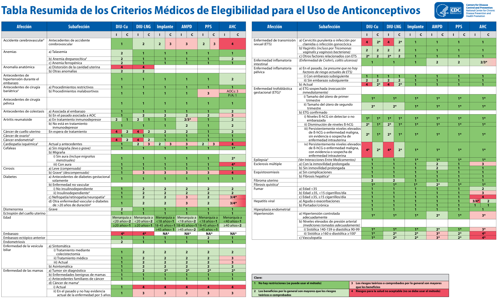

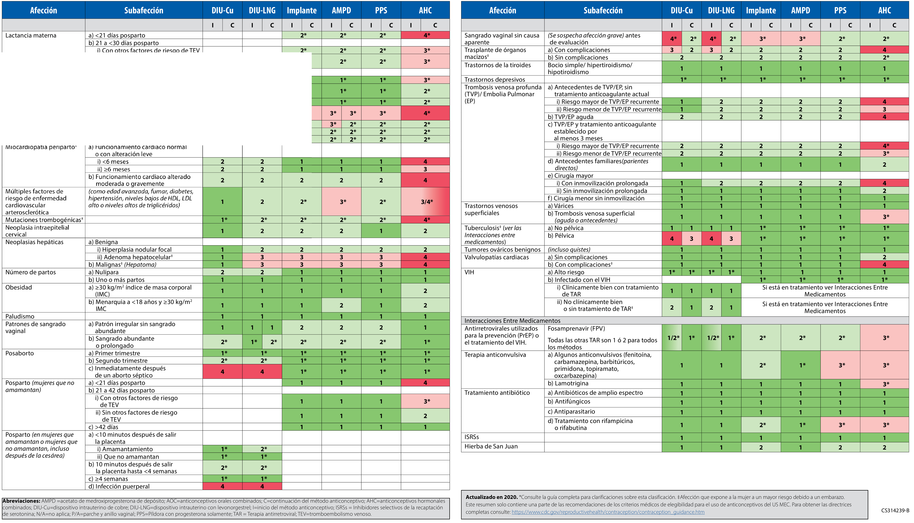

## Efectividad MAC

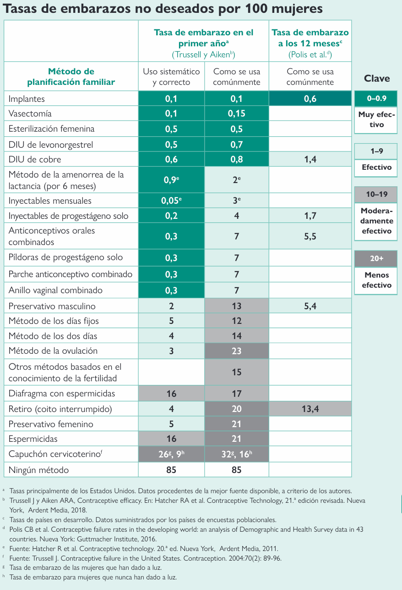

## Datos de fcos

Progestágenos son los mein para inhibir peak de gonadotrofinas

Estrógenos necesitan dosis más altas (peligrosas por RAM) que progestágenos para inhibir peak gonadotrofinas

Progestágenos inhiben motilidad tormpas, ojo, si falla, mayor P(embarazo ectópico)

Anticonceptivos combinados "multifásicos", no han demostrado mejoría en eficacia ni disminución significativa de efectos adversos y son más caros. Por eso usualmente se prefieren monofásicos. Podrían ser útiles los multifásicos en mujeres con metrorragia importante (utilizando los monofásicos).

Actualmente la mayoría son de microdosis de etinil estradiol (<50 mcg), el que más tiene actualmente es 35 mcg de etinilestradiol. 

Ideal partir con 20-30 mcg de etinil estradiol. Preferir 30 mcg si paciente con más síntomas androgénicos (acné, piel grasa, hirsutismo).

Si cefalea catamenial, preferir 15-20 mcg etinil estradiol (como anillo vaginal). 

Parche mucha hormona, nunca dar a paciente con cefalea. 

Si inestabilidad anímica/depre, no es bueno progestágeno puro (como implanon). (simil a estado premenstrual). 

Con Mirena no suele pasar, la RAM media clásica es "acné como en collar de mandíbula y cuello" y spoting. Se puede combinar con ACO con estrógenos (basta con 5 mcg etinil estradiol o valedato estradiol).
- ACO tres meses junto con inicio de progestágeno

Estrógenos son procoag, pueden disminuir metrorragia aparte del mec por estimulación crecimiento endometrio.

"legrado médico" --> dar estrógenos cada 8 horas por... y luego suspenderlos de golpe.

Usualmente ACO son inductores hepáticos, por lo que aceleran metabolismo de varios fármacos, revisar, ojo fcos psiquiátricos. 

<b>Dienogest no está aprobado como método anticonceptivo pero sí como control de sangrado uterino anormal</b>. Desogestrel, por otro lado, es un progestágeno aprobado para su uso como método anticonceptivo.

## Progestágenos

Acetato de progesterona es el gold estandard para comparación, acetato de ciproterona es 250 veces más potente (darlo máx por 6 meses en contexto de ACO)

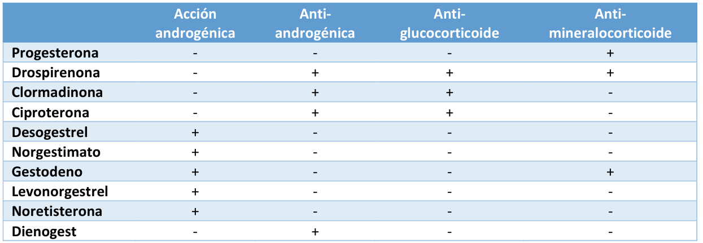

## ¿cómo y cuando comenzar ACO?

- Advertir RAM
- Uso de condón para prevenir ETS
- Entregar PAU (anticoncepción emergencia) en caso de olvido
- Incluir a la pareja
- Esquema continuo/prolongado

- Cuando se inicia ACO o se cambia, usar sí o sí preservativo los primeros 7 días 
- Antes se indicaba partir el día 5 de la menstruación. Sin embargo, ahora se recomienda el primer día por temas prácticos. 

menstruación != flujo rojo cuando está con ACO (porque no está ovulando)

Metrorragia "anovulatoria" por hiperestrogenismo mantenido (ACO o incluso obesidad)

Menstruación es "sinónimo" de ovulación (need coordinación de los ejes hormonales et al)

## Olvido toma de una píldora

- Irse a la segura con preservativo
- Hasta 3 días se pueden tomar las 3 pastillas

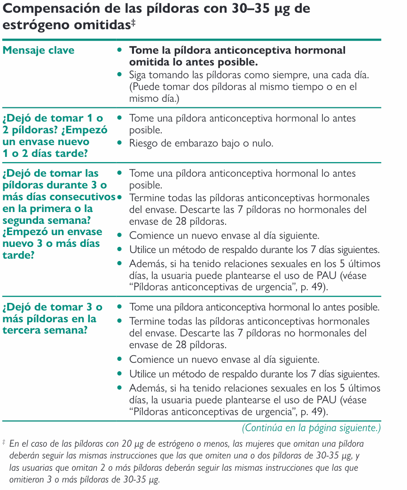
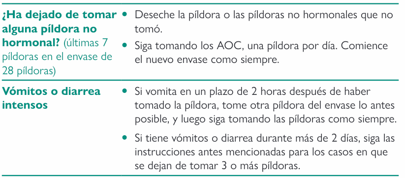

[Link libro metodos anticonceptivos](https://1drv.ms/b/s!Ak26tjXtxiL0gYFu2Wokn8biyL6uaA?e=8C5k8t)

## DIU

Ojo, descartar embarazo y EIP antes de colocar DIU

## Vasectomía

Ojo: need espermiograma 3 meses post para confirmar efectividad

## Anticoncepción de emergencia

Yuzpe (con estrógeno), 85% efectividad primeros 3 días. Produce descamación de endometrio

Progestágeno (inhibe ovulación, podría prevenir fecundación si se toma previo a ovulación).

# Sangrado uterino anormal

Sangrado uterino normal:
- Intervalos regulares con una variación menor o igual a 7-9 días.  
- Frecuencia de ciclo: entre 24-38 días.   
- Duración: de hasta 8 días. 
- Volumen: Menor a 80 ml, pero que clínicamente no altera la calidad de vida.  

Se puede acompañar de síntomas premenstruales, como cambios de humor, mastodinia, distensión abdominal, dismenorrea, cambios en el moco cervical y cambios en la temperatura. Estos síntomas permiten reconocer que la menstruación fue ovulatoria. 

<table class="api table-wrapper-wide" data-table="dGQlM0UlMjAlM0MvdHIlM0UlMEElM0MvdGJvZHklM0UlMEElM0MvdGFibGUlM0U=39857">
<thead>
<tr>
<th colspan="4" scope="row"> Characteristics and causes of <a data-phrasegroup-id="rrbfiE" class="api tooltip__link link--same-article" data-type="link" data-anker="Z423d73a9f8f7ebab62e66770d5cf0175" data-learningcard-id="Ek08pT" data-lxid="Ek08pT" data-section-id="hDXcVZ0" data-sxid="hDXcVZ0" data-title="VGhlIG1lbnN0cnVhbCBjeWNsZSBhbmQgbWVuc3RydWFsIGN5Y2xlIGFibm9ybWFsaXRpZXMg4oaSIEFibm9ybWFsIHV0ZXJpbmUgYmxlZWRpbmc=" id="L90782110e5d92502a6be7ba48f60f745" data-source="L90782110e5d92502a6be7ba48f60f745" href="/us/article/Ek08pT#Z423d73a9f8f7ebab62e66770d5cf0175">AUB</a> according to FIGO [15]
</th> </tr>
<tr>
<th scope="row">Characteristic</th> <th scope="col">Normal parameters</th> <th scope="col">Abnormal parameters</th> <th scope="col">Common causes</th> </tr>
</thead>
<tbody>
<tr>
<th colspan="1" rowspan="3" scope="row"> 
Frequency
 </th> <td colspan="1" rowspan="3"> <ul>
<li>≥ 24–38 days</li> </ul>
</td> <td> <ul>
<li>Absent (no bleeding): <a data-phrasegroup-id="x2bEPG" class="api tooltip__link link--same-article" data-type="link" data-anker="Z7b9bb3ba1e4052f4e3782e257cfac8fe" data-learningcard-id="Ek08pT" data-lxid="Ek08pT" data-section-id="SDXydZ0" data-sxid="SDXydZ0" data-title="VGhlIG1lbnN0cnVhbCBjeWNsZSBhbmQgbWVuc3RydWFsIGN5Y2xlIGFibm9ybWFsaXRpZXMg4oaSIEFtZW5vcnJoZWEgKG1lbnN0cnVhbCBjZXNzYXRpb24p" id="L95f2c37e97f0d7ca157a38d136cd0d05" data-source="L95f2c37e97f0d7ca157a38d136cd0d05" href="/us/article/Ek08pT#Z7b9bb3ba1e4052f4e3782e257cfac8fe">amenorrhea</a>
</li> </ul>
</td> <td> <ul>
<li>See “<a data-phrasegroup-id="x2bEPG" class="api tooltip__link link--same-article" data-type="link" data-anker="Z7b9bb3ba1e4052f4e3782e257cfac8fe" data-learningcard-id="Ek08pT" data-lxid="Ek08pT" data-section-id="SDXydZ0" data-sxid="SDXydZ0" data-title="VGhlIG1lbnN0cnVhbCBjeWNsZSBhbmQgbWVuc3RydWFsIGN5Y2xlIGFibm9ybWFsaXRpZXMg4oaSIEFtZW5vcnJoZWEgKG1lbnN0cnVhbCBjZXNzYXRpb24p" id="L63c5a1fa417daa0c6279b1e580cba3d8" data-source="L63c5a1fa417daa0c6279b1e580cba3d8" href="/us/article/Ek08pT#Z7b9bb3ba1e4052f4e3782e257cfac8fe">Amenorrhea</a>” above.</li> </ul>
</td> </tr>
<tr>
<td> <ul>
<li>Infrequent: cycles intervals &gt; 38 days (formerly known as oligomenorrhea)</li> </ul>
</td> <td> <ul>
<li>
<a data-phrasegroup-id="MM0M6g" class="api tooltip__link" data-type="link" data-anker="Zeba6f488931dd463917047bb9c5f18f4" data-learningcard-id="dO0orT" data-lxid="dO0orT" data-title="UHJlZ25hbmN5" id="L8d7026099ce89fcc7389b2c1b309fac2" data-source="L8d7026099ce89fcc7389b2c1b309fac2" href="/us/article/dO0orT#Zeba6f488931dd463917047bb9c5f18f4">Pregnancy</a> (including <a data-phrasegroup-id="KM0Upg" class="api tooltip__link" data-type="link" data-anker="Z6ef0a96f067b4080a8b0db4679612a4c" data-learningcard-id="fO0k7T" data-lxid="fO0k7T" data-title="RWN0b3BpYyBwcmVnbmFuY3k=" id="Lcfb8e999159586417147bf58f43930c7" data-source="Lcfb8e999159586417147bf58f43930c7" href="/us/article/fO0k7T#Z6ef0a96f067b4080a8b0db4679612a4c">ectopic pregnancy</a>)</li> <li><a data-phrasegroup-id="Xn097g" class="api tooltip__link" data-type="link" data-anker="Zbd81e7bf0ad319fff0a5830a22d12550" data-learningcard-id="AO0RET" data-lxid="AO0RET" data-title="UG9seWN5c3RpYyBvdmFyeSBzeW5kcm9tZQ==" id="L61f0e40bc0b328c99d5b2cf7cc0d55f3" data-source="L61f0e40bc0b328c99d5b2cf7cc0d55f3" href="/us/article/AO0RET#Zbd81e7bf0ad319fff0a5830a22d12550">PCOS</a></li> <li>Insufficient caloric intake (e.g., due to <a data-phrasegroup-id="Fm0ghg" class="api tooltip__link" data-type="link" data-anker="Z5537c77b84671ba0eb45ab8a710a3f38" data-learningcard-id="Et0823" data-lxid="Et0823" data-title="QW5vcmV4aWEgbmVydm9zYQ==" id="L668c9d319afcaa9ede7777e35dc28b7b" data-source="L668c9d319afcaa9ede7777e35dc28b7b" href="/us/article/Et0823#Z5537c77b84671ba0eb45ab8a710a3f38">anorexia nervosa</a>)</li> <li><a data-phrasegroup-id="9P0NST" class="api tooltip__link" data-type="link" data-anker="Z7efc7350132a2f2a3e4cc7763e7f07f8" data-learningcard-id="bg0HF2" data-lxid="bg0HF2" data-section-id="Ol1ICS0" data-sxid="Ol1ICS0" data-title="SHlwZXJ0aHlyb2lkaXNtIGFuZCB0aHlyb3RveGljb3NpcyDihpIgRGVmaW5pdGlvbg==" id="Lb0b3f8a53975e20edacec4796df442da" data-source="Lb0b3f8a53975e20edacec4796df442da" href="/us/article/bg0HF2#Z7efc7350132a2f2a3e4cc7763e7f07f8">Hyperthyroidism</a></li> <li><a data-phrasegroup-id="bSaHyP" class="api tooltip__link" data-type="link" data-anker="Z4905b81ddbe89e29dbc3170d7240cd9c" data-learningcard-id="BO0zuT" data-lxid="BO0zuT" data-section-id="gPbFVF" data-sxid="gPbFVF" data-title="TWVub3BhdXNlIOKGkiBEZWZpbml0aW9u" id="L12498b42a72c7bd72acca95d5156573d" data-source="L12498b42a72c7bd72acca95d5156573d" href="/us/article/BO0zuT#Z4905b81ddbe89e29dbc3170d7240cd9c">Perimenopause</a></li> </ul>
</td> </tr>
<tr>
<td> <ul>
<li>Frequent: cycles intervals &lt; 24 days (formerly known as polymenorrhea)</li> </ul>
</td> <td> <ul>
<li><a data-phrasegroup-id="VSYGAo" class="api tooltip__link" data-type="link" data-anker="Zfeb94cb1080f304c1140c5b7f3b94d2b" data-learningcard-id="PM0WKg" data-lxid="PM0WKg" data-section-id="fLckC10" data-sxid="fLckC10" data-title="UHViZXJ0eSDihpIgTm9ybWFsIHB1YmVydHk=" id="L96f9606120888d74f30b1461dd96e538" data-source="L96f9606120888d74f30b1461dd96e538" href="/us/article/PM0WKg#Zfeb94cb1080f304c1140c5b7f3b94d2b">Menarche</a></li> <li><a data-phrasegroup-id="bSaHyP" class="api tooltip__link" data-type="link" data-anker="Z4905b81ddbe89e29dbc3170d7240cd9c" data-learningcard-id="BO0zuT" data-lxid="BO0zuT" data-section-id="gPbFVF" data-sxid="gPbFVF" data-title="TWVub3BhdXNlIOKGkiBEZWZpbml0aW9u" id="L3349ef762f7ed0af163338f4d027c192" data-source="L3349ef762f7ed0af163338f4d027c192" href="/us/article/BO0zuT#Z4905b81ddbe89e29dbc3170d7240cd9c">Perimenopause</a></li> <li>Psychological stress</li> </ul>
</td> </tr>
<tr>
<th scope="row"> 
Regularity
 </th> <td> <ul>
<li>Variation between shortest and longest cycle (7–9 days) or normal cycle length ± 4 days 

 </li> </ul>
</td> <td> <ul>
<li>Irregular <ul>
<li>Variation between shortest and longest cycle ≥ 8–10 days (the amount of variation considered normal depends on the individual)</li> </ul>
</li> </ul>
</td> <td> <ul>
<li><a data-phrasegroup-id="Xn097g" class="api tooltip__link" data-type="link" data-anker="Zbd81e7bf0ad319fff0a5830a22d12550" data-learningcard-id="AO0RET" data-lxid="AO0RET" data-title="UG9seWN5c3RpYyBvdmFyeSBzeW5kcm9tZQ==" id="L831a94d95dcada8ae48bc1a82bf3f343" data-source="L831a94d95dcada8ae48bc1a82bf3f343" href="/us/article/AO0RET#Zbd81e7bf0ad319fff0a5830a22d12550">PCOS</a></li> <li><a data-phrasegroup-id="bSaHyP" class="api tooltip__link" data-type="link" data-anker="Z4905b81ddbe89e29dbc3170d7240cd9c" data-learningcard-id="BO0zuT" data-lxid="BO0zuT" data-section-id="gPbFVF" data-sxid="gPbFVF" data-title="TWVub3BhdXNlIOKGkiBEZWZpbml0aW9u" id="Lc754d3e941d8bca4aa39d814e8eb4ed1" data-source="Lc754d3e941d8bca4aa39d814e8eb4ed1" href="/us/article/BO0zuT#Z4905b81ddbe89e29dbc3170d7240cd9c">Perimenopause</a></li> </ul>
</td> </tr>
<tr>
<th scope="row"> 
Duration
 </th> <td> <ul>
<li>≤ 8 days</li> </ul>
</td> <td> <ul>
<li>Prolonged: &gt; 8 days
</li> </ul>
</td> <td> <ul>
<li><a data-phrasegroup-id="OM0IKg" class="api tooltip__link" data-type="link" data-anker="Z633903c447faa894b7cedd95c078b4fd" data-learningcard-id="-k0DqT" data-lxid="-k0DqT" data-title="RW5kb21ldHJpb3Npcw==" id="L0f5d2343ecad5f4a327d472cb86eec74" data-source="L0f5d2343ecad5f4a327d472cb86eec74" href="/us/article/-k0DqT#Z633903c447faa894b7cedd95c078b4fd">Endometriosis</a></li> <li><a data-phrasegroup-id="cHba6E" class="api tooltip__link" data-type="link" data-anker="Z0ca58253632bb757248bb5b4a3244d40" data-learningcard-id="UJ0btS" data-lxid="UJ0btS" data-section-id="9zcNEU0" data-sxid="9zcNEU0" data-title="QmVuaWduIGFuZCBwcmVtYWxpZ25hbnQgbGVzaW9ucyBvZiB0aGUgZW5kb21ldHJpdW0g4oaSIEVuZG9tZXRyaWFsIGh5cGVycGxhc2lh" id="L1c42c66a7969ff9dfda6ff676bfc5248" data-source="L1c42c66a7969ff9dfda6ff676bfc5248" href="/us/article/UJ0btS#Z0ca58253632bb757248bb5b4a3244d40">Endometrial hyperplasia</a></li> <li><a data-phrasegroup-id="NM0-Kg" class="api tooltip__link" data-type="link" data-anker="Zae6b43f6d0cfb98641d08a14ebaf922c" data-learningcard-id="0O0eIT" data-lxid="0O0eIT" data-title="RW5kb21ldHJpYWwgY2FuY2Vy" id="L7d5c8882c37dec70819cdcb0a3d1bc9f" data-source="L7d5c8882c37dec70819cdcb0a3d1bc9f" href="/us/article/0O0eIT#Zae6b43f6d0cfb98641d08a14ebaf922c">Endometrial cancer</a></li> </ul>
</td> </tr>
<tr>
<th colspan="1" rowspan="2" scope="row"> 
Volume
 </th> <td colspan="1" rowspan="2"> <ul>
<li>Determined by the patient</li> </ul>
</td> <td> <ul>
<li>
<a data-phrasegroup-id="x2aEPP" class="api tooltip__link link--same-article" data-type="link" data-anker="Z24ebd11d039927bf8de42a80c421175c" data-learningcard-id="Ek08pT" data-lxid="Ek08pT" data-section-id="hDXcVZ0" data-sxid="hDXcVZ0" data-title="VGhlIG1lbnN0cnVhbCBjeWNsZSBhbmQgbWVuc3RydWFsIGN5Y2xlIGFibm9ybWFsaXRpZXMg4oaSIEFibm9ybWFsIHV0ZXJpbmUgYmxlZWRpbmc=" id="La236af0b3ba088ff48345447dffced7f" data-source="La236af0b3ba088ff48345447dffced7f" href="/us/article/Ek08pT#Z24ebd11d039927bf8de42a80c421175c">Light menstruation</a> (formerly known as hypomenorrhea)</li> </ul>
</td> <td> <ul>
<li>
<a data-phrasegroup-id="vjXAXy" class="api tooltip__link" data-type="link" data-anker="Z35fc608984a172f7b06b0a5f7fb12522" data-learningcard-id="O60IOS" data-lxid="O60IOS" data-section-id="xFcE4V0" data-sxid="xFcE4V0" data-title="RmVtYWxlIHJlcHJvZHVjdGl2ZSBvcmdhbnMg4oaSIFV0ZXJ1cyBhbmQgY2Vydml4" id="Lb863fcba43a7a36c9bd56793b674ebf2" data-source="Lb863fcba43a7a36c9bd56793b674ebf2" href="/us/article/O60IOS#Z35fc608984a172f7b06b0a5f7fb12522">Endometrial</a> <a data-phrasegroup-id="dwYo3r" class="api tooltip__link" data-type="link" data-anker="Za78e93e8d8af6655bfa6f64569ad19e2" data-learningcard-id="VP0GdT" data-lxid="VP0GdT" data-section-id="aFXQg-" data-sxid="aFXQg-" data-title="Q2VsbHVsYXIgY2hhbmdlcyBhbmQgYWRhcHRpdmUgcmVzcG9uc2VzIOKGkiBDZWxsdWxhciBhZGFwdGF0aW9u" id="Lf1afbab588f681b387876c7179fe7e10" data-source="Lf1afbab588f681b387876c7179fe7e10" href="/us/article/VP0GdT#Za78e93e8d8af6655bfa6f64569ad19e2">atrophy</a>
</li> <li>
<a class="api" data-type="link" data-anker="Z9ae7b7ae2f4f3fc6861b417211e3a4e5" data-learningcard-id="GP0BTT" data-lxid="GP0BTT" data-title="T3ZlcnZpZXcgb2YgZWF0aW5nIGRpc29yZGVycw==" id="L614ddee67d67146bcb948c815f29835d" data-source="L614ddee67d67146bcb948c815f29835d" href="/us/article/GP0BTT#Z9ae7b7ae2f4f3fc6861b417211e3a4e5">Eating disorders</a> (e.g., <a data-phrasegroup-id="Fm0ghg" class="api tooltip__link" data-type="link" data-anker="Z5537c77b84671ba0eb45ab8a710a3f38" data-learningcard-id="Et0823" data-lxid="Et0823" data-title="QW5vcmV4aWEgbmVydm9zYQ==" id="L7cdf2c4ed94a411b066d63cf4a4e637e" data-source="L7cdf2c4ed94a411b066d63cf4a4e637e" href="/us/article/Et0823#Z5537c77b84671ba0eb45ab8a710a3f38">anorexia nervosa</a>)</li> <li>Chronic <a data-phrasegroup-id="IyaYgM" class="api tooltip__link link--same-article" data-type="link" data-anker="Zf8e1decd77cd3c6b37f3d2ffebf3dbba" data-learningcard-id="Ek08pT" data-lxid="Ek08pT" data-section-id="OKcIgW0" data-sxid="OKcIgW0" data-title="VGhlIG1lbnN0cnVhbCBjeWNsZSBhbmQgbWVuc3RydWFsIGN5Y2xlIGFibm9ybWFsaXRpZXMg4oaSIERpZmZlcmVudGlhbCBkaWFnbm9zaXMgYW5kIHRyZWF0bWVudCBvZiBkeXNtZW5vcnJoZWEgYW5kIGFibm9ybWFsIHV0ZXJpbmUgYmxlZWRpbmc=" id="L8dab1f3b0162ce1f8c5f0b18574e33ac" data-source="L8dab1f3b0162ce1f8c5f0b18574e33ac" href="/us/article/Ek08pT#Zf8e1decd77cd3c6b37f3d2ffebf3dbba">endometritis</a>
</li> <li>
<a data-phrasegroup-id="Dla1_k" class="api tooltip__link" data-type="link" data-anker="Z899aa9dfd6a8c31255c1b74109423c32" data-learningcard-id="rt0fU3" data-lxid="rt0fU3" data-section-id="uKWpRm0" data-sxid="uKWpRm0" data-title="Q29udHJhY2VwdGlvbiDihpIgSG9ybW9uYWwgY29udHJhY2VwdGlvbg==" id="Lb86669a1d981360ae7504b09f7201acc" data-source="Lb86669a1d981360ae7504b09f7201acc" href="/us/article/rt0fU3#Z899aa9dfd6a8c31255c1b74109423c32">OCP</a> use</li> </ul>
</td> </tr>
<tr>
<td> <ul>
<li>
Heavy menstrual bleeding: excessive blood loss that interferes with physical, social, and/or emotional quality of life 

</li> </ul>
</td> <td> <ul>
<li>
<a data-phrasegroup-id="NM0-Kg" class="api tooltip__link" data-type="link" data-anker="Zae6b43f6d0cfb98641d08a14ebaf922c" data-learningcard-id="0O0eIT" data-lxid="0O0eIT" data-title="RW5kb21ldHJpYWwgY2FuY2Vy" id="L96eae2302c3f7f0932a0433072fc8eec" data-source="L96eae2302c3f7f0932a0433072fc8eec" href="/us/article/0O0eIT#Zae6b43f6d0cfb98641d08a14ebaf922c">Endometrial cancer</a>/<a data-phrasegroup-id="W8aPlm" class="api tooltip__link" data-type="link" data-anker="Z7c2f7198db9b555525515960ad48bd59" data-learningcard-id="VP0GdT" data-lxid="VP0GdT" data-section-id="aFXQg-" data-sxid="aFXQg-" data-title="Q2VsbHVsYXIgY2hhbmdlcyBhbmQgYWRhcHRpdmUgcmVzcG9uc2VzIOKGkiBDZWxsdWxhciBhZGFwdGF0aW9u" id="La98f81ee7c56df29ac5c480d7db60606" data-source="La98f81ee7c56df29ac5c480d7db60606" href="/us/article/VP0GdT#Z7c2f7198db9b555525515960ad48bd59">hyperplasia</a>
</li> <li><a data-phrasegroup-id="OM0IKg" class="api tooltip__link" data-type="link" data-anker="Z633903c447faa894b7cedd95c078b4fd" data-learningcard-id="-k0DqT" data-lxid="-k0DqT" data-title="RW5kb21ldHJpb3Npcw==" id="L8223d57b2a91cf09896f74ae344d8bf0" data-source="L8223d57b2a91cf09896f74ae344d8bf0" href="/us/article/-k0DqT#Z633903c447faa894b7cedd95c078b4fd">Endometriosis</a></li> <li><a data-phrasegroup-id="CP0qST" class="api tooltip__link" data-type="link" data-anker="Z3fd41eef8b8ce3cec9c7eda727b6d1ce" data-learningcard-id="cg0a82" data-lxid="cg0a82" data-title="SHlwb3RoeXJvaWRpc20=" id="L1cb4f27c7b688a0c1f1930259efa30f6" data-source="L1cb4f27c7b688a0c1f1930259efa30f6" href="/us/article/cg0a82#Z3fd41eef8b8ce3cec9c7eda727b6d1ce">Hypothyroidism</a></li> </ul>
</td> </tr>
<tr>
<th colspan="1" rowspan="2" scope="row"> Intermenstrual bleeding 

 </th> <td colspan="1" rowspan="2"> <ul>
<li>None</li> </ul>
</td> <td> <ul>
<li>Random</li> </ul>
</td> <td> <ul>
<li>
<a data-phrasegroup-id="NM0-Kg" class="api tooltip__link" data-type="link" data-anker="Zae6b43f6d0cfb98641d08a14ebaf922c" data-learningcard-id="0O0eIT" data-lxid="0O0eIT" data-title="RW5kb21ldHJpYWwgY2FuY2Vy" id="L89c5b454eaeb07dbcd4df573b5a6c07b" data-source="L89c5b454eaeb07dbcd4df573b5a6c07b" href="/us/article/0O0eIT#Zae6b43f6d0cfb98641d08a14ebaf922c">Endometrial cancer</a>/<a data-phrasegroup-id="W8aPlm" class="api tooltip__link" data-type="link" data-anker="Z7c2f7198db9b555525515960ad48bd59" data-learningcard-id="VP0GdT" data-lxid="VP0GdT" data-section-id="aFXQg-" data-sxid="aFXQg-" data-title="Q2VsbHVsYXIgY2hhbmdlcyBhbmQgYWRhcHRpdmUgcmVzcG9uc2VzIOKGkiBDZWxsdWxhciBhZGFwdGF0aW9u" id="L57b455454c85c2acb76da184773026a9" data-source="L57b455454c85c2acb76da184773026a9" href="/us/article/VP0GdT#Z7c2f7198db9b555525515960ad48bd59">hyperplasia</a>, <a data-phrasegroup-id="lM0vKg" class="api tooltip__link" data-type="link" data-anker="Zb0043b20d16c82430e1686560be81736" data-learningcard-id="ZO0ZIT" data-lxid="ZO0ZIT" data-title="SW52YXNpdmUgY2VydmljYWwgY2FuY2Vy" id="L28f072e4b836997f7ffeed3ba99075f8" data-source="L28f072e4b836997f7ffeed3ba99075f8" href="/us/article/ZO0ZIT#Zb0043b20d16c82430e1686560be81736">cervical cancer</a>
</li> <li><a data-phrasegroup-id="vHbAHE" class="api tooltip__link" data-type="link" data-anker="Z27c4cafca4bb74a81fa518cc96327369" data-learningcard-id="sF0tj3" data-lxid="sF0tj3" data-title="Q2VydmljaXRpcw==" id="L6b7faeef50f0e2e68f98ac86319751d7" data-source="L6b7faeef50f0e2e68f98ac86319751d7" href="/us/article/sF0tj3#Z27c4cafca4bb74a81fa518cc96327369">Cervicitis</a></li> <li>Polyps</li> <li>
<a data-phrasegroup-id="Dla1_k" class="api tooltip__link" data-type="link" data-anker="Z899aa9dfd6a8c31255c1b74109423c32" data-learningcard-id="rt0fU3" data-lxid="rt0fU3" data-section-id="uKWpRm0" data-sxid="uKWpRm0" data-title="Q29udHJhY2VwdGlvbiDihpIgSG9ybW9uYWwgY29udHJhY2VwdGlvbg==" id="L5fd769e89b4e590a569f3e6b8fdd724f" data-source="L5fd769e89b4e590a569f3e6b8fdd724f" href="/us/article/rt0fU3#Z899aa9dfd6a8c31255c1b74109423c32">OCP</a> use</li> </ul>
</td> </tr>
<tr>
<td> <ul>
<li>Cyclic (predictable bleeding): minimal bleeding seen during early, mid, or late cycle</li> </ul>
</td> <td> <ul>
<li>
<a data-phrasegroup-id="UeXbyC" class="api tooltip__link link--same-article" data-type="link" data-anker="Z4444420b54b73b5aae96fe23b2824fc4" data-learningcard-id="Ek08pT" data-lxid="Ek08pT" data-section-id="fDXkdZ0" data-sxid="fDXkdZ0" data-title="VGhlIG1lbnN0cnVhbCBjeWNsZSBhbmQgbWVuc3RydWFsIGN5Y2xlIGFibm9ybWFsaXRpZXMg4oaSIFBoeXNpb2xvZ3kgb2YgdGhlIG1lbnN0cnVhbCBjeWNsZQ==" id="Lb96b37aae706923fb3a102fc8284f703" data-source="Lb96b37aae706923fb3a102fc8284f703" href="/us/article/Ek08pT#Z4444420b54b73b5aae96fe23b2824fc4">Ovulation</a> 

</li> <li>
Breakthrough bleeding: midcycle bleeding due to <a data-phrasegroup-id="ZKaZUl" class="api tooltip__link" data-type="link" data-anker="Zc880c21d5265a921cfdf80b444377952" data-learningcard-id="AT0Rt2" data-lxid="AT0Rt2" data-section-id="eJXxG_" data-sxid="eJXxG_" data-title="R2VuZXJhbCBlbmRvY3Jpbm9sb2d5IOKGkiBCYXNpY3Mgb2YgZW5kb2NyaW5vbG9neQ==" id="L5119ca4836fbf70b0e1c5457a84b5bfd" data-source="L5119ca4836fbf70b0e1c5457a84b5bfd" href="/us/article/AT0Rt2#Zc880c21d5265a921cfdf80b444377952">hormone</a> imbalance (usually after starting new <a data-phrasegroup-id="Dla1_k" class="api tooltip__link" data-type="link" data-anker="Z899aa9dfd6a8c31255c1b74109423c32" data-learningcard-id="rt0fU3" data-lxid="rt0fU3" data-section-id="uKWpRm0" data-sxid="uKWpRm0" data-title="Q29udHJhY2VwdGlvbiDihpIgSG9ybW9uYWwgY29udHJhY2VwdGlvbg==" id="L36e5a43192737b0da0efb4a6a65a8b1f" data-source="L36e5a43192737b0da0efb4a6a65a8b1f" href="/us/article/rt0fU3#Z899aa9dfd6a8c31255c1b74109423c32">OCP</a> therapy) [14] <ul>
<li>
<a data-phrasegroup-id="OTbIIG" class="api tooltip__link" data-type="link" data-anker="Z9f773b700d306dca5a1f7c25325b2ece" data-learningcard-id="uk0ppT" data-lxid="uk0ppT" data-section-id="dDXoWZ0" data-sxid="dDXoWZ0" data-title="RmVtYWxlIHNleCBob3Jtb25lcyDihpIgRXN0cm9nZW4=" id="Lbcc99fca353fc746e1fa96e713de02d4" data-source="Lbcc99fca353fc746e1fa96e713de02d4" href="/us/article/uk0ppT#Z9f773b700d306dca5a1f7c25325b2ece">Estrogen</a> breakthrough 

</li> <li>
<a data-phrasegroup-id="2gXTux" class="api tooltip__link" data-type="link" data-anker="Zf885481311d66b6abb1510c2c20cd63d" data-learningcard-id="uk0ppT" data-lxid="uk0ppT" data-section-id="SK1yf30" data-sxid="SK1yf30" data-title="RmVtYWxlIHNleCBob3Jtb25lcyDihpIgUHJvZ2VzdGVyb25l" id="L36dd56228b8568ec070d758b2e4db26b" data-source="L36dd56228b8568ec070d758b2e4db26b" href="/us/article/uk0ppT#Zf885481311d66b6abb1510c2c20cd63d">Progesterone</a> breakthrough 

</li> <li>
<a data-phrasegroup-id="OTbIIG" class="api tooltip__link" data-type="link" data-anker="Z9f773b700d306dca5a1f7c25325b2ece" data-learningcard-id="uk0ppT" data-lxid="uk0ppT" data-section-id="dDXoWZ0" data-sxid="dDXoWZ0" data-title="RmVtYWxlIHNleCBob3Jtb25lcyDihpIgRXN0cm9nZW4=" id="La6d024ddd74c230e306fcf40de51014d" data-source="La6d024ddd74c230e306fcf40de51014d" href="/us/article/uk0ppT#Z9f773b700d306dca5a1f7c25325b2ece">Estrogen</a> withdrawal 

</li> </ul>
</li> <li>
<a data-phrasegroup-id="OM0IKg" class="api tooltip__link" data-type="link" data-anker="Z633903c447faa894b7cedd95c078b4fd" data-learningcard-id="-k0DqT" data-lxid="-k0DqT" data-title="RW5kb21ldHJpb3Npcw==" id="L2a33ffe08ee4cc3b5f84077ce5d57dd1" data-source="L2a33ffe08ee4cc3b5f84077ce5d57dd1" href="/us/article/-k0DqT#Z633903c447faa894b7cedd95c078b4fd">Endometriosis</a>, myomas, polyps, <a data-phrasegroup-id="58XiM-" class="api tooltip__link" data-type="link" data-anker="Z22674f156f136302ff6142f806db0d5a" data-learningcard-id="WM0Png" data-lxid="WM0Png" data-section-id="azXQr00" data-sxid="azXQr00" data-title="R2VuZXJhbCBvbmNvbG9neSDihpIgTm9tZW5jbGF0dXJl" id="Lf157cadd243708a20f4b353fe4e40487" data-source="Lf157cadd243708a20f4b353fe4e40487" href="/us/article/WM0Png#Z22674f156f136302ff6142f806db0d5a">carcinomas</a>
</li> <li>Contact bleeding (e.g., during <a class="api" data-type="link" data-anker="Za63b4708c002798ccb69847987650da2" data-learningcard-id="1r02Th" data-lxid="1r02Th" data-section-id="em1xeh0" data-sxid="em1xeh0" data-title="T0IvR1lOOiBoaXN0b3J5IGFuZCBwaHlzaWNhbCBleGFtaW5hdGlvbiDihpIgR3luZWNvbG9naWMgZXhhbWluYXRpb24=" id="Laad41aa9d24484fe1b58e32af71bfa1f" data-source="Laad41aa9d24484fe1b58e32af71bfa1f" href="/us/article/1r02Th#Za63b4708c002798ccb69847987650da2">gynecological examination</a> in patients with <a data-phrasegroup-id="lM0vKg" class="api tooltip__link" data-type="link" data-anker="Zb0043b20d16c82430e1686560be81736" data-learningcard-id="ZO0ZIT" data-lxid="ZO0ZIT" data-title="SW52YXNpdmUgY2VydmljYWwgY2FuY2Vy" id="Lc819d0e0b8ce09183404a978a6d40a5c" data-source="Lc819d0e0b8ce09183404a978a6d40a5c" href="/us/article/ZO0ZIT#Zb0043b20d16c82430e1686560be81736">cervical carcinoma</a>)</li> <li>During <a data-phrasegroup-id="MM0M6g" class="api tooltip__link" data-type="link" data-anker="Zeba6f488931dd463917047bb9c5f18f4" data-learningcard-id="dO0orT" data-lxid="dO0orT" data-title="UHJlZ25hbmN5" id="Lbc743c301d27bee4aec6626a6b6ad639" data-source="Lbc743c301d27bee4aec6626a6b6ad639" href="/us/article/dO0orT#Zeba6f488931dd463917047bb9c5f18f4">pregnancy</a>: may indicate <a data-phrasegroup-id="a7bQ4E" class="api tooltip__link" data-type="link" data-anker="Z01254b7e089987fbcbaa659199d6e64c" data-learningcard-id="gO0F7T" data-lxid="gO0F7T" data-section-id="yDXdSZ0" data-sxid="yDXdSZ0" data-title="UHJlZ25hbmN5IGxvc3Mg4oaSIFNwb250YW5lb3VzIGFib3J0aW9u" id="L337be3d0a18dad857ba1d5de24df6e3c" data-source="L337be3d0a18dad857ba1d5de24df6e3c" href="/us/article/gO0F7T#Z01254b7e089987fbcbaa659199d6e64c">spontaneous abortion</a>
</li> </ul>
</td> </tr>
</tbody>
</table>

# Dolor Pélvico Agudo

## Etiología por sistemas

<table class="container" cellspacing="0"><colgroup span="2" width="50%"></colgroup> <tbody> 
<tr> <!-- Column Starts Here --> <td class="container"> <table cellspacing="0"> <tbody> 
<tr> <td class="subtitle1_single"> Reproductive tract 

</td> </tr> 
<tr> <td class="indent1"> Gynecologic: Infectious <ul class="decimal_heading"> <li><annotation-anchor data-content-id="qyaCTM" amboss-annotation-variant="none">Pelvic inflammatory disease</annotation-anchor></li> <li><annotation-anchor data-content-id="IyaYgM" amboss-annotation-variant="none">Endometritis</annotation-anchor></li> <li><annotation-anchor data-content-id="ryafgM" amboss-annotation-variant="none">Salpingitis</annotation-anchor></li> <li><annotation-anchor data-content-id="26bT4u" amboss-annotation-variant="none">Tubo-ovarian abscess</annotation-anchor></li> </ul> </td> </tr> 
<tr> <td class="indent1"> Gynecologic: Noninfectious <ul class="decimal_heading"> <li><annotation-anchor data-content-id="F2agjP" amboss-annotation-variant="none">Dysmenorrhea</annotation-anchor></li> <li><annotation-anchor data-content-id="kTamIP" amboss-annotation-variant="none">Ovarian cyst</annotation-anchor> (ruptured or intact)</li> <li>Endometriosis</li> <li>Uterine leiomyoma (fibroid): Degenerating or not</li> <li>Adenomyosis</li> <li>Mittelschmerz (midcycle ovulatory pain)</li> <li>Adnexal torsion (ovary and/or fallopian tube)</li> <li>Ovarian hyperstimulation syndrome</li> <li>Endosalpingiosis</li> <li>Uterine perforation (in women who have undergone a uterine procedure)</li> <li>Asherman's syndrome</li> <li>Neoplasm</li> </ul> </td> </tr> 
<tr> <td class="subtitle1_single">Pregnancy-related

</td> </tr> 
<tr> <td class="indent1"> First trimester <ul class="decimal_heading"> <li>Threatened abortion</li> <li>Ectopic pregnancy, including heterotopic pregnancy</li> <li>Corpus luteum hematoma</li> <li>Incomplete abortion</li> <li>Septic abortion</li> <li>Uterine impaction</li> </ul> </td> </tr> 
<tr> <td class="indent1"> Second and third trimesters <ul class="decimal_heading"> <li>Preterm labor</li> <li>Chorioamnionitis</li> <li>Placental abruption</li> <li>Degenerating uterine leiomyoma (fibroid)</li> <li>Medical complications during pregnancy, such as appendicitis</li> <li>Round ligament stretch</li> </ul> </td> </tr> 
<tr> <td class="indent1"> Postpartum <ul class="decimal_heading"> <li>Endometritis</li> <li>Wound infection (cesarean section, laceration, or episiotomy repair)</li> <li>Ovarian vein thrombosis or septic pelvic thrombophlebitis</li> </ul> </td> </tr> 
<tr> <td class="subtitle1_single"> Gastrointestinal 

</td> </tr> 
<tr> <td class="indent1">Appendicitis</td> </tr> 
<tr> <td class="indent1">Irritable bowel syndrome</td> </tr> 
<tr> <td class="indent1">Diverticulitis</td> </tr> 
<tr> <td class="indent1">Inflammatory bowel disease</td> </tr> 
<tr> <td class="indent1">Fecal impaction or constipation</td> </tr> 
<tr> <td class="indent1">Gastroenteritis</td> </tr> 
<tr> <td class="indent1">Mesenteric lymphadenitis</td> </tr> 
<tr> <td class="indent1">Abdominopelvic adhesions</td> </tr> 
<tr> <td class="indent1">Perforated viscus</td> </tr> 
<tr> <td class="indent1">Bowel obstruction</td> </tr> 
<tr> <td class="indent1">Incarcerated or strangulated hernia</td> </tr> 
<tr> <td class="indent1">Ischemic bowel</td> </tr> 
<tr> <td class="indent1">Hirschsprung disease[1]</td> </tr> 
<tr> <td class="indent1">Intussusception[2]</td> </tr> 
<tr> <td class="indent1">Meckel's diverticulum[3]</td> </tr> 
<tr> <td class="indent1">Volvulus[4]</td> </tr> </tbody> </table> </td> <!-- Column Ends Here --><!-- Column Starts Here --> <td class="container"> <table cellspacing="0"> <tbody> 
<tr> <td class="subtitle1_single"><annotation-anchor data-content-id="XVc9GY0" amboss-annotation-variant="none"> Urinary tract 

</annotation-anchor></td> </tr> 
<tr> <td class="indent1"><annotation-anchor data-content-id="-l0DzT" amboss-annotation-variant="none">Cystitis</annotation-anchor></td> </tr> 
<tr> <td class="indent1">Pyelonephritis</td> </tr> 
<tr> <td class="indent1">Painful bladder syndrome</td> </tr> 
<tr> <td class="indent1"><annotation-anchor data-content-id="T406iT" amboss-annotation-variant="none">Kidney stones</annotation-anchor></td> </tr> 
<tr> <td class="indent1">Urinary retention</td> </tr> 
<tr> <td class="indent1">Malignancy (bladder cancer)

</td> </tr> 
<tr> <td class="subtitle1_single">Vascular

</td> </tr> 
<tr> <td class="indent1">Abdominal aortic aneurysm and dissection</td> </tr> 
<tr> <td class="indent1">Sickle cell disease crisis</td> </tr> 
<tr> <td class="indent1">Septic pelvic thrombophlebitis</td> </tr> 
<tr> <td class="indent1">Ovarian vein thrombosis</td> </tr> 
<tr> <td class="indent1">Pelvic congestion syndrome

</td> </tr> 
<tr> <td class="subtitle1_single">Musculoskeletal

</td> </tr> 
<tr> <td class="indent1">Muscular strain or sprain</td> </tr> 
<tr> <td class="indent1">Abdominal wall hematoma or infection</td> </tr> 
<tr> <td class="indent1">Hernia (inguinal or femoral)</td> </tr> 
<tr> <td class="indent1">Pelvic fracture</td> </tr> 
<tr> <td class="indent1">Myofascial pain

</td> </tr> 
<tr> <td class="subtitle1_single">Neurologic

</td> </tr> 
<tr> <td class="indent1">Herpes zoster</td> </tr> 
<tr> <td class="indent1">Anterior cutaneous nerve entrapment syndrome</td> </tr> 
<tr> <td class="indent1">Abdominal epilepsy</td> </tr> 
<tr> <td class="indent1">Abdominal migraine

</td> </tr> 
<tr> <td class="subtitle1_single">Psychiatric

</td> </tr> 
<tr> <td class="indent1">Depression</td> </tr> 
<tr> <td class="indent1">Somatization disorder</td> </tr> 
<tr> <td class="indent1">Narcotic seeking</td> </tr> 
<tr> <td class="subtitle1_single">Sexual and interpersonal</td> </tr> 
<tr> <td class="indent1">Domestic violence</td> </tr> 
<tr> <td class="indent1">Sexual abuse

</td> </tr> 
<tr> <td class="subtitle1_single">Other

</td> </tr> 
<tr> <td class="indent1">Familial Mediterranean Fever</td> </tr> 
<tr> <td class="indent1">Porphyria[7]</td> </tr> 
<tr> <td class="indent1">Lead poisoning</td> </tr> 
<tr> <td class="indent1">TNF receptor-associated periodic syndrome (ie, TRAPS)</td> </tr> </tbody> </table> </td> <!-- Column Ends Here --> </tr> </tbody></table>

## Orientación diagnóstica

1° Descartar lo más <b>emergente</b>:
- <b>Embarazo ectópico</b>
- <b>Torsión ovárica</b>
- <b>Absceso tubo-ovárico roto</b>
- <b>Apendicitis</b>

Tb pensar en proceso diagnóstico en: PIP, Masa (quiste ovárico, torsión ovárica, dejeneración roja de mioma, endometriosis)

<table cellspacing="0"><colgroup span="7" width="14%"></colgroup> <tbody> <tr> <td class="subtitle1">Causative disorder or condition</td> <td class="subtitle1">Pain history</td> <td class="subtitle1">Associated symptoms</td> <td class="subtitle1">Supporting history</td> <td class="subtitle1">Physical examination</td> <td class="subtitle1">Useful tests</td> <td class="subtitle1">Atypical or additional aspects</td> </tr> <tr class="divider_bottom"> <td><annotation-anchor data-content-id="KM0Upg" amboss-annotation-variant="none">Ectopic pregnancy</annotation-anchor> (critical if ruptured)</td> <td>Classically severe, sharp, lateral pelvic pain, but severity, location, and quality highly variable </td> <td>Vaginal bleeding (often spotting or light, but can be absent)</td> <td> 
Missed period
 History of previous <annotation-anchor data-content-id="KM0Upg" amboss-annotation-variant="none">ectopic pregnancy</annotation-anchor>, <annotation-anchor data-content-id="OmaIfO" amboss-annotation-variant="none">infertility</annotation-anchor>, <annotation-anchor data-content-id="ZyXZd00" amboss-annotation-variant="none">pelvic</annotation-anchor> surgery, <annotation-anchor data-content-id="qyaCTM" amboss-annotation-variant="none">PID</annotation-anchor>, or <annotation-anchor data-content-id="5yaifM" amboss-annotation-variant="none">IUD</annotation-anchor> use</td> <td>Classically, unilateral adnexal tenderness, adnexal mass, <annotation-anchor data-content-id="DHb1sE" amboss-annotation-variant="none">CMT</annotation-anchor></td> <td> <ul> <li><annotation-anchor data-content-id="ZyXZd00" amboss-annotation-variant="none">Pelvic</annotation-anchor> US </li> <li>Quantitative <annotation-anchor data-content-id="uybpSw" amboss-annotation-variant="none">beta-hCG</annotation-anchor> </li> <li>TC </li> <li>Laparoscopy </li> </ul> </td> <td> 
Cannot reliably exclude diagnosis based on history and physical examination
 Severe pain, hypotension, or peritonitis suggests rupture</td> </tr> <tr class="divider_bottom"> <td><annotation-anchor data-content-id="_ib58t" amboss-annotation-variant="none">Ruptured ovarian cyst</annotation-anchor> (critical with significant hemorrhage; otherwise, emergency)</td> <td>Abrupt moderate to severe lateral pain</td> <td> 
Light-headedness if bleeding is severe
 
Rectal pain arises from fluid in cul-de-sac
 Nausea and vomiting may occur</td> <td> 
Pain may begin spontaneously or with intercourse
 Menstrual history may indicate LMP was two or more weeks ago</td> <td> 
<annotation-anchor data-content-id="nGb7-E" amboss-annotation-variant="none">Hypotension</annotation-anchor> and <annotation-anchor data-content-id="lNbvY8" amboss-annotation-variant="none">tachycardia</annotation-anchor> if blood loss is significant
 Possible peritonitis</td> <td> <ul> <li><annotation-anchor data-content-id="ZyXZd00" amboss-annotation-variant="none">Pelvic</annotation-anchor> US </li> <li>CBC </li> <li>TC </li> </ul> </td> <td>Physical examination findings often do not correlate with volume of blood in pelvis at US</td> </tr> <tr class="divider_bottom"> <td>Ovarian torsion (emergency)</td> <td>Acute onset of moderate to severe lateral pain</td> <td>Nausea and vomiting</td> <td>History of ovarian mass or cyst</td> <td> 
Adnexal mass and tenderness
 Possible peritonitis</td> <td> <ul> <li>US with Doppler flow studies </li> <li>Laparoscopy </li> </ul> </td> <td>Torsion can be intermittent, which causes symptoms to come and go</td> </tr> <tr class="divider_bottom"> <td>Appendicitis (emergency)</td> <td>Duration often &lt;48 hours, generalized followed by localized RLQ pain</td> <td>Low-grade fever, nausea, vomiting, anorexia</td> <td> 
Migration of pain to RLQ from center
 Abdominal pain before vomiting</td> <td> 
RLQ tenderness
 Possible peritonitis</td> <td> <ul> <li>US </li> <li>CT </li> <li>MRI </li> </ul> </td> <td>Early in course, tenderness may be minimal or poorly localized</td> </tr> <tr class="divider_bottom"> <td>PID (urgent-emergency), TOA (emergency)</td> <td>Without TOA, pain is usually bilateral; may manifest acutely within 48 hours, but PID may also be chronic</td> <td>Fever, vaginal discharge</td> <td> 
Vaginal discharge
 
History of PID
 History of a new sex partner, more than one partner, or a partner who has other sex partners or a sexually transmitted infection</td> <td> 
Pus from cervical os, CMT, adnexal tenderness
 Peritonitis suggests TOA or severe PID</td> <td> <ul> <li>CBC </li> <li>ESR </li> <li>CRP </li> <li>Pelvic US </li> <li>Cervical cultures </li> <li>Cervical smear for WBCs </li> </ul> </td> <td>History and physical examination may be inaccurate for diagnosis, particularly in patients with subacute presentation</td> </tr> <tr class="divider_bottom"> <td>Complicated UTI (urgent)</td> <td> 
Pain with urination
 Patient may have flank pain from associated pyelonephritis</td> <td> 
Urinary urgency and frequency
 Fever and vomiting if patient has associated pyelonephritis</td> <td> 
Recent urologic procedure
 Prior history of UTI</td> <td>Suprapubic tenderness, flank tenderness, and fever with pyelonephritis</td> <td> <ul> <li>Urinalysis </li> <li>Urine culture </li> </ul> </td> <td> 
WBCs can be present in urine with PID and appendicitis
 RBCs present in urine with hemorrhagic cystitis</td> </tr> <tr> <td>Ureteral obstruction (urgent)</td> <td> 
Acute onset, manifests within hours
 
Pain is lateral, usually moderate to severe
 Often radiates into the groin or costovertebral angle or flank</td> <td>Nausea and vomiting</td> <td>History of surgery that could cause ureteral obstruction or prior history of kidney stones</td> <td>Patient often appears uncomfortable, but physical examination can be otherwise unremarkable</td> <td> <ul> <li>Urinalysis, hematuria present in approximately 80% of cases </li> <li>Renal ultrasound for hydronephrosis </li> <li>Abdominal CT </li> </ul> </td> <td>If obstruction or stone is at uretero-vesicle junction, patient can have localized pain that can mimic appendicitis or other acute pelvic pathology</td> </tr> </tbody></table>

| Historia Clínica | Diagnóstico Sugerido |
|---|---|
| Dolor pélvico bilateral | PIP |
| Disuria | PIP, ITU |
| Descarga vaginal | PIP |
| Dolor de la mitad del ciclo menstrual | Mittelschmerz (dolor ovulatorio, Etiología --> Enlargement and rupture of the follicular cyst and contraction of Fallopian tubes during midcycle ovulation lead to transient peritoneal irritation from follicular fluid) |
| Dismenorrea | Endometriosis, adenomiosis, mioma uterino |
| Dispareunia | Endometriosis o quiste ovárico |
| Sangrado vaginal | Embarazo ectópico, mioma uterino, síntomas de aborto |
| Polaquiuria | ITU |
| Dolor irradiado a la ingle | Cálculo renal/ureteral, torsión ovárica |
| Hematuria franca | Cálculo renal/ureteral, ITU |
| Dolor pélvico derecho | Apendicitis, cálculo renal, torsión ovárica, quiste ovárico roto |
| Dolor pélvico izquierdo | Diverticulitis, cálculo renal/ureteral, torsión ovárica, quiste ovárico roto |
| Náuseas y vómitos | Apendicitis, cálculo renal/ureteral, torsión ovárica |
| Dolor que migra de área periumbilical a cuadrante inferior derecho del abdomen | Apendicitis |

| Hallazgo | Diagnóstico Sugerido |
|---|---|
| Masa anexial | Cuerpo lúteo, divertículo del colon, embarazo ectópico, endometriosis, quiste folicular, PIP, mioma uterino |
| Sensibilidad abdominal bilateral | PIP |
| Sensibilidad a la movilización cervical, uterina o anexial | PIP |
| Descarga vaginal mucopurulenta | PIP |
| Fiebre | Apendicitis, PIP, Pielonefritis |
| Hipotensión | Embarazo ectópico complicado, quiste ovárico hemorrágico roto |
| Sensibilidad del cuadrante inferior izquierdo del abdomen | Diverticulitis |
| Sensibilidad del cuadrante inferior derecho del abdomen | Apendicitis |

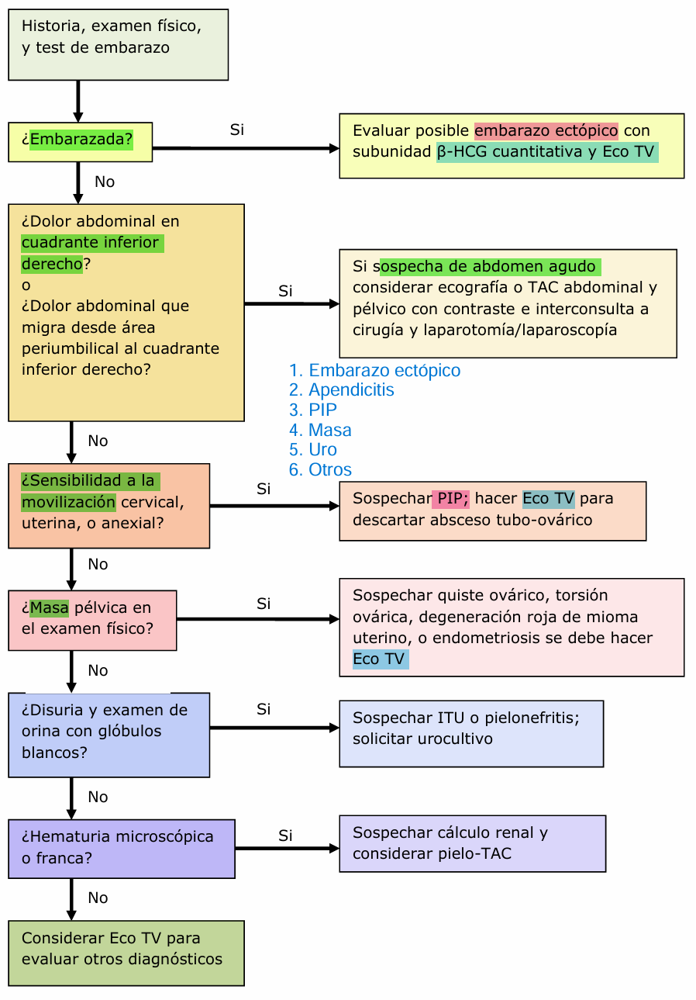

# Dolor pélvico crónico
## Definición dolor pélvico crónico

En pelvis, pared abdominal anterior (a nivel o bajo ombligo), zona lumbo-sacra o los glúteos. 

Persistente, no cíclico (no relacionado con menstruación), de más de 6 meses de duración.

Severidad causa incapacidad funcional, disminución de calidad de vida.

Recurso útil para buscar cuestionarios: [pelvicpain.org](https://www.pelvicpain.org/)

## Clasificación

- Ginecológico
    - Cíclico
    - Acíclico
- No ginecológico
    - Urológico: cistitis intersticial, cálculos renales, infecciones urinarias
    - Gastrointestinal: síndrome de intestino irritable, enfermedad inflamatoria intestinal
    - Neurológico: neuralgia del pudendo, neuropatía periférica
    - Musculoesquelético: disfunción de la articulación sacroilíaca, hernia discal
    - Psicosocial: depresión, ansiedad, abuso sexual

Importante definir si es **cíclico o acíclico**, si se asocia a **dispareunia** (de entrada/penetración, mantención/profunda, post-coital, mixta), **disquexia** (dolor al defecar), **vulvodinia** (disconfort vulvar crónico, de magnitud variable, en ausencia de causa infecciosa o dermatológica) u otros síntomas.

Para la dispareunia, acotar en qué momento:
- Dispareunia al inicio penetración: más de procesos inflamatorios "superficiales" (vaginitis, vulvovaginitis, vestibulitis)
- Dispareunia profunda: más de procesos inflamatorios profundos (endometriosis, adenomiosis, miomas, adherencias).

## Etiología

Quick view:
- ginecológicas  
- gastrointestinales 
- urológicas 
- musculoesqueléticas y neurológicas 
- psicológicas 

1. **Visceral**
- Gynecologic
    - Endometriosis: dolor, sangrado irregular y posiblemente infertilidad. Mayor sintomatología dolorosa cuando hay compromiso del tabique rectovaginal (dispareunia, disquexia)
    - Pelvic adhesions: FR: infecciones previas, endometriosis, radioterapia o antecedente de cirugía pelviana.
    - Adenomyosis
    - Leiomyoma
    - PIP (Chronic pelvic inflammatory disease/chronic endometritis)
    - Adnexalmass
    - Pelvic congestion syndrome
    - Ovarian remnant syndrome (cuando quedó tejido ovárico en ooforectomía)
    - Residual ovary syndrome (cuando se deja intencionalmente tejido ovárico)
    - Vestibulitis
    - Vulvodynia
- Gastrointestinal
    - **Inflammatory bowel disease**
    - **Irritable bowel syndrome**
    - Celiac disease
    - <b>Colorectal cancer</b> and cancer therapy
    - Diverticular colitis
- Urologic
    - <b>Bladder cancer</b> and cancer therapy
    - Chronic or complicated UTI
    - Interstitial cystitis
    - Painful bladder syndrome
    - Urethral diverticulum
2. **Neuromusculoskeletal**
- Fibromyalgia
- Myofascial syndromes
    - Coccydynia
    - Musculus levator ani syndrome
- Postural syndrome
- Abdominal wall syndromes
    - Muscular injury
    - Trigger point
- Neurologic
    - Abdominal epilepsy
    - Abdominal migraine
    - Neuralgia
    - Neuropathic pain
3. **Psychosocial**
- Abuse
    - Physical,emotional, sexual
- Depressivedisorders
    - Majordepressivedisorder
    - Persistentdepressivedisorder(dysthymia)
    - Substance-inducedormedication-induced depressivedisorder
- Anxietydisorders
    - Generalizedanxietydisorder
    - Panicdisorder
    - Socialanxietydisorder
    - Substance-inducedormedication-induced anxietydisorder    
- Somatic symptom disorders
    - Somatic symptom disorder with pain features
    - Somatic symptom disorder with somatic characteristics
- Substance use disorder
    - Substance abuse
    - Substance dependenc

## Evaluación clínica

1. Revisión detallada de sistemas y obtención de antecedentes médicos y quirúrgicos
    - Historia menstrual pasada
    - Uso previo de anticonceptivos
    - Historia obstétrica y ginecológica previa
2. Evaluar antecedentes sugerentes de:
    - Endometriosis: Dismenorrea, dispareunia, disquexia, infertilidad, dolor cíclico o nódulos en otras ubicaciones
    - Enfermedad inflamatoria pélvica: antecedente de infecciones pélvicas, antecedente de cirugía pélvica, antecedente de ETS, <b>dolor a la movilización cervical</b>, leucorrea, dispareunia, disuria
    - Enfermedad **gastrointestinal**, especialmente **síndrome del intestino irritable** (tb enfermedad inflamatoria intestinal): dolor abdominal, cambios en el hábito intestinal, distensión abdominal, flatulencia, náuseas, vómitos
    - Enfermedad urinaria, especialmente cistitis intersticial/síndrome de vejiga dolorosa
    - Enfermedad musculoesquelética
    - Enfermedad psiquiátrica, con enfoque en síntomas de depresión y ansiedad
3. Evaluar características del dolor:
    - Hallazgos asociados
    - Factores provocativos y paliativos
    - Calidad del dolor
    - Irradiación del dolor
    - Contexto en el que ocurre el dolor
    - Temporalidad: Momento en que ocurre el dolor y eventos que lo preceden o desencadenan

>Nota: dolor causado por SII y cistitis intersticial también puede presentar fluctuaciones en base a los niveles hormonales. 

4. Obtener historia **psicosocial**, con especial enfoque en:
    - Uso o abuso de sustancias, incluyendo alcohol, marihuana y medicamentos recetados
    - Seguridad del paciente: ¿Tiene el paciente una historia actual o pasada de abuso físico, sexual o emocional?
5. Preguntar sobre **pruebas diagnósticas previas** o tratamientos para el dolor
6. Indagar sobre historia familiar de condiciones clínicas relevantes, como síndromes de dolor crónico

Ojo: Signo de Carnett, luego de localizar el dolor con un dedo se le pide al paciente que eleve las piernas, si el dolor aumenta, se asocia a etiología miofascial del dolor o de pared abdominal. En caso contrario, corresponde a un dolor visceral. 

Signos de alarma para sospechar patología aguda o **emergente**:

En mujeres con dolor pélvico crónico (DPC), el dolor severo puede indicar un empeoramiento del síndrome de dolor crónico o resultar de un proceso abdominopélvico agudo. Mujeres con <b>signos vitales inestables, signos peritoneales, o sospecha de patología potencialmente mortal</b> (como embarazo ectópico o perforación intestinal) deben ser referidas para evaluación y manejo de emergencia. Además, mujeres con <b>presentaciones clínicas sospechosas de apendicitis aguda, enfermedad inflamatoria pélvica, cálculos renales obstructivos, o torsión ovárica</b> también deben ser evaluadas de manera expedita.

Red Flags que deben hacer sospechar malignidad o enfermedad sistémica grave son: 
- Pérdida de peso inexplicada 
- Hematoquecia 
- Metrorragia perimenopausia 
- Metrorragia postmenopáusica 
- Sinusorragia 

## Laboratorio e imágenes

Se puede solicitar: 
- UC/OC
- Cultivos/PCR cervicovaginales para ITS
- β-hCG
- Eco TV

## Tratamiento

De especialista y según la causa, perooo....

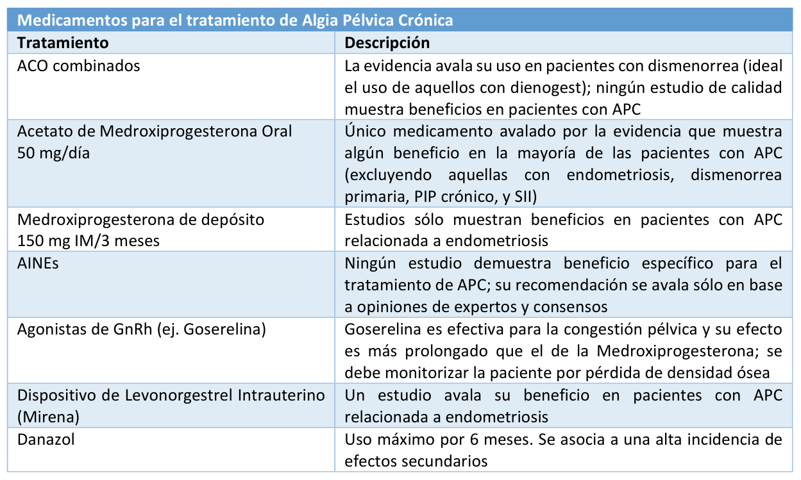

Como antiinflamatorio, sólo el Naproxeno ha sido apoyado por la evidencia, sin embargo, lo que más se utiliza 
es el Ácido Mefenámico (creo que porque tb disminuye sangrado??). 

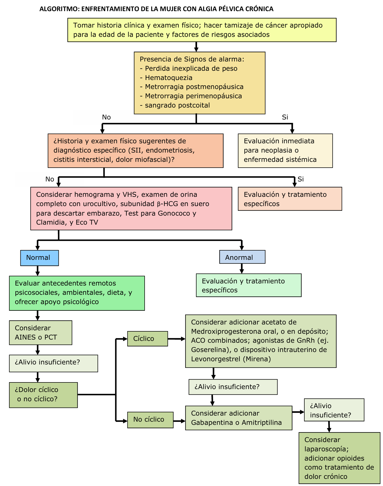

# Amenorrea

## Orientación clínica

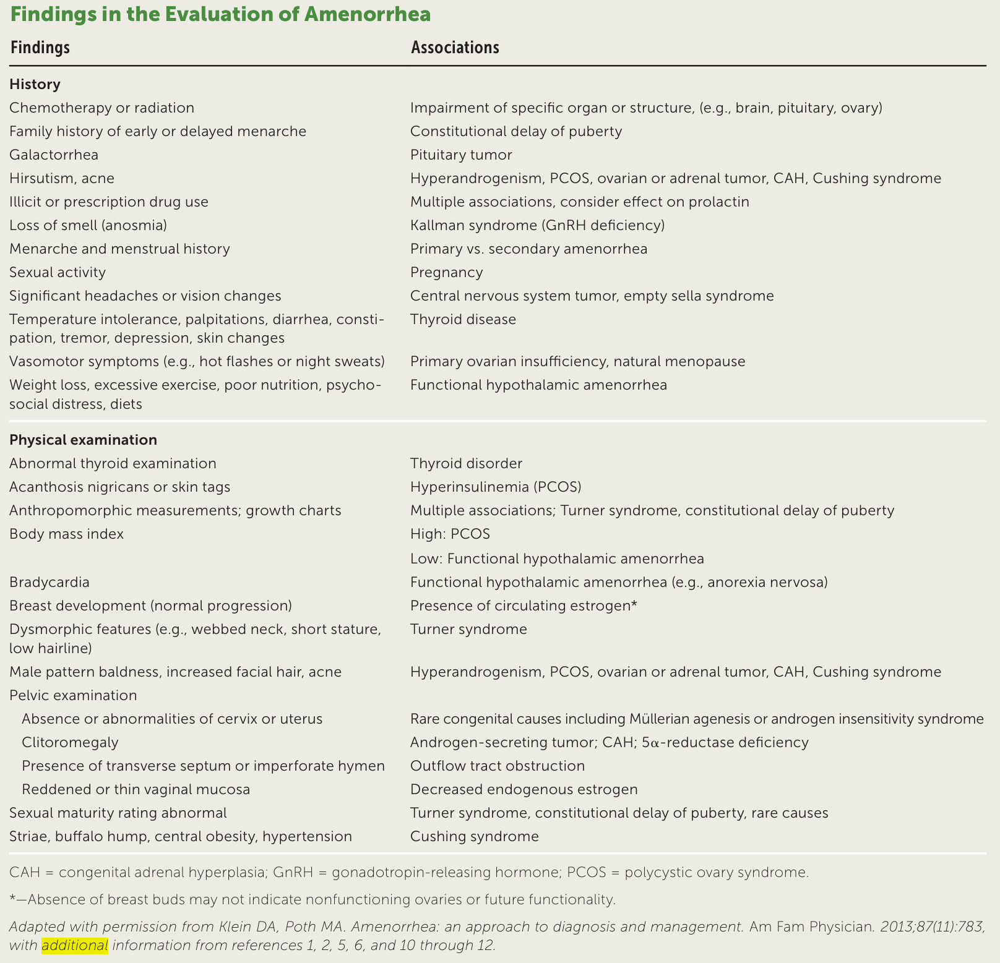

## Algoritmo diagnóstico

Amenorrea primaria: ausencia de menariquia a los 13 años sin desarrollo secundario sexual o a los 15 años con desarrollo secundario sexual.

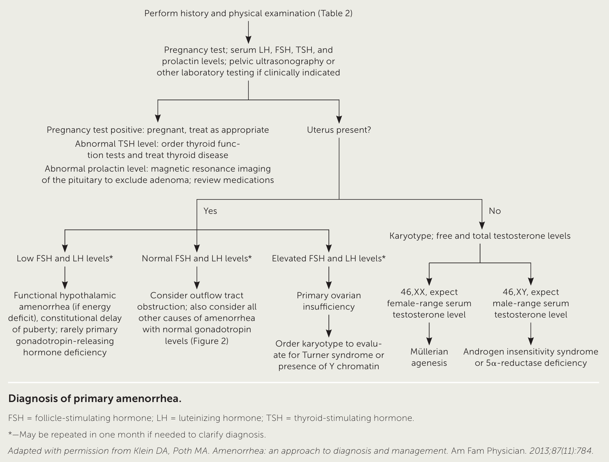

Amenorrhea secundaria: ausencia de menstruación por 3 meses en mujeres con ciclos previamente regulares o por 9 meses en mujeres con ciclos previamente irregulares.

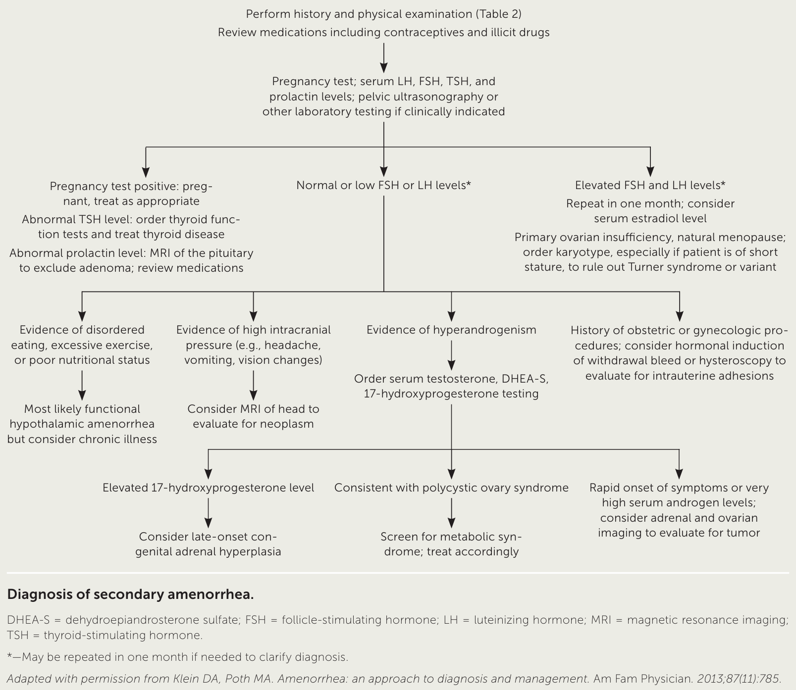

# Miomatosis

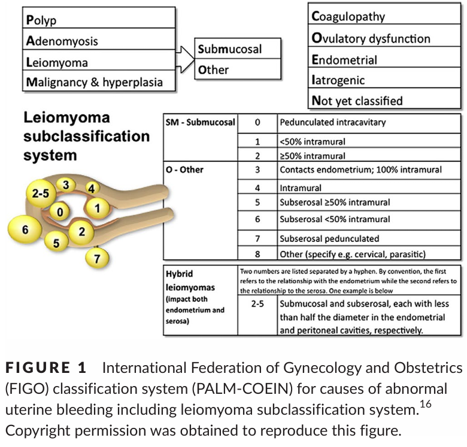

Por lo general asintomáticos. Síntomas pueden ser:
FIGO 0-2 (submucoso:)
- Aumento de flujo menstrual (más sangrado)
- Dismenorrea

FIGO más externo de grandes dimensiones (subserosos):
- Dolor
- Por lo general son mucho más grandes. 

EF: podría palparse
- Si es grande, masa irregular 
- Si es más pequeño, podría no palparse, o palparse utero aumentado de tamaño

Paciente asintomática con mioma, manejo expectante

Si dolor: ácido mefenámico, administrar antes de 

Si sangrado: 
1. ACO según preferencia de paciente
2. Analogo de GnRH (previo a cirugía, para ganar un tiempecito)
3. Cirugía
    - Conservadora (miomectomía)
      - Miomectomía por histeroscopía: para submucosos
      - Miomectomía por laparoscopía: para otros
    - "Radical" (histerectomía)

# Adenomiosis

Peak cercano a los 40 años

## Síntomas

Poco frecuente que sean asintomáticas

Pilares fundamentales 

EF: no tiene nada

A utero y ovario, NUNCA escaner

## Tratamiento

- Pilar tratamiento: Médico
- En Menopausia no histerectomía, ya no debería dar síntomas, estudiar otras causas
- Premenopausia -> 

# Ca endometrio

Síntoma principal es el sangrado 

# Ca cervicouterino y prevención

Prevención: primaria, secundaria y terciaria

VPH es ITS más común en el mundo

Genotipos alto riesgo:
- **16**, **18**, 31, 33, 35, 39, 45, 51, 52, 56, 58, 59, 68
- Riesgo acumulado de infección es de 80%
- Alta prevalencia en menores de 20

FR:
- Genotipo
- Tabaquismo (por temas inmunes)
- Inmunocomromiso
- Infección por C. Trachomatis
- Uso ACO (no se tiene claro, pero Ojo estrógenos producen cierto grado de ectropion)

## Prevención primaria
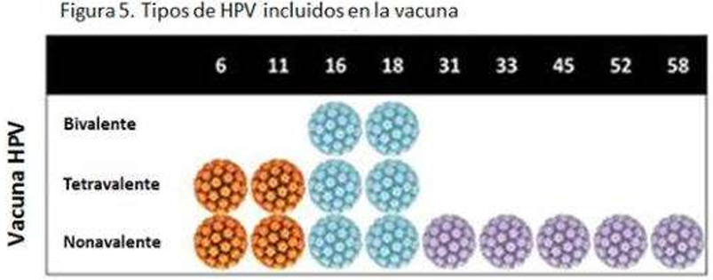

Pacientes vacunadas **DEBEN** realizarse screening de todos modos

## Prevención secundaria

Citología: Papanicolaou (PAP)
- Baja sensibilidad pero alta especificidad en chile, porque analisis a cargo de patólogo dedicado a esto

PAP Alterado:
- Atípico: 
    - ASCUS
    - ASC-H
    - AGC
- Lesión intraepitelial escamosa:
    - Bajo grado (LSIL)
    - Alto grado (HSIL)
- Carcinoma escamoso

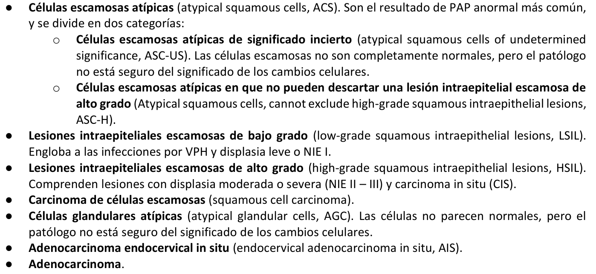

VPH:
- Alta especificidad y sensibilidad para infección
- **Ventaja, alto VPN**

Alternativas de tamizaje:
- 

Tamizaje en <25 años no se recomienda, porque tienen mayor P de eliminación de virus y no es costoefectividad

En inmunocomprometidas desde inicio actividad sexual

Finalización tamizaje: 64 años si

- Tamizaje adecuado en los 10 años previos
    - 3 PAP negativos
    - 2 VPH negativos
- 

*insertar algoritmos minsal*

PAP positivo:
- Sugerente de NIE 

- 2 ASCUS 

PAP atípico: 

Atípico **glandular** atípico:
- REALIZAR además ESTUDIO ENDOMETRIAL
- 

Cono LEEP: 
- Rol diagnóstico principalmente
- luego rol terapéutico

## Tamizaje

Recomendación del ACOG (American College of Obstetricians & Gynecologysts) 
- No tamizaje en menores de 21 años  
- 21-29 años PAP cada 3 años  
- 30-65 años: PAP cada 3 años o prueba VPH cada 5 años o Co-testeo (PAP y prueba VPH) cada 5 años  
- Dejar el tamizaje en mujeres mayores a 65 años con citologías previas vigentes negativas 
- Dejar el tamizaje en pacientes con histerectomía total sin historia de lesiones de alto grado ni cáncer. En caso contrario se debe seguir solicitando PAP de la mucosa vaginal.

## Post biopsia

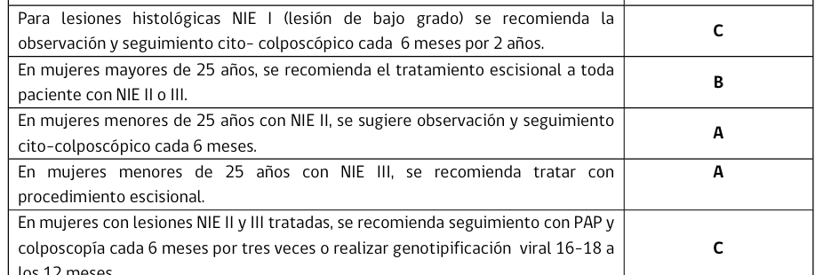

Siempre preferir Cono. Crioterapia y [] no permiten biopsia, malito, puede progresar 

## Pacientes embarazadas

Siempre derivar. Se seguirá. En Caso de sospecha carcinoma invasor, ojo puede ser IVE. 

## Ca Invasor

Vías de diseminación en orden:
- Directa
- Linfática
- Hematológica (principalmente a pulmón e hígado??)

## Etapificación FIGO 2018

- Clínico + imagen
    - Especuloscopía + tacto rectovaginal
        - 
Imágen: 
- TAC
- RNM: útil para
- PET-CT: útil solo para seguimiento

Tratamiento según comité oncológico:
- Etapa precoz (hasta IB2) puede ser quirúrgica. 
- Mayor, quimioterapia + radioterapia (no conservan fertilidad)

Preservación de fertilidad, posible en IA1, IA2, IB1
- 

## Recidiva y seguimiento
- 80% recidiva en primeros 24 meses, mayoría locoregional
- Seguimiento es clínico
- PAP no mejora significativamente detección de recidiva precoz

Sintomatológico:
- Sangrado y dolor (los principales, los otros pueden ser por qmt-rdt)
- Dolor o hinchazzón en piernas
- Problemas para orinar
- Tos
- Fatiga

- 5 años seguimiento estricto
- cada 3-4 meses por 3 años
- cada 6 meses hasta completar 6 años

Factor pronóstico principal es estadío de diagnóstico

Spoting citológico ojo células endometriales en PAP

# Climaterio y terapia de reemplazo hormonal

Definiciones: climaterio es lo que antecede a la menopausia

- Menopausia --> need 1 año sin ovulación (dg retrospectivo)
- < 40 años --> insuficiencia ovárica prematura
- 40-45 --> menopausia precoz
- post-55 años --> menopausia tardía 👀

Diagnóstico climaterio es clínico

(rev guía atención integral climaterio)

Evaluación de climaterio:
- Síntomas vasomotores
- Síntomas genitourinarios
- Síntomas psicológicos

<b>Escala MRS (autoaplicable) </b>(Menopause Rating Scale)
¿Cuál de las siguientes molestias siente en la actualidad y con qué intensidad?
(responder 0-4: 0, No siento molestia; 1, Siento molestia leve; 2, Siento molestia moderada; 3, Siento molestia importante; 4, Siento demasiada molestia)
 
1. Bochornos, sudoración, calores.
2. Molestias al corazón (sentir latidos del corazón, palpitaciones, opresión al pecho).
3. Molestias musculares y articulares (dolores de huesos y articulaciones, dolores reumáticos).
4. Dificultades en el sueño (insomnio, duerme poco).
5. Estado de ánimo depresivo (sentirse deprimida, decaída, triste a punto de llorar, sin ganas de vivir).
6. Irritabilidad (sentirse tensa, explota fácil, sentirse rabiosa, sentirse intolerante).
7. Ansiedad (sentirse angustiada, temerosa, inquieta, tendencia al pánico).
8. Cansancio físico y mental (rinde menos, se cansa fácil, olvidos frecuentes, mala memoria, le cuesta concentrarse)
9. Problemas sexuales (menos ganas de sexo, menor frecuencia de relaciones sexuales, menor satisfacción sexual).
10. Problemas con la orina (problemas al orinar, orina más veces, urgencia al orinar, se le escapa la orina).
11. Sequedad vaginal (sensación de genitales secos, malestar o ardor en los genitales malestar o dolor con las relaciones sexuales).

1-4 somáticos
5-8 psicológicos
9-11 urogenitales

\> 15: severidad moderada

Si paciente quiere la TRH, darla siempre que no tenga contraindicaciones (no es mala, estudio WHI está malardo)

Obesidad: ojo estrona, tiene más estrógenos

Remember PALM-COEIN. 

SUA sin TRH, endometrio debe ser <= 4 mm. Sobre 5 mm derivar. 

Sin SUA... endometrio...

Tamoxifeno tb engrosa endometrio, pero es quístico, solo biopsiar si está sangrando

## Síndromes 
### Síntomas Vasomotores
Fisiopato: alteración de set point por falta de estrógenos. Ojo, no solo se puede tratar con hormonas, tb puede con no hormonales antidepresivos 

Alternativas tto:

- Estrógenos
- Tibolona (si no se quiere utilizar progestágeno por RAM). Tibolona menos sangrado que estrógenos + progestágenos. Tb aumenta la líbido.
- Inhibidores de la recaptación de la serotonina (venlafaxina y desvenlafaxina se han probado, tb se puede escitalopram 10 mg/día vo eficacia 61%, sin interacción con tamoxifeno)
- Paroxetina (no puede utilizarse junto con tamoxifeno)
- Oxibutinina
- (...)
- Isoflovanos (fitoestrógenos, pero no tienen estudios de seguridad, doc no lo recomienda)

No hormonales usarlos cuando contraindicación hormonas

Nuevas terapias:
- Estetrol (E4), lo bueno es que no actúa sobre mama
- 

### Atrofia urogenital

Dispareunia, sequedad, ardor, prurito

Alternativas tto:
- Lubricantes vaginales, durante relaciones sexuales
- hidratantes vaginales (aplicar cada 3 a 4 días), si síntomas durante el día.
- Promestrieno: 10 mg cada día por 20 días...
- TRH oral y transdérmica
- Estrógeno local
- Estradiol intravaginal
- ...

### Osteoporosis

- FRAX :)

Indicaciones densitometría:
- Mujeres >= 65 años
- Antes si insuficiencia ovárica prematura
- Si Frax moderado o alto, indicar densitometría

Tto:
- Modificar FR:
    - Ejercicio
    - Ca y VitD
- Estrógenos
- Bisfosfonatos
- Raloxifeno (ojo, aumenta riesgo CV)
- Denosumab (es bueno, contraindicaciones solo hipersensibilidad e hipocalcemia grave)

### Deterioro cognitivo

Es beneficioso para prevenir, no para tratar. Estrógenos solos se cree que disminuye riesgo de alzheimer, combinada se cree que aumenta el riesgo. 

Para que TRH no sea FR de demencia, iniciar TRH antes de 65 años o no iniciar.

## Riesgo cardiovascular

Aumenta post-menopausia. TRH es segura previo a formación de placas. Dar TRH dentro de 10 años de menopausia (idealmente 6 años) o antes de 60 años para que sea beneficiosa 

## Terapia hormonal

| Indicaciones  | Contraindicaciones |
|---|---|
| Síndrome climatérico | Cáncer de mama hormonodependiente |
| Sd genitourinario | Enfermedad tromboembólica activa |
| Insuficiencia ovárica primaria | Sangrado genital de origen no aclarado |
|  | Enfermedad coronaria o accidente cerebrovascular previo |
|  | Hipertensión arterial sin control |

Inicio TH:
- durante los 50-59 años o
- antes de los primeros 10 años (idealmente 6 años) de postmenopausia 

Su inicio tardío se asocia con mayores efectos adversos cardiovasculares y tromboembólicos. 

Antes de iniciar, evaluar RCV, ojo en Chile solo 0.8 % mujeres en Chile con RCV bajo en peri menopausia

Esquemas terapéuticos 
- Estrógenos sólos (E): en mujeres sin útero  
- Esquemas combinados (E+P): en mujeres con útero 
    - modalidad continua: administración de estrógenos en combinación con progestina todos los días, con la intención de mantener un endometrio atrófico y evitar el sangrado ginecológico. 
    - modalidad secuencial: administración de estrógenos todos los días y la progestina se agrega por 10 a 14 días de cada mes. Este esquema suele producir flujo rojo después de la suspensión de la progestina en alrededor del 80% de los casos. 
- TH con tibolona. No requiere protección endometrial adicional. 
- TH con un TSEC: complejo estrogénico tejido-selectivo formulado con estrógenos conjugados equinos y bazedoxifeno. No requiere protección endometrial adicional. 

TRH vía oral beneficiosa para diabetes porque primer paso hepático disminuye insulino resistencia. Siempre y cuando <b>no tenga daño de organo blanco</b>

## Estrógenos

Tipos de estrógenos  
- estradiol oral 1 - 2 mg/d 
- estradiol gel transdérmico 0,5 a 1,5 g /d 
- estradiol parche transdérmico 25 – 50 - 100 ug /d 
- estrógenos conjugados equinos oral 0,3 - 0,625 mg/d  
- estrógenos conjugados sintéticos oral 0,3 - 0,625 mg/d  
La tendencia actual es el uso de 17 beta estradiol. 

Utilizar dosis mínima efectiva de estrógenos. Se consideran dosis bajas diarias 0,5 mg de estradiol, 0,3 mg de estrógenos conjugados de equinos o sintéticos, 25ug de estradiol transdérmico en parche y 0,5 g de estradiol transdérmico en gel. 

Vía transdérmica es más segura si RCV elevado. Debe preferirse en pacientes con hipertrigliceridemia, en aquellas con mayor riesgo trombótico venoso y aquellas con mayor riesgo cardiovascular en general. (ojo primer paso hepático)

- Lo malo de transdérmica es que pacientes sangran más. 1 puff de spray diario a permanencia + 1 progestágeno 10 a 14 días al mes en la noche vo
- Puff aplicar en cualquier zona de la piel excepto en mamas.

(donde se pone?)

Estrógeno para uso local vaginal prácticamente no tiene efectos sistémicos y no es necesario agregar una progestina para protección endometrial.

Por lo general si tiene alguna patol de esfera CV, preferir transdérmica, salvo en diabetes que VO es beneficiosa

## Progestinas

Preferir progestinas puras similares a la humana como la progesterona micronizada y dihidrogesterona. Se aconseja evitar el uso de medroxiprogesterona acetato o limitarlo a menos de 5 años. 

Las progestinas pueden administrarse por vía oral, vaginal, a través de dispositivos intrauterinos y 
depósito intramuscular. No existe evidencia que sugiera superioridad de una vía de administración por sobre 
otra. 

En esquema cíclico: 
- por 10-14 días del mes para protección endometrial

Dar estrogenos solos si riesgo de Ca Mama, porque progestágenos aumentan riesgo.

Tibolona contraindicada en Ca de mama

Acetato de medroxiprogesterona el con mayor riesgo de Ca de mama

Dienogest NO es anticonceptivo. Está diseñado para endometriosis

Lo ideal para climaterio es mirena :) 

## MAC

Cuando suspender? Rev...

# Vaginitis y Cervicitis

<table class="api table-wrapper-wide" data-table="ZCUzRSUyMCUzQy90ciUzRSUwQSUzQy90Ym9keSUzRSUwQSUzQy90YWJsZSUzRQ==30910">
<thead>
<tr>
<th colspan="6" scope="row">Overview</th> </tr>
<tr>
<th scope="row">Features</th> <th scope="col">
Bacterial vaginosis
</th> <th scope="col">
Trichomoniasis
</th> <th scope="col">
Vaginal yeast infection
</th> <th scope="col">
Gonorrhea
</th> <th scope="col">Chlamydia infections
</th> </tr>
</thead>
<tbody>
<tr>
<th scope="row">Pathogen</th> <td> <ul>
<li>
Gardnerella vaginalis
</li> </ul>
</td> <td> <ul>
<li>
Trichomonas vaginalis
</li> </ul>
</td> <td> <ul>
<li>
Candida albicans
</li> </ul>
</td> <td> <ul>
<li>
Neisseria gonorrhoeae
</li> </ul>
</td> <td> <ul>
<li>
Chlamydia trachomatis
 serotype D-K</li> </ul>
</td> </tr>
<tr>
<th rowspan="2" scope="row">Discharge</th> <td rowspan="2"> <ul>
<li>Gray/milky</li> <li>Fishy odor</li> </ul>
</td> <td rowspan="2"> <ul>
<li>Frothy, yellow-green</li> <li>Foul-smelling</li> </ul>
</td> <td rowspan="2"> <ul>
<li>White, crumbly, and thick (cottage cheese-like)</li> <li>Odorless</li> </ul>
</td> <td> <ul>
<li>
Purulent, creamy</li> </ul>
</td> <td> <ul>
<li>
Purulent, bloody</li> </ul>
</td> </tr>
<tr>
<td colspan="2" rowspan="1"> <ul>
<li>May be malodorous</li> </ul>
</td> </tr>
<tr>
<th scope="row"> Vaginal inflammation 
</th> <td> <ul>
<li>Typically absent</li> </ul>
</td> <td> <ul>
<li>Present</li> </ul>
</td> <td> <ul>
<li>Present</li> </ul>
</td> <td colspan="2"> <ul>
<li>Absent</li> </ul>
</td> </tr>
<tr>
<th scope="row">
Cervicitis
</th> <td> <ul>
<li>Typically absent</li> </ul>
</td> <td> <ul>
<li>Often present</li> </ul>
</td> <td> <ul>
<li>Absent </li> </ul>
</td> <td colspan="2"> <ul>
<li>Present</li> </ul>
</td> </tr>
<tr>
<th scope="row">
Vaginal pH
</th> <td colspan="2" rowspan="1"> <ul>
<li>&gt; 4.5</li> </ul>
</td> <td> <ul>
<li>4–4.5</li> </ul>
</td> <td colspan="2" rowspan="1"> <ul>
<li>Variable</li> </ul>
</td> </tr>
<tr>
<th scope="row">Microscopy findings</th> <td> <ul>
<li>
Clue cells
</li> </ul>
</td> <td> <ul>
<li>Flagellated 
protozoa
</li> </ul>
</td> <td> <ul>
<li>
Pseudohyphae
</li> </ul>
</td> <td> <ul>
<li>Gram-negative, intracellular diplococci</li> </ul>
</td> <td> <ul>
<li>Intracellular organisms that 
Gram stain poorly</li> </ul>
</td> </tr>
<tr>
<th scope="row">Treatment</th> <td> <ul>
<li>
<ul>
<li>Metronidazol óvulos vaginales 500 mg por 5-7 días
</li> <li>Clindamicina vaginal al 2% (óvulos o crema) por 7-10 días</li> </ul>
</li> </ul>
</td> <td> <ul>

<li>Metronidazol 2 gr vo en dosis única</li>
<li>Tinidazol 2 gr vo en dosis única (mejor tolerancia que metro)</li>
<li>Metronidazol 500 mg vo cada 12 horas, por 7 días</li>
 <li>Treat sexual partner(s)</li> </ul>
</td> 

<td> <ul>
<li>Fluconazol (150 mg) v.o. 1 dosis</li> 
<li> Clotrimazol óvulos (100 mg) cada noche por 6 días
</li> <li> Clotrimazol óvulos (500 mg) dosis única</li> 

<li>Topical 
azoles
 or 
nystatin
</li>  </ul>
</td> <td> <ul>
<li>

Ceftriaxone
 IV/IM</li> <li>Treat sexual partner(s)</li> </ul>
</td> <td> <ul>
<li>
Azithromycin
</li> <li>
Doxycycline
 in nonpregnant patients</li> <li>Treat sexual partner(s)</li> </ul>
</td> </tr>
</tbody>
</table>

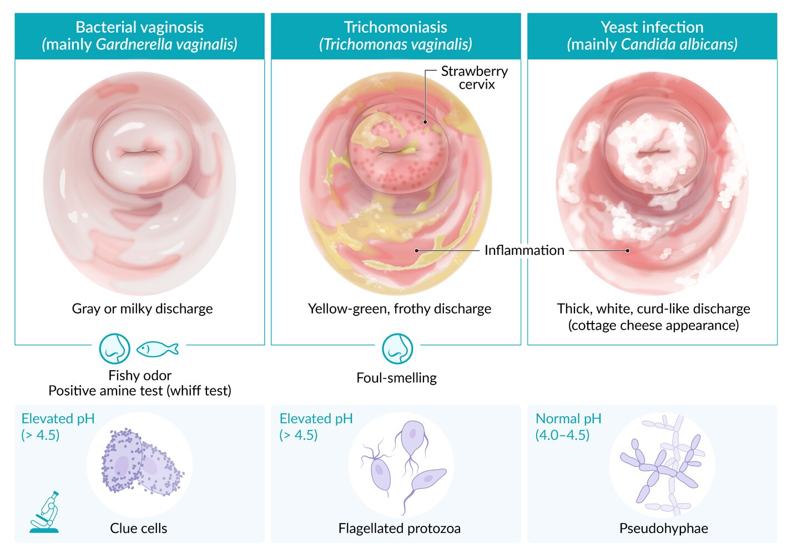

## Vaginitis Bacteriana

 
Criterios clínicos: AMSEL (tres de los siguientes) 
- pH del flujo vaginal >4,5 (pH normal prácticamente descarta esta infección)
- Descarga vaginal característica 
- Células claves (> 20%) (clue cells) 
- Test de Aminas: prueba KOH (+) 
Criterios laboratorio: Test Nugent (Gram flujo vaginal) 
- 7-12 diagnóstico de vaginosis bacteriana 
- 4-6 dudoso 
- 0-3 es normal

Metronidazol 500 mg cada 12 horas, vo por 7 días. Es igualmente eficaz que la administración vaginal, con cura sintomática en aproximadamente el 80% y cura microbiológica aproximadamente del 70% al mes, de acuerdo con estudios randomizados controlados con placebo. Sin embargo, la adherencia a este esquema es mala.  
- Clindamicina vaginal al 2% (óvulos o crema) por 7-10 días. Este tratamiento por 7 días es igualmente efectivo que el Metronidazol oral o vaginal. 
- Metronidazol óvulos vaginales 500 mg por 5-7 días, 1 vez cada noche. Es el tratamiento de uso más habitual y recomendado. 
- Metronidazol 2 gr vo por una vez. Es una opción para mejorar la adherencia al tratamiento, sin embargo, <b>no se recomienda pues tiene 50% tasa de fracaso</b>.

Para los casos de vaginosis bacteriana recurrente (tres o más episodios en el último año), un estudio doble ciego randomizados demostró que luego del tratamiento por 10 días con Metronidazol vaginal diario, el uso de Metronidazol en gel al 0,75% dos veces por semana por 16 semanas mantuvo la cura clínica en 75% de las pacientes a las 16 semanas y 50% de las pacientes a las 28 semanas. 

En embarazadas...

Manual PUC recomienda:  pesquisar y tratar la Vaginosis de modo rutinario a las 14 semanas en toda mujer con factores de riesgo para parto prematuro, principalmente aquellas con un parto prematuro previo este haya sido idiopático o por rotura de membranas. Si se hace el diagnóstico de vaginosis bacteriana en este escenario (embarazo con alto riesgo de prematurez), el tratamiento debe ser vía ORAL.  
- Metronidazol 500 mg/12 horas x 7 días vo. 
- Clindamicina 300 mg/12 horas por 7 días vo.

## Candidiasis Vulvovaginal

Tratamiento usual:
- Fluconazol (150 mg) v.o. 1 dosis. Es el esquema más utilizado, por su buena respuesta y facilidad de uso. Se ha demostrado que este tratamiento oral reduce las recurrencias. 
- Clotrimazol óvulos (100 mg) cada noche por 6 días 
- Clotrimazol óvulos (500 mg) dosis única

Candidiasis vulvovaginal complicada 
- Embarazadas 
- Inmunocomprometidas 
- Diabéticas con mal control metabólico 
- Con síntomas severos 
- Con infección por especies no-Albicans 
- Episodios recurrentes (4 ≥ en 1 año)

Si **síntomas severos**:
- una segunda dosis de Fluconazol oral (150mg) a las 72 horas luego de la primera dosis aumentó la tasa de cura de un 67 a un 80%.

En **embarazadas**:
- 7 días con óvulos de clotrimazol. 
- Debe evitarse el uso de fluconazol oral en el primer trimestre, aunque no hay reportes de efectos adversos fetales.  

Candidiasis vulvovaginal **recurrente**: 4 o más episodios en un plazo de 12 meses. Un estudio demostró utilidad de esquema:
- Fluconazol oral (150 mg) diario por 10 días, 
- y luego durante 6 meses un Fluconazol oral (150 mg) semanal

## Tricomoniasis

Tratamiento de la Trichomona Vaginal 
- Metronidazol 2 gr vo en dosis única (mala tolerancia oral, pero mejor adherencia) 
- Tinidazol 2 gr vo en dosis única. Es equivalente o superior al Metronidazol 2 gr oral en dosis única, mostrando una tasa de cura de 90 a 95%. 
- Metronidazol 500 mg vo cada 12 horas, por 7 días(Prevalencia de resistencia leve al Metronidazol en pacientes infectados con T. Vaginalis es 2-5%)

## Cervicitis Gonococo o Chalmydia

Libro PUC:

>"La cervicitis por Gonococo o por Clamidia es una ITS que puede manifestarse por flujo cervical purulento oligosintomático. El diagnóstico se realiza frecuentemente con PCR, pero también puede realizarse inmunofluorescencia para Chlamydia y cultivos de Thayer- Martin para gonococo. El tratamiento debe incluir siempre a la pareja y entregar cobertura antibiótica para ambos gérmenes. Los esquemas más utilizados son de ceftriaxona 125 mg IM por una vez más Azitromicina 1 g vo en dosis única para todos los contactos sexuales. Tanto Neisseria gonorrhoeae como Chlamydia trachomatis son gérmenes de notificación obligatoria.  "

