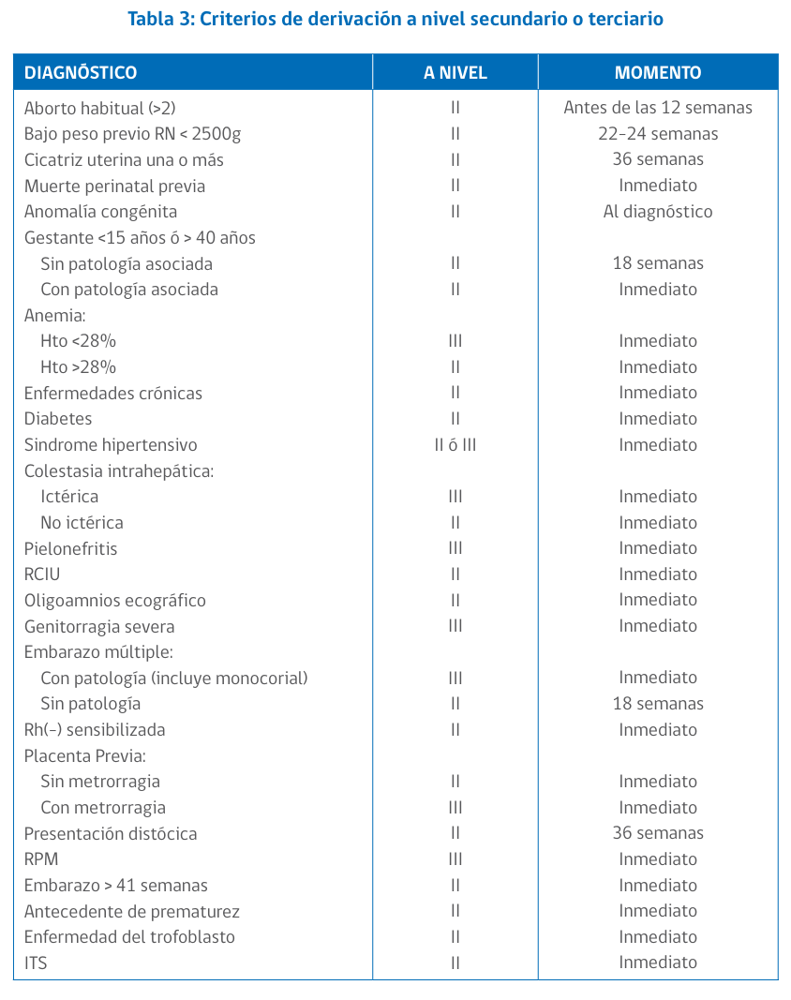
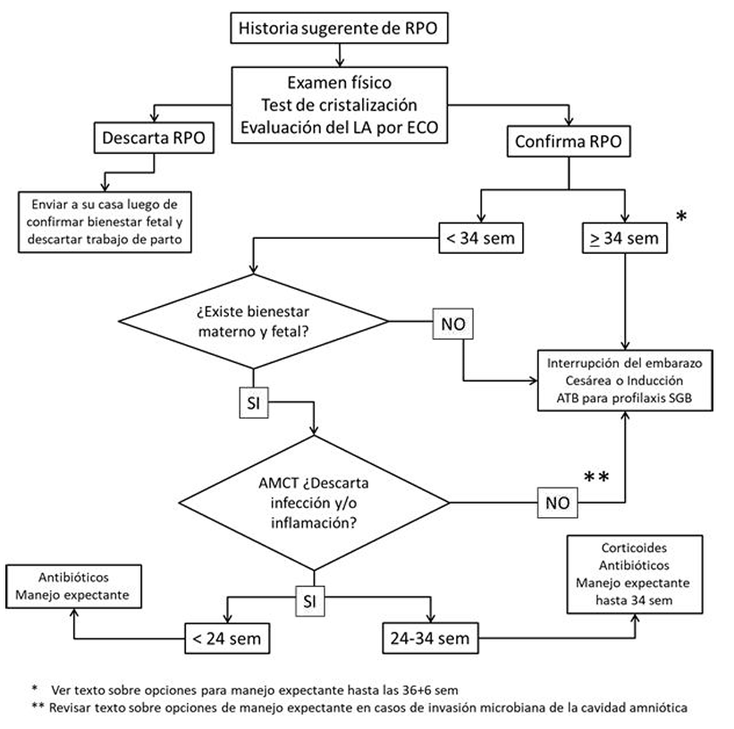
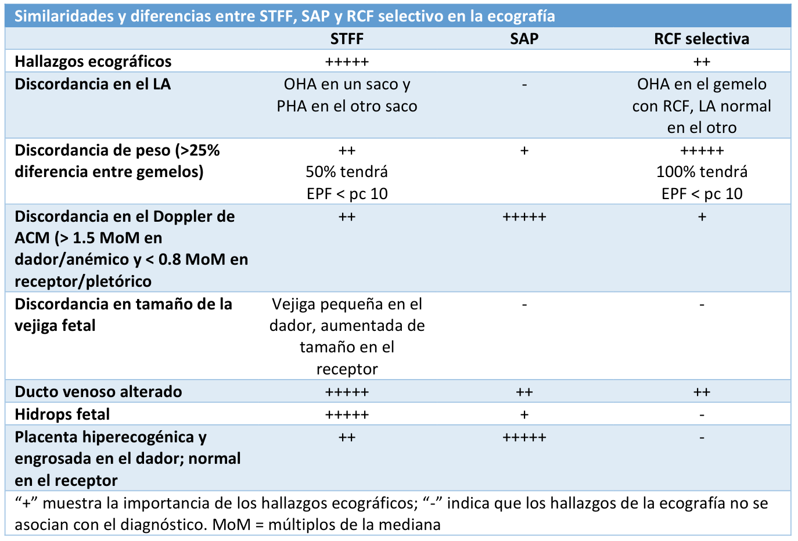
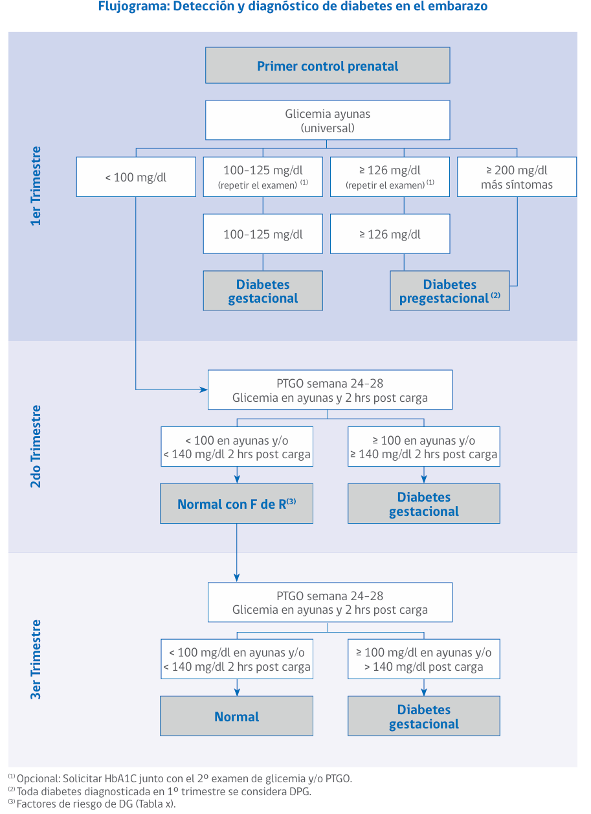
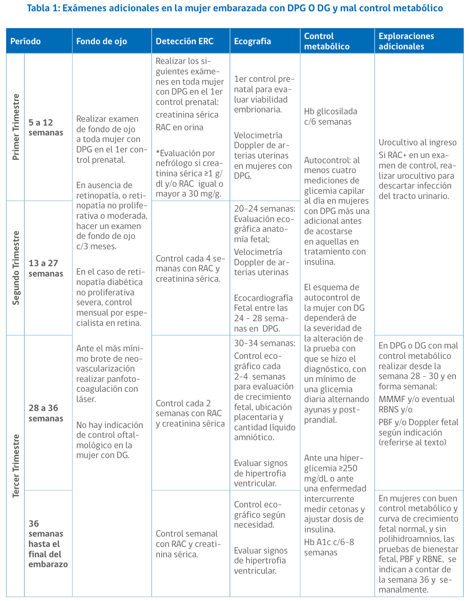
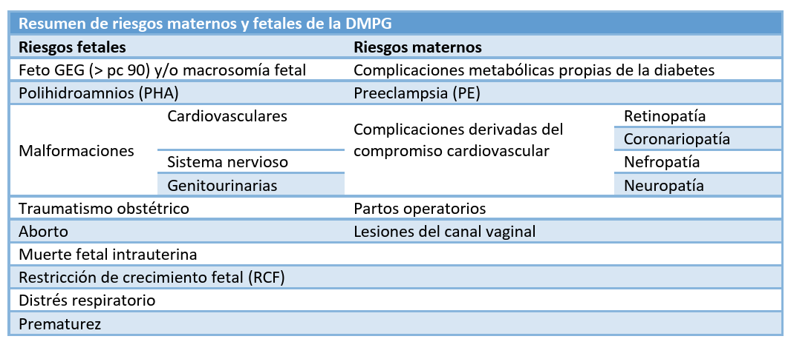
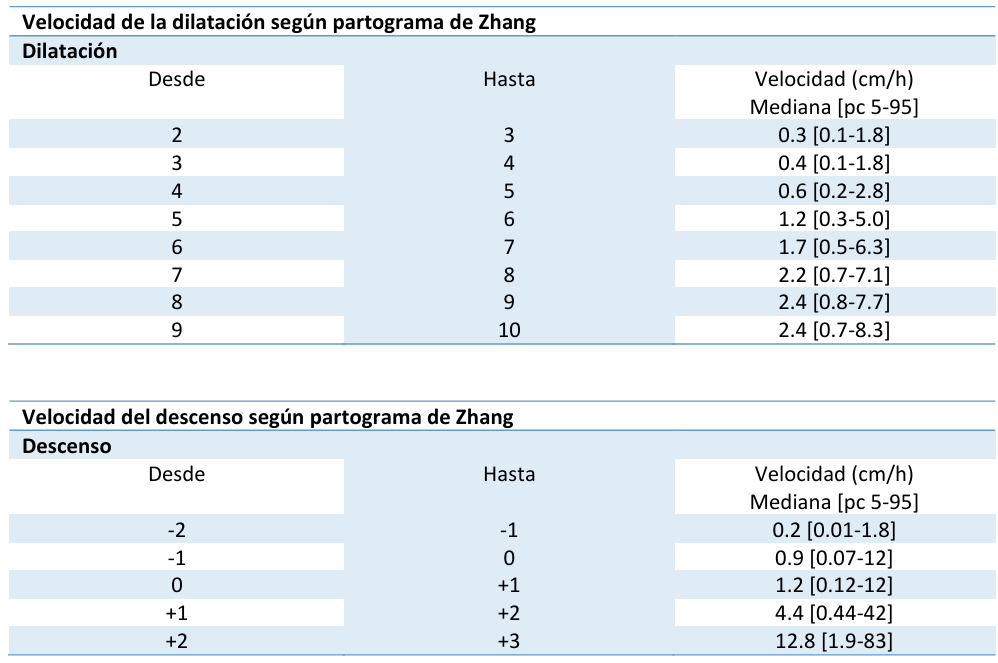
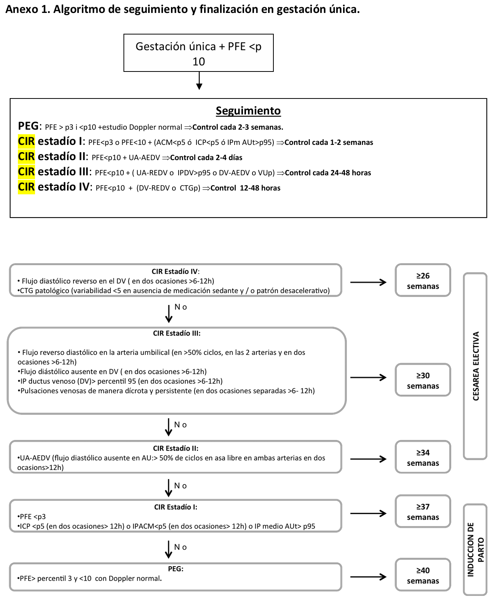
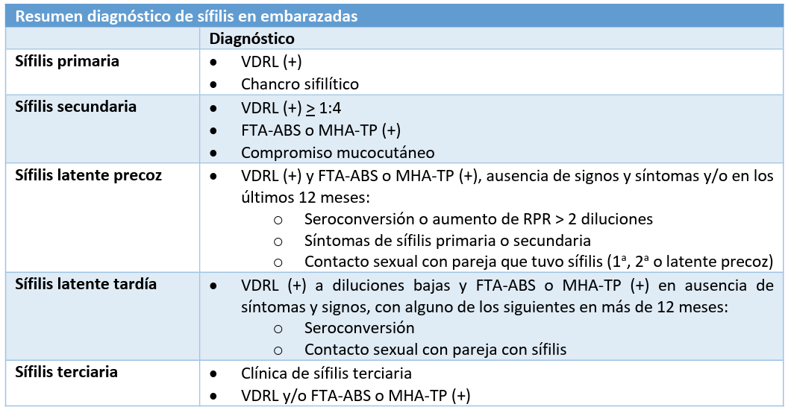

[Protocolos clinic barcelona](https://fetalmedicinebarcelona.org/protocolos/)

# Control prenatal

## Primer control prenatal

Objetivos **primer control**:
- Definir el estado actual de salud de la mujer y del feto.
- Detectar factores de riesgo psicosocial. 
- Determinar la edad gestacional. 
- Evaluar los posibles riesgos  y eventualmente corregirlos. 
- Planificar el control prenatal en relación al riesgo asignado.
- Entregar información para el autocuidado, beneficios legales.
- Derivar a salud bucal (ver Guía GES), nutrición, salud mental, según corresponda.

| Tiempo (semanas) | Exámenes solicitados |
|---|---|
| Primer control | <li>Hemograma / Hto-Hb <li>Urocultivo y orina completa. <li>Grupo sanguíneo Rh/Coombs indirecto  <li>VDRL-RPR <li>VIH <li>Citología cervical <li>Glicemia <li>Eco por indicación <li>Examen de chagas a embarazadas de zona endémica y según Norma General Técnica. Control y Prevención Nacional de Enfermedad de Chagas 2014. <li>TSH / T4L <li>PCR ITS, *Cultivo de secreción vaginal* <li>VHB <li>¿VHS-2? |
| 10-15 | <li> Eco 11-14 para riesgo aneuploidía (y junto con FR estimación riesgo PE) |
| 20-24 | <li> Eco 20-25 <li> Doppler de arteria uterina <li> Cervicometría <li> VDRL-RPR |
| 26-28 | <li> PTGO <li> Coombs Indirecto en Rh no sensibilizada (identifica anticuerpos) <li> Administración inmunoglobulina anti Rho (Rh negativas no sensibilizadas), según disponibilidad |
| 32-34 | VDRL o RPR |
| 32-38 | <li> Eco <li> Repetir Hto-Hb |
| 35-37 | - Cultivo perianal SGB (prevención de neumonía neonatal, con excepción de mujeres con urocultivo (+) al mismo germen) |

ojo, contraindicación PTGO en bariátrica (ppalmente bypass gástrico) por damping

Perioricidad de controles si sin factores de riesgo: 

1. un control cada cuatro semanas hasta la semana 28, luego 
2. cada dos semanas hasta la 36, y posteriormente 
3. un control semanal hasta el momento del parto.

El examen obstétrico abdominal adquiere importancia, desde aproximadamente las 12 semanas de gestación. En estos casos la altura uterina, medida en cms, desde el borde superior de la sínfisis pubiana a la parte más alta del fondo uterino, debe encontrarse entre el percentil 10 y 90 de la curva; esta medida nos entrega información referente al tamaño del feto e indirectamente, de la edad gestacional. 

**Entre las 18 y 32 semanas la altura uterina medida en centímetros equivale a la edad gestacional en semanas**.

## Evaluación en Segundo semestre

Bienestar fetal:
- Percepción y número de movimientos fetales: Disminución o ausencia de movimientos fetales puede ser signo de alteración del bienestar fetal.

Signos y síntomas de complicaciones:

- Hipertensión: Cefalea, fotopsia (visión de luces o destellos), tinitus (zumbido en los oídos).
- Infección urinaria: Disuria (dolor al orinar), polaquiuria (aumento de la frecuencia urinaria), pujo y tenesmo vesical (sensación de no vaciar completamente la vejiga).
- Amenaza de parto prematuro: Contracciones uterinas regulares y dolorosas.
- Colestasia intrahepática del embarazo: Prurito palmo-plantar (picazón en las palmas de las manos y las plantas de los pies), especialmente de noche.
- Enfermedades de transmisión sexual (ITS): Secreción vaginal anormal, dolor o ardor al orinar, verrugas genitales, úlceras genitales.

Derivación a Nivel secundario / Terciario

# Requerimientos nutri en embarazo

<table cellspacing="0"><colgroup span="7" width="14%"></colgroup> <tbody> <tr> <td class="subtitle1_left">&nbsp;</td> <td class="subtitle1_left">Source of goal</td> <td class="subtitle1_left">Nonpregnant/  nonlactating females</td> <td class="subtitle1_left">Pregnant  (age 14 to 18 years)</td> <td class="subtitle1_left">Pregnant  (age 19 to 30 years)</td> <td class="subtitle1_left">Pregnant  (age 31 to 50 years)</td> <td class="subtitle1_left">Upper limit</td> </tr> <tr> <td class="subtitle2_left" colspan="7"><annotation-anchor data-content-id="5U1idT0" amboss-annotation-variant="none">Macronutrients</annotation-anchor></td> </tr> <tr> <td class="indent1">Protein (as % of kcal)</td> <td>AMDR</td> <td>10 to 30%</td> <td>10 to 30%</td> <td>10 to 35%</td> <td>10 to 35%</td> <td>&nbsp;</td> </tr> <tr> <td class="indent1">Protein</td> <td><annotation-anchor data-content-id="_Oc5Ec0" amboss-annotation-variant="none">RDA</annotation-anchor></td> <td>46 g</td> <td>71 g</td> <td>71 g</td> <td>71 g</td> <td>&nbsp;</td> </tr> <tr> <td class="indent1">Carbohydrate (as % kcal)</td> <td>AMDR</td> <td>45 to 65%</td> <td>45 to 65%</td> <td>45 to 65%</td> <td>45 to 65%</td> <td>&nbsp;</td> </tr> <tr> <td class="indent1">Carbohydrate</td> <td><annotation-anchor data-content-id="_Oc5Ec0" amboss-annotation-variant="none">RDA</annotation-anchor></td> <td>130 g</td> <td>175 g</td> <td>175 g</td> <td>175 g</td> <td>&nbsp;</td> </tr> <tr> <td class="indent1">Fiber</td> <td>14 g per 1000 kcal</td> <td>25 to 28 g</td> <td>25 to 34 g</td> <td>28 to 36 g</td> <td>25 to 34 g</td> <td>&nbsp;</td> </tr> <tr> <td class="indent1">Added sugars (as % of kcal)</td> <td>DGA</td> <td>&lt;10%</td> <td>&lt;10%</td> <td>&lt;10%</td> <td>&lt;10%</td> <td>&nbsp;</td> </tr> <tr> <td class="indent1">Total fat (as % of kcal)</td> <td>AMDR</td> <td>20 to 35%</td> <td>25 to 35%</td> <td>20 to 35%</td> <td>20 to 35%</td> <td>&nbsp;</td> </tr> <tr> <td class="indent1">Saturated fat (as % of kcal)</td> <td>DGA</td> <td>&lt;10%</td> <td>&lt;10%</td> <td>&lt;10%</td> <td>&lt;10%</td> <td>&nbsp;</td> </tr> <tr> <td class="indent1">18:3 <annotation-anchor data-content-id="0D1e1Q0" amboss-annotation-variant="none">Linolenic acid</annotation-anchor></td> <td>AI</td> <td>1.1 g</td> <td>1.4 g</td> <td>1.4 g</td> <td>1.4 g</td> <td>&nbsp;</td> </tr> <tr> <td class="subtitle2_left" colspan="7">Minerals</td> </tr> <tr> <td class="indent1"><annotation-anchor data-content-id="YrWnf50" amboss-annotation-variant="none">Calcium</annotation-anchor></td> <td><annotation-anchor data-content-id="_Oc5Ec0" amboss-annotation-variant="none">RDA</annotation-anchor></td> <td>1000 mg</td> <td>1300 mg</td> <td>1000 mg</td> <td>1300 mg</td> <td>2500 mg</td> </tr> <tr> <td class="indent1">Iron</td> <td><annotation-anchor data-content-id="_Oc5Ec0" amboss-annotation-variant="none">RDA</annotation-anchor></td> <td>18 mg</td> <td>27 mg</td> <td>27 mg</td> <td>27 mg</td> <td>45 mg</td> </tr> <tr> <td class="indent1"><annotation-anchor data-content-id="05Yeip" amboss-annotation-variant="none">Magnesium</annotation-anchor></td> <td><annotation-anchor data-content-id="_Oc5Ec0" amboss-annotation-variant="none">RDA</annotation-anchor></td> <td>310 to 360 mg</td> <td>400 mg</td> <td>350 mg</td> <td>360 mg</td> <td>350 mg*</td> </tr> <tr> <td class="indent1"><annotation-anchor data-content-id="0rWef50" amboss-annotation-variant="none">Phosphorus</annotation-anchor></td> <td><annotation-anchor data-content-id="_Oc5Ec0" amboss-annotation-variant="none">RDA</annotation-anchor></td> <td>700 mg</td> <td>1250 mg</td> <td>700 mg</td> <td>700 mg</td> <td>4000 mg</td> </tr> <tr> <td class="indent1">Zinc</td> <td><annotation-anchor data-content-id="_Oc5Ec0" amboss-annotation-variant="none">RDA</annotation-anchor></td> <td>8 mg</td> <td>12 mg</td> <td>11 mg</td> <td>11 mg</td> <td>40 mg</td> </tr> <tr> <td class="indent1">Iodine</td> <td><annotation-anchor data-content-id="_Oc5Ec0" amboss-annotation-variant="none">RDA</annotation-anchor></td> <td>150 mcg</td> <td>220 mcg</td> <td>220 mcg</td> <td>220 mcg</td> <td>1110 mcg</td> </tr> <tr> <td class="indent1">Selenium</td> <td><annotation-anchor data-content-id="_Oc5Ec0" amboss-annotation-variant="none">RDA</annotation-anchor></td> <td>55 mcg</td> <td>60 mcg</td> <td>60 mcg</td> <td>60 mcg</td> <td>400 mcg</td> </tr> <tr> <td class="subtitle2_left" colspan="7">Vitamins</td> </tr> <tr> <td class="indent1"><annotation-anchor data-content-id="d6boPu" amboss-annotation-variant="none">Vitamin A</annotation-anchor></td> <td><annotation-anchor data-content-id="_Oc5Ec0" amboss-annotation-variant="none">RDA</annotation-anchor></td> <td>700 mcg RAE</td> <td>750 mcg RAE</td> <td>770 mcg RAE</td> <td>770 mcg RAE</td> <td>3000 mcg RAE</td> </tr> <tr> <td class="indent1"><annotation-anchor data-content-id="RG0l_h" amboss-annotation-variant="none">Vitamin D</annotation-anchor></td> <td><annotation-anchor data-content-id="_Oc5Ec0" amboss-annotation-variant="none">RDA</annotation-anchor></td> <td>600 international units</td> <td>600 international units</td> <td>600 international units</td> <td>600 international units</td> <td>4000 international units</td> </tr> <tr> <td class="indent1"><annotation-anchor data-content-id="JgbswG" amboss-annotation-variant="none">Vitamin E</annotation-anchor></td> <td><annotation-anchor data-content-id="_Oc5Ec0" amboss-annotation-variant="none">RDA</annotation-anchor></td> <td>15 mg</td> <td>15 mg</td> <td>15 mg</td> <td>15 mg</td> <td>1000 mg</td> </tr> <tr> <td class="indent1"><annotation-anchor data-content-id="93bNkt" amboss-annotation-variant="none">Vitamin K</annotation-anchor></td> <td>AI</td> <td>90 mcg</td> <td>75 mcg</td> <td>90 mcg</td> <td>90 mcg</td> <td>ND</td> </tr> <tr> <td class="indent1"><annotation-anchor data-content-id="znbrD8" amboss-annotation-variant="none">Vitamin C</annotation-anchor></td> <td><annotation-anchor data-content-id="_Oc5Ec0" amboss-annotation-variant="none">RDA</annotation-anchor></td> <td>75 mg</td> <td>80 mg</td> <td>85 mg</td> <td>85 mg</td> <td>2000 mg</td> </tr> <tr> <td class="indent1">Thiamin</td> <td><annotation-anchor data-content-id="_Oc5Ec0" amboss-annotation-variant="none">RDA</annotation-anchor></td> <td>1.1 mg</td> <td>1.4 mg</td> <td>1.4 mg</td> <td>1.4 mg</td> <td>ND</td> </tr> <tr> <td class="indent1"><annotation-anchor data-content-id="XIb9YE" amboss-annotation-variant="none">Riboflavin</annotation-anchor></td> <td><annotation-anchor data-content-id="_Oc5Ec0" amboss-annotation-variant="none">RDA</annotation-anchor></td> <td>1.1 mg</td> <td>1.4 mg</td> <td>1.4 mg</td> <td>1.4 mg</td> <td>ND</td> </tr> <tr> <td class="indent1"><annotation-anchor data-content-id="2WYTkL" amboss-annotation-variant="none">Niacin</annotation-anchor></td> <td><annotation-anchor data-content-id="_Oc5Ec0" amboss-annotation-variant="none">RDA</annotation-anchor></td> <td>14 mg</td> <td>18 mg</td> <td>18 mg</td> <td>18 mg</td> <td>35 mg</td> </tr> <tr> <td class="indent1">Vitamin B6</td> <td><annotation-anchor data-content-id="_Oc5Ec0" amboss-annotation-variant="none">RDA</annotation-anchor></td> <td>1.3 mg</td> <td>1.9 mg</td> <td>1.9 mg</td> <td>1.9 mg</td> <td>100 mg</td> </tr> <tr> <td class="indent1">Vitamin B12</td> <td><annotation-anchor data-content-id="_Oc5Ec0" amboss-annotation-variant="none">RDA</annotation-anchor></td> <td>2.4 mcg</td> <td>2.6 mcg</td> <td>2.6 mcg</td> <td>2.6 mcg</td> <td>ND</td> </tr> <tr> <td class="indent1">Choline</td> <td>AI</td> <td>425 mg</td> <td>450 mg</td> <td>450 mg</td> <td>450 mg</td> <td>3500 mg</td> </tr> <tr> <td class="indent1"><annotation-anchor data-content-id="HlXKyy" amboss-annotation-variant="none">Folate</annotation-anchor></td> <td><annotation-anchor data-content-id="_Oc5Ec0" amboss-annotation-variant="none">RDA</annotation-anchor></td> <td>400 mcg DFE</td> <td>600 mcg DFE</td> <td>600 mcg DFE</td> <td>600 mcg DFE</td> <td>1000 mcg DFE</td> </tr> </tbody></table>

En Gemelar:

<table cellspacing="0"><colgroup span="4" width="25%"></colgroup> <tbody> <tr> <td class="subtitle1">Intervention</td> <td class="subtitle1"><annotation-anchor data-content-id="sMctJ10" amboss-annotation-variant="none">First trimester</annotation-anchor></td> <td class="subtitle1"><annotation-anchor data-content-id="GMcBJ10" amboss-annotation-variant="none">Second trimester</annotation-anchor></td> <td class="subtitle1"><annotation-anchor data-content-id="tMcXq10" amboss-annotation-variant="none">Third trimester</annotation-anchor></td> </tr> <tr class="divider_bottom"> <td>Maternal weight/weight gain</td> <td>Assess maternal pregravid <annotation-anchor data-content-id="Qs0uuh" amboss-annotation-variant="none">BMI</annotation-anchor>, determine <annotation-anchor data-content-id="Qs0uuh" amboss-annotation-variant="none">BMI</annotation-anchor>-specific weight gain goals</td> <td>Assess/counsel regarding maternal <annotation-anchor data-content-id="Qs0uuh" amboss-annotation-variant="none">BMI</annotation-anchor>-specific weight gain (each prenatal care visit)</td> <td>Assess/counsel regarding maternal <annotation-anchor data-content-id="Qs0uuh" amboss-annotation-variant="none">BMI</annotation-anchor>-specific weight gain (each prenatal care visit)</td> </tr> <tr> <td colspan="4">Caloric requirements (kcal × kg–1 × d–1)</td> </tr> <tr> <td class="indent1">Normal <annotation-anchor data-content-id="Qs0uuh" amboss-annotation-variant="none">BMI</annotation-anchor></td> <td class="centered">40 to 45</td> <td class="divider_bottom" rowspan="3">Alter as necessary for weight gain goal</td> <td class="divider_bottom" rowspan="3">Alter as necessary for weight gain goal</td> </tr> <tr> <td class="indent1">Underweight</td> <td class="centered">42 to 50</td> </tr> <tr class="divider_bottom"> <td class="indent1"><annotation-anchor data-content-id="v81Aoi0" amboss-annotation-variant="none">Overweight</annotation-anchor></td> <td class="centered">30 to 35</td> </tr> <tr> <td colspan="4"><annotation-anchor data-content-id="YGWnB50" amboss-annotation-variant="none">Micronutrient</annotation-anchor> supplement (daily total intake)</td> </tr> <tr> <td class="indent1">MVI with iron (30 mg elemental tablets)</td> <td class="centered">1</td> <td class="centered">2</td> <td class="centered">2</td> </tr> <tr> <td class="indent1"><annotation-anchor data-content-id="YrWnf50" amboss-annotation-variant="none">Calcium</annotation-anchor> (mg)</td> <td class="centered">1500</td> <td class="centered">2500</td> <td class="centered">2500</td> </tr> <tr> <td class="indent1"><annotation-anchor data-content-id="RG0l_h" amboss-annotation-variant="none">Vitamin D</annotation-anchor> (international units)</td> <td class="centered">1000</td> <td class="centered">1000</td> <td class="centered">1000</td> </tr> <tr> <td class="indent1"><annotation-anchor data-content-id="05Yeip" amboss-annotation-variant="none">Magnesium</annotation-anchor> (mg)</td> <td class="centered">400</td> <td class="centered">800</td> <td class="centered">800</td> </tr> <tr> <td class="indent1">Zinc (mg)</td> <td class="centered">15</td> <td class="centered">30</td> <td class="centered">30</td> </tr> <tr> <td class="indent1">DHA/EPA (mg)</td> <td class="centered">300 to 500</td> <td class="centered">300 to 500</td> <td class="centered">300 to 500</td> </tr> <tr> <td class="indent1"><annotation-anchor data-content-id="HlXKyy" amboss-annotation-variant="none">Folic acid</annotation-anchor> (mg)</td> <td class="centered">1</td> <td class="centered">1</td> <td class="centered">1</td> </tr> <tr class="divider_bottom"> <td class="indent1">Vitamin C/E (mg/international units)</td> <td class="centered">500 to 1000/400</td> <td class="centered">500 to 1000/400</td> <td class="centered">500 to 1000/400</td> </tr> <tr class="divider_bottom"> <td>Nutritional consultation</td> <td>Yes</td> <td>Repeat if not at weight gain goal, anemia, GDM</td> <td>Repeat if not at weight gain goal, anemia, GDM</td> </tr> <tr class="divider_bottom"> <td>Laboratory nutritional assessment</td> <td>Hemoglobin ferritin folate/B12 early screen for GDM (risk factors) vitamin D</td> <td>Follow up abnormalities from first trimester</td> <td>Hemoglobin ferritin GDM screen with or without vitamin D</td> </tr> <tr> <td>Risk factor-appropriate exercise or reduction in activity</td> <td>Screen</td> <td>Screen</td> <td>Screen</td> </tr> </tbody></table>

Suplementos y alimentos que pueden ser dañinos:
- Vitamina A, >10.000 UI/día (1 UI = 0,3 mcg de retinol) parece ser teratogénico
- Yodo, Congenital hypothyroidism has been reported in offspring of pregnant people ingesting 2.3 to 12.5 mg iodine daily (greater than 10 times the recommended dietary allowances [RDA] of 220 mcg, and greater than two times the upper limit of 1100 mcg)
- Cafeina (limitar a no más de 200 mg/día)
- Ácidos grasos trans: direct effects on membrane structures or metabolism, or by replacing maternal intake of the cis essential fatty acids

Aporte calórico: se debe aumentar el aporte calórico en 350 y 450 Kcal/día durante el segundo y tercer trimestre respectivamente

Hierro:
- requerimientos de hierro durante el embarazo son de 27 mg por día y su aporte en la dieta corriente no supera los 15 mg
- aportar 30 a 60 mg por día de hierro elemental, en forma de sales ferrosas como fumarato, gluconato, o sulfato desde las 16 semanas de gestación en adelante.
  - anemia ferropriva deben recibir una dosis adicional de 30 a 120 mg/día, hasta corregir la anemia

Ac. Fólico:
- suplemento de ácido fólico (0,4-0,8 mg por día) 3 meses antes y 12 semanas después de la concepción para prevenir el riesgo de defectos del tubo neural.
  - pan tipo marraqueta (100 g) aporta aproximadamente. 200 mcg de ácido fólico.

## Incremento de peso

Recomendación Guía perinatal:
- 12.7-18,2 kg en mujeres de bajo peso. 
- 11,4 a 15,9 kg en embarazadas normales. 
- 6,8-11,4 kg en sobrepeso
- 5,0-9,1 kg para embarazadas con obesidad. 

# Diagnóstico de embarazo

Alrededor de la semana 5-6 va a aparecer un saco gestacional (B). El saco gestacional tiene clásicamente un halo de trofoblastos (flechas naranjas) que es una zona blanca, de refuerzo, hiperecogénica, característica del saco.  

En el periodo embrionario (C) el embarazo ya es más visible, con capacidad de escuchar latidos cardiofetales.  

En promedio, con 1500 mUI/ml de hCG se logra identificar el embarazo por ecografía. 

La curva normal Sub B hCG duplica su valor cada 48 horas. Generalmente se le exige al menos 60% de incremento cada 48 horas (se debe tomar la muestra en 48 horas exactas) para saber que el embarazo está en buenas condiciones.  

Tamaño del saco gestacional:
- El saco gestacional es visible en la eco TV desde las 4-5 semanas 
- El tamaño del saco se relaciona con la EG: 
  - 5 semanas: 10 mm 
  - 6 semanas: 20 mm 
  - 7-8 semanas: 30 mm 

LCN:
- LCN es medible entre las 6-12 semanas, cuando la LCN se encuentra entre 3 y 58 mm. Antes de las 6 semanas es difícil y posterior a las 12 semanas el feto deja de estar flectado. Entre las 7-10 semanas (9-33 mm) es el mejor momento para efectuar este examen, pues tiene el menor margen de error.  
- EG = LCN cm + 6.5. 

Saco gestacional 
Saco vitelino 
Embrión 

LCN 3 mm 
LCN 10 mm 
Visible desde las 5 ½ semanas 
6 semanas (con LCF) 
LCN 16 mm 
LCN 23 mm 
7 semanas 
8 semanas 
9 semanas 

| Saco gestacional | Visible desde las 4 ½ semanas |
| Saco vitelino  | Visible desde las 5 semanas |
| Embrión  | Visible desde las 5 ½ semanas |
| LCN 3 mm  | 6 semanas **(con LCF)** |
| LCN 10 mm  | 7 semanas |
| LCN 16 mm  | 8 semanas |
| LCN 23 mm  | 9 semanas |

# Ecografía en control perinatal

- Eco 11-14 mejor determinación de edad gestacional
- Evaluación de anatomía en 11-14 permite detectar cerca del 50% de malformaciones mayores
- Predicción de aneuploidías de 11-14 es mejor que a las 22-24
- Predicción de PE en 11-14 es ligeramente inferior que a las 22-24, pero permite intervenciones tempranas
- Eco 22-24 ofrece mejor predicción de parto prematuro espontáneo
- Evaluación anatómica 22-24 es la mejor para detectar malformaciones mayores (no aneuploidías)

# Síndrome hipertensivo del embarazo (SHE)

<table class="table table-striped">
<thead>
<tr>
<th colspan="3" scope="row">Diagnostic criteria for hypertensive pregnancy disorders</th> </tr>
<tr>
<th colspan="2" scope="row">Disorder</th> <th scope="col">Diagnostic criteria</th> </tr>
</thead>
<tbody>
<tr>
<th colspan="2" scope="row"> 
Chronic <a data-phrasegroup-id="Pk0WLT" class="api tooltip__link" data-type="link" data-anker="Zce0d4554dd0bc7f9fba742d2827ffc63" data-learningcard-id="Xh09cf" data-lxid="Xh09cf" data-title="SHlwZXJ0ZW5zaW9u" id="L4a8252c971c0ad4960934a3a73438848" data-source="L4a8252c971c0ad4960934a3a73438848" href="/us/article/Xh09cf#Zce0d4554dd0bc7f9fba742d2827ffc63">hypertension</a> [19]
 </th> <td> <ul>
<li>
<a data-phrasegroup-id="Pk0WLT" class="api tooltip__link" data-type="link" data-anker="Zce0d4554dd0bc7f9fba742d2827ffc63" data-learningcard-id="Xh09cf" data-lxid="Xh09cf" data-title="SHlwZXJ0ZW5zaW9u" id="Lf9136e0298e4f483ae2409cf4e513cff" data-source="Lf9136e0298e4f483ae2409cf4e513cff" href="/us/article/Xh09cf#Zce0d4554dd0bc7f9fba742d2827ffc63">Hypertension</a> diagnosed before <a data-phrasegroup-id="MM0M6g" class="api tooltip__link" data-type="link" data-anker="Zeba6f488931dd463917047bb9c5f18f4" data-learningcard-id="dO0orT" data-lxid="dO0orT" data-title="UHJlZ25hbmN5" id="Lae521fbf077d9ae8bd4a3fbb06077faa" data-source="Lae521fbf077d9ae8bd4a3fbb06077faa" href="/us/article/dO0orT#Zeba6f488931dd463917047bb9c5f18f4">pregnancy</a> or in the first 20 weeks of <a data-phrasegroup-id="MM0M6g" class="api tooltip__link" data-type="link" data-anker="Zeba6f488931dd463917047bb9c5f18f4" data-learningcard-id="dO0orT" data-lxid="dO0orT" data-title="UHJlZ25hbmN5" id="Lc96ededc84ac94353d04b1514dd51c05" data-source="Lc96ededc84ac94353d04b1514dd51c05" href="/us/article/dO0orT#Zeba6f488931dd463917047bb9c5f18f4">pregnancy</a> <span class="api explanation" data-type="bonus" data-content="UGF0aWVudHMgbWF5IG5vdCBoYXZlIGhhZCBhIHJlY2VudCBoZWFsdGggY2hlY2sgcHJpb3IgdG8gPHNwYW4gZGF0YS1waHJhc2Vncm91cC1pZD0iTU0wTTZnIiBjbGFzcz0iYXBpIiBkYXRhLXR5cGU9ImxpbmsiIGRhdGEtYW5rZXI9IlplYmE2ZjQ4ODkzMWRkNDYzOTE3MDQ3YmI5YzVmMThmNCIgZGF0YS1sZWFybmluZ2NhcmQtaWQ9ImRPMG9yVCIgZGF0YS1seGlkPSJkTzBvclQiIGRhdGEtdGl0bGU9IlVISmxaMjVoYm1ONSIgaWQ9IkxiOTMwOWQwYTQ4NTAxZmJkYmQzODlkZjhkNTlhMDVkMyIgZGF0YS1zb3VyY2U9IkxiOTMwOWQwYTQ4NTAxZmJkYmQzODlkZjhkNTlhMDVkMyI+cHJlZ25hbmN5PC9zcGFuPjsgaW4gdGhlc2UgcGF0aWVudHMsIHByZXNlbnRhdGlvbiBvZiA8c3BhbiBkYXRhLXBocmFzZWdyb3VwLWlkPSJQazBXTFQiIGNsYXNzPSJhcGkiIGRhdGEtdHlwZT0ibGluayIgZGF0YS1hbmtlcj0iWmNlMGQ0NTU0ZGQwYmM3ZjlmYmE3NDJkMjgyN2ZmYzYzIiBkYXRhLWxlYXJuaW5nY2FyZC1pZD0iWGgwOWNmIiBkYXRhLWx4aWQ9IlhoMDljZiIgZGF0YS10aXRsZT0iU0hsd1pYSjBaVzV6YVc5dSIgaWQ9IkxkZmEzZTZiNGE0ZjI4NDQ3ODg3MDU1MGZlZTk3MzRhYiIgZGF0YS1zb3VyY2U9IkxkZmEzZTZiNGE0ZjI4NDQ3ODg3MDU1MGZlZTk3MzRhYiI+aHlwZXJ0ZW5zaW9uPC9zcGFuPiBpbiBlYXJseSA8c3BhbiBkYXRhLXBocmFzZWdyb3VwLWlkPSJNTTBNNmciIGNsYXNzPSJhcGkiIGRhdGEtdHlwZT0ibGluayIgZGF0YS1hbmtlcj0iWmViYTZmNDg4OTMxZGQ0NjM5MTcwNDdiYjljNWYxOGY0IiBkYXRhLWxlYXJuaW5nY2FyZC1pZD0iZE8wb3JUIiBkYXRhLWx4aWQ9ImRPMG9yVCIgZGF0YS10aXRsZT0iVUhKbFoyNWhibU41IiBpZD0iTDEzY2MwMmQxOGZkMDAyMDhlNDMyOWJmOWY1NjkwYThiIiBkYXRhLXNvdXJjZT0iTDEzY2MwMmQxOGZkMDAyMDhlNDMyOWJmOWY1NjkwYThiIj5wcmVnbmFuY3k8L3NwYW4+IGlzIGNvbnNpZGVyZWQgdG8gYmUgYSBtYW5pZmVzdGF0aW9uIG9mIHByZWV4aXN0aW5nIGNocm9uaWMgPHNwYW4gZGF0YS1waHJhc2Vncm91cC1pZD0iUGswV0xUIiBjbGFzcz0iYXBpIiBkYXRhLXR5cGU9ImxpbmsiIGRhdGEtYW5rZXI9IlpjZTBkNDU1NGRkMGJjN2Y5ZmJhNzQyZDI4MjdmZmM2MyIgZGF0YS1sZWFybmluZ2NhcmQtaWQ9IlhoMDljZiIgZGF0YS1seGlkPSJYaDA5Y2YiIGRhdGEtdGl0bGU9IlNIbHdaWEowWlc1emFXOXUiIGlkPSJMNzA0MmRkYjBkYzY4YzhjMWY1NGI2NTY2OTIxZjMwNGMiIGRhdGEtc291cmNlPSJMNzA0MmRkYjBkYzY4YzhjMWY1NGI2NTY2OTIxZjMwNGMiPmh5cGVydGVuc2lvbjwvc3Bhbj4uIFRoZSBkZXZlbG9wbWVudCBvZiA8c3BhbiBkYXRhLXBocmFzZWdyb3VwLWlkPSJQazBXTFQiIGNsYXNzPSJhcGkiIGRhdGEtdHlwZT0ibGluayIgZGF0YS1hbmtlcj0iWmNlMGQ0NTU0ZGQwYmM3ZjlmYmE3NDJkMjgyN2ZmYzYzIiBkYXRhLWxlYXJuaW5nY2FyZC1pZD0iWGgwOWNmIiBkYXRhLWx4aWQ9IlhoMDljZiIgZGF0YS10aXRsZT0iU0hsd1pYSjBaVzV6YVc5dSIgaWQ9IkwyZTU3Njg3Nzk0MWM0YjcyZDY5YzY0MDEwMzEzZjUxNCIgZGF0YS1zb3VyY2U9IkwyZTU3Njg3Nzk0MWM0YjcyZDY5YzY0MDEwMzEzZjUxNCI+aHlwZXJ0ZW5zaW9uPC9zcGFuPiBhdCA8c3BhbiBjbGFzcz0ibm93cmFwIj7iiaUgMjAgd2Vla3MnPC9zcGFuPiA8c3BhbiBkYXRhLXBocmFzZWdyb3VwLWlkPSJNTTBNNmciIGNsYXNzPSJhcGkiIGRhdGEtdHlwZT0ibGluayIgZGF0YS1hbmtlcj0iWmViYTZmNDg4OTMxZGQ0NjM5MTcwNDdiYjljNWYxOGY0IiBkYXRhLWxlYXJuaW5nY2FyZC1pZD0iZE8wb3JUIiBkYXRhLWx4aWQ9ImRPMG9yVCIgZGF0YS10aXRsZT0iVUhKbFoyNWhibU41IiBpZD0iTDYyZDcxMmU0NmIzYzhiMjc3Mzk1NzkwZDRjYWM0MjM0IiBkYXRhLXNvdXJjZT0iTDYyZDcxMmU0NmIzYzhiMjc3Mzk1NzkwZDRjYWM0MjM0Ij5nZXN0YXRpb248L3NwYW4+IGluIGEgcGF0aWVudCB3aG8gd2FzIDxzcGFuIGRhdGEtcGhyYXNlZ3JvdXAtaWQ9IjJkV1Q2NDAiIGRhdGEtdHlwZT0iYm9udXMiIGNsYXNzPSJhcGkgZGljdGlvbmFyeSIgZGF0YS1jb250ZW50PSJQSEErUVNCemVYTjBiMnhwWXlCaWJHOXZaQ0J3Y21WemMzVnlaU0J2WmlBNU1DMHhNemtnYlcwZ1NHY2dZVzVrSUdScFlYTjBiMnhwWXlCaWJHOXZaQ0J3Y21WemMzVnlaU0J2WmlBMk1DMDRPU0J0YlNCSVp5NDhMM0ErIiBpZD0iTGVmOWJmMmMwYzVkZDIwYjQ4NTcxZGIxYjg1ZTkzNTk0IiBkYXRhLXNvdXJjZT0iTGVmOWJmMmMwYzVkZDIwYjQ4NTcxZGIxYjg1ZTkzNTk0Ij5ub3Jtb3RlbnNpdmU8L3NwYW4+IGR1cmluZyBlYXJseSA8c3BhbiBjbGFzcz0iYXBpIiBkYXRhLXR5cGU9ImxpbmsiIGRhdGEtYW5rZXI9IlpmMGQ1ZDA2M2RkMzdhOGI3ZTkyMWZlMTk0NDZjZDQyZSIgZGF0YS1sZWFybmluZ2NhcmQtaWQ9IlJOMGxhZyIgZGF0YS1seGlkPSJSTjBsYWciIGRhdGEtdGl0bGU9IlVISmxibUYwWVd3Z1kyRnlaUT09IiBpZD0iTGZhN2MyM2U4Y2JlNzIxYTRhYjRkYmUwMWFjYThkOGUyIiBkYXRhLXNvdXJjZT0iTGZhN2MyM2U4Y2JlNzIxYTRhYjRkYmUwMWFjYThkOGUyIj5wcmVuYXRhbCBjYXJlPC9zcGFuPiB2aXNpdHMgaXMgY29uc2lkZXJlZCB0byBiZSA8c3BhbiBkYXRhLXBocmFzZWdyb3VwLWlkPSJIVGFLSFAiIGNsYXNzPSJhcGkiIGRhdGEtdHlwZT0ibGluayIgZGF0YS1hbmtlcj0iWjA2Zjk1ZDFiY2QzMTY3MTg2NTNkZGJjYzZlMmJlOGIxIiBkYXRhLWxlYXJuaW5nY2FyZC1pZD0iVk8wR3JUIiBkYXRhLWx4aWQ9IlZPMEdyVCIgZGF0YS1zZWN0aW9uLWlkPSI0MmIzM0ciIGRhdGEtc3hpZD0iNDJiMzNHIiBkYXRhLXRpdGxlPSJTSGx3WlhKMFpXNXphWFpsSUhCeVpXZHVZVzVqZVNCa2FYTnZjbVJsY25NZzRvYVNJRVJwWVdkdWIzTjBhV056IiBpZD0iTGQ3ZGIxNzc3ZDkxMjliMTQ0MzZkNGMwZmM0YjQyZWJlIiBkYXRhLXNvdXJjZT0iTGQ3ZGIxNzc3ZDkxMjliMTQ0MzZkNGMwZmM0YjQyZWJlIj5nZXN0YXRpb25hbCBoeXBlcnRlbnNpb248L3NwYW4+IG9yIDxzcGFuIGRhdGEtcGhyYXNlZ3JvdXAtaWQ9InNUYXRIUCIgY2xhc3M9ImFwaSIgZGF0YS10eXBlPSJsaW5rIiBkYXRhLWFua2VyPSJaNWRkMmYxOWE5MGU3YzViZmE3MTM4ZWU3MDkxOGQ1ZjMiIGRhdGEtbGVhcm5pbmdjYXJkLWlkPSJWTzBHclQiIGRhdGEtbHhpZD0iVk8wR3JUIiBkYXRhLXNlY3Rpb24taWQ9IlMyYnlTRyIgZGF0YS1zeGlkPSJTMmJ5U0ciIGRhdGEtdGl0bGU9IlNIbHdaWEowWlc1emFYWmxJSEJ5WldkdVlXNWplU0JrYVhOdmNtUmxjbk1nNG9hU0lFUmxabWx1YVhScGIyND0iIGlkPSJMODQxOTU4MWRhMjYzY2VjNzQ4ODQ3YzA3ZDA4MTEzM2IiIGRhdGEtc291cmNlPSJMODQxOTU4MWRhMjYzY2VjNzQ4ODQ3YzA3ZDA4MTEzM2IiPnByZWVjbGFtcHNpYTwvc3Bhbj4uCg==" id="E00cb271910b36abcd3a4aff687338dd0">

</li> <li>With or without <a data-phrasegroup-id="KucUHV0" class="api tooltip__link" data-type="link" data-anker="Z94d640a5c20edc6f8dc976d9dfb183cd" data-learningcard-id="kO0msT" data-lxid="kO0msT" data-section-id="ap1QL30" data-sxid="ap1QL30" data-title="U2hvY2sg4oaSIE92ZXJ2aWV3" id="L7ed3f1aa4a7f5ea592880239fdc0e886" data-source="L7ed3f1aa4a7f5ea592880239fdc0e886" href="/us/article/kO0msT#Z94d640a5c20edc6f8dc976d9dfb183cd">end-organ dysfunction</a>
</li> </ul>
</td> </tr>
<tr>
<th colspan="2" scope="row"> Gestational hypertension [2]
</th> <td> <ul>
<li>
<a data-phrasegroup-id="Pk0WLT" class="api tooltip__link" data-type="link" data-anker="Zce0d4554dd0bc7f9fba742d2827ffc63" data-learningcard-id="Xh09cf" data-lxid="Xh09cf" data-title="SHlwZXJ0ZW5zaW9u" id="Ldc0949c44040d5d84214f0c3cb4e2616" data-source="Ldc0949c44040d5d84214f0c3cb4e2616" href="/us/article/Xh09cf#Zce0d4554dd0bc7f9fba742d2827ffc63">Hypertension</a> (≥ 140/90 mm Hg) diagnosed at ≥ 20 weeks' <a data-phrasegroup-id="MM0M6g" class="api tooltip__link" data-type="link" data-anker="Zeba6f488931dd463917047bb9c5f18f4" data-learningcard-id="dO0orT" data-lxid="dO0orT" data-title="UHJlZ25hbmN5" id="Lca56966b86c244a2cb7237e0e0f88d37" data-source="Lca56966b86c244a2cb7237e0e0f88d37" href="/us/article/dO0orT#Zeba6f488931dd463917047bb9c5f18f4">gestation</a> <ul>
<li>Prior to 20 weeks' <a data-phrasegroup-id="MM0M6g" class="api tooltip__link" data-type="link" data-anker="Zeba6f488931dd463917047bb9c5f18f4" data-learningcard-id="dO0orT" data-lxid="dO0orT" data-title="UHJlZ25hbmN5" id="Ld9e424db933054aaf8811e77a6959c87" data-source="Ld9e424db933054aaf8811e77a6959c87" href="/us/article/dO0orT#Zeba6f488931dd463917047bb9c5f18f4">gestation</a>, patients were normotensive at all previous <a class="api" data-type="link" data-anker="Zf0d5d063dd37a8b7e921fe19446cd42e" data-learningcard-id="RN0lag" data-lxid="RN0lag" data-title="UHJlbmF0YWwgY2FyZQ==" id="Lcb79888b0c040e1f2c1087000fdaa578" data-source="Lcb79888b0c040e1f2c1087000fdaa578" href="/us/article/RN0lag#Zf0d5d063dd37a8b7e921fe19446cd42e">prenatal care</a> visits</li> <li>No history of preexisting <a data-phrasegroup-id="Pk0WLT" class="api tooltip__link" data-type="link" data-anker="Zce0d4554dd0bc7f9fba742d2827ffc63" data-learningcard-id="Xh09cf" data-lxid="Xh09cf" data-title="SHlwZXJ0ZW5zaW9u" id="L4f02465b076c810d2e428338a1a083ac" data-source="L4f02465b076c810d2e428338a1a083ac" href="/us/article/Xh09cf#Zce0d4554dd0bc7f9fba742d2827ffc63">hypertension</a>
</li> </ul>
</li> <li>Patients are otherwise asymptomatic with normal <a class="api" data-type="link" data-anker="Ze58aa99e36800145f14fde1821e34632" data-learningcard-id="Ln0wFg" data-lxid="Ln0wFg" data-title="TGFib3JhdG9yeSBtZWRpY2luZQ==" id="Ldd85f099c176e62bef484a645e159775" data-source="Ldd85f099c176e62bef484a645e159775" href="/us/article/Ln0wFg#Ze58aa99e36800145f14fde1821e34632">laboratory studies</a> (i.e., no <a data-phrasegroup-id="gN0F0g" class="api tooltip__link" data-type="link" data-anker="Zf8ea53dacdf631df81e9f46e3ead20d1" data-learningcard-id="0Q0euf" data-lxid="0Q0euf" data-title="UHJvdGVpbnVyaWE=" id="L0d18ec7364de4c23fa6becd4a3d6bc57" data-source="L0d18ec7364de4c23fa6becd4a3d6bc57" href="/us/article/0Q0euf#Zf8ea53dacdf631df81e9f46e3ead20d1">proteinuria</a>, no <a data-phrasegroup-id="KucUHV0" class="api tooltip__link" data-type="link" data-anker="Z94d640a5c20edc6f8dc976d9dfb183cd" data-learningcard-id="kO0msT" data-lxid="kO0msT" data-section-id="ap1QL30" data-sxid="ap1QL30" data-title="U2hvY2sg4oaSIE92ZXJ2aWV3" id="L1e8401c7d4246c9106b51e3335bae600" data-source="L1e8401c7d4246c9106b51e3335bae600" href="/us/article/kO0msT#Z94d640a5c20edc6f8dc976d9dfb183cd">end-organ dysfunction</a>).</li> </ul>
</td> </tr>
<tr>
<th colspan="1" rowspan="4" scope="row"> <a data-phrasegroup-id="sTatHP" class="api tooltip__link link--same-article" data-type="link" data-anker="Z5dd2f19a90e7c5bfa7138ee70918d5f3" data-learningcard-id="VO0GrT" data-lxid="VO0GrT" data-section-id="S2bySG" data-sxid="S2bySG" data-title="SHlwZXJ0ZW5zaXZlIHByZWduYW5jeSBkaXNvcmRlcnMg4oaSIERlZmluaXRpb24=" id="L1d521dae4f2bbc7c7b24ea65a82372f8" data-source="L1d521dae4f2bbc7c7b24ea65a82372f8" href="/us/article/VO0GrT#Z5dd2f19a90e7c5bfa7138ee70918d5f3">Preeclampsia</a> 
 </th> <th scope="row"> Preeclampsia without severe features 
 [2]
</th> <td> <ul>
<li><a data-phrasegroup-id="Pk0WLT" class="api tooltip__link" data-type="link" data-anker="Zce0d4554dd0bc7f9fba742d2827ffc63" data-learningcard-id="Xh09cf" data-lxid="Xh09cf" data-title="SHlwZXJ0ZW5zaW9u" id="L056789c9e0d60d5ee1fd80fdd90b1867" data-source="L056789c9e0d60d5ee1fd80fdd90b1867" href="/us/article/Xh09cf#Zce0d4554dd0bc7f9fba742d2827ffc63">Hypertension</a> (≥ 140/90 mm Hg)</li> <li>
And <a data-phrasegroup-id="gN0F0g" class="api tooltip__link" data-type="link" data-anker="Zf8ea53dacdf631df81e9f46e3ead20d1" data-learningcard-id="0Q0euf" data-lxid="0Q0euf" data-title="UHJvdGVpbnVyaWE=" id="L2199d6b76c886a41e6637533a0edcf67" data-source="L2199d6b76c886a41e6637533a0edcf67" href="/us/article/0Q0euf#Zf8ea53dacdf631df81e9f46e3ead20d1">proteinuria</a>, as evidenced by any of the following: <ul>
<li>
24-hour urine collection: ≥ 300 mg/24 hours
</li> <li>
Urine protein:creatinine ratio: ≥ 0.3 </li> <li>
<a data-phrasegroup-id="RPbleF" class="api tooltip__link" data-type="link" data-anker="Zf19b21f407e6e0466b247915f72cf9d8" data-learningcard-id="kg0mv2" data-lxid="kg0mv2" data-section-id="jJX_F_" data-sxid="jJX_F_" data-title="RGlhZ25vc3RpYyBldmFsdWF0aW9uIG9mIHRoZSBraWRuZXkgYW5kIHVyaW5hcnkgdHJhY3Qg4oaSIFVyaW5hbHlzaXM=" id="Lb2408db3175d92e5672e131badf42a7e" data-source="Lb2408db3175d92e5672e131badf42a7e" href="/us/article/kg0mv2#Zf19b21f407e6e0466b247915f72cf9d8">Urine dipstick</a>: &gt; 2+ protein </li> </ul>
</li> </ul>
</td> </tr>
<tr>
<th scope="row"> Preeclampsia with severe features [2]
</th> <td> <ul>
<li>
<a data-phrasegroup-id="HTaKHP" class="api tooltip__link link--same-article" data-type="link" data-anker="Z06f95d1bcd316718653ddbcc6e2be8b1" data-learningcard-id="VO0GrT" data-lxid="VO0GrT" data-section-id="42b33G" data-sxid="42b33G" data-title="SHlwZXJ0ZW5zaXZlIHByZWduYW5jeSBkaXNvcmRlcnMg4oaSIERpYWdub3N0aWNz" id="L059b3986c6a7d357ae04305c2091a7b1" data-source="L059b3986c6a7d357ae04305c2091a7b1" href="/us/article/VO0GrT#Z06f95d1bcd316718653ddbcc6e2be8b1">Gestational hypertension</a>, plus ≥ 1 of the following: <ul>
<li>Severe <a data-phrasegroup-id="Pk0WLT" class="api tooltip__link" data-type="link" data-anker="Zce0d4554dd0bc7f9fba742d2827ffc63" data-learningcard-id="Xh09cf" data-lxid="Xh09cf" data-title="SHlwZXJ0ZW5zaW9u" id="L5b575cd0c08bc075c518de4fc7af7de1" data-source="L5b575cd0c08bc075c518de4fc7af7de1" href="/us/article/Xh09cf#Zce0d4554dd0bc7f9fba742d2827ffc63">hypertension</a> (≥ 160 mm Hg systolic or ≥ 110 mm Hg <a data-phrasegroup-id="W5XPQA" class="api tooltip__link" data-type="link" data-anker="Z9a322bed99bd86099787525b277a46e6" data-learningcard-id="zo0reS" data-lxid="zo0reS" data-section-id="WwcP3e0" data-sxid="WwcP3e0" data-title="Q2FyZGlhYyBwaHlzaW9sb2d5IOKGkiBDYXJkaWFjIGN5Y2xl" id="L1f4517496d6c601c6aa5a1c10c3bf21e" data-source="L1f4517496d6c601c6aa5a1c10c3bf21e" href="/us/article/zo0reS#Z9a322bed99bd86099787525b277a46e6">diastolic</a>)</li> <li><a data-phrasegroup-id="sP0tTT" class="api tooltip__link" data-type="link" data-anker="Zdab14a350ac311c7a2589ab7d48358ad" data-learningcard-id="wT0hG2" data-lxid="wT0hG2" data-title="VGhyb21ib2N5dG9wZW5pYQ==" id="L3e68c56c12a454ad67516718baf00e32" data-source="L3e68c56c12a454ad67516718baf00e32" href="/us/article/wT0hG2#Zdab14a350ac311c7a2589ab7d48358ad">Thrombocytopenia</a> (e.g., <a data-phrasegroup-id="BFXz4-" class="api tooltip__link" data-type="link" data-anker="Z53cb67a3181e33f55118053e63485c2e" data-learningcard-id="ln0vtg" data-lxid="ln0vtg" data-section-id="KncU810" data-sxid="KncU810" data-title="QmFzaWNzIG9mIGhlbWF0b2xvZ3kg4oaSIFBsYXRlbGV0cw==" id="L1d0c62e6c1147aecd4857afe7b5bf7a3" data-source="L1d0c62e6c1147aecd4857afe7b5bf7a3" href="/us/article/ln0vtg#Z53cb67a3181e33f55118053e63485c2e">platelets</a> &lt; 100,000 cells/mm3)</li> <li>
Impaired renal function  <ul>
<li>Serum <a data-phrasegroup-id="EmY8hp" class="api tooltip__link" data-type="link" data-anker="Z30f7084008940764762f792f7e8aebdd" data-learningcard-id="kg0mv2" data-lxid="kg0mv2" data-section-id="PJXW8_" data-sxid="PJXW8_" data-title="RGlhZ25vc3RpYyBldmFsdWF0aW9uIG9mIHRoZSBraWRuZXkgYW5kIHVyaW5hcnkgdHJhY3Qg4oaSIFJlbmFsIGZ1bmN0aW9uIHRlc3Q=" id="L5a17c14d9438651bb27c39cd1d577ef1" data-source="L5a17c14d9438651bb27c39cd1d577ef1" href="/us/article/kg0mv2#Z30f7084008940764762f792f7e8aebdd">creatinine</a> &gt; 1.1 mg/dL </li> <li>Or doubling of serum <a data-phrasegroup-id="EmY8hp" class="api tooltip__link" data-type="link" data-anker="Z30f7084008940764762f792f7e8aebdd" data-learningcard-id="kg0mv2" data-lxid="kg0mv2" data-section-id="PJXW8_" data-sxid="PJXW8_" data-title="RGlhZ25vc3RpYyBldmFsdWF0aW9uIG9mIHRoZSBraWRuZXkgYW5kIHVyaW5hcnkgdHJhY3Qg4oaSIFJlbmFsIGZ1bmN0aW9uIHRlc3Q=" id="Lf40d50bb61283ec8c913993a24e96fbd" data-source="Lf40d50bb61283ec8c913993a24e96fbd" href="/us/article/kg0mv2#Z30f7084008940764762f792f7e8aebdd">creatinine</a></li> </ul>
</li> <li>
Impaired <a class="api" data-type="link" data-anker="Zd0ed3eb208321943f24b364e0a464294" data-learningcard-id="j60_kS" data-lxid="j60_kS" data-title="TGl2ZXI=" id="L9941a2900ae6d194c0c7a36b64f39429" data-source="L9941a2900ae6d194c0c7a36b64f39429" href="/us/article/j60_kS#Zd0ed3eb208321943f24b364e0a464294">liver</a> function not explained by alternative diagnoses <ul>
<li>≥ 2 times the <a data-phrasegroup-id="5MWi6N0" class="api tooltip__link" data-type="link" data-anker="Z43d24d6f9808c2a2ad391a6b7c678143" data-learningcard-id="nn07Fg" data-lxid="nn07Fg" data-section-id="fpckKW0" data-sxid="fpckKW0" data-title="U3RhdGlzdGljYWwgYW5hbHlzaXMgb2YgZGF0YSDihpIgTWVhc3VyZXMgb2YgZGlzcGVyc2lvbg==" id="L1a5979642e30efcde4f916a32f78c6f0" data-source="L1a5979642e30efcde4f916a32f78c6f0" href="/us/article/nn07Fg#Z43d24d6f9808c2a2ad391a6b7c678143">ULN</a> of <a data-phrasegroup-id="MmYMTp" class="api tooltip__link" data-type="link" data-anker="Zde6636a7a9eaab224426560b3e3b2b4c" data-learningcard-id="Ln0wFg" data-lxid="Ln0wFg" data-section-id="9acN5a0" data-sxid="9acN5a0" data-title="TGFib3JhdG9yeSBtZWRpY2luZSDihpIgTGl2ZXIgZnVuY3Rpb24gdGVzdHM=" id="L7eae81e35865ee4a010471a3ba31fbd7" data-source="L7eae81e35865ee4a010471a3ba31fbd7" href="/us/article/Ln0wFg#Zde6636a7a9eaab224426560b3e3b2b4c">transaminases</a></li> <li>Severe, refractory <a data-phrasegroup-id="g9bF5D" class="api tooltip__link" data-type="link" data-anker="Zf438ec9414d78af41b73470a49bb8221" data-learningcard-id="np07JS" data-lxid="np07JS" data-section-id="ACcRue0" data-sxid="ACcRue0" data-title="QW50ZXJpb3IgYWJkb21pbmFsIHdhbGwg4oaSIE92ZXJ2aWV3" id="L67c24cb1d0ad712c13f507e446695a19" data-source="L67c24cb1d0ad712c13f507e446695a19" href="/us/article/np07JS#Zf438ec9414d78af41b73470a49bb8221">RUQ</a> or epigastric <a class="api" data-type="link" data-anker="Zd673a3f7ee36023aab5a267899e984cc" data-learningcard-id="xN0EWg" data-lxid="xN0EWg" data-section-id="NBX-a00" data-sxid="NBX-a00" data-title="UHJpbmNpcGxlcyBvZiBwYWluIG1hbmFnZW1lbnQg4oaSIENsYXNzaWZpY2F0aW9uIG9mIHBhaW4=" id="L45d0f0f3a0473b7cedd0394f65d0b598" data-source="L45d0f0f3a0473b7cedd0394f65d0b598" href="/us/article/xN0EWg#Zd673a3f7ee36023aab5a267899e984cc">pain</a></li> </ul>
</li> <li><a data-phrasegroup-id="vE0Ax3" class="api tooltip__link" data-type="link" data-anker="Z7c92756b9ce2ff6d0c945d6ed0e082c2" data-learningcard-id="Us0b8h" data-lxid="Us0b8h" data-title="UHVsbW9uYXJ5IGVkZW1h" id="L30e6621bb794609ae2d4559d6c758ad3" data-source="L30e6621bb794609ae2d4559d6c758ad3" href="/us/article/Us0b8h#Z7c92756b9ce2ff6d0c945d6ed0e082c2" tabindex="0">Pulmonary edema</a></li> <li>New onset of either: <ul>
<li>
<a data-phrasegroup-id="tK0XRS" class="api tooltip__link" data-type="link" data-anker="Z67ba0252fff6842349617790ed19ae54" data-learningcard-id="YL0nwg" data-lxid="YL0nwg" data-title="SGVhZGFjaGU=" id="L07c7a45bed78058b67fdc50cf4e40894" data-source="L07c7a45bed78058b67fdc50cf4e40894" href="/us/article/YL0nwg#Z67ba0252fff6842349617790ed19ae54">Headache</a> that is unresponsive to medication</li> <li>
Visual disturbances (e.g., blurred <a data-phrasegroup-id="fm1kUh0" class="api tooltip__link" data-type="link" data-anker="Z8473446b734702b73ac2972b7bbf7bf7" data-learningcard-id="cp0aoS" data-lxid="cp0aoS" data-section-id="Dvc1Xe0" data-sxid="Dvc1Xe0" data-title="RXllIGFuZCBvcmJpdCDihpIgRnVuY3Rpb24=" id="Ldf12f9876d406f2212a99fc34d93a8af" data-source="Ldf12f9876d406f2212a99fc34d93a8af" href="/us/article/cp0aoS#Z8473446b734702b73ac2972b7bbf7bf7">vision</a>, <a data-phrasegroup-id="3fbSNG" class="api tooltip__link" data-type="link" data-anker="Z842d0e7e5bf87ef5bf09c2c124f0e69a" data-learningcard-id="FO0g8T" data-lxid="FO0g8T" data-section-id="j9X_MZ0" data-sxid="j9X_MZ0" data-title="RGlzb3JkZXJzIG9mIHRoZSB2aXN1YWwgcGF0aHdheSDihpIgU2NvdG9tYSBhbmQgYW5vcGlh" id="L0e3036d7629109945182b271881bc5c0" data-source="L0e3036d7629109945182b271881bc5c0" href="/us/article/FO0g8T#Z842d0e7e5bf87ef5bf09c2c124f0e69a">scotoma</a>)</li> </ul>
</li> </ul>
</li> </ul>
</td> </tr>
<tr>
<th scope="row"> <a data-phrasegroup-id="vTaAsP" class="api tooltip__link link--same-article" data-type="link" data-anker="Zc0a6d7c0e042e0eac018f258d7b34302" data-learningcard-id="VO0GrT" data-lxid="VO0GrT" data-section-id="S2bySG" data-sxid="S2bySG" data-title="SHlwZXJ0ZW5zaXZlIHByZWduYW5jeSBkaXNvcmRlcnMg4oaSIERlZmluaXRpb24=" id="Ld6628e33ff59e5f3c7aa1385e9af8a1a" data-source="Ld6628e33ff59e5f3c7aa1385e9af8a1a" href="/us/article/VO0GrT#Zc0a6d7c0e042e0eac018f258d7b34302">HELLP syndrome</a> [2][18]
</th> <td> <ul>
<li>
<a data-phrasegroup-id="sTatHP" class="api tooltip__link link--same-article" data-type="link" data-anker="Z5dd2f19a90e7c5bfa7138ee70918d5f3" data-learningcard-id="VO0GrT" data-lxid="VO0GrT" data-section-id="S2bySG" data-sxid="S2bySG" data-title="SHlwZXJ0ZW5zaXZlIHByZWduYW5jeSBkaXNvcmRlcnMg4oaSIERlZmluaXRpb24=" id="L65bdf5c7f523147b22c96793edf6284c" data-source="L65bdf5c7f523147b22c96793edf6284c" href="/us/article/VO0GrT#Z5dd2f19a90e7c5bfa7138ee70918d5f3">Preeclampsia</a> plus all of the following: 
 <ul>
<li>
H = Hemolysis (e.g., ↓ <a data-phrasegroup-id="85bON8" class="api tooltip__link" data-type="link" data-anker="Z94b6c5cf373e3de2a4f32b9f3fb10b4e" data-learningcard-id="WS0PA2" data-lxid="WS0PA2" data-section-id="8JXOD_" data-sxid="8JXOD_" data-title="RXJ5dGhyb2N5dGUgbW9ycGhvbG9neSBhbmQgaGVtb2dsb2JpbiDihpIgSGVtb2dsb2JpbiBzeW50aGVzaXM=" id="Lb9457f09c10c656b6b0fa6618a8ec344" data-source="Lb9457f09c10c656b6b0fa6618a8ec344" href="/us/article/WS0PA2#Z94b6c5cf373e3de2a4f32b9f3fb10b4e">hemoglobin</a>, ↓ <a data-phrasegroup-id="zoarel" class="api tooltip__link" data-type="link" data-anker="Zdedc6f058b65afa72863f61f4d0a398e" data-learningcard-id="rT0fH2" data-lxid="rT0fH2" data-section-id="G_1Bpj0" data-sxid="G_1Bpj0" data-title="SGVtb2x5dGljIGFuZW1pYSDihpIgSGVtb2x5c2lzIHdvcmt1cA==" id="L619a29291990d1628731d1873c795ee6" data-source="L619a29291990d1628731d1873c795ee6" href="/us/article/rT0fH2#Zdedc6f058b65afa72863f61f4d0a398e">haptoglobin</a>, ↑ <a data-phrasegroup-id="WVbPts" class="api tooltip__link" data-type="link" data-anker="Zce0ae361b2eacbd2f8f45b7478bc3b6e" data-learningcard-id="Qp0u6S" data-lxid="Qp0u6S" data-section-id="L9cwLe0" data-sxid="L9cwLe0" data-title="R2x5Y29seXNpcyBhbmQgZ2x1Y29uZW9nZW5lc2lzIOKGkiBQeXJ1dmF0ZSBtZXRhYm9saXNt" id="L07a244a82d874bc5ca99f7cc7e94b9c1" data-source="L07a244a82d874bc5ca99f7cc7e94b9c1" href="/us/article/Qp0u6S#Zce0ae361b2eacbd2f8f45b7478bc3b6e">LDH</a>, and ↑ <a data-phrasegroup-id="Su0yq3" class="api tooltip__link" data-type="link" data-anker="Z5ce2e317d62fa08e46f719c90169ff60" data-learningcard-id="WS0PA2" data-lxid="WS0PA2" data-section-id="vDcATe0" data-sxid="vDcATe0" data-title="RXJ5dGhyb2N5dGUgbW9ycGhvbG9neSBhbmQgaGVtb2dsb2JpbiDihpIgTWV0YWJvbGlzbSBvZiBlcnl0aHJvY3l0ZXM=" id="La094deaf3608310ad1a173be90cf140e" data-source="La094deaf3608310ad1a173be90cf140e" href="/us/article/WS0PA2#Z5ce2e317d62fa08e46f719c90169ff60">indirect bilirubin</a>) </li> <li>
EL = Elevated Liver enzymes (↑ <a data-phrasegroup-id="LmYwTp" class="api tooltip__link" data-type="link" data-anker="Z1e451667f863dcfa4a71041436f9de6f" data-learningcard-id="Ln0wFg" data-lxid="Ln0wFg" data-section-id="9acN5a0" data-sxid="9acN5a0" data-title="TGFib3JhdG9yeSBtZWRpY2luZSDihpIgTGl2ZXIgZnVuY3Rpb24gdGVzdHM=" id="L80eb3c678155dccda284d9b5df8fd649" data-source="L80eb3c678155dccda284d9b5df8fd649" href="/us/article/Ln0wFg#Z1e451667f863dcfa4a71041436f9de6f">AST</a>, ↑ <a data-phrasegroup-id="nmY7Tp" class="api tooltip__link" data-type="link" data-anker="Z0153ae0f06ed75e2633214306264cc89" data-learningcard-id="Ln0wFg" data-lxid="Ln0wFg" data-section-id="9acN5a0" data-sxid="9acN5a0" data-title="TGFib3JhdG9yeSBtZWRpY2luZSDihpIgTGl2ZXIgZnVuY3Rpb24gdGVzdHM=" id="L72646223f63eaf50f672e7073b1d1be5" data-source="L72646223f63eaf50f672e7073b1d1be5" href="/us/article/Ln0wFg#Z0153ae0f06ed75e2633214306264cc89">ALT</a>) 
 </li> <li>
LP = Low Platelets (&lt; 100,000 cells/mm3)</li> </ul>
</li> </ul>
</td> </tr>
<tr>
<th scope="row"> Chronic <a data-phrasegroup-id="Pk0WLT" class="api tooltip__link" data-type="link" data-anker="Zce0d4554dd0bc7f9fba742d2827ffc63" data-learningcard-id="Xh09cf" data-lxid="Xh09cf" data-title="SHlwZXJ0ZW5zaW9u" id="L938d3ca2c47a8e899fd89bd130d87a34" data-source="L938d3ca2c47a8e899fd89bd130d87a34" href="/us/article/Xh09cf#Zce0d4554dd0bc7f9fba742d2827ffc63">hypertension</a> with <a data-phrasegroup-id="tTaXsP" class="api tooltip__link link--same-article" data-type="link" data-anker="Z51b49a45f72a94d5b78c5585ca956a83" data-learningcard-id="VO0GrT" data-lxid="VO0GrT" data-section-id="S2bySG" data-sxid="S2bySG" data-title="SHlwZXJ0ZW5zaXZlIHByZWduYW5jeSBkaXNvcmRlcnMg4oaSIERlZmluaXRpb24=" id="Lbe71ef44beb3cca2d45d3380d2858839" data-source="Lbe71ef44beb3cca2d45d3380d2858839" href="/us/article/VO0GrT#Z51b49a45f72a94d5b78c5585ca956a83">superimposed preeclampsia</a>  
 [19][24]
</th> <td> <ul>
<li>History of chronic <a data-phrasegroup-id="Pk0WLT" class="api tooltip__link" data-type="link" data-anker="Zce0d4554dd0bc7f9fba742d2827ffc63" data-learningcard-id="Xh09cf" data-lxid="Xh09cf" data-title="SHlwZXJ0ZW5zaW9u" id="L3d4f358e4e1c2bd121324a4d928695ab" data-source="L3d4f358e4e1c2bd121324a4d928695ab" href="/us/article/Xh09cf#Zce0d4554dd0bc7f9fba742d2827ffc63">hypertension</a> with either: <ul>
<li>New onset of ≥ 1 of the following: <ul>
<li><a data-phrasegroup-id="gN0F0g" class="api tooltip__link" data-type="link" data-anker="Zf8ea53dacdf631df81e9f46e3ead20d1" data-learningcard-id="0Q0euf" data-lxid="0Q0euf" data-title="UHJvdGVpbnVyaWE=" id="L5941b0f96e0b994a6dbf3f8d9219f339" data-source="L5941b0f96e0b994a6dbf3f8d9219f339" href="/us/article/0Q0euf#Zf8ea53dacdf631df81e9f46e3ead20d1">Proteinuria</a></li> <li><a data-phrasegroup-id="sP0tTT" class="api tooltip__link" data-type="link" data-anker="Zdab14a350ac311c7a2589ab7d48358ad" data-learningcard-id="wT0hG2" data-lxid="wT0hG2" data-title="VGhyb21ib2N5dG9wZW5pYQ==" id="L5872da9c3dcf2ae56c5c8ae6e635dee1" data-source="L5872da9c3dcf2ae56c5c8ae6e635dee1" href="/us/article/wT0hG2#Zdab14a350ac311c7a2589ab7d48358ad">Thrombocytopenia</a></li> <li>Impaired renal or <a class="api" data-type="link" data-anker="Zd0ed3eb208321943f24b364e0a464294" data-learningcard-id="j60_kS" data-lxid="j60_kS" data-title="TGl2ZXI=" id="Lb7fa7921a5885df7dcab5178a6584299" data-source="Lb7fa7921a5885df7dcab5178a6584299" href="/us/article/j60_kS#Zd0ed3eb208321943f24b364e0a464294">liver</a> function</li> <li><a class="api link--same-article" data-type="link" data-anker="Za79d4e9efef9e47691cffb06b17bad83" data-learningcard-id="VO0GrT" data-lxid="VO0GrT" data-section-id="Q2buhG" data-sxid="Q2buhG" data-title="SHlwZXJ0ZW5zaXZlIHByZWduYW5jeSBkaXNvcmRlcnMg4oaSIENsaW5pY2FsIGZlYXR1cmVz" id="L4dda706cbd9ef59256c9e43a83323b4f" data-source="L4dda706cbd9ef59256c9e43a83323b4f" href="/us/article/VO0GrT#Za79d4e9efef9e47691cffb06b17bad83">Symptoms of preeclampsia</a></li> </ul>
</li> <li>Or sudden worsening of existing <a data-phrasegroup-id="gN0F0g" class="api tooltip__link" data-type="link" data-anker="Zf8ea53dacdf631df81e9f46e3ead20d1" data-learningcard-id="0Q0euf" data-lxid="0Q0euf" data-title="UHJvdGVpbnVyaWE=" id="L2fd4670756ec2559f61f611153947bed" data-source="L2fd4670756ec2559f61f611153947bed" href="/us/article/0Q0euf#Zf8ea53dacdf631df81e9f46e3ead20d1">proteinuria</a> or <a data-phrasegroup-id="Pk0WLT" class="api tooltip__link" data-type="link" data-anker="Zce0d4554dd0bc7f9fba742d2827ffc63" data-learningcard-id="Xh09cf" data-lxid="Xh09cf" data-title="SHlwZXJ0ZW5zaW9u" id="L34254a8ebdddeead1c39ce886d1b7c81" data-source="L34254a8ebdddeead1c39ce886d1b7c81" href="/us/article/Xh09cf#Zce0d4554dd0bc7f9fba742d2827ffc63">hypertension</a> 
 </li> </ul>
</li> </ul>
</td> </tr>
<tr>
<th colspan="2" scope="row"> Eclampsia [19]
</th> <td> <ul>
<li>
New-onset <a data-phrasegroup-id="2ZaTaQ" class="api tooltip__link" data-type="link" data-anker="Z34c7e6b1cab99047c956783229d49b59" data-learningcard-id="RR0l5f" data-lxid="RR0l5f" data-section-id="qqaCzl" data-sxid="qqaCzl" data-title="U2VpenVyZXMgYW5kIGVwaWxlcHN5IOKGkiBEZWZpbml0aW9u" id="L6b561af8372f7c5f99041b86c10c9547" data-source="L6b561af8372f7c5f99041b86c10c9547" href="/us/article/RR0l5f#Z34c7e6b1cab99047c956783229d49b59">seizures</a> (<a data-phrasegroup-id="iZaJYQ" class="api tooltip__link" data-type="link" data-anker="Z39768e930bb5fa124e30a7cbab2dc9b2" data-learningcard-id="RR0l5f" data-lxid="RR0l5f" data-section-id="sqat-l" data-sxid="sqat-l" data-title="U2VpenVyZXMgYW5kIGVwaWxlcHN5IOKGkiBDbGluaWNhbCBmZWF0dXJlcw==" id="L8decff22f9c10b27ee34848975c6be43" data-source="L8decff22f9c10b27ee34848975c6be43" href="/us/article/RR0l5f#Z39768e930bb5fa124e30a7cbab2dc9b2">generalized tonic-clonic</a>, focal, or multifocal) in a patient with <a data-phrasegroup-id="sTatHP" class="api tooltip__link link--same-article" data-type="link" data-anker="Z5dd2f19a90e7c5bfa7138ee70918d5f3" data-learningcard-id="VO0GrT" data-lxid="VO0GrT" data-section-id="S2bySG" data-sxid="S2bySG" data-title="SHlwZXJ0ZW5zaXZlIHByZWduYW5jeSBkaXNvcmRlcnMg4oaSIERlZmluaXRpb24=" id="Le344e8972bd1369f1bc5d3b554200665" data-source="Le344e8972bd1369f1bc5d3b554200665" href="/us/article/VO0GrT#Z5dd2f19a90e7c5bfa7138ee70918d5f3">preeclampsia</a> (may be the presenting symptom in some cases) 

</li> </ul>
</td> </tr>
</tbody>
</table>

## Preeclampsia

Hipertensión de novo presente desde 20 semanas de gestación combinado con: 
- proteinuria (>300 mg/día, IPC > 0.3, Dipstick 2+) o 
- PA > **160/110 mmHg** o
- **plaquetopenia** (< 100.000 / µl) o 
- elevación de **transaminasas** (al doble de su valor basal) / dolor abdominal en cuadrante sup derecho o 
- aumento de la **creatinina** sérica (> 1.1 mg/dL o el doble de su valor normal en ausencia de enfermedad renal) o 
- **edema pulmonar** o 
- aparición de **alteraciones cerebrales o visuales**. 

En ausencia de proteinuria: hipertensión arterial junto ≥ 1 criterio de severidad de PE (en negrita). 

## Complicaciones

Lo más grave: Crisis hipertensiva, Eclampsia, Síndrome HELLP

Síntomas y signos premonitores de eclampsia (presentes en 50% de mujeres con PE que evolucionan a eclampsia)
- Epigastralgia y/o dolor en hipocondrio derecho 
- Reflejos osteotendíneos exaltados (aumento del área reflexógena y clonus) 
- Cefalea intensa 
- Alteraciones visuales (escotomas y fotopsias) 
- Cambios en el estado de conciencia (estado de alerta disminuido)

Maternas:

| Sistema | Complicación |
| --- | --- |
| Cardiovascular | - **Crisis hipertensiva**   - Insuficiencia cardíaca |
| Hematológico | - Coagulación intravascular diseminada (CID)   - Síndrome HELLP |
| Renal | - Insuficiencia renal aguda   - Oliguria |
| Neurológico | - **Eclampsia**   - Accidente cerebrovascular   - Síndrome de encefalopatía posterior reversible (PRES) |
| Otros sistemas | - Edema pulmonar agudo (APE)   - Lesión hepatocelular (**HELLP**, infarto y/o rotura hepática)   - Lesión pulmonar aguda asociada a preeclampsia/eclampsia (PEE-ALI) (25% de los casos asociados a PE)   - Fallo multiorgánico y muerte |

Fetales: 
- **Restricción de crecimiento intrauterino** (RCIU)
- DPPNI
- Muerte fetal intrauterina
- Prematuridad médicamente indicada
- Muerte en período neonatal

Factores de mal pronóstico en una PE (aunque no son criterios de severidad) 
• Oliguria, definido como Diuresis < 500 mL/24h 
• Proteinuria > 5 gr/24 h 
• Uricemia > 10 mg/dL o elevación del ácido úrico en sangre mayor de 1 mg/dL en 24 h 
• RCF debida a insuficiencia placentaria 
• PE sobreagregada a una HTA crónica 

## Prevención

1. Identificar riesgo según calculadoras a las 11-14 semanas

A saber: PAM > 90 mm Hg en el primer trimestre se asocia con una incidencia de SHE 5 veces mayor que la del grupo de pacientes con presiones bajo este rango.

Índice de pulsatilidad (IP) de las arterias uterinas: en embarazos normales, el IP es bajo, como consecuencia de la transformación de las arterias espirales (ver Placentación). En gestaciones con placentación deficiente y con alto riesgo de padecer PE (especialmente PE precoz), el IP de arterias uterinas es mayor a lo normal. El mejor momento para este tamizaje es en la ECO 11-14 semanas. Existen tablas de IP normal y alterado de acuerdo con la edad gestacional. En la **ecografía 22-24 semanas un IP promedio mayor a 1.54** se asocia a riesgo significativamente mayor de desarrollar PE.

<table>
  <tr>
    <th>Riesgo de PE</th>
    <th>Factores de Riesgo</th>
    <th>Recomendación</th>
  </tr>
  <tr>
    <td>Bajo</td>
    <td>Ninguno</td>
    <td>-</td>
  </tr>
  <tr>
    <td>Moderado</td>
    <td>
        <li>Nuliparidad</li>
  <li>Obesidad (IMC > 30)</li>
  <li>Historia familiar de PE (ej. Madre o hermana)

      <li>Edad > 35 años</li>
      <li>Embarazo mediante fertilización in vitro</li>
      <li>Antecedentes obstétricos adversos (ej. RCF, muerte fetal in útero, más de 10 años desde el embarazo anterior)</li>
  </li>    
    </td>
    <td>AAS 100 mg cada noche desde las 12-16 semanas si presenta ≥ 2 factores de riesgo moderado</td>
  </tr>
  <tr>
    <td>Alto</td>
    <td><li>Historia de PE, especialmente si tuvo resultado perinatal adverso</li>
        <li>Embarazo múltiple</li>
        <li>HTA Crónica</li>
        <li>Diabetes pregestacional (tipo 1 o tipo 2)</li>
        <li>Enfermedad renal</li>
        <li>Enfermedad autoinmune (ej. LES, SAAF)</li></td>
    <td>AAS 100 mg cada noche desde las 12-16 semanas</td>
  </tr>
</table>

## Manejo

1. Medidas generales vigilancia materna y fetal: recordar régimen común (sin restricción de sal). Reposo de preferencia en decúbito lateral izquierdo. PA, FC, ROT, DU, LCF, diuresis. 
    - Ex control compromiso parenquimatoso: severa cada 2 días, moderada cada 7 días. 
    - Biometría cada 2 semanas y doppler arteria umbilical semanal

2. Control de la PA: (meta 130-140 / 80-90)

| Medicamento | Dosis | Efectos adversos | mecanismo |
| --- | --- | --- | --- |
| Metildopa | inicial 250 mg /12h ajustar c/48 hasta 500 mg /6h | Somnolencia, depresión, cefalea, sequedad de boca | Reduce el tono simpático central al estimular receptores alfa-2 en tronco encéfalo y así disminuye la RVS sin cambios en FC ni GC, manteniendo perfusión renal|
| Nifedipino | 10- 20 mg VO c/8h  (max 120 mg/d)| Cefalea, rubor, palpitaciones | Antagonista de los canales de calcio dihidropiridínicos, disminuye la RVS |
| Labetalol | 200 mg VO c/12-8h  (max 1200 mg/d) | Bradicardia, broncoespasmo, hipotensión | Bloquea receptores alfa y beta, disminuye la RVS y FC |

también se puede dar ¿hidralazina?

3. Maduración pulmonar fetal (23-34s): Betametasona 12 mg IM c/24h x 2 dosis
4. Prevención eclampsia: Sulfato de magnesio (4-6 g IV en 20 min [4 amp], luego 1-2 g/h)
    - Propósito terapéutico: magnesemia de 4 a 8 mEq/L 
    - Mantener hasta 24-48 horas posparto 
    - Requiere de monitoreo frecuente de ROT, diuresis (poner sonda Foley) y frecuencia respiratoria. 
    - Concentración terapéutica 4-7 mEq/L [5-9 mg/dL] 
    - Concentración abolición de reflejo patelar >7 mEq/L [>9 mg/dL] 
    - Paro respiratorio >10 mEq/L [>12mg/dL] 
    - Paro cardiaco > 25 mEq/L [>30 mg/dL] 
        
        ANTIDOTO en caso de intoxicación con sulfato de magnesio: gluconato de calcio 1 g EV (1 ampolla tiene 10 cc de gluconato de calcio al 10%) 

### Eclampsia
- Manejo: ABC
- **Sulfato de magnesio** es el medicamento de elección para prevenir eclampsia, así como para tratar el episodio convulsivo. Solo en casos en que no se disponga del sulfato de magnesio, puede utilizarse Diazepam (dosis de 10 mg EV), el que logra controlar las convulsiones en el 80% de los casos.
- La **interrupción del embarazo NO debe realizarse de emergencia**. Esta se efectúa una vez controlado el cuadro convulsivo y recuperada la conciencia de la paciente. Si < 28 sem, diferir 48h para maduración pulmonar.
- Manejo crisis hipertensiva
- Lab, control signología neuro, puede requerir PL o TAC si hay sospecha de hemorragia cerebral
- **Status convulsivo**: considerar el uso de anestesia general e interrupción del embarazo.  

### Crisis Hipertensiva

PAD > 110 mm Hg y/o PAS > 160 mm Hg

Riesgo: ACV y DPPNI.

Metas: PAS entre 140-155 y PAD: 90-105.

- Labetalol 20-40 mg EV cada 20 minutos (1 mg/min). 1 ampolla de 20 mL equivale a 100 mg (medicamento de elección). Lo habitual es que la paciente responda apropiadamente con la primera dosis. En algunos centros se utilizan protocolos con dosis crecientes de labetalol cada 20 minutos: 20 mg – 40 mg – 80 mg. Contraindicado en pacientes con asma, insuficiencia cardiaca o bloqueo AV. Dosis máxima: 300 mg.  Su acción se inicia < 5 minutos y dura entre 3-6 h. Efectos adverso: cefalea, debilidad, mareos, hipotensión postural y somnolencia. Se puede dejar dosis de mantención en BIC en dosis de 1-4 mg /min. 
- Nifedipino 20 mg VO cada 20 minutos (de segunda elección). Se debe tener precaución que el nifedipino no sea su forma “retard”, dado que éstos alcanzan peak plasmático a las 6 horas. El nifedipino inicia su efecto en 5-10 minutos. No usar vía sublingual por riesgo de hipotensión severa. 
- Hidralazina EV, en bolos de 5 mg cada 20 minutos hasta 20-30 mg en total. Puede administrarse en infusión titulada de 5-10 mg/h. o Si la crisis hipertensiva no cede o recurre frecuentemente debe interrumpirse el embarazo.

### HELLP

Dolor  de epigastrio e hipocondrio derecho este diagnóstico debe tenerse en mente. Otros síntomas clásicos son náuseas, vómitos, compromiso estado general, cefalea, decaimiento.

Indicación de interrupción inmediata del embarazo.

Corticoides (dexametasona en dosis más altas que para madurez fetal) disminuye el compromiso funcional hepático, pero su efecto en el aumento de los niveles plaquetarios es transitorio. El uso de Dexametasona en dosis de 8-10mg ev c/12 h se recomienda en persistencia de la enfermedad > 48 h posparto

Trombocitopenia posparto se ha recomendado como última línea la plasmaféresis; en pacientes con < 50.000 plaquetas o en pacientes con falla de 2 sistemas

- La hemorragia cerebral es la causa más importante de muerte materna; el principal predictor de su aparición es el nivel de presión arterial sistólica. 
- Complicaciones fetales se relacionan principalmente con la prematurez originada en la necesidad de interrupción del embarazo, además de trombocitopenia y muerte fetal.

| Criterio | Descripción |
|---|---|
| Hemólisis | LDH, Esquistocitos en el frotis sanguíneo |
| Elevación de enzimas hepáticas | transaminasas >2 veces |
| Plaquetas bajas | Trombocitopenia < 100.000/mm^3 |

**Nota:**: HELLP parcial Cumple 2 de 3 criterios.

### Hematoma subcapsular hepático

mortalidad materna del 59% y perinatal del 62%.

Clínica es el dolor epigástrico intenso o persistente por horas, omalgia en algunos casos y/o shock hipovolémico. El diagnóstico se confirma con TAC o ultrasonido

Hematoma no roto tto conservador

Hematoma roto tto quirúrgico con laparotomía

## Hipertensión crónica en el embarazo

| Medicamento | Dosis diaria | Notas |
|---|---|---|
| Alfa Metil Dopa* | 500-2.000 mg/día | Pocos efectos colaterales, mucha experiencia en su uso; es el tratamiento de primera elección. |
| Hidralazina | 50-200 mg/día | - |
| Labetalol** | 100-400 mg/día | Tratamiento de segunda línea. |
| Atenolol** | 50-200 mg/día | Tratamiento de segunda línea. |
| Nifedipino | 10-30 mg/día | - | 

## Seguimiento

Según Doppler A Ut al segundo trimestre:
- normal: eco para ev crecimiento fetal cada 4 semanas (28, 32 y 36 semanas). 
- patológicas:control 24, 28, 32 y 36 semanas.

## Interrupción en HTA cron

| Cuadro clínico | Momento interrupción |
|---|---|
| HTA crónica, sin necesidad de uso de hipotensores y PA en rango 140/90 mm Hg | 40 semanas |
| HTA crónica con requerimiento de hipotensores | 37-38 (más para 38) semanas |
| HTA crónica severa, HTA crónica de mal control, HTA crónica con compromiso de parénquimas y especialmente PE sobre agregada | 34-35 (tal vez 37) semanas |

?PE previo a las 20 semanas
?Antiox??

# Metrorragia en embarazo

## Metrorragia primera mitad del embarazo

| Diagnóstico | Hallazgos | Clasificaciones | Manejo |
| --- | --- | --- | --- |
| Aborto | - Sangrado vaginal   - Dolor pélvico | - Aborto espontáneo   - Aborto incompleto   - Aborto completo   - Aborto inevitable   - Aborto diferido | - Expectante   - Medicamentoso   - Quirúrgico |
| Embarazo ectópico | - Sangrado vaginal   - Dolor pélvico | - Tubárico   - Abdominal   - Ovárico   - Cervical | - Expectante   - Medicamentoso   - Quirúrgico |
| Enfermedad trofoblastica gestacional | - Sangrado vaginal   - Dolor pélvico | - Mola completa (sin cromosomas maternos, más sintomática)   - Mola parcial (con cromosomas maternos, usualmente menos sintomáticas, puede tener partes de feto) | - Expectante   - Quirúrgico |

## Metrorragia segunda mitad del embarazo
Tabla 2 pag 37 traspasar

Si bien el tacto vaginal debe evitarse en el manejo de la mujer con metrorragia de la segunda mitad del embarazo (al menos hasta que se haya descartado una placenta previa), si la paciente se presenta con un sangrado escaso, en que la sangre parece mezclada con mucosidad, y refiere dinámica uterina intensa y/o dolorosa, un tacto vaginal es la mejor manera de descartar un trabajo de parto avanzado y debe practicarse cuidadosamente. 

| Característica | DPPN | Placenta previa (PP) | Rotura uterina |
|---|---|---|---|
| Incidencia | 0.5-1% | 0.2-0.5% | Poco habitual |
| Inicio | Súbito | Insidioso | Súbito |
| Hemorragia | Interna o mixta | Externa | Interna o mixta |
| Sangrado | Rojo oscuro | Rojo brillante | Rojo |
| Hipertensión | Frecuente | No | No |
| Shock | Frecuente | Ocasional | Frecuente |
| Dolor | Sí | No | Sí |
| Útero | Hipertonico | Relajado | No palpable |
| Palpación fetal | Difícil | Normal | Fácil |
| Cicatriz uterina | No | Puede estar presente | Habitual |
| Ecografía | Placenta NI | Placenta previa | Variable |
| Dinámica uterina | Sí | Normalmente no | Sí |
| Sufrimiento fetal agudo | Frecuente | Poco común | Muy frecuente |
| Consumo de cocaína/tabaco | Sí | No | No |

Nota: Deterioro de unidad fetoplacentaria si no está en TP y Sufrimiento fetal agudo si está en TP.

## Hemorragia post-parto
Causas: 4T
- Tono: Inercia uterina
- Tejido: Restos placentarios
- Trauma: lesiones del tracto GU
- Trombina: coagulopatías

Factores de riesgo:
- Sobredistensión uterina. 
- Trabajo de parto prolongado.
- Antecedente de HPP.
- SHE.
- Cesárea.
- Gran multípara.
- Parto instrumental 

Notas random:
- hematoma ligamento ancho frecuente en cesareas 

## Manejo inicial

[paper manejo inicial](https://www.ncbi.nlm.nih.gov/pmc/articles/PMC7064978/pdf/IJGO-148-290.pdf)

First response PPH bundle
- Uterotonic drugs
- Isotonic crystalloids
- Tranexamic acid
- Uterine massage
- Notes: Initial fluid resuscitation is performed together with intravenous (IV) administration of uterotonics. If IV uterotonics are not available, fluid resuscitation should be started in parallel with sublingual misoprostol or other parenteral uterotonics. If postpartum hemorrhage (PPH) is in the context of placental retention, the placenta should be extracted and a single dose of antibiotics should be administered.

Response to refractory PPH bundle
- Compressive measure (aortic compression or bimanual uterine compression)
- Intrauterine balloon tamponade
- Non- pneumatic anti shock garment
- Notes: A continuing dose of uterotonics (e.g., oxytocin diluted in isotonic crystalloids) and a second dose of tranexamic acid should be administered during the application of this bundle.

[cesarea de fondo -> pagos, placenta acreta]

# Ruptura prematura de membranas

Semanas clave: 34 y 24

# Embarazo múltiple complicaciones específicas 

# Diabetes en embarazo

A las 28 semanas se considera el periodo de máxima resistencia a la insulina, por eso a esta edad gestacional se debe hacer PTGO. Lo normal es que la glicemia baje el primer trimestre, por eso siempre tener la sospecha con valores de glicemia alrededor de 100 mg/dL o si tiene el **antecedente de diabetes gestacional en embarazo previo**, en estos casos es razonable hacer un TTG al ingreso a control prenatal, y adelantar levemente la PTGO del segundo trimestre (24-26 semanas).

At around 16 weeks, insulin resistance begins to increase, and total daily insulin doses increase linearly 5% per week through week 36. This usually results in a doubling of daily insulin dose compared with the prepregnancy requirement

Due to the potential for growth restriction or acidosis in the setting of placental insufficiency, **metformin** should **not be used** in pregnant people with **hypertension or preeclampsia or those at risk for intrauterine growth restriction**.

## Diagnóstico

Diabetes gestacional: cualquier grado de intolerancia a la glucosa que se diagnostica por primera vez durante el embarazo.
- GAA 100-125 mg/dl en **dos días** diferentes
- PTGO > **o =** 140 mg/dl a las 2 horas con **75 g de glucosa** en segundo o tercer trimestre

Diabetes pregestacional: diabetes tipo 1 o tipo 2 diagnosticada antes del embarazo.
- Síntomas clásicos de diabetes (polidipsia, poliuria, polifagia y baja de peso) y una glicemia en cualquier momento del día > **o igual** a 200 mg/dl, sin relación con el tiempo transcurrido desde la última comida.
- GAA en plasma venoso > **o igual** a 126 mg/dl. Debe confirmarse con una segunda glicema > **o igual** a 126 mg/dl en un día diferente. (Ayuno se define como un período sin ingesta calórica de por lo menos ocho horas).
- Glicemia > **o igual** a 200 mg/dl dos horas después de una carga de 75 g de glucosa durante una PTGO. 

## Screening confirmación dg y seguimiento

## Metas control glicémico
| Glicemia capilar  | Objetivo |
| --- | --- |
| Antes del desayuno | 60-90 mg/dl |
| Antes de las comidas | 60-105 mg/dl |
| 1 hora después de las comidas | < 140 mg/dl |
| 2 horas después de las comidas | < 120 mg/dl |
| durante la noche | 60-99 mg/dl |
| Hemoglobina glicosilada | < 6.5% |

ADA 2024, pre-gestacional (DM1 y DM2):
- G en ayunas 70 a 95 mg/dl
- 1h postprandial 110 - 140 mg/dl
- 2h postprandial 100 - 120 mg/dl
- HbA1c < 6% mientras no implique mucha hipoglicemia (menor a 6.5%, por mayor recambio de eritrocitos)
Hipoglicemia según ADA, no está claro, pero <60 o <70 mg/dl

¿rev cuando iniciar insulina vs metformina vs dieta?

En puererio disminuyen requerimientos de insulina inmediatamente

Manual PUC:
Objetivos metabólicos del control metabólico en DM Pregestacional 
- Glicemia de ayunas <90 mg/dl 
- Glicemias postprandiales a las 2 horas <120 mg/dl 
- HbA1c <7% 
- Cetonuria negativa 
- Ganancia de peso aceptable: 20% del peso inicial, en promedio 11 kilos.

## Complicaciones

> complicaciones obstétricas más importantes, muerte y retención de hombro

> no vale la pena pedir curva de insulina en embarazada

## Seguimiento

Ojo: si se mantiene creciendo GEG

## Interrupción

> 90% diabetes gestacionales se deberían compensar con dieta, sin requerir metformina 

## Diabetes pregestacional

Ojo: requerimientos insulina en DM1, en primer trimestre bajan y en segundo trimestre aumentan
- primer trimestre aprox 0.7 U/kg/día
- segundo trimestre aprox 1.0 U/kg/día

En primer trimestre hiperemesis gravídica es más frecuente en DM1

## Estudio organo blanco

--> ojo, retinopatía es más frecuente que progrese

## Malformaciones 

Todas son más frecuentes, pero las más frecuentes son y CIV y miocardiopatía hipertrófica

Síndrome de regresión caudal: más patognomónica

[Isotretinoina, talidomida y azucar las peroes que producen malformaciones]

# Dar AAS de entrada en 

DPG, HTA, ERC, Trombofilia, mesenquimopatía

PG, >40 años,  

# Trabajo de parto

velocidad dilatación y descenso

# Semanas de Interrupción de la Gestación

| Situación clínica | Semanas de Interrupción |
| --- | --- |
| PE leve | 37 semanas |
| PE severa | 34 semanas |
 
# Restricción de crecimiento intrauterino (RCIU)

Clasif:
- Verdadero / Constitucional
- Precoz / Tardía --> según 32 semanas
  - EPF < P3 o circunferencia abdom < P3
  - Descenso de 2 cuartiles
  - EPF < P10 y alteraciones doppler:
- Causa: Fetal, placentaria, materna

Eco en RCIU:
1. Doppler
2. Líquido amniótico
3. anatomía

Orienta a causa: constitucional, aneuploidia, infección, hipóxica

PEG: EPF (estimación peso fetal) entre P3 y P10 sin alteraciones doppler. Seguimiento cada 2-3 semanas

Ojo: peak de ACM, util en anemia fetal por incompatibilidad de grupo???????

Crecimiento intrauterino restringido (CIR): EPF < P3 con alteraciones doppler

| | CIR estadío I | CIR estadío II | CIR estadío III | CIR estadío IV |
| --- | --- | --- | --- | --- |
| Definición | alguno de:  <li> PFE < p3 (Figueras F EJOGR 2008) <li> **ICP** < p5 [en dos ocasiones> 12h] (Bachat AA UOG 2003) <li> **IP ACM**< p5 [en dos ocasiones> 12h] (Bachat AA UOG 2003) <li> **IP AUt medio**> p95 (Gomez O, UOG 2008) | PFE < p10 + alguno:   UA-AEDV (**flujo diastólico ausente en AU**> 50% de ciclos en asa libre en ambas arterias y en dos ocasiones> 12h) | EPF < p 10 + alguno:  <li>**Arterial: Flujo reverso** diastólico en la AU (art umbil) (en >50% ciclos, en las 2 arterias y en dos ocasiones separadas >6-12h) <li>**Venoso**: IP ductus venoso **(DV)> percentil 95** o flujo diástólico ausente DV o pulsaciones venosas de manera dícrota y persistente (en dos ocasiones separadas >6- 12h) | EPF < p10 + alguno:  <li> Flujo diastólico **reverso en el DV** (en dos ocasiones separadas >6-12h) <li> **Variabilidad patológica** (< 5 lpm) en Registro cardiotocográfico (RBNE) en 1 h (registro electrónico < 2.6 ms entre las 26 y las 28+6 semanas <3ms a partir de las 29 semanas)  <li> patrón desacelerativo: **> o = 2 desaceleraciones espontáneas** cada 10 min durante 30 minutos. |
| Seguimiento | c/1-2 semanas | c/2-4 días | c/24-48h | c/12-48h |
| Maduración pulmonar | | confirmado: a partir de 33 semanas | confirmado: a partir de 26 semanas | confirmado: a partir de 25.5 semanas, 26 semanas sin esperar confirmación |
| Interrupción | 37 semanas | 34 semanas | 30 semanas | 26 semanas |

Si CIR + PE --> aumentar en 1 grado el estadío

- neuroprofilaxis con sulfato de magnesio  serán: <34 semanas y siempre que sea posible >4 horas previas al nacimiento. En caso de presentar un CTG patológico, se procederá a la finalización immediata.

- Doppler del DV patológico y un Doppler de AU normal, se procederá a la finalización de la gestación a partir de las 34 semanas. 

# Cosas a revisar de embarazada

**Conocer caso**
1. Multipara/nulipara/primigesta (GPA)
    - Si multípara, de embarazos previos conocer 
        1. RNT/RNPT, pesos aprox, 
        2. complicaciones, 
        3. tipo de parto
2. Edad materna
3. Edad gestacional (según FUR acorde (si FUR segura, confiable y diferencia aceptable con FURop) o FURop)
4. CCA / Antecedente de CCA
5. **Diagnóstico de hospitalización** e historia clínica
6. Otros antecedentes
    - Maternos
    - Complicaciones/hospitalizaciones embarazo actual

**Revisar en ficha:**
1. **Ecografías** previas:

| 11-14 semanas | 22-24 semanas | 30-34 semanas |
| --- | --- | --- |
| Biometría | Biometría | Biometría |
| Vitalidad (LCF) | Anatomía | Ubicación placentaria |
| Riesgo de aneuploidías (Translucencia nucal, Hueso nasal, Velocimetría doppler de Ductus venoso, Insuficiencia tricuspidea)| Marcadores aneuploidías ( Pliegue nucal >7mm Ventriculomegalia Foco hiperecogénico en corazón Pielectasia renal Intestino hiperecogénico Acortamiento de huesos largos Acortamiento de falange (clinodactilia)) | Líquido amniótico |
| **Dpppler a. Uterinas** (Riesgo preeclampsia y RCIU) | **Doppler arterias uterinas, umbilicales y cerebrales medias** | Presentación |
| anatomía gruesa fetal | Funcional: **Cervix y doppler** arterias uterinas |  |
| número de fetos y corionicidad |  |  |

2. Exámenes de laboratorio e img

3. De ingreso conocer:
- EF completo, incluyendo 
    - Especuloscopía
    - TV: Borramiento (2 cm = 100%), Dilatación cervical (max 10 cm), Consistencia (duro, intermedio o blando), Posición (posterior, semicentrado/intermedio, centrado/anterior)
- Eco de ingreso

De terapia de enfermería revisar:
- **Control de signos vitales** (PA, FC, FR, T°)
- Monitoreo obstétrico (LCF, contracciones, dinámica uterina)
- RBNE (1 o dos veces por semana)
- Diuresis, depos

Revisar ultima eco obstétrica en ARO, se les suele hacer control cada 14 días.

# Presentación de caso en visita
1. Diagnósticos: 
    - Multipara/nulipara/primigesta (GPA)
    - Edad materna
    - Edad gestacional 
    - CCA / Antecedente de CCA
    - Diagnóstico de hospitalización
    - Otros antecedentes (maternos y fetales)
2. Historia actual
3. Hallazgos al ingreso, diagnóstico y manejo inicia
4. Estado actual
5. Planes

# Datos para no olvidar

Edad gestacional
- FUR **segura** es aquella en que la paciente recuerda con precisión la fecha.  
- FUR confiable es aquella que predice confiablemente que desde la menstruación hasta la ovulación pasaron 15 días.  Los casos más usuales en que la FUR no es confiable son: 
    - Ciclos irregulares 
    - Uso de ACO en los últimos 3 meses 
    - Amenorrea por otra causa (Ej. lactancia)

- Primigestas sienten los movimientos fetales desde las 20 semanas en adelante, en cambio, las multíparas usualmente los perciben desde las 18 semanas. 

Examen obstétrico abdominal (tamaño uterino) 
- 12 semanas: la parte superior del útero es palpable en la región suprapúbica. 
- 16 semanas: el fondo uterino se encuentra a mitad de la distancia entre el ombligo y el pubis. 
- 20 semanas: el fondo uterino se encuentra a la altura del ombligo. 
- Mayor a 20 semanas: es posible medir la altura uterina. Existen tablas que permiten conocer el promedio de altura uterina para cada edad gestacional. La medición de la altura uterina podría servir para sospechar la edad gestacional, en ausencia de otros elementos.  

Auscultación de LCF 
- Desde las 12 semanas con el Doppler fetal. 
- Desde las 20 semanas con estetoscopio de Pinard.

Valores útiles para EG:
| estructura | EG |
| --- | --- |
| Saco gestacional | visible desde las 4 1/2 semanas |
| Saco vitelino | visible desde las 5 semanas |
| Embrión | visible desde las 5 1/2 semanas |
| LCN 3 mm | 6 semanas |
| LCN 10 mm | 7 semanas |
| LCN 16 mm | 8 semanas |
| LCN 23 mm | 9 semanas |

| Rango de Edad Gestacional | Parámetro Biométrico | Discrepancia que Requiere Calcular |
|---|---|---|
| ≤ 8+6 | LCN | >= 5 días |
| 9+0 - 13+6 | DBP, CC, CA, LF | > 7 días |
| 14+0 - 15+6 | DBP, CC, CA, LF | > 7 días |
| 16+0 - 21+6 | DBP, CC, CA, LF | > 10 días |
| 22+0 - 27+6 | DBP, CC, CA, LF | > 14 días |
| ≥ 28+0 | DBP, CC, CA, LF | > 21 días |

**Leyenda:**

* LCN = Longitud céfalo nalgas
* DBP = Diámetro biparietal
* CC = Circunferencia craneana
* CA = Circunferencia abdominal
* LF = Longitud femoral

# ITS en embarazo

## Sífilis

Gold Standard: Microscopía de campo oscuro

Frente a sospecha de paciente con VDRL, antes de confirmar con Treponémica, TRATAR y derivar a ARO (por lo general llegan derivaciones después de dos dosis)

Mayor transmisión en 2° y 3er trimestre, traspaso placentario.
- 

## Tto

Tto:
- PNC 2.400.000 /semana
    - 2 semanas en 
    - 3 semanas en 

Tratamiento adecuado:
1. Última dosis de 2.4 millones UI de penicilina benzatina por lo menos 1 mes antes del parto. 
2. Al momento del nacimiento, debe existir una disminución ≥ 2 diluciones de VDRL. 
3. El tratamiento debe haber sido realizado con penicilina benzatina.  
4. La pareja sexual debe recibir tratamiento.  

# Hipotiroidismo

## Ajuste tto

## Metas TSH

## Complicaciones 

Obstétricas:
- DPPNI

Fetales/RN
- Déficit CI

hola mundo

# Lactancia materna

Dificultades más frecuentes: 
- Madre siente que no es suficiente
- Grietas

## Fases

Calostro: 4 días, es de escaso volumen y alta densidad (2-20 ml/toma)
Leche de transición: Hasta 15 días. Aumento de volumen brusco hasta 700 ml/día. Composición variable 
Leche madura:

En 1 toma, primero más agua y prote, hacia el final sale más grasa. Por lo tanto no cambiar de mama antes de tiempo.

## Evaluación Correcta al pecho

1. Evaluar cantidad de areola visible
2. Labios evertidos
3. Nariz junto a pecho
4. Cuando ofrecer el pecho (Tratar dar frente a signos tempranos para que cueste menos)

Cómo ofrecer la mama: apuntar "hacia arriba" de la boca del bebé

Salud pezones: Sanos, irritados, heridos
Características pezones: Blandos - Congestionados
Calostro (cantidad)

Acople...
## Posiciones

La más comoda depende de la mama también

Clásica-acunada: si la mama apunta hacia el lado, cabeza no a nivel de pliegue del brazo, sino a nivel del "reloj"

Tumbada: si hipotónico

Balón de rugby:

## Dolor al amamantar

Si más de 14 días... dolor crónico, se necesita consultar. Puede ser normal dolor si es más "agudo"

Grietas: ya no se recomienda lanolina poner calostro mismo, calor local, aseo, limpieza y corregir acople

Congestión mamaria: AINES + medidas físicas. Importante que sigan dando pecho. presión inversa suavizante (para desplazar edema)

## Prácticas que favorecen LM

Piel a piel, Libre demanda, Alojamiento conjunto, Técnica de lactancia y acople.

No dar horarios.

Debería tomar 8 a 12 veces al día. Aprox cada 3 o 4 horas

# Salud Mental Peri Natal

"Tareas de la gestación:
- Mujer debe lograr "construirse" como alguien capaz de cuidar, alimentar, acoger a su bebe
- Crear una "madre para su hijo"
- Revisión de su propia historia vincular (mamá, papá de madre) (no necesariamente "crítica", sino para **hacer conciencia**)
- Tiene que apegarse a su bebé en gestación desarrollando sentimientos positivos hacia el
- Desarrollo ambivalencia

Representaciones maternas tienen impacto en el futuro apego (aumentan en "calidad" con el curso del embarazo, hacia el final vuelven a disminuir)

Anemia, DG e hipotiroidismo tenerlos en consideración como diagnósticos diferenciales "tratables medicamente" de depresión 

Ojo: en el parto, madre está "concentrada", la información de afuera la "creen" sin cuestionarla

Puerperio:
- **Disforia puerperal**
- **Depresión post-parto** (10-15% durante el año del primer parto): Desanimo, culpa, ansiedad, anhedonia, desesperanza
- **Psicosis postparto**: Agitación, delirio alusinaciones.

Intervenciones tempranas para apego seguro. Objetivos: 
- Promover sensibilidad materna
- Cambiar las representaciones parentales
- Proveer y aumentar el apoyo social
- Mejorar la salud mental y el bienestar materno