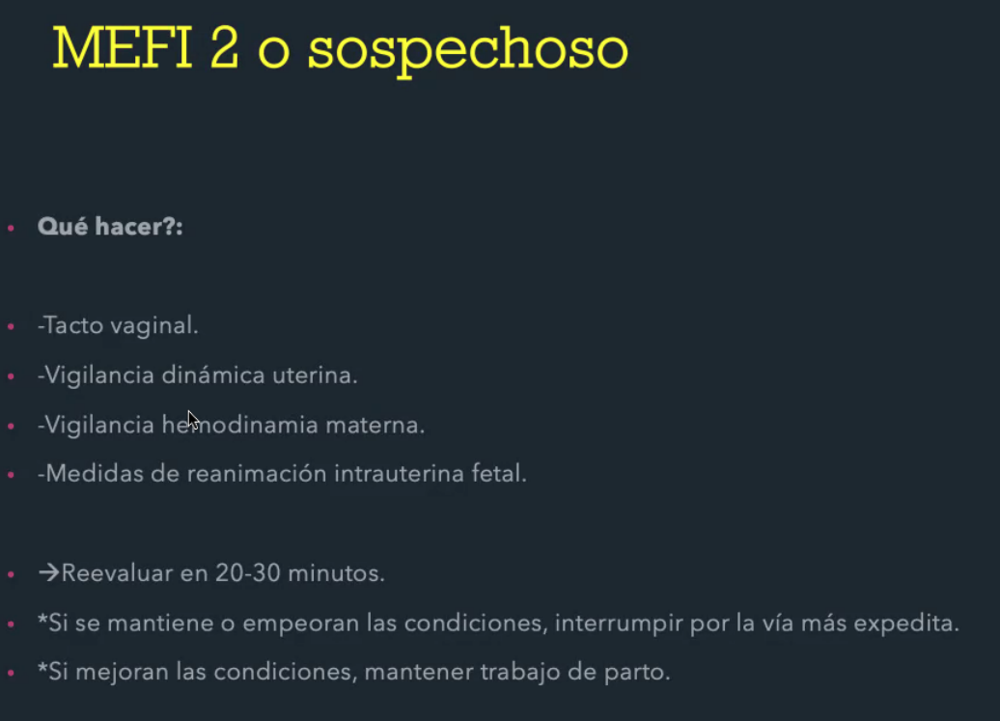
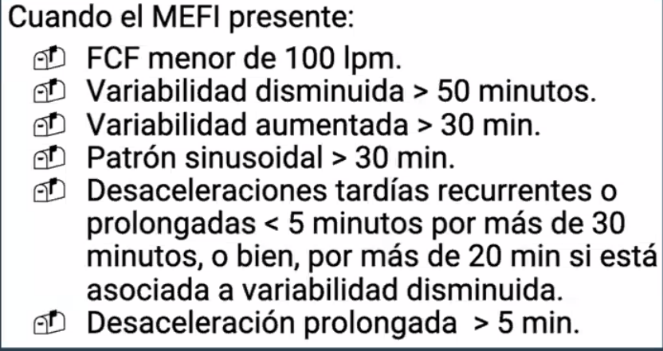
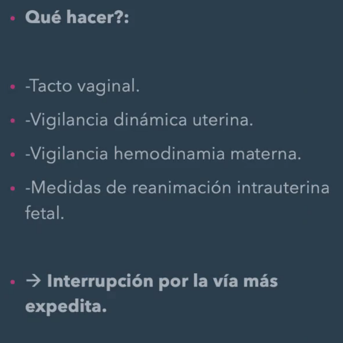
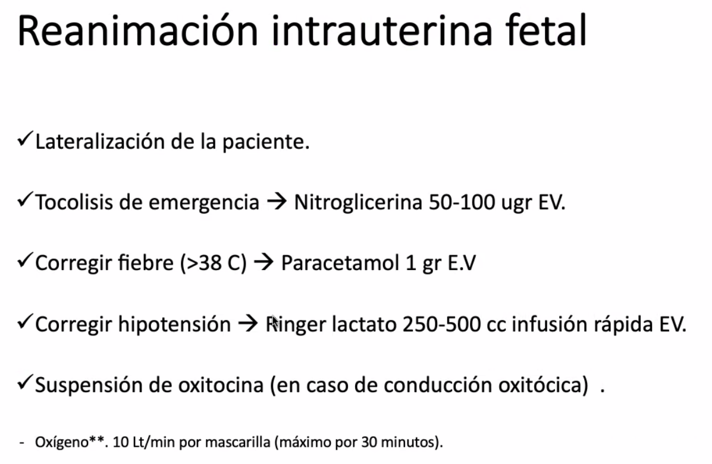

# Seminario dolor pélvico crónico

## Definición dolor pélvico crónico

En pelvis, pared abdominal anterior (a nivel o bajo ombligo), zona lumbo-sacra o los glúteos. 

Persistente, no cíclico (no relacionado con menstruación), de más de 6 meses de duración.

Severidad causa incapacidad funcional, disminución de calidad de vida.

## Clasificación

- Ginecológico
    - Cíclico
    - Acíclico
- No ginecológico
    - Urológico: cistitis intersticial, cálculos renales, infecciones urinarias
    - Gastrointestinal: síndrome de intestino irritable, enfermedad inflamatoria intestinal
    - Neurológico: neuralgia del pudendo, neuropatía periférica
    - Musculoesquelético: disfunción de la articulación sacroilíaca, hernia discal
    - Psicosocial: depresión, ansiedad, abuso sexual


## Etiología

1. Visceral
- Gynecologic
    - Adenomyosis
    - Adnexalmass
    - Chronic pelvic inflammatory disease/chronic endometritis
    - Endometriosis
    - Leiomyoma
    - Ovarian remnant syndrome
    - Pelvic adhesions
    - Vestibulitis
    - Vulvodynia
- Gastrointestinal
    - Celiac disease
    - Colorectal cancer and cancer therapy
    - Diverticular colitis
    - Inflammatory bowel disease
    - Irritable bowel syndrome
- Urologic
    - Bladder cancer and cancer therapy
    - Chronic or complicated UTI
    - Interstitial cystitis
    - Painful bladder syndrome
    - Urethral diverticulum
2. Neuromusculoskeletal
- Fibromyalgia
- Myofascial syndromes
    - Coccydynia
    - Musculus levator ani syndrome
- Postural syndrome
- Abdominal wall syndromes
    - Muscular injury
    - Trigger point
- Neurologic
    - Abdominal epilepsy
    - Abdominal migraine
    - Neuralgia
    - Neuropathic pain
3. Psychosocial
- Abuse
    - Physical,emotional, sexual
- Depressivedisorders
    - Majordepressivedisorder
    - Persistentdepressivedisorder(dysthymia)
    - Substance-inducedormedication-induced depressivedisorder
- Anxietydisorders
    - Generalizedanxietydisorder
    - Panicdisorder
    - Socialanxietydisorder
    - Substance-inducedormedication-induced anxietydisorder    
- Somatic symptom disorders
    - Somatic symptom disorder with pain features
    - Somatic symptom disorder with somatic characteristics
- Substance use disorder
    - Substance abuse
    - Substance dependenc


Ojo: Signo de Carnett, dolor abdominal que aumenta con la contracción de los músculos abdominales, al palparlos.

# Casos Clínicos Dolor pélvico crónico

## Caso 1

Paciente 28 años, dismenorrea secundaria

1. Anamnesis

Diarrea catamenial = Diarrea con la menstruación

2. Examen físico
3. Hipótesis diagnóstica
4. Exámenes complementarios

## Caso 2

Paciente 55 años, dolor acíclico 2 años de evolución 

1. Anamnesis
2. Examen físico
3. Hipótesis diagnóstica
4. Exámenes complementarios


BUSCAR HÍGADO GRASO AGUDO OBSTE

Prevención de enfermedad 

# Evaluación UFP

## Definiciones

Asfixia perinatal
Test de bienestar fetal antenatal
Test de movimientos fetales:

- Las gestantes sin factores de riesgo (FR): informarlas de que deben tener conciencia de la percepción de éstos y realizar contaje dirigido en caso de percibir disminución de los mismos.  
- Gestantes con factores de riesgo (Tabla 1): deben realizar control diario de los movimientos fetales a partir de las 26-32 semanas de gestación (SG). 

Aquellas gestantes que NO PERCIBAN DIEZ MOVIMIENTOS EN UN INTERVALO DE DOS HORAS, precisarán una evaluación complementaria del bienestar fetal (ver protocolo disminución de los movimientos fetales).  

Registro basal no estresante
Perfil biofísico fetal
Test de tolerancia a las contracciones
Monitorización fetal intraparto
Marcador agudo y crónico de hipoxia

## Ordena mentalmente las pruebas de bienestar fetal antenatal

Buscar según falsos negativos, mientras más falsos negativos, peor

Mientras mejor sea el test, mejor para decidir la interrupción del embarazo

1. Métodos clínicos 
• Medición de la altura uterina 
• Estimación clínica del peso fetal (“frozen chicken technique”, en embarazos mayores a 28 
semanas) 
• Estimación clínica del líquido amniótico (> 28 semanas) 
• Auscultación de la frecuencia cardiaca fetal 
• Monitorización Materna de los Movimientos Fetales (MMMF) 
2. Pruebas diagnósticas 
• No Invasivas  
    • Ecografía 
    • Velocimetría Doppler fetal 
    • Registro Basal No Estresante (RBNE): Monitorización basal de LCF  
    • Estimulación vibroacústica fetal: se estimula al feto con sonido y se evalúa su reacción en términos de aumento de la frecuencia cardíaca; su uso se asocia al RBNE. 
    • Test de tolerancia fetal a las contracciones (TTC) o Registro Estresante 
    • Prueba de estimulación mamaria 
    • Perfil biofísico fetal (PBF) 
    • Índice de Líquido Amniótico (ILA) 
• Invasivas 
    • Amnioscopía: mirar las características del LA a través del cuello uterino, usando un 
    amnioscopio. Esta técnica, hoy en desuso, permitía verificar la existencia de meconio 
    • Cordocentesis: obtención de sangre fetal mediante punción transabdominal del cordón 
    umbilical guiada por ultrasonido 
    • Fetoscopía 
    • Amniocentesis: es posible su ejecución a partir de las 15 semanas, mediante punción 
    abdominal guiada por ultrasonido 

De cada prueba, revisar:
- En qué consiste
- Es buen método? (conocer bioestadística)
- Existen requisitos?
- cuales son las indicaciones?
- Cómo se informan los resultados?
- Practicar buscando ejemplos

| Prueba | Bioestadística (sensibilidad, especificidad, VPP, VPN, Falsos pos y Falsos neg) | Requisitos | Indicaciones | 


De menor a mayor falsos negativos
- TTC: 0.4 muertes por cada 1000 partos 
- Perfil Biofísico Fetal: 
- 2 RBNE en 1 semana: 
- 1 RBNE
- *Doppler no se considera por evidencia para casos específicos

- Muy abajo test de movimientos fetales, 


### RBNE

- Buen VPN
- RBNE, la <span style= "color: #440154; font-weight: bold;" >variabilidad</span> por si sola es la más importante, normal de 5-25 latidos por minuto
- Aceleraciones: =< 32 semanas 10x10, > 32 semanas 15x15
- Deceleraciones: No debe haber deceleraciones (por)

Se informa REACTIVO o NO REACTIVO. NO REACTIVO al menos 1 de los 4 criterios no se cumple.

- Principal razón de no reactividad: <span style= "color: #21918c; font-weight: bold;" >sueño fetal</span>. 1 RBNE --> repetir.

### Test de tolerancia a las contracciones (TTC)

- Estudios del TTC se realizaron con 3 contracciones en 10 minutos. Contracciones "inducida" por oxitocina.
- Desde 34 semanas
- No es de rutina. 
- Ojo, TTC no espontáneo, cuando se toma "RBNE" y se obtienen 
- En TTC y MEFI, no se "exigen" aceleraciones.
- Categorías de TTC:
    - Negativo: no existen desaceleraciones tardías 
    - Positivo: en más del 50% de las contracciones uterinas existen desaceleraciones tardías o en 3 CU consecutivas en 10 min 
    - **Sospechoso**: existen desaceleraciones tardías, pero en menos del 50% de las contracciones uterinas 
    - Insatisfactorio: no se lograron 3 contracciones uterinas en 10 minutos superado las 30 mU/min de ocitocina 
    - Hiperestimulación: más de 5 contracciones en 10 minutos, hasta feto sano puede sufrir hipoxia

- Cuando finalizar el TTC? cuando dura?
    - En Chile, desde que se alcanzan 3 contracciones en 10 minutos, se contabilizan 20 contracciones para evaluar


Desaceleraciones:
- Precoces: relacionadas con contracciones, origen --> compresión de la cabeza fetal
- Tardías: relacionadas con hipoxia, origen --> insuficiencia placentaria, se activan quimioreceptores
- Variables: relacionadas con compresión del cordón umbilical

- RCIU --> tipo 1 puede PV, desde tipo 2 cesárea

Si hipoxia:
1° taquicardia
2° variabilidad disminuida
3° desaceleraciones

### Perfil biofísico fetal

Marcadores agudos:
- Movimientos respiratorios: 
- Movimientos fetales
- Tono fetal

Marcadores crónicos:
- Líquido amniótico

Se agrega el RBNE para 10 puntos

Orden de afectación:
1. Movimientos respiratorios
2. Movimientos fetales
3. Tono fetal

Evidencia es mala respecto a la indicación según el puntaje del PBF. Si sobre 34 semanas, se puede realizar TTC

### MEFI

- 2 a 3 contracciones en 10 minutos, CON MODIFICACIONES CERVICALES

Modificaciones cervicales:
- Dilatación cervical 3 cm y/o borramiento 80% para todas (incluídas parto prematuro)
- 

Clasificación: el Consenso Americano, definió la interpretación de la Monitorización Electrónica Fetal Intraparto (MEFI) de la siguiente manera:
- Categoría I: monitoreo normal, predicción fuerte de estado ácido base fetal normal. No requiere medidas de acción específicas.
- Categoría II: patrón de monitoreo indeterminado, no predicen un estado ácido base fetal alterado (Categoría III), pero no hay evidencia para asignarlos a Categoría I. Requieren evaluación, monitoreo continuo y reevaluación.
    - con variabilidad normal
    - Qué hacer: tacto vaginal, vigilancia dinámica uterina, vigilancia hemodinamia materna
        - Reanimación fetal
            - Posición lateral izquierda, fluidos, suspender oxitocina, tocolisis, 
            - Si se mantienen o empeoran las condiciones, interrumpir por vía más expedita
                - PV o instrumental si, en fase expulsiva + cabeza en espinas isquiáticas (3er plano de hosch o espinas 0).
                - Si no cesárea



- Categoría III: trazado anormal, con evidencia que se asocia a un estado ácido base fetal alterado, requiere evaluación inmediata y eventual necesidad de reanimación fetal intraparto. Esta categoría incluye: variabilidad ausente asociada a alguna de las siguientes: desaceleraciones tardías recurrentes, desaceleraciones variables recurrentes o bradicardia; o registro de patrón sinusoidal. 

Patrón sinusoidal tb es mefi III, se relaciona con anemia fetal

En MEFI 3 no se espera para reevaluar





## Prueba fetal intra parto.
Nos referimos a la monitorización fetal intraparto (MEFI).
-¿En qué consiste el procedimiento?
-¿Cuándo se debe indicar?
-¿Cómo se interpretan los resultados? Se recomienda estudiar criterios para MEFI 1 y
MEFI 3, para luego categorizar como MEFI 2 a todo lo que no se abarca anteriormente,
haciendo más fácil el estudio.
-¿Cuál es la conducta priorizada frente a cada tipo de MEFI?
-Comprende las indicaciones que componen la reanimación intrauterina fetal.
-¿Qué evidencia significativa tiene utilizar MEFI vs auscultación intermitente?

 Es importante conocer cómo se realiza el paso de oxígeno de la madre al feto.
 Para términos de entender mejor la fisio/fisiopatología en el peri-parto, adjunto en la
carpeta artículo que clarifica ese aspecto, para que consulten en caso necesario.

# EIP

Por lo general son cuadros más larvados (clamidia), Gonococo puede dar cuadros más agudos. 

## FR

DIU (en teoría los primeros 30 días)

## Diagnósticos diferenciales

- Obste: <span style= "color: #21918c; font-weight: bold;" >DESCARTAR EMBARAZO ECTÓPICO</span> (en la eco puede verse parecido a un ATO)

- Causas gastrointestinales y urológicas por lo general son más agudas

Presentaciones clásicas:
- Endometritis puerperal: Ojo mal olor de flujo saliendo del cueyo (hay que hacer examen con espéculo, porque de repente pacientes no se asean). 
- Endometritis por DIU

Lab a solicitar:
- beta hCG
- Hemograma, PCR
- PCR ITS y cultivos cervicovaginales

## Criterios hospitalización en EIP

## ATB cubrir

- ITS
- gram -
- Anaerobios

Cefadroxilo + metronidazol (gram - y anaerobios)
Ciprofloxacino no se puede en puerperas 

Ojo: apendicitis vs salpingitis

Sd Fitz-Hugh-Curtis... Dol primero en hipogastrio, luego migra a hipocondrio (puede ser hipocondrio derecho)

Hasta salpingitis se puede tratar VO. Si ya hay pus (pisalpinx, abscesos dar tto EV).

ATO es un plastrón con colección purulenta. Puede "perder la hermeticidad" y empieza a salir pus y dar pelviperitonitis

En EIP silente, prender la antena y buscar factores de riesgo y tomar PCR ITS et al. En otros países la búsqueda es más activa.

Ojito: azitromicina para chlamydia. Si no se puede tomar PCR podría darse "profilactica" jeje

# LEucorrea e ITS

Rev fcos

# Tumor Pélvico

## Masa pélvica

(Nunca olvidar la posibilidad de embarazo ectópico)

Evaluar edad, pensar siempre P(malignidad), otras cosas según el caso a caso

<span style= "color: #21918c; font-weight: bold;" >Imágen de elección: Ecografía</span> (capaz de realizar diagnóstico en >90%)

Idealmente TV. Si no es TV, debe ser con vejiga llena. 

<table cellspacing="0"><colgroup span="4" width="25%"></colgroup> <tbody> <tr> <td class="subtitle1">Gynecologic: Ovarian</td> <td class="subtitle1">Gynecologic: Tubal</td> <td class="subtitle1">Gynecologic: Extraovarian and extratubal</td> <td class="subtitle1">Nongynecologic</td> </tr> <tr> <td class="subtitle2_left" colspan="4">Benign</td> </tr> <tr class="divider_bottom"> <td class="indent1"> <ul> <li>Functional (physiologic) cyst </li> <li><annotation-anchor data-content-id="NTa-IP" amboss-annotation-variant="none">Corpus luteal cyst</annotation-anchor> </li> <li><annotation-anchor data-content-id="HsbKwE" amboss-annotation-variant="none">Luteoma of pregnancy</annotation-anchor> </li> <li><annotation-anchor data-content-id="Fsbg9E" amboss-annotation-variant="none">Theca lutein cyst</annotation-anchor> </li> <li>Polycystic ovaries </li> <li><annotation-anchor data-content-id="KfaUMP" amboss-annotation-variant="none">Endometrioma</annotation-anchor> </li> <li><annotation-anchor data-content-id="0Tae6P" amboss-annotation-variant="none">Cystadenoma</annotation-anchor> </li> <li>Benign <annotation-anchor data-content-id="Yj1n_g0" amboss-annotation-variant="none">ovarian germ cell tumor</annotation-anchor> (eg, <annotation-anchor data-content-id="dpXoo_" amboss-annotation-variant="none">mature teratoma</annotation-anchor>) </li> <li>Benign sex cord-stromal tumor </li> </ul> </td> <td> <ul> <li><annotation-anchor data-content-id="KM0Upg" amboss-annotation-variant="none">Ectopic pregnancy</annotation-anchor> </li> <li><annotation-anchor data-content-id="oGb0Zv" amboss-annotation-variant="none">Hydrosalpinx</annotation-anchor> </li> </ul> </td> <td> <ul> <li>Paraovarian cyst </li> <li>Paratubal cyst </li> <li><annotation-anchor data-content-id="kM0mKg" amboss-annotation-variant="none">Uterine leiomyoma</annotation-anchor> (pedunculated or cervical) </li> <li><annotation-anchor data-content-id="26bT4u" amboss-annotation-variant="none">Tubo-ovarian abscess</annotation-anchor> </li> </ul> </td> <td> <ul> <li><annotation-anchor data-content-id="9DYNgr" amboss-annotation-variant="none">Constipation</annotation-anchor> </li> <li><annotation-anchor data-content-id="my0Vfi" amboss-annotation-variant="none">Appendiceal abscess</annotation-anchor> </li> <li>Diverticular <annotation-anchor data-content-id="yVbdCs" amboss-annotation-variant="none">abscess</annotation-anchor> </li> <li><annotation-anchor data-content-id="ZyXZd00" amboss-annotation-variant="none">Pelvic</annotation-anchor> <annotation-anchor data-content-id="yVbdCs" amboss-annotation-variant="none">abscess</annotation-anchor> </li> <li><annotation-anchor data-content-id="6sXjDz" amboss-annotation-variant="none">Bladder diverticulum</annotation-anchor> </li> <li>Ureteral diverticulum </li> <li><annotation-anchor data-content-id="OP1IUS0" amboss-annotation-variant="none">Pelvic kidney</annotation-anchor> </li> <li><annotation-anchor data-content-id="3SbSzG" amboss-annotation-variant="none">Peritoneal</annotation-anchor> cyst </li> <li>Nerve sheath tumor </li> </ul> </td> </tr> <tr> <td class="subtitle2_left" colspan="4">Malignant or borderline</td> </tr> <tr> <td class="indent1"> <ul> <li><annotation-anchor data-content-id="KubUHv" amboss-annotation-variant="none">Epithelial</annotation-anchor> <annotation-anchor data-content-id="58XiM-" amboss-annotation-variant="none">carcinoma</annotation-anchor> </li> <li><annotation-anchor data-content-id="KubUHv" amboss-annotation-variant="none">Epithelial</annotation-anchor> borderline <annotation-anchor data-content-id="kXcmya0" amboss-annotation-variant="none">neoplasm</annotation-anchor> </li> <li>Malignant ovarian <annotation-anchor data-content-id="Lcbw1s" amboss-annotation-variant="none">germ cell tumor</annotation-anchor> </li> <li>Malignant sex cord-stromal tumor </li> </ul> </td> <td> <ul> <li><annotation-anchor data-content-id="KubUHv" amboss-annotation-variant="none">Epithelial</annotation-anchor> <annotation-anchor data-content-id="58XiM-" amboss-annotation-variant="none">carcinoma</annotation-anchor> </li> <li>Serous tubal intraepithelial <annotation-anchor data-content-id="kXcmya0" amboss-annotation-variant="none">neoplasia</annotation-anchor> </li> </ul> </td> <td> <ul> <li><annotation-anchor data-content-id="IrXYiz" amboss-annotation-variant="none">Metastatic</annotation-anchor> <annotation-anchor data-content-id="NM0-Kg" amboss-annotation-variant="none">endometrial carcinoma</annotation-anchor> </li> <li><annotation-anchor data-content-id="vrcAQd0" amboss-annotation-variant="none">Cystadenocarcinoma</annotation-anchor> (rare)</li> </ul> </td> <td> <ul> <li>Appendiceal <annotation-anchor data-content-id="kXcmya0" amboss-annotation-variant="none">neoplasm</annotation-anchor> </li> <li>Bowel <annotation-anchor data-content-id="kXcmya0" amboss-annotation-variant="none">neoplasm</annotation-anchor> </li> <li><annotation-anchor data-content-id="IrXYiz" amboss-annotation-variant="none">Metastasis</annotation-anchor> (eg, breast, <annotation-anchor data-content-id="wPchSc0" amboss-annotation-variant="none">colon</annotation-anchor>, <annotation-anchor data-content-id="7RX4oB" amboss-annotation-variant="none">lymphoma</annotation-anchor>) </li> <li><annotation-anchor data-content-id="lP1vUS0" amboss-annotation-variant="none">Retroperitoneal sarcoma</annotation-anchor> </li> </ul> </td> </tr> </tbody></table>


TC: buen complemento en casos seleccionados, RNM 

### Pre-menarquia:

lo más frec teratoma maduro

### Edad reproductiva

### Post-menopáusica


FR Malignidad:
- 

## Eco TV debe evaluar

- Tamaño
- solido-quistico
Limites
Flujo doppler

Preguntable
<span style= "color: #440154; font-weight: bold;" >

Sospecha malignidad en ECO 
- Componente sólido 
- Complejo
- Septos gruesos > 2-3 mm
- Doppler con IP bajo porque son vasos de neoformación
- Ascitis
- Crecimiento

</span>

Manejo: Aspiración, punción NO

Marcadores tumorales: Varios. Pero el más relevante: CA-125

CA-125 se eleva en Ca epitelial

<span style= "color: #21918c; font-weight: bold;" > Rol CA-125: seguimiento</span> más que diagnóstico. Tiene baja especificidad. Mayor utilidad en post-menopáusicas

Preguntable dx elevación CA-125

No se sigue con imágenes

## Diagnósticos diferenciales 

### Quistes funcionales

- Quiste folicular: Cuando no ocurre rotura de folículo y continua creciendo
- Quiste luteo: Cuerpo lúteo no involuciona y con tinúa creciendo

Ambos pueden volverse hemorrágicos. La gran mayoría de las veces es autolimitado.

Eco TV: Características:
- 

<span style= "color: #5ec962; font-weight: bold;" >Analgesia :) debería regresar solo</span>, no entrar a operar

SOP: tendrán ovarios más grandes porque tienen más folículos grandes

### Tumores benignos

- De células germinales:

- Teratoma maduro 
- Gonadoblastoma

No germinales
- DEl estroma

Epiteliales:
- Cistoadenoma: mucinoso y seroso
- 

#### Cistoadenomas:
- Seroso: lleno de líquido quístico
- Mucinoso: lleno de pseudomucina, de mayor tamaño y multilobulados

#### Endometrioma
- Tejido endometrial ectópico en el ovario

Triada descrita: Dolor pélvico, dismenorrea y dispareunia
Contenido "achocolatado"
Eco muestra vidrio esmerilado
Puede elevar CA 125
Tratamiento: sacarlo :)

#### Teratoma
(o quiste dermoides)
Frecuente en mujeres jóvenes
Clínica: Asintomáticos, Nauseas y dolor

Puede dar síntomas si struma ovárico

"Tip: las cosas malignas comen tejido, las benignas crecen con el tejido

#### TEcoma y firboma

##### Tecoma
Tecoma si productor de estrógenos: Tumor de céluclas de la granulosa

PSeudo pubertad precoz, SUA
Riesgo de Ca endometrio

Tu células de la granulosa: ojo tto en relación a estrógenos

##### Fibroma

Hormonalmente inactivo
Sd de Meiggs: Ascitis, derrame pleural, Tu Ovárico

--------

ACO no sirve para disminuir quistes


## Post-menopausia

- si quiste > 3 cm --> laparoscopía diagnóstica

## Ca de Ovario

Ca epitelial es neo más frec de ovario

### Ca epitelial

El gran problema, la mayoría diagnosticados en estadío III. Si se diagnosticaran en estadío I, tienen supervivencia superior al 90% a los 5 años

No existe screening :(

Epitelio celómico: Adenocarcinoma seroso ( lo más frecuente )

Ojo: krukenberg

Etapificación FIGO de Ca de ovario es <span style= "color: #21918c; font-weight: bold;" >etapificación quirúrgica</span>

FR:
- Caucásicas
- MEnarquia precoz / Menopausia tardía
- Factor hereditario BRAC1/2

F protectores: 
- Lo inverso de FR
- Salpingectomía (porque se cree que puede originarse porque caen c ovaricas a frimbrias)

### Tto

Lo más importante es la cirugía. Y la quimioterapia es un gran aliado. RDT no tiene evidencia

Óptimo de resección: sin residuo tumoral, borde a....

Cirugía completa incluye rescción de varias estructuras

Si se logra cirugía, va a qmt adyuvante con cisplatino y taxol (plaquetaxel???)

Si no es resecable o en cirugía se anticipa que no logrará realizar completa: qmt neoadyuvante (de a 3 ciclos hasta 2 veces para lograr buena citorreducción), luego cirugía completa, luego 3 ciclos qmt

Se puede realizar laparoscopía diagnóstica para evaluar citorreducción

Ascitis en Ca de ovario es exudado, por eso se puede sacar todo lo que se pueda (a diferencia de la ascitis por DHC que es transudado)


# Amenorrea

| Hipotálamo | Hipófisis | Ovarios | Tracto salida |
| - | -| -| -|
| Kallman, Hipotiroidismo, funcional (estrés , deporte, dieta), infección, trauma, tumor | HiperPRL, Sheehan (puede panhipopituitarismo), Tumor, Cushing | SOP, insuficiencia ovárica prematura (Turner, infección, trauma, RT/QMT, Autoinmune), Menopausia, embarazo, agenesia gonadal, ACO | Sd Asherman (secundario a legrado), Himen imperforado (dolor cíclico por ciclos menstruales), Tabiques, Sd Rokitansky–Kuster–Hauser|


Síntomas por cada causa:
- 

Hacer esquema en mente

## Anamnesis

- Menarquia
- Temporalidad
- MAC (y cual) / mebarazo
- Dolor, Galactorrea
- Debilidad muscular
- Mucho ejercicio? dietas
- Anorex / bulimia
- Anosmia (Kallman), Alteración campo visual
- infección/ trauma, nauseas vom
- Acné hirsutismo
- Frío
- Cambios voz  
- estrías
- Antecedentes Qx

- Partos, hemorragias (sheehan)
- Turner: ojo mosaicos no se notan tanto

- Antecedentes qmt/rt

- Bochornos, sequedad vaginal, 
- Fcos que producen prolactinemia... 

## EF ir a buscar lo mismo :)

de sheehan, lo primero que se ve en puerperio es la galactorrea?

Cambios androgénicos **rápidos**, ojo, sospechar en Tu suprarrenal

## Exámenes


Batería mínima: 

``` md
- Beta hCG
- PRL
- TSH
- FSH y estradiol
- Ecografía + recuento folicular

```

- (DHEAS ssi cambios androgénicos)

| Etiología | FSH | Estradiol | 
| - |- |- |
| Hipotálamo | N o bajo | bajo |
| Hipófisis | bajo | bajo |
| Ovarios | alto | bajo |
| Utero | N | N |

Beta elevada buscar embarazo o coriocarcinoma (Tu productor de beta)

Si hirsutismo o sospecha hiperandrogenismo

- Testosterona + SHBG = índice andrógeno libre
    Testosterona tot x 100 / SHBG (tienen que estar en mismas unidades de medida)
- DHEAS
- 17-OH progesterona
- Cortisol libre en orina 24h
- Testosterona total >200 sospechar Tu andróg

Pruebas que ya no se usan
- Prueba de progesterona (10-14 días progestágenos, ej 400 mg progendo)
    - + si sangra (problema ovulación)
    - - implica no tiene estrógenos 
        - Estrógeno + progesterona por 28 días + 10-14 días progesterona
            - + implica problema en eje
            - - implica efector malo (útero o tracto de salida)

insuficiencia ovárica Prematura
Menopausia Precoz 40-45 años

## SOP

Hiperandrogenismo:
- Clínico: Hirsutismo, acne (Virilización no es sinónimo de SOP)
- Lab IAL > 4.5

Anovulación:
- Amenorrea oligomenorrea
- Menstruaciones irregulares, con incremento en volumen

Ecografía: 
- \> 20 folículos 2-9 mm
- \> 12
- \> 10 cc
- Al menos en 2 ovario

2 de 3 criterios

Descartar otros dx

Criterios de Roterdam (4 fenotipos):
- Asociados a hiperandrogenismo --> mayor RCV
- Sin hiperandrogenismo --> mayor riesgo Ca hormonodependiente

### Manejo

- Diagnóstico
- Evaluar intereses paciente (deseo paridad? estética por virilización?)
    - Si desea embarazo: 
        - <span style= "color: #5ec962; font-weight: bold;" >disminución de peso</span>
        - Insulino resistencia: <span style= "color: #5ec962; font-weight: bold;" >metformina</span>
        - <span style= "color: #5ec962; font-weight: bold;" >inductores ovulación</span>
        - <span style= "color: #21918c; font-weight: bold;" >derivar a infertilidad</span>
    - Sin deseo embarazo:
        - Delta vida: dieta + ejercicio
        - IR: Metformina
        - ACO combinado o progestina sola si:
            - Ojo con progstageno, dar los menos androgénicos de preferencia
                - Acetato de ciproterona (<span style= "color: #5ec962; font-weight: bold;" >el más antiandrogénico</span>) Por lo general se ocupa max 6 meses porque se asocian a IR
                - Dienogest
                - Drospirenona
                - Clormedinona (si bien es el menos potente, <span style= "color: #5ec962; font-weight: bold;" >mejora animo</span>)
                - Dienogest y drosperinona se puede asociar a espironolactona


SOP siempre poner ojo con endometrio, que no esté engrosado