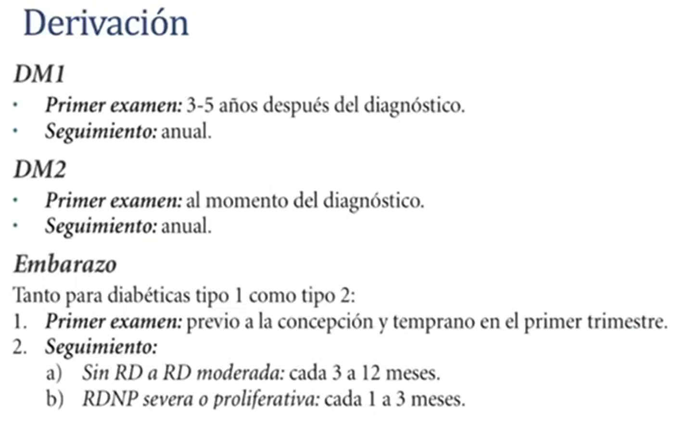
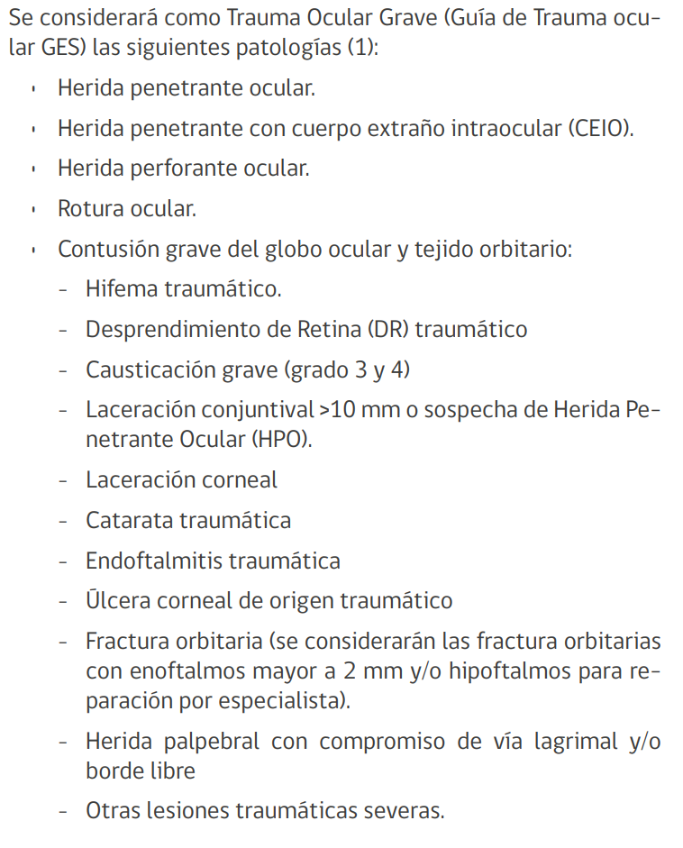
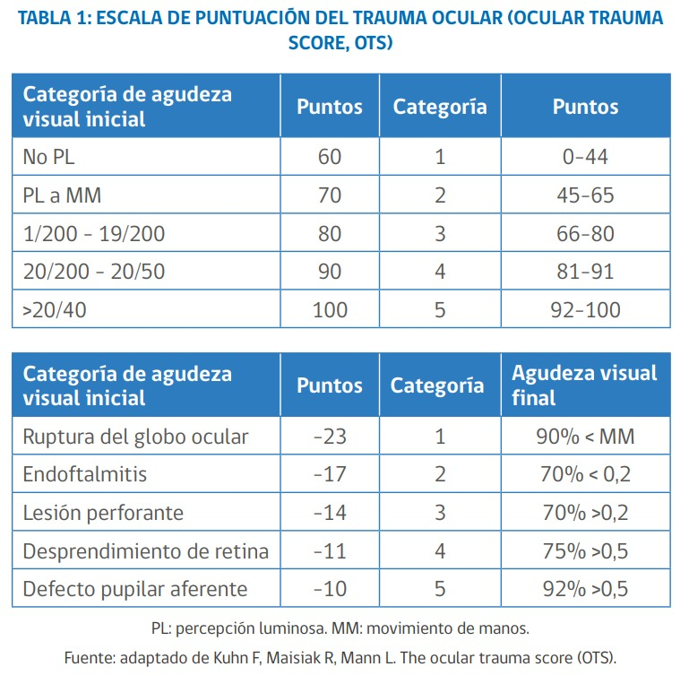
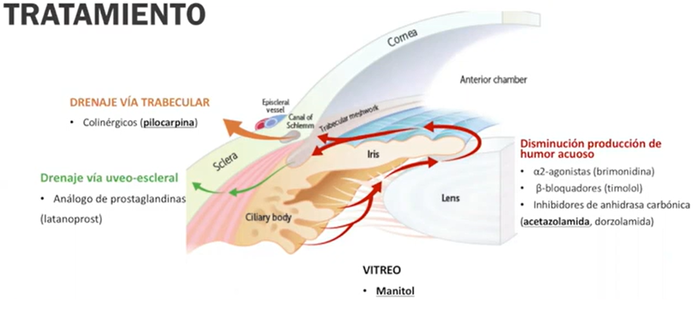
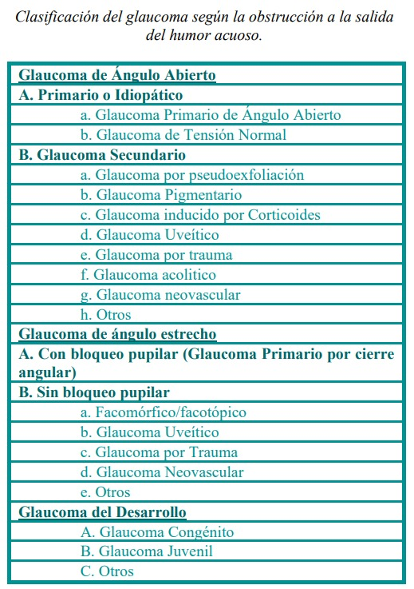

# Retinopatía diabética

## Criterios derivación

# Trauma ocular

# Ojo rojo

## Difuso/superficial

## Periquerático/profundo
- Glaucoma 
NO dat atropina ni midriáticos (dilatan pupila y empeoran glaucoma)
(cursivas --> not sure)

| Fco | Dosis | Presentación | Comentarios |
|---|---|---|---|
| Pilocarpina | *1 a 2 gotas* | *2%* | colinérgico: drenaje vía trabecular |
| Latanoprost | *1 gota* | *0.005%* | análogo prostaglandinas: drenaje vía uveoescleral  |
| Timolol | *1 gota* | *0.5%* | beta bloqueador: disminuye producción humor acuoso |
| Brimonidina | *1 gota* | *0.2%* | agonista alfa 2: disminuye producción humor acuoso |
| Acetazolamida | 250mg c/6h, 500 mg (carga) VO| 250 mg | inhibidor anhidrasa carbónica: disminuye producción humor acuoso. Contrind: alergia sulfonamidas, EPOC severo, ¿etnia afrocaribeña? (anemia falciforme), antecedente litiasis, embarazo |
| Manitol | 15% ->**10** a 13 cc/kg. 20% ->7.5 a **10 cc/kg** EV| 15% o 20% | osmótico: deshidratación de humor ¿vitreo?. Contraind: Hipersensibilidad, EPA, Anuria-deshidratación severa, insuf cardiaca-renal-hepática, Eo confusión mental, hipotermia |

- Uveítis (ojo similar a glaucoma, pero sin aumento presión intraocular)
- Queratitis
## Localizado

# Super resumen Oftalmo
Esquema general abordaje patologías oftalmológicas
strong

| Traumatológica |
|---|
| **Ojo abierto**: <table><tr><th>Sospecha</th><th>Manejo</th></tr><tr><td><li>herniación contenido</li><li>Discoria (ojoabierto hasta demostrar lo contrario)</li><li>Hifema total (en bola 8, puede ser hematoglobo)</li><li>Hipotonía</li></td><td><li>ATB (1-moxifloxacino 400mg ev/vo 2-Cipro750mg vo c/12 + cefazolina500mg ev c/6h)</li><li> sello ocular no compresivo **ESTERIL**</li> <li>no valsalva ni colirios</li><li>Llamar UTO para reservar cupo</li><li>Si sospecha CE intraocular: Rx AP/L o TC s/c 2mm</li></td></tr></table>|
| **Causticación**: <table><tr><th>Sospecha</th><th>Manejo inicial</th></tr><tr><td>historia + clasificación de Hughes (grados 1 a 4)</td><td><li>Irrigación abundante SF (3L o 30 minutos) (se puede utilizar diphoterine 500 a 1000 cc)</li><li>limpiar fondos de saco con cotonitos</li><li>derivar a UTO</li></td></tr></table> |
| Resto patol trauma ocular se podría derivar sin intervención previa (o buscar en google [MANUAL DE BOLSILLO Manejo del trauma ocular para profesionales de la salud](https://enfermeriachl.files.wordpress.com/2019/11/manual-de-bolsillo_trauma-ocular.pdf) para info específica) |

--------

| No traumatológica |
|---|
| Enfermedad sistémica:  <li>Afinar ojo para realizar d/dx pertinente (por lo general med int o neuro)</li>    |
| Enfermedad primaria del ojo, conocer manejo inicial de <li>Sd Glaucoma agudo</li><li>Celulitis (pre y post-septal)</li><li>Glaucoma congenito (y dg diferenciales)</li> |

Sd Glaucoma agudo:
Glaucoma =/=> aumento presión intraocular

| Sospecha | Manejo |
|---|---|
|<li>ojo rojo profundo (con edema corneal)</li><li>duro</li><li>disminución agudeza visual</li><li>semimidriasis arrefléctica</li> | <li>Acetazolamida 2x250mg de carga, luego 250 mg c/6h</li><li>los colirios que se dispongan para disminuir P</li><li>d/dx urgente</li><li>Manitol 15% ->10 a 13 cc/kg. 20% ->7.5 a 10 cc/kg EV funciona mientras se infunde, se puede dar, pero ojo con contraindicaciones</li> |

