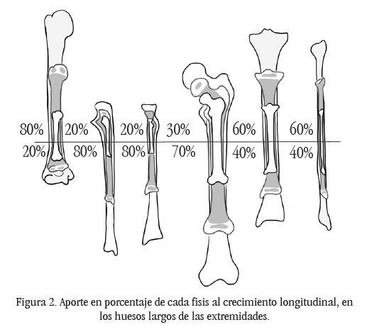
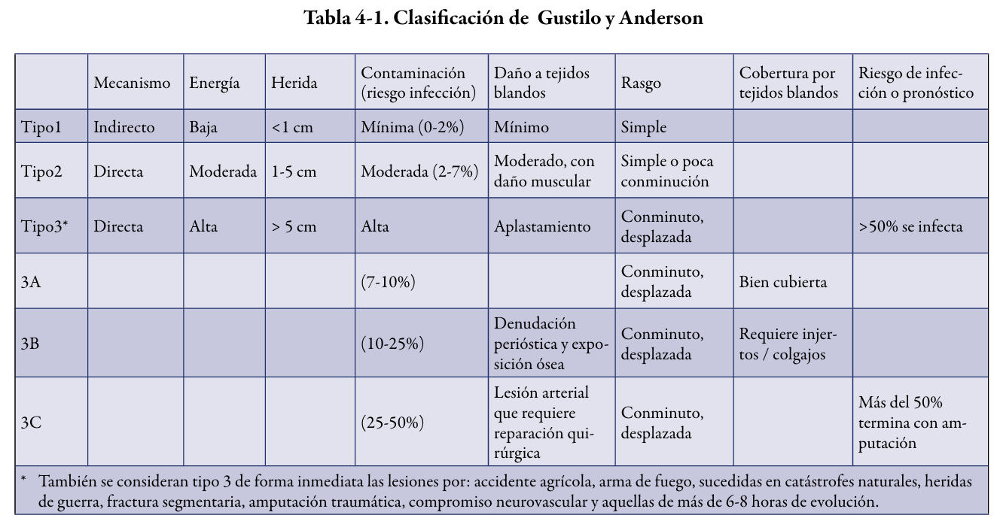

# Infantil

## Displasia luxante de cadera

### Examen físico

| signo | edades |
|-------|--------|
| Ortolani | 0-3 meses (raro encontrarlo después |
| Barlow | 0-3 meses |
| Limitación de la abducción, rotación interna y extensión | 3-6 meses |

Otros: 
- Asimetría de pliegues
- Telescopaje: al estar la cadera afuera, no hay tope en el cotilo, al hacer un movimiento de pistoneo.
- Test de Galeazzi

Ninguno de estos signos es patognomónico ya que presentan un alto porcentaje de falsos negativos y positivos.

Mayores a 1 año:
- Retardo en el inicio de la marcha.
- Signo de Trendelemburg: hay una insuficiencia relativa
del músculo glúteo medio, que es un estabilizador de la
pelvis. Al apoyar el lado luxado, y levantar el sano, cae
la hemipelvis sana, y se inclina la columna lumbar para
mantener el equilibrio.
- Si la enfermedad es bilateral, se produce la marcha anádica
(de pato).
    - Marcha claudicante: cojera.
    - Telescopaje.
    - Galeazzi.
    - Acortamiento de la extremidad.

### Radiografías

De todos estos parámetros, los más importantes son la forma del acetábulo, la presencia o ausencia de ceja cotiloídea, el ángulo acetabular y la relación del núcleo de osificación (o su proyección) con el cotilo.

Entre linea de Perkins y linea de Hilgenreiner:

Ambas forman los cuadrantes de Ombredanne. Hay que ubicar el núcleo de osificación femoral (o proyectarlo sobre el 1/3 medio del cuello femoral si no está presente), y determinar en donde se encuentra. En una cadera normal, se ubica en el ínfero interno. 
- En una cadera luxada se encuentra en el supero externo o infero externo, pero fuera de la cobertura del cotilo. 
- En una cadera subluxada se puede ubicar en cualquiera de los externos, o saliendo del infero interno. Esta es una condición poco frecuente de encontrar en las radiografías.

Índice acetabular distribución valores normales

| Age (y) | n   | Females Right ± SD | Females Left ± SD | n   | Males Right ± SD | Males Left ± SD |
|---------|-----|--------------------|-------------------|-----|------------------|-----------------|
| 0-0.5   | 48  | 24.04 ± 3.7        | 25.64 ± 4.0       | 28  | 24.14 ± 1.8      | 23.43 ± 3.0     |
| 0.5-1   | 118 | 24.60 ± 4.2        | 25.67 ± 3.9       | 112 | 23.41 ± 3.7      | 23.91 ± 4.0     |
| 1-2     | 164 | 23.84 ± 3.4        | 25.46 ± 4.0       | 174 | 22.95 ± 3.9      | 23.00 ± 4.0     |
| 2-3     | 84  | 21.48 ± 3.8        | 21.81 ± 3.6       | 78  | 19.82 ± 4.0      | 19.87 ± 4.1     |
| 3-4     | 48  | 19.58 ± 4.0        | 19.42 ± 3.6       | 86  | 17.23 ± 4.0      | 18.09 ± 4.3     |
| 4-5     | 54  | 19.07 ± 4.1        | 18.52 ± 3.8       | 74  | 16.92 ± 2.7      | 16.27 ± 3.4     |
| 5-6     | 70  | 16.80 ± 5.1        | 17.86 ± 4.7       | 98  | 14.88 ± 3.5      | 15.08 ± 4.1     |
| 6-7     | 50  | 16.64 ± 3.8        | 16.96 ± 4.6       | 74  | 15.30 ± 4.4      | 15.53 ± 4.0     |
| 7-8     | 62  | 14.45 ± 3.0        | 15.94 ± 4.0       | 58  | 13.79 ± 2.8      | 14.24 ± 3.2     |
| 8-9     | 48  | 15.0 ± 5.1         | 14.83 ± 4.1       | 84  | 13.00 ± 3.6      | 12.71 ± 4.2     |
| 9-10    | 62  | 14.03 ± 3.9        | 13.97 ± 3.3       | 84  | 13.07 ± 4.0      | 12.74 ± 4.2     |
| 10-11   | 42  | 14.29 ± 4.5        | 15.52 ± 4.1       | 72  | 12.14 ± 4.1      | 12.33 ± 3.4     |
| 11-12   | 72  | 10.36 ± 3.2        | 10.56 ± 4.4       | 72  | 12.11 ± 3.9      | 12.16 ± 3.9     |
| 12-13   | 72  | 11.36 ± 3.90       | 10.00 ± 3.6       | 84  | 12.16 ± 3.9      | 12.39 ± 4.3     |
| 13-14   | 56  | 9.43 ± 4.1         | 9.32 ± 3.6        | 72  | 10.78 ± 2.0      | 10.47 ± 3.8     |

Novais, Eduardo N. MD*; Pan, Zhaoxing PhD†; Autruong, Patrick T. BA‡; Meyers, Mariana L. MD§; Chang, Frank M. MD*,‡,∥. Normal Percentile Reference Curves and Correlation of Acetabular Index and Acetabular Depth Ratio in Children. Journal of Pediatric Orthopaedics 38(3):p 163-169, March 2018. | DOI: 10.1097/BPO.0000000000000791 

## Salter-Harris

S-H I y II pueden tratarse con reducción cerrada 

Las lesiones de S-H tipo III y tipo IV son fracturas intraarticulares. Se pueden observar alteraciones del crecimiento, rigidez articular y no-unión. Con frecuencia se prefiere la reducción abierta y fijación interna para restaurar la anatomía de la articulación y de la placa de crecimiento, y evitar dichas complicaciones

## Alteraciones rotacionales y angulares del miembro inferior

DOI:10.1097/MOP.0000000000000977:

- El pie plano flexible, la torsión tibial y femoral, la posición en "W" y caminar de puntillas son típicamente variaciones normales del crecimiento y desarrollo, y se resuelven durante la primera década de vida. La derivación a ortopedia pediátrica está justificada para un diagnóstico y manejo definitivo, en particular si hay deformidad moderada a severa, falta de resolución o empeoramiento con el tiempo, dolor, problemas funcionales y/o necesidad de más tranquilidad para los padres.
- El pie plano flexible pediátrico generalmente se resuelve antes de los 10 años, pero pueden ocurrir mejoras adicionales hasta la madurez esquelética. Los zapatos/plantillas con soporte de arco no modifican el curso natural del desarrollo del pie y no se recomiendan rutinariamente para el pie plano flexible asintomático.
- La torsión femoral y tibial típicamente mejora durante los primeros 10 a 14 años de vida. . No se recomienda el uso de aparatos ortopédicos ya que no han mostrado beneficios sobre el curso natural.
- Sentarse en "W" es una posición cómoda para los niños con anteversión femoral e incremento de la rotación interna de la cadera. Sentarse en "W" no causa displasia de cadera, ni hay evidencia que respalde la preocupación de que pueda causar déficits funcionales futuros.
- Caminar de puntillas requiere un examen físico cuidadoso para descartar posibles causas subyacentes. El caminar de puntillas idiopático típicamente se resuelve a los 5,5 años, pero cuando no lo hace, el yeso seriado o el alargamiento del gastrocnemio/soleo/Aquiles es frecuentemente exitoso.

## Datos tmt infantil

- Fascitis plantar es poco frecuente en niños (más en atletas, sedentarios y obesidad), buscar otras causas
- Yesos no suelen abrirse, sd compartimental poco frecuente en pediatricos
- Los cartílagos de crecimiento con mayor aporte en longitud son los ubicados alrededor de la rodilla (fémur distal y tibia proximal), y en el húmero proximal.

# Adulto

## Fractura expuesta

Clasificación de Gustilo - Anderson

<table border="1">
  <caption>Tabla 4-2. Indicación ATB según tipo de fractura expuesta</caption>
  <thead>
    <tr>
      <th>Tipo</th>
      <th>Antibiótico</th>
    </tr>
  </thead>
  <tbody>
    <tr>
      <td>Tipo I y II</td>
      <td>
        Cefazolina 2 gr. endovenoso al ingreso, luego 1 gr EV c/ 6-8 h por 2-3 días
      </td>
    </tr>
    <tr>
      <td>Tipo III</td>
      <td>
        Cefazolina 2 gr EV al ingreso, luego 1 gr/8 h + Gentamicina 3 a 5 mg/kg/día durante 3 días 
        <i>*PNC sódica 5 millones c/6 h por 3 días (si se sospecha infección por anaerobios)</i>
      </td>
    </tr>
  </tbody>
</table>

Sospechar anaerobios en pelvis (trauma intestino)

<table border="1">
  <caption>Tabla 4-3. Esquema de profilaxis antitetánica</caption>
  <thead>
    <tr>
      <th>Vacunación</th>
      <th>Herida limpia</th>
      <th>Herida contaminada</th>
    </tr>
  </thead>
  <tbody>
    <tr>
      <td>Desconocida o &lt; 3 dosis</td>
      <td>Esquema completo *</td>
      <td>Agregar Ig</td>
    </tr>
    <tr>
      <td>3 o &gt; dosis y &lt; 5 años de la última dosis</td>
      <td>-</td>
      <td>-</td>
    </tr>
    <tr>
      <td>3 o &gt; dosis y entre 6 a 10 años de la última dosis</td>
      <td>-</td>
      <td>Td 1 dosis</td>
    </tr>
    <tr>
      <td>3 o &gt; dosis y &gt; 10 años de la última dosis</td>
      <td>Td 1 dosis</td>
      <td>Td 1 dosis</td>
    </tr>
  </tbody>
</table>

<i>* Corresponde al toxoide tetánico combinado con toxoides diftérico (Td) en 3 dosis.</i>

## Dolor Lumbar

Banderas rojas:

<table>
    <thead>
        <tr>
            <th>Finding</th>
            <th>Cauda equina syndrome</th>
            <th>Fracture</th>
            <th>Cancer</th>
            <th>Infection</th>
        </tr>
    </thead>
    <tbody>
        <tr>
            <td>Age > 50 years</td>
            <td></td>
            <td>X</td>
            <td>X</td>
            <td></td>
        </tr>
        <tr>
            <td>Fevers, chills, recent urinary tract or skin infection, penetrating wound near spine</td>
            <td></td>
            <td></td>
            <td></td>
            <td>X</td>
        </tr>
        <tr>
            <td>Significant trauma</td>
            <td></td>
            <td>X</td>
            <td></td>
            <td></td>
        </tr>
        <tr>
            <td>Unrelenting night pain or pain at rest</td>
            <td></td>
            <td></td>
            <td>X</td>
            <td>X</td>
        </tr>
        <tr>
            <td>Progressive motor or sensory deficit</td>
            <td>X</td>
            <td></td>
            <td>X</td>
            <td></td>
        </tr>
        <tr>
            <td>Saddle anesthesia, bilateral sciatica or leg weakness, difficulty urinating, fecal incontinence</td>
            <td>X</td>
            <td></td>
            <td></td>
            <td></td>
        </tr>
        <tr>
            <td>Unexplained weight loss</td>
            <td></td>
            <td></td>
            <td>X</td>
            <td></td>
        </tr>
        <tr>
            <td>History of cancer or strong suspicion for current cancer</td>
            <td></td>
            <td></td>
            <td>X</td>
            <td></td>
        </tr>
        <tr>
            <td>History of osteoporosis</td>
            <td></td>
            <td>X</td>
            <td></td>
            <td></td>
        </tr>
        <tr>
            <td>Immunosuppression</td>
            <td></td>
            <td></td>
            <td></td>
            <td>X</td>
        </tr>
        <tr>
            <td>Chronic oral steroid use</td>
            <td></td>
            <td>X</td>
            <td>X</td>
            <td></td>
        </tr>
        <tr>
            <td>Intravenous drug use</td>
            <td></td>
            <td></td>
            <td></td>
            <td>X</td>
        </tr>
        <tr>
            <td>Substance abuse</td>
            <td></td>
            <td></td>
            <td></td>
            <td>X</td>
        </tr>
    </tbody>
</table>

### Tto general dolor lumbar

- Reposo relativo (max 1 a 2 días). Evitar esfuerzos mayores e indagar por exposició
- Calor local húmedo (por 20 minutos 3 a 4 veces)
- Analgesia (PCT, dipirona, clonixinato de lisina)
- Dolor agudo
    - AINEs max por 7 a 10 días
    - Relajante muscular (si contractura muscular, componente psicógeno o alteraciones sueño)
- Segunda línea
    - Duloxetina o
    - Tramadol
- Opioides (último recurso)
- Neuropático
    Análogos GABA (Carbamazepina, gabapentina, pregabalina)
- KNT (mayor utilidad en síndrome dolor lumbar miofascial)
- Control en 1 semana

# Tablas resumen fracturas

## Hombro

<table>
    <thead>
        <tr>
            <th>Lesión</th>
            <th>Mecanismo de lesión</th>
            <th>Clínica</th>
            <th>Estudio</th>
            <th>Tratamiento</th>
            <th>Indicaciones Cx</th>
        </tr>
    </thead>
    <tbody>
        <tr>
            <td>Fractura de Clavícula (más frecuente tercio medio)</td>
            <td>Indirecto más frecuente. Caída con hombro en aducción y flexión; Mano y codo en extensión</td>
            <td>Disyunción acromioclavicular (⅓ lateral)</td>
            <td>Rx AP e inclinación cefálico (20-30º). Medial - Serendipity; Lateral - Zanca</td>
            <td>Ketorolaco 60 mg EV. O ambulatorio - AINE + PCT ± tramadol. Cabestrillo, crioterapia, licencia y derivación</td>
            <td>Fractura expuesta, daño neurovascular, desplazamiento >100%, acortamiento >2 cm, fractura conminuta</td>
        </tr>
        <tr>
            <td>Disyunción acromioclavicular</td>
            <td>SM; deportistas de contacto</td>
            <td>Lesión ligamento acromioclavicular, ± coracoclavicular</td>
            <td>Rx comparativa de hombro, Rx axilar de hombro. Se clasifica en 6 (ROCKWOOD)</td>
            <td>Analgesia, cabestrillo, dormir sentado, licencia y derivar. I y II se siguen por médico general</td>
            <td>-</td>
        </tr>
        <tr>
            <td>Fractura de húmero proximal</td>
            <td>Extremidad en extensión y elevación o golpe directo en el hombro</td>
            <td>Brazo en rotación interna, dolor, impotencia funcional, equimosis</td>
            <td>Rx AP verdadera de hombro, outlet y axilar de hombro. TC grado de desplazamiento NEER</td>
            <td>Lo mismo que los otros. No hay consenso en cuando hacer cirugía</td>
            <td>-</td>
        </tr>
        <tr>
            <td>Fractura diafisiaria de húmero</td>
            <td>Directo x accidente de auto, más frec. Indirecto por caída con codo en extensión, personas mayores, espiroidea </td>
            <td>Deformidad angular, edema, equimosis, mano en gota si se lesiona nervio radial</td>
            <td>Rx de húmero AP y lateral. </td>
            <td> Valva de yeso tipo sugar tong, cabestrillo solo a mano, analgesia, licencia, dormir semisentade y derivar</td>
            <td> Fracturas expuestas, inestable o desplazada, fractura de hueso patológico, hombro o codo flotante</td>
        </tr>
        <tr>
            <td>Luxación de hombro (glenohumeral)</td>
            <td>Golpe desde posterior. Caída con brazo en abducción y rotación externa</td>
            <td>Charretera, dolor, impotencia funcional</td>
            <td>Rx AP verdadera de hombro, outlet y axilar de hombro. En posterior: signo de la ampolleta, Trough Sign y Rim Sign</td>
            <td>Urgencia traumatológica. Maniobras: Kocher, Spaso, tracción-contratracción</td>
            <td>-</td>
        </tr>
    </tbody>
</table>

## Antebrazo

<table>
    <thead>
        <tr>
            <th>Lesión</th>
            <th>Mecanismo de lesión</th>
            <th>Clínica</th>
            <th>Estudio</th>
            <th>Tratamiento</th>
            <th>Indicaciones Cx</th>
        </tr>
    </thead>
    <tbody>
        <tr>
            <td>Luxofractura de Galeazzi</td>
            <td>Extensión e hiperpronación del antebrazo</td>
            <td>Fractura de ⅓ distal de radio + luxación de articulación radioulnar distal</td>
            <td>Rx antebrazo/muñeca-codo AP y lateral</td>
            <td>Reducción abierta con fijación estable</td>
            <td>Tratamiento quirúrgico</td>
        </tr>
        <tr>
            <td>Luxofractura de Monteggia</td>
            <td>Extensión e hiperpronación del antebrazo</td>
            <td>Fractura de ⅓ proximal de ulna + luxación de articulación radioulnar proximal</td>
            <td>Rx antebrazo/muñeca-codo AP y lateral</td>
            <td>Reducción abierta con fijación estable</td>
            <td>Tratamiento quirúrgico</td>
        </tr>
        <tr>
            <td>Essex Lopresti</td>
            <td>Caída de altura con extremidad en extensión (alta energía)</td>
            <td>Fractura cabeza del radio (proximal), luxación radioulnar distal. Mal pronóstico</td>
            <td>Rx muñeca-codo AP y lateral</td>
            <td>Lo antes posible</td>
            <td>-</td>
        </tr>
    </tbody>
</table>

Lesión supracondílea de codo: estructura más dañada - nervio radial.

## Codo

<table>
    <thead>
        <tr>
            <th>Lesión</th>
            <th>Mecanismo de lesión</th>
            <th>Clínica</th>
            <th>Estudio</th>
            <th>Tratamiento</th>
            <th>Indicaciones Cx</th>
        </tr>
    </thead>
    <tbody>
        <tr>
            <td>Luxación de codo</td>
            <td>Caída con apoyo de la mano con el codo en hiperextensión y varo</td>
            <td>Dolor, impotencia funcional absoluta y deformidad del codo</td>
            <td>Rx AP y lateral antes y después de la reducción</td>
            <td>Reducción cerrada. Inmovilizar 7 días</td>
            <td>Si tras la reducción está inestable</td>
        </tr>
        <tr>
            <td>Fractura del extremo proximal del radio (Mason)</td>
            <td>Caída con apoyo sobre la extremidad en hiperextensión</td>
            <td>Sospechar Essex Lopresti. Dolor generalizado en codo, impotencia funcional</td>
            <td>Rx AP y lateral, proyección oblicua</td>
            <td>Mason I: ortopédico, cabestrillo + AINE. Mason II: cirugía si >2 mm desplazado</td>
            <td>-</td>
        </tr>
    </tbody>
</table>

## Pulgar

<table>
    <thead>
        <tr>
            <th>Lesión</th>
            <th>Mecanismo de lesión</th>
            <th>Clínica</th>
            <th>Estudio</th>
            <th>Tratamiento</th>
            <th>Indicaciones Cx</th>
        </tr>
    </thead>
    <tbody>
        <tr>
            <td>Luxofractura de Bennet</td>
            <td>Luxofractura de la base del 1º MTC con luxación trapecio-metacarpiana</td>
            <td>Fragmento menor queda estable</td>
            <td>-</td>
            <td>Reducción cerrada y fijación externa</td>
            <td>-</td>
        </tr>
        <tr>
            <td>Fractura de Rolando</td>
            <td>Fractura de la base del 1º MTC con 2 fragmentos unidos al trapecio en forma de T</td>
            <td>Mal pronóstico</td>
            <td>-</td>
            <td>Reducción abierta</td>
            <td>-</td>
        </tr>
        <tr>
            <td>Lesión de Stenner</td>
            <td>Lesión del ligamento colateral ulnar de la articulación MTC-F</td>
            <td>Inestabilidad y dolor crónico si no se trata. Comparar contralateral</td>
            <td>-</td>
            <td>-</td>
            <td>-</td>
        </tr>
    </tbody>
</table>

## Mano y muñeca

<table>
    <thead>
        <tr>
            <th>Lesión</th>
            <th>Mecanismo de lesión</th>
            <th>Clínica</th>
            <th>Estudio</th>
            <th>Tratamiento</th>
            <th>Indicaciones Cx</th>
        </tr>
    </thead>
    <tbody>
        <tr>
            <td>Fractura de radio</td>
            <td>Caída en extensión de muñeca</td>
            <td>Dolor, impotencia funcional, deformación dorsal en dorso de tenedor y desviación en bayoneta</td>
            <td>Rx de muñeca AP y lateral. TC si se sospecha compromiso articular</td>
            <td>Reducción cerrada, inmovilización con yeso BP, ejercicios de movilidad activa</td>
            <td>Inestabilidad, intraarticular, escalones >2 mm postreducción</td>
        </tr>
        <tr>
            <td>Fractura de escafoides</td>
            <td>Caída con muñeca extendida o mano empuñada</td>
            <td>Dolor en tabaquera anatómica, equimosis en eminencia tenar</td>
            <td>Rx de escafoides con 4 proyecciones, repetir a los 10-14 días</td>
            <td>Inmovilizar con yeso ABP (8-12 semanas) o cirugía</td>
            <td>Desplazamiento >1 mm, fractura de polo proximal</td>
        </tr>
        <tr>
            <td>Fractura de metacarpianos</td>
            <td>Golpe en eje axial con mano empuñada</td>
            <td>Dolor, deformidad, clinodactilia</td>
            <td>Rx AP y oblicua de mano</td>
            <td>Yeso ABP, iniciar rehabilitación</td>
            <td>Fractura irreductible, expuesta, intraarticular con >20% de compromiso</td>
        </tr>
        <tr>
            <td>Fractura de falange</td>
            <td>Caídas con apoyo sobre la falange o golpe directo tipo aplastamiento</td>
            <td>Dolor, inflamación, deformidad e impotencia funcional</td>
            <td>Rx mano AP y oblicuas + imágenes AP y Lateral focalizadas</td>
            <td>-</td>
            <td>-</td>
    </tbody>
</table>

## Cadera

<table>
    <thead>
        <tr>
            <th>Lesión</th>
            <th>Mecanismo de lesión</th>
            <th>Clínica</th>
            <th>Estudio</th>
            <th>Tratamiento</th>
            <th>Indicaciones Cx</th>
        </tr>
    </thead>
    <tbody>
        <tr>
            <td>Luxación de cadera</td>
            <td>Alta energía: accidente de tránsito, caída de altura</td>
            <td>Pérdida completa de congruencia articular, evaluar nervio ciático</td>
            <td>Rx pelvis AP y axial</td>
            <td>Reducir antes de 6 horas para evitar NAV</td>
            <td>-</td>
        </tr>
        <tr>
            <td>Fractura de pelvis</td>
            <td>Alta energía o baja energía en osteoporosis</td>
            <td>Dolor pelviano, desnivel entre huesos ilíacos, equimosis perineal</td>
            <td>Rx pelvis AP, inlet (40-60°) y outlet (40°). TC es estándar</td>
            <td>ABCDE; estabilización, estudio radiológico. Conservador en baja energía</td>
            <td>Politrauma: fijación inicial con tutor externo</td>
        </tr>
        <tr>
            <td>Fractura de cadera</td>
            <td>Caída a nivel en personas con osteoporosis</td>
            <td>Extremidad acortada, abducida y en rotación externa</td>
            <td>Rx pelvis AP y axial de cadera</td>
            <td>Hospitalización, analgesia, inmovilización, cirugía precoz (<24 horas)</td>
            <td>OTS (<65 años), prótesis total o parcial</td>
        </tr>
    </tbody>
</table>

## Rodilla

<table>
    <thead>
        <tr>
            <th>Lesión</th>
            <th>Mecanismo de lesión</th>
            <th>Clínica</th>
            <th>Estudio</th>
            <th>Tratamiento</th>
            <th>Indicaciones Cx</th>
        </tr>
    </thead>
    <tbody>
        <tr>
            <td>Fractura de platillos tibiales</td>
            <td>Carga axial + valgo</td>
            <td>Dolor, edema, inestabilidad</td>
            <td>Rx AP, lateral, oblicua</td>
            <td>Yeso bota larga, carga parcial 8 semanas</td>
            <td>Desplazamiento >2-5 mm, fractura expuesta</td>
        </tr>
        <tr>
            <td>Lesión de ligamentos cruzados (anterior más frecuente)</td>
            <td>Desaceleración brusca y rotación externa de la tibia</td>
            <td>Dolor, inestabilidad, hemartrosis</td>
            <td>RM (después de Rx)</td>
            <td>Cirugía + rehabilitación</td>
            <td>Pacientes activos, alta demanda funcional</td>
        </tr>
    </tbody>
</table>

## Tobillo y pie

<table>
    <thead>
        <tr>
            <th>Lesión</th>
            <th>Mecanismo de lesión</th>
            <th>Clínica</th>
            <th>Estudio</th>
            <th>Tratamiento</th>
            <th>Indicaciones Cx</th>
        </tr>
    </thead>
    <tbody>
        <tr>
            <td>Lesión de Lisfranc</td>
            <td>Pie con dedos estirados, tobillo en flexión plantar</td>
            <td>Dolor, disrupción en mediopié</td>
            <td>Rx en carga monopodal</td>
            <td>Bota, descarga, derivación a cirugía</td>
            <td>-</td>
        </tr>
        <tr>
            <td>Esguince</td>
            <td>Inversión o eversión forzada</td>
            <td>Dolor, aumento de volumen, impotencia funcional</td>
            <td>Criterios de Ottawa para decidir Rx</td>
            <td>RICE, inmovilización según grado</td>
            <td>Dolor persistente</td>
        </tr>
    </tbody>
</table>

# Examen neurológico

