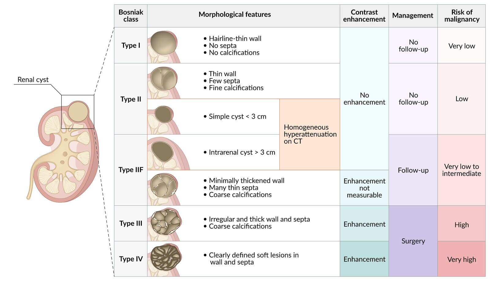
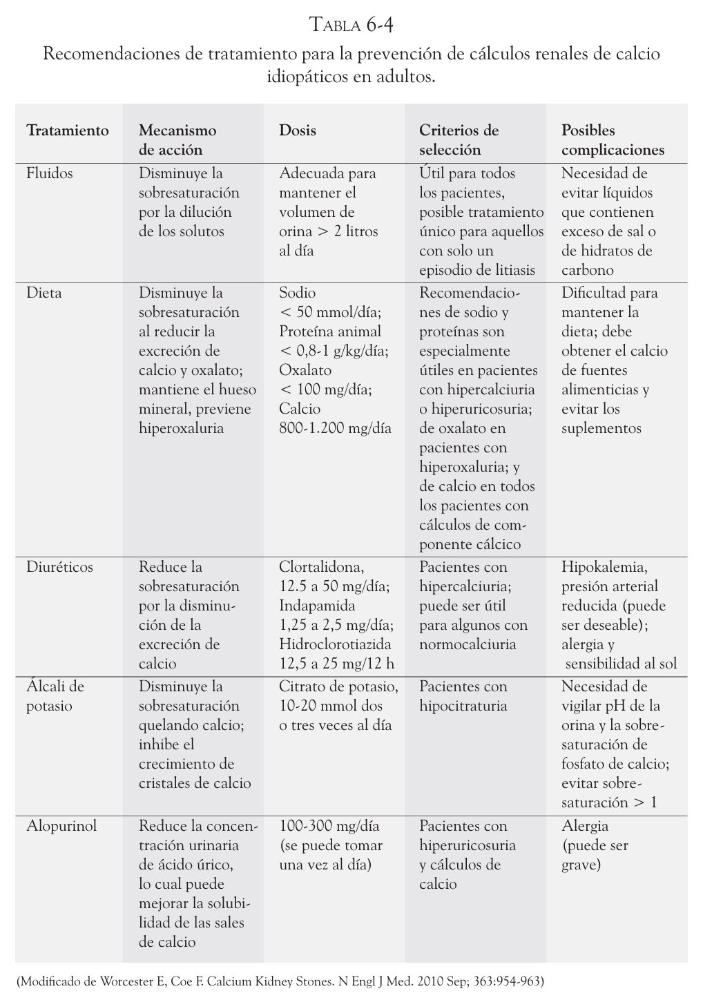

# Quistes renales

Clasificación de bosniak para quistes renales

| Findings |	Next steps|
|---|---|
| Bosniak I and II cystic mass | Follow-up is usually not required, see also “Renal cysts.” [13]|
| Bosniak IIF cystic mass | Repeat imaging at 6 and 12 months, then yearly for a total of 5 years.  Refer to urology if there is any change in appearance or > 3 mm growth per year.|
| Bosniak III or IV cystic mass  Solid mass > 1 cm with no fat | Obtain CBC, BMP, and urinalysis.  Refer to urology for consideration of further investigations (e.g., staging, biopsy).|

# Tumores renales

## Tratamiento
Quirúrgico!

Lo siguiente se aplica a los pacientes con masas renales sólidas o quistes renales con clasificación de Bosniak III o IV. 

Nefrectomía parcial: Sólo se extirpan la masa y parte del tejido renal circundante; el resto del riñón se conserva.

- Indicaciones absolutas: pacientes con una masa renal T1a (confinada en riñón y < 4 cm), monorreno, masas bilaterales, CCR familiar, enfermedad renal crónica preexistente o proteinuria.
- Indicaciones relativas: pacientes jóvenes y/o con mayor esperanza de vida, masas multifocales o comorbilidades que repercuten en la función renal 

Nefrectomía radical: Extirpación de todo el riñón junto con la glándula suprarrenal y la grasa perinéfrica circundante, con o sin disección de los ganglios linfáticos

- Preferida en pacientes con mayor riesgo oncológico. Si >7cm es T2, sí o sí Nefrectomía radical. < 7 cm podría ser parcial

Radio y quimioterapia no tienen buena respuesta. Existen terapias dirigidas e inmunoterapia. Terapias de ablación sin mucha evidencia

# Trauma genitourinario
|  | **Vía urinaria alta** | **Vía urinaria baja**| **Genitales externos**                  |
|----------------------------------|-----------------------------------------------------|--------------------------------------------------------------------------|-----------------------------------------|
| **Indicaciones para el estudio**       | <ul><li>Trauma penetrante o cerrado lumbar o flanco</li><li>Trauma por desaceleración</li><li>Hematuria macro o microscópica</li></ul> | <ul><li>Trauma penetrante o cerrado de pelvis, abdomen bajo o periné</li><li>Sangre en el meato uretral o uretrorragia</li><li>Dificultad en instalación de sonda vesical</li></ul> | <ul><li>Hematoma o aumento de volumen escrotal</li></ul> |
| **Evaluación diagnóstica**| <ul><li>TAC</li><li>Pielografía</li><li>UPR</li><li>Arteriografía</li><li>Cintigrafía renal</li></ul> | <ul><li>Uretrografía</li><li>Cistografía</li><li>Cistotac</li></ul> | <ul><li>Ecotomografía escrotal</li><li>RM testicular</li></ul> |

## Trauma renal

- Considerar la posibilidad de trauma renal en todo paciente politraumatizado con o sin presencia de hematuria.
- De acuerdo a su etiología es útil clasificarlos en traumatismos cerrados y abiertos.
- La etapificación es fundamental para decidir el manejo y la tomografía axial computarizada de abdomen y pelvis es el examen de elección.
- La mayoría de los traumatismos cerrados, y en casos seleccionados de traumatismos penetrantes, se pueden tratar en forma conservadora con reposo y monitorización.
- La indicación de exploración quirúrgica más habitual es la inestabilidad hemodinámica por hemorragia activa y la presencia de lesiones asociadas de otros órganos.
- El pronóstico del traumatismo renal suele ser bueno si se detectan y tratan oportunamente las complicaciones. En la gran mayoría de los casos se puede conservar el riñón afectado y las complicaciones a largo plazo son poco habituales

Trauma ureteral por lo general es iatrogénico y requiere resolución qx

# Urolitiasis

Clasificación 

| Localización | Composición | Tamaño |
|---|---|---|
| Litiasis renal | Cálculos de Calcio: <li>oxalato <li>fosfato | < 5 mm |
| Litiasis ureteral:  <li> Ureter alto <li> Ureter medio <li> Uréter bajo | Cálculos de Ácido úrico | 5–10 mm |
| Litiasis vesical | Cálculos de Estruvita | > 10 mm |
| Litiasis uretral | Cálculos de Cistina |  |
| | Cálculos de otra composición |  |

<table class="api table-wrapper-wide" data-table="ZCUzRSUyMCUzQy90ciUzRSUwQSUzQy90Ym9keSUzRSUwQSUzQy90YWJsZSUzRQ==76555">
<thead>
<tr>
<th colspan="2" rowspan="4" scope="row">
Types</th> <th rowspan="4" scope="col">
<a data-phrasegroup-id="U-bb9w" class="api tooltip__link" data-type="link" data-anker="Za75cae58612d57021fbad9a9bc842614" data-learningcard-id="Js0sDh" data-lxid="Js0sDh" data-section-id="9fWNok0" data-sxid="9fWNok0" data-title="UG9wdWxhdGlvbiBoZWFsdGgg4oaSIE1lYXN1cmVzIG9mIGRpc2Vhc2UgZnJlcXVlbmN5" id="Leab2685af5ef2e1318976759a581c045" data-source="Leab2685af5ef2e1318976759a581c045" href="/us/article/Js0sDh#IlphNzVjYWU1ODYxMmQ1NzAyMWZiYWQ5YTliYzg0MjYxNCI=">Incidence</a></th> <th colspan="1" rowspan="4" scope="col">
Etiology/associated findings</th> <th colspan="1" rowspan="4" scope="col">
Urine 
pH</th> </tr>
<tr>
<th scope="col">
Crystal appearance</th> <th scope="col">
<a data-phrasegroup-id="LmXwTA" class="api tooltip__link" data-type="link" data-anker="Z38b5214650ea7894642910ee008bd67c" data-learningcard-id="in0JGg" data-lxid="in0JGg" data-section-id="xjXEcy" data-sxid="xjXEcy" data-title="UmFkaW9ncmFwaHkg4oaSIFRlY2huaWNhbCBiYWNrZ3JvdW5k" id="L9ddc8af4374b5a5fec9178c117ff41fb" data-source="L9ddc8af4374b5a5fec9178c117ff41fb" href="/us/article/in0JGg#IlozOGI1MjE0NjUwZWE3ODk0NjQyOTEwZWUwMDhiZDY3YyI=">Radiopacity</a></th> </tr>
</thead>
<tbody>
<tr>
<th colspan="2" rowspan="1" scope="row"> 

<a data-phrasegroup-id="aG0QBh" class="api tooltip__link link--same-article" data-type="link" data-anker="Z74835c2b27494a0eb1f69d48deccd36c" data-learningcard-id="qg0Cw2" data-lxid="qg0Cw2" data-section-id="UG0bAh" data-sxid="UG0bAh" data-title="TmVwaHJvbGl0aGlhc2lzIOKGkiBDbGFzc2lmaWNhdGlvbg==" id="L7b3c9ae19adc924727530ea1a72ce5be" data-source="L7b3c9ae19adc924727530ea1a72ce5be" href="/us/article/qg0Cw2#Ilo3NDgzNWMyYjI3NDk0YTBlYjFmNjlkNDhkZWNjZDM2YyI=">
Calcium oxalate stones</a>
 </th> <td rowspan="1"> <ul>
<li>

∼ 
75%</li> </ul>
</td> <td rowspan="1"> <ul>
<li>

<a data-phrasegroup-id="ImXYSA" class="api tooltip__link link--same-article" data-type="link" data-anker="Z10752c85ab371579e5744ecce8b8dfc0" data-learningcard-id="qg0Cw2" data-lxid="qg0Cw2" data-section-id="UG0bAh" data-sxid="UG0bAh" data-title="TmVwaHJvbGl0aGlhc2lzIOKGkiBDbGFzc2lmaWNhdGlvbg==" id="Le1b85f394f0a8039f9f7735e7bdaaaeb" data-source="Le1b85f394f0a8039f9f7735e7bdaaaeb" href="/us/article/qg0Cw2#IloxMDc1MmM4NWFiMzcxNTc5ZTU3NDRlY2NlOGI4ZGZjMCI=">Hypercalciuria</a> </li> <li>

<a data-phrasegroup-id="3LXSxA" class="api tooltip__link link--same-article" data-type="link" data-anker="Z639a2be446354fb9138a45e6a22b5898" data-learningcard-id="qg0Cw2" data-lxid="qg0Cw2" data-section-id="UG0bAh" data-sxid="UG0bAh" data-title="TmVwaHJvbGl0aGlhc2lzIOKGkiBDbGFzc2lmaWNhdGlvbg==" id="L72fd47603ce8f2242ef88f000bdae86d" data-source="L72fd47603ce8f2242ef88f000bdae86d" href="/us/article/qg0Cw2#Ilo2MzlhMmJlNDQ2MzU0ZmI5MTM4YTQ1ZTZhMjJiNTg5OCI=">Hyperoxaluria</a></li> <li>

<a data-phrasegroup-id="iLXJxA" class="api tooltip__link link--same-article" data-type="link" data-anker="Z27914085a008b0bc3d06e48f4062a59f" data-learningcard-id="qg0Cw2" data-lxid="qg0Cw2" data-section-id="UG0bAh" data-sxid="UG0bAh" data-title="TmVwaHJvbGl0aGlhc2lzIOKGkiBDbGFzc2lmaWNhdGlvbg==" id="L497274c5e37bdb506d6edd3f371afa93" data-source="L497274c5e37bdb506d6edd3f371afa93" href="/us/article/qg0Cw2#IloyNzkxNDA4NWEwMDhiMGJjM2QwNmU0OGY0MDYyYTU5ZiI=">Hypocitraturia</a></li> <li>Can result from increased intake of <ul>
<li>
<a data-phrasegroup-id="KyYUT7" class="api tooltip__link" data-type="link" data-anker="Z46e0abe90fac609cc46c2ce73c4059c8" data-learningcard-id="KF0UQ3" data-lxid="KF0UQ3" data-section-id="ntW7VM0" data-sxid="ntW7VM0" data-title="VG94aWMgYWxjb2hvbCBwb2lzb25pbmcg4oaSIEV0aHlsZW5lIGdseWNvbCBwb2lzb25pbmc=" id="La3f36aa1c94c2772108bb8a8fac18ad4" data-source="La3f36aa1c94c2772108bb8a8fac18ad4" href="/us/article/KF0UQ3#Ilo0NmUwYWJlOTBmYWM2MDljYzQ2YzJjZTczYzQwNTljOCI=">Ethylene glycol</a> (antifreeze)</li> <li>

<a data-phrasegroup-id="znbrD8" class="api tooltip__link" data-type="link" data-anker="Za589ef9f8af9b30dd33130d2a398683e" data-learningcard-id="Ao0ReS" data-lxid="Ao0ReS" data-section-id="npc7JW0" data-sxid="npc7JW0" data-title="Vml0YW1pbnMg4oaSIFZpdGFtaW4gQyAoYXNjb3JiaWMgYWNpZCk=" id="L7c0167ed71f4bc09e73d218657c066c6" data-source="L7c0167ed71f4bc09e73d218657c066c6" href="/us/article/Ao0ReS#IlphNTg5ZWY5ZjhhZjliMzBkZDMzMTMwZDJhMzk4NjgzZSI=">Vitamin C</a></li> </ul>
</li> <li>Associated with <a data-phrasegroup-id="Wj0Pzf" class="api tooltip__link" data-type="link" data-anker="Z4272f924349255b3e4babe86d4e939c9" data-learningcard-id="VS0GA2" data-lxid="VS0GA2" data-section-id="Ow0IQR" data-sxid="Ow0IQR" data-title="Q3JvaG4gZGlzZWFzZQ==" id="Lbbb7a2c26114cd475bb1817128f27b82" data-source="Lbbb7a2c26114cd475bb1817128f27b82" href="/us/article/VS0GA2#Ilo0MjcyZjkyNDM0OTI1NWIzZTRiYWJlODZkNGU5MzljOSI=">inflammatory bowel disease</a>, i.e., <a data-phrasegroup-id="r40fkT" class="api tooltip__link" data-type="link" data-anker="Zbb0aec0a5fe14ad0aae10a9341c457fc" data-learningcard-id="eS0xA2" data-lxid="eS0xA2" data-title="VWxjZXJhdGl2ZSBjb2xpdGlz" id="Lfd1b94a9d565079bb2189aedbbbd9491" data-source="Lfd1b94a9d565079bb2189aedbbbd9491" href="/us/article/eS0xA2#IlpiYjBhZWMwYTVmZTE0YWQwYWFlMTBhOTM0MWM0NTdmYyI=">ulcerative colitis</a> and 

<a data-phrasegroup-id="I40YkT" class="api tooltip__link" data-type="link" data-anker="Zef70853af5e87c95d210bf8df682f64c" data-learningcard-id="VS0GA2" data-lxid="VS0GA2" data-title="Q3JvaG4gZGlzZWFzZQ==" id="Lb7aea2788ffece968dd25bc94ba238f4" data-source="Lb7aea2788ffece968dd25bc94ba238f4" href="/us/article/VS0GA2#IlplZjcwODUzYWY1ZTg3Yzk1ZDIxMGJmOGRmNjgyZjY0YyI=">Crohn disease</a> due to <a data-phrasegroup-id="n407PT" class="api tooltip__link" data-type="link" data-anker="Zae07822252537d684eeec3f2d4ba9adb" data-learningcard-id="0S0ey2" data-lxid="0S0ey2" data-title="TWFsYWJzb3JwdGlvbg==" id="Ld3ed922b5db8150c65a7679d8a847c6a" data-source="Ld3ed922b5db8150c65a7679d8a847c6a" href="/us/article/0S0ey2#IlphZTA3ODIyMjUyNTM3ZDY4NGVlZWMzZjJkNGJhOWFkYiI=">malabsorption</a> </li> </ul>
</td> <td rowspan="1"> <ul>
<li>Varies 

 [2]
</li> </ul>
</td> <td> <ul>
<li>

Biconcave dumbbells

 
or 

bipyramidal envelopes 

 
<span class="api extraExplanation" data-type="bonus" data-content="PHNwYW4gY2xhc3M9ImFwaSIgZGF0YS10eXBlPSJpbWFnZSIgZGF0YS1zb3VyY2U9Imh0dHBzOi8vbWVkaWEtdXMubWJzY2YuY29tL21lZGlhL3RodW1icy9iaWdfNjM1MjkwN2Q3Mzk4ZjEuNDU4MTE5NzguanBnIiBkYXRhLWdhbGxlcnktaWQ9IlVHMGJBaCIgZGF0YS1pbWFnZS1pbmRleD0iMCIgZGF0YS1pbWFnZS1pZD0iTXdZTWpyIiBkYXRhLW92ZXJsYXk9Imh0dHBzOi8vbWVkaWEtdXMubWJzY2YuY29tL21lZGlhL292ZXJsYXlzLzYyYWFkNjZlNzM5NDg5LjI3NjU5NjkwLnN2ZyIgZGF0YS10aXRsZT0iUTJGc1kybDFiU0J2ZUdGc1lYUmxJR055ZVhOMFlXeHpJR2x1SUhWeWFXNWwiIGRhdGEtZGVzY3JpcHRpb249IlBIQStVR2h2ZEc5dGFXTnliMmR5WVhCb0lHOW1JR0VnZFhKcGJtVWdjMkZ0Y0d4bElDaDFjbWx1WlNCelpXUnBiV1Z1ZENCM1pYUWdiVzkxYm5Rc0lHbHVkR1Z5YldWa2FXRjBaU0J0WVdkdWFXWnBZMkYwYVc5dUtUd3ZjRDRLUEhBK1RYVnNkR2x3YkdVZ1pXNTJaV3h2Y0dVdGMyaGhjR1ZrSUdOeWVYTjBZV3h6SUdOaGJpQmlaU0J6WldWdUlDaGpaaTRnYVd4c2RYTjBjbUYwYVc5dU95QmxlR0Z0Y0d4bGN5QnBibVJwWTJGMFpXUWdZbmtnZVdWc2JHOTNJRzkyWlhKc1lYa3BJSFJvY205MVoyaHZkWFFnZEdobElITmhiWEJzWlM0Z1ZHaGxjMlVnWVhKbElHTnZiWEJ2YzJWa0lHOW1JR05oYkdOcGRXMGdiM2hoYkdGMFpTQmthV2g1WkhKaGRHVWdZVzVrSUdoaGRtVWdZVzRnYjJOMFlXaGxaSEpoYkNCemRISjFZM1IxY21VdVBDOXdQZz09IiBkYXRhLWNvcHlyaWdodD0iVTI5MWNtTmxPaUFpUEdFZ2RHRnlaMlYwUFNKZllteGhibXNpSUhKbGJEMGlibTl2Y0dWdVpYSWdibTl5WldabGNuSmxjaUlnYUhKbFpqMGlhSFIwY0hNNkx5OTNkM2N1Ym1GellTNW5iM1l2WTJWdWRHVnljeTl0WVhKemFHRnNiQzl1WlhkekwySmhZMnRuY205MWJtUXZabUZqZEhNdmNtVnVZV3d1YUhSdGJDSStWR2hsSUcxcFkzSnZaM0poY0dnZ2MyaHZkM01nWTJGc1kybDFiU0J2ZUdGc1lYUmxJR055ZVhOMFlXeHpJR2x1SUhWeWFXNWxMaUJVYUdWelpTQnpiV0ZzYkNCamNubHpkR0ZzY3lCallXNGdaR1YyWld4dmNDQjBieUJtYjNKdElISmxibUZzSUhOMGIyNWxjeTRnS0U1QlUwRXBQQzloUGlJc0lFNUJVMEV2U2xORExDQThZU0IwWVhKblpYUTlJbDlpYkdGdWF5SWdjbVZzUFNKdWIyOXdaVzVsY2lCdWIzSmxabVZ5Y21WeUlpQm9jbVZtUFNKb2RIUndjem92TDNkM2R5NXVZWE5oTG1kdmRpOWpaVzUwWlhKekwyMWhjbk5vWVd4c0wyNWxkM012WW1GamEyZHliM1Z1WkM5bVlXTjBjeTl5Wlc1aGJDNW9kRzFzSWo1T1FWTkJQQzloUGlCc2FXTmxibk5sWkNCMWJtUmxjaUJRZFdKc2FXTWdSRzl0WVdsdUlFWjFjblJvWlhJZ2JtOTBaWE02SUU1QlUwRWdRME02SUdoMGRIQnpPaTh2ZDNkM0xtNWhjMkV1WjI5MkwyMTFiSFJwYldWa2FXRXZaM1ZwWkdWc2FXNWxjeTlwYm1SbGVDNW9kRzFzIj48aW1nIHNyYz0iZGF0YTppbWFnZS9qcGVnO2Jhc2U2NCwvOWovNEFBUVNrWkpSZ0FCQVFFQkxBRXNBQUQvMndCREFBVURCQVFFQXdVRUJBUUZCUVVHQnd3SUJ3Y0hCdzhMQ3drTUVROFNFaEVQRVJFVEZod1hFeFFhRlJFUkdDRVlHaDBkSHg4ZkV4Y2lKQ0llSkJ3ZUh4Ny8yd0JEQVFVRkJRY0dCdzRJQ0E0ZUZCRVVIaDRlSGg0ZUhoNGVIaDRlSGg0ZUhoNGVIaDRlSGg0ZUhoNGVIaDRlSGg0ZUhoNGVIaDRlSGg0ZUhoNGVIaDRlSGg3L3dBQVJDQUJVQUZRREFTSUFBaEVCQXhFQi84UUFHd0FBQWdNQkFRRUFBQUFBQUFBQUFBQUFBQVFDQXdVQkJnZi94QUExRUFBQ0FRTUNCUUlEQndRQ0F3QUFBQUFCQWdNQUJCRVNJUVVUTVVGUkltRXljWUVHRkNOQ2tjSFJvYkhoOEdMeEIxSnkvOFFBR3dFQUF3RUJBUUVCQUFBQUFBQUFBQUFBQWdNRUFBRUZCZ2YveEFBcUVRQUNBZ0lDQVFJRENRQUFBQUFBQUFBQkFnQVJBeUVTTVFSQlVRV0JrUk1pSXpKaGNaS3gwZi9hQUF3REFRQUNFUU1SQUQ4QTl1azB5M096cXNZVDhvd2V1MUkvYXJuMzNCcDdTMmphNGtrTVlralYxUm1UV3BZQmp0a2hTQVQ5YVlVb01FZ0tjQW52a2VSVlFQTVFtTnl2cVlFc200UFR2MDc0ODE5QXRkbWZqNkRpd2IybVBtT2Y3UlhuRStFZlpZY0FnbnRVVGtDVmZ4Sm1kbmtmS2txUnNvQnd2VTdVeEhjcGFXMFJ2WnhieVRBWTBuSHI3bkk5Z1R2VFpjbThpZ2dsajBqMFRJTWFpTUhCL2FzempOcGFYQzNzdkVicmlDUEZDcHNGdFVLNno4VEJtUG9aeVRwQ3NNWStkVzRuVEdvUnV2cVpXRysyZjcycHVDNFVFRmlHM0JYZmJIZkJvaHVKR2VWM2tHbGdDaTl3Y2I1OFZtOFBudFpSTFkyckV6V1dtTzZRcVFFZkdyVG5BOGc3ZWF2aTFnR01nQWhzSFBRYjRCQkhiM3JIMWlTbEdqTFlZNUk3MmFZOFF1SlliZ0RSRTR5a0pBSHducmo1MWJMT0pYTWJtVTl3U01xTUFZQXg5T3U5VnhLZVkwWWJKVUFsV2M5RG5CSGJiKzFCVmxRc3pPL1FFdHNDUE5JeVpiTm51Y0lscXZKRTJoSE1USXY1YzVKSC9Ic1A2MTAzVXhaanJqSURES0FET0Qwd2ZIOENsc1l5TVlCMklRWU9mWS9xUHJTazF6RUloTnJkYmRHR3BzWkliT01aeG54U3dPV2hBS1hHYnFTQ1dkbmtMVE1lckxKZ0QyL3pSWGpPTDhjKzJFWEVyaUt3NEZieVdxT1JISklRQzQ2NTJvcjBrOEFsUWJYK1EvMk9YeEdJR3g5UlBaWGw5YjhQdC92VjN6RWlqWUhISVppQjB6aGUzWHIwcU5weE8wNGpiUTNkcmNSeVIzU2t4T0dDbGh2MEIzUHlxSjBUUk5HUVFOQlFubzJENDc0eldCeFN3dkpPSzhOdmVIU0NNQjBqdVhkc2hVUTVHM2NsaTIveUdNWXFMeHNDWk5NYVB2NlFzZU5XMGRHZW5RS2tqM0M2Y3ZzMy9zZHR2MDhiMXk5Kzl5MlRMRklZNW5IcmwwbFRFbmRoanErK3c2WjZpbDdLNnRtRVlOenBra2pLeG9RVWtDL205SjNYZkhiYlBnMTIyalpCQ1ZhZUs0TTdOY0hPcTNaZGpoZitRQTBnalNkeVdCNlVEZ3FSZmNBS1FkenZENGJ5TVRSWGR3dHpCRzRXMmtZZXZsQlJnTmdBYXRqNXlCdm11VEM3a3ZvV2lrakZzb1l5b0JsbUo2WThmNXBxM0NFR1JzQmp1eElJd1JuYkhqY21xT01YTVZxYzh5QkoyQlpGa0lWV3h1Y2srTWp1UGFqRjhxQTNOWkxScTJJbG15R1VwMDlHTS84QUwzQkhhZ0YwZy9GbGpFaXJoTklPQ093OS93QmpTL0QzVllFWVJCV2ZCL0RPcFNmWSsvOEFpcjVOTWlCbWpabEpHVk9QSTY0N2JkcW5kQnlvOVFEb3hLOXZrZ1dPVGx6VFJTTVZNaUJkTVgvMFNSdDAyNjFDV1VCQVNNcDhPa0QrcHordFpuMjA0RU9NL2Q0MHZIczNoWWtTS01aUTRKQUErUS82cFhnYWNaaDRqTGIzWEprNFpHcUxDNGJNa2pEcnE5cW9HTEdjZk1NTEhwODR6aXBUa0R1YXBMYWlBQXdCd0NTUDNORkx5MlVieXU0UkhESE9TZzhlOUZZQVFJMjhxQ0l5Tk9rRE5HVzFFRENnYjZpQ2NuR0R0VkhDdU1SY1d1NzZ6aGdkR3Q0MWxqNXAwOCtNa2tQakdyVDB3Y2QxNzdWRmJXRzh1WXA0c1RKSXJLRHEyS2tkRDlQYXRQaG5Db0xDS1F3YTNra1JWZWFWOVRoUjBUVmpPa2RobnhpaUpDTlZSb1pWWGZjeDdlM1dIajhVYUdaSithOCtXS3VTdStSbkJPTndENzZmRmVqdDFqTXdTTkhLbE10ZzVHeEhwTy9YUCs3VkNDeXRsa0V5bVRNNDBsOHNNN2s0R2YwcGxWaTFqbHJnakEwTWZpd2ZiWWVNOWRxMmZMenBqQnlaZVVsQTUwODJTSlVPU3dUdjE4RHArMVZPRXVBMERJSkVWZEJXVG9Sam9jN1ZGa1l6cUN6WjA1MUFIb0IwMi8zZXFJN1NSTDU1SlFyeEZWQ0xwS3RxL01TZmZiQTl0K3RZSnE0QUE3a1FBbktXTzJibEJBRGdqRVpIVVo2WS92UytwbTR2SEd0L0dJaGFNNzIzSzliTnJ3SDFlTWJhZXUrYWF1cEkxWG0zVFJqU0d6S1RwV0k5TTVKR0RnNEpwRGg5M0RjUk5MQThjc2dJVm1ST3VOd01ucUJxeU8yK2U5WmhxNm5kMFRHN21VQ1JjNFhmSTIrSCthejJrWnAyaVFvQWZKenAyMjZmMnBpNGtFbWt1UFNENml4M0o2Lzc4cVhoaW5qaUhOZGM1SjZla0tUc01lUlNRZ1haZ0RRaUZ4eFBoc0VwaHVybDFrWGJTaW5BSDFHOUZWOFM0WHc2NnUybnU1SWhNd0dyVWdiUHZSWG9JZkZvY3VWL0tPQXgxdTU2dXdqSHBkeVRra2pUMEs1MzdBZjByazh5eGhTb081em9MZlE1OWhqUDFOV3hPeElHU0ZJQUcyK2V4OXR2TlVjUVM4YUtGclI0NFVEam1aTGN6ZmJZOUFCZ1pQenFFdFJzeEkyZHlOekxPSTBkV2pZNmhyVndjYWUyTzRwcTNtYzJyYlJyTHAxWUxaVS95UDVwY3FOS21aMVZ0UUdBU0Z5UjIrdE1oWTQ1ek5IREU5MmtlTklZQjFCUFlkZzJCN2IwUks4ZHpIMmphZ0dGbFI5UlZNT1U5T3I2SFliOXZlbExubGdGRVp3UnVPeHlPM3o3VklUeFBCSkxiN2tuYmxzQ0FjZEJrNHpTdHhLc25NWUlyTzBlZmh4a2R4K29wbUlFZ2d3QlltTnhTeXU3M2lWbzY4UW10N2VCekxMRkVvSE9iYlRxYndEMjcwekxLelRTVFRTQnAyUUlTaWFjcXA5SXhramJKR1BlcitIdkk5cWp5d3VranFHME1RU08yK05nYWhKYUJTREpsczdESFU5djlOTWRiSS9TTkxtdUo5SXVSSStHZHlUMUlDNUFIc0Q0cTUzQ2hsMk8yL3Z1S1ZhS1FSbzQrQ1hQTGxBSVdUQjN3VHNSMStmYXJVV2R5MGp1Ry9FQlRDNHdOdHY4OXFTM0VpN2drZThyalYxQkJpWW5KOGlpckdpZmIxYmdZT29IdHRSUThwcm00VlJkZ0F2NG1WT0FSOWZQV2lDMml3NEFBVStyMUhJWTVHYTRKUXJxQm9WVCtYb1Q1STg5cXNnYVowQkREVmthdFkyeDdnZE5xQ2lZcXpJeXdJMHcxdGtZd0Z3Q01EdnY5UGxYR3QwZVJaSGkxU0x0OFF5YzUvWFluOXFZUTh3bFFvM1hZRURmci9GVjNFc0tSR2FSbGp4aFZMSEc1UFNpQVk2QW5PWkV5cDdhUXlzWElZc2h3TWRSbm9ma1IvZXE3ZUV6T2JoWlRJVkFITExaWEk2NThWcDhSdDBlTjJBSlBqUGc5dnFLODl4TVR4MzFrMFZyTnhDd3RwbWJpVnJiVEdDY1J0RTJoa09SbGcyQ0FUalkxYXVXMEo5WS9GK0lhdXBzd3ZqSmtLdW9PU1dHUGwvMVhXR3B6aFUxZzVZOU05L0cyTUdzdjdPeWNRbnN1ZmV3UzJ4ZVpqRkhQS0pKb29qblFzaEF3V0dNWitsYURTTzRsamxkaHBiVkdOT0ZLbFFjQW40dCt2aWxNTE9vRHJ4WWlMUTJrZHNUOTJ1Ym8yaVNDVnJacGRVUWNLUUdHbytnYjUwRENrZ0hHMU12cGtiQmM1Mnhqd003ZjBIU2xMYUMzanU1T0ljb3l5VDRFa3JrWlVEZFZQc0NkaHZ1YVpVS3BkbVpza2pQYm9NRFk3NzVxZHNZQk5UanNUMmJrSklwOXRCaUl4K1k0b3FZbldMMHZxWUhkY0xuMGtiZDZLV1ZpN00wcGxIM21FSGNOazQ4RWJiZUtZYU5GdG1kVVVIRytCak8yUDJvb3A5YUVVZXhQbkgvQUlKKzAvR2Z0ZEJ4cTY0emNySnlyNk9PQ0tPTlZTRlNyZWxkczQySFVucFgwT1FEQU9Ca1NFZm9kcUtLcjhsUXVZZ0NYL0ZVVlBKSVVVTmYwSkZQWEVRM1FuT1ByV05ieE1zajNEWEVyOHNDMWpSc2FWUlF6am9NazZpZHlUMW9vcVZoVGo5NHJ4L3l2SEp6eVVsMGdFcmtaWVpKOVdOLzFOV3RFaFVwcFVMeVFjYVJqUFUwVVV4OVBxSmFWRlZSd1FvMlZuRzNmMC96VUZpRTF6RzdNdzBycTBxY0Fra2RmMW9vcFdUdWNXVm1HUFV3SXpoaUJueG1paWlpUGNHNS85az0iIHRpdGxlPSJDYWxjaXVtIG94YWxhdGUgY3J5c3RhbHMgaW4gdXJpbmUiIGRhdGEtbWVkaXVtLXNpemUtdXJsPSJodHRwczovL21lZGlhLXVzLm1ic2NmLmNvbS9tZWRpYS90aHVtYnMvbWVkaXVtXzYzNTI5MDdkNzM5OGYxLjQ1ODExOTc4LmpwZyI+PC9zcGFuPgo=" id="E9b5c12ed636db38393580edc94b976a0">

</li> </ul>
</td> <td rowspan="1"> <ul>
<li>

<a data-phrasegroup-id="LmXwTA" class="api tooltip__link" data-type="link" data-anker="Z38b5214650ea7894642910ee008bd67c" data-learningcard-id="in0JGg" data-lxid="in0JGg" data-section-id="xjXEcy" data-sxid="xjXEcy" data-title="UmFkaW9ncmFwaHkg4oaSIFRlY2huaWNhbCBiYWNrZ3JvdW5k" id="L0ede8d067d9e593d9cf0176b11d7d70b" data-source="L0ede8d067d9e593d9cf0176b11d7d70b" href="/us/article/in0JGg#IlozOGI1MjE0NjUwZWE3ODk0NjQyOTEwZWUwMDhiZDY3YyI=">
Radiopaque</a></li> </ul>
</td> </tr>
<tr>
<th colspan="2" rowspan="1" scope="row">

<a data-phrasegroup-id="bG0HBh" class="api tooltip__link link--same-article" data-type="link" data-anker="Ze89c3f1fa0f7358185397581f7fbcc80" data-learningcard-id="qg0Cw2" data-lxid="qg0Cw2" data-section-id="UG0bAh" data-sxid="UG0bAh" data-title="TmVwaHJvbGl0aGlhc2lzIOKGkiBDbGFzc2lmaWNhdGlvbg==" id="L92054ece840df3685b2520674b5a0e4a" data-source="L92054ece840df3685b2520674b5a0e4a" href="/us/article/qg0Cw2#IlplODljM2YxZmEwZjczNTgxODUzOTc1ODFmN2ZiY2M4MCI=">
Uric acid stones</a></th> <td> <ul>
<li>

∼ 10%</li> </ul>
</td> <td> <ul>
<li>

<a data-phrasegroup-id="uGcpaV0" class="api tooltip__link" data-type="link" data-anker="Z37ad7ac85fa0ad7afcffc8647f8ea9c6" data-learningcard-id="YT0n62" data-lxid="YT0n62" data-section-id="LP0w2T" data-sxid="LP0w2T" data-title="R291dCBhbmQgaHlwZXJ1cmljZW1pYSDihpIgU3VtbWFyeQ==" id="L17487e56ec24dc471b5cf881f01bfcfb" data-source="L17487e56ec24dc471b5cf881f01bfcfb" href="/us/article/YT0n62#IlozN2FkN2FjODVmYTBhZDdhZmNmZmM4NjQ3ZjhlYTljNiI=">
Gout</a>
, 
<a data-phrasegroup-id="19X2mZ0" class="api tooltip__link" data-type="link" data-anker="Z680dc030aea5462f042ba212fc37d0d8" data-learningcard-id="YT0n62" data-lxid="YT0n62" data-section-id="pP0LfT" data-sxid="pP0LfT" data-title="R291dCBhbmQgaHlwZXJ1cmljZW1pYSDihpIgRXRpb2xvZ3k=" id="Lc7e24c0fa37cee0105a4362231089195" data-source="Lc7e24c0fa37cee0105a4362231089195" href="/us/article/YT0n62#Ilo2ODBkYzAzMGFlYTU0NjJmMDQyYmEyMTJmYzM3ZDBkOCI=">
hyperuricemia</a>, and <a data-phrasegroup-id="csXaFz" class="api tooltip__link link--same-article" data-type="link" data-anker="Z4fd94ebb566f0da56fcd2a08263f3772" data-learningcard-id="qg0Cw2" data-lxid="qg0Cw2" data-section-id="UG0bAh" data-sxid="UG0bAh" data-title="TmVwaHJvbGl0aGlhc2lzIOKGkiBDbGFzc2lmaWNhdGlvbg==" id="L840b7240ea92f7ab3b9aa5760011b2b1" data-source="L840b7240ea92f7ab3b9aa5760011b2b1" href="/us/article/qg0Cw2#Ilo0ZmQ5NGViYjU2NmYwZGE1NmZjZDJhMDgyNjNmMzc3MiI=">hyperuricosuria</a></li> <li>

High cell turnover (e.g., <a data-phrasegroup-id="vMbAq8" class="api tooltip__link" data-type="link" data-anker="Zc0da5e32087bb9fdebbaad4515b11425" data-learningcard-id="iT0Jq2" data-lxid="iT0Jq2" data-section-id="Hl0KyT" data-sxid="Hl0KyT" data-title="QWN1dGUgbGV1a2VtaWEg4oaSIFN1bW1hcnk=" id="L5c25e9aaa9f67732b0071d0a0299a397" data-source="L5c25e9aaa9f67732b0071d0a0299a397" href="/us/article/iT0Jq2#IlpjMGRhNWUzMjA4N2JiOWZkZWJiYWFkNDUxNWIxMTQyNSI=">leukemia</a>, <a data-phrasegroup-id="ifbJNG" class="api tooltip__link" data-type="link" data-anker="Z4c7ae79c18cb3c2f3e1fa98185b2d78d" data-learningcard-id="4m03fg" data-lxid="4m03fg" data-title="Q2hlbW90aGVyYXBldXRpYyBhZ2VudHM=" id="L69f0c6c9ec65829fa3600a1dbc65087a" data-source="L69f0c6c9ec65829fa3600a1dbc65087a" href="/us/article/4m03fg#Ilo0YzdhZTc5YzE4Y2IzYzJmM2UxZmE5ODE4NWIyZDc4ZCI=">chemotherapy</a>)</li> </ul>
</td> <td>

↓ Urine pH (acidic)  and volume (often seen in desert climates)
</td> <td> <ul>
<li>

Rounded 

rhomboids
 or 

rosettes 

 
<span class="api extraExplanation" data-type="bonus" data-content="PHNwYW4gY2xhc3M9ImFwaSIgZGF0YS10eXBlPSJpbWFnZSIgZGF0YS1zb3VyY2U9Imh0dHBzOi8vbWVkaWEtdXMubWJzY2YuY29tL21lZGlhL3RodW1icy9iaWdfNjM3NjUyZjhkM2Q0NjIuMDIzOTYzMTcuanBnIiBkYXRhLWdhbGxlcnktaWQ9IlVHMGJBaCIgZGF0YS1pbWFnZS1pbmRleD0iMSIgZGF0YS1pbWFnZS1pZD0iaDlZY01yIiBkYXRhLW92ZXJsYXk9Imh0dHBzOi8vbWVkaWEtdXMubWJzY2YuY29tL21lZGlhL292ZXJsYXlzLzYzNzYzZjQxNTRmYTkxLjIwNjI1ODUyLnN2ZyIgZGF0YS10aXRsZT0iVlhKcFl5QmhZMmxrSUdOeWVYTjBZV3h6IiBkYXRhLWRlc2NyaXB0aW9uPSJQSEErVUdodmRHOXRhV055YjJkeVlYQm9JRzltSUdFZ2RYSnBibVVnYzJGdGNHeGxJSGRwZEdnZ1lTQndTQ0J2WmlBMUlDaHdhR0Z6WlNCamIyNTBjbUZ6ZENCdGFXTnliM05qYjNCNU95Qm9hV2RvSUcxaFoyNXBabWxqWVhScGIyNHBQQzl3UGdvOGNENU5kV3gwYVhCc1pTQmpjbmx6ZEdGc2N5QnZaaUIyWVhKNWFXNW5JSE5wZW1WeklHRnVaQ0J6YUdGd1pYTWdZMkZ1SUdKbElITmxaVzRnS0dKc2RXVWdiM1psY214aGVTa3VQQzl3UGdvOGNENVVhR1ZwY2lCa2FXRnRiMjVrTFhOb1lYQmxaQ0FvY21odmJXSnZhV1FwSUdadmNtMGdhWE1nYjI1bElHOW1JSFJvWlNCamFHRnlZV04wWlhKcGMzUnBZeUJoY0hCbFlYSmhibU5sY3lCdlppQjFjbWxqSUdGamFXUWdZM0o1YzNSaGJITXNJSGRvYVdOb0lHOXViSGtnWm05eWJTQnBiaUIxY21sdVpTQnpZVzF3YkdWeklIZHBkR2dnWVNCd1NDQW1iSFE3SURVdU5TQmhibVFnWVhKbElIUjVjR2xqWVd4c2VTQnpaV1Z1SUdsdUlIQmhkR2xsYm5SeklIZHBkR2dnWjI5MWRDQnZjaUJwYmlCb1pXRnNkR2g1SUdsdVpHbDJhV1IxWVd4eklHOXVJR0VnYUdsbmFDMXdkWEpwYm1VZ1pHbGxkQzRnVlhKcFl5QmhZMmxrSUdOeWVYTjBZV3h6SUcxaGVTQmhiSE52SUdGd2NHVmhjaUJpWVhKeVpXd3RjMmhoY0dWa0lHRnVaQ0J1WldWa2JHVXRjMmhoY0dWa0lDaHViM1FnYzJWbGJpQnBiaUIwYUdseklHbHRZV2RsS1M0OEwzQSsiIGRhdGEtY29weXJpZ2h0PSJVMjkxY21ObE9pRGlnSnc4WVNCMFlYSm5aWFE5SWw5aWJHRnVheUlnY21Wc1BTSnViMjl3Wlc1bGNpQnViM0psWm1WeWNtVnlJaUJvY21WbVBTSm9kSFJ3Y3pvdkwyTnZiVzF2Ym5NdWQybHJhVzFsWkdsaExtOXlaeTkzYVd0cEwwWnBiR1U2VlhKcFkxOWhZMmxrWDJOeWVYTjBZV3h6WHloMWNtbHVaU2xmTFY4bFF6TWxPVU55YVd0ZllYTnBkRjlyY21semRHRnNiR1Z5YVY4b2FXUnlZWElwWHkxZk1ETXVjRzVuSWo1VmNtbGpJR0ZqYVdRZ1kzSjVjM1JoYkhNZ0tIVnlhVzVsS1NBdElNT2NjbWxySUdGemFYUWdhM0pwYzNSaGJHeGxjbWtnS0dsa2NtRnlLU0F0SURBekxuQnVaend2WVQ3aWdKMGdZbmtnUkc5eWRXc2dVMkZzWVc1anhMRXNJRHhoSUhSaGNtZGxkRDBpWDJKc1lXNXJJaUJ5Wld3OUltNXZiM0JsYm1WeUlHNXZjbVZtWlhKeVpYSWlJR2h5WldZOUltaDBkSEJ6T2k4dlkyOXRiVzl1Y3k1M2FXdHBiV1ZrYVdFdWIzSm5MM2RwYTJrdlJtbHNaVHBWY21salgyRmphV1JmWTNKNWMzUmhiSE5mS0hWeWFXNWxLVjh0WHlWRE15VTVRM0pwYTE5aGMybDBYMnR5YVhOMFlXeHNaWEpwWHlocFpISmhjaWxmTFY4d015NXdibWNpUGxkcGEybHRaV1JwWVNCRGIyMXRiMjV6UEM5aFBpd2diR2xqWlc1elpXUWdkVzVrWlhJZ1BHRWdkR0Z5WjJWMFBTSmZZbXhoYm1zaUlISmxiRDBpYm05dmNHVnVaWElnYm05eVpXWmxjbkpsY2lJZ2FISmxaajBpYUhSMGNEb3ZMMk55WldGMGFYWmxZMjl0Ylc5dWN5NXZjbWN2YkdsalpXNXpaWE12WW5rdGMyRXZNeTR3THlJK1EwTWdRbGt0VTBFZ015NHdQQzloUGk0Z1ZHaGxJSE4xY0hCc1pXMWxiblJoY25rZ2FXMWhaMlVnZDJsMGFDQnZkbVZ5YkdGNWN5QnZaaUJ5Wld4bGRtRnVkQ0JoY21WaGN5QjNZWE1nWVdSaGNIUmxaQ0JtY205dElIUm9aU0JwYldGblpTQnRaVzUwYVc5dVpXUWdZV0p2ZG1VZ1lXNWtJR3hwWTJWdWMyVmtJSFZ1WkdWeUlEeGhJSFJoY21kbGREMGlYMkpzWVc1cklpQnlaV3c5SW01dmIzQmxibVZ5SUc1dmNtVm1aWEp5WlhJaUlHaHlaV1k5SW1oMGRIQTZMeTlqY21WaGRHbDJaV052YlcxdmJuTXViM0puTDJ4cFkyVnVjMlZ6TDJKNUxYTmhMek11TUM4aVBrTkRJRUpaTFZOQklETXVNRHd2WVQ0dSI+PGltZyBzcmM9ImRhdGE6aW1hZ2UvanBlZztiYXNlNjQsLzlqLzRBQVFTa1pKUmdBQkFRRUFZQUJnQUFELzJ3QkRBQVVEQkFRRUF3VUVCQVFGQlFVR0J3d0lCd2NIQnc4TEN3a01FUThTRWhFUEVSRVRGaHdYRXhRYUZSRVJHQ0VZR2gwZEh4OGZFeGNpSkNJZUpCd2VIeDcvd0FBTENBQlVBRlFCQVJFQS84UUFHd0FBQWdNQkFRRUFBQUFBQUFBQUFBQUFBQUVDQXdVRUJnZi94QUEzRUFBQkJBRURBZ1FEQmdNSkFBQUFBQUFCQUFJREVRUUZJVEVTUVFZVFVXRVVjWUVpTWxKaWthRVZJMElrTTRLU3NjSFIwdkQvMmdBSUFRRUFBRDhBK3Uwb3RJSUpGN2VvUUNDWEJyZ1NOalhZMGs0Y3BCcHZ1bUcrd0NZQ0syVEFTcmxLdmNxMnFRQWxScXI0VWU5SmdEbEhkRFFqc21CdGFWMlNFS3l4WkZpeDJTcEEzMlNJNzdJUUFsWHNnQTN1RUVLaktFM3cwdnd3RHBnMGxnUGNyd2VUNDJ5TVhJa3g1cUVqSEVFWDAvcUtLK2o5aUVVa3diOWtFYm81dEZIZWtoWTROS21iS2hpbmpna2tBa2srNktWOU9yY0lBcmNyaXpkSTByTm5NK1hwK05OS1JSZTVtNVdodDFGdC9hNmVxdCtMcS8xQ0NCZkJUQUZVa0JzbFhLT0w1VVdONlNTQ1RaV05rdEUrcDVQVnVHaHNZK2xrL3VWMTZUbHVrTDhTZDUrSWlGN243N2Z4RC9RclF1ejdwSHBISkFWeEo2YXMxNktGY2xQcFNydFIrYUNPVU9IcXFjekp4c1BIZGs1ZVJGalFOKzlKSzhNYVBxZGw1UEExN1RKZFBibnV5bkdPWW1Yeld3eUZsRW12dEJ0ZnV1MTdvYzNHanpNSEpqZTV2Mm9abzNCemJyMjVCNElXeHBXWU03RkV2U1dTTkpaS3p1eHc1SC91MUx0YU51NCtxczJBczdlL1pSSU5vQW9Lb1RzZUdtTndjSE42Z1J2N0Q5VC9BTCtpdEFLOHY0aThXc3hzNTJpNkJpSFdkYkkzZ2pOUlFmbW1rNFlCNmNsWlk4T3ZiQms2MTRpeTI2NXJESVh1akwyMWpZaG9tb1l1Qlg0amJpcXZEN21Edy9weitycWEzRWlOazl1a0x0OEp3R1BCa3lTUi9hbitZRzF3M2hwK1o1K3EwOUpjNkR4SkpDMGZ5OHJGODBqODdIQnBQMUQyL3dDVmVoQTU1VmxFRGxSS2pLMTdvM3NZZWw1QkFQb2V5OFQ0Qmt6NHRSeXNITmEyT2FMSmRESkVITUlhV3NOdUZHOStrRUd1Q2JYcHZFdURuYWpwRTJGcCtvZkFUdm9lYUJ2MDl3RC9BRWtqYSt5eWNEK0g2Qmp0MHBtanphUEdHbHhlMytmSE1SeTkwamJkOVhBTHZiTEhOQjFSdmpuaGVLRG8zQjdIRDVqWmZOTWVMSytPUGhjUGUxK0c4UWdXUUREdTRQTmVqT2x2emQ3TDNtazVIbXdlVklHdGxpcHBIcU94WGJwMFhYcmZuQS8zT01XOGZqY1ArbjdyYUFHNnNJc2NvcllwRWMrcXBiQkg1eG1NVWZtbit2cEhWK3FzQTlraTFwa1kvWXVqSjZmeWtnYi9BRC81WEZtYU5wV1hJK1dmQWdNanZ2U01iME9kODNOb242cnlVZmhsdWxhNW02cnArbU14dlBtTEpwWFB0cm9nRytXNnJMbkVFTzJOYzhyYnhjV0dEcWN6N1Q1Q0RKSWVYSHQ5UFFMdjBXTWpIZE83NzB6dXIvRFZOL1lYOVZvaFgwS1VTb2l6ZHRMYU5DeU4vZlpBVVVWWTNURzNaUWVBNEZyaFlPeEhxc0hKWkppeU94YUo2NkVCOVFkcStZVzVFd01qYkczaG9BSDZLWUJPKzZ2cXdsWEtYWklnY3BEbWtpb3YyNDlVTkFGME85cUJhMXhCYzBFdE5peHdWSk5wNVgvLzJRPT0iIHRpdGxlPSJVcmljIGFjaWQgY3J5c3RhbHMiIGRhdGEtbWVkaXVtLXNpemUtdXJsPSJodHRwczovL21lZGlhLXVzLm1ic2NmLmNvbS9tZWRpYS90aHVtYnMvbWVkaXVtXzYzNzY1MmY4ZDNkNDYyLjAyMzk2MzE3LmpwZyI+PC9zcGFuPgo=" id="Ed1b197f444f79079eb9cc36df95c3b84">

 </li> </ul>
</td> <td> <ul>
<li>

<a data-phrasegroup-id="qtXCe-" class="api tooltip__link" data-type="link" data-anker="Z463c11e4db7a682cee67fe0483557680" data-learningcard-id="in0JGg" data-lxid="in0JGg" data-section-id="xjXEcy" data-sxid="xjXEcy" data-title="UmFkaW9ncmFwaHkg4oaSIFRlY2huaWNhbCBiYWNrZ3JvdW5k" id="L477cecc2e5b09a008342744319a3d910" data-source="L477cecc2e5b09a008342744319a3d910" href="/us/article/in0JGg#Ilo0NjNjMTFlNGRiN2E2ODJjZWU2N2ZlMDQ4MzU1NzY4MCI=">
Radiolucent</a></li> </ul>
</td> </tr>
<tr>
<th colspan="2" rowspan="1" scope="row">

<a data-phrasegroup-id="YG0nBh" class="api tooltip__link link--same-article" data-type="link" data-anker="Z3a5667997cc6cc142c3a4ee77bb50147" data-learningcard-id="qg0Cw2" data-lxid="qg0Cw2" data-section-id="UG0bAh" data-sxid="UG0bAh" data-title="TmVwaHJvbGl0aGlhc2lzIOKGkiBDbGFzc2lmaWNhdGlvbg==" id="Lc1f6a69405ce2971e16f1c4fecd62c99" data-source="Lc1f6a69405ce2971e16f1c4fecd62c99" href="/us/article/qg0Cw2#IlozYTU2Njc5OTdjYzZjYzE0MmMzYTRlZTc3YmI1MDE0NyI=">Struvite stones</a></th> <td> <ul>
<li>

∼ 5–10%</li> </ul>
</td> <td> <ul>
<li>

<a data-phrasegroup-id="4ib37t" class="api tooltip__link" data-type="link" data-anker="Zc27d78347d45b1423debf25ad883dd4c" data-learningcard-id="7i04Gf" data-lxid="7i04Gf" data-title="VXJpbmFyeSB0cmFjdCBpbmZlY3Rpb25z" id="L73f8cd550538669974627b3e81c9c64d" data-source="L73f8cd550538669974627b3e81c9c64d" href="/us/article/7i04Gf#IlpjMjdkNzgzNDdkNDViMTQyM2RlYmYyNWFkODgzZGQ0YyI=">UTI</a> with <a data-phrasegroup-id="Ht1KUi0" class="api tooltip__link" data-type="link" data-anker="Z811903f43f8d4c5639d02f2f363a44eb" data-learningcard-id="In0Yug" data-lxid="In0Yug" data-section-id="mYcVpa0" data-sxid="mYcVpa0" data-title="R2VuZXJhbCBiYWN0ZXJpb2xvZ3kg4oaSIERpc3Rpbmd1aXNoaW5nIGNoYXJhY3RlcmlzdGljcw==" id="L77a3d138eff6c8c232de34d5a8208c3c" data-source="L77a3d138eff6c8c232de34d5a8208c3c" href="/us/article/In0Yug#Ilo4MTE5MDNmNDNmOGQ0YzU2MzlkMDJmMmYzNjNhNDRlYiI=">urease-producing bacteria</a> (e.g., 

<a data-phrasegroup-id="AjYR16" class="api tooltip__link" data-type="link" data-anker="Z222a18202acdc6f9bee06f87e41d5049" data-learningcard-id="Sn0ysg" data-lxid="Sn0ysg" data-section-id="G0cBha0" data-sxid="G0cBha0" data-title="QmFjdGVyaWEgb3ZlcnZpZXcg4oaSIEdyYW0tbmVnYXRpdmUgYmFjaWxsaQ==" id="Ld0fcf7a9f99af1f0e1adc5ffd01c4127" data-source="Ld0fcf7a9f99af1f0e1adc5ffd01c4127" href="/us/article/Sn0ysg#IloyMjJhMTgyMDJhY2RjNmY5YmVlMDZmODdlNDFkNTA0OSI=">Proteus mirabilis</a>, 

<a data-phrasegroup-id="tQYXBK" class="api tooltip__link" data-type="link" data-anker="Z646c19d73cd010cf6cfbd90312bc86ae" data-learningcard-id="Sn0ysg" data-lxid="Sn0ysg" data-section-id="r0cfha0" data-sxid="r0cfha0" data-title="QmFjdGVyaWEgb3ZlcnZpZXcg4oaSIEdyYW0tcG9zaXRpdmUgY29jY2k=" id="L2c195a2fcf30c47071c04872f9db36e8" data-source="L2c195a2fcf30c47071c04872f9db36e8" href="/us/article/Sn0ysg#Ilo2NDZjMTlkNzNjZDAxMGNmNmNmYmQ5MDMxMmJjODZhZSI=">S. saprophyticus</a>, 
<a data-phrasegroup-id="ujYpX6" class="api tooltip__link" data-type="link" data-anker="Z9fc127db884f1911ee0b2de94927ced0" data-learningcard-id="Sn0ysg" data-lxid="Sn0ysg" data-section-id="G0cBha0" data-sxid="G0cBha0" data-title="QmFjdGVyaWEgb3ZlcnZpZXcg4oaSIEdyYW0tbmVnYXRpdmUgYmFjaWxsaQ==" id="L7c3d38c2ff33e005cb4c019538f71e27" data-source="L7c3d38c2ff33e005cb4c019538f71e27" href="/us/article/Sn0ysg#Ilo5ZmMxMjdkYjg4NGYxOTExZWUwYjJkZTk0OTI3Y2VkMCI=">Klebsiella</a>)</li> </ul>
</td> <td> 
↑ Urine pH (alkaline)
</td> <td> <ul>
<li>

Rectangular prisms (

coffin 

lid-appearance
) 
 
<span class="api extraExplanation" data-type="bonus" data-content="PHNwYW4gY2xhc3M9InN0ZXAtMS1pbXBwYWN0MiB1c21sZS1ncy1pbXBwYWN0MiBzdGVwLTEtY29uZGVuc2VkIj48c3BhbiBjbGFzcz0iYXBpIiBkYXRhLXR5cGU9ImltYWdlIiBkYXRhLXNvdXJjZT0iaHR0cHM6Ly9tZWRpYS11cy5tYnNjZi5jb20vbWVkaWEvdGh1bWJzL2JpZ182MjZkNTljODhhZDkyMy4wMjk1ODYyMy5qcGciIGRhdGEtZ2FsbGVyeS1pZD0iVUcwYkFoIiBkYXRhLWltYWdlLWluZGV4PSIyIiBkYXRhLWltYWdlLWlkPSJwZWJMLXMiIGRhdGEtb3ZlcmxheT0iaHR0cHM6Ly9tZWRpYS11cy5tYnNjZi5jb20vbWVkaWEvb3ZlcmxheXMvNWI5ZjkyMTcwYjZlMS5zdmciIGRhdGEtdGl0bGU9IlUzUnlkWFpwZEdVZ1kzSjVjM1JoYkhNPSIgZGF0YS1kZXNjcmlwdGlvbj0iUEhBK1VHaHZkRzl0YVdOeWIyZHlZWEJvSUc5bUlHRWdZMkZ1YVc1bElIVnlhVzVsSUhOaGJYQnNaVHd2Y0Q0S1BIQStVMkZ0Y0d4bElITm9iM2R6SUdOc1pXRnlMQ0JsZFdobFpISmhiQ3dnY21WamRHRnVaM1ZzWVhJZ2NISnBjMjBnWTNKNWMzUmhiSE1nS0hOMGNuVjJhWFJsSUdOeWVYTjBZV3h6SUhkcGRHZ2dkR2hsYVhJZ1kyaGhjbUZqZEdWeWFYTjBhV01nWTI5bVptbHVMV3hwWkNCaGNIQmxZWEpoYm1ObElDaGpaaTRnYVd4c2RYTjBjbUYwYVc5dUtUc2daWGhoYlhCc1pYTWdhVzVrYVdOaGRHVmtJR0o1SUdkeVpXVnVJRzkyWlhKc1lYa3BJR052YlhCdmMyVmtJRzltSUcxaFoyNWxjMmwxYlN3Z1lXMXRiMjVwZFcwc0lHRnVaQ0J3YUc5emNHaGhkR1V1SUVsdUlHaDFiV0Z1Y3l3Z2MzUnlkWFpwZEdVZ1kzSjVjM1JoYkhNZ1lYSmxJRzl1YkhrZ2MyVmxiaUJwYmlCMWNIQmxjaUIxY21sdVlYSjVJSFJ5WVdOMElHbHVabVZqZEdsdmJuTWdZMkYxYzJWa0lHSjVJSFZ5WldGelpTMXdjbTlrZFdOcGJtY2diM0puWVc1cGMyMXpJQ2hsTG1jdUxDQlFjbTkwWlhWeklHOXlJRXRzWldKemFXVnNiR0VnYzNCbFkybGxjeWt1UEM5d1BnPT0iIGRhdGEtY29weXJpZ2h0PSJVMjkxY21ObE9pRGlnSnc4WVNCMFlYSm5aWFE5SWw5aWJHRnVheUlnY21Wc1BTSnViMjl3Wlc1bGNpQnViM0psWm1WeWNtVnlJaUJvY21WbVBTSm9kSFJ3Y3pvdkwyUmxMbTB1ZDJscmFYQmxaR2xoTG05eVp5OTNhV3RwTDBSaGRHVnBPbE4wY25WMmFYUmxYMk55ZVhOMFlXeHpYMlJ2WjE5M2FYUm9YM05qWVd4bFh6RXVTbEJISWo1VGRISjFkbWwwWlNCamNubHpkR0ZzY3lCa2IyY2dkMmwwYUNCelkyRnNaU0F4UEM5aFB1S0FuU0JpZVNCS2IyVnNJRTFwYkd4ekxDQThZU0IwWVhKblpYUTlJbDlpYkdGdWF5SWdjbVZzUFNKdWIyOXdaVzVsY2lCdWIzSmxabVZ5Y21WeUlpQm9jbVZtUFNKb2RIUndjem92TDJSbExtMHVkMmxyYVhCbFpHbGhMbTl5Wnk5M2FXdHBMMFJoZEdWcE9sTjBjblYyYVhSbFgyTnllWE4wWVd4elgyUnZaMTkzYVhSb1gzTmpZV3hsWHpFdVNsQkhJajVYYVd0cGJXVmthV0VnUm05MWJtUmhkR2x2Ymp3dllUNHNJR3hwWTJWdWMyVmtJSFZ1WkdWeUlEeGhJSFJoY21kbGREMGlYMkpzWVc1cklpQnlaV3c5SW01dmIzQmxibVZ5SUc1dmNtVm1aWEp5WlhJaUlHaHlaV1k5SW1oMGRIQTZMeTlqY21WaGRHbDJaV052YlcxdmJuTXViM0puTDJ4cFkyVnVjMlZ6TDJKNUxYTmhMek11TUM4aVBrTkRJRUpaTFZOQklETXVNRHd2WVQ0dUlGUm9aU0J6ZFhCd2JHVnRaVzUwWVhKNUlHbHRZV2RsSUhkcGRHZ2diM1psY214aGVYTWdiMllnY21Wc1pYWmhiblFnWVhKbFlYTWdkMkZ6SUdGa1lYQjBaV1FnWm5KdmJTQjBhR1VnYVcxaFoyVWdiV1Z1ZEdsdmJtVmtJR0ZpYjNabElHRnVaQ0JzYVdObGJuTmxaQ0IxYm1SbGNpQThZU0IwWVhKblpYUTlJbDlpYkdGdWF5SWdjbVZzUFNKdWIyOXdaVzVsY2lCdWIzSmxabVZ5Y21WeUlpQm9jbVZtUFNKb2RIUndPaTh2WTNKbFlYUnBkbVZqYjIxdGIyNXpMbTl5Wnk5c2FXTmxibk5sY3k5aWVTMXpZUzh6TGpBdklqNURReUJDV1MxVFFTQXpMakE4TDJFK0xnPT0iPjxpbWcgc3JjPSJkYXRhOmltYWdlL2pwZWc7YmFzZTY0LC85ai80QUFRU2taSlJnQUJBUUVBU0FCSUFBRC8yd0JEQUFVREJBUUVBd1VFQkFRRkJRVUdCd3dJQndjSEJ3OExDd2tNRVE4U0VoRVBFUkVURmh3WEV4UWFGUkVSR0NFWUdoMGRIeDhmRXhjaUpDSWVKQndlSHg3LzJ3QkRBUVVGQlFjR0J3NElDQTRlRkJFVUhoNGVIaDRlSGg0ZUhoNGVIaDRlSGg0ZUhoNGVIaDRlSGg0ZUhoNGVIaDRlSGg0ZUhoNGVIaDRlSGg0ZUhoNGVIaDcvd0FBUkNBQlVBRlFEQVNJQUFoRUJBeEVCLzhRQUd3QUFBd0VCQVFFQkFBQUFBQUFBQUFBQUFBRURBZ1FGQmdqL3hBQTBFQUFDQVFNREFnUURCZ1lEQUFBQUFBQUJBZ01BRVNFRUVqRWlRUVZSWVhFVE1vRUdJNUdoc2RFVUpGTEI0ZkFWUW9QL3hBQVhBUUVCQVFFQUFBQUFBQUFBQUFBQUFBQUJBQUlELzhRQUd4RUJBUUVBQWdNQUFBQUFBQUFBQUFBQUFBRVJBdkFoTVlILzJnQU1Bd0VBQWhFREVRQS9BUDBkcGQ3Uks3NFlqSUk3MVVLd055NUk4ckN0QWRzME1SR2pNU2JLcEo3OFZpdFNGMG1TeDU5dWF6SkZ2QlZ5U3ArWVhPYW5PelI2VWxHUlh1QUwrZHdPL3FhNDJIaUdoWmZpVHZySVN4Wmk2L2VSZWdBSFdPY2NnWnVhamowV2lYSGtMMHp3TEM0NzA0bjN3TEp0TnlvTmhTbGEwYk1PM042QXc2S2R0aFlMV05STEhDb01odGZnRGsxQ2VWM2xpV0tUWk15dHVPM0EyaTVCQnozSHJ6VlJza2szTEZJNFhLRXNwL0RGTURiTGNsajh4NVBuNit2dlVpTEUzT2FoL0VnYXBrUUtSYmQwU0EzSGU5c1hxaGtEcTVRRWJXSzNZZHgrdElUMnNDYlp6UlUyRXhOOWdQOEE2RVVWQjZ3dVJnM05NSW9ERzVBdGMrMU5SYTNZZVZZamxKRHR6dDR0OWYyL09oMFplQ1BVNlVMSW1HdjdqTng3R2lLS01FaU1qaTJNQVp2L0FHNzgrMTZsQlBIUFBzMmxYVmJzcFBVUDhWMUNJQ1FPcHRaYkVEdlI2TFJhNHZtc1M3UWpkTzhrZktSY0dxRWtMMHJjK1hGZVQ5cHRQNHByL0F0VnAvQmRkL3gzaURnZkNta2ozS3B2M0hjVU1tbWovbURyRGVDWVdYb0pJSUpIS2tZL0U5cTY0NDlnc2x5dkFCNXJQaDJubWcwTVVlb2xXU2NJdnhYVmRvWnJaSUhhNTdWdVppZ08xeWhPZDRIeWlrWWdZSVZpK0VJMFVjZENoZjBxQy9jL2NKSUpHVTNzMkd6bTl4aXE2Y09rQzdveUZHSXdJMk54Nzl5VFVtWlhrM3pKOE1MbGQ0SU4vT3RRQm5VbTVVSDNvcUx3UE01a2oxUkNuaXlpM0ZGWHhxWTlvQnIyeGJzUnpUR1Y1eldDcFpDajJaU0xHOVlpV1NDNExQTW5ya3I5ZjNvSW5hR0EvRWMyWTNzUXVTYmNZOVRWSXBSTEl5akFXNFB2NVZOWWphR1NTVm1kQ1d3TUc5YmNSR1hiSkdCY2g3N1RZa2NaOUtDdHRBemJxdGlzRWYxRTM1OUJRSE9TZG9VQzRQRnVQM3JNakVxYmdjYzIvd0ExWU1QY3Q4T0Rmc0tteTNsRGtrZ0RDMngvbW16cHZRcmk0d0xjQTV0OUNEVFBOUVFlS01TTXl1eXEzekpmdjUxRW1UckkxVWlCZUNIQnNPNVlIc2Y3VlRVU0swc2VtTU1qTzU2Z3BIUU94UHY1VkdkSTVVNm9nZHR4WjFHNUxlL0hZNHZqTmFCb21xSlpraFdiZXhZdWtnQUpQb1RjVVZCdE03S2dsMWVvZGxGcmhyWHlUbTNQTkZQZStVOVhkdERiRjdteS9YRktSN0EyQTNXNlNiYzB0MXRvYkJORElycmJ2Mk5aYUdublVvSFB6WEtuSEpITlViVVJxRGM1QkdPK2FnZ2dlRVJoZGx1TVdQNVZVbEE2b1l6SVFOd05ya1VKU1VCbzJDaTV0eGUxU0VhcW45QzhrWHdLbjRoRks4UWFBbmVyQWdYc0QvdUtjcU5QRXBkYzJ5TG5uODcxRlZnc1laMnNvN2tpdVB4VFdTNlBUZnhBaCtKQWJmZXg5V3dIRjJIdjVZcFFhWkZtbHZwWWd5R3dZc1czQTV2a1ZMVmFPUm9ZRjAyb2VBeGhrNkdzcUsyNGs3ZTV6WWZTa05hR2FTY3RLa1VTUk1iV0RrdGprM3RrbjFxOG5IT1J4V1dnalhUUmFmVGdSUnhBYlVHQUxmcjNwbXdHM09NWjcwd0k5WEF0WVlvcHNHdjBuRkZRYjBzY2lvSTJ2MHR0VTM3RTFwRDhlUGhsWE9lekR6RnEzamdnbTlic0wzTnllS213dTBxQTREMjh4M3FpS0ZGbE5oZTlxbDhNTnhjRy9OT082aTF5M3BlaE02WGVTeGtYYXpYTEMvSFVRQitGS1dVaVV3bzRHMWR6RTlyOFZXTW5QRnZiL2Y3VkVvVm1kMklzN0Erb3NPS2lmeEhDbTZzMWpZZ2pnKy9jVnphaGRTelE2bUN5dEcvWEcyVmtTMlI2TU9SN2V0ZFU4aVJRdkxJNnFpcmRtWTJBcmoxZW9FVEs3TUhVcGtKMVpaZ0YrblA0VXMxOGRxZnQ5NGhIcU5RSWZzbDR2TkdKTnVuSjBHclJwRTZ1cGdZRFk0WEhxZktqUy9ianhEVmVJYWJTei9aRHhqVHd6T3F2T2RMcWZ1cjR1UVlBTEEyN2ptL2F2dEluRFJDU1E3TnczQmNZSHJiOGFaUEJEM0JwREc0Z0FjK3RGTGJmbHMrMUZRZGFIQVBldGp6b29vYk1jbWcvS2ZMeW9vcXFoanpyejliTzBQaU1DS2lrVEkyNG0vOEExNDcwVVZRckVrdkRDZXBIUTdnUmU5UzhRUDhBTHh4WUNKSXhVQWNiZGhVZXczR2lpcG5rWU41cEl6OHRneEZ6WWsrbFMxY2pRd3M2VzZkb0F0ak4vd0JxS0tSVzFKS2cwVVVVcC8vWiIgdGl0bGU9IlN0cnV2aXRlIGNyeXN0YWxzIiBkYXRhLW1lZGl1bS1zaXplLXVybD0iaHR0cHM6Ly9tZWRpYS11cy5tYnNjZi5jb20vbWVkaWEvdGh1bWJzL21lZGl1bV82MjZkNTljODhhZDkyMy4wMjk1ODYyMy5qcGciPjwvc3Bhbj48L3NwYW4+Cg==" id="Eea644d62f073c75366187e0a3f5900ef">

</li> </ul>
</td> <td> <ul>
<li>

Weakly <a data-phrasegroup-id="LmXwTA" class="api tooltip__link" data-type="link" data-anker="Z38b5214650ea7894642910ee008bd67c" data-learningcard-id="in0JGg" data-lxid="in0JGg" data-section-id="xjXEcy" data-sxid="xjXEcy" data-title="UmFkaW9ncmFwaHkg4oaSIFRlY2huaWNhbCBiYWNrZ3JvdW5k" id="Lf59fb3cd20f6bd71c4b5a8e90b64c43f" data-source="Lf59fb3cd20f6bd71c4b5a8e90b64c43f" href="/us/article/in0JGg#IlozOGI1MjE0NjUwZWE3ODk0NjQyOTEwZWUwMDhiZDY3YyI=">
radiopaque</a></li> </ul>
</td> </tr>
<tr>
<th colspan="2" scope="row"> 

<a data-phrasegroup-id="XG09Bh" class="api tooltip__link link--same-article" data-type="link" data-anker="Z870acb07928be24f3bba9885f5726601" data-learningcard-id="qg0Cw2" data-lxid="qg0Cw2" data-section-id="UG0bAh" data-sxid="UG0bAh" data-title="TmVwaHJvbGl0aGlhc2lzIOKGkiBDbGFzc2lmaWNhdGlvbg==" id="L7a2fadb3c3277c81392d9753271bbdbf" data-source="L7a2fadb3c3277c81392d9753271bbdbf" href="/us/article/qg0Cw2#Ilo4NzBhY2IwNzkyOGJlMjRmM2JiYTk4ODVmNTcyNjYwMSI=">
Calcium phosphate stones</a>
 </th> <td rowspan="3"> <ul>
<li>

&lt; 5%</li> </ul>
</td> <td colspan="1"> <ul>
<li>

<a data-phrasegroup-id="_hb5gt" class="api tooltip__link" data-type="link" data-anker="Zacd4a4abe1d39a66280b0748779bf243" data-learningcard-id="gg0Fu2" data-lxid="gg0Fu2" data-title="SHlwZXJwYXJhdGh5cm9pZGlzbQ==" id="L4dc9e7f828dc9b3352db98432099e938" data-source="L4dc9e7f828dc9b3352db98432099e938" href="/us/article/gg0Fu2#IlphY2Q0YTRhYmUxZDM5YTY2MjgwYjA3NDg3NzliZjI0MyI=">Hyperparathyroidism</a></li> <li><a data-phrasegroup-id="Ucbbbs" class="api tooltip__link" data-type="link" data-anker="Z826d1a226d3e3899f4eda97e0a97dabe" data-learningcard-id="2l0TwT" data-lxid="2l0TwT" data-section-id="QCXu7Z0" data-sxid="QCXu7Z0" data-title="UmVuYWwgdHVidWxhciBkaXNvcmRlcnMg4oaSIERpc3RhbCByZW5hbCB0dWJ1bGFyIGFjaWRvc2lzICh0eXBlIDEp" id="Ld920c1b81c0dbfe349cea787e8ad76fc" data-source="Ld920c1b81c0dbfe349cea787e8ad76fc" href="/us/article/2l0TwT#Ilo4MjZkMWEyMjZkM2UzODk5ZjRlZGE5N2UwYTk3ZGFiZSI=">Type 1 renal tubular acidosis</a></li> </ul>
</td> <td> 
↑ Urine pH (alkaline)
</td> <td> <ul>
<li>

Wedge-shaped
 prisms 

 
<span class="api extraExplanation" data-type="bonus" data-content="PHNwYW4gY2xhc3M9ImFwaSIgZGF0YS10eXBlPSJpbWFnZSIgZGF0YS1zb3VyY2U9Imh0dHBzOi8vbWVkaWEtdXMubWJzY2YuY29tL21lZGlhL3RodW1icy9iaWdfNWNmNjRlYjU0YTExYy5qcGciIGRhdGEtZ2FsbGVyeS1pZD0iVUcwYkFoIiBkYXRhLWltYWdlLWluZGV4PSIzIiBkYXRhLWltYWdlLWlkPSJkaWJvcXQiIGRhdGEtdGl0bGU9IlEyRnNZMmwxYlNCd2FHOXpjR2hoZEdVZ1kzSjVjM1JoYkhNPSIgZGF0YS1kZXNjcmlwdGlvbj0iUEhBK1VHaHZkRzl0YVdOeWIyZHlZWEJvSUhOb2IzZHBibWNnWTNKNWMzUmhiSE1nZDJsMGFDQjBhR1VnWVhCd1pXRnlZVzVqWlNCdlppQjNaV1JuWlMxemFHRndaV1FnY0hKcGMyMXpJQ2hqWVc0Z1lXeHpieUJpWlNCa1pYTmpjbWxpWldRZ1lYTWdZbXgxYm5RdFpXNWtaV1FnYm1WbFpHeGxjeWtzSUhOdmJXVWdZbTkxYm1RZ2RHOW5aWFJvWlhJZ1ptOXliV2x1WnlCaElISnZjMlYwZEdVdVBDOXdQZz09IiBkYXRhLWNvcHlyaWdodD0iVTI5MWNtTmxPaURpZ0p3OFlTQjBZWEpuWlhROUlsOWliR0Z1YXlJZ2NtVnNQU0p1YjI5d1pXNWxjaUJ1YjNKbFptVnljbVZ5SWlCb2NtVm1QU0pvZEhSd2N6b3ZMM2QzZHk1bWJHbGphM0l1WTI5dEwzQm9iM1J2Y3k4eE1qUTJNekV5T0RCQVRqQTJMekUwTWpJek9URXlPVGszSWo1MmRuWWdZMkZzWTJsMWJTQndhRzl6Y0doaGRHVWdjbTl6WlhSMFpUd3ZZVDdpZ0owZ1lua2dRMkY1YkdFZ1JHVjJhVzVsTENBOFlTQjBZWEpuWlhROUlsOWliR0Z1YXlJZ2NtVnNQU0p1YjI5d1pXNWxjaUJ1YjNKbFptVnljbVZ5SWlCb2NtVm1QU0pvZEhSd2N6b3ZMM2QzZHk1bWJHbGphM0l1WTI5dEwzQm9iM1J2Y3k4eE1qUTJNekV5T0RCQVRqQTJMekUwTWpJek9URXlPVGszSWo1R2JHbGphM0k4TDJFK0xDQnNhV05sYm5ObFpDQjFibVJsY2lBOFlTQjBZWEpuWlhROUlsOWliR0Z1YXlJZ2NtVnNQU0p1YjI5d1pXNWxjaUJ1YjNKbFptVnljbVZ5SWlCb2NtVm1QU0pvZEhSd09pOHZZM0psWVhScGRtVmpiMjF0YjI1ekxtOXlaeTlzYVdObGJuTmxjeTlpZVM4eUxqQXZJajVEUXlCQ1dTQXlMakE4TDJFK0xnPT0iPjxpbWcgc3JjPSJkYXRhOmltYWdlL2pwZWc7YmFzZTY0LC85ai80QUFRU2taSlJnQUJBUUlBTHdBdkFBRC8yd0JEQUFVREJBUUVBd1VFQkFRRkJRVUdCd3dJQndjSEJ3OExDd2tNRVE4U0VoRVBFUkVURmh3WEV4UWFGUkVSR0NFWUdoMGRIeDhmRXhjaUpDSWVKQndlSHg3LzJ3QkRBUVVGQlFjR0J3NElDQTRlRkJFVUhoNGVIaDRlSGg0ZUhoNGVIaDRlSGg0ZUhoNGVIaDRlSGg0ZUhoNGVIaDRlSGg0ZUhoNGVIaDRlSGg0ZUhoNGVIaDcvd0FBUkNBQlVBRlFEQVJFQUFoRUJBeEVCLzhRQUd3QUFBZ01CQVFFQUFBQUFBQUFBQUFBQUJBVUJBd1lDQUFmL3hBQTZFQUFDQVFNREFnUUZBZ01GQ1FBQUFBQUJBZ01FQlJFQUVpRXhRUVlUVVdFVUlqSnhnUWVSRlVLaEpFTlNZc0VXSXpSeWdxTFI0ZkQveEFBWkFRQUNBd0VBQUFBQUFBQUFBQUFBQUFBQ0F3QUJCQVgveEFBMEVRQUJBd0lFQXdVSUFnSURBQUFBQUFBQkFBSVJBeUVFRWpGQlVXRnhFeFFpZ2FFeVFwR3h3ZEhoOEFVamN2RVZNMkwvMmdBTUF3RUFBaEVERVFBL0FQdGJkZE1LNllVRTkrMmhLaVJYUzAxOTBxYXcvd0MwTmZSUlFGUkZUMFlXUEFLQWhtZkJMWk83amdmTHJRYXBwQ21HZ1FkVEVuV1BMWkNWMVEycExaRXRZbHp1dFZJMkViNG1xTHFRNmtENWVnSVlyenFzUFVmWGVHVkQ2RFpRNkpiWjZLdXNVMXlyYWVtbzY2bHFLaU9lU0dXWmtkUjVLSVZCMmtkUmtISTBkVTBjUTlyYWhMUzBFYVR1U3FBY0NSeldpYXVkSElxTEhkRk9lV3BwVW5IOUd6L1RTTzVzUHNWaDV5UG9vU2VDcmE5Mm9LRnFiaFUwS2s0MjFrRWtQMjVaUU5WL3g5ZVphQTdvUWZyS2dlRlZIVFdLb3FwcWpkUlhZeU9wU2FHcWpTV01CZWhBNFBJemtqL1hST0dLWTBNeWxvR3RpUXFJSktNanBxT0drcHFiNFd1cFk0b21WS2d4a3lFTVN6Ym1VWk9TY2s2U1RVZVNjd2RPMzRLallZRmRMVTBWUW5sVFZWSE5FTWJsblFTTG4xK2JnSGcrK2hGR3N3eUdrVCsvQkZJTjBEVzBVVHo3bzdsUWxTQmo1MVhqN1owNm5pS3JCbEVvcGhNVzY2c2hRTGtjblZLS2dIeTcxR2pIQ1ZWTXk0eC9OR3dZZjlydit4MHg0elliTU5XdTlEK1FxVk56b3hWV204VzRwdUtVN3FCOTAzb1AzQUdyd2xYczhSVGZwSkh6Z3FBaEJYaXFocExGSlhzcitSSXNVaEtqNkZmWmo4Y2dhckQwblZLNXBEVVNPc1NpR3NjMDRkNHpNRkxZYVRMSUc0TEQxSHJyT1hFa2pncElpRllzanA5TWpnZWdPZ2dGRkFJUWxSUVc2cno4VmJhR2N0MU1sTWpFL25HZE5aVnFVejRYRWVhRXNid1NhODJ5aXBLeWgvaGNrdHRsbU1rVE5BN2JBUXU1UnNPVnljSG5HdFBmbk5odFZ1ZHR0VkcwN0VoWHBQNG1UTWozS2htcG95RHVtaE1FZ1VkY3NnT2ZjWTB3ZHlxUi9TUWVFNWg1QXBaYVFURUpKNHNyYzEwRWxUSmFqSkpUcWNwQzhnT0NWK3JQdHJWaGNGVHluSklFOGtCeEVXQlc0Yms4WjF5NVRVRmNwS3FKNW9FZGFZQkZaSk53eklHNDRKNEJ6d1BjWVBVYUpyZENCSjNINzZxcGtRc0xRWHlxc1Z6RlBkcW1ldFNLb0ZUVHl5dnVkMElaR0dUM0N1d0k5aDZhNlRhUGJrNUxOZUk2RVhIcUxJYWJpQVdPMVcvbmp1MUJXM0M0VmtsQW9XS09SWW9kMGl6Um55MDVZNHdCMTRHZGNwajZWYkpUYTA3M200SWtxaG0zUyt2eTNocW5UWWo3NWFlQW8zSUttZEFQdjhvKzNCMDF0c1U4enBtUG9tdG1McnBVV0tyTmtrYU5WcVc4eTMrZVA5ekt3eVRDVzZvNDZxd0l5UHRvYXIzT2IyN1JKR3ZFZmdwVUNjcngrL2RkMGRWSzVucDFqbmtxS1gvaWFTYkh4VUE5ZTNtcC9tSFBycTMwbWtCMHdEb2RqOWlqRGkzbUVmQzhjdE9zMExySWgvbVgxOUQ2SDJPc3p3V0dIQk1CQjBRbDJvQlh3TEZJMGdWWERnb3hWZ3c1R0NPUnFwMzNDTUdCQ1YrTHFxVzFXVFBXR1ViSlpHQmNJdTlkK1JucDVaYkdlT3ZJMXR3WWM1M2htZVd1aGoxUU9JQmxjVDJyOU8vRURMY2JiZmpGQVZDN2FXNHFrZTRkVHRQUTVQT09NODk5T3czOG4vSllTbjJicVlQVmtuNG9XdGNSb3RPZFlWRWc4WkdxSXQ5V2llWlQwTXp5VFI3ZHdkR1hhVklQVEk2Tnp0UE91bGdjbFpyNmZ2a0NEMHY1OHhvUWsxQVdrSFpKN3RaYWU1ZUhGcGFSNXE2SnhKSlo2a3NOMG9LNGFtZjBtSEdDY2tzb3p3MnRHSHhIWlluTzhCcGtaeHpIdmREdndCUVZMK0lYSVRQd1ZlRzhXZnBmODg4alhPR2thanFZMndwUjFVYmNEdGtxUC9ocm1ZdWwzTEg1Z1BCbUpIUXltNXhVR1ptaUpocVZxcmRZS01BQ1I1L09kUTJka2NCa1lIN0YyUmZ3ZFJseFZyRWJSNW1Qa0I2bzJpeU91eVVVOUpKU1Z5UEloak16Q1BPK05VNU1vL3c3Zlg4YVRSTlJoenM2WDBNN0szdEJFRktibFYxbGRGUTBMeU10NGhsVm9yNGdBU09uVEpWd2U3c0R0TWZJSXllZ0d0TkpqR09kVkY2WnRsNW5qMDI0cEphK1kzUmhxYnBMVnhLOXBTbXIvTUh4ZFpFNEZOVVE0NmhPdTg4Y2R1VG50cGJtVW10TU9sdXczQit5SmdkbXVJVFljbldNQ1Nub2E2R2tta0ZCTVowSlVNOHRPMkdoUGI4a2RSakdEb20xSDA0TEJJNTcvdkZDYjdMS1hiOU5LYXVyV3FhUStHcG8zR1M5VFNza2hQOEFtMkVBbjN4cnJVUDV5bXhtVjVlRHl1UFZLRFEzUVF0bXpFWnpnYTVVem9uUWg1TmlTK1lkdTRqYWUrUm5nWTB4cEpnQTZhSzFtNm1rckxOV1RYQ3kwaHJhQ29JYTRXZ3Z0RTJQNzJFLzNjeTl1emREMnh0Tlp1TThGVjBQRmc3WThqeVdaOURLY3pkRUxPb3NuaVduOFYyR3FXcHN0OFVMV0JvOFlxUU55N2s0MnM2N3VPaFlFZDlhR0h2MkVkaEs3WXEwOU9NZldEYjFRc2IyWUoyUjF1ckloWHJSMmFtTlpMVHBMSVBsYU5FalppVURPdzRBQXlldlhXYnVqcU9IbXU2QVNPWk5yd09aVGc4RWVGRVUwTkhOVHh4QzRtdmtxM0sxclFveXJLdVMzbHFUMGpIeThkY0QzYldTcTl6M2w4WldqMlFkZjk4MVlCM0tZM0tNVTZSMTBVTFNOVEVzeUljTTBlTU5qSGZIN2dFZDlTZ3d2bWtIUVRwT2s4K1I5RGRFNDJ1cTRLaWhpbm9JS2V2Rk5EWEtWb3pJR2VtbFplZGl0MVU3Y0hIUFFqdHFtTnFQRHhVWjRtbThjOS91bGh4RzZQZVkwVlVrRnpoYWpjdDhyT2N4U2Y4QUsvUS9ZNFB0b095TDJGMUk1aDYrWVJpb0RZcE5GVFhHMkdRM0dtbGtNMDd5R3BqTzROa25HZnhnZmpUYWptMUQ0ZEJ0KzNSTklRRnc4WFcybHFtcDQ0cHFrcHc3UndraFc3cjl4cHJNSUEwR280TlBBOEVCZUpUZXJsaW9tU0I2cG16dUI4eDhrSEdmMjBoN2c4RUNBYmFmTlBhQ1ZmVFJoNUhXWEFrVThEY0N3SFVIanAvNjc2VzZKQkdpcVYxc0lrWkNvd0NEeDFQdnBrTkFzcVNlOFVjYzk3U2pTTkpLT3BwMlc1cVgyaE9DeVNCUjlUakJQYkFQWEpHdHZhUGRRYlVKaDdTTXA0alFnOHVIR0NzNWdQSUhCQ1VOQ3ROYXFhdS9pclNXeThVNlBWUlBHd1R6WWlWQytZQ2RpNHdDaCtvZ2pQWEpkcVhPN010bDlNa0E4ankzUE5XSWRjV1RHdzNLa2hpUkphRnFJTVRISFVHSWVSS00vd0IxSXVVQ25ydEdPZXVUckpXb3dUQm1MbmlPbzFsTnlSb25wWXEvUDNVZzhIODZ5a2dLd0NrU3gycWFXcXM4c2tNOW9xcWxUSXFPckcyMW1mbGxYbjVBYzhqam43NjZMY1JWRVZtLzlqUmYvd0JONTgrYVErbEJFNkl1blh4UlNRVnRwcHF1aGVzZ1ZvNXFDdFR6SVhCNFdlUFBPMDlRT1JuampRVnU2dmUycUxBM0JIeU1jRUdyWUN2c2NrVnNvS2UwVk5UVXdTUnhDUE0vQmtJSHIwT3M5WWsxTTVBS2NHK0d5UTNpelgyT3VaclZORWtFZzNsZmhnK0c2SGtuMkd1blI3clhZSFZOUmJWQ1hQYVlDME55cGtrVXNRUzJRUUFjRTRPZTJ1V0JtS2MxOExxaGpkZHp5S1N6QUF1MzFOeWNaL2M2VVFaalpFNGhkVnNzZEhSelZjdVdXSmQyM3V4N0FlNU9CK2RPbzB1MGVHei9BSzNTblBnU3NIY3FXNlEvRlZOSmNvWnFxdGs4bVNONHlGWW9mTVpVYlBDQTRCUDgyMGNZMXVhNm5pSzVMbWtOWUxkVFlEcjkwRUZvQjNUcjlNR2k4UmVCWjdSY1BpTGZWSUdlR2VQYnNXUXN6aHVPQjg1Nyt2dnJOakIzYkVpcVJMWFdJdk1hZkwxUUc3UVdxYktBOXFTNVNtVzExY1pNTjFoaUEyeHlqcXp4OUdCR0c5Y0hnNUduNGluTHV5ZWN3OXgyOGJYOU90aWphNXhnTzFSZFBicGJYVFQ0cUROOFRNSkYyY3FxNEErWDBHT2VQWFdPTTd4STJqZ3REU0VCYmJaYjdWWFhhcXA3WkhCSGNuL3RxeGhnMHpjcUd4bkE2a25qbnJwbGJFVkNXa091MEl5MFBFRXE4MDFSVFVDQ2FvbFdwdDRaNkdvSHo3NG0va2Jua1orWGJ6bkkrK2tWR3VyUERxWXM0aWVSU2dHeERrUldKZDZ5Z2tScXRxV09yZ0NUMHhpRWhpTEFEamQwUExjanAxMDdMUWE3TEVrSFdkVUxxYlRwWk5yYkg1RnZwNFZhVWlPTUtOL0xjREhQdnJOVUllNG1FVUlsdlhqUFk2UFJBbzlCd05VVkZrL0c5eGxrcnFhejBvaytRcFVWVWlMdU1TbHRxY2RTYzViL0FLUnJleUtHSE5aMjloemo4d2xPOFR3M1lhb09TVzJMNHR0dFJPMjIwMmloYW9aVUJJVXlGa2hEanJ6Z2s0OXM5ZE13N2FqUDQyb3dObXBVY09zQ0M0aEdRRE02cWJaVGlSN2hReE1hTkxtd25wcEVCUTA5WEhzWlRqQTRZWUJIUTZmaXFqSDBhZFlYRFBDZWJUdjhWQUprYnltMTRyMmtxN2I0dW9xUFpIY0gvaGwxb253cnlTQWtSc0YveERCVUhvUnR6eHpyQlFhSFUzNFJ4dXp4TVBJNmpweVVhUVJCUk50cklJNnlTZ0RiNlJtSHdiOUYzZDR2YkI1QTlTUjIxbE9iS0hHZUI1ZmptbkFHTG94NDFFcGQvbVpoMXhnNEhUN2daL3JxaEpFS0JEenlVNnVtMzV5c29SU0J1S3VSd1BiNzZZMHVhRHQ5bENBVlkxSlZTNGJ6ekh1K284Rmg3RHRqL3dBblFCN1JhRmNoSG9nUmNMd05KSmxVdXNIUHBweEVKYTRsZElvbWtrWUtpS1daajBBSFhSVTJHbzhORzZoSUFrckNNUGlyTGE2dEhhQzcrS2JwNXlTWUIyVWFaVk1xZU1DTlhidHlldXUwV01xMUt1WVRUb3RnZjVmazZyTFNENEw5eisvSmEybnRqQ3ByNnFycXpVejFyeEV1SVZqRWFSZ0NORlVjQlFCK2NuWE1xWWdGckdzRUJvSTE0ekpuamRPWXpMTW9lV3kxVTFycjQzclk1S3ViYzBEckdWMnZuY0RrKzR4cDlERTB4VmExdzhGZ1o0Ukg1VmtHSkdxQ2h0a0hpT3d3M0NralpMdFcweFdWQ0NSRFV4RERLYy9TSk9uSDB1Rkk2YXFwT0ZybkRWdlphWW5lRG80ZlhraGFUbXpIUk1RTGZlN09hbUlOSEhVRUdWU2NOQktPRGs5ZlluMkI3YXd0Yy9EMVRScVdjMjNYOEhVSnpoQmo0SU9rcUtoNnBxZXZIOXJRbFhjL1M4WTZ2anMyZnFBeCt4R3REMkFDYWZzblRpRHdQMFJpQ0ZvRlJFTGJBb3lja2p2bldJa2xTVk9kQ3FYaG52cVFvcGtZRHFRTk5sQ0xyR2ZxQlhwV3cwRmhTck5GUTNhbytIckxpM3l4d3dqSmNodW5JQkFQVEpHdXZnV1B3N0gxMnR6UGI3STF1ZHlPU1JXdkREdW1Gb2pvcnI0cmx1MURzTnF0bEdsdnRpeG5LQUVBdmc5OElJMXo2bHRCWHFPdytFYmgvZWNjenVOckNmT1Q4RXhoa0FyU2JmVFhMbEVveGpwcUJSQVd4NUxiNHFXaHlGb2J3elNKbnBIV0tCd1BRU0tNL2RkYmNZMFlqQ0N2NzFPQWViZGo1YWRJUUR3a2hWWG1uYTFlTkprcHg1cVhLbmFycXFWRGw0bVVnT1dVZlR2eUdYMVlNQjExbnJBNHZCdHJqMjZaeS81TjI4d2lhUVc1U2VpSW9nSVJKTlZPWTkrSTE4M2c3ZXcrNTdqMkdsUGRBRW0rNkpvUnBIT2xoRWJLTWFoS2luYWRVb2xLeExVWFJ2TkxNa2VRSTgvSzNUR1IzMXNuK29FYThmaXJtQlpOU0FSdFpRd0l4Z2pJMGdQY3d5MHdsRUE2cVZBR0ZBQUE2QWR0UWt1TWxYb3BIK3VxVVhnTUE5OC8wMUZGeFVVa1ZjaVF5bDEyeUs2T2piV1JoMFpUMk9uVXE3cVV4QkJFRUc0SU94VUxaWEZGYjZPMytjbEpBc1psazN6T1NXZVZzWTNPeEpMSDduanRxcXRaMVFDZHRBTEFlU0ZyY3F6dGRXVHY0cHJhQm5CZ2pwMTJLVkIyN2tKWWpQYzRIUFhqR3RXSG90SWE3Yy9kQzh4S2MyU2VTcG9vNUpDTW1KT0FNRGdZL3JwR01vTW8xU3htaU5qaVd5bUdPTlkweFJqVVVYLy8yUT09IiB0aXRsZT0iQ2FsY2l1bSBwaG9zcGhhdGUgY3J5c3RhbHMiIGRhdGEtbWVkaXVtLXNpemUtdXJsPSJodHRwczovL21lZGlhLXVzLm1ic2NmLmNvbS9tZWRpYS90aHVtYnMvbWVkaXVtXzVjZjY0ZWI1NGExMWMuanBnIj48L3NwYW4+Cg==" id="E14716149f751a01952fbdf6fa63899a5">

</li> </ul>
</td> <td> <ul>
<li>

<a data-phrasegroup-id="LmXwTA" class="api tooltip__link" data-type="link" data-anker="Z38b5214650ea7894642910ee008bd67c" data-learningcard-id="in0JGg" data-lxid="in0JGg" data-section-id="xjXEcy" data-sxid="xjXEcy" data-title="UmFkaW9ncmFwaHkg4oaSIFRlY2huaWNhbCBiYWNrZ3JvdW5k" id="L219f37c674bbbf3ce6d6cc88e24f763a" data-source="L219f37c674bbbf3ce6d6cc88e24f763a" href="/us/article/in0JGg#IlozOGI1MjE0NjUwZWE3ODk0NjQyOTEwZWUwMDhiZDY3YyI=">
Radiopaque</a></li> </ul>
</td> </tr>
<tr>
<th colspan="2" rowspan="1" scope="row">

<a data-phrasegroup-id="cG0ayh" class="api tooltip__link link--same-article" data-type="link" data-anker="Z4ea5b4b62a9b82daca881562ae03e6f0" data-learningcard-id="qg0Cw2" data-lxid="qg0Cw2" data-section-id="UG0bAh" data-sxid="UG0bAh" data-title="TmVwaHJvbGl0aGlhc2lzIOKGkiBDbGFzc2lmaWNhdGlvbg==" id="L1ee924783d4828479630c73427139d89" data-source="L1ee924783d4828479630c73427139d89" href="/us/article/qg0Cw2#Ilo0ZWE1YjRiNjJhOWI4MmRhY2E4ODE1NjJhZTAzZTZmMCI=">
Cystine stones</a></th> <td colspan="1"> <ul>
<li>

<a data-phrasegroup-id="1G02yh" class="api tooltip__link" data-type="link" data-anker="Z581e4ba06c8b74075cb3681cb317a103" data-learningcard-id="vR0AKf" data-lxid="vR0AKf" data-section-id="y81d6i0" data-sxid="y81d6i0" data-title="SW5ib3JuIGVycm9ycyBvZiBtZXRhYm9saXNtIOKGkiBDeXN0aW51cmlh" id="L4910f678005fb10044955d9e0b308e30" data-source="L4910f678005fb10044955d9e0b308e30" href="/us/article/vR0AKf#Ilo1ODFlNGJhMDZjOGI3NDA3NWNiMzY4MWNiMzE3YTEwMyI=">
Cystinuria</a> (hereditary)</li> </ul>
</td> <td> 
↓ Urine pH (acidic)
</td> <td> <ul>
<li>

Hexagon-shap

ed 

 
<span class="api extraExplanation" data-type="bonus" data-content="PHNwYW4gY2xhc3M9ImFwaSIgZGF0YS10eXBlPSJpbWFnZSIgZGF0YS1zb3VyY2U9Imh0dHBzOi8vbWVkaWEtdXMubWJzY2YuY29tL21lZGlhL3RodW1icy9iaWdfNWViZDg0NzMyYmE0NC5qcGciIGRhdGEtZ2FsbGVyeS1pZD0iVUcwYkFoIiBkYXRhLWltYWdlLWluZGV4PSI0IiBkYXRhLWltYWdlLWlkPSJLNWJVTzgiIGRhdGEtdGl0bGU9IlEzbHpkR2x1WlNCamNubHpkR0ZzY3c9PSIgZGF0YS1kZXNjcmlwdGlvbj0iUEhBK1VHaHZkRzl0YVdOeWIyZHlZWEJvSUc5bUlHTjVjM1JwYm1VZ1kzSjVjM1JoYkhNZ1puSnZiU0JoSUdOaGJtbHVaU0IxY21sdVpTQnpZVzF3YkdVZ0tERXdNREI0SUcxaFoyNXBabWxqWVhScGIyNHBQQzl3UGdvOGNENUJJR05zZFcxd0lHOW1JRzExYkhScGNHeGxMQ0JqYkdWaGNpd2dhR1Y0WVdkdmJpMXphR0Z3WldRZ1kzSjVjM1JoYkhNZ2FYTWdkbWx6YVdKc1pTNDhMM0ErQ2p4d1BsUm9hWE1nYVhNZ2RHaGxJR05vWVhKaFkzUmxjbWx6ZEdsaklHRndjR1ZoY21GdVkyVWdiMllnWTNsemRHbHVaU0JqY25semRHRnNjeTQ4TDNBKyIgZGF0YS1jb3B5cmlnaHQ9IlUyOTFjbU5sT2lEaWdKdzhZU0IwWVhKblpYUTlJbDlpYkdGdWF5SWdjbVZzUFNKdWIyOXdaVzVsY2lCdWIzSmxabVZ5Y21WeUlpQm9jbVZtUFNKb2RIUndjem92TDJOdmJXMXZibk11ZDJscmFXMWxaR2xoTG05eVp5OTNhV3RwTDBacGJHVTZRM2x6ZEdsdVpWOURjbmx6ZEdGc2MxOXBibDlEWVc1cGJtVmZWWEpwYm1WZlUyVmthVzFsYm5RdWFuQm5JajVEZVhOMGFXNWxJRU55ZVhOMFlXeHpJR2x1SUVOaGJtbHVaU0JWY21sdVpTQlRaV1JwYldWdWRDNXFjR2M4TDJFKzRvQ2RJR0o1SUV4aGJtTmxJRmRvWldWc1pYSXNJRHhoSUhSaGNtZGxkRDBpWDJKc1lXNXJJaUJ5Wld3OUltNXZiM0JsYm1WeUlHNXZjbVZtWlhKeVpYSWlJR2h5WldZOUltaDBkSEJ6T2k4dlkyOXRiVzl1Y3k1M2FXdHBiV1ZrYVdFdWIzSm5MM2RwYTJrdlJtbHNaVHBEZVhOMGFXNWxYME55ZVhOMFlXeHpYMmx1WDBOaGJtbHVaVjlWY21sdVpWOVRaV1JwYldWdWRDNXFjR2NpUGxkcGEybHRaV1JwWVNCRGIyMXRiMjV6UEM5aFBpd2diR2xqWlc1elpXUWdkVzVrWlhJZ1BHRWdkR0Z5WjJWMFBTSmZZbXhoYm1zaUlISmxiRDBpYm05dmNHVnVaWElnYm05eVpXWmxjbkpsY2lJZ2FISmxaajBpYUhSMGNEb3ZMMk55WldGMGFYWmxZMjl0Ylc5dWN5NXZjbWN2YkdsalpXNXpaWE12WW5rdGMyRXZOQzR3THlJK1EwTWdRbGt0VTBFZ05DNHdQQzloUGk0Z1RXOWthV1pwWTJGMGFXOXVjem9nU1cxaFoyVWdkMkZ6SUdOeWIzQndaV1F1TGc9PSI+PGltZyBzcmM9ImRhdGE6aW1hZ2UvanBlZztiYXNlNjQsLzlqLzRBQVFTa1pKUmdBQkFRRUFTQUJJQUFELzJ3QkRBQVVEQkFRRUF3VUVCQVFGQlFVR0J3d0lCd2NIQnc4TEN3a01FUThTRWhFUEVSRVRGaHdYRXhRYUZSRVJHQ0VZR2gwZEh4OGZFeGNpSkNJZUpCd2VIeDcvMndCREFRVUZCUWNHQnc0SUNBNGVGQkVVSGg0ZUhoNGVIaDRlSGg0ZUhoNGVIaDRlSGg0ZUhoNGVIaDRlSGg0ZUhoNGVIaDRlSGg0ZUhoNGVIaDRlSGg0ZUhoNy93QUFSQ0FCVUFGUURBUkVBQWhFQkF4RUIvOFFBR2dBQUF3RUJBUUVBQUFBQUFBQUFBQUFBQUFFQ0F3UUZDUC9FQURFUUFBSUJBd01EQWdZQkFnY0FBQUFBQUFFQ0F3QUVFUkloTVFWQllSTlJGQ0p4Z1pHeE1nWkNGU05pZ3FIUjhQL0VBQmdCQVFFQkFRRUFBQUFBQUFBQUFBQUFBQUVBQWdNRS84UUFJQkVCQVFFQUF3QUNBZ01BQUFBQUFBQUFBQUVSQWlFeEUwRlJZUklpTXYvYUFBd0RBUUFDRVFNUkFEOEEraU0wc2dWSVpxSzQ0cEpEOGlNZnRUZ0owZVArU2tWSk5VcU9tVVlCU2dUU0ZDclFNMW9ZenJnNmdIMm8waGNrZ0RrbkFwbnFUNmN0Mk5SdWJuMDNrZFk0bzMwSnBWaW9PMjVKd1R6Ulp0VzRsWVQwMzFqRThDMjZEVlBBR0pCM3dXOE1QZmc0Mzk2dUZYTFd6alJJeWQxT0swQ0ZRRk9neFNEclNGSVovV3ZPNmp0VWpCS2tFY2c1cWxUTTNZdGJWTFM1WE1EdUk0NXcybG93U1RwYkhiMlAyTlBLYlA1Q2RWdzlSWXgyeldVS29UY1loVDB6aitSd1RrYzdaclBEZVZuNGF2VXRkOENpT0lSQm5ZUktpZ3UyU0JqZ25uc09kNjM5YUZyblBiRkVRSXozSVBpbldUSEZhZ01VZzZRenJnNmlwQ292UC9xVnZTNkZKTkltcUpYVXlZSkJBeWVNYjg0cG0rUWRNZWtSZExzTEZMcVNJd3U3Rk00WmdCbllBOXYxdlZmazg5aW1WNnNTUktIbVRLQnl1dFQzSklWU1A5Vy9IY2VSVHh0bjlmUmZ5RGxkZ1FjQTVKcSt5b2JnSDNHUjk2Z2FqQ2dlMWFnTlNEbkhZMXFNblNHZGNIVVZHR2lTTXh4eDJxUzVKRmgwd3VBWnBka1E5L1BqL3dCaXJQcUtNanBzN2RyVnRUaGNlZzJTNUFIOW4vWFkrRHkyZmZCVDlzb0d1SmdVdW9QaDIxSzZscEFDeEdjWUh1RCtxY3N2bzJObGJXR3ovYTJrN2M3RG44MVR4R1BmTlFNVXdLRmFBRklaNFBhdUxvTHRvYk8zRnplengyOFhabk9NK0FPU2ZBcTZseW1kdHVuWFZyY3F6UVNINWR5cm9VWUQ2SGVqeTlwMHl4a2VqTTZnZ01zaFpWOEhQN29reVdUMCt2T2wzdVdJSUtyMzk2MUFVc01iTXBZSGY1VGc5dnB3YU8wNXJCWkl1b2RSdFhJd3JSU0lBTUFCazdmZGEzUDhoMjc5dDZFZmFtQlZhakoxb09QcWs4OXQwdWFhMUtyUHFqampKWE9DemdaeDc0elhMemphNlJwSGIybHBkdFBERzgxME52aXJsdlVsK3hPeWp3b0Fybk54cSs5dkQvclgvRVRFdlU3VzZkWjRPL08zY0gzSGluaEpPUzlqMitoOVZudTdlT0MzYVBRcUQ1UU5SY2UrVHhSenRscWphY3VHQ3VvSkpHb0JjTUFlL25IMHJjNWI2TUVmellWVkxzY2FRT0Q5NnJFZ1JvdDVleUNVek8wb1V2bklDaFFRZzlnQ1crK2Exa25HWUY4VUlET0tZRkN0UmtWb09IckxoTEJYS2twSGN4U3lGUVNWVlNTVGdmYXVWbHZISTZSdkZJbHl2cXdzSFZ0d1YzQnJNNlByUHFkcE5KMG01SmpPa1JrbGlNQVZtM0RIbjlJdGJlQ3pza1VNSlRBb1JsYkJCNXJjdDZFZDloZDlRSitFdmtqY0tTSTVGMloxN1lQQlA0cDVTK3hUOFYxb3BGdTMrWXNFS015U0hYOHdBMzNQWVlJNDNOZEpPT1MyNk95MWdrYWRLSndBMGVjajNPQ01mVHRYSzg3ZTFoS2RTZzR3ZHdSemdna0g5VnI5cFFxZ01WcUFWb0pHUnVLNXR1R08ydU9uM2d1K2tlZ3VXekpiVEVpSi9JSUIwbjdZcXNuTDFlTHZJTHJxay9xOVp1Vm5qWCtGdEVDa0MrU09XLzNmaXVuRzhPUGpPVyt1ZG9YaWVLYWFDYlVoMGlSU3JJTzJTYzVVZlVWajQvdHFYSHBCeDZVYU9OYUJRUUpCdHR2bjY1cm42VTZ2aUlMbUlrSUpRZEwrY1lESC9qOFYwNFp4NnZZc3RNVFJGQTdpYU55b0pqOUU3dGpjS1JzZC9JMm8rT3p4YWFxM3pGc2FtYlVRdkFQR0IrT2UvTldaTWdVQlRJanhXcEFLMWdGWXhwT01VWWhpckNuSE9vQWc3Y2R2TkVUTllFano2YUlBZVJqYW0yMzFSYW9jblpRRHpnbXFURTBGVWdQZ1VveFRBSzFBTjZVZUt6alJZb3c0V0tzUXF4QUNyRU1EZXFSTTdsekhFN0x5TWZ1cVJOY0FFa0NtUUhqYW5FQlRBZGFrRC8vWiIgdGl0bGU9IkN5c3RpbmUgY3J5c3RhbHMiIGRhdGEtbWVkaXVtLXNpemUtdXJsPSJodHRwczovL21lZGlhLXVzLm1ic2NmLmNvbS9tZWRpYS90aHVtYnMvbWVkaXVtXzVlYmQ4NDczMmJhNDQuanBnIj48L3NwYW4+Cg==" id="Eee80f8a7fc33475fa23033dbee3d82a2">

</li> </ul>
</td> <td> <ul>
<li>

Weakly <a data-phrasegroup-id="LmXwTA" class="api tooltip__link" data-type="link" data-anker="Z38b5214650ea7894642910ee008bd67c" data-learningcard-id="in0JGg" data-lxid="in0JGg" data-section-id="xjXEcy" data-sxid="xjXEcy" data-title="UmFkaW9ncmFwaHkg4oaSIFRlY2huaWNhbCBiYWNrZ3JvdW5k" id="L3298c6f3bc1d47c4a175babfd671fa5f" data-source="L3298c6f3bc1d47c4a175babfd671fa5f" href="/us/article/in0JGg#IlozOGI1MjE0NjUwZWE3ODk0NjQyOTEwZWUwMDhiZDY3YyI=">
radiopaque</a></li> </ul>
</td> </tr>
<tr>
<th colspan="2" scope="row">
<a class="api link--same-article" data-type="link" data-anker="Zcd3ed8b7cb38fb4f245bce70ef5ce70f" data-learningcard-id="qg0Cw2" data-lxid="qg0Cw2" data-section-id="UG0bAh" data-sxid="UG0bAh" data-title="TmVwaHJvbGl0aGlhc2lzIOKGkiBDbGFzc2lmaWNhdGlvbg==" id="L8ffc0a18630fa045947d4aa74a724367" data-source="L8ffc0a18630fa045947d4aa74a724367" href="/us/article/qg0Cw2#IlpjZDNlZDhiN2NiMzhmYjRmMjQ1YmNlNzBlZjVjZTcwZiI=">Xanthine stones</a></th> <td colspan="1"> <ul>
<li>Xanthinuria (hereditary)</li> </ul>
</td> <td> <ul>
<li>Generally independent of urine 
pH
</li> </ul>
</td> <td> <ul>
<li>Amorphous</li> </ul>
</td> <td> <ul>
<li><a data-phrasegroup-id="qtXCe-" class="api tooltip__link" data-type="link" data-anker="Z463c11e4db7a682cee67fe0483557680" data-learningcard-id="in0JGg" data-lxid="in0JGg" data-section-id="xjXEcy" data-sxid="xjXEcy" data-title="UmFkaW9ncmFwaHkg4oaSIFRlY2huaWNhbCBiYWNrZ3JvdW5k" id="L4fea59dd070f0d5a940a5561bd31b687" data-source="L4fea59dd070f0d5a940a5561bd31b687" href="/us/article/in0JGg#Ilo0NjNjMTFlNGRiN2E2ODJjZWU2N2ZlMDQ4MzU1NzY4MCI=">
Radiolucent</a></li> </ul>
</td> </tr>
</tbody>
</table>

## Tratamiento agudo

- Reposo relativo
- Régimen cero
- Hidratación EV
- Analgesia: AINEs (ketorolaco buena respuesta), si no responde añadir OP. Ojo Los AINE deben ser idealmente suspendidos tres días antes de 
realizar la LEC para minimizar el riesgo de sangrado.
- pieloTAC
- Tamsulosina 0.4 mg/día en cálculos distales < 10 mm

Probabilidad expulsión según tamaño:
- < 5 mm: 95%
- 5-10 mm: 50%
- > 10 mm: 10%

## Tratamiento de elección según pieloTAC

Con obstrucción o hidronefrosis + signos de infección (leucocitosis > 15.000, calofríos, sudoración):
- Hospitalizar.
- Urocultivo y luego antibiótico amplio espectro.
- Drenaje de la vía urinaria a través de nefrostomía percutánea o stent ureteral (doble J) instalado por vía uretral.

Sin obstrucción o hidronefrosis, pero monorreno o persiste con dolor o vómitos:
- Hospitalizar.
- Hidratación endovenosa.
- Control del dolor.
- Drenaje de la vía urinaria (si es **monorreno**).

Con obstrucción o hidronefrosis sin signos de infección. O sin obstrucción o hidronefrosis, tiene dos riñones y no tiene dolor persistente ni vómitos:
- Manejo ambulatorio.
- Analgesia oral.
- alfabloqueador.
- Interconsulta a urólogo.

## Indicaciones hospitalización

<li> Evidencias de urosepsis: urolitiasis + fiebre, o urolitiasis + examen de orina alterado.
<li> Dolor refractario al tratamiento.
<li> Vómitos y náuseas: refleja una mala tolerancia oral y por consiguiente una imposibilidad de recibir medicamentos por esta vía.
<li> Falla renal aguda/anuria: especial atención se debe tener con pacientes diabéticos (en discusión si hospitalizar a todos los DM).
<li> Embarazadas.
<li> Monorrenos.
<li> Trasplantados.
<li> Litiasis bilateral.

## Terapia médica expulsiva

Indicación: uréter distal, menores de 10 mm de diámetro y con una evolución menor a 4 semanas

- Control del dolor: Ketorolaco (10 mg cada 8-12 horas por 5 días). 
- Hidratación.
- Tamsulosina (alfabloqueador, ↓ 29% de litiasis) usar hasta el control con urólogo (pueden presentar algo de hipotensión ortostática).
- Nifedipino (↓ 9% de litiasis): No muy utilizado en la actualidad.

Luego de 4 semanas de manejo médico, si este fracasa, está indicada alguna intervención, pues aumenta el riesgo de complicaciones y de deterioro renal.

Se debe informar a los pacientes sobre la importancia del tamizar la orina por varios días para objetivar la salida del cálculo, pues en ocasiones, después de unos días se reduce el flujo renal, disminuye el dolor y el paciente puede asumir erróneamente la expulsión de la piedra, pero lo que en realidad ocurre es una disminución progresiva de la filtración renal con el consecuente  daño renal y, eventualmente, la pérdida de la unidad renal.

## Prevención litiasis

### Prevención

Como 80% de los casos son cálculos esporádicos, es muy importante la prevención de un nuevo episodio (ver Tabla 6-4).

- **Ingesta de líquido mayor a 2 litros/día**: Claramente demostrado que un paciente que ha tenido cólico renal disminuye su riesgo, si se adhiere a la ingesta de líquido. A los pacientes en general les dura poco esta medida.
- **Baja ingesta de proteínas** (52 gr/día): por metabolismo de purinas y ácido úrico.
- **Bajo sodio** (50 mmol/d): El sodio arrastra calcio en el riñón.
- **Baja ingesta de oxalato**: Alto contenido de oxalato en almendras, chocolate, espinacas, té y maní.
- **Consumo normal de calcio** (1.200 mg/d): Es un error disminuir el consumo de calcio. Una persona que ha tenido un cálculo renal no puede disminuir su consumo de lácteos, especialmente pensando en el grupo femenino.
- **Uso de tiazidas**: Reduce excreción renal de Ca++ (efecto limitado). Muy pocos pacientes se podrían beneficiar (dentro del 20%) con esta medida terapéutica, solo aquellos con hipercalciuria.
- **Citrato de potasio/sodio**: Lo aportan los cítricos, pero también tienen vitamina C que inhibe el efecto del citrato. El que tiene más citrato y menos vitamina C es el pomelo y el limón.

Change urinary pH: depends on stone composition
- Urine alkalinization: a treatment regimen to raise urinary pH to 6.5–7.5
    - Achieved via diet rich in fruits and vegetables or supplementation of potassium citrate
    - Used to prevent recurrence of calcium oxalate, uric acid, and cystine stones
- Urine acidification: a treatment regimen to lower the urinary pH to ≤ 7
    - Achieved via intake of cranberry juice or betaine or a diet rich in dairy products, grains, or meat
    - Used to prevent recurrence of calcium phosphate and struvite stones

Low calcium diets increase the risk of calcium-containing stone formation because they increase oxalate reabsorption.