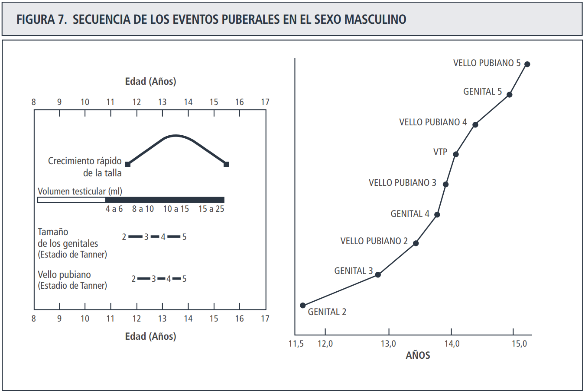
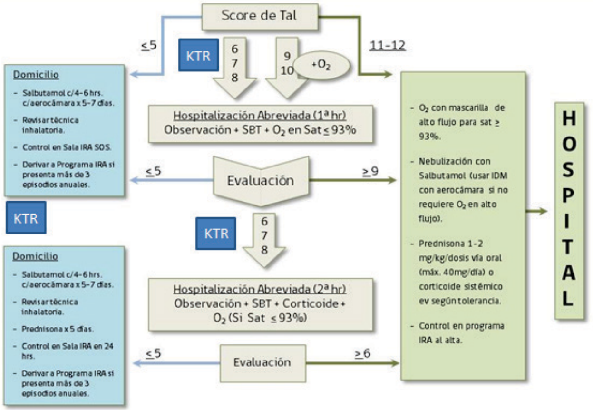

# Guía de Estudio 2023: Supervisión de Salud y Morbilidad

## Objetivos programa de supervisión de salud del niño
1) Mencione cuales son los objetivos del programa de supervisión de salud del niño y a que edades se realiza.

Objetivos:
- **Evaluar** la salud *integral*.
- <b>Acompañar la trayectoria </b>del proceso de crecimiento y desarrollo individual.
- Promover hábitos de <b>vida saludables</b>.
- <b>Prevenir</b> enfermedades o accidentes.
- <b>Detectar</b> en forma temprana y derivar oportunamente, situaciones que puedan afectar la salud y el desarrollo.
- Activar las <b>redes</b> y realizar <b>seguimiento</b> en caso de detectar <b>factores de riesgo</b>.

## esquema control sano
2) Realice un esquema de control sano, desde recién nacido hasta los 6 años, mencionando las siguientes características:
Hitos del desarrollo psicomotor
Incremento de peso y talla
Aspectos relevantes a evaluar en el examen físico
Alimentación y leches. Dilución, volumen y tipo de leche recomendada. Suplementos
Vacunas y exámenes de screening si corresponden
Prevención de accidentes : Intoxicaciones, quemaduras, caídas, asfixia, accidentes de tránsito
Tips de estimulación    

 En relación al control sano del recién nacido, mencione los cuidados y hábitos de higiene que se deben recomendar. Además indique cinco eventos fisiológicos y cinco signos de alarma.

 

Para desarrollo psicomotor, de 1 a 24 meses se puede utilizar la escala de evaluación del desarrollo psicomotor adjunta a continuación

Para evaluar desarrollo psicomotor de 2 a 5 años se puede utilizar el test de desarrollo psicomotor (TEPSI). Se obtiene un puntaje total que se transforma a un "puntaje T" según la edad del niño. Un puntaje T < 40 indica riesgo de retraso en el desarrollo psicomotor, < 30 indica retraso en el desarrollo psicomotor.

Tabla de hitos desarrollo psicomotor por edad hasta los 6 años de edad

Banderas rojas desarrollo psicomotor por área de evaluación:

Motor:
- 4-5 meses: no empuja para sentarse
- 9-10 meses: no descarga peso
- 15 meses: no camina
- 30 meses: no salta en dos pies
- 4 años: no salta en 1 pie

Motor fino:
- 7 meses: no toma objetos
- 11 meses: no pinza
- 15 meses: no pone ni saca de cajita
- 30 meses: no vuelve página
- 4 años: no copia círculo

Lenguaje:
- 5-6 meses: no balbucea
- 10-11 meses: no silabea
- 18 meses: no dice 3 palabras
- 24 meses: no forma frases de 2 palabras
- 3.5 años: no entiende más del 50% del lenguaje

Cognitivo:
- 2-3 meses: no atiende a la madre
- 8-9 meses: no se interesa en juegos
- 12 meses: no busca lo escondido
- 36 meses: no sabe su nombre
- 4-5 años: no cuenta secuencialmente

## lactancia materna
3) Indique beneficios de la lactancia materna para el niño, para la madre y la familia

Niño:
- Reduce la mortalidad por <b>enfermedades infecciosas</b>.
- Mayor protección en contra de <b>diarreas</b>.
- Mayor protección en contra de enfermedades <b> respiratorias</b>.
- Mejora el IMC y disminuye probabilidad de desarrollar <b>obesidad</b>.
- Protege contra las <b>caries</b> en niños y niñas menores de un año.
- Favorece un buen <b>desarrollo maxilofacial</b>.
- Favorece el desarrollo <b>intelectual</b>.
- Beneficios relacionados con el desarrollo del <b>vínculo</b>
- Disminuye riesgo de <b>enterocolitis necrotizante</b>
- Disminuye riesgo de <b>muerte súbita</b>

Madre:
- Reduce la probabilidad de desarrollar <b>cáncer de mamas</b> premenopáusico y de <b>ovarios</b>
- Reduce la probabilidad de desarrollar problemas <b>cardiovasculares</b>.
- Disminuye el riesgo de desarrollar enfermedades crónicas: diabetes mellitus tipo 2, HTA, Dislipidemias y enfermedad cardiovascular
- Menor riesgo de artritis reumatoide y esclerosis múltiple 
- Facilita la conciliación del <b>sueño y cuidado del bebé</b>.
- Reduce la probabilidad de desarrollar <b>depresión postparto</b> (DPP). 
- Regula el sistema <b>endocrino e inmune</b> de la madre.
- Mantiene niveles elevados de oxitocina, provocando un efecto <b>antiestrés</b> y aumento en la <b>autoestima</b> de la madre.
- Contribuye a la <b>retracción precoz del útero</b>.
- En forma exclusiva contribuye a periodos de <b>amenorrea de lactancia</b>.
- Contribuye a que la mayoría de las madres pierdan progresiva y <b>lentamente el excedente de peso</b> que tienen de reserva precisamente para enfrentar la lactancia.

Familia:
- Es económico, práctico e higiénico. 
- Ayuda en la planificación familiar
- Menor riesgo de abuso y negligencia materna 

## técnicas de lactancia materna
4) Nombre en cinco pasos la:
- Técnica adecuada de lactancia materna

1° Procurar estar en <b>lugar tranquilo, tibio y agradable adoptando una posición cómoda</b> y segura. Para saber si la posición es adecuada, la cara del bebe frente al pecho (no ladeada), el cuerpo del bebe debe estar siempre alineado (su oreja, hombro y cadera siguen una misma línea imaginaria y su cabeza sigue la dirección del pecho). Mirar al niño a los ojos mientras amamanta, ya que puede ser un momento de profunda comunicación entre madre e hijo

2° Acercar la guagua al pecho, apoyarlo en la mejilla. Al presentar el pecho, el bebé buscará instintivamente el pezón. Se debe esperar a que el bebé abra la boca e introducir todo el pezón en ella, apuntando hacia el fondo del paladar (debe quedar toda la areola dentro de su boca).

3° El agarre al pecho con los labios evertidos (como si estuviera bostezando), pezón y areola dentro de la boca, pezón entre la lengua y el paladar de la guagua, su pera tocando el pecho y su nariz rozándolo ligeramente. No doloroso.

4° La cabeza no debe estar rotada hacia un lado del cuerpo, ni la guagua muy separada del cuerpo de la madre. La cabeza del bebe debe seguir la dirección del pecho materno. Si la guagua queda prendida solamente del pezón, la madre debe deslizar su dedo meñique en su boca para que se desprenda con cuidado

5° Procurar vaciar al menos uno de los pecho, antes de ofrecer el otro, para obtener todos los nutrientes, entre medio sacar chanchitos.

- Preparación adecuada de una mamadera:
Ejemplo con Leche Purita + Pro 1 (12 a 23 meses de edad):
1. Lavar manos y utensilios a utilizar en la preparación del producto
2. Hervir agua potable y dejar enfriar hasta que esté tibia. Llenar a la mitad un vaso o taza. 
3. Agregar 5 medidas o 10 cucharaditas rasas de Purita + PRO 1.
4. Revolver hasta disolver completamente el polvo.
5. Completar con agua hervida hasta el borde del vaso o taza (200 ml).

Para la preparación de las fórmulas de inicio, deben seguirse las instrucciones que estánindicadas en cada envase de producto. En general se consiguen los aportes deseados y la densidad energética diluyéndola entre un 13% - 14% usando la medida incluida en el envase. No requieren adición de ningún otro ingrediente. 

PAra conseguir concentración de 13-14% por lo general se añade 1 medida por cada 30 ml de agua. Ej, FI NAN 1 Pro medida 4.3 g / 30 ml = 14.3%

El volumen indicado de fórmula varía de acuerdo con la edad y peso del niño o niña, iniciándose la alimentación con aproximadamente 60 ml por vez en los primeros días, para llegar aproximadamente a 200 ml por vez a los cinco meses, utilizando el cálculo aproximado de 140 cc-160 cc x kg de peso x día.

## suplementación hierro y VitD
5) En relación a suplementación de hierro y vitamina D, indique:
 - Desde y hasta que edad está recomendada
 - Dosis en mg o UI
 - Dos presentaciones comerciales y a cuantas gotas corresponde la dosis recomendada

Fe 1 mg/kg/día desde los 4 meses hasta los 12 meses. Si RNPT 2 mg/kg/día desde el alta de neonatología hasta los 12 meses de edad corregida. 

Vit D 400 UI/día desde el nacimiento hasta los 12 meses. 

Zinc: Si RNPT en los casos de alimentación con lactancia materna exclusiva, suplementar con 1 mg/kg/día, desde el alta de la neonatología hasta el inicio de la alimentación complementaria. Indicar a la familia que el Zinc se puede mezclar con las Vitaminas, pero no con el hierro. Por lo que deben ser administradas en momentos diferentes del día.

Hierro: 
- Cheltin 6 mg/ml, 20 gotas = 1 ml (1 gota = 0.3 mg)
- Ferrigot 125 mg/ml, 25 gotas = 1 ml (1 gota = 5 mg)
- Maltofer 50 mg/ml, 20 gotas = 1 ml (1 gota = 2.5 mg)

Vitamina D:
- VITDE 800 UI/4 gotas
- InforVIT 800 UI/4 gotas
- Vitamin life 800 UI/4 gotas

## diagnóstico nutricional
6) Mencione como se realiza el diagnostico nutricional integrado en el niño y cuáles son los parámetros que se utilizan en las diferentes edades.

Utilizar edad corregida según esto: 

## Vacunas
7) Realice el calendario de vacunas PNI y otro para las siguientes vacunas extra PNI (si están incluidas en el PNI especificar desde qué año y a qué edad se deberían indicar):
 - Rotavirus 
 - Hepatitis A
 - Varicela
 - Papiloma
 - Meningococo

<html xmlns:o="urn:schemas-microsoft-com:office:office" xmlns:x="urn:schemas-microsoft-com:office:excel" xmlns="http://www.w3.org/TR/REC-html40">

<head>
<meta http-equiv=Content-Type content="text/html; charset=windows-1252">
<meta name=ProgId content=Excel.Sheet>
<meta name=Generator content="Microsoft Excel 15">
<link rel=File-List href="Book1_files/filelist.xml">

<title>Vacunaci�n�2023</title>
</head>

<body>
<!--[if !excel]>&nbsp;&nbsp;<![endif]-->
<!--The following information was generated by Microsoft Excel's Publish as Web
Page wizard.-->
<!--If the same item is republished from Excel, all information between the DIV
tags will be replaced.-->
<!----------------------------->
<!--START OF OUTPUT FROM EXCEL PUBLISH AS WEB PAGE WIZARD -->
<!----------------------------->

<h1 style='color:black;font-family:Calibri;font-size:14.0pt;font-weight:800;
font-style:normal'>Vacunación 2023</h1>

<table border=0 cellpadding=0 cellspacing=0 width=1040 style='border-collapse:
 collapse;table-layout:fixed;width:779pt'>
 <col width=64 style='width:48pt'>
 <col width=107 span=6 style='mso-width-source:userset;mso-width-alt:3723;
 width:80pt'>
 <col width=109 style='mso-width-source:userset;mso-width-alt:3816;width:82pt'>
 <col width=118 style='mso-width-source:userset;mso-width-alt:4119;width:89pt'>
 <col width=107 style='mso-width-source:userset;mso-width-alt:3723;width:80pt'>
 <tr class=xl7416390 height=58 style='height:43.5pt'>
  <td height=58 class=xl7316390 width=64 style='height:43.5pt;width:48pt'>RN</td>
  <td class=xl7316390 width=107 style='width:80pt'>2</td>
  <td class=xl7316390 width=107 style='width:80pt'>4</td>
  <td class=xl7316390 width=107 style='width:80pt'>6</td>
  <td class=xl7316390 width=107 style='width:80pt'>12</td>
  <td class=xl7316390 width=107 style='width:80pt'>18</td>
  <td class=xl7316390 width=107 style='width:80pt'>36</td>
  <td class=xl7316390 width=109 style='width:82pt'>1ro (7a) y 8vo (14a)</td>
  <td class=xl7316390 width=118 style='width:89pt'>4to (10a) y 5to(11a)</td>
  <td class=xl7316390 width=107 style='width:80pt'>Embarazadas desde 28 semanas</td>
 </tr>
 <tr height=19 style='height:14.5pt'>
  <td height=19 class=xl6616390 width=64 style='height:14.5pt;width:48pt'>BCG</td>
  <td class=xl6916390 width=107 style='width:80pt'>Hexavalente</td>
  <td class=xl6916390 width=107 style='width:80pt'>Hexavalente</td>
  <td class=xl6916390 width=107 style='width:80pt'>Hexavalente</td>
  <td class=xl6616390 width=107 style='width:80pt'></td>
  <td class=xl6916390 width=107 style='width:80pt'>Hexavalente</td>
  <td class=xl6616390 width=107 style='width:80pt'></td>
  <td class=xl6616390 width=109 style='width:82pt'></td>
  <td class=xl6616390 width=118 style='width:89pt'>VPH</td>
  <td class=xl6616390 width=107 style='width:80pt'></td>
 </tr>
 <tr height=19 style='height:14.5pt'>
  <td height=19 class=xl6616390 width=64 style='height:14.5pt;width:48pt'>Hep B</td>
  <td class=xl6816390 width=107 style='width:80pt'>DTPa</td>
  <td class=xl6816390 width=107 style='width:80pt'>&nbsp;</td>
  <td class=xl6816390 width=107 style='width:80pt'>&nbsp;</td>
  <td class=xl6616390 width=107 style='width:80pt'></td>
  <td class=xl6816390 width=107 style='width:80pt'>&nbsp;</td>
  <td class=xl6616390 width=107 style='width:80pt'></td>
  <td class=xl6816390 width=109 style='width:82pt'>dTpa</td>
  <td class=xl6616390 width=118 style='width:89pt'></td>
  <td class=xl6816390 width=107 style='width:80pt'>dTpa</td>
 </tr>
 <tr height=19 style='height:14.5pt'>
  <td height=19 class=xl6616390 width=64 style='height:14.5pt;width:48pt'></td>
  <td class=xl6816390 width=107 style='width:80pt'>Polio inactivado</td>
  <td class=xl6816390 width=107 style='width:80pt'>&nbsp;</td>
  <td class=xl6816390 width=107 style='width:80pt'>&nbsp;</td>
  <td class=xl6616390 width=107 style='width:80pt'></td>
  <td class=xl6816390 width=107 style='width:80pt'>&nbsp;</td>
  <td class=xl6616390 width=107 style='width:80pt'></td>
  <td class=xl6616390 width=109 style='width:82pt'></td>
  <td class=xl6616390 width=118 style='width:89pt'></td>
  <td class=xl6616390 width=107 style='width:80pt'></td>
 </tr>
 <tr height=19 style='height:14.5pt'>
  <td height=19 class=xl6616390 width=64 style='height:14.5pt;width:48pt'></td>
  <td class=xl6816390 width=107 style='width:80pt'>HepB</td>
  <td class=xl6816390 width=107 style='width:80pt'>&nbsp;</td>
  <td class=xl6816390 width=107 style='width:80pt'>&nbsp;</td>
  <td class=xl6616390 width=107 style='width:80pt'></td>
  <td class=xl6816390 width=107 style='width:80pt'>&nbsp;</td>
  <td class=xl6616390 width=107 style='width:80pt'></td>
  <td class=xl6616390 width=109 style='width:82pt'></td>
  <td class=xl6616390 width=118 style='width:89pt'></td>
  <td class=xl6616390 width=107 style='width:80pt'></td>
 </tr>
 <tr height=19 style='height:14.5pt'>
  <td height=19 class=xl6616390 width=64 style='height:14.5pt;width:48pt'></td>
  <td class=xl6816390 width=107 style='width:80pt'>Hib</td>
  <td class=xl6816390 width=107 style='width:80pt'>&nbsp;</td>
  <td class=xl6816390 width=107 style='width:80pt'>&nbsp;</td>
  <td class=xl6616390 width=107 style='width:80pt'></td>
  <td class=xl6816390 width=107 style='width:80pt'>&nbsp;</td>
  <td class=xl6616390 width=107 style='width:80pt'></td>
  <td class=xl6616390 width=109 style='width:82pt'></td>
  <td class=xl6616390 width=118 style='width:89pt'></td>
  <td class=xl6616390 width=107 style='width:80pt'></td>
 </tr>
 <tr height=58 style='height:43.5pt'>
  <td height=58 class=xl6616390 width=64 style='height:43.5pt;width:48pt'></td>
  <td class=xl6716390 width=107 style='width:80pt'>Neumococo Conjugada</td>
  <td class=xl6716390 width=107 style='width:80pt'>Neumococo Conjugada</td>
  <td class=xl7116390 width=107 style='width:80pt'>* Neumococo Conjugada (solo prematuros)</td>
  <td class=xl6716390 width=107 style='width:80pt'>Neumococo Conjugada</td>
  <td class=xl6616390 width=107 style='width:80pt'></td>
  <td class=xl6616390 width=107 style='width:80pt'></td>
  <td class=xl6616390 width=109 style='width:82pt'></td>
  <td class=xl6616390 width=118 style='width:89pt'></td>
  <td class=xl6616390 width=107 style='width:80pt'></td>
 </tr>
 <tr height=39 style='height:29.0pt'>
  <td height=39 class=xl6616390 width=64 style='height:29.0pt;width:48pt'></td>
  <td class=xl7016390 width=107 style='width:80pt'>Meningocócica recombinante</td>
  <td class=xl7016390 width=107 style='width:80pt'>Meningocócica recombinante</td>
  <td class=xl6616390 width=107 style='width:80pt'></td>
  <td class=xl7016390 width=107 style='width:80pt'>Meningocócica Conjugada</td>
  <td class=xl6616390 width=107 style='width:80pt'></td>
  <td class=xl6616390 width=107 style='width:80pt'></td>
  <td class=xl6616390 width=109 style='width:82pt'></td>
  <td class=xl6616390 width=118 style='width:89pt'></td>
  <td class=xl6616390 width=107 style='width:80pt'></td>
 </tr>
 <tr height=39 style='height:29.0pt'>
  <td height=39 class=xl6616390 width=64 style='height:29.0pt;width:48pt'></td>
  <td class=xl6616390 width=107 style='width:80pt'></td>
  <td class=xl6616390 width=107 style='width:80pt'></td>
  <td class=xl6616390 width=107 style='width:80pt'></td>
  <td class=xl7216390 width=107 style='width:80pt'>SRP (12 meses, 3 letras)</td>
  <td class=xl6616390 width=107 style='width:80pt'></td>
  <td class=xl7216390 width=107 style='width:80pt'>SRP (12 * 3 = 36 meses)</td>
  <td class=xl6616390 width=109 style='width:82pt'></td>
  <td class=xl6616390 width=118 style='width:89pt'></td>
  <td class=xl6616390 width=107 style='width:80pt'></td>
 </tr>
 <tr height=19 style='height:14.5pt'>
  <td height=19 class=xl6516390 width=64 style='height:14.5pt;width:48pt'></td>
  <td class=xl6516390 width=107 style='width:80pt'></td>
  <td class=xl6516390 width=107 style='width:80pt'></td>
  <td class=xl6516390 width=107 style='width:80pt'></td>
  <td class=xl6516390 width=107 style='width:80pt'></td>
  <td class=xl6516390 width=107 style='width:80pt'>Hepatitis A</td>
  <td class=xl6516390 width=107 style='width:80pt'></td>
  <td class=xl6516390 width=109 style='width:82pt'></td>
  <td class=xl6516390 width=118 style='width:89pt'></td>
  <td class=xl6516390 width=107 style='width:80pt'></td>
 </tr>
 <tr height=19 style='height:14.5pt'>
  <td height=19 class=xl6516390 width=64 style='height:14.5pt;width:48pt'></td>
  <td class=xl6516390 width=107 style='width:80pt'></td>
  <td class=xl6516390 width=107 style='width:80pt'></td>
  <td class=xl6516390 width=107 style='width:80pt'></td>
  <td class=xl6516390 width=107 style='width:80pt'></td>
  <td class=xl6516390 width=107 style='width:80pt'>Varicela</td>
  <td class=xl6516390 width=107 style='width:80pt'>Varicela</td>
  <td class=xl6516390 width=109 style='width:82pt'></td>
  <td class=xl6516390 width=118 style='width:89pt'></td>
  <td class=xl6516390 width=107 style='width:80pt'></td>
 </tr>
 <tr height=39 style='height:29.0pt'>
  <td height=39 class=xl6516390 width=64 style='height:29.0pt;width:48pt'></td>
  <td class=xl6516390 width=107 style='width:80pt'></td>
  <td class=xl6516390 width=107 style='width:80pt'></td>
  <td class=xl6516390 width=107 style='width:80pt'></td>
  <td class=xl6516390 width=107 style='width:80pt'></td>
  <td class=xl6516390 width=107 style='width:80pt'>Fiebre amarilla (Rapa Nui)</td>
  <td class=xl6516390 width=107 style='width:80pt'></td>
  <td class=xl6516390 width=109 style='width:82pt'></td>
  <td class=xl6516390 width=118 style='width:89pt'></td>
  <td class=xl6516390 width=107 style='width:80pt'></td>
 </tr>
 <![if supportMisalignedColumns]>
 <tr height=0 style='display:none'>
  <td width=64 style='width:48pt'></td>
  <td width=107 style='width:80pt'></td>
  <td width=107 style='width:80pt'></td>
  <td width=107 style='width:80pt'></td>
  <td width=107 style='width:80pt'></td>
  <td width=107 style='width:80pt'></td>
  <td width=107 style='width:80pt'></td>
  <td width=109 style='width:82pt'></td>
  <td width=118 style='width:89pt'></td>
  <td width=107 style='width:80pt'></td>
 </tr>
 <![endif]>
</table>

</body>

</html>

https://sochinf.cl/recomendaciones-para-la-puesta-al-dia-de-calendarios-de-vacunacion-en-chile/ 

Rotavirus (en lactantes <6 meses, ambas son orales): 
- Rotarix (monovalente, virus atenuado): dos dosis--> 2 y 4 meses. Intervalo mínimo 4 semanas
- Rotateq (polivalente, virus atenuado): tres dosis--> 2, 4 y 6 meses

## vacunas PNI
8) En relación a cada una de las vacunas PNI indique:
- Tipo de vacuna
- Vía y dosis
- Efectividad y/o Inmunogenicidad
- Efectos adversos
- Contraindicaciones

| Vacuna | composición | 
|--------|-------------|
| BCG | viva atenuada | 
| Hepatitis B | recombinante |
| difteria, tétanos | toxoides (en la abreviatura DT/dt, mayúscula/minúscula implica más/menos toxoide, por eso hasta los 18 meses se da la DTPa y luego los refuerzos tienen la dTPa) |
| tos convulsiva | acelular ("DTPa" la a implica **ACELULAR**. Creo que la con virus atenuado creo que ya no está disponible) |
| Haemophilus influenzae tipo b | conjugada polisacárida + proteína|
| poliomielitis | inactivada, esta es la de la hexavalente|
| poliomielitis | viva atenuada (ya no se da)|
| neumococo | conjugada polisacárida (inactiva) |
| meningococo | conjugada polisacárida (inactiva) tetravalente (A, C, W, Y) |
| meningococo | recombinante monovalente (serotipo B) |
| sarampión, parotiditis, rubéola, varicela | virus vivos atenuados |
| virus hepatitis A | inactivada |
| vph | inactivada |
| fiebre amarilla | virus vivos atenuados |

## higiene oral
9) Mencione cómo se realiza la higiene oral a las diferentes edades del niño y cuando se realizan los controles odontológicos habituales en la infancia.

- RN hasta erupción primer diente, limpieza con dedal de silicona o gasa limpia húmeda sin pasta de diente 1 vez al día. Higiene de encías, paladar y lengua. 
- Desde erupción de primer diente hasta los 2 años: cepillado con pasta de diente fluorada (1000 a 1500 ppm) al menos 2 veces al día (mañana y noche) con cepillo de cerdas suaves y pequeño. Al final escupir pero no es necesario enjuagar. El cepillado más importante es antes de acostarse en la noche. Cantidad pasta: 1 grano de arroz.
- 2 años en adelante: mantener higiene bucal con cepillo de dientes y pasta de diente fluorada mínimo 2 veces al día. Cantidad de pasta aumenta hasta máximo tamaño de 1 arveja. Enfatizar que hasta al rededor de los 7 años los niños no tienen la habilidad de cepillarse solos y que los padres deben supervisar y ayudar. En escolares y adolescentes, se recomienda el uso de hilo dental. 

Controles odontológicos: 
- Control con enfoque de riesgo odontológico (CERO): 6m, 12m, 2a, 3a, ... anualmente hasta los 9a
- GES salud oral integral: a los 6 años

## pubertad
10) Realice una línea de tiempo, para mujeres y hombres, en relación a eventos normales de la pubertad.

## ortopedia
11) Mencione qué evaluaciones puede hacer en el examen físico para pesquisar patologías ortopédicas en el niño (escoliosis, pie plano y desviaciones del eje de las extremidades inferiores), cuando realizarlas y cuando son patológicas

| Patología | Edad | Evaluación |
|------------|------|-----------|
| escoliosis | desde 5 a 6 años | maniobra de Adams |
| pie plano | desde los 3 años | extensión dorsal del primer ortejo del pie y maniobra apoyo del pie en puntillas (apoyando metatarsos y elevando talón). Si no se forma arco es pie plano rígido (patológico) |
| genu valgo | hasta 10 años es fisiológico | se considera **patológica** cuando: persiste en la adolescencia; es asimétrica, la distancia entre los pies (intermaleolar) es mayor a 10 cm. o si se encuentra asociado a otras condiciones (antecedentes de patología ósea o traumatismos). |
| genu varo | hasta 2 años es fisiológico | se considera **patológica** cuando: >2 años, se incrementa en vez de disminuir; es asimétrico; la distancia intercondílea (entre rodillas) es demasiado amplia (mayor a 5 cm); o está acompañando de otras patologías óseas como raquitismo o displasias.| 

## oftalmología
12) En relación a las evaluaciones oftalmológicas durante el control sano, mencione:
 - Que nombres tienen
 - A qué edad se realizan
 - Qué patologías buscan descartar

<table>
<thead>
<tr>
	<th>Prueba</th>
	<th>Edad</th>
	<th>Patología a descartar</th>
</tr>
</thead>
<tbody>
<tr>
	<td> Test de ojo rojo</td>
	<td> RN-3 años</td>
	<td> cataratas congénitas; estrabismo; glaucoma infantil; vicios de refracción; hemorragia vítrea y tumores intraoculares como el retinoblastoma</td>
</tr>
<tr>
	<td> Test de Hirschberg</td>
	<td> RN - 10 años </td>
	<td> estrabismo </td>
</tr>
<tr>
	<td> Cover test (sobre todo cuando quedan dudas con test de hirschberg)</td>
	<td> RN - 10 años </td>
	<td> estrabismo </td>
</tr>
<tr>
	<td> <b>fijación visual</b> desde las 4-6 semanas, si niño no colabora para Snellen</td>
	<td> por lo general < 3 años </td>
	<td> Agudeza visual, vicios de refracción </td>
</tr>
<tr>
	<td> tabla E de Snellen	</td>
	<td> 3 - 9 años (en > 6 años se podría utilizar tabla de Snellen)</td>
	<td> agudeza visual </td>
</tr>
</tbody>
</table>

Notas estrabismo: 
- Estrabismo patológico: todo estrabismo permanente, independiente de la edad, y todo estrabismo intermitente, después de los 6 meses de edad. En estos casos se debe derivar a oftalmólogo inmediatamente. 
- Estrabismo fisiológico: en los menores de seis meses, puede existir estrabismo intermitente asociado con inmadurez del sistema de alineamiento ocular. Los/las niños/as que presenten estrabismo intermitente antes de los seis meses deben ser revaluados a los seis meses en el control de salud. En caso de persistir con estrabismo a esta edad deben ser derivados a oftalmólogo. Si el/la niño/a menor de seis meses tiene estrabismo constante o estrabismo asociado a alteración del rojo pupilar, debe ser derivado al oftalmólogo.
- Pseudoestrabismo: es la apariencia de estrabismo existiendo un alineamiento normal. Su forma más frecuente es la pseudoendotropía. Se diagnostica con un reflejo corneal de luz centrado en ambas pupilas, ratificado con un Cover Test o un Cover Test con objeto de fijación.

## Exantemas
13) Realice un cuadro comparativo para las enfermedades exantemáticas clásicas, mencionando las siguientes características:
 - Agente causal
 - Período de incubación
 - Características del exantema
 - Síntomas y signos asociados
 - Diagnóstico
 - Tratamiento
 - Complicaciones

Clasificación de los exantemas según morfología y grupo etiológico

Resúmen clínica

<meta http-equiv="Content-Type" content="text/html; charset=utf-8"><link type="text/css" rel="stylesheet" href="resources/sheet.css" >

<table class="waffle" cellspacing="0" cellpadding="0"><thead><tr><th class="row-header freezebar-origin-ltr"></th><th id="1082451233C0" style="width:107px;" class="column-headers-background">A</th><th id="1082451233C1" style="width:299px;" class="column-headers-background">B</th><th id="1082451233C2" style="width:28px;" class="column-headers-background">C</th><th id="1082451233C3" style="width:28px;" class="column-headers-background">D</th><th id="1082451233C4" style="width:28px;" class="column-headers-background">E</th><th id="1082451233C5" style="width:28px;" class="column-headers-background">F</th><th id="1082451233C6" style="width:28px;" class="column-headers-background">G</th><th id="1082451233C7" style="width:28px;" class="column-headers-background">H</th><th id="1082451233C8" style="width:28px;" class="column-headers-background">I</th><th id="1082451233C9" style="width:28px;" class="column-headers-background">J</th><th id="1082451233C10" style="width:28px;" class="column-headers-background">K</th><th id="1082451233C11" style="width:28px;" class="column-headers-background">L</th><th id="1082451233C12" style="width:28px;" class="column-headers-background">M</th><th id="1082451233C13" style="width:28px;" class="column-headers-background">N</th><th id="1082451233C14" style="width:28px;" class="column-headers-background">O</th><th id="1082451233C15" style="width:28px;" class="column-headers-background">P</th></tr></thead><tbody><tr style="height: 18px"><th id="1082451233R0" style="height: 18px;" class="row-headers-background">
1
</th><td class="s0">Sarampión</td><td class="s1">Especificación</td><td class="s2">1</td><td class="s2">2</td><td class="s2">3</td><td class="s2">4</td><td class="s2">5</td><td class="s2">6</td><td class="s2">7</td><td class="s2">8</td><td class="s3">9</td><td class="s4">10</td><td class="s1"></td><td class="s5"></td><td class="s5"></td><td class="s5"></td></tr><tr style="height: 18px"><th id="1082451233R1" style="height: 18px;" class="row-headers-background">
2
</th><td class="s6">Incubación / Contagiosidad</td><td class="s7">10-12 d / Gotitas</td><td class="s8"></td><td class="s8"></td><td class="s8"></td><td class="s8"></td><td class="s8"></td><td class="s8"></td><td class="s9"></td><td class="s9"></td><td class="s2"></td><td class="s10"></td><td class="s1"></td><td class="s5"></td><td class="s5"></td><td class="s5"></td></tr><tr style="height: 18px"><th id="1082451233R2" style="height: 18px;" class="row-headers-background">
3
</th><td class="s6">Fiebre</td><td class="s7"></td><td class="s11"></td><td class="s11"></td><td class="s11"></td><td class="s11"></td><td class="s11"></td><td class="s11"></td><td class="s11"></td><td class="s11"></td><td class="s12"></td><td class="s13"></td><td class="s1"></td><td class="s5"></td><td class="s5"></td><td class="s5"></td></tr><tr style="height: 18px"><th id="1082451233R3" style="height: 18px;" class="row-headers-background">
4
</th><td class="s6">Pródromo</td><td class="s7">3-4d caracterizado por fiebre alta, compromiso óculo-naso-faringe, enantema (manchas Koplik), adenopatías generalizadas mayor cervical. </td><td class="s14"></td><td class="s14"></td><td class="s14"></td><td class="s15"></td><td class="s2"></td><td class="s2"></td><td class="s2"></td><td class="s2"></td><td class="s2"></td><td class="s10"></td><td class="s1"></td><td class="s5"></td><td class="s5"></td><td class="s5"></td></tr><tr style="height: 18px"><th id="1082451233R4" style="height: 18px;" class="row-headers-background">
5
</th><td class="s6">Exantema</td><td class="s1">4d, posterior a 2do día disminuye sintomatología prodrómica, maculopapular eritematoso céfalo-caudal, suave al tacto, no pruriginoso,  confluente</td><td class="s3"></td><td class="s3"></td><td class="s3"></td><td class="s3"></td><td class="s16"></td><td class="s16"></td><td class="s16"></td><td class="s16"></td><td class="s17"></td><td class="s18"></td><td class="s1"></td><td class="s5"></td><td class="s5"></td><td class="s5"></td></tr><tr style="height: 18px"><th id="1082451233R5" style="height: 18px;" class="row-headers-background">
6
</th><td class="s19">Estudio</td><td class="s20">se deben tomar muestras sanguíneas y faríngeas y enviarlas al ISP. Se debe evaluar con serología IgM.</td><td class="s21"></td><td class="s21"></td><td class="s21"></td><td class="s21"></td><td class="s21"></td><td class="s21"></td><td class="s21"></td><td class="s21"></td><td class="s21"></td><td class="s22"></td><td class="s23"></td><td></td><td></td><td></td></tr><tr style="height: 18px"><th id="1082451233R6" style="height: 18px;" class="row-headers-background">
7
</th><td class="s19"></td><td class="s20"></td><td class="s24"></td><td class="s24"></td><td class="s24"></td><td class="s24"></td><td class="s24"></td><td class="s24"></td><td class="s24"></td><td class="s24"></td><td class="s24"></td><td class="s24"></td><td class="s23"></td><td></td><td></td><td></td></tr><tr style="height: 18px"><th id="1082451233R7" style="height: 18px;" class="row-headers-background">
8
</th><td class="s0">Rubeola</td><td class="s1">Especificación</td><td class="s2">1</td><td class="s2">2</td><td class="s2">3</td><td class="s2">4</td><td class="s2">5</td><td class="s2">6</td><td class="s2">7</td><td class="s2">8</td><td class="s3">9</td><td class="s4">10</td><td class="s23"></td><td></td><td></td><td></td></tr><tr style="height: 18px"><th id="1082451233R8" style="height: 18px;" class="row-headers-background">
9
</th><td class="s6">Incubación / Contagiosidad</td><td class="s7">14-21 días / Contagiosidad 7 días antes y 7 días después del rash.</td><td class="s8"></td><td class="s8"></td><td class="s8"></td><td class="s8"></td><td class="s8"></td><td class="s8"></td><td class="s9"></td><td class="s9"></td><td class="s3"></td><td class="s4"></td><td class="s23"></td><td></td><td></td><td></td></tr><tr style="height: 18px"><th id="1082451233R9" style="height: 18px;" class="row-headers-background">
10
</th><td class="s6">Fiebre</td><td class="s7"></td><td class="s11"></td><td class="s11"></td><td class="s11"></td><td class="s11"></td><td class="s11"></td><td class="s3"></td><td class="s3"></td><td class="s3"></td><td class="s3"></td><td class="s4"></td><td class="s23"></td><td></td><td></td><td></td></tr><tr style="height: 18px"><th id="1082451233R10" style="height: 18px;" class="row-headers-background">
11
</th><td class="s6">Pródromo</td><td class="s7">Fiebre baja, malestar, cefalea, adenopatías (retroauriculares y occipitales sensibles), un poco  de diarrea y odinofagia</td><td class="s14"></td><td class="s14"></td><td class="s15"></td><td class="s15"></td><td class="s15"></td><td class="s2"></td><td class="s2"></td><td class="s2"></td><td class="s3"></td><td class="s4"></td><td class="s23"></td><td></td><td></td><td></td></tr><tr style="height: 18px"><th id="1082451233R11" style="height: 18px;" class="row-headers-background">
12
</th><td class="s6">Exantema</td><td class="s1">Exantema maculopapular tenue NO confluente, primero en cara y se expande a caudal, siendo pruriginoso. Se describe la presencia de enantema o “manchas de Forchheimer” (afectan al velo del paladar). En hemograma puede haber leucopenia con predominio linfocitario</td><td class="s3"></td><td class="s3"></td><td class="s3"></td><td class="s16"></td><td class="s16"></td><td class="s16"></td><td class="s16"></td><td class="s16"></td><td class="s3"></td><td class="s4"></td><td class="s23"></td><td></td><td></td><td></td></tr><tr style="height: 18px"><th id="1082451233R12" style="height: 18px;" class="row-headers-background">
13
</th><td class="s6">Estudio</td><td class="s1">se deben tomar muestras sanguíneas y faríngeas y enviarlas al ISP. Se debe evaluar con serología IgM.</td><td class="s25"></td><td class="s25"></td><td class="s25"></td><td class="s25"></td><td class="s25"></td><td class="s25"></td><td class="s25"></td><td class="s25"></td><td class="s25"></td><td class="s26"></td><td class="s23"></td><td></td><td></td><td></td></tr><tr style="height: 18px"><th id="1082451233R13" style="height: 18px;" class="row-headers-background">
14
</th><td class="s19">Complicaciones</td><td class="s20"> Artritis de pequeñas articulaciones, encefalitis y púrpura trombocitopénica.</td><td class="s21"></td><td class="s21"></td><td class="s21"></td><td class="s21"></td><td class="s21"></td><td class="s21"></td><td class="s21"></td><td class="s21"></td><td class="s21"></td><td class="s22"></td><td class="s23"></td><td></td><td></td><td></td></tr><tr style="height: 18px"><th id="1082451233R14" style="height: 18px;" class="row-headers-background">
15
</th><td class="s27"></td><td class="s28"></td><td class="s24"></td><td class="s24"></td><td class="s24"></td><td class="s24"></td><td class="s24"></td><td class="s24"></td><td class="s24"></td><td class="s24"></td><td class="s24"></td><td class="s24"></td><td class="s23"></td><td></td><td></td><td></td></tr><tr style="height: 18px"><th id="1082451233R15" style="height: 18px;" class="row-headers-background">
16
</th><td class="s0">Escarlatina</td><td class="s1">Especificación</td><td class="s29" colspan="2">-7 días</td><td class="s2">1</td><td class="s2">2</td><td class="s2">3</td><td class="s2">4</td><td class="s2">5</td><td class="s2">6</td><td class="s2">7</td><td class="s4">8</td><td class="s1"></td><td class="s5"></td><td class="s5"></td><td class="s5"></td></tr><tr style="height: 18px"><th id="1082451233R16" style="height: 18px;" class="row-headers-background">
17
</th><td class="s6">Incubación / Contagiosidad</td><td class="s7">1-7 días / Contagioso hasta 24 hrs del inicio de ATB</td><td class="s30"></td><td class="s30"></td><td class="s8"></td><td class="s8"></td><td class="s8"></td><td class="s8"></td><td class="s8"></td><td class="s8"></td><td class="s8"></td><td class="s31"></td><td class="s1"></td><td class="s5"></td><td class="s5"></td><td class="s5"></td></tr><tr style="height: 18px"><th id="1082451233R17" style="height: 18px;" class="row-headers-background">
18
</th><td class="s6">Fiebre</td><td class="s1"></td><td class="s32"></td><td class="s33"></td><td class="s11"></td><td class="s12"></td><td class="s12"></td><td class="s12"></td><td class="s12"></td><td class="s12"></td><td class="s12"></td><td class="s13"></td><td class="s1"></td><td class="s5"></td><td class="s5"></td><td class="s5"></td></tr><tr style="height: 18px"><th id="1082451233R18" style="height: 18px;" class="row-headers-background">
19
</th><td class="s6">Pródromo</td><td class="s1">12-24 hrs caracterizado por fiebre alta, odinofagia, CEG, enantema, faringoamigdalitis, lengua fresa blanca, adenopatía cervical</td><td class="s32"></td><td class="s33"></td><td class="s14"></td><td class="s34"></td><td class="s34"></td><td class="s34"></td><td class="s34"></td><td class="s34"></td><td class="s34"></td><td class="s35"></td><td class="s1"></td><td class="s5"></td><td class="s5"></td><td class="s5"></td></tr><tr style="height: 18px"><th id="1082451233R19" style="height: 18px;" class="row-headers-background">
20
</th><td class="s6">Exantema</td><td class="s1">1 semana, fiebre en disminución, lengua en fresa roja, maculopapular eritematoso puntiforme generalizado centrífugo, rojo escarlata, áspero al tacto, pruriginoso y confluente. Triangulo de filatov y líneas de Pastia</td><td class="s32"></td><td class="s32"></td><td class="s3"></td><td class="s16"></td><td class="s16"></td><td class="s16"></td><td class="s16"></td><td class="s16"></td><td class="s16"></td><td class="s36"></td><td class="s1"></td><td class="s5"></td><td class="s5"></td><td class="s5"></td></tr><tr style="height: 18px"><th id="1082451233R20" style="height: 18px;" class="row-headers-background">
21
</th><td class="s19">Tratamiento</td><td class="s20">Amoxicilina 50 mg/kg/día cada 8 hrs por 10d; PNC benzatina &gt;4 años.</td><td class="s24"></td><td class="s24"></td><td class="s21"></td><td class="s21"></td><td class="s21"></td><td class="s21"></td><td class="s21"></td><td class="s21"></td><td class="s21"></td><td class="s22"></td><td class="s23"></td><td></td><td></td><td></td></tr><tr style="height: 18px"><th id="1082451233R21" style="height: 18px;" class="row-headers-background">
22
</th><td class="s27"></td><td class="s28"></td><td class="s24"></td><td class="s24"></td><td class="s24"></td><td class="s24"></td><td class="s24"></td><td class="s24"></td><td class="s24"></td><td class="s24"></td><td class="s24"></td><td class="s24"></td><td class="s28"></td><td class="s37"></td><td class="s37"></td><td class="s37"></td></tr><tr style="height: 18px"><th id="1082451233R22" style="height: 18px;" class="row-headers-background">
23
</th><td class="s0">Eritema infeccioso</td><td class="s1">Especificación</td><td class="s3">1</td><td class="s3">2</td><td class="s3">3</td><td class="s3">4</td><td class="s3">5</td><td class="s3">6</td><td class="s3">7</td><td class="s3">8</td><td class="s3">9</td><td class="s3">10</td><td class="s38">11</td><td class="s38">12</td><td class="s38">13</td><td class="s39">14</td></tr><tr style="height: 18px"><th id="1082451233R23" style="height: 18px;" class="row-headers-background">
24
</th><td class="s6">Incubación / Contagiosidad</td><td class="s1">4-15 d / Gotitas</td><td class="s40"></td><td class="s40"></td><td class="s40"></td><td class="s40"></td><td class="s40"></td><td class="s40"></td><td class="s40"></td><td class="s40"></td><td class="s3"></td><td class="s3"></td><td class="s41"></td><td class="s41"></td><td class="s41"></td><td class="s42"></td></tr><tr style="height: 18px"><th id="1082451233R24" style="height: 18px;" class="row-headers-background">
25
</th><td class="s6">Fiebre</td><td class="s1"></td><td class="s2"></td><td class="s3"></td><td class="s3"></td><td class="s3"></td><td class="s3"></td><td class="s3"></td><td class="s3"></td><td class="s3"></td><td class="s3"></td><td class="s3"></td><td class="s41"></td><td class="s41"></td><td class="s41"></td><td class="s42"></td></tr><tr style="height: 18px"><th id="1082451233R25" style="height: 18px;" class="row-headers-background">
26
</th><td class="s6">Pródromo</td><td class="s7">fiebre baja y leve CEG 0-2 d, </td><td class="s34"></td><td class="s2"></td><td class="s2"></td><td class="s2"></td><td class="s2"></td><td class="s2"></td><td class="s2"></td><td class="s2"></td><td class="s2"></td><td class="s2"></td><td class="s43"></td><td class="s43"></td><td class="s43"></td><td class="s44"></td></tr><tr style="height: 18px"><th id="1082451233R26" style="height: 18px;" class="row-headers-background">
27
</th><td class="s6">Exantema</td><td class="s1">afebril y sin CEG, primero eritema en ambas mejillas de aparición súbita para dar paso a  exantema maculopapular en tronco y EE que dura hasta 2 semanas. Posterior a esto puede recaer con calor, frio o ejercicio</td><td class="s3"></td><td class="s16"></td><td class="s16"></td><td class="s16"></td><td class="s16"></td><td class="s16"></td><td class="s16"></td><td class="s16"></td><td class="s45"></td><td class="s45"></td><td class="s46"></td><td class="s46"></td><td class="s46"></td><td class="s47"></td></tr><tr style="height: 18px"><th id="1082451233R27" style="height: 18px;" class="row-headers-background">
28
</th><td class="s19">Estudio</td><td class="s20">Se puede realizar IgM para parvovirus B19</td><td class="s21"></td><td class="s21"></td><td class="s21"></td><td class="s21"></td><td class="s21"></td><td class="s21"></td><td class="s21"></td><td class="s21"></td><td class="s21"></td><td class="s21"></td><td class="s48"></td><td class="s48"></td><td class="s48"></td><td class="s49"></td></tr><tr style="height: 18px"><th id="1082451233R28" style="height: 18px;" class="row-headers-background">
29
</th><td class="s27"></td><td class="s28"></td><td class="s24"></td><td class="s24"></td><td class="s24"></td><td class="s24"></td><td class="s24"></td><td class="s24"></td><td class="s24"></td><td class="s24"></td><td class="s32"></td><td class="s32"></td><td class="s23"></td><td></td><td></td><td></td></tr><tr style="height: 18px"><th id="1082451233R29" style="height: 18px;" class="row-headers-background">
30
</th><td class="s0">Exantema súbito </td><td class="s1">Especificación</td><td class="s3">1</td><td class="s3">2</td><td class="s3">3</td><td class="s3">4</td><td class="s3">5</td><td class="s3">6</td><td class="s3">7</td><td class="s4">8</td><td class="s32"></td><td class="s32"></td><td class="s23"></td><td></td><td></td><td></td></tr><tr style="height: 18px"><th id="1082451233R30" style="height: 18px;" class="row-headers-background">
31
</th><td class="s6">Incubación / Contagiosidad</td><td class="s1">1-2 semanas / Es el exantema más común en &lt;3 años. Contagia por saliva. </td><td class="s50"></td><td class="s50"></td><td class="s50"></td><td class="s50"></td><td class="s40"></td><td class="s40"></td><td class="s40"></td><td class="s51"></td><td class="s32"></td><td class="s32"></td><td class="s23"></td><td></td><td></td><td></td></tr><tr style="height: 18px"><th id="1082451233R31" style="height: 18px;" class="row-headers-background">
32
</th><td class="s6">Fiebre</td><td class="s7"></td><td class="s11"></td><td class="s11"></td><td class="s11"></td><td class="s11"></td><td class="s3"></td><td class="s3"></td><td class="s3"></td><td class="s4"></td><td class="s32"></td><td class="s32"></td><td class="s23"></td><td></td><td></td><td></td></tr><tr style="height: 18px"><th id="1082451233R32" style="height: 18px;" class="row-headers-background">
33
</th><td class="s6">Pródromo</td><td class="s7">3 a 4 días Comienzo brusco con fiebre alta o convulsión febril. Fiebre alta, continua de 3 a 4 días, sin CEG: el niño se ve de buen aspecto a pesar de la fiebre. Acompaña de st GI, odinofagia, faringoamigdalitis, OMA, adenopatías</td><td class="s14"></td><td class="s14"></td><td class="s14"></td><td class="s14"></td><td class="s2"></td><td class="s2"></td><td class="s3"></td><td class="s4"></td><td class="s32"></td><td class="s32"></td><td class="s23"></td><td></td><td></td><td></td></tr><tr style="height: 18px"><th id="1082451233R33" style="height: 18px;" class="row-headers-background">
34
</th><td class="s6">Exantema</td><td class="s1">afebril y sin CEG, maculoeritematoso generalizado que generalmente aparece cuando cae la temperatura, no confluente. </td><td class="s3"></td><td class="s3"></td><td class="s3"></td><td class="s3"></td><td class="s16"></td><td class="s16"></td><td class="s3"></td><td class="s4"></td><td class="s32"></td><td class="s32"></td><td class="s23"></td><td></td><td></td><td></td></tr><tr style="height: 18px"><th id="1082451233R34" style="height: 18px;" class="row-headers-background">
35
</th><td class="s6">Diagnóstico/tto</td><td class="s1">Clínico / Sintomático</td><td class="s3"></td><td class="s3"></td><td class="s3"></td><td class="s3"></td><td class="s3"></td><td class="s3"></td><td class="s3"></td><td class="s4"></td><td class="s32"></td><td class="s32"></td><td class="s23"></td><td></td><td></td><td></td></tr><tr style="height: 18px"><th id="1082451233R35" style="height: 18px;" class="row-headers-background">
36
</th><td class="s19">Complicaciones</td><td class="s20">Convulsiones febriles meningitis, meningoencefalitis, hepatitis fulminante, infección sistémica, síndrome hemafagocítico</td><td class="s21"></td><td class="s21"></td><td class="s21"></td><td class="s21"></td><td class="s21"></td><td class="s21"></td><td class="s21"></td><td class="s22"></td><td class="s32"></td><td class="s32"></td><td class="s23"></td><td></td><td></td><td></td></tr><tr style="height: 18px"><th id="1082451233R36" style="height: 18px;" class="row-headers-background">
37
</th><td class="s27"></td><td class="s28"></td><td class="s24"></td><td class="s24"></td><td class="s24"></td><td class="s24"></td><td class="s24"></td><td class="s24"></td><td class="s24"></td><td class="s24"></td><td class="s24"></td><td class="s24"></td><td class="s23"></td><td></td><td></td><td></td></tr><tr style="height: 18px"><th id="1082451233R37" style="height: 18px;" class="row-headers-background">
38
</th><td class="s0">Varicela</td><td class="s1">Especificación</td><td class="s3">1</td><td class="s3">2</td><td class="s2">3</td><td class="s2">4</td><td class="s2">5</td><td class="s2">6</td><td class="s2">7</td><td class="s2">8</td><td class="s3">9</td><td class="s4">10</td><td class="s23"></td><td></td><td></td><td></td></tr><tr style="height: 18px"><th id="1082451233R38" style="height: 18px;" class="row-headers-background">
39
</th><td class="s6">Incubación / Contagiosidad</td><td class="s1">10 - 21 días / Contagioso desde 10 horas previas al exantema hasta que todas las lesiones son costras Se da principalmente en &lt;10 años. Contagia vía respiratoria, personas, fómites, objetos, aire. Contagia hasta la última costra. </td><td class="s50"></td><td class="s50"></td><td class="s8"></td><td class="s8"></td><td class="s8"></td><td class="s8"></td><td class="s8"></td><td class="s8"></td><td class="s25"></td><td class="s26"></td><td class="s23"></td><td></td><td></td><td></td></tr><tr style="height: 18px"><th id="1082451233R39" style="height: 18px;" class="row-headers-background">
40
</th><td class="s6">Fiebre</td><td class="s7"></td><td class="s11"></td><td class="s11"></td><td class="s11"></td><td class="s11"></td><td class="s3"></td><td class="s3"></td><td class="s3"></td><td class="s3"></td><td class="s25"></td><td class="s26"></td><td class="s23"></td><td></td><td></td><td></td></tr><tr style="height: 18px"><th id="1082451233R40" style="height: 18px;" class="row-headers-background">
41
</th><td class="s6">Pródromo</td><td class="s7">2 a 3 días. Se da más en adolescentes que en NN, con fiebre baja. </td><td class="s14"></td><td class="s14"></td><td class="s15"></td><td class="s2"></td><td class="s2"></td><td class="s2"></td><td class="s2"></td><td class="s2"></td><td class="s52"></td><td class="s53"></td><td class="s23"></td><td></td><td></td><td></td></tr><tr style="height: 18px"><th id="1082451233R41" style="height: 18px;" class="row-headers-background">
42
</th><td class="s6">Exantema</td><td class="s1">de 5-7 días fiebre, CEG, enantemas, exantema  mácula a pápula a vesícula a pseudopústula y a costra. Parte en tronco y es centrifugo (no compromete P y P)</td><td class="s3"></td><td class="s3"></td><td class="s3"></td><td class="s16"></td><td class="s16"></td><td class="s16"></td><td class="s16"></td><td class="s16"></td><td class="s54"></td><td class="s55"></td><td class="s23"></td><td></td><td></td><td></td></tr><tr style="height: 18px"><th id="1082451233R42" style="height: 18px;" class="row-headers-background">
43
</th><td class="s19">Diagnóstico/tto</td><td class="s20">Clínico / Sintomático + bañar y aseo lesiones ¿Dejo aciclovir?: &gt;12 años, &lt;4 meses, inmunosuprimidos y embarazadas. (1T Ig anti VVZ)</td><td class="s56"></td><td class="s56"></td><td class="s56"></td><td class="s56"></td><td class="s56"></td><td class="s56"></td><td class="s56"></td><td class="s56"></td><td class="s21"></td><td class="s22"></td><td class="s23"></td><td></td><td></td><td></td></tr></tbody></table>

Algoritmos AEPAP

Exantemas purpúrico-petequiales:

Eritematomaculopapulares https://algoritmos.aepap.org/algoritmo/18/exantemas-maculopapulosos :

Los exantemas eritematomaculopapulosos se caracterizan por un rash cutáneo eritematoso, máculas planas coloreadas casi siempre eritematosas y/o pápulas sobreelevadas. La lesión elemental predominante puede ser: mácula (lesión plana caracterizada por cambio de coloración), pápula (elevación circunscrita de la piel con un diámetro inferior a 10 mm, si es mayor de 1 cm se denomina placa), eritema o eritrodermia (enrojecimiento inflamatorio de grandes zonas o la totalidad de la piel), habón (pápulas o placas rosa pálido edematosas que en ocasiones se unen formando lesiones anulares o serpiginosas con evolución cambiante, duran < 24 h en una localización). En general son manifestaciones cutáneas de aparición brusca. Constituyen el grupo más amplio de las enfermedades exantemáticas. Acompañan a muchas enfermedades, la mayoría infecciosas de origen viral y autolimitadas. Otras causas: bacterias, Rickettsias, fármacos, paravirales, enfermedades sistémicas1. Algunas entidades coexisten con lesiones vesiculosas y/o petequiales, por lo que se describen también en los algoritmos respectivos.

Notas:

Enterovirus (Coxsackie, Echovirus): exantemas maculosos o maculopapulosos que pueden afectar a palmas y plantas y son concomitante con la fiebre. Son la causa más frecuente de fiebre sin foco en niños menores de 2 años. Pueden asociar herpangina, manifestaciones digestivas, meningismo, mialgias, miopericarditis, aunque la forma más habitual es enfermedad febril inespecífica

Enfermedad de Kawasaki criterios: 
<b>Fiebre</b> > 5 días + 4 de 5:
<ol>
    <li>Inyección <b>conjuntival</b> bilateral sin secreción</li>
    <li>Alteración de la <b>boca</b>: grietas en labios, enantema, lengua aframbuesada</li>
    <li>Alteraciones de <b>pies y manos</b>: eritema palmoplantar, edema duro de dorso de manos y pies</li>
    <li><b>Exantema</b> polimorfo y cambiante (intenso en periné en lactantes)</li>
    <li><b>Adenopatía</b> cervical > 1,5cm</li>
    <li>Si hay lesión coronaria, se aceptan menos de 4 criterios.</li>
</ol>

Enfermedad de Kawasaki incompleta (hasta en 10-15% de los niños, sobre todo lactantes pequeños): <b>fiebre</b> >5 días + 2-3 criterios <b>clínicos</b> + <b>PCR > 30 mg/l y/o VSG > 40 mm/h</b> más
Al menos 3 criterios de laboratorio: 
<ol>
    <li>anemia, </li>
    <li>plaquetas > 450000, </li>
    <li>leucocitos ≥15000/mm, </li>
    <li>aumento GPT, </li>
    <li>albumina ≤3g/dl, </li>
    <li>piuria estéril.</li>
</ol>

Transmitidos por vectores

Vesículo-ampollosos

## morbilidad IRA
14) Indique el manejo ambulatorio de un paciente de:
 - 3 años con <b>otitis media aguda</b>(OMA): 
	- **Dolor**: <b>Paracetamol</b> 10-15 mg/kg c/6-8h o <b>ibuprofeno</b> 5-10 mg/kg c/6-8h
	- **Antibiótico**: Más frecuente por S. pneumoniae o H. influenzae. Duración 10 días si <2 años, 7 días si >2 años, 5 días si >6 años. **Inicio inmediato** si: < 6 meses, 6-24 meses con otitis bilateral, OMA con otorrea, OMA severa (fiebre >39°C,  48h evolución, otalgia leve-moderada), inmunodeficiencia, malformación craneofacial. **Observar sin ATB** con control en 48 a 72 h si: 6-24 meses con OMA unilateral, OMA leve, >24 meses leve.
		- 1a linea: <b>Amoxicilina</b> 90-100 mg/kg/día en 2 dosis por 10 días. 
		- 2a linea (si uso amoxi en últimos 30 días, OMAR, conjuntivitis concomitante): <b>Amoxi/clav 14:1</b> (90 - 6.4 mg/kg/día) [si no existe 14:1, complementar mitad amoxi/clav 7:1 con mitad amoxi sola] o <b>cefuroximo</b>
		- Alergia a peni: leve <b>cefuroximo</b>, anafilaxia <b>macrólidos</b> 
	- **Educación**: debería mejorar en 48-72h, si no mejora, volver a consultar.
	- Vacunas para prevenir: <b>Neumococo</b> y <b>H. influenzae</b> tipo B
	- <b>Derivar a ORL</b> si: OMAR (>4 en 1 año, >3 en 6 meses), OMA que no responde a ATB segunda línea, sospecha complicación (d/dx inmediata a SU). 
 - 6 meses con <b>resfrío común</b>: 
	- **Educación**: es autolimitado, máxima sintomatología a día 2-3, mejora de manera gradual durando hasta 10 a 14 días
	- **Consulta SOS** si: sintomatología no cede en tiempo estimado, empeoramiento de síntomas o aparición nuevos síntomas (dificultad para respirar, mala tolerancia oral, fiebre >38°C persistente)
	- **Manejo Sintomático**: 
		- Fiebre: <b>paracetamol</b> solo si fiebre es *invalidante* (si fiebre persiste consulta SOS)
		- Síntomas nasales: <b>Aseo nasal</b> con solución salina (fisiolimp) y/o aspiración nasal 
		- Tos: <b>Educar sobre tos</b>, ayuda a expectorar secreciones, no usar antitusígenos. Si invalidante, se puede aliviar la irritación con: hidratación oral (con líquidos tibios), miel (NO en < 1 año!!!)
 - 10 años con <b>sinusitis aguda</b>:
	- Síntomas: medidas generales (hidratación, aseo nasal, si antecedente de rinitis alérgica antihistamínicos, descongestionantes, corticoides intranassales), manejo dolor o fiebre con PCT o AINEs
	- ATB empírico: Bacterias más frecuentes son H influenzae, S pneumoniae, M catarrhalis.
		- leve-moderada sin riesgo resistencia: <b>Amoxi/clav</b> 45 mg/kg/día en 2 dosis por 10 días.
		- leve-moderada con riesgo resistencia y grave de manejo ambulatorio: <b>Amoxi/clav</b> 90 mg/kg/día en 2 dosis por 10 días.
		- Contraindicación peni: Si reacción grave: <b>levofloxacino</b> 10 a 20 mg/kg/día en 1-2 dosis por 10 días. Si reacción leve: cefalosporina 3a gen (<b>cefpodoximo</b>10 mg/día c/12 h VO)
		- Con mala tolerancia oral por vómitos: <b>Ceftriaxona</b> 50 mg/kg/día IM o IV por 3 días.

Evaluación severidad:

| Symptom or sign						| Points |
|---------------------------------------|--------|
| Abnormal nasal or postnasal discharge |        |
| -	Minimal								| 1      |
| -	Severe								| 2      |
| Nasal congestion						| 1      |
| Cough									| 2      |
| Malodorous breath						| 1      |
| Facial tenderness						| 3      |
| Erythematous nasal mucosa				| 1      |
| Fever (dentro de 24 h de presentación)|        |
| -	<38.5°C								| 1      |
| -	≥38.5°C								| 2      |
| Headache (retro-orbital)/irritability	|        |
| -	Severe								| 3      |
| -	Mild								| 1      |

< 8 puntos: leve-moderada, > 8 puntos: grave

 - 4 años con <b>adenoiditis aguda</b>:
	- Medidas generales y educación
	- Tto ATB: 
		- amoxicilina 50 mg/kg/día en 2 dosis por 7 días
		- alergia a peni: Macrolidos (azitro 10 mg/kg/día en 1 dosis por 5 días)
 - 2 años con <b>laringitis grado 1</b>:
	- Medidas generales: Posición cómoda en brazos del cuidador. Paracetamol 15/mg/kg/dosis o Ibuprofeno 10 mg/Kg/dosis si dolor o fiebre mayor o igual a 38,5°C axilar (para apoyar el manejo disminuyendo la taquicardia y taquipnea). Diferir tratamientos dolorosos que podrían empeorar el cuadro respiratorio. Monitorizar saturación de oxígeno y frecuencia respiratoria (evaluación de progresión de la dificultad respiratoria). Educación  a  los  cuidadores  respecto  de  la  evolución  esperable  de  la  enfermedad  y  sus  complicaciones. Educación sobre medidas de prevención de infecciones respiratorias.
	- Tto específico Grado I: considerar el uso de <b>Betametasona 0.4 mg/kg vo ó Dexametasona 0.15-0.3 mg/kg  ev  </b> para  el  tratamiento  de  las  laringitis  GI,  en  caso  de  antecedente  de  laringitis  graves previas o consultas previas en el mismo episodio.  Puede  considerarse  la  utilización  de  prednisona  2  mg/kg  por  1-3  días,  si  los  corticoides  previamente descritos no se encuentran disponiblesiv.
	- Tto específico Grado II, III y IV, agregar nebu con adrenalina corriente 4 ml (0.9 mg/kg/dosis) por 10 a 15 minutos con flujo 4-6 L/min. Repetir c/20 minutos por max 3 veces. Observar por 2 h post primera nebu por posible efecto rebote

GRADO I: 
Disfonía  (tos y  voz),  estridor inspiratorio leve  e  <b>intermitente</b>, que se acentúa con el esfuerzo (llanto).  

GRADO II: 
Disfonía  (tos  y  voz),  estridor  inspiratorio  <b>continuo</b>,  <b>tiraje  leve</b>  (retracción  supraesternal  o intercostal o subcostal).  

GRADO III: 
Disfonía  (tos  y  voz),  estridor  inspiratorio  y  espiratorio,  tiraje  intenso,  signos  de  <b>hipoxemia</b>  (palidez, inquietud, sudoración, polipnea), <b>disminución </b>del MP.  

GRADO IV: FASE DE AGOTAMIENTO 
Disfonía,  estridor,  tiraje  intenso,  palidez,  <b>somnolencia</b>,  <b>cianosis</b>  y  *aparente  disminución  de la dificultad respiratoria*.

 - 5 años con <b>neumonía lobar</b>:
	- Medidas generales: hidratación, aseo nasal, PCT/aines si dolor/fiebre, broncodilatadores si obstrucción bronquial, Kine respiratoria.
	- ATB empírico: neumonía lobar en 5 años, agente más probable S. pneumoniae: <b>Amoxicilina 80-100 mg/kg/día en dos dosis por 7 días (max 2 g/día)</b>
		- Si neumonía atípica o alergia a betalactámicos, usar macrólidos: <b>Azitromicina  10  mg/kg/día  </b>en  una  dosis  diaria (Dosis máxima 500 mg /día) por  5  días; <b>Claritromicina 15 mg/kg/día </b> cada 12 horas por 10 días (dosis máxima 1 gr /día); <b>Eritromicina 50 mg/kg/día</b> dividido en 4 dosis, por 10 días (Dosis máxima 2 gr /día).
 	- Educación sobre medidas de prevención de infecciones respiratorias
	- Educación a los cuidadores respecto de la evolución esperable de la enfermedad (afebril tras 48 -72 horas de tratamiento y mejoría del estado general). 

## angina
15) Mencione cinco causas de angina o faringoamigdalitis en el niño y qué elementos son relevantes al examen físico para poder diagnosticarlas

(se describen solo elementos más relevantes de examen físico aparte de la amigdalitis)

- Faringoamigdalitis estreptocócica:
	- Fiebre > 38°C, exudado faringeo, petequias en paladar, adenitis cervical submandibular. Puede presentar exantema de escarlatina.  

- Mononucleosis infecciosa
	- Triada **sd mononucleósico** (Fiebre, exudado faringeo, adenopatías cervicales), **(hepato)esplenomegalia**. Adenopatías son muy marcadas, dolorosas y sin inflamación cutánea, siendo más llamativas y abundantes que en amigdalitis estreptocócica. Rash cutáneo maculopapular gatillado por el uso de Amoxicilina cuando hay infección por VEB.

- Difteria:
	- blanco grisácea **pseudomembranosa adherente**, adenopatías cervicales prominentes, palidez, halitosis y cursa de manera afebril.

- Estomatitis por enterovirus (herpangina)
	- Vesículas pequeñas en faringe posterior.

- Adenovirus
	- Fiebre faringo-conjuntival (faringitis, fiebre, conjuntivitis). Suele tener exudado

## SBO
16) Escriba el Score de Tal y mencione el tratamiento e indicaciones para un niño de 8 meses con SBO leve.

- <=5 puntos: SBO leve, manejo ambulatorio
- 6-8 puntos: SBO moderado, manejo ambulatorio
- \>= 9 puntos: SBO grave, manejo hospitalario

Medidas generales:
- Posición semisentada
- PCT si fiebre o dolor
- Educación respecto a historia natural (disminución síntomas después de 48h, resolución en 1 semana)
- Educación prevención inf respi
- Entrenar en uso de aerocámara
- Derivación a programa de enfermedades respiratorias infantiles si ha presentado 3 o más cuadros obstructivos en 1 año

Tratamiento SBO leve: 
- Salbutamol 2 puff cada 4-6 hrs por 5-7 días con aerocámara. - En caso necesario control al día siguiente en sala IRA. 
- Kinesiterapia respiratoria. 
- Derivar al programa IRA si ha presentado 3 ó más cuadros obstructivos. 

## Parasitosis
17) Indique el tratamiento para un niño de:
 - 6 años con pediculosis: Extracción mecánica con peines, Química (Dimeticona o Permetrina), vinagre en último enjuague para despegar liendres, tratamiento familiar y se repite a los 7 días. Luego de aplicación de permetrina, no lavar cabello por 24 a 48 h.
 - 3 años con sarna: Ivermectina oral en 1 dosis, con excepción de lactantes y embarazadas que se usa exfoliante como Vaselina azufrada.
 - 10 años con oxiuros: Aseo zona, aseo hogar, Mebendazol 100 mg/albendazol 10 mg/kg (máx 400 mg) [1 dosis, luego repetir], tratamiento familiar, repetir a las 3 semanas

## dermatitis
18) Indique clínica y tratamiento de una dermatitis del pañal irritativa, por hongos y de una dermatitis seborreica.
- Dermatitis pañal irritativa:
	- eritema, brillante, confluente y acentuado en zonas convexas (por la fricción). Se localiza en zonas más prominentes (porque tienen un mayor contacto con el pañal) o en forma de “W”. Respeta pliegues. Es generalmente asintomático.
	- Cambiar pañales con orina/deposiciones, lavar con agua tibia sin frotar piel, exponer área al aire, usar cremas barrera como pasta lassar (óxido de zinc, lanolina, almidón, vaselina). Si severa, hidrocortisona 1% 1 a 2 veces al día por 3 a 5 días
- Dermatitis pañal por hongos (candida):
	- eritema rojo intenso y brillante, que compromete los pliegues, a veces con descamación, asociado a pápulas y pústulas satélites en la periferia. El borde se encuentra levemente solevantado y está bien delimitado. Es sintomática, el lactante llora cuando orina. Se expande más allá de la zona del pañal. Considerar si falla tratamiento dermatitis irritativa. 
	- Tto idem dermatitis pañal irritativa asociado a: 
		- nistatina, clotrimazol, miconazol o ciclopirox 3 veces al día por 10 días
		- muy inflamatoria asociar hidrocortisona 1% 1 a 2 veces al día por 3 a 5 días
- Dermatitis seborreica:
	- Erupción descamativa, costrosa y eritematosa que se asienta en las áreas ricas en glándulas sebáceas. Bien delimitadas, no pican y se localizan en el cuero cabelludo, frente, bordes tarsianos de los párpados, orejas y pliegues nasolabiales. Por lo general se resuelven durante el primer año de vida. Dx con dermatitis atópica: dermatitis seborréica tiene una descamación grasa rojo-anaranjada y tiene distribución característica.
	- Tto: Educación y tranquilizar a los padres, humectación, otros (corticoides tópicos, antifúngicos, vaselina). Es autoresolutivo, no deja secuelas.

## obesidad
19) Mencione prevalencia de sobrepeso y obesidad infantil en Chile, factores de riesgo, etiologías primarias y secundarias y manejo en atención primaria.

Etiologías:

Factores de riesgo:
- dieta: alto consumo de grasas, azúcares, carbohidratos refinados, bajo consumo de frutas y verduras
- sedentarismo
- factores genéticos
- factores psicosociales: estrés, depresión, ansiedad, baja autoestima, problemas familiares

Manejo en APS no farmacológico 

**Cambios conductuales**:
- Automonitoreo: porciones de comida y actividad física realizada. Esto ayuda al paciente y a la familia a evaluar qué factores ayudan a aumentar de peso. Es muy importante el feedback que realice el médico para contribuir a los cambios.
- Control de estímulos: reducir comportamientos no saludables (alimentos no saludables, TV en la pieza) y establecer hábitos saludables (consumo de frutas y verduras).
- Establecer objetivos de conductas saludables, más que “de bajar de peso”. Estos objetivos debieran ser específicos, medibles, alcanzables, realistas, y ajustarse a tiempos acotados.
- Refuerzo positivo: Recompensa debe ser acordada entre el niño y sus padres. Idealmente premiarlo con actividades más que con juguetes. Evitar premiarlos con comida.

**Involucrar a la familia**: se sugiere evitar “tentar” al niño con alimentos no saludables.

**Centrado en el paciente**: debe ser colaborativo más que prescriptivo. Se debe comprometer a la familia con cambiar conductas específicas. Siempre considerar al paciente. Esto asegura que la familia y paciente tengan confianza en el cambio y se comprometan a éste. Debe elegir sus preferencias, en el contexto de cosas saludables.

**Entrevista motivacional**: Siempre se debe tener en consideración la edad del niño para definir su protagonismo en la intervención; mientras mas pequeños son los niños es mayor el rol protagónico de los padres, situación que se invierte en la adolescencia.

## displasia de cadera
20) Imprima una radiografía de caderas y realice todas las líneas y ángulos necesarios para evaluar y descartar patología luxante de cadera.

Lineas:
- Línea de Hilgenreiner: línea horizontal que une la parte superior de los cartílagos triradiados de ambas caderas (Y - Y’).
- Línea de Perkins: línea perpendicular a la línea de Hilgenreiner, situada en el borde lateral del acetábulo. Ambas dividen la cadera en cuatro cuadrantes (de Ombredanne o de Putti). La cabeza femoral debe estar en cuadrante inferomedial (la cabeza femoral puede aparecer en forma tardía, hasta los seis meses, y aunque este ausente, la radiografía puede interpretarse correctamente). En caso de luxación suele estar en cuadrante superior externo (P & P’).
- Línea tangente al acetábulo óseo: partiendo del cartílago triradiado (C & C’).
Interpretación ángulos y distancias:
- Ángulo acetabular, se forma por la intersección de las líneas de Hilgenreiner y de tangente al acetábulo. Este ángulo al control radiológico de los 3 meses debe ser menor a 30°