# Epilepsia

## Definiciones

**Crisis epiléptica**: manifestación clínica de una descarga neuronal anormal, excesiva y sincrónica en el cerebro. Tipos:
- Convulsión sintomática aguda: crisis epiléptica que ocurre *en el contexto de una enfermedad aguda* o una lesión cerebral aguda.
- Convulsión no provocada: crisis epiléptica que ocurre *en ausencia de una enfermedad aguda o una lesión cerebral aguda*.
- Estado epiléptico: crisis epiléptica que dura más de 5 minutos o dos o más crisis epilépticas sin recuperación completa de la conciencia entre ellas.

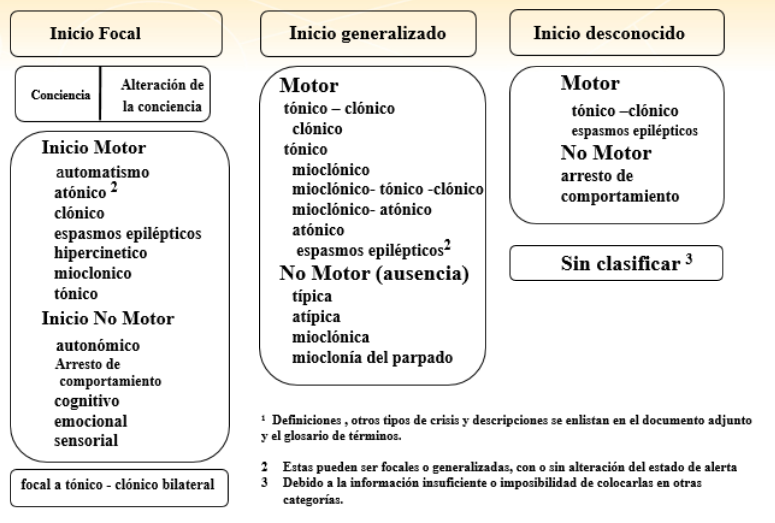

**Epilepsia**: enfermedad crónica del cerebro caracterizada por la presencia de crisis epilépticas recurrentes.Criterios: 
- Dos o más crisis epilépticas no provocadas, con un intervalo de **al menos 24 horas entre ellas**.
- Una crisis epiléptica **no provocada** y una probabilidad de recurrencia de al menos **60%** en los próximos 10 años.
- Síndrome epiléptico.

Clasificación ILAE 2017: https://www.ilae.org/guidelines/definition-and-classification/classification-of-seizures

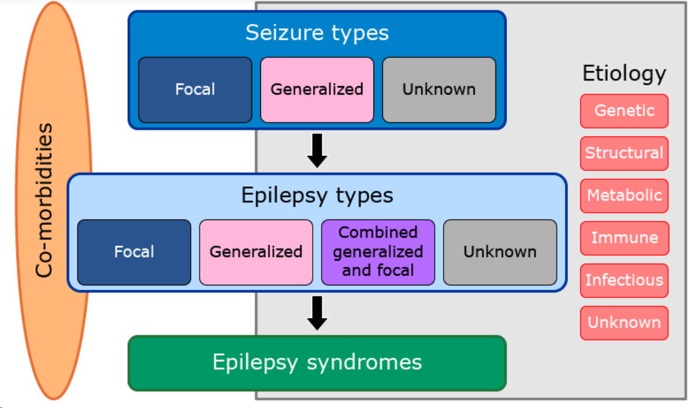

Etiología:
- Genética
- Estructural
- Metabólica
- Infecciosa
- Autoinmune
- Desconocida

Objetivos de evaluación:
1. Es crisis epiléptica? Es epilepsia?

2. Si es crisis, es sintomática? Es no provocada?

3. Caracterizar: tipo de crisis, síndrome epiléptico, etiología.

Estudio laboratorio inicial:
- HGT
- ELP, Ca, Mg
- Hemograma completo
- función renal
- función hepática
- OC
- screening toxicológico

- Neuroimagen ppalmente si focal, hallazgos EF neuro focalidad, Estado mental alterado prolongado
- ECG si sospecha causa cardíaca
- PL si sospecha infección SNC

EEG: no es necesario para el dx de epilepsia, pero puede ayudar a caracterizar el tipo de crisis y el síndrome epiléptico.

Se recomienda que el Monitoreo Vídeo EEG (MV-EEG) prolongado, se utilize en la evaluación de los niños que presentan dificultades de diagnóstico, después de una evaluación clínica y EEG estándar no concluyente

tb se puede pedir:
- Beta HCG por estudios disgnósticos y def de tto

Objetivos img:
- Neoplásica
- Malformación congénita
- Metabólica (inborn error of metabolism)
- Familial/neurocutánea
- Vascular/hypoxic-isquémica
- Traumática
- Infecciosa/inflamatoria
- Esclerosis/deformación hipocampal 

## Crisis febriles
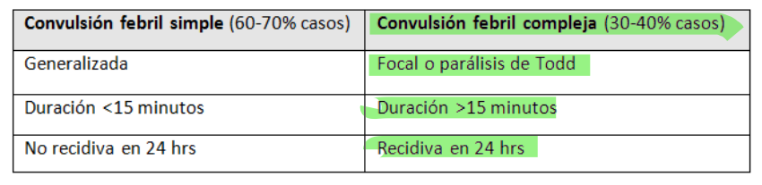

## diferencial

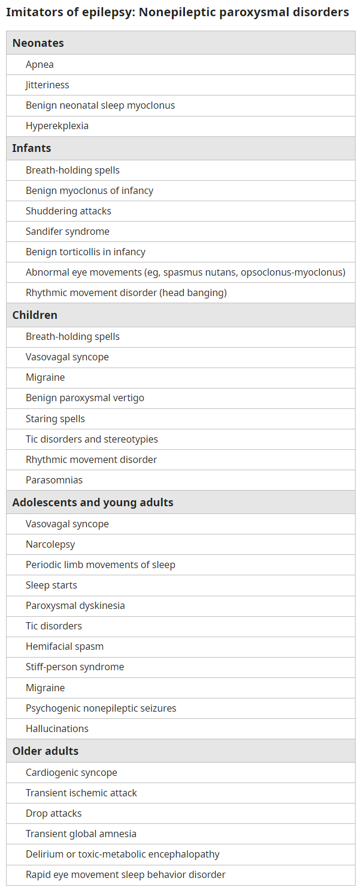

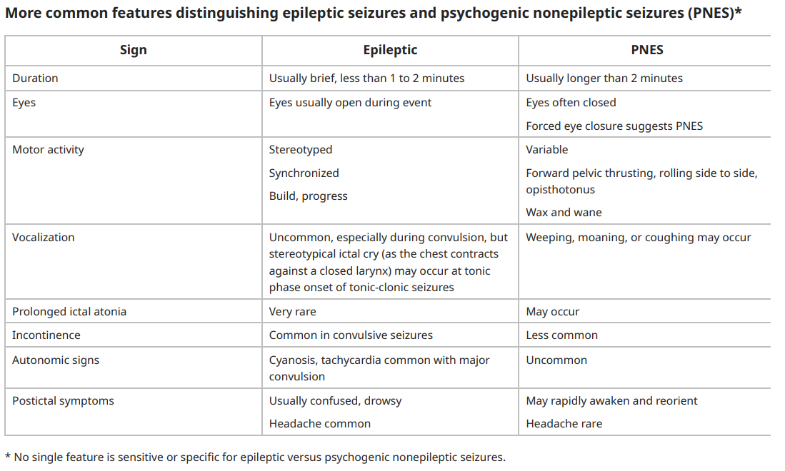

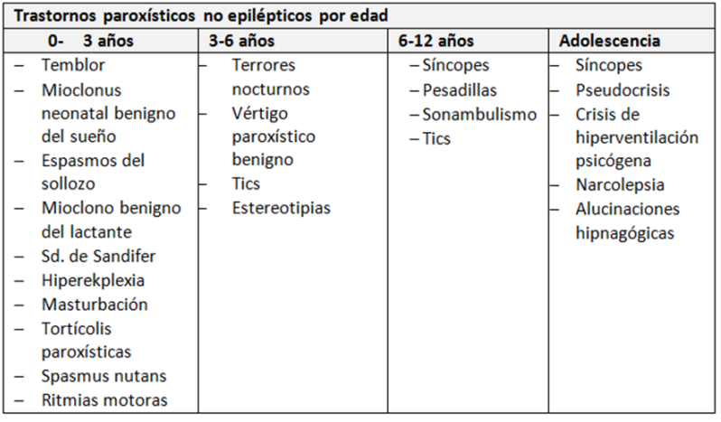

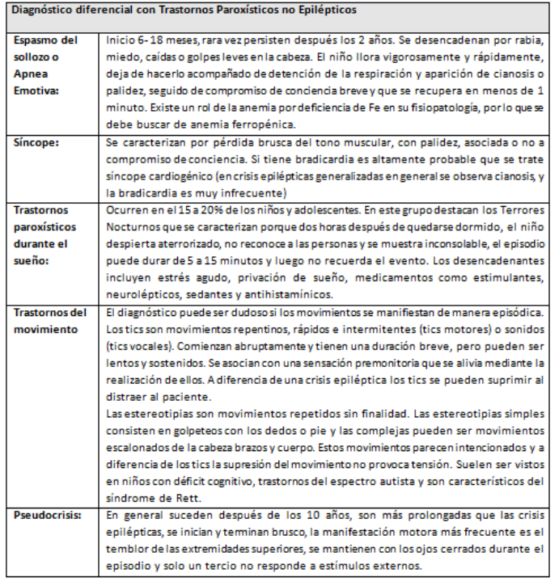

## Tto
Se recomienda en niños con riesgo de depresión, evitar el uso de antiepilépticos que puedan causar alteraciones del ánimo como efecto adverso, tales como barbitúricos, vigabatrina, tiagabina y topiramato. 

Se recomienda descontinuar el tratamiento en forma gradual, con un FAE cada vez y hacerlo lentamente (tomar 3 meses por cada fármaco). Grado de Recomendación A.

Se recomienda a toda persona con epilepsia refractaria a fármacos antieplépticos, sea referida a un centro de evaluación pre-quirúrgica. Grado de recomendación A

Se recomienda a toda persona con epilepsia refractaria a fármacos antieplépticos y con posibilidades de mejorar su epilepsia con cirugía resectiva, sea tratada quirúrgicamente. Grado de recomendación A

Guía ges

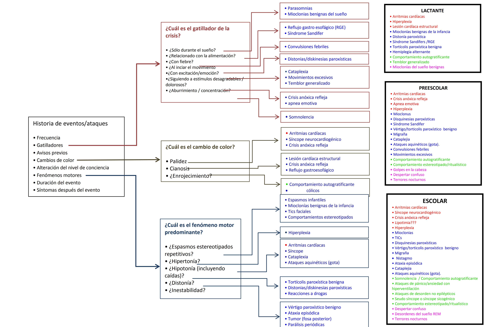

Se aconseja iniciar tratamiento de inmediato si una crisis dura más de 2 minutos (21), dado menores de un año, en crisis focales y cuando el EEG tiene actividad anormal

Segunda dosis BZP si persiste 10 minutos

Si persiste por >20 minutos, se recomienda iniciar tratamiento con 1°)fenitoína o 2°)fenobarbital.

Si a pesar de estas intervenciones, el estatus dura más de 60 minutos, puede ser necesarioiniciar infusión continua de Midazolam o Propofol, y algunos pacientes pueden requerir anestesia general y bloqueo neuromuscular

## Mecanismo fcos

### Disminución actividad glutamatérgica

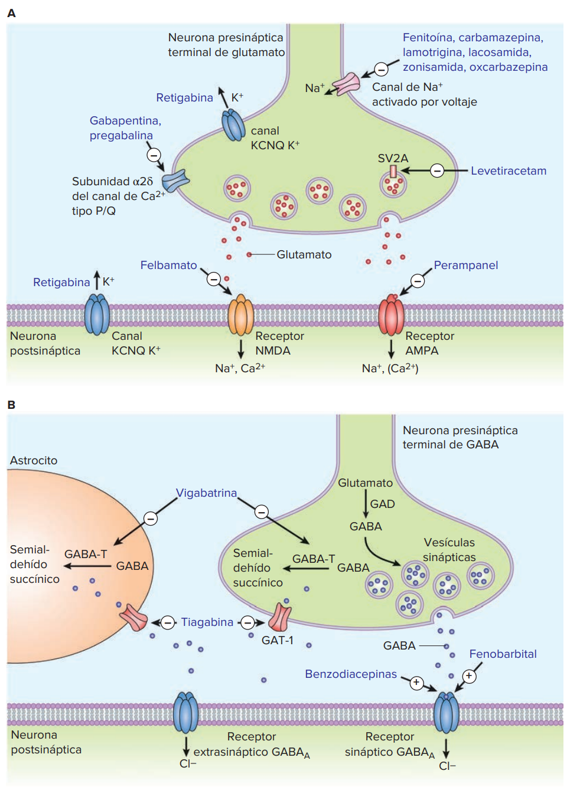

Inhibición canales Na+ dependientes de voltaje:
- Carbamazepina
- Oxcarbamazepina
- Fenitoína
- lamotrigina
- Topiramato
- Valproato
- Lacosamida

Inhibición canales Ca2+ dependientes de voltaje:
- Etosuximida
- (tb pregabalina, gabapentina)

Bloqueo SV2A:
- Levetiracetam

Bloqueo receptores AMPA:
- perampanel

Bloqueo receptores NMDA:
- felbamato
- ketamina

### Aumento actividad GABAérgica

Potenciación GABAa:
- Benzodiacepinas: aumentan frecuencia de apertura de canales Cl- dependientes de GABA
- Barbitúricos: aumentan duración de apertura de canales Cl- dependientes de GABA

Inhibición GABA transaminasa:
- Vigabatrina

Inhibición recaptación GABA:
- Tiagabina

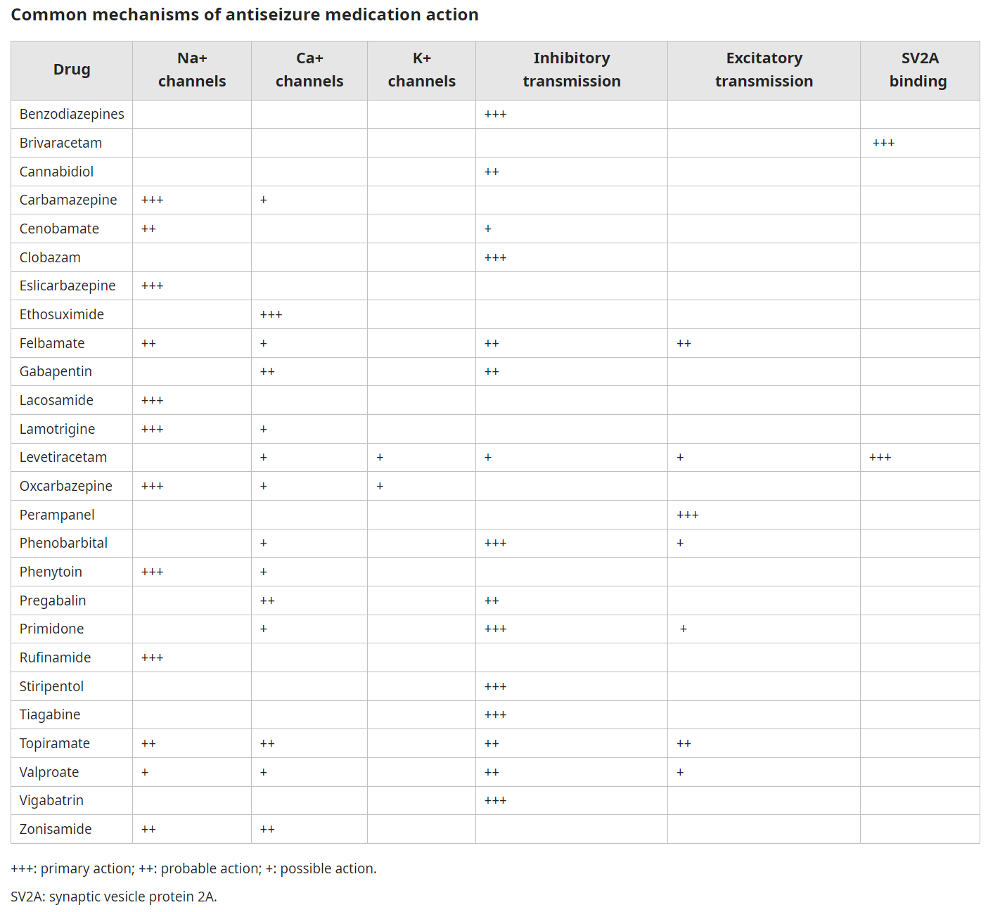

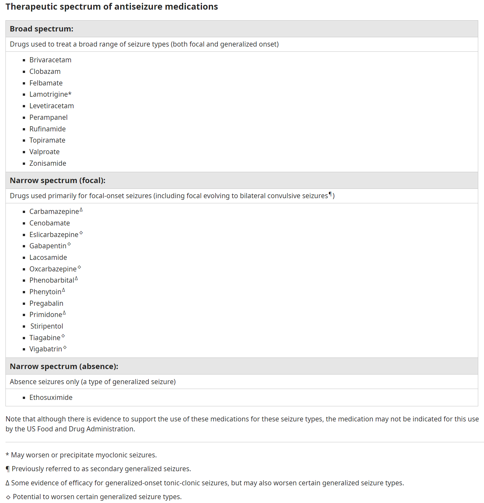

## FAE más usados según tipo de crisis

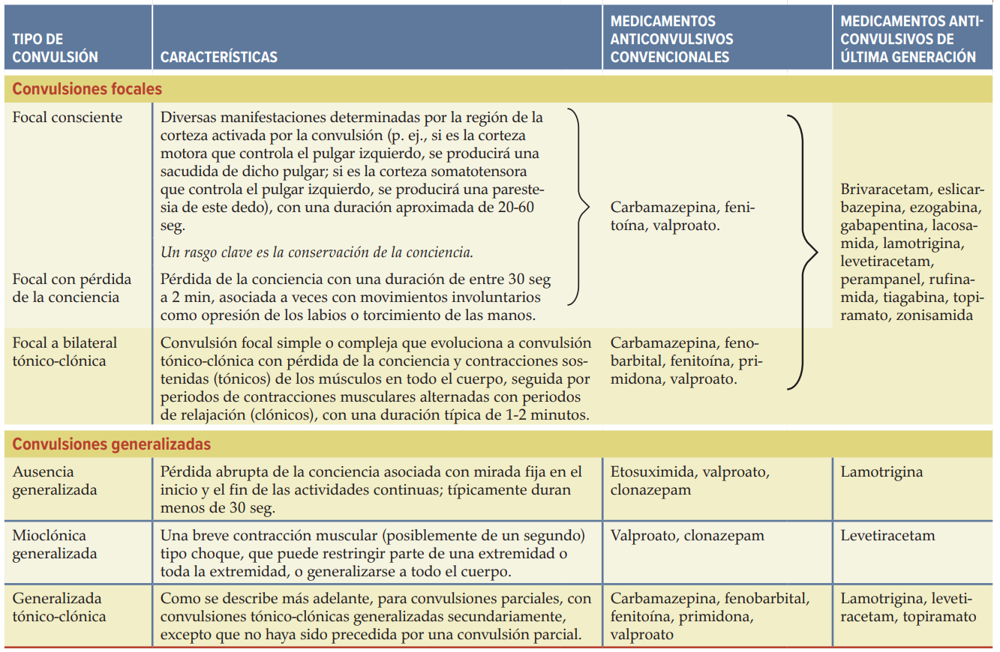

Dosificación inicial, mantención y un poquito de PK
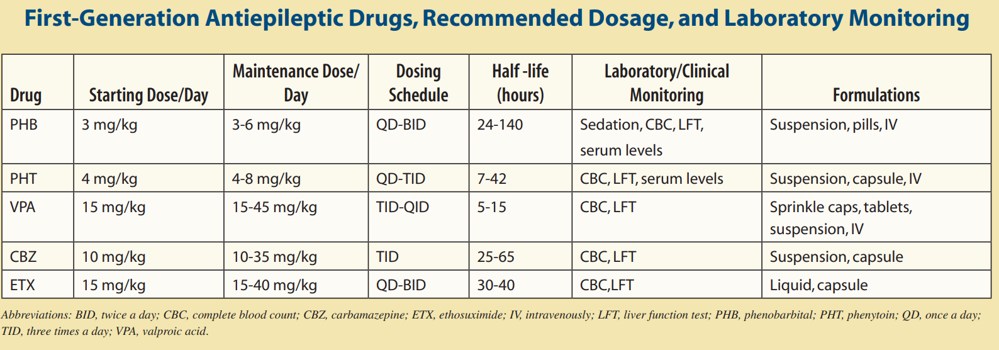 
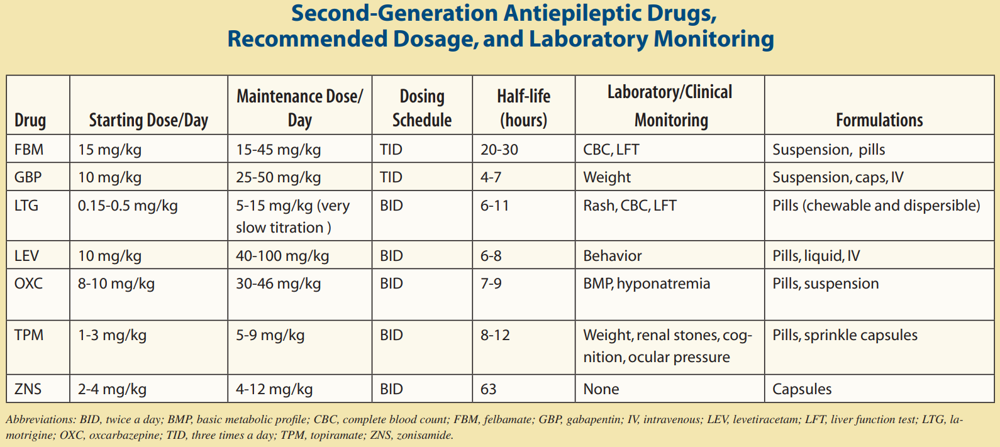

## Manejo de crisis

1. BZP:

| Fármaco | Dosis | Vía | inicio | duración |
|---------|-------|-----|--------|----------|
| lorazepam | 0,05-0,1 mg/kg se puede repetir cada 5 a 15 min | IV/IM | 2-5 min | 12-24 h |
| diazepam | 0,2-0,4 mg/kg IV / 0,5-1 mg/kg rectal | IV/Rectal | 2-5 min | 15-30 min |
| midazolam | 0,2-0,3 mg/kg intra nasal / 0,05-0,1 mg/kg IV | Nasal/IV | 2-5 min | 15-30 min |

2. Fenitoína: 

| dosis | inicio | RAM |
|-------|--------|-----|
| 10-20 mg/kg IV en 20 min | 5-10 min | Hipotensión / Arritmias|

3. Fenobarbital:

| dosis | inicio | RAM |
|-------|--------|-----|
| 20 mg/kg IV en 20 min | 15-20 min | depresión respi, sedación, hipotensión|

## estado epiléptico
Debido a que se considera que la actividad convulsiva persistente causa daño neuronal permanente y porque la mayoría de las convulsiones terminan en 2 a 3 minutos, suele aceptarse que el tratamiento debe comenzar cuando la duración de la convulsión alcanza los 5 minutos para las crisis tónico clónicas generalizadas y 10 minutos para las crisis focales con o sin deterioro de la conciencia. Es de destacar que el estado epiléptico convulsivo puede evolucionar a un estado epiléptico no convulsivo

## síndromes epilépticos

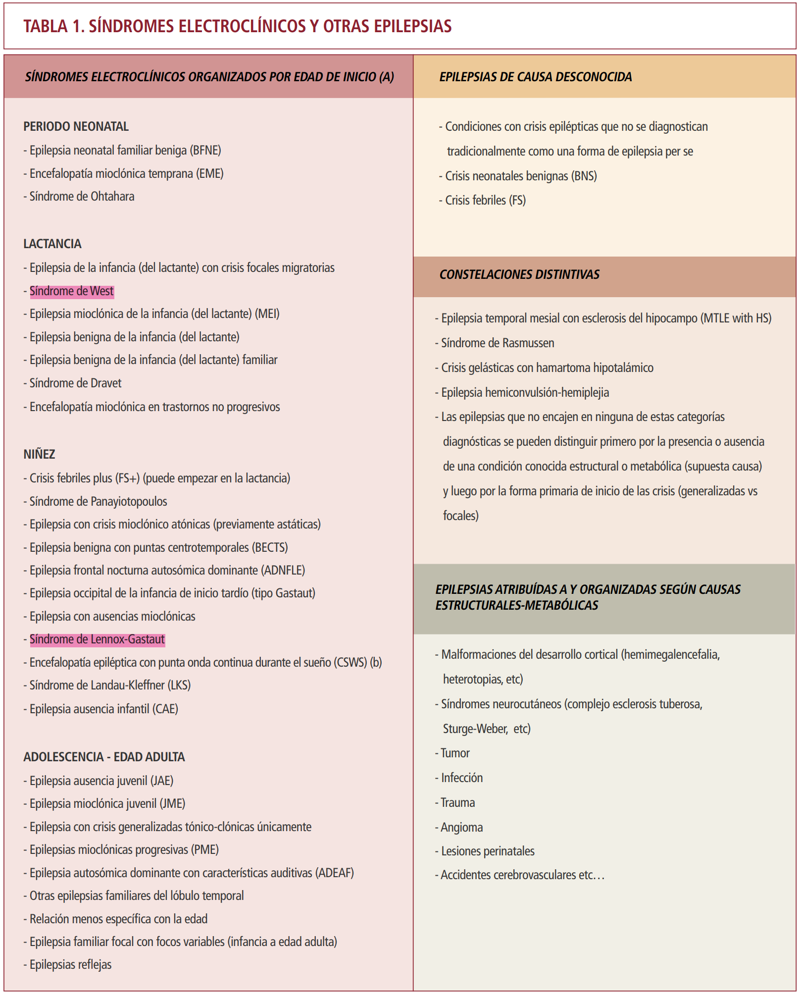