# Pediatría

## datitos antropometría

### mujeres
| edad | peso | aumento de peso | talla |  aumento de talla | Perímetro cefálico |
|------|------|-------|-------------|--------------------| --------|
| 0-1 mes | 3.2-4.2 kg | 1 kg/mes | 50-54 cm | 4-5 cm/mes | 34-37 cm |
| 1-2 meses | 4.2-5.2 kg | 1 kg/mes | 54-58 cm | 3-4 cm/mes | 37-39 cm |
| 2-3 meses | 5.2-5.8 kg | 0.5 kg/mes | 58-60 cm | 2-3 cm/mes | 39-41 cm |
| 3-6 meses | 5.8-7.0 kg | 0.5 kg/mes | 60-66 cm | 2-3 cm/mes | 41-43 cm |
| 6-12 meses | 7.0-9.0 kg | 0.25 kg/mes | 66-74 cm | 1-2 cm/mes | 43-45 cm |
| 1-2 años | 9.0-12.0 kg | 0.25 kg/mes | 74-84 cm | 1-2 cm/mes | 45-47 cm |
| 2-3 años | 12.0-14.0 kg | 0.25 kg/mes | 84-94 cm | 1-2 cm/mes | 47-49 cm |
| 3-4 años | 14.0-16.0 kg | 0.25 kg/mes | 94-104 cm | 1-2 cm/mes | 49-51 cm |
| 4-5 años | 16.0-18.0 kg | 0.25 kg/mes | 104-114 cm | 1-2 cm/mes | 51-53 cm |

### hombres
| edad | peso | aumento de peso | talla |  aumento de talla | Perímetro cefálico |
|------|------|-------|-------------|--------------------| --------|
| 0-1 mes | 3.4-4.4 kg | 1 kg/mes | 51-55 cm | 4-5 cm/mes | 34-37 cm |
| 1-2 meses | 4.4-5.4 kg | 1 kg/mes | 55-59 cm | 3-4 cm/mes | 37-39 cm |
| 2-3 meses | 5.4-6.0 kg | 0.5 kg/mes | 59-61 cm | 2-3 cm/mes | 39-41 cm |
| 3-6 meses | 6.0-7.2 kg | 0.5 kg/mes | 61-67 cm | 2-3 cm/mes | 41-43 cm |
| 6-12 meses | 7.2-9.5 kg | 0.25 kg/mes | 67-75 cm | 1-2 cm/mes | 43-45 cm |
| 1-2 años | 9.5-12.5 kg | 0.25 kg/mes | 75-85 cm | 1-2 cm/mes | 45-47 cm |
| 2-3 años | 12.5-14.5 kg | 0.25 kg/mes | 85-95 cm | 1-2 cm/mes | 47-49 cm |
| 3-4 años | 14.5-16.5 kg | 0.25 kg/mes | 95-105 cm | 1-2 cm/mes | 49-51 cm |
| 4-5 años | 16.5-18.5 kg | 0.25 kg/mes | 105-115 cm | 1-2 cm/mes | 51-53 cm |

Referencias de peso:
- perdida de peso primeros días: 5-10%
- retorno a peso nacimiento: 7 a 10 días
- aumento de **1 kg/mes** el primer año (2 kg/mes en )primeros 3 meses
- duplicación peso en 4 a 5 meses
- triplicación peso en 1 año
- aumento de peso diario: 20-30 g/día los primeros 3-4 meses, 15-20 g/día el resto del primer año

Referencias de talla:
- Longitud al nacim: **50 cm**
- Longitud al año: **75 cm**
- a los 4 años: 100 cm (**duplica** talla al nacimiento)

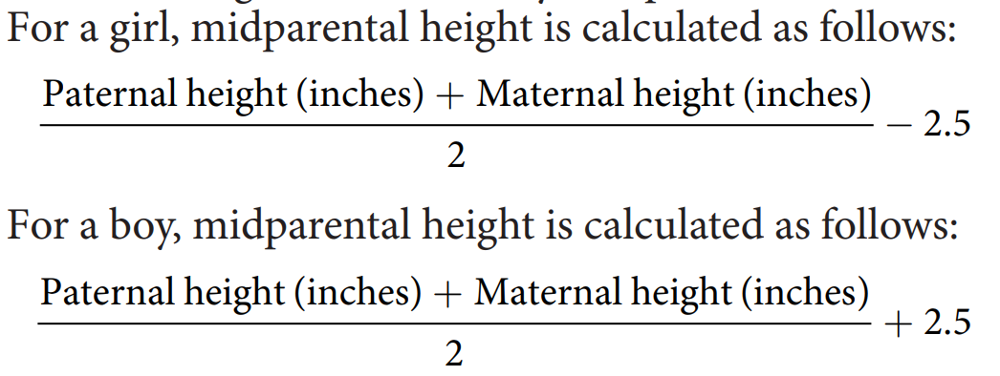

Referencias de perímetro cefálico:
- al nacimiento: **35 cm**
- aumento de **1 cm/mes** el primer año
    - 2 cm/mes los primeros 3 meses

Perímetro cefálico para la talla:

$$ PCT = frac{Talla}{2} + 10 \pm 1 $$

## Desarrollo psicomotor

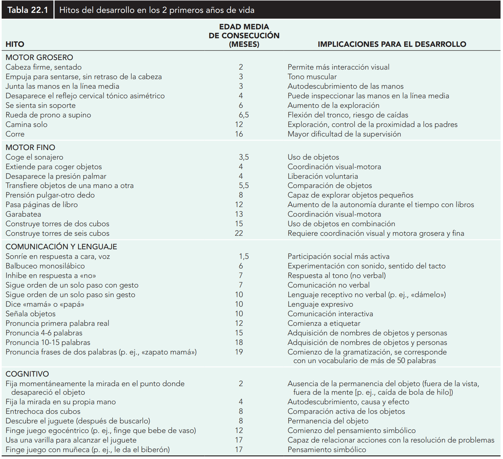

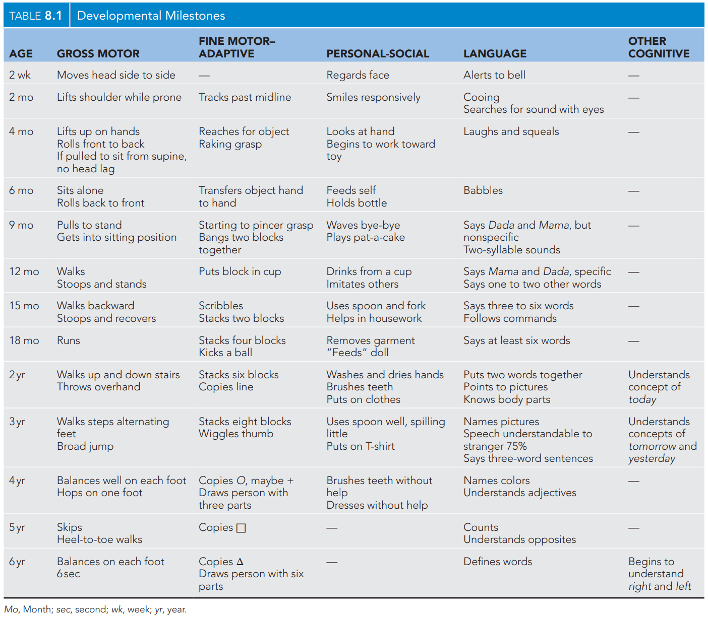

Alimentación:
- 7 a 8 meses: toman alimentos con la mano
- 8 a 11 meses: comen con la mano, transferencia de mano a boca
- 10 a 12 meses: comen con cuchara, pueden tomar vaso con dos manos
- 15 meses: beben en vaso sin ayuda (21 meses no derraman)

Reflejos arcaicos

| Reflejo | Desaparece | 
|---------|------------|
| marcha automática | 2 meses (4-6) |
| Moro | 2 meses (3-6) |
| reflejo de búsqueda | 3-4 meses |
| reflejo de succión | 3-4 meses |
| prensión palmar-plantar | 3-4 meses |
| gallant (trunk incurvation) | 4 meses |
| espadachin | 5-7 meses |
| Babinski | 2 año |

## erupción dentaria

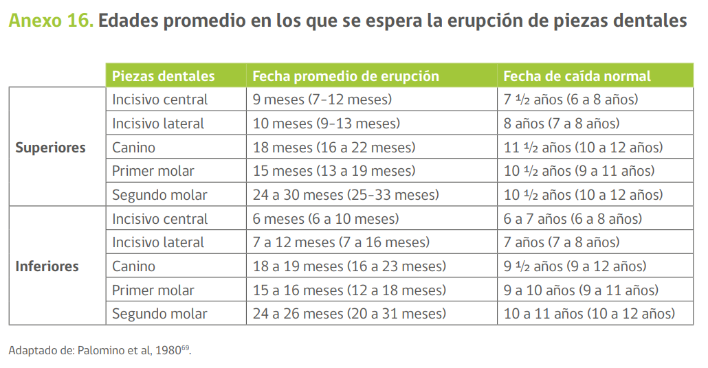

## Niño sano

### Recien Nacidos

Cantidad mínima de pañales con **pipí** en RN:
- 1 pañal el primer día
- 2 pañales el segundo día
- 3 pañales el tercer día
- 4 pañales el cuarto día
- 6 pañales desde el quinto día

Deposiciones:
- Meconio: días 1 a 3. Color negro, marrón o verde oscuro y de consistencia viscosa
- Transición día 3 a 4 verde grisáceo y no son tan viscosas
- Maduras: amarillo-doradas: 2 a 24 en total. Por lo general 1 después de cada toma
- Después del mes de vida pueden más de un día sin depos

### Programa nacional de inmunizaciones 2023
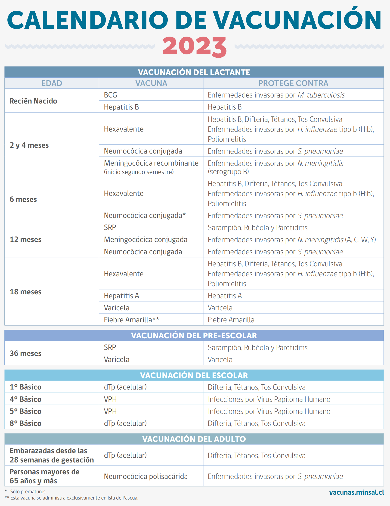

| Vacuna | composición | 
|--------|-------------|
| BCG | viva atenuada | 
| Hepatitis B | recombinante |
| difteria, tétanos, tos convulsiva | toxoide |
| tos convulsiva | acelular |
| Haemophilus influenzae tipo b | conjugada polisacárida + proteína|
| poliomielitis | inactivada |
| poliomielitis | viva atenuada |
| neumococo | conjugada polisacárida (inactiva) |
| meningococo | conjugada polisacárida (inactiva) |
| sarampión, parotiditis, rubéola, varicela | virus vivos atenuados |
| virus hepatitis A | inactivada |
| vph | inactivada |
| fiebre amarilla | virus vivos atenuados |

### Nutrición

Promedio volumen lactancia materna primeros 6 meses: 800 ml/día

Problemas leche de vaca sin modificaciones: concentración excesiva de proteínas, calcio, fósforo y sodio y además es deficiente en ácidos 
grasos esenciales, vitamina C, E y D.

Composición leches

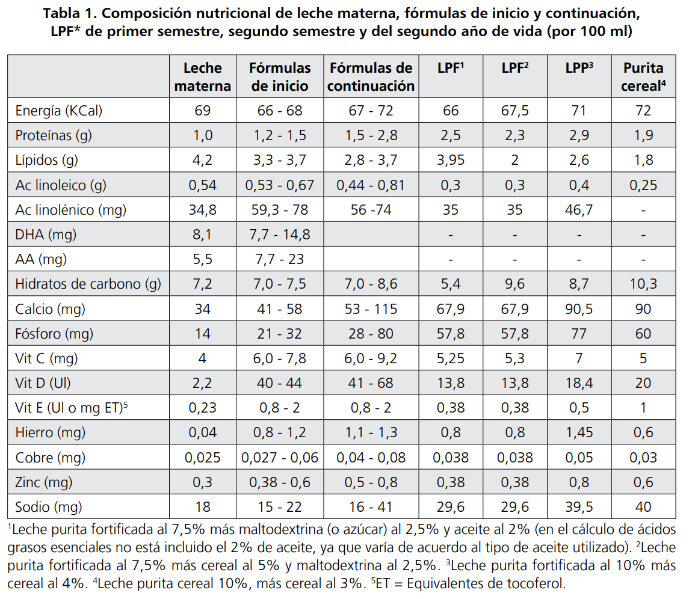

Volumen y Fraccionamiento de fórmulas: El volumen indicado de fórmula de inicio o de LPF varía de acuerdo a la edad y peso del niño, iniciándose la alimentación con aproximadamente **60 ml por vez en los primeros días**, para llegar aproximadamente a **200 ml por vez a los cinco meses**, utilizando el cálculo de <b styles="color: #0000ff"> 140 cc-160 cc x kg de peso x día</b>.

Requerimientos calóricos
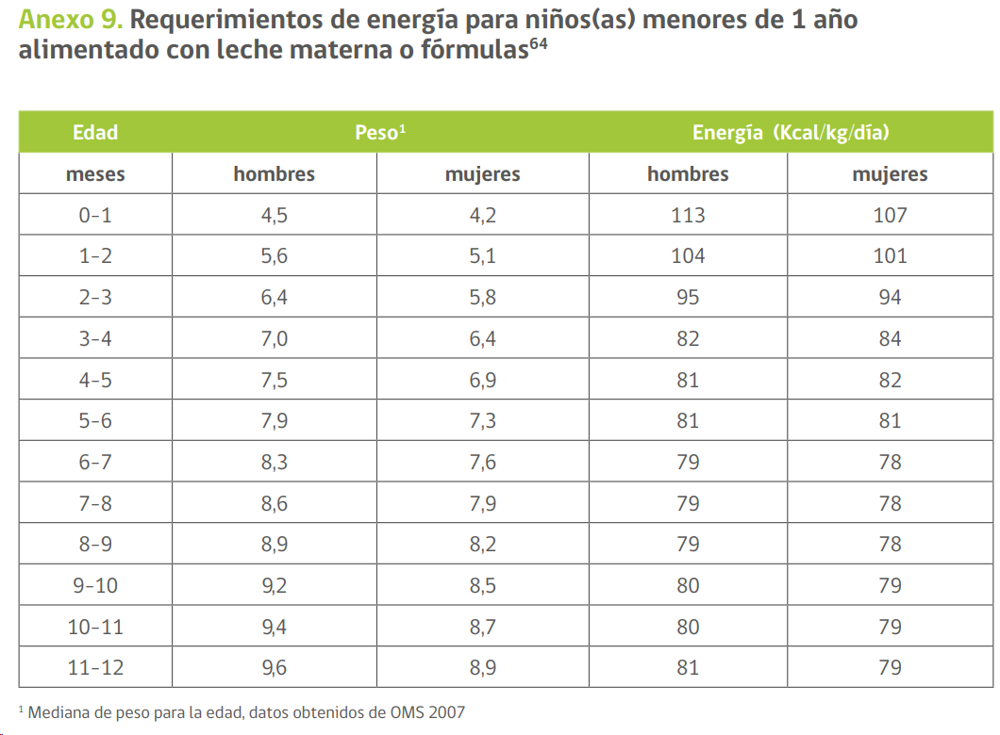
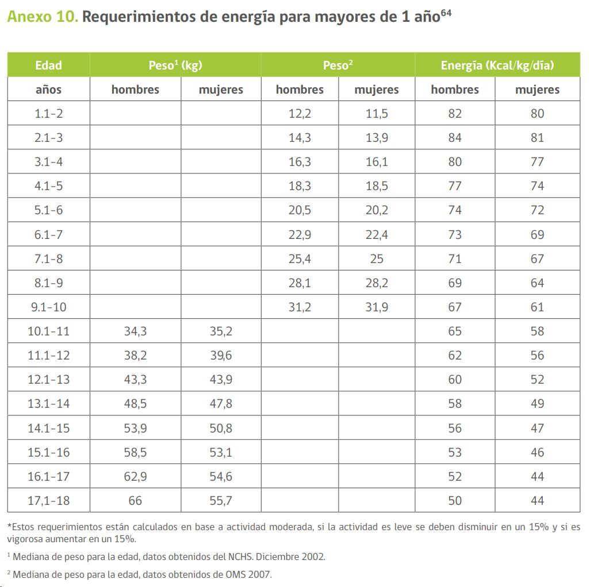

Cantidad y frecuencia de cada alimento a incorporar en una papilla de 6 a 11 meses

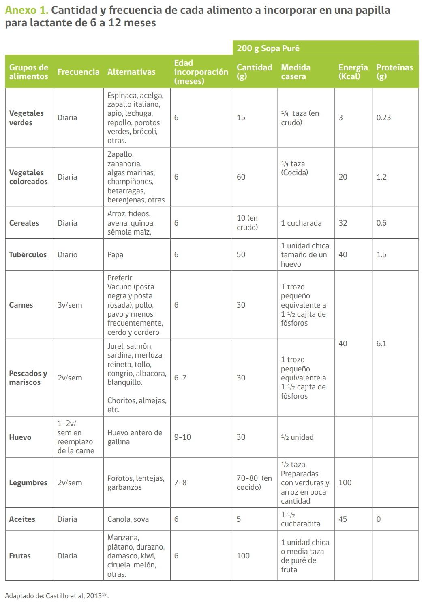
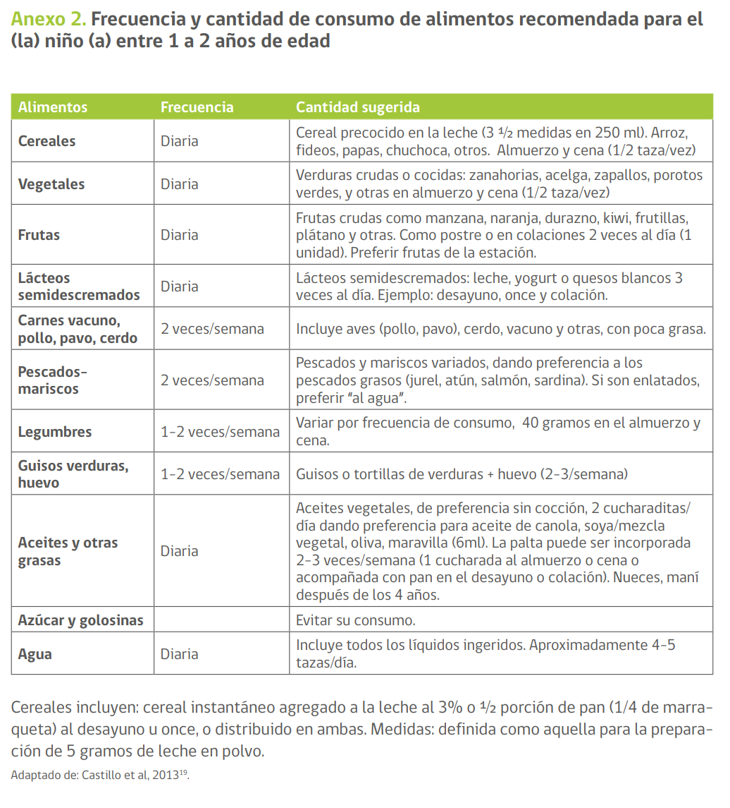

| alimento | edad inicio | frecuencia |
|----------|-------------| ---------- |
| vegetales verdes y coloreados | 6 meses | diaria |
| cereales | 6 meses | diaria |
| tubérculos | 6 meses | diaria |
| frutas | 6 meses | diaria |
| aceite | 6 meses | diaria |
| carnes | 6 meses | 3 veces/semana |
| pescados y mariscos | 6-7 meses | 2 veces/semana |
| legumbres | 7-8 meses | 2 veces/semana |
| huevo | 9-10 meses | 1-2 veces/semana |

resumen: 
- vegetales, cereales, tubérculos, frutas, aceite, carnes: **6** meses
- pescados y mariscos: **6-7** meses
- legumbres: **7-8** meses
- huevo: **9-10** meses

Primera papilla: 6 meses

Segunda papilla: 8 meses
- erupción incisivos superiores --> puré más grueso
- erupción molares (12 meses) --> molido con tenedor
- 8 meses: 150 ml comida + 100 ml fruta
- 9 meses: 200 ml comida + 100 ml fruta
- La alimentación complementaria debe aportar una densidad energética no inferior a la aportada a través de la leche materna, es decir entre **65 y 70 Kcal/100 g**. En su conjunto (2 papillas) no deben aportar más del 50% del aporte diario de energía, el resto de la energía debe ser aportado por la leche materna o la fórmula que la sustituya
- Incorporar las leguminosas guisadas con cereales entre los 7-8 meses (molidas, hasta alrededor de los 12 meses); una porción de ellas reemplaza al puré de verduras con carne. Se recomienda el consumo 2 veces por semana.
- Los **alimentos no deben ser soplados**, ni tampoco deben ser probados con el mismo cubierto que se utilizará para dar la comida, ambas acciones traspasan microorganismos a la boca del niño(a) y pueden estimular la producción de caries (transmisión vertical-horizontal); esto se conoce como ventana de infectividad y ocurre en promedio entre los 19 meses y 26 meses de edad

Suplementación:
- Vitamina D: 400 UI/día hasta 1 año de vida
- Fe: 1 mg/kg/día desde los 4 meses hasta 1 año de vida

# Infectología
## Enfermedad de kawasaki
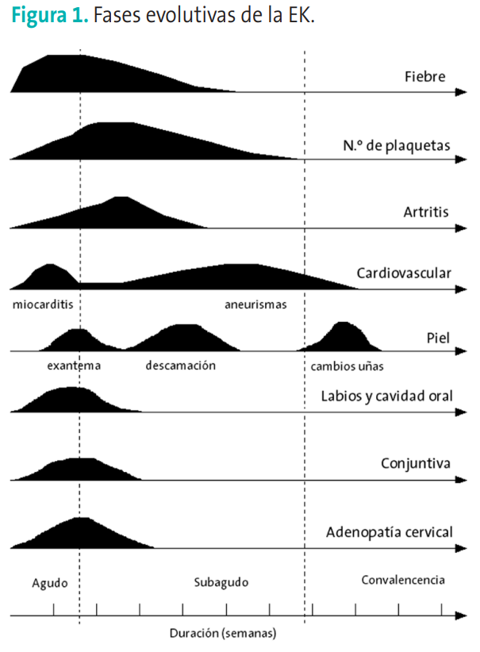

# Neumología
Infiltrado perihiliar + Banda presidencial en ADV RxTx

# Curso Emergencias pediátricas

