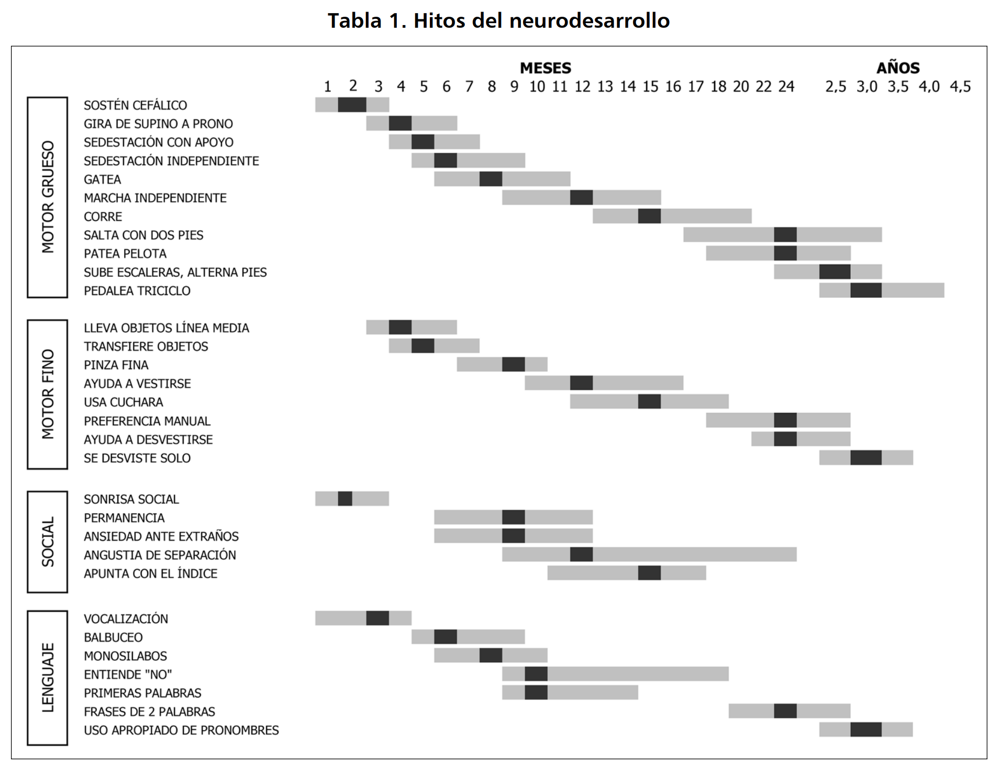
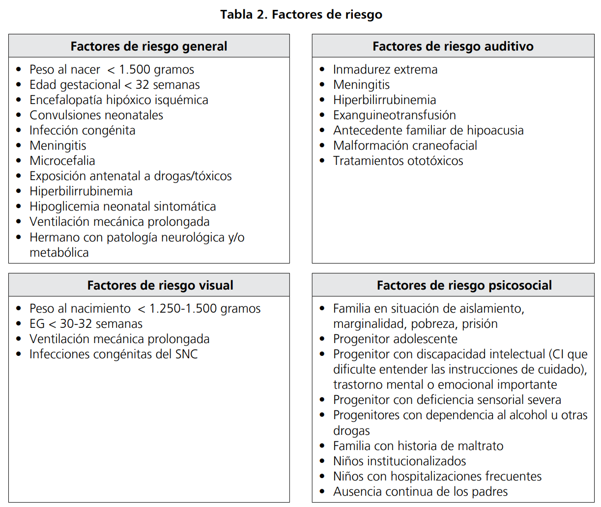
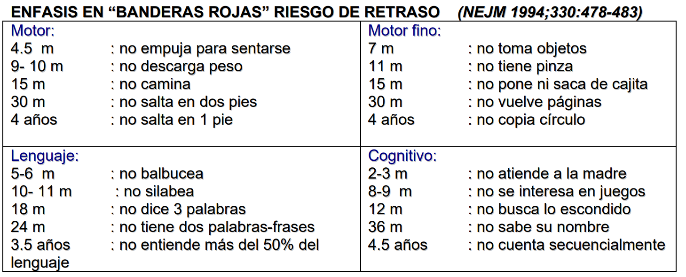

# Pediatría

## datitos antropometría

Referencias de peso:
- perdida de peso primeros días: 5-10%
- retorno a peso nacimiento: 7 a 10 días
- aumento de **1 kg/mes** el primer año (2 kg/mes en )primeros 3 meses
- duplicación peso en 4 a 5 meses
- triplicación peso en 1 año
- aumento de peso diario: 20-30 g/día los primeros 3-4 meses, 15-20 g/día el resto del primer año

Referencias de talla:
- Longitud al nacim: **50 cm**
- Longitud al año: **75 cm**
- a los 4 años: 100 cm (**duplica** talla al nacimiento)

Referencias de perímetro cefálico:
- al nacimiento: **35 cm**
- aumento de **1 cm/mes** el primer año
    - 2 cm/mes los primeros 3 meses

Perímetro cefálico para la talla:

$$ PCT = frac{Talla}{2} + 10 \pm 1 $$

Tablitas hechas por chatqpt, no revisadas...
### mujeres
| edad | peso | aumento de peso | talla |  aumento de talla | Perímetro cefálico |
|------|------|-------|-------------|--------------------| --------|
| 0-1 mes | 3.2-4.2 kg | 1 kg/mes | 50-54 cm | 4-5 cm/mes | 34-37 cm |
| 1-2 meses | 4.2-5.2 kg | 1 kg/mes | 54-58 cm | 3-4 cm/mes | 37-39 cm |
| 2-3 meses | 5.2-5.8 kg | 0.5 kg/mes | 58-60 cm | 2-3 cm/mes | 39-41 cm |
| 3-6 meses | 5.8-7.0 kg | 0.5 kg/mes | 60-66 cm | 2-3 cm/mes | 41-43 cm |
| 6-12 meses | 7.0-9.0 kg | 0.25 kg/mes | 66-74 cm | 1-2 cm/mes | 43-45 cm |
| 1-2 años | 9.0-12.0 kg | 0.25 kg/mes | 74-84 cm | 1-2 cm/mes | 45-47 cm |
| 2-3 años | 12.0-14.0 kg | 0.25 kg/mes | 84-94 cm | 1-2 cm/mes | 47-49 cm |
| 3-4 años | 14.0-16.0 kg | 0.25 kg/mes | 94-104 cm | 1-2 cm/mes | 49-51 cm |
| 4-5 años | 16.0-18.0 kg | 0.25 kg/mes | 104-114 cm | 1-2 cm/mes | 51-53 cm |

### hombres
| edad | peso | aumento de peso | talla |  aumento de talla | Perímetro cefálico |
|------|------|-------|-------------|--------------------| --------|
| 0-1 mes | 3.4-4.4 kg | 1 kg/mes | 51-55 cm | 4-5 cm/mes | 34-37 cm |
| 1-2 meses | 4.4-5.4 kg | 1 kg/mes | 55-59 cm | 3-4 cm/mes | 37-39 cm |
| 2-3 meses | 5.4-6.0 kg | 0.5 kg/mes | 59-61 cm | 2-3 cm/mes | 39-41 cm |
| 3-6 meses | 6.0-7.2 kg | 0.5 kg/mes | 61-67 cm | 2-3 cm/mes | 41-43 cm |
| 6-12 meses | 7.2-9.5 kg | 0.25 kg/mes | 67-75 cm | 1-2 cm/mes | 43-45 cm |
| 1-2 años | 9.5-12.5 kg | 0.25 kg/mes | 75-85 cm | 1-2 cm/mes | 45-47 cm |
| 2-3 años | 12.5-14.5 kg | 0.25 kg/mes | 85-95 cm | 1-2 cm/mes | 47-49 cm |
| 3-4 años | 14.5-16.5 kg | 0.25 kg/mes | 95-105 cm | 1-2 cm/mes | 49-51 cm |
| 4-5 años | 16.5-18.5 kg | 0.25 kg/mes | 105-115 cm | 1-2 cm/mes | 51-53 cm |

## Desarrollo psicomotor

Factores de riesgo DSM

Signos de alerta dsm

Banderas rojas dsm
 

Alimentación:
- 7 a 8 meses: toman alimentos con la mano
- 8 a 11 meses: comen con la mano, transferencia de mano a boca
- 10 a 12 meses: comen con cuchara, pueden tomar vaso con dos manos
- 15 meses: beben en vaso sin ayuda (21 meses no derraman)

Reflejos arcaicos

| Reflejo | Desaparece | 
|---------|------------|
| marcha automática | 2-3 meses |
| Moro | 4-6 meses |
| reflejo de búsqueda | 3-4 meses |
| reflejo de succión | 3-4 meses |
| prensión palmar | 3-4 meses |
| prensión plantar | 7-9 meses |
| gallant (trunk incurvation) | 4 meses |
| espadachin | 5-7 meses |
| Babinski | 2 año |

## erupción dentaria

## Niño sano

### Recien Nacidos

Cantidad mínima de pañales con **pipí** en RN:
- 1 pañal el primer día
- 2 pañales el segundo día
- 3 pañales el tercer día
- 4 pañales el cuarto día
- 6 pañales desde el quinto día

Deposiciones:
- Meconio: días 1 a 3. Color negro, marrón o verde oscuro y de consistencia viscosa
- Transición día 3 a 4 verde grisáceo y no son tan viscosas
- Maduras: amarillo-doradas: 2 a 24 en total. Por lo general 1 después de cada toma
- Después del mes de vida pueden más de un día sin depos

### Programa nacional de inmunizaciones 2023

<html xmlns:o="urn:schemas-microsoft-com:office:office"
xmlns:x="urn:schemas-microsoft-com:office:excel"
xmlns="http://www.w3.org/TR/REC-html40">

<head>
<meta http-equiv=Content-Type content="text/html; charset=windows-1252">
<meta name=ProgId content=Excel.Sheet>
<meta name=Generator content="Microsoft Excel 15">
<link rel=File-List href="Book1_files/filelist.xml">

<title>Vacunaci�n�2023</title>
</head>

<body>
<!--[if !excel]>&nbsp;&nbsp;<![endif]-->
<!--The following information was generated by Microsoft Excel's Publish as Web
Page wizard.-->
<!--If the same item is republished from Excel, all information between the DIV
tags will be replaced.-->
<!----------------------------->
<!--START OF OUTPUT FROM EXCEL PUBLISH AS WEB PAGE WIZARD -->
<!----------------------------->

<h1 style='color:black;font-family:Calibri;font-size:14.0pt;font-weight:800;
font-style:normal'>Vacunación 2023</h1>

<table border=0 cellpadding=0 cellspacing=0 width=1040 style='border-collapse:
 collapse;table-layout:fixed;width:779pt'>
 <col width=64 style='width:48pt'>
 <col width=107 span=6 style='mso-width-source:userset;mso-width-alt:3723;
 width:80pt'>
 <col width=109 style='mso-width-source:userset;mso-width-alt:3816;width:82pt'>
 <col width=118 style='mso-width-source:userset;mso-width-alt:4119;width:89pt'>
 <col width=107 style='mso-width-source:userset;mso-width-alt:3723;width:80pt'>
 <tr class=xl7416390 height=58 style='height:43.5pt'>
  <td height=58 class=xl7316390 width=64 style='height:43.5pt;width:48pt'>RN</td>
  <td class=xl7316390 width=107 style='width:80pt'>2</td>
  <td class=xl7316390 width=107 style='width:80pt'>4</td>
  <td class=xl7316390 width=107 style='width:80pt'>6</td>
  <td class=xl7316390 width=107 style='width:80pt'>12</td>
  <td class=xl7316390 width=107 style='width:80pt'>18</td>
  <td class=xl7316390 width=107 style='width:80pt'>36</td>
  <td class=xl7316390 width=109 style='width:82pt'>1ro (7a) y 8vo (14a)</td>
  <td class=xl7316390 width=118 style='width:89pt'>4to (10a) y 5to(11a)</td>
  <td class=xl7316390 width=107 style='width:80pt'>Embarazadas desde 28 semanas</td>
 </tr>
 <tr height=19 style='height:14.5pt'>
  <td height=19 class=xl6616390 width=64 style='height:14.5pt;width:48pt'>BCG</td>
  <td class=xl6916390 width=107 style='width:80pt'>Hexavalente</td>
  <td class=xl6916390 width=107 style='width:80pt'>Hexavalente</td>
  <td class=xl6916390 width=107 style='width:80pt'>Hexavalente</td>
  <td class=xl6616390 width=107 style='width:80pt'></td>
  <td class=xl6916390 width=107 style='width:80pt'>Hexavalente</td>
  <td class=xl6616390 width=107 style='width:80pt'></td>
  <td class=xl6616390 width=109 style='width:82pt'></td>
  <td class=xl6616390 width=118 style='width:89pt'>VPH</td>
  <td class=xl6616390 width=107 style='width:80pt'></td>
 </tr>
 <tr height=19 style='height:14.5pt'>
  <td height=19 class=xl6616390 width=64 style='height:14.5pt;width:48pt'>Hep B</td>
  <td class=xl6816390 width=107 style='width:80pt'>DTPa</td>
  <td class=xl6816390 width=107 style='width:80pt'>&nbsp;</td>
  <td class=xl6816390 width=107 style='width:80pt'>&nbsp;</td>
  <td class=xl6616390 width=107 style='width:80pt'></td>
  <td class=xl6816390 width=107 style='width:80pt'>&nbsp;</td>
  <td class=xl6616390 width=107 style='width:80pt'></td>
  <td class=xl6816390 width=109 style='width:82pt'>dTpa</td>
  <td class=xl6616390 width=118 style='width:89pt'></td>
  <td class=xl6816390 width=107 style='width:80pt'>dTpa</td>
 </tr>
 <tr height=19 style='height:14.5pt'>
  <td height=19 class=xl6616390 width=64 style='height:14.5pt;width:48pt'></td>
  <td class=xl6816390 width=107 style='width:80pt'>Polio inactivado</td>
  <td class=xl6816390 width=107 style='width:80pt'>&nbsp;</td>
  <td class=xl6816390 width=107 style='width:80pt'>&nbsp;</td>
  <td class=xl6616390 width=107 style='width:80pt'></td>
  <td class=xl6816390 width=107 style='width:80pt'>&nbsp;</td>
  <td class=xl6616390 width=107 style='width:80pt'></td>
  <td class=xl6616390 width=109 style='width:82pt'></td>
  <td class=xl6616390 width=118 style='width:89pt'></td>
  <td class=xl6616390 width=107 style='width:80pt'></td>
 </tr>
 <tr height=19 style='height:14.5pt'>
  <td height=19 class=xl6616390 width=64 style='height:14.5pt;width:48pt'></td>
  <td class=xl6816390 width=107 style='width:80pt'>HepB</td>
  <td class=xl6816390 width=107 style='width:80pt'>&nbsp;</td>
  <td class=xl6816390 width=107 style='width:80pt'>&nbsp;</td>
  <td class=xl6616390 width=107 style='width:80pt'></td>
  <td class=xl6816390 width=107 style='width:80pt'>&nbsp;</td>
  <td class=xl6616390 width=107 style='width:80pt'></td>
  <td class=xl6616390 width=109 style='width:82pt'></td>
  <td class=xl6616390 width=118 style='width:89pt'></td>
  <td class=xl6616390 width=107 style='width:80pt'></td>
 </tr>
 <tr height=19 style='height:14.5pt'>
  <td height=19 class=xl6616390 width=64 style='height:14.5pt;width:48pt'></td>
  <td class=xl6816390 width=107 style='width:80pt'>Hib</td>
  <td class=xl6816390 width=107 style='width:80pt'>&nbsp;</td>
  <td class=xl6816390 width=107 style='width:80pt'>&nbsp;</td>
  <td class=xl6616390 width=107 style='width:80pt'></td>
  <td class=xl6816390 width=107 style='width:80pt'>&nbsp;</td>
  <td class=xl6616390 width=107 style='width:80pt'></td>
  <td class=xl6616390 width=109 style='width:82pt'></td>
  <td class=xl6616390 width=118 style='width:89pt'></td>
  <td class=xl6616390 width=107 style='width:80pt'></td>
 </tr>
 <tr height=58 style='height:43.5pt'>
  <td height=58 class=xl6616390 width=64 style='height:43.5pt;width:48pt'></td>
  <td class=xl6716390 width=107 style='width:80pt'>Neumococo Conjugada</td>
  <td class=xl6716390 width=107 style='width:80pt'>Neumococo Conjugada</td>
  <td class=xl7116390 width=107 style='width:80pt'>* Neumococo Conjugada (solo prematuros)</td>
  <td class=xl6716390 width=107 style='width:80pt'>Neumococo Conjugada</td>
  <td class=xl6616390 width=107 style='width:80pt'></td>
  <td class=xl6616390 width=107 style='width:80pt'></td>
  <td class=xl6616390 width=109 style='width:82pt'></td>
  <td class=xl6616390 width=118 style='width:89pt'></td>
  <td class=xl6616390 width=107 style='width:80pt'></td>
 </tr>
 <tr height=39 style='height:29.0pt'>
  <td height=39 class=xl6616390 width=64 style='height:29.0pt;width:48pt'></td>
  <td class=xl7016390 width=107 style='width:80pt'>Meningocócica recombinante</td>
  <td class=xl7016390 width=107 style='width:80pt'>Meningocócica recombinante</td>
  <td class=xl6616390 width=107 style='width:80pt'></td>
  <td class=xl7016390 width=107 style='width:80pt'>Meningocócica Conjugada</td>
  <td class=xl6616390 width=107 style='width:80pt'></td>
  <td class=xl6616390 width=107 style='width:80pt'></td>
  <td class=xl6616390 width=109 style='width:82pt'></td>
  <td class=xl6616390 width=118 style='width:89pt'></td>
  <td class=xl6616390 width=107 style='width:80pt'></td>
 </tr>
 <tr height=39 style='height:29.0pt'>
  <td height=39 class=xl6616390 width=64 style='height:29.0pt;width:48pt'></td>
  <td class=xl6616390 width=107 style='width:80pt'></td>
  <td class=xl6616390 width=107 style='width:80pt'></td>
  <td class=xl6616390 width=107 style='width:80pt'></td>
  <td class=xl7216390 width=107 style='width:80pt'>SRP (12 meses, 3 letras)</td>
  <td class=xl6616390 width=107 style='width:80pt'></td>
  <td class=xl7216390 width=107 style='width:80pt'>SRP (12 * 3 = 36 meses)</td>
  <td class=xl6616390 width=109 style='width:82pt'></td>
  <td class=xl6616390 width=118 style='width:89pt'></td>
  <td class=xl6616390 width=107 style='width:80pt'></td>
 </tr>
 <tr height=19 style='height:14.5pt'>
  <td height=19 class=xl6516390 width=64 style='height:14.5pt;width:48pt'></td>
  <td class=xl6516390 width=107 style='width:80pt'></td>
  <td class=xl6516390 width=107 style='width:80pt'></td>
  <td class=xl6516390 width=107 style='width:80pt'></td>
  <td class=xl6516390 width=107 style='width:80pt'></td>
  <td class=xl6516390 width=107 style='width:80pt'>Hepatitis A</td>
  <td class=xl6516390 width=107 style='width:80pt'></td>
  <td class=xl6516390 width=109 style='width:82pt'></td>
  <td class=xl6516390 width=118 style='width:89pt'></td>
  <td class=xl6516390 width=107 style='width:80pt'></td>
 </tr>
 <tr height=19 style='height:14.5pt'>
  <td height=19 class=xl6516390 width=64 style='height:14.5pt;width:48pt'></td>
  <td class=xl6516390 width=107 style='width:80pt'></td>
  <td class=xl6516390 width=107 style='width:80pt'></td>
  <td class=xl6516390 width=107 style='width:80pt'></td>
  <td class=xl6516390 width=107 style='width:80pt'></td>
  <td class=xl6516390 width=107 style='width:80pt'>Varicela</td>
  <td class=xl6516390 width=107 style='width:80pt'>Varicela</td>
  <td class=xl6516390 width=109 style='width:82pt'></td>
  <td class=xl6516390 width=118 style='width:89pt'></td>
  <td class=xl6516390 width=107 style='width:80pt'></td>
 </tr>
 <tr height=39 style='height:29.0pt'>
  <td height=39 class=xl6516390 width=64 style='height:29.0pt;width:48pt'></td>
  <td class=xl6516390 width=107 style='width:80pt'></td>
  <td class=xl6516390 width=107 style='width:80pt'></td>
  <td class=xl6516390 width=107 style='width:80pt'></td>
  <td class=xl6516390 width=107 style='width:80pt'></td>
  <td class=xl6516390 width=107 style='width:80pt'>Fiebre amarilla (Rapa Nui)</td>
  <td class=xl6516390 width=107 style='width:80pt'></td>
  <td class=xl6516390 width=109 style='width:82pt'></td>
  <td class=xl6516390 width=118 style='width:89pt'></td>
  <td class=xl6516390 width=107 style='width:80pt'></td>
 </tr>
 <![if supportMisalignedColumns]>
 <tr height=0 style='display:none'>
  <td width=64 style='width:48pt'></td>
  <td width=107 style='width:80pt'></td>
  <td width=107 style='width:80pt'></td>
  <td width=107 style='width:80pt'></td>
  <td width=107 style='width:80pt'></td>
  <td width=107 style='width:80pt'></td>
  <td width=107 style='width:80pt'></td>
  <td width=109 style='width:82pt'></td>
  <td width=118 style='width:89pt'></td>
  <td width=107 style='width:80pt'></td>
 </tr>
 <![endif]>
</table>

<!----------------------------->
<!--END OF OUTPUT FROM EXCEL PUBLISH AS WEB PAGE WIZARD-->
<!----------------------------->
</body>

</html>

| Vacuna | composición | 
|--------|-------------|
| BCG | viva atenuada | 
| Hepatitis B | recombinante |
| difteria, tétanos | toxoides (en la abreviatura DT/dt, mayúscula/minúscula implica más/menos toxoide, por eso hasta los 18 meses se da la DTPa y luego los refuerzos tienen la dTPa) |
| tos convulsiva | acelular ("DTPa" la a implica **ACELULAR**. Creo que la con virus atenuado creo que ya no está disponible) |
| Haemophilus influenzae tipo b | conjugada polisacárida + proteína|
| poliomielitis | inactivada, esta es la de la hexavalente|
| poliomielitis | viva atenuada (ya no se da)|
| neumococo | conjugada polisacárida (inactiva) |
| meningococo | conjugada polisacárida (inactiva) tetravalente (A, C, W, Y) |
| meningococo | recombinante monovalente (serotipo B) |
| sarampión, parotiditis, rubéola, varicela | virus vivos atenuados |
| virus hepatitis A | inactivada |
| vph | inactivada |
| fiebre amarilla | virus vivos atenuados |

Chile, Julio: El **palivizumab** se administrará a los niños y niñas que pesan bajo los 2.500 gramos al nacer o que tengan hasta 34 semanas y seis días de gestación.

### Nutrición

Promedio volumen lactancia materna primeros 6 meses: 800 ml/día

Problemas leche de vaca sin modificaciones: concentración excesiva de proteínas, calcio, fósforo y sodio y además es deficiente en ácidos 
grasos esenciales, vitamina C, E y D.

Composición leches

Volumen y Fraccionamiento de fórmulas: El volumen indicado de fórmula de inicio o de LPF varía de acuerdo a la edad y peso del niño, iniciándose la alimentación con aproximadamente **60 ml por vez en los primeros días**, para llegar aproximadamente a **200 ml por vez a los cinco meses**, utilizando el cálculo de <b styles="color: #0000ff"> 140 cc-160 cc x kg de peso x día</b>.

Requerimientos calóricos

Cantidad y frecuencia de cada alimento a incorporar en una papilla de 6 a 11 meses

| alimento | edad inicio | frecuencia |
|----------|-------------| ---------- |
| vegetales verdes y coloreados | 6 meses | diaria |
| cereales | 6 meses | diaria |
| tubérculos | 6 meses | diaria |
| frutas | 6 meses | diaria |
| aceite | 6 meses | diaria |
| carnes | 6 meses | 3 veces/semana |
| pescados y mariscos | 6-7 meses | 2 veces/semana |
| legumbres | 7-8 meses | 2 veces/semana |
| huevo | 9-10 meses | 1-2 veces/semana |

Resumen: 
- vegetales, cereales, tubérculos, frutas, aceite, carnes: **6** meses
- pescados y mariscos: **6-7** meses
- legumbres: **7-8** meses
- huevo: **9-10** meses

Primera papilla: 6 meses

Segunda papilla: 8 meses
- erupción incisivos superiores --> puré más grueso
- erupción molares (12 meses) --> molido con tenedor
- 8 meses: 150 ml comida + 100 ml fruta
- 9 meses: 200 ml comida + 100 ml fruta
- La alimentación complementaria debe aportar una densidad energética no inferior a la aportada a través de la leche materna, es decir entre **65 y 70 Kcal/100 g**. En su conjunto (2 papillas) no deben aportar más del 50% del aporte diario de energía, el resto de la energía debe ser aportado por la leche materna o la fórmula que la sustituya
- Incorporar las leguminosas guisadas con cereales entre los 7-8 meses (molidas, hasta alrededor de los 12 meses); una porción de ellas reemplaza al puré de verduras con carne. Se recomienda el consumo 2 veces por semana.
- Los **alimentos no deben ser soplados**, ni tampoco deben ser probados con el mismo cubierto que se utilizará para dar la comida, ambas acciones traspasan microorganismos a la boca del niño(a) y pueden estimular la producción de caries (transmisión vertical-horizontal); esto se conoce como ventana de infectividad y ocurre en promedio entre los 19 meses y 26 meses de edad

Suplementación:
- Vitamina D: 400 UI/día hasta 1 año de vida
- Fe: 1 mg/kg/día desde los 4 meses hasta 1 año de vida

#### >2 años
Guías Alimentarias para la Población Chilena
1. Para tener un peso saludable, come sano y realiza actividad física diariamente.
2. Pasa menos tiempo frente al computador o la tele y camina a paso rápido, mínimo 30 minutos al día.
3. Come alimentos con poca sal y saca el salero de la mesa.
4. Si quieres tener un peso saludable, evita el azúcar, dulces, bebidas y jugos azucarados.
5. Cuida tu corazón evitando las frituras y alimentos con grasas como cecinas y mayonesa.
6. Come 5 veces verduras y frutas frescas de distintos colores, cada día.
7. Para fortalecer tus huesos, consume 3 veces en el día lácteos bajos en grasa y azúcar.
8. Para mantener sano tu corazón, come pescado al horno a la plancha, 2 veces por semana.
9. Consume legumbres al menos dos veces por semana, sin mezclarlas con cecinas.
10. Para mantenerte hidratado, toma 6 a 8 vasos de agua al día.
11. Lee y compara las etiquetas de los alimentos y prefiere los que tengan menos grasas, azúcar y sal (sodio)

Lo ideal es consumir **4 comidas** establecidas en el día: desayuno, almuerzo, once y cena, y eventualmente una colación saludable. Se recomienda que la distribución energética de estos tiempos sea **desayuno 25%, Colación 5%, Almuerzo 30%, Once 15%, Cena 25%**.

# Infectología
## Enfermedad de kawasaki

# Neumología
Infiltrado perihiliar + Banda presidencial en ADV RxTx

# Curso Emergencias pediátricas

