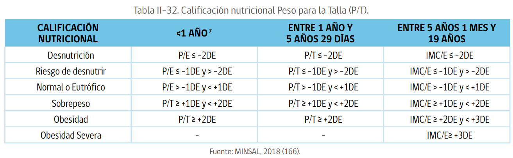
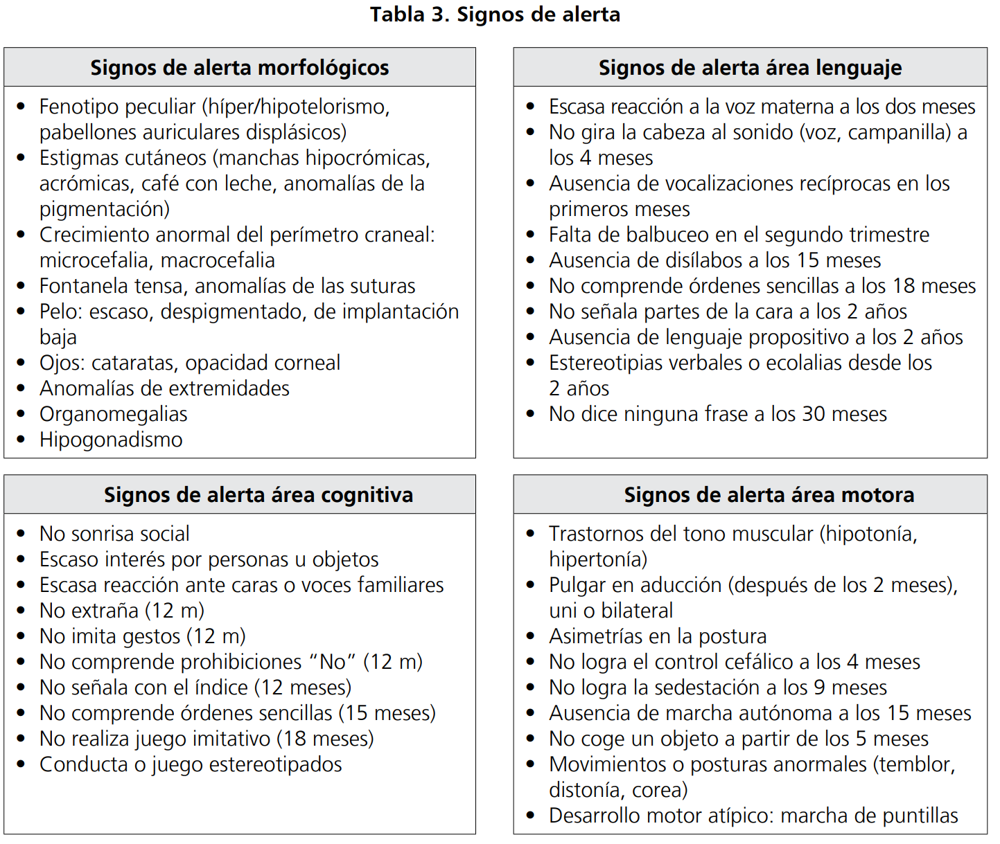
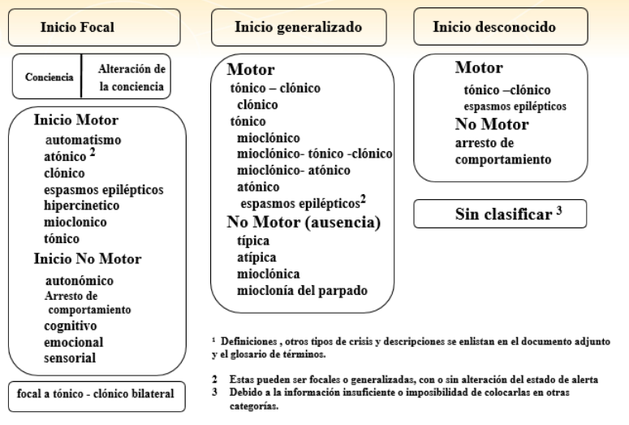
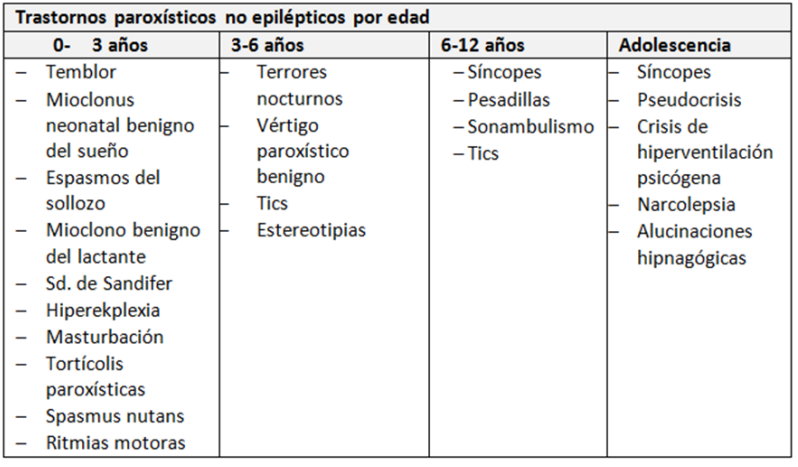
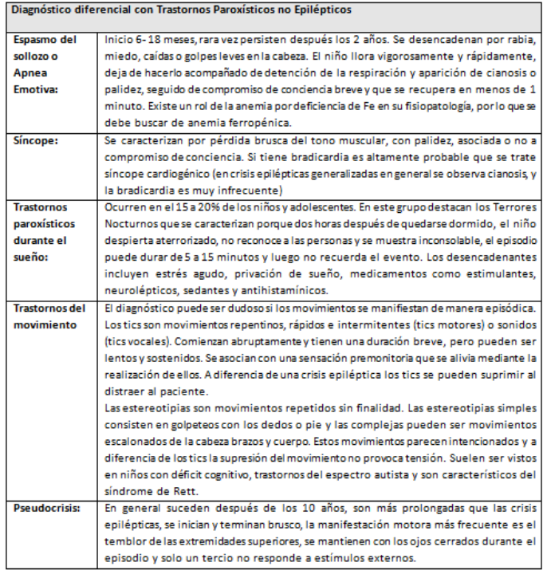
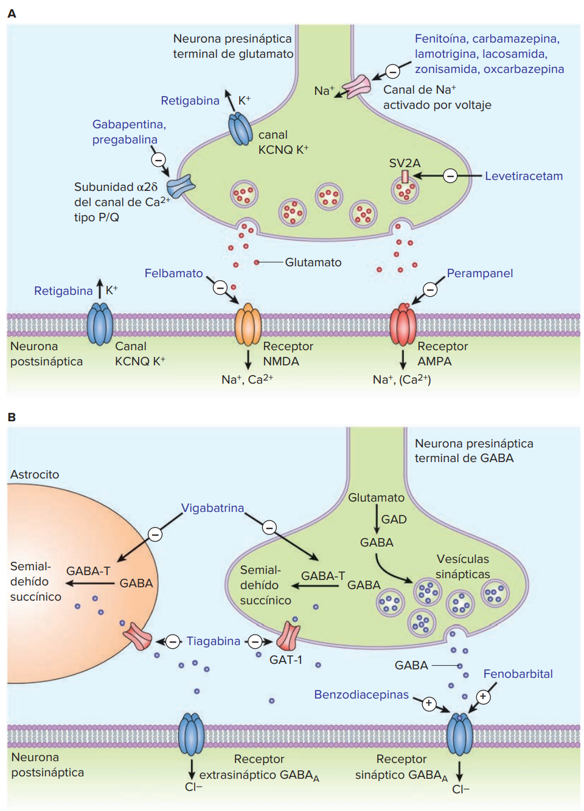
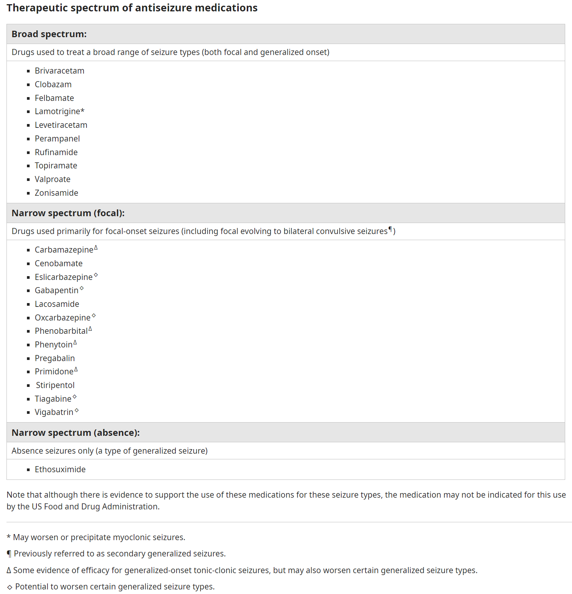
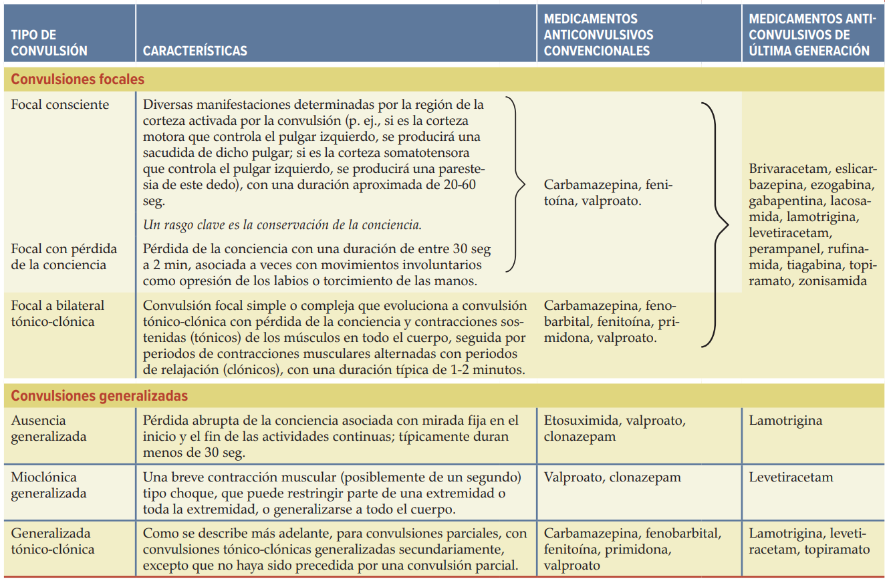
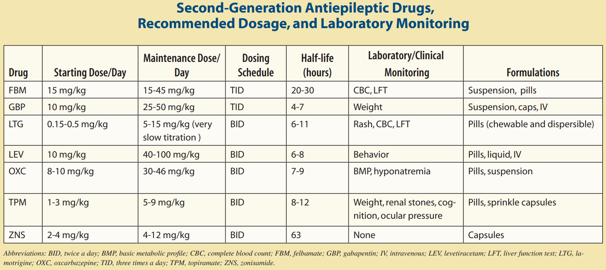

# Pediatría

<a href="https://drive.google.com/drive/folders/1eI8M-_g-VVKRzJWfdfcO35dz9QoYyokr"> Bibliografía UPA </a>

## datitos antropometría

Referencias de peso:
- perdida de peso primeros días: 5-10%
- retorno a peso nacimiento: 7 a 10 días
- aumento de **1 kg/mes** el primer año (2 kg/mes en primeros 3 meses)
- duplicación peso en 4 a 5 meses
- triplicación peso en 1 año
- aumento de peso diario: 20-30 g/día los primeros 3-4 meses, 15-20 g/día el resto del primer año

Referencias de talla:
- Longitud al nacim: **50 cm**
- Longitud al año: **75 cm**
- a los 4 años: 100 cm (**duplica** talla al nacimiento)

Referencias de perímetro cefálico:
- al nacimiento: **35 cm**
- aumento de **1 cm/mes** el primer año
    - 2 cm/mes los primeros 3 meses

Perímetro cefálico para la talla:

$$ PCT = frac{Talla}{2} + 10 \pm 1 $$

Edad corregida en prematuros:

En niños y niñas prematuros el registro se realiza de acuerdo con la edad corregida; hasta los 24 meses de edad corregida en RN de Muy Bajo Peso de Nacimiento (RNMBP), hasta los 12 meses de edad corregida en los RN prematuros moderados y hasta los 6 meses de edad corregida en los RN prematuros tardíos. En los RN de pretérmino de menos 40 semanas, se deben utilizar las curvas de Crecimiento Intrauterino Nacionales (anexo 12).

Edad biológica en NNA:

Cuando la edad biológica y la edad cronológica presenten una diferencia mayor a 1 año se justifica evaluar por edad biológica (esto incluye los indicadores IMC/E, T/E, P/E y PC/E); si dicha diferencia es menor a 1 año, se puede evaluar solo por edad cronológica.

Evaluación nutricional

Tablitas hechas por chatqpt, no revisadas...
### mujeres
| edad | peso | aumento de peso | talla |  aumento de talla | Perímetro cefálico |
|------|------|-------|-------------|--------------------| --------|
| 0-1 mes | 3.2-4.2 kg | 1 kg/mes | 50-54 cm | 4-5 cm/mes | 34-37 cm |
| 1-2 meses | 4.2-5.2 kg | 1 kg/mes | 54-58 cm | 3-4 cm/mes | 37-39 cm |
| 2-3 meses | 5.2-5.8 kg | 0.5 kg/mes | 58-60 cm | 2-3 cm/mes | 39-41 cm |
| 3-6 meses | 5.8-7.0 kg | 0.5 kg/mes | 60-66 cm | 2-3 cm/mes | 41-43 cm |
| 6-12 meses | 7.0-9.0 kg | 0.25 kg/mes | 66-74 cm | 1-2 cm/mes | 43-45 cm |
| 1-2 años | 9.0-12.0 kg | 0.25 kg/mes | 74-84 cm | 1-2 cm/mes | 45-47 cm |
| 2-3 años | 12.0-14.0 kg | 0.25 kg/mes | 84-94 cm | 1-2 cm/mes | 47-49 cm |
| 3-4 años | 14.0-16.0 kg | 0.25 kg/mes | 94-104 cm | 1-2 cm/mes | 49-51 cm |
| 4-5 años | 16.0-18.0 kg | 0.25 kg/mes | 104-114 cm | 1-2 cm/mes | 51-53 cm |

### hombres
| edad | peso | aumento de peso | talla |  aumento de talla | Perímetro cefálico |
|------|------|-------|-------------|--------------------| --------|
| 0-1 mes | 3.4-4.4 kg | 1 kg/mes | 51-55 cm | 4-5 cm/mes | 34-37 cm |
| 1-2 meses | 4.4-5.4 kg | 1 kg/mes | 55-59 cm | 3-4 cm/mes | 37-39 cm |
| 2-3 meses | 5.4-6.0 kg | 0.5 kg/mes | 59-61 cm | 2-3 cm/mes | 39-41 cm |
| 3-6 meses | 6.0-7.2 kg | 0.5 kg/mes | 61-67 cm | 2-3 cm/mes | 41-43 cm |
| 6-12 meses | 7.2-9.5 kg | 0.25 kg/mes | 67-75 cm | 1-2 cm/mes | 43-45 cm |
| 1-2 años | 9.5-12.5 kg | 0.25 kg/mes | 75-85 cm | 1-2 cm/mes | 45-47 cm |
| 2-3 años | 12.5-14.5 kg | 0.25 kg/mes | 85-95 cm | 1-2 cm/mes | 47-49 cm |
| 3-4 años | 14.5-16.5 kg | 0.25 kg/mes | 95-105 cm | 1-2 cm/mes | 49-51 cm |
| 4-5 años | 16.5-18.5 kg | 0.25 kg/mes | 105-115 cm | 1-2 cm/mes | 51-53 cm |

Velocidad de crecimiento en prematuros

## Desarrollo psicomotor

En forma resumida, los hitos del desarrollo que debemos tener en mente son: 
- 1 mes:fija mirada
- A las 6 semanas: sonrisa social. Éste es un hito precoz fundamental pues es un indicador de normalidad del desarrollo cognitivo. 
- A los 2 meses: sostén cefálico. Si bien desde el nacimiento los recién nacidos presentan algo de control cefálico, es desde los dos meses que ya mantienen control cefálico permanente y en distintas posiciones. 
- A los 3 meses: inicio prensión de objetos y giro en torno a su cuerpo. (Debe advertirse a los padres acerca de este hito en los controles pediátricos precedentes puesto que este logro implica el inicio de una creciente autonomía del niño y puede ser causa de caídas desde la cama o desde el mudador si el lactante es dejado sólo por algunos segundos en estos lugares. )
- A los 4 meses: manipulación de objetos. Risa y balbuceo
- A los 5 meses: eleva cabeza y tórax  estirando los codos estando en prono (“de guatita”, boca abajo) 
- A los 6 meses: se sienta solo (sin apoyo)  
- A los 8 meses: exploración de objetos (pinza gruesa) 
- A los 9 meses: gateo, postura en 4 puntos (que puede o no darse, pero que cuando se da es un indicador o predictor de marcha autónoma).  disílabos
- A los 10 meses: sentido de permanencia; bipedestación asistida (Se para con apoyo) 
- A los 12 meses: marcha asistida (Camina con apoyo), 2 palabras: lenguaje verbal-gestual. Pinza fina, bebe de taza
- A los 14 meses: marcha autónoma (Camina solo). 90% de los niños camina a los 14 meses. 
- 15 meses: 3-6 palabras, tenedor y cuchara
- A los 18 meses: lenguaje verbal por lo menos 6 palabras, respuesta al dame y toma 
- A los 2 años: se define la dominancia (qué mano va a utilizar preferentemente). 
- A los 2 años: sabe su nombre y dice 2 frases 
- A los 3 años: entiende más del 50 % del lenguaje 
- A los 3,5 años: es capaz de dibujar un círculo 
- A los 4,5 años: es capaz de dibujar una cruz 
- A los 4,5 años: cuenta hasta 10, reconoce colores 

Motor fino:
- 15 meses: torre de 2 cubos
- 18 meses: torre de 4 cubos
- 2 años: torre de 6 cubos
- 3 años: torre de 8-9 cubos
- 4 años: &#9675; 
- 5 años: &#9679;
- 6 años: &#9673; y dibuja persona con 6 partes

Motor grueso:
- 11 meses: marcha lateral
- 12 meses: camina solo
- 15 meses: camina hacia atrás
- 18 meses: corre
- 2 años: escalera hacia arriba y abajo. Tira sobre cabeza
- 3 años: salta en 2 pies
- 4 años: se balancea y salta en 1 pie

Pensamiento:
- Preescolar: mágico, egocéntrico, animista
- Escolar: concreto, lógico, conservación de la cantidad
- Adolescente: abstracto, hipotético, deducción

Riesgo de retraso del Desarrollo Psicomotor (modificado de NEJM 1994; 330: 478-483)

<table border="1">
    <thead>
        <tr>
            <th>Edad</th>
            <th>Motor</th>
            <th>Motor fino</th>
            <th>Lenguaje</th>
            <th>Cognitivo</th>
        </tr>
    </thead>
    <tbody>
        <tr>
            <td>4.5 meses</td>
            <td>No empuja para sentarse</td>
            <td></td>
            <td></td>
            <td></td>
        </tr>
        <tr>
            <td>7 meses</td>
            <td></td>
            <td>No toma objetos</td>
            <td></td>
            <td></td>
        </tr>
        <tr>
            <td>9 - 10 meses</td>
            <td>No descarga peso</td>
            <td></td>
            <td></td>
            <td></td>
        </tr>
        <tr>
            <td>10 - 11 meses</td>
            <td></td>
            <td></td>
            <td>No silabea</td>
            <td></td>
        </tr>
        <tr>
            <td>11 meses</td>
            <td></td>
            <td>No tiene pinza</td>
            <td></td>
            <td></td>
        </tr>
        <tr>
            <td>12 meses</td>
            <td></td>
            <td></td>
            <td></td>
            <td>No busca lo escondido</td>
        </tr>
        <tr>
            <td>15 meses</td>
            <td>No camina</td>
            <td>No pone ni saca de cajita</td>
            <td></td>
            <td></td>
        </tr>
        <tr>
            <td>18 meses</td>
            <td></td>
            <td></td>
            <td>No dice 3 palabras</td>
            <td></td>
        </tr>
        <tr>
            <td>24 meses</td>
            <td></td>
            <td></td>
            <td>No tiene dos palabras-frases</td>
            <td></td>
        </tr>
        <tr>
            <td>30 meses</td>
            <td>No salta en dos pies</td>
            <td>No vuelve páginas</td>
            <td></td>
            <td></td>
        </tr>
        <tr>
            <td>3.5 años</td>
            <td></td>
            <td></td>
            <td>No entiende más del 50% del lenguaje</td>
            <td></td>
        </tr>
        <tr>
            <td>36 meses</td>
            <td></td>
            <td></td>
            <td></td>
            <td>No sabe su nombre</td>
        </tr>
        <tr>
            <td>4 años</td>
            <td>No salta en 1 pie</td>
            <td>No copia círculo</td>
            <td></td>
            <td></td>
        </tr>
        <tr>
            <td>4.5 años</td>
            <td></td>
            <td></td>
            <td></td>
            <td>No cuenta secuencialmente</td>
        </tr>
    </tbody>
</table>

Factores de riesgo DSM

Signos de alerta dsm

Banderas rojas dsm
 

Alimentación:
- 7 a 8 meses: toman alimentos con la mano
- 8 a 11 meses: comen con la mano, transferencia de mano a boca
- 10 a 12 meses: comen con cuchara, pueden tomar vaso con dos manos
- 15 meses: beben en vaso sin ayuda (21 meses no derraman)

Reflejos arcaicos

| Reflejo | Desaparece | 
|---------|------------|
| marcha automática | 4 a 6 semanas aprox |
| Moro | **4**-6 meses |
| reflejo de búsqueda | **3**-4 meses (disminución gradual hasta max 3 meses) |
| reflejo de succión | 3-4 meses (disminución gradual, superponiéndose con succión voluntaria) |
| prensión palmar | disminución gradual, desaparece por completo poco antes de los **6 meses** |
| prensión plantar | 10 a 18 meses meses, poco antes de que logre marcha libre (intenso los primeros 6 meses, disminución gradual hasta lograr apoyo plantar) |
| gallant (trunk incurvation) | 4 meses |
| espadachin | 5-7 meses |
| Babinski | 2 año |

En cuanto a aparición, casi todos después de las 32 a 34 semanas de gestación, salvo por prensión palmar y plantar que aparecen desde 20 semanas de gestación

Espadachín aparece desde 4 a 6 semanas de vida, cuando logra fijación y seguimiento visual

Paracaídas anterior aparece a los 6 meses

## erupción dentaria

## Niño sano

### Recien Nacidos

Cantidad mínima de pañales con **pipí** en RN:
- 1 pañal el primer día
- 2 pañales el segundo día
- 3 pañales el tercer día
- 4 pañales el cuarto día
- 6 pañales desde el quinto día

Deposiciones:
- Meconio: días 1 a 3. Color negro, marrón o verde oscuro y de consistencia viscosa
- Transición día 3 a 4 verde grisáceo y no son tan viscosas
- Maduras: amarillo-doradas: 2 a 24 en total. Por lo general 1 después de cada toma
- Después del mes de vida pueden más de un día sin depos

### Programa nacional de inmunizaciones 2023

<a href="https://sochinf.cl/recomendaciones-para-la-puesta-al-dia-de-calendarios-de-vacunacion-en-chile/">
Recomendaciones para la puesta al día de calendarios de vacunación en Chile SOCHINF
</a>

 

<html xmlns:o="urn:schemas-microsoft-com:office:office" xmlns:x="urn:schemas-microsoft-com:office:excel" xmlns="http://www.w3.org/TR/REC-html40">

<head>
<meta http-equiv=Content-Type content="text/html; charset=windows-1252">
<meta name=ProgId content=Excel.Sheet>
<meta name=Generator content="Microsoft Excel 15">
<link rel=File-List href="Book1_files/filelist.xml">

<title>Vacunaci�n�2023</title>
</head>

<body>
<!--[if !excel]>&nbsp;&nbsp;<![endif]-->
<!--The following information was generated by Microsoft Excel's Publish as Web
Page wizard.-->
<!--If the same item is republished from Excel, all information between the DIV
tags will be replaced.-->
<!----------------------------->
<!--START OF OUTPUT FROM EXCEL PUBLISH AS WEB PAGE WIZARD -->
<!----------------------------->

<h1 style='color:black;font-family:Calibri;font-size:14.0pt;font-weight:800;
font-style:normal'>Vacunación 2023</h1>

<table border=0 cellpadding=0 cellspacing=0 width=1040 style='border-collapse:
 collapse;table-layout:fixed;width:779pt'>
 <col width=64 style='width:48pt'>
 <col width=107 span=6 style='mso-width-source:userset;mso-width-alt:3723;
 width:80pt'>
 <col width=109 style='mso-width-source:userset;mso-width-alt:3816;width:82pt'>
 <col width=118 style='mso-width-source:userset;mso-width-alt:4119;width:89pt'>
 <col width=107 style='mso-width-source:userset;mso-width-alt:3723;width:80pt'>
 <tr class=xl7416390 height=58 style='height:43.5pt'>
  <td height=58 class=xl7316390 width=64 style='height:43.5pt;width:48pt'>RN</td>
  <td class=xl7316390 width=107 style='width:80pt'>2</td>
  <td class=xl7316390 width=107 style='width:80pt'>4</td>
  <td class=xl7316390 width=107 style='width:80pt'>6</td>
  <td class=xl7316390 width=107 style='width:80pt'>12</td>
  <td class=xl7316390 width=107 style='width:80pt'>18</td>
  <td class=xl7316390 width=107 style='width:80pt'>36</td>
  <td class=xl7316390 width=109 style='width:82pt'>1ro (7a) y 8vo (14a)</td>
  <td class=xl7316390 width=118 style='width:89pt'>4to (10a) y 5to(11a)</td>
  <td class=xl7316390 width=107 style='width:80pt'>Embarazadas desde 28 semanas</td>
 </tr>
 <tr height=19 style='height:14.5pt'>
  <td height=19 class=xl6616390 width=64 style='height:14.5pt;width:48pt'>BCG</td>
  <td class=xl6916390 width=107 style='width:80pt'>Hexavalente</td>
  <td class=xl6916390 width=107 style='width:80pt'>Hexavalente</td>
  <td class=xl6916390 width=107 style='width:80pt'>Hexavalente</td>
  <td class=xl6616390 width=107 style='width:80pt'></td>
  <td class=xl6916390 width=107 style='width:80pt'>Hexavalente</td>
  <td class=xl6616390 width=107 style='width:80pt'></td>
  <td class=xl6616390 width=109 style='width:82pt'></td>
  <td class=xl6616390 width=118 style='width:89pt'>VPH</td>
  <td class=xl6616390 width=107 style='width:80pt'></td>
 </tr>
 <tr height=19 style='height:14.5pt'>
  <td height=19 class=xl6616390 width=64 style='height:14.5pt;width:48pt'>Hep B</td>
  <td class=xl6816390 width=107 style='width:80pt'>DTPa</td>
  <td class=xl6816390 width=107 style='width:80pt'>&nbsp;</td>
  <td class=xl6816390 width=107 style='width:80pt'>&nbsp;</td>
  <td class=xl6616390 width=107 style='width:80pt'></td>
  <td class=xl6816390 width=107 style='width:80pt'>&nbsp;</td>
  <td class=xl6616390 width=107 style='width:80pt'></td>
  <td class=xl6816390 width=109 style='width:82pt'>dTpa</td>
  <td class=xl6616390 width=118 style='width:89pt'></td>
  <td class=xl6816390 width=107 style='width:80pt'>dTpa</td>
 </tr>
 <tr height=19 style='height:14.5pt'>
  <td height=19 class=xl6616390 width=64 style='height:14.5pt;width:48pt'></td>
  <td class=xl6816390 width=107 style='width:80pt'>Polio inactivado</td>
  <td class=xl6816390 width=107 style='width:80pt'>&nbsp;</td>
  <td class=xl6816390 width=107 style='width:80pt'>&nbsp;</td>
  <td class=xl6616390 width=107 style='width:80pt'></td>
  <td class=xl6816390 width=107 style='width:80pt'>&nbsp;</td>
  <td class=xl6616390 width=107 style='width:80pt'></td>
  <td class=xl6616390 width=109 style='width:82pt'></td>
  <td class=xl6616390 width=118 style='width:89pt'></td>
  <td class=xl6616390 width=107 style='width:80pt'></td>
 </tr>
 <tr height=19 style='height:14.5pt'>
  <td height=19 class=xl6616390 width=64 style='height:14.5pt;width:48pt'></td>
  <td class=xl6816390 width=107 style='width:80pt'>HepB</td>
  <td class=xl6816390 width=107 style='width:80pt'>&nbsp;</td>
  <td class=xl6816390 width=107 style='width:80pt'>&nbsp;</td>
  <td class=xl6616390 width=107 style='width:80pt'></td>
  <td class=xl6816390 width=107 style='width:80pt'>&nbsp;</td>
  <td class=xl6616390 width=107 style='width:80pt'></td>
  <td class=xl6616390 width=109 style='width:82pt'></td>
  <td class=xl6616390 width=118 style='width:89pt'></td>
  <td class=xl6616390 width=107 style='width:80pt'></td>
 </tr>
 <tr height=19 style='height:14.5pt'>
  <td height=19 class=xl6616390 width=64 style='height:14.5pt;width:48pt'></td>
  <td class=xl6816390 width=107 style='width:80pt'>Hib</td>
  <td class=xl6816390 width=107 style='width:80pt'>&nbsp;</td>
  <td class=xl6816390 width=107 style='width:80pt'>&nbsp;</td>
  <td class=xl6616390 width=107 style='width:80pt'></td>
  <td class=xl6816390 width=107 style='width:80pt'>&nbsp;</td>
  <td class=xl6616390 width=107 style='width:80pt'></td>
  <td class=xl6616390 width=109 style='width:82pt'></td>
  <td class=xl6616390 width=118 style='width:89pt'></td>
  <td class=xl6616390 width=107 style='width:80pt'></td>
 </tr>
 <tr height=58 style='height:43.5pt'>
  <td height=58 class=xl6616390 width=64 style='height:43.5pt;width:48pt'></td>
  <td class=xl6716390 width=107 style='width:80pt'>Neumococo Conjugada</td>
  <td class=xl6716390 width=107 style='width:80pt'>Neumococo Conjugada</td>
  <td class=xl7116390 width=107 style='width:80pt'>* Neumococo Conjugada (solo prematuros)</td>
  <td class=xl6716390 width=107 style='width:80pt'>Neumococo Conjugada</td>
  <td class=xl6616390 width=107 style='width:80pt'></td>
  <td class=xl6616390 width=107 style='width:80pt'></td>
  <td class=xl6616390 width=109 style='width:82pt'></td>
  <td class=xl6616390 width=118 style='width:89pt'></td>
  <td class=xl6616390 width=107 style='width:80pt'></td>
 </tr>
 <tr height=39 style='height:29.0pt'>
  <td height=39 class=xl6616390 width=64 style='height:29.0pt;width:48pt'></td>
  <td class=xl7016390 width=107 style='width:80pt'>Meningocócica recombinante</td>
  <td class=xl7016390 width=107 style='width:80pt'>Meningocócica recombinante</td>
  <td class=xl6616390 width=107 style='width:80pt'></td>
  <td class=xl7016390 width=107 style='width:80pt'>Meningocócica Conjugada</td>
  <td class=xl6616390 width=107 style='width:80pt'></td>
  <td class=xl6616390 width=107 style='width:80pt'></td>
  <td class=xl6616390 width=109 style='width:82pt'></td>
  <td class=xl6616390 width=118 style='width:89pt'></td>
  <td class=xl6616390 width=107 style='width:80pt'></td>
 </tr>
 <tr height=39 style='height:29.0pt'>
  <td height=39 class=xl6616390 width=64 style='height:29.0pt;width:48pt'></td>
  <td class=xl6616390 width=107 style='width:80pt'></td>
  <td class=xl6616390 width=107 style='width:80pt'></td>
  <td class=xl6616390 width=107 style='width:80pt'></td>
  <td class=xl7216390 width=107 style='width:80pt'>SRP (12 meses, 3 letras)</td>
  <td class=xl6616390 width=107 style='width:80pt'></td>
  <td class=xl7216390 width=107 style='width:80pt'>SRP (12 * 3 = 36 meses)</td>
  <td class=xl6616390 width=109 style='width:82pt'></td>
  <td class=xl6616390 width=118 style='width:89pt'></td>
  <td class=xl6616390 width=107 style='width:80pt'></td>
 </tr>
 <tr height=19 style='height:14.5pt'>
  <td height=19 class=xl6516390 width=64 style='height:14.5pt;width:48pt'></td>
  <td class=xl6516390 width=107 style='width:80pt'></td>
  <td class=xl6516390 width=107 style='width:80pt'></td>
  <td class=xl6516390 width=107 style='width:80pt'></td>
  <td class=xl6516390 width=107 style='width:80pt'></td>
  <td class=xl6516390 width=107 style='width:80pt'>Hepatitis A</td>
  <td class=xl6516390 width=107 style='width:80pt'></td>
  <td class=xl6516390 width=109 style='width:82pt'></td>
  <td class=xl6516390 width=118 style='width:89pt'></td>
  <td class=xl6516390 width=107 style='width:80pt'></td>
 </tr>
 <tr height=19 style='height:14.5pt'>
  <td height=19 class=xl6516390 width=64 style='height:14.5pt;width:48pt'></td>
  <td class=xl6516390 width=107 style='width:80pt'></td>
  <td class=xl6516390 width=107 style='width:80pt'></td>
  <td class=xl6516390 width=107 style='width:80pt'></td>
  <td class=xl6516390 width=107 style='width:80pt'></td>
  <td class=xl6516390 width=107 style='width:80pt'>Varicela</td>
  <td class=xl6516390 width=107 style='width:80pt'>Varicela</td>
  <td class=xl6516390 width=109 style='width:82pt'></td>
  <td class=xl6516390 width=118 style='width:89pt'></td>
  <td class=xl6516390 width=107 style='width:80pt'></td>
 </tr>
 <tr height=39 style='height:29.0pt'>
  <td height=39 class=xl6516390 width=64 style='height:29.0pt;width:48pt'></td>
  <td class=xl6516390 width=107 style='width:80pt'></td>
  <td class=xl6516390 width=107 style='width:80pt'></td>
  <td class=xl6516390 width=107 style='width:80pt'></td>
  <td class=xl6516390 width=107 style='width:80pt'></td>
  <td class=xl6516390 width=107 style='width:80pt'>Fiebre amarilla (Rapa Nui)</td>
  <td class=xl6516390 width=107 style='width:80pt'></td>
  <td class=xl6516390 width=109 style='width:82pt'></td>
  <td class=xl6516390 width=118 style='width:89pt'></td>
  <td class=xl6516390 width=107 style='width:80pt'></td>
 </tr>
 <![if supportMisalignedColumns]>
 <tr height=0 style='display:none'>
  <td width=64 style='width:48pt'></td>
  <td width=107 style='width:80pt'></td>
  <td width=107 style='width:80pt'></td>
  <td width=107 style='width:80pt'></td>
  <td width=107 style='width:80pt'></td>
  <td width=107 style='width:80pt'></td>
  <td width=107 style='width:80pt'></td>
  <td width=109 style='width:82pt'></td>
  <td width=118 style='width:89pt'></td>
  <td width=107 style='width:80pt'></td>
 </tr>
 <![endif]>
</table>

<!----------------------------->
<!--END OF OUTPUT FROM EXCEL PUBLISH AS WEB PAGE WIZARD-->
<!----------------------------->
</body>

</html>

| Vacuna | composición | 
|--------|-------------|
| BCG | viva atenuada | 
| Hepatitis B | recombinante |
| difteria, tétanos | toxoides (en la abreviatura DT/dt, mayúscula/minúscula implica más/menos toxoide, por eso hasta los 18 meses se da la DTPa y luego los refuerzos tienen la dTPa) |
| tos convulsiva | acelular ("DTPa" la a implica **ACELULAR**. Creo que la con virus atenuado creo que ya no está disponible) |
| Haemophilus influenzae tipo b | conjugada polisacárida + proteína|
| poliomielitis | inactivada, esta es la de la hexavalente|
| poliomielitis | viva atenuada (ya no se da)|
| neumococo | conjugada polisacárida (inactiva) |
| meningococo | conjugada polisacárida (inactiva) tetravalente (A, C, W, Y) |
| meningococo | recombinante monovalente (serotipo B) |
| sarampión, parotiditis, rubéola, varicela | virus vivos atenuados |
| virus hepatitis A | inactivada |
| vph | inactivada |
| fiebre amarilla | virus vivos atenuados |

Chile, Julio: El **palivizumab** se administrará a los niños y niñas que pesan bajo los 2.500 gramos al nacer o que tengan hasta 34 semanas y seis días de gestación.

### Nutrición

Promedio volumen lactancia materna primeros 6 meses: 800 ml/día

Problemas leche de vaca sin modificaciones: concentración excesiva de proteínas, calcio, fósforo y sodio y además es deficiente en ácidos 
grasos esenciales, vitamina C, E y D.

Composición leches

Volumen y Fraccionamiento de fórmulas: El volumen indicado de fórmula de inicio o de LPF varía de acuerdo a la edad y peso del niño, iniciándose la alimentación con aproximadamente **60 ml por vez en los primeros días**, para llegar aproximadamente a **200 ml por vez a los cinco meses**, utilizando el cálculo de <b styles="color: #0000ff"> 140 cc-160 cc x kg de peso x día</b>.

Requerimientos calóricos

Cantidad y frecuencia de cada alimento a incorporar en una papilla de 6 a 11 meses

| alimento | edad inicio | frecuencia |
|----------|-------------| ---------- |
| vegetales verdes y coloreados | 6 meses | diaria |
| cereales | 6 meses | diaria |
| tubérculos | 6 meses | diaria |
| frutas | 6 meses | diaria |
| aceite | 6 meses | diaria |
| carnes | 6 meses | 3 veces/semana |
| pescados y mariscos | 6-7 meses | 2 veces/semana |
| legumbres | 7-8 meses | 2 veces/semana |
| huevo | 9-10 meses | 1-2 veces/semana |

Resumen: 
- vegetales, cereales, tubérculos, frutas, aceite, carnes: **6** meses
- pescados y mariscos: **6-7** meses
- legumbres: **7-8** meses
- huevo: **9-10** meses

Primera papilla: 6 meses

Segunda papilla: 8 meses
- erupción incisivos superiores --> puré más grueso
- erupción molares (12 meses) --> molido con tenedor
- 8 meses: 150 ml comida + 100 ml fruta
- 9 meses: 200 ml comida + 100 ml fruta
- La alimentación complementaria debe aportar una densidad energética no inferior a la aportada a través de la leche materna, es decir entre **65 y 70 Kcal/100 g**. En su conjunto (2 papillas) no deben aportar más del 50% del aporte diario de energía, el resto de la energía debe ser aportado por la leche materna o la fórmula que la sustituya
- Incorporar las leguminosas guisadas con cereales entre los 7-8 meses (molidas, hasta alrededor de los 12 meses); una porción de ellas reemplaza al puré de verduras con carne. Se recomienda el consumo 2 veces por semana.
- Los **alimentos no deben ser soplados**, ni tampoco deben ser probados con el mismo cubierto que se utilizará para dar la comida, ambas acciones traspasan microorganismos a la boca del niño(a) y pueden estimular la producción de caries (transmisión vertical-horizontal); esto se conoce como ventana de infectividad y ocurre en promedio entre los 19 meses y 26 meses de edad

Suplementación:
- Vitamina D: 400 UI/día hasta 1 año de vida
- Fe: 1 mg/kg/día desde los 4 meses hasta 1 año de vida

#### >2 años
Guías Alimentarias para la Población Chilena
1. Para tener un peso saludable, come sano y realiza actividad física diariamente.
2. Pasa menos tiempo frente al computador o la tele y camina a paso rápido, mínimo 30 minutos al día.
3. Come alimentos con poca sal y saca el salero de la mesa.
4. Si quieres tener un peso saludable, evita el azúcar, dulces, bebidas y jugos azucarados.
5. Cuida tu corazón evitando las frituras y alimentos con grasas como cecinas y mayonesa.
6. Come 5 veces verduras y frutas frescas de distintos colores, cada día.
7. Para fortalecer tus huesos, consume 3 veces en el día lácteos bajos en grasa y azúcar.
8. Para mantener sano tu corazón, come pescado al horno a la plancha, 2 veces por semana.
9. Consume legumbres al menos dos veces por semana, sin mezclarlas con cecinas.
10. Para mantenerte hidratado, toma 6 a 8 vasos de agua al día.
11. Lee y compara las etiquetas de los alimentos y prefiere los que tengan menos grasas, azúcar y sal (sodio)

Lo ideal es consumir **4 comidas** establecidas en el día: desayuno, almuerzo, once y cena, y eventualmente una colación saludable. Se recomienda que la distribución energética de estos tiempos sea **desayuno 25%, Colación 5%, Almuerzo 30%, Once 15%, Cena 25%**.

# Gastroenterología

## Diarrea aguda

Cuando estudiar: 

El estudio etiológico viral y/o bacteriano se realiza en casos seleccionados, las indicaciones de éstos son: 
1. Diarrea prolongada (mayor de 14 días)
2. Diarrea con sangre (síndrome disentérico)
3. Pacientes inmunodeprimidos (enfermedades inmunosupresoras, fármacos inmunosupresores, trasplantados)
4. Intoxicaciones alimentarias (por razones de tipo epidemiológico)
5. Estudio de portadores 
6. Sospecha de brote epidémico
7. Descarte de infección intestinal para establecer otra etiología (se quiere tener la certeza de que una enfermedad crónica no se reactivó por una infección aguda).

Suero mantención: S glucosado 5% 500 ml + NaCl 10% 20 ml + KCl 10% 10 ml 

# Infectología
## Enfermedad de kawasaki

## VIH en pediatría

## Fiebre de origen desconocido

### Recien nacido (0-28 días)

Agentes etiológicos que debemos considerar principalmente son los del canal del parto, a saber, Streptococcus beta hemolítico grupo B (S. agalactiae), Escherichia coli y Listeria monocytogenes, Enterococcus spp y otras enterobacterias.

Exámenes:
- Hemograma 
- PCR
- Hemocultivos ( 2, de distintas punciones)
- Orina completa más urocultivo (recordar si OC por recolector sale alterado, se debe sondear al paciente)
- Punción lumbar (3 tubos para cito químico, cultivo y muestra crítica para mayores estudios posteriores)
- En contexto de COVID, se agregaba PCR SARS CoV 2 o antígeno SARS CoV 2, según realidad local.

**Radiografía de tórax y panel viral (inmunofluorescencia o reacción de polimerasa en cadena) si el paciente presenta síntomas respiratorios.

Conducta:
- Hospitalizar a todos
- ATB empíricos: (cobertura de enterobacterias + ampicilina para cobertura de SGB, Enterococcus, Listeria.)
	- Sin compromiso SNC: Ampicilina 200 mg/kg/dia + Amikacina 15 mg/kg/dia ev
	- Con compromiso SNC*: Ampicilina 300 mg/kg/dia + Cefotaxima 300 mg/kg/dia ev

*(si no se puede PL, asumir compromiso SNC)

### Lactante 28 días - 3 meses

Criterios de bajo riesgo de infección bacteriana invasora (IBI) de Rochester

Examenes:
- hemograma, 
- PCR 
- OC + UC

Crit de Rochester:
1. El niño tiene buen aspecto
2. El niño ha sido previamente sano
	- Nacido de término (>37 semanas de gestación)
	- No recibió tratamiento antibiótico periodo perinatal
	- No tuvo tratamiento de hiperbilirrubinemia no explicada
	- No estar ni haber recibido tratamiento antibiótico
	- No haber estado previamente hospitalizado
	- No tiene enfermedad crónica o de base
	- No estuvo hospitalizado más tiempo que la madre
3. Sin evidencia de infección de piel, tejidos blandos, articulación u oído
4. Valores de laboratorio:
	- RGB 5000 - 15000/mm3
	- Recuento absoluto de baciliformes <1500 /mm3
	- Sedimento de orina con menos de 10 leucocitos/campo
	- Si hay diarrea menos de 5 leucocitos/campo en extendido fecal (en desuso).

Si cumple TODOS los criterios -> bajo riesgo
- Dar una dosis de cefalosporina de 3ª generación im o ev (Ej: Ceftriaxona) y control clínico ambulatorio con resultado de cultivos en 24 hr.
- Observación clínica en su casa u hospitalizado, según contexto sociocultural de la familia, sin tratamiento antimicrobiano y control en 24 hr con resultado de cultivos.

Si no cumple alguno de los criterios o aspecto tóxico -> alto riesgo -> manejar como RN, considerando:
- menor probabilidad de microorganismos del canal del parto.
- documentación de una PNA como foco clínico no es necesario realizar una PL dado que la barrera hematoencefálica está lo suficientemente madura

ATB empíricos:
- Sin compromiso SNC: Ampicilina 200 mg/kg/dia + Amikacina 15 mg/kg/dia ev
- Con compromiso SNC: Cefotaxima 300 mg/kg/dia + Vancomicina 60 mg/kg/dia ev (no cubrimos listeria)

### 3 meses a 3 años

Ifecciones virales son mucho más frecuentes, con menor riesgo de IBI

Descartar ITU por cmplx renales

- En caso de sintomatología claramente de origen viral, por ejemplo síntomas respiratorios, el manejo debe ser sintomático.
- Si existe un foco clínico como otitis media aguda, infección de piel y tejidos blandos, enteritis, neumonía, el tratamiento se basa en la etiología sospechada.
- En caso de paciente sin infección localizadas  y que tiene menos de 2 dosis contra HiB y neumococo o padece de alguna inmunodeficiencia, se sugiere hemograma:
	- hemocultivos y, 
	- a veces, punción lumbar, dependiendo del contexto.

Si no tienen acceso a exámenes, el inicio empírico de tratamiento antibiótico no debe esperar. Importante recordar que si el niño de mal aspecto, se debe iniciar tratamiento antibiótico.

## Exantemas

Lo básico para diferenciar:
- Sarampión: Fiebre alta + catarro (conjuntivitis, tos) + manchas de Koplik.
- Rubéola: Fiebre leve + linfadenopatía retroauricular + exantema suave.
- Exantema súbito: Fiebre que desaparece bruscamente + exantema troncal.
- Eritema infeccioso: Mejillas abofeteadas + exantema en encaje.
- Escarlatina: Fiebre alta + faringitis + exantema áspero y lengua en "fresa".

| Característica       | Sarampión                      | Rubéola                      | Exantema súbito               | Eritema infeccioso            | Escarlatina                      |
|----------------------|--------------------------------|------------------------------|--------------------------------|--------------------------------|----------------------------------|
| **Fiebre**           | Alta (>39-40°C)               | Baja o moderada              | Alta, desaparece bruscamente   | Baja                          | Alta                             |
| **Pródromo**         | Conjuntivitis, coriza, tos     | Linfadenopatía retroauricular | Fiebre sin otros síntomas      | Síntomas inespecíficos        | Faringitis, lengua en "fresa"    |
| **Inicio Exantema**  | Cara, desciende               | Cara, se extiende rápidamente | Tronco, después de la fiebre   | Mejillas, luego en encaje     | Cuello y tórax                   |
| **Características**  | Maculopapular, rojo intenso    | Maculopapular, leve          | Maculopapular rosado           | "Mejillas abofeteadas"        | "Papel de lija", palidez peribucal |
| **Complicaciones**   | Neumonía, encefalitis         | Artritis, rubéola congénita  | Convulsiones febriles          | Anemia aplásica               | Fiebre reumática, glomerulonefritis |

# Broncopulmonar

Score de Tal modificado

| Puntaje | Frecuencia respiratoria (< 6 meses) | Frecuencia respiratoria (≥ 6 meses) | Sibilancias                                          | Cianosis                          | Retracción         |
|---------|-------------------------------------|--------------------------------------|-----------------------------------------------------|-----------------------------------|--------------------|
| 0       | ≤ 40                                | ≤ 30                                 | NO                                                  | NO                                | NO                 |
| 1       | 41 – 55                             | 31 – 45                              | Fin de espiración c/ fonendoscopio                   | Peri-oral al llorar               | Subcostal (+)      |
| 2       | 56 – 70                             | 46 – 60                              | Inspir. y espir. c/ fonendoscopio                    | Peri-oral en reposo               | Intercostal (++)   |
| 3       | > 70                                | > 60                                 | Audibles a distancia                                 | Generalizada en reposo            | Supraclavicular (+++) |

Asthma Prediction index

| Criterios mayores | Criterios menores |
| --| --| 
| Asma en Padre | Rinitis alérgica |
| Eczema | Sibilancias sin resfrio | 
| Alergia alimentaria | Eosinofilia (>4%) |

- Pacientes con SBO frecuentes y un criterio mayor o dos menores tiene un 76% de probabilidad de asma
- Pacientes con algún SBO y un criterio mayor o dos menores tiene un 59% de probabilidad de desarrollar asma
- Paciente con SBO pero sin criterios tiene sólo un 5% de desarrollar asma

Si bien los distintos índices clínicos y fenotipos epidemiológicos permiten predecir con cierto grado de seguridad, no es suficiente para orientar tratamiento, ni para predecir respuesta a la terapia.

Infiltrado perihiliar + Banda presidencial en ADV RxTx

# Cardiología

## Insuficiencia cardíaca (IC)
Síntomas más frecuentes: 

- Signos de deterioro de la <b>función</b> miocárdica: Mala perfusión periférica, taquicardia basal, ritmo de galope, sudoración, frialdad, palidez, pulsos débiles y rápidos, llene capilar enlentecido, dificultad para alimentarse, anorexia, oliguria, compromiso pondo-estatural, cardiomegalia con dilatación o hipertrofia cardíaca, irritabilidad o llanto débil, fatiga, cansancio.
- Signos de <b>congestión venosa pulmonar</b>: Disnea, taquipnea, sibilancias, signología húmeda pulmonar, tos, cianosis (por edema agudo pulmonar o shunt derecha a izquierda), ortopnea, disnea paroxística nocturna, infecciones respiratorias frecuentes.
- Signos de <b>congestión venosa sistémica</b>: Hepatomegalia, ingurgitación yugular (difícil de ver en el lactante), edema facial/palpebral, edema periférico (raro en recién nacido y lactante), ascitis, anasarca

Por ahí leí que principales manifestaciones en lactantes son:

Genrales:
1. Irritabilidad con llanto débil
2. Lactancia entrecortada
3. Baja de peso
4. Sudoración

Respi:

5. Taquipnea, disnea, dificultad respiratoria
6. Aleteo nasal, tiraje

Otros

7. Hepatomegalia (no es tan frecuente esplenomegalia, tendría que tener cirrosis cardíaca)
8. Taquicardia

Clasificación de ROSS
- Clase I: <b>Asintomático</b>.
- Clase II: <b>Sintomático</b>. Lactante con taquipnea o sudoración leves durante las tomas. Niño con disnea de ejercicio.
- Clase III: <b>Sintomático + baja de peso</b> Lactante con taquipnea o sudoración marcadas durante las tomas, duración prolongada de las tomas, estancamiento ponderal. Niño con disnea de ejercicio marcada.
- Clase IV: <b>sintomático en reposo</b>. En reposo presenta taquipnea, sudoración y retracción

Índice Cardio torácico según edad:
| Edad | Índice |
|------|--------|
| RN | <0.6 |
| <2 años | <0.55 |
| >2 años | <0.5 |

Radiografía en Cardiopatías congénitas:

A modo general:
- HVD --> elevación apex
- HVI --> crecimiento longitudinal

## Soplos
Soplo inocente

- Soplos no holosistólicos 
- Poco intensos (≤ Grado III) 
- Segundo ruido cardiaco (R2) normal
- Disminuyen intensidad con maniobra de Valsalva
- Varían con cambios de posición
- Poca o sin irradiación

Soplo patológico

- Holosistólico o diastólico 
- Intensidad mayor a III (frémito)
- Intensidad máxima en borde paraesternal izquierdo superior
- R2 anormal (amplio y fijo o único)
- Click 
- No varían con cambio de posición
- Presencia de S3* y/o S4

# Hemato-Onco

Dx clínico de alteraciones hemostasia primaria vs secundaria 

## Anemia

Beta talasemia: 
- Anemia microcítica hipocrómica (con índice de Mentzer VCM/recuento eritrocitario <13 )
- Hiperbili inderecta
- Hematopoiesis extramedular (Extramedullary hematopoiesis often occurs as a compensatory mechanism in patients with chronic anemia and commonly involves the liver, spleen, and lymph nodes and can also affect the bones (e.g., skull) and paravertebral areas, causing spinal cord compression, which can lead to lower extremity weakness, hyperreflexia, and decreased sensation below the level of compression. Extramedullary hematopoiesis in the spleen and liver is physiological during fetal development but is always pathological after birth.)

# Epilepsia

## Definiciones

**Crisis epiléptica**: manifestación clínica de una descarga neuronal anormal, excesiva y sincrónica en el cerebro. Tipos:
- Convulsión sintomática aguda: crisis epiléptica que ocurre *en el contexto de una enfermedad aguda* o una lesión cerebral aguda.
- Convulsión no provocada: crisis epiléptica que ocurre *en ausencia de una enfermedad aguda o una lesión cerebral aguda*.
- Estado epiléptico: crisis epiléptica que dura más de 5 minutos o dos o más crisis epilépticas sin recuperación completa de la conciencia entre ellas.

**Epilepsia**: enfermedad crónica del cerebro caracterizada por la presencia de crisis epilépticas recurrentes.Criterios: 
- Dos o más crisis epilépticas no provocadas, con un intervalo de **al menos 24 horas entre ellas**.
- Una crisis epiléptica **no provocada** y una probabilidad de recurrencia de al menos **60%** en los próximos 10 años.
- Síndrome epiléptico.

Clasificación ILAE 2017: https://www.ilae.org/guidelines/definition-and-classification/classification-of-seizures

Etiología:
- Genética
- Estructural
- Metabólica
- Infecciosa
- Autoinmune
- Desconocida

Objetivos de evaluación:
1. Es crisis epiléptica? Es epilepsia?

2. Si es crisis, es sintomática? Es no provocada?

3. Caracterizar: tipo de crisis, síndrome epiléptico, etiología.

Estudio laboratorio inicial:
- HGT
- ELP, Ca, Mg
- Hemograma completo
- función renal
- función hepática
- OC
- screening toxicológico

- Neuroimagen ppalmente si focal, hallazgos EF neuro focalidad, Estado mental alterado prolongado
- ECG si sospecha causa cardíaca
- PL si sospecha infección SNC

EEG: no es necesario para el dx de epilepsia, pero puede ayudar a caracterizar el tipo de crisis y el síndrome epiléptico.

Se recomienda que el Monitoreo Vídeo EEG (MV-EEG) prolongado, se utilize en la evaluación de los niños que presentan dificultades de diagnóstico, después de una evaluación clínica y EEG estándar no concluyente

tb se puede pedir:
- Beta HCG por estudios disgnósticos y def de tto

Objetivos img:
- Neoplásica
- Malformación congénita
- Metabólica (inborn error of metabolism)
- Familial/neurocutánea
- Vascular/hypoxic-isquémica
- Traumática
- Infecciosa/inflamatoria
- Esclerosis/deformación hipocampal 

## Crisis febriles

## diferencial

## Tto
Se recomienda en niños con riesgo de depresión, evitar el uso de antiepilépticos que puedan causar alteraciones del ánimo como efecto adverso, tales como barbitúricos, vigabatrina, tiagabina y topiramato. 

Se recomienda descontinuar el tratamiento en forma gradual, con un FAE cada vez y hacerlo lentamente (tomar 3 meses por cada fármaco). Grado de Recomendación A.

Se recomienda a toda persona con epilepsia refractaria a fármacos antieplépticos, sea referida a un centro de evaluación pre-quirúrgica. Grado de recomendación A

Se recomienda a toda persona con epilepsia refractaria a fármacos antieplépticos y con posibilidades de mejorar su epilepsia con cirugía resectiva, sea tratada quirúrgicamente. Grado de recomendación A

Guía ges

Se aconseja iniciar tratamiento de inmediato si una crisis dura más de 2 minutos (21), dado menores de un año, en crisis focales y cuando el EEG tiene actividad anormal

Segunda dosis BZP si persiste 10 minutos

Si persiste por >20 minutos, se recomienda iniciar tratamiento con 1°)fenitoína o 2°)fenobarbital.

Si a pesar de estas intervenciones, el estatus dura más de 60 minutos, puede ser necesarioiniciar infusión continua de Midazolam o Propofol, y algunos pacientes pueden requerir anestesia general y bloqueo neuromuscular

## Mecanismo fcos

### Disminución actividad glutamatérgica

Inhibición canales Na+ dependientes de voltaje:
- Carbamazepina
- Oxcarbamazepina
- Fenitoína
- lamotrigina
- Topiramato
- Valproato
- Lacosamida

Inhibición canales Ca2+ dependientes de voltaje:
- Etosuximida
- (tb pregabalina, gabapentina)

Bloqueo SV2A:
- Levetiracetam

Bloqueo receptores AMPA:
- perampanel

Bloqueo receptores NMDA:
- felbamato
- ketamina

### Aumento actividad GABAérgica

Potenciación GABAa:
- Benzodiacepinas: aumentan frecuencia de apertura de canales Cl- dependientes de GABA
- Barbitúricos: aumentan duración de apertura de canales Cl- dependientes de GABA

Inhibición GABA transaminasa:
- Vigabatrina

Inhibición recaptación GABA:
- Tiagabina

## FAE más usados según tipo de crisis

Dosificación inicial, mantención y un poquito de PK
 

## Manejo de crisis

1. BZP:

| Fármaco | Dosis | Vía | inicio | duración |
|---------|-------|-----|--------|----------|
| lorazepam | 0,05-0,1 mg/kg se puede repetir cada 5 a 15 min | IV/IM | 2-5 min | 12-24 h |
| diazepam | 0,2-0,4 mg/kg IV / 0,5-1 mg/kg rectal | IV/Rectal | 2-5 min | 15-30 min |
| midazolam | 0,2-0,3 mg/kg intra nasal / 0,05-0,1 mg/kg IV | Nasal/IV | 2-5 min | 15-30 min |

2. Fenitoína: 

| dosis | inicio | RAM |
|-------|--------|-----|
| 10-20 mg/kg IV en 20 min | 5-10 min | Hipotensión / Arritmias|

3. Fenobarbital:

| dosis | inicio | RAM |
|-------|--------|-----|
| 20 mg/kg IV en 20 min | 15-20 min | depresión respi, sedación, hipotensión|

## estado epiléptico
Debido a que se considera que la actividad convulsiva persistente causa daño neuronal permanente y porque la mayoría de las convulsiones terminan en 2 a 3 minutos, suele aceptarse que el tratamiento debe comenzar cuando la duración de la convulsión alcanza los 5 minutos para las crisis tónico clónicas generalizadas y 10 minutos para las crisis focales con o sin deterioro de la conciencia. Es de destacar que el estado epiléptico convulsivo puede evolucionar a un estado epiléptico no convulsivo

## síndromes epilépticos

# Cirugía

## Quemaduras

Índice de gravedad

En las categorías grave y siguientes debe incluirse además a todos los pacientes con: 
- Paciente > 65 años con 10% o más de quemadura AB o B 
- Quemadura respiratoria. 
- Quemadura de alta tensión. 
- Politraumatismo. 
- Quemados con patologías graves asociadas 
- Con quemaduras intermedias o profundas complejas, de cabeza, manos, pies o región perineal

### manejo inicial

Siempre ABCDE

En C, recordar aporte de volumen según extensión por <b>fórmula de parkland</b>
 
4ml x superficie corporal quemada (%) x peso (kg) + Requerimientos basales: 
• 100 ml por kilo peso primeros 10 kilos 
• 50 ml por kilo peso segundos 10 kilos 
• 20 ml por kilo peso > 20 kilos

Tradicionalmente se señalaba que la estrategia de resucitación debía ser con el 50% del volumen total en las primeras 8 horas y el 50% restante en las siguientes 16 horas. En las condiciones actuales, el volumen calculado es sólo una estimación referencial, por lo que la reposición debe ajustarse al monitoreo. Este se basa en parámetros clínicos y de laboratorio, de los cuales el más importante es la MEDICIÓN DE LA DIURESIS HORARIA.

Monitorizar:
- Débito urinario: debe mantenerse al menos en 1 ml/kg. 
- Presión arterial, presión venosa central: dentro de rangos normales por edad. 
- Hematocrito: debe volver a la normalidad entre las primeras 24-48 horas. 
- El balance hídrico en estos pacientes no es un parámetro confiable pues las pérdidas insensibles de las zonas quemadas habitualmente están subestimadas. 

### lab
Laboratorio 
- Gasometría arterial 
- Lactato 
- Hemograma (incluyendo plaquetas) 
- Electrolitos plasmáticos 
- Creatinina y nitrógeno ureico 
- Proteinemia 
- Pruebas de coagulación: Protrombina, TTPK 
- Recuento de plaquetas 
- Glicemia 
- Saturación venosa mixta (no indispensable) 
- PCR 
- CKT, ph urinario seriado, mioglobinuria (en caso de quemadura electrica) 
- Calcio, fósforo, magnesio 

## Urología

### ITU

ITU recurrente en pediatría: 
- 3 o más episodios de ITU baja
- 2 o más episodios si al menos 1 fue PNA (idem anterior, pero "PNA vale x2")

ITU atípica o complicada:
- ITU alta con evolución tórpida.
- Presenta elementos sugestivos de alteraciones anatomo-funcionales en la vía urinaria.
- Indicadores incluyen: 
	- microbiológicos:
		- falta de respuesta a antibióticos a las 48 horas, 
		- infección por germen distinto a E. Coli, 
		- sepsis, 
	- "obstrucción":
		- aumento de la creatinina, 
		- globo vesical y 
		- chorro urinario débil

Estudios imagenológicos con sus respectivas indicaciones:

| Estudio | Indicaciones | 
|---------|--------------|
| Eco Renal y Vesical |<ol> <li> Para todo px, 6-8 semanas post <b> primera ITU</b> </li> <li> precoz si: <ul> <li> ITU atípica  <li> ITU recurrente < 6 meses </ul> </ol>   si alteración eco, repetir 1 vez al año |
| Uretrocistografía | <ol> <li>ITU < 3 años con alteración eco (dialtación sistema colector, cicatrices renales, alteraciones vesicales, antecedente familiar RVU) <li> ITU recurrente < 3 años <li> ITU atípica < 6 meses </ol>  necesita profilaxis para que no se encuentre con ITU  
| cintigrama DMSA | <ol> <li> ITU atípica < 3 años </li> <li>para toda ITU recurrente <li> si eco R-V sugiere cicatrices renales</ol> |

Contextos clínicos y estudios a solicitar

Según edad:

| Edad | Tipo de ITU | Estudios a solicitar y tiempo |
|------|-------------|-------------------------------|
| Cualquier edad | Primera ITU | <b>Eco Renal y Vesical</b> a las 6-8 semanas post primera ITU. Repetir anualmente si hay alteración en la ecografía. |
| Cualquier edad | ITU atípica | <b>Eco Renal y Vesical</b> <b>precozmente</b>. Repetir anualmente si hay alteración en la ecografía. |
| Cualquier edad | ITU recurrente | <b>Cintigrama DMSA</b>. |
| Cualquier edad | Eco R-V sugiere cicatrices renales | <b>Cintigrama DMSA</b>. |
| Menos de 3 años | ITU con alteración eco | <b>Uretrocistografía</b>. Necesita profilaxis para prevenir futuras ITU. |
| Menos de 3 años | ITU recurrente | <b>Uretrocistografía</b>. Necesita profilaxis para prevenir futuras ITU. |
| Menos de 3 años | ITU atípica  | <b> Cintigrama DMSA </b>. |
| Menos de 6 meses | ITU recurrente | <b>Eco Renal y Vesical</b> <b>precozmente</b>. Repetir anualmente si hay alteración en la ecografía. |
| Menos de 6 meses | ITU atípica | <b>Uretrocistografía</b>. Necesita profilaxis |

Según tipo de ITU

| Edad | Tipo de ITU | Estudios a solicitar y tiempo |
|------|-------------|-------------------------------|
| Cualquier edad | Primera ITU | <b>Eco Renal y Vesical</b> a las 6-8 semanas post primera ITU. Repetir anualmente si hay alteración en la ecografía. |
| Cualquier edad | ITU recurrente | <b>Cintigrama DMSA</b>. |
| Menos de 3 años | ITU recurrente | <b>Uretrocistografía</b>. Necesita profilaxis para prevenir futuras ITU. |
| Menos de 6 meses | ITU recurrente | <b>Eco Renal y Vesical</b> <b>precozmente</b>. Repetir anualmente si hay alteración en la ecografía. |
| Cualquier edad | ITU atípica | <b>Eco Renal y Vesical</b> <b>precozmente</b>. Repetir anualmente si hay alteración en la ecografía. |
| Menos de 3 años | ITU atípica  | <b>Cintigrama DMSA</b>. |
| Menos de 6 meses | ITU atípica | <b>Uretrocistografía</b>. Necesita profilaxis |
| Cualquier edad | Eco R-V sugiere cicatrices renales | <b>Cintigrama DMSA</b>. |
| Menos de 3 años | ITU con alteración eco | <b>Uretrocistografía</b>. Necesita profilaxis para prevenir futuras ITU. |

### Sindrome escrotal agudo

Dx diferencial:
- Torsión testicular (neonatos y pospuberales)
- Torsión de hidátides (más en prepuberales)
- Orquiepididimitis (por lo general más virales)

Torsión testicular:
  - Presentación bimodal: neonatal y pospuberal (Tanner III)
  - Clínica: dolor testicular, náuseas, vómitos, dolor abdominal, signo de Prehn negativo
  - Otros EF: testículo ascendido, horizontalizado, dolor a la palpación del cordón espermático, signo de prehn negativo (sin alivio dolor a la elevación), 
  - Dx: Eco doppler
  - Tto: quirúrgico

Torsión de hidátides:
  - Presentación: prepuberal
  - Clínica: dolor testicular más leve (molestia), más localizado
  - Otros EF: Hidrocele reactivo
  - Dx: Eco doppler
  - Tto: quirúrgico

Orquiepididimitis:
  - Presentación: más en prepuberales
  - FR: Malformación vías urinarias, ITU, ...
  - Clínica: dolor testicular más leve (molestia), fiebre, dolor abdominal, disuria, polaquiuria, náuseas, vómitos
  - Otros EF: Hidrocele reactivo
  - Dx: Eco doppler
  - Tto: antibióticos

### Disfunción vesical y enuresis

Capacidad vesical = volumen miccional + residuo postmiccional
Capacidad vesical estimada (CVE) fórmulas:
- CVE = 30 + (30 x edad en años) en ml entre 1 y 12 años. Luego aprox 390
- (hay más fórmulas)

Volumen miccional pequeño: menor a 65% de la CVE

Vol miccional grande: mayor a 150% de la CVE

Residuo postmiccional elevado: mayor a 20  ml

### Tiempos derivación cosas comunes

<table>
  <tr>
	<th>Patología</th>
	<th>Momento de derivación</th>
	<th>Observaciones</th>
  </tr>
  <tr>
	<td>Hernia inguinal indirecta y femoral</td>
	<td>derivar al diagnóstico</td>
	<td>Atascamiento Cx en 48 horas     Estrangulamiento Cx urgente</td>
  </tr>
  <tr>
	<td>Hernia umbilical para tto qx</td>
	<td colspan="2">
		<li> >5 años
		<li> > 2 cm de diametro
		<li> Sintomática (dolor)
	</td>
  </tr>
  <tr>
  	<td>Hidrocele Comunicante</td>
	<td>Dg es clínico, apoyo img. tto expectante</td>
	<td>Derivar por indicación qx: 
		<li> Gigante
		<li> Sintomático
		<li> > 18 meses
	</td>
	  </tr>
  <tr>
  	<td>Hidrocele no comunicante   quiste del cordón(dx hernia atascada)</td>
	<td> Para todos.
		<li> Eco testicular para diagnóstico diferencial
		<li> Cirugía
		<li> Ojo en (pre)puberal
	</td>
	<td>
		Etiologías:
		<li> idiopático	
		<li> inflamatoria
		<li> traumática
		<li> neoplásica
	</td>
	  </tr>
  <tr>
  	<td>Varicocele</td>
	<td colspan="2"> Cx si:
		<li> Dolor
		<li> Asimetría testicular(Δ ↓ 20% vs contralateral)
	</td>
  </tr>
  <tr>
  	<td> Testiculo no descendido (debería descender < 4 meses)</td>
	<td> Si palpable, cirugía si:
		<li> Compromiso volumen crecimiento testicular en 2 o más controles ecográficos o se vuelve criptorquídico 
		<li> Para obtener el volumen, se puede utilizar la Fórmula de Lambert: (Largo x Ancho X Alto) x 0,71, que expresa el valor en ml. Al ser un proceso dinámico, se hará seguimiento ecográfico 6 meses después idealmente mismo ecografista.
		 
		Si no palpable, eco inguinal y derivar si persiste > 4 meses
	</td>
	<td>
		En primeros 3 meses de vida se carece de reflejo cremastérico, puede ser más fácil el examen  
		El testículo no descendido (TND) puede bajar a su ubicación normal hasta los 4 meses de edad (explicado por la alza hormonal de los primeros meses de vida o “mini pubertad”); dado que el daño a nivel histológico puede comenzar desde los 6 meses, éste es plazo para mantener una conducta expectante. Luego de este tiempo, es necesario realizar tratamiento, idealmente antes de los 12-18 meses, para minimizar las complicaciones mencionadas. 
	</td>
  </tr>
  <tr>
	<td> Fimosis</td>
	<td> Circuncisión si si:
		<li>  > 4 años (aunque actualmente hay duda si derivar por edad, sino más bien según cmplx como dolor)
		<li> Balanitis a repetición
		<li> Parafimosis
		<li> ITU en menores de 1 año
	</td>
	<td> Corticoides tópicos (betametasona 0.05% 2 veces al día por 4 a 8 semanas [un cx infantil la dejaba mes por medio y le resultaba]) puede ser útil en adherencias balanoprepuciales.   No hay grandes estudios, es discutible. 
	</td>
  </tr>
</table>

# Politrauma

  Lesiones de riesgo de muerte inminente
  - Neumotx
(rev ppt)

Hemotransfusión:
10 cc/kg GR, 1 U plaquetas por cada 5 a 7 kg, 10 cc/kg plasma fresco congelado

<8 derivar a otro centro de trauma de mayor complejidad

# Neonatología

## Ictericia neonatal

Factores de riesgo de neurotoxicidad por hiperbili (para evaluar qué gráfico usar)
- Gestational age <38 wk and this risk increases with the degree of prematuritya
- Albumin <3.0 g/dL
- Isoimmune hemolytic disease (ie, positive direct antiglobulin test), G6PD deficiency, or other hemolytic conditions
- Sepsis
- Significant clinical instability in the previous 24 h

# Tips EUNACOM

Dr Guillermo Zepeda gzepedaflores@uchile.cl

- RN PEG, iniciar LM y control de glicemia (recordar riesgo de hipoglicemia, metab Ca P, )
- Si RN < 34 s o < 2 kg regimen 0 + hidratación EV por mayor riesgo Enterocolitis necrotizante
- Talla baja, inf respi, neo se repite harto en eunacom
- SDR: taquipnea transitoria, enf membrana hialina, sd aspiración meconial, otras (Cardio, infecto). 
- SDR causa cardio vs respi: dx con prueba de oxigeno
- Vomitos *post-prandiales*, enflaquecido, --> sd pilórico --> Eco abdominal
	- No rx abdomen simple porque es menos sensible (solo muestra obstrucción intestinal)
	- Se opera tras corrección de alteraciones ELP (tb han hecho pregunta por esto) --> hipoNa (según deshidratación), pH baja, hipoLK, hipocloremia
- Inmunodeficiencia
	- Neumonía recurrente: solo se puede tener 1 neumonía **condensante** al año, >1 es recurrente
	- SBOR: >3
	- Otitis media recurrente >3
	- Diarrea >4
	- (me faltó una)
- Celulares-virales, mixtas-hongos, humorales-bacterianas
- Otras especiales: VIH- patógenos específicos
- La inmunodeficiencia más frecuente en humanos: humorales, particularmente déficit de IgA.
- Inmunodeficiencia común variable es muy grave, llegan shockeados, con meningococcemia. Probablemente no nos llegue a nosotros
- (en la viñeta clínica destaca más lo bacteriano)
- CMV, VH-6, VEB, --> inmunodeficiencia celular
- Déficit complemento (ejemplos reales es casi incompatible con la vida) --> Complemento de ataque de membranas contra bacterias --> inf graves por bacterias
- Hace 5 años infectos recomendaron bajar la dosis de amoxi y suele andar bien. Guía GES que salió viernes pasado se bajó dosis de amoxi. Tto otitis y sinusitis se mantiene 10 días. 50 mg/kg
- Revisar indicaciones ATB en OMA
	La Asociación Americana de Pediatría señala como sugerencia tratar con antibióticos a:
	- < 6 meses, 
	- otitis severa (>48 horas de evolución con **dolor** moderado o severo y **fiebre** sobre 39ºC), 
	- < 2 años con otitis bilateral, 
	- o niños con otros factores de riesgo. 
	- Siempre primera opción es amoxi :) **pneumococo**. Recontrolar 48h para ver evolución
- Escolar, Tos, ruidos pulmonares, alt radiograficas (inespecíficas no son específicas) --> intracelular --> más probable mycoplasma
	- Bordetella pertussis: tos paroxística, apnea, cianosis, vómitos post-tos. Tb es probable, pero no lo más probable
	- Influenza no porque le falta fiebre. Para que dé alt rx se necesita que paciente esté muy sintomático
- Neumonias del RN/connatal: 
	- Recién nacido, que inicia cuadro de conjuntivitis agua asociado a tos seca, crepitaciones bilaterales y sibilancias. ¿Cuál es el diagnóstico y agente etiológico más probable?
		- No es sepsis
		- Para hacer el cuadro más evidente, podría haber tenido eosinofília. Recordar canal del parto a esta edad
		- neumococo no porque a esta edad es catastrófico
		- adenovirus no porque, porque más frecuente canal del parto y hubiera dejado la grande
	- Clamydia trachomatis: conjuntivitis, neumonía. Tto adecuado: **azitromicina** 10 mg/kg día por 5 días . 2a linea: doxi
	- Gonococo: 1a hospitalizar, PL SÍ O SÍ. Conjuntivitis gonocócica es bien categórica. Es menos frecuente.
- Conjuntivitis, tto tópico: cloranfenicol -> tobramicina -> ciprofloxacino
	- En hospitalizado: CULTIVO de secreción ocular
	- Ungüentos se ocupan en >1 año, antes gotas
- Sépsis neonatal: **EMERGENCIA**. 
- Niño con cuadro de fiebre de 7 días de evolución, ojo y lengua roja, adenopatías cervicales y exantema maculopapular. ¿Cuál es la complicación más probable? --> kawasaki. Lo pueden preguntar de muchas formas
	- 5 días de fiebre + otras cositas
		- Labios rojos
		- Adenopatías
		- Exantema (cualquier cosa menos vesicular)
		- Ojo rojo
		- Descamación
	- Cmplx principales --> aneurismas coronarios
	- Tto kawasaki: **inmunoglobulina** 2 g/kg en dosis única + **aspirina** 80-100 mg/kg/día
	- PIMS (SIMS) se confunde con kawasaki. Si tiene antecedente de covid, es más probable PIMS
- Sd febril prolongado:
- Granulomas hepatoesplénicos: bastante específico de *Bartonella henselae*
	- Tto: azitromicina 10 mg/kg día por 5 días
	- Si compromiso más de un organo, tto biasociado hospitalizado
- VEB más esplenomegalia que hepato. 
- Ubicación de adenopatía en bartonella, no es relevante
- Niño de 5 años consulta por cuadro de fiebre, odinofagia, ojo rojo bilateral y conjuntivitis --> ADV
- Rxn anafiláctica a huevo --> contraindicada vacuna fiebre amarilla. Es de las pocas vacunas actualmente producida con huevo
- Anafilaxia: 2 o más sistemas comprometidos
- Contraindicaciones Vac flu: anafilaxia contra misma vacuna, requiere protocolo especial para administración
- Estrabismo: 
	- Intermitente: volver a controlar. d/dx a los 6 meses si persisten 
	- Fijo: retinoblastoma y catarata --> d/dx siempre
- Impétigo:
	- Buloso/ampollar: S. aureus -> tto cloxa/flucloxa
	- bulgar: S. pyogenes -> tto peni. Costra mielicérica (color miel)
	- Tto sistémico vs tópico: 
		- Extensión
		- Ubicación: periorificiales (mejor sistémico)
		- Número de lesiones: si dificil de contar, mejor sistémico
		- Cremas: mupirocina, fucidin
		- Sistémico: cloxa / cefadroxilo
- Si éxamen de OC por recolector alterado: repetir examen por sondeo vesical. No se suele hacer por punción vesical
	- UFC por examen
		- Espontaneo: 100.000 UFC
		- Sondeo: 10.000 UFC
		- Punción: 10 UFC
- Si ITU febril en Lactante --> siempre estudiar con eco renal y vesical
- Si ITU febril en Lactante --> siempre estudiar con eco renal y vesical
- Sarampión no lo deberían preguntar, pero viñeta clasica es 
	- Viene de viaje, tos, fiebre alta, ojo rojo, fotofobia, exantema
- Exantema súbito: 3-5 días de fiebre, luego exantema
- PAtología onco más frecuente en humanos: Leucemia, particularmente LLA
- Tu sólidos, los más frecuentes: Neuroblastoma (SNC y/o mediastino), **Willms**
- Riñón poliquistico asintomático. Se puede palpar. No suele dar hematuria
- Soplo inocente:
	- Sistólico
	- III/VI o menos
	- Tono bajo
	- Cambia con las posiciones
	- No se asocia con problemas de ningún tipo
- comunicación interauricular vs CIV, CIA no da síntomas, no se opera
- Ductus es soplo continuo, se irradia a espalda.
- Coartación ao, diferencia de pulsos, Disnea, paciente se ve complicado (con IC)
- Tetralogía Fallot, se podría preguntar en relación a manejo: O2 100%, morfina, posición genupectoral
- bicitopenia febril y Pancitopenia siempre hospitalizar 
- Hematoquecia en pediatría --> divertículo de Meckel
- Poliposis --> más en adolescentes, ...
- Hipertrofia adenoídea:
	- roncopatía, rinorrea, ...
- Rinitis alérgica vs hipertrofia adenoides
	- Rinitis: prurito, estornudos, rinorrea, obstrucción nasal, es más frecuente, Sin roncopatía
		- Diagnóstico es clínico. Prick test se hace después de 4 años. >3 mm es positivo
		- Tto es con corticoides intranasales
	- Hipertrofia adenoidea se centra más en roncopatía.
- Dermatitis del pañal vs dermatitis micótica
	- Dermatitis del pañal: óxido de zinc 
	- Diferenciar: micosis con lesiones satélites y compromete pliegues
- Coqueluche: ojo hipertensión pulmonar por hiperleucocitosis de predominio MN (puede llegar hasta 100.000). Taquicardia tb es por eso
	- Dg: PCR
- Lactante menor de 3 meses consulta por presentar desde hace 15 días diarrea. Seobserva deshidratado con marcado decaimiento. Al examen físico se aprecia su escrotohiperpigmentado y en sus exámenesdestaca hiponatremia e hiperkalemia. El diagnósticoes: Hiperplasia suprarrenal congenita. Tto Corticoides
- Pie mano boca: asociado a recambio de uñas  en adultos y adolescentes
- Parainfluenza suele dar faringitis Lactante mayor de 16 meses consulta por presentar cuadro de fiebre hasta 38,7°C,asociado a tos intensa, que en los últimosminutos se ha acompañade respiraciónruidosa y dificultad para respirar. Al examen físicose aprecia estridor inspiratorio y uso demusculatura accesoria. El agente etiológicomásprobable es:
- Manejo de IC en pediatría: Hospitalizar, O2 restricción volumen y diuréticos.
- Diagnóstico de Streptococia: 
	- Ideal cultivo (Gold standard)
	- Test pack tiene sobre 97% de sensibilidad
	- Kits de test packs son muy utiles y rápidos, con sensibilidad alta
- Para efectos de eunacom pediatrico, no debería aparecer hipogonadismo (salvo en klinefelter). Acondroplasia tampoco debería aparecer
- Retardo constitucional de crecimiento....
- Oseltamivir dar en:
	- niño hospitalizado por flu
	- ambulatorio sano solo en embarazadas
	- < 1 año solo si comorbilidades
	- ...
- Ya no corre el dar antes de 48h el oseltamivir
- Reanimación shock hipovolémico (diarrea) --> número SFmágico 20 cc/kg en bolo 
- 70 + 2 x (edad en años) = PAS
- Lactante mayor de 14 meses es traído a urgencias por cuadro de 4 días de evolución deepisodios de tos repetitiva durante el día, asociado a decaimiento, rechazo alimentario,náuseasy vómitos. Al examen físicose aprecia hemorragia subconjuntival derecha,examen pulmonar con murmullo pulmonar presente. El agente etiológicomásprobable eneste caso es: bordetella pertusis. Hemorragia subconjuntival es por valsalva
- PCT, Amitriptilina u opioides las intox más preguntadas
- Preescolar de 3 añospresenta un episodio brusco de tos intensa, asociado a cianosis ydisnea, que remite luego de pocos minutos. Persiste luego con tos en salvas yexpectoración. Al examen pulmonar se auscultan roncusy sibilancias, mayores en el ladoderecho. La conducta másadecuada es: Si asimetría en signología obstructiva --> anatómico --> descartar cuerpo extraño. Broncoscopía sirve de estudio y manejo, laringoscopía no llega tan abajo. TC: Solo diagnostico
- Examen genital en lactante y RN: no traccionar prepucio porque puede generar erosiones.
- Crisis celiaca como concepto nunca aparecería en eunacom
- Hiperplasia suprarrenal congenita: hiperpigmentación  aparte de las otras alteraciones ELP
- SRO en Pediatría: Na 70 mEq
- A. Séptica codo en niño: más frecuente S. aureus
- Sd Down: 
	- cardiopatía más frecuente es Canal auriculo ventricular
	- Cardiopatía más freceunte es CIV
- desdoblamiento + soplo sistólico, más frecuente CIA. Es muy asintomática, pueden llegar a adultos sin problemas
- Hiperplasia suprarrenal congenita en contexto de Shock por intercurrencia (ej, infecto), requiere corticoides EV. no fludro????
- En lactante, si cuadro de streptococia (faringoamigdalitis, adenopatías), lo más probable no es estrepto, adenovirus. No dar ATB
- Revisar VRS, ojo vacuna 
- Para rinitis alérgica ped y adulto, guías ARIA [click aquí](https://www.euforea.eu/pocket-guides)

# otros infecto

 En el año 2019, Revista Chilena de Infectología de la 
Sociedad Chilena de Infectología, publicó recomendacio
nes para el diagnóstico y tratamiento antimicrobiano de 
la otitis media aguda, rinosinusitis bacteriana y neumonía 
bacteriana adquirida en la comunidad en pediatría25–27. El 
tratamiento de primera línea recomendado tanto para la 
otitis media aguda como para la rinosinusitis bacteriana 
es amoxicilina 50 mg/kg/día en dos dosis diarias durante 
10 días para los niños25,26. Asimismo, la neumonía 
neumocócica sospechada o confirmada debe tratarse 
con amoxicilina por vía oral, ya que su acción antineu
mocócica es superior a la de los macrólidos o azálidos y 
las cefalosporinas orales de primera, segunda y tercera 
generación.27. La dosis recomendada de amoxicilina es de 
50 mg/kg/día cada 12 horas, durante 7 días27. Para todas 
estas infecciones, la respuesta terapéutica debe evaluarse 
en las 48 horas siguientes a su inicio25-27.
 La Guía Técnica Chilena para el Uso de  
Antimicrobianos en el Manejo de Infecciones Comu
nitarias Ambulatorias, elaborada por el Ministerio de 
Salud (año 2021), también incluye el tratamiento de la 
rinosinusitis bacteriana aguda, la otitis media aguda y la 
neumonía adquirida en la comunidad, entre otras enfer
medades infecciosas10. El tratamiento de primera línea de 
elección para la rinosinusitis bacteriana es la amoxicilina 
50 mg/kg/día en dos dosis diarias durante 10 días para 
los niños y, para los adultos, amoxicilina 500 mg a 1 g 
cada 8 horas durante 5-7 días. Para la otitis media aguda 
en niños se recomienda amoxicilina 50 mg/kg/día en dos 
dosis diarias durante 7 días, mientras que para los adultos 
se recomienda amoxicilina 500 mg cada 12 horas durante 5 -7 días. 
La neumonía adquirida en la comunidad debe 
tratarse inicialmente con amoxicilina 50 mg/kg/día en dos 
dosis diarias durante 7 días en niños y amoxicilina 1 g cada 
8 horas durante 5 días en adultos sin comorbilidades10.
 Las Guías Clínicas de Infecciones Respiratorias  
Agudas Bajas para el Manejo Ambulatorio en Niños 
Menores de 5 Años, también preparados por el Ministerio 
de Salud (año 2013), recomiendan para la neumonía ad
quirida en la comunidad por S. pneumoniae, amoxicilina 
80-100 mg/kg/día, cada 12 horas durante 7 días, máximo 
2 gramos/día. En caso de sospecha de infección por 
Mycoplasma o Chlamydia o de alergia a β-lactámicos, 
debe utilizarse azitromicina 10 mg/kg/día durante 5 días 
(máximo 500 mg/día) o claritromicina 15 mg/kg/día cada 
12 horas durante 10 días (máximo 1 g/día)28.
 En 2016, se realizó una revisión de validez de las 
recomendaciones básicas, publicadas originalmente en 
2011, de las guías clínicas AUGE (Acceso Universal 
de Garantías Explícitas) del manejo ambulatorio de la 
neumonía adquirida en la comunidad en adultos mayores 
de 65 años. Este documento recomienda la terapia antimi
crobiana durante los dos primeros días con amoxicilina 1g 
cada 8 horas o amoxicilina 500 mg más ácido clavulánico 
125 mg cada 12 horas. En caso de alergia a penicilina, 
iniciar la terapia antimicrobiana durante los dos primeros 
días con claritromicina 500 mg/12 horas o azitromicina 
500 mg al día29.