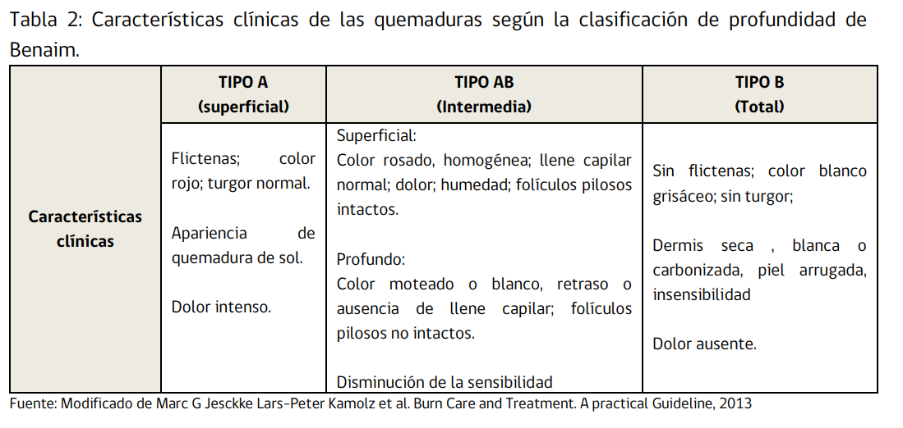

# Diagnóstico

Remota:
- Edad y sexo
- peso y estado nutricional
- comorbilidades

Evaluación inicial:
- Estado de **conciencia**
- Agente causal, **mecanismo** y tiempo de acción
- **Escenario** en que ocurre la quemadura
- **Otras Lesiones** concomitantes
- **Tiempo de evolución** de la quemadura

## Evaluación quemadura en sí
- <b>Extensión</b>: 
    Plantilla de Lund y Browder
    
    
- <b>Profundidad</b>:
    

- Localización (ojo zonas especiales):
    - cara
    - cuello
    - manos y pies
    - pliegues articulares (axila, codo, zona inguinal, hueco poplíteo)
    - genitales y periné
    - mamas
    - axila

## Gravedad
Índice de Garces

Riesgo vital según Garcés:
| Puntaje | grado | Pronóstico |
|:-------:|:-----:|:----------:|
| 21-40 | leve | Sin riesgo vital |
| 41-70 | moderado | Sin riesgo vital, salvo complicaciones |
| 71-100 | grave | Probabilidad de muerte inferior a sobrevida. Mortalidad menor 30%.|
| 101-150 | crítico | Mortalidad de 30 a 50%.|
| >150 | Sobrevida excepcional | Mortalidad mayor a 50%.|

Otras específicas:
- Edad mayor a 65 años y 10% o más de quemadura AB o B.
- Quemadura respiratoria.
- Quemadura de alta tensión.
- Politraumatismo.
- Quemados con patologías graves asociadas.
- Quemaduras profundas complejas de cabeza, manos, pies o región perineal

# Prehospitalario
## Manejo inicial
- ABCDEF(fluidos)

A: ojo sospecha injuria inhalatoria
-

# Hospitalario

# Tratamiento Qx

# Coberturas

# Manejo dolor

# Rehabilitación integral

