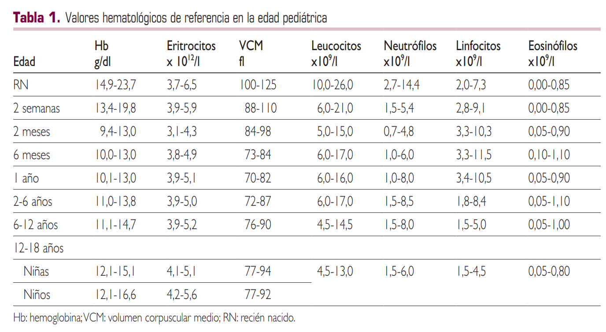
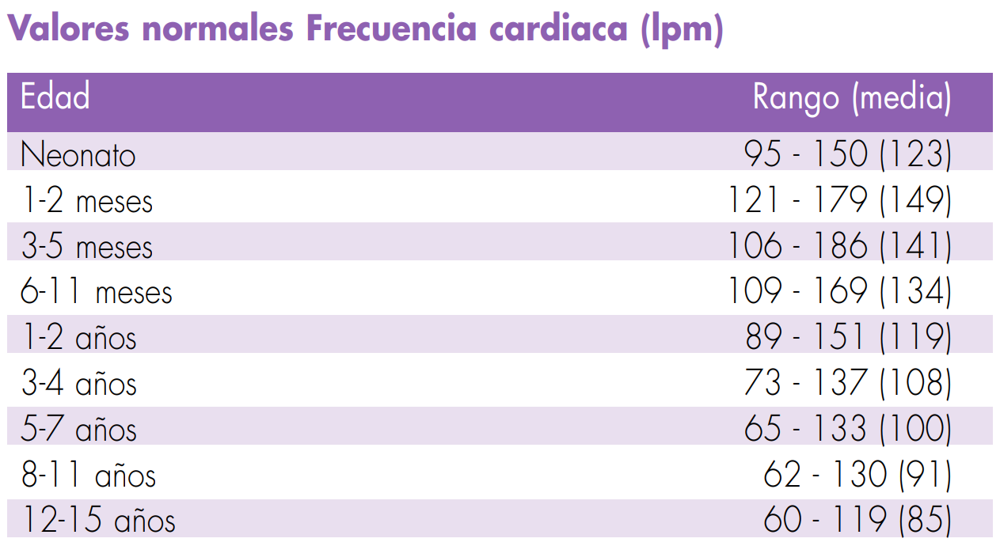
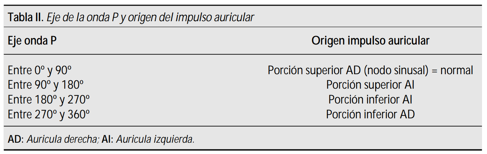
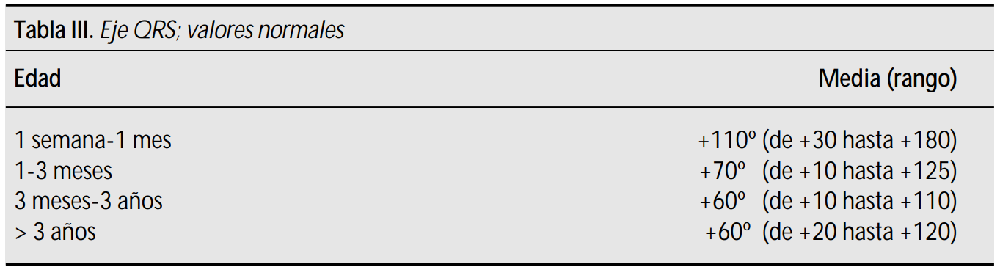
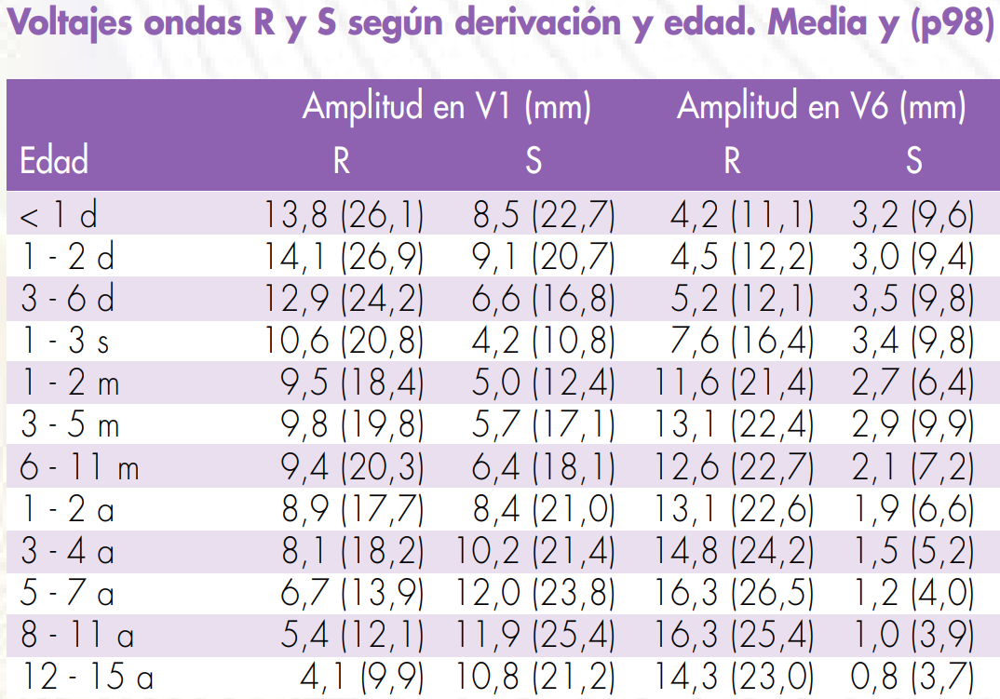
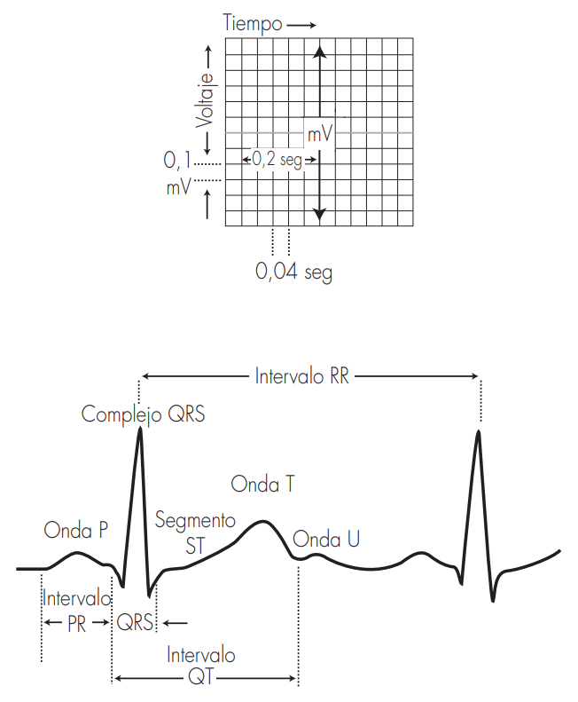

# Hemograma

# ECG

| Nº cuadros grandes | FC |
|:------------------:|:--:|
| 1   | 300 |
| 2   | 150 |
| 3   | 100 |
| 4   | 75 |
| 5   | 60 |
| 6   | 50 |

## Onda P

- Hipertrofia auricular derecha: ondas **P  <b>altas</b>  (>  3  mm)**  en  cualquier  derivación.
- Hipertrofia auricular izquierda: ondas P <b>anchas</b>:

| edad | duración |
|:----:|:--------:|
| < 1 año  | > 0,08 seg. |
| 1-3 años | > 0,09 seg. |
| > 3 años | > 0,1 seg. |

## QRS

### Bloqueos

| Edad | Duración QRS normal |
|:----:|:------------:|
| RN-3 a | <0.07 ms |
| 3-8 a | <0.08 ms |
| 8-12 a | <0.09 ms |
| 12-16 a | <0.10 ms |
| Adulto | <0.10 ms |

#### Bloqueos derechos
Bloqueo incompleto de rama derecha:
- Patrón RSR' en V1, con duración normal del complejo QRS.
- La imagen RSR' en V1 es normal siempre que:
- La duración del QRS no esté aumentada. 
- R' < 15 mm en menores de 1 año de edad y < 10 mm en mayores de 1 año

Bloqueo completo de rama derecha:
- Desviación del eje QRS a la derecha.
- Patrón RSR' en V1, con duración del complejo QRS > LSN.
- S ancha y empastada en I, V5 y V6.
- R' empastada terminal en aVR y V2.

#### Bloqueos izquierdos
Hemibloqueo anterior izquierdo:
- Desviación izquierda del eje QRS (-30º a -90º) con duración normal.
- Complejo rS en II, III y aVF.
- Complejo qR en I y aVL.

Hemibloqueo posterior izquierdo:
- Desviación derecha del eje QRS (de +120 a +180º)
- Complejo rS en I y aVL.
- Complejo qR en II, III y aVF.

Bloqueo completo de rama izquierda:
- Desviación del eje QRS a la izquierda para la edad del paciente.
- Duración del QRS > LSN para la edad.
- Ondas R empastadas y anchas con ausencia de Q en I, aVL, V5 y V6.
- Ondas S anchas en V1 y V2

### Voltajes normales QRS

#### Hipertrofia ventricular derecha
1 o +:
- R en V1 > p98 mm
- S en V6 > p98 mm
- T positiva en V1 después del 4º día de vida y antes de los 10 años.
- Complejo qR en V1.
- Complejo RSR' en V1 con R ́>15 mm en menores de 1 año; ó >10 mm en mayores de 1 año.
- Aumento de la relación R/S en V1.
- Desviación del eje a la derecha

#### Hipertrofia ventricular izquierda
1 o +:
- R en V6 > p98.
- Onda Q > 4 mm en V5 o V6. 
- R en V1 por debajo del percentil 5.   
- S en V1 > p98.  
- Desviación del eje a la izquierda

