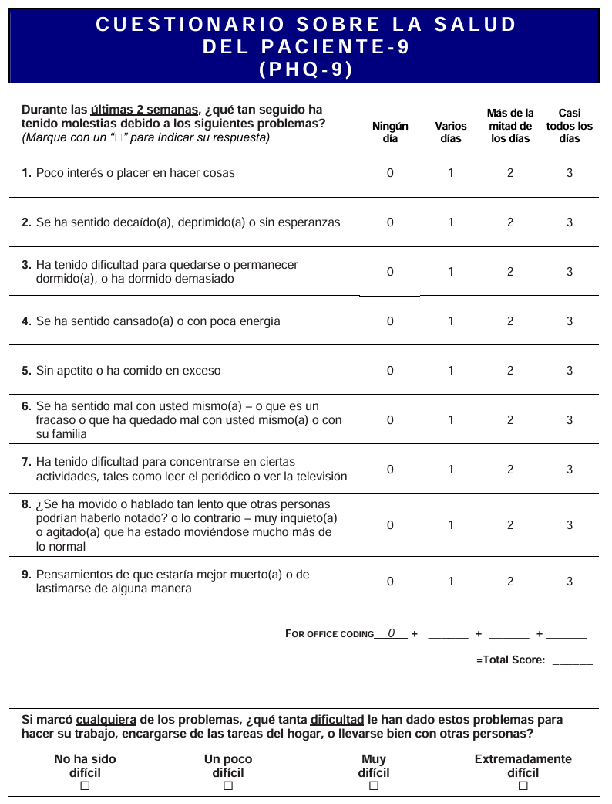
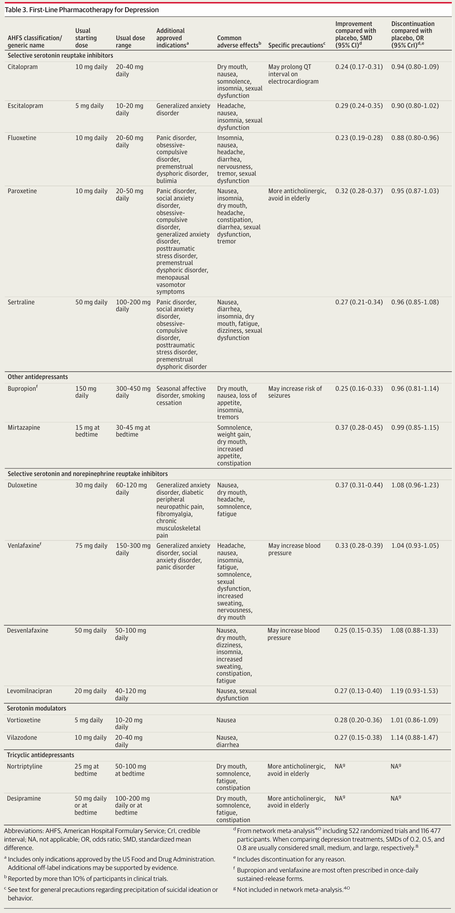
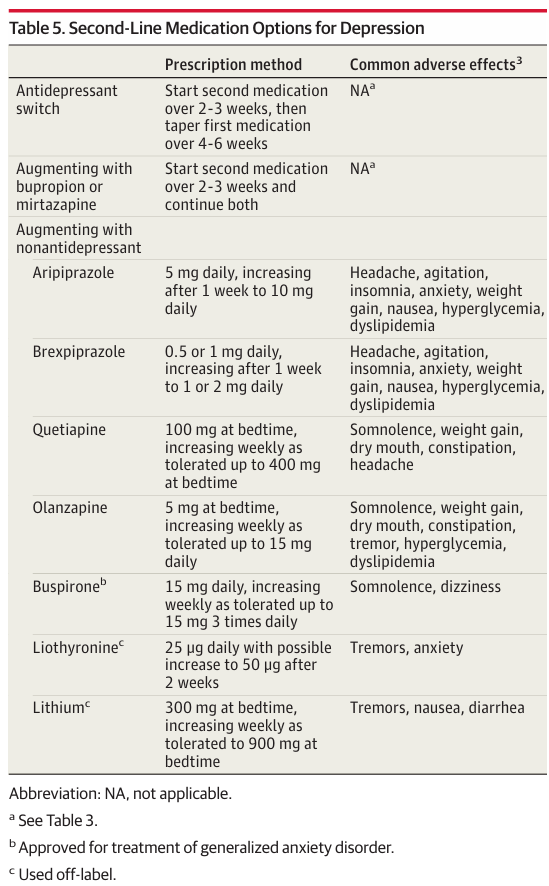
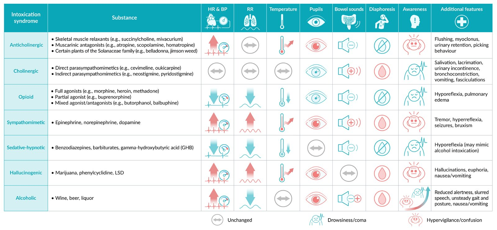
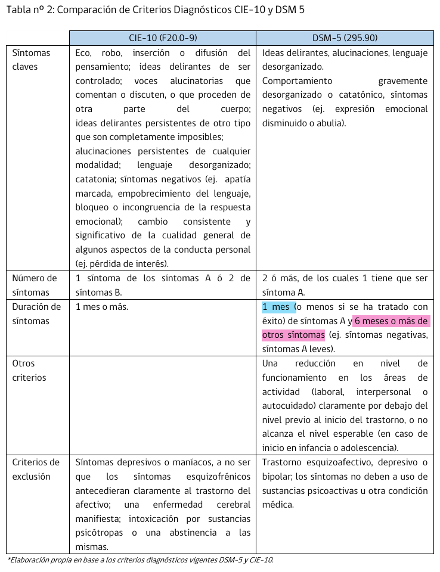
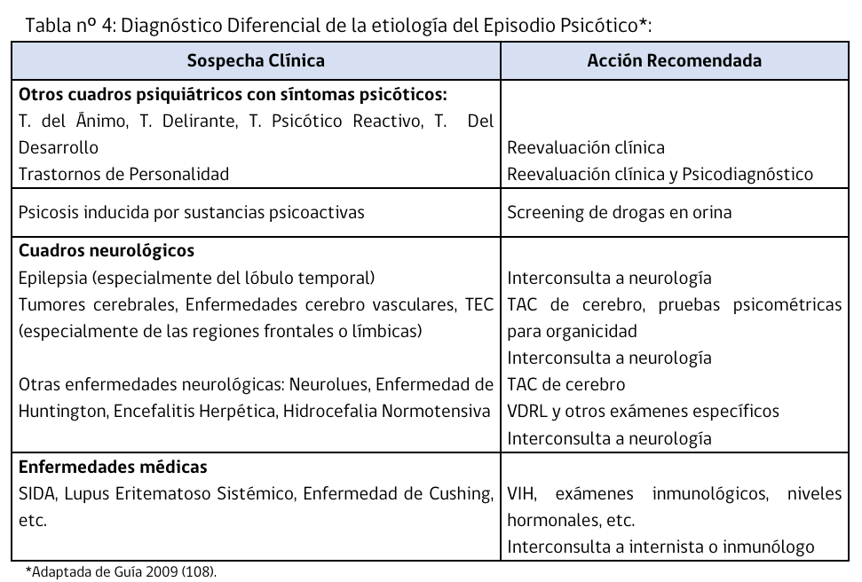
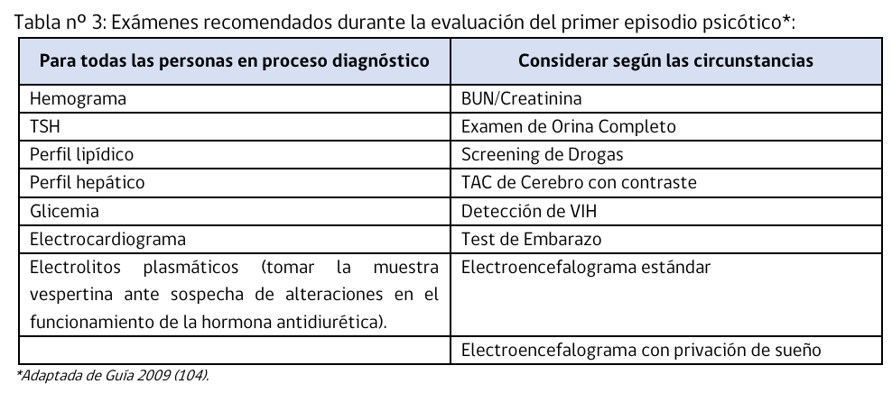
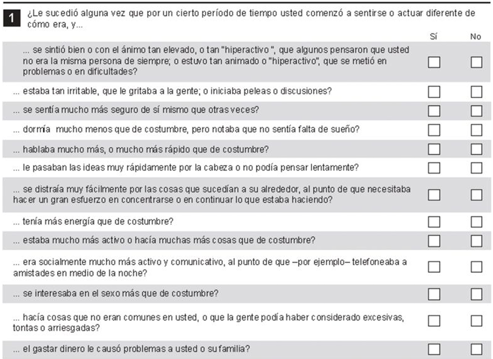
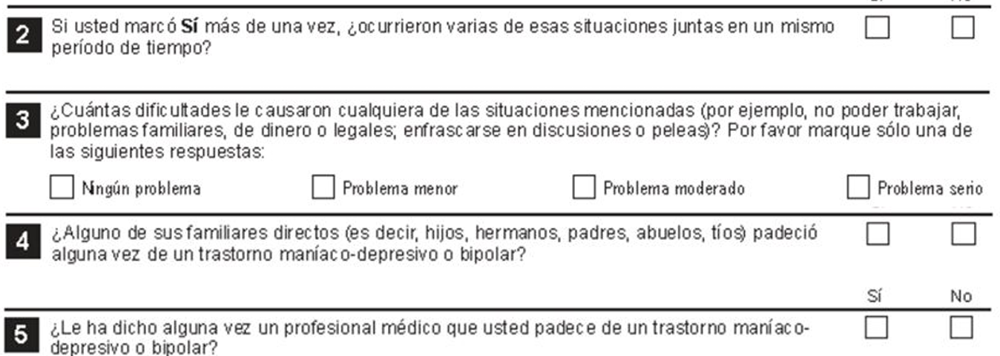
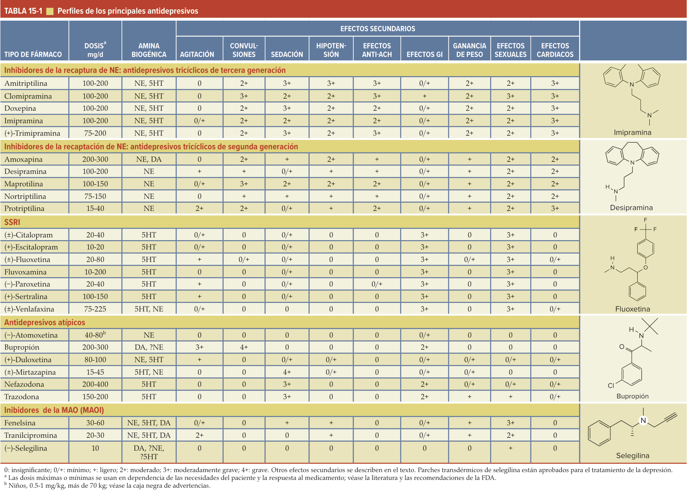

# Psicopatología y examen mental 

Estructura Examen mental, de afuera hacia adentro

- Aspecto general y conducta
- Conciencia
- Psicomotricidad
- Lenguaje
- Pensamiento
- Sensoprecepción
- Afectividad
- Nivel Cognitivo
- Juicio de realidad

## Aspecto general y conducta

1.  Constitución corporal y elementos distintivos físicamente
2.  Arreglo personal (Aseo, vestimenta, maquillaje, pelo/colororaciones/cuidados de esta, accesorios)
3.  Concordancia con la edad
4.  Actitud en la entrevista: Cercanía, adecuación, simetría (como se sitúa paciente en la entrevista, ej paciente a nivel o más abajo de médico), calidez, características (ej, amenazante, paranoide, extravagancia)
    - Ojo, EM se hace en contexto de entrevista clínica en que paciente viene para ser evaluado, no en la calle.

## Conciencia

Propiedad de reconocerse a sí mismo y al ambiente. Incluye funciones de alerta, coordinación, reglexibilidad e interioridad.

Siempre debe ser evaluada. Su alteración condicionará el resto de EM

Alteraciones de la conciencia se manifiestan por:
- desorientación temporoespacial
- disminución de la alerta
- tendencia al sueño
- labilidad afectiva
- aumento de altencia de respuesta y en casos más graves sopor o coma.

Cuantitativa:
- Embotamiento --> somnolencia --> sopor --> coma

Cualitativo:
- Interioridad
- Coordinación
- Reflexibilidad
- Alerta??

Incluir:

<li>Nivel de vigilia</li>
<li>Orientación temporoespacial</li>
<li>Atención</li>

Normal: alerta, vigil, lúcido

Por lo general, orientación se va perdiendo en orden: temporal -> espacial -> personal

Examen atención: 
- invertir series(domingo -> lunes, diciembre -> enero) 
- prueba de head

Por lo general.... Las trastornos de salud mental son de gente joven o de gente mayor con antecedentes de salud mental, y cursan con lucidez de conciencia. Si hay compromiso de conciencia debe buscar lo exógeno

(como las patologías autoinmunes son de mujer joven)

## Psicomotricidad
1. Marcha
2. Postura corporal
3. Tono muscular
4. Ocupación del espacio
5. Gesticulación y contacto visual

## Lenguaje

Habla:
1. Espontaneidad
1. Velocidad
1. Latencia
1. Léxico
1. Tono
1. Prosodia
1. Volumen
1. Neologismos

Tipo:
1. Indicativo: Frases breves, sin intención clara de querer ser comprendido
1. Notificativo: (en teoria el lenguaje "más sano")
1. Comunicativo: Aporta datos y entrega información sin dar síntomas como parte central del relato (ej, "escucha voces pero no lo problematizan", cuando se pregunta por el síntoma, pero aparecen datos contextuales)

Lenguaje permite **acceso a evaluación del pensamiento**

## Pensamiento

Conjunto de ideas, dirigidas hacia un objetivo o meta comunicativa

Pensamiento normal: Lógico, organizado jerárquicamente, coherente, flexible, versátil, silencioso y propio, de forma tal que llega a un fin comunicativo comprensible.

Velocidad: Taquipspsiquia/bradipsiquia

Alteraciones: 
### Esturctura o forma: 
Cómo se cuenta

Observar si logra meta comunicativa y evaluar cómo están enlazadas las asociaciones
- detallista 
- circunstancial
- Perseverativo
- Tangencial
- Pararrespuesta
- Escamoteador
- Contreto
- Poble
- Laxo 
- Disgegado
- Incoherente

### Contenido

Qué se cuenta

Mal indicador si algo es patológico o no, por lo general la estructura es más relevante

Ideas. Se forman de una vivencia de la realidad

- Ideas Sobrevaloradas: 
    - Ideas egosintonica, comprensible, sostenida con fuerza, movilizada por el sentimiento y que domina la vida del individuo.
    - Absolutización de una idea aceptada por el grupo cultural de pertenencia.
    - Puede rebatirse por lo tanto proviene de una mente sana. 
- Delirio: Idea que se vive con certe podíptiac:
    - Impermeable a la argumentación
    - Incorregible por la experiencia
    - Irreductible a la lógica ("porque lo sé", hay topes)
    - Delirio Primario: Asistematizado, se guarda en la intimidad, no moviliza afecto (de acuerdo a la idea), no moviliza conducta
        - Esquizofrenia
    - Delirio Secundario: Sistematizado, proselitista (se da a conocer a otros), moviliza afecto, moviliza conducta
        - Animo / desarrollo personalidad

Percepción delirante: percepción que se interpreta de forma delirante

### Control
- Ideas Obsesivas: 
    - Repetitivas y persistentes
    - Propias
    - Intrusivos e involuntarios
    - Enjuiciadas como absurdas por el mismo sujeto
    - Con sensación de lucha interna con otro pensamiento o compulsión (para ignorar, neutralizar o suprimir)
    - Se viven como egodistónicas (causan malestar/angustia al paciente)

## Sensopercepción

Toma de conocimiento del mundo a través de los sentidos

| Percepción   | Representación de la realidad |
|--------------|-------------------------------|
| Son corporeas (objetias) | Son imaginarias (subjetivas) |
| Aparecen en el espacio objetivo exterior | Aparecen en el espacio subjetivo interno |
| Tienen un diseño determinado, son completas y tienen todos los detalles | Son incompletas, fragmentadas y sin detalles | Tienen diseño indeterminado, son incompletas y tienen solo algunos detalles |
| Tienen frescura sensorial | ....

Ilusiones: objeto real -> percepción distorsionada

Alucinaciones: percepción sin objeto real

Pseudoalucinaciones: similares a la percepción normal, excepto en que se producen en el espacio subjetivo interno.
- Pseudoalucinaciones auditivas: clasico de esquizofrenia

## Afectividad

Vivencia hedónica subjetiva, experimentada como agradable o desagradable que orienta nuestra vida

Expresada a través de conducta, actitudes y expresiones faciales

Trasciende a nuestro comportamiento impactando de forma no verbal en la comunicación

- Emoción (superficial): afecto observable, brusco, agudo e intenso con abundante correlación somática 
- Sentimiento (intermedio): Experiencia subjetiva de mayor duración, con correlato neurovegetativo moderado y de permanencia relatuvamente prolongada
- Ánimo (profundo): Tonalidad hedónica subjetiva de la experiencia, basal, sostenida y de mayor duración

Características:
- Polaridad
(...)

## Nivel cognitivo

Hay pruebas específicas, no se evalúa en EM habitual pero tener en consideración

- Escolaridad
- Capacidad de elaboración de ideas y léxico
- Capacidad de abstracción (refranes y similitudes): manzana y naranja se parecen en que son frutas, entonces en qué se parecen sierra y acha, vapor y niebla, radio y diario, árbol y mosca.

Considerarlo porque entrevista podría tener que adecuarse

## Juicio de realidad

Capacidad de reconocer la realidad y actuar en consecuencia

Se altera en la psicosis

## Conciencia y noción de enfermedad

Conciencia de enfermedad: Capacidad para enuncuar lo que le sucede y el alcance de su situación

Noción de enfermedad: Existencia del concepto nítido de que lo que le sucede considerándolo como un trastorno con peligro de disolución de lo psíquico y por lo tano que le exige una terapia inmediata, de cuya dirección y puesta en marcha debería responsabilizarse a la propia persona. 

## Tabla resumen

| Aspecto | Evaluación |
|---------|------------|
| Aspecto general y conducta | Constitución corporal y elementos distintivos físicamente, arreglo personal, concordancia con la edad, actitud en la entrevista |
| Conciencia | Nivel de vigilia, orientación temporoespacial, atención |
| Psicomotricidad | Marcha, postura corporal, tono muscular, ocupación del espacio, gesticulación y contacto visual |
| Lenguaje | Espontaneidad, velocidad, latencia, léxico, tono, prosodia, volumen, neologismos |
| Pensamiento | Estructura o forma, contenido, control |
| Sensopercepción | Percepción, ilusiones, alucinaciones, pseudoalucinaciones |
| Afectividad | Emoción, sentimiento, ánimo |
| Nivel cognitivo | Escolaridad, capacidad de elaboración de ideas y léxico, capacidad de abstracción |
| Juicio de realidad | Capacidad de reconocer la realidad y actuar en consecuencia |
| Conciencia y noción de enfermedad | Conciencia de enfermedad, noción de enfermedad |

Plantilla para descripción en ficha clínica

# Trastornos depresivos
<table class="api table-wrapper-wide" data-table="dGQlM0UlMjAlM0MvdHIlM0UlMEElM0MvdGJvZHklM0UlMEElM0MvdGFibGUlM0U=39725">
<thead>
<tr>
<th colspan="3" scope="row"> Visión general de los  trastornos depresivos 
</th> </tr>
<tr>
<th scope="row">Afección</th> <th scope="col">Momento</th> <th scope="col">Características diagnósticas</th> </tr>
</thead>
<tbody>
<tr>
<th scope="row"> <a data-phrasegroup-id="Qj1uZS0" class="api tooltip__link link--same-article" data-type="link" data-anker="Z4c55cc422cab2389c9f1d88eda34da57" data-learningcard-id="PP0WUT" data-lxid="PP0WUT" data-section-id="UnYbsp" data-sxid="UnYbsp" data-title="TWFqb3IgZGVwcmVzc2l2ZSBkaXNvcmRlciDihpIgRGlmZmVyZW50aWFsIGRpYWdub3Nlcw==" id="L8fe4b2884893420fc993379d659d33c3" data-source="L8fe4b2884893420fc993379d659d33c3" href="/us/article/PP0WUT#Ilo0YzU1Y2M0MjJjYWIyMzg5YzlmMWQ4OGVkYTM0ZGE1NyI=" tabindex="0">Trastorno depresivo</a> mayor</th> <td> <ul>
<li>
Los síntomas están presentes durante al menos 2 semanas.
</li> </ul>
</td> <td> <ul>
<li>
≥5 de los 9 <a class="api link--same-article" data-type="link" data-anker="Z56a21b68ee81c2911a21b94c03b3926e" data-learningcard-id="PP0WUT" data-lxid="PP0WUT" data-section-id="VnYGHp" data-sxid="VnYGHp" data-title="TWFqb3IgZGVwcmVzc2l2ZSBkaXNvcmRlciDihpIgRGlhZ25vc3RpY3M=" id="Lf1b7d31ac1065b9b1cc6c38cca5916db" data-source="Lf1b7d31ac1065b9b1cc6c38cca5916db" href="/us/article/PP0WUT#Ilo1NmEyMWI2OGVlODFjMjkxMWEyMWI5NGMwM2IzOTI2ZSI=">criterios diagnósticos del</a> trastorno depresivo mayor (debe incluir estado de ánimo deprimido o pérdida de interés) </li> </ul>
</td> </tr>
<tr>
<th scope="row">Trastorno<a data-phrasegroup-id="v1aAij" class="api tooltip__link link--same-article" data-type="link" data-anker="Z5b35895510a2d58a0bd0818679428910" data-learningcard-id="PP0WUT" data-lxid="PP0WUT" data-section-id="02ceTb0" data-sxid="02ceTb0" data-title="TWFqb3IgZGVwcmVzc2l2ZSBkaXNvcmRlciDihpIgU3VidHlwZXMgYW5kIHZhcmlhbnRz" id="L43043cd1cd211f81e03f6ea08078da3e" data-source="L43043cd1cd211f81e03f6ea08078da3e" href="/us/article/PP0WUT#Ilo1YjM1ODk1NTEwYTJkNThhMGJkMDgxODY3OTQyODkxMCI=">depresivo persistente</a> (<a data-phrasegroup-id="v1aAij" class="api tooltip__link link--same-article" data-type="link" data-anker="Z5b35895510a2d58a0bd0818679428910" data-learningcard-id="PP0WUT" data-lxid="PP0WUT" data-section-id="02ceTb0" data-sxid="02ceTb0" data-title="TWFqb3IgZGVwcmVzc2l2ZSBkaXNvcmRlciDihpIgU3VidHlwZXMgYW5kIHZhcmlhbnRz" id="La3aa9d61280885bc4e47ebf3e862e97f" data-source="La3aa9d61280885bc4e47ebf3e862e97f" href="/us/article/PP0WUT#Ilo1YjM1ODk1NTEwYTJkNThhMGJkMDgxODY3OTQyODkxMCI=">distimia</a>)</th> <td> <ul>
<li>Los síntomas están presentes durante ≥ 2 años. 
 </li> </ul>
</td> <td> <ul>
<li>
Estado de ánimo deprimido, además de la presencia de ≥ 2 de los siguientes síntomas: <ul>
<li>Falta de apetito o comer en exceso</li> <li>
Insomnio o <a data-phrasegroup-id="cmbae8" class="api tooltip__link" data-type="link" data-anker="Z46908af4b4dca3889e300cd0b6924c66" data-learningcard-id="tP0XgT" data-lxid="tP0XgT" data-section-id="Uncbs10" data-sxid="Uncbs10" data-title="U2xlZXAgYW5kIHNsZWVwIGRpc29yZGVycyDihpIgSHlwZXJzb21ub2xlbmNlIGRpc29yZGVy" id="L8d54662c3f3a6f8a8acdaa254eefdd20" data-source="L8d54662c3f3a6f8a8acdaa254eefdd20" href="/us/article/tP0XgT#Ilo0NjkwOGFmNGI0ZGNhMzg4OWUzMDBjZDBiNjkyNGM2NiI=">hipersomnia</a>
</li> <li>Poca energía o fatiga</li> <li>Baja autoestima
</li> <li>Poca concentración o dificultad para tomar decisiones</li> <li>Sentimientos de desesperanza</li> </ul>
</li> </ul>
</td> </tr>
<tr>
<th scope="row"><a data-phrasegroup-id="w1ahQj" class="api tooltip__link link--same-article" data-type="link" data-anker="Z0dd47574deb650c6e853e3caace7c5cc" data-learningcard-id="PP0WUT" data-lxid="PP0WUT" data-section-id="02ceTb0" data-sxid="02ceTb0" data-title="TWFqb3IgZGVwcmVzc2l2ZSBkaXNvcmRlciDihpIgU3VidHlwZXMgYW5kIHZhcmlhbnRz" id="Lda14c802745046d08f60953c0f0db9df" data-source="Lda14c802745046d08f60953c0f0db9df" href="/us/article/PP0WUT#IlowZGQ0NzU3NGRlYjY1MGM2ZTg1M2UzY2FhY2U3YzVjYyI=">Depresión con patrón estacional</a></th> <td> <ul>
<li>Suele aparecer en otoño o invierno</li> </ul>
</td> <td> <ul>
<li>Los síntomas son los mismos que en el MDD.</li> </ul>
</td> </tr>
<tr>
<th scope="row"> <a data-phrasegroup-id="Qj1uZS0" class="api tooltip__link link--same-article" data-type="link" data-anker="Z4c55cc422cab2389c9f1d88eda34da57" data-learningcard-id="PP0WUT" data-lxid="PP0WUT" data-section-id="UnYbsp" data-sxid="UnYbsp" data-title="TWFqb3IgZGVwcmVzc2l2ZSBkaXNvcmRlciDihpIgRGlmZmVyZW50aWFsIGRpYWdub3Nlcw==" id="L300125e5328d2c3fd0a2b55fa50a83b9" data-source="L300125e5328d2c3fd0a2b55fa50a83b9" href="/us/article/PP0WUT#Ilo0YzU1Y2M0MjJjYWIyMzg5YzlmMWQ4OGVkYTM0ZGE1NyI=">Trastorno depresivo</a> menor</th> <td> <ul>
<li>Los síntomas están presentes durante un periodo de 2 semanas durante &lt;2 años  .
</li> </ul>
</td> <td> <ul>
<li>
2-4 criterios  diagnósticos para  el trastorno<a data-phrasegroup-id="Qj1uZS0" class="api tooltip__link link--same-article" data-type="link" data-anker="Z4c55cc422cab2389c9f1d88eda34da57" data-learningcard-id="PP0WUT" data-lxid="PP0WUT" data-section-id="UnYbsp" data-sxid="UnYbsp" data-title="TWFqb3IgZGVwcmVzc2l2ZSBkaXNvcmRlciDihpIgRGlmZmVyZW50aWFsIGRpYWdub3Nlcw==" id="L8c7bfea9ed992be851f170bf0a8cbe88" data-source="L8c7bfea9ed992be851f170bf0a8cbe88" href="/us/article/PP0WUT#Ilo0YzU1Y2M0MjJjYWIyMzg5YzlmMWQ4OGVkYTM0ZGE1NyI=">depresivo</a> mayor (debe incluir estado de ánimo deprimido o pérdida de interés)</li> </ul>
</td> </tr>
<tr>
<th scope="row"><a data-phrasegroup-id="-kcDqc0" class="api tooltip__link" data-type="link" data-anker="Z1a2b1d9bdfd6b15d186304d652c77769" data-learningcard-id="jH0_Jh" data-lxid="jH0_Jh" data-section-id="XC19qQ0" data-sxid="XC19qQ0" data-title="R3JpZWYgYW5kIGVuZC1vZi1saWZlIGNvdW5zZWxpbmcg4oaSIEJlcmVhdmVtZW50IGFuZCBncmllZg==" id="L10d8ebd5dadd08030564c35017224cb8" data-source="L10d8ebd5dadd08030564c35017224cb8" href="/us/article/jH0_Jh#IloxYTJiMWQ5YmRmZDZiMTVkMTg2MzA0ZDY1MmM3Nzc2OSI=">Duelo</a></th> <td> <ul>
<li>Variable</li> </ul>
</td> <td> <ul>
<li>Pérdida o <a class="api" data-type="link" data-anker="Z50d4cd4f1799c2c9f72dcc5af8b9aace" data-learningcard-id="vP0AgT" data-lxid="vP0AgT" data-title="RGVhdGg=" id="Lb060589e5ac8738181716cc87a0919fc" data-source="Lb060589e5ac8738181716cc87a0919fc" href="/us/article/vP0AgT#Ilo1MGQ0Y2Q0ZjE3OTljMmM5ZjcyZGNjNWFmOGI5YWFjZSI=">muerte</a> identificable de un ser querido</li> <li>Sin deterioro funcional</li> <li>Los síntomas suelen aparecer en oleadas</li> <li>
<a data-phrasegroup-id="PmbWf8" class="api tooltip__link" data-type="link" data-anker="Z9fa12826259e9181f9e4f023d7c20096" data-learningcard-id="br0Hfh" data-lxid="br0Hfh" data-section-id="iN1Jah0" data-sxid="iN1Jah0" data-title="TWVudGFsIHN0YXR1cyBleGFtaW5hdGlvbiDihpIgUGVyY2VwdHVhbCBkaXN0dXJiYW5jZXM=" id="Lcf3b1610730b558b40adf67e6246d169" data-source="Lcf3b1610730b558b40adf67e6246d169" href="/us/article/br0Hfh#Ilo5ZmExMjgyNjI1OWU5MTgxZjllNGYwMjNkN2MyMDA5NiI=">Alucinaciones</a> del ser querido fallecido</li> <li>Sin <a data-phrasegroup-id="Nda-Jj" class="api tooltip__link" data-type="link" data-anker="Zb14fd8b9615c2d94beb3c80c6f39ac2a" data-learningcard-id="br0Hfh" data-lxid="br0Hfh" data-section-id="RN1lah0" data-sxid="RN1lah0" data-title="TWVudGFsIHN0YXR1cyBleGFtaW5hdGlvbiDihpIgVGhvdWdodCBjb250ZW50" id="Lf8caaaf4033f3db9914af881075e9a6a" data-source="Lf8caaaf4033f3db9914af881075e9a6a" href="/us/article/br0Hfh#IlpiMTRmZDhiOTYxNWMyZDk0YmViM2M4MGM2ZjM5YWMyYSI=">ideación suicida</a></li> </ul>
</td> </tr>
<tr>
<th scope="row"><a data-phrasegroup-id="qBcCbU0" class="api tooltip__link" data-type="link" data-anker="Zbe2fc6855075311d91764a4713259f3f" data-learningcard-id="4P03UT" data-lxid="4P03UT" data-section-id="3nYSGp" data-sxid="3nYSGp" data-title="Qmlwb2xhciBkaXNvcmRlciDihpIgU3VtbWFyeQ==" id="Ld95cf7c2adc84ad78fff50a3d7b6ba71" data-source="Ld95cf7c2adc84ad78fff50a3d7b6ba71" href="/us/article/4P03UT#IlpiZTJmYzY4NTUwNzUzMTFkOTE3NjRhNDcxMzI1OWYzZiI=">Trastorno del estado de ánimo</a> debido a otra afección médica</th> <td> <ul>
<li>Variable</li> </ul>
</td> <td> <ul>
<li>Los síntomas depresivos se explican por enfermedades orgánicas, como: <ul>
<li>Desequilibrios hormonales</li> <li>
Trastornos<a data-phrasegroup-id="6SXj0B" class="api tooltip__link" data-type="link" data-anker="Z0111aade770ed6f7d136b455de1d6c1f" data-learningcard-id="lp0vpS" data-lxid="lp0vpS" data-section-id="1Cc2Ie0" data-sxid="1Cc2Ie0" data-title="TmVydmUgdGlzc3VlLCBzeW5hcHNlcywgYW5kIG5ldXJvdHJhbnNtaXR0ZXJzIOKGkiBOZXJ2ZSB0aXNzdWU=" id="L313865e20c38567d00754b464e50c78c" data-source="L313865e20c38567d00754b464e50c78c" href="/us/article/lp0vpS#IlowMTExYWFkZTc3MGVkNmY3ZDEzNmI0NTVkZTFkNmMxZiI=">del SNC</a> </li> <li>Cáncer</li> </ul>
</li> </ul>
</td> </tr>
<tr>
<th scope="row"><a class="api link--same-article" data-type="link" data-anker="Z879e98a79e19fd3346a00e0a0e1668f6" data-learningcard-id="PP0WUT" data-lxid="PP0WUT" data-section-id="UnYbsp" data-sxid="UnYbsp" data-title="TWFqb3IgZGVwcmVzc2l2ZSBkaXNvcmRlciDihpIgRGlmZmVyZW50aWFsIGRpYWdub3Nlcw==" id="L57f65015291c661efebb1149681ff107" data-source="L57f65015291c661efebb1149681ff107" href="/us/article/PP0WUT#Ilo4NzllOThhNzllMTlmZDMzNDZhMDBlMGEwZTE2NjhmNiI=">Trastorno depresivo inducido por sustancias</a></th> <td> <ul>
<li>Variable</li> </ul>
</td> <td> <ul>
<li>Síntomas depresivos en el contexto del consumo de sustancias, por ejemplo, una de las siguientes: <ul>
<li>Alcohol</li> <li>Alucinógenos</li> <li>Inhalantes</li> <li><a data-phrasegroup-id="Ycbnas" class="api tooltip__link" data-type="link" data-anker="Z434daecbc44532c03b0313928f0c321d" data-learningcard-id="yN0ddg" data-lxid="yN0ddg" data-title="T3Bpb2lkcw==" id="L31d007f5d94669278995f8dc261e4756" data-source="L31d007f5d94669278995f8dc261e4756" href="/us/article/yN0ddg#Ilo0MzRkYWVjYmM0NDUzMmMwM2IwMzEzOTI4ZjBjMzIxZCI=">Opiáceos</a></li> <li><a data-phrasegroup-id="Buaztm" class="api tooltip__link" data-type="link" data-anker="Z04699f1d4cedacd9f16bd0a84ede297c" data-learningcard-id="nF07i3" data-lxid="nF07i3" data-section-id="ftWk1M0" data-sxid="ftWk1M0" data-title="U3RpbXVsYW50IGludG94aWNhdGlvbiBhbmQgd2l0aGRyYXdhbCDihpIgQW1waGV0YW1pbmVz" id="Lb587d42a2040d070f9358f2432bac701" data-source="Lb587d42a2040d070f9358f2432bac701" href="/us/article/nF07i3#IlowNDY5OWYxZDRjZWRhY2Q5ZjE2YmQwYTg0ZWRlMjk3YyI=">Anfetaminas</a></li> <li><a data-phrasegroup-id="V5bGQ8" class="api tooltip__link" data-type="link" data-anker="Ze484aa13dc518fe96d58522a9f0446ba" data-learningcard-id="nF07i3" data-lxid="nF07i3" data-section-id="2tWT1M0" data-sxid="2tWT1M0" data-title="U3RpbXVsYW50IGludG94aWNhdGlvbiBhbmQgd2l0aGRyYXdhbCDihpIgQ29jYWluZQ==" id="Leed53ce6ab05b7a6844988f18c8eac19" data-source="Leed53ce6ab05b7a6844988f18c8eac19" href="/us/article/nF07i3#IlplNDg0YWExM2RjNTE4ZmU5NmQ1ODUyMmE5ZjA0NDZiYSI=">Cocaína</a></li> </ul>
</li> </ul>
</td> </tr>
<tr>
<th scope="row"> <a data-phrasegroup-id="2mbTU8" class="api tooltip__link" data-type="link" data-anker="Z7c1ad4188bdfe06e48f37f4e50a1b0d4" data-learningcard-id="A50R5g" data-lxid="A50R5g" data-section-id="kLcmB10" data-sxid="kLcmB10" data-title="RGlzcnVwdGl2ZSwgaW1wdWxzZS1jb250cm9sLCBhbmQgY29uZHVjdCBkaXNvcmRlcnMg4oaSIERpc3J1cHRpdmUgbW9vZCBkeXNyZWd1bGF0aW9uIGRpc29yZGVyIChETUREKQ==" id="L22f963665f4e4d8c4ec263649964a2d2" data-source="L22f963665f4e4d8c4ec263649964a2d2" href="/us/article/A50R5g#Ilo3YzFhZDQxODhiZGZlMDZlNDhmMzdmNGU1MGExYjBkNCI=">Trastorno perturbador de la desregulación del estado de ánimo</a> (<a data-phrasegroup-id="2mbTU8" class="api tooltip__link" data-type="link" data-anker="Z7c1ad4188bdfe06e48f37f4e50a1b0d4" data-learningcard-id="A50R5g" data-lxid="A50R5g" data-section-id="kLcmB10" data-sxid="kLcmB10" data-title="RGlzcnVwdGl2ZSwgaW1wdWxzZS1jb250cm9sLCBhbmQgY29uZHVjdCBkaXNvcmRlcnMg4oaSIERpc3J1cHRpdmUgbW9vZCBkeXNyZWd1bGF0aW9uIGRpc29yZGVyIChETUREKQ==" id="L08c6009dbafd0b964b63412f1c0d3205" data-source="L08c6009dbafd0b964b63412f1c0d3205" href="/us/article/A50R5g#Ilo3YzFhZDQxODhiZGZlMDZlNDhmMzdmNGU1MGExYjBkNCI=">DMDD</a>) 
 </th> <td> <ul>
<li>Los síntomas están presentes durante ≥ 12 meses.</li> </ul>
</td> <td> <ul>
<li>
Estallidos de temperamento graves (verbales o conductuales) ≥ 3 veces/semana.</li> <li>
Irritabilidad o ira entre los arrebatos.</li> <li>El diagnóstico sólo puede establecerse en menores de 18 años.</li> </ul>
</td> </tr>
<tr>
<th scope="row"><a data-phrasegroup-id="KlbUBF" class="api tooltip__link" data-type="link" data-anker="Zc976bd566b088e2ef27e89075ef2cbdb" data-learningcard-id="lP0vUT" data-lxid="lP0vUT" data-section-id="kFXmR-" data-sxid="kFXmR-" data-title="VHJhdW1hLSBhbmQgc3RyZXNzb3ItcmVsYXRlZCBkaXNvcmRlcnMg4oaSIEFkanVzdG1lbnQgZGlzb3JkZXI=" id="L75ffa51c2edccb75cb02a34d1d3a0aab" data-source="L75ffa51c2edccb75cb02a34d1d3a0aab" href="/us/article/lP0vUT#IlpjOTc2YmQ1NjZiMDg4ZTJlZjI3ZTg5MDc1ZWYyY2JkYiI=">Trastorno de adaptación</a></th> <td rowspan="1"> <ul>
<li>Los síntomas duran ≤ 6 meses tras la finalización del factor estresante</li> </ul>
</td> <td rowspan="1"> <ul>
<li>Angustia subjetiva inadecuada (no en relación con la naturaleza del acontecimiento)</li> <li>Deterioro del funcionamiento</li> </ul>
</td> </tr>
</tbody>
</table>

## Tamizaje

Gravedad: 
- Leve: 5-9
- Moderada: 10-19
- Moderadamente grave: >= 20

## Tratamiento

### Psicoterapia
### Antidepresivos

Razones para elejir otros antidepresivos no ISRS:

<table cellspacing="0"><colgroup span="2" width="300ch"></colgroup> <tbody> 
<tr> <th class="subtitle1">Clinical characteristic</th> <th class="subtitle1">Potential antidepressant choice</th> </tr> 
<tr> <td>Severe insomnia or other need for a sedating agent</td> <td>Mirtazapine</td> </tr> 
<tr> <td>Severe hypersomnia/lack of energy or other need for less sedating agent</td> <td> 
Bupropion*¶
 
Reboxetine
 Vilazodone</td> </tr> 
<tr> <td>Depression-related weight loss or other need for agent that can cause weight gain</td> <td>MirtazapineΔ</td> </tr> 
<tr> <td>Desire for agent that is weight neutral or causes weight loss</td> <td>Bupropion*¶</td> </tr> 
<tr> <td>Desire for agent that concurrently aids in smoking cessation</td> <td>Bupropion¶</td> </tr> 
<tr> <td>Desire to treat concomitant chronic neuropathic pain</td> <td> 
SNRI (eg, duloxetine, milnacipran)
 Tricyclic antidepressants◊</td> </tr> 
<tr> <td>Prior remission with agent from a different class</td> <td>Previously used antidepressant</td> </tr> 
<tr> <td>Prior or expected inability to tolerate SSRI-related sexual dysfunction</td> <td> 
Bupropion¶
 
Mirtazapine
 
Vortioxetine
 Vilazodone</td> </tr> 
<tr> <td>Severe depression</td> <td> 
SNRI (or SSRI)§
 Tricyclic antidepressants or mirtazapine</td> </tr> </tbody></table>

* Some SSRIs can be used in this clinical situation; fluoxetine is the least sedating.

¶ Bupropion is contraindicated in individuals with seizure disorder or increased risk of seizure, including anorexia nervosa and bulimia.

Δ Paroxetine is an SSRI that can be used in this clinical situation.

◊ Tricyclic antidepressants are effective for chronic neuropathic pain, but adverse effects and safety concerns limit their use in initial management.

§ Both SNRIs and SSRIs are reasonable first-line options for treating severe major depression.

### Consejería breve

<table>
<thead>
<tr>
<th scope="col">Enfoque</th>
<th scope="col">Ejemplo de preguntas</th>
</tr>
</thead>
<tbody>
<tr>
<td>Activación conductual   organizar actividades positivas</td>
<td>
Establecer metas pequeñas y alcanzables para actividades positivas puede ayudar a construir motivación y mejorar el estado de ánimo.  
<li> ¿Podemos identificar una o dos cosas positivas que podrías planificar para la próxima semana?
<li> ¿Cuándo harías esas cosas? ¿Podemos anotarlas?
<li> ¿Hay algo que pueda interferir con la realización de estas actividades? ¿Cómo podrías manejar esos obstáculos?
<li> ¿Qué te ayudaría a comenzar cuando llegue el momento?
</td>
</tr>   
<tr>
<td>Terapia cognitiva   identificar e interrumpir pensamientos negativos</td>
<td>
<li> ¿Cuáles son algunos de los pensamientos negativos o autocríticos en los que puedes quedarte atrapado?
<li> ¿Cómo puedes reconocer cuándo te estás quedando atrapado en esos pensamientos negativos exagerados o extremos?
<li> ¿Qué podría ayudarte a interrumpir esos pensamientos o restarles poder?
<li> ¿Qué te ayudaría a dar un paso atrás y examinar la evidencia sobre esos pensamientos negativos?
</td>
</tr>
<tr>
<td> Terapia basada en mindfulness</td>
<td>
En lugar de luchar contra los pensamientos negativos, puede ser útil intentar desconectarte de ellos.  
 Puedes intentar desconectarte de los pensamientos negativos enfocándote en las sensaciones del momento presente, como tu respiración o lo que escuchas. Algunas formas en que puedes hacer esto son:  
 Hay muchos ejercicios de mindfulness y meditación en internet o en aplicaciones. Es posible que te gusten algunos más que otros, así que prueba varios.  
 La práctica de mindfulness suele ser útil en grupos. Podrías intentar buscar un grupo cerca de ti. Estos grupos pueden variar en su enfoque, por lo que podría valer la pena probar varios.
</td>
</tr>
<tr>
<td>Terapia resolutiva de problemas Planear pequeñas metas alcanzables</td>
<td>

A menudo, cuando estamos deprimidos, nuestras vidas se vuelven más desorganizadas, lo que nos hace sentir aún peor.
 Intenta tomar unos minutos para planificar tu día la noche anterior, de modo que sepas qué esperar y qué podrías necesitar posponer.
 Establece de 1 a 3 metas pequeñas y alcanzables para el día siguiente.
 Si no logras alcanzar esas metas, no te castigues. Úsalo como una oportunidad de aprendizaje y analiza qué se interpuso en el camino. Felicítate por alcanzar cualquier meta, sin importar lo pequeña que parezca.
</td>
</tr>
<tr>
<td>Terapia interpersonal Mejorar las relaciones sociales</td>
<td>
Hay muchas formas en las que las personas pueden apoyarnos. A veces es tener a alguien con quien hablar sobre los problemas, y otras veces puede ser simplemente hacer algo con alguien que te ayude a sentirte parte de algo.
<li>¿Hay alguien en tu vida con quien te sientas cómodo hablando?
<li>¿Hay alguien con quien te gustaría pasar un rato, incluso si es algo tan simple como ir a tomar un café o ver una película?
</td>
</tr>
</tbody>
</table>

# Trastorno por uso de sustancias (TUS)

<table class="api table-wrapper-wide" data-table="dGQlM0UlMjAlM0MvdHIlM0UlMEElM0MvdGJvZHklM0UlMEElM0MvdGFibGUlM0U=140753">
<thead>
<tr>
<th colspan="10" scope="row"> Visión general de la intoxicación y la abstinencia de sustancias [6]
</th> </tr>
<tr>
<th colspan="8" rowspan="1" scope="row">Intoxicación</th> <th colspan="2" rowspan="2" scope="col">Abstinencia</th> </tr>
<tr>
<th colspan="2" scope="row">Sustancia</th> <th scope="col">Pupilas</th> <th scope="col"><a class="api" data-type="link" data-anker="Zf05e00f71f01ff4001a32538eb9efb38" data-learningcard-id="jJ0_FS" data-lxid="jJ0_FS" data-section-id="5Z1iX20" data-sxid="5Z1iX20" data-title="VmFzY3VsYXIgcGh5c2lvbG9neSDihpIgQ2lyY3VsYXRvcnkgc3lzdGVt" id="L739b28acf11547cccdc79956bb09ac0b" data-source="L739b28acf11547cccdc79956bb09ac0b" href="/us/article/jJ0_FS#IlpmMDVlMDBmNzFmMDFmZjQwMDFhMzI1MzhlYjllZmIzOCI=">Sistema cardiovascular</a></th> <th colspan="4" scope="col">Síntomas concomitantes</th> </tr>
<tr>
<th colspan="10" scope="row">Depresores</th> </tr>
</thead>
<tbody>
<tr>
<th colspan="2" scope="row">Alcohol</th> <td> <ul>
<li>Reacción pupilar lenta</li> </ul>
</td> <td> <ul>
<li><a data-phrasegroup-id="nGb7-E" class="api tooltip__link" data-type="link" data-anker="Zb5022b8fa3fa419ab039a0f8d70866a2" data-learningcard-id="rM0fJg" data-lxid="rM0fJg" data-section-id="oVc0vY0" data-sxid="oVc0vY0" data-title="Q2FyZGlvdmFzY3VsYXIgZXhhbWluYXRpb24g4oaSIEJsb29kIHByZXNzdXJl" id="Lf647822e94f4bf22bfae28150772cced" data-source="Lf647822e94f4bf22bfae28150772cced" href="/us/article/rM0fJg#IlpiNTAyMmI4ZmEzZmE0MTlhYjAzOWEwZjhkNzA4NjZhMiI=">Hipotensión</a></li> <li><a data-phrasegroup-id="lNbvY8" class="api tooltip__link" data-type="link" data-anker="Z3ae4e1e5581c7405590e65b57fa82021" data-learningcard-id="rM0fJg" data-lxid="rM0fJg" data-section-id="KVcUvY0" data-sxid="KVcUvY0" data-title="Q2FyZGlvdmFzY3VsYXIgZXhhbWluYXRpb24g4oaSIFB1bHNlcw==" id="L64ec879d1be1c2ca908e07ae2df86c98" data-source="L64ec879d1be1c2ca908e07ae2df86c98" href="/us/article/rM0fJg#IlozYWU0ZTFlNTU4MWM3NDA1NTkwZTY1YjU3ZmE4MjAyMSI=">Taquicardia</a></li> </ul>
</td> <td colspan="4"> <ul>
<li>Desinhibición</li> <li><a class="api" data-type="link" data-anker="Z2f0b48ef2acaab783b03e4c8d2404f90" data-learningcard-id="7J04vS" data-lxid="7J04vS" data-title="TmF1c2VhIGFuZCB2b21pdGluZw==" id="Lf0bedaff2f4e1f9ca2bdd8b46635473b" data-source="Lf0bedaff2f4e1f9ca2bdd8b46635473b" href="/us/article/7J04vS#IloyZjBiNDhlZjJhY2FhYjc4M2IwM2U0YzhkMjQwNGY5MCI=">Náuseas y vómitos</a></li> <li><a data-phrasegroup-id="Af0RK2" class="api tooltip__link" data-type="link" data-anker="Zf463e17f6cc08e94ad2359bacd218381" data-learningcard-id="br0Hfh" data-lxid="br0Hfh" data-section-id="SN1y0h0" data-sxid="SN1y0h0" data-title="TWVudGFsIHN0YXR1cyBleGFtaW5hdGlvbiDihpIgU3BlZWNo" id="Lb4dbb8181d0f56647376b2aad5e806ef" data-source="Lb4dbb8181d0f56647376b2aad5e806ef" href="/us/article/br0Hfh#IlpmNDYzZTE3ZjZjYzA4ZTk0YWQyMzU5YmFjZDIxODM4MSI=">Disartria</a>, <a data-phrasegroup-id="of00M2" class="api tooltip__link" data-type="link" data-anker="Zf80a28124dec1e83d16823b0ca5e4295" data-learningcard-id="BR0z6f" data-lxid="BR0z6f" data-section-id="MjcMac0" data-sxid="MjcMac0" data-title="Q2VyZWJlbGxhciBzeW5kcm9tZXMg4oaSIERpZmZlcmVudGlhbCBkaWFnbm9zZXM=" id="Lb90f27a7a027ecd2e460db59c44b4732" data-source="Lb90f27a7a027ecd2e460db59c44b4732" href="/us/article/BR0z6f#IlpmODBhMjgxMjRkZWMxZTgzZDE2ODIzYjBjYTVlNDI5NSI=">ataxia</a>, <a data-phrasegroup-id="Mg0MD2" class="api tooltip__link" data-type="link" data-anker="Z388411e626342a6deb8900e90f68de39" data-learningcard-id="o500Og" data-lxid="o500Og" data-section-id="q71C5R0" data-sxid="q71C5R0" data-title="TmV1cm9sb2dpY2FsIGV4YW1pbmF0aW9uIOKGkiBOeXN0YWdtdXM=" id="L814cc348bc18c7cf42567f51bd8ff697" data-source="L814cc348bc18c7cf42567f51bd8ff697" href="/us/article/o500Og#IlozODg0MTFlNjI2MzQyYTZkZWI4OTAwZTkwZjY4ZGUzOSI=">nistagmo</a></li> <li>Labilidad emocional</li> <li>Desvanecimientos</li> <li><a data-phrasegroup-id="gS0F_2" class="api tooltip__link" data-type="link" data-anker="Z6bf41a5244dca3fc585b4c9b28536644" data-learningcard-id="br0Hfh" data-lxid="br0Hfh" data-section-id="QN1uah0" data-sxid="QN1uah0" data-title="TWVudGFsIHN0YXR1cyBleGFtaW5hdGlvbiDihpIgU2Vuc29yaXVtIGFuZCBjb2duaXRpb24=" id="L8999210071f79fe88fd41d98b9d27c3c" data-source="L8999210071f79fe88fd41d98b9d27c3c" href="/us/article/br0Hfh#Ilo2YmY0MWE1MjQ0ZGNhM2ZjNTg1YjRjOWIyODUzNjY0NCI=">Estupor</a> o <a data-phrasegroup-id="9z0NEi" class="api tooltip__link" data-type="link" data-anker="Z300240fc327de796336a58a91de88a43" data-learningcard-id="br0Hfh" data-lxid="br0Hfh" data-section-id="QN1uah0" data-sxid="QN1uah0" data-title="TWVudGFsIHN0YXR1cyBleGFtaW5hdGlvbiDihpIgU2Vuc29yaXVtIGFuZCBjb2duaXRpb24=" id="Lfb8d573c2d72a53250d85306eef55157" data-source="Lfb8d573c2d72a53250d85306eef55157" href="/us/article/br0Hfh#IlozMDAyNDBmYzMyN2RlNzk2MzM2YTU4YTkxZGU4OGE0MyI=">coma</a></li> </ul>
</td> <td colspan="2"> <ul>
<li>Síntomas autonómicos (por ejemplo, <a data-phrasegroup-id="B4bzlF" class="api tooltip__link" data-type="link" data-anker="Zad92a94efb4a5133eeae2614537e55b0" data-learningcard-id="rM0fJg" data-lxid="rM0fJg" data-section-id="m-XVB00" data-sxid="m-XVB00" data-title="Q2FyZGlvdmFzY3VsYXIgZXhhbWluYXRpb24g4oaSIEhpc3RvcnkgYW5kIGdlbmVyYWwgZXhhbWluYXRpb24=" id="L8106a76c59bd7f6d95555901b658ad74" data-source="L8106a76c59bd7f6d95555901b658ad74" href="/us/article/rM0fJg#IlphZDkyYTk0ZWZiNGE1MTMzZWVhZTI2MTQ1MzdlNTViMCI=">palpitaciones</a>, sudoración, ↑ tensión arterial)</li> <li><a class="api" data-type="link" data-anker="Z6ed492871b68b31189bcb84adbfe1e96" data-learningcard-id="kP0mUT" data-lxid="kP0mUT" data-title="QW54aWV0eSBkaXNvcmRlcnM=" id="Lde0457a05a32fa447d99dc5422767f4c" data-source="Lde0457a05a32fa447d99dc5422767f4c" href="/us/article/kP0mUT#Ilo2ZWQ0OTI4NzFiNjhiMzExODliY2I4NGFkYmZlMWU5NiI=">Ansiedad</a>, insomnio</li> <li><a class="api" data-type="link" data-anker="Z2f0b48ef2acaab783b03e4c8d2404f90" data-learningcard-id="7J04vS" data-lxid="7J04vS" data-title="TmF1c2VhIGFuZCB2b21pdGluZw==" id="L7916737068783c037ffb5c23a8d44246" data-source="L7916737068783c037ffb5c23a8d44246" href="/us/article/7J04vS#IloyZjBiNDhlZjJhY2FhYjc4M2IwM2U0YzhkMjQwNGY5MCI=">Náuseas</a>, <a class="api" data-type="link" data-anker="Z2f0b48ef2acaab783b03e4c8d2404f90" data-learningcard-id="7J04vS" data-lxid="7J04vS" data-title="TmF1c2VhIGFuZCB2b21pdGluZw==" id="L922c31b2add89d4b0750ff1f79badaea" data-source="L922c31b2add89d4b0750ff1f79badaea" href="/us/article/7J04vS#IloyZjBiNDhlZjJhY2FhYjc4M2IwM2U0YzhkMjQwNGY5MCI=">vómitos</a></li> <li><a data-phrasegroup-id="wt1hfi0" class="api tooltip__link" data-type="link" data-anker="Z8a9a43f164ebf7c1415f0c713f57521a" data-learningcard-id="Jq0szS" data-lxid="Jq0szS" data-section-id="9i1NFg0" data-sxid="9i1NFg0" data-title="QWxjb2hvbCB3aXRoZHJhd2FsIOKGkiBDbGluaWNhbCBmZWF0dXJlcw==" id="Le4c072a1fd0149b1a9ccf332639786a7" data-source="Le4c072a1fd0149b1a9ccf332639786a7" href="/us/article/Jq0szS#Ilo4YTlhNDNmMTY0ZWJmN2MxNDE1ZjBjNzEzZjU3NTIxYSI=">Convulsiones por abstinencia de alcohol</a></li> <li><a data-phrasegroup-id="iWaJOj" class="api tooltip__link" data-type="link" data-anker="Za18ca20c28a5c5457ec778de2f57d9ce" data-learningcard-id="Jq0szS" data-lxid="Jq0szS" data-section-id="9i1NFg0" data-sxid="9i1NFg0" data-title="QWxjb2hvbCB3aXRoZHJhd2FsIOKGkiBDbGluaWNhbCBmZWF0dXJlcw==" id="L64662c5b9a5540200f1f28ec5d99ac56" data-source="L64662c5b9a5540200f1f28ec5d99ac56" href="/us/article/Jq0szS#IlphMThjYTIwYzI4YTVjNTQ1N2VjNzc4ZGUyZjU3ZDljZSI=">Delirio por abstinencia de alcohol</a></li> <li>Véase "<a data-phrasegroup-id="dlboDF" class="api tooltip__link" data-type="link" data-anker="Z3dc72be27bb92d840fa7c55851b94a7e" data-learningcard-id="Jq0szS" data-lxid="Jq0szS" data-title="QWxjb2hvbCB3aXRoZHJhd2Fs" id="L465ba1b7af5aacd37bc315a356929953" data-source="L465ba1b7af5aacd37bc315a356929953" href="/us/article/Jq0szS#IlozZGM3MmJlMjdiYjkyZDg0MGZhN2M1NTg1MWI5NGE3ZSI=">Abstinencia</a> de alcohol" para más detalles.</li> </ul>
</td> </tr>
<tr>
<th colspan="2" scope="row"><a data-phrasegroup-id="Ycbnas" class="api tooltip__link" data-type="link" data-anker="Z434daecbc44532c03b0313928f0c321d" data-learningcard-id="yN0ddg" data-lxid="yN0ddg" data-title="T3Bpb2lkcw==" id="L69e74e618eb3d6f4848afd8cfe93c5c4" data-source="L69e74e618eb3d6f4848afd8cfe93c5c4" href="/us/article/yN0ddg#Ilo0MzRkYWVjYmM0NDUzMmMwM2IwMzEzOTI4ZjBjMzIxZCI=">Opiáceos</a></th> <td colspan="1" rowspan="2"> <ul>
<li><a data-phrasegroup-id="gg0Fu2" class="api tooltip__link" data-type="link" data-anker="Z0e51d0270de0f8ebe0a316768eda24de" data-learningcard-id="qO0CtT" data-lxid="qO0CtT" data-section-id="Rvcl-V0" data-sxid="Rvcl-V0" data-title="UGh5c2lvbG9neSBhbmQgYWJub3JtYWxpdGllcyBvZiB0aGUgcHVwaWwg4oaSIFB1cGlsbGFyeSByZXNwb25zZQ==" id="L05bdeeca1a5c754c4c12c82c61f4a44b" data-source="L05bdeeca1a5c754c4c12c82c61f4a44b" href="/us/article/qO0CtT#IlowZTUxZDAyNzBkZTBmOGViZTBhMzE2NzY4ZWRhMjRkZSI=">Miosis</a> (pupilas puntiformes)</li> </ul>
</td> <td colspan="1" rowspan="3"> <ul>
<li><a data-phrasegroup-id="nGb7-E" class="api tooltip__link" data-type="link" data-anker="Zb5022b8fa3fa419ab039a0f8d70866a2" data-learningcard-id="rM0fJg" data-lxid="rM0fJg" data-section-id="oVc0vY0" data-sxid="oVc0vY0" data-title="Q2FyZGlvdmFzY3VsYXIgZXhhbWluYXRpb24g4oaSIEJsb29kIHByZXNzdXJl" id="Lf489e33cd3a367d051f865c4251e1e39" data-source="Lf489e33cd3a367d051f865c4251e1e39" href="/us/article/rM0fJg#IlpiNTAyMmI4ZmEzZmE0MTlhYjAzOWEwZjhkNzA4NjZhMiI=">Hipotensión</a></li> <li>
<a data-phrasegroup-id="Fh0gff" class="api tooltip__link" data-type="link" data-anker="Zd260d8e17660a21cb9baf0a449c178d7" data-learningcard-id="rM0fJg" data-lxid="rM0fJg" data-section-id="KVcUvY0" data-sxid="KVcUvY0" data-title="Q2FyZGlvdmFzY3VsYXIgZXhhbWluYXRpb24g4oaSIFB1bHNlcw==" id="L97ce88cde009b62ab7c313013981397f" data-source="L97ce88cde009b62ab7c313013981397f" href="/us/article/rM0fJg#IlpkMjYwZDhlMTc2NjBhMjFjYjliYWYwYTQ0OWMxNzhkNyI=">Bradicardia</a> 
 la 

</li> </ul>
</td> <td colspan="1" rowspan="3"> <ul>
<li>Depresión respiratoria (<a data-phrasegroup-id="GRaBo4" class="api tooltip__link" data-type="link" data-anker="Z891ff733a1982ef21f3baeae067406eb" data-learningcard-id="CN0qWg" data-lxid="CN0qWg" data-section-id="q11C3f0" data-sxid="q11C3f0" data-title="U2VkYXRpdmUtaHlwbm90aWMgZHJ1Z3Mg4oaSIEJhcmJpdHVyYXRlcw==" id="L47cf9bc5bbebd04075ee811160f13bf8" data-source="L47cf9bc5bbebd04075ee811160f13bf8" href="/us/article/CN0qWg#Ilo4OTFmZjczM2ExOTgyZWYyMWYzYmFlYWUwNjc0MDZlYiI=">barbitúricos</a> &gt; <a data-phrasegroup-id="zn0rDg" class="api tooltip__link" data-type="link" data-anker="Zf884f2b003a5889d564461961fb1abc3" data-learningcard-id="CN0qWg" data-lxid="CN0qWg" data-section-id="L11whf0" data-sxid="L11whf0" data-title="U2VkYXRpdmUtaHlwbm90aWMgZHJ1Z3Mg4oaSIEJlbnpvZGlhemVwaW5lcw==" id="L9fbff7bdf080b8613c8e8f60f44090a0" data-source="L9fbff7bdf080b8613c8e8f60f44090a0" href="/us/article/CN0qWg#IlpmODg0ZjJiMDAzYTU4ODlkNTY0NDYxOTYxZmIxYWJjMyI=">benzodiacepinas</a>)</li> <li>Sedación</li> <li>
<a data-phrasegroup-id="9z0NEi" class="api tooltip__link" data-type="link" data-anker="Z300240fc327de796336a58a91de88a43" data-learningcard-id="br0Hfh" data-lxid="br0Hfh" data-section-id="QN1uah0" data-sxid="QN1uah0" data-title="TWVudGFsIHN0YXR1cyBleGFtaW5hdGlvbiDihpIgU2Vuc29yaXVtIGFuZCBjb2duaXRpb24=" id="L1bf0f5f1628a2fe9bc2a8b0114821da1" data-source="L1bf0f5f1628a2fe9bc2a8b0114821da1" href="/us/article/br0Hfh#IlozMDAyNDBmYzMyN2RlNzk2MzM2YTU4YTkxZGU4OGE0MyI=">Coma</a> (intoxicación grave)</li> </ul>
</td> <td colspan="3"> <ul>
<li>Depresión del SNC</li> <li>Euforia</li> <li><a data-phrasegroup-id="2ZaTaQ" class="api tooltip__link" data-type="link" data-anker="Z34c7e6b1cab99047c956783229d49b59" data-learningcard-id="RR0l5f" data-lxid="RR0l5f" data-section-id="qqaCzl" data-sxid="qqaCzl" data-title="U2VpenVyZXMgYW5kIGVwaWxlcHN5IOKGkiBEZWZpbml0aW9u" id="Ld0eedb101e39b30eda1dc27ea287fcf6" data-source="Ld0eedb101e39b30eda1dc27ea287fcf6" href="/us/article/RR0l5f#IlozNGM3ZTZiMWNhYjk5MDQ3Yzk1Njc4MzIyOWQ0OWI1OSI=">Convulsiones</a></li> <li>Ausencia del <a data-phrasegroup-id="hNbca8" class="api tooltip__link" data-type="link" data-anker="Zac08e08784826ab14a9615a73789c357" data-learningcard-id="o500Og" data-lxid="o500Og" data-section-id="xAXEN00" data-sxid="xAXEN00" data-title="TmV1cm9sb2dpY2FsIGV4YW1pbmF0aW9uIOKGkiBDcmFuaWFsIG5lcnZlIGV4YW1pbmF0aW9u" id="Le7b6e13fd59ce95592ee7c4807b51eba" data-source="Le7b6e13fd59ce95592ee7c4807b51eba" href="/us/article/o500Og#IlphYzA4ZTA4Nzg0ODI2YWIxNGE5NjE1YTczNzg5YzM1NyI=">reflejo nauseoso</a></li> </ul>
</td> <td colspan="2"> <ul>
<li>
<a data-phrasegroup-id="qS0C0f" class="api tooltip__link" data-type="link" data-anker="Z5d4ae74d1fc68675546692a782da7e22" data-learningcard-id="Bm0z3g" data-lxid="Bm0z3g" data-section-id="yDbdSD" data-sxid="yDbdSD" data-title="SW5mbHVlbnphIOKGkiBDbGluaWNhbCBmZWF0dXJlcw==" id="L068f2a4c2373cb2f4060b5dd8a4eec79" data-source="L068f2a4c2373cb2f4060b5dd8a4eec79" href="/us/article/Bm0z3g#Ilo1ZDRhZTc0ZDFmYzY4Njc1NTQ2NjkyYTc4MmRhN2UyMiI=">Síntomas gripales</a> (por ejemplo, escalofríos, mialgia, <a data-phrasegroup-id="uhcpfX0" class="api tooltip__link" data-type="link" data-anker="Z27a748f0719a13fd7b06e3b9e9091044" data-learningcard-id="W60PPS" data-lxid="W60PPS" data-section-id="ptcLeV0" data-sxid="ptcLeV0" data-title="U2tpbiBhbmQgc2tpbiBhcHBlbmRhZ2Ug4oaSIFNraW4gYXBwZW5kYWdl" id="L3d5807bbbf60fd64ab980d24ae702b9a" data-source="L3d5807bbbf60fd64ab980d24ae702b9a" href="/us/article/W60PPS#IloyN2E3NDhmMDcxOWExM2ZkN2IwNmUzYjllOTA5MTA0NCI=">piloerección</a>)</li> <li>Síntomas gastrointestinales (p. ej., <a class="api" data-type="link" data-anker="Z2f0b48ef2acaab783b03e4c8d2404f90" data-learningcard-id="7J04vS" data-lxid="7J04vS" data-title="TmF1c2VhIGFuZCB2b21pdGluZw==" id="L3faa57348a066c96f67b64d61e978315" data-source="L3faa57348a066c96f67b64d61e978315" href="/us/article/7J04vS#IloyZjBiNDhlZjJhY2FhYjc4M2IwM2U0YzhkMjQwNGY5MCI=">náuseas</a>, <a class="api" data-type="link" data-anker="Z2f0b48ef2acaab783b03e4c8d2404f90" data-learningcard-id="7J04vS" data-lxid="7J04vS" data-title="TmF1c2VhIGFuZCB2b21pdGluZw==" id="L0e63aaa6b6c3f2934f72e6285bc23c0d" data-source="L0e63aaa6b6c3f2934f72e6285bc23c0d" href="/us/article/7J04vS#IloyZjBiNDhlZjJhY2FhYjc4M2IwM2U0YzhkMjQwNGY5MCI=">vómitos</a>, <a data-phrasegroup-id="ro0fWS" class="api tooltip__link" data-type="link" data-anker="Z51b67b2885f849894721232a6bf6d273" data-learningcard-id="6M0jpg" data-lxid="6M0jpg" data-title="RGlhcnJoZWE=" id="L6a790e501d920d924bb2a742c24edd8a" data-source="L6a790e501d920d924bb2a742c24edd8a" href="/us/article/6M0jpg#Ilo1MWI2N2IyODg1Zjg0OTg5NDcyMTIzMmE2YmY2ZDI3MyI=">diarrea</a>)</li> <li>
Hiperactividad<a data-phrasegroup-id="-5XD5A" class="api tooltip__link" data-type="link" data-anker="Ze80abab5d42f0490f5ab74735e7e76da" data-learningcard-id="560ilS" data-lxid="560ilS" data-section-id="8wcOke0" data-sxid="8wcOke0" data-title="QXV0b25vbWljIG5lcnZvdXMgc3lzdGVtIOKGkiBTeW1wYXRoZXRpYyBuZXJ2b3VzIHN5c3RlbQ==" id="Ledd64f0037adb74ec5d021f7fd04a367" data-source="Ledd64f0037adb74ec5d021f7fd04a367" href="/us/article/560ilS#IlplODBhYmFiNWQ0MmYwNDkwZjVhYjc0NzM1ZTdlNzZkYSI=">simpática</a> (por ejemplo, <a data-phrasegroup-id="ig0JE2" class="api tooltip__link" data-type="link" data-anker="Z7c2c58011b8475657d8daefa023acf40" data-learningcard-id="qO0CtT" data-lxid="qO0CtT" data-section-id="Rvcl-V0" data-sxid="Rvcl-V0" data-title="UGh5c2lvbG9neSBhbmQgYWJub3JtYWxpdGllcyBvZiB0aGUgcHVwaWwg4oaSIFB1cGlsbGFyeSByZXNwb25zZQ==" id="L826b0e1d9d65fbd147c9f2b219f49512" data-source="L826b0e1d9d65fbd147c9f2b219f49512" href="/us/article/qO0CtT#Ilo3YzJjNTgwMTFiODQ3NTY1N2Q4ZGFlZmEwMjNhY2Y0MCI=">midriasis</a>, <a data-phrasegroup-id="lNbvY8" class="api tooltip__link" data-type="link" data-anker="Z3ae4e1e5581c7405590e65b57fa82021" data-learningcard-id="rM0fJg" data-lxid="rM0fJg" data-section-id="KVcUvY0" data-sxid="KVcUvY0" data-title="Q2FyZGlvdmFzY3VsYXIgZXhhbWluYXRpb24g4oaSIFB1bHNlcw==" id="L1f2b028a6592d49a38b89fc41417c0bc" data-source="L1f2b028a6592d49a38b89fc41417c0bc" href="/us/article/rM0fJg#IlozYWU0ZTFlNTU4MWM3NDA1NTkwZTY1YjU3ZmE4MjAyMSI=">taquicardia</a>)</li> <li>
Estimulación<a data-phrasegroup-id="6SXj0B" class="api tooltip__link" data-type="link" data-anker="Z0111aade770ed6f7d136b455de1d6c1f" data-learningcard-id="lp0vpS" data-lxid="lp0vpS" data-section-id="1Cc2Ie0" data-sxid="1Cc2Ie0" data-title="TmVydmUgdGlzc3VlLCBzeW5hcHNlcywgYW5kIG5ldXJvdHJhbnNtaXR0ZXJzIOKGkiBOZXJ2ZSB0aXNzdWU=" id="La6bd2b69080fa3941c973189207c07ca" data-source="La6bd2b69080fa3941c973189207c07ca" href="/us/article/lp0vpS#IlowMTExYWFkZTc3MGVkNmY3ZDEzNmI0NTVkZTFkNmMxZiI=">del SNC</a> (por ejemplo, insomnio, <a class="api" data-type="link" data-anker="Z6ed492871b68b31189bcb84adbfe1e96" data-learningcard-id="kP0mUT" data-lxid="kP0mUT" data-title="QW54aWV0eSBkaXNvcmRlcnM=" id="Lc87b47bd6ed06e25ed1593674c5f08e3" data-source="Lc87b47bd6ed06e25ed1593674c5f08e3" href="/us/article/kP0mUT#Ilo2ZWQ0OTI4NzFiNjhiMzExODliY2I4NGFkYmZlMWU5NiI=">ansiedad</a>, <a data-phrasegroup-id="4_13oj0" class="api tooltip__link" data-type="link" data-anker="Z83dd810fd775ad51265473f4c724419f" data-learningcard-id="l70vNh" data-lxid="l70vNh" data-section-id="oC10GQ0" data-sxid="oC10GQ0" data-title="QXBwcm9hY2ggdG8gdGhlIGFnaXRhdGVkIG9yIHZpb2xlbnQgcGF0aWVudCDihpIgRGVmaW5pdGlvbg==" id="L14b5b8ceeca22b29ede8063cd902acda" data-source="L14b5b8ceeca22b29ede8063cd902acda" href="/us/article/l70vNh#Ilo4M2RkODEwZmQ3NzVhZDUxMjY1NDczZjRjNzI0NDE5ZiI=">agitación</a>)</li> <li>Véase "<a data-phrasegroup-id="bcbHas" class="api tooltip__link" data-type="link" data-anker="Zbcf2c9a3a12b2cc0e99a4124c3e4a85b" data-learningcard-id="Ss0y8h" data-lxid="Ss0y8h" data-title="T3Bpb2lkIHdpdGhkcmF3YWw=" id="L005f00a129ae0e473da978d5f71ce648" data-source="L005f00a129ae0e473da978d5f71ce648" href="/us/article/Ss0y8h#IlpiY2YyYzlhM2ExMmIyY2MwZTk5YTQxMjRjM2U0YTg1YiI=">Abstinencia de opiáceos</a>" para más detalles.</li> </ul>
</td> </tr>
<tr>
<th colspan="2" scope="row"><a data-phrasegroup-id="GRaBo4" class="api tooltip__link" data-type="link" data-anker="Z891ff733a1982ef21f3baeae067406eb" data-learningcard-id="CN0qWg" data-lxid="CN0qWg" data-section-id="q11C3f0" data-sxid="q11C3f0" data-title="U2VkYXRpdmUtaHlwbm90aWMgZHJ1Z3Mg4oaSIEJhcmJpdHVyYXRlcw==" id="Lab9e2ce13cf9607a47230246510d17b7" data-source="Lab9e2ce13cf9607a47230246510d17b7" href="/us/article/CN0qWg#Ilo4OTFmZjczM2ExOTgyZWYyMWYzYmFlYWUwNjc0MDZlYiI=">Barbitúricos</a></th> <td colspan="3"> <ul>
<li><a data-phrasegroup-id="JEYs9I" class="api tooltip__link" data-type="link" data-anker="Z92eadcfdb6a214b044c116a8e2245947" data-learningcard-id="vL0Azg" data-lxid="vL0Azg" data-section-id="EPc8gc0" data-sxid="EPc8gc0" data-title="SHlwb3RoZXJtaWEgYW5kIGZyb3N0Yml0ZSDihpIgSHlwb3RoZXJtaWE=" id="Lf4053726d490b78a2ad9e1a0564a26f3" data-source="Lf4053726d490b78a2ad9e1a0564a26f3" href="/us/article/vL0Azg#Ilo5MmVhZGNmZGI2YTIxNGIwNDRjMTE2YThlMjI0NTk0NyI=">Hipotermia</a></li> </ul>
</td> <td colspan="2"> <ul>
<li><a data-phrasegroup-id="5WaiNj" class="api tooltip__link" data-type="link" data-anker="Zfd56fee25cf9f50f32c800e64a6e652a" data-learningcard-id="6P0jfT" data-lxid="6P0jfT" data-title="RGVsaXJpdW0=" id="Lf2b1f394a099b06d209a93bd09a295c6" data-source="Lf2b1f394a099b06d209a93bd09a295c6" href="/us/article/6P0jfT#IlpmZDU2ZmVlMjVjZjlmNTBmMzJjODAwZTY0YTZlNjUyYSI=">Delirio</a></li> <li> <a data-phrasegroup-id="nGb7-E" class="api tooltip__link" data-type="link" data-anker="Zb5022b8fa3fa419ab039a0f8d70866a2" data-learningcard-id="rM0fJg" data-lxid="rM0fJg" data-section-id="oVc0vY0" data-sxid="oVc0vY0" data-title="Q2FyZGlvdmFzY3VsYXIgZXhhbWluYXRpb24g4oaSIEJsb29kIHByZXNzdXJl" id="L4d556ee9d6c7b487bb845892b1e084f2" data-source="L4d556ee9d6c7b487bb845892b1e084f2" href="/us/article/rM0fJg#IlpiNTAyMmI4ZmEzZmE0MTlhYjAzOWEwZjhkNzA4NjZhMiI=">Hipotensión</a> grave, posiblemente colapso cardiovascular</li> </ul>
</td> </tr>
<tr>
<th colspan="2" scope="row"> 
<a data-phrasegroup-id="zn0rDg" class="api tooltip__link" data-type="link" data-anker="Zf884f2b003a5889d564461961fb1abc3" data-learningcard-id="CN0qWg" data-lxid="CN0qWg" data-section-id="L11whf0" data-sxid="L11whf0" data-title="U2VkYXRpdmUtaHlwbm90aWMgZHJ1Z3Mg4oaSIEJlbnpvZGlhemVwaW5lcw==" id="L3ded82effcece9b9be4e11c85418bbad" data-source="L3ded82effcece9b9be4e11c85418bbad" href="/us/article/CN0qWg#IlpmODg0ZjJiMDAzYTU4ODlkNTY0NDYxOTYxZmIxYWJjMyI=">Benzodiacepinas</a>
 </th> <td colspan="1" rowspan="2"> <ul>
<li>Normal (intoxicación leve)</li> <li>
<a data-phrasegroup-id="ig0JE2" class="api tooltip__link" data-type="link" data-anker="Z7c2c58011b8475657d8daefa023acf40" data-learningcard-id="qO0CtT" data-lxid="qO0CtT" data-section-id="Rvcl-V0" data-sxid="Rvcl-V0" data-title="UGh5c2lvbG9neSBhbmQgYWJub3JtYWxpdGllcyBvZiB0aGUgcHVwaWwg4oaSIFB1cGlsbGFyeSByZXNwb25zZQ==" id="La70f502208682fa0b58e5ae095ebf360" data-source="La70f502208682fa0b58e5ae095ebf360" href="/us/article/qO0CtT#Ilo3YzJjNTgwMTFiODQ3NTY1N2Q4ZGFlZmEwMjNhY2Y0MCI=">Midriasis</a> (intoxicación grave)</li> </ul>
</td> <td colspan="3"> <ul>
<li><a data-phrasegroup-id="dwXo3Z0" class="api tooltip__link" data-type="link" data-anker="Zc553672841d91b92498945ab65b8d745" data-learningcard-id="o500Og" data-lxid="o500Og" data-section-id="Tnc6s10" data-sxid="Tnc6s10" data-title="TmV1cm9sb2dpY2FsIGV4YW1pbmF0aW9uIOKGkiBNb3RvciBmdW5jdGlvbg==" id="Ld4be0d1a38182c90054b2121c220a801" data-source="Ld4be0d1a38182c90054b2121c220a801" href="/us/article/o500Og#IlpjNTUzNjcyODQxZDkxYjkyNDk4OTQ1YWI2NWI4ZDc0NSI=">Hiporreflexia</a></li> <li><a data-phrasegroup-id="of00M2" class="api tooltip__link" data-type="link" data-anker="Zf80a28124dec1e83d16823b0ca5e4295" data-learningcard-id="BR0z6f" data-lxid="BR0z6f" data-section-id="MjcMac0" data-sxid="MjcMac0" data-title="Q2VyZWJlbGxhciBzeW5kcm9tZXMg4oaSIERpZmZlcmVudGlhbCBkaWFnbm9zZXM=" id="Leeadf5f7936b03a37d12c05a23b02118" data-source="Leeadf5f7936b03a37d12c05a23b02118" href="/us/article/BR0z6f#IlpmODBhMjgxMjRkZWMxZTgzZDE2ODIzYjBjYTVlNDI5NSI=">Ataxia</a></li> <li>Habla arrastrada</li> <li>Individuos de edad avanzada: ↑ Riesgo de <a data-phrasegroup-id="dhdo1p0" class="api tooltip__link" data-type="link" data-anker="Zb106328feeefbaa540fcec59f5e995ca" data-learningcard-id="CN0qWg" data-lxid="CN0qWg" data-section-id="L11whf0" data-sxid="L11whf0" data-title="U2VkYXRpdmUtaHlwbm90aWMgZHJ1Z3Mg4oaSIEJlbnpvZGlhemVwaW5lcw==" id="Ld46e57c82d1998e7f68cb5192ac0a3c9" data-source="Ld46e57c82d1998e7f68cb5192ac0a3c9" href="/us/article/CN0qWg#IlpiMTA2MzI4ZmVlZWZiYWE1NDBmY2VjNTlmNWU5OTVjYSI=">reacción paradójica a</a> las benzodiacepinas.</li> <li>Véase "<a data-phrasegroup-id="swYt4r" class="api tooltip__link" data-type="link" data-anker="Z474f3cf82bcb6d2924f132f111b8fd66" data-learningcard-id="Q80um3" data-lxid="Q80um3" data-section-id="5BWiYL0" data-sxid="5BWiYL0" data-title="U2VkYXRpdmUtaHlwbm90aWMgZHJ1ZyBvdmVyZG9zZSDihpIgQmVuem9kaWF6ZXBpbmUgb3ZlcmRvc2U=" id="La70367a42d4dd9f9b0206c8c332ec7ce" data-source="La70367a42d4dd9f9b0206c8c332ec7ce" href="/us/article/Q80um3#Ilo0NzRmM2NmODJiY2I2ZDI5MjRmMTMyZjExMWI4ZmQ2NiI=">Sobredosis de b</a> enzodiacepinas" para más detalles.</li> </ul>
</td> <td colspan="1" rowspan="2"> <ul>
<li>Síntomas autonómicos (por ejemplo, sudoración, <a data-phrasegroup-id="Pk0WLT" class="api tooltip__link" data-type="link" data-anker="Zce0d4554dd0bc7f9fba742d2827ffc63" data-learningcard-id="Xh09cf" data-lxid="Xh09cf" data-title="SHlwZXJ0ZW5zaW9u" id="Le913e019096077e09e99f0627bb3f178" data-source="Le913e019096077e09e99f0627bb3f178" href="/us/article/Xh09cf#IlpjZTBkNDU1NGRkMGJjN2Y5ZmJhNzQyZDI4MjdmZmM2MyI=">hipertensión</a>)</li> <li>Síntomas gastrointestinales (por ejemplo, <a class="api" data-type="link" data-anker="Z2f0b48ef2acaab783b03e4c8d2404f90" data-learningcard-id="7J04vS" data-lxid="7J04vS" data-title="TmF1c2VhIGFuZCB2b21pdGluZw==" id="L4c4060cbb8e6d49ce91a3f01ca894e40" data-source="L4c4060cbb8e6d49ce91a3f01ca894e40" href="/us/article/7J04vS#IloyZjBiNDhlZjJhY2FhYjc4M2IwM2U0YzhkMjQwNGY5MCI=">náuseas</a>, <a class="api" data-type="link" data-anker="Z2f0b48ef2acaab783b03e4c8d2404f90" data-learningcard-id="7J04vS" data-lxid="7J04vS" data-title="TmF1c2VhIGFuZCB2b21pdGluZw==" id="Lff100031c743a596dced4a4a98b5e1de" data-source="Lff100031c743a596dced4a4a98b5e1de" href="/us/article/7J04vS#IloyZjBiNDhlZjJhY2FhYjc4M2IwM2U0YzhkMjQwNGY5MCI=">vómitos</a>)</li> <li>Síntomas neurológicos (por ejemplo, <a data-phrasegroup-id="2ZaTaQ" class="api tooltip__link" data-type="link" data-anker="Z34c7e6b1cab99047c956783229d49b59" data-learningcard-id="RR0l5f" data-lxid="RR0l5f" data-section-id="qqaCzl" data-sxid="qqaCzl" data-title="U2VpenVyZXMgYW5kIGVwaWxlcHN5IOKGkiBEZWZpbml0aW9u" id="L471b08455f37507f247640b49f7b7e6b" data-source="L471b08455f37507f247640b49f7b7e6b" href="/us/article/RR0l5f#IlozNGM3ZTZiMWNhYjk5MDQ3Yzk1Njc4MzIyOWQ0OWI1OSI=">convulsiones</a>, <a class="api" data-type="link" data-anker="Z31783b886c5b864e996ac90b710d2de9" data-learningcard-id="x30Ekf" data-lxid="x30Ekf" data-title="VHJlbW9y" id="Lfce4d6f33056ea766c7808bcc5faa653" data-source="Lfce4d6f33056ea766c7808bcc5faa653" href="/us/article/x30Ekf#IlozMTc4M2I4ODZjNWI4NjRlOTk2YWM5MGI3MTBkMmRlOSI=">temblores</a>)</li> <li>Síntomas psiquiátricos (por ejemplo, estados de ánimo depresivos, insomnio)</li> </ul>
</td> <td> <ul>
<li>Para más detalles, véase "<a data-phrasegroup-id="jwY_ir" class="api tooltip__link" data-type="link" data-anker="Z4941ea499aa4fc1290540bac50f8a067" data-learningcard-id="CN0qWg" data-lxid="CN0qWg" data-section-id="L11whf0" data-sxid="L11whf0" data-title="U2VkYXRpdmUtaHlwbm90aWMgZHJ1Z3Mg4oaSIEJlbnpvZGlhemVwaW5lcw==" id="L1d14af60680b6226901f5ec1e2b63d56" data-source="L1d14af60680b6226901f5ec1e2b63d56" href="/us/article/CN0qWg#Ilo0OTQxZWE0OTlhYTRmYzEyOTA1NDBiYWM1MGY4YTA2NyI=">Dependencia de las benzodiacepinas</a>".</li> </ul>
</td> </tr>
<tr>
<th colspan="2" scope="row"> Inhalantes 
 Los 
 </th> <td> <ul>
<li>
<a data-phrasegroup-id="Pk0WLT" class="api tooltip__link" data-type="link" data-anker="Zce0d4554dd0bc7f9fba742d2827ffc63" data-learningcard-id="Xh09cf" data-lxid="Xh09cf" data-title="SHlwZXJ0ZW5zaW9u" id="L934208b213ccc45556b27e20e01e33f8" data-source="L934208b213ccc45556b27e20e01e33f8" href="/us/article/Xh09cf#IlpjZTBkNDU1NGRkMGJjN2Y5ZmJhNzQyZDI4MjdmZmM2MyI=">Hipertensión</a> o <a data-phrasegroup-id="nGb7-E" class="api tooltip__link" data-type="link" data-anker="Zb5022b8fa3fa419ab039a0f8d70866a2" data-learningcard-id="rM0fJg" data-lxid="rM0fJg" data-section-id="oVc0vY0" data-sxid="oVc0vY0" data-title="Q2FyZGlvdmFzY3VsYXIgZXhhbWluYXRpb24g4oaSIEJsb29kIHByZXNzdXJl" id="L0fb9aaeff5a764e9740ff057b0ccd91a" data-source="L0fb9aaeff5a764e9740ff057b0ccd91a" href="/us/article/rM0fJg#IlpiNTAyMmI4ZmEzZmE0MTlhYjAzOWEwZjhkNzA4NjZhMiI=">hipotensión</a>
</li> <li><a data-phrasegroup-id="lNbvY8" class="api tooltip__link" data-type="link" data-anker="Z3ae4e1e5581c7405590e65b57fa82021" data-learningcard-id="rM0fJg" data-lxid="rM0fJg" data-section-id="KVcUvY0" data-sxid="KVcUvY0" data-title="Q2FyZGlvdmFzY3VsYXIgZXhhbWluYXRpb24g4oaSIFB1bHNlcw==" id="L7a3ff389fe3eaf21c721bbcdb357034a" data-source="L7a3ff389fe3eaf21c721bbcdb357034a" href="/us/article/rM0fJg#IlozYWU0ZTFlNTU4MWM3NDA1NTkwZTY1YjU3ZmE4MjAyMSI=">Taquicardia</a></li> </ul>
</td> <td colspan="4" rowspan="1"> <ul>
<li><a data-phrasegroup-id="Mg0MD2" class="api tooltip__link" data-type="link" data-anker="Z388411e626342a6deb8900e90f68de39" data-learningcard-id="o500Og" data-lxid="o500Og" data-section-id="q71C5R0" data-sxid="q71C5R0" data-title="TmV1cm9sb2dpY2FsIGV4YW1pbmF0aW9uIOKGkiBOeXN0YWdtdXM=" id="Lf21ba7cbf25c7eb7e8c9a914370e187c" data-source="Lf21ba7cbf25c7eb7e8c9a914370e187c" href="/us/article/o500Og#IlozODg0MTFlNjI2MzQyYTZkZWI4OTAwZTkwZjY4ZGUzOSI=">Nistagmo</a>, <a class="api" data-type="link" data-anker="Z31783b886c5b864e996ac90b710d2de9" data-learningcard-id="x30Ekf" data-lxid="x30Ekf" data-title="VHJlbW9y" id="Lee2a50a6491a9c652eed293fe4d20d80" data-source="Lee2a50a6491a9c652eed293fe4d20d80" href="/us/article/x30Ekf#IlozMTc4M2I4ODZjNWI4NjRlOTk2YWM5MGI3MTBkMmRlOSI=">temblor</a>, arreflexia</li> <li>Habla arrastrada</li> <li>Euforia, desinhibición</li> </ul>
</td> <td> <ul>
<li>
<a data-phrasegroup-id="PmbWf8" class="api tooltip__link" data-type="link" data-anker="Z9fa12826259e9181f9e4f023d7c20096" data-learningcard-id="br0Hfh" data-lxid="br0Hfh" data-section-id="iN1Jah0" data-sxid="iN1Jah0" data-title="TWVudGFsIHN0YXR1cyBleGFtaW5hdGlvbiDihpIgUGVyY2VwdHVhbCBkaXN0dXJiYW5jZXM=" id="L14fdb417265f1779643aa22828144879" data-source="L14fdb417265f1779643aa22828144879" href="/us/article/br0Hfh#Ilo5ZmExMjgyNjI1OWU5MTgxZjllNGYwMjNkN2MyMDA5NiI=">Alucinaciones</a> graves, <a data-phrasegroup-id="4mb3f8" class="api tooltip__link" data-type="link" data-anker="Z3dd6dc9dfc0b44464e70f3320ee2da41" data-learningcard-id="4H03qh" data-lxid="4H03qh" data-section-id="vSWAYO0" data-sxid="vSWAYO0" data-title="QXBwcm9hY2ggdG8gcHN5Y2hvc2lzIOKGkiBDbGluaWNhbCBmZWF0dXJlcw==" id="L926ed2c2132f71f40040c285a7a6a3ba" data-source="L926ed2c2132f71f40040c285a7a6a3ba" href="/us/article/4H03qh#IlozZGQ2ZGM5ZGZjMGI0NDQ2NGU3MGYzMzIwZWUyZGE0MSI=">delirios</a>
</li> </ul>
</td> </tr>
<tr>
<th colspan="10" scope="row">Estimulantes</th> </tr>
<tr>
<th colspan="2" scope="row"><a data-phrasegroup-id="Buaztm" class="api tooltip__link" data-type="link" data-anker="Z04699f1d4cedacd9f16bd0a84ede297c" data-learningcard-id="nF07i3" data-lxid="nF07i3" data-section-id="ftWk1M0" data-sxid="ftWk1M0" data-title="U3RpbXVsYW50IGludG94aWNhdGlvbiBhbmQgd2l0aGRyYXdhbCDihpIgQW1waGV0YW1pbmVz" id="L3436e90784d6750c0e6325d787726aca" data-source="L3436e90784d6750c0e6325d787726aca" href="/us/article/nF07i3#IlowNDY5OWYxZDRjZWRhY2Q5ZjE2YmQwYTg0ZWRlMjk3YyI=">Anfetaminas</a></th> <td colspan="1" rowspan="4"> <ul>
<li><a data-phrasegroup-id="ig0JE2" class="api tooltip__link" data-type="link" data-anker="Z7c2c58011b8475657d8daefa023acf40" data-learningcard-id="qO0CtT" data-lxid="qO0CtT" data-section-id="Rvcl-V0" data-sxid="Rvcl-V0" data-title="UGh5c2lvbG9neSBhbmQgYWJub3JtYWxpdGllcyBvZiB0aGUgcHVwaWwg4oaSIFB1cGlsbGFyeSByZXNwb25zZQ==" id="L7b9c6697c6780cd8e97053acf4e8280a" data-source="L7b9c6697c6780cd8e97053acf4e8280a" href="/us/article/qO0CtT#Ilo3YzJjNTgwMTFiODQ3NTY1N2Q4ZGFlZmEwMjNhY2Y0MCI=">Midriasis</a></li> </ul>
</td> <td colspan="1" rowspan="3"> <ul>
<li><a data-phrasegroup-id="lNbvY8" class="api tooltip__link" data-type="link" data-anker="Z3ae4e1e5581c7405590e65b57fa82021" data-learningcard-id="rM0fJg" data-lxid="rM0fJg" data-section-id="KVcUvY0" data-sxid="KVcUvY0" data-title="Q2FyZGlvdmFzY3VsYXIgZXhhbWluYXRpb24g4oaSIFB1bHNlcw==" id="L53ae06d3999e2a6b643aec8e3dc8b139" data-source="L53ae06d3999e2a6b643aec8e3dc8b139" href="/us/article/rM0fJg#IlozYWU0ZTFlNTU4MWM3NDA1NTkwZTY1YjU3ZmE4MjAyMSI=">Taquicardia</a></li> <li>
<a data-phrasegroup-id="Pk0WLT" class="api tooltip__link" data-type="link" data-anker="Zce0d4554dd0bc7f9fba742d2827ffc63" data-learningcard-id="Xh09cf" data-lxid="Xh09cf" data-title="SHlwZXJ0ZW5zaW9u" id="L7443486421e64d4f8ccd127e7c449c1f" data-source="L7443486421e64d4f8ccd127e7c449c1f" href="/us/article/Xh09cf#IlpjZTBkNDU1NGRkMGJjN2Y5ZmJhNzQyZDI4MjdmZmM2MyI=">Hipertensión</a>, <a data-phrasegroup-id="Yk0nmT" class="api tooltip__link" data-type="link" data-anker="Ze688ba61de47d1456aee769e72c55a4c" data-learningcard-id="7S04af" data-lxid="7S04af" data-title="T3ZlcnZpZXcgb2YgY2FyZGlhYyBhcnJoeXRobWlhcw==" id="L88671a99ff03a03ed9593ff6f2636cde" data-source="L88671a99ff03a03ed9593ff6f2636cde" href="/us/article/7S04af#IlplNjg4YmE2MWRlNDdkMTQ1NmFlZTc2OWU3MmM1NWE0YyI=">arritmias</a> (especialmente <a data-phrasegroup-id="V5bGQ8" class="api tooltip__link" data-type="link" data-anker="Ze484aa13dc518fe96d58522a9f0446ba" data-learningcard-id="nF07i3" data-lxid="nF07i3" data-section-id="2tWT1M0" data-sxid="2tWT1M0" data-title="U3RpbXVsYW50IGludG94aWNhdGlvbiBhbmQgd2l0aGRyYXdhbCDihpIgQ29jYWluZQ==" id="Lef8c79a8f15fac5174b4f038d769b6aa" data-source="Lef8c79a8f15fac5174b4f038d769b6aa" href="/us/article/nF07i3#IlplNDg0YWExM2RjNTE4ZmU5NmQ1ODUyMmE5ZjA0NDZiYSI=">cocaína</a>)</li> </ul>
</td> <td colspan="1" rowspan="3"> <ul>
<li>
Euforia,pérdida de inhibición </li> <li>Excitación, ↑ vigilancia, deterioro del juicio</li> <li> <a data-phrasegroup-id="4_13oj0" class="api tooltip__link" data-type="link" data-anker="Z83dd810fd775ad51265473f4c724419f" data-learningcard-id="l70vNh" data-lxid="l70vNh" data-section-id="oC10GQ0" data-sxid="oC10GQ0" data-title="QXBwcm9hY2ggdG8gdGhlIGFnaXRhdGVkIG9yIHZpb2xlbnQgcGF0aWVudCDihpIgRGVmaW5pdGlvbg==" id="L6130f0b7659fd7aea36a09deeb7e50c1" data-source="L6130f0b7659fd7aea36a09deeb7e50c1" href="/us/article/l70vNh#Ilo4M2RkODEwZmQ3NzVhZDUxMjY1NDczZjRjNzI0NDE5ZiI=">Agitación</a> grave, <a data-phrasegroup-id="8m0Ohg" class="api tooltip__link" data-type="link" data-anker="Z0bf2c23725c5597754df0814a3f90b1a" data-learningcard-id="tP0XgT" data-lxid="tP0XgT" data-section-id="TJY6tJ" data-sxid="TJY6tJ" data-title="U2xlZXAgYW5kIHNsZWVwIGRpc29yZGVycyDihpIgU3VtbWFyeQ==" id="L3af69c84cdcf63583f0e996ec91b392a" data-source="L3af69c84cdcf63583f0e996ec91b392a" href="/us/article/tP0XgT#IlowYmYyYzIzNzI1YzU1OTc3NTRkZjA4MTRhM2Y5MGIxYSI=">trastornos del sueño</a>, vigilia prolongada, hiperalerta</li> <li><a data-phrasegroup-id="PmbWf8" class="api tooltip__link" data-type="link" data-anker="Z9fa12826259e9181f9e4f023d7c20096" data-learningcard-id="br0Hfh" data-lxid="br0Hfh" data-section-id="iN1Jah0" data-sxid="iN1Jah0" data-title="TWVudGFsIHN0YXR1cyBleGFtaW5hdGlvbiDihpIgUGVyY2VwdHVhbCBkaXN0dXJiYW5jZXM=" id="L97d0cc989deebdce50888244d46dcddf" data-source="L97d0cc989deebdce50888244d46dcddf" href="/us/article/br0Hfh#Ilo5ZmExMjgyNjI1OWU5MTgxZjllNGYwMjNkN2MyMDA5NiI=">Alucinaciones</a>, <a data-phrasegroup-id="4mb3f8" class="api tooltip__link" data-type="link" data-anker="Z3dd6dc9dfc0b44464e70f3320ee2da41" data-learningcard-id="4H03qh" data-lxid="4H03qh" data-section-id="vSWAYO0" data-sxid="vSWAYO0" data-title="QXBwcm9hY2ggdG8gcHN5Y2hvc2lzIOKGkiBDbGluaWNhbCBmZWF0dXJlcw==" id="Lbe8058c0ed030f1c5ca49fd7313b142b" data-source="Lbe8058c0ed030f1c5ca49fd7313b142b" href="/us/article/4H03qh#IlozZGQ2ZGM5ZGZjMGI0NDQ2NGU3MGYzMzIwZWUyZGE0MSI=">delirios</a>, <a data-phrasegroup-id="iLbJx8" class="api tooltip__link" data-type="link" data-anker="Ze5494d23b18b5c822bcaa9fe8fd077bf" data-learningcard-id="br0Hfh" data-lxid="br0Hfh" data-section-id="RN1lah0" data-sxid="RN1lah0" data-title="TWVudGFsIHN0YXR1cyBleGFtaW5hdGlvbiDihpIgVGhvdWdodCBjb250ZW50" id="L0b57a2c6ee117a8db2d9d35174acdf1e" data-source="L0b57a2c6ee117a8db2d9d35174acdf1e" href="/us/article/br0Hfh#IlplNTQ5NGQyM2IxOGI1YzgyMmJjYWE5ZmU4ZmQwNzdiZiI=">paranoia</a>, <a data-phrasegroup-id="ZLbZw8" class="api tooltip__link" data-type="link" data-anker="Z1ae8e37f09bcd8cdd92b6e237a7c14af" data-learningcard-id="pP0LfT" data-lxid="pP0LfT" data-section-id="zKYrQJ" data-sxid="zKYrQJ" data-title="U2NoaXpvcGhyZW5pYSDihpIgQ2xpbmljYWwgZmVhdHVyZXM=" id="L9e8108e0733de8995cf1c112146e8cca" data-source="L9e8108e0733de8995cf1c112146e8cca" href="/us/article/pP0LfT#IloxYWU4ZTM3ZjA5YmNkOGNkZDkyYjZlMjM3YTdjMTRhZiI=">psicosis</a></li> <li><a data-phrasegroup-id="TQ06vf" class="api tooltip__link" data-type="link" data-anker="Z8b135b8c01207be1e8f1a1fadd06897e" data-learningcard-id="yL0dZS" data-lxid="yL0dZS" data-section-id="Lv1w0Q0" data-sxid="Lv1w0Q0" data-title="SGVhdC1yZWxhdGVkIGlsbG5lc3NlcyDihpIgT3ZlcnZpZXc=" id="L60337fa313d8d8281c7d56eef84ee2b9" data-source="L60337fa313d8d8281c7d56eef84ee2b9" href="/us/article/yL0dZS#Ilo4YjEzNWI4YzAxMjA3YmUxZThmMWExZmFkZDA2ODk3ZSI=">Hipertermia</a>, sudoración</li> <li><a data-phrasegroup-id="2ZaTaQ" class="api tooltip__link" data-type="link" data-anker="Z34c7e6b1cab99047c956783229d49b59" data-learningcard-id="RR0l5f" data-lxid="RR0l5f" data-section-id="qqaCzl" data-sxid="qqaCzl" data-title="U2VpenVyZXMgYW5kIGVwaWxlcHN5IOKGkiBEZWZpbml0aW9u" id="Leeaebdb49e2d8a9cc10a12c21ce2ee05" data-source="Leeaebdb49e2d8a9cc10a12c21ce2ee05" href="/us/article/RR0l5f#IlozNGM3ZTZiMWNhYjk5MDQ3Yzk1Njc4MzIyOWQ0OWI1OSI=">Convulsiones</a></li> </ul>
</td> <td colspan="2" rowspan="2"> <ul>
<li><a data-phrasegroup-id="QtcuWV0" class="api tooltip__link" data-type="link" data-anker="Z59414af1c3ce8d96b168bd7f9e40b7af" data-learningcard-id="br0Hfh" data-lxid="br0Hfh" data-section-id="RN1lah0" data-sxid="RN1lah0" data-title="TWVudGFsIHN0YXR1cyBleGFtaW5hdGlvbiDihpIgVGhvdWdodCBjb250ZW50" id="L903e031a0880caade99da5e90036a203" data-source="L903e031a0880caade99da5e90036a203" href="/us/article/br0Hfh#Ilo1OTQxNGFmMWMzY2U4ZDk2YjE2OGJkN2Y5ZTQwYjdhZiI=">Grandiosidad</a></li> <li><a data-phrasegroup-id="rNbfc8" class="api tooltip__link" data-type="link" data-anker="Z8e9dc89e09b0e915a49ea1d969d8beb2" data-learningcard-id="Cs0qCh" data-lxid="Cs0qCh" data-title="QnJ1eGlzbQ==" id="Lb745b5a95e13b3f2634556d8852087ab" data-source="Lb745b5a95e13b3f2634556d8852087ab" href="/us/article/Cs0qCh#Ilo4ZTlkYzg5ZTA5YjBlOTE1YTQ5ZWExZDk2OWQ4YmViMiI=">Bruxismo</a></li> <li>↑ Energía y concentración, ↓ sueño</li> <li><a data-phrasegroup-id="SBcyZU0" class="api tooltip__link" data-type="link" data-anker="Z3052c6ba25b358d132c55cd8da8566a4" data-learningcard-id="4H03qh" data-lxid="4H03qh" data-section-id="ax1QEQ0" data-sxid="ax1QEQ0" data-title="QXBwcm9hY2ggdG8gcHN5Y2hvc2lzIOKGkiBFdGlvbG9neQ==" id="L5578850bee0d3c36442ad2eb40f77673" data-source="L5578850bee0d3c36442ad2eb40f77673" href="/us/article/4H03qh#IlozMDUyYzZiYTI1YjM1OGQxMzJjNTVjZDhkYTg1NjZhNCI=">Parasitosis delirante</a></li> </ul>
</td> <td rowspan="1"> <ul>
<li>↓Apetito, pérdida de peso</li> <li>↑ Libido</li> </ul>
</td> <td colspan="2" rowspan="2"> <ul>
<li>
Colapso fisiológico tras el consumo debido a la regulación a la baja de <a class="api" data-type="link" data-anker="Z3ff0122a3c004eebed96e9db47e16ea4" data-learningcard-id="qo0C1S" data-lxid="qo0C1S" data-section-id="iocJbW0" data-sxid="iocJbW0" data-title="U2lnbmFsIHRyYW5zZHVjdGlvbiDihpIgUmVjZXB0b3Jz" id="Lcefede7c8d2e6f9cc8b34ddbd318d800" data-source="Lcefede7c8d2e6f9cc8b34ddbd318d800" href="/us/article/qo0C1S#IlozZmYwMTIyYTNjMDA0ZWViZWQ5NmU5ZGI0N2UxNmVhNCI=">los receptores</a> caracterizado por: <ul>
<li>Disforia, <a data-phrasegroup-id="lQ0vwf" class="api tooltip__link" data-type="link" data-anker="Zfc5f05205d3727a4ff23fcb2f1999de0" data-learningcard-id="pP0LfT" data-lxid="pP0LfT" data-section-id="zKYrQJ" data-sxid="zKYrQJ" data-title="U2NoaXpvcGhyZW5pYSDihpIgQ2xpbmljYWwgZmVhdHVyZXM=" id="L0c0081bb6fc73a08e3bc0ca61b8a74b9" data-source="L0c0081bb6fc73a08e3bc0ca61b8a74b9" href="/us/article/pP0LfT#IlpmYzVmMDUyMDVkMzcyN2E0ZmYyM2ZjYjJmMTk5OWRlMCI=">anhedonia</a>, <a class="api" data-type="link" data-anker="Z6ed492871b68b31189bcb84adbfe1e96" data-learningcard-id="kP0mUT" data-lxid="kP0mUT" data-title="QW54aWV0eSBkaXNvcmRlcnM=" id="Ld97e91a0df1d07315adb89d2137786de" data-source="Ld97e91a0df1d07315adb89d2137786de" href="/us/article/kP0mUT#Ilo2ZWQ0OTI4NzFiNjhiMzExODliY2I4NGFkYmZlMWU5NiI=">ansiedad</a></li> <li>↓ Energía, depresión con <a data-phrasegroup-id="Nda-Jj" class="api tooltip__link" data-type="link" data-anker="Zb14fd8b9615c2d94beb3c80c6f39ac2a" data-learningcard-id="br0Hfh" data-lxid="br0Hfh" data-section-id="RN1lah0" data-sxid="RN1lah0" data-title="TWVudGFsIHN0YXR1cyBleGFtaW5hdGlvbiDihpIgVGhvdWdodCBjb250ZW50" id="Lf47c737425bc26328ebedbf338114171" data-source="Lf47c737425bc26328ebedbf338114171" href="/us/article/br0Hfh#IlpiMTRmZDhiOTYxNWMyZDk0YmViM2M4MGM2ZjM5YWMyYSI=">pensamientos suicidas</a></li> <li>↑ Apetito</li> <li>Alteración del sueño, <a data-phrasegroup-id="4_13oj0" class="api tooltip__link" data-type="link" data-anker="Z83dd810fd775ad51265473f4c724419f" data-learningcard-id="l70vNh" data-lxid="l70vNh" data-section-id="oC10GQ0" data-sxid="oC10GQ0" data-title="QXBwcm9hY2ggdG8gdGhlIGFnaXRhdGVkIG9yIHZpb2xlbnQgcGF0aWVudCDihpIgRGVmaW5pdGlvbg==" id="L9df9f8243f9e3dccbe35a58e37eb7e7c" data-source="L9df9f8243f9e3dccbe35a58e37eb7e7c" href="/us/article/l70vNh#Ilo4M2RkODEwZmQ3NzVhZDUxMjY1NDczZjRjNzI0NDE5ZiI=">agitación</a></li> </ul>
</li> </ul>
</td> </tr>
<tr>
<th colspan="2" scope="row"><a data-phrasegroup-id="V5bGQ8" class="api tooltip__link" data-type="link" data-anker="Ze484aa13dc518fe96d58522a9f0446ba" data-learningcard-id="nF07i3" data-lxid="nF07i3" data-section-id="2tWT1M0" data-sxid="2tWT1M0" data-title="U3RpbXVsYW50IGludG94aWNhdGlvbiBhbmQgd2l0aGRyYXdhbCDihpIgQ29jYWluZQ==" id="L9d9949eb0bb1cf7e96c6e7757db72e80" data-source="L9d9949eb0bb1cf7e96c6e7757db72e80" href="/us/article/nF07i3#IlplNDg0YWExM2RjNTE4ZmU5NmQ1ODUyMmE5ZjA0NDZiYSI=">Cocaína</a></th> <td> <ul>
<li><a data-phrasegroup-id="Ev08bR" class="api tooltip__link" data-type="link" data-anker="Zd41551a4647d3f6708cf16f99373851a" data-learningcard-id="DS01bf" data-lxid="DS01bf" data-section-id="kaamkQ" data-sxid="kaamkQ" data-title="Q29yb25hcnkgYXJ0ZXJ5IGRpc2Vhc2Ug4oaSIENsaW5pY2FsIGZlYXR1cmVz" id="L80fbb6f519451ddfdb59b92e402f6392" data-source="L80fbb6f519451ddfdb59b92e402f6392" href="/us/article/DS01bf#IlpkNDE1NTFhNDY0N2QzZjY3MDhjZjE2Zjk5MzczODUxYSI=">Angina</a>, <a data-phrasegroup-id="RR0l5f" class="api tooltip__link" data-type="link" data-anker="Z3636d84dd596dd83dc16a81270036aeb" data-learningcard-id="wS0hbf" data-lxid="wS0hbf" data-section-id="vaaAmQ" data-sxid="vaaAmQ" data-title="TXlvY2FyZGlhbCBpbmZhcmN0aW9uIOKGkiBDb21wbGljYXRpb25z" id="L20b0560e324fd1a444e1b5f784d3b18c" data-source="L20b0560e324fd1a444e1b5f784d3b18c" href="/us/article/wS0hbf#IlozNjM2ZDg0ZGQ1OTZkZDgzZGMxNmE4MTI3MDAzNmFlYiI=">muerte súbita cardiaca</a></li> <li><a data-phrasegroup-id="MEbMwv" class="api tooltip__link" data-type="link" data-anker="Zc6fb5dc19b631aa8df6c96c74dbe4a73" data-learningcard-id="a50Qig" data-lxid="a50Qig" data-section-id="O1WIS40" data-sxid="O1WIS40" data-title="TWlzY2VsbGFuZW91cyBlYXIsIG5vc2UsIGFuZCB0aHJvYXQgZGlzb3JkZXJzIOKGkiBOYXNhbCBzZXB0YWwgdWxjZXJhdGlvbiBhbmQgcGVyZm9yYXRpb24=" id="L9f23178ecfd07f7ad93675c732c48f57" data-source="L9f23178ecfd07f7ad93675c732c48f57" href="/us/article/a50Qig#IlpjNmZiNWRjMTliNjMxYWE4ZGY2Yzk2Yzc0ZGJlNGE3MyI=">Perforación del tabique nasal</a></li> <li> <a data-phrasegroup-id="PmbWf8" class="api tooltip__link" data-type="link" data-anker="Z9fa12826259e9181f9e4f023d7c20096" data-learningcard-id="br0Hfh" data-lxid="br0Hfh" data-section-id="iN1Jah0" data-sxid="iN1Jah0" data-title="TWVudGFsIHN0YXR1cyBleGFtaW5hdGlvbiDihpIgUGVyY2VwdHVhbCBkaXN0dXJiYW5jZXM=" id="L3ac0f6b6d21e4cc75bad4eadaa843568" data-source="L3ac0f6b6d21e4cc75bad4eadaa843568" href="/us/article/br0Hfh#Ilo5ZmExMjgyNjI1OWU5MTgxZjllNGYwMjNkN2MyMDA5NiI=">Alucinaciones</a> táctiles, acústicas y ópticas</li> </ul>
</td> </tr>
<tr>
<th colspan="2" scope="row"> 
<a data-phrasegroup-id="ZPcZWc0" class="api tooltip__link" data-type="link" data-anker="Z5d5a937ef3bdc5d96651ef8adc1bab5a" data-learningcard-id="nF07i3" data-lxid="nF07i3" data-section-id="gtWF1M0" data-sxid="gtWF1M0" data-title="U3RpbXVsYW50IGludG94aWNhdGlvbiBhbmQgd2l0aGRyYXdhbCDihpIgQ2F0aGlub25lcw==" id="L34c2f65c4f05f7e2031223fc0e154abc" data-source="L34c2f65c4f05f7e2031223fc0e154abc" href="/us/article/nF07i3#Ilo1ZDVhOTM3ZWYzYmRjNWQ5NjY1MWVmOGFkYzFiYWI1YSI=">Catinonas sintéticas</a>
 </th> <td colspan="3"> <ul>
<li>Agresión, confusión</li> <li>Espasmos musculares</li> </ul>
</td> <td colspan="2"> <ul>
<li>
<a class="api" data-type="link" data-anker="Z6ed492871b68b31189bcb84adbfe1e96" data-learningcard-id="kP0mUT" data-lxid="kP0mUT" data-title="QW54aWV0eSBkaXNvcmRlcnM=" id="Lfdbdcbac67bbcd9fb7130cd049148643" data-source="Lfdbdcbac67bbcd9fb7130cd049148643" href="/us/article/kP0mUT#Ilo2ZWQ0OTI4NzFiNjhiMzExODliY2I4NGFkYmZlMWU5NiI=">Ansiedad</a>, insomnio, depresión, <a class="api" data-type="link" data-anker="Z31783b886c5b864e996ac90b710d2de9" data-learningcard-id="x30Ekf" data-lxid="x30Ekf" data-title="VHJlbW9y" id="Lec8784833e3cb04c0e9f3858f14649e1" data-source="Lec8784833e3cb04c0e9f3858f14649e1" href="/us/article/x30Ekf#IlozMTc4M2I4ODZjNWI4NjRlOTk2YWM5MGI3MTBkMmRlOSI=">temblor</a>
</li> </ul>
</td> </tr>
<tr>
<th colspan="2" scope="row"><a class="api link--same-article" data-type="link" data-anker="Z9cbb9bc1131781093113ffce4e367923" data-learningcard-id="oP00fT" data-lxid="oP00fT" data-section-id="5nciF10" data-sxid="5nciF10" data-title="U3Vic3RhbmNlLXJlbGF0ZWQgYW5kIGFkZGljdGl2ZSBkaXNvcmRlcnMg4oaSIENhZmZlaW5lLXJlbGF0ZWQgZGlzb3JkZXJz" id="Lf8a4e7293ca8edaa40ca0ae3c26a085e" data-source="Lf8a4e7293ca8edaa40ca0ae3c26a085e" href="/us/article/oP00fT#Ilo5Y2JiOWJjMTEzMTc4MTA5MzExM2ZmY2U0ZTM2NzkyMyI=">Cafeína</a></th> <td> <ul>
<li>
<a data-phrasegroup-id="Pk0WLT" class="api tooltip__link" data-type="link" data-anker="Zce0d4554dd0bc7f9fba742d2827ffc63" data-learningcard-id="Xh09cf" data-lxid="Xh09cf" data-title="SHlwZXJ0ZW5zaW9u" id="Lc2a57d9644a08b566c92c3113b103f2d" data-source="Lc2a57d9644a08b566c92c3113b103f2d" href="/us/article/Xh09cf#IlpjZTBkNDU1NGRkMGJjN2Y5ZmJhNzQyZDI4MjdmZmM2MyI=">Hipertensión</a> seguida de <a data-phrasegroup-id="nGb7-E" class="api tooltip__link" data-type="link" data-anker="Zb5022b8fa3fa419ab039a0f8d70866a2" data-learningcard-id="rM0fJg" data-lxid="rM0fJg" data-section-id="oVc0vY0" data-sxid="oVc0vY0" data-title="Q2FyZGlvdmFzY3VsYXIgZXhhbWluYXRpb24g4oaSIEJsb29kIHByZXNzdXJl" id="L793b97fa3108040dbbe67947632977e9" data-source="L793b97fa3108040dbbe67947632977e9" href="/us/article/rM0fJg#IlpiNTAyMmI4ZmEzZmE0MTlhYjAzOWEwZjhkNzA4NjZhMiI=">hipotensión</a>
</li> <li>
<a data-phrasegroup-id="lNbvY8" class="api tooltip__link" data-type="link" data-anker="Z3ae4e1e5581c7405590e65b57fa82021" data-learningcard-id="rM0fJg" data-lxid="rM0fJg" data-section-id="KVcUvY0" data-sxid="KVcUvY0" data-title="Q2FyZGlvdmFzY3VsYXIgZXhhbWluYXRpb24g4oaSIFB1bHNlcw==" id="L53dae04ed8280f2bec4fc2b4fa9426f5" data-source="L53dae04ed8280f2bec4fc2b4fa9426f5" href="/us/article/rM0fJg#IlozYWU0ZTFlNTU4MWM3NDA1NTkwZTY1YjU3ZmE4MjAyMSI=">Taquicardia</a>, <a data-phrasegroup-id="Yk0nmT" class="api tooltip__link" data-type="link" data-anker="Ze688ba61de47d1456aee769e72c55a4c" data-learningcard-id="7S04af" data-lxid="7S04af" data-title="T3ZlcnZpZXcgb2YgY2FyZGlhYyBhcnJoeXRobWlhcw==" id="L80da1bce9f9e173d4d1f476cd1f8f3cf" data-source="L80da1bce9f9e173d4d1f476cd1f8f3cf" href="/us/article/7S04af#IlplNjg4YmE2MWRlNDdkMTQ1NmFlZTc2OWU3MmM1NWE0YyI=">arritmias cardiacas</a>
</li> </ul>
</td> <td colspan="4"> <ul>
<li>Agitación psicomotriz, excitación, insomnio, <a class="api" data-type="link" data-anker="Z31783b886c5b864e996ac90b710d2de9" data-learningcard-id="x30Ekf" data-lxid="x30Ekf" data-title="VHJlbW9y" id="L41e2b0dca27d6a23c660e34b94e512b9" data-source="L41e2b0dca27d6a23c660e34b94e512b9" href="/us/article/x30Ekf#IlozMTc4M2I4ODZjNWI4NjRlOTk2YWM5MGI3MTBkMmRlOSI=">temblor</a></li> <li>Habla incoherente y/o flujo caótico de pensamientos</li> <li>Cara enrojecida</li> </ul>
</td> <td colspan="2"> <ul>
<li>Estado de ánimo deprimido, irritabilidad</li> <li>Somnolencia, fatiga</li> <li>Dificultad para concentrarse</li> <li><a data-phrasegroup-id="qS0C0f" class="api tooltip__link" data-type="link" data-anker="Z5d4ae74d1fc68675546692a782da7e22" data-learningcard-id="Bm0z3g" data-lxid="Bm0z3g" data-section-id="yDbdSD" data-sxid="yDbdSD" data-title="SW5mbHVlbnphIOKGkiBDbGluaWNhbCBmZWF0dXJlcw==" id="L04def9f9fe4efc6434c9ba310832f967" data-source="L04def9f9fe4efc6434c9ba310832f967" href="/us/article/Bm0z3g#Ilo1ZDRhZTc0ZDFmYzY4Njc1NTQ2NjkyYTc4MmRhN2UyMiI=">Síntomas gripales</a>, <a class="api" data-type="link" data-anker="Zd673a3f7ee36023aab5a267899e984cc" data-learningcard-id="xN0EWg" data-lxid="xN0EWg" data-section-id="NBX-a00" data-sxid="NBX-a00" data-title="UHJpbmNpcGxlcyBvZiBwYWluIG1hbmFnZW1lbnQg4oaSIENsYXNzaWZpY2F0aW9uIG9mIHBhaW4=" id="L8402eb4da9a0a46c1d3c4b2fdfd7cc27" data-source="L8402eb4da9a0a46c1d3c4b2fdfd7cc27" href="/us/article/xN0EWg#IlpkNjczYTNmN2VlMzYwMjNhYWI1YTI2Nzg5OWU5ODRjYyI=">dolor</a> muscular</li> </ul>
</td> </tr>
<tr>
<th colspan="2" scope="row"><a class="api" data-type="link" data-anker="Z5d38d834529fab5402737cd95e68a9c7" data-learningcard-id="mr0V3h" data-lxid="mr0V3h" data-section-id="TFW6hM0" data-sxid="TFW6hM0" data-title="VG9iYWNjbyBwcm9kdWN0IHVzZSBhbmQgc21va2luZyBjZXNzYXRpb24g4oaSIERlZmluaXRpb24=" id="L845034004205d12580023a84b9960fe3" data-source="L845034004205d12580023a84b9960fe3" href="/us/article/mr0V3h#Ilo1ZDM4ZDgzNDUyOWZhYjU0MDI3MzdjZDk1ZTY4YTljNyI=">Nicotina</a></th> <td> <ul>
<li>Normalidad o <a data-phrasegroup-id="ig0JE2" class="api tooltip__link" data-type="link" data-anker="Z7c2c58011b8475657d8daefa023acf40" data-learningcard-id="qO0CtT" data-lxid="qO0CtT" data-section-id="Rvcl-V0" data-sxid="Rvcl-V0" data-title="UGh5c2lvbG9neSBhbmQgYWJub3JtYWxpdGllcyBvZiB0aGUgcHVwaWwg4oaSIFB1cGlsbGFyeSByZXNwb25zZQ==" id="L8b2160106e6b38da3519d9948abf7cae" data-source="L8b2160106e6b38da3519d9948abf7cae" href="/us/article/qO0CtT#Ilo3YzJjNTgwMTFiODQ3NTY1N2Q4ZGFlZmEwMjNhY2Y0MCI=">midriasis</a>
</li> </ul>
</td> <td> <ul>
<li>
<a data-phrasegroup-id="Pk0WLT" class="api tooltip__link" data-type="link" data-anker="Zce0d4554dd0bc7f9fba742d2827ffc63" data-learningcard-id="Xh09cf" data-lxid="Xh09cf" data-title="SHlwZXJ0ZW5zaW9u" id="L8bf4a9333e14b08281ab54de09b96930" data-source="L8bf4a9333e14b08281ab54de09b96930" href="/us/article/Xh09cf#IlpjZTBkNDU1NGRkMGJjN2Y5ZmJhNzQyZDI4MjdmZmM2MyI=">Hipertensión</a> y <a data-phrasegroup-id="lNbvY8" class="api tooltip__link" data-type="link" data-anker="Z3ae4e1e5581c7405590e65b57fa82021" data-learningcard-id="rM0fJg" data-lxid="rM0fJg" data-section-id="KVcUvY0" data-sxid="KVcUvY0" data-title="Q2FyZGlvdmFzY3VsYXIgZXhhbWluYXRpb24g4oaSIFB1bHNlcw==" id="Lbeffb314ddce6bb3e17877bbf1ea6199" data-source="Lbeffb314ddce6bb3e17877bbf1ea6199" href="/us/article/rM0fJg#IlozYWU0ZTFlNTU4MWM3NDA1NTkwZTY1YjU3ZmE4MjAyMSI=">taquicardia</a> (intoxicación leve)</li> <li>
<a data-phrasegroup-id="nGb7-E" class="api tooltip__link" data-type="link" data-anker="Zb5022b8fa3fa419ab039a0f8d70866a2" data-learningcard-id="rM0fJg" data-lxid="rM0fJg" data-section-id="oVc0vY0" data-sxid="oVc0vY0" data-title="Q2FyZGlvdmFzY3VsYXIgZXhhbWluYXRpb24g4oaSIEJsb29kIHByZXNzdXJl" id="La152888d218046714952ead9e9c7010e" data-source="La152888d218046714952ead9e9c7010e" href="/us/article/rM0fJg#IlpiNTAyMmI4ZmEzZmE0MTlhYjAzOWEwZjhkNzA4NjZhMiI=">Hipotensión</a>, <a data-phrasegroup-id="Fh0gff" class="api tooltip__link" data-type="link" data-anker="Zd260d8e17660a21cb9baf0a449c178d7" data-learningcard-id="rM0fJg" data-lxid="rM0fJg" data-section-id="KVcUvY0" data-sxid="KVcUvY0" data-title="Q2FyZGlvdmFzY3VsYXIgZXhhbWluYXRpb24g4oaSIFB1bHNlcw==" id="Lfd7ea66ef07d7cab961e16e3196ff45a" data-source="Lfd7ea66ef07d7cab961e16e3196ff45a" href="/us/article/rM0fJg#IlpkMjYwZDhlMTc2NjBhMjFjYjliYWYwYTQ0OWMxNzhkNyI=">bradicardia</a>, <a data-phrasegroup-id="Yk0nmT" class="api tooltip__link" data-type="link" data-anker="Ze688ba61de47d1456aee769e72c55a4c" data-learningcard-id="7S04af" data-lxid="7S04af" data-title="T3ZlcnZpZXcgb2YgY2FyZGlhYyBhcnJoeXRobWlhcw==" id="Lfac9b2caaef436f039439a03ed1be02e" data-source="Lfac9b2caaef436f039439a03ed1be02e" href="/us/article/7S04af#IlplNjg4YmE2MWRlNDdkMTQ1NmFlZTc2OWU3MmM1NWE0YyI=">arritmias</a> (intoxicación grave)</li> </ul>
</td> <td colspan="4"> <ul>
<li>Euforia</li> <li>Inquietud, <a class="api" data-type="link" data-anker="Z6ed492871b68b31189bcb84adbfe1e96" data-learningcard-id="kP0mUT" data-lxid="kP0mUT" data-title="QW54aWV0eSBkaXNvcmRlcnM=" id="L25bced0dfec4cff9caab87e597f89ebf" data-source="L25bced0dfec4cff9caab87e597f89ebf" href="/us/article/kP0mUT#Ilo2ZWQ0OTI4NzFiNjhiMzExODliY2I4NGFkYmZlMWU5NiI=">ansiedad</a>, insomnio</li> <li>↑Motilidad gastrointestinal, pérdida de peso</li> </ul>
</td> <td colspan="2"> <ul>
<li>Frustración, ira</li> <li>Inquietud, <a class="api" data-type="link" data-anker="Z6ed492871b68b31189bcb84adbfe1e96" data-learningcard-id="kP0mUT" data-lxid="kP0mUT" data-title="QW54aWV0eSBkaXNvcmRlcnM=" id="Led6f0c7555c1179d04845ed352183cef" data-source="Led6f0c7555c1179d04845ed352183cef" href="/us/article/kP0mUT#Ilo2ZWQ0OTI4NzFiNjhiMzExODliY2I4NGFkYmZlMWU5NiI=">ansiedad</a>, insomnio</li> <li>Disforia, estado de ánimo depresivo</li> <li>Deterioro de la concentración</li> <li>↑ Apetito, aumento de peso</li> </ul>
</td> </tr>
<tr>
<th colspan="10" scope="row">Alucinógenos</th> </tr>
<tr>
<th colspan="2" scope="row">Cannabinoides</th> <td colspan="1" rowspan="3"> <ul>
<li><a data-phrasegroup-id="ig0JE2" class="api tooltip__link" data-type="link" data-anker="Z7c2c58011b8475657d8daefa023acf40" data-learningcard-id="qO0CtT" data-lxid="qO0CtT" data-section-id="Rvcl-V0" data-sxid="Rvcl-V0" data-title="UGh5c2lvbG9neSBhbmQgYWJub3JtYWxpdGllcyBvZiB0aGUgcHVwaWwg4oaSIFB1cGlsbGFyeSByZXNwb25zZQ==" id="L38599e128ca74cb0a8e60cc405b5f6e8" data-source="L38599e128ca74cb0a8e60cc405b5f6e8" href="/us/article/qO0CtT#Ilo3YzJjNTgwMTFiODQ3NTY1N2Q4ZGFlZmEwMjNhY2Y0MCI=">Midriasis</a></li> </ul>
</td> <td colspan="1" rowspan="4"> <ul>
<li>
<a data-phrasegroup-id="Pk0WLT" class="api tooltip__link" data-type="link" data-anker="Zce0d4554dd0bc7f9fba742d2827ffc63" data-learningcard-id="Xh09cf" data-lxid="Xh09cf" data-title="SHlwZXJ0ZW5zaW9u" id="L0959c1e7396effb2511fa771630b0c63" data-source="L0959c1e7396effb2511fa771630b0c63" href="/us/article/Xh09cf#IlpjZTBkNDU1NGRkMGJjN2Y5ZmJhNzQyZDI4MjdmZmM2MyI=">Hipertensión</a> 

</li> <li><a data-phrasegroup-id="lNbvY8" class="api tooltip__link" data-type="link" data-anker="Z3ae4e1e5581c7405590e65b57fa82021" data-learningcard-id="rM0fJg" data-lxid="rM0fJg" data-section-id="KVcUvY0" data-sxid="KVcUvY0" data-title="Q2FyZGlvdmFzY3VsYXIgZXhhbWluYXRpb24g4oaSIFB1bHNlcw==" id="L2f63507018f0a43ccc4cbd2e31322c61" data-source="L2f63507018f0a43ccc4cbd2e31322c61" href="/us/article/rM0fJg#IlozYWU0ZTFlNTU4MWM3NDA1NTkwZTY1YjU3ZmE4MjAyMSI=">Taquicardia</a>, <a data-phrasegroup-id="Yk0nmT" class="api tooltip__link" data-type="link" data-anker="Ze688ba61de47d1456aee769e72c55a4c" data-learningcard-id="7S04af" data-lxid="7S04af" data-title="T3ZlcnZpZXcgb2YgY2FyZGlhYyBhcnJoeXRobWlhcw==" id="Lee3065623ce12cdb4da693ff51a283f1" data-source="Lee3065623ce12cdb4da693ff51a283f1" href="/us/article/7S04af#IlplNjg4YmE2MWRlNDdkMTQ1NmFlZTc2OWU3MmM1NWE0YyI=">arritmias</a></li> </ul>
</td> <td colspan="1" rowspan="3"> <ul>
<li>
Cambios perceptivos (por ejemplo, distorsión del sentido del tiempo) 

</li> <li>Euforia, jovialidad</li> <li><a data-phrasegroup-id="4tc3dV0" class="api tooltip__link" data-type="link" data-anker="Z344c70fac25b5e61f59dc95c384778e0" data-learningcard-id="br0Hfh" data-lxid="br0Hfh" data-section-id="RN1lah0" data-sxid="RN1lah0" data-title="TWVudGFsIHN0YXR1cyBleGFtaW5hdGlvbiDihpIgVGhvdWdodCBjb250ZW50" id="Lb6d7a711e6daa33fae8b7c444bd6331d" data-source="Lb6d7a711e6daa33fae8b7c444bd6331d" href="/us/article/br0Hfh#IlozNDRjNzBmYWMyNWI1ZTYxZjU5ZGM5NWMzODQ3NzhlMCI=">Delirios paranoides</a>, <a data-phrasegroup-id="ZLbZw8" class="api tooltip__link" data-type="link" data-anker="Z1ae8e37f09bcd8cdd92b6e237a7c14af" data-learningcard-id="pP0LfT" data-lxid="pP0LfT" data-section-id="zKYrQJ" data-sxid="zKYrQJ" data-title="U2NoaXpvcGhyZW5pYSDihpIgQ2xpbmljYWwgZmVhdHVyZXM=" id="L01640b44edaf7c32d03c8e19ad66f3ae" data-source="L01640b44edaf7c32d03c8e19ad66f3ae" href="/us/article/pP0LfT#IloxYWU4ZTM3ZjA5YmNkOGNkZDkyYjZlMjM3YTdjMTRhZiI=">psicosis</a>, <a data-phrasegroup-id="PmbWf8" class="api tooltip__link" data-type="link" data-anker="Z9fa12826259e9181f9e4f023d7c20096" data-learningcard-id="br0Hfh" data-lxid="br0Hfh" data-section-id="iN1Jah0" data-sxid="iN1Jah0" data-title="TWVudGFsIHN0YXR1cyBleGFtaW5hdGlvbiDihpIgUGVyY2VwdHVhbCBkaXN0dXJiYW5jZXM=" id="L022e01401cbea0332768baef56475188" data-source="L022e01401cbea0332768baef56475188" href="/us/article/br0Hfh#Ilo5ZmExMjgyNjI1OWU5MTgxZjllNGYwMjNkN2MyMDA5NiI=">alucinaciones</a> </li> <li><a data-phrasegroup-id="4_13oj0" class="api tooltip__link" data-type="link" data-anker="Z83dd810fd775ad51265473f4c724419f" data-learningcard-id="l70vNh" data-lxid="l70vNh" data-section-id="oC10GQ0" data-sxid="oC10GQ0" data-title="QXBwcm9hY2ggdG8gdGhlIGFnaXRhdGVkIG9yIHZpb2xlbnQgcGF0aWVudCDihpIgRGVmaW5pdGlvbg==" id="L7efbe21bdbfbdd6058f5504f70a12ecd" data-source="L7efbe21bdbfbdd6058f5504f70a12ecd" href="/us/article/l70vNh#Ilo4M2RkODEwZmQ3NzVhZDUxMjY1NDczZjRjNzI0NDE5ZiI=">Agitación</a>, <a class="api" data-type="link" data-anker="Z6ed492871b68b31189bcb84adbfe1e96" data-learningcard-id="kP0mUT" data-lxid="kP0mUT" data-title="QW54aWV0eSBkaXNvcmRlcnM=" id="L6b4c3fa2de0d2a18b52d4e7a608df484" data-source="L6b4c3fa2de0d2a18b52d4e7a608df484" href="/us/article/kP0mUT#Ilo2ZWQ0OTI4NzFiNjhiMzExODliY2I4NGFkYmZlMWU5NiI=">ansiedad</a>, pánico</li> <li>Deterioro del juicio</li> </ul>
</td> <td colspan="3"> <ul>
<li><a data-phrasegroup-id="f30k3f" class="api tooltip__link" data-type="link" data-anker="Ze7a53900150c89d35ebdda4d4f24b08d" data-learningcard-id="MO0MGT" data-lxid="MO0MGT" data-section-id="VTcGpb0" data-sxid="VTcGpb0" data-title="T3ZlcnZpZXcgb2YgY29uanVuY3Rpdml0aXMg4oaSIENsaW5pY2FsIGZlYXR1cmVz" id="L94077284a79fdef713ca856af151ea13" data-source="L94077284a79fdef713ca856af151ea13" href="/us/article/MO0MGT#IlplN2E1MzkwMDE1MGM4OWQzNWViZGRhNGQ0ZjI0YjA4ZCI=">Inyección conjuntival</a> (ojos rojos)</li> <li>↑ Apetito, boca seca</li> <li>Deterioro del tiempo de reacción, la concentración y la coordinación motora</li> <li>Desapego social</li> </ul>
</td> <td colspan="2"> <ul>
<li>Irritabilidad, <a class="api" data-type="link" data-anker="Z6ed492871b68b31189bcb84adbfe1e96" data-learningcard-id="kP0mUT" data-lxid="kP0mUT" data-title="QW54aWV0eSBkaXNvcmRlcnM=" id="L1a8cd8e796ac11449a5ef8c73e3e56e8" data-source="L1a8cd8e796ac11449a5ef8c73e3e56e8" href="/us/article/kP0mUT#Ilo2ZWQ0OTI4NzFiNjhiMzExODliY2I4NGFkYmZlMWU5NiI=">ansiedad</a>, depresión</li> <li>↓ Apetito, anorexia</li> <li>Inquietud, trastornos del sueño</li> </ul>
</td> </tr>
<tr>
<th colspan="2" scope="row"> 
<a data-phrasegroup-id="e5bxQ8" class="api tooltip__link link--same-article" data-type="link" data-anker="Z1952930a3e782580ead9265b4f31da6e" data-learningcard-id="oP00fT" data-lxid="oP00fT" data-section-id="uFXpP-" data-sxid="uFXpP-" data-title="U3Vic3RhbmNlLXJlbGF0ZWQgYW5kIGFkZGljdGl2ZSBkaXNvcmRlcnMg4oaSIE90aGVyIGhhbGx1Y2lub2dlbiB1c2UgZGlzb3JkZXI=" id="Lb066331cb584ea3a63b7e24d539f955a" data-source="Lb066331cb584ea3a63b7e24d539f955a" href="/us/article/oP00fT#IloxOTUyOTMwYTNlNzgyNTgwZWFkOTI2NWI0ZjMxZGE2ZSI=">Dietilamida del ácido lisérgico</a><a data-phrasegroup-id="e5bxQ8" class="api tooltip__link link--same-article" data-type="link" data-anker="Z1952930a3e782580ead9265b4f31da6e" data-learningcard-id="oP00fT" data-lxid="oP00fT" data-section-id="uFXpP-" data-sxid="uFXpP-" data-title="U3Vic3RhbmNlLXJlbGF0ZWQgYW5kIGFkZGljdGl2ZSBkaXNvcmRlcnMg4oaSIE90aGVyIGhhbGx1Y2lub2dlbiB1c2UgZGlzb3JkZXI=" id="Le8c440f8e5fcb82049461fbc994724fe" data-source="Le8c440f8e5fcb82049461fbc994724fe" href="/us/article/oP00fT#IloxOTUyOTMwYTNlNzgyNTgwZWFkOTI2NWI0ZjMxZGE2ZSI=">(LSD</a>)
 </th> <td colspan="3"> <ul>
<li>Flashbacks (raramente inquietantes)</li> </ul>
</td> <td colspan="2"> <ul>
<li>Ninguno</li> </ul>
</td> </tr>
<tr>
<th colspan="2" scope="row"><a data-phrasegroup-id="INbYc8" class="api tooltip__link" data-type="link" data-anker="Z9f5298e34a56a8d23f8d863501f5fe28" data-learningcard-id="nF07i3" data-lxid="nF07i3" data-section-id="htWcWM0" data-sxid="htWcWM0" data-title="U3RpbXVsYW50IGludG94aWNhdGlvbiBhbmQgd2l0aGRyYXdhbCDihpIgTURNQQ==" id="L0a2f1708ded9cf5da1f1f9507a5d5b21" data-source="L0a2f1708ded9cf5da1f1f9507a5d5b21" href="/us/article/nF07i3#Ilo5ZjUyOThlMzRhNTZhOGQyM2Y4ZDg2MzUwMWY1ZmUyOCI=">MDMA</a></th> <td colspan="3"> <ul>
<li><a data-phrasegroup-id="rNbfc8" class="api tooltip__link" data-type="link" data-anker="Z8e9dc89e09b0e915a49ea1d969d8beb2" data-learningcard-id="Cs0qCh" data-lxid="Cs0qCh" data-title="QnJ1eGlzbQ==" id="L5f09e767112da5185adc9d84452ade7e" data-source="L5f09e767112da5185adc9d84452ade7e" href="/us/article/Cs0qCh#Ilo4ZTlkYzg5ZTA5YjBlOTE1YTQ5ZWExZDk2OWQ4YmViMiI=">Bruxismo</a></li> <li> <a data-phrasegroup-id="4_13oj0" class="api tooltip__link" data-type="link" data-anker="Z83dd810fd775ad51265473f4c724419f" data-learningcard-id="l70vNh" data-lxid="l70vNh" data-section-id="oC10GQ0" data-sxid="oC10GQ0" data-title="QXBwcm9hY2ggdG8gdGhlIGFnaXRhdGVkIG9yIHZpb2xlbnQgcGF0aWVudCDihpIgRGVmaW5pdGlvbg==" id="L6f898028670e23ccb59e543025989a46" data-source="L6f898028670e23ccb59e543025989a46" href="/us/article/l70vNh#Ilo4M2RkODEwZmQ3NzVhZDUxMjY1NDczZjRjNzI0NDE5ZiI=">Agitación</a> grave</li> <li><a data-phrasegroup-id="n_Y7K7" class="api tooltip__link" data-type="link" data-anker="Z482f3cc1cfc32af07678821b7e06fb08" data-learningcard-id="rg0f92" data-lxid="rg0f92" data-title="SHlwb25hdHJlbWlh" id="L3ddd95b75889fa48881037459bfc3132" data-source="L3ddd95b75889fa48881037459bfc3132" href="/us/article/rg0f92#Ilo0ODJmM2NjMWNmYzMyYWYwNzY3ODgyMWI3ZTA2ZmIwOCI=">Hiponatremia</a></li> <li><a data-phrasegroup-id="TQ06vf" class="api tooltip__link" data-type="link" data-anker="Z8b135b8c01207be1e8f1a1fadd06897e" data-learningcard-id="yL0dZS" data-lxid="yL0dZS" data-section-id="Lv1w0Q0" data-sxid="Lv1w0Q0" data-title="SGVhdC1yZWxhdGVkIGlsbG5lc3NlcyDihpIgT3ZlcnZpZXc=" id="L72b91edd53ef1fa6e075d9ed2ff9b0a4" data-source="L72b91edd53ef1fa6e075d9ed2ff9b0a4" href="/us/article/yL0dZS#Ilo4YjEzNWI4YzAxMjA3YmUxZThmMWExZmFkZDA2ODk3ZSI=">Hipertermia</a>, <a data-phrasegroup-id="WwbP3D" class="api tooltip__link" data-type="link" data-anker="Z7c5fba2ebe7d2ea804277241aee3a941" data-learningcard-id="560ilS" data-lxid="560ilS" data-section-id="KwcUPe0" data-sxid="KwcUPe0" data-title="QXV0b25vbWljIG5lcnZvdXMgc3lzdGVtIOKGkiBUaGUgc3ltcGF0aGV0aWMgdnMuIHBhcmFzeW1wYXRoZXRpYyBuZXJ2b3VzIHN5c3RlbQ==" id="Lbf76a5f80f11eeffe59e3362cb2a0f75" data-source="Lbf76a5f80f11eeffe59e3362cb2a0f75" href="/us/article/560ilS#Ilo3YzVmYmEyZWJlN2QyZWE4MDQyNzcyNDFhZWUzYTk0MSI=">diaforesis</a></li> <li>Intoxicación grave: <a data-phrasegroup-id="ijaJZk" class="api tooltip__link" data-type="link" data-anker="Z23b9a5a4f51f7b6d1e265fc9e2c158d9" data-learningcard-id="ZF0Zg3" data-lxid="ZF0Zg3" data-title="U2Vyb3RvbmluIHN5bmRyb21l" id="La7fe0b00d23e11891dec40e6aa94f2c8" data-source="La7fe0b00d23e11891dec40e6aa94f2c8" href="/us/article/ZF0Zg3#IloyM2I5YTVhNGY1MWY3YjZkMWUyNjVmYzllMmMxNThkOSI=">síndrome serotoninérgico</a></li> </ul>
</td> <td colspan="2"> <ul>
<li>Cambios en el sueño y el apetito</li> <li>Dificultad de concentración</li> <li>Fatiga, depresión, <a class="api" data-type="link" data-anker="Z6ed492871b68b31189bcb84adbfe1e96" data-learningcard-id="kP0mUT" data-lxid="kP0mUT" data-title="QW54aWV0eSBkaXNvcmRlcnM=" id="L9eab755a0b8f9fb16e862734e0632eb2" data-source="L9eab755a0b8f9fb16e862734e0632eb2" href="/us/article/kP0mUT#Ilo2ZWQ0OTI4NzFiNjhiMzExODliY2I4NGFkYmZlMWU5NiI=">ansiedad</a></li> </ul>
</td> </tr>
<tr>
<th colspan="2" scope="row"> <a data-phrasegroup-id="2vYTzI" class="api tooltip__link link--same-article" data-type="link" data-anker="Z84422a6c68121cddf7a2cce3e474b293" data-learningcard-id="oP00fT" data-lxid="oP00fT" data-section-id="LgcwDb0" data-sxid="LgcwDb0" data-title="U3Vic3RhbmNlLXJlbGF0ZWQgYW5kIGFkZGljdGl2ZSBkaXNvcmRlcnMg4oaSIFBoZW5jeWNsaWRpbmUgdXNlIGRpc29yZGVy" id="L9c4c6011d3582dbec8297500bfacdc5c" data-source="L9c4c6011d3582dbec8297500bfacdc5c" href="/us/article/oP00fT#Ilo4NDQyMmE2YzY4MTIxY2RkZjdhMmNjZTNlNDc0YjI5MyI=">Fenciclidina</a>(PCP)</th> <td colspan="1"> <ul>
<li><a data-phrasegroup-id="gg0Fu2" class="api tooltip__link" data-type="link" data-anker="Z0e51d0270de0f8ebe0a316768eda24de" data-learningcard-id="qO0CtT" data-lxid="qO0CtT" data-section-id="Rvcl-V0" data-sxid="Rvcl-V0" data-title="UGh5c2lvbG9neSBhbmQgYWJub3JtYWxpdGllcyBvZiB0aGUgcHVwaWwg4oaSIFB1cGlsbGFyeSByZXNwb25zZQ==" id="L30946411f3e3b0098c6ea3adb99c5d25" data-source="L30946411f3e3b0098c6ea3adb99c5d25" href="/us/article/qO0CtT#IlowZTUxZDAyNzBkZTBmOGViZTBhMzE2NzY4ZWRhMjRkZSI=">Miosis</a></li> </ul>
</td> <td colspan="4" rowspan="1"> <ul>
<li>Cambios de comportamiento(violencia, beligerancia, agitación psicomotriz)</li> <li> <a data-phrasegroup-id="xV1E9f0" class="api tooltip__link" data-type="link" data-anker="Z143a21de6c63946f6b56cd3bdff0455b" data-learningcard-id="o500Og" data-lxid="o500Og" data-section-id="q71C5R0" data-sxid="q71C5R0" data-title="TmV1cm9sb2dpY2FsIGV4YW1pbmF0aW9uIOKGkiBOeXN0YWdtdXM=" id="L777f49fd6975072028aa2008de2a94cb" data-source="L777f49fd6975072028aa2008de2a94cb" href="/us/article/o500Og#IloxNDNhMjFkZTZjNjM5NDZmNmI1NmNkM2JkZmYwNDU1YiI=">Nistagmo</a> horizontal o <a data-phrasegroup-id="xV1E9f0" class="api tooltip__link" data-type="link" data-anker="Z143a21de6c63946f6b56cd3bdff0455b" data-learningcard-id="o500Og" data-lxid="o500Og" data-section-id="q71C5R0" data-sxid="q71C5R0" data-title="TmV1cm9sb2dpY2FsIGV4YW1pbmF0aW9uIOKGkiBOeXN0YWdtdXM=" id="L777f49fd6975072028aa2008de2a94cb" data-source="L777f49fd6975072028aa2008de2a94cb" href="/us/article/o500Og#IloxNDNhMjFkZTZjNjM5NDZmNmI1NmNkM2JkZmYwNDU1YiI=">vertical</a>; <a data-phrasegroup-id="of00M2" class="api tooltip__link" data-type="link" data-anker="Zf80a28124dec1e83d16823b0ca5e4295" data-learningcard-id="BR0z6f" data-lxid="BR0z6f" data-section-id="MjcMac0" data-sxid="MjcMac0" data-title="Q2VyZWJlbGxhciBzeW5kcm9tZXMg4oaSIERpZmZlcmVudGlhbCBkaWFnbm9zZXM=" id="L9f24617fef55530ecd7f403c46ea52bd" data-source="L9f24617fef55530ecd7f403c46ea52bd" href="/us/article/BR0z6f#IlpmODBhMjgxMjRkZWMxZTgzZDE2ODIzYjBjYTVlNDI5NSI=">ataxia</a>, <a data-phrasegroup-id="Af0RK2" class="api tooltip__link" data-type="link" data-anker="Zf463e17f6cc08e94ad2359bacd218381" data-learningcard-id="br0Hfh" data-lxid="br0Hfh" data-section-id="SN1y0h0" data-sxid="SN1y0h0" data-title="TWVudGFsIHN0YXR1cyBleGFtaW5hdGlvbiDihpIgU3BlZWNo" id="L5f9742c7051b2fdce48fcc3d536d8dd2" data-source="L5f9742c7051b2fdce48fcc3d536d8dd2" href="/us/article/br0Hfh#IlpmNDYzZTE3ZjZjYzA4ZTk0YWQyMzU5YmFjZDIxODM4MSI=">disartria</a></li> <li> <a class="api" data-type="link" data-anker="Z52046b370081cf0f919535eebc6af7bd" data-learningcard-id="o500Og" data-lxid="o500Og" data-section-id="8AXOl00" data-sxid="8AXOl00" data-title="TmV1cm9sb2dpY2FsIGV4YW1pbmF0aW9uIOKGkiBUb25l" id="L8e5f78fa9b434c32f8da2b755e2fce5f" data-source="L8e5f78fa9b434c32f8da2b755e2fce5f" href="/us/article/o500Og#Ilo1MjA0NmIzNzAwODFjZjBmOTE5NTM1ZWViYzZhZjdiZCI=">Rigidez</a> muscular</li> <li><a data-phrasegroup-id="TQ06vf" class="api tooltip__link" data-type="link" data-anker="Z8b135b8c01207be1e8f1a1fadd06897e" data-learningcard-id="yL0dZS" data-lxid="yL0dZS" data-section-id="Lv1w0Q0" data-sxid="Lv1w0Q0" data-title="SGVhdC1yZWxhdGVkIGlsbG5lc3NlcyDihpIgT3ZlcnZpZXc=" id="L9e01f710b9e88e126510fd9bdcefec30" data-source="L9e01f710b9e88e126510fd9bdcefec30" href="/us/article/yL0dZS#Ilo4YjEzNWI4YzAxMjA3YmUxZThmMWExZmFkZDA2ODk3ZSI=">Hipertermia</a></li> </ul>
</td> <td colspan="2"> <ul>
<li><a data-phrasegroup-id="2ZaTaQ" class="api tooltip__link" data-type="link" data-anker="Z34c7e6b1cab99047c956783229d49b59" data-learningcard-id="RR0l5f" data-lxid="RR0l5f" data-section-id="qqaCzl" data-sxid="qqaCzl" data-title="U2VpenVyZXMgYW5kIGVwaWxlcHN5IOKGkiBEZWZpbml0aW9u" id="L6f86efce1a50e2a691348c832e7b01f1" data-source="L6f86efce1a50e2a691348c832e7b01f1" href="/us/article/RR0l5f#IlozNGM3ZTZiMWNhYjk5MDQ3Yzk1Njc4MzIyOWQ0OWI1OSI=">Convulsiones</a></li> <li>
<a data-phrasegroup-id="4_13oj0" class="api tooltip__link" data-type="link" data-anker="Z83dd810fd775ad51265473f4c724419f" data-learningcard-id="l70vNh" data-lxid="l70vNh" data-section-id="oC10GQ0" data-sxid="oC10GQ0" data-title="QXBwcm9hY2ggdG8gdGhlIGFnaXRhdGVkIG9yIHZpb2xlbnQgcGF0aWVudCDihpIgRGVmaW5pdGlvbg==" id="Lb1908a4a40cb6c803fceedf816391ef4" data-source="Lb1908a4a40cb6c803fceedf816391ef4" href="/us/article/l70vNh#Ilo4M2RkODEwZmQ3NzVhZDUxMjY1NDczZjRjNzI0NDE5ZiI=">Agitación</a>, <a data-phrasegroup-id="PmbWf8" class="api tooltip__link" data-type="link" data-anker="Z9fa12826259e9181f9e4f023d7c20096" data-learningcard-id="br0Hfh" data-lxid="br0Hfh" data-section-id="iN1Jah0" data-sxid="iN1Jah0" data-title="TWVudGFsIHN0YXR1cyBleGFtaW5hdGlvbiDihpIgUGVyY2VwdHVhbCBkaXN0dXJiYW5jZXM=" id="L84590ac3dba14e8c62754bfbab71407f" data-source="L84590ac3dba14e8c62754bfbab71407f" href="/us/article/br0Hfh#Ilo5ZmExMjgyNjI1OWU5MTgxZjllNGYwMjNkN2MyMDA5NiI=">alucinaciones</a>, depresión</li> <li>Problemas cognitivos</li> <li>Fasciculaciones musculares, <a data-phrasegroup-id="zNXrdA" class="api tooltip__link" data-type="link" data-anker="Z89085904f0bffdb18e6df50da71ac0f5" data-learningcard-id="VT0Gp2" data-lxid="VT0Gp2" data-section-id="Ek08pT" data-sxid="Ek08pT" data-title="SWRpb3BhdGhpYyBpbmZsYW1tYXRvcnkgbXlvcGF0aGllcyDihpIgRGlmZmVyZW50aWFsIGRpYWdub3Nlcw==" id="Ldb31a7d969760d4ac8e858250793037c" data-source="Ldb31a7d969760d4ac8e858250793037c" href="/us/article/VT0Gp2#Ilo4OTA4NTkwNGYwYmZmZGIxOGU2ZGY1MGRhNzFhYzBmNSI=">miopatía</a>
</li> </ul>
</td> </tr>
<tr>
<th rowspan="3" scope="row"> Ácido gamma-hidroxibutírico(GHB)</th> <th scope="row">Dosis bajas</th> <td rowspan="3"> <ul>
<li>
<a data-phrasegroup-id="gg0Fu2" class="api tooltip__link" data-type="link" data-anker="Z0e51d0270de0f8ebe0a316768eda24de" data-learningcard-id="qO0CtT" data-lxid="qO0CtT" data-section-id="Rvcl-V0" data-sxid="Rvcl-V0" data-title="UGh5c2lvbG9neSBhbmQgYWJub3JtYWxpdGllcyBvZiB0aGUgcHVwaWwg4oaSIFB1cGlsbGFyeSByZXNwb25zZQ==" id="L563cd0e162109cca2290da45420cf386" data-source="L563cd0e162109cca2290da45420cf386" href="/us/article/qO0CtT#IlowZTUxZDAyNzBkZTBmOGViZTBhMzE2NzY4ZWRhMjRkZSI=">Miosis</a> o <a data-phrasegroup-id="ig0JE2" class="api tooltip__link" data-type="link" data-anker="Z7c2c58011b8475657d8daefa023acf40" data-learningcard-id="qO0CtT" data-lxid="qO0CtT" data-section-id="Rvcl-V0" data-sxid="Rvcl-V0" data-title="UGh5c2lvbG9neSBhbmQgYWJub3JtYWxpdGllcyBvZiB0aGUgcHVwaWwg4oaSIFB1cGlsbGFyeSByZXNwb25zZQ==" id="Ld50cb0050b04fb97cdd12fb87188bb55" data-source="Ld50cb0050b04fb97cdd12fb87188bb55" href="/us/article/qO0CtT#Ilo3YzJjNTgwMTFiODQ3NTY1N2Q4ZGFlZmEwMjNhY2Y0MCI=">midriasis</a> [7]
</li> </ul>
</td> <td rowspan="2"> <ul>
<li><a data-phrasegroup-id="nGb7-E" class="api tooltip__link" data-type="link" data-anker="Zb5022b8fa3fa419ab039a0f8d70866a2" data-learningcard-id="rM0fJg" data-lxid="rM0fJg" data-section-id="oVc0vY0" data-sxid="oVc0vY0" data-title="Q2FyZGlvdmFzY3VsYXIgZXhhbWluYXRpb24g4oaSIEJsb29kIHByZXNzdXJl" id="L724e2e1bb261c21097bc9b597e375a11" data-source="L724e2e1bb261c21097bc9b597e375a11" href="/us/article/rM0fJg#IlpiNTAyMmI4ZmEzZmE0MTlhYjAzOWEwZjhkNzA4NjZhMiI=">Hipotensión</a>, <a data-phrasegroup-id="Fh0gff" class="api tooltip__link" data-type="link" data-anker="Zd260d8e17660a21cb9baf0a449c178d7" data-learningcard-id="rM0fJg" data-lxid="rM0fJg" data-section-id="KVcUvY0" data-sxid="KVcUvY0" data-title="Q2FyZGlvdmFzY3VsYXIgZXhhbWluYXRpb24g4oaSIFB1bHNlcw==" id="L8901632b70d7480a44ae80f60509d1d6" data-source="L8901632b70d7480a44ae80f60509d1d6" href="/us/article/rM0fJg#IlpkMjYwZDhlMTc2NjBhMjFjYjliYWYwYTQ0OWMxNzhkNyI=">bradicardia</a></li> <li><a data-phrasegroup-id="1JX2G_" class="api tooltip__link" data-type="link" data-anker="Zb46e965156079137536666163d0a3536" data-learningcard-id="tl0XAT" data-lxid="tl0XAT" data-section-id="sCXttZ0" data-sxid="sCXttZ0" data-title="UHVsbW9uYXJ5IGV4YW1pbmF0aW9uIOKGkiBJbnNwZWN0aW9u" id="L2ae7839de81077269795d1dd88bd406a" data-source="L2ae7839de81077269795d1dd88bd406a" href="/us/article/tl0XAT#IlpiNDZlOTY1MTU2MDc5MTM3NTM2NjY2MTYzZDBhMzUzNiI=">Bradipnea</a></li> </ul>
</td> <td colspan="4"> <ul>
<li>Intensificación de la experiencia sensorial</li> <li>Aumento de la empatía y la libido</li> <li>Desinhibición</li> </ul>
</td> <td colspan="2" rowspan="3"> <ul>
<li><a data-phrasegroup-id="WwbP3D" class="api tooltip__link" data-type="link" data-anker="Z7c5fba2ebe7d2ea804277241aee3a941" data-learningcard-id="560ilS" data-lxid="560ilS" data-section-id="KwcUPe0" data-sxid="KwcUPe0" data-title="QXV0b25vbWljIG5lcnZvdXMgc3lzdGVtIOKGkiBUaGUgc3ltcGF0aGV0aWMgdnMuIHBhcmFzeW1wYXRoZXRpYyBuZXJ2b3VzIHN5c3RlbQ==" id="L2f76d3396d82f2ba9df8bdc0ea2afe78" data-source="L2f76d3396d82f2ba9df8bdc0ea2afe78" href="/us/article/560ilS#Ilo3YzVmYmEyZWJlN2QyZWE4MDQyNzcyNDFhZWUzYTk0MSI=">Diaforesis</a>, <a data-phrasegroup-id="4_13oj0" class="api tooltip__link" data-type="link" data-anker="Z83dd810fd775ad51265473f4c724419f" data-learningcard-id="l70vNh" data-lxid="l70vNh" data-section-id="oC10GQ0" data-sxid="oC10GQ0" data-title="QXBwcm9hY2ggdG8gdGhlIGFnaXRhdGVkIG9yIHZpb2xlbnQgcGF0aWVudCDihpIgRGVmaW5pdGlvbg==" id="L62a6715aa1342db7daf7bf8608d02979" data-source="L62a6715aa1342db7daf7bf8608d02979" href="/us/article/l70vNh#Ilo4M2RkODEwZmQ3NzVhZDUxMjY1NDczZjRjNzI0NDE5ZiI=">agitación</a></li> <li>
Estimulación<a data-phrasegroup-id="6SXj0B" class="api tooltip__link" data-type="link" data-anker="Z0111aade770ed6f7d136b455de1d6c1f" data-learningcard-id="lp0vpS" data-lxid="lp0vpS" data-section-id="1Cc2Ie0" data-sxid="1Cc2Ie0" data-title="TmVydmUgdGlzc3VlLCBzeW5hcHNlcywgYW5kIG5ldXJvdHJhbnNtaXR0ZXJzIOKGkiBOZXJ2ZSB0aXNzdWU=" id="L671d1080eb3cbb4991ca607b9075caf0" data-source="L671d1080eb3cbb4991ca607b9075caf0" href="/us/article/lp0vpS#IlowMTExYWFkZTc3MGVkNmY3ZDEzNmI0NTVkZTFkNmMxZiI=">del SNC</a> (por ejemplo, irritabilidad, insomnio, <a data-phrasegroup-id="ZLbZw8" class="api tooltip__link" data-type="link" data-anker="Z1ae8e37f09bcd8cdd92b6e237a7c14af" data-learningcard-id="pP0LfT" data-lxid="pP0LfT" data-section-id="zKYrQJ" data-sxid="zKYrQJ" data-title="U2NoaXpvcGhyZW5pYSDihpIgQ2xpbmljYWwgZmVhdHVyZXM=" id="Lcd4aa8b6b6e0bc406e628fe797aa5e32" data-source="Lcd4aa8b6b6e0bc406e628fe797aa5e32" href="/us/article/pP0LfT#IloxYWU4ZTM3ZjA5YmNkOGNkZDkyYjZlMjM3YTdjMTRhZiI=">psicosis</a>)</li> <li>Inestabilidad autonómica: <a data-phrasegroup-id="lNbvY8" class="api tooltip__link" data-type="link" data-anker="Z3ae4e1e5581c7405590e65b57fa82021" data-learningcard-id="rM0fJg" data-lxid="rM0fJg" data-section-id="KVcUvY0" data-sxid="KVcUvY0" data-title="Q2FyZGlvdmFzY3VsYXIgZXhhbWluYXRpb24g4oaSIFB1bHNlcw==" id="L5b4fae17e1f285fa43c4b3045666b96a" data-source="L5b4fae17e1f285fa43c4b3045666b96a" href="/us/article/rM0fJg#IlozYWU0ZTFlNTU4MWM3NDA1NTkwZTY1YjU3ZmE4MjAyMSI=">taquicardia</a>, <a data-phrasegroup-id="Pk0WLT" class="api tooltip__link" data-type="link" data-anker="Zce0d4554dd0bc7f9fba742d2827ffc63" data-learningcard-id="Xh09cf" data-lxid="Xh09cf" data-title="SHlwZXJ0ZW5zaW9u" id="L00ee8aa2d3f8c4d83c781dd7043c30f7" data-source="L00ee8aa2d3f8c4d83c781dd7043c30f7" href="/us/article/Xh09cf#IlpjZTBkNDU1NGRkMGJjN2Y5ZmJhNzQyZDI4MjdmZmM2MyI=">hipertensión</a>
</li> <li><a class="api" data-type="link" data-anker="Z31783b886c5b864e996ac90b710d2de9" data-learningcard-id="x30Ekf" data-lxid="x30Ekf" data-title="VHJlbW9y" id="L800fcf0e7c6eaf84aba3cc15d1840dba" data-source="L800fcf0e7c6eaf84aba3cc15d1840dba" href="/us/article/x30Ekf#IlozMTc4M2I4ODZjNWI4NjRlOTk2YWM5MGI3MTBkMmRlOSI=">Temblor</a>, ↑ tono muscular</li> <li><a class="api" data-type="link" data-anker="Z50d4cd4f1799c2c9f72dcc5af8b9aace" data-learningcard-id="vP0AgT" data-lxid="vP0AgT" data-title="RGVhdGg=" id="Lfb9da9ded1b93718dd69aef1e69d10be" data-source="Lfb9da9ded1b93718dd69aef1e69d10be" href="/us/article/vP0AgT#Ilo1MGQ0Y2Q0ZjE3OTljMmM5ZjcyZGNjNWFmOGI5YWFjZSI=">Muerte</a></li> </ul>
</td> </tr>
<tr>
<th scope="row">Dosis altas</th> <td colspan="4"> <ul>
<li>
<a data-phrasegroup-id="pNaLXO" class="api tooltip__link" data-type="link" data-anker="Z5897723e41377995376a0e63f12eabbd" data-learningcard-id="b50Hig" data-lxid="b50Hig" data-section-id="lyXv200" data-sxid="lyXv200" data-title="U3luY29wZSDihpIgRGVmaW5pdGlvbnM=" id="L8a788e1ebf57901ac3797bcb62d18bdd" data-source="L8a788e1ebf57901ac3797bcb62d18bdd" href="/us/article/b50Hig#Ilo1ODk3NzIzZTQxMzc3OTk1Mzc2YTBlNjNmMTJlYWJiZCI=">Mareo</a> y <a class="api" data-type="link" data-anker="Z2ed67ae59bb1fc81da3b05f78960c0c5" data-learningcard-id="b50Hig" data-lxid="b50Hig" data-section-id="lyXv200" data-sxid="lyXv200" data-title="U3luY29wZSDihpIgRGVmaW5pdGlvbnM=" id="Lc95e8cef19189ef4de364a03ba735d51" data-source="Lc95e8cef19189ef4de364a03ba735d51" href="/us/article/b50Hig#IloyZWQ2N2FlNTliYjFmYzgxZGEzYjA1Zjc4OTYwYzBjNSI=">pérdida de</a> conciencia 
 durante el periodo 

</li> <li><a data-phrasegroup-id="4_13oj0" class="api tooltip__link" data-type="link" data-anker="Z83dd810fd775ad51265473f4c724419f" data-learningcard-id="l70vNh" data-lxid="l70vNh" data-section-id="oC10GQ0" data-sxid="oC10GQ0" data-title="QXBwcm9hY2ggdG8gdGhlIGFnaXRhdGVkIG9yIHZpb2xlbnQgcGF0aWVudCDihpIgRGVmaW5pdGlvbg==" id="L753fd2883a6ca6a7ece8e770ce156633" data-source="L753fd2883a6ca6a7ece8e770ce156633" href="/us/article/l70vNh#Ilo4M2RkODEwZmQ3NzVhZDUxMjY1NDczZjRjNzI0NDE5ZiI=">Agitación</a>, <a data-phrasegroup-id="REclvV0" class="api tooltip__link" data-type="link" data-anker="Zc58ccd186b90636d1ded859c48d13c85" data-learningcard-id="w70hLh" data-lxid="w70hLh" data-section-id="gD1FdQ0" data-sxid="gD1FdQ0" data-title="UHJvY2VkdXJhbCBzZWRhdGlvbiBhbmQgYW5hbGdlc2lhIOKGkiBSZWNvdmVyeSBhbmQgZGlzY2hhcmdl" id="L383a119c3b6a77cf9a403634d008be4d" data-source="L383a119c3b6a77cf9a403634d008be4d" href="/us/article/w70hLh#IlpjNThjY2QxODZiOTA2MzZkMWRlZDg1OWM0OGQxM2M4NSI=">delirio de aparición</a>, comportamiento autolesivo, <a data-phrasegroup-id="3EaSvm" class="api tooltip__link" data-type="link" data-anker="Ze60b6a3eca1cd32d8297fcbc2e8e0fb8" data-learningcard-id="sP0tTT" data-lxid="sP0tTT" data-section-id="ZncZ710" data-sxid="ZncZ710" data-title="VG91cmV0dGUgc3luZHJvbWUg4oaSIENsaW5pY2FsIGZlYXR1cmVz" id="L8f902a50a6eff607d31f83b306eef058" data-source="L8f902a50a6eff607d31f83b306eef058" href="/us/article/sP0tTT#IlplNjBiNmEzZWNhMWNkMzJkODI5N2ZjYmMyZThlMGZiOCI=">tics</a></li> </ul>
</td> </tr>
<tr>
<th scope="row">Sobredosis</th> <td> <ul>
<li><a class="api" data-type="link" data-anker="Zd33570f5d8a6bcfc77322a95692f8914" data-learningcard-id="tH0XHh" data-lxid="tH0XHh" data-section-id="Q-1uCj0" data-sxid="Q-1uCj0" data-title="UmVzcGlyYXRvcnkgZmFpbHVyZSBhbmQgYXJyZXN0IOKGkiBEZWZpbml0aW9u" id="L24e1f2b79d94503a84b9eb7a8d122660" data-source="L24e1f2b79d94503a84b9eb7a8d122660" href="/us/article/tH0XHh#IlpkMzM1NzBmNWQ4YTZiY2ZjNzczMjJhOTU2OTJmODkxNCI=">Parada respiratoria</a></li> </ul>
</td> <td colspan="4"> <ul>
<li>
<a data-phrasegroup-id="9z0NEi" class="api tooltip__link" data-type="link" data-anker="Z300240fc327de796336a58a91de88a43" data-learningcard-id="br0Hfh" data-lxid="br0Hfh" data-section-id="QN1uah0" data-sxid="QN1uah0" data-title="TWVudGFsIHN0YXR1cyBleGFtaW5hdGlvbiDihpIgU2Vuc29yaXVtIGFuZCBjb2duaXRpb24=" id="Lf9e41f98cd9030df9e0c13b955ab4bef" data-source="Lf9e41f98cd9030df9e0c13b955ab4bef" href="/us/article/br0Hfh#IlozMDAyNDBmYzMyN2RlNzk2MzM2YTU4YTkxZGU4OGE0MyI=">Coma</a>, <a data-phrasegroup-id="2ZaTaQ" class="api tooltip__link" data-type="link" data-anker="Z34c7e6b1cab99047c956783229d49b59" data-learningcard-id="RR0l5f" data-lxid="RR0l5f" data-section-id="qqaCzl" data-sxid="qqaCzl" data-title="U2VpenVyZXMgYW5kIGVwaWxlcHN5IOKGkiBEZWZpbml0aW9u" id="L121fa114db03e8eaca315c8ae485fcd9" data-source="L121fa114db03e8eaca315c8ae485fcd9" href="/us/article/RR0l5f#IlozNGM3ZTZiMWNhYjk5MDQ3Yzk1Njc4MzIyOWQ0OWI1OSI=">convulsiones</a>
</li> <li>
<a data-phrasegroup-id="of00M2" class="api tooltip__link" data-type="link" data-anker="Zf80a28124dec1e83d16823b0ca5e4295" data-learningcard-id="BR0z6f" data-lxid="BR0z6f" data-section-id="MjcMac0" data-sxid="MjcMac0" data-title="Q2VyZWJlbGxhciBzeW5kcm9tZXMg4oaSIERpZmZlcmVudGlhbCBkaWFnbm9zZXM=" id="Lb3fd4badca891270e27d1c9c683c49ba" data-source="Lb3fd4badca891270e27d1c9c683c49ba" href="/us/article/BR0z6f#IlpmODBhMjgxMjRkZWMxZTgzZDE2ODIzYjBjYTVlNDI5NSI=">Ataxia</a>, pérdida repentina del control motor</li> </ul>
</td> </tr>
</tbody>
</table>

## Trastorno por consumo de sustancias
Criterios DSM-V resumidos: >= 2 rasgos en un año:
- Deterioro de control
- Deterioro Social
- Consumo arriesgado
- (Indicadores farmacológicos: tolerancia y absitencia)... no necesarios, pero predicen severidad

## Trastorno inducido por sustancias
Intoxicación
Abstinencia
Trastornos mentales

## Toxindromes

# Esquizofrenia

Alteración del pensamiento sin alteración del estado de conciencia

- Síntomas positivos: alucinaciones, delirios, pensamiento desorganizado, comportamiento desorganizado
- Síntomas negativos: aplanamiento afectivo, abulia, anhedonia, alogia, avolición
- neurológicos blandos
- Cognitivos 
- Afectivos

Patología GES por altos costos. Por lo general inicio a temprana edad (adolescencia o adulto joven). AVISA alto. En Chile más prevalencia en mujeres (!= resto del mundo). Pronóstico peor en hombres, mujeres más prevalencia síntomas negativos.

## Fisiopatología

3 hipótesis:
- Dopaminérgica: exceso de dopamina en vías mesolímbica y deficit en vías mesocorticales
- Glutamatérgica: río arriba de dopaminérgica
- Gabaergica: no muy descrita

## Diagnóstico

Clínico CIE-10 o DSM-V. No hay biomarcadores

Ojo con paciente que previo a TUS inicia con retraimiento social (funcionamiento social previo). Tb indagar en motivos de consumo

Dónde hospitalizar, importante evaluar NIVEL DE ATENCIÓN y estado de conciencia (cuali o cuantitativo). Si atención alterada, pensar en causas orgánicas/neurológicas, hospitalizar y estudiar primero lo **neurológico**. 

Por lo general lo van a llevar los familiares por la agresión. Pero tb considerar EQZ por otros síntomas como pensamiento desorganizado, alucinaciones, etc. Tienden a agitarse cuando se sienten amenazados, cuidado que uno como personal de salud puede ser percibido como amenaza. 

Tener ojo también con pacientes que se empiezan a retraer, aislarse de amistades, dejan de alimentarse, se cambian de carreras universitarias o no la terminan.

Ojo diferencia entre síntomas afectivos y negativos

<table border="1" cellspacing="0" cellpadding="5">
  <thead>
    <tr>
      <th>Categoría de Síntomas</th>
      <th>Síntomas</th>
      <th>Explicación</th>
    </tr>
  </thead>
  <tbody>
    <tr>
      <td>Síntomas Positivos</td>
      <td>
        <ul>
          <li>Ideas delirantes</li>
          <li>Alucinaciones</li>
          <li>Síntomas catatónicos</li>
          <li>Agitación</li>
        </ul>
      </td>
      <td>
        Incluyen distorsiones de la realidad, pensamientos y conductas desorganizadas. Estos síntomas añaden algo nuevo al comportamiento y la experiencia del individuo.
      </td>
    </tr>
    <tr>
      <td>Síntomas Negativos</td>
      <td>
        <ul>
          <li>Afecto embotado o aplanamiento afectivo</li>
          <li>Retraimiento emocional</li>
          <li>Retraimiento social</li>
          <li>Apatía</li>
          <li>Pasividad</li>
          <li>Falta de espontaneidad</li>
          <li>Pensamiento estereotipado</li>
          <li>Alogia (limitación en la fluidez y la productividad del discurso y pensamiento)</li>
          <li>Avolición (restricción en la iniciación de la conducta frente a un objeto)</li>
          <li>Anhedonia</li>
          <li>Deterioro atencional</li>
        </ul>
      </td>
      <td>
        Representan una disminución o ausencia de funciones normales, a menudo llamados síntomas deficitarios. Se caracterizan por una reducción en la expresión emocional, la motivación y la interacción social.
      </td>
    </tr>
    <tr>
      <td>Síntomas Cognitivos</td>
      <td>
        <ul>
          <li>Déficit de atención</li>
          <li>Déficit en la memoria</li>
          <li>Déficit en el procesamiento de la información</li>
          <li>Pobreza ideativa (dificultad en elaborar nuevas ideas)</li>
          <li>Déficit en funciones ejecutivas (problemas para estructurar una meta, concentrarse, priorizar, ordenar, evaluar, adaptarse)</li>
        </ul>
      </td>
      <td>
        Afectan las capacidades cognitivas como la atención, la memoria y las funciones ejecutivas. Estos síntomas suelen preceder a los síntomas positivos y afectan múltiples áreas de la cognición.
      </td>
    </tr>
    <tr>
      <td>Síntomas Afectivos y Ansiosos</td>
      <td>
        <ul>
          <li>Disforia (irritabilidad, preocupación, tensión, etc.)</li>
          <li>Humor depresivo</li>
          <li>Desesperanza</li>
          <li>Ideas e intentos suicidas</li>
          <li>Hostilidad</li>
          <li>Impulsividad</li>
        </ul>
      </td>
      <td>
        Incluyen alteraciones del estado de ánimo y ansiedad. Son comunes en la esquizofrenia y necesitan un tratamiento específico.
      </td>
    </tr>
  </tbody>
</table>

## Diagnóstico diferencial

Otros trastornos que pueden cursar con psicosis 

En un primer episodio psicótico es fundamental descartar especialmente:
- el riesgo suicida, 
- la presencia de un trastorno del ánimo y 
- el abuso de sustancias psicoactivas

## Exámenes complementarios

## Tratamiento
- Pesquiza precoz
- Diagnóstico correcto
- Inicio temprano de un tratamiento que integre factores psicosociales y farmacológicos

Ojo, después de cada brote psicótico hay un deterioro cognitivo.

Agitación activa aguda: Haloperidol IM + Lorazepam. No Haloperidol EV por riesgo alargar QT. Puede demorar como 30 minutos en hacer efecto. Después de 30 minutos si persiste la agitación, se puede repetir la dosis de Haloperidol.

Alternativas: Olanzapina IM si servicio es cuico, Clorpromazina (cuidado con hipotensión, dejarlo en decúbito con piernas elevadas).

# Psicosis

Ambivalencia: "quiero dejar de fumar, pero no puedo"
Ambivalencia psicótica: Sostiene dos posturas contradictorias, pero no logra decidirse por ninguna de las dos.
    - "Tal vez es un problema psicológico" "fue un despertar de mi intuición"

To remember the different types of delusions (Grandiosity, Erotomanic, Ideas of reference, Paranoid, Persecutory, Somatic, Jealousy), think: “Grand, Erotic Ideas can cause Paranoia, Persecution and So much (so-ma-tic) Jealousy.”

Cuando un paciente con psicosis se le trata, interpretación de los pensamientos delirantes va perdiendo fuerza, pero al preguntarle sobre lo que pasó y lo que cree de eso, se mantiene firme en su creencia. Se puede en

Para definir delirio, la certeza apodíptica no es lo central. Lo central es la afectividad sobre las ideas delirantes. 

# Trastorno afectivo bipolar

Nota: La prevalencia es difícil de estimar, porque los criterios podrían flexibilizarse, porque es todo un espectro. Incluso podrían ser tan altas como el 90% de las depresiones. 

- 5-10% si parientes de 1er grado 
- 0.5-1% si no tiene familiares con TAB
- Mayor riesgo de TAB en familiares de 1er grado de pacientes con EQZ
- Existen distintos factores gatillantes en individuos suceptibles

## Sospecha TAB en contexto de episodio depresivo

Inicio precoz de episodios depresivos (antes de los 25 años).
- Episodios con conductas agresivas inusuales para el paciente o irritabilidad.
- Elementos psicóticos.
- Episodios de exaltación o con remisión sintomática extremadamente rápida (menos de una semana) coincidentes con el inicio de antidepresivos.
- Antecedentes familiares de trastorno bipolar

Cuestuonario MDQ para tamizaje en >18 años, solo validador 3. Pero poca especificidad para diferenciar de pacientes limítrofes

## Validadores diagnósticos

<li> Antecedentes familiares
<li> Criterios de curso 
<li> Historia clínica actual
<li> Respuesta a tratamiento

Con los 4 validadores, VPP es super elevado

Profe recomienda utilizar The Bipolarity Index

### The Bipolarity Index

[The bipolaruty index](https://www.moodtreatmentcenter.com/wp-content/uploads/2021/01/bipolarityindex.pdf)

**Directions**: Circle the bulleted items that are positive in the patient's history. Score each of the five sections by circling the highest number (0-20) for which there is at least one positive item. The final score is the sum of all five sections.

**Total score** (0-100). Add the highest number in each section. A score ≥50 indicates a high probability of bipolar disorder.

#### I. Episode Characteristics

<table>
  <tr>
    <td><strong>Score</strong></td>
    <td><strong>Characteristic</strong></td>
  </tr>
  <tr>
    <td>20</td>
    <td>Acute manic or mixed episode with prominent euphoria, grandiosity or expansiveness and no significant medical or other secondary etiology.</td>
  </tr>
  <tr>
    <td>15</td>
    <td>Acute mixed episode or dysphoric or irritable mania with no significant medical or other secondary etiology.</td>
  </tr>
  <tr>
    <td>10</td>
    <td>
      Hypomanic episode with no significant medical or other secondary etiology; or 
      Cyclothymia with no significant medical or other secondary etiology; or 
      A manic episode within 12 weeks of starting an antidepressant.
    </td>
  </tr>
  <tr>
    <td>5</td>
    <td>
      A hypomanic episode within 12 weeks of starting an antidepressant; or 
      Episodes with characteristic symptoms of hypomania, but symptoms, duration, or intensity are subthreshold for hypomania; or 
      A single MDE with psychotic or atypical features (atypical is ≥2 of the following: hypersomnia, hyperphagia or leaden paralysis of limbs); or 
      Any postpartum depression.
    </td>
  </tr>
  <tr>
    <td>2</td>
    <td>
      Recurrent unipolar major depressive disorder (≥3 episodes); or 
      History of any kind of psychotic disorder (i.e., presence of delusions, hallucinations, ideas of reference or magical thinking).
    </td>
  </tr>
  <tr>
    <td>0</td>
    <td>No history of significant mood elevation, recurrent depression or psychosis.</td>
  </tr>
</table>

#### II. Age of Onset (first affective episode or syndrome)

<table>
  <tr>
    <td><strong>Score</strong></td>
    <td><strong>Age Range</strong></td>
  </tr>
  <tr>
    <td>20</td>
    <td>15 to 19 years.</td>
  </tr>
  <tr>
    <td>15</td>
    <td>Before age 15 or between age 20 and 30.</td>
  </tr>
  <tr>
    <td>10</td>
    <td>30 to 45 years.</td>
  </tr>
  <tr>
    <td>5</td>
    <td>After age 45.</td>
  </tr>
  <tr>
    <td>0</td>
    <td>No history of affective illness (no episodes, cyclothymia, dysthymia or bipolar-NOS).</td>
  </tr>
</table>

#### III. Course of Illness & Associated Features

<table>
  <tr>
    <td><strong>Score</strong></td>
    <td><strong>Course or Feature</strong></td>
  </tr>
  <tr>
    <td>20</td>
    <td>Recurrent, distinct manic episodes separated by at least 2 months of full recovery.</td>
  </tr>
  <tr>
    <td>15</td>
    <td>Recurrent, distinct manic episodes with incomplete inter-episode recovery; or Recurrent, distinct hypomanic episodes with full inter-episode recovery.</td>
  </tr>
  <tr>
    <td>10</td>
    <td>
      Any substance use disorder (excluding nicotine/caffeine); or 
      Psychotic features only during acute mood episodes; or 
      Incarceration or repeated legal offenses related to manic behavior (e.g. shoplifting, reckless driving or bankruptcy).
    </td>
  </tr>
  <tr>
    <td>5</td>
    <td>
      Recurrent unipolar MDD with ≥3 or more major depressive episodes; or 
      Recurrent, distinct hypomanic episodes without full inter-episode recovery; or 
      Borderline personality disorder (including PTSD and OCD), eating disorder; or history of ADHD with onset before puberty; or 
      Engagement in gambling or other risky behaviors with the potential to pose a problem for patient, family or friends; or 
      Behavioral evidence of premenstrual exacerbation of mood symptoms.
    </td>
  </tr>
  <tr>
    <td>2</td>
    <td>
      Baseline hyperthymic personality when not manic or depressed; or 
      Marriage 3 or more times (including remarriage to the same individual); or 
      In two or more years, has started a new job and changed jobs after less than a year; or 
      Has more than two advanced degrees.
    </td>
  </tr>
  <tr>
    <td>0</td>
    <td>None of the above.</td>
  </tr>
</table>

#### IV. Response to Treatment

<table>
  <tr>
    <td><strong>Score</strong></td>
    <td><strong>Response</strong></td>
  </tr>
  <tr>
    <td>20</td>
    <td>Full recovery within 4 weeks of therapeutic treatment with a mood stabilizer.</td>
  </tr>
  <tr>
    <td>15</td>
    <td>
      Full recovery within 12 weeks of therapeutic treatment with a mood stabilizer or relapse within 12 weeks of discontinuing treatment; or 
      Affective switch to mania (pure or mixed) within 12 weeks of starting a new antidepressant or increasing dose.
    </td>
  </tr>
  <tr>
    <td>10</td>
    <td>
      Worsening dysphoria or mixed symptoms during antidepressant treatment subthreshold for mania (exclude worsening that is limited to known antidepressant side effects such as akathisia, anxiety or sedation); or 
      Partial response to one or two mood stabilizers within 12 weeks of therapeutic treatment; or 
      Antidepressant-induced new or worsening rapid-cycling course.
    </td>
  </tr>
  <tr>
    <td>5</td>
    <td>
      Treatment resistance: lack of response to complete trials of 3 or more antidepressants; or 
      Affective switch to mania or hypomania with antidepressant withdrawal.
    </td>
  </tr>
  <tr>
    <td>2</td>
    <td>Immediate, near-complete response to antidepressant withdrawal within 1 week or less.</td>
  </tr>
  <tr>
    <td>0</td>
    <td>None of the above, or no treatment.</td>
  </tr>
</table>

#### V. Family History

<table>
  <tr>
    <td><strong>Score</strong></td>
    <td><strong>Family History</strong></td>
  </tr>
  <tr>
    <td>20</td>
    <td>At least one first-degree relative with clear bipolar disorder.</td>
  </tr>
  <tr>
    <td>15</td>
    <td>
      At least one second-degree relative with clear bipolar disorder; or 
      At least one first-degree relative with recurrent unipolar MDD and behavioral evidence suggesting bipolar disorder.
    </td>
  </tr>
  <tr>
    <td>10</td>
    <td>
      First-degree relative with recurrent unipolar MDD or schizoaffective disorder; or 
      Any relative with clear bipolar disorder or recurrent unipolar MDD and behavioral evidence suggesting bipolar disorder.
    </td>
  </tr>
  <tr>
    <td>5</td>
    <td>
      First-degree relative with clear substance use disorder (excluding nicotine/caffeine); or 
      Any relative with possible bipolar disorder.
    </td>
  </tr>
  <tr>
    <td>2</td>
    <td>
      First-degree relative with possible recurrent unipolar MDD; or 
      First-degree relative with anxiety disorder (including PTSD and OCD), eating disorder or ADD/ADHD.
    </td>
  </tr>
  <tr>
    <td>0</td>
    <td>None of the above or no family history of psychiatric disorders.</td>
  </tr>
</table>

## Clasificación

- TAB I: Presencia de al menos un episodio maníaco o mixto, con o sin historia previa de un episodio depresivo mayor
- TAB II: Presencia de al menos un episodio hipomaníaco, con al menos un episodio depresivo mayor previo. No debe haber historia de episodios maníacos o mixtos (sería tipo I)
- Ciclotimia: Trastorno del ánimo fluctuante → numerosos períodos de síntomas hipomaníacos y depresivos leves. No son suficientes en intensidad, persistencia o duración para diagnosticar un TAB.

Manía vs hipomanía, diferencia en tiempo y deterioro/compromiso en funcionalidad

Sospechar tb en caso de consumo de sustancia si persiste mucho tiempo posterior a consumo

Ojo con criterios de tiempo, si no se consideran criterios estrictos de DSM, prevalencia aumenta

### Manía

Un período diferenciado de un estado de ánimo anormal y persistentemente elevado, expansivo o irritable (al menos 1 semana u hospitalización). Asociado a 3 (o más) de los siguientes síntomas (4 si el estado de ánimo es sólo irritable):
1. Autoestima exagerada o grandiosidad
2. Disminución de la necesidad de dormir
3. Más hablador de lo habitual o verborreico
4. Fuga de ideas o experiencia subjetiva de que el pensamiento está acelerado
5. Distraibilidad 
6. Aumento de la actividad intencionada o agitación psicomotora
7. Implicación excesiva en actividades placenteras que tienen un alto potencial para producir consecuencias graves.

Provoca deterioro laboral o de las actividades sociales habituales o de las relaciones con los demás, o para necesitar hospitalización

### Hipomanía

Un período diferenciado durante el que el estado de ánimo es persistentemente elevado, expansivo o irritable durante al menos 4 días, diferente del estado de ánimo habitual. Durante este han resistido 3 (o más) de los siguientes síntomas (4 si el estado de ánimo es sólo irritable):
1. Autoestima exagerada o grandiosidad
2. Disminución de la necesidad de dormir 
3. Más hablador de lo habitual o verborreico
4. Fuga de ideas o experiencia subjetiva de que el pensamiento está acelerado
5. Distraibilidad 
6. Aumento de la actividad intencionada o agitación psicomotora
7. Implicación excesiva en actividades placenteras que tienen un alto potencial para producir consecuencias graves. 

La alteración del estado de ánimo y el cambio de la actividad son observables por los demás. El episodio no es suficientemente grave como para provocar un deterioro laboral o social importante

### Episodio depresivo

5 (o más) de los siguientes síntomas han estado presentes durante el mismo período de dos semanas y representan un cambio respecto del funcionamiento anterior:
1. Estado de ánimo deprimido la mayor parte del día, casi todos los días, como lo indican los informes subjetivos  o las observaciones hechas por otros 
2. Interés o placer marcadamente disminuido en todas o casi todas las actividades durante la mayor parte del día, casi todos los días
3. Pérdida de peso significativa sin hacer dieta o aumento de peso , o disminución o aumento del apetito casi todos los días. 
4. Insomnio o hipersomnia casi todos los días.
5. Agitación o retraso psicomotor casi todos los días
6. Fatiga o pérdida de energía casi todos los días.
7. Sentimientos de inutilidad o de culpa excesiva o inapropiada casi todos los días. 
8. Disminución de la capacidad para pensar o concentrarse, o indecisión, casi todos los días.
9. Pensamientos recurrentes sobre la muerte, ideación suicida recurrente sin un plan específico, o un intento de suicidio o un plan específico para cometer suicidio.

El episodio no es atribuible a los efectos fisiológicos directos de una sustancia ni a otra condición médica.

1/3 de las depresiones bipolares son idénticas a las depresiones unipolares

Por lo tanto, USAR VALIDADORES PARA NO PERDERSE

## Tratamiento TAB

No guiarnos por la FDA :) sino por las guías clínicas

[Una guía por aquí](https://www.healthquality.va.gov/guidelines/MH/bd/VA-DoD-CPG-BD-Full-CPGFinal508.pdf)

Ojo: fármacos que pueden generar ciclaciones anímicas: 
- Estimulantes
- Glucocorticoides
- Quinolonas
- Terapias autoinmunes
- Fcos para bajar de peso.
- aGLP-1

### Casos que nos podemos topar

Maníacos, psicóticos
- Utilizar Olanzapina 10 mg (manejo agitación, insomnio, agresividad y psicosis), mientras se gestiona derivación
    - Si no, Risperidona c/8h + BZP en la noche (clona 2 mg noche). 
    - Si no, Haloperidol ambulatorio --> Haloperidol 2.5 mg c/8h y ver al día siguiente para evaluar tolerancia
        - Agitación aguda: 1/2 ampolla haloperidol, o 1/2 ampolla lorazepam. 

En contexto de episodio depresivo con duda de TAB:
- Aripiprazol

### Psicoeducación!!!

Ayudar a ordenar la vida: las 4 patas de la mesa

<ol>
    <li>Adherencia a tto y controles
    <li>Ritmo circadiano: sueño (7 a 9 h, siesta antes de las 4pm, menos de 30 minutos), alimentación (balanceada, no dietas) y ejercicio físico moderado y regular (ojo, adrenalina no le hace bien a la manía pero sí a la depresión.)
    <li>Evitar desestabilizadores: Drogas, Alcohol, drogas estimulantes, anorexígenos, cafeína, energéticas, Luz (sobre todo cambios de luz: primavera usar lentes de sol, black out en la noche; en otoño sacarse lentes de sol)
    <li>Carga alostática: carga de estrés somático (no emocional), evitarlo
</ol>

Tto lo dejan los pacientes por:
- Efectos adversos
- Porque se sienten bien
- Porque no pueden tomar
- Miedo a hacerse dependiente, quedar embarazada, ... indagar y preguntar a paciente qué es lo que le preocupa del fármaco
    - Se puede beber, pero con moderación, que OH no llegue a la cabeza. Ideal fermentado, no destilado, estómago lleno, para que se metabolicen bien los fármacos. 
    
Es una enfermedad que se apaga, pero puede ser recurrente. 

Embarazo: ojo, 
- Litio puede producir malformación de Ebstein con baja prevalencia
- Valproato produce malformaciones previo a dg de embarazo. No usar en mujeres fértiles
- Lamotrigina

# Psicofármacos

La siguiente debería ser la misma tabla, la transcribió chat gpt y le puse colores a las celdas
<table border="1" cellpadding="5" cellspacing="0">
    <thead>
        <tr>
            <th rowspan="2">TIPO DE FÁRMACO</th>
            <th rowspan="2">DOSISa mg/d</th>
            <th rowspan="2">AMINA BIOGÉNICA</th>
            <th colspan="9">EFECTOS SECUNDARIOS</th>
        </tr>
        <tr>
            <th>AGITACIÓN</th>
            <th>CONVULSIONES</th>
            <th>SEDACIÓN</th>
            <th>HIPOTENSIÓN</th>
            <th>EFECTOS ANTI-ACH</th>
            <th>EFECTOS GI</th>
            <th>GANANCIA DE PESO</th>
            <th>EFECTOS SEXUALES</th>
            <th>EFECTOS CARDIACOS</th>
        </tr>
    </thead>
    <tbody>
        <tr>
            <td colspan="12"><strong>Inhibidores de la recaptura de NE: antidepresivos tricíclicos de tercera generación</strong></td>
        </tr>
        <tr>
            <td>Amitriptilina</td>
            <td>100-200</td>
            <td>NE, 5HT</td>
            <td >0</td>
            <td >2+</td>
            <td >3+</td>
            <td >3+</td>
            <td >3+</td>
            <td>0/+</td>
            <td >2+</td>
            <td >2+</td>
            <td >3+</td>
        </tr>
        <tr>
            <td>Clomipramina</td>
            <td>100-200</td>
            <td>NE, 5HT</td>
            <td >0</td>
            <td >2+</td>
            <td >3+</td>
            <td >3+</td>
            <td >2+</td>
            <td>0/+</td>
            <td >2+</td>
            <td >2+</td>
            <td >3+</td>
        </tr>
        <tr>
            <td>Doxepina</td>
            <td>100-200</td>
            <td>NE, 5HT</td>
            <td >0</td>
            <td >2+</td>
            <td >3+</td>
            <td >3+</td>
            <td >2+</td>
            <td>0/+</td>
            <td >2+</td>
            <td >2+</td>
            <td >3+</td>
        </tr>
        <tr>
            <td>Imipramina</td>
            <td>100-200</td>
            <td>NE, 5HT</td>
            <td >0</td>
            <td >2+</td>
            <td >3+</td>
            <td >2+</td>
            <td >2+</td>
            <td>0/+</td>
            <td >2+</td>
            <td >2+</td>
            <td >3+</td>
        </tr>
        <tr>
            <td>(+)-Trimipramina</td>
            <td>75-200</td>
            <td>NE, 5HT</td>
            <td >0</td>
            <td>0/+</td>
            <td >3+</td>
            <td >3+</td>
            <td >2+</td>
            <td>0/+</td>
            <td >2+</td>
            <td >2+</td>
            <td >3+</td>
        </tr>
        <tr>
            <td colspan="12"><strong>Inhibidores de la recaptura de NE: antidepresivos tricíclicos de segunda generación</strong></td>
        </tr>
        <tr>
            <td>Amoxapina</td>
            <td>200-300</td>
            <td>NE, DA</td>
            <td >0</td>
            <td >2+</td>
            <td >2+</td>
            <td >2+</td>
            <td >2+</td>
            <td >0</td>
            <td >2+</td>
            <td >2+</td>
            <td >2+</td>
        </tr>
        <tr>
            <td>Desipramina</td>
            <td>100-300</td>
            <td>NE</td>
            <td >0</td>
            <td>0/+</td>
            <td >2+</td>
            <td >2+</td>
            <td >2+</td>
            <td >0</td>
            <td >2+</td>
            <td >2+</td>
            <td >2+</td>
        </tr>
        <tr>
            <td>Maprotilina</td>
            <td>100-150</td>
            <td>NE</td>
            <td >0</td>
            <td >2+</td>
            <td >2+</td>
            <td >2+</td>
            <td >2+</td>
            <td >0</td>
            <td >2+</td>
            <td >2+</td>
            <td >2+</td>
        </tr>
        <tr>
            <td>Nortriptilina</td>
            <td>75-150</td>
            <td>NE</td>
            <td >0</td>
            <td>0/+</td>
            <td >2+</td>
            <td >2+</td>
            <td >+</td>
            <td >0</td>
            <td >2+</td>
            <td >2+</td>
            <td >2+</td>
        </tr>
        <tr>
            <td>Protriptilina</td>
            <td>15-40</td>
            <td>NE</td>
            <td >2+</td>
            <td >2+</td>
            <td >0</td>
            <td >2+</td>
            <td>0/+</td>
            <td >+</td>
            <td >2+</td>
            <td >2+</td>
            <td >3+</td>
        </tr>
        <tr>
            <td colspan="12"><strong>SSRI</strong></td>
        </tr>
        <tr>
            <td>(±)-Citalopram</td>
            <td>20-40</td>
            <td>5HT</td>
            <td >0</td>
            <td>0/+</td>
            <td >0</td>
            <td >0</td>
            <td >3+</td>
            <td>0/+</td>
            <td >3+</td>
            <td >3+</td>
            <td >0</td>
        </tr>
        <tr>
            <td>(±)-Escitalopram</td>
            <td>10-20</td>
            <td>5HT</td>
            <td >0</td>
            <td>0/+</td>
            <td >0</td>
            <td >0</td>
            <td >3+</td>
            <td>0/+</td>
            <td >3+</td>
            <td >3+</td>
            <td >0</td>
        </tr>
        <tr>
            <td>(±)-Fluoxetina</td>
            <td>20-80</td>
            <td>5HT</td>
            <td >0</td>
            <td>0/+</td>
            <td >0</td>
            <td >0</td>
            <td >3+</td>
            <td>0/+</td>
            <td >3+</td>
            <td >3+</td>
            <td >0</td>
        </tr>
        <tr>
            <td>Fluvoxamina</td>
            <td>100-200</td>
            <td>5HT</td>
            <td >0</td>
            <td >0</td>
            <td >0</td>
            <td >0</td>
            <td >3+</td>
            <td>0/+</td>
            <td >3+</td>
            <td >3+</td>
            <td >0</td>
        </tr>
        <tr>
            <td>(±)-Paroxetina</td>
            <td>20-50</td>
            <td>5HT</td>
            <td >0</td>
            <td>0/+</td>
            <td >0</td>
            <td >0</td>
            <td >3+</td>
            <td>0/+</td>
            <td >3+</td>
            <td >3+</td>
            <td >0</td>
        </tr>
        <tr>
            <td>(±)-Sertralina</td>
            <td>50-200</td>
            <td>5HT</td>
            <td >0</td>
            <td>0/+</td>
            <td >0</td>
            <td >0</td>
            <td >3+</td>
            <td>0/+</td>
            <td >3+</td>
            <td >3+</td>
            <td >0</td>
        </tr>
        <tr>
            <td>(±)-Venlafaxina</td>
            <td>75-225</td>
            <td>5HT, NE</td>
            <td >0</td>
            <td>0/+</td>
            <td >0</td>
            <td >0</td>
            <td >3+</td>
            <td>0</td>
            <td >3+</td>
            <td >0</td>
        </tr>
        <tr>
            <td colspan="12"><strong>Antidepresivos atípicos</strong></td>
        </tr>
        <tr>
            <td>(−)-Atomoxetina</td>
            <td>40-80b</td>
            <td>NE</td>
            <td >0</td>
            <td >0</td>
            <td >0</td>
            <td >0</td>
            <td >0</td>
            <td>0/+</td>
            <td >0</td>
            <td >0</td>
            <td >0</td>
        </tr>
        <tr>
            <td>Bupropión</td>
            <td>200-300</td>
            <td>DA, ?NE</td>
            <td >0</td>
            <td >2+</td>
            <td >0</td>
            <td >0</td>
            <td >2+</td>
            <td>0/+</td>
            <td >0</td>
            <td >0</td>
            <td >0</td>
        </tr>
        <tr>
            <td>(−)-Duloxetina</td>
            <td>80-100</td>
            <td>NE, 5HT</td>
            <td >0</td>
            <td>0/+</td>
            <td>0/+</td>
            <td >0</td>
            <td >0</td>
            <td>0/+</td>
            <td >0</td>
            <td >0</td>
            <td >0</td>
        </tr>
        <tr>
            <td>(±)-Mirtazapina</td>
            <td>15-45</td>
            <td>5HT, NE</td>
            <td >0</td>
            <td>0/+</td>
            <td >3+</td>
            <td >0</td>
            <td >3+</td>
            <td >0</td>
            <td>0/+</td>
            <td >0</td>
            <td >0</td>
        </tr>
        <tr>
            <td>Nefazodona</td>
            <td>200-400</td>
            <td>5HT</td>
            <td >0</td>
            <td >0</td>
            <td >2+</td>
            <td>0/+</td>
            <td >2+</td>
            <td>0/+</td>
            <td >0</td>
            <td >0</td>
            <td >0</td>
        </tr>
        <tr>
            <td>Trazodona</td>
            <td>150-200</td>
            <td>5HT</td>
            <td >0</td>
            <td >0</td>
            <td >3+</td>
            <td >0</td>
            <td >2+</td>
            <td >0</td>
            <td>0/+</td>
            <td >0</td>
            <td >0</td>
        </tr>
        <tr>
            <td colspan="12"><strong>IMAO</strong></td>
        </tr>
        <tr>
            <td>Fenelzina</td>
            <td>60-90</td>
            <td>5HT, NE, DA</td>
            <td >0</td>
            <td>0/+</td>
            <td >3+</td>
            <td >0</td>
            <td >2+</td>
            <td >0</td>
            <td >2+</td>
            <td >0</td>
            <td >3+</td>
        </tr>
        <tr>
            <td>Tranilcipromina</td>
            <td>30-40</td>
            <td>5HT, NE, DA</td>
            <td >0</td>
            <td>0/+</td>
            <td >3+</td>
            <td>0/+</td>
            <td >2+</td>
            <td >0</td>
            <td >2+</td>
            <td >0</td>
            <td >3+</td>
        </tr>
        <tr>
            <td>Isocarboxazida</td>
            <td>30-50</td>
            <td>5HT, NE, DA</td>
            <td >0</td>
            <td>0/+</td>
            <td >3+</td>
            <td>0/+</td>
            <td >2+</td>
            <td >0</td>
            <td >2+</td>
            <td >0</td>
            <td >3+</td>
        </tr>
    </tbody>
</table>

## Antipsicóticos

Bloqueo receptores D2

Típicos (o neurolépticos) --> "planchan" al paciente 
    - reducción de afecto, interes del entorno, etc
    - neuroléptico != antipsicótico

Atípicos (no son neurolépticos)

Vías dopaminérgicas:
 - Mesolímbica (hiperactivada en psicosis): síntomas positivos
 - Mesocortical (hipoactivada en psicosis): síntomas negativos
 - Nigroestriatal (alterada en parkinson, no psicosis). Enf de parkinson va a ser asimétrico usualmente. Parkinsonismo farmacológico va a ser simétrico
 - Infundibular: inhibe secreción de prolactina. No alterada en psicosis

### Efectos colaterales

Encasillarlos en 4 categorías:

Bloqueo D2: 
Antagonismo muscarínico: 
Antagonismo alfa-1:
Antagonismo H1:

### Clasificación en base a potencia para antipsicóticos típicos

- Mayor potencia D2 con menor bloqueo de otros receptores (logran mejor control de psicosis como tal), ej Haloperidol, Flufenazina, Pimozida
- Menor potencia D2 con mayor bloqueo de otros receptores (p ej más sedación), ej: Clorpromazina

### Atípicos

Se puede cambiar afinidad por D2

Se puede añadir efecto de bloqueo 5-HT2A: estas neuronas están conectadas a vías dopaminérgicas mesocorticale, nigroestriatal e infundibular, pero no a la mesolímbica.
- Bloqueo 5-HT2A: se desinhibe la liberación de dopamina en esas vías

#### Quetiapina

#### Olanzapina

#### Clozapina

Ojo: agranulocitosis (hemograma semanal primeras 12 semanas, luego mensual)
Esquizofrenia resistente o diskinesia tardía

#### Aripiprazol

Agonisita parcial D2, antagonista 5-HT2A

## Estabilizador del ánimo

Tratan episodios anímicos sin que se conviertan en manía o depresión

### Litio

Tiene mucha evidencia en eficacia 

Eliminación renal, por lo que hay que tener cuidado en ERC

RAM:
- Puede ser nefrotóxico (nefritis intersticial)

Controlar cada 3 a 4 meses niveles de:
- Litemia y Creatinina
- Medir litemia 7 días después de alcanzar dosis terapéutica

Sobre todo eficaz en manía eufórica

### Algunos anticonvulsivantes: Acido valproico, Carbamazepina, Lamotrigina

Acido valpróico, no mucha evidencia para fase depresiva. Más para fases maníacas (disfóricas, y otras manías raras)

Carbamazepina: más para fases depresivas ojo, indicación de estudio farmacocinético (un alelo de HLA, pero no es frecuente en nuestra población. Muy frecuente en Chinos ¿Han?), puede causar Sd de Stevens-Johnson. No dar como si nada en chinos

Lamotrigina: útil en depresión bipolar. Más para mantenimiento. Puede dar rash pero más benigno que el de carbamazepina. Debe iniciarse lentocon aumento de 25mg / día cada semana. Dosis de mantenimiento 200 mg/día, por lo tanto, tarda 8 semanas en llegar a dosis de mantenimiento.

Oxcarbazepina tb se puede usar

### Antipsicóticos atípicos

Aripiprazol menor riesgo de hiperprolactinemia