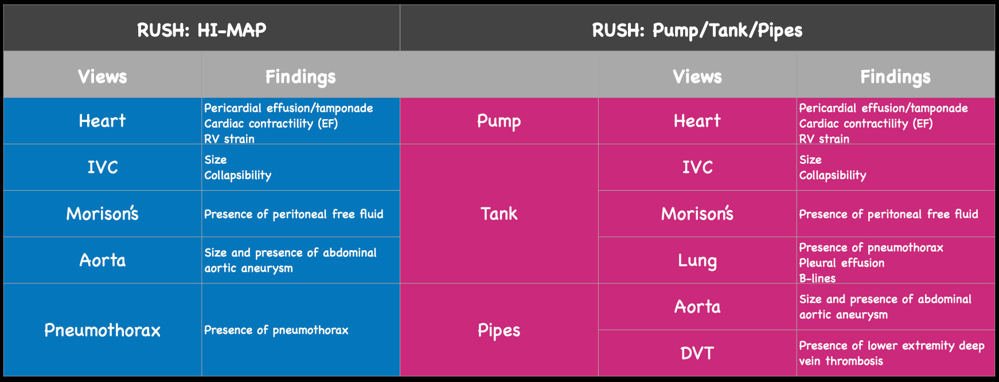
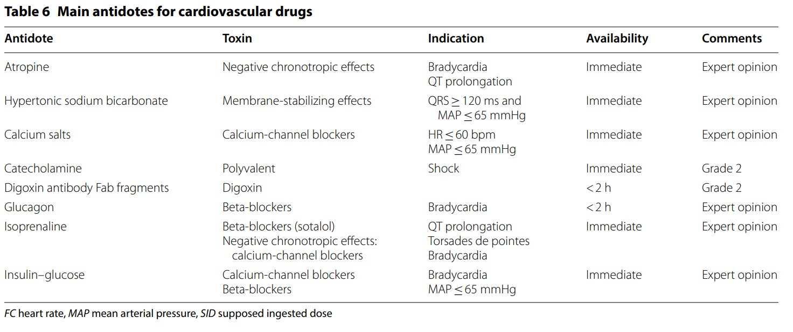
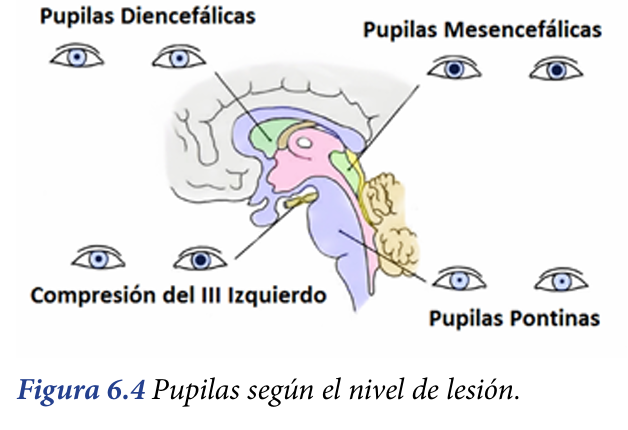

# Manejo de Vía aerea

Fármacos para inducción:

| Medicamento | Mecanismo | Dosis | inicio | duración | Pros | Contras |
| ----------- | --- | ---- | --------------- | --- | ---- | ------- |
| Etomidato | potencia receptor GABA |0.3 mg/kg | 15 s | 3 a 12 min | sin fx HDN, reduce flujo y metabolismo cerebral | inhibe la síntesis de cortisol, no usar en sepsis ni px con insuf renal relativa (puede necesitar dosis inicial de GC). Neuroexitabilidad |
| Ketamina | potencia GABA y agonista OP | 1.5 - 2 mg/kg | 45 a 60 s | 10 a 20 min | Estimula secreción catecol, broncodilat, analgesia disociativa (sin depresión centro respi) | Por más catecolaminas, no utilizar en alteración cardio porque aumenta consumo de O2, terrores al despertar, alucinaciones, hipertensión y taquicardia (por aumento de catecolaminas, si ya están agotadas por sepsis u otros, da hipoT y bradicard), ↑ secreciones |
| Propofol | agonista GABA | 1.5 - 3 mg/kg | 15 a 45 s | 5 a 10 min | Broncodilat, dismuye metabolismo cerebral, ANTICONVULSIVANTE | ↓ presión arterial (hasta 10 mmHg de PAM) |
| Midazolam | aumenta frecuencia apertura GABA | 0.1 - **0.3** mg/kg | 30 a 60 s | 15 a 30 min | ANTICONVULSIVANTE, pero se usa como último recurso | Hipotensión |

Para persona de 70 kg:

- Etomidato: 2 mg/ml, dosis de 0.3 mg/kg (0.15 ml/kg) -> 21 mg = 10.5 ml 
- Ketamina: 50 mg/ml, dosis de 1.5 mg/kg (0.03 ml/kg) -> 105 mg = 2.1 ml
- Propofol: 10 mg/ml, dosis de 1.5 mg/kg (0.15 ml/kg) -> 105 mg = 10.5 ml
- Midazolam: 5 mg/ml, dosis de 0.3 mg/kg (0.06 ml/kg) -> 21 mg = 4.2 ml

Qué fco escoger en cada contexto y por qué?

| Contexto | Fármaco recomendado | NO usar |
| -------- | ------- | ------- |
| Patología intracraneal (TEC/HTIC) |  <li> Etomidato: disminuye flujo y metabolismo cerebral <li> **Ketamina**: <li> Premed con fenranilo: para disminuir activación simpática y aumentar PIC |  Propofol y Midazolam: hipotensión y disminución perfusión cerebral| 
| Status convulsivo | <li> Propofol <li> Midazolam <li> Etomidato con manejo anticonvulsivante | ketamina |
| Vía aerea reactiva | <li> Ketamina <li> Propofol <li> Premedicar: B2 agonistas (si hay tiempo) o lidocaína iv | |
| Enf cardiovascular | <li> Etomidato: sin efecto HDN <li> Premedicar con fenranilo: para disminuir activación simpática | Ketamina: aumenta consumo de O2 |
| Shock | <li> Ketamina: mejora perfusión y PAM por aumento de catecolaminas <li> Premedicar con Alfa adrenergicos: para aumentar PAM | Propofol: disminuye PAM. Ojo etomidato si hay insuf renal (sospechar en shock refractario) |
| Intubación "despierta"/demorada | <li> Ketamina: no depresión centro respiratorio | |

Ojo ketamina da harta taquicardia

Midazolam es lo más disponible fuera de los hospitales. Sin embargo, su dosis es super errática y su efecto es muy variable. 

Fármacos para bloqueo neuromuscular:

| Medicamento | Mecanismo | Dosis | inicio | duración | Pros | Contras |
| ----------- | ---- | ---- | --------------- | --- | ---- | ------- |
| Succinilcolina | despolarizante | 1.5 mg/kg | 45 a 60 s | 5 a 10 min | Rápido inicio y corta duración | Sin reversor, Hiperkalemia, rabdomiolisis, fasciculaciones, hipertermia maligna, bradicardia (por estimulación muscarínica) |
| Rocuronio | no despolarizante (sitio alostérico) | 1.2 mg/kg (en secuencia de intubación rápida, porque en intubación en pabellón se usa la mitad o menos, para que dure menos tiempo) | 45 a 60 s | 30 a 60 min | Reversor neostigmina pero se necesitaría mucho y ¿gabaex?, No hiperkalemia, no fasciculaciones, no hipertermia maligna |  |

para persona de 70 kg:
- succinilcolina: 50 mg/ml, dosis de 1.5 mg/kg (0.03 ml/kg) -> 105 mg = 2.1 ml
- rocuronio: 10 mg/ml, dosis de 1.2 mg/kg (0.12 ml/kg) -> 84 mg = 8.4 ml

Cuando no usar succinilcolina:
- hiperkalemia
- quemados
- politraumatizados
- parálisis prolongada
- miopatías

Por duración y tiempo de inicio se puede elegir. Si va a ser difícil: succinilcolina, porque si me equivoco, dejará de hacer efecto en 5 a 10 minutos y se puede continuar ventilando con mascarilla con reservorio o ambú. Si no, rocuronio, porque se puede estar intentando varias veces con plan A, B, C, etc. 

Post intubación:

1. Fijar tubo
2. Continuar sedoanalgesia: 
    - Fentanilo: 0.5-2 mcg/kg/h
    - Midazolam: 0.015-0.06 mg/kg/h
    - ketamina: 0.1-0.5 mg/min
    - evitar propofol por síndrome de infusión de propofol (acidosis metabólica), no usar etomidato por insuficiencia suprarrenal, no usar barbitúricos por vida media de contexto
3. tomar Rx Tx para descartar cmplx
4. manejo patologías concoomintantes

Complicaciones intubación:
- disfonía
- lesión traumática de vía aérea
- intubación esofágica
- aspiración
- broncoespasmo
- barotrauma (neumotórax e hipotensión)
- estenosis traqueal (en adultos si dura más de 48 horas)

# Drogas vasoactivas

Si hay evidencia de Shock Cardiogénico de preferencia usar Norepinefrina, menor mortalidad que Dopamina en este escenario (NEJM 2010; 362: 779-89).
Si Shock Anafiláctico: Adrenalina.
Si Shock Séptico con bajo Gasto Cardiaco y adecuada reanimación con volumen: Evaluar uso de Dobutamina como 1a opción.
Si Shock Obstructivo: Mejorar primero la causa, se sugieren vasopresores y evitar uso de inótropos.

¿Qué dosis? Norepinefrina desde 0,1 ug/kg/min, no hay una dosis tope descrita aunque se sabe que mayor a 0,3 ug/kg/min ya la mortalidad es tan alta como un 60% o más.

# Ecografía

[POCUS atlas](https://www.thepocusatlas.com/shock)

# TEC 
| Complicación | Hallazgos |
| --- | --- |
| fracturas craneales | herida contusa en región parietal izquierda |
| fractura base de craneo | otorragia, rinorragia, equimosis periorbitaria ("ojos de mapache"), hemotimpano, equimosis retroauricular (signo de Battle), déficit de pares craneales|
| contusión cerebral | alteración de conciencia, focalidad neurológica, convulsiones |
| hemorragia sub aracnoidea | cefalea, náuseas, vómitos, rigidez de nuca, fotofobia, alteración de conciencia |
| hematoma epidural (extradural) | cefalea, náuseas, vómitos, alteración de conciencia, focalidad neurológica, convulsiones |
| hematoma subdural | cefalea, náuseas, vómitos, alteración de conciencia, focalidad neurológica, convulsiones |
| herniación | alteración de conciencia, focalidad neurológica, convulsiones, signos vitales alterados |
| lesiones penetrantes | herida en cuero cabelludo, herida en cara, herida en cuello, herida en tórax, herida en abdomen, herida en extremidades, herida en región perineal |

Signos de presión intracraneana elevada: asimetría pupilar, 
Triada de cushing: bradicardia, hipertensión arterial y respiración irregular. 

# Intoxicaciones
Antídotos para intoxicaciones específicas e indicaciones
.jpeg)

# Shock

ojo si shock refractario a FLUIDOS y DROGAS, sospechar insuficiencia suprarrenal.

The 5 S’s of adrenal crisis treatment are:
- Salt (0.9% saline), 
- Sugar (50% dextrose), 
- Steroids (100 mg hydrocortisone IV once, then 200 mg over 24 hours), 
- Support (normal saline to correct hypotension and electrolyte abnormalities), and
- Search (for the underlying disorder).

# Examen paciente con compromiso de conciencia

# Pupilas

